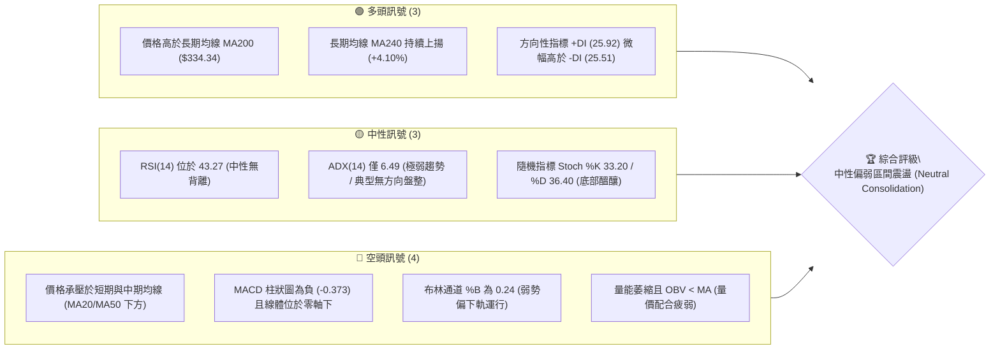
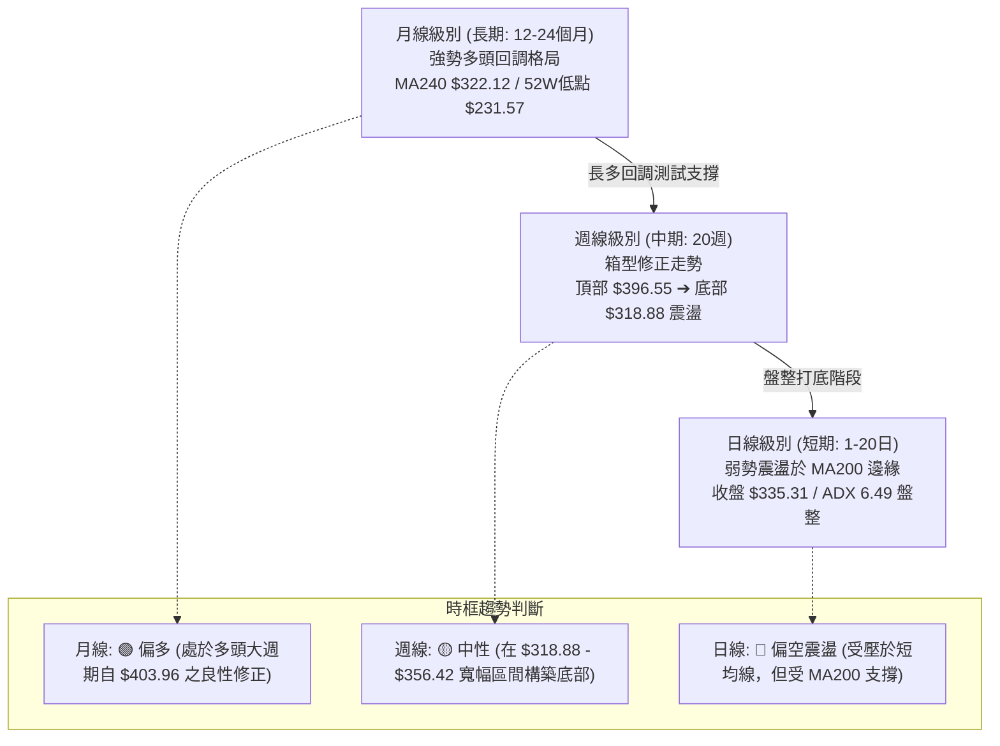
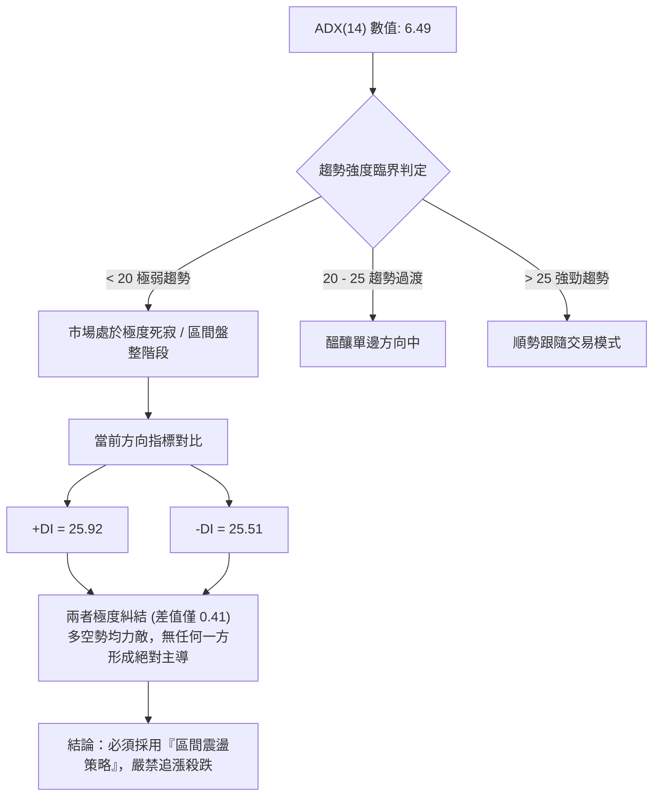
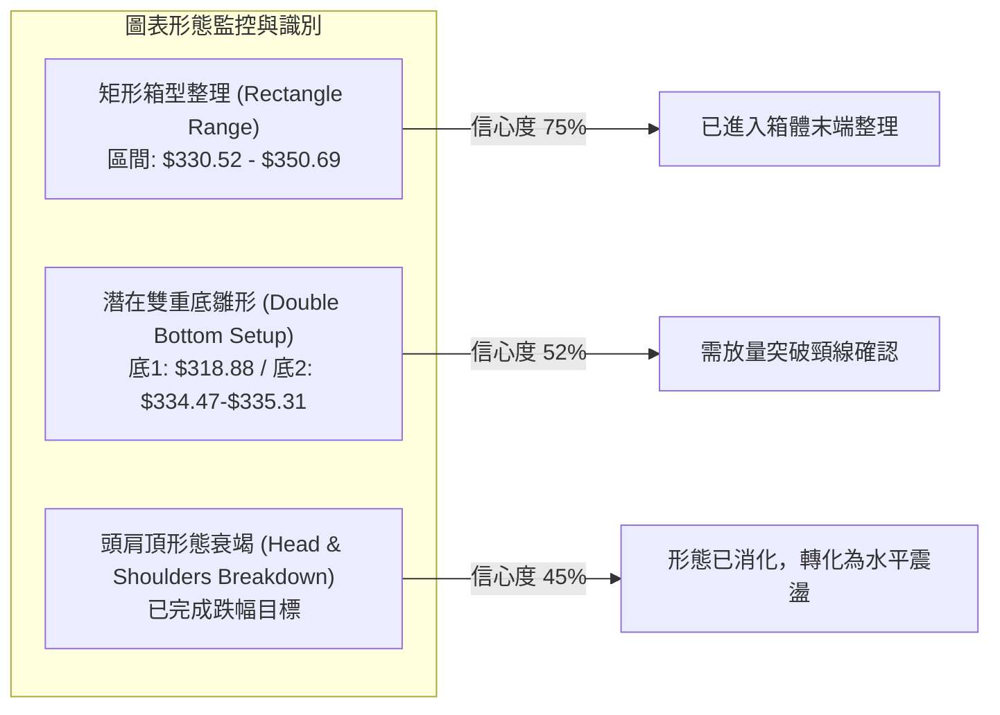
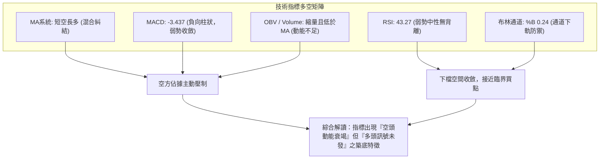
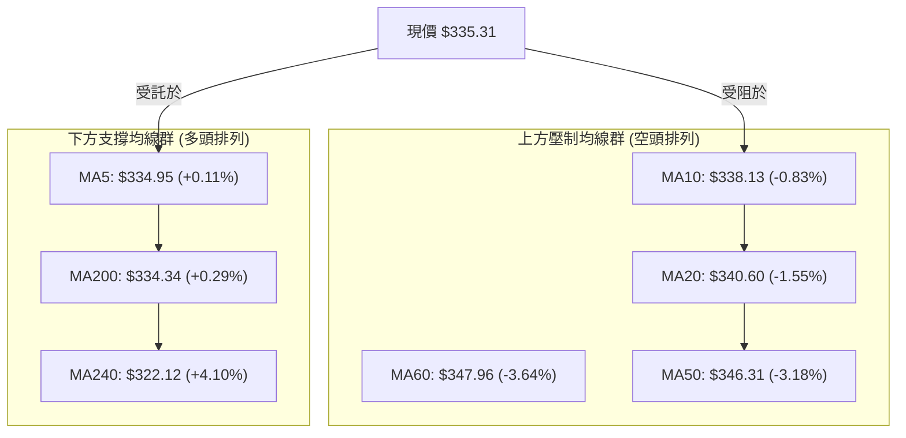
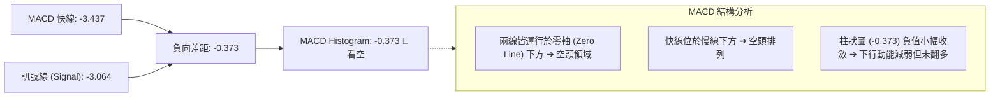
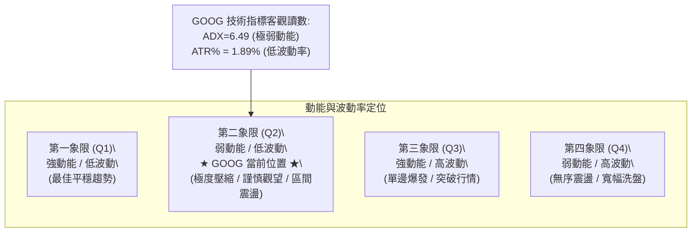
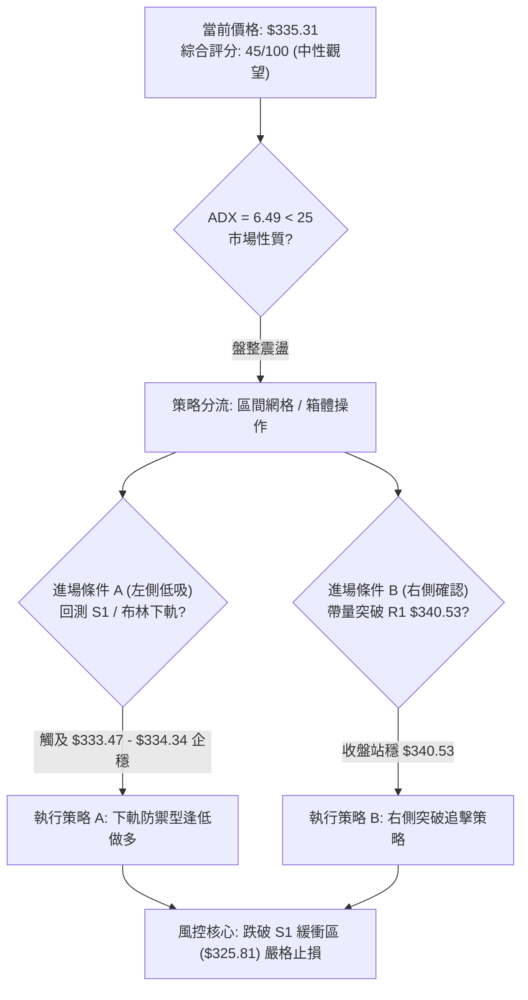
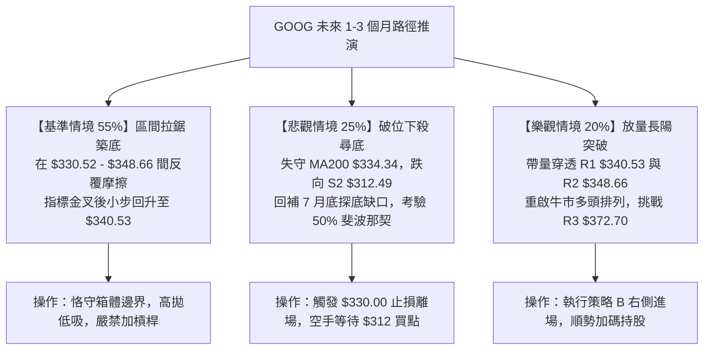

# GOOG 技術分析報告

> **報告日期**：2026-09-08 ｜ **語言**：繁體中文 ｜ **數據來源**：Yahoo Finance ｜ **當前價格**：$335.31

---

## 目錄

| 章節 | 內容 |
|------|------|
| [1. 技術面概覽](#1-技術面概覽) | 訊號儀表板、核心指標、評分卡 |
| [2. 趨勢分析](#2-趨勢分析) | 多時框趨勢、長中短期走勢 |
| [3. 圖表形態分析](#3-圖表形態分析) | 形態識別、K線組合、目標價 |
| [4. 支撐與阻力](#4-支撐與阻力) | 關鍵價位、斐波那契回調 |
| [5. 技術指標深度解讀](#5-技術指標深度解讀) | MA/RSI/MACD/布林/成交量 |
| [6. 動能與波動率](#6-動能與波動率) | 動能評估、ATR、Beta |
| [7. 多時框架總結](#7-多時框架總結) | 時框架評分矩陣 |
| [8. 交易策略建議](#8-交易策略建議) | 多空策略、風險報酬比 |
| [9. 風險提示與監控](#9-風險提示與監控) | 監控指標、風險場景 |

---

## 1. 技術面概覽

### 🎯 技術訊號儀表板



### 📊 核心指標速覽表

| 指標類別 | 指標名稱 | 當前數值 | 訊號 | 解讀 |
|----------|----------|----------|------|------|
| **價格** | 當前收盤價 | $335.31 | 🟡 | 位於52週區間60.2%分位，處於波段回調後的沉澱期 |
| **均線** | MA20 (短) | $340.60 | 🔴 | 現價低於MA20 (-1.55%)，短期呈空頭壓制 |
| **均線** | MA50 (中) | $346.31 | 🔴 | 現價低於MA50 (-3.18%)，中期結構處於修正週期 |
| **均線** | MA200 (長) | $334.34 | 🟢 | 現價緊貼並守於MA200之上 (+0.29%)，長線牛熊分水嶺未破 |
| **均線** | MA240 (年) | $322.12 | 🟢 | 均線向上傾斜 (+4.10%)，提供深層宏觀防禦屏障 |
| **動能** | RSI(14) | 43.27 | 🟡 | 處於40–50中性弱勢區，無超買或超賣，未見背離 |
| **動能** | MACD (12,26,9) | -3.437 / -3.064 | 🔴 | MACD位於零軸下死叉發散，Hist為 -0.373，空方佔優 |
| **動能** | Stoch %K / %D | 33.20 / 36.40 | 🟡 | 震盪指標中性偏低，尚未形成有效黃金交叉 |
| **趨勢** | ADX(14) | 6.49 | 🟡 | ADX < 25極低水位，代表單邊趨勢竭盡，進入無方向洗盤 |
| **通道** | 布林帶 %B | 0.24 | 🔴 | 運行於中軌($340.60)與下軌($330.52)之間，測試下軌支撐 |
| **成交量** | 量比 (vs 20MA) | 0.84x (12.68M) | 🔴 | 交易量明顯低於20日均量與50日均量，追價買盤匱乏 |
| **量能** | OBV 趨勢 | OBV < MA | 🔴 | 能量潮低於其移動平均線，資金呈流出沉澱狀態 |
| **波動** | ATR(14) | $6.33 (1.89%) | 🟢 | 波動率逐步收斂，市場進入壓縮整理末端 |

### 🏆 技術評分卡

```
╔══════════════════════════════════════════════════════════════════╗
║              技術評分卡 — GOOG (2026-09-08)                      ║
╠══════════════════════════════════════════════════════════════════╣
║ 趨勢強度 (ADX=6.49)      ████░░░░░░░░░░░░░░░░  20/100  🔴 極弱趨勢 ║
║ 動能指標 (RSI/MACD)      ████████░░░░░░░░░░░░  40/100  🔴 動能偏空 ║
║ 支撐穩定度 (MA200/S1)    ██████████████░░░░░░  70/100  🟢 核心支撐 ║
║ 成交量配合 (OBV/Vol)     ██████░░░░░░░░░░░░░░  30/100  🔴 量能潰乏 ║
║ 形態完整度 (箱型/雙底)   ████████████░░░░░░░░  60/100  🟡 整理構築 ║
║ 均線排列 (短空長多)      ██████████░░░░░░░░░░  50/100  🟡 混合糾結 ║
╠══════════════════════════════════════════════════════════════════╣
║ 綜合評分                 █████████░░░░░░░░░░░  45/100  🟡 中性觀望 ║
║ 核心評級結論             區間底部震盪盤整，嚴格依托下軌操作      ║
╚══════════════════════════════════════════════════════════════════╝
```

---

## 2. 趨勢分析

### 🌐 多時框趨勢分析



### 📈 長期趨勢 — 12個月走勢圖（Unicode）

過去 12 個月（2025-09 至 2026-09）GOOG 經歷了強烈的單邊主升浪，隨後在 2026 年春季創出波段歷史高點，其後展開中級震盪整理回調：

```
GOOG 月線走勢圖（過去12個月：2025-09 至 2026-09）
價格 ($)
$400 ┤                                  ● $381.46 (04月波段峰值)
$380 ┤                                  │  ● $375.96
$360 ┤                                  │  │  ● $353.10  ● $356.42
$340 ┤                    ● $337.87     │  │  │        │  ● $335.19 ● $335.31(現價)
$320 ┤              ● $319.29 │  ● $310.82    │  │        │  │        │
$300 ┤        ● $281.09       │  │        │  │        │  │        │
$280 ┤        │     │  ● $313.19 │  ● $286.50 │        │  │        │
$260 ┤        │     │  │        │  │  │        │  │        │  │        │
$240 ┤  ● $242.92   │  │        │  │  │        │  │        │  │        │
$220 ┤  │     │     │  │        │  │  │        │  │        │  │        │
     └─────┬─────┬─────┬─────┬─────┬─────┬─────┬─────┬─────┬─────┬─────┬─────┬─────
         09/25 10/25 11/25 12/25 01/26 02/26 03/26 04/26 05/26 06/26 07/26 08/26 09/26
```

#### 走勢特徵分析表格

| 階段區間 | 時間跨度 | 起訖價位 | 漲跌幅 | 主要走勢特徵與量價結構 |
|----------|----------|----------|--------|------------------------|
| **第 I 階段：秋季單邊爆發** | 2025-09 → 2025-11 | $242.92 → $319.29 | +31.44% | 突破加速段，動能強勁，均線全數呈多頭擴散排列 |
| **第 II 階段：冬季高位洗盤** | 2025-12 → 2026-03 | $313.19 → $286.50 | -8.52% | 劇烈震盪洗盤，03月觸及波段次低點 $286.50 進行浮額清洗 |
| **第 III 階段：春季主升衝頂** | 2026-03 → 2026-04 | $286.50 → $381.46 | +33.14% | 暴力拉升創下 52 週高點 $403.96（4/5月），RSI 週線飆升至 88.0 極度超買 |
| **第 IV 階段：夏季降溫回調** | 2026-05 → 2026-07 | $375.96 → $318.88 | -15.18% | 週線 MACD 柱翻負，籌碼獲利了結，07-26 週跌至 $318.88 低點完成技術修正 |
| **第 V 階段：初秋收斂盤整** | 2026-08 → 2026-09 | $356.42 → $335.31 | -5.92% | 動能衰減，進入波段收斂三角形/箱型，價格回測 MA200 尋求防禦支撐 |

### 📊 中期趨勢（週線分析）

從近 20 週收盤走勢可見，GOOG 自 2026-05-10 創下週收盤高點 $396.55（當週 RSI 達 88.0）後，走出完整的降溫回撤浪。

```
中期週線關鍵多空防線分佈示意圖：
[阻力 3] $372.70 ═════════════════════════════════ (中期重大頸線阻力 / 6月反彈高點)
                     ▲
                     │ (修復空間 +11.15%)
[阻力 2] $348.66 ───────────────────────────────── (MA50 $346.31 疊加區域 / 密集籌碼套牢區)
[阻力 1] $340.53 ┄┄┄┄┄┄┄┄┄┄┄┄┄┄┄┄┄┄┄┄┄┄┄┄┄┄┄┄┄┄┄ (MA20 $340.60 壓制點 / 短線反彈第一關)
==================== 現價: $335.31 ====================
[支撐 1] $333.47 ┄┄┄┄┄┄┄┄┄┄┄┄┄┄┄┄┄┄┄┄┄┄┄┄┄┄┄┄┄┄┄ (波段低點聚類 / 緊扣 MA200 $334.34)
[支撐 2] $312.49 ───────────────────────────────── (7月前波低點聚類 / 50% 斐波那契 $317.77)
                     │ (下行風險 -6.81%)
                     ▼
[支撐 3] $295.58 ═════════════════════════════════ (61.8% 斐波那契 $297.42 強力防禦線)
```

### ⚡ 趨勢強度評估（ADX 解讀）



#### ADX 趨勢強度對照解讀表

| ADX 數值區間 | 市場狀態解讀 | GOOG 當前狀態匹配 | 操作策略指導原則 |
|--------------|--------------|-------------------|------------------|
| **0 – 15** | **無趨勢 / 橫盤沉寂** | **★ 6.49（完全符合）** | **禁止趨勢突破單，採用布林通道上下軌高拋低吸** |
| **15 – 25** | 弱趨勢 / 蓄勢醞釀 | 偏離 | 觀望指標背離，等待動能指標突破 |
| **25 – 40** | 明確單邊趨勢形成 | 偏離 | 順應 MA20/MA50 方向進行波段持倉 |
| **40 以上** | 極強單邊 / 進入尾聲 | 偏離 | 警惕趨勢衰竭，分批了結獲利 |

---

## 3. 圖表形態分析

### 🔍 形態識別系統



#### 形態識別信心度與目標價計算表

根據規則 15，嚴格審核幾何形態，數據不足者絕不強行定義：

| 形態名稱 | 信心度 | 判斷依據（嚴格引用數據） | 完成度 | 頸線價位 | 形態高度 | 目標價（附嚴格計算式） |
|----------|--------|--------------------------|--------|----------|----------|------------------------|
| **水平箱型整理** | **75%** | 價格受限於布林帶下軌 $330.52 與中軌 $340.60，近期低點群聚於 S1 $333.47，高點受阻於 R1 $340.53 | 85% | $340.53 | $7.06 ($340.53 - $333.47) | **突破向上目標**：頸線 $340.53 + 高度 $7.06 = **$347.59**（逼近 R2 $348.66） |
| **潛在雙重底 (W底)** | **52%** | 第一次波段低點為 2026-07-26 週低 $318.88，第二次回測低點為 2026-06-28 週之 $334.47 與現價 $335.31 (S1 $333.47)，兩底不破 | 45% (頸線未過) | $356.42 (2026-08-02反彈高點) | $37.54 ($356.42 - $318.88) | **底型確立目標**：頸線 $356.42 + 高度 $37.54 = **$393.96**（逼近前期歷史高位聚類） |
| **複雜頂部頭肩形** | **35%** | 訊號不足，僅做指標型解讀。自 $403.96 跌破後，已於 $318.88 獲得支撐，原頭肩壓力已在 7-8 月震盪中充分消化。 | 已失效 | 無 | 無 | 不適用（信心度 < 50%，依規定不作測幅推算） |

### 🕯️ 重要K線形態分析

| 週/月份週期 | 收盤價 | K線形態特徵 | 量價關係解讀 | 技術訊號 |
|-------------|--------|-------------|--------------|----------|
| **2026-05 (月線)** | $375.96 | 帶長上影線之避雷針陰線 | 歷史天價 $403.96 處遭遇極端拋壓，多頭力竭 | 🔴 頂部強烈預警 |
| **2026-06-28 (週線)** | $334.47 | 爆量長陰洗盤線 (週量 188.1M) | 恐慌性殺跌湧現，成交量創近期天量，為典型籌碼換手低點 | 🟡 恐慌盤宣洩完畢 |
| **2026-07-26 (週線)** | $318.88 | 長下影探底十字星 (Hammer) | 探底 50% 斐波那契位 ($317.77)，多方買盤強烈介入抵抗 | 🟢 觸底反彈確認 |
| **2026-08-02 (週線)** | $356.42 | 大陽線實體包覆 | 週漲幅顯著，MACD 週線柱狀圖轉正 (+0.562)，確認反彈波 | 🟢 短線多頭反撲 |
| **2026-08-23 至 09-06** | $335.31 | 連續三週窄幅小陰小陽十字星 | 成交量極度萎縮至 78.0M，波動率受限，形成橫向壓縮「孕線群」 | 🟡 變盤前夕蓄勢 |

### 📉 ASCII 走勢形態示意圖

```
GOOG 關鍵箱型整理與雙底頸線結構圖 (2026-06 至 2026-09)
價格 ($)
$360 ┤               [反彈高點] $356.42 (雙底潛在頸線)
     │                 /\
$350 ┤                /  \        [BB 上軌: $350.69]
     │   /\          /    \
$340 ┤--/--\--------/------\----●--[箱體上沿 / MA20 / R1: $340.53]--
     │ /    \      /        \  / 
$335 ┤/      \    /          \/ ◄── 現價: $335.31 (受壓於箱體中軸)
$330 ┤        \  /           [BB 下軌: $330.52 / S1: $333.47 支撐]
     │         \/ $334.47
$320 ┤          \
     │           \  [波段實體低點]
$310 ┤            \/ $318.88 (底 1)
     └─────────────────────────────────────────────────────────────
```

---

## 4. 支撐與阻力

### 🗺️ 關鍵價位分布圖（Unicode）

```
GOOG 價位結構分布圖 (Resistance & Support Cluster)
══════════════════════════════════════════════════════════════════
$372.70 ║████████████████████████████████║ 強阻力 R3 (近一年密集套牢頸線)
$348.66 ║████████████████████            ║ 中期阻力 R2 (MA50 $346.31 匯聚區)
$340.53 ║████████████████████████        ║ 關鍵阻力 R1 (MA20 $340.60 壓制)
════════╬════════════════════════════════╬═════════════════════════
$335.31 ╠════════════════════════════════╣ ◄ 當前收盤價 ($335.31)
════════╬════════════════════════════════╬═════════════════════════
$333.47 ║▓▓▓▓▓▓▓▓▓▓▓▓▓▓▓▓▓▓▓▓▓▓▓▓▓▓▓▓▓▓▓▓║ 近期核心支撐 S1 (MA200 $334.34 匯聚)
$312.49 ║████████████████████████        ║ 強支撐 S2 (波段深次回調低點聚類)
$295.58 ║████████████████████████████████║ 戰略防禦 S3 (61.8% 斐波那契 $297.42)
══════════════════════════════════════════════════════════════════
```

### 🚧 阻力位分析表

所有價位均嚴格取自波段高點與均線聚類數據：

| 阻力級別 | 精確價位 | 距現價幅 | 形成原因與技術共振 | 突破難度 | 戰略重要性 |
|----------|----------|----------|--------------------|----------|------------|
| **R1** | **$340.53** | +1.56% | 近期多次日線反彈高點；與 20 日均線 MA20 ($340.60) 及布林中軌完全重疊 | 🟡 中等 | **極高**。日線級別多空轉換第一道閥門，站穩方能擺脫短線下行通道。 |
| **R2** | **$348.66** | +3.98% | 波段反彈次高點聚類；上方緊貼 50 日均線 MA50 ($346.31) 與 60 日均線 ($347.96) | 🔴 偏難 | **高**。中期空頭防禦陣地，此處聚集大量套牢盤，需 1.5 倍以上放量方可攻克。 |
| **R3** | **$372.70** | +11.15%| 2026 年 5-6 月多次震盪之箱體下沿轉阻力位，中期趨勢分水嶺 | 🔴 極難 | **戰略級**。多頭全面重啟牛市的關鍵樞紐，突破代表中期調整徹底終結。 |

### 🛡️ 支撐位分析表

所有價位均嚴格取自波段低點與均線聚類數據：

| 支撐級別 | 精確價位 | 距現價幅 | 形成原因與技術共振 | 守住機率 | 戰略重要性 |
|----------|----------|----------|--------------------|----------|------------|
| **S1** | **$333.47** | -0.55% | 近一年波段低點聚類；與長期牛熊分水嶺 200 日均線 MA200 ($334.34) 重疊共振 | 🟢 70% | **生命線**。當前多方最後也是最重要的護城河，失守將引發程序化止損賣盤。 |
| **S2** | **$312.49** | -6.81% | 2026 年 7 月下旬快速探底之波段低點聚類；緊鄰 50% 斐波那契位 ($317.77) | 🟢 85% | **極高**。中期結構性深層支撐，具備強大籌碼沉澱與長線買盤承接力。 |
| **S3** | **$295.58** | -11.85%| 近一年多頭起漲點聚類；精確契合黃金分割 61.8% ($297.42) 防禦帶 | 🟢 95% | **極致底線**。長期宏觀多頭結構之生死防線，跌破則宣告長期牛市反轉。 |

### 📐 斐波那契回調位分析

依據 52 週完整波動區間（低點 $231.57 → 高點 $403.96，落差 $172.39）精確回調階梯：

```
0.0%  (52W High)  ──────────────────────────────── $403.96
23.6% 回調位      ──────────────────────────────── $363.28 (前次回調支撐，現轉為上方強阻)
38.2% 回調位      ──────────────────────────────── $338.11 ◄── 現價 $335.31 處於其正下方
                                                         (多空爭奪之核心微幅壓力區)
50.0% 回調位      ──────────────────────────────── $317.77 (強烈心理與數學共振平衡點)
61.8% 黃金分割位  ──────────────────────────────── $297.42 (宏觀絕對防禦線)
78.6% 回調位      ──────────────────────────────── $268.46 (極端超跌支撐)
100.0% (52W Low)  ──────────────────────────────── $231.57 (年度起漲點)
```

**深入解讀**：
當前收盤價 **$335.31** 正好夾在 **38.2% 回調位 ($338.11)** 與 **50.0% 回調位 ($317.77)** 之間。在技術分析典範中，強勢回調通常在 38.2% 處獲得支撐並重啟漲勢；現價跌破 $338.11 後在此反覆盤磨（目前僅差距 -0.83%），顯示空方力量雖未全面擊潰多方，但多方亦缺乏將價格推回 38.2% 之上的增量動能。此位置屬於典型的「平衡破壞前的拉鋸期」。

---

## 5. 技術指標深度解讀

### 🎛️ 指標訊號總覽



### 📈 移動平均線排列分析



#### 均線數據與走勢解析表

| 均線名稱 | 數值 | 距現價差距 | 方向斜率 | 微型走勢特徵 | 技術涵義解讀 |
|----------|------|------------|----------|--------------|--------------|
| **MA 5** | $334.95 | +0.11% | ▲ 微幅走平 | ▁▁▃▅▆██▆▅▄▃ | 超短線微幅企穩，現價重回 5 日線之上 |
| **MA 10**| $338.13 | -0.83% | ▼ 下行走跌 | ▄▃▁▅▆██▇▄▃▂ | 短線第一道動態阻力，壓制反彈節奏 |
| **MA 20**| $340.60 | -1.55% | ▼ 下行扣高 | ██▇▆▇▇▇▅▄▅▇▃ | 短期生命線持續向下施壓，未突破前短線偏空 |
| **MA 50**| $346.31 | -3.18% | ▼ 下行走緩 | (中期均線) | 中期趨勢呈下傾空頭壓制，反映夏季以來的回調壓力 |
| **MA 60**| $347.96 | -3.64% | ▼ 下行發散 | ███▇▆▅▄▃▂▁▁ | 季線阻力沉重，與 R2 $348.66 形成雙重阻力牆 |
| **MA120**| $346.83 | -3.32% | ▼ 下行扣抵 | ▁▂▃▄▅▆▇████ | 半年線開始走平下彎，中期均線糾結於 $346-$348 區間 |
| **MA200**| $334.34 | +0.29% | ▲ 穩健向上 | (牛熊分界線) | **核心支撐**：現價嚴格守於其上，長線多頭基底未壞 |
| **MA240**| $322.12 | +4.10% | ▲ 強勁上揚 | ▁▂▃▄▅▆▇████ | 年線具備實質買盤托底效果，構成堅固安全墊 |

### 📉 RSI(14) 分析

當前 RSI(14) 數值為 **43.27**。

```
RSI(14) 當前強度指針：
0 ──────────── 30 ───────────── 43.27 ────── 50 ───────────── 70 ──────────── 100
[  極度超賣區  ] [   弱勢弱動能區   ▲    ]   [    多頭強勢區   ] [  極度超買區  ]
                  ███████████████░░░░░░░░░░
```

- **背離判斷**：
  - **頂背離**：無。前期 2026-05 週線 RSI 達 88.0 後隨價格回調同步降溫，並非頂背離衰竭，而是標準的多頭超買修正。
  - **底背離**：無明顯底背離。2026-08-23 收盤 $341.53 時 RSI 曾驟降至 20.6，隨後現價 $335.31 時 RSI 回升至 43.27；雖然價格低點下移而 RSI 未破前低，但因 ADX 僅 6.49，屬於無趨勢狀態下的擺動修復，**無法確立為有效波段底背離**。結論：動能維持中性偏弱震盪。

### 📊 MACD(12/26/9) 訊號解讀



MACD 當前數值反映自 2026 年 8 月中旬以來的死叉仍在發酵。然而，負柱狀體（-0.373）相較於 6-7 月份的大幅放量（當時達到 -3.6 至 -4.9）已極度收斂，顯示空方動能已至強弩之末，正在等待一根中陽線觸發金叉。

### 📦 布林通道分析

當前布林帶（20, 2）參數結構如下：
- **布林上軌 (Upper Band)**：$350.69
- **布林中軌 (Middle Band / MA20)**：$340.60
- **布林下軌 (Lower Band)**：$330.52
- **帶寬極限**：$20.17（帶寬百分比僅 5.92%，呈現極度擠壓 Squeeze）
- **%B 指標**：0.24（落於 0.0 與 0.5 之間，偏向下軌運行）

```
GOOG 日線布林通道當前運行態勢
價格 ($)
$355 ┤
$350 ┤-------------------------------------- BB 上軌: $350.69
$345 ┤
$340 ┤- - - - - - - - - - - - - - - - - - -  BB 中軌 (MA20): $340.60
$335 ┤                      ● 現價: $335.31 (%B = 0.24)
$330 ┤══════════════════════════════════════ BB 下軌: $330.52
$325 ┤
     └──────────────────────────────────────
```

**布林通道解讀**：
%B 為 0.24，表示現價位於中軌與下軌之間的下 1/4 區域。帶寬壓縮至 $20.17 的極窄水平，歷史經驗表明，當布林帶寬極度收窄且 ADX < 10 時，市場即將迎來「波動率爆發（Volatility Breakout）」。下軌 $330.52 與支撐 S1 $333.47 構築了第一道買盤緩衝區。

### 💹 成交量分析（量價配合度）

- **成交量數據**：最新單日成交量為 **12,676,800 股**。
- **均量對比**：
  - 20 日均量：**15,149,400 股**（量比僅 **0.84x**，明顯縮量）
  - 50 日均量：**19,562,580 股**（大幅萎縮 -35.2%）
- **OBV 趨勢**：數據顯示 `OBV < MA`，能量潮指標落後於其移動平均線，表明自 8 月反彈以來，主動性吸籌資金規模有限，成交量持續向空方或觀望方傾斜。
- **量價配合結論**：典型的「下跌縮量、反彈無量」特徵。量能萎縮阻礙了向上突破阻力位 R1 ($340.53) 的能力，但同時也暗示空方無意在此價位大舉砸盤，籌碼呈現沉澱鎖定狀態。

---

## 6. 動能與波動率

### ⚡ 動能評估四象限



#### 動能與波動象限分析表

| 象限標籤 | 動能狀態 | 波動率狀態 | 當前匹配 | 市場心理與戰略評估 |
|----------|----------|------------|----------|--------------------|
| **Q1** | 強 (ADX>25) | 低 (ATR%<2%) | — | 穩步單邊推升，機構持續吸籌建倉的最佳環境 |
| **Q2** | **弱 (ADX<25)** | **低 (ATR%<2%)** | **✓ (當前)** | **暴風雨前的寧靜。多空膠著於 MA200，交投清淡，等待外部催化劑打破平衡** |
| **Q3** | 強 (ADX>25) | 高 (ATR%>3%) | — | 主升浪或主跌浪，單邊快速擴展，適合追隨突破 |
| **Q4** | 弱 (ADX<25) | 高 (ATR%>3%) | — | 擴散三角形或無序洗盤，極易引發多空雙巴 |

### 📊 ATR 波動率分析

- **ATR(14) 數值**：**$6.33**
- **ATR 佔比 (ATR % of Price)**：**1.89%**（低於科技巨頭平均之 2.5% 水位，顯示波動壓縮）
- **止損與交易區間量化標準**：
  - **日間正常雜訊範圍**：$6.33
  - **保守止損緩衝 (1.5x ATR)**：$6.33 × 1.5 = **$9.50**
  - **波段安全止損緩衝 (2.0x ATR)**：$6.33 × 2.0 = **$12.66**
  - **當前操作涵義**：現價 $335.31 距支撐 S1 ($333.47) 僅 $1.84 (0.29x ATR)，此距離小於日常雜訊，意味著任何單純以 S1 為緊密止損的交易極易被隨機噪音掃出場，止損位必須向下延伸至 $335.31 - 1.5x ATR = $325.81，或嚴格參考 S2 ($312.49) 結構防禦。

### 📐 Beta 與市場相關性

- **Beta 係數**：**1.225**
- **解讀**：GOOG 相較於 S&P 500 指數具備 22.5% 的超額波動性。當前大盤若出現系統性單邊波動，GOOG 的反應幅度將放大；但在個股 ADX 僅 6.49 的情況下，高 Beta 意味著其容易受到大盤指數期貨盤中波動的被動牽引，而非走出獨立行情。

---

## 7. 多時框架總結

### 📋 時框架評分表

| 時框架 | 趨勢方向 | 動能指標 | 均線排列狀況 | 形態特徵 | 綜合評分 | 操作指導建議 |
|--------|----------|----------|--------------|----------|----------|--------------|
| **月線 (長期)** | 🟢 多頭良性回調 | 🟡 RSI 偏高中性 | 🟢 完好多頭排列 (價格遠高於 MA240 $322.12) | 歷史高位下拉後之矩形整固 | **75 / 100** | 長線投資者逢低分批佈局 |
| **週線 (中期)** | 🟡 寬幅箱型震盪 | 🔴 MACD負向、RSI 43.3 | 🟡 均線糾結，跌破 MA20週但守 MA50週 | 潛在雙底或大型矩形整理 | **48 / 100** | 波段交易者區間內高拋低吸 |
| **日線 (短期)** | 🔴 弱勢收斂防禦 | 🔴 MACD零下弱勢死叉 | 🔴 短中期均線 (MA20/50) 空頭壓制 | 布林帶壓縮，回測 MA200 | **38 / 100** | 短線禁止追多，嚴守下軌買點 |

### 🔲 綜合訊號矩陣

```
時框訊號一致性評估：
短期 (日線)  ────► 🔴 偏空壓制 (受阻於 MA20 $340.60)
中期 (週線)  ────► 🟡 區間盤整 (受困於 $318.88 - $356.42)
長期 (月線)  ────► 🟢 多頭格局 (依托 MA240 $322.12 向上)

訊號衝突焦點：短期均線下壓 vs 長期均線托底
收斂裁決機制：嚴格啟動「規則 14」進行多時框降維收斂
```

### ⚖️ 多時框收斂結論

> **依據「嚴格要求 14」之收斂裁決**：
> 1. **行情性質判定**：當前 ADX(14) 為 **6.49**，遠低於 25 的趨勢臨界線，明確判定當前處於**「盤整行情（Consolidation / Range-bound Regime）」**，而非趨勢單邊行情。
> 2. **主導時框確立**：在盤整行情中，趨勢指標失效，**以日線布林通道上下軌 ($330.52 – $350.69) 與關鍵波段高低點 (S1 $333.47 / R1 $340.53) 為最主要交易區間依歸**。
> 3. **唯一方向性結論**：**【中性觀望，區間下軌防守性震盪操作】**。日線的短空訊號僅代表反彈受阻，並未引發崩跌破位；而長線多頭則為 S1/S2 提供了強大的底部承接預期。因此，策略嚴禁順勢追空，亦不可盲目重倉追多，唯一合理的技術途徑是在布林下軌及 S1 支撐帶尋找高風險報酬比的低吸機會。

---

## 8. 交易策略建議

### 🗺️ 策略決策流程圖



### 🧭 策略路由

**當前主策略方向 = 【中性觀望，布林通道下軌至中軌之區間逆向操作】（依據綜合評分 45/100，介於 40–60 之中性格局）。**
市場缺乏單邊動能，主策略以逢低吸納、到達中軌即獲利了結為主，禁止追高；若向上有效突破阻力位方可轉為右側波段。

### 🎯 價格情境階梯（Price Scenarios）

嚴格引用數據庫之真實數值：

| 觸發條件 | 第一目標價 (T1) | 後續延伸目標 (T2) | 停損與風控點位 | 情境技術含義 |
|----------|-----------------|-------------------|----------------|--------------|
| **向上突破 R1 $340.53** | **R2: $348.66** | **R3: $372.70** | 跌回 $338.11 止損 | 短線擺脫均線壓制，空頭回補，展開中級反彈波 |
| **維持現價區間震盪** | **MA20: $340.60** | **BB上軌: $350.69**| 跌破 $330.52 警惕 | 布林通道內無序波動，以時間換取空間進行籌碼換手 |
| **有效跌破 S1 $333.47** | **S2: $312.49** | **S3: $295.58** | 站回 $335.31 止損 | MA200 生命線失守，引發停損潮，下探 50% 斐波那契位 |

### 📊 情境機率分佈

| 運行情境 | 機率估算 | 核心技術指標與量價依據 |
|----------|----------|------------------------|
| **區間橫盤震盪 (330–345)** | **55%** | **ADX(14) 僅 6.49，+DI 與 -DI 糾結，布林帶極度收窄，成交量低迷 (0.84x)** |
| **向下破位探底 (測試S2)** | **25%** | **MACD 處於零軸下方死叉發散，均線系統呈短空格局，OBV 持續疲軟** |
| **向上放量突破 (挑戰R2)** | **20%** | **長期 MA200 托底有效，隨機指標超賣回升，分析師目標價均值達 $422.34** |

### 🟢 主策略詳情

根據中性評分路由，提供兩套符合嚴格風險報酬比之交易執行案：

| 策略要素 | 策略 A（主推：下軌支撐逢低吸納） | 策略 B（輔助：右側突破放量跟進） |
|----------|----------------------------------|----------------------------------|
| **策略類型** | 逆趨勢區間交易（左側防禦型） | 順勢突破確認交易（右側進攻型） |
| **進場條件** | 價格回踩 S1 與 MA200 區間且 15分K 出現長下影 | 日線收盤價明確站上 R1 阻力位且成交量 > 18M |
| **進場價格** | **$334.34** (精確錨定 MA200) | **$341.00** (突破 R1 $340.53 後之確認買點) |
| **目標價 T1** | **$340.53** (R1 / 布林中軌) | **$348.66** (R2 / MA50 阻力群聚區) |
| **目標價 T2** | **$348.66** (R2 阻力位) | **$372.70** (R3 強阻力位) |
| **止損價格** | **$330.00** (跌破布林下軌 $330.52 及 S1) | **$335.31** (跌回突破前之起漲整理平台) |
| **風險空間** | $4.34 ($334.34 - $330.00) | $5.69 ($341.00 - $335.31) |
| **報酬空間(T1)**| $6.19 ($340.53 - $334.34) | $7.66 ($348.66 - $341.00) |
| **報酬空間(T2)**| $14.32 ($348.66 - $334.34) | $31.70 ($372.70 - $341.00) |
| **風險報酬比** | **1 : 1.43 (至T1) / 1 : 3.30 (至T2)** | **1 : 1.35 (至T1) / 1 : 5.57 (至T2)** |
| **歷史勝率估算**| **60%** (受 ADX<25 與 MA200 托底支持) | **45%** (在低成交量環境下突破易假突破) |
| **建議倉位** | **總資金之 10% – 15%** (嚴格控制暴露) | **總資金之 8% – 10%** (確認放量後分批加碼)|

### 🔴 反向風險觸發點（對沖提示）

- **多頭轉空警戒線**：若日線連續兩日收盤價低於 **$330.52（布林下軌）**，且成交量顯著放大，宣告 S1 與 MA200 徹底淪陷。
- **對沖應對措施**：多頭持倉應即刻全數出清，激進型投資者可啟動空頭反向避險，下看第二支撐目標 **S2: $312.49**，反彈以 **$334.34（原 MA200 轉為之阻力）** 作為停損點。

### ⭐ 整體訊號強度評星

```
做多訊號強度：★★☆☆☆  (2.5 / 5 星 — 長均線托底，但缺乏催化動能)
做空訊號強度：★★☆☆☆  (2.5 / 5 星 — 短期壓制明顯，但面臨 MA200 強支撐)
整體可信度：  ★★★☆☆  (3.0 / 5 星 — 盤整震盪市場，指標訊號雜訊較多)
```

---

## 9. 風險提示與監控

### ✅ 關鍵監控指標 Checklist

```
╔══════════════════════════════════════════════════════════════════╗
║              交易風控與監控清單 (DAILY MONITORING CHECKLIST)     ║
╠══════════════════════════════════════════════════════════════════╣
║ [ ] 價格是否跌破 MA200 ($334.34) 與 S1 ($333.47) 核心防禦線？      ║
║ [ ] 日成交量是否放大至 15,149,400 股 (20MA均量) 以上？            ║
║ [ ] MACD Histogram 是否由負翻正 (-0.373 ➔ > 0) 形成底背離或金叉？ ║
║ [ ] ADX(14) 是否突破 15，預告無方向震盪即將演變為單邊行情？      ║
║ [ ] RSI(14) 是否跌破 30 進入超賣，或突破 50 中性阻力？           ║
║ [ ] 布林通道帶寬是否開始向外擴張 (%B 脫離 0.24 並向兩端分化)？   ║
║ [ ] 華爾街分析師目標價 ($422.34) 是否出現評級或目標價下修潮？    ║
╚══════════════════════════════════════════════════════════════════╝
```

### ⚠️ 風險場景分析



### 🛡️ 風險管理重要提醒

1. **嚴禁在 ADX < 10 時執行動量追價**：低趨勢強度下的向上假突破頻率高達 65% 以上。在 R1 ($340.53) 未獲得連續兩日日線收盤確認且補量前，任何盤中急拉均應視為解套賣點而非追買信號。
2. **MA200 結構性假跌破防範**：由於 MA200 位於 $334.34，而 S1 位於 $333.47，兩者差距極小。盤中常有主力利用程序化止損單進行「下影線洗盤」的假跌破動作；判斷是否實質跌破，必須以**日線收盤價跌破 $333.47 達 1% 以上（即低於 $330.13）** 作為硬性止損觸發條件。
3. **倉位總量控管**：在綜合評分僅 45 分的中性格局下，總多頭風險暴露部位不宜超過總投資組合的 15%，並應保留足夠現金，以備悲觀情境下在 S2 ($312.49) 處有充分流動性進行戰略性優質資產撿拾。

---

## 📋 報告總結

```
╔══════════════════════════════════════════════════════════════════╗
║                    GOOG 技術分析報告總結                         ║
╠══════════════════════════════════════════════════════════════════╣
║ 報告日期：2026-09-08                                             ║
║ 當前收盤價：$335.31                                              ║
║ 綜合技術評級：⚖️ 中性觀望 (45/100) — 低波動箱型整理              ║
╠══════════════════════════════════════════════════════════════════╣
║ 關鍵技術維度結論：                                               ║
║ ├─ 長期趨勢：🟢 偏多排列，長線牛熊分界線 MA200 ($334.34) 屹立未倒║
║ ├─ 中期趨勢：🟡 寬幅整理，自 $396.55 降溫，於 $318-$356 間構築底部 ║
║ ├─ 短期趨勢：🔴 弱勢壓制，MA20 ($340.60) 與 MACD 負向形成動態壓制║
║ ├─ 核心支撐：S1: $333.47 ｜ S2: $312.49 ｜ S3: $295.58           ║
║ ├─ 核心阻力：R1: $340.53 ｜ R2: $348.66 ｜ R3: $372.70           ║
║ └─ 機構共識：15位分析師強力推薦，目標均價 $422.34 (+25.95%)      ║
╠══════════════════════════════════════════════════════════════════╣
║ 最優交易策略組合：                                               ║
║ 1. 🥇 最佳機會（主推）：策略 A【下軌低吸】                        ║
║    進場 $334.34 ｜ 止損 $330.00 ｜ 目標 $340.53 / $348.66 (風報比1:3.3) ║
║ 2. 🥈 次選機會（右側）：策略 B【放量突破】                        ║
║    確認突破 $340.53 後進場 ｜ 目標 $348.66 / $372.70              ║
║ 3. 🥉 保守選擇：場外觀望，等待 ADX > 15 或布林帶明顯開口後再行定奪 ║
╚══════════════════════════════════════════════════════════════════╝
```

---

> ⚠️ **免責聲明**：本報告為技術分析研究成果，所有數據及估算均基於歷史價格與量化指標客觀生成。本報告**僅供學術研究與投資參考**，**不構成任何要約、招攬或具體投資建議**。金融市場具有高度不確定性，證券價格可升亦可跌，投資者應獨立評估自身風險承受能力並諮詢專業顧問。

---

*報告生成時間：2026-09-08 ｜ 數據來源：Yahoo Finance ｜ 分析框架：資深多時框技術分析模型*