# GOOG 技術分析報告

> **報告日期**：2026-09-13 ｜ **語言**：繁體中文 ｜ **數據來源**：Yahoo Finance ｜ **當前價格**：$335.45

---

## 目錄

| 章節 | 內容 |
|------|------|
| [1. 技術面概覽](#1-技術面概覽) | 訊號儀表板、核心指標、評分卡 |
| [2. 趨勢分析](#2-趨勢分析) | 多時框趨勢、長中短期走勢 |
| [3. 圖表形態分析](#3-圖表形態分析) | 形態識別、K線組合、目標價 |
| [4. 支撐與阻力](#4-支撐與阻力) | 關鍵價位、斐波那契回調 |
| [5. 技術指標深度解讀](#5-技術指標深度解讀) | MA/RSI/MACD/布林/成交量 |
| [6. 動能與波動率](#6-動能與波動率) | 動能評估、ATR、Beta |
| [7. 多時框架總結](#7-多時框架總結) | 時框架評分矩陣 |
| [8. 交易策略建議](#8-交易策略建議) | 多空策略、風險報酬比 |
| [9. 風險提示與監控](#9-風險提示與監控) | 監控指標、風險場景 |

---

## 1. 技術面概覽

### 🎯 技術訊號儀表板

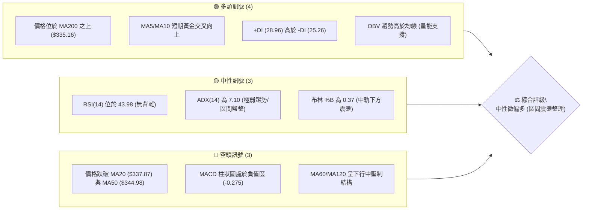

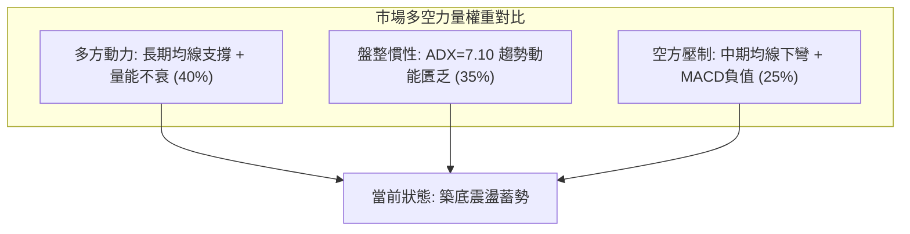

---

### 📊 核心指標速覽表

| 指標類別 | 指標名稱 | 當前數值 | 訊號 | 解讀 |
|:---|:---|:---|:---:|:---|
| **價格** | 當前收盤價 | $335.45 | 🟡 | 位於52週區間 59.2% 位置，守在長線多空分水嶺 |
| **均線** | MA20 (月線) | $337.87 | 🔴 | 價格位於 MA20 下方 (-0.72%)，短線承壓 |
| **均線** | MA50 (季線) | $344.98 | 🔴 | 價格位於 MA50 下方 (-2.76%)，中期空方略佔優 |
| **均線** | MA200 (年線)| $335.16 | 🟢 | 價格在年線上方 (+0.09%)，長期牛市基底未破 |
| **動能** | RSI(14) | 43.98 | 🟡 | 處於 40–50 中性偏弱區，無超買或超賣 |
| **動能** | MACD (12,26,9) | -3.795 / -3.520 | 🔴 | DIF < DEA 且柱狀圖為 -0.275，空頭微弱發散中 |
| **動能** | 隨機指標 %K/%D| 44.19 / 25.99 | 🟢 | %K 向上突破 %D，自低位浮現短線回升契機 |
| **趨勢** | ADX(14) | 7.10 | 🟡 | ADX < 25 極弱趨勢，市場處於典型無方向箱體 |
| **通道** | 布林帶 %B | 0.37 | 🟡 | 現價接近下軌但未破 ($328.70 - $347.04) |
| **量能** | 成交量比 (VR) | 1.03x | 🟢 | 單日量 1,579 萬高於 20 日均量，OBV 保持正向 |
| **波動** | ATR(14) | $6.99 (2.08%) | 🟡 | 日內波幅溫和收斂，未見恐慌性拋售 |

---

### 🏆 技術評分卡

```
╔════════════════════════════════════════════════════════════════╗
║                技術評分卡 — GOOG (2026-09-13)                  ║
╠════════════════════════════════════════════════════════════════╣
║ 趨勢強度 (ADX/方向)   ████░░░░░░░░░░░░░░░░  25/100  🟡 弱勢盤整║
║ 動能指標 (RSI/MACD)   ████████░░░░░░░░░░░░  42/100  🟡 中性偏弱║
║ 支撐穩定度 (年線/S1)  ██████████████░░░░░░  70/100  🟢 買盤堅固║
║ 成交量配合 (OBV/量比) ████████████░░░░░░░░  62/100  🟢 量能回升║
║ 形態完整度 (箱體整理) ████████████░░░░░░░░  60/100  🟡 箱體收斂║
║ 均線排列 (多空糾纏)   ████████░░░░░░░░░░░░  43/100  🔴 混合壓制║
╠════════════════════════════════════════════════════════════════╣
║ 綜合評分              ██████████░░░░░░░░░░  50.3/100 ⚖️ 中性整理║
╚════════════════════════════════════════════════════════════════╝
```

---

## 2. 趨勢分析

### 🌐 多時框趨勢分析

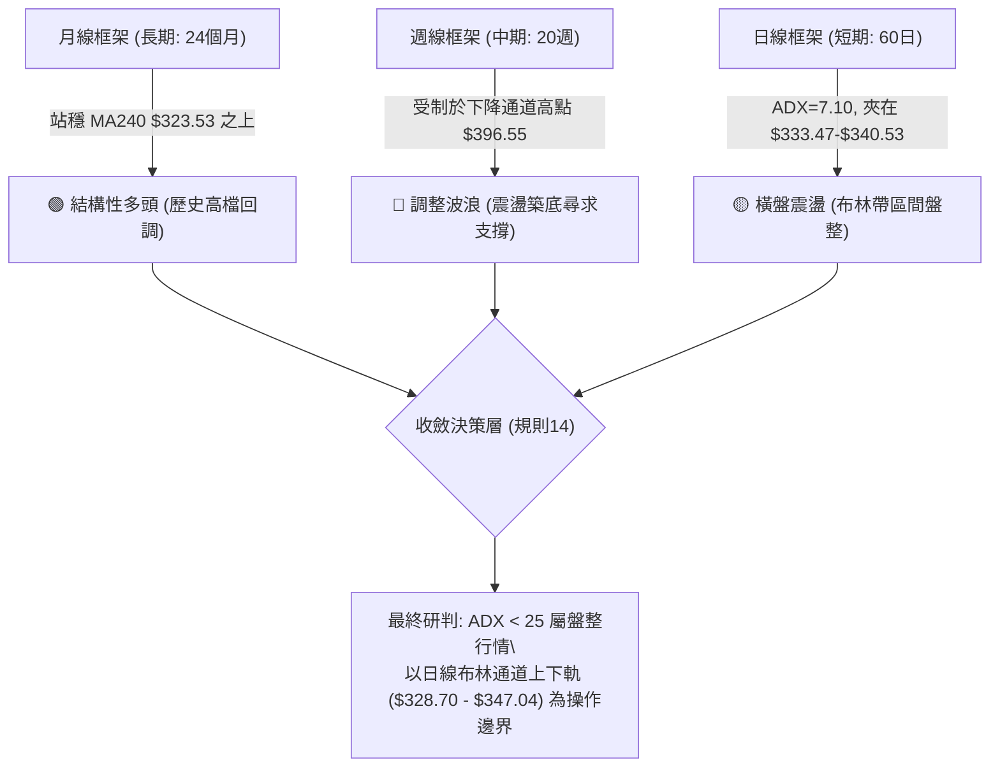

---

### 📈 長期趨勢 — 12個月走勢圖（Unicode）

```
GOOG 月線走勢圖（過去12個月：2025-10 至 2026-09）
價格軸 ($)
$400 ┤                                  ● $381.46 (2026-04高點)
$380 ┤                                  │  ● $375.96
$360 ┤                                  │  │  ● $353.10  ● $356.42
$340 ┤                    ● $337.87     │  │  │        │        ● $335.45 (現在)
$320 ┤        ● $319.29  │        ● $310.82    │        │  ● $335.19
$300 ┤  ● $281.09        ● $313.19     │       │        │
$280 ┤  │                               ● $286.50
$260 ┤  │
$240 ┤  │
     └─────────────────────────────────────────────────────────────
       10    11    12    01    02    03    04    05    06    07    08    09
      2025  2025  2025  2026  2026  2026  2026  2026  2026  2026  2026  2026
```

#### 走勢特徵分析表格

| 階段區間 | 起止價格 | 漲跌幅 | 走勢特徵與結構研判 |
|:---|:---|:---:|:---|
| **第一階段 (2025-10 ~ 2026-01)** | $281.09 → $337.87 | +20.20% | 主升浪延伸段，法人資金大幅加倉，月線連續收紅形成強力多頭排列。 |
| **第二階段 (2026-01 ~ 2026-03)** | $337.87 → $286.50 | -15.20% | 獲利了結回調，在 $286.50 獲得 MA240 與長線大單支撐並快速拉回。 |
| **第三階段 (2026-03 ~ 2026-04)** | $286.50 → $381.46 | +33.14% | 暴利性突破行情，觸及歷史高位 $403.96，短線多頭動能達到極致。 |
| **第四階段 (2026-05 ~ 2026-09)** | $375.96 → $335.45 | -10.78% | 高位均值回歸與籌碼沉澱，價格回調至 MA200 ($335.16) 進行橫盤築底。 |

---

### 📊 中期趨勢（週線分析）

中期技術面呈現「高點持續下降，低點形成聚類」的收斂走勢。近20週數據中，自 2026-05-10 高點 $396.55（週 RSI 高達 88.0 極度超買）回調以來，連續在 2026-06-28（$334.47）、2026-07-26（$318.88）及當前（$335.45）確認波段支撐區間。

```
中期週線支撐阻力結構示意圖：
$403.96 ───────┬────────────────────────────────────────── 52週歷史高點 (極強天花板)
                │      ↘
$372.70 ────────┼───────── 波段阻力 R3 (2026-05 反彈頂部聚類)
                │            ↘
$348.66 ────────┼─────────────── 近期頸線阻力 R2 / BB中軌延伸
$340.53 ────────┼────────────────── 波段密集壓制 R1
$335.45 ════════╪═════════════════════ 【現價】夾於 S1 與 R1 狹幅縫隙
$333.47 ────────┼────────────────── 近期波段底聚類 S1 / MA200 關鍵共振位
                │            ↗
$312.49 ────────┴───────── 強力防線 S2 (2026-07 低點 $318.88 聚類緩衝)
```

---

### ⚡ 趨勢強度評估（ADX 解讀）

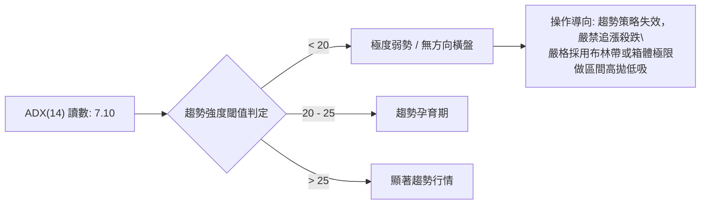

#### ADX 強度與方向矩陣

| 參數指標 | 數值 | 狀態說明 | 技術意涵 |
|:---|:---:|:---:|:---|
| **ADX (14)** | **7.10** | 弱趨勢 / 盤整 (<25) | 趨勢動能徹底衰竭，市場進入存量資金震盪與籌碼換手階段。 |
| **+DI (多頭方向)** | **28.96** | 佔優勢地位 | 多方仍握有盤面防守微幅主導權，逢低承接意願高於追空意願。 |
| **-DI (空頭方向)** | **25.26** | 略低於 +DI | 空頭主動打壓力道放緩，未形成有效推動向下走低之浪潮。 |
| **綜合判定** | **無趨勢** | **多頭主導盤整** | 多空雙方在 $333–$340 間處於微弱動態平衡，等待突破觸發。 |

---

## 3. 圖表形態分析

### 🔍 形態識別系統

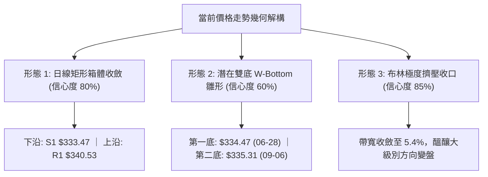

#### 形態識別與信心度評估表

| 形態類別 | 信心度 | 判斷依據（引用實際數據） | 完成度 | 目標價（附嚴謹計算式） |
|:---|:---:|:---|:---:|:---|
| **日線矩形箱體 (Rectangle)** | **80%** | 價格收盤在近三週高度鈍化於 $335 軸心，支撐聚類 S1 ($333.47) 與阻力聚類 R1 ($340.53) 明顯。 | 85% | 向上突破目標：$340.53 + ($340.53 - $333.47) = **$347.59**<br>向下跌破目標：$333.47 - ($340.53 - $333.47) = **$326.41** |
| **中期雙重底 (W-Bottom 雛形)** | **60%** | 左底為 2026-06-28 收盤 $334.47，右底為 2026-09-06 收盤 $335.31，現價在右底確認支撐。 | 45% (尚未破頸線) | 頸線阻力 R1 ($340.53)，形態高度 = $340.53 - $334.47 = $6.06<br>突破目標：$340.53 + $6.06 = **$346.59** |
| **頭肩頂形態** | **<20%** | 數據不足以支撐幾何頭肩頂，頸線缺乏連續下傾結構。 | 0% | *訊號不足，不予預測，僅做指標型解讀* |

---

### 🕯️ 重要K線形態分析

| 期間/月份 | 收盤價 | K線形態特徵 | 市場心理與多空解讀 | 訊號 |
|:---|:---:|:---|:---|:---:|
| **2026-05** | $375.96 | 長上影流星線 | 多頭衝刺至 $403.96 未果，獲利了結大單湧現，見頂轉折訊號。 | 🔴 |
| **2026-06** | $353.10 | 連續回調中黑棒 | 恐慌情緒釋放，多頭反抗力道轉弱，回撤測試中期均線。 | 🔴 |
| **2026-07** | $356.42 | 帶長下影之十字星 | 週線在 $318.88 爆出 1.22 億股大量後強拉，顯示長線主力進場抄底護盤。 | 🟢 |
| **2026-08** | $335.19 | 縮量橫盤小陰線 | 賣壓大幅減輕，空方動能鈍化，籌碼處於鎖定沉澱狀態。 | 🟡 |
| **2026-09 (迄今)** | $335.45 | 窄幅微紅十字星 | 開收盤幾乎同位，MA200 ($335.16) 發揮托底作用，變盤在即。 | 🟡 |

---

### 📉 ASCII 走勢形態示意圖

```
GOOG 關鍵築底箱體形態解析
─────────────────────────────────────────────────────────────────
$348.66 ────────────────────────────────────── 阻力 R2 (箱體上方強壓)
                           ┌─────┐
$340.53 ───────────────────│ 頸線 │────────── 阻力 R1 (頸線突破點)
                           └──┬──┘
                           ╱     ╲
$335.45 ══════════════════╱═══════●═══════════ 【當前收盤 $335.45】
                        ╱           ╲       ╱
$334.47 ───────────────●             ╲     ╱   支撐 S1 ($333.47)
                   (06-28 左底)       ●───●
                                   (09-06 右底 $335.31)
─────────────────────────────────────────────────────────────────
```

---

### 🎯 形態目標價計算

依據標準圖表形態幾何測量規則：
1. **箱體突破向上之目標價**：
   - 箱體頂部 = **$340.53** (阻力位 R1)
   - 箱體底部 = **$333.47** (支撐位 S1)
   - 形態垂直高度 $H = \$340.53 - \$333.47 = \$7.06$
   - 最小量度上漲目標價 = $\$340.53 + \$7.06 =$ **$347.59**（高度契合布林通道上軌 $347.04）
2. **潛在雙底突破量度目標**：
   - 頸線 = **$340.53**
   - 雙底波谷低點 = **$334.47**
   - 垂直幅度 $h = \$340.53 - \$334.47 = \$6.06$
   - 雙底達成目標價 = $\$340.53 + \$6.06 =$ **$346.59**（與阻力位 R2 $348.66 相距甚近）

---

## 4. 支撐與阻力

### 🗺️ 關鍵價位分布圖（Unicode）

```
GOOG 價位結構分布圖
═════════════════════════════════════════════════════════════════
$403.96 ║████████████████████████████████║ 52W 歷史極限高點 (0.0% Fib)
$372.70 ║████████████████████████        ║ 強阻力 R3 (前期波段反彈頂部)
$364.32 ║████████████████                ║ 斐波那契 23.6% 回調位
$348.66 ║████████████████████            ║ 中期波段阻力 R2 / MA60 ($345.92)
$340.53 ║████████████████████████        ║ 關鍵密集阻力 R1 (頸線/箱頂)
$339.79 ║▓▓▓▓▓▓▓▓▓▓▓▓▓▓▓▓▓▓▓▓            ║ 斐波那契 38.2% 回調位
$335.45 ╠════════════════════════════════╣ ◄ 現價 $335.45 (MA200 $335.16)
$333.47 ║▓▓▓▓▓▓▓▓▓▓▓▓▓▓▓▓▓▓▓▓▓▓▓▓        ║ 即時關鍵支撐 S1 (年線共振波段底)
$319.96 ║████████████████                ║ 斐波那契 50.0% 關鍵平衡位
$312.49 ║████████████████████████        ║ 波段強支撐 S2 (7月極限砸盤聚類)
$295.58 ║████████████████████████████    ║ 終極波段支撐 S3 (年線下防線)
═════════════════════════════════════════════════════════════════
```

---

### 🚧 阻力位分析表

所有價位均嚴格引用 OHLCV 聚類計算之阻力層級：

| 阻力級別 | 價位 | 形成原因與籌碼結構 | 突破難度 | 重要性 |
|:---|:---:|:---|:---:|:---:|
| **阻力位 R1** | **$340.53** | 近一年波段高點密集聚類區，疊加斐波那契 38.2% ($339.79)，為短線頸線位置。 | 🟡 中等 | ★★★★☆ |
| **阻力位 R2** | **$348.66** | 近一年波段次高點聚類，與日線 MA60 ($345.92)、MA120 ($347.75) 形成重疊壓力帶。 | 🔴 較高 | ★★★★☆ |
| **阻力位 R3** | **$372.70** | 近一年波段主高點聚類，為 2026-05 反彈頂部拋壓核心地帶。 | 🔴 極高 | ★★★★★ |

---

### 🛡️ 支撐位分析表

所有價位均嚴格引用 OHLCV 聚類計算之支撐層級：

| 支撐級別 | 價位 | 形成原因與籌碼結構 | 守住機率 | 重要性 |
|:---|:---:|:---|:---:|:---:|
| **支撐位 S1** | **$333.47** | 近一年波段低點聚類，距離現價僅 -0.59%，與日線 MA200 ($335.16) 高度共振。 | 🟢 75% | ★★★★★ |
| **支撐位 S2** | **$312.49** | 近一年深幅低點聚類，接近斐波那契 50.0% ($319.96)，為 2026-07 探底之防守堡壘。 | 🟢 85% | ★★★★☆ |
| **支撐位 S3** | **$295.58** | 近一年極限回撤波段底聚類，與 2026-03 啟動前低點重合，為中期防守最後底線。 | 🟢 95% | ★★★☆☆ |

---

### 📐 斐波那契回調位分析

依據 52 週波動區間（$235.96 至 $403.96，垂直總波幅 $168.00）之斐波那契計算如下：

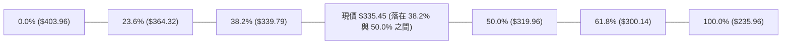

- **當前技術落點**：現價 **$335.45** 處於 **38.2% 回調位 ($339.79)** 與 **50.0% 回調位 ($319.96)** 的黃金分割敏感帶。
- **關鍵回調意義**：在牛市大級別回撤中，38.2% 常作為強勢回調的極限承接帶。目前價格在 $335.45 緊貼 38.2% 下方震盪，若能伴隨量能重新收復 $339.79，即代表回調在健康比例內結束；若不幸放量擊穿 S1 ($333.47)，則下行重力將引導測試 50.0% 中樞平衡點 $319.96。

---

## 5. 技術指標深度解讀

### 🎛️ 指標訊號總覽

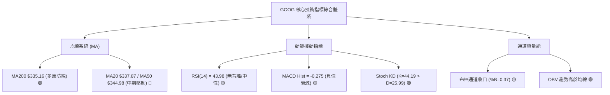

---

### 📈 移動平均線排列分析

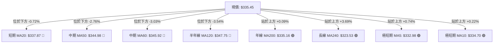

- **均線系統診斷**：
  1. **混合糾纏排列**：MA5/MA10/MA200/MA240 處於多頭排列（現價在其上方），而 MA20/MA50/MA60/MA120 處於空頭壓制（現價在其下方）。
  2. **短線轉機初現**：MA5 ($332.98) 與 MA10 ($334.70) 出現微幅低位金叉向上，對現價形成短線第一層推力。
  3. **年線定海神針**：MA200 ($335.16) 正好與當前收盤價 $335.45 重合，多方主力在此處構築了鋼鐵防線，跌破與否決定了長達兩年的牛市格局是否轉向。

---

### 📉 RSI(14) 分析

#### RSI 數值進度條
```
超賣區 (0-30)           中性震盪區 (30-70)          超買區 (70-100)
├──────────────┼────────────────────────┼──────────────┤
░░░░░░░░░░░░░░ ▓▓▓▓▓▓▓▓▓▓▓▓░░░░░░░░░░░░░ ░░░░░░░░░░░░░░
0             30        43.98           70            100
```

- **當前讀數**：**43.98**（處於中性平衡區，微偏空方）。
- **背離診斷**：
  - **頂背離**：無。歷史頂部（2026-05-10 週 RSI 達 88.0）已藉由四個月的深度調整完成釋放。
  - **底背離**：無明顯底背離。2026-07-26 週 RSI 為 26.4（價格 $318.88），而當前價格 $335.45 對應日 RSI 43.98，屬於隨價格同步反彈後的指標復位狀態，走勢與指標高度吻合。

---

### 📊 MACD(12/26/9) 訊號解讀

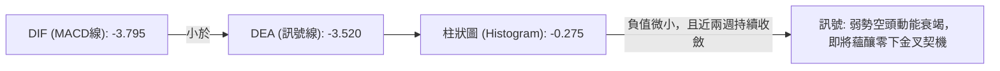

- **數值關係**：DIF (-3.795) 處於 DEA (-3.520) 下方，MACD Histogram 處於負值區 (-0.275)。
- **深層解讀**：負柱狀圖自 2026-07-26 的 -3.618 與 2026-08-23 的 -0.818 大幅縮短至當前的 -0.275。這表明雖然仍屬空頭佔據零軸下方，但空方動能已幾乎耗盡，即將在零軸下方迎來 DIF 與 DEA 的黃金交叉。

---

### 📦 布林通道分析

```
GOOG 布林通道示意圖 (日線參數: 20, 2)
─────────────────────────────────────────────────────────────────
$347.04 ───┬────────────────────────────────────── BB 上軌 (阻力壓制)
           │
$337.87 ───┼────────────────────────────────────── BB 中軌 (MA20阻力)
           │        
$335.45 ═══╪═════════●═══════════════════════════ 【現價】 (%B = 0.37)
           │
$328.70 ───┴────────────────────────────────────── BB 下軌 (極限支撐)
─────────────────────────────────────────────────────────────────
```

- **通道寬度**：上軌 $347.04 與下軌 $328.70 相距僅 $18.34（帶寬僅 5.46%），通道呈現高度擠壓收窄狀態。
- **%B 指標**：0.37，表示價格目前位於下半通道，且正朝中軌 $337.87 緩步攀升。在無趨勢的盤整環境下，布林下軌 $328.70 具備極強反彈吸引力，而上軌 $347.04 則構成階段性獲利了結天花板。

---

### 💹 成交量分析（量價配合度）

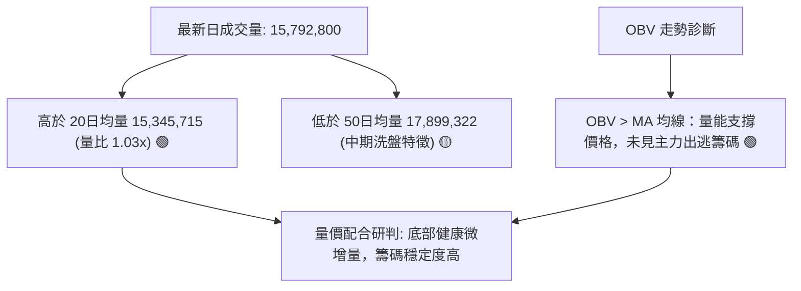

- **量能評估**：最新成交量（1,579 萬股）略微高於 20 日均量，顯示在此前連續多週縮量後，已有底層資金在年線上方進行微幅吸籌。
- **OBV 指標特徵**：OBV 穩健運行於其均線之上，這說明近四個月的股價下跌屬於「縮量洗盤與均值回歸」，並非主力資金恐慌性派發，量能結構有力支撐現價。

---

## 6. 動能與波動率

### ⚡ 動能評估四象限

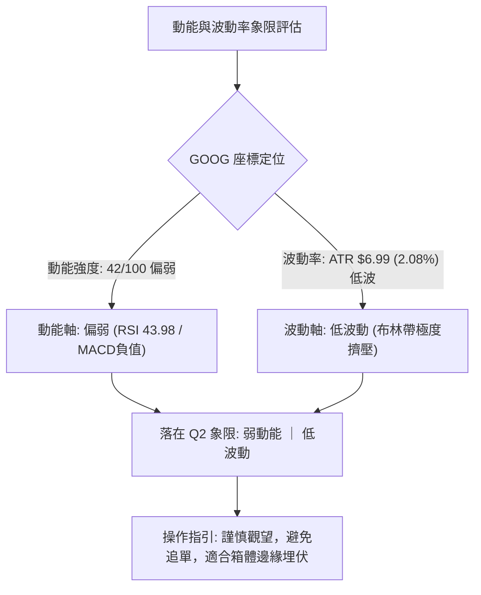

| 象限代號 | 動能特徵 | 波動特徵 | 當前狀態 | 技術環境與操作評估 |
|:---:|:---:|:---:|:---:|:---|
| **Q1** | 強 | 低 | — | 穩健趨勢慢牛行進中，最佳加碼機會。 |
| **Q2** | **弱** | **低** | **✓ (GOOG)** | **處於暴風雨前的平靜，蓄勢整理，維持區間操作。** |
| **Q3** | 強 | 高 | — | 爆發性突破或主升浪行情，適合順勢博取暴利。 |
| **Q4** | 弱 | 高 | — | 恐慌性崩跌或多殺多格局，風險極高需離場。 |

---

### 📊 ATR 波動率分析

- **ATR(14) 數值**：**$6.99**（佔當前股價比例為 **2.08%**）。
- **波動特徵解讀**：日均波幅 $6.99 處於近半年來的相對極低值，反映多空雙方出價意願高度收斂，情緒極度冷靜。
- **動態風控與止損建議**：
  - **日內短線止損距離**：$1.0 \times \text{ATR} = \$6.99$（向下防守價位約為現價減去 $7.00）。
  - **波段交易防守距離**：$1.5 \times \text{ATR} = 1.5 \times \$6.99 = \mathbf{\$10.49}$。
  - **以現價 $335.45 計算之波段防線**：$\$335.45 - \$10.49 = \mathbf{\$324.96}$（正好落在布林下軌 $328.70 下方之保護緩衝區）。

---

### 📐 Beta 與市場相關性

- **Beta 係數**：**1.225**。
- **市場敏感度評估**：
  - GOOG 具備高於大盤（S&P 500 / Nasdaq 100）22.5% 的波動彈性，屬於高貝塔科技權重龍頭。
  - **對大盤依賴度**：在當前 ADX 為 7.10 的自發性弱趨勢行情下，個股極易受到整體美股科技板塊指數大盤動向的牽引。若大盤指數向上突破，GOOG 有望借勢放大其貝塔彈性帶動突破阻力位 R1 ($340.53)。

---

## 7. 多時框架總結

### 📋 時框架評分表

| 時框架 | 趨勢方向 | 動能狀態 | 均線排列 | 形態結構 | 綜合評分 | 操作建議 |
|:---|:---:|:---:|:---:|:---:|:---:|:---|
| **長期 (月線)** | 🟢 結構偏多 | 🟡 中性回調 | 🟢 站穩 MA240 | 歷史高位健康修正 | 72/100 | 長線資金分批佈局 |
| **中期 (週線)** | 🔴 震盪偏空 | 🟡 衰竭收斂 | 🔴 均線反壓 | 下降收斂三角雛形 | 45/100 | 等待確認底背離突破 |
| **短期 (日線)** | 🟡 區間盤整 | 🟢 轉暖金叉 | 🟡 混亂糾纏 | 矩形箱體/雙底蓄勢 | 52/100 | 箱體上下軌間網格操作 |

---

### 🔲 綜合訊號矩陣

```
┌─────────────────────────────────────────────────────────────┐
│                   多時框架訊號矩陣收斂圖                    │
├──────────────┬──────────────┬──────────────┬────────────────┤
│   指標層面   │  短期 (日線) │  中期 (週線) │  長期 (月線)   │
├──────────────┼──────────────┼──────────────┼────────────────┤
│ 均線系統     │  🟡 糾纏壓制 │  🔴 蓋頂下行 │  🟢 年線支撐   │
│ 動能 (RSI)   │  🟡 43.98    │  🟡 44.00    │  🟢 55+ 健康   │
│ 趨勢 (ADX)   │  🔴 7.10弱勢 │  🟡 震盪整理 │  🟢 多頭常態   │
│ 量能結構     │  🟢 OBV走強  │  🟡 縮量沉澱 │  🟢 資本護盤   │
└──────────────┴──────────────┴──────────────┴────────────────┤
```

---

### ⚖️ 多時框收斂結論

依據多時框收斂優先級規則（規則 14）：
1. **當前市場屬性研判**：ADX(14) 讀數為 **7.10 (<25)**，明確定義當前走勢為**「典型盤整行情」**而非趨勢行情。
2. **主導維度收斂**：在無趨勢盤整市場中，趨勢型指標與中長期單邊假設降低權重，交易邏輯**完全以日線布林通道上下軌 ($328.70 至 $347.04) 為主要交易區間**。
3. **唯一方向性結論**：**【中性觀望，區間低吸操作】**。
   - 價格緊貼年線 MA200 ($335.16) 築底，下有支撐聚類 S1 ($333.47)，上有頸線阻力 R1 ($340.53)，多空在此達到動態均衡，方向性突破需等待帶量站上 R1 或跌破 S1 確認。

---

## 8. 交易策略建議

### 🗺️ 策略決策流程圖

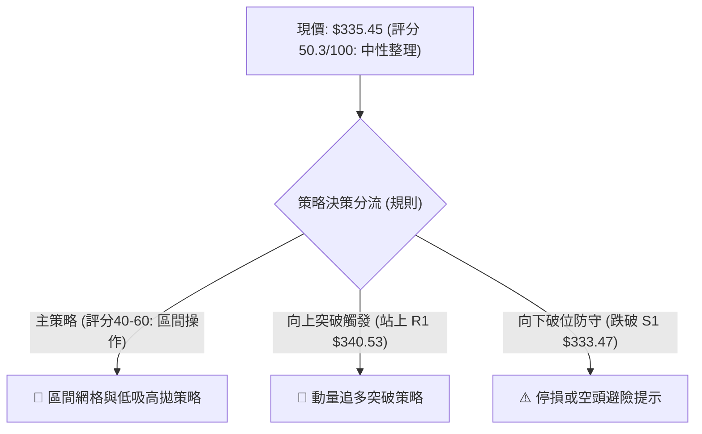

---

### 🧭 策略路由

**當前主策略方向 = 【中性區間震盪操作】（依技術評分卡：50.3 / 100）**
- 由於綜合評分介於 40–60 之間，且 ADX 為 7.10，市場無單邊趨勢，主推策略嚴格錨定在 **布林通道下軌與 S1 支撐帶佈局，並於阻力位 R1、R2 分批減倉**。

---

### 🎯 價格情境階梯（Price Scenarios）

所有觸發價位與目標價位嚴格引用關鍵價位計算結果：

| 觸發條件 | 第一目標 | 後續延伸目標 | 情境技術含義 |
|:---|:---:|:---:|:---|
| **帶量突破 R1 ($340.53)** | **R2 ($348.66)** | **R3 ($372.70)** | 扭轉短期下行壓制，箱體向上突破展開波段反彈。 |
| **站穩現價區間 ($333.47 - $337.87)** | **R1 ($340.53)** | **BB上軌 ($347.04)** | 在年線 MA200 上方維持良性籌碼換手與箱體拉鋸。 |
| **有效跌破 S1 ($333.47)** | **S2 ($312.49)** | **S3 ($295.58)** | 年線宣告失守，回調深度向 50.0% 斐波那契回調位擴大。 |

---

### 📊 情境機率分佈

| 震盪與運行情境 | 機率估計 | 主要技術依據 |
|:---|:---:|:---|
| **情境一：區間震盪蓄勢** | **55%** | **ADX=7.10 顯示無趨勢**；布林帶大幅收口至 5.46%，價格緊咬 MA200 鈍化。 |
| **情境二：向上反彈突破** | **30%** | **OBV > MA 量能持續支撐**；MACD 負柱狀圖收斂至 -0.275；Stoch KD 出現低位金叉。 |
| **情境三：回落探底尋求 S2** | **15%** | MA20、MA50 呈中線反壓；若失守年線共振點 S1 ($333.47) 將觸發止損拋壓。 |

---

### 🟢 主策略詳情

本策略基於盤整屬性，設計「下軌低吸（策略 A）」與「突破跟進（策略 B）」兩套配置：

| 策略要素 | 策略 A：區間下軌埋伏（勝率優先） | 策略 B：突破頸線順勢追擊（動量優先） |
|:---|:---|:---|
| **進場條件** | 價格回踩 S1 ($333.47) 企穩，且不破布林下軌 | 日線收盤價帶量突破阻力位 R1 ($340.53) |
| **進場價格** | **$333.80** (貼近 S1 支撐位) | **$341.00** (確認站上 R1 阻力位) |
| **目標價 T1** | **$340.53** (阻力位 R1) | **$348.66** (阻力位 R2 / 形態測幅) |
| **目標價 T2** | **$348.66** (阻力位 R2 / 布林上軌附近) | **$372.70** (波段阻力 R3) |
| **止損價格** | **$328.70** (跌破布林下軌防守) | **$333.47** (跌破原箱頂轉化之支撐 S1) |
| **風險報酬比** | **1 : 2.91** (風險 $5.10 / T2 利潤 $14.86) | **1 : 4.21** (風險 $7.53 / T2 利潤 $31.70) |
| **成功機率** | **65%** | **55%** |
| **建議倉位** | **15% - 20%** 總部位 | **10%** 試倉（確認突破後追加） |

---

### 🔴 反向風險觸發點（對沖提示）

- **多頭結構失效防線**：若日線收盤價**實質跌破 S1 ($333.47)**，特別是跌破布林下軌 **$328.70**，代表當前箱體築底失敗。
- **對沖應對機制**：跌破 $333.47 時，多頭部位應減倉 50%；若進一步跌破 $328.70，應全部平倉或建立衍生性金融商品空頭部位進行對沖，下方目標指向 S2 ($312.49)。

---

### ⭐ 整體訊號強度評星

```
╔═══════════════════════════════════════════════════════╗
║ 做多訊號強度：  ★★★☆☆  (3.0/5星) 底部支撐強，缺乏爆發力║
║ 做空訊號強度：  ★★☆☆☆  (2.0/5星) 賣壓衰竭，向下空間有限║
║ 整體可信度：    ★★★★☆  (4.0/5星) 指標共振於區間箱體  ║
╚═══════════════════════════════════════════════════════╝
```

---

## 9. 風險提示與監控

### ✅ 關鍵監控指標 Checklist

```
╔════════════════════════════════════════════════════════════════╗
║                   核心監控清單 (Daily Checklist)               ║
╠════════════════════════════════════════════════════════════════╣
║ [ ] 價格是否跌破年線 MA200 與支撐 S1 ($333.47)？              ║
║ [ ] ADX(14) 是否從 7.10 向上翹頭突破 20 (新趨勢啟動訊號)？   ║
║ [ ] MACD Histogram 是否由負翻正 (零軸下方出現黃金交叉)？     ║
║ [ ] 日成交量是否放大至 2,000 萬股以上 (突破 R1 必備動能)？     ║
║ [ ] RSI(14) 是否突破 50 中軸並朝 60 強勢區挺進？              ║
╚════════════════════════════════════════════════════════════════╝
```

---

### ⚠️ 風險場景分析

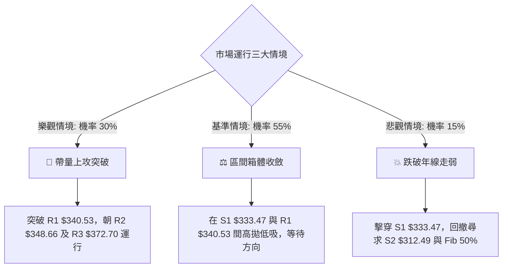

---

### 🛡️ 風險管理重要提醒

1. **拒絕追漲殺跌**：ADX 處於極度低迷的 7.10，任何在箱體中間位置（如 $336–$338）的追單極易遭受左右打臉。務必只在邊界（接近支撐 S1 或阻力 R1）執行操作。
2. **嚴格執行 ATR 止損紀律**：目前 ATR 為 $6.99，意味著正常的日間隨機晃動可達 $7 左右。因此進場成本控制必須極為嚴謹，切勿以過窄的停損對抗市場雜訊，亦不可放任虧損跌破布林下軌 $328.70。
3. **倉位總量控管**：在確認帶量站穩 R1 ($340.53) 之前，總部位曝險建議不超過個人投資組合的 **20%**，保留 80% 現金流以因應可能的變盤洗盤風險。

---

## 📋 報告總結

```
╔════════════════════════════════════════════════════════════════╗
║                   GOOG 技術分析報告總結                        ║
╠════════════════════════════════════════════════════════════════╣
║ 報告日期：2026-09-13                                          ║
║ 當前價格：$335.45                                              ║
║ 分析評級：⚖️ 中性盤整 (Neutral Range-bound)                   ║
╠════════════════════════════════════════════════════════════════╣
║ 關鍵結論：                                                     ║
║ ├─ 長期趨勢：🟢 偏多（牢牢守在年線 MA200 $335.16 與 MA240 上）║
║ ├─ 中期趨勢：🔴 調整（自 $403.96 歷史高點以來的回調沉澱段）    ║
║ ├─ 短期趨勢：🟡 盤整（ADX=7.10 極弱趨勢，夾在箱體內部震盪）   ║
║ ├─ 關鍵支撐：S1: $333.47 ｜ S2: $312.49                        ║
║ ├─ 關鍵阻力：R1: $340.53 ｜ R2: $348.66                        ║
║ └─ 分析師平均目標：$422.34 (隱含 +25.90% 潛在上漲空間)         ║
╠════════════════════════════════════════════════════════════════╣
║ 最優策略組合：                                                 ║
║ 1. 🥇 最佳機會：於 S1 支撐位附近 ($333.80) 低吸，目標看 R1/R2  ║
║ 2. 🥈 次選機會：靜待突破頸線 R1 ($340.53) 後順勢加碼跟進       ║
║ 3. 🥉 保守選擇：保持空倉觀望，直至 ADX > 20 出現明確趨勢方向  ║
╚════════════════════════════════════════════════════════════════╝
```

---

> ⚠️ **免責聲明**：本報告為技術分析研究，所有數據及價位均基於歷史量價與 OHLCV 模型推算。本報告**僅供學術交流與交易邏輯參考**，**不構成任何形式的投資建議**。金融市場具有高波動風險，投資人應獨立審慎評估並自負盈虧。

---

*報告生成時間：2026-09-13 ｜ 數據來源：Yahoo Finance ｜ 分析框架：多時框量化技術分析*