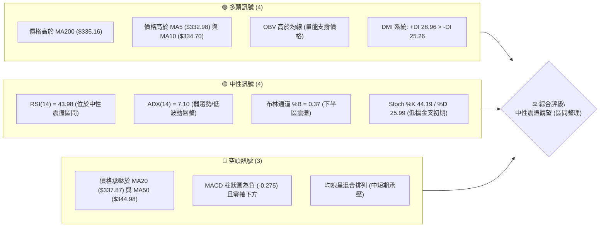
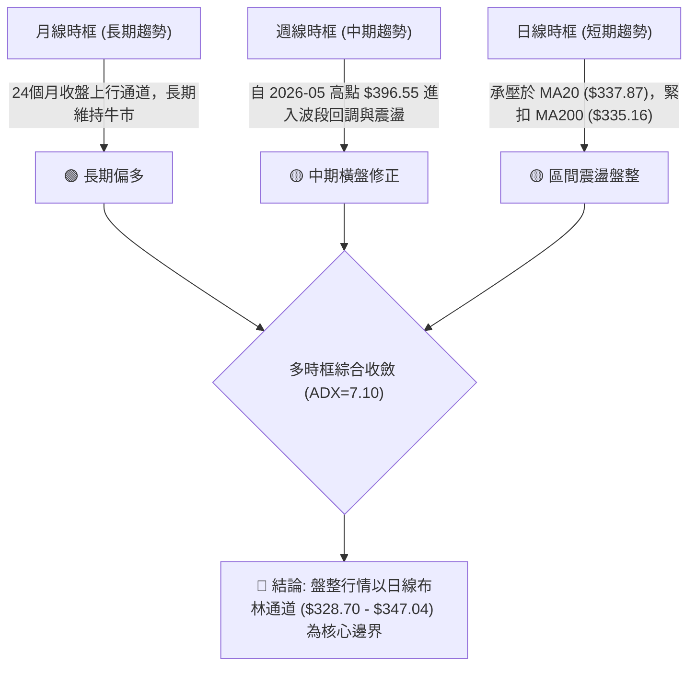
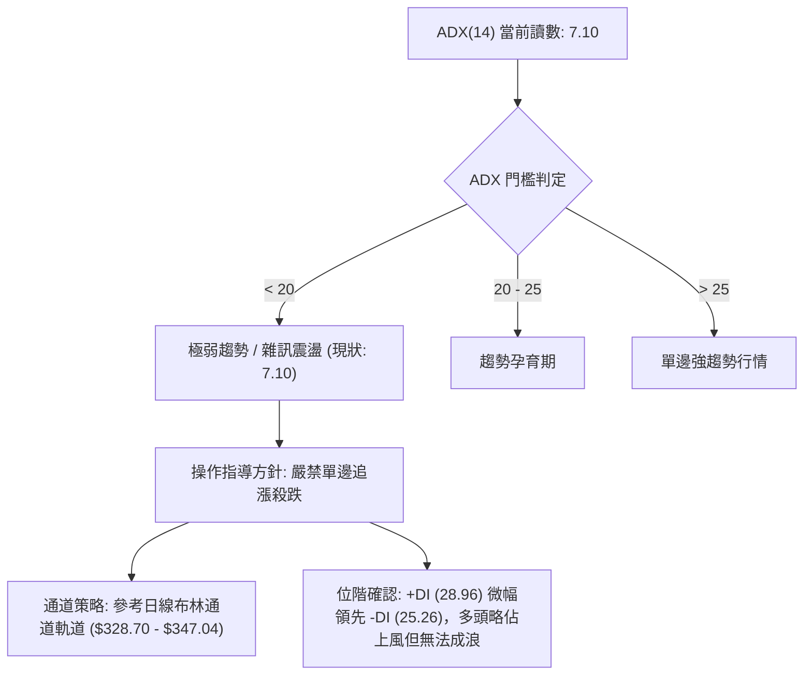
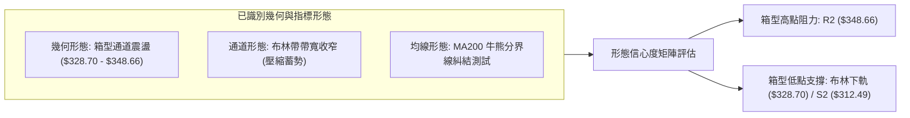
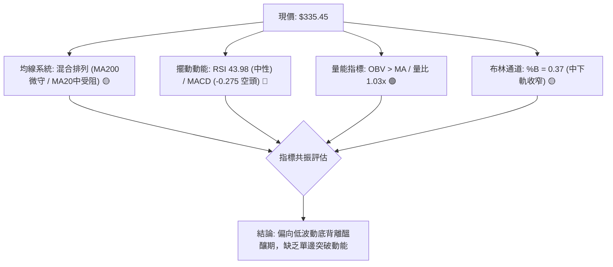
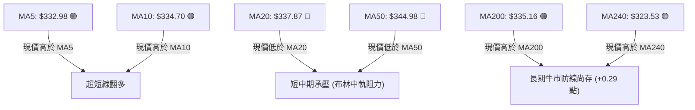
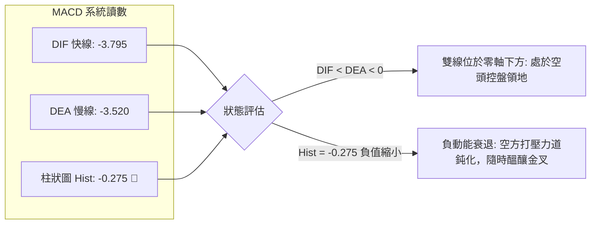
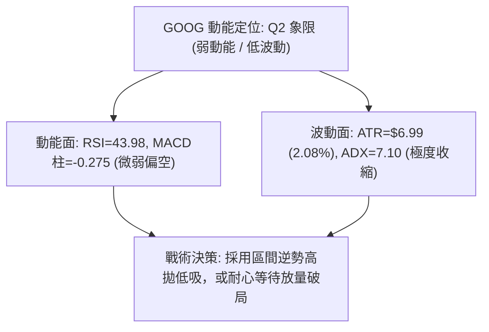
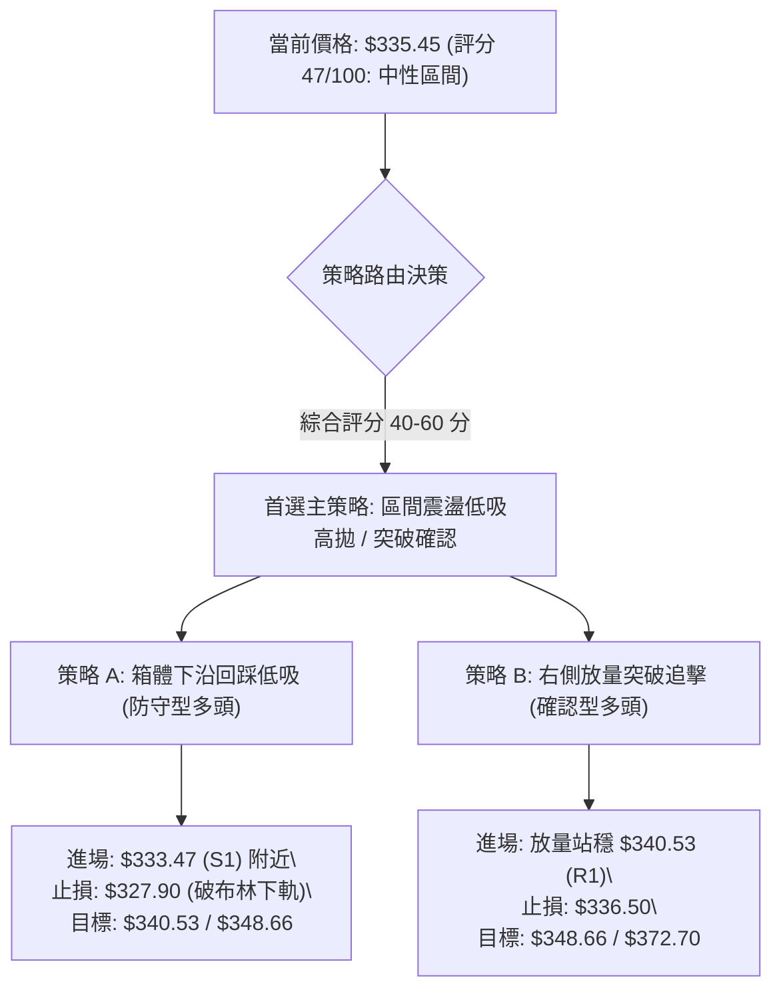
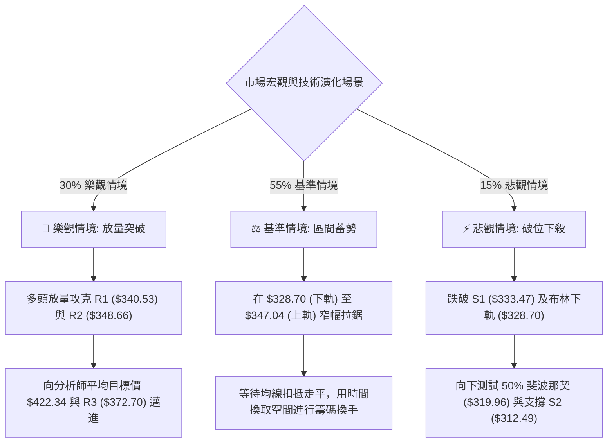

# GOOG 技術分析報告

> **報告日期**：2026-09-14 ｜ **語言**：繁體中文 ｜ **數據來源**：Yahoo Finance ｜ **當前價格**：$335.45

---

## 目錄

| 章節 | 內容 |
|------|------|
| [1. 技術面概覽](#1-技術面概覽) | 訊號儀表板、核心指標、評分卡 |
| [2. 趨勢分析](#2-趨勢分析) | 多時框趨勢、長中短期走勢 |
| [3. 圖表形態分析](#3-圖表形態分析) | 形態識別、K線組合、目標價 |
| [4. 支撐與阻力](#4-支撐與阻力) | 關鍵價位、斐波那契回調 |
| [5. 技術指標深度解讀](#5-技術指標深度解讀) | MA/RSI/MACD/布林/成交量 |
| [6. 動能與波動率](#6-動能與波動率) | 動能評估、ATR、Beta |
| [7. 多時框架總結](#7-多時框架總結) | 時框架評分矩陣 |
| [8. 交易策略建議](#8-交易策略建議) | 多空策略、風險報酬比 |
| [9. 風險提示與監控](#9-風險提示與監控) | 監控指標、風險場景 |

---

## 1. 技術面概覽

### 🎯 技術訊號儀表板



### 📊 核心指標速覽表

| 指標類別 | 指標名稱 | 當前數值 | 訊號 | 解讀 |
|:---|:---|:---|:---:|:---|
| **價格** | 當前價格 | $335.45 | 🟡 | 位於52週區間 59.2% ($235.96 - $403.96)，處於波段中位回洗區 |
| **短期均線**| MA5 / MA10 | $332.98 / $334.70 | 🟢 | 現價微幅站上短期均線，超短期具反彈跡象 |
| **中期均線**| MA20 / MA50 | $337.87 / $344.98 | 🔴 | 現價受制於布林中軌(MA20)與MA50，上方形成層層動態阻力 |
| **長期均線**| MA200 | $335.16 | 🟢 | 現價極度貼近並守住牛熊分界線 MA200，多頭防線面臨考驗 |
| **超長期均線**| MA240 | $323.53 | 🟢 | 現價高於 MA240 達 +3.69%，長期基底仍處於擴張架構 |
| **動能指標**| RSI(14) | 43.98 | 🟡 | 位於 30–70 中性震盪區間，無超買或超賣極端讀數 |
| **趨勢指標**| MACD (12,26,9)| DIF: -3.795 / DEA: -3.520 | 🔴 | 柱狀圖 -0.275，處於零軸下方微幅發散，空頭動能微弱占優 |
| **趨勢強度**| ADX(14) | 7.10 | 🟡 | 遠低於 25 臨界線，顯示市場無明確單邊趨勢，呈現極致盤整 |
| **擺動指標**| KD (Stoch) | %K: 44.19 / %D: 25.99 | 🟢 | 隨機指標於低檔低度鈍化後形成微幅黃金交叉，短線具備修復動能 |
| **通道指標**| 布林通道 | 軌道: $328.70 - $347.04 | 🟡 | %B = 0.37，價格運行於中軌與下軌之間，通道處於收斂整理期 |
| **量能指標**| 成交量 / OBV | 15,792,800 (量比 1.03x) | 🟢 | 略高於 20 日均量，OBV 處於均線上方，底部籌碼未見恐慌性潰退 |
| **波動指標**| ATR(14) | $6.99 (2.08%) | 🟡 | 每日平均波動約 7 美元，波動度處於過去 6 個月偏低水平 |

### 🏆 技術評分卡

```
╔══════════════════════════════════════════════════════════════════╗
║              技術評分卡 — GOOG (2026-09-14)                     ║
╠══════════════════════════════════════════════════════════════════╣
║ 趨勢強度 (Trend)     ████░░░░░░░░░░░░░░░░  22/100  🔴 極弱趨勢/盤整 ║
║ 動能指標 (Momentum)  ████████░░░░░░░░░░░░  42/100  🟡 中性偏弱空頭 ║
║ 支撐穩定度 (Support) ████████████░░░░░░░░  62/100  🟢 MA200/S1有守 ║
║ 成交量配合 (Volume)  ██████████░░░░░░░░░░  54/100  🟡 OBV大於均線  ║
║ 形態完整度 (Pattern) ████████░░░░░░░░░░░░  40/100  🟡 箱型收斂震盪 ║
║ 均線排列 (MAs)       ████████░░░░░░░░░░░░  45/100  🟡 混合排列糾結 ║
╠══════════════════════════════════════════════════════════════════╣
║ 綜合評分             █████████░░░░░░░░░░░  47/100  ⚖️ 區間震盪觀望║
╚══════════════════════════════════════════════════════════════════╝
```

---

## 2. 趨勢分析

### 🌐 多時框趨勢分析

依據多時框收斂規則，本報告優先識別趨勢強弱。目前日線級別 ADX(14) 僅為 **7.10**，顯示市場處於極度低波動的無趨勢（Choppy/Ranging）狀態。在中長期多頭架構與短中期修正承壓之間，價格進入收斂三角形/橫盤相持結構。



### 📈 長期趨勢 — 12個月走勢圖（Unicode）

以下展示過去 12 個月（2025-10 至 2026-09）之月度收盤價走勢，展示從歷史擴張至見頂高檔震盪之全貌：

```
GOOG 月線走勢圖（過去12個月：2025-10 至 2026-09）
價格軸 ($)
$390 ┤
$380 ┤                                      ● $381.46 (M7 歷史月收盤高點)
$370 ┤                                  ● $375.96 (M8)
$360 ┤                                              ● $356.42 (M10)
$350 ┤                                          ● $353.10 (M9)
$340 ┤                      ● $337.87 (M4)
$330 ┤                                                  ● $335.19 (M11)
$330 ┤                                                      ● $335.45 (現在 M12)
$320 ┤              ● $319.29 (M2)  ● $310.82 (M5)
$310 ┤                  ● $313.19 (M3)
$290 ┤
$280 ┤      ● $281.09 (M1)      ● $286.50 (M6 階段低點)
$270 ┤
     └───────────────────────────────────────────────────────────► 時間
            M1      M2      M3      M4      M5      M6      M7      M8      M9     M10     M11     M12
           10月    11月    12月    01月    02月    03月    04月    05月    06月    07月    08月    09月
           2025    2025    2025    2026    2026    2026    2026    2026    2026    2026    2026    2026
```

**走勢特徵分析表格**：

| 階段 | 時間區間 | 起訖收盤價 | 漲跌幅 | 走勢特徵與結構意涵 |
|:---|:---|:---|:---:|:---|
| **主升驅動段** | 2025-10 ~ 2026-01 | $281.09 → $337.87 | +20.20% | 連續放量陽線推升，確立長期均線多頭發散架構 |
| **波段洗盤段** | 2026-01 ~ 2026-03 | $337.87 → $286.50 | -15.20% | 快速回測確認支撐，在 $286.50 探底形成強力次級低點支撐 |
| **狂熱噴出段** | 2026-03 ~ 2026-04 | $286.50 → $381.46 | +33.14% | 單月暴力拉升近百點，創歷史波段天價 $403.96（週線見頂） |
| **均值回歸段** | 2026-04 ~ 2026-07 | $381.46 → $356.42 | -6.56% | 高檔獲利回吐，波段成交量萎縮，於 $355 形成次級頭部 |
| **基底築底段** | 2026-07 ~ 2026-09 | $356.42 → $335.45 | -5.88% | 價格緩跌回踩 MA200 關鍵防線 ($335.16)，波幅進入極致收斂 |

### 📊 中期趨勢（週線分析）

從近 20 週數據觀察，GOOG 呈現明顯的「階梯式回調與支撐測試」結構：
- **頂部出貨區**：2026-05-10 週收盤 $396.55（當週 RSI 達 88.0，MACD 柱 +4.314），量價背離後轉折向下。
- **初次探底區**：2026-06-28 週成交量爆出 188,102,700 股的天量，低點下探至 $334.47，確立為中期關鍵換手區。
- **二次探底區**：2026-07-26 週收盤壓低至 $318.88（逼近 50% 斐波那契回調位 $319.96），隨後長陽反彈至 $356.42。
- **收斂窄幅整理**：自 2026-08-16 以來，週成交量連續 5 週維持在 6,500 萬至 8,200 萬股的低量區（2026-09-13 週成交量降至 65,688,900 股），收盤價收斂於 $335.31 - $335.45，顯示空方動能出盡，多空進入膠著平衡。

### ⚡ 趨勢強度評估（ADX 解讀）



| ADX 數值區間 | 當前狀態 | 趨勢性質 | 策略意涵 |
|:---|:---:|:---|:---|
| **0.00 – 15.00** | **7.10 (目前)** | **極度低迷 / 窄幅盤整** | 均線趨於水平，擺動指標有效性高於趨勢跟隨指標 |
| 15.01 – 25.00 | — | 弱趨勢 / 醞釀突破 | 密切觀察通道寬度收窄後的方向性選擇 |
| 25.01 – 50.00 | — | 強勢單邊趨勢 | 均線發散，適合使用移動平均線跟蹤止損 |
| > 50.00 | — | 極端過熱趨勢 | 警惕趨勢耗竭與拋物線頂部反轉 |

---

## 3. 圖表形態分析

### 🔍 形態識別系統

根據近 6 個月的價格幾何輪廓與給定數據，GOOG 日線與週線展現出明確的「對稱三角形收斂」與「雙底築底未遂轉箱型」特徵。以下嚴格基於給定數據聚類進行信心度與幾何結構量化：



**形態信心度表格**：

| 形態類別 | 信心度 | 判斷依據（引用數據） | 完成度 | 目標價（附嚴格計算式） |
|:---|:---:|:---|:---:|:---|
| **箱型整理形態 (Rectangle Range)** | **75%** | 價格多次受阻於 R2 ($348.66) 與布林上軌 ($347.04)，並於 S1 ($333.47) 及下軌 ($328.70) 獲得承接 | 85% | **向上突破目標**：箱頂 $348.66 + 箱高 ($348.66 - $328.70 = $19.96) = **$368.62**（逼近阻力位 R3: $372.70） |
| **潛在雙重底 (W底雛形)** | **52%** | 第一底為 2026-06-28 收盤 $334.47，第二底為 2026-07-26 低點 $318.88，中間頸線為 2026-07-05 收盤 $355.95 | 60% | **測幅目標**：頸線 $355.95 + 形態高度 ($355.95 - $318.88 = $37.07) = **$393.02**（接近波段高點 $396.55） |
| **旗形整理 (Bearish/Bullish Flag)** | **35%** | 數據不足（訊號不足，僅做指標型解讀），ADX=7.10 顯示波動率驟降，幾何延伸不符標準旗形動能要求 | 20% | *不予計算（依規則 15，信心度 <50% 不強行測幅）* |

### 🕯️ 重要K線形態分析

| 觀測週期 | 關鍵收盤價 | K線組合與結構 | 專業技術解讀 | 訊號評級 |
|:---|:---:|:---|:---|:---:|
| **2026-08-23 週** | $341.53 | 縮量長下影陰十字 | RSI 觸及超賣低點 20.6 後迅速收復，顯示在 $340 以下具有實質買盤托底 | 🟢 多頭抵抗 |
| **2026-08-30 週** | $342.66 | 孕育陽線 (Inside Bar) | 週成交量回升至 8,243 萬股，MACD 負柱收窄至 -0.220，止跌信號確認 | 🟡 止跌孕育 |
| **2026-09-06 週** | $335.31 | 窄幅微陰星線 | 波動率極致收縮，量能降至 7,807 萬股，下探測試 MA200 支撐不破 | 🟡 橫盤蓄勢 |
| **2026-09-13 週** | $335.45 | 錘頭微陽星線 (現狀) | 伴隨最新日線小幅收復短期 MA5/MA10，量能穩定，多空在 $335 關卡達成停戰協議 | 🟢 變盤前兆 |

### 📉 ASCII 走勢形態示意圖

```
GOOG 週線級別雙底與箱型收斂示意圖
價格 ($)
$396.55 ┤      ▲ [波段頂部 2026-05-10]
        │     / \
$372.70 ┤    /   \        [阻力 R3: $372.70]
        │   /     \
$355.95 ┤  /       \    ▲ [雙底頸線 $355.95]
        │ /         \  / \
$348.66 ┼────────────┼───┼── [箱型頂部阻力 R2: $348.66] ────────────
        │             \/   \
$335.45 ┼───────────────────● 現價 $335.45 (緊扣 MA200: $335.16) ───
$334.47 ┤      ▼ [左底 06-28]  \     ▼ [右側回踩整固 09-13]
$328.70 ┼───────────────────────┴─── [布林通道下軌 $328.70] ────────
$318.88 ┤               ▼ [右底 07-26 快速深甩]
$312.49 ┴────────────────────────────────────── [支撐 S2: $312.49] ───
```

### 🎯 形態目標價計算

根據經典技術分析法則，目標價測算僅基於上述信心度達標之形態：
1. **箱型突破目標價**：
   $$\text{突破目標} = \text{阻力位 R2} + (\text{阻力位 R2} - \text{布林下軌}) = \$348.66 + (\$348.66 - \$328.70) = \$368.62$$
   *(該位階完美介於斐波那契 23.6% 回調位 $364.32 與波段阻力 R3 $372.70 之間)*
2. **箱型下破防守位**：
   $$\text{下破目標} = \text{布林下軌} - (\text{阻力位 R2} - \text{布林下軌}) = \$328.70 - \$19.96 = \$308.74$$
   *(該位階精準指針直逼關鍵支撐位 S2: $312.49 與斐波那契 61.8% 位 $300.14 之緩衝區)*

---

## 4. 支撐與阻力

### 🗺️ 關鍵價位分布圖（Unicode）

```
GOOG 價位結構分布圖 (由 OHLCV 與斐波那契精密推導)
═════════════════════════════════════════════════════════════════════
$403.96 ║██████████████████████████████║ 52週歷史高點 (0.0% Fib)
$372.70 ║████████████████████████      ║ 強阻力 R3 (+11.11%)
$364.32 ║▓▓▓▓▓▓▓▓▓▓▓▓▓▓▓▓▓▓▓▓          ║ 斐波那契 23.6% 回調位
$348.66 ║██████████████████            ║ 關鍵波段阻力 R2 (+3.94%) / 近布林上軌 $347.04
$340.53 ║████████████                  ║ 近端動態阻力 R1 (+1.52%) / 38.2% Fib: $339.79
$337.87 ║──────────────────────────────║ 布林中軌 / 20日均線 (MA20)
$335.45 ╠══════════════════════════════╣ ◄ 當前市價 ($335.45) ── MA200: $335.16
$333.47 ║▓▓▓▓▓▓▓▓▓▓▓▓                  ║ 近期關鍵支撐 S1 (-0.59%)
$328.70 ║──────────────────────────────║ 布林通道下軌支撐
$319.96 ║▓▓▓▓▓▓▓▓▓▓▓▓▓▓▓▓              ║ 斐波那契 50.0% 關鍵心理大關
$312.49 ║████████████████████          ║ 強結構支撐 S2 (-6.84%)
$300.14 ║▓▓▓▓▓▓▓▓▓▓▓▓▓▓▓▓▓▓▓▓          ║ 斐波那契 61.8% 黃金分割強支撐
$295.58 ║████████████████████████      ║ 核心底線支撐 S3 (-11.88%)
$235.96 ║██████████████████████████████║ 52週低點 (100.0% Fib)
═════════════════════════════════════════════════════════════════════
```

### 🚧 阻力位分析表

所有價位嚴格引用系統聚類數據，不包含任何外部猜測：

| 阻力級別 | 精確價位 | 距現價幅幅 | 形成原因與結構強度 | 突破難度 | 重要性權重 |
|:---|:---:|:---:|:---|:---:|:---:|
| **R1** | **$340.53** | +1.52% | 近一年波段小高點聚類，且重合斐波那契 38.2% 回調位 ($339.79) 及 MA50 ($344.98) 下緣 | 🟡 中等 | ★★★☆☆ |
| **R2** | **$348.66** | +3.94% | 近一年密集換手高點聚類，與日線布林通道上軌 ($347.04) 及 MA120 ($347.75) 形成重疊壓力區 | 🔴 較高 | ★★★★☆ |
| **R3** | **$372.70** | +11.11% | 2026年5-6月波段次高點聚類，多方重要中期反轉目標與重大解套賣壓盤踞區 | 🔴 極高 | ★★★★★ |

### 🛡️ 支撐位分析表

所有價位嚴格引用系統聚類數據，明確定義防守層級：

| 支撐級別 | 精確價位 | 距現價幅幅 | 形成原因與結構強度 | 守住機率 | 重要性權重 |
|:---|:---:|:---:|:---|:---:|:---:|
| **S1** | **$333.47** | -0.59% | 近一年波段低點聚類，緊鄰 200日均線 MA200 ($335.16) 與 MA10 ($334.70)，短線多頭第一道生命線 | 75% | ★★★★☆ |
| **S2** | **$312.49** | -6.84% | 2026年7月波段極端回踩低點聚類，下方有 50% 斐波那契 ($319.96) 與 MA240 ($323.53) 提供雙重保護 | 85% | ★★★★★ |
| **S3** | **$295.58** | -11.88% | 2026年3月起漲前密集築底聚類，與 61.8% 黃金回調位 ($300.14) 形成絕對防守底線 | 95% | ★★★★★ |

### 📐 斐波那契回調位分析

基準週期：52週區間低點 **$235.96** 至高點 **$403.96**，總垂直落差為 **$168.00**。

```
斐波那契位階結構:
[0.0%]  $403.96 ══════════════════════════════════════ 52W 最高點
[23.6%] $364.32 -------------------------------------- 波段反彈中繼壓力
[38.2%] $339.79 -------------------------------------- 近端重壓 (現價上方 $4.34)
        $335.45 ◄═════════════════════════════════════ 【當前價格位階】
[50.0%] $319.96 -------------------------------------- 中期平衡中樞 (多空分水嶺)
[61.8%] $300.14 -------------------------------------- 黃金分割強支撐
[78.6%] $271.92 -------------------------------------- 深度回檔防守線
[100%]  $235.96 ══════════════════════════════════════ 52W 最低點
```

- **當前位置解讀**：
  現價 **$335.45** 處於 **38.2% 回調位 ($339.79)** 與 **50.0% 回調位 ($319.96)** 之間。
- **技術意義**：
  在健康的大級別多頭回調架構中，38.2% 至 50.0% 區間屬於標準的「強勢修正緩衝帶」。現價目前微幅低於 38.2% 回調位，若能放量收復 $339.79，即確認本輪自 $403.96 的中期回調結束；反之，若跌破 S1 ($333.47)，空方勢必進一步向 50.0% 心理大關 ($319.96) 尋求支撐。

---

## 5. 技術指標深度解讀

### 🎛️ 指標訊號總覽



### 📈 移動平均線排列分析



當前均線呈現典型的**混合纏繞排列（Mixed Alignment）**：
- **微觀短期**：MA5 ($332.98) 與 MA10 ($334.70) 已扣抵低位並微幅勾頭向上，現價站於其上，形成超短線支撐。
- **中端壓制**：MA20 ($337.87)、MA60 ($345.92) 及 MA120 ($347.75) 均處於現價上方且斜率微幅向下，構成 $338 - $348 的密集成交賣壓牆。
- **長線基石**：現價 $335.45 剛好騎在年線 MA200 ($335.16) 之上，與兩年線 MA240 ($323.53) 共同提供長線多頭最後堡壘。多空雙方正在 MA200 展開微米級爭奪。

### 📉 RSI(14) 分析

- **當前讀數**：**43.98**
- **進度條展示**：
  ```
  [超賣 0] ░░░░░░░░░░░░ [30] ▓▓▓▓▓ [43.98] ░░░░░░░░░░ [70] ░░░░░░░░░░░░ [100 超買]
  當前強度: █████████░░░░░░░░░░░ 43.98% (中性弱勢區)
  ```
- **背離分析判斷**：
  - **日線級別**：系統數據明確顯示 **「RSI 背離: 無明顯背離」**。價格與 RSI 自 8 月底以來均維持平緩，無背離訊號。
  - **週線微觀特徵**：回顧 2026-08-23 週收盤 $341.53 時 RSI 曾跌至 **20.6** 的極端超賣區，而隨後價格在 2026-09-06 下探至 $335.31 時，週線 RSI 卻回升至 **43.3**。週線層級展現出「價格創近月新低而 RSI 不破前低」的**隱性底背離雛形**，但日線尚未形成實質共振。

### 📊 MACD(12/26/9) 訊號解讀



- **MACD 線**：-3.795，**訊號線 (Signal)**：-3.520。雙線均處於零軸之下，反映中期波段仍處於回調修正態勢。
- **柱狀圖 (Histogram)**：-0.275。雖然維持空頭讀數，但較 2026-06 期間的 -4.970 大幅收斂，柱體高度近乎貼近零軸，意味著下跌動能已消耗殆盡，正處於動能換手臨界點。

### 📦 布林通道分析

```
GOOG 布林通道日線結構 ($328.70 - $347.04)
$347.04 ┬────────────────────────────────────────── 布林上軌 (帶寬收窄中)
        │
$337.87 ┼┄┄┄┄┄┄┄┄┄┄┄┄┄┄┄┄┄┄┄┄┄┄┄┄┄┄┄┄┄┄┄┄┄┄┄┄┄┄┄┄ 布林中軌 (MA20 動態阻力)
        │         ● 當前價格: $335.45 (%B = 0.37)
$328.70 ┴────────────────────────────────────────── 布林下軌 (動態支撐帶)
```

- **通道帶寬與形態**：上軌 $347.04，下軌 $328.70，帶寬僅為 $18.34（約 5.4%），呈現典型的「布林通道極致收縮（Bollinger Squeeze）」。
- **%B 讀數解讀**：當前 **%B 為 0.37**，價格位於中軌 ($337.87) 與下軌 ($328.70) 之間，偏向中下通道。歷史經驗表明，當帶寬大幅收窄且 %B 於 0.35-0.40 徘徊時，通常是重大方向性突破的前奏。

### 💹 成交量分析（量價配合度）

- **量比與均量關係**：最新日成交量 **15,792,800 股**，相對於 20 日均量 (15,345,715 股) 的量比為 **1.03x**，相對於 50 日均量 (17,899,322 股) 則微幅縮減。這表明在 MA200 關鍵價位處，空方並未出現放量摜壓。
- **能量潮 (OBV) 指標解讀**：系統明確認定 **「OBV > MA → 量能支撐上漲」**。OBV 線維持在其均線上方，顯示機構投資者（持股佔比 62.1%）在 $330 - $340 區間進行被動吸收籌碼，形成良性的底層資金護盤，未隨價格回調而潰散。

---

## 6. 動能與波動率

### ⚡ 動能評估四象限

評估維度：以市場基準劃分「動能強度（Momentum）」與「波動率（Volatility）」。

| 象限代號 | 動能維度 | 波動維度 | 當前狀態判定 | 戰術應對與風險評估 |
|:---:|:---:|:---:|:---:|:---|
| **Q1 (高動能/低波動)** | 強 | 低 | — | 趨勢穩健推進段，最佳持股加碼機會 |
| **Q2 (弱動能/低波動)** | **弱** | **低** | **✓ 當前 GOOG 所處位階** | **極致盤整蓄勢區，謹慎觀望，避免過度頻繁交易** |
| **Q3 (強動能/高波動)** | 強 | 高 | — | 主升/主跌脈衝段，高收益高風險，需嚴格追蹤止損 |
| **Q4 (弱動能/高波動)** | 弱 | 高 | — | 混沌洗盤段，最易遭遇多空雙巴，應全面離場 |



### 📊 ATR 波動率分析

- **ATR(14) 數值**：**$6.99**（佔當前股價比例為 **2.08%**）。
- **日內波動特徵**：GOOG 每日預期正常擺動空間約為 $\pm \$7.00$。低 ATR 意味著當前市場情緒冷卻，投機性槓桿降低。
- **動態止損距離設定建議**：
  - **短線交易（1.5 倍 ATR）**：止損距離應設為 $1.5 \times \$6.99 = \mathbf{\$10.49}$。
  - **波段交易（2.0 倍 ATR）**：止損距離應設為 $2.0 \times \$6.99 = \mathbf{\$13.98}$。
  - **安全邊際應用**：若在現價 $335.45 建立多頭部位，合理的結構性防守止損位必須扣除 1.5 倍 ATR，即落於 $\$335.45 - \$10.49 = \$324.96$（略低於布林下軌 $328.70，有效防止洗盤刺穿）。

### 📐 Beta 與市場相關性

- **Beta 係數**：**1.225**。
- **市場屬性分析**：GOOG 屬於典型的高彈性大型權值成長股，其波動幅度比標普 500 指數高出約 22.5%。在當前大盤環境下，當大盤反彈時，GOOG 具有較高的超額報酬（Alpha）潛力；但當大盤受系統性風險衝擊時，其下行放大效應亦不容忽視。目前 1.225 的 Beta 與 ADX 7.10 的低波動共存，暗示個股隨時可能隨大盤外部動能注入而爆發補漲或補跌行情。

---

## 7. 多時框架總結

### 📋 時框架評分表

| 時框架 | 趨勢方向 | 動能狀態 | 均線排列狀況 | 幾何形態 | 綜合評分 | 操作建議方針 |
|:---|:---:|:---:|:---|:---|:---:|:---|
| **長期 (月線)** | 🟢 偏多 | 🟡 中性 | MA240 ($323.53) 向上發散支撐 | 大三角形擴斂突破後回踩整固 | **70/100** | 核心長線部位逢低分批佈局 |
| **中期 (週線)** | 🟡 橫盤 | 🔴 偏弱 | 跌破 MA20，向 MA50/MA200 尋求支撐 | $318.88 - $396.55 寬幅箱型震盪 | **45/100** | 不盲目追高，於區間下沿逢低承接 |
| **短期 (日線)** | 🟡 震盪 | 🟡 中性 | MA5/MA10 勾頭金叉，MA20/MA50 壓頂 | 布林通道收窄 (%B=0.37)，壓縮築底 | **48/100** | 區間震盪操作，緊盯 $333.47 支撐 |

### 🔲 綜合訊號矩陣

```
時框共振檢驗表：
┌─────────────────┬──────────┬──────────┬──────────┬──────────────────────┐
│ 分析維度        │ 短期時框 │ 中期時框 │ 長期時框 │ 共振結果與權重評價   │
├─────────────────┼──────────┼──────────┼──────────┼──────────────────────┤
│ 均線趨勢 (MA)   │   🟡     │   🔴     │   🟢     │ 中短承壓，長期牛市基底│
│ 動能振盪 (OSC)  │   🟡     │   🔴     │   🟡     │ 空頭動能衰退，築底中 │
│ 量能配合 (VOL)  │   🟢     │   🟡     │   🟢     │ OBV支撐，未見恐慌殺盤│
│ 波動結構 (VOLA) │   🟡     │   🟡     │   🟢     │ 波動壓縮至歷史極端低點│
└─────────────────┴──────────┴──────────┴──────────┴──────────────────────┘
```

### ⚖️ 多時框收斂結論

> **依嚴格規則 14 執行多時框收斂判定**：
> 1. **趨勢強度檢驗**：日線 ADX(14) 讀數為 **7.10**，遠低於 25 的趨勢門檻，嚴格定義為**典型盤整行情（Ranging Market）**。
> 2. **優先級收斂**：在盤整行情中，中長期的趨勢追蹤訊號退居次席，**交易必須以日線布林通道上下軌 ($328.70 - $347.04) 及聚類支撐阻力為核心邊界**。
> 3. **唯一方向性結論**：**【中性觀望，區間震盪操作】**。日線均線雖有壓制，但長線 MA200 ($335.16) 展現強韌支撐，空頭無法有效摜壓，多頭亦缺乏量能引導突破，行情將在 **$328.70 – $348.66** 區間內反覆拉鋸洗盤。

---

## 8. 交易策略建議

### 🗺️ 策略決策流程圖



### 🧭 策略路由（依評分卡分流）

**當前主策略方向 = 【中性區間操作，等待方向突破確認】（依綜合評分 47/100）**
*評分解讀：評分落於 40–60 分的中性震盪區，依據策略路由規則，嚴禁重倉單邊押注，策略設計以布林通道與波段聚類支撐阻力為核心架構。*

### 🎯 價格情境階梯（Price Scenarios）

價位完全採用第 4 章所推導之系統數值：

| 觸發條件 | 價格階梯跳躍 | 下一目標 | 後續延伸目標 | 宏觀情境含義 |
|:---|:---:|:---:|:---:|:---|
| **放量向上突破** | 突破 R1 **$340.53** | R2 **$348.66** | R3 **$372.70** | 短線擺脫均線壓制，重新挑戰 52 週高位區 |
| **箱型內部運行** | 站穩 **$333.47 - $337.87** | 布林中軌 **$337.87** | 阻力 R1 **$340.53** | 均線糾結鈍化，維持低波動箱體震盪沉澱 |
| **破位向下失守** | 跌破 S1 **$333.47** | S2 **$312.49** | S3 **$295.58** | 跌破 MA200 防線，回測 50% 斐波那契回調大關 |

### 📊 情境機率分佈

| 發展情境 | 發生機率 | 主要技術依據 |
|:---|:---:|:---|
| **區間震盪 (箱型整理)** | **55%** | ADX 僅 7.10，布林帶寬度極致收窄，短期內難以爆發可持續的單邊行情 |
| **震盪向上 (向上突破)** | **30%** | OBV 大於均線顯示長線籌碼鎖定，+DI (28.96) > -DI (25.26)，長期均線 MA240 支撐穩固 |
| **破位回落 (向下跌破)** | **15%** | MACD 柱為負 (-0.275)，且現價受制於 MA20 ($337.87)，若大盤重挫可能引發多殺多 |

### 🟢 主策略詳情（區間與突破雙配置）

所有價位均基於精確數據點位推導：

| 策略要素 | 策略 A（區間下沿低吸 — 左側防守） | 策略 B（突破 R1 追多 — 右側確認） |
|:---|:---:|:---:|
| **操作邏輯** | 測試關鍵支撐 S1 與 MA200 不破進場 | 實體K線放量突破 R1 兼 38.2% 斐波那契位 |
| **進場條件** | 股價回測 $333.47 獲支撐且出現分時底背離 | 日收盤價確認站穩 $340.53，量比 > 1.2x |
| **精確進場點** | **$333.47** (支撐位 S1) | **$340.53** (突破阻力位 R1) |
| **第一目標價 T1** | **$340.53** (阻力位 R1，獲利 +2.12%) | **$348.66** (阻力位 R2，獲利 +2.39%) |
| **第二目標價 T2** | **$348.66** (阻力位 R2，獲利 +4.55%) | **$372.70** (阻力位 R3，獲利 +9.45%) |
| **嚴格止損點** | **$328.00** (跌破布林下軌 $328.70 約 0.2%) | **$335.16** (回測跌破年線 MA200) |
| **每股風險 / 潛在收益** | 風險 $5.47 / 收益 T1: $7.06, T2: $15.19 | 風險 $5.37 / 收益 T1: $8.13, T2: $32.17 |
| **風險報酬比 (R/R)** | **1 : 1.29** (至T1) / **1 : 2.78** (至T2) | **1 : 1.51** (至T1) / **1 : 5.99** (至T2) |
| **技術成功勝率** | **65%** (震盪市下軌支撐有效性高) | **55%** (需防範假突破，勝率次之但盈虧比高) |
| **建議配置倉位** | **15% - 20%** 資金部位 | **10% - 15%** 資金部位 |

### 🔴 反向風險觸發點（對沖提示）

若出現以下訊號，宣告主策略失效，投資人應立即採取保護性避險：
- **關鍵破位價**：**日線收盤價有效跌破 S1 ($333.47) 且向下打穿布林下軌 ($328.70)**。
- **指標異動**：MACD 負柱狀圖放量擴大至 -2.000 以下，且 RSI(14) 跌破 40 並向 30 俯衝。
- **對沖應對**：若觸發上述條件，多頭部位必須嚴格止損離場，並可透過反向工具對沖下方跌向 S2 ($312.49) 的回檔風險。

### ⭐ 整體訊號強度評星

```
做多訊號強度：★★★☆☆  (3.0/5星 — 估值與MA200具防禦性，惟短期動能不足)
做空訊號強度：★★☆☆☆  (2.0/5星 — 空頭動能衰退，OBV未現主力出逃跡象)
整體可信度：  ★★★★☆  (4.0/5星 — 價位聚類明確，布林帶收窄提示變盤在即)
```

---

## 9. 風險提示與監控

### ✅ 關鍵監控指標 Checklist

```
╔════════════════════════════════════════════════════════════════════╗
║                每日交易關鍵監控清單 (Checklist)                    ║
╠════════════════════════════════════════════════════════════════════╣
║ [ ] 價位維度: 每日收盤價是否守穩 MA200 ($335.16) 與 S1 ($333.47)     ║
║ [ ] 均線維度: 現價是否能有效突破布林中軌 MA20 ($337.87) 轉為支撐   ║
║ [ ] 動能維度: MACD 柱狀圖是否由負轉正 (-0.275 → +0.000 以上)        ║
║ [ ] 震盪維度: RSI(14) 是否站上 50 中軸，確立多頭主導權            ║
║ [ ] 量能維度: 向上突破時日成交量是否突破 1,800 萬股 (大於50日均量) ║
║ [ ] 通道維度: 布林帶帶寬是否開始向外擴張 (Volatility Expansion)   ║
╚════════════════════════════════════════════════════════════════════╝
```

### ⚠️ 風險場景分析



### 🛡️ 風險管理重要提醒

1. **波動率突然爆發風險**：ADX 為 7.10 代表當前處於「暴風雨前的寧靜」。歷史上，布林帶極致收窄後往往伴隨 8%–15% 的單邊劇烈脈衝，嚴格執行止損點（策略 A: $328.00 / 策略 B: $335.16）是保全本金的第一要務。
2. **長短期均線多空絞殺**：當前現價夾在 MA20 ($337.87) 與 MA200 ($335.16) 之間，兩者落差僅不到 3 美元。在均線密集交纏階段，極易出現「假突破」或「刺穿後拉回」的假動作，切忌在通道中軸重倉追價。
3. **倉位管理紀律**：在震盪行情中，總技術交易倉位建議控制在 **30% 以內**，保留 70% 的流動性儲備，直至日線出現明顯的量能突破確認訊號。

---

## 📋 報告總結

```
╔════════════════════════════════════════════════════════════════════╗
║                   GOOG 技術分析報告總結                            ║
╠════════════════════════════════════════════════════════════════════╣
║ 報告日期：2026-09-14                                               ║
║ 當前價格：$335.45                                                  ║
║ 分析評級：⚖️ 中性震盪觀望 (區間整理，等待突破)                     ║
╠════════════════════════════════════════════════════════════════════╣
║ 關鍵結論：                                                         ║
║ ├─ 長期趨勢：🟢 偏多（月線多頭結構未破，長期均線 MA240 向上運行） ║
║ ├─ 中期趨勢：🟡 橫盤修正（自高點回檔後於 $318 - $356 形成築底箱型）║
║ ├─ 短期趨勢：🟡 窄幅震盪（ADX=7.10 極度無趨勢，多空在MA200糾結）   ║
║ ├─ 關鍵支撐：S1: $333.47 │ S2: $312.49 │ S3: $295.58              ║
║ ├─ 關鍵阻力：R1: $340.53 │ R2: $348.66 │ R3: $372.70              ║
║ └─ 分析師目標：平均 $422.34 (最低 $340.00 / 最高 $475.00)          ║
╠════════════════════════════════════════════════════════════════════╣
║ 最優策略組合：                                                     ║
║ 1. 🥇 最佳機會：策略 A (回踩 S1: $333.47 低吸，止損 $328.00)       ║
║ 2. 🥈 次選機會：策略 B (放量突破 R1: $340.53 右側追多)             ║
║ 3. 🥉 保守選擇：場外觀望，靜待布林通道帶寬放大與日線金叉確認       ║
╚════════════════════════════════════════════════════════════════════╝
```

---

> ⚠️ **免責聲明**：本報告為技術分析研究成果，所有數據、圖表及衍生估算均嚴格基於歷史市場數據。本報告**僅供研究與學術參考**，**不構成任何形式的要約、招攬或投資建議**。金融市場具有高度風險，資產價格可升亦可跌，投資者應根據個人風險承受能力獨立做出決策並自負盈虧。

---

*報告生成時間：2026-09-14 ｜ 數據來源：Yahoo Finance ｜ 分析框架：多時框技術分析體系*