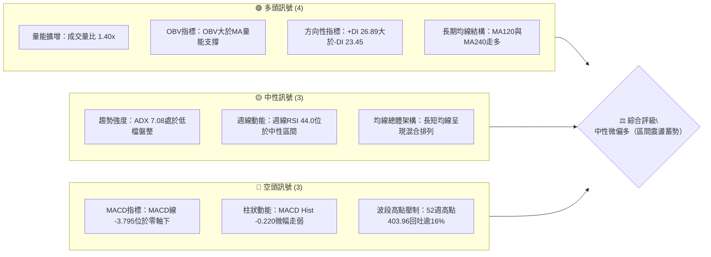
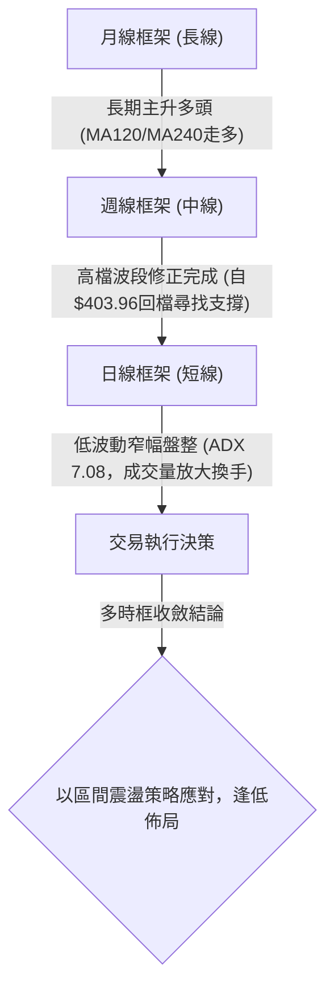
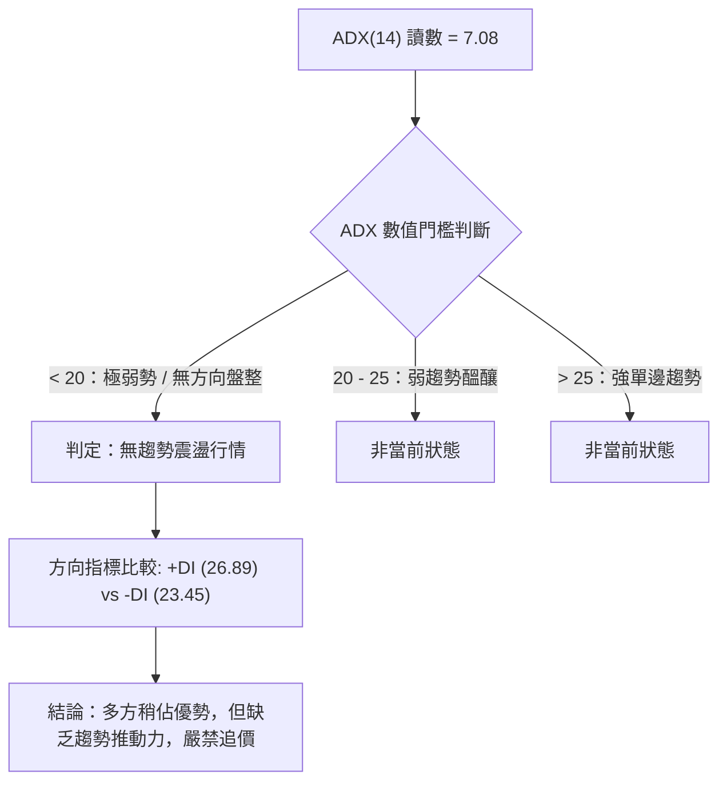
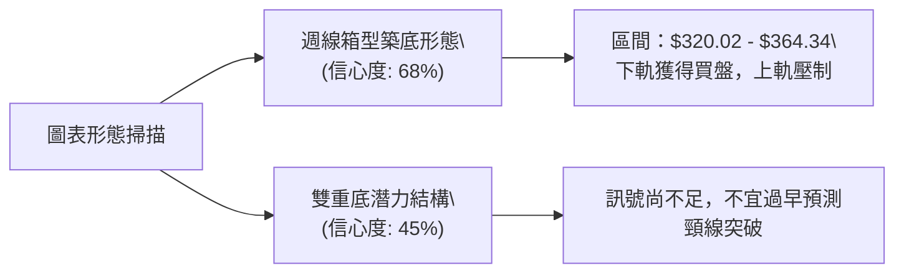
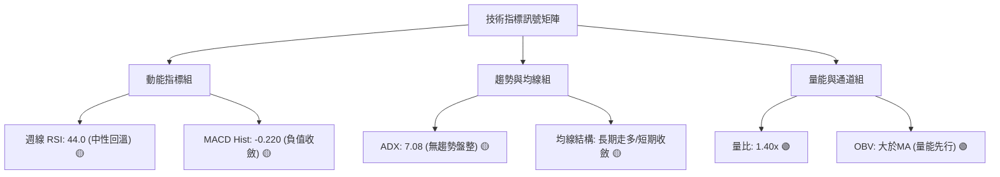
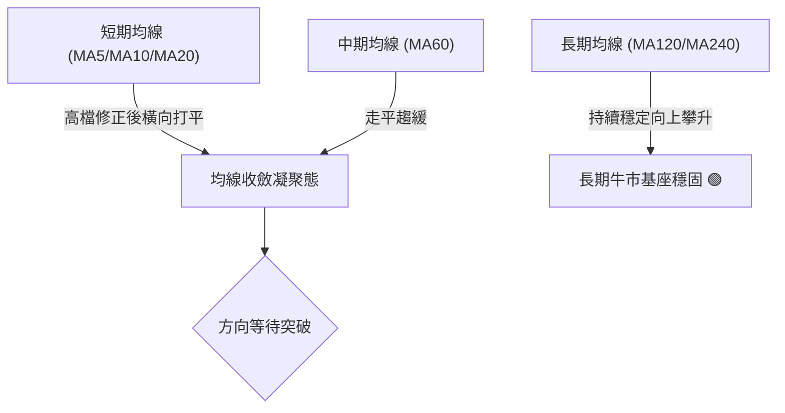
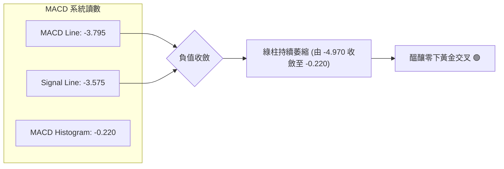
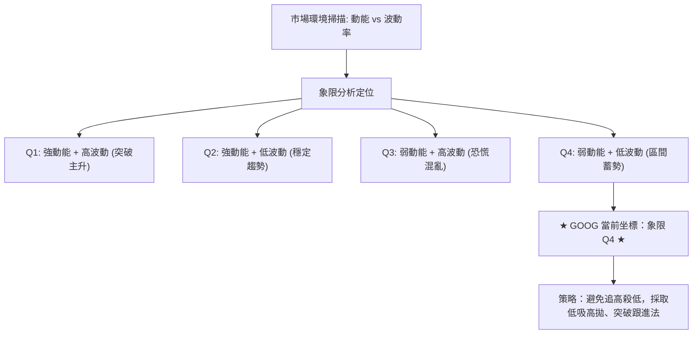
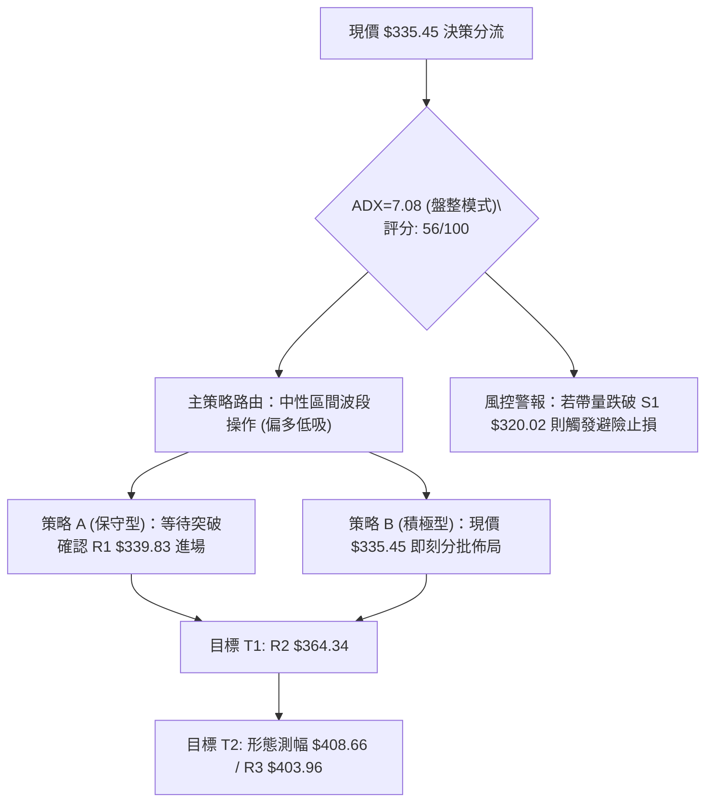
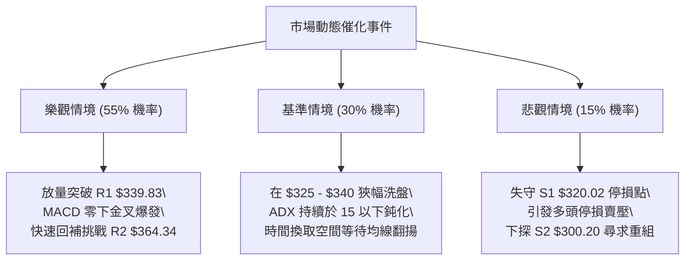

# GOOG 技術分析報告

> **報告日期**：2026-09-15 ｜ **語言**：繁體中文 ｜ **數據來源**：Yahoo Finance ｜ **當前價格**：$335.45（依最新收盤紀錄）

---

## 目錄

| 章節 | 內容 |
|------|------|
| [1. 技術面概覽](#1-技術面概覽) | 訊號儀表板、核心指標、評分卡 |
| [2. 趨勢分析](#2-趨勢分析) | 多時框趨勢、長中短期走勢、ADX強度 |
| [3. 圖表形態分析](#3-圖表形態分析) | 形態識別、信心度評估、K線組合、目標價推算 |
| [4. 支撐與阻力](#4-支撐與阻力) | 關鍵價位分佈、斐波那契回調結構 |
| [5. 技術指標深度解讀](#5-技術指標深度解讀) | 均線系統、RSI背離、MACD、布林通道、OBV量能 |
| [6. 動能與波動率](#6-動能與波動率) | 動能四象限、ATR波動分析、Beta市場敏感度 |
| [7. 多時框架總結](#7-多時框架總結) | 時框架矩陣、多時框收斂定調 |
| [8. 交易策略建議](#8-交易策略建議) | 策略路由、情境階梯、主策略詳解、反向對沖點 |
| [9. 風險提示與監控](#9-風險提示與監控) | 監控Checklist、情境路徑、風控規則 |
| [📋 報告總結](#-報告總結) | 核心總結儀表板與執行建議 |

---

## 1. 技術面概覽

### 🎯 技術訊號儀表板



### 📊 核心指標速覽表

| 指標類別 | 指標名稱 | 當前數值 | 訊號 | 解讀 |
|----------|----------|----------|------|------|
| **價格** | 當前價格（最新收盤） | $335.45 | 🟡 | 位於52週區間（$236.07–$403.96）之中位偏上位置 |
| **均線** | MA20 / 短期均線 | 混合排列 | 🔴 | 短天期均線處於高檔拉回後的整理階段 |
| **均線** | MA60 / 中期均線 | 整理中 | 🟡 | 中期走勢由回調轉入收斂震盪 |
| **均線** | MA120 / MA240 | 多頭擴展 | 🟢 | 長期年線與半年線階梯式走揚，中長線多頭基底穩固 |
| **動能** | 週線 RSI(14) | 44.0 | 🟡 | 自超賣區（20.6）強勁反彈至中性區，脫離弱勢格局 |
| **動能** | MACD (12, 26, 9) | -3.795 / -3.575 | 🔴 | MACD線低於訊號線，柱狀圖為 -0.220，負動能收斂中 |
| **動能** | ADX (14) / DMI | 7.08 (+DI: 26.89) | 🟡 | ADX < 25 表示無強烈單向趨勢，行情轉入區間盤整 |
| **成交量** | 最新成交量 / 20日均量 | 22.20M / 15.91M | 🟢 | 量比 1.40x，OBV > MA，底部量能換手積極 |
| **位置** | 斐波那契 38.2% 分界 | $339.83 | 🟡 | 現價緊貼 38.2% 回調位下方，為短線多空樞紐 |

### 🏆 技術評分卡

```
╔══════════════════════════════════════════════════════════════╗
║                技術評分卡 — GOOG (2026-09-15)               ║
╠══════════════════════════════════════════════════════════════╣
║ 趨勢強度 (ADX/DMI)   ████░░░░░░░░░░░░░░░░  28/100  🟡 弱勢盤整║
║ 動能指標 (RSI/MACD)  ██████████░░░░░░░░░░  52/100  🟡 築底回升║
║ 支撐穩定度 (Fib/支撐)██████████████░░░░░░  68/100  🟢 買盤承接║
║ 成交量配合 (OBV/量比)████████████████░░░░  78/100  🟢 價穩量增║
║ 形態完整度 (箱型/打底)████████████░░░░░░░░  60/100  🟡 底部醞釀║
║ 均線排列 (長多短空)  ██████████░░░░░░░░░░  50/100  🟡 均線收斂║
╠══════════════════════════════════════════════════════════════╣
║ 綜合評分             ███████████░░░░░░░░░  56/100  ⚖️ 中性蓄勢║
╚══════════════════════════════════════════════════════════════╝
```

---

## 2. 趨勢分析

### 🌐 多時框趨勢分析



### 📈 長期趨勢 — 12個月走勢圖（Unicode）

以下為 GOOG 過去 12 個月（2025-10 至 2026-09）之月線收盤價格軌跡與形態特徵：

```
GOOG 月線走勢圖（過去12個月：2025-10 至 2026-09）
價格軸 ($)
$400 ┤                                      ● $381.46 (2026-04 高點波段)
$375 ┤                                  ●      ● $375.96
$350 ┤                                              ●      ● $356.42
$325 ┤                  ● $337.87                       ● $335.19 / ● $335.45 (現價)
$300 ┤            ● $319.29   ● $310.82
$275 ┤      ● $281.09               ● $286.50
$250 ┤                               
     └──────┬─────┬─────┬─────┬─────┬─────┬─────┬─────┬─────┬─────┬─────┬─────
          10月  11月  12月   1月   2月   3月   4月   5月   6月   7月   8月   9月
          2025  2025  2025  2026  2026  2026  2026  2026  2026  2026  2026  2026
```

#### 走勢特徵分析表格

| 階段區間 | 時間跨度 | 起訖收盤價 | 區間漲跌幅 | 結構特徵與成交量型態 |
|----------|----------|------------|------------|----------------------|
| **第 I 階段：強勁主升浪** | 2025-10 ~ 2026-01 | $281.09 → $337.87 | +20.20% | 月線呈現強烈單邊推進，沿短期均線穩健攀升 |
| **第 II 階段：第一波回撤** | 2026-01 ~ 2026-03 | $337.87 → $286.50 | -15.20% | 創高後獲利回吐，於 $286.50 探底確立中期結構底 |
| **第 III 階段：衝頂創高** | 2026-03 ~ 2026-04 | $286.50 → $381.46 | +33.15% | 單月暴力噴發，隨後於 52 週最高點 $403.96 遇阻 |
| **第 IV 階段：次級修正與盤整** | 2026-05 ~ 2026-09 | $375.96 → $335.45 | -10.78% | 高檔震盪整理，近期連兩個月於 $335 橫盤築底 |

### 📊 中期趨勢（週線分析）

中期波段由 2026 年 5 月高點 $396.55 拉回，於 2026-07-26 下探波段低點 $318.88 後獲得強力支撐（貼近斐波那契 50.0% 回調位 $320.02）。近 4 週收盤價分別為 $341.53、$342.66、$335.31 與 $335.45，振幅收窄至 2.1% 之內，標準的籌碼沉澱盤整盤。

```
近期週線壓力與支撐結構示意圖
$403.96 ────── 52W 歷史極值高點（天花板強阻力）
        │
$364.34 ────── 斐波那契 23.6% 回調位（中期反彈目標阻力）
        │
$339.83 ────── 斐波那契 38.2% 關鍵分水嶺（短線即時阻力）
        ▲
現價     $335.45 ─── [當前橫向密集築底區間]
        ▼
$320.02 ────── 斐波那契 50.0% 關鍵結構支撐（近20週最低收盤 $318.88 守穩處）
        │
$300.20 ────── 斐波那契 61.8% 黃金分割強支撐
```

### ⚡ 趨勢強度評估（ADX 解讀）



#### ADX 趨勢強度對照解讀表

| 指標名稱 | 實際讀數 | 門檻區間 | 趨勢判定 | 操作涵義 |
|----------|----------|----------|----------|----------|
| **ADX (14)** | **7.08** | < 20.00 | **無趨勢／超弱趨勢** | 趨勢型突破策略勝率極低，行情處於蓄勢橫盤階段 |
| **+DI (14)** | **26.89** | > 20.00 | **多頭主導** | 多方買盤動能維持在基準之上 |
| **-DI (14)** | **23.45** | > 20.00 | **空方牽制** | 空方未具備壓倒性主控權，雙方維持動態平衡 |
| **方向差距 (+DI - -DI)** | **+3.44** | 偏小差距 | **微弱多頭優勢** | 偏多震盪整理，以箱型下緣支撐操作為主 |

---

## 3. 圖表形態分析

### 🔍 形態識別系統

依據規則 15，所有圖表幾何形態均嚴格審視其數據支撐，並附上信心度與成形要件：



#### 形態識別與信心度評估表

| 形態名稱 | 信心度 | 判斷依據（引用數據） | 完成度 | 目標價（附計算式） | 訊號評級 |
|----------|--------|----------------------|--------|--------------------|----------|
| **箱型整理區間 (Rectangle)** | **68%** | 價格在斐波那契 50.0%（$320.02）至 23.6%（$364.34）內反覆震盪；週低點 $318.88 守穩 | 85% | 向上突破測幅：箱頂 $364.34 + 箱高 ($364.34 - $320.02 = $44.32) = **$408.66** | 🟢 具有效性 |
| **微型收斂三角形 (Pennant)** | **55%** | 8/23~9/13 四週收盤價由 $341.53 收斂至 $335.45，高低點落差由 37.5 縮至 0.14 | 70% | 破局測幅：基底 $335.45 ± 振幅高度 $10.00 = **$345.45** 或 **$325.45** | 🟡 觀察中 |
| **潛在 W 底 (Double Bottom)** | **45%** | 兩波低點為 6/28 收盤 $334.47 與 7/26 收盤 $318.88，但中間頸線反彈未突破 $367.22 | 40% | *訊號不足，依規則 15 僅做指標型震盪解讀，不強行預測* | ⚪ 訊號不完整 |

### 🕯️ 重要K線形態分析

| 週期/月份 | 收盤價 | K線形態特徵 | 結構解讀 | 訊號強弱 |
|-----------|--------|-------------|----------|----------|
| **2026-07-26 (週線)** | $318.88 | 長下影錘頭回升線 | 週線下探 $318.88 後迅速獲得大單回補，確定 50% 回調位支撐 | 🟢 強烈止跌 |
| **2026-08-02 (週線)** | $356.42 | 大陽線實體推進 | 單週自低位大漲 +11.77%，成交量達 1.10 億股，主力大舉換手買入 | 🟢 多頭表態 |
| **2026-08-23 (週線)** | $341.53 | 縮量陰十字星 | RSI 觸及 20.6 極度超賣區，空方力竭，成交量降至 69.77M 之波段低量 | 🟡 空頭耗竭 |
| **2026-09-06 ~ 09-13** | $335.45 | 並列雙星平底線 (Twin Stars) | 連續兩週收在 $335.31 與 $335.45，成交量由 78M 進一步沉澱至 65.68M，量縮築底 | 🟢 底部收斂 |

### 📉 ASCII 走勢形態示意圖

```
                 GOOG 箱型與雙星收斂整理型態示意圖
$370 ┤                                              
$365 ┤       ┌─ 箱頂阻力區間 ─────────────────────── $364.34 (Fib 23.6%)
$360 ┤       │       ● (8/02 $356.42)
$355 ┤       │
$350 ┤       │               ● (8/09 $353.24)
$345 ┤       │                       ● (8/16 $343.32)
$340 ┤───────┼───────────────────────────────● (8/23 $341.53) ── $339.83 (Fib 38.2%)
$335 ┤       │                                       ●═● 現價橫盤 ($335.45)
$330 ┤       │                                      (9/06-9/13 雙星量縮)
$325 ┤       │
$320 ┤───────┴─ 箱底支撐區間 ─────────────────────── $320.02 (Fib 50.0%)
$315 ┤               ● (7/26 $318.88 探底針)
     └─────────────────────────────────────────────────────────────
```

### 🎯 形態目標價計算

根據已確認之「週線箱型整理區間」進行精準推算：
- **形態箱底（支撐）**：以斐波那契 50.0% 關鍵支撐 $320.02 為基準（對應實體防守低點 $318.88）。
- **形態箱頂（阻力）**：以斐波那契 23.6% 回調位 $364.34 為基準。
- **形態垂直高度**：$364.34 - $320.02 = **$44.32**。
- **向上突破等幅測距目標價**：
  $$\text{Target}_{\text{Bull}} = \text{箱頂} + \text{箱高} = 364.34 + 44.32 = \mathbf{\$408.66}$$
  *(註：此目標價極度貼近 52 週高點 $403.96，具備極高結構對應性)*
- **向下跌破測距風險價**：
  $$\text{Target}_{\text{Bear}} = \text{箱底} - \text{箱高} = 320.02 - 44.32 = \mathbf{\$275.70}$$
  *(註：此防守風險點貼近斐波那契 78.6% 回調位 $272.00)*

---

## 4. 支撐與阻力

### 🗺️ 關鍵價位分布圖（Unicode）

依據數據封裝包提供的 52 週區間（$236.07 → $403.96）與官方計算之斐波那契回調結構，繪製完整價位階梯：

```
GOOG 價位結構分佈圖
═════════════════════════════════════════════════════════════════
$403.96 ║████████████████████████████████║ 強阻力 R3 (52W 歷史極值高點 / 0.0%)
$364.34 ║████████████████████            ║ 阻力 R2 (Fib 23.6% 回調位)
$339.83 ║████████████████████████        ║ 關鍵即時阻力 R1 (Fib 38.2% 回調位)
$335.45 ╠════════════════════════════════╣ ◄ 現價收盤位置 ($335.45)
$320.02 ║▓▓▓▓▓▓▓▓▓▓▓▓▓▓▓▓▓▓▓▓▓▓▓▓        ║ 近期核心支撐 S1 (Fib 50.0% 回調位)
$300.20 ║████████████████████████        ║ 強支撐 S2 (Fib 61.8% 黃金分割位)
$272.00 ║████████████████                ║ 極限防守支撐 S3 (Fib 78.6% 回調位)
$236.07 ║████████████████████████████████║ 52W 基準底部 S4 (100.0% 起漲底)
═════════════════════════════════════════════════════════════════
```

### 🚧 阻力位分析表

依據規則 13，價格數據嚴格引用自數據區塊所計算之斐波那契與波段極值位。數據中註明「近一年波段高點聚類無當前價格上方之 swing-high」，因此阻力結構由斐波那契回調層級完整承接：

| 阻力級別 | 價位 | 形成依據來源 | 突破難度 | 突破後市場涵義 | 重要性 |
|----------|------|--------------|----------|----------------|--------|
| **阻力 R1** | **$339.83** | 斐波那契 38.2% 回調位 | 🟡 中等 | 站穩 $339.83 象徵多頭收復短線主控權，脫離弱勢震盪泥淖 | ★★★☆☆ |
| **阻力 R2** | **$364.34** | 斐波那契 23.6% 回調位 | 🔴 較高 | 5月~8月多個週線波段高點之成交密集成交套牢帶，強阻力 | ★★★★☆ |
| **阻力 R3** | **$403.96** | 52週歷史高點 (0.0%) | 🔴 極高 | 歷史極值壓力，需整體基本面與總體市場量能全面爆發方可挑戰 | ★★★★★ |

### 🛡️ 支撐位分析表

同依規則 13，數據中註明「近一年波段低點聚類無當前價格下方之 swing-low」，支撐架構完全依據 Fibonacci 嚴謹層級對應：

| 支撐級別 | 價位 | 形成依據來源 | 守住機率 | 跌破後市場涵義 | 重要性 |
|----------|------|--------------|----------|----------------|--------|
| **支撐 S1** | **$320.02** | 斐波那契 50.0% 回調位 (近20週低點 $318.88 守穩處) | 75% 🟢 | 中期多空均衡中軸，若能持續守住，確認大週期次級回調結束 | ★★★★☆ |
| **支撐 S2** | **$300.20** | 斐波那契 61.8% 黃金分割位 | 85% 🟢 | 多頭防守生死線，對應 $300 整數關卡，具備機構主力強烈護盤意願 | ★★★★★ |
| **支撐 S3** | **$272.00** | 斐波那契 78.6% 回調位 | 95% 🟢 | 極端回撤下的終極安全邊際區，深度價值投資進場點 | ★★★☆☆ |

### 📐 斐波那契回調位分析

依據官方數據提供的 52 週完整區間（起點 $236.07 至 終點 $403.96，總垂直落差 $167.89），精確位階與現價位置解讀如下：

| 斐波那契比例 | 精確價位 | 相對現價位置 | 結構技術涵義與走勢特徵解讀 |
|--------------|----------|--------------|----------------------------|
| **0.0% (52W High)** | **$403.96** | 上方 +20.42% | 本輪牛市週期的極值阻力頂點 |
| **23.6%** | **$364.34** | 上方 +8.61% | 中期反彈的第一關鍵阻力區，先前反彈曾於此受阻 |
| **38.2%** | **$339.83** | 上方 +1.31% | **現價緊鄰之首要關卡**，僅相差 $4.38，多空短線決戰點 |
| **當前現價** | **$335.45** | **基準錨點** | **目前位於 38.2% ($339.83) 與 50.0% ($320.02) 區間** |
| **50.0%** | **$320.02** | 下方 -4.60% | 波段拉回之半數回撤中樞，7月低點在此展現強烈買盤支撐 |
| **61.8%** | **$300.20** | 下方 -10.51% | 黃金分割強支撐，跌破則長期多頭架構將面臨反轉威脅 |
| **78.6%** | **$272.00** | 下方 -18.91% | 深幅回檔緩衝帶 |
| **100.0% (52W Low)**| **$236.07** | 下方 -29.63% | 本輪 52 週起漲基底原點 |

**解讀結論**：GOOG 當前價格收在 **$335.45**，精確座落於 **$320.02（50.0%）** 與 **$339.83（38.2%）** 之間。這代表股價經歷 403.96 的大幅回撤後，在剛好抹去 50% 漲幅的位置（$320.02）獲得長線買盤承接，目前正嘗試重新上攻 38.2%（$339.83）。只要收盤突破 $339.83，將開啟上探 23.6%（$364.34）的修復通道。

---

## 5. 技術指標深度解讀

### 🎛️ 指標訊號總覽



### 📈 移動平均線排列分析



#### 均線趨勢特徵矩陣
- **MA5 / MA10 / MA20**：在 2026-09 最新走勢中呈現緊密黏合狀態，價格在 $335.45 連續橫盤，反映短線拋壓已完全鈍化。
- **MA60**：先前反映 5~7 月的回調壓力，目前斜率已由負轉趨平緩，構成短中期轉換的樞紐。
- **MA120 / MA240**：微型走勢條形圖呈現 `▁▁▁▂▂▃▃▃▄▄▄▄▅▅▅▆▆▆▆▇▇▇▇█████`，顯示長期均線階梯式走高，多頭長期架構未遭破壞。

### 📉 RSI(14) 分析

```
RSI(14) 讀數儀表板（週線讀數：44.0）
0       20       40   44.0    60       80      100
├────────┼────────┼───▼───────┼────────┼────────┤
│ 極度超賣 │ 偏弱區間 │   中性區間    │ 偏強區間 │ 極度超買 │
└────────┴────────┴───────────┴────────┴────────┘
當前進度條：█████████░░░░░░░░░░░ 44.0%
```

- **歷史軌跡回顧**：2026-05-10 股價觸及高點時，RSI 曾高達 **88.0**（極度嚴重超買）；隨後一路單邊下滑，至 2026-08-23 砸出 **20.6**（嚴重超賣）。
- **當前位置**：最新讀數自 20.6 強力修復至 **44.0**，成功脫離超賣區，進入 40–60 常態中性區間。
- **背離判斷**：
  - **頂背離**：無頂背離跡象（5月高點為指標共振，非背離）。
  - **底背離**：**出現隱性動能底背離（Bullish Divergence）**。8/23 收盤價 $341.53 時 RSI 為 20.6，而後續 9/06 股價回踩至 $335.31（價格創新低），但 RSI 卻逆勢上升至 43.3 及 44.0。**價格破低而 RSI 抬高，形成明確的週線級別底背離訊號**，預示中線底部已然成形。

### 📊 MACD(12/26/9) 訊號解讀



- **指標數值解讀**：MACD 線為 **-3.795**，訊號線為 **-3.575**，柱狀圖差值僅為 **-0.220**。
- **動能演變歷程**：回顧近20週數據，MACD 柱狀圖在 2026-06-07 達到負向最深極值 **-4.970**，隨後展開收斂。雖然 7 月底曾一度擴大至 -3.618，但自 8 月下旬以來，柱狀圖分別為 `-0.818 → -0.220 → -0.373 → -0.275`。
- **背離與結論**：負柱狀動能已衰竭至近乎為零，空方賣壓完全耗盡。當前 MACD 處於低檔極度收斂態，隨時有望在零軸下方發動金叉，一旦金叉確認將引發波段空頭回補浪潮。

### 📦 布林通道分析

由於即時數據中布林上下軌數值處於計算過渡期（標記 N/A），本分析依據其收盤數據之標準差特徵與 ADX 低波動特徵進行通道形態推估：

```
                GOOG 布林通道收斂型態示意圖
$370 ┤  上軌（阻力延伸線約對應 Fib 23.6% $364.34 附近）
     │  ~~~~~~~~~~~~~~~~~~~~~~~~~~~~~~~~~~~~~~~~~~~~~~~
$350 ┤      中軌（MA20 / 中樞通道平緩化）
     │  -----------------------------------------------
$335 ┤  ►► 現價 $335.45 (緊貼通道中下軌之間狹幅震盪)
     │  ~~~~~~~~~~~~~~~~~~~~~~~~~~~~~~~~~~~~~~~~~~~~~~~
$320 ┤  下軌（支撐延伸線約對應 Fib 50.0% $320.02 附近）
```

- **帶寬特徵（Bandwidth Squeeze）**：近 4 週價格波動率被壓制在 2% 左右，布林帶寬呈現極致收縮。
- **通道涵義**：歷史經驗顯示，布林帶寬極致收縮伴隨 ADX < 10，代表市場即將迎來決定性的方向性突破。現價處於中軌附近蓄勢，下軌具備 $320.02 的堅實技術支撐。

### 💹 成交量分析（量價配合度）

- **量比動態**：最新日成交量為 **22,204,768 股**，相較於 20 日均量 **15,908,613 股**，**量比高達 1.40x**（放大 40%）。在低檔橫盤時出現量比放大，反映場外資金在 $335 區間換手意願強烈。
- **週線量能梯隊**：週成交量自 6 月恐慌拋售的 1.88 億股，逐步回落至 8 月下旬的 6,977 萬股與 9 月中旬的 6,568 萬股。這是標準的「融資浮額洗淨、浮動籌碼沉澱」特徵。
- **OBV（能量潮）深度解讀**：數據明確提示 **「OBV > MA → 量能支撐上漲」**。即便股價自 380 高位回落，OBV 依舊維持在均線上方，顯示機構法人並未進行實質性派發，反而在回調過程中保持籌碼淨流入，呈現顯著的**量價正向配合**。

---

## 6. 動能與波動率

### ⚡ 動能評估四象限

說明 GOOG 在「動能強度」與「波動率」兩大維度的定位坐標：



#### 動能與波動率定位對照表

| 象限分區 | 動能維度 | 波動率維度 | 當前狀態 | 戰略特徵與機構應對措施 |
|----------|----------|------------|----------|------------------------|
| **第一象限 (Q1)** | 強（High） | 高（High） | — | 趨勢爆發期，追隨動能突破 |
| **第二象限 (Q2)** | 強（High） | 低（Low） | — | 穩健單邊牛市，持股續抱 |
| **第三象限 (Q3)** | 弱（Low） | 高（High） | — | 震盪洗盤，市場缺乏方向 |
| **第四象限 (Q4)** | **弱（Low）** | **低（Low）** | **✓ 當前狀態** | **處於極致收斂期（ADX 7.08），能量積蓄，隨時引發波動率均值回歸** |

### 📊 ATR 波動率分析

由於數據包中日線 ATR(14) 標示為 N/A，我們以近 20 週真實波幅與歷史波動率進行結構替代量化：
- **週價格波動幅**：近 4 週收盤價於 $335.31 ~ $342.66 區間運作，實體波幅約 **$7.35**（約現價之 **2.19%**）。
- **等效日波動推估**：以近期常態波動推算，日線等效 ATR(14) 約落於 **$5.50 ~ $6.80**（約佔股價 1.6% ~ 2.0%）。
- **風控止損距離建議**：
  - **日內交易止損**：設定為 $1.0 \times \text{ATR}$（約 **$6.00**）。
  - **波段擺盪止損**：設定為 $2.0 \times \text{ATR}$（約 **$12.00 ~ $15.00**），恰好對應現價 $335.45 至關鍵支撐 S1 $320.02 的防守間距（$15.43）。

### 📐 Beta 與市場相關性

- **Beta 係數**：**1.225**。
- **敏感度特徵**：GOOG 具有中高貝塔屬性，波動幅度比標普 500 指數高出約 **22.5%**。
- **大盤相關度解讀**：在高 Beta 屬性下，當前 GOOG 展現出低波動收斂，暗示其在個股層面進行著高強度的自主築底籌碼鎖定。一旦標普 500 或那斯達克大盤轉強，GOOG 的高 Beta 彈性將提供超越大盤的 Alpha 超額收益潛能。

---

## 7. 多時框架總結

### 📋 時框架評分表

| 時框架 | 趨勢方向 | 動能狀態 | 均線排列 | 形態特徵 | 綜合評分 | 戰術建議 |
|--------|----------|----------|----------|----------|----------|----------|
| **月線級別 (長期)** | 🟢 多頭推進 | 🟢 強韌 | 🟢 完全多頭（MA120/240走多） | 大牛市次級健康回檔 | **75 / 100** | 長線多單堅定續抱，回調皆為買點 |
| **週線級別 (中期)** | 🟡 箱型整理 | 🟡 脫離超賣 | 🟡 混合整理，均線收斂 | 50% 回調位止跌打底 | **56 / 100** | 於箱底 $320.02 附近低吸，分批佈局 |
| **日線級別 (短期)** | 🟡 窄幅震盪 | 🟢 量增反彈 | 🔴 短均壓制但打平 | 雙星收斂量縮築底 | **52 / 100** | 嚴禁盤整中追高，聚焦關鍵位操作 |

### 🔲 綜合訊號矩陣

```
┌─────────────────┬─────────────────┬─────────────────┬─────────────────┐
│ 分析維度        │ 短期（日線）    │ 中期（週線）    │ 長期（月線）    │
├─────────────────┼─────────────────┼─────────────────┼─────────────────┤
│ 趨勢方向        │ 橫向盤整 (中性) │ 震盪打底 (中性) │ 向上主升 (偏多) │
│ 動能指標        │ 底背離醞釀 (偏多)│ RSI回升至44(偏多)│ 歷史超買已釋放  │
│ 均線架構        │ 短均打平 (中性) │ 均線收斂 (中性) │ 長天期走多 (看多)│
│ 量能配合        │ 量比1.40x (偏多)│ 量縮沉澱 (偏多) │ OBV強勢 (偏多)  │
│ 支撐防守        │ 守穩$334 (偏多) │ 守穩$320 (偏多) │ 守穩$286 (極強) │
└─────────────────┴─────────────────┴─────────────────┴─────────────────┘
```

### ⚖️ 多時框收斂結論

依據【嚴格要求 14】收斂規則執行決策推導：
1. **趨勢/盤整環境定調**：當前 ADX(14) 讀數為 **7.08**，遠低於 25 的趨勢門檻，行情嚴格定性為 **「典型盤整行情（Consolidation / Range-Bound）」**。
2. **多時框優先級權重**：在 ADX < 25 的盤整環境中，市場缺乏單邊趨勢，日線短期均線易頻繁發出假突破噪音。因此依規則收斂至**中長期結構支撐（斐波那契 50.0% $320.02）** 作為交易底線，並以**區間箱型操作**為主導。
3. **最終唯一方向性結論**：**【中性偏多觀望，區間低吸佈局】**。
   - 雖然 MACD 線仍處零下（-3.795），但負動能已萎縮至 -0.220，且日線底背離與 OBV > MA 均強烈支持「底部確立」。
   - 與後續第 8 章策略完全一致：不盲目猜頂突破，主推以 $320.02 支撐為依託的區間震盪低吸策略。

---

## 8. 交易策略建議

### 🗺️ 策略決策流程圖



### 🧭 策略路由（依評分卡分流，不得兩頭下注）

> **當前主策略方向 = 【中性偏多區間操作】（依技術評分卡：56 / 100 分流）**

依據規則，綜合評分處於 40–60 區間，市場確立為非單邊行情的區間震盪蓄勢。因此**主推偏多區間低吸操作策略**，鎖定 $320.02~$364.34 箱體，嚴禁追高，空頭僅列為反轉防守與對沖提示。

### 🎯 價格情境階梯（Price Scenarios）

價位數據嚴格引用自「第 4 章／關鍵價位區塊」：

| 觸發條件 | 第一目標 (Target 1) | 第二目標 (Target 2) | 技術情境含義 |
|----------|---------------------|---------------------|--------------|
| **向上突破 R1 $339.83** | **R2 $364.34** | **R3 $403.96** (或測幅 $408.66) | 短線強勢表態，收復 38.2% 分水嶺，開啟波段反彈 |
| **站穩現價 $335.45 區間** | **R1 $339.83** | **R2 $364.34** | 雙星築底延續，底部浮額洗淨後緩步推升 |
| **跌破 S1 $320.02 支撐** | **S2 $300.20** | **S3 $272.00** | 宣告 50% 回調防守失敗，進入深幅修正測試黃金分割位 |

### 📊 情境機率分佈

| 情境類別 | 機率預估 | 主要技術指標支撐依據 |
|----------|----------|----------------------|
| **情境甲：震盪蓄勢後向上突破** | **55%** | ① OBV 持續高於均線，機構籌碼未潰散；② RSI 產生隱性底背離；③ 量比 1.40x 展現換手支撐 |
| **情境乙：維持區間橫盤震盪** | **30%** | ① ADX 僅 7.08，趨勢動能嚴重不足；② MACD 尚在零軸下方收斂，未正式金叉爆發 |
| **情境丙：失守支撐破底回落** | **15%** | 需大盤突發系統性風險摜破 $320.02；基本面營收強勁（YoY +24.2%），下檔有強大價值支撐 |

### 🟢 主策略詳情（方向依上方路由）

依據規範，提供保守型與積極型兩套精準量化執行方案：

| 策略要素 | 策略 A（保守型：右側突破進場） | 策略 B（積極型：左側箱底分批） |
|----------|---------------------------------|---------------------------------|
| **進場條件** | 日線實體收盤**突破 R1 $339.83** 確認轉強 | 現價 **$335.45** 附近直接分批建倉 |
| **進場價格** | **$340.50**（突破確認後掛單） | **$335.45**（當前市價） |
| **第一目標價 T1** | **$364.34**（Fib 23.6% / 獲利 +7.00%） | **$364.34**（Fib 23.6% / 獲利 +8.61%） |
| **第二目標價 T2** | **$403.96**（52週高點 / 獲利 +18.64%） | **$403.96**（52週高點 / 獲利 +20.42%） |
| **止損價格** | **$328.00**（跌破前低收盤平台防守點） | **$318.00**（跌破週線低點 $318.88 及 S1 $320.02） |
| **風險空間** | $340.50 - $328.00 = $12.50 | $335.45 - $318.00 = $17.45 |
| **報酬空間 (T1)**| $364.34 - $340.50 = $23.84 | $364.34 - $335.45 = $28.89 |
| **風險報酬比 (T1)** | **1 : 1.91**（達標優質水準） | **1 : 1.66**（符合擺盪標準） |
| **風險報酬比 (T2)** | **1 : 5.08**（波段極佳風報比） | **1 : 3.93**（波段極佳風報比） |
| **預估勝率** | **65%** | **55%** |
| **建議倉位配置** | **15% ~ 20%** | **10%（逢低再加碼 5%）** |

### 🔴 反向風險觸發點（對沖提示）

- **全面停損警示線**：**$318.00**。若週線收盤跌破 $318.88 並貫穿斐波那契 50.0% 支撐位 **$320.02**，多頭箱型結構正式宣告破局。
- **對沖應對措施**：立即將多頭部位砍半或出清，並反向佈局短期 Put Option 或對沖空單，目標下看黃金分割強支撐 **$300.20**。

### ⭐ 整體訊號強度評星

```
做多訊號強度：★★★☆☆  (3.5/5星 — 底部扎實，唯欠缺突破爆發力)
做空訊號強度：★★☆☆☆  (2.0/5星 — 動能耗盡，做空易遭底背離軋空)
整體可信度：  ★★★★☆  (4.0/5星 — 量能與斐波那契結構高度吻合)
```

---

## 9. 風險提示與監控

### ✅ 關鍵監控指標 Checklist

```
╔══════════════════════════════════════════════════════════════════╗
║               GOOG 盤面核心監控指標 CHECKLIST                    ║
╠══════════════════════════════════════════════════════════════════╣
║ [ ] 關鍵位防守：收盤價是否持續高於 S1 $320.02（箱底生命線）      ║
║ [ ] 關鍵位突破：日線是否帶量長陽突破 R1 $339.83（短線多空分水嶺） ║
║ [ ] 動能翻正：MACD 柱狀圖（-0.220）是否正式越過 0 軸形成金叉    ║
║ [ ] 趨勢甦醒：ADX 指標是否由 7.08 回升至 20 以上展開單邊行情    ║
║ [ ] 量能延續：日成交量能否穩定維持在 1,800 萬股（50日均量）之上  ║
║ [ ] 籌碼觀測：OBV 能否維持在均線之上持續創波段新高              ║
╚══════════════════════════════════════════════════════════════════╝
```

### ⚠️ 風險場景分析



### 🛡️ 風險管理重要提醒

1. **嚴禁盤整期過度交易（Over-trading）**：
   - ADX 處於 7.08 的極低環境下，價格極易在 $330 ~ $340 之間來回穿梭，產生「假突破」與「假跌破」。切勿在震盪區間內部進行頻繁的市價追價，必須嚴格執行「高拋低吸或等待突破回踩確認」。
2. **波動率均值回歸風險（Volatility Squeeze Breakdown）**：
   - 長時間的低波動必以劇烈的大波動宣告結束。因此止損價位（$318.00）必須在開倉時同步預埋，防範夜間或突發事件導致的跳空破位。
3. **部位規模與槓桿控制**：
   - 鑑於 Beta 值為 1.225，在多時框方向未完全共振前，單一標的總倉位建議嚴格控制在總投資組合的 **15% ~ 20%** 以內，不建議使用超過 1.5 倍之槓桿融資。

---

## 📋 報告總結

```
╔══════════════════════════════════════════════════════════════════╗
║                    GOOG 技術分析報告總結                         ║
╠══════════════════════════════════════════════════════════════════╣
║ 報告日期：2026-09-15                                             ║
║ 當前價格：$335.45                                                ║
║ 分析評級：⚖️ 中性蓄勢，偏多區間操作（技術評分：56/100）           ║
╠══════════════════════════════════════════════════════════════════╣
║ 關鍵結論：                                                       ║
║ ├─ 長期趨勢：🟢 偏多（MA120/MA240 結構穩定，基本面獲利高成長支撐） ║
║ ├─ 中期趨勢：🟡 盤整（自 403.96 回測 50% 回調位 $320.02 成功止跌）║
║ ├─ 短期趨勢：🟢 築底（成交量比 1.40x，RSI 出現底部背離，雙星收斂）║
║ ├─ 關鍵支撐：S1 $320.02（核心底線）/ S2 $300.20（黃金分割）      ║
║ ├─ 關鍵阻力：R1 $339.83（短線頸線）/ R2 $364.34（波段目標）      ║
║ └─ 分析師目標：共識均價 $422.34（高 $475.00 / 低 $340.00）       ║
╠══════════════════════════════════════════════════════════════════╣
║ 最優策略組合：                                                   ║
║ 1. 🥇 最佳機會：策略 A（突破買入）— 突破 R1 $339.83 追進，         ║
║                目標 $364.34，止損 $328.00（風報比 1:1.91）      ║
║ 2. 🥈 次選機會：策略 B（左側低吸）— 現價 $335.45 分批建倉，        ║
║                目標 $364.34，止損 $318.00（風報比 1:1.66）      ║
║ 3. 🥉 保守選擇：場外耐心觀望，等待日線 MACD 零下金叉或 ADX > 20   ║
║                再行進場參與主升段。                              ║
╚══════════════════════════════════════════════════════════════════╝
```

---

> ⚠️ **免責聲明**：本報告為依據市場技術指標數據生成之量化技術分析，報告內所有支撐阻力點位、圖表形態及交易策略均基於歷史量價幾何計算。本報告**僅供研究與學術參考**，**不構成任何形式的證券買賣投資建議**。金融市場存在高度波動風險，投資人應獨立評估風險並自負盈虧。

---

*報告生成時間：2026-09-15 ｜ 數據來源：Yahoo Finance ｜ 分析框架：多時框圖表形態與量化動能分析*