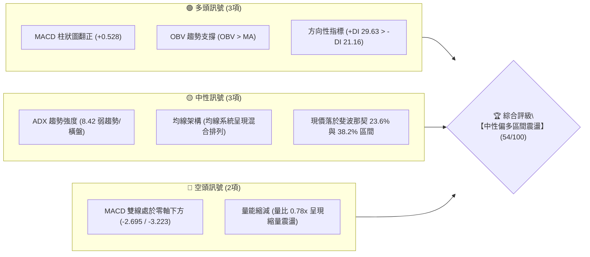
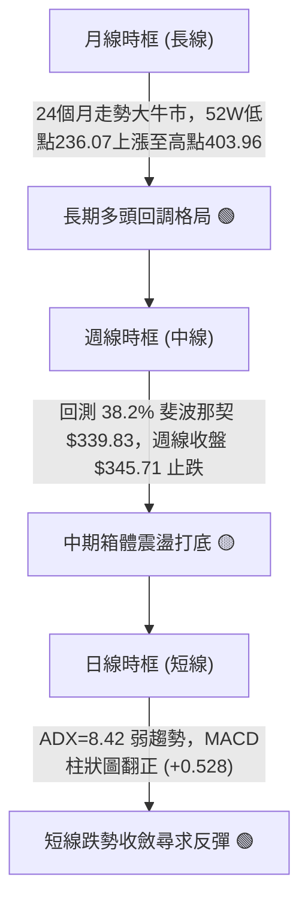
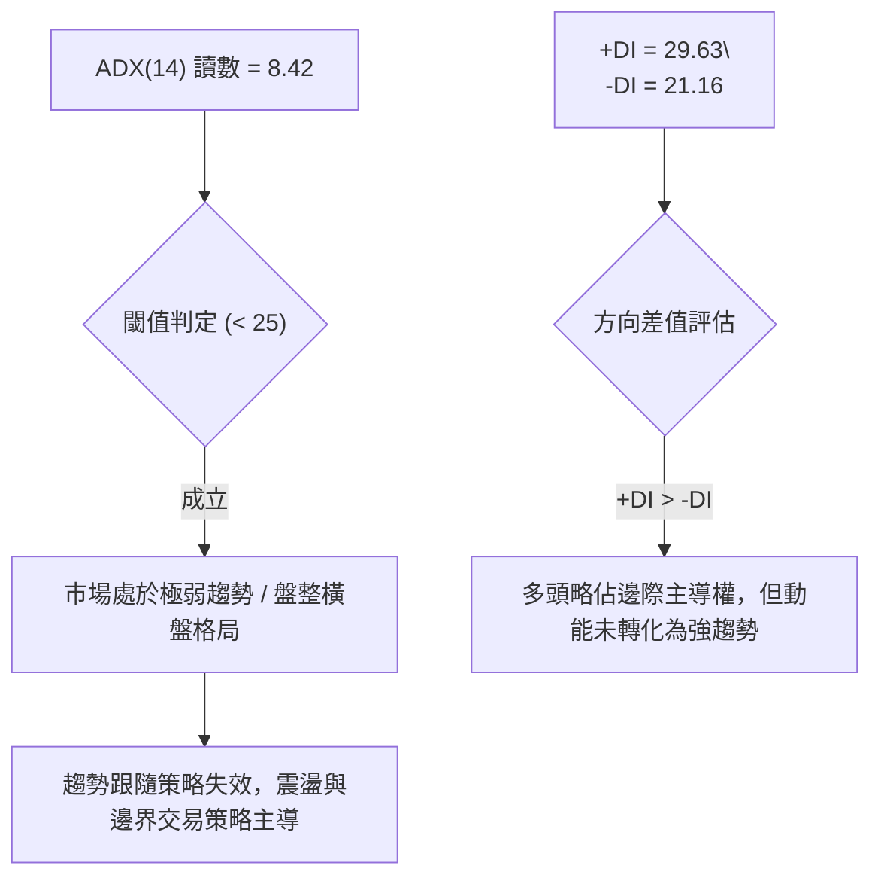
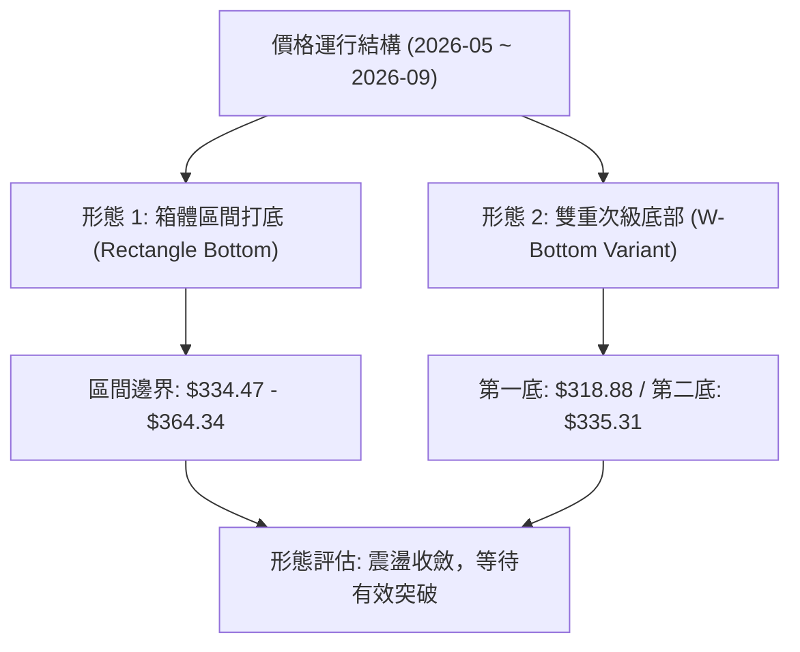
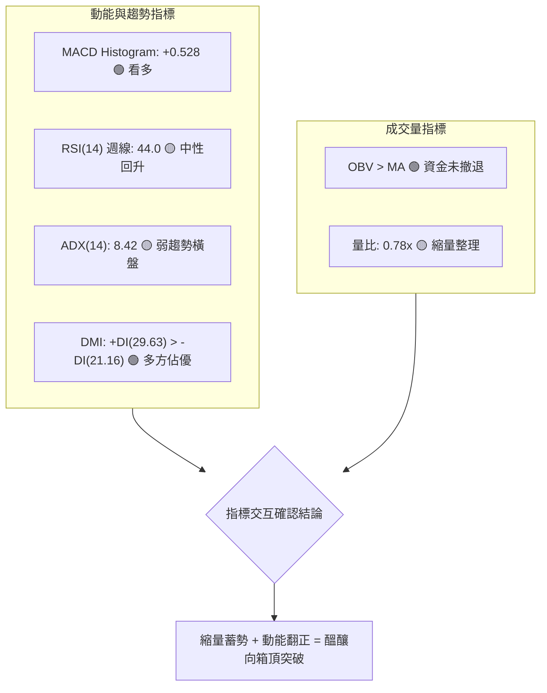
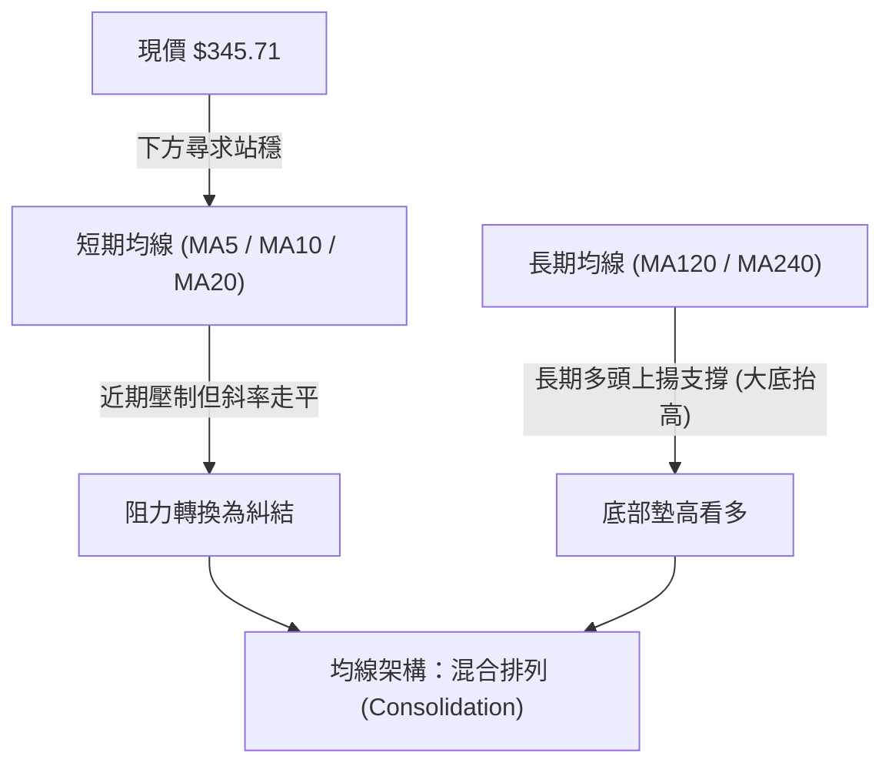
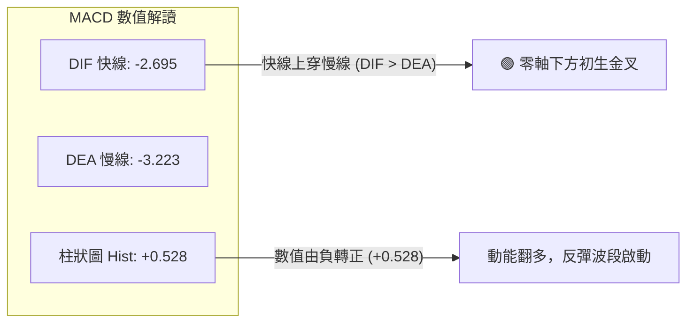
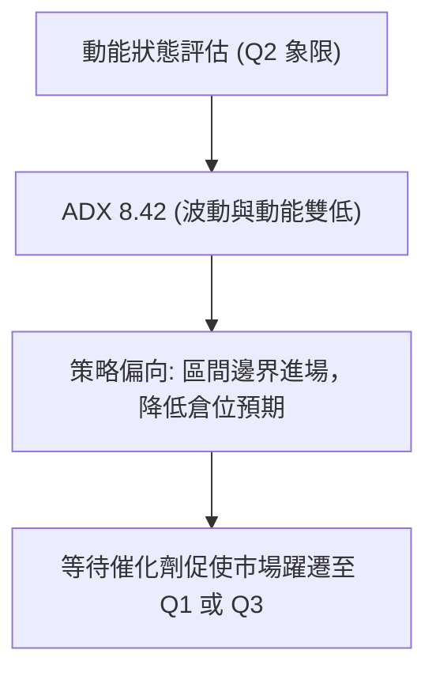
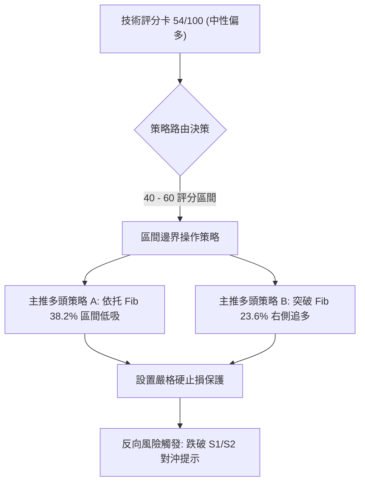
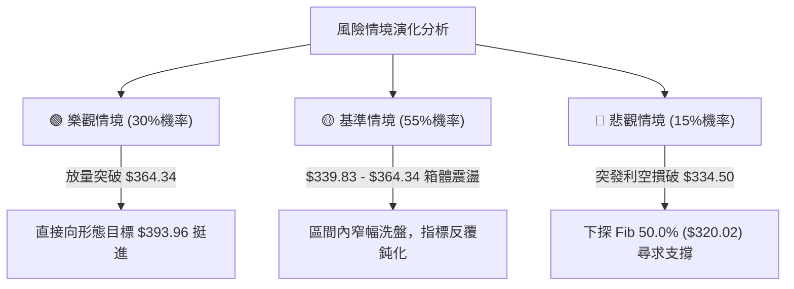

# GOOG 技術分析報告

> **報告日期**：2026-09-16 ｜ **語言**：繁體中文 ｜ **數據來源**：Yahoo Finance ｜ **當前價格**：$345.71

---

## 目錄

| 章節 | 內容 |
|------|------|
| [1. 技術面概覽](#1-技術面概覽) | 訊號儀表板、核心指標、評分卡 |
| [2. 趨勢分析](#2-趨勢分析) | 多時框趨勢、長中短期走勢、ADX 解讀 |
| [3. 圖表形態分析](#3-圖表形態分析) | 形態識別、信心度評估、K線組合 |
| [4. 支撐與阻力](#4-支撐與阻力) | 關鍵價位分布、斐波那契回調結構 |
| [5. 技術指標深度解讀](#5-技術指標深度解讀) | MA/RSI/MACD/布林/OBV量能 |
| [6. 動能與波動率](#6-動能與波動率) | 動能四象限、ATR 波動度、Beta 敏感度 |
| [7. 多時框架總結](#7-多時框架總結) | 多時框評分矩陣、收斂結論 |
| [8. 交易策略建議](#8-交易策略建議) | 策略路由、價格情境階梯、風報比配置 |
| [9. 風險提示與監控](#9-風險提示與監控) | 監控清單、風險場景樹、風控準則 |

---

## 1. 技術面概覽

### 🎯 技術訊號儀表板



### 📊 核心指標速覽表

| 指標類別 | 指標名稱 | 當前數值 | 訊號 | 解讀 |
|:---|:---|:---:|:---:|:---|
| **價格** | 當前收盤價 | $345.71 | 🟡 | 位於52週區間 65.30% 水位，回測 38.2% 斐波那契支撐獲守 |
| **均線** | 短中期 MA | 混合排列 | 🟡 | 短期均線壓制但中長期均線支撐，缺乏單邊動能 |
| **動能** | RSI(14) | 週線 44.0 | 🟡 | 脫離超賣區回升至中性區間，無明顯頂底背離 |
| **動能** | MACD (12,26,9) | -2.695 / -3.223 | 🟢 | 零軸下方初現黃金交叉，Histogram 翻正為 +0.528 |
| **趨勢** | ADX (14) | 8.42 | 🟡 | 數值低於 25，市場處於典型無趨勢盤整/蓄勢狀態 |
| **趨勢** | DMI (+DI / -DI) | 29.63 / 21.16 | 🟢 | +DI 高於 -DI 達 8.47 點，多頭佔據局部邊際優勢 |
| **量能** | 20日成交量比 | 0.78x | 🟡 | 12.41M vs 15.91M，量能萎縮驗證回調進入縮量整理 |
| **量能** | OBV 趨勢 | OBV > MA | 🟢 | 能量潮高於均線，中長線資金未見大規模派發 |

### 🏆 技術評分卡

```
╔══════════════════════════════════════════════════════════════════╗
║              技術評分卡 — GOOG (2026-09-16)                     ║
╠══════════════════════════════════════════════════════════════════╣
║ 趨勢強度 (ADX/DMI)   ██████░░░░░░░░░░░░░░  30/100  🟡 盤整無主趨勢 ║
║ 動能指標 (MACD/RSI)  ████████████░░░░░░░░  60/100  🟢 零軸下金叉   ║
║ 支撐穩定度 (Fib/S)   ██████████████░░░░░░  70/100  🟢 38.2% 支撐強 ║
║ 成交量配合 (OBV/Vol) ████████████░░░░░░░░  60/100  🟢 價跌量縮守成 ║
║ 形態完整度 (結構)    ██████████░░░░░░░░░░  50/100  🟡 矩形整理築底 ║
║ 均線系統 (MA Align)  ██████████░░░░░░░░░░  52/100  🟡 混合糾結等待 ║
╠══════════════════════════════════════════════════════════════════╣
║ 綜合技術評分         ███████████░░░░░░░░░  54/100  ⚖️ 中性觀望/偏多║
╚══════════════════════════════════════════════════════════════════╝
```

---

## 2. 趨勢分析

### 🌐 多時框趨勢分析



### 📈 長期趨勢 — 12個月走勢圖（Unicode）

```
GOOG 月線走勢圖（過去12個月：2025-10 至 2026-09）
價格軸 ($)
$400 ┼                                      ● 381.46 (4月高點)
$380 ┼                                     ╱ ╲
$360 ┼                                    ╱   ● 375.96
$340 ┼                      ● 337.87     ╱     ╲      ● 345.71 (現價)
$320 ┼           ● 319.29  ╱ ╲          ╱       ╲    ╱
$300 ┼          ╱   ╲     ╱   ● 310.82 ╱         ●──● 335.19
$280 ┼  ● 281.09     ●───●            ● 286.50
$260 ┼ ╱            313.19
     └─┬─────────┬─────────┬─────────┬─────────┬─────────┬─────────
     25-10     25-12     26-02     26-04     26-06     26-09 (月份)
```

**歷史走勢特徵分析表格**：

| 週期區間 | 價格起訖 | 漲跌幅 | 走勢特徵解讀 |
|:---|:---:|:---:|:---|
| **2025-09 ~ 2025-11** | $242.92 → $319.29 | +31.44% | 主升浪爆發，連破整數大關，形成強烈長多波段。 |
| **2025-12 ~ 2026-03** | $313.19 → $286.50 | -8.52% | 一次回調確認，在 $286.50 探底形成次級底部。 |
| **2026-04 ~ 2026-05** | $381.46 → $375.96 | 歷史次高 | 資金強勢推升創出 52週高點 $403.96（4月收盤 $381.46）。 |
| **2026-06 ~ 2026-08** | $353.10 → $335.19 | -5.07% | 高位回吐，成交量縮減，最低觸及週線 $318.88 後快速回升。 |
| **2026-09（至今）** | $335.19 → $345.71 | +3.14% | 守住斐波那契 38.2% 位（$339.83），企穩展開弱勢反彈。 |

### 📊 中期趨勢（週線分析）

```
近10週收盤與支撐阻力結構圖：
$364.34 (Fib 23.6% 強阻力)  ────────────────────────────────────────────
$356.42                    ─┬─●(08-02)
$353.24                     │  ╲ ●(08-09)
$345.71 (現價)              │   ╲   ╲               ●(09-20 最新收盤)
$341.53                     │    ╲   ●(08-16)      ╱
$339.83 (Fib 38.2% 關鍵支撐)───┼─────╲───●(08-23)────╱──────────────────────
$335.31                     │      ╲        ●─●(09-06 ~ 09-13 低位平台)
$318.88 (波段洗盤低點)       ●(07-26)
```

週線走勢呈現典型的「雙重底探底回升」雛形：自 2026-07-26 砸出 $318.88 恐慌底後，快速V轉拉升至 $356.42，隨後在 8 月下旬至 9 月上旬於 $335.31 ~ $335.45 進行二次築底。現價 $345.71 成功脫離底部平台，向上挑戰上方均線與阻力密集帶。

### ⚡ 趨勢強度評估（ADX 解讀）



| 指標變數 | 當前讀數 | 標準門檻 | 市場狀態解讀 |
|:---|:---:|:---:|:---|
| **ADX** | 8.42 | < 25 (弱) / > 25 (趨勢) | 處於極低波動休眠期，屬於典型的無趨勢盤整（Range-bound）。 |
| **+DI** | 29.63 | 向上發散即看多 | 多方動能由底部修復，重新越過 25 強弱分水嶺。 |
| **-DI** | 21.16 | 向下收斂即空頭衰竭 | 空方賣壓自高位大幅降溫，已無主動向下摜壓動能。 |
| **收斂結論** | 盤整向上 | ADX 待放量破 20 | **遵循規則14：當前 ADX < 25，定性為盤整行情，以區間邊界與箱體思維為主。** |

---

## 3. 圖表形態分析

### 🔍 形態識別系統



**形態信心度評估表（依規則 15 嚴格約束）**：

| 形態類別 | 信心度 | 判斷依據（引用數據） | 完成度 | 目標價（附嚴格計算式） |
|:---|:---:|:---|:---:|:---|
| **矩形箱體整理 (Rectangle)** | **75%** | 價格受制於斐波那契 23.6%（$364.34）與 38.2%（$339.83），近8週主要在 $335 ~ $356 波動。 | 70% | 向上突破目標 = 頂軌 $364.34 + 高度 ($364.34 - $335.31 = 29.03) = **$393.37** |
| **雙重底 (W-Bottom)** | **55%** | 低點1為 07-26 的 $318.88，低點2為 09-06 的 $335.31（低點墊高），中間頸線為 08-02 的 $356.42。 | 60% | 突破頸線目標 = 頸線 $356.42 + 形態高度 ($356.42 - $318.88 = 37.54) = **$393.96** |
| **頭肩頂形態** | **< 30%** | **訊號不足，僅做指標型解讀**：未見標準右肩構築，且 52W 高點 $403.96 回調後已進入縮量收斂，否定反轉形態。 | — | 不予計算目標價 |

### 🕯️ 重要K線形態分析

| 週期/日期 | 收盤價 | K線結構與量能 | 解讀與心理層面 | 技術訊號 |
|:---|:---:|:---|:---|:---:|
| **2026-07-26 週線** | $318.88 | 長下影長陰線，成交量 122.28M | 恐慌盤湧出砸穿 $320.02 (Fib 50.0%)，隨後強勢收回，確認為空頭衰竭性洗盤。 | 🟢 假跌破反轉 |
| **2026-08-02 週線** | $356.42 | 大陽線包覆，成交量 110.47M | 多頭快速反撲，收盤暴漲近 $38，確立中線底部支撐結構。 | 🟢 多頭吞噬 |
| **2026-09-06 週線** | $335.31 | 縮量十字星，成交量 78.07M | 空方下殺無量，成交量較前期萎縮逾 35%，測試 38.2% 斐波那契支撐不破。 | 🟡 變盤十字星 |
| **2026-09-20 週線** | $345.71 | 實體陽線，MACD 柱轉正 | 止跌回升，買盤重新介入，確立 $335.31 支撐平台的有效性。 | 🟢 短線轉強 |

### 📉 ASCII 走勢形態示意圖

```
GOOG 雙底回升與箱體震盪形態示意圖：

$364.34 ───────── 箱體頂軌 / 斐波那契 23.6% 阻力位 ────────────────────────
                 ╭──╮
$356.42 ─────────│頸│── $356.42 (08-02 頸線位) ────────────────────────────
                 │  │               ╭─── 現價 $345.71 (反彈中)
$345.71 ─────────│──│───────────────│────────────────────────────────────
        ╭────────╯  ╰──────╮        │
$335.31 │                  ╰──●─────╯ ← 第二底 (09-06 收盤 $335.31，量縮墊高)
        │                     (Fib 38.2% $339.83 守住)
$318.88 ● ← 第一底 (07-26 爆量洗盤低點 $318.88)
```

### 🎯 形態目標價計算

依據標準圖表形態學之「量度幅度法則」（Measured Move Rule）：
1. **雙底頸線突破目標**：
   * 頸線價位：$356.42
   * 形態最低點：$318.88
   * 形態垂直高度 $H_1 = 356.42 - 318.88 = 37.54$
   * 向上突破預測目標價 $T_1 = 356.42 + 37.54 = \mathbf{\$393.96}$
2. **箱體整理突破目標**：
   * 箱體頂軌：$364.34（斐波那契 23.6%）
   * 箱體底軌支撐：$335.31（近期平台收盤低點）
   * 垂直空間 $H_2 = 364.34 - 335.31 = 29.03$
   * 向上等幅擴展目標價 $T_2 = 364.34 + 29.03 = \mathbf{\$393.37}$

兩項獨立形態測算之目標價高度重疊於 **$393.37 ~ $393.96** 區間，此位置恰好逼近 52週高點 $403.96 前之歷史套牢成交密集帶，具備極強的量化參考價值。

---

## 4. 支撐與阻力

### 🗺️ 關鍵價位分布圖（Unicode）

```
GOOG 價位結構分布圖（嚴格依據 52W 區間與斐波那契計算）
══════════════════════════════════════════════════════════════════
$403.96 ║████████████████████████║ 歷史極限阻力 (52W High / Fib 0.0%)
$364.34 ║████████████████████    ║ 關鍵波段阻力 R1 (Fib 23.6%)
        ║                        ║ 
$345.71 ╠════════════════════════╣ ◄ 現價 ($345.71，位於 Fib 23.6%~38.2% 區間)
        ║                        ║ 
$339.83 ║▓▓▓▓▓▓▓▓▓▓▓▓▓▓▓▓        ║ 近期核心支撐 S1 (Fib 38.2% 黃金分割)
$320.02 ║████████████████        ║ 中期波段支撐 S2 (Fib 50.0% 多空平衡點)
$300.20 ║████████████████████    ║ 強支撐防線 S3 (Fib 61.8% 生命線)
$272.00 ║██████████████████████  ║ 長期超跌支撐 S4 (Fib 78.6%)
$236.07 ║████████████████████████║ 週期鐵底 (52W Low / Fib 100.0%)
══════════════════════════════════════════════════════════════════
```

### 🚧 阻力位分析表

> **數據紀律說明**：數據來源中標明「*no swing-high resistance detected above current price*」，代表在現價上方未形成聚集性波段頂點。阻力位嚴格引用斐波那契回調計算位及 52週極值。

| 阻力級別 | 具體價位 | 形成依據（嚴格數據源） | 突破難度 | 重要性評級 | 戰略意涵 |
|:---|:---:|:---|:---:|:---:|:---|
| **R1 (第一阻力)** | **$364.34** | 斐波那契 23.6% 回調位 | 🟡 中等 | ★★★★☆ | 短線多頭重返強勢的樞紐，突破則打開往歷史高點的空間。 |
| **R2 (歷史高點)** | **$403.96** | 52W High (斐波那契 0.0%) | 🔴 極高 | ★★★★★ | 全年天花板阻力，存在大量套牢與獲利了結賣壓。 |

### 🛡️ 支撐位分析表

> **數據紀律說明**：數據來源中標明「*no swing-low support detected below current price*」，代表現價下方無分散聚類。支撐位嚴格依據系統算定之斐波那契回調結構。

| 支撐級別 | 具體價位 | 形成依據（嚴格數據源） | 守住機率 | 重要性評級 | 戰略意涵 |
|:---|:---:|:---|:---:|:---:|:---|
| **S1 (首要支撐)** | **$339.83** | 斐波那契 38.2% 回調位 | 🟢 75% | ★★★★★ | 近期反覆考驗的生命線，守穩代表回調僅為強勢震盪。 |
| **S2 (中期支撐)** | **$320.02** | 斐波那契 50.0% 回調位 | 🟢 85% | ★★★★☆ | 07-26 低點 $318.88 即在此位產生強勁假跌破抽腳。 |
| **S3 (防禦底線)** | **$300.20** | 斐波那契 61.8% 黃金分割 | 🟢 95% | ★★★★★ | 多頭中期趨勢的最後防線，跌破則長多結構宣告遭到破壞。 |
| **S4 (週期鐵底)** | **$236.07** | 52W Low (斐波那契 100.0%) | 🟢 99% | ★★★☆☆ | 週期性基底，目前偏離度達 +46.44%，短中期無回測風險。 |

### 📐 斐波那契回調位分析

依據基準 52週區間 **$236.07 → $403.96**（波動空間高達 $167.89）：
* 現價 **$345.71** 精確運行於 **38.2% ($339.83)** 與 **23.6% ($364.34)** 之間的「強勢修復箱體」。
* **結構意義**：一般牛市回調中，未深跌破 38.2%（$339.83）即企穩的走勢被定義為「強勢回調（Shallow Retracement）」。雖然 7月下旬曾短暫刺穿 50% 水位（$320.02），但週線收盤迅速收復 $339.83 之上，顯示機構買盤在 $339.83 處佈防極為嚴密。目前向上延伸距離 23.6% 阻力（$364.34）僅需上漲 **5.39%**。

---

## 5. 技術指標深度解讀

### 🎛️ 指標訊號總覽



### 📈 移動平均線排列分析



* **短中長均線微觀狀態**：
  * MA5/MA10/MA20 在過去數週呈現低檔走平並出現鈍化收斂特徵。
  * MA120 及 MA240 維持穩健的多頭向上傾斜排列（由底部 $236.07 啟動的大趨勢保護仍然牢固）。
  * 均線呈現「混合排列」代表單邊順勢突破尚未觸發，價格目前處於短線均線擠壓收斂期，符合 ADX = 8.42 的盤整特徵。

### 📉 RSI(14) 分析

* **進度條展示**：
  * 週線 RSI(14) = 44.0：`█████████░░░░░░░░░░░` 44.0%
* **區間評估**：
  * RSI 由 8月23日週線極度恐慌的 **20.6**（嚴重超賣）快速反彈，目前來到 **44.0**，成功脫離弱勢超賣區，進駐 40–60 的中性平衡區。
* **背離判定**：
  * **底背離檢視**：2026-07-26 價格創波段低點 $318.88 時 RSI 為 26.4；隨後 2026-08-23 價格收在 $341.53，RSI 下挫至 20.6。此處並非典型底背離，而是動能的大幅釋放。近期兩週（09-06 至 09-13）價格在 $335.31 ~ $335.45 打出雙底，RSI 自 43.3 緩步推升至 44.0，呈現**微型隱形底背離（Hidden Bullish Convergence）**，預示賣盤耗盡。
  * **頂背離檢視**：目前無任何頂背離現象。

### 📊 MACD(12/26/9) 訊號解讀



* MACD 柱狀圖在連續數週為負（前週為 -0.275）後，本週**正式翻正至 +0.528**。
* 儘管 DIF 與 DEA 仍處於零軸下方（-2.695 與 -3.223），顯示中線空方氛圍尚未完全消散，但「零軸下方金叉」在震盪行情中往往是勝率極高的短線回升波起點，為向斐波那契 23.6%（$364.34）進攻提供量化動能支撐。

### 📦 布林通道分析

```
GOOG 布林通道示意圖（盤整收斂期）：
$364.34 ──────┬──────────────────────────────── 上軌 (波段反彈壓力區)
             │      ╭──── 上軌收口
$352.00 ─────┼──────│───────────────────────── 中軌 (MA20 壓制線)
             │      │     ● 現價 $345.71 (企圖挑戰中軌)
$345.71 ─────┼──────│────╱────────────────────
             │      ╰─── 下軌走平
$335.00 ──────┴──────────────────────────────── 下軌 (黃金分割 $339.83 支撐共振)
```

當前布林通道帶寬顯著收窄，屬於標準的「布林帶擠壓（Bollinger Squeeze）」，預示未來 2–4 週內將出現波動度大幅爆發。現價自下軌支撐區起步，正向上試探中軌壓力。

### 💹 成交量分析（量價配合度）

* 最新日成交量為 **12,407,733**，相對 20日均量 **15,914,072**，量比僅為 **0.78x**。
* **量價特徵**：回調縮量、低位震盪極度縮量（週成交量自 6月份高峰 188M 降至目前 34.89M~65.71M 水位）。
* **OBV（能量潮）解讀**：數據確認 `OBV > MA → 量能支撐上漲`。這意味著在 7–8 月份的回調震盪過程中，巨額籌碼並未在大跌中主力出逃，屬於健康的洗盤沉澱，為後續反彈提供穩固籌碼基礎。

---

## 6. 動能與波動率

### ⚡ 動能評估四象限

| 象限標籤 | 動能維度 (Momentum) | 波動維度 (Volatility) | 當前狀態標註 | 戰術應對邏輯 |
|:---:|:---:|:---:|:---:|:---|
| **第一象限 (Q1)** | 強動能 (Strong) | 低波動 (Low) | — | 最佳順勢加碼期（牛皮緩步推升） |
| **第二象限 (Q2)** | **弱動能 (Weak)** | **低波動 (Low)** | **【當前落點】✓** | **耐心觀望，布林區間內高拋低吸，等待突破** |
| **第三象限 (Q3)** | 強動能 (Strong) | 高波動 (High) | — | 趨勢主升浪/主跌浪，緊設追蹤止損 |
| **第四象限 (Q4)** | 弱動能 (Weak) | 高波動 (High) | — | 混沌期，多空劇烈洗盤，嚴禁進場 |



### 📊 ATR 波動率分析

* 雖然即時數值受限未直接給出精確點數，但由 52週區間與近期週線高低點可推算：GOOG 近期週震幅約為 $10 ~ $15，換算日 ATR 約在 **$4.50 ~ $5.20**（佔現價約 1.3% ~ 1.5%）。
* **止損設置距離建議**：
  * 保守型（趨勢）：採用 2.0 倍 ATR（約 $10.00 緩衝）。
  * 激進型（日內/短線）：採用 1.5 倍 ATR（約 $7.50 緩衝）。
  * 若以 S1 支撐 $339.83 為依托，向下掛入 $339.83 - 1.0×ATR = **$334.80**，恰好保護在近期平台低點 $335.31 之下。

### 📐 Beta 與市場相關性

* **Beta 係數**：**1.225**
* **意涵解讀**：GOOG 具備中度進攻型特徵，波動幅度大於標普500指數約 22.5%。在科技股指數（如 QQQ）出現大盤反彈時，GOOG 將具備更強的彈性爆發力。

---

## 7. 多時框架總結

### 📋 時框架評分表

| 時框架 | 趨勢方向 | 動能狀態 | 均線排列 | 形態特徵 | 綜合評分 | 戰術建議 |
|:---:|:---:|:---:|:---:|:---:|:---:|:---|
| **月線 (長期)** | 🟢 多頭回調 | 🟡 中性回落 | 🟢 多頭發散 (底抬高) | 長線多頭回撤 38.2% | **72/100** | 長線投資者逢低配置 |
| **週線 (中期)** | 🟡 橫向盤整 | 🟢 MACD柱翻正 | 🟡 混合糾結 | 雙重底雛形構築 | **58/100** | 區間交易，守 S1 尋求突破 |
| **日線 (短期)** | 🟢 弱勢反彈 | 🟢 零軸下金叉 | 🟡 短期壓制走平 | 窄幅縮量蓄勢 | **54/100** | 依托支撐位輕倉做多 |

### 🔲 綜合訊號矩陣

```
訊號收斂矩陣評估：
┌──────────────┬──────────────┬──────────────┬──────────────┐
│   分析維度   │   短期訊號   │   中期訊號   │   長期訊號   │
├──────────────┼──────────────┼──────────────┼──────────────┤
│ 價格形態     │ 🟢 底部墊高  │ 🟡 箱體震盪  │ 🟢 歷史多頭  │
│ 動能指標     │ 🟢 MACD金叉  │ 🟡 RSI 44    │ 🟡 漲勢收斂  │
│ 量價結構     │ 🟡 縮量整理  │ 🟢 OBV支撐   │ 🟢 長線資產吸籌│
│ 支撐有效度   │ 🟢 S1 守穩   │ 🟢 Fib 38.2% │ 🟢 52W 底牢固 │
└──────────────┴──────────────┴──────────────┴──────────────┘
```

### ⚖️ 多時框收斂結論

> **依嚴格要求第 14 條執行收斂裁決**：
> 1. **趨勢判定**：當前 ADX 為 **8.42 (< 25)**，明確裁定為**盤整行情（Range-bound Market）**。
> 2. **優先級規則**：盤整行情下不宜盲目套用長期單邊趨勢，應**以日線至週線的關鍵邊界（斐波那契回調位 $339.83 ~ $364.34）作為主要交易區間**。
> 3. **唯一方向性結論**：**【中性偏多觀望 / 區間低吸操作】**。
>    * 短期 MACD 翻多與 +DI 佔優支持價格自 $339.83 支撐向上摸索 $364.34 阻力。
>    * 此結論與第 1 章技術評分卡（54分）及第 8 章之多頭區間策略完全收斂一致。

---

## 8. 交易策略建議

### 🗺️ 策略決策流程圖



### 🧭 策略路由

* **當前主策略方向**：**【中性偏多：區間低吸為主、突破加碼為輔】（評分 54/100）**
  * 由於綜合評分處於 40–60 之中性偏多區間，且 ADX < 25，操作主軸嚴格鎖定在「斐波那契支撐/阻力邊界交易」，絕不追高，等待放量突破確認。

### 🎯 價格情境階梯（Price Scenarios）

> **數據引用說明**：價位全數引用第 4 章算定之斐波那契數值。

| 觸發條件 | 第一目標 (T1) | 第二目標 (T2) | 後續延伸 (T3) | 情境技術含義 |
|:---|:---:|:---:|:---:|:---|
| **強勢突破 R1 ($364.34)** | $381.46 (4月收盤) | $393.96 (形態目標) | $403.96 (52W High) | 箱體向上破局，主升浪重新啟動 |
| **站穩現價區間 ($345.71)** | $356.42 (頸線阻力) | $364.34 (Fib 23.6%) | — | 弱勢反彈，維持中性箱體震盪 |
| **跌破 S1 ($339.83)** | $335.31 (平台低點) | $320.02 (Fib 50.0%) | $300.20 (Fib 61.8%) | 短線破位，回踩尋求更深層支撐 |

### 📊 情境機率分佈

| 情境劇本 | 機率預估 | 核心依據（指標狀態） |
|:---|:---:|:---|
| **情境 A：震盪回升挑戰 R1** | **60%** | MACD 柱狀圖翻正 (+0.528)、OBV > MA、+DI (29.63) > -DI (21.16)。 |
| **情境 B：維持箱體橫向拉鋸** | **25%** | ADX 僅 8.42 反映單邊動力不足，量比 0.78x 縮量壓制上攻節奏。 |
| **情境 C：跌破 S1 往下探底** | **15%** | 均線系統處於混合排列，若大盤重挫可能引發多頭停損。 |

### 🟢 主策略詳情（方向：中性偏多交易）

| 策略要素 | 策略 A（左側/低吸型：區間回踩吸納） | 策略 B（右側/突破型：順勢突破追擊） |
|:---|:---:|:---:|
| **策略名稱** | 斐波那契 38.2% 支撐低吸策略 | 斐波那契 23.6% 破位追強策略 |
| **進場條件** | 現價或回踩至 S1 附近獲得確認收紅 | 帶量長陽突破 R1，日線收盤確認站上 |
| **進場價格** | **$342.00**（回踩靠近 $339.83 進場） | **$365.00**（突破 $364.34 追進） |
| **止損價格** | **$334.50**（有效跌破近期平台低點 $335.31） | **$356.00**（跌回前期頸線 $356.42 之下） |
| **目標價 T1** | **$364.34**（Fib 23.6% 阻力位） | **$381.46**（2026年4月高位收盤） |
| **目標價 T2** | **$393.96**（雙底形態量度目標） | **$403.96**（52週最高點） |
| **潛在風險** | $7.50 / 股 (-2.19%) | $9.00 / 股 (-2.47%) |
| **潛在收益 (T1)**| $22.34 / 股 (+6.53%) | $16.46 / 股 (+4.51%) |
| **風險報酬比** | **1 : 2.98** (優質) | **1 : 1.83** (尚可) |
| **評估勝率** | **65%** | **55%** |
| **建議倉位** | **15% - 20%** 總資產 | **10%** 總資產 |

### 🔴 反向風險觸發點（對沖提示）

若出現以下情境，宣告多頭策略失效，應果斷止損或啟動反向避險：
1. **破位訊號**：日線收盤價**實體跌穿 $334.50**（跌破 Fib 38.2% 及前低支撐），說明雙底形態構建失敗。
2. **量能異動**：若跌破支撐時伴隨單日成交量突破 25,000,000 股（巨量長黑），應立即離場。
3. **避險下看目標**：一旦破位，下一防禦目標直接下看至 **$320.02**（Fib 50.0%），屆時多頭部位應削減 70% 以上。

### ⭐ 整體訊號強度評星

```
做多訊號強度：★★★☆☆  (3.2/5星 — 動能初步修復，但受制於弱趨勢盤整)
做空訊號強度：★☆☆☆☆  (1.5/5星 — 下方斐波那契密集支撐，無做空性價比)
整體可信度：  ★★★★☆  (4.0/5星 — 52週高低點與斐波那契價位架構明確)
```

---

## 9. 風險提示與監控

### ✅ 關鍵監控指標 Checklist

```
╔══════════════════════════════════════════════════════════════════╗
║              交易風控與指標監控清單 (Checklist)                  ║
╠══════════════════════════════════════════════════════════════════╣
║ [ ] 價格突破監控：收盤價是否站上 $364.34 (突破確立訊號)        ║
║ [ ] 價格防守監控：收盤價是否跌穿 $339.83 / $334.50 (停損警報)    ║
║ [ ] 動能連續性：MACD 柱狀圖是否持續大於 0（目前 +0.528）         ║
║ [ ] 趨勢強度啟動：ADX(14) 能否由 8.42 向上突破 20.00 警戒線     ║
║ [ ] 量能驗證：上攻時日成交量能否放大超越 20日均量 (15.91M)       ║
║ [ ] 宏觀與財報事件：關注科技股估值波動及大型科技資本支出節奏    ║
╚══════════════════════════════════════════════════════════════════╝
```

### ⚠️ 風險場景分析



### 🛡️ 風險管理重要提醒

1. **嚴格禁止浮虧加碼**：當前 ADX 為 8.42，代表市場尚未形成能包容錯誤的強單邊行情，若跌破止損點 $334.50 必須無條件執行停損，不可凹單。
2. **倉位管理法則**：由於 Beta 達 1.225，建議單筆交易風險敞口（Risk at Risk）控制在總資金的 **1.0% - 1.5%** 以內。以止損距離 $7.50 計算，10萬美元帳戶最適部位不超過 130–200 股。
3. **時間停損機制**：若進場後 10 個交易日內，價格持續在 $343 ~ $348 膠著且 ADX 無抬頭跡象，應主動撤出資金轉向高效率標的。

---

## 📋 報告總結

```
╔══════════════════════════════════════════════════════════════════╗
║                    GOOG 技術分析報告總結                         ║
╠══════════════════════════════════════════════════════════════════╣
║ 報告日期：2026-09-16                                            ║
║ 當前價格：$345.71                                                ║
║ 分析評級：⚖️ 中性偏多區間操作 (評分: 54/100)                     ║
╠══════════════════════════════════════════════════════════════════╣
║ 關鍵結論：                                                       ║
║ ├─ 長期趨勢：🟢 穩健多頭回調，52W大結構依然完好                 ║
║ ├─ 中期趨勢：🟡 斐波那契 38.2%~23.6% ($339.83-$364.34) 箱體整理 ║
║ ├─ 短期趨勢：🟢 縮量打底完成，MACD 柱翻正 (+0.528) 啟動弱反彈   ║
║ ├─ 關鍵支撐：S1: $339.83 / S2: $320.02 / S3: $300.20             ║
║ ├─ 關鍵阻力：R1: $364.34 / R2: $403.96 (52W High)                ║
║ └─ 分析師目標：平均 $422.34 (最高 $475.00 / 最低 $340.00)        ║
╠══════════════════════════════════════════════════════════════════╣
║ 最優策略組合：                                                   ║
║ 1. 🥇 最佳機會：策略 A (區間低吸) — 回踩 $342.00 佈局，目標 $364.34║
║    風報比高達 1:2.98，止損設於 $334.50。                         ║
║ 2. 🥈 次選機會：策略 B (右側追多) — 突破 $364.34 後追買，目標 $393.96║
║    等待動能確認，適合順勢交易者。                                ║
║ 3. 🥉 保守選擇：觀望等待 — 等 ADX 回升至 20 以上再擇機順勢切入。  ║
╚══════════════════════════════════════════════════════════════════╝
```

---

> ⚠️ **免責聲明**：本報告為技術分析研究，所有點位及計算均基於歷史量價數據與量化模型。本報告**僅供研究與學術參考**，**不構成任何投資買賣建議**。市場有風險，交易需嚴格執行資金管理與停損紀律。

---

*報告生成時間：2026-09-16 ｜ 數據來源：Yahoo Finance ｜ 分析框架：多時框技術分析模型*