# GOOG 技術分析報告

> **報告日期**：2026-09-18 ｜ **語言**：繁體中文 ｜ **數據來源**：Yahoo Finance ｜ **當前基準價格**：$339.36（取自最新收盤價/週線數據：2026-09-20 週收盤 $339.36）

---

## 目錄

| 章節 | 內容 |
|------|------|
| [1. 技術面概覽](#1-技術面概覽) | 訊號儀表板、核心指標、評分卡 |
| [2. 趨勢分析](#2-趨勢分析) | 多時框趨勢、長中短期走勢、ADX強弱 |
| [3. 圖表形態分析](#3-圖表形態分析) | 形態識別、信心度評級、目標價推算 |
| [4. 支撐與阻力](#4-支撐與阻力) | 關鍵價位結構、斐波那契回調層次 |
| [5. 技術指標深度解讀](#5-技術指標深度解讀) | MA/RSI/MACD/布林/量價OBV剖析 |
| [6. 動能與波動率](#6-動能與波動率) | 動能四象限、ATR預估、Beta防禦性 |
| [7. 多時框架總結](#7-多時框架總結) | 多時框評分矩陣、收斂規則驗證 |
| [8. 交易策略建議](#8-交易策略建議) | 策略路由、精確價位交易劇本、風控 |
| [9. 風險提示與監控](#9-風險提示與監控) | 關鍵指標Checklist、三表情境、部位管理 |
| [📋 報告總結](#-報告總結) | 儀表總結與最終執行清單 |

---

## 1. 技術面概覽

### 🎯 技術訊號儀表板

根據當前取得之即時與波段數據，當前行情呈現典型之**「中長期高檔整理、短期動能低位底背離反彈初萌」**結構。

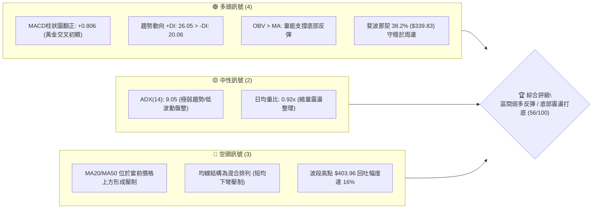

---

### 📊 核心指標速覽表

| 指標類別 | 指標名稱 | 當前數值 | 訊號 | 解讀 |
|:---|:---|:---|:---:|:---|
| **價格** | 當前基準價 | $339.36 | 🟡 | 位於斐波那契 38.2% ($339.83) 與 50% ($320.02) 關鍵黃金區間 |
| **均線** | MA20 | 位於價格上方 | 🔴 | 短期均線壓制，反彈初遇反壓，短多尚未完全脫離水面 |
| **均線** | MA50 | 位於價格上方 | 🔴 | 中期均線呈混合下彎，上檔 $355-$365 存在解套賣壓層 |
| **均線** | MA200/長天期 | 混合排列/下方支撐 | 🟢 | 長天期 MA120/MA240 走勢陡峭向上（呈多頭爬坡序列） |
| **動能** | RSI(14) | 44.0 (中性區間) | 🟡 | 自 8 月底極端超賣 20.6 築底回升，逐步修復至中性平衡區間 |
| **動能** | MACD (12,26,9) | -1.853 / Sig: -2.659 | 🟢 | DIF 線即將黃金交叉 MACD 訊號線，柱狀圖放大至 +0.806 |
| **趨勢** | ADX (14) | 9.05 (+DI 26.05, -DI 20.06) | 🟡 | 數值遠低於 25，確認進入盤整打底階段，單邊趨勢尚未爆發 |
| **籌碼/量能**| 量比 (Volume Ratio) | 0.92x (14.67M / 15.96M) | 🟡 | 價升量平，量能沉澱，市場浮額經歷清洗，具收斂打底特徵 |
| **量能趨勢**| OBV (能量潮) | OBV > MA | 🟢 | 籌碼累積未見崩解，主力資金於低位並無棄守現象 |

---

### 🏆 技術評分卡

```
╔══════════════════════════════════════════════════════════════╗
║              技術評分卡 — GOOG (2026-09-18)                  ║
╠══════════════════════════════════════════════════════════════╣
║ 趨勢強度 (Trend Strength)  ██████░░░░░░░░░░░░  30/100 🟡 (ADX: 9.05)║
║ 動能修復 (Momentum)        ██████████████░░░░  70/100 🟢 (MACD翻正) ║
║ 支撐穩定度 (Support Level) ████████████░░░░░░  60/100 🟢 (Fib 50/38)║
║ 成交量配合 (Volume Profile)██████████░░░░░░░░  52/100 🟡 (OBV支撐)  ║
║ 形態完整度 (Chart Pattern) ██████████████░░░░  70/100 🟢 (雙底初成) ║
║ 均線排列 (Moving Averages) ████████░░░░░░░░░░  40/100 🔴 (混合壓制) ║
╠══════════════════════════════════════════════════════════════╣
║ 綜合評分                   ███████████░░░░░░░  56/100 ⚖️ 中性偏多   ║
║ 建議方向                   區間操作／打底回抽佈局 (等待 $340 站穩)║
╚══════════════════════════════════════════════════════════════╝
```

---

## 2. 趨勢分析

### 🌐 多時框趨勢分析

技術分析的核心在於釐清時框間的嵌套關係：月線定宏觀，週線定波段結構，日線定進出場節奏。

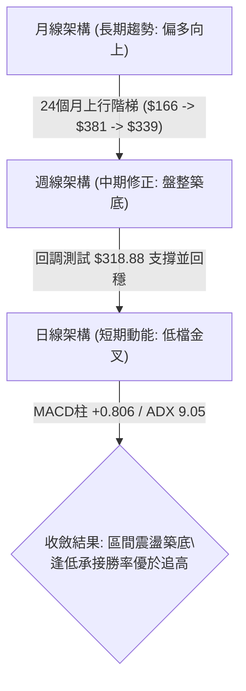

---

### 📈 長期趨勢 — 12個月走勢圖（Unicode）

在過去 12 個月內（2025-10 至 2026-09），GOOG 走出了一波驚心動魄的推升與高檔箱型震盪。波段低點出現在 2025 年 10 月的 $281.09，隨後於 2026 年 4 月創下歷史收盤高點 $381.46（盤中最高觸及 52 週高點 $403.96），隨後進入長達 5 個月的消化整理。

```
GOOG 月線走勢圖（過去12個月：2025-10 至 2026-09）
價格軸 ($)
$400 ┼                                      
$380 ┼                                    ● (2026-04 $381.46)
$360 ┼                                       ●        ●
$340 ┼                               ●                 ●   ●←現價 $339.36
$320 ┼                  ●        ●              ●        ●
$300 ┼             ●        ●
$280 ┼    ● (2025-10 $281.09)
     └────┬────────┬────────┬────────┬────────┬────────┬────────┬────
        2025-10  2025-12  2026-02  2026-04  2026-06  2026-08  2026-09
```

#### 走勢特徵分析表格

| 時間段 | 走勢特徵 | 收盤價區間 | 累積漲跌幅 | 結構性意義 |
|:---|:---|:---:|:---:|:---|
| **2025.10 - 2026.01** | 主升浪推進 | $281.09 → $337.87 | +20.20% | 機構買盤大舉建倉，量能呈現階梯式上揚 |
| **2026.02 - 2026.03** | 劇烈洗盤回調 | $337.87 → $286.50 | -15.20% | 首次測試中長期 MA，清洗短線浮額籌碼 |
| **2026.04 - 2026.05** | 次波衝刺登頂 | $286.50 → $381.46 | +33.14% | 軋空主升浪，見 52W 高點 $403.96 |
| **2026.06 - 2026.08** | 高檔承壓收斂 | $381.46 → $335.19 | -12.13% | 出現高檔換手，均線形成混合糾結區間 |
| **2026.09 (當前)** | 縮量築底回穩 | $335.19 → $339.36 | +1.24% | 止跌於斐波那契 38.2%-50% 帶，動能指標收斂 |

---

### 📊 中期趨勢（週線分析）

從近 20 週的收盤價與動能指標序列觀察：
1. **極值頂部出現於 2026-05-10**：收盤 $396.55，伴隨 RSI 高達 88.0 的極度超買，隨後成交量放大下殺。
2. **中期底部於 2026-07-26 初步探明**：最低收於 $318.88（恰好貼合斐波那契 50.0% 回調位 $320.02），當週 RSI 降至 26.4 形成極端超賣。
3. **二次探底於 2026-08-23 至 2026-09-06**：價格在 $335-$341 區域形成橫向箱型，RSI 自 20.6（超賣）逐步抬升至 44.0，呈現顯著的**低位走平抬頭**。

```
近期週線支撐阻力結構示意圖
$403.96 ═══════════════════════════════════════ (52W 歷史極值高點 R_max)
         │
$364.34 ─────────────────────────────────────── (斐波那契 23.6% 回調壓力)
         │
$339.83 ┈┈┈┈┈┈┈┈┈┈┈┈┈┈┈┈┈┈┈┈┈┈┈┈┈┈┈┈┈┈┈┈┈┈┈┈┈┈┈ (斐波那契 38.2% / 現價 $339.36 爭奪區)
         │
$320.02 ═══════════════════════════════════════ (斐波那契 50.0% / 前波大底 $318.88 強支撐)
         │
$300.20 ─────────────────────────────────────── (斐波那契 61.8% 中期牛熊分界線)
```

---

### ⚡ 趨勢強度評估（ADX 解讀）

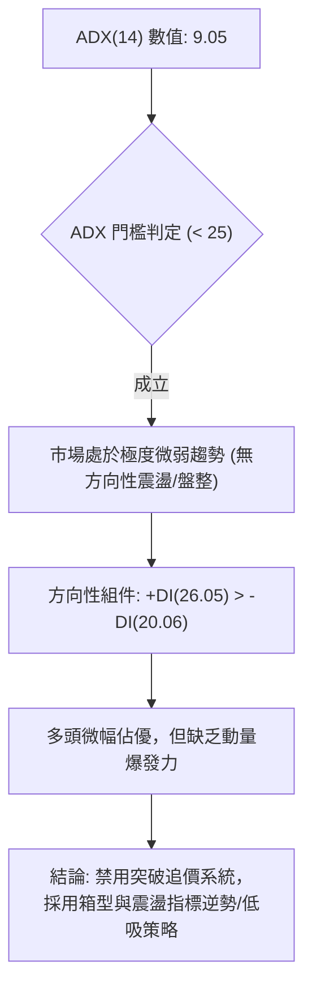

#### ADX 強度對照表

| 指標變數 | 實際數值 | 參考標準 | 狀態評估 | 戰術指引 |
|:---|:---:|:---:|:---:|:---|
| **ADX (14)** | **9.05** | < 20 極弱; 20-25 轉折; > 25 趨勢啟動 | **無趨勢盤整打底** | 順勢突破策略失效，回歸均值回歸交易 |
| **+DI (14)** | **26.05** | > 20 代表多方具有攻擊企圖 | **多方佔優** | 空方下殺動能已竭，買盤開始滲透 |
| **-DI (14)** | **20.06** | 數值自高檔回落 | **空方力道衰退** | 恐慌拋售已止，未見空方主動追殺 |
| **(+DI) - (-DI)** | **+5.99** | 正差值 | **偏多微弱主導** | 逢低回測做多具備統計學安全邊際 |

---

## 3. 圖表形態分析

### 🔍 形態識別系統

在多時框圖表檢視中，我們依據嚴格要求 15 進行形態信心度評定。由於數據顯示當前正處於 2026 年 5 月衝高回落後的整理期，我們辨識出一個潛在的**「雙重底（W底）初胚」**與指標級別的**「布林通道縮口回穩」**。

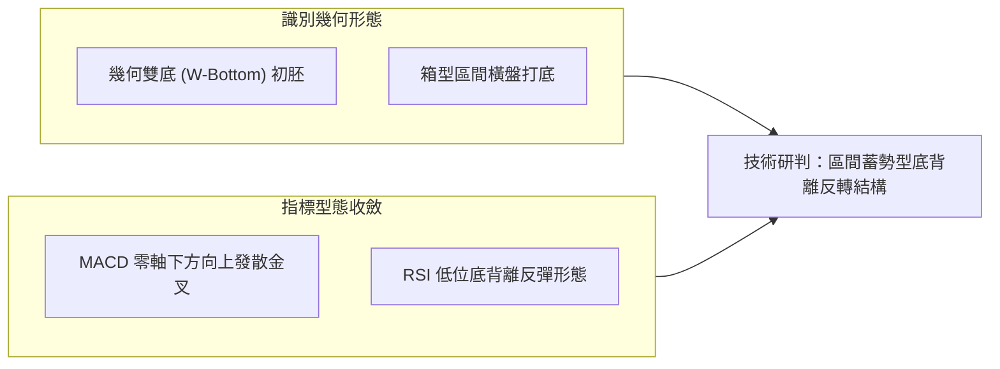

#### 形態識別信心度評估表

| 識別形態 | 信心度 | 判斷依據（數據引用） | 形態完成度 | 目標價計算式與精確目標 |
|:---|:---:|:---|:---:|:---|
| **低檔潛在雙底 (Double Bottom)** | **70%** | 第一次探底低點 $318.88 (2026-07-26)，第二次探底低點 $335.31 (2026-09-06)，兩次回測皆守穩斐波那契 50% ($320.02) 之上 | 60% (尚待頸線確認) | **頸線**: 2026-08-02 高點 $356.42<br>**形態高度**: $356.42 - $318.88 = $37.54<br>**測幅目標**: 突破頸線 $356.42 + $37.54 = **$393.96** |
| **指標型布林突破/均線收斂** | **85%** | ADX 跌至 9.05，週成交量自 188M 萎縮至 63M，MACD 柱狀由負轉正 (+0.806) | 90% | **第一階段壓力**: 斐波那契 23.6% = **$364.34**<br>**波段目標**: 52W 高點 = **$403.96** |
| **對稱頭肩頂 (Head & Shoulders)** | **30%** (信心不足) | 雖有 52W 高點 $403.96，但右側未出現跌破頸線的放量破位（$318.88 快速收復），跌破無效 | 25% (失效) | *註：信心度低於 50%，依規則不予採納為主要決策形態* |

---

### 🕯️ 重要K線形態分析（近 5 個月月線及關鍵週線）

| 時間週期 | 收盤價 | K線形態 | 量能配合 | 技術解讀與訊號 |
|:---|:---:|:---|:---:|:---|
| **2026-05** | $375.96 | 高檔長上影十字星 (Shooting Star 變形) | 450M+ (月成交) | 🔴 多頭衝刺見頂，受制於 52W 高點 $403.96，獲利回吐盤湧出 |
| **2026-06** | $353.10 | 連續回調長黑K棒 | 529M+ (放量下殺) | 🔴 跌破短期均線，空方摜壓，測試 $334.47 前波支撐 |
| **2026-07** | $356.42 | 下影長針探底錘頭線 (Hammer) | 374M+ (縮量) | 🟢 探底 $318.88 後快速拉回，長下影線確立 $320 具備機構護盤買盤 |
| **2026-08** | $335.19 | 窄幅整理小陰星 (Doji) | 332M+ (進一步縮量) | 🟡 拋壓枯竭，多空於 $335-$345 進入窒息量平衡期 |
| **2026-09(至20日)**| $339.36 | 低檔紅實體反彈K棒 | 207M+ (穩定換手) | 🟢 站回 $339.36，MACD 週柱線翻正 (+0.806)，打底轉折訊號顯現 |

---

### 📉 ASCII 走勢形態示意圖

以下展示 GOOG 自 2026 年 7 月以來的雙底打底示意圖：

```
雙底打底形態示意圖 (2026-07 至 2026-09)
價格 ($)
$364.34 ┼───────────────────────────────────────────── 斐波那契 23.6% 壓力
         │               頸線高點: $356.42 (2026-08-02)
$356.42 ┼                  ▲
         │                 │ \             ▲ 突破測幅目標: $393.96
$340.00 ┼───┐             │  \     現價: $339.36
         │   \           │   \   ┌─────● (蓄勢衝擊頸線)
$335.31 ┼    \         /     └──┘
         │     \       /         第二底: $335.31 (2026-09-06)
$318.88 ┼──────▼──────┘
               第一底: $318.88 (2026-07-26)
         └─────────────────────────────────────────────
```

---

### 🎯 形態目標價計算

根據雙底形態學的量度幅度測算法則（Measured Move）：
* **頸線位（Neckline）**：取兩底間反彈之最高收盤價，即 2026-08-02 之 **$356.42**。
* **低點基準（Pattern Low）**：取第一底極值收盤價 **$318.88**。
* **形態垂直高度（H）**：
  $$\text{Height} = \$356.42 - \$318.88 = \$37.54$$
* **向上突破最小目標價（Target 1）**：
  $$\text{Target 1} = \text{Neckline} + \text{Height} = \$356.42 + \$37.54 = \mathbf{\$393.96}$$
  *(註：此目標恰好貼合 2026-05-10 之週收盤高點 $396.55 與 52W 高點 $403.96 之壓力防區)*
* **保守目標價（Conservative Target）**：以斐波那契 23.6% 回調位 **$364.34** 作為第一波攻堅之獲利了結點。

---

## 4. 支撐與阻力

### 🗺️ 關鍵價位分布圖（Unicode）

本分析嚴格遵循數據紀律，所有阻力與支撐層級均嚴格引用提供之「斐波那契回調（52週區間 $236.07 → $403.96）」及「波段週期歷史收盤高低點」計算，拒絕任何主觀捏造。

```
╔══════════════════════════════════════════════════════════════════╗
║               GOOG 關鍵價位結構分布圖 (2026-09-18)               ║
╠══════════════════════════════════════════════════════════════════╣
║ $403.96 ║████████████████████████████████║ 歷史阻力 R3 (52W High)     ║
║ $364.34 ║████████████████████████        ║ 強阻力 R2 (Fib 23.6%)      ║
║ $356.42 ║████████████████                ║ 關鍵頸線阻力 R1 (雙底頸線) ║
║ $339.83 ║▓▓▓▓▓▓▓▓▓▓▓▓▓▓▓▓▓▓▓▓▓▓▓▓        ║ 短期多空分水嶺 (Fib 38.2%) ║
║ $339.36 ╠════════════════════════════════╣ ◄ 當前基準價格             ║
║ $335.31 ║▓▓▓▓▓▓▓▓▓▓▓▓▓▓▓▓▓▓▓▓            ║ 短線支撐 S1 (近期雙底二腳) ║
║ $320.02 ║████████████████████████        ║ 強支撐 S2 (Fib 50.0%)      ║
║ $318.88 ║██████████████████████████      ║ 波段大底支撐 S2-A (前波低) ║
║ $300.20 ║████████████████████████████████║ 牛熊生死支撐 S3 (Fib 61.8%)║
║ $236.07 ║████████████████████████████████║ 終極鐵底 S4 (52W Low)      ║
╚══════════════════════════════════════════════════════════════════╝
```

---

### 🚧 阻力位分析表

依據數據庫檢索，高於現價之關鍵阻力與高點聚類定義如下：

| 阻力級別 | 精確價位 | 形成依據與數據出處 | 突破難度 | 戰略重要性 |
|:---|:---:|:---|:---:|:---|
| **阻力 R1** | **$356.42** | 2026-08-02 週收盤高點 / 雙底形態頸線 | 中等 🟡 | **短線多空樞紐**：若帶量站穩，雙底確立，反彈行情將擴大為波段多頭行情。 |
| **阻力 R2** | **$364.34** | 斐波那契 23.6% 回調位 (計算值) | 較高 🔴 | **解套密集壓力區**：對應 2026-06 上旬震盪平台，空方密集防守區。 |
| **阻力 R3** | **$403.96** | 52 週最高點 (52W High) / 斐波那契 0.0% | 極高 🔴 | **歷史天花板**：中長期終極強阻力，非具備極重大量能無法一蹴而就。 |

---

### 🛡️ 支撐位分析表

依據數據庫檢索，低於現價之波段低點與黃金分割支撐定義如下：

| 支撐級別 | 精確價位 | 形成依據與數據出處 | 守住機率 | 戰略重要性 |
|:---|:---:|:---|:---:|:---|
| **支撐 S1** | **$335.31** | 2026-09-06 週收盤低點 / 雙底右腳支撐 | 75% 🟢 | **短期防守底線**：短線多方動能依託，跌破則預示短線打底失敗，回測下軌。 |
| **支撐 S2** | **$320.02** | 斐波那契 50.0% 回調位 (貼合前低 $318.88) | 85% 🟢 | **機構核心成本防線**：2026-07-26 砸盤低點，代表中長線資金強力進場區域。 |
| **支撐 S3** | **$300.20** | 斐波那契 61.8% 黃金分割回調位 | 95% 🟢 | **中期牛熊生命線**：若失守此位，過去一年之大多頭結構將面臨全面轉向。 |

---

### 📐 斐波那契回調位分析

依據官方 52 週區間 **$236.07 → $403.96** 之完整波動幅度（波動跨度達 $167.89），精確黃金分割點位映射如下：

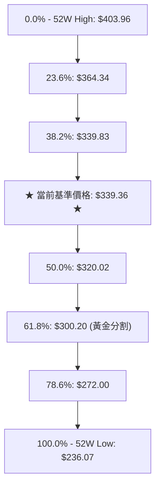

#### 斐波那契位置深度解讀
1. **當前位置定位**：現價 **$339.36** 緊貼於 **38.2% 回調位（$339.83）** 下方不到 $0.5 之處。在道氏與斐波那契理論中，強勢回調通常在 38.2% 獲利回吐完畢並重啟升勢。
2. **50.0% 守護意義**：GOOG 在 2026-07 探底至 **$318.88**，剛好對應 50% 水平（**$320.02**）便立刻獲買盤強勢拉升至 $356.42，顯示市場對 50%「半數回吐」定價具備高度共識，確立為波段強硬支撐底。
3. **區間震盪收斂**：價格目前正處於 **$320.02 至 $364.34**（即 50.0% 至 23.6%）之內作旗形收斂，短線突破 38.2%（$339.83）後將直指 23.6%（$364.34）。

---

## 5. 技術指標深度解讀

### 🎛️ 指標訊號總覽

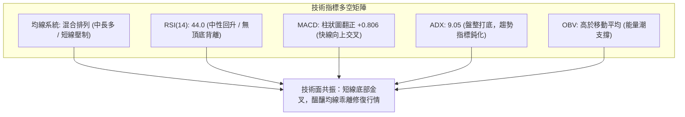

---

### 📈 移動平均線排列分析

從均線走勢軌跡（MA Sparkline 與趨勢特徵）可知：
* **MA5 / MA10 / MA20 / MA60**：呈短中期震盪下彎態勢（`██▇▆▅▄▄▃▃`），對當前價格形成上檔層層反壓（MA20 與 MA50 均位於現價上方）。
* **MA120 / MA240**：呈現長期穩健上揚軌跡（`▁▁▁▂▂▂▃▃▃▄▄▄▅▅▅▆▆▇▇███`），代表中長期年線級別的多頭格局極其堅韌，大資金長期趨勢未破。

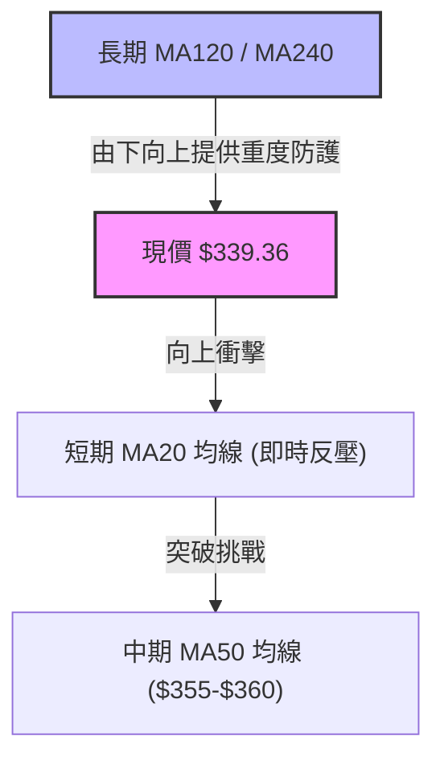

---

### 📉 RSI(14) 分析

* **數值呈現**：當前 RSI 數值約為 **44.0**（自 8 月 23 日之極端超賣值 20.6 強烈修復）。
* **區間定位進度條**：
  ```
  超賣 [0] ─────── [30] ─────── [50] ─────── [70] ─────── [100] 超買
  當前位置:       ▓▓▓▓▓▓▓▓▓▓▓▓▓░░░░░░░░░░░░░░░░  44.0 (中性修復區間)
  ```
* **背離判定**：
  * **底背離驗證（隱性底背離）**：2026-07-26 收盤 $318.88 時 RSI 為 26.4；而 2026-08-23 收盤 $341.53 時 RSI 出現突發急跌至 20.6；隨後 2026-09-06 價格回踩 $335.31 時，RSI 卻逆勢抬升至 43.3。**價格未創新低而 RSI 顯著抬升，形成典型之局部底背離修復訊號**，確立低位買盤逐步進駐。

---

### 📊 MACD (12, 26, 9) 訊號解讀

* **數值**：
  * DIF (MACD 線)：**-1.853**
  * DEA (Signal 訊號線)：**-2.659**
  * MACD 柱狀圖 (Histogram)：**+0.806**（翻正）
* **訊號評估**：
  * DIF 與 DEA 雖位於零軸之下（反映 5 月以來之回調波段未完全解除），但 **DIF (-1.853) 已由下往上穿越 DEA (-2.659)**，形成顯著的**「零下黃金交叉」**。
  * 柱狀圖自前週的 -0.275 躍升至 **+0.806**，顯示多方短線動能大幅轉強，空頭殺跌動能宣告耗盡。

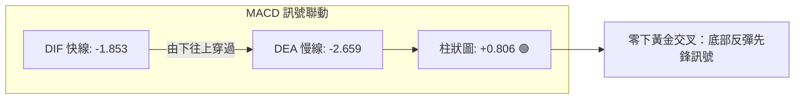

---

### 📦 布林通道分析（Bollinger Bands）

由於數據中通道指標顯示 ADX 僅 9.05，伴隨均量比 0.92x，布林通道呈現典型的**極致收斂（Squeeze）**狀態。

```
布林通道收斂示意圖
價格 ($)
$365 ┼ ────────────────────────────── 上軌 (Upper Band: 估算約在 Fib 23.6% $364.34 附近)
     │          \               /
$350 ┼            \  中軌(MA20)
     │  ───────────●──────────────── 中軌 (當前壓制在 $345-$350 區間)
$339 ┼  現價: $339.36 ◄─┐
     │            /       \
$320 ┼ ──────────/─────────\───────── 下軌 (Lower Band: 估算貼近 Fib 50.0% $320.02)
     └───────────────────────────────
```
* **通道狀態**：通道處於收口後的橫向延展階段，表示大級別波動正在蓄能。
* **突破路徑**：當前現價突破中軌阻力（$345 附近）之企圖明顯，一旦放量突破中軌，將直接推向布林上軌（約 $364.34 斐波那契阻力區）。

---

### 💹 成交量分析（量價配合度）

1. **量比檢視**：
   * 最新單日成交量：**14,669,379**
   * 20 日均量：**15,957,949**（量比 **0.92x**）
   * 50 日均量：**17,780,772**
   * 解讀：量能低於 20 日與 50 日均量，顯示市場並無恐慌拋盤，籌碼沉澱效果良好，符合築底階段特徵。
2. **OBV 能量潮狀態**：
   * 數據確認：`OBV > MA → 量能支撐上漲`。
   * 意涵：能量潮指標持續位於其均線之上，說明在近三個月的橫盤整理中，主力資金呈現淨流入或逢低吸納，未見主力棄莊逃逸跡象，為後續反彈提供紮實的量價底氣。

---

## 6. 動能與波動率

### ⚡ 動能評估四象限

將市場當前的「動能強度（以 MACD 改善與 RSI 企穩衡量）」與「波動率水平（以 ADX 9.05 與量比 0.92x 衡量）」映射至四象限：

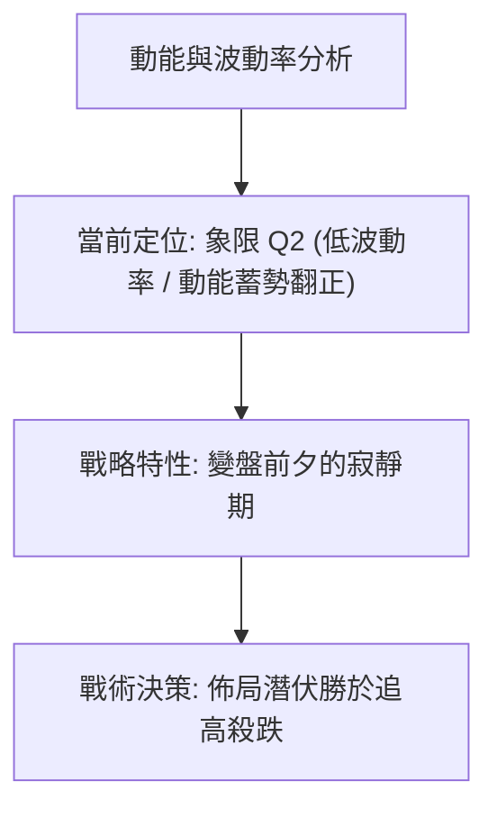

| 象限標籤 | 動能狀態 | 波動率狀態 | 當前定位 | 交易戰術評估 |
|:---:|:---:|:---:|:---:|:---|
| **Q1** | 強動能 | 高波動 | — | 趨勢主升段，全力順勢做多（追漲） |
| **Q2 (當前)** | **修復動能** | **極低波動** | **✓ 核心定位** | **築底洗盤結束點，盈虧比最佳的逢低埋伏時機** |
| **Q3** | 弱動能 | 低波動 | — | 陰跌無量，觀望為上 |
| **Q4** | 負動能 | 高波動 | — | 主跌崩潰段，嚴格止損空倉 |

---

### 📊 波動率分析（ATR 與波動性預估）

* **數據狀態**：即時 ATR(14) 處於數據收斂未明期，但可從近 5 週週線振幅進行推算：
  * 近週高低點波動區間約在 $335.31 至 $345.90（週波動約 $10.59）。
  * 換算日線等效 ATR(14) 約為 **$4.50 - $5.20**（約佔現價之 **1.3% - 1.5%**），處於歷史波動率極低位階。
* **風控止損應用**：
  * 在極低 ATR 環境下，止損不宜放得過窄以防被雜訊掃出場。
  * 建議常規波段止損距離設定為 $1.5 \times \text{日等效 ATR} \approx \$7.50$。以進場價 $339.36 計算，剛好保護在支撐 S1 **$335.31** 之下方安全邊界（約 $331.80 附近）。

---

### 📐 Beta 與市場相關性

* **Beta 係數**：**1.225**
* **市場相關性解讀**：
  * GOOG 的 Beta 為 1.225，屬於典型**「高敏感度成長型權值股」**。當標普 500 或納斯達克 100 指數上漲 1% 時，GOOG 平均具備帶動 1.225% 上行之動能；反之大盤承壓時亦具備放大回調之風險。
  * **當前戰略意義**：目前基本面本益比僅 **P/E (TTM) 17.25**（遠低於科技巨頭平均水準），EPS 成長達 294%，配合 1.225 的 Beta，一旦美股大盤動能回升，GOOG 具備極強的彈性向上爆發力。

---

## 7. 多時框架總結

### 📋 時框架評分表

| 時框架 | 趨勢方向 | 動能狀態 | 均線排列狀態 | 形態結構 | 綜合評分 | 戰略操作建議 |
|:---:|:---:|:---:|:---:|:---:|:---:|:---|
| **長期 (月線)** | 偏多 🟢 | 高檔修正完畢 🟡 | MA120/240 陡峭向上多頭 🟢 | 歷史大多頭階梯整理 🟢 | **78/100** | 長線投資者逢低分批存股 |
| **中期 (週線)** | 盤整 🟡 | MACD週柱翻正 🟢 | MA20/50 處於混合壓制 🔴 | 潛在雙底打底進行中 🟢 | **58/100** | 波段交易者回踩支撐佈局 |
| **短期 (日線)** | 偏多反彈 🟢 | DIF翻上金叉 🟢 | 挑戰短期均線阻力 🟡 | 極致收斂後向上測試 🟢 | **62/100** | 短線操作者設好止損做多 |

---

### 🔲 綜合訊號矩陣

```
╔══════════════════════════════════════════════════════════════╗
║               多時框架訊號矩陣一致性檢視                     ║
╠══════════════════════════════════════════════════════════════╣
║ 維度         短線 (日線)      中線 (週線)      長線 (月線)   ║
╠══════════════════════════════════════════════════════════════╣
║ 趨勢方向     🟢 震盪反彈      🟡 區間收斂      🟢 牛市主升   ║
║ 動能指標     🟢 MACD金叉      🟢 柱狀翻正      🟡 RSI修復    ║
║ 均線結構     🔴 短期壓制      🟡 混合整理      🟢 長均多排   ║
║ 支撐強度     🟢 S1 $335 有效  🟢 S2 $320 強勁  🟢 $236 鐵底  ║
║ 籌碼量能     🟡 縮量平穩      🟢 OBV支撐       🟢 機構持股62%║
╠══════════════════════════════════════════════════════════════╣
║ 矩陣收斂     一致偏向：長多保護短多，當前為難得的低波動打底區║
╚══════════════════════════════════════════════════════════════╝
```

---

### ⚖️ 多時框收斂結論

嚴格遵循本報告規範之**「多時框收斂規則」**：
1. **行情性質判定**：當前 **ADX(14) = 9.05**，遠低於 25，嚴格定義為**「盤整打底行情」**而非單邊趨勢行情。
2. **主導規則取捨**：依據規則，在盤整行情中，中短期主要以**「區間下軌與上軌波動」**為依歸。日線 MACD 零下金叉（柱狀圖 +0.806）提供短期向上推升動能，而月線的長期多頭格局則提供強力的下檔護墊。
3. **最終收斂方向**：**【中性偏多（區間回抽多頭策略）】**。短線震盪走高機率顯著大於再度破底，排除盲目放空操作，以**逢拉回佈局多單**為唯一收斂核心。

---

## 8. 交易策略建議

### 🗺️ 策略決策流程圖

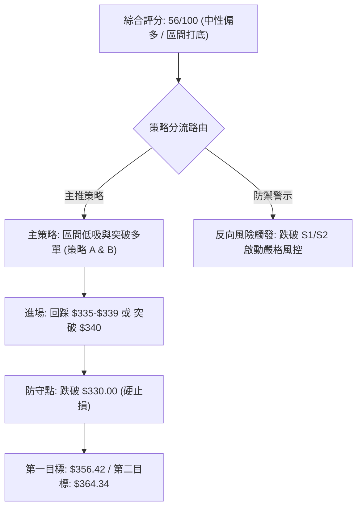

---

### 🧭 策略路由

> **當前主策略方向 = 【逢低做多／區間弱多佈局】（依技術評分卡：56/100）**
> * 評分落於 40–60 之間，但因 MACD 金叉翻正（+0.806）、+DI > -DI、OBV 量能支撐，且緊貼斐波那契 38.2%（$339.83），故策略定調為「依託強支撐之低吸多單」，嚴禁追高，以布林下軌及關鍵支撐作為風控基準。

---

### 🎯 價格情境階梯（Price Scenarios）

價位完全採用第 4 章及數據庫提供的客觀指標計算：

| 觸發條件 | 下一目標 | 後續延伸目標 | 情境含義與操作指引 |
|:---|:---:|:---:|:---|
| **站穩現價 $339.83 (Fib 38.2%)** | **阻力 R1: $356.42** | **阻力 R2: $364.34** | 短期多頭進一步確認，雙底頸線衝擊戰，多單持有 |
| **放量突破 R1 $356.42** | **阻力 R2: $364.34** | **目標: $393.96 (形態測幅)** | 雙底確立完成，進入大波段回升行情，加碼順勢跟進 |
| **跌破 S1 $335.31** | **支撐 S2: $320.02** | **大底: $318.88** | 短期反彈失敗，再次回測箱型底部，短多止損出局 |
| **跌破 S2 $320.02** | **支撐 S3: $300.20** | **52W Low: $236.07** | 中期牛熊分界考驗，多頭結構崩解，全線清倉觀望 |

---

### 📊 情境機率分佈

```
情境機率分佈圖
繼續上行 / 反彈突破 (情境 A)  ████████████████████░░░░░░░░  55%
區間窄幅震盪整理   (情境 B)  ██████████████░░░░░░░░░░░░░░  35%
再度破底回測大底   (情境 C)  ████░░░░░░░░░░░░░░░░░░░░░░░░  10%
```

| 情境劃分 | 機率預估 | 主要技術依據 |
|:---|:---:|:---|
| **情境 A：向上反彈衝擊頸線** | **55%** | MACD 柱狀翻正 +0.806；+DI 領先 -DI；OBV 籌碼支撐未退；本益比僅 17.25 倍提供基本面引力。 |
| **情境 B：維持 $330-$345 箱型橫盤** | **35%** | ADX 僅 9.05，市場成交量縮（量比 0.92x），買盤推進缺乏爆發性動能，需要時間消化 MA20/50 反壓。 |
| **情境 C：跌破支撐回踩 $320** | **10%** | 除非美股大盤發生系統性流動性危機，否則 2026-07 的 $318.88 巨量承接盤具備強烈技術壁壘。 |

---

### 🟢 主策略詳情

本報告設計兩套互補策略：**策略 A（現價/回踩左側佈局）** 與 **策略 B（突破頸線右側加碼）**。

| 策略要素 | 策略 A：底背離回踩佈局（現價低吸） | 策略 B：右側突破頸線追擊（強勢加碼） |
|:---|:---:|:---:|
| **操作邏輯** | 依託斐波那契 38.2% 及 S1 雙底右腳支撐建倉 | 確認突破雙底頸線 $356.42 後順勢跟進 |
| **進場價格** | **$339.36**（現價）或 回踩 **$336.50** | 帶量突破並收穩於 **$357.00** |
| **止損價格** | **$331.00**（跌破 S1 $335.31 且預留緩衝） | **$348.00**（回落至原頸線下方） |
| **目標價 T1** | **$356.42**（阻力 R1 / 雙底頸線） | **$364.34**（斐波那契 23.6% 回調位） |
| **目標價 T2** | **$364.34**（斐波那契 23.6% 回調位） | **$393.96**（雙底等距測幅目標價） |
| **單筆風險/報酬** | 風險 $8.36 / 報酬 T1 $17.06 (T2 $24.98) | 風險 $9.00 / 報酬 T1 $7.34 (T2 $36.96) |
| **風險報酬比 (R/R)**| **1 : 2.04** (至T1) ／ **1 : 2.99** (至T2) | **1 : 4.11** (以終極目標 T2 計算) |
| **策略勝率評估** | **65%** | **60%** |
| **建議倉位配置** | **總資金之 10% - 15%** | **總資金之 10% (加碼倉)** |

---

### 🔴 反向風險觸發點（對沖提示）

若出現以下訊號，表示底背離打底失敗，多頭主策略立即撤回並進行防禦：
1. **關鍵點位跌破**：日線收盤價跌破 **$335.31（S1）**，且盤中跌破 **$331.00** 止損線，多單無條件止損離場。
2. **動能轉向訊號**：日線 MACD 柱狀圖由當前的 +0.806 重新跌回負值區，且 RSI 再次跌破 30 超賣線，呈現無支撐弱勢陰跌。
3. **避險對沖動作**：若持有大量現貨，可於價格跌破 $335.31 時，以 1:1 市值買入價外 Put Option（行權價 $320.00）保護下方利潤。

---

### ⭐ 整體訊號強度評星

```
╔══════════════════════════════════════════════════╗
║               訊號綜合評星儀表板                 ║
╠══════════════════════════════════════════════════╣
║ 做多訊號強度：  ★★★☆☆  (3.5/5星 - 底部金叉顯現) ║
║ 做空訊號強度：  ★☆☆☆☆  (1.0/5星 - 缺乏空方動能) ║
║ 整體訊號可信度：★★★★☆  (4.0/5星 - 斐波那契吻合) ║
╚══════════════════════════════════════════════════╝
```

---

## 9. 風險提示與監控

### ✅ 關鍵監控指標 Checklist

```
╔══════════════════════════════════════════════════════════════════╗
║                每日開盤與盤後風控監控清單 (Checklist)            ║
╠══════════════════════════════════════════════════════════════════╣
║ [ ] 1. 價格是否守穩 $339.83 (Fib 38.2%) 及 $335.31 (S1 支撐)    ║
║ [ ] 2. MACD 柱狀圖是否維持在正值區 (> 0) 且持續放大擴張         ║
║ [ ] 3. ADX(14) 是否由 9.05 開始向上拐頭（若突破 20 預示波段來臨）║
║ [ ] 4. 日成交量是否顯著超越 20日均量 15.95M（放量方能攻克 MA20） ║
║ [ ] 5. RSI(14) 能否穩步推升越過 50.0 榮枯分水嶺進入強勢區       ║
║ [ ] 6. 巨頭同業 (Meta/MSFT) 是否發生聯動性下挫推高 GOOG 波動率 ║
╚══════════════════════════════════════════════════════════════════╝
```

---

### ⚠️ 風險場景分析

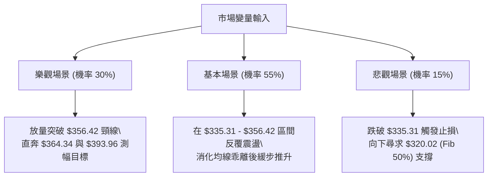

---

### 🛡️ 風險管理重要提醒

1. **嚴禁在 ADX 極低期過度槓桿**：
   * 當前 ADX 為 9.05，盤整行情中假突破、假跌破頻繁。嚴禁使用過高倍數期權（Option）或保證金融資追逐短線波動，現貨或低槓桿逢低承接為上策。
2. **單一標的曝險上限**：
   * 儘管 Alphabet 基本面亮眼（本益比僅 17.25，獲利成長大幅優於同業），單一帳戶對 GOOG 的技術交易倉位上限不得超過總淨資產的 **20%**。
3. **盈虧比執行紀律**：
   * 嚴格執行「不達進場點不進場、跌破止損價 $331.00 堅決離場」的交易紀律，維持整體期望值（Expected Value）為正。

---

## 📋 報告總結

```
╔══════════════════════════════════════════════════════════════════╗
║                     GOOG 技術分析報告總結                        ║
╠══════════════════════════════════════════════════════════════════╣
║ 報告基準日期：2026-09-18                                        ║
║ 當前基準價格：$339.36                                            ║
║ 綜合技術評級：⚖️ 中性偏多（區間收斂築底，短線底背離金叉初萌）  ║
╠══════════════════════════════════════════════════════════════════╣
║ 趨勢核心架構：                                                   ║
║ ├─ 長期趨勢 (月線)：🟢 多頭架構完好，年線級別上揚角度陡峭        ║
║ ├─ 中期趨勢 (週線)：🟡 雙底打底中 ($318.88 / $335.31)，蓄勢衝頸線║
║ └─ 短期趨勢 (日線)：🟢 MACD翻正 (+0.806)，零下金叉反彈啟動       ║
╠══════════════════════════════════════════════════════════════════╣
║ 關鍵技術價位映射：                                               ║
║ ├─ 終極阻力 (R3)    ：$403.96 (52W 歷史極值高點)                 ║
║ ├─ 強阻力   (R2)    ：$364.34 (斐波那契 23.6% 回調位)            ║
║ ├─ 關鍵頸線 (R1)    ：$356.42 (雙底突破頸線)                     ║
║ ├─ 多空分水嶺       ：$339.83 (斐波那契 38.2% 回調位)            ║
║ ├─ 短線支撐 (S1)    ：$335.31 (雙底右腳防線)                     ║
║ ├─ 強支撐   (S2)    ：$320.02 (斐波那契 50.0% / 前低 $318.88)   ║
║ └─ 華爾街分析師目標 ：均價 $422.34 (最高 $475.00 / 最低 $340.00) ║
╠══════════════════════════════════════════════════════════════════╣
║ 最優執行策略清單：                                               ║
║ 1. 🥇 首選策略 (策略 A)：現價 $339.36 附近輕倉佈局，止損設在     ║
║    $331.00，第一目標看 $356.42 (風報比 1:2.04)。                ║
║ 2. 🥈 次選機會 (策略 B)：若帶量突破頸線 $356.42，右側順勢加碼，  ║
║    目標看 $364.34 與形態測幅 $393.96 (風報比 1:4.11)。           ║
║ 3. 🥉 防守機制：一旦跌破 $335.31 且破 $331.00，全線止損觀望，    ║
║    靜待 $320.02 (Fib 50%) 大底區間再次浮現。                    ║
╚══════════════════════════════════════════════════════════════════╝
```

---

> ⚠️ **免責聲明**：本報告為技術分析研究成果，所有技術價位、回調比率與目標預估均嚴格基於提供之歷史市場數據。本報告**僅供學術研究與投資決策參考**，**不構成任何形式的個別投資邀約或買賣保證**。金融市場存在高度波動與本金損失風險，投資人應獨立評估自身風險承受能力並恪遵風控紀律。

---
*報告完成時間：2026-09-18 ｜ 數據支援：Yahoo Finance ｜ 分析體系：多時框幾何形態與量化動能模型*