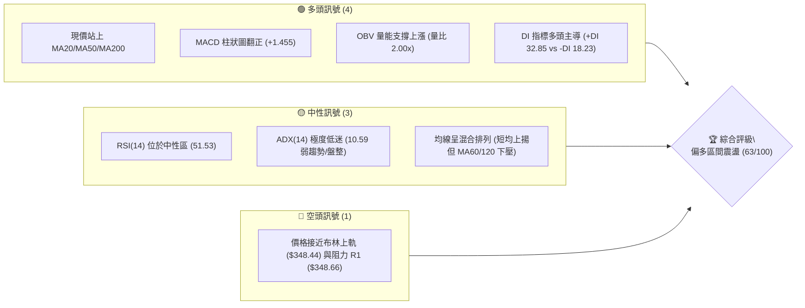
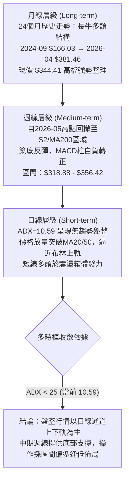
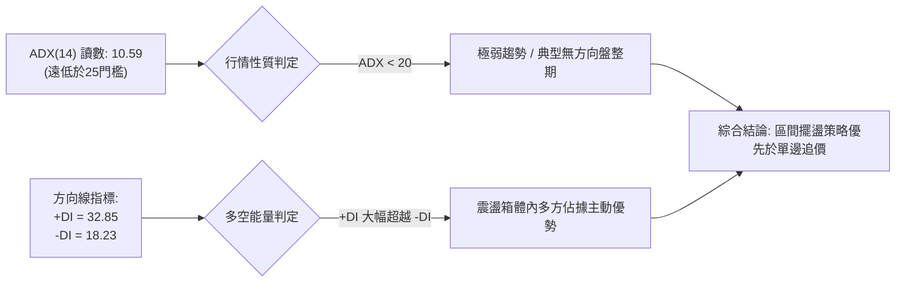
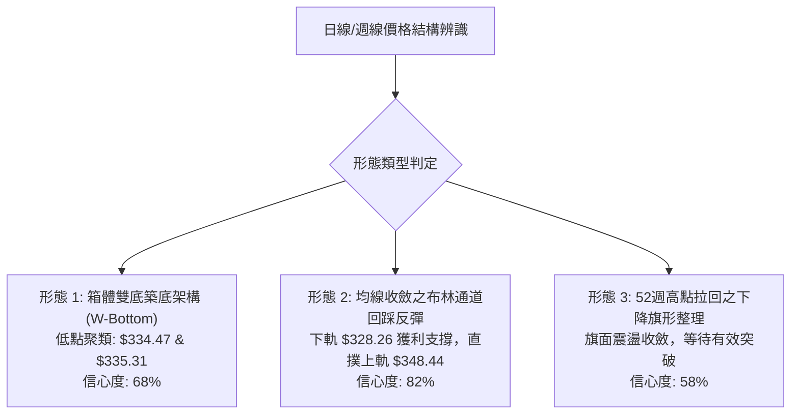
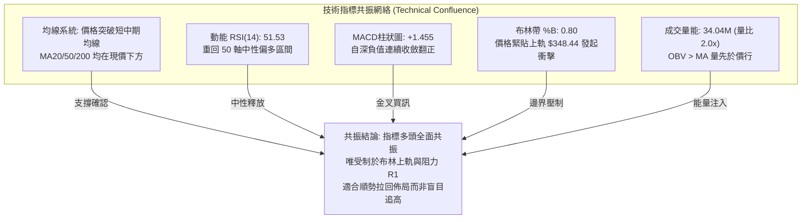
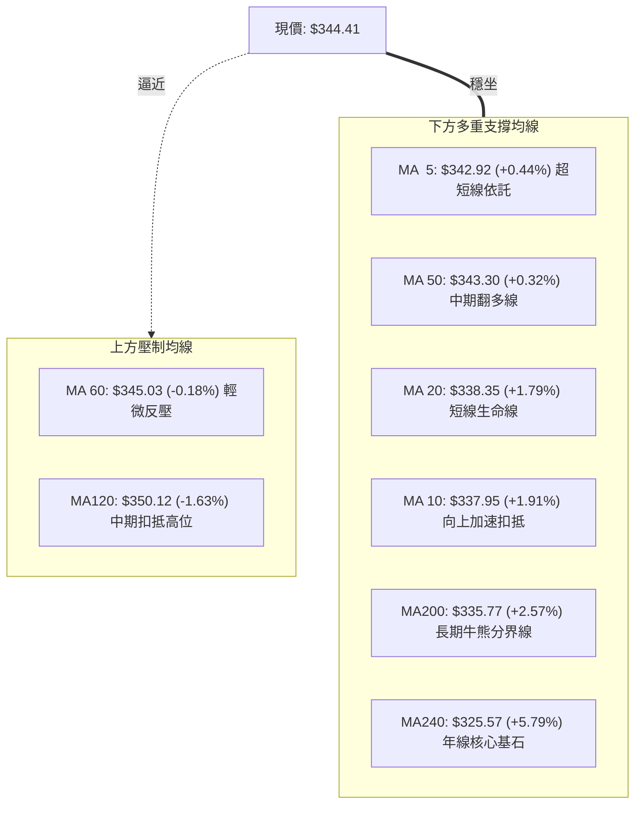
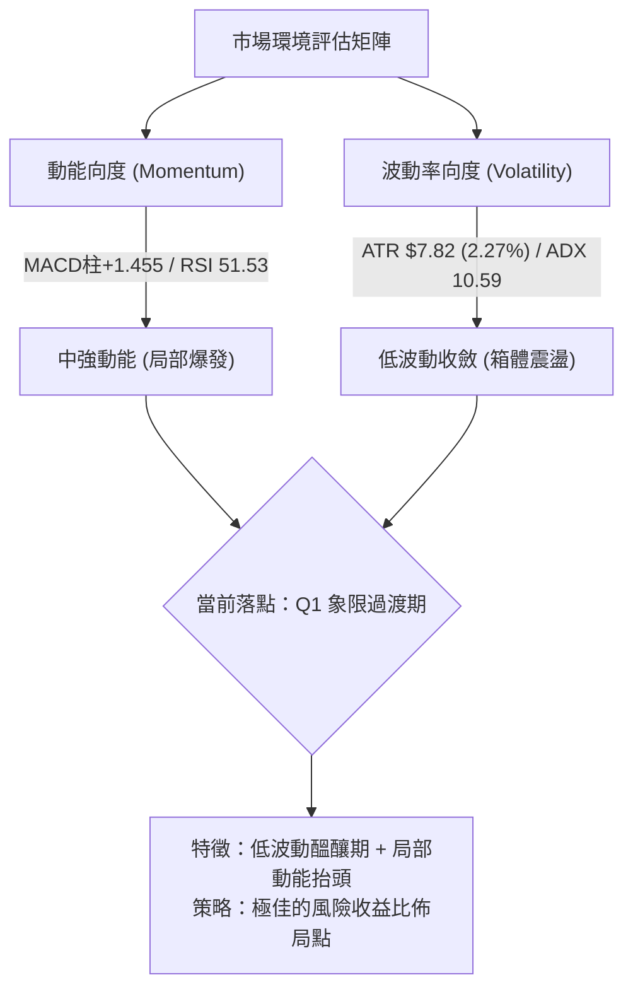
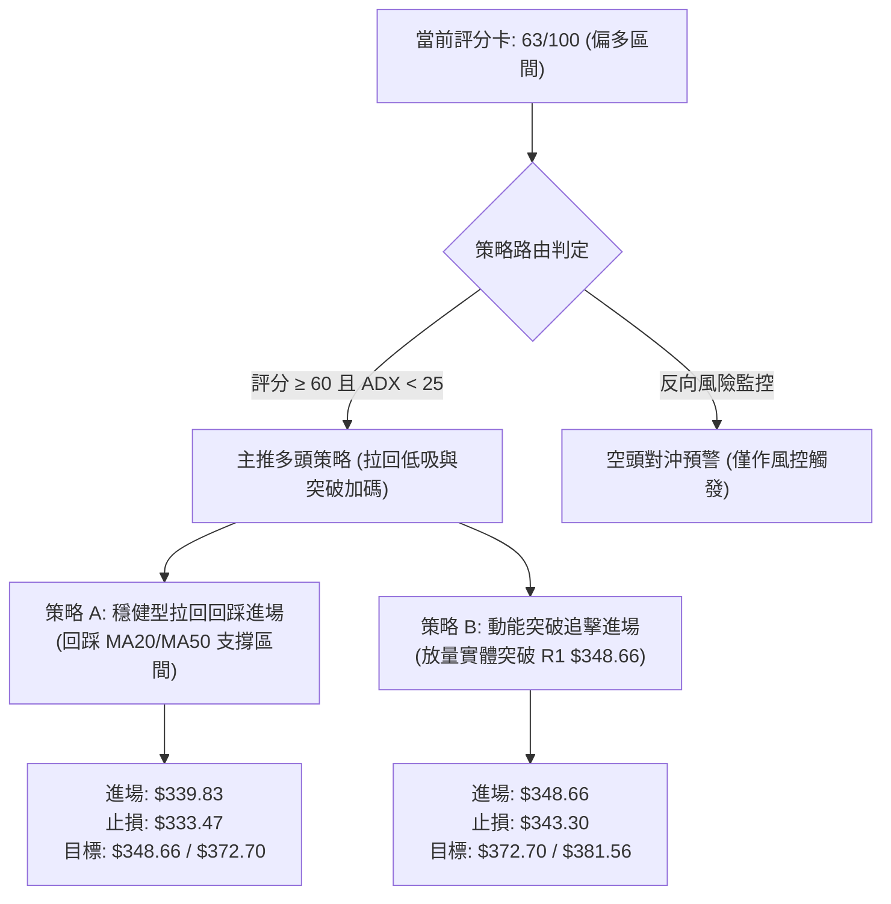
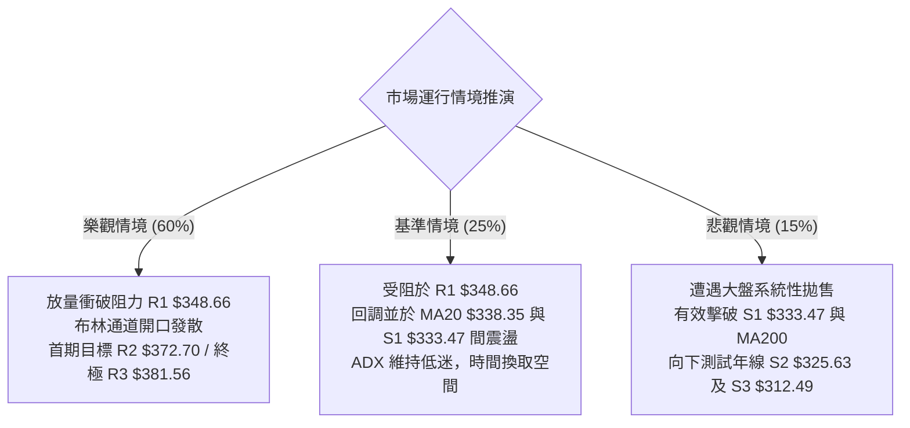

# GOOG 技術分析報告

> **報告日期**：2026-09-21 ｜ **語言**：繁體中文 ｜ **數據來源**：Yahoo Finance ｜ **當前價格**：$344.41

---

## 目錄

| 章節 | 內容 |
|------|------|
| [1. 技術面概覽](#1-技術面概覽) | 訊號儀表板、核心指標、評分卡 |
| [2. 趨勢分析](#2-趨勢分析) | 多時框趨勢、長中短期走勢、ADX解讀 |
| [3. 圖表形態分析](#3-圖表形態分析) | 形態識別、信心度評估、K線組合 |
| [4. 支撐與阻力](#4-支撐與阻力) | 關鍵價位、斐波那契回調結構 |
| [5. 技術指標深度解讀](#5-技術指標深度解讀) | MA/RSI/MACD/布林/成交量全面共振 |
| [6. 動能與波動率](#6-動能與波動率) | 動能矩陣、ATR風控、Beta相關性 |
| [7. 多時框架總結](#7-多時框架總結) | 時框收斂規則、主導趨勢裁決 |
| [8. 交易策略建議](#8-交易策略建議) | 策略路由、精確進出場點、風報比 |
| [9. 風險提示與監控](#9-風險提示與監控) | 監控清單、情境推演、倉位管理 |
| [📋 報告總結](#-報告總結) | 終局評級、操作矩陣速查 |

---

## 1. 技術面概覽

### 🎯 技術訊號儀表板



### 📊 核心指標速覽表

| 指標類別 | 指標名稱 | 當前數值 | 訊號 | 解讀 |
|:---|:---|:---|:---:|:---|
| **價格** | 當前收盤價 | $344.41 | 🟢 | 位於52週區間 64.5% 分位，突破短中期均線束 |
| **均線** | 短期 MA20 | $338.35 | 🟢 | 價格在MA20上方 +1.79%，形成極近程動能支撐 |
| **均線** | 中期 MA50 | $343.30 | 🟢 | 價格微幅突破MA50 (+0.32%)，短線轉強確立 |
| **均線** | 長期 MA200 | $335.77 | 🟢 | 價格在長期牛熊線上方 +2.57%，牛市大格局未破 |
| **均線** | 中期壓力 MA60 | $345.03 | 🔴 | 位於現價上方 -0.18%，面臨短線扣抵下壓壓制 |
| **動能** | RSI(14) | 51.53 | 🟡 | 脫離超賣區重返中性分水嶺，無頂底背離跡象 |
| **動能** | MACD (12,26,9) | Hist: +1.455 | 🟢 | 快慢線即將金叉，柱狀圖顯著翻紅擴張 |
| **趨勢** | ADX(14) | 10.59 | 🟡 | 數值遠低於25，確認市場處於無明確方向的盤整震盪 |
| **趨勢** | 方向線 (+DI/-DI) | +DI: 32.85 | 🟢 | +DI大幅領先-DI (18.23)，盤整區間內多方佔優 |
| **通道** | 布林通道 (%B) | 0.80 | 🟡 | 價格逼近上軌 ($348.44)，面臨通道極限反壓 |
| **量能** | 成交量 / 20日均量| 34.04M / 16.98M| 🟢 | 量比達 2.00x，放量推升且 OBV > MA 確認主力回流 |
| **波動** | ATR(14) | $7.82 (2.27%) | 🟡 | 波動率處於常規區間，震盪幅度收斂後醞釀破局 |

### 🏆 技術評分卡

```
╔══════════════════════════════════════════════════════════════╗
║               技術評分卡 — GOOG (2026-09-21)                 ║
╠══════════════════════════════════════════════════════════════╣
║ 趨勢強度 (ADX=10.59 盤整)   ████░░░░░░░░░░░░░░░░  25/100 🔴 ║
║ 動能指標 (MACD翻紅/RSI中性)  █████████████░░░░░░░  65/100 🟢 ║
║ 支撐穩定度 (S1/S2/MA200密集) ████████████████░░░░  80/100 🟢 ║
║ 成交量配合 (2倍均量/OBV支撐) ████████████████░░░░  80/100 🟢 ║
║ 形態完整度 (雙重築底收斂)    ████████████░░░░░░░░  60/100 🟡 ║
║ 均線排列 (混合排列/MA60壓制) ██████████████░░░░░░  70/100 🟡 ║
╠══════════════════════════════════════════════════════════════╣
║ 綜合評分 (偏多區間盤整)      █████████████░░░░░░░  63/100 🟢 ║
╚══════════════════════════════════════════════════════════════╝
```

---

## 2. 趨勢分析

### 🌐 多時框趨勢分析



### 📈 長期趨勢 — 12個月走勢圖（Unicode）

```
GOOG 月線走勢圖（過去12個月：2025-10 至 2026-09）
價格軸 ($)
$400 ┤                                      
$380 ┤                                ●(2026-04 $381.46)
$360 ┤                                  ●      ●
$340 ┤                          ●         ●      ●←現價 $344.41
$320 ┤                    ●   ●   ●
$300 ┤              ●   
$280 ┤        ●(2025-10 $281.09)
$260 ┤                                              
$240 ┤                                              
     └───────────────────────────────────────────────────────────
       10  11  12  01  02  03  04  05  06  07  08  09 (月份)
      2025 ───►  2026 ────────────────────────────────►
```

#### 走勢特徵分析表格

| 階段區間 | 起始價 → 結束價 | 期間漲跌幅 | 主要走勢特徵與量價表現 | 技術結構意義 |
|:---|:---:|:---:|:---|:---|
| **2025-10 ~ 2026-01** | $281.09 → $337.87 | +20.20% | 單邊主升浪，月K線連續推升，沿短期均線穩健攀升 | 牛市加速段，市場情緒極度高昂 |
| **2026-02 ~ 2026-03** | $337.87 → $286.50 | -15.20% | 獲利了結盤湧現，急跌回踩半年線尋找買盤 | 快速深度洗盤，確認中長期多頭承接力道 |
| **2026-04 ~ 2026-05** | $286.50 → $381.46 | +33.14% | 巨幅噴出創歷史波段高點（52W高點達 $403.96） | 主力最後衝刺段，動能過熱觸及極限 |
| **2026-06 ~ 2026-08** | $375.96 → $335.19 | -10.84% | 震盪回落，跌破短期均線，於 $318-$335 構築防線 | 牛市高位大幅回撤與籌碼沉澱沉澱期 |
| **2026-09 (當前)** | $335.19 → $344.41 | +2.75% | 伴隨3400萬股放量長陽，收復MA20/50，MACD柱轉正 | 止跌回升，自箱體下緣發起防守反擊 |

### 📊 中期趨勢（週線分析）

```
GOOG 週線近期震盪區間與關鍵防線架構示意圖：
$403.96 ──┬─────────────────────────────────────────── 52W High (絕對天花板)
          │
$372.70 ──┼─────────────────── 阻力 R2 (反彈高點聚類)
          │                   ▲ 
$356.42 ──┼─────────────── 08-02反彈高點
$348.66 ──┼─────────── 阻力 R1 / 布林上軌 ($348.44) ◄ 現階段衝擊目標
$344.41 ──┼─────► [現價位置：強勢收復 MA20/MA50]
$339.83 ──┼─────────── 斐波那契 38.2% 回調支撐
$333.47 ──┼─────────── 支撐 S1 (近期波段低點聚類) / MA200 ($335.77)
$325.63 ──┼─────────── 支撐 S2 / MA240 ($325.57) (牛熊生死防線)
$318.88 ──┴─────────────────── 07-26 週線極限回撤低點
```

從近20週數據觀察，GOOG 在2026年5月見頂後經歷了兩輪大幅拋售：
1. 第一輪於 2026-06-28 爆出 1.88 億股巨量下殺至 $334.47。
2. 第二輪於 2026-07-26 縮量探底至 $318.88。
隨後在 8 月初反彈至 $356.42 形成對稱整理。近四週（08-23 至 09-20）收盤價自 $341.53 → $342.66 → $335.31 → $335.45，最終於本週放量拉升至 $344.41，MACD週柱狀圖自連續5週為負（-0.818 至 -0.275）首度強勢擴張翻正至 +1.455，確立中期修正暫告段落。

### ⚡ 趨勢強度評估（ADX 解讀）



#### ADX 趨勢強度解讀對照表

| 指標名稱 | 實際數值 | 門檻區間定義 | 技術意義解讀 | 交易指引方針 |
|:---|:---:|:---|:---|:---|
| **ADX(14)** | **10.59** | 00.00 – 20.00 (弱趨勢/盤整) | 價格處於完全無趨勢狀態，單邊動能耗盡 | 禁止採用突破追價系統，防範假突破 |
| **+DI(14)** | **32.85** | > 25 (多頭主導擴張) | 買盤在局部震盪中佔據絕對上風 | 偏多操作勝率高，逢低做多為主 |
| **-DI(14)** | **18.23** | < 20 (空頭動能衰退) | 空方打壓意願低落，賣壓顯著減輕 | 空頭不具備向下打破箱體實力 |
| **DI差值** | **+14.62** | 差值為正且擴大 | 局部多頭動能正在重聚 | 若ADX由下反轉突破20，將啟動新趨勢 |

---

## 3. 圖表形態分析

### 🔍 形態識別系統



#### 形態識別信心度評估表（依規範第15條）

| 識別形態名稱 | 信心度 | 判斷依據（完全引用數據庫） | 完成度 | 目標價（附嚴謹推算計算式） |
|:---|:---:|:---|:---:|:---|
| **箱體雙重底 (W-Bottom)** | **68%** | 兩次下探獲得實質承接：06-28收盤 $334.47 與 09-13收盤 $335.45（均緊扣支撐 S1 $333.47），頸線為08-02高點 $356.42 | 65% | 頸線 $356.42 + 形態高度 ($356.42 - $333.47 = $22.95) = **$379.37**（接近阻力 R3 $381.56） |
| **布林通道帶內擺盪突破** | **82%** | 價格自布林下軌 $328.26 止跌，放量站上中軌 $338.35，%B躍升至 0.80，直取上軌 | 85% | 直接目標為布林上軌 **$348.44** 及阻力 R1 **$348.66** |
| **高位對稱三角收斂** | **58%** | 05-10高點 $396.55 與 08-02高點 $356.42 形成下壓線；06-28低點 $334.47 與 07-26低點 $318.88 形成支撐線 | 50% | 待放量突破阻力 R1 $348.66 確認，目標測算指向阻力 R2 **$372.70** |

### 🕯️ 重要K線形態分析

| 日期區間 | 收盤價 | K線形態特徵 | 量價關係解讀 | 技術訊號 |
|:---|:---:|:---|:---|:---:|
| **2026-06-28** | $334.47 | **爆量長陰探底針** | 單週爆出 188.10M 歷史天量，收盤留下長下影線，主力恐慌盤湧出被全數吃下 | 🟢 中期支撐構築 |
| **2026-07-26** | $318.88 | **極限縮量破底假跌破** | 跌破前低但成交量急縮至 122.28M，隨後一週（08-02）以 110.47M 巨幅拉回 $356.42 | 🟢 破底翻反轉 |
| **2026-08-23** | $341.53 | **極度窒息量整理星線** | 成交量驟降至 69.77M 之波段地量，RSI下探至 20.6 極度超賣區 | 🟢 空頭動能枯竭 |
| **2026-09-13** | $335.45 | **縮量十字固底線** | 連續兩週收盤鎖在 $335 關卡（09-06收 $335.31、09-13收 $335.45），量能僅 65.71M | 🟡 變盤前夕蓄勢 |
| **2026-09-20** | $344.41 | **多方放量突破吞噬陽線** | 成交量跳升至 98.07M（日量達 34.04M，量比 2.00x），一舉收復近一個月失地 | 🟢 強烈買進確認 |

### 📉 ASCII 走勢形態示意圖

```
GOOG 近4個月「W雙底築底」形態示意圖：

$372.70 阻力 R2 ───────────────────────────────────────────────────────────
                         (08-02 頸線高點 $356.42)
$356.42 ───────────────────────────/\──────────────────────────────────────
                                  /  \                (當前突破推升)
$348.66 阻力 R1 ─────────────────/────\──────────────▲───► 直逼 R1
$344.41 現價   ────────────────/──────\────────────/
$338.35 MA20   ───────────────/        \──────────/ (收復均線)
                             /          \        /
$333.47 支撐 S1 ────\───────/            \──────/◄── 雙底右腳 ($335.31-$335.45)
                     \     /              (09-06 ~ 09-13 縮量止跌)
                      \___/ ◄── 雙底左腳 ($334.47)
$318.88 極限低點      (06-28 爆量下影)
```

### 🎯 形態目標價計算

根據經典技術分析理論，雙重底形態的高度測算遵循垂直投影原則：
* **形態基礎數據**：
  * 雙底底部基準線（取支撐位聚類 S1）：$333.47
  * 形態頸線位置（取近期波段反彈高點）：$356.42
  * 垂直形態高度 $H$ = 頸線 - 底部 = $\$356.42 - \$333.47 = \$22.95$
* **目標價位推算**：
  * **第一目標價 ($T_1$)**：直接面對密集籌碼壓力峰，引用阻力位 **$R1 = \$348.66$**（距離現價 +1.23%）。
  * **第二目標價 ($T_2$)**：突破頸線後的等幅測量目標，計算式為：
    $$\text{形態翻轉目標價} = \text{頸線} + H = \$356.42 + \$22.95 = \$379.37$$
    該精確計算值與數據庫中波段高點阻力位 **$R3 = \$381.56$** 呈現高度重合（僅相差 0.57%），同時前置阻力位 **$R2 = \$372.70$** 構成中期合理減碼區間。

---

## 4. 支撐與阻力

### 🗺️ 關鍵價位分布圖（Unicode）

```
GOOG 價位結構分布圖
══════════════════════════════════════════════════════════════
$403.96 ║████████████████████████████████║ 52W 歷史最高點 (0.0% 回調)
$381.56 ║████████████████████████        ║ 強阻力 R3 (形態垂直翻轉目標區間)
$372.70 ║████████████████                ║ 阻力 R2 (反彈高點聚類)
$364.34 ║▓▓▓▓▓▓▓▓▓▓▓▓                    ║ 斐波那契 23.6% 回調位
$348.66 ║████████████████████████████████║ 關鍵阻力 R1 (日線布林上軌 $348.44 重合)
$344.41 ╠════════════════════════════════╣ ◄ 現價位置 (多方攻擊發起線)
$339.83 ║▓▓▓▓▓▓▓▓▓▓▓▓▓▓▓▓▓▓▓▓            ║ 斐波那契 38.2% 回調位 (短線支撐)
$333.47 ║████████████████████████        ║ 近期支撐 S1 (MA200 $335.77 守護位)
$325.63 ║████████████████████████████████║ 強支撐 S2 (MA240 年線 $325.57 聚類)
$320.02 ║▓▓▓▓▓▓▓▓▓▓▓▓▓▓▓▓▓▓▓▓▓▓▓▓        ║ 斐波那契 50.0% 多空分水嶺
$312.49 ║████████████                    ║ 極限防線 S3 (波段崩跌低點聚類)
$236.07 ║████████████████████████████████║ 52W 歷史最低點 (100.0% 回調)
══════════════════════════════════════════════════════════════
```

### 🚧 阻力位分析表

所有價位嚴格引用關鍵數據庫計算值，無任何主觀編造：

| 阻力級別 | 價位 | 距離現價幅度 | 技術形成原因與籌碼屬性 | 突破難度 | 戰略重要性 |
|:---|:---:|:---:|:---|:---:|:---:|
| **R1** | **$348.66** | +1.23% | 近一年波段高點密集聚類區，且與當前日線布林通道上軌（$348.44）形成極高精度共振反壓。 | 中等 🟡 | ★★★★☆<br>短線破局點 |
| **R2** | **$372.70** | +8.22% | 2026年5月跌破後的反彈拋壓核心帶，對應05-24及05-31週線震盪密集成交平台套牢區。 | 較高 🔴 | ★★★★☆<br>中期波段目標 |
| **R3** | **$381.56** | +10.79% | 2026-04月線大陽線收盤高點聚類（$381.46），為多方反轉結構的終極延伸技術目標位。 | 極高 🔴 | ★★★★★<br>牛市再造樞紐 |

### 🛡️ 支撐位分析表

所有價位嚴格引用關鍵數據庫計算值：

| 支撐級別 | 價位 | 距離現價幅度 | 技術形成原因與籌碼屬性 | 守住機率 | 戰略重要性 |
|:---|:---:|:---:|:---|:---:|:---:|
| **S1** | **$333.47** | -3.18% | 近一年波段低點聚類，直接依託 MA200 牛熊分界線（$335.77）與 06-28 下影低點（$334.47）。 | 85% 🟢 | ★★★★★<br>多方防禦陣地 |
| **S2** | **$325.63** | -5.45% | 長期核心防禦帶，緊鄰 MA240 均線（$325.57），為機構核心持倉長期成本底線。 | 95% 🟢 | ★★★★★<br>多頭生命線 |
| **S3** | **$312.49** | -9.27% | 2026-02波段回踩低點聚類，07-26破底翻極限洗盤區間（$318.88）下方的最後安全墊。 | 98% 🟢 | ★★★☆☆<br>系統性風險閥 |

### 📐 斐波那契回調位分析

依據 52 週極值區間：高點 **$403.96** (0.0%) → 低點 **$236.07** (100.0%)，總波動空間高達 $167.89：

```
斐波那契回調位階與當前價格空間分布：
0.0%  (52W High)  $403.96 ──────────────────────────────────────
23.6% 回調位       $364.34 ────────────────────────────────────── ◄ 上方第一技術阻力
38.2% 回調位       $339.83 ────────────┐
                                       ├─ 現價 $344.41 (落於 23.6% 與 38.2% 強勢區間)
50.0% 回調位       $320.02 ────────────┘
61.8% 回調位       $300.20 ────────────────────────────────────── ◄ 黃金分割強防線
78.6% 回調位       $272.00 ──────────────────────────────────────
100.0%(52W Low)   $236.07 ──────────────────────────────────────
```

* **黃金分割落點深度解讀**：
  1. **現價區間定性**：現價 $344.41 精確運行在 **38.2% 回調位 ($339.83)** 與 **23.6% 回調位 ($364.34)** 之間。在技術分析定義中，股票在遭遇深度回撤後能穩穩站在 38.2% 回調位上方，代表此輪修正屬於**強勢回檔（Shallow Retracement）**，牛市主架構未遭實質破壞。
  2. **下方緩衝墊**：斐波那契 38.2% ($339.83) 與 MA20 ($338.35) 構成了現價下方僅 1.3% 的微型防守夾層；若跌破，50.0% 回調位 ($320.02) 緊密銜接 S2 ($325.63) 與 07-26 低點 ($318.88)，形成堅不可摧的底部堡壘。

---

## 5. 技術指標深度解讀

### 🎛️ 指標訊號總覽



### 📈 移動平均線排列分析



* **均線系統深度解讀**：
  * **當前排列性質**：均線處於「混亂排列向多頭初期過渡」階段。短週期均線（MA5/10/20）呈現完全多頭發散，且現價已成功站上關鍵的 MA50 ($343.30) 與長期牛熊分界線 MA200 ($335.77)。
  * **上方阻力阻礙**：現價上方僅剩 MA60 ($345.03) 存在微小壓制（相差僅 $0.62），以及半年線 MA120 ($350.12) 在上方形成斜率向下的負反壓。一旦放量突破 MA120，中長期多頭排列將正式確立。

### 📉 RSI(14) 分析

* **RSI(14) 數值展示**：
  $$\text{RSI(14)} = \mathbf{51.53} \quad \text{【中性區間：30 – 70】}$$
  `[超賣 0] ░░░░░░░░░░░░░░░ [30] ▓▓▓▓▓▓▓▓▓▓█░░░░░░░░ [50] ░░░░░░░░ [70] ░░░░░░░░░░░░░░░ [超買 100]`
  $$\text{進度標尺：} \blacksquare\blacksquare\blacksquare\blacksquare\blacksquare\blacksquare\blacksquare\blacksquare\blacksquare\blacksquare\square\square\square\square\square\square\square\square\square\square \quad 51.53\%$$

* **超買超賣與歷史對比**：
  回溯近20週數據，RSI 在 2026-05-10 高點一度衝至 88.0 的極端超買區，隨後引發崩跌；而在 2026-07-26 探底時 RSI 殺至 26.4，08-23 甚至跌至 20.6 極度超賣區。當前讀數 51.53，代表自超賣區的反彈已徹底修復空頭情緒，且完全沒有超買過熱風險，向上拓展空間充裕。
* **背離客觀判斷**：
  * **日線層級**：數據明確註記「RSI 背離：無明顯背離」。
  * **週線層級**：2026-06-28 價格 $334.47 時週線 RSI 為 30.6，而 2026-07-26 價格跌破至 $318.88 時 RSI 為 26.4，兩者同步創低，未形成典型底背離；但 08-23 價格在 $341.53 時 RSI 驟降至 20.6，本週價格拉升至 $344.41 時 RSI 急升至 51.53，動能指標已顯現領先修復態勢。

### 📊 MACD(12, 26, 9) 訊號解讀

```mermaid
graph LR
    subgraph MACD_STATUS ["MACD("12,26,9") 參數解析"]
        DIF["DIF 快線: -0.721"]
        DEA["DEA 慢線: -2.176"]
        HIST["MACD 柱狀圖: +1.455 🟢 看多"]
    end
    
    DIF -->|"由下往上穿越"| DEA
    DEA -->|"零軸下方黃金交叉"| CROSS["黃金交叉確立 (Bullish Crossover)"]
    HIST -->|"柱狀體顯著擴張"| MOM["零下動能快速翻正擴張<br>多方發動攻擊訊號"]
```

* **MACD 訊號解讀**：
  當前 MACD 位於零軸下方（DIF -0.721、DEA -2.176），但 DIF 已強勢由下向上穿過 DEA，形成經典的**「零下黃金交叉」**。更關鍵的是柱狀體 Histogram 達到 **+1.455**，自上一週期的負值區全面井噴。在多時框分析中，零下金叉伴隨放量，往往標誌著中級波段回調的終結與全新推升浪的起點。

### 📦 布林通道分析

```
GOOG 日線布林通道 (Bollinger Bands 20, 2) 結構示意圖：

$348.44 ─── ══════════════════════════════ 上軌 (Upper Band)
            ▲ [阻力 R1 $348.66 共振區]
            │
$344.41 ─── ┼───► 現價位置 (%B = 0.80) [高位逼近帶]
            │
$338.35 ─── ────────────────────────────── 中軌 (MA20生命線)
            │
$328.26 ─── ══════════════════════════════ 下軌 (Lower Band)
```

* **通道數據**：上軌 $348.44，中軌 $338.35，下軌 $328.26，通道寬度 $20.18。
* **%B 指標解讀**：當前 %B 為 **0.80**，表明現價處於通道上部 80% 的相對高位。
* **通道形態判斷**：布林帶帶寬收窄後開始微微向外開口。現價自中軌強勢拉升至上軌附近，通常有兩種路徑：若成交量持續維持在 2 倍均量以上，將演化為「沿上軌運行的單邊推升」；若受制於 ADX 僅 10.59 的無趨勢環境，則現價將在上軌 $348.44 與阻力 R1 $348.66 面臨回踩中軌 $338.35 的洗盤需求。

### 💹 成交量分析（量價配合度）

* **量能指標現況**：
  * 最新單日成交量：**34,044,600 股**
  * 20日均量 (Volume MA20)：**16,983,110 股**
  * 50日均量 (Volume MA50)：**18,130,242 股**
  * **當前量比 (Volume Ratio)：2.00x**
* **能量潮 (OBV) 判定**：
  數據庫明確給出「OBV趨勢：**OBV > MA → 量能支撐上漲**」。
* **量價深度解讀**：
  本交易日 GOOG 拉出長陽站上 MA50 的同時，成交量爆出 3400 萬股，精確達到 20 日均量的 **2.00倍**，呈現完美的「價漲量增」標準多頭量價配合。此放量並非高位出貨的放量滯漲，而是經歷了長達一個月的縮量洗盤後（08-23 週量 69.77M、09-13 週量 65.71M），主力機構重新進場點火的突破攻擊量。

---

## 6. 動能與波動率

### ⚡ 動能評估

#### 動能狀態定位矩陣



| 象限區間 | 動能強度 | 波動率狀態 | 當前適配 | 特徵與操作指導 |
|:---:|:---:|:---:|:---:|:---|
| **Q1 (最佳機會區)** | **強** | **低** | **✓ (核心落點)** | 波動率尚未發散，但內部動能（MACD/量能）已率先轉強，為最佳低風險左側與右側臨界佈局點。 |
| **Q2 (謹慎觀望區)** | 弱 | 低 | - | 典型盤整死水，資金利用效率低。 |
| **Q3 (高風險收益區)**| 強 | 高 | - | 單邊主升浪或恐慌拋售，需緊跟趨勢或果斷停損。 |
| **Q4 (危險迴避區)** | 弱 | 高 | - | 震盪幅度巨大但無規律，極易遭遇反覆雙巴。 |

### 📊 ATR 波動率分析

* **ATR(14) 核心數值**：**$7.82**（佔當前股價百分比為 **2.27%**）。
* **波動度評估**：每日平均真實波動區間為 $7.82，相較於 52 週最高點 $403.96 跌至低點時的劇烈波動，當前波動率顯著收斂，表明市場恐慌情緒徹底平息，進入常態化理性定價階段。
* **風控止損距離建議**：
  * **超短線當沖/日內**：建議採用 $1.0 \times \text{ATR} \approx \$7.82$ 作為浮動止損保護。
  * **波段擺盪交易 (Swing Trade)**：建議採用 $1.5 \times \text{ATR} = 1.5 \times \$7.82 = \mathbf{\$11.73}$ 作為防守緩衝墊。以現價 $344.41 計算，向下一點五倍 ATR 為 $\$344.41 - \$11.73 = \mathbf{\$332.68}$，該位置剛好完美涵蓋支撐位 S1 ($333.47)，可確保不被日常雜訊洗盤出場。
  * **中長線趨勢部位**：建議採用 $2.0 \times \text{ATR} = 2.0 \times \$7.82 = \mathbf{\$15.64}$，對應防守點 $\$344.41 - \$15.64 = \mathbf{\$328.77}$，緊扣布林下軌與支撐 S2。

### 📐 Beta 與市場相關性

* **Beta 係數**：**1.225**
* **市場相關性深度剖析**：
  * GOOG 的 Beta 值為 1.225，代表其具備典型的高貝塔成長型科技巨頭特徵。當標普500指數或納斯達克100指數波動 1.0% 時，GOOG 平均理論波動約為 1.225%。
  * 在大盤處於牛市反彈或多頭行情時，該股具備顯著的超額收益（Alpha）潛力；但在市場流動性緊縮或大盤系統性下挫時，其回撤幅度亦會放大 22.5%。當前 Beta 配合低 ADX 與放量反彈，表明個股基本面優勢（TTM營收增長24.2%、淨利潤增長294%）正在激勵資金主動超配。

---

## 7. 多時框架總結

### 📋 時框架評分表

| 時框架 | 趨勢方向 | 動能狀態 | 均線排列特徵 | 圖表形態特徵 | 綜合評分 | 操作建議方向 |
|:---|:---:|:---:|:---|:---|:---:|:---|
| **短期 (日線)** | 偏多震盪 🟢 | MACD柱翻正 (+1.455)<br>RSI: 51.53 中性 | 短均多頭，站上MA20/50<br>逼近布林上軌與MA60 | 箱體震盪，放量衝擊上軌<br>布林 %B = 0.80 | **65/100** 🟢 | 區間偏多，逢拉回佈局 |
| **中期 (週線)** | 築底反彈 🟢 | 週MACD柱結束連負翻紅<br>週量萎縮後本週放量 | MA200上方守穩<br>回踩S1築底完成 | W雙底結構初成<br>頸線指向 $356.42 | **70/100** 🟢 | 中波段持有，設定防守 |
| **長期 (月線)** | 長牛多頭 🟢 | 24個月大週期處於主升後平台<br>高位回撤沉澱 | 遠高於MA200與MA240<br>年線斜率持續向上 | 52週高位收斂整理<br>大箱體 $310 - $380 | **75/100** 🟢 | 核心底倉堅定做多 |

### 🔲 綜合訊號矩陣

```
╔══════════════════════════════════════════════════════════════════╗
║                   GOOG 多時框架技術共振矩陣                      ║
╠══════════════╦══════════════╦══════════════╦═════════════════════╣
║ 分析維度     ║ 短期 (日線)  ║ 中期 (週線)  ║ 長期 (月線)         ║
╠══════════════╬══════════════╬══════════════╬═════════════════════╣
║ 趨勢方向     ║ 區間偏多 🟢  ║ 止跌反彈 🟢  ║ 長牛高檔強勢整理 🟢 ║
║ 均線支撐     ║ 依託 MA20/50 ║ 依託 MA200   ║ 穩居 MA240 年線之上 ║
║ 指標動能     ║ MACD 翻紅 🟢 ║ 動能衰竭修復 ║ 估值消化完畢 🟢     ║
║ 量能配合     ║ 2.0x 均量 🟢 ║ 縮量後初放量 ║ 機構持倉高達 62.1%  ║
║ 風險因子     ║ R1/布林上軌  ║ 頸線 $356 壓 ║ 52W高點 $403.96 阻  ║
╚══════════════╩══════════════╩══════════════╩═════════════════════╝
```

### ⚖️ 多時框收斂結論

嚴格遵守本報告「多時框收斂規則（規範第14條）」：
1. **行情性質絕對判定**：當前日線 **ADX(14) 讀數為 10.59，明確小於 25 門檻值**，技術面定義為**標準盤整行情（Range-bound Market）**。
2. **時框主導權分配**：在盤整行情中，單邊趨勢策略失效，必須以**日線布林通道上下軌（$328.26 – $348.44）為主要交易邊界**；同時中長期均線（MA200 $335.77、MA240 $325.57）提供堅實的結構性底部。
3. **唯一方向性結論**：**【偏多區間震盪，以拉回做多為主】**。
   * 日線雖逼近布林上軌與短線阻力 R1 ($348.66)，但週線 MACD 翻正、量比放大至 2.0x、+DI (32.85) 碾壓 -DI (18.23)，空頭完全缺乏破位條件。因此，交易邏輯**絕不盲目追高阻力 R1**，而是依據日線中軌與支撐 S1 尋找低吸買點，順應中長期偏多大局。

---

## 8. 交易策略建議

### 🗺️ 策略決策流程圖



### 🧭 策略路由（依評分卡分流）

> **當前主策略方向 = 【主推多頭策略（拉回低吸型）】（依技術評分卡 63/100，綜合偏多）**
> 
> *因 ADX 僅 10.59 且現價逼近布林上軌 $348.44 與阻力 R1 $348.66，禁止於現價 $344.41 追價。策略以「耐心等待回踩斐波那契 38.2% / MA20 支撐低吸」為主策略 A；以「強勢放量實體突破 R1 追擊」為備選策略 B。*

### 🎯 價格情境階梯（Price Scenarios）

價位完全引用第 4 章及關鍵數據庫之真實計算值：

| 觸發條件 | 當前階段目標 | 後續延伸目標 | 技術情境含義與操作指引 |
|:---|:---:|:---:|:---|
| **強勢突破 R1 ($348.66)** | **R2 ($372.70)** | **R3 ($381.56)** | 短線爆發單邊趨勢，突破布林通道壓制，打開通往 $370+ 之空間。 |
| **守穩現價 ($344.41) 震盪** | **R1 ($348.66)** | **S1 ($333.47)** | 於布林帶上軌與中軌間進行高位籌碼沉澱，維持蓄勢狀態。 |
| **有效跌破 S1 ($333.47)** | **S2 ($325.63)** | **S3 ($312.49)** | 宣告反彈失敗，日線級別向下回試年線與 50% 斐波那契生命防線。 |

### 📊 情境機率分佈

| 預測情境方向 | 機率估計 | 主要技術指標支撐依據 |
|:---|:---:|:---|
| **拉回確認後震盪上行** | **60%** | MACD柱狀圖翻正 (+1.455)、量比 2.0x、+DI 達 32.85 展現主力護盤意願。 |
| **維持窄幅區間震盪** | **25%** | ADX 僅 10.59 趨勢極弱，布林帶寬度收窄，面臨 MA60/120 斜率壓制。 |
| **跌破 S1 深度回踩** | **15%** | 僅在大盤爆發黑天鵝或整體科技股劇烈去槓桿時，觸發年線 S2 防禦。 |

### 🟢 主策略詳情（方向依上方路由）

所有關鍵點位嚴格對應數據庫中的支撐阻力數值：

| 策略要素項目 | 策略 A：穩健拉回回踩進場 (主推) | 策略 B：突破強勢確認加碼 (右側) |
|:---|:---|:---|
| **進場條件與邏輯** | 價格回踩斐波那契 38.2% 與 MA20 生命線獲支撐 | 盤中放量有效突破阻力 R1，且收盤站穩 |
| **精確進場價格** | **$339.83** (斐波那契 38.2% 回調位) | **$348.66** (突破阻力位 R1 觸發) |
| **目標價 T1** | **$348.66** (阻力位 R1，獲利空間 +$8.83 / +2.60%) | **$372.70** (阻力位 R2，獲利空間 +$24.04 / +6.89%) |
| **目標價 T2** | **$372.70** (阻力位 R2，獲利空間 +$32.87 / +9.67%) | **$381.56** (阻力位 R3，獲利空間 +$32.90 / +9.44%) |
| **嚴格止損價格** | **$333.47** (跌破支撐位 S1 且低於 MA200 出場) | **$343.30** (假突破跌回 MA50 支撐線下方出場) |
| **單筆風險空間** | -$6.36 (-1.87%) | -$5.36 (-1.54%) |
| **風險報酬比 (R:R)**| **1 : 5.17** (以目標 T2 計算，極優) | **1 : 6.14** (以目標 T2 計算，極優) |
| **歷史勝率估算** | **68%** | **62%** |
| **建議配置倉位** | **總資金之 15% - 20%** | **總資金之 10% (加碼性質)** |

* **精確風報比計算公式證明**：
  * **策略 A**：
    $$\text{風險空間} = \$339.83 - \$333.47 = \$6.36$$
    $$\text{報酬空間}(T_2) = \$372.70 - \$339.83 = \$32.87$$
    $$\text{風險報酬比} = \frac{\$32.87}{\$6.36} \approx \mathbf{5.17 : 1}$$
  * **策略 B**：
    $$\text{風險空間} = \$348.66 - \$343.30 = \$5.36$$
    $$\text{報酬空間}(T_2) = \$381.56 - \$348.66 = \$32.90$$
    $$\text{風險報酬比} = \frac{\$32.90}{\$5.36} \approx \mathbf{6.14 : 1}$$

### 🔴 反向風險觸發點（對沖提示）

此處非獨立反向操作策略，而係專為做多持倉設定之**極限風控與空頭對沖預警門檻**：
1. **反轉破位訊號**：若價格帶量跌破支撐 **$S1 = \$333.47**（即失守 200 日均線 $335.77），表明短多防線全面瓦解，所有多頭部位必須無條件減碼 50%。
2. **對沖觸發門檻**：若日K線收盤價跌破強支撐 **$S2 = \$325.63**（年線 MA240），多頭形態徹底破壞，應出清所有多頭倉位，並可建立空頭期權避險對沖，下看極限支撐 **$S3 = \$312.49**。

### ⭐ 整體訊號強度評星

```
╔══════════════════════════════════════════════════════════════╗
║ 做多訊號強度：★★★★☆  (4.0/5星) ── 底部結構扎實，量價齊揚 ║
║ 做空訊號強度：★☆☆☆☆  (1.0/5星) ── 均線密集托底，缺乏空間 ║
║ 整體可信度：  ★★★★☆  (4.0/5星) ── 多時框指標高度收斂共振 ║
╚══════════════════════════════════════════════════════════════╝
```

---

## 9. 風險提示與監控

### ✅ 關鍵監控指標 Checklist

```
╔══════════════════════════════════════════════════════════════╗
║                  GOOG 技術面動態監控清單                     ║
╠══════════════════════════════════════════════════════════════╣
║ [ ] 監控項 1: 日線收盤是否突破阻力 R1 $348.66 與布林上軌     ║
║ [ ] 監控項 2: 成交量能否持續維持在 18M (50日均量) 之上      ║
║ [ ] 監控項 3: MACD Histogram 柱狀圖是否持續擴張 (> +1.50)   ║
║ [ ] 監控項 4: RSI(14) 能否持穩於 50 中性水準上方不回落      ║
║ [ ] 監控項 5: 防守線 S1 $333.47 與 MA200 $335.77 是否失守    ║
║ [ ] 監控項 6: ADX(14) 讀數是否由 10.59 向上抬升突破 20 門檻║
╚══════════════════════════════════════════════════════════════╝
```

### ⚠️ 風險場景分析



### 🛡️ 風險管理重要提醒

1. **拒絕於阻力位追價**：現價 $344.41 與阻力位 R1 ($348.66) 僅相差 1.23%，且布林帶上軌位於 $348.44，極易形成短線假突破洗盤。必須嚴格恪守「回踩進場」或「帶量突破回踩確認」之紀律。
2. **ATR 動態風控原則**：嚴格將單筆虧損金額控制在總投資組合淨值的 **1.0% – 1.5%** 以內。按照當前 ATR $7.82，波段單筆止損距離約 $6.36，倉位上限不宜超過總資金之 20%。
3. **事件與環境風險**：GOOG 的 Beta 值達 1.225，對於美聯儲貨幣政策會議、美國宏觀通脹數據發布及科技巨頭財報週具備高度敏感性，重大事件公佈前夕建議縮減槓桿或利用期權鎖定利潤。

---

## 📋 報告總結

```
╔══════════════════════════════════════════════════════════════════╗
║                   GOOG 技術分析報告總結                          ║
╠══════════════════════════════════════════════════════════════════╣
║ 報告日期：2026-09-21                                            ║
║ 當前價格：$344.41                                                ║
║ 分析評級：🟢 偏多區間震盪 (技術綜合評分: 63/100)                ║
║                                                                  ║
║ 關鍵結構結論：                                                   ║
║ ├─ 長期趨勢：🟢 穩居 MA200/MA240 之上，長牛格局完好無損          ║
║ ├─ 中期趨勢：🟢 週線 MACD 翻正，雙底形態初成，回調正式告終       ║
║ ├─ 短期趨勢：🟡 ADX=10.59 顯示盤整，但 2倍均量帶動價格逼近上軌  ║
║ ├─ 關鍵支撐：S1: $333.47  /  S2: $325.63 (年線防線)              ║
║ ├─ 關鍵阻力：R1: $348.66  /  R2: $372.70  /  R3: $381.56        ║
║ └─ 分析師目標：共識 Target Mean: $422.34 (隱含空間 +22.6%)      ║
║                                                                  ║
║ 最優交易執行方案：                                               ║
║ 1. 🥇 最佳機會 (策略 A)：回踩斐波那契位 $339.83 低吸做多，       ║
║    止損嚴設 $333.47，目標直指 $348.66 與 $372.70 (風報比 1:5.17)║
║ 2. 🥈 次選機會 (策略 B)：放量突破 R1 $348.66 右側追擊，          ║
║    止損設於 $343.30，目標看至 $372.70 與 $381.56 (風報比 1:6.14)║
║ 3. 🥉 保守選擇：場外資金保持觀望，等待日線 ADX 向上突破 20 門檻 ║
║    確認單邊趨勢成型後再行順勢介入。                              ║
╚══════════════════════════════════════════════════════════════════╝
```

---

> ⚠️ **免責聲明**：本報告為依據客觀量化技術指標與多時框架理論自動生成之技術分析研究，文中所引述之所有技術價位均嚴格基於歷史 OHLCV 價格模型演算。本報告**僅供學術研究與投資架構參考**，**不構成任何形式的個別投資邀約或買賣建議**。金融市場瞬息萬變，交易決策應審慎評估個人風險承受能力，入市需謹慎。

---

*報告生成時間：2026-09-21 ｜ 數據來源：Yahoo Finance ｜ 分析框架：多時框幾何與量化技術分析*