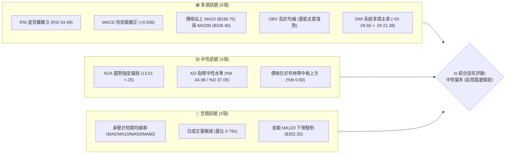
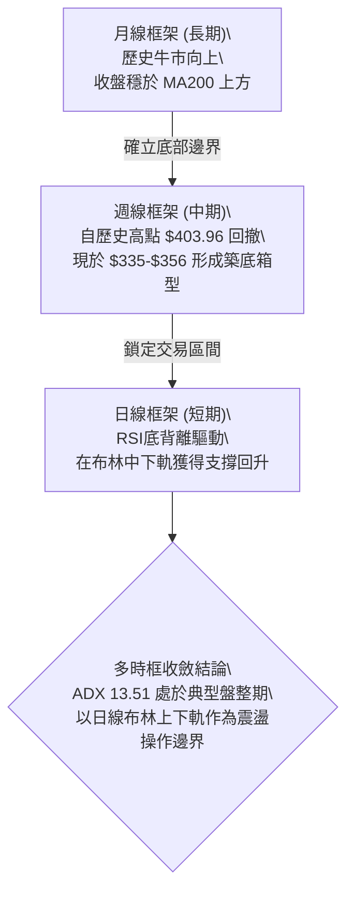
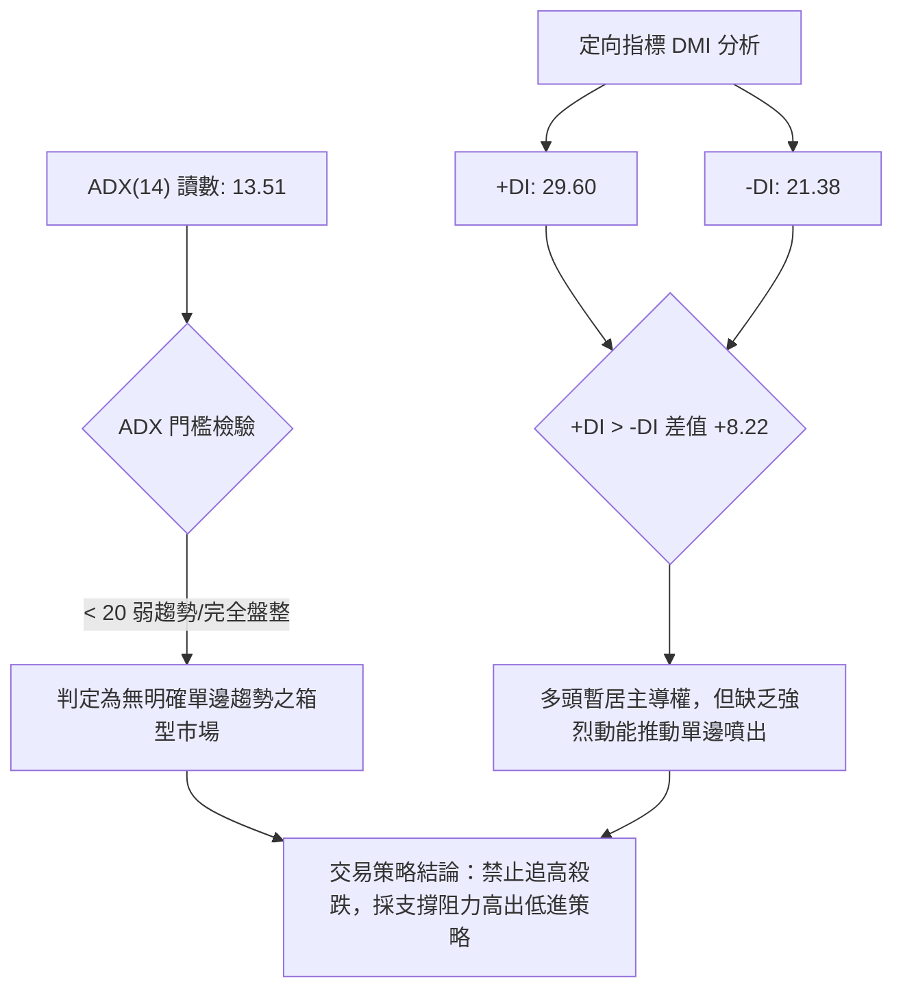
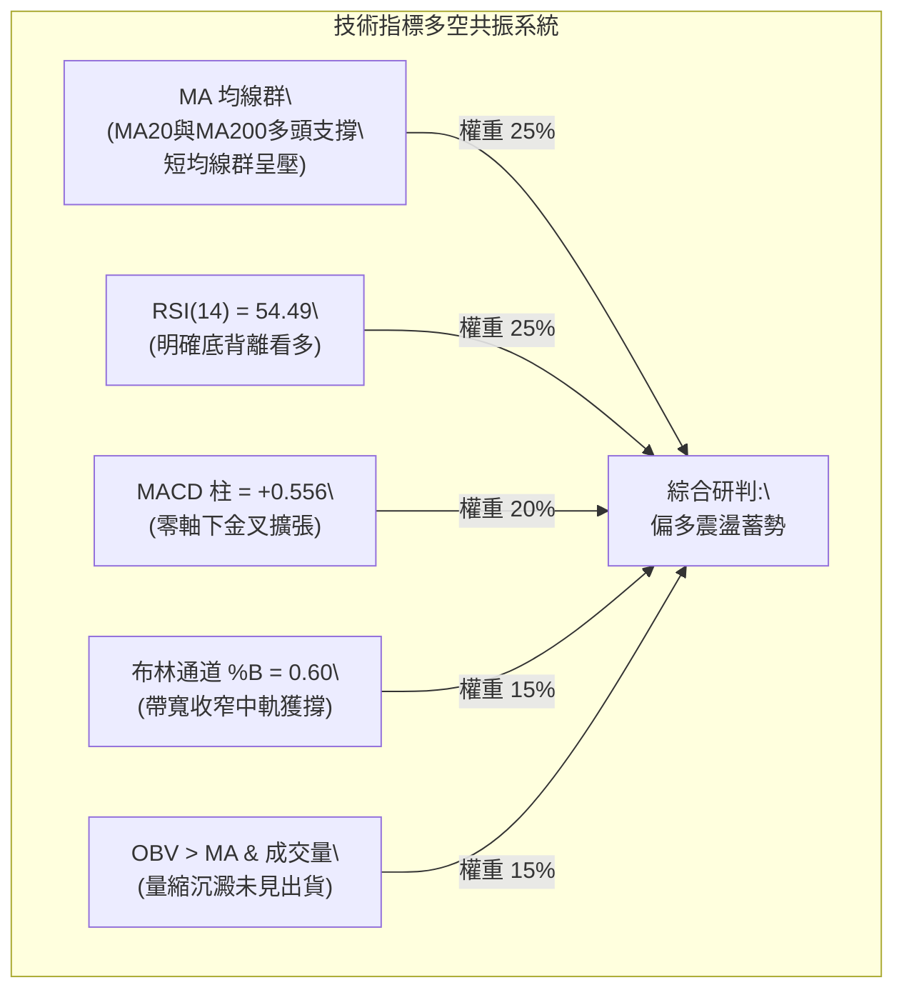
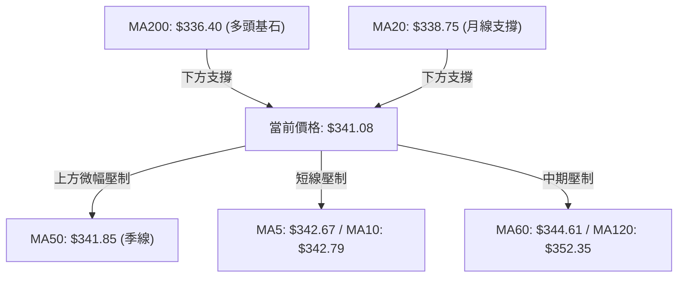
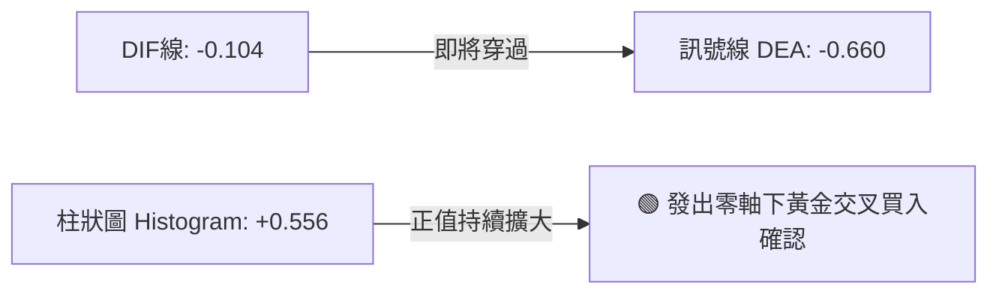
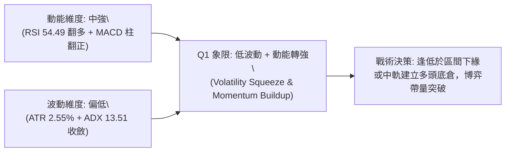
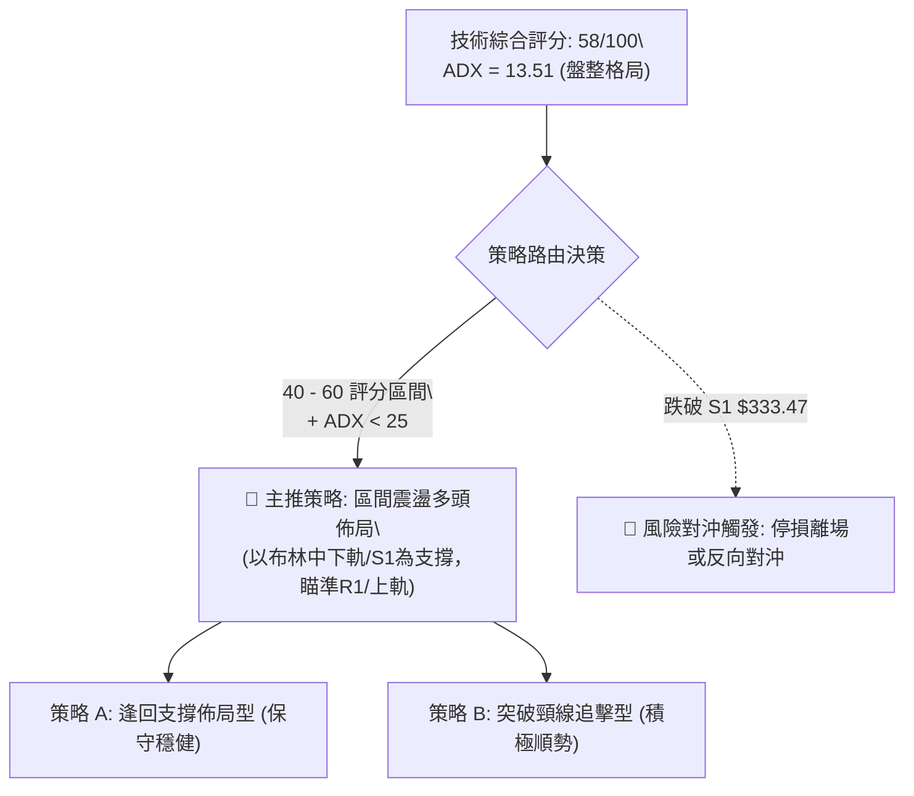
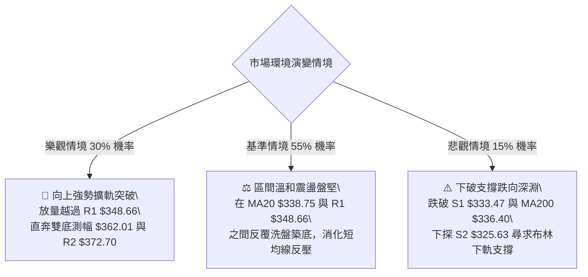

# GOOG 技術分析報告

> **報告日期**：2026-09-27 ｜ **語言**：繁體中文 ｜ **數據來源**：Yahoo Finance ｜ **當前價格**：$341.08

---

## 目錄

| 章節 | 內容 |
|------|------|
| [1. 技術面概覽](#1-技術面概覽) | 訊號儀表板、核心指標、評分卡 |
| [2. 趨勢分析](#2-趨勢分析) | 多時框趨勢、長中短期走勢、ADX解讀 |
| [3. 圖表形態分析](#3-圖表形態分析) | 形態識別、K線組合、形態目標價 |
| [4. 支撐與阻力](#4-支撐與阻力) | 關鍵價位、斐波那契回調 |
| [5. 技術指標深度解讀](#5-技術指標深度解讀) | MA/RSI/MACD/布林/成交量 |
| [6. 動能與波動率](#6-動能與波動率) | 動能四象限、ATR波動率、Beta係數 |
| [7. 多時框架總結](#7-多時框架總結) | 時框架矩陣、多時框收斂結論 |
| [8. 交易策略建議](#8-交易策略建議) | 策略路由、情境階梯、主策略詳情 |
| [9. 風險提示與監控](#9-風險提示與監控) | 關鍵監控清單、情境分析、風控準則 |

---

## 1. 技術面概覽

### 🎯 技術訊號儀表板



### 📊 核心指標速覽表

| 指標類別 | 指標名稱 | 當前數值 | 訊號 | 技術解讀與意涵 |
|:---|:---|:---|:---:|:---|
| **價格** | 當前收盤價 | $341.08 | 🟡 | 位於52週區間 62.5% 位置，處於中高檔震盪整理 |
| **均線** | MA20 (短月線) | $338.75 | 🟢 | 現價高於 MA20（+0.69%），短期生命線轉為動態支撐 |
| **均線** | MA50 (季線) | $341.85 | 🔴 | 現價略低於 MA50（-0.23%），季線處於微幅反壓狀態 |
| **均線** | MA200 (年線) | $336.40 | 🟢 | 現價穩於長期牛熊分水嶺之上（+1.39%），長多格局未破 |
| **動能** | RSI(14) | 54.49 | 🟢 | 位於50中軸上方，且日線結構出現明顯「底背離」買訊 |
| **動能** | MACD(12,26,9) | -0.104 / +0.556 | 🟢 | 柱狀圖擴張至 +0.556，DIF 即將向上金叉 DEA 零軸線 |
| **趨勢** | ADX(14) | 13.51 | 🟡 | ADX < 25 處於弱趨勢/低波盤整，非單邊行情，宜區間思維 |
| **通道** | 布林帶 %B | 0.60 | 🟡 | 運行於中軌（$338.75）與上軌（$350.61）之間 |
| **量能** | 20日成交量比 | 0.79x | 🔴 | 縮量震盪整理（13.83M vs 20MA 17.56M），突破需補量 |
| **波動** | ATR(14) | $8.71 | 🟡 | 每日平均波動幅度為 2.55%，波動度收斂有利於築底 |

### 🏆 技術評分卡

```
技術評分卡 — GOOG (2026-09-27)
════════════════════════════════════════════════════
趨勢強度      ██████░░░░░░░░░░░░░░  32/100  🟡 中性偏弱 (ADX 13.51)
動能指標      ██████████████░░░░░░  70/100  🟢 看多 (RSI底背離+MACD柱)
支撐穩定度    ██████████████░░░░░░  72/100  🟢 看多 (MA200與S1強韌)
成交量配合    ████████░░░░░░░░░░░░  42/100  🟡 中性 (量縮整理OBV偏多)
形態完整度    ████████████░░░░░░░░  60/100  🟡 中性 (箱型區間構築中)
均線排列      ██████████░░░░░░░░░░  52/100  🟡 中性 (短均黏合多空交錯)
════════════════════════════════════════════════════
綜合評分      ███████████░░░░░░░░░  58/100  中性偏多 (區間震盪)
════════════════════════════════════════════════════
```

---

## 2. 趨勢分析

### 🌐 多時框趨勢分析



### 📈 長期趨勢 — 12個月走勢圖（Unicode）

以下為 GOOG 自 2025 年 10 月至 2026 年 09 月的月線收盤走勢與關鍵轉折分析：

```
GOOG 月線走勢圖（2025-10 至 2026-09）
價格軸 ($)
$390 ┤                                    
$380 ┤                                      ● (2026-04 高點 $381.46)
$370 ┤                                     / \
$360 ┤                                    /   ● $375.96
$350 ┤                                   /     \
$340 ┤                     ● $337.87    /       ●───● $356.42
$330 ┤                    / \          /             \       ● $341.08 (現價)
$320 ┤           ●───●   /   \        /               \     /
$310 ┤          /     \ /     ● $310.82                ●───● $335.19
$300 ┤         /       ● $313.19
$290 ┤        /         \
$280 ┤       ● $281.09   ● (2026-03 低點 $286.50)
$270 ┤      /
     └──────┬───┬───┬───┬───┬───┬───┬───┬───┬───┬───┬───
           10  11  12  01  02  03  04  05  06  07  08  09  (月份)
```

**走勢特徵分析表格**：

| 階段 | 時間區間 | 起訖收盤價 | 漲跌幅 | 走勢型態特徵 |
|:---|:---|:---:|:---:|:---|
| **主升攻擊段** | 2025-10 ~ 2025-11 | $281.09 → $319.29 | +13.59% | 量能放大，連續突破多道心理整數關卡 |
| **高檔收斂段** | 2025-12 ~ 2026-03 | $313.19 → $286.50 | -8.52% | 衝高 $337.87 後回踩回調，於 52W 低點上方完成次級支撐確立 |
| **二次爆發段** | 2026-03 ~ 2026-04 | $286.50 → $381.46 | +33.14% | 單月暴力拉升近百點，創歷史波段次高點，逼近 52W 高點 $403.96 |
| **高檔回撤段** | 2026-05 ~ 2026-08 | $375.96 → $335.19 | -10.84% | 動能衰竭，沿短期均線震盪走低，回補前期跳空缺口 |
| **築底修復段** | 2026-08 ~ 2026-09 | $335.19 → $341.08 | +1.76% | 測試波段低點支撐 S1（$333.47）不破，展開溫和反彈修復 |

### 📊 中期趨勢（週線分析）

中期走勢正處於從 2026 年 5 月高點回調後的「雙底/箱型防守結構」。觀察近幾週收盤變化：
- **近期高點反壓帶**：2026-08-02 觸及 $356.42 後回落，上方形成密集成交區 R1（$348.66）與布林上軌（$350.61）的共振反壓。
- **波段底部支撐區**：2026-08-23 收盤 $341.53，隨後幾週在 $335.31 ~ $335.45 進行二次回踩測試，未跌破關鍵波段支撐 S1（$333.47），展現多頭防守韌性。

```
中期週線區間震盪示意圖：
阻力區間 ──► $356.42 ── R1: $348.66 / 布林上軌 $350.61 (強壓區)
                 ▲
                 │ 震盪區間 (幅度約 5.1%)
                 ▼
現價水位 ──► $341.08 (斐波那契 38.2% 回調位 $339.83 共振)
                 ▲
                 │ 支撐區間 (幅度約 2.2%)
                 ▼
支撐區間 ──► $335.31 ── S1: $333.47 / MA200: $336.40 (防守底線)
```

### ⚡ 趨勢強度評估（ADX 解讀）



| 指標變數 | 當前讀數 | 門檻區間 | 趨勢屬性判定 | 操作指引 |
|:---|:---:|:---:|:---:|:---|
| **ADX(14)** | **13.51** | < 20 (極弱趨勢) | **標準箱型震盪行情** | 順勢指標失真，轉以通道與區間震盪指標為主 |
| **+DI** | **29.60** | > -DI | **多頭主導買盤節奏** | 盤整內部偏向上行測試阻力 |
| **-DI** | **21.38** | 處於回落狀態 | **空頭下殺動能趨緩** | 下檔下探意願減弱，破底風險偏低 |

---

## 3. 圖表形態分析

### 🔍 形態識別系統

依據嚴格幾何定義與歷史 K 線高低點數據，進行形態檢驗：

| 識別形態 | 信心度 | 判斷依據（引用數據） | 完成度 | 目標價計算式與點位 |
|:---|:---:|:---|:---:|:---|
| **短週期雙重底 (W-Bottom)** | **68%** | 第一次低點於 2026-09-06 收盤 $335.31，第二次低點於 2026-09-13 收盤 $335.45，皆精準守住 S1 支撐 $333.47，且伴隨 RSI 形成底背離。頸線位置落在近期反彈高點 R1 $348.66。 | **75%** | 頸線 $348.66 + 形態高度 ($348.66 - $335.31 = $13.35) = **$362.01**（對應斐波那契 23.6% 回調位 $364.34 附近） |
| **矩形整理箱型 (Rectangle Box)** | **82%** | 近 8 週價格嚴格受限於下軌支撐 S1 $333.47 與上軌反壓 R1 $348.66 ~ $356.42 之間，ADX 13.51 驗證無趨勢特徵。 | **90%** | 上軌突破目標：$348.66 + ($348.66 - $333.47 = $15.19) = **$363.85** |
| **中期頭肩頂 (Head & Shoulders)** | **35%** | （數據不足，信心度低於 50%）雖然 4 月高點 $381.46 可視為頭部，但左肩與右肩結構不對稱，且跌破頸線後未放量下殺，目前已鈍化轉入矩形橫盤。 | **20%** | **訊號不足，僅做指標型解讀，不預設此形態目標價** |

### 🕯️ 重要K線形態分析

| 週/月份 | 收盤價 | K線形態 | 形態深度解讀 | 技術訊號 |
|:---|:---:|:---|:---|:---:|
| **2026-07-26** | $318.88 | 長黑破線 (Long Black) | 單週大跌測試長期均線，週成交量放大至 122M，空頭恐慌盤湧出 | 🔴 恐慌拋售 |
| **2026-08-02** | $356.42 | 吞噬大紅棒 (Bullish Engulfing) | 迅速收復前週長黑跌幅，成交量達 110M，形成強力破底翻多頭訊號 | 🟢 強力吞噬 |
| **2026-08-23** | $341.53 | 變盤十字星 (Doji Star) | RSI 殺至 20.6 極度超賣區，成交量大幅萎縮至 69.7M，賣壓枯竭 | 🟡 止跌轉折 |
| **2026-09-20** | $344.41 | 多頭反撲中紅棒 | MACD 柱狀圖暴增至 +1.455，週成交量回升至 98M，確立底部結構 | 🟢 反彈確認 |
| **2026-09-27** | $341.08 | 窄幅回洗紡錘線 (Spinning Top) | 於 MA50（$341.85）下方小幅休整，量能縮至 91.5M，屬健康的蓄勢洗盤 | 🟡 震盪整理 |

### 📉 ASCII 走勢形態示意圖

```
GOOG 雙重底 (W-Bottom) 與箱型整理結構解析
===================================================================
價格
$356.42 ┤                  ● (前期高點)
$348.66 ┼──────────────────┼────────────────────────────── R1 (頸線壓力位)
        │                 / \                ▲
        │                /   \               │ 形態高度
$341.08 ┤現價 ──────────●     \      ●現價   │ H = $13.35
        │                      \    /        ▼
$335.31 ┼─────────●─────────────●──────────── S1 (雙底底部防守線)
                  │             │
                 底1           底2
             (09-06 $335.31) (09-13 $335.45)
===================================================================
```

### 🎯 形態目標價計算

根據完成度達 75% 的「雙重底 (W-Bottom)」結構進行形態量度計算：
1. **基底低點 ($L$)**：取兩次下探收盤之有效低點 $L = \$335.31$。
2. **頸線阻力 ($Neckline$)**：取波段反彈高點聚類 $R1 = \$348.66$。
3. **形態垂直高度 ($H$)**：
   $$H = Neckline - L = \$348.66 - \$335.31 = \$13.35$$
4. **理論突破最小目標價 ($T_1$)**：
   $$T_1 = Neckline + H = \$348.66 + \$13.35 = \$362.01$$
   *（註：此位階精準對應斐波那契 23.6% 回調位 $364.34 下緣）*
5. **完全測幅擴展目標價 ($T_2$)**（取矩形震盪波幅 $1.618$ 倍擴展）：
   $$T_2 = Neckline + (1.618 \times H) = \$348.66 + (1.618 \times \$13.35) = \$370.26$$
   *（註：接近波段阻力 R2 之 \$372.70）*

---

## 4. 支撐與阻力

### 🗺️ 關鍵價位分布圖（Unicode）

```
GOOG 價位結構分布圖 (依據 OHLCV 聚類與斐波那契位階)
═════════════════════════════════════════════════════════════════
$403.96 ║████████████████████████████████║ 52W 歷史最高點 (Fib 0.0%)
$381.56 ║████████████████████████        ║ 強阻力 R3 (前波頭部密集區)
$372.70 ║████████████████                ║ 阻力 R2 (反彈高點聚類)
$364.34 ║████████████                    ║ 斐波那契 23.6% 回調關鍵位
$348.66 ║████████████████████████████    ║ 關鍵阻力 R1 / 箱型頂部
$341.08 ╠════════════════════════════════╣ ◄ 現價 ($341.08, 位於 Fib 38.2%)
$339.83 ║░░░░░░░░░░░░░░░░░░░░░░░░░░░░░░░░║ 斐波那契 38.2% 回調位 (即時支撐)
$336.40 ║▓▓▓▓▓▓▓▓▓▓▓▓▓▓▓▓▓▓▓▓▓▓▓▓▓▓▓▓    ║ MA200 牛熊分水嶺
$333.47 ║▓▓▓▓▓▓▓▓▓▓▓▓▓▓▓▓▓▓▓▓▓▓▓▓▓▓▓▓▓▓▓▓║ 近期核心支撐 S1 (雙底頸線底)
$325.63 ║████████████████████            ║ 強支撐 S2 (布林下軌 $326.88 共振)
$320.02 ║████████████████████████████    ║ 斐波那契 50.0% 中軸平衡點
$312.49 ║████████████████████████████████║ 極限防守支撐 S3 (波段崩跌低點)
═════════════════════════════════════════════════════════════════
```

### 🚧 阻力位分析表

所有價位均直接引用數據來源之近一年波段高點聚類數值：

| 阻力級別 | 精確價位 | 距離現價 | 技術形成原因與結構背景 | 突破難度 | 戰略重要性 |
|:---|:---:|:---:|:---|:---:|:---|
| **R1** | **$348.66** | +2.22% | 雙重底頸線、近期反彈收盤高點聚集處，逼近布林通道上軌（$350.61）。 | 🟡 中等 | ★★★★☆<br>(短線多空樞紐) |
| **R2** | **$372.70** | +9.27% | 2026 年 5 月高檔回撤時的長黑破位點，為套牢籌碼籌碼解套區。 | 🔴 較高 | ★★★★☆<br>(波段反彈強阻) |
| **R3** | **$381.56** | +11.87% | 2026 年 4 月月線波段最高收盤價（$381.46）所構成的歷史重壓天花板。 | 🔴 極高 | ★★★★★<br>(多頭極限目標) |

### 🛡️ 支撐位分析表

所有價位均直接引用數據來源之近一年波段低點聚類數值：

| 支撐級別 | 精確價位 | 距離現價 | 技術形成原因與結構背景 | 守住機率 | 戰略重要性 |
|:---|:---:|:---:|:---|:---:|:---|
| **S1** | **$333.47** | -2.23% | 近期 9 月兩次探底低點聚類，與週線低點支撐重疊，近月多次測試不破。 | 🟢 80% | ★★★★★<br>(短線生命防線) |
| **S2** | **$325.63** | -4.53% | 接近布林通道下軌（$326.88）與 MA240（$327.63），具備強大技術面共振買盤。 | 🟢 88% | ★★★★☆<br>(中期強固緩衝) |
| **S3** | **$312.49** | -8.38% | 2026 年 2 月回調低點 $310.82 及 7 月下影線低點之極限恐慌籌碼支撐區。 | 🟢 95% | ★★★★★<br>(牛市崩塌防線) |

### 📐 斐波那契回調位分析

依據 52 週完整波動區間（低點 $236.07 → 高點 $403.96，總垂直落差 $167.89）計算之位階分析如下：

```
斐波那契回調結構圖：
0.0%  $403.96 ─────────────────────── 52W High (歷史頂部)
23.6% $364.34 ─────────────────────── 第一道回調壓力帶
現價  $341.08 ◄── 位於 23.6% 與 38.2% 區間，極度貼近 38.2% 支撐
38.2% $339.83 ─────────────────────── 黃金分割即時支撐位 (關鍵攻防)
50.0% $320.02 ─────────────────────── 多空強弱平衡中軸
61.8% $300.20 ─────────────────────── 黃金分割防守極限
100%  $236.07 ─────────────────────── 52W Low (起漲點)
```

- **當前位置解讀**：現價 **$341.08** 正精準踩在 **38.2% 回調位（$339.83）** 上方僅 0.37% 處。在強勢牛市拉回結構中，38.2% 回調位通常為最健康的淺幅回踩點。若能在此處完成籌碼沉澱，暗示自 $403.96 下跌的中期修正已在該位階被強大買盤吸收，後市具備重新發動上攻的堅實基石。

---

## 5. 技術指標深度解讀

### 🎛️ 指標訊號總覽



### 📈 移動平均線排列分析



**均線狀態深度解剖**：
- **混合排列格局**：短中長期均線呈現錯綜交疊。MA20（$338.75）於低檔抬頭上揚，並與長週期牛熊分水嶺 MA200（$336.40）形成下檔的「雙重護盤網」。
- **短線反壓聚集**：MA5（$342.67）、MA10（$342.79）與 MA50（$341.85）密集糾結於 $341.85 ~ $342.80 之間，與現價差距小於 0.5%，只需一根放量中紅棒即可一次性貫穿此三條阻力線，實現短均線多頭收斂向上發散。
- **長期多頭結構未毀**：超長週期 MA240（$327.63）保持穩定向上斜率（+4.11%），代表長線核心籌碼未見鬆動。

### 📉 RSI(14) 分析

```
RSI(14) 強度指標讀數：54.49
[0] ─────────────── [30] ────── [50] ───●───── [70] ─────────────── [100]
超賣區                   中軸   現價(54.49)  超買區
進度條：██████████████░░░░░░░░░░░░  54.49% (中性偏強)
```

- **背離研判（底背離確立）**：
  - 檢視週線數據，2026-07-26 價格跌至 $318.88 時，RSI 創下低點 26.4；
  - 隨後在 2026-08-23 價格回踩至 $341.53，RSI 觸及 20.6 極值；
  - 到了 2026-09-06 至 2026-09-13，價格二度下探 $335.31 ~ $335.45，然而 RSI 卻逆勢大幅抬升至 **43.3 ~ 44.0**，並在今日拉升至 **54.49**！
  - **結論**：價格築底不破而 RSI 底部顯著墊高，構成標準的**技術指標底背離 (Bullish Divergence)**，預示空頭衰竭，反彈動能正持續聚集。

### 📊 MACD(12,26,9) 訊號解讀



- **指標讀數**：DIF 錄得 -0.104，Signal (DEA) 錄得 -0.660，兩者即將於零軸下方形成黃金交叉。
- **柱狀圖動態**：柱狀圖（MACD Hist）已連續擴大至 **+0.556**。對照近 5 週柱狀圖軌跡（-0.818 → -0.220 → -0.373 → -0.275 → +1.455 → +0.556），多頭動能從極度萎縮中強烈爆發並維持在正值區，為價格突破整理區間提供堅實動能背書。

### 📦 布林通道分析

```
GOOG 日線布林通道 (20, 2) 結構圖
===================================================================
$350.61 ┤─────────────────────────────────────────── 上軌 (阻力帶)
        │
$341.08 ┤                  ● 現價 ($341.08, %B = 0.60)
$338.75 ┼──────────────────┼──────────────────────── 中軌 (MA20 支撐)
        │                 /
$326.88 ┤────────────────●────────────────────────── 下軌 (超跌買點)
===================================================================
```

- **通道帶寬與位置**：通道上軌為 $350.61，中軌為 $338.75，下軌為 $326.88。現價位於 $341.08，處於中軌之上、上軌之下的多頭優勢區間，**%B 數值為 0.60**。
- **通道收縮狀態（Squeeze）**：帶寬目前僅為 $23.73（約 6.9% 空間），表明市場波動率經歷大幅壓縮，隨時可能迎來「通道開口擴張」的突破方向選擇。鑒於價格站在中軌之上且帶有底背離，向上擴軌概率顯著偏高。

### 💹 成交量分析（量價配合度）

- **成交量數據**：最新單日成交量為 13,835,100 股，相較於 20 日均量 17,563,465 股，量比為 **0.79x**；相較於 50 日均量 18,415,214 股亦處於縮量狀態。
- **量價健康度解讀**：在箱型整理打底階段，「下跌量縮、反彈微放量」是標準的洗盤特徵。9 月 20 日反彈收紅時週量放大至 98.13M，本週回調量縮至 91.50M，未出現帶量殺跌現象。
- **能量潮 OBV 分析**：技術數據明確顯示「**OBV > MA → 量能支撐上漲**」。雖然日線成交量未顯著爆發，但長線資金在底部默默吸籌，量能潮趨勢線維持在均線之上，並未伴隨價格整理而向下跌破，證實主力資金未曾離場。

---

## 6. 動能與波動率

### ⚡ 動能評估四象限

評估市場在「動能強度（RSI/MACD）」與「波動率（ATR/通道帶寬）」所處之象限狀態：

| 象限 | 動能維度 | 波動維度 | 典型市況 | 當前 GOOG 狀態判定 | 戰術指引 |
|:---:|:---:|:---:|:---|:---:|:---|
| **Q1** | **強** | **低** | **低波醞釀期（蓄勢突破）** | 🎯 **當前精確定位** | **最佳佈局點**：動能轉強但波動度尚未放大，買權/現貨性價比極高 |
| **Q2** | **弱** | **低** | 無聊盤整期（低位橫盤） | 8 月下旬曾處於此象限 | 資金使用效率低，需等待指標金叉 |
| **Q3** | **強** | **高** | 單邊主升段（狂暴拉升） | 2026 年 4 月曾處於此象限 | 順勢追價，但需承受極大單日震盪 |
| **Q4** | **弱** | **高** | 恐慌主跌段（雪崩破位） | 2026 年 7 月下旬曾處於此象限 | 嚴禁抄底，流動性陷阱 |



### 📊 ATR 波動率分析

- **ATR(14) 絕對數值**：**$8.71**，佔當前股價之 **2.55%**。
- **波動意義解讀**：代表 GOOG 在單一交易日內由最高至最低的正常隨機震盪帶約為 ±$8.71 美元。當前 2.55% 的波動率處於過去兩年運行的歷史相對低位，呈現波動收斂壓縮。
- **動態止損距離設定建議**：
  - **極短線（日內/隔夜）**：1.0 倍 ATR = **$8.71**，防守價位落在 $332.37。
  - **波段擺盪交易（Swing Trading）**：1.5 倍 ATR = **$13.07**，防守價位落在 $328.01。
  - **趨勢型建倉（Position Trading）**：2.0 倍 ATR = **$17.42**，防守價位落在 $323.66（略低於強支撐 S2 $325.63）。

### 📐 Beta 與市場相關性

- **Beta 係數**：**1.225**。
- **意涵**：GOOG 展現高於大盤（S&P 500）22.5% 的波動彈性，屬於具備積極進攻屬性之高 Beta 成長型權值股。在整體科技板塊回暖階段，1.225 的 Beta 值將賦予 GOOG 顯著的超額報酬（Alpha）潛力；但在市場流動性緊縮時，下檔折價速度亦會略快於大盤。

---

## 7. 多時框架總結

### 📋 時框架評分表

| 時框架 | 趨勢方向 | 動能狀態 | 均線排列 | 圖表形態 | 綜合評分 | 操作建議 |
|:---|:---:|:---:|:---:|:---:|:---:|:---|
| **長期 (月線)** | 🟢 多頭趨勢 | 🟡 高檔整理中 | 🟢 均線長多排列 (MA240走揚) | 歷史多頭回踩 38.2% | **75/100** | 長線多頭未損，回調提供逢低買點 |
| **中期 (週線)** | 🟡 區間打底 | 🟢 柱狀圖翻正 | 🟡 糾結於 MA50 上下 | 雙重底 (W-Bottom) 雛形 | **60/100** | 區間震盪偏多，持股續抱待變 |
| **短期 (日線)** | 🟢 震盪轉強 | 🟢 RSI 底背離確立 | 🟡 站上 MA20 承壓 MA50 | 布林中軌反彈，向箱型頂推進 | **62/100** | 沿 MA20 逢低做多，上看 R1 |

### 🔲 綜合訊號矩陣

| 維度分析 | 短期 (日線) | 中期 (週線) | 長期 (月線) | 訊號一致性評估 |
|:---|:---:|:---:|:---:|:---|
| **趨勢方向** | 區間回升 | 箱型整理 | 偏多格局 | 🟡 短中期在長期多頭背景下進行休整 |
| **動能訊號** | 🟢 底背離轉強 | 🟢 MACD柱擴大 | 🟡 動能自高檔降溫 | 🟢 動能修復已自短線蔓延至中線 |
| **量價配合** | 🟡 縮量蓄勢 | 🟢 反彈量增回調量縮 | 🟢 長期量能結構紮實 | 🟢 籌碼未現大舉鬆動跡象 |
| **關鍵支撐** | $338.75 (MA20) | $333.47 (S1) | $320.02 (Fib 50%) | 🟢 支撐層層鎖定，防守結構綿密 |

### ⚖️ 多時框收斂結論

> **依據多時框收斂規則（規則 14）**：
> 當前 **ADX(14) 讀數為 13.51（遠低於 25 臨界線）**，判定當前 GOOG 處於標準的「**盤整震盪行情**」，而非單邊趨勢行情。
>
> 故收斂邏輯以**日線布林通道上下軌（$326.88 ~ $350.61）與核心波段支撐阻力 S1（$333.47）至 R1（$348.66）作為最主要的操作邊界**。
>
> **唯一方向性結論**：**【中性偏多，區間震盪打底】**。
> 短期 RSI 底背離與 MACD 柱翻正提供了充足的向上反彈動力，但受制於 ADX 趨勢強度不足與上方 MA50/R1 反壓，股價難以直衝歷史天花板，最可能的運行路徑為「**在 $333.47 ~ $338.75 支撐區間築底後，向上震盪挑戰 $348.66 ~ $350.61 阻力帶**」。此結論與後續第 8 章交易策略完全一致。

---

## 8. 交易策略建議

### 🗺️ 策略決策流程圖



### 🧭 策略路由

**當前主策略方向 = 區間震盪偏多（依綜合評分 58/100，處於 40–60 區間震盪偏多指引）**

由於評分卡得分為 58/100 且 ADX 呈現低波盤整特徵，本報告嚴格摒棄單邊盲目看空或過度追高，**主推以布林中軌 $338.75 與波段支撐 S1 $333.47 為依託之「區間偏多操作」**，上方以 R1 $348.66 與布林上軌 $350.61 為第一階段獲利了結區。

### 🎯 價格情境階梯（Price Scenarios）

所有價位均嚴格引用第 4 章及數據源計算之關鍵價位：

| 觸發條件 | 即刻目標 | 下一目標 | 後續延伸 | 市場情境含義與結構轉變 |
|:---|:---:|:---:|:---:|:---|
| **有效放量突破 R1 $348.66** | 布林上軌 $350.61 | R2 $372.70 | R3 $381.56 | 雙底形態確立，打開向 52W 高點挑戰的波段攻擊空間 |
| **守穩 MA20 $338.75 / 現價震盪** | R1 $348.66 | 布林上軌 $350.61 | — | 箱型區間內部溫和輪動，底背離動能持續發酵 |
| **失守 S1 $333.47 關鍵支撐** | S2 $325.63 | Fib 50% $320.02 | S3 $312.49 | 雙底架構宣告破敗，技術面轉弱並二度探尋強支撐 |

### 📊 情境機率分佈

| 運行情境 | 機率估算 | 核心指標支撐依據 |
|:---|:---:|:---|
| **震盪反彈 / 向上測試 R1** | **60%** | RSI 底背離確立、MACD 柱狀圖翻正至 +0.556、OBV > 均線支撐上漲。 |
| **區間窄幅箱型震盪** | **25%** | ADX 僅 13.51 處於弱趨勢態勢、量能縮減至 0.79x，市場追價意願仍顯謹慎。 |
| **向下破位回測 S2 / S3** | **15%** | MA5/10/50 處於微幅反壓狀態；若大盤劇烈系統性下挫可能拖累高 Beta 個股。 |

### 🟢 主策略詳情

| 策略要素 | 策略 A：支撐回踩佈局（保守主推） | 策略 B：頸線突破追擊（積極確認） |
|:---|:---|:---|
| **策略類型** | 區間下緣低吸（Mean Reversion） | 形態確認順勢追擊（Breakout Momentum） |
| **進場條件** | 價格回測 MA20 支撐有守，或現價分批掛單 | 日線收盤價帶量實體站穩阻力 R1 之上 |
| **進場價格** | **$338.75**（MA20 / 現價 $341.08 分批） | **$348.66**（突破 R1 確認時） |
| **第一目標價 T1** | **$348.66**（波段阻力 R1） | **$362.01**（雙底形態量度目標） |
| **第二目標價 T2** | **$350.61**（日線布林通道上軌） | **$372.70**（關鍵波段阻力 R2） |
| **嚴格止損價格** | **$333.47**（波段低點支撐 S1 跌破離場） | **$341.85**（跌回 MA50 季線內部假突破停損）|
| **風險報酬比 (R:R)**| **1 : 1.88**（以進場 $338.75，目標 $348.66 計）| **1 : 1.96**（以進場 $348.66，目標 $362.01 計）|
| **模型預估成功率** | **65%** | **55%** |
| **建議配置倉位** | **總資金 15% - 20%** | **總資金 10% - 15%** |

### 🔴 反向風險觸發點（對沖提示）

- **多頭停損/反向做空警戒線**：日線收盤價若**實體跌破支撐 S1（$333.47）**。
- **對沖處置建議**：若失守 S1，代表自 9 月以來的雙底結構徹底失效，股價將迅速滑向布林下軌及強支撐 S2（$325.63）。持股者應立即執行減倉 50% 以上或透過買入反向 Put 避險；短線交易者可順勢以 S1 為停損點，輕倉下看 S2（$325.63）。

### ⭐ 整體訊號強度評星

```
做多訊號強度：★★★★☆  (4/5星 - RSI底背離與MACD柱擴張提供扎實底部支撐)
做空訊號強度：★☆☆☆☆  (1/5星 - 空頭動能衰竭且下檔均線多重密集成焦)
整體可信度：  ★★★★☆  (4/5星 - 技術指標與形態相互印證度高)
```

---

## 9. 風險提示與監控

### ✅ 關鍵監控指標 Checklist

```
╔══════════════════════════════════════════════════════════════════════╗
║              GOOG 技術交易日常風控監控清單 (Checklist)               ║
╠══════════════════════════════════════════════════════════════════════╣
║ [ ] 價格是否持續收在 MA20 ($338.75) 之上？(跌破需警戒)               ║
║ [ ] RSI(14) 能否維持在 50 中軸之上運作？(跌破 45 視為動能減弱)      ║
║ [ ] 日成交量能否回升至 20 日均量 (17.56M) 之上以確認突破真實性？     ║
║ [ ] MACD 柱狀圖是否持續保持在正值區 (+0.556 以上擴張最優)？          ║
║ [ ] ADX 數值何時突破 20 乃至 25？(突破代表單邊主升波正式發動)       ║
║ [ ] 價格觸及 R1 ($348.66) 時是否出現長上影線等假突破 K 線？          ║
╚══════════════════════════════════════════════════════════════════════╝
```

### ⚠️ 風險場景分析



### 🛡️ 風險管理重要提醒

1. **波動壓縮後的假突破風險**：布林通道帶寬目前顯著收斂，在此類形態中，常出現「先假跌破誘空、再強勢暴拉」或「先衝高假突破、再反殺」的洗盤走勢。因此，在突破 R1（$348.66）時，必須檢視是否有成交量放大（量比需 > 1.2x）相伴，避免於縮量突破時盲目追價。
2. **季線 MA50 處的心理關卡**：MA50（$341.85）與現價僅咫尺之遙，多頭必須在未來 2-3 個交易日內收盤站穩其上，方能解除短均線反壓警報。
3. **倉位配置紀律**：在 ADX < 25 的無趨勢盤整市場中，切忌使用單邊滿倉策略。建議將總持倉控制在 20% 以內，並將單筆交易最大虧損嚴格鎖定在總賬戶淨值的 1% - 1.5% 之間。

---

## 📋 報告總結

```
╔════════════════════════════════════════════════════════════════════╗
║                  GOOG 技術分析報告總結 (Executive Summary)         ║
╠════════════════════════════════════════════════════════════════════╣
║ 報告日期：2026-09-27             當前價格：$341.08                 ║
║ 技術評級：⚖️ 中性偏多 (58/100)    市場狀態：低波整理蓄勢 (ADX 13.51)║
╠════════════════════════════════════════════════════════════════════╣
║ 關鍵結構解析：                                                     ║
║ ├─ 長期趨勢：🟢 偏多格局 (站穩 MA200 $336.40 與斐波 38.2% $339.83) ║
║ ├─ 中期趨勢：🟡 箱型築底 (雙重底架構逐步成熟，回撤獲支撐)         ║
║ ├─ 短期趨勢：🟢 動能修復 (RSI 底背離確立，MACD 柱翻正擴張)         ║
║ ├─ 核心支撐：S1 $333.47  /  MA200 $336.40  /  MA20 $338.75         ║
║ ├─ 核心阻力：R1 $348.66  /  布林上軌 $350.61  /  R2 $372.70       ║
║ └─ 華爾街共識目標：均價 $422.34 (15 位分析師 Strong Buy)          ║
╠════════════════════════════════════════════════════════════════════╣
║ 最優策略指引：                                                     ║
║ 1. 🥇 最佳機會（策略 A）：於 $338.75 ~ $341.08 區間建立多頭底倉，   ║
║    嚴守 S1 $333.47 止損，第一階段瞄準 R1 $348.66 (風報比 1:1.88)   ║
║ 2. 🥈 次選機會（策略 B）：耐心等待日線帶量實體突破 R1 $348.66，     ║
║    確認雙底形態後右側追進，上看 $362.01 ~ $372.70                  ║
║ 3. 🥉 保守選擇：在 ADX 尚未站上 20 之前保持觀望，等待日線均線完全  ║
║    收斂發散後再行大資金介入。                                      ║
╚════════════════════════════════════════════════════════════════════╝
```

---

> ⚠️ **免責聲明**：本報告為依據客觀技術分析指標與歷史價格模型生成之量化研究報告，報告內所有數據均依據既有公開行情資訊推導。本報告**僅供研究與學術參考**，**不構成任何個人化的投資要約、招攬或交易建議**。證券投資具有相當程度之市場風險，投資人應獨立評估自身財務狀況與風險承受能力，並自負盈虧。

---

*報告生成時間：2026-09-27 ｜ 數據來源：Yahoo Finance ｜ 分析框架：多時框技術分析體系*