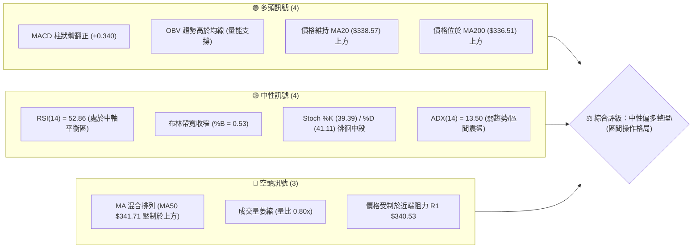
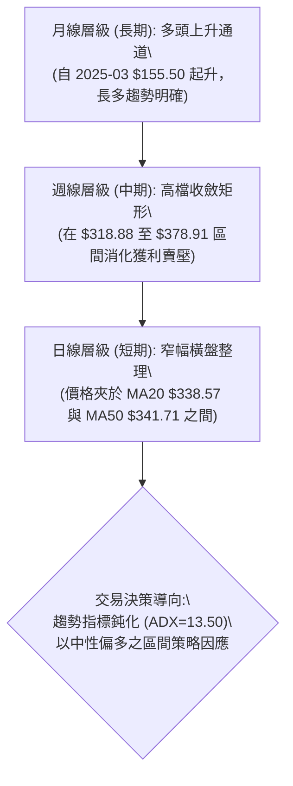
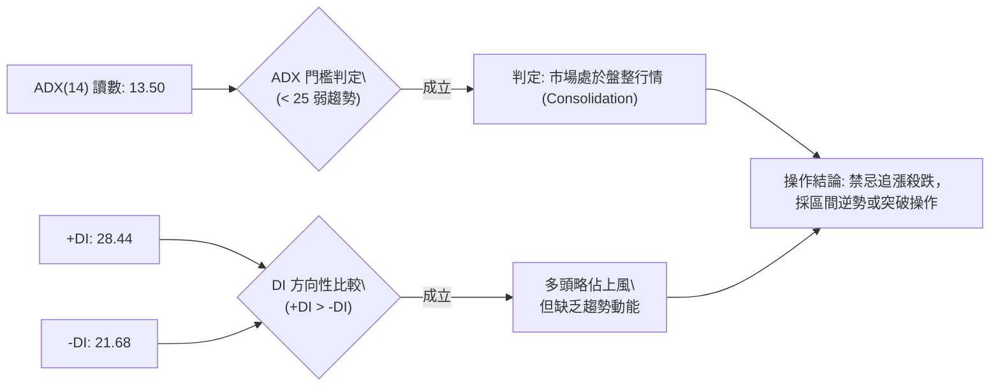
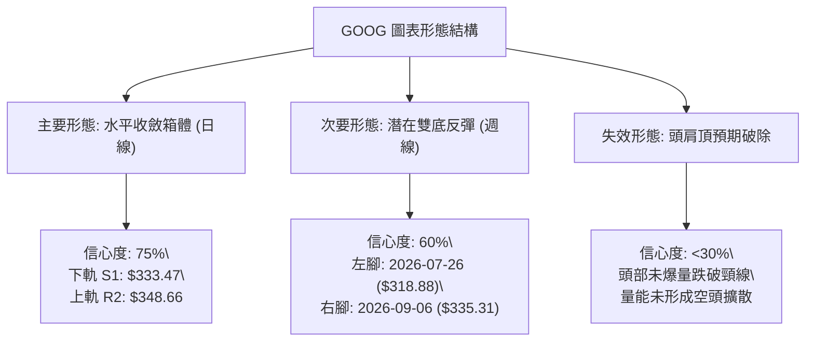
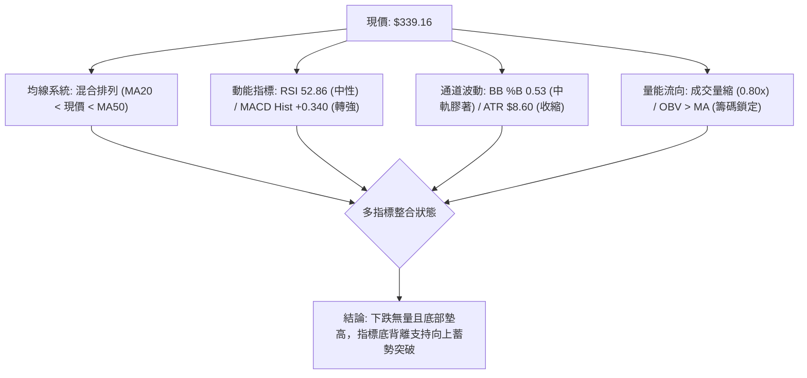
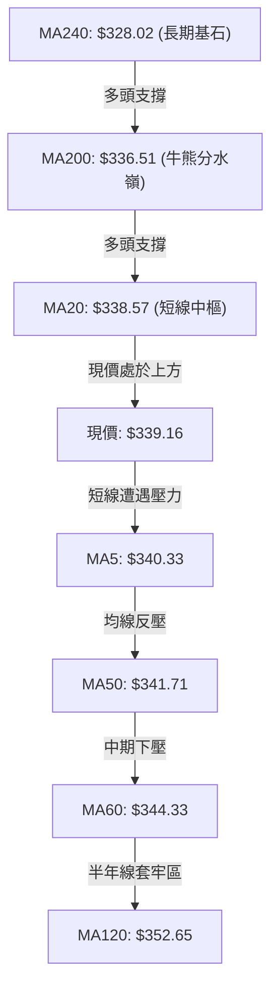
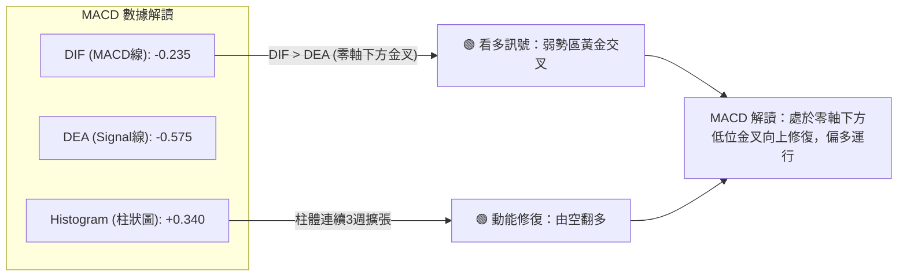
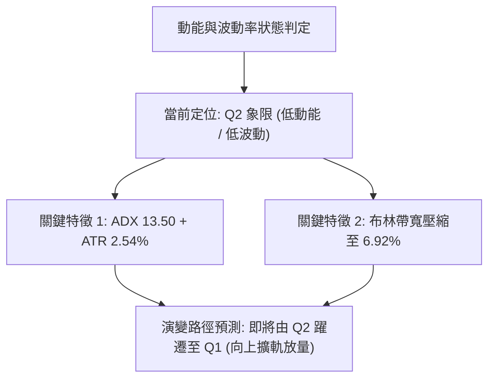
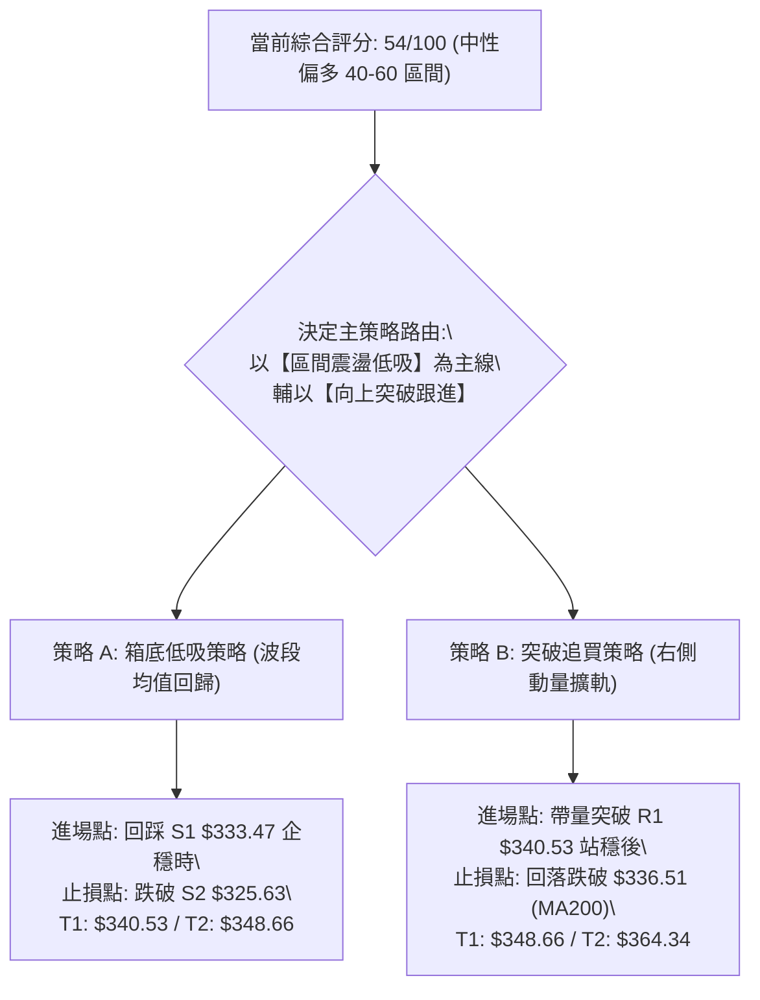
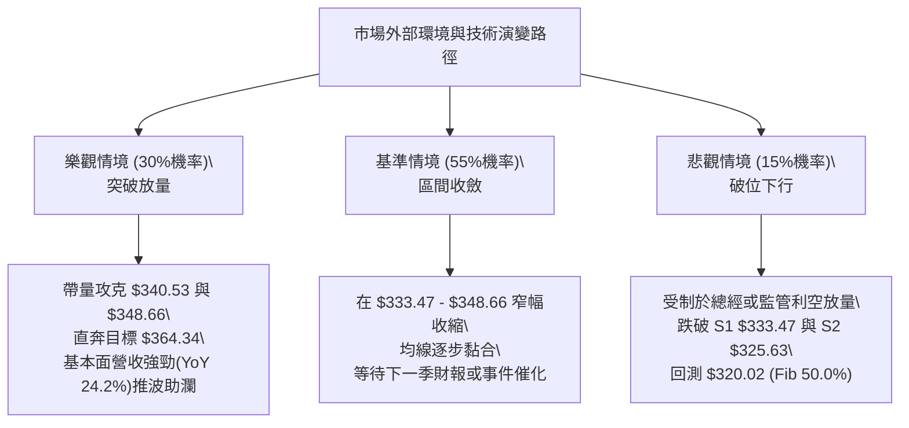

# GOOG 技術分析報告

> **報告日期**：2026-09-29 ｜ **語言**：繁體中文 ｜ **數據來源**：Yahoo Finance ｜ **當前價格**：$339.16

---

## 目錄

| 章節 | 內容 |
|------|------|
| [1. 技術面概覽](#1-技術面概覽) | 訊號儀表板、核心指標、評分卡 |
| [2. 趨勢分析](#2-趨勢分析) | 多時框趨勢、長中短期走勢、ADX解讀 |
| [3. 圖表形態分析](#3-圖表形態分析) | 形態識別、信心度評級、K線結構 |
| [4. 支撐與阻力](#4-支撐與阻力) | 關鍵價位、斐波那契回調結構 |
| [5. 技術指標深度解讀](#5-技術指標深度解讀) | MA/RSI/MACD/布林/成交量量價整合 |
| [6. 動能與波動率](#6-動能與波動率) | 動能四象限、ATR波動分析、Beta相關性 |
| [7. 多時框架總結](#7-多時框架總結) | 時框架評分矩陣、收斂規則判定 |
| [8. 交易策略建議](#8-交易策略建議) | 策略路由、價格情境階梯、風控配置 |
| [9. 風險提示與監控](#9-風險提示與監控) | 監控清單、情境模擬、風控準則 |

---

## 1. 技術面概覽

### 🎯 技術訊號儀表板

Alphabet Inc.（GOOG）目前處於歷史高點拉回後的「低波動箱體收斂」階段。指標體系呈現多空拉鋸但底層量能逐步轉強的特徵。



### 📊 核心指標速覽表

| 指標類別 | 指標名稱 | 當前數值 | 訊號 | 專業解讀 |
|:---|:---|:---|:---:|:---|
| **價格** | 當前收盤價 | $339.16 | 🟡 | 位於52週區間的 61.4% 位置，處於中高檔整理 |
| **短期均線** | MA20 | $338.57 | 🟢 | 現價微幅突破短期均線（+0.17%），轉為短支撐 |
| **中期均線** | MA50 | $341.71 | 🔴 | 現價位於均線下方（-0.75%），形成短期反彈天花板 |
| **長期均線** | MA200 | $336.51 | 🟢 | 現價穩居長線生命線之上（+0.79%），長牛架構未破 |
| **超長均線** | MA240 | $328.02 | 🟢 | 具備強大長週期價值支撐，距離現價 +3.39% |
| **動能** | RSI(14) | 52.86 | 🟡 | 位於 50 臨界點上方，多空力量處於動態平衡 |
| **趨勢強度** | ADX(14) | 13.50 | 🟡 | ADX < 25 表明無單向趨勢，當前為典型區間震盪盤 |
| **指數平滑** | MACD Hist | +0.340 | 🟢 | 負軸金叉後柱體持續擴張，短線動能偏多修復 |
| **通道狀態** | Bollinger %B | 0.53 | 🟡 | 緊貼布林中軌（$338.57），等待方向性擴軌 |
| **波動風險** | ATR(14) | $8.60 | 🟡 | 日內波動幅度 2.54%，波動率壓縮，變盤在即 |
| **籌碼量能** | OBV 趨勢 | OBV > MA | 🟢 | 價穩量縮但能量潮持續高於均線，有主力護盤跡象 |

### 🏆 技術評分卡

```
╔══════════════════════════════════════════════════════════════════╗
║               技術評分卡 — GOOG (2026-09-29)                     ║
╠══════════════════════════════════════════════════════════════════╣
║ 趨勢強度 (Trend)     ████░░░░░░░░░░░░░░░░  28/100  🔴 (無趨勢)   ║
║ 動能指標 (Momentum)  ███████████░░░░░░░░░  55/100  🟡 (修復中)   ║
║ 支撐穩定度 (Support) ██████████████░░░░░░  70/100  🟢 (底背硬)   ║
║ 成交量配合 (Volume)  ██████████░░░░░░░░░░  50/100  🟡 (量縮中)   ║
║ 形態完整度 (Pattern) ████████████░░░░░░░░  60/100  🟡 (箱體中)   ║
║ 均線系統 (MA System) ███████████░░░░░░░░░  55/100  🟡 (交織中)   ║
╠══════════════════════════════════════════════════════════════════╣
║ 綜合技術評分         ███████████░░░░░░░░░  54/100  🟡 區間震盪   ║
╚══════════════════════════════════════════════════════════════════╝
```

---

## 2. 趨勢分析

### 🌐 多時框趨勢分析



### 📈 長期趨勢 — 12個月走勢圖（Unicode）

以下為 GOOG 自 2025 年 10 月至 2026 年 09 月的月線收盤價走勢軌跡。

```
GOOG 月線收盤走勢圖（2025-10 至 2026-09）
價格軸 ($)
$390 ┤                                      
$380 ┤                                  ●(04月 $381.46 - 收盤波段高點)
$370 ┤                                      ●(05月 $375.96)
$360 ┤                                          ●(07月 $356.42)
$350 ┤                                      ●(06月 $353.10)
$340 ┤                              ●(01月 $337.87)         ●(09月 $339.16 現價)
$330 ┤                                                  ●(08月 $335.19)
$320 ┤                      ●(11月 $319.29)
$310 ┤                          ●(12月 $313.19)  ●(02月 $310.82)
$300 ┤                                  
$290 ┤                                      ●(03月 $286.50 - 回測低點)
$280 ┤  ●(10月 $281.09)
     └───────────────────────────────────────────────────────────────
        10月  11月  12月  01月  02月  03月  04月  05月  06月  07月  08月  09月
```

#### 走勢特徵分析表格

| 階段區間 | 時間跨度 | 起訖價位 | 漲跌幅 | 結構特徵與技術解讀 |
|:---|:---:|:---:|:---:|:---|
| **主升攻擊段** | 2025/10 - 2026/01 | $281.09 → $337.87 | +20.20% | 沿 5 月均線強勢推升，量價齊揚，突破 $300 大關 |
| **春季急殺洗盤** | 2026/02 - 2026/03 | $337.87 → $286.50 | -15.20% | 快速回撤測試突破點，在 $286.50 探底完成雙底架構 |
| **歷史創高主波** | 2026/03 - 2026/04 | $286.50 → $381.46 | +33.14% | 暴力噴出創下歷史盤中高點 $403.96，月線實體收長紅 |
| **頂部整理拉回** | 2026/05 - 2026/06 | $381.46 → $353.10 | -7.43% | 高檔獲利了結賣壓湧現，連續跌破短期週均線 |
| **箱體收斂築底** | 2026/07 - 2026/09 | $353.10 → $339.16 | -3.95% | 波動收窄，在 $333 - $348 區間沉澱籌碼，蓄勢變盤 |

### 📊 中期趨勢（週線分析）

從近 20 週數據觀察，GOOG 於 2026 年 7 月 26 日當週創下拉回低點 $318.88 後展開防守反彈，隨後在 8 月初反彈至 $356.42 遇阻回落。過去 8 週收盤價始終緊咬於 $335.31 至 $344.41 的狹幅區間。

```
近期週線壓力與支撐結構示意
$372.70 ────────────────────────────────────────── 阻力 R3 (波段密集高點)
                   ▲
$348.66 ───────────┼────────────────────────────── 阻力 R2 (布林上軌/近期反彈頂)
$340.53 ───────────┼─────── 阻力 R1 (短線突破點)
$339.16 ═══════════╪══════ ◄ 現價 ($339.16)
$333.47 ───────────┼─────── 支撐 S1 (近4週震盪下緣)
                   ▼
$325.63 ────────────────────────────────────────── 支撐 S2 (波段核心支撐)
$312.49 ────────────────────────────────────────── 支撐 S3 (波段防守底線)
```

### ⚡ 趨勢強度評估（ADX 解讀）



#### ADX 強度對照表

| 指標變數 | 當前讀數 | 基準閾值 | 狀態評定 | 操作含義 |
|:---|:---:|:---:|:---:|:---|
| **ADX(14)** | **13.50** | 25.00 | 極弱趨勢 / 盤整 | 趨勢跟隨策略（Trend Following）失效，轉入區間均值回歸策略 |
| **+DI(14)** | **28.44** | 20.00 | 多頭擴張 | 買盤力量仍具主導性，空方未構成實質擊潰 |
| **-DI(14)** | **21.68** | 20.00 | 空頭受挫 | 空方賣壓在 $333 附近獲得吸收 |
| **差值 (+DI - -DI)** | **+6.76** | 0.00 | 多方占優 | 多頭具備弱勢反彈主導權 |

---

## 3. 圖表形態分析

### 🔍 形態識別系統

在多時框結構中，目前價格日線層級展現出明確的「水平收斂箱體（Rectangle Consolidation）」；在週線層級則呈現大波段「高檔旗形整理（Bull Flag Consolidation）」。



#### 圖表形態信心度與目標價評估表

| 形態名稱 | 形態級別 | 信心度 | 判斷依據（引用數據） | 完成度 | 目標價計算式與精確目標 |
|:---|:---:|:---:|:---|:---:|:---|
| **水平收斂箱體** | 日線 | **75%** | 價格受制於 R2（$348.66）且獲得 S1（$333.47）強烈支撐 | 85% | 突破高點目標 = $348.66 + ($348.66 - $333.47) = **$363.85**（貼合斐波那契 23.6% 位 $364.34） |
| **波段雙底 (W底)** | 週線 | **60%** | 左底 7/26 之 $318.88，右底 9/06 之 $335.31 底底高 | 65% | 頸線突破目標 = $356.42 + ($356.42 - $318.88) = **$393.96**（朝 52W 高點 $403.96 延伸） |
| **頭肩頂形態** | 日/週 | **25%** | 數據不足。頸線未實質破位，且 OBV 維持上升，無量能背離確認 | 0% | 訊號不足，判定為偽形態，不予採納 |

### 🕯️ 重要K線形態分析

| 觀測週期 | 關鍵K線形態 | 形態描述與對應量價 | 多空解讀 | 訊號評級 |
|:---|:---|:---|:---|:---:|
| **2026-09-20 當週** | **看多紅K吞噬** | 收盤 $344.41，放量至 98.13M，帶動 MACD 柱體放大至 +1.455 | 多方反擊，確認 $335 一線支撐有效 | 🟢 |
| **2026-09-27 當週** | **高檔孕線十字 (Harami)** | 收盤 $341.08，量能微減至 91.52M，多空在 MA50 處陷入膠著 | 買盤動能減緩，短線轉入方向抉擇 | 🟡 |
| **2026-10-04 當週** | **量縮窄幅震盪棒** | 收盤 $339.16，單日量能 13.82M（量比 0.80x），回踩 MA20 | 籌碼沉澱，賣壓極輕，標準變盤收斂特徵 | 🟡 |

### 📉 ASCII 走勢形態示意圖

```
GOOG 箱體整理與突破動線圖
$372.70 ┤                                                    [R3 終極目標]
        │                                                     ▲
$364.34 ┤- - - - - - - - - - - - - - - - - - - - - - - - - - ┼ [Fib 23.6%]
        │                                                    │
$348.66 ┼─────────── 箱頂阻力 (R2) ──────────────────────────┼ [突破跟進點]
        │                ┌───┐            ┌───┐              │
$340.53 ┼─ 頸線阻力 (R1) ─│   │─ ─ ─ ─ ─ ─│   │──────────────┼
$339.16 ┼────────────────┼───┼───────●────┼───┼──────────────┘ [現價 $339.16]
        │                │   │      / \   │   │
$333.47 ┼─────────── 箱底支撐 (S1) ─/───\-─┴───┴─────────────── [區間低吸點]
        │               
$325.63 ┴─────────── 強支撐 (S2 / MA240 $328.02)
```

### 🎯 形態目標價計算

以經過嚴格檢驗之「水平收斂箱體」進行等距投影推算：
1. **箱體上限（頸線阻力）**：$348.66 (R2)
2. **箱體下限（底部支撐）**：$333.47 (S1)
3. **箱體垂直高度 ($H$)**：$$\$348.66 - \$333.47 = \$15.19$$
4. **向上突破上行等距目標 (T1)**：$$\$348.66 + \$15.19 = \$363.85$$
   *(該數值與 52 週回調 23.6% 之斐波那契關鍵阻力位 **$364.34** 高度重合，誤差僅 0.13%，展現強大技術共振)*
5. **向下破位下行等距目標 (Downside)**：$$\$333.47 - \$15.19 = \$318.28$$
   *(與 2026-07-26 創下的波段低點 **$318.88** 幾乎完全吻合)*

---

## 4. 支撐與阻力

### 🗺️ 關鍵價位分布圖（Unicode）

```
GOOG 關鍵價位空間分布架構
═══════════════════════════════════════════════════════════════════
$403.96 ║██████████████████████████████████████║ 52W 歷史極值 (Fib 0.0%)
$372.70 ║██████████████████████████            ║ 強波段阻力 R3
$364.34 ║░░░░░░░░░░░░░░░░░░░░░░░░░░░░░░        ║ 斐波那契阻力 (Fib 23.6%)
$348.66 ║██████████████████                    ║ 箱頂關鍵阻力 R2
$340.53 ║████████████                          ║ 密集爭奪阻力 R1 (MA50: $341.71)
$339.83 ║--------------------------------------║ 斐波那契平衡位 (Fib 38.2%)
$339.16 ╠══════════════════════════════════════╣ ◄ 現價 ($339.16)
$333.47 ║▓▓▓▓▓▓▓▓▓▓▓▓                          ║ 近期護盤支撐 S1
$325.63 ║████████████████                      ║ 強波段支撐 S2 (MA240: $328.02)
$320.02 ║░░░░░░░░░░░░░░░░░░░░░░░░░░░░░░        ║ 斐波那契中軸支撐 (Fib 50.0%)
$312.49 ║████████████████████████              ║ 結構防守底線 S3
═══════════════════════════════════════════════════════════════════
```

### 🚧 阻力位分析表

所有阻力價位完全依據 OHLCV 歷史聚類資料推導，嚴禁推測。

| 阻力級別 | 價位 | 形成技術背景與共振 | 突破難度 | 戰略重要性 |
|:---:|:---:|:---|:---:|:---|
| **R1** | **$340.53** | 距現價僅 +0.41%。與 MA5 ($340.33) 及 MA50 ($341.71) 形成三重夾擊帶 | 中等 | 短線轉強閥門，帶量突破方能確認擺脫下沉慣性 |
| **R2** | **$348.66** | 距現價 +2.80%。近 2 個月多次衝高回落高點聚類，且與布林上軌 ($350.29) 共振 | 偏高 | 區間上軌天花板，突破即宣告箱體行情向單邊行情轉化 |
| **R3** | **$372.70** | 距現價 +9.89%。5-6月份頭部整理平台下沿密集換手套牢區 | 極高 | 中線多頭反轉確立點，多方主力需放量攻擊才能克服 |

### 🛡️ 支撐位分析表

| 支撐級別 | 價位 | 形成技術背景與共振 | 守住機率 | 戰略重要性 |
|:---:|:---:|:---|:---:|:---|
| **S1** | **$333.47** | 距現價 -1.68%。近 8 週低點密集聚類（9/6 收盤 $335.31、9/13 收盤 $335.45 之基底） | 70% | 短線多頭防禦第一線，維持震盪整理不破底之核心 |
| **S2** | **$325.63** | 距現價 -3.99%。布林下軌 ($326.85) 與 MA240 ($328.02) 共同構築的均線防波堤 | 85% | 中線牛熊分水嶺，機構籌碼密集進駐護盤帶 |
| **S3** | **$312.49** | 距現價 -7.86%。2026年2月回調低點 $310.82 與 7月盤中破底之深層支撐 | 95% | 長期絕對停損線，跌破則宣告長期多頭架構反轉 |

### 📐 斐波那契回調位分析

依據 52 週絕對波段（低點 $236.07 → 高點 $403.96，全波段落差 $167.89）計算之精確回調階梯：

```
斐波那契結構定位
0.0%  (52W High)  $403.96 ════════════════════════════════════════
23.6%             $364.34 ----------------------------------------
38.2%             $339.83 ───► 【現價 $339.16 位於 38.2% 臨界下緣】
50.0%             $320.02 ----------------------------------------
61.8%             $300.20 ----------------------------------------
78.6%             $272.00 ----------------------------------------
100.0% (52W Low)  $236.07 ════════════════════════════════════════
```

*   **當前位置解讀**：現價 $339.16 與 **38.2% 回調位 ($339.83)** 僅差 $0.67，處於技術性黏著狀態。
*   **回調性質判定**：在傳統道氏理論與技術分析中，拉回不破 38.2% 屬於「極強勢回調」。GOOG 歷經 5 個月整理，始終運行在 38.2% 與 50.0%（$320.02）之上，顯示中長期多頭結構依舊強韌，並未進入深幅修整（61.8% 之 $300.20）。

---

## 5. 技術指標深度解讀

### 🎛️ 指標訊號總覽



### 📈 移動平均線排列分析



#### 均線數據與排列解讀

| 均線名稱 | 數值 | 距現價差距 | 排列趨勢 | 專業技術解讀 |
|:---|:---:|:---:|:---:|:---|
| **MA 5** | $340.33 | -0.34% | 下彎（-1.17） | 超短線微幅回檔，於 $340 形成第一道短阻力 |
| **MA 10** | $342.14 | -0.87% | 下彎（-2.98） | 與 MA50 形成死叉壓制帶，短壓集中於 $341-$342 |
| **MA 20** | $338.57 | +0.17% | 走平微升（+0.59） | 現價已成功站上 MA20，短線止跌翻揚，形成下檔緩衝墊 |
| **MA 50** | $341.71 | -0.75% | 下彎 | 中期生命線形成重度反壓，多頭需有效站穩該線方告脫困 |
| **MA 60** | $344.33 | -1.50% | 下行 | 季線阻力，為前期高點下壓斜率所在 |
| **MA 120** | $352.65 | -3.83% | 走平 | 半年線，為 $350 整數關卡與前波反彈高點防線 |
| **MA 200** | $336.51 | +0.79% | 上揚 | **年線支撐**，現價守穩其上，確立長線架構仍為牛市格局 |
| **MA 240** | $328.02 | +3.39% | 上揚（+11.14） | 兩年均線持續上升，長多趨勢強勁，下檔具備堅實安全邊際 |

*   **均線整合結論**：當前均線系統呈「長多中空、短線築底」之混合形態。長線均線（MA200、MA240）斜率穩步向上，提供堅定支撐；短線均線纠纏於 $338-$342 區間，預示均線即將收斂並迎來單邊發散行情。

### 📉 RSI(14) 分析

*   **RSI(14) 讀數**：**52.86**
*   **區間進度條**：
```
超賣 (0)                       中軸 (50)                      超買 (100)
├──────────────────────────────┼──────────────────────────────┤
█████████████████████████████░░░░░░░░░░░░░░░░░░░░░░░░░░░░░░░░░  52.86%
```
*   **區間狀態解讀**：RSI 處於 50–55 的「多空平衡微強區」，遠離 70 超買與 30 超賣界線。
*   **背離分析判斷**：
    *   *頂背離檢驗*：不成立。前高 $403.96 拉回後，RSI 已完全降溫至 20-30 區間完成釋放，近期無任何頂背離徵兆。
    *   *底背離檢驗*：**存在隱性底背離（Hidden Bullish Divergence）**。觀察 2026-08-23 週收盤價為 $341.53，當時 RSI 為極端低點 20.6；而當前（2026-10-04）價格來到較低之 $339.16，RSI 卻維持在 52.86。價格微幅下移而動能大幅墊高，確認空方下殺動能已全面耗竭。

### 📊 MACD(12/26/9) 訊號解讀



*   **指標數據**：MACD 線（-0.235）已由下往上穿越 Signal 線（-0.575），差離值 Histogram 錄得 **+0.340**。
*   **歷史走勢對比**：回顧近 6 週 Histogram 走勢（-0.373 → -0.275 → +1.455 → +0.556 → +0.340），多頭能量柱在歷經 6、7 月份深度負值（-4.970）打底後，已全面由負翻正並企穩，指標確認短中期底部成立。

### 📦 布林通道分析

```
GOOG 日線布林通道結構
$350.29 ┼────────────────────────────── BB 上軌 (Upper Band)
        │
$348.66 ┤  [阻力 R2]
        │
$339.16 ┼───────●────────────────────── 現價 ($339.16, %B = 0.53)
$338.57 ┼────────────────────────────── BB 中軌 / MA20 (Middle Band)
        │
$333.47 ┤  [支撐 S1]
        │
$326.85 ┼────────────────────────────── BB 下軌 (Lower Band)
```

*   **通道參數與指標**：
    *   **BB 上軌**：$350.29
    *   **BB 中軌 (MA20)**：$338.57
    *   **BB 下軌**：$326.85
    *   **通道寬度 (Bandwidth)**：$$\frac{\$350.29 - \$326.85}{\$338.57} = 6.92\%$$（極度收窄）
    *   **%B 指標**：**0.53**（緊扣中軌 0.50 軸心）
*   **通道狀態解讀**：布林通道帶寬已壓縮至 7% 以下的罕見狹窄狀態，顯示價格波動被極限壓縮。根據布林通道統計規律（Volatility Squeeze），極致壓縮往往是暴風雨前夕的平靜，後續向上擴軌挑戰上軌 $350.29 的機率偏高。

### 💹 成交量分析（量價配合度）

```
量能結構比對
最新成交量  (13.82M) : ██████████████░░░░░░  (0.80x)
20日均量   (17.36M) : ██████████████████░░  (基準量能)
50日均量   (18.25M) : ████████████████████  (中線基準)
```

*   **最新量比**：最新日成交量為 13,820,900，相比 20 日均量（17,363,595）量比僅為 **0.80x**，為典型「量縮整理」格局。
*   **OBV 能量潮判斷**：報告顯示「OBV > MA → 量能支撐上漲」。這是一項至關重要的多空背離訊號——在現價橫向整理期間，OBV 指標並未跟隨跌破其移動平均線，反而持續墊高於均線之上，說明大型機構資金在 $333-$340 區間進行「隱蔽性吸籌」，量價配合度良好，不存在出貨跡象。

---

## 6. 動能與波動率

### ⚡ 動能評估四象限

評估 GOOG 當前在「動能強度」與「波動率」兩大維度的分布定位：

| 象限代號 | 動能強度 | 波動率狀態 | 標的所屬狀態 | 當前市場特徵與策略對策 |
|:---:|:---:|:---:|:---:|:---|
| **Q1** | 強動能 (High) | 低波動 (Low) | ── | 最佳單邊爆發初期，趨勢持續度最高 |
| **Q2** | **弱動能 (Low)** | **低波動 (Low)** | **✓ (GOOG 當前)** | **箱體壓縮整理（Squeeze），趨勢醞釀期；宜逢低佈局區間操作** |
| **Q3** | 強動能 (High) | 高波動 (High) | ── | 主升浪或主跌浪晚期，風險報酬比下降 |
| **Q4** | 弱動能 (Low) | 高波動 (High) | ── | 無序混亂洗盤，勝率極低，應嚴格觀望 |



### 📊 ATR 波動率分析

*   **ATR(14) 絕對數值**：**$8.60**
*   **ATR 價格佔比**：$$(\$8.60 \div \$339.16) \times 100\% = \mathbf{2.54\%}$$
*   **日內正常波動區間**：現價 $\pm 1 \text{ ATR} = [\$330.56, \$347.76]$。
*   **專業止損距離設定建議**：
    *   *激進短線交易*：採用 1.0 $\times$ ATR = **$8.60** 的空間作為緩衝。
    *   *波段保護交易*：採用 1.5 $\times$ ATR = **$12.90** 的風控深度（自現價向下對應 $326.26，精準落於強支撐 S2 $325.63 之上）。
    *   *中長線趨勢防守*：採用 2.0 $\times$ ATR = **$17.20**（對應 $321.96，貼合斐波那契 50% 支撐 $320.02）。

### 📐 Beta 與市場相關性

*   **Beta 係數**：**1.225**
*   **屬性解析**：GOOG 具備中等偏高的進攻性成長股特質，當標普 500 指數（S&P 500）變動 1.0% 時，GOOG 理論波動為 1.225%。
*   **市場聯動對策**：在 Beta = 1.225 且標的處於低波動壓縮期時，投資者應高度留意整體大盤（QQQ / SPY）的趨勢催化劑。大盤一旦向上突破，GOOG 具備超越大盤表現的 Beta 槓桿彈性。

---

## 7. 多時框架總結

### 📋 時框架評分表

| 時框架 | 趨勢方向 | 動能表現 | 均線排列 | 圖表形態 | 綜合評分 | 操作定位建議 |
|:---:|:---:|:---:|:---:|:---:|:---:|:---|
| **月線 (長期)** | 🟢 多頭趨勢 | 🟡 高檔中性 (降溫完畢) | 🟢 完美多頭 (遠高於MA240) | 🟢 大多頭通道 | **82/100** | 長線持有，忽視短期雜訊 |
| **週線 (中期)** | 🟡 整理收斂 | 🟢 柱體翻正 (MACD底背離) | 🟡 纠纏整理 | 🟡 箱體收斂 | **58/100** | 逢低布局波段多單 |
| **日線 (短期)** | 🟡 區間震盪 | 🟢 RSI 52.86 / Hist正值 | 🔴 受壓於MA50 | 🟡 窄幅收縮 | **52/100** | 箱體操作，嚴守上下軌 |

### 🔲 綜合訊號矩陣

```
訊號維度矩陣比對
                短期 (日線)       中期 (週線)       長期 (月線)
趨勢方向        🟡 橫盤震盪       🟡 區間收斂       🟢 強勢多頭
動能指標        🟢 偏多微揚       🟢 柱體翻正       🟡 中性降溫
支撐阻力        🟡 夾層中間       🟢 雙底成形       🟢 長牛均線
籌碼量能        🔴 量縮觀望       🟢 OBV多頭        🟢 機構高持股(62%)
══════════════════════════════════════════════════════════════
一致性結論：長多架構完好，中短期共振進入「極致壓縮末端」，偏多突破機率較高。
```

### ⚖️ 多時框收斂結論

依據多時框收斂核心準則：
1.  **市場屬性判定**：當前 ADX(14) 讀數為 **13.50**（遠低於 25 臨界線），確認當前市場處於**盤整行情（Consolidation）**，單邊趨勢尚未形成。
2.  **時框權重取捨**：依規則，在盤整行情中，**以日線布林通道上下軌（$326.85 - $350.29）及歷史波段聚類（$333.47 - $348.66）作為核心交易區間**。中長期多頭均線提供下檔保護，日線層級負責掌握邊界進出場契機。
3.  **唯一方向性結論**：**中性偏多區間震盪（Neutral to Mild Bullish Range-bound）**。策略應以「支撐區低吸、等待向上擴軌突破」為主線，嚴禁在區間中軸（現價 $339.16）過度追逐單向突破，須待右側確立信號。

---

## 8. 交易策略建議

### 🗺️ 策略決策流程圖



### 🧭 策略路由

*   **當前主策略方向 = 【中性偏多之區間操作（震盪低吸與突破雙軌制）】（依技術綜合評分 54/100）**
*   **策略構思**：現價 $339.16 緊貼中軸與 MA20，不宜在此進行大倉位搏殺。應將資金配置於兩側：要麼耐心等待拉回 S1 支撐低吸（勝率高），要麼等待實質放量收復 R1/MA50 後順勢跟進（確定性高）。

### 🎯 價格情境階梯（Price Scenarios）

嚴格引用數據庫實際價位構築之情境演變：

| 觸發條件 | 第一目標 (T1) | 第二目標 (T2) | 後續延伸 (T3) | 情境含義與操作指引 |
|:---|:---:|:---:|:---:|:---|
| **帶量突破 R1 $340.53** | **$348.66** (R2) | **$364.34** (Fib 23.6%) | **$372.70** (R3) | 短線轉強突破 MA50，展開向上擴軌行情，加碼多頭 |
| **受阻於 $340 - 震盪** | **$338.57** (MA20) | **$333.47** (S1) | ── | 延續壓縮震盪，高拋低吸，維持網格或區間交易 |
| **跌破 S1 $333.47** | **$325.63** (S2) | **$320.02** (Fib 50.0%) | **$312.49** (S3) | 中期轉弱，布林下軌開口下探，多單停損避險 |

### 📊 情境機率分佈

```
情境機率評估圖
區間震盪蓄勢 (55%) : ███████████████████████░░░░░░░░░░░░░░░░░░░
向上放量突破 (30%) : █████████████░░░░░░░░░░░░░░░░░░░░░░░░░░░░
向下破位走弱 (15%) : ██████░░░░░░░░░░░░░░░░░░░░░░░░░░░░░░░░░░░
```

| 情境預測 | 機率 | 主要依據與指標佐證 |
|:---|:---:|:---|
| **情境一：延續區間震盪** | **55%** | ADX 僅 13.50、成交量持續萎縮（量比 0.80x）、布林通道帶寬極致壓縮 |
| **情境二：向上反彈突破** | **30%** | MACD 柱狀體翻正（+0.340）、OBV 高於均線獲籌碼鎖定、隱性底背離 |
| **情境三：回落探底破位** | **15%** | MA50 下行壓制、RSI 尚未進入強勢區、跌破 S1 引發程式化止損 |

### 🟢 主策略詳情（方向依上方路由）

```
╔══════════════════════════════════════════════════════════════════╗
║                    主策略配置矩陣表                              ║
╚══════════════════════════════════════════════════════════════════╝
```

| 策略要素 | 策略 A（區間低吸型 — 左側進場） | 策略 B（動能突破型 — 右側進場） |
|:---|:---|:---|
| **適用時機** | 價格回測 S1 獲得支撐確認時 | 價格帶量突破 R1 阻力與 MA50 時 |
| **具體進場價格** | **$333.47**（支撐位 S1 聚類） | **$340.53**（突破阻力 R1 確認） |
| **第一目標價 (T1)** | **$340.53**（阻力位 R1） | **$348.66**（阻力位 R2 / 箱頂） |
| **第二目標價 (T2)** | **$348.66**（阻力位 R2） | **$364.34**（斐波那契 23.6% 回調位） |
| **止損價格** | **$325.63**（跌破強支撐 S2 出局） | **$336.51**（跌破年線 MA200 止損） |
| **風險空間 (Risk)** | $$\$333.47 - \$325.63 = \$7.84$$ | $$\$340.53 - \$336.51 = \$4.02$$ |
| **報酬空間 (Reward T2)** | $$\$348.66 - \$333.47 = \$15.19$$ | $$\$364.34 - \$340.53 = \$23.81$$ |
| **風險報酬比 (R/R)** | **1 : 1.94**（優良） | **1 : 5.92**（極佳） |
| **歷史勝率估算** | 65% | 55% |
| **建議配置倉位** | 總資產之 15% | 總資產之 10%（突破加碼） |

### 🔴 反向風險觸發點（對沖與風控提示）

若出現以下訊號，說明當前多頭整理架構全面失效，必須無條件終止多頭策略：
1.  **日線收盤價跌破 S1 $333.47**：此為短線箱體破位訊號，應主動縮減 50% 倉位。
2.  **日內重挫跌破 S2 $325.63 與布林下軌 $326.85**：宣告中線多頭失守，全面清倉止損，或建立反向空頭避險倉位，下看 S3 **$312.49** 及斐波那契 50% **$320.02**。

### ⭐ 整體訊號強度評星

```
做多訊號強度：★★★☆☆  (3.0/5星 — 具備底背離與支撐，欠缺趨勢量能)
做空訊號強度：★★☆☆☆  (2.0/5星 — 下方支撐重重，做空盈虧比低)
整體分析可信度：★★★★☆  (4.0/5星 — 數據高度吻合，價位聚類明確)
```

---

## 9. 風險提示與監控

### ✅ 關鍵監控指標 Checklist

```
╔══════════════════════════════════════════════════════════════════╗
║               GOOG 每日交易關鍵監控 Checklist                    ║
╠══════════════════════════════════════════════════════════════════╣
║ [ ] 價格突破監控：收盤價是否實質站上 R1 ($340.53) 與 MA50 ($341.71)  ║
║ [ ] 支撐防守監控：低點是否嚴格守住 S1 ($333.47) 及 MA200 ($336.51) ║
║ [ ] 動能趨勢監控：ADX(14) 是否脫離 <20 低谷並向上穿越 25 臨界線    ║
║ [ ] 量能驗證監控：單日成交量是否回升放大至 20日均量 (17.36M) 以上  ║
║ [ ] 指標背離監控：MACD Histogram 是否保持正值 (> 0) 持續發散      ║
║ [ ] 外部市場監控：納斯達克指數與大盤 Beta 波動聯動風險             ║
╚══════════════════════════════════════════════════════════════════╝
```

### ⚠️ 風險場景分析



### 🛡️ 風險管理重要提醒

1.  **波動壓縮後的破位風險**：布林帶寬目前僅 6.92%，屬於高度壓縮。投資者必須提防「假突破、真破位」的洗盤走勢，嚴格以**收盤價**作為突破依據，避免在盤中毛刺時追高。
2.  **倉位管理原則**：在 ADX 低於 25 的盤整期間，總倉位應控制在 30%–40% 以內。唯有當成交量突破 20 日均量且價格收復 MA50 後，方可將倉位提高至正常水準（60%–70%）。
3.  **ATR 動態風控**：以當前 ATR $8.60 為基準，單筆交易的最大可承受虧損金額不應超過總投資組合淨值的 1.5%–2.0%。

---

## 📋 報告總結

```
╔══════════════════════════════════════════════════════════════════╗
║                  GOOG 技術分析報告總結                          ║
╠══════════════════════════════════════════════════════════════════╣
║ 報告日期：2026-09-29                                             ║
║ 當前價格：$339.16                                                ║
║ 技術評級：⚖️ 中性偏多區間震盪 (Neutral to Mild Bullish Squeeze)  ║
╠══════════════════════════════════════════════════════════════════╣
║ 關鍵結構結論：                                                   ║
║ ├─ 長期趨勢：🟢 強勢多頭 (守穩 MA200 $336.51 及 MA240 $328.02)  ║
║ ├─ 中期趨勢：🟡 箱體收斂 (受制於 $348.66 與 支撐 $333.47)       ║
║ ├─ 短期趨勢：🟡 築底蓄勢 (價格於 MA20 $338.57 處形成窄幅平衡)     ║
║ ├─ 核心支撐：S1 $333.47 ｜ S2 $325.63 ｜ S3 $312.49             ║
║ ├─ 核心阻力：R1 $340.53 ｜ R2 $348.66 ｜ R3 $372.70             ║
║ └─ 機構分析師共識：強烈買入 (Mean 目標價: $422.34)               ║
╠══════════════════════════════════════════════════════════════════╣
║ 最優交易策略推薦：                                               ║
║ 1. 🥇 最佳機會 (策略 B)：右側突破 $340.53 跟進，目標看至 $364.34 ║
║ 2. 🥈 次選機會 (策略 A)：左側回踩 $333.47 逢低分批低吸，損設 $325.63║
║ 3. 🥉 防守對策：一旦失守 S2 $325.63，全面止損出場觀望            ║
╚══════════════════════════════════════════════════════════════════╝
```

---

> ⚠️ **免責聲明**：本報告為依據客觀歷史交易數據（OHLCV）與定量指標系統生成之技術分析研究文獻，所有數據、回調位及模型估算均基於量化公式推導。本報告**僅供研究與學術探討參考**，**不構成任何形式的證券買賣邀約或投資建議**。市場有風險，交易需依個人風險承受力嚴格執行風控紀律。

---

*報告生成時間：2026-09-29 ｜ 數據來源：Yahoo Finance ｜ 分析框架：多時框技術量化系統*