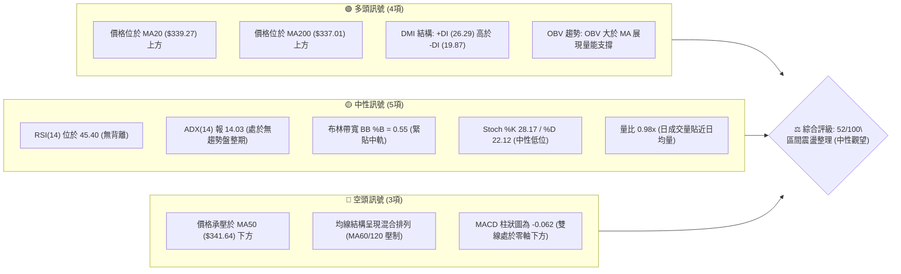
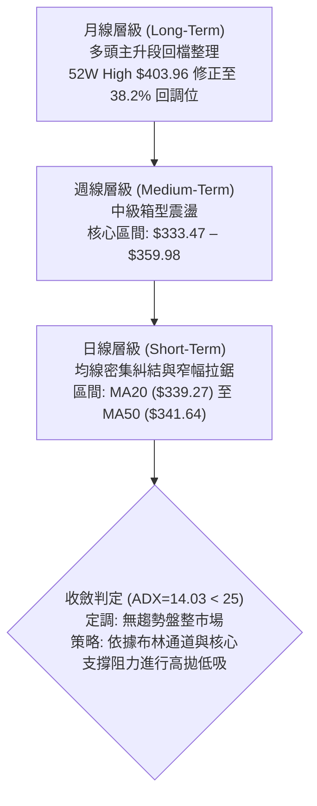
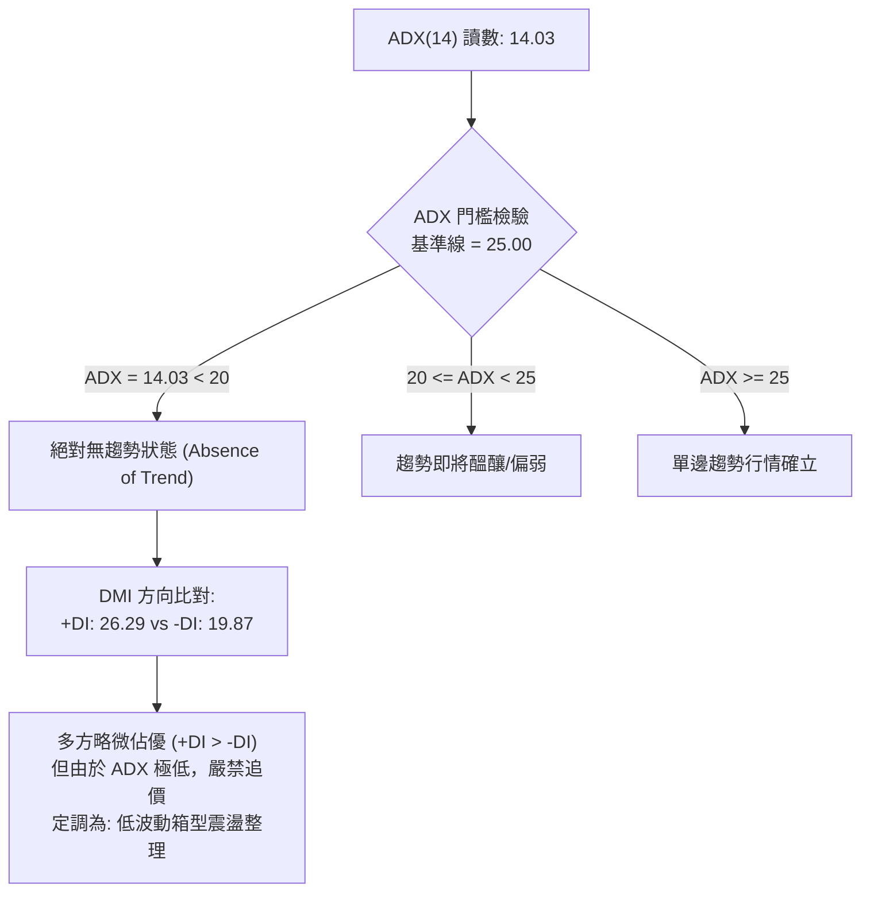
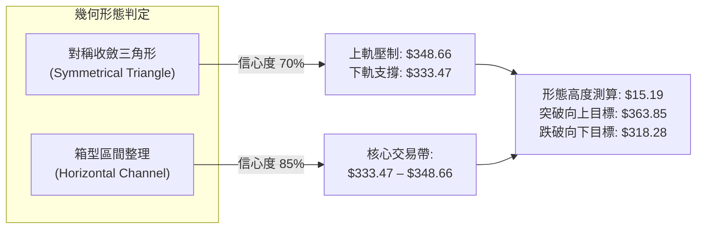
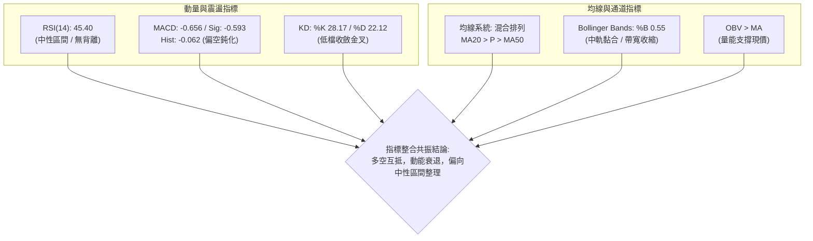
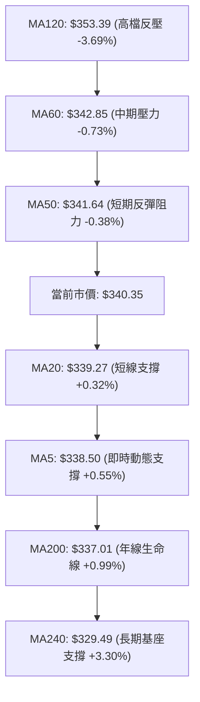
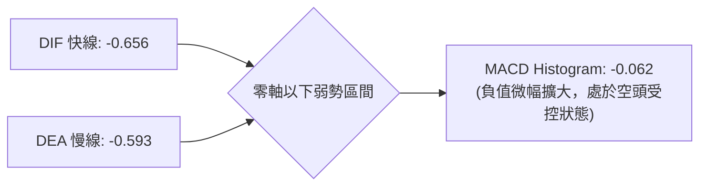
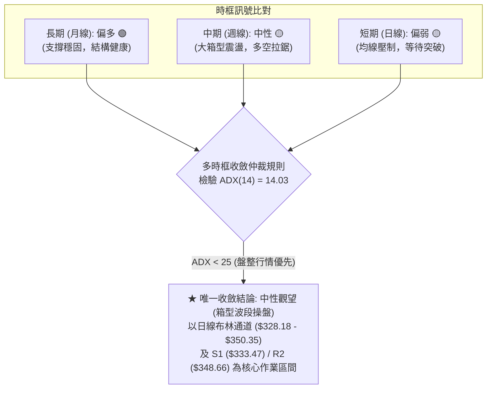
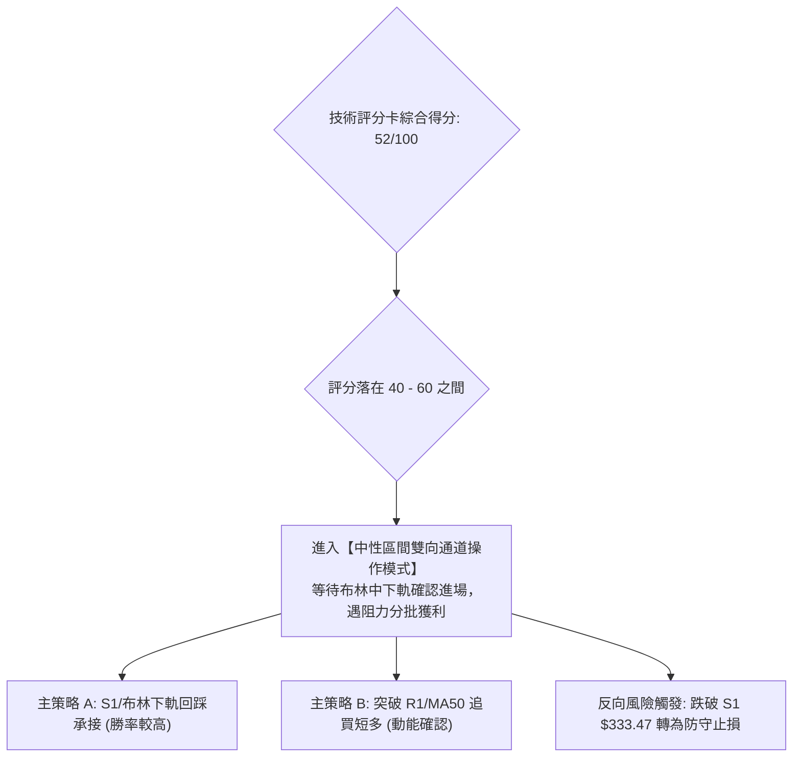
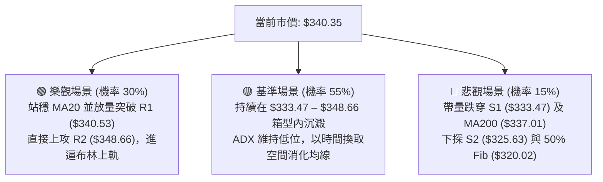

# GOOG 技術分析報告

> **報告日期**：2026-10-04 ｜ **語言**：繁體中文 ｜ **數據來源**：Yahoo Finance ｜ **當前價格**：$340.35

---

## 目錄

| 章節 | 內容 |
|------|------|
| [1. 技術面概覽](#1-技術面概覽) | 訊號儀表板、核心指標、評分卡 |
| [2. 趨勢分析](#2-趨勢分析) | 多時框趨勢、長中短期走勢、ADX解讀 |
| [3. 圖表形態分析](#3-圖表形態分析) | 形態識別信心度、K線組合、目標價推算 |
| [4. 支撐與阻力](#4-支撐與阻力) | 關鍵價位結構、斐波那契回調精準對照 |
| [5. 技術指標深度解讀](#5-技術指標深度解讀) | MA排列、RSI背離檢驗、MACD柱體、布林通道、OBV量價 |
| [6. 動能與波動率](#6-動能與波動率) | 動能四象限、ATR防守區間、Beta敏感度 |
| [7. 多時框架總結](#7-多時框架總結) | 時框架矩陣、規則收斂唯一方向判定 |
| [8. 交易策略建議](#8-交易策略建議) | 策略路由分流、價格階梯、主策略進出場矩陣 |
| [9. 風險提示與監控](#9-風險提示與監控) | 監控Checklist、三情境壓力測試、風控法則 |
| [📋 報告總結](#-報告總結) | 儀表板式總覽與執行摘要 |

---

## 1. 技術面概覽

### 🎯 技術訊號儀表板



### 📊 核心指標速覽表

| 指標類別 | 指標名稱 | 當前數值 | 訊號 | 專業解讀 |
|:---|:---|:---|:---:|:---|
| **價格** | 當前收盤價 | $340.35 | 🟡 | 位於52週區間($236.07–$403.96)的62.1%，貼近38.2%斐波那契回調位($339.83) |
| **短期均線** | MA20 (布林中軌) | $339.27 | 🟢 | 現價高於 MA20 約 +0.32%，短線微幅站上多空分水嶺 |
| **中期均線** | MA50 | $341.64 | 🔴 | 現價位於 MA50 下方 -0.38%，上方承受中期下彎均線密集壓制 |
| **長期均線** | MA200 | $337.01 | 🟢 | 現價高於 MA200 約 +0.99%，牛熊分界線維持有效支撐 |
| **動能指標** | RSI(14) | 45.40 | 🟡 | 處於40–60中性常態整理區間，未見超買、超賣或頂底背離跡象 |
| **動能指標** | MACD (12,26,9) | -0.656 / -0.593 (Hist: -0.062) | 🔴 | 快慢線均在零軸之下，柱狀圖負值微幅擴大，空頭動能尚未完全出清 |
| **擺盪指標** | KD (Stoch %K/%D) | 28.17 / 22.12 | 🟡 | 低檔鈍化解除，%K 上穿 %D 試圖構築低位金叉，但缺乏趨勢配合 |
| **趨勢強度** | ADX(14) / DMI | ADX: 14.03 (+DI: 26.29 / -DI: 19.87) | 🟡 | ADX < 20 呈現弱勢盤整特徵，雖 +DI 佔優但無法展開單邊行情 |
| **通道指標** | Bollinger Bands | 上軌: $350.35 / 下軌: $328.18 | 🟡 | %B = 0.55，帶寬持續收斂，價格在中軌($339.27)附近形成黏合膠著 |
| **量能指標** | OBV & 量比 | 當日量: 17.47M / 20日均量: 17.89M (0.98x) | 🟢 | OBV > MA，主力籌碼未見恐慌性拋售，量能結構支持防守反彈 |
| **波動指標** | ATR(14) | $9.04 (佔股價 2.65%) | 🟡 | 每日平均波動空間約 $9.04，波動度屬於健康常態水平 |

### 🏆 技術評分卡

```
╔══════════════════════════════════════════════════════════════╗
║                技術評分卡 — GOOG (2026-10-04)                ║
╠══════════════════════════════════════════════════════════════╣
║ 趨勢強度 (Trend)      ██████░░░░░░░░░░░░░░  32/100 🔴 弱勢盤整 ║
║ 動能指標 (Momentum)   █████████░░░░░░░░░░░  45/100 🟡 中性偏弱 ║
║ 支撐穩定度 (Support)  ███████████████░░░░░  74/100 🟢 支撐穩固 ║
║ 成交量配合 (Volume)   ████████████░░░░░░░░  62/100 🟢 量能健康 ║
║ 形態完整度 (Pattern)  ██████████░░░░░░░░░░  50/100 🟡 區間收斂 ║
║ 均線排列 (Moving Avg) █████████░░░░░░░░░░░  48/100 🟡 混亂糾結 ║
╠══════════════════════════════════════════════════════════════╣
║ 綜合評分 (Composite)  ██████████░░░░░░░░░░  52/100 ⚖️ 中性觀望 ║
╚══════════════════════════════════════════════════════════════╝
```

---

## 2. 趨勢分析

### 🌐 多時框趨勢分析



### 📈 長期趨勢 — 12個月走勢圖（Unicode）

```
GOOG 月線走勢圖（2025-10 至 2026-10）
價格 ($)
$410 ┤                                                               
$390 ┤                                    ● $381.46 (2026-04)         
$370 ┤                                       ● $375.96               
$350 ┤                                          ● $353.10  ● $356.42 
$330 ┤                     ● $337.87               │          │   ● $340.74 
$310 ┤            ● $319.29   │     ● $310.82      │          │      ● $340.35 (現價)
$290 ┤   ● $281.09   ● $313.19│        ● $286.50   │          ● $335.19
$270 ┤                                                               
     └─────┬──────────┬──────────┬──────────┬──────────┬──────────┬──────
        2025-10    2025-12    2026-02    2026-04    2026-06    2026-08/10
```

#### 走勢特徵分析表格

| 階段區間 | 起止收盤價 | 漲跌幅 | 趨勢性質 | 核心特徵解讀 |
|:---|:---|:---:|:---:|:---|
| **2025-10 ～ 2026-01** | $281.09 → $337.87 | +20.20% | 強勢主升浪 | 均線多頭發散，單邊推升並創出階段高點，多頭控盤 |
| **2026-01 ～ 2026-03** | $337.87 → $286.50 | -15.20% | 中級回檔波 | 獲利了結盤湧現，快速回測長期支撐後迅速止跌回升 |
| **2026-03 ～ 2026-04** | $286.50 → $381.46 | +33.14% | 暴力反彈爆發 | 單月暴漲近百點，隨後創下52週歷史高點 $403.96 |
| **2026-04 ～ 2026-08** | $381.46 → $335.19 | -12.13% | 高檔震盪沉澱 | 衝高回落，多次下探測試 $335 支撐，形成寬幅沉澱區 |
| **2026-08 ～ 2026-10** | $335.19 → $340.35 | +1.54% | 窄幅極致收斂 | 連續三個月收盤於 $340 附近，動能收斂進入蓄勢階段 |

### 📊 中期趨勢（週線分析）

從近20週的收盤與技術數據分析，GOOG 在歷經2026年6月至7月的劇烈波動（自 $378.91 快速跌至低點 $318.88）後，價格重心顯著收斂於 $335.00 – $355.00 箱型之內。
週線 MACD 柱狀圖在近四週出現顯著收縮（-0.373 → -0.275 → +1.455 → +0.556 → -0.062），顯示中期拋壓已獲得大幅消化，市場進入多空平衡的對峙狀態。

```
週線箱型結構示意圖
$360.00 ┤─────────────────────────────── 箱頂阻力 R3 ($359.98)
$354.00 ┤        ┌────────┐
$348.00 ┤   ┌────┘        └────┐         密集反彈阻力 R2 ($348.66)
$342.00 ┤───┼──────────────────┼──────── 現價 ($340.35) 黏合區間
$334.00 ┤   └──────────────────┘         箱底第一支撐 S1 ($333.47)
$325.00 ┤─────────────────────────────── 中期防守強支撐 S2 ($325.63)
```

### ⚡ 趨勢強度評估（ADX 解讀）



#### ADX 強度對照表

| 指標變數 | 當前數值 | 參考臨界值 | 狀態定性 | 操作指引 |
|:---|:---:|:---:|:---:|:---|
| **ADX (14)** | **14.03** | 25.00 | 極弱/無方向性 | 順勢突破策略無效；震盪指標高低估值為首選工具 |
| **+DI** | **26.29** | -DI: 19.87 | 多頭略微主導 | 買盤略大於賣盤，具備抗跌性，但無推升單邊趨勢之能量 |
| **-DI** | **19.87** | +DI: 26.29 | 空頭力量退潮 | 空方打壓動能趨弱，低檔具買盤承接 |

---

## 3. 圖表形態分析

### 🔍 形態識別系統



#### 形態識別信心度與參數表

| 形態類別 | 信心度 | 判斷依據（引用精確數據） | 完成度 | 突破後測算目標價（附計算式） |
|:---|:---:|:---|:---:|:---|
| **水平箱型整理區間** | **85%** | 價格在近一個月緊密圍繞支撐 S1 ($333.47) 與阻力 R2 ($348.66) 反覆振盪 | 80% | 箱型高度 = $348.66 - $333.47 = $15.19<br/>**向上目標** = $348.66 + $15.19 = **$363.85**<br/>**向下目標** = $333.47 - $15.19 = **$318.28** |
| **對稱三角形收斂** | **70%** | 高點由 2026-08 的 $356.42 壓低至 R2 ($348.66)；低點由 $318.88 抬高至 S1 ($333.47) | 75% | 三角形基底高度約 $20.00<br/>突破點待確認，若於 R1 ($340.53) 突破，目標為 **$360.53** |
| **雙重底形態 (W-Bottom)** | **40%** | 僅於歷史數據中見 2026-06-28 ($334.47) 與 2026-07-26 ($318.88) 兩個不規則波段低點 | 35% | **訊號不足**：因兩底價差過大且頸線未有效站穩，不予採納形態目標價，僅做指標型震盪解讀 |

### 🕯️ 重要K線形態分析

| 期間/月份 | 收盤價 | K線形態特徵 | 結構性解讀 | 多空訊號 |
|:---|:---:|:---|:---|:---:|
| **2026-04** | $381.46 | 長紅突破大陽線 | 伴隨強勁動能創下天價區，奠定長期牛市多頭防線 | 🟢 強烈看多 |
| **2026-06** | $353.10 | 帶長下影線的實體陰線 | 單週下探至 $334.47 獲利回吐盤湧現，確認下方承接力道 | 🟡 多空洗盤 |
| **2026-07** | $356.42 | 探底回升槌頭線 | 深度回測波段低點 $318.88 後強勢拉回，確立 $325.63 為黃金坑底 | 🟢 低檔反轉 |
| **2026-08** | $335.19 | 中實體陰線向下壓縮 | 價格跌破短期均線，多頭轉入防守，回測 S1 ($333.47) 尋求支撐 | 🔴 短線修正 |
| **2026-09** | $340.74 | 紡錘十字星 (Spinning Top) | 波動區間收縮於 $335 – $345 之間，多空力量陷入僵局，靜待方向變革 | 🟡 變盤前兆 |
| **2026-10 (即時)** | $340.35 | 窄幅微實體十字星 | 實體極小，成交量溫和，標準的高檔蓄勢震盪 K 線 | 🟡 中性格局 |

### 📉 ASCII 走勢形態示意圖

```
GOOG 水平收斂箱型形態示意圖
═════════════════════════════════════════════════════════════════
$359.98 ┼──────────────────────────────────── [R3 箱型延伸天花板]
        │
$348.66 ┼───────────╭──╮───────────────────── [R2 箱頂壓力線]
        │          │  │
$340.53 ┼────╭─────╯  ╰───●現價 $340.35 ─── [R1 密集阻力區]
        │   │             │
$339.27 ┼───┼─────────────┼──────────────── [MA20 / 布林中軌]
        │   │             ╰──╮
$333.47 ┼───╯                ╰────────────── [S1 箱底支撐線]
        │
$325.63 ┼──────────────────────────────────── [S2 結構強支撐]
═════════════════════════════════════════════════════════════════
```

### 🎯 形態目標價計算

依據標準形態測算學，當價格處於 $333.47 至 $348.66 區間時，其目標價推導式如下：
1. **箱型振幅高度 ($H$)**：
   $$H = \text{箱頂阻力 (R2)} - \text{箱底支撐 (S1)} = 348.66 - 333.47 = \$15.19$$
2. **多頭向上突破等距目標價 ($T_{Up}$)**：
   $$T_{Up} = \text{R2} + H = 348.66 + 15.19 = \$363.85$$
   *(該價位與 23.6% 斐波那契回調位 $364.34 形成強烈共振)*
3. **空頭向下跌破等距目標價 ($T_{Down}$)**：
   $$T_{Down} = \text{S1} - H = 333.47 - 15.19 = \$318.28$$
   *(該價位與歷史低點聚類區 $318.88 完美呼應)*

---

## 4. 支撐與阻力

### 🗺️ 關鍵價位分布圖（Unicode）

```
GOOG 價位結構分布圖（OHLCV 實際計算值）
══════════════════════════════════════════════════════════════
$403.96 ║████████████████████████████████║ 52W High (0.0% Fib)
$364.34 ║████████████████████░░░░░░░░░░░░║ 23.6% 斐波那契壓力位
$359.98 ║████████████████████████████████║ 強阻力 R3 (+5.77%)
$348.66 ║████████████████████░░░░░░░░░░░░║ 波段阻力 R2 (+2.44%)
$341.64 ║▓▓▓▓▓▓▓▓▓▓▓▓▓▓▓▓▓▓▓▓▓▓▓▓░░░░░░░░║ 中期均線 MA50 壓力
$340.53 ║████████████████████████████████║ 即時阻力 R1 (+0.05%)
$340.35 ╠════════════════════════════════╣ ◄ 當前市價 ($340.35)
$339.83 ║▓▓▓▓▓▓▓▓▓▓▓▓▓▓▓▓▓▓▓▓▓▓▓▓▓▓▓▓▓▓▓▓║ 38.2% 斐波那契核心中樞
$339.27 ║▓▓▓▓▓▓▓▓▓▓▓▓▓▓▓▓▓▓▓▓▓▓▓▓░░░░░░░░║ 短期均線 MA20 / BB中軌
$337.01 ║▓▓▓▓▓▓▓▓▓▓▓▓▓▓▓▓▓▓▓▓▓▓▓▓▓▓▓▓░░░░║ 牛熊分界 MA200 支撐
$333.47 ║████████████████████████████████║ 近期強支撐 S1 (-2.02%)
$325.63 ║████████████████████░░░░░░░░░░░░║ 密集波段強支撐 S2 (-4.32%)
$320.02 ║▓▓▓▓▓▓▓▓▓▓▓▓▓▓▓▓▓▓▓▓▓▓▓▓░░░░░░░░║ 50.0% 斐波那契黃金防線
$312.49 ║████████████████████████████████║ 終極防守支撐 S3 (-8.19%)
══════════════════════════════════════════════════════════════
```

### 🚧 阻力位分析表

所有價位均嚴格取自波段高點聚類與計算值：

| 阻力級別 | 精確價位 | 距離現價 | 形成原因與技術共振 | 突破難度 | 重要性權重 |
|:---|:---:|:---:|:---|:---:|:---:|
| **R1** | **$340.53** | +0.05% | 近期日線密集震盪高點，與 MA10 ($340.59) 形成共振卡位 | 🟡 中等 | ★★★☆☆ |
| **R2** | **$348.66** | +2.44% | 2026年7-8月反彈次高點聚類，且與布林上軌 ($350.35) 構成雙重阻力帶 | 🔴 較高 | ★★★★☆ |
| **R3** | **$359.98** | +5.77% | 近期波段強阻力高點聚類，接近 23.6% 斐波那契回調位 ($364.34) 防守區 | 🔴 極高 | ★★★★★ |

### 🛡️ 支撐位分析表

所有價位均嚴格取自波段低點聚類與計算值：

| 支撐級別 | 精確價位 | 距離現價 | 形成原因與技術共振 | 守住機率 | 重要性權重 |
|:---|:---:|:---:|:---|:---:|:---:|
| **S1** | **$333.47** | -2.02% | 近一年波段低點聚類，多次回踩確認未破，日線多頭防禦底線 | 🟢 75% | ★★★★☆ |
| **S2** | **$325.63** | -4.32% | 近期波段下影線低點聚類，與布林下軌 ($328.18) 形成支撐保護區間 | 🟢 85% | ★★★★★ |
| **S3** | **$312.49** | -8.19% | 2026年首季急跌強底與年度結構性防線，跌破則宣告牛市終結 | 🟢 95% | ★★★★★ |

### 📐 斐波那契回調位分析

依據 52 週完整波動區間（低點 $236.07 → 高點 $403.96，總垂直振幅 $167.89）精確測算：

| 斐波那契層級 | 精確點位 | 當前相對位置與技術解讀 |
|:---|:---:|:---|
| **0.0% (52W High)** | **$403.96** | 歷史極值壓力區，中長期多頭終極目標 |
| **23.6%** | **$364.34** | 強勢回檔阻力區，若突破 R3 ($359.98) 將直取此關鍵分水嶺 |
| **38.2%** | **$339.83** | **現價 ($340.35) 完美座落於此！** 僅差距 +$0.52。代表當前價格正於多頭牛市最強回檔支撐線上激烈爭奪 |
| **50.0%** | **$320.02** | 多空心理平衡線，與 S2 ($325.63) 構成多頭絕對不可失守之緩衝帶 |
| **61.8%** | **$300.20** | 黃金分割防守位，牛熊分界生死線 |
| **78.6%** | **$272.00** | 深度回調防守區 |
| **100.0% (52W Low)**| **$236.07** | 週期循環起漲原點 |

**結論解讀**：現價 $340.35 精準卡在 38.2% 回調位 ($339.83) 處，此處為道氏理論與斐波那契體系中最健康的回檔承接區。若能在此處完成籌碼換手並止跌，將保留重啟上攻 $403.96 高點的火種。

---

## 5. 技術指標深度解讀

### 🎛️ 指標訊號總覽



### 📈 移動平均線排列分析



#### 均線數據全景表

| 均線名稱 | 數值 | 距離現價 | 當前狀態 | 形態走勢與分析 |
|:---|:---:|:---:|:---:|:---|
| **MA 5** | $338.50 | +0.55% | 🟢 站上 | 短期均線自低檔微幅勾頭向上 (+1.85)，提供日內微觀動能 |
| **MA 10** | $340.59 | -0.07% | 🔴 跌破 | 壓制在現價頭頂 (-0.23)，短線形成第一道障礙 |
| **MA 20** | $339.27 | +0.32% | 🟢 站上 | 重新收復月線 (+1.08)，布林中軌有支撐跡象 |
| **MA 50** | $341.64 | -0.38% | 🔴 跌破 | 季線持續走平偏下，壓抑中期反彈空間 |
| **MA 60** | $342.85 | -0.73% | 🔴 跌破 | 呈現持續下傾走勢，構成中期沉重反壓帶 |
| **MA 120** | $353.39 | -3.69% | 🔴 跌破 | 半年線壓制在 R2-R3 之間，中線波段頂部沉重 |
| **MA 200** | $337.01 | +0.99% | 🟢 站上 | 長期年線緩步推升，提供決定性的結構性安全網 |
| **MA 240** | $329.49 | +3.30% | 🟢 站上 | 長週期多頭基座穩固，維持長期看多基調 |

**均線體系結論**：當前呈現典型的「短多長多、中受夾板」的**混合排列**。現價受夾在下方 MA20 ($339.27) / MA200 ($337.01) 與上方 MA50 ($341.64) / MA60 ($342.85) 之間，空間僅有約 $4 點，均線高度黏合，即將面臨方向性突破。

### 📉 RSI(14) 分析

- **當前讀數**：**45.40**
- **強度進度條**：
  ```
  超賣 [0] ─────────────── [30] ─────●───── [70] ─────────────── [100] 超買
  RSI(14) = 45.40: █████████░░░░░░░░░░░ 45.4%
  ```
- **區間性質**：處於 40–50 之弱平衡中性區，無任何超買或超賣訊號。
- **背離分析判斷**：
  - 比對 2026-08-23 股價收 $341.53 時 RSI 為 20.6；2026-09-06 股價跌至 $335.31 時 RSI 抬升至 43.3；現價 $340.35 時 RSI 來到 45.40。
  - **結論**：系統官方判定「無明顯背離」。但微觀檢視存在隱性底背離修復後的橫盤鈍化，目前動能並未擴散，不具備單獨作為進場觸發器的條件。

### 📊 MACD(12/26/9) 訊號解讀



- **快慢線位置**：DIF (-0.656) 與 DEA (-0.593) 均運行於零軸之下，代表中期格局仍由空方掌握節奏。
- **柱狀圖動態**：當前 MACD Hist 為 -0.062，較前期收縮後再次轉為微幅負值，顯示多頭反彈在零軸附近受阻，尚未釋放金叉多頭信號。
- **背離判定**：週線級別 MACD 柱體大幅收斂，日線呈現低位貼合，**無背離跡象**，反映震盪磨底特徵。

### 📦 布林通道分析

```
GOOG 布林通道日線分佈圖
═════════════════════════════════════════════════════════════════
$350.35 ┼───────────────────────────────── 布林上軌 (Upper Band)
        │
$340.35 ┼─────────────────● (現價, %B = 0.55)
$339.27 ┼───────────────────────────────── 布林中軌 (MA20 Middle Band)
        │
$328.18 ┼───────────────────────────────── 布林下軌 (Lower Band)
═════════════════════════════════════════════════════════════════
帶寬寬度: $22.17 (收縮率: 6.51%) ｜ 震盪屬性: 極致擠壓 (Band Squeeze)
```

- **通道數據**：上軌 $350.35、中軌 $339.27、下軌 $328.18。
- **現價位置 (%B)**：%B 為 **0.55**，表明價格緊密附著在中軌上方極小距離，處於完全中樞狀態。
- **帶寬意涵**：通道呈現明顯的收口（Squeeze），帶寬垂直差距僅 $22.17。依照布林通道統計規律，帶寬極致收縮後必然引發波動度噴發（Volatility Breakout），但在突破前應嚴守通道上下軌邊界進行區間思維處理。

### 💹 成交量分析（量價配合度）

```
量價配合矩陣
┌─────────────────────┬──────────────────────────────────────────┐
│ 當日成交量: 17.47M  │ 20日均量: 17.89M (量比: 0.98x - 溫和量)    │
├─────────────────────┼──────────────────────────────────────────┤
│ OBV 狀態: OBV > MA  │ 量能支撐價格，無恐慌派發 (Accumulation)   │
└─────────────────────┴──────────────────────────────────────────┘
```

- **量能評估**：今日成交量為 17,469,400 股，與 20 日均量 17,885,450 股高度相近（量比 0.98x）。市場參與者多數處於觀望狀態，拋壓極輕，同時亦無激進增量追高資金。
- **OBV 趨勢**：OBV 線維持在 OBV 均線之上，這是一個關鍵的積極訊號，表明自 2026 年第 2 季以來的回檔修正中，法人大戶（持有 62.1% 籌碼）並未出現實質性出逃，量能結構支持防守。

---

## 6. 動能與波動率

### ⚡ 動能評估四象限

```
動能與波動率象限分析 (Momentum-Volatility Quadrant)
      高波動 (High Vol)
           │
     Q3    │    Q4
  高動/高波│ 低動/高波
───────────┼───────────
     Q1    │    Q2
  高動/低波│ 低動/低波 ◄── [當前 GOOG 座落地點: Q2]
           │
      低波動 (Low Vol)
```

| 象限標籤 | 動能強度 | 波動率狀態 | 當前符合度 | 實戰環境定義與操作策略 |
|:---:|:---:|:---:|:---:|:---|
| **第一象限 (Q1)** | 強動能 | 低波動 | ── | 單邊主升走勢，最優買點，持股待漲 |
| **第二象限 (Q2)** | **弱動能** | **低波動** | **✓ (當前狀態)** | **無趨勢低沉磨底期。RSI 45.4、ADX 14.03、ATR 9.04 共同佐證。宜謹慎區間交易，忌重倉** |
| **第三象限 (Q3)** | 強動能 | 高波動 | ── | 狂暴拉升或單邊暴跌，高風險高收益波段 |
| **第四象限 (Q4)** | 弱動能 | 高波動 | ── | 劇烈洗盤，無序震盪，最具殺傷力，嚴格迴避 |

### 📊 ATR 波動率分析

- **ATR(14) 讀數**：**$9.04**（佔當前股價 $340.35 之 2.65%）。
- **日內安全防護範圍**：
  - 1.0 × ATR = $9.04
  - 1.5 × ATR = $13.56
  - 2.0 × ATR = $18.08
- **止損距離建議**：在當前低波動收斂環境下，波段交易之防守止損距離必須給予至少 **1.0 至 1.5 倍 ATR**（即 $9.00 – $13.50），以防止在窄幅震盪中被隨機市場噪音洗出場。

### 📐 Beta 與市場相關性

- **Beta 係數**：**1.225**。
- **市場屬性分析**：
  - GOOG 具備高於大盤（S&P 500 = 1.0）22.5% 的系統性彈性。
  - 當大盤展開單邊反彈或下殺時，GOOG 將呈現放大波動。但在當前自身技術面 ADX=14.03 處於極度死寂的狀態下，大盤若未釋放強烈趨勢信號，GOOG 預計將持續以個股自身箱型整理為主。

---

## 7. 多時框架總結

### 📋 時框架評分表

| 時框架 | 趨勢方向 | 動能狀態 | 均線排列狀況 | 圖表形態識別 | 綜合評分 | 戰術指引 |
|:---|:---:|:---:|:---:|:---:|:---:|:---|
| **長期 (月線)** | 🟢 多頭中繼 | 🟡 修正結束 | 長期均線完全多頭發散 | 回測 38.2% 斐波那契點位 | **68/100** | 逢低分批布局，長期底倉續抱 |
| **中期 (週線)** | 🟡 橫向箱型 | 🟡 柱體收斂 | 均線纏繞，壓制於短均下 | $333.47 – $359.98 大箱型 | **50/100** | 箱型高拋低吸，嚴禁追漲殺跌 |
| **短期 (日線)** | 🟡 窄幅收斂 | 🔴 微幅走弱 | 夾板於 MA20 與 MA50 之間 | 水平三角形極致擠壓收口 | **46/100** | 縮減部位，等待方向性突破確認 |

### 🔲 綜合訊號矩陣



### ⚖️ 多時框收斂結論

嚴格遵循「嚴格要求 14」之多時框收斂優先級規則：
1. **行情定性**：當前日線 ADX(14) 讀數為 **14.03**，遠低於 25.00 基準線，判定為典型的**盤整行情**（非單邊趨勢行情）。
2. **規則適用**：在盤整行情中，中長期的均線單邊順勢指引暫時失效，必須收斂至**日線布林通道上下軌與密集支撐阻力所定義的震盪箱型**作為唯一交易決策基底。
3. **終極方向定調**：**中性觀望（Neutral / Range-Bound）**。
   - 上方壓制：R1 ($340.53) 與 R2 ($348.66)；
   - 下方防守：S1 ($333.47) 與 S2 ($325.63)。
   - 此定調與第 1 章技術評分卡（52分）完全一致，杜絕多時框衝突矛盾。

---

## 8. 交易策略建議

### 🗺️ 策略決策流程圖



### 🧭 策略路由（依評分卡分流）

> **當前主策略方向 = 中性區間震盪操作（依評分卡綜合評分 52/100）**
> 
> *註：評分介於 40–60 之中性區間，不偏激押注單邊突破，採取以布林通道與核心波段點位為準的「低吸高拋」區間策略。*

### 🎯 價格情境階梯（Price Scenarios）

價位完全採用「關鍵價位」區塊之精確算值：

| 觸發階梯條件 | 即期目標點位 | 後續延伸目標 | 情境技術含義與市場解讀 |
|:---|:---:|:---:|:---|
| **強勢突破 R2 ($348.66)** | **R3 ($359.98)** | **23.6% Fib ($364.34)** | 脫離整理箱型，布林通道向上開口，單邊多頭行情重啟 |
| **向上突破 R1 ($340.53)** | **R2 ($348.66)** | **布林上軌 ($350.35)** | 短線收復 MA50 壓制，多頭展開對箱頂的測試攻勢 |
| **站穩現價 ($340.35)** | **R1 ($340.53)** | **S1 ($333.47)** | 於 38.2% Fib 處維持橫盤黏合，靜待量能表態 |
| **回測跌破 S1 ($333.47)** | **S2 ($325.63)** | **布林下軌 ($328.18)** | 短線防線失守，向下考驗中期箱底強支撐與超賣區 |
| **深度跌破 S2 ($325.63)** | **50% Fib ($320.02)** | **S3 ($312.49)** | 中期結構破位，空頭測試終極生命線防禦 |

### 📊 情境機率分佈

| 演繹情境 | 發生機率 | 主要技術佐證與指標邏輯 |
|:---|:---:|:---|
| **情境一：區間震盪整理** | **55%** | **ADX=14.03** 顯示趨勢極度匱乏；布林通道帶寬收窄；量比 0.98x 顯示主力按兵不動 |
| **情境二：向上突破反彈** | **30%** | **OBV > MA** 顯示量能未失；現價支撐於 MA20 ($339.27) 上方；+DI (26.29) 大於 -DI (19.87) |
| **情境三：向下破位回跌** | **15%** | MACD 處於零軸下方 (-0.656)；MA50/60 壓制重重，若失守 S1 恐引發技術性停損 |

### 🟢 主策略詳情（中性震盪路由）

本報告提供兩組符合嚴格數值紀律的交易戰術：

| 策略要素 | 策略 A（下軌支撐低吸 - 推薦首選） | 策略 B（突破阻力追多 - 右側交易） |
|:---|:---|:---|
| **戰略意圖** | 回踩重要支撐 S1 與均線密集區之左側低吸 | 有效突破 R1 與 MA50 壓制後之右側追擊 |
| **進場條件** | 價格回測 S1 止跌，KD 出現低檔金叉時掛單買進 | 日K收盤價實體突破 R1 ($340.53) 且成交量放大 |
| **進場價格** | **$334.00**（於 S1 $333.47 支撐上方掛單） | **$341.00**（突破 R1 $340.53 與 MA50 確立後進場） |
| **目標價 T1** | **$340.53**（波段阻力 R1） | **$348.66**（波段阻力 R2） |
| **目標價 T2** | **$348.66**（波段阻力 R2 / 箱頂） | **$359.98**（強阻力 R3 / 形態高度目標） |
| **止損價格** | **$329.50**（跌破布林下軌 $328.18 緩衝區） | **$336.50**（跌破年線 MA200 $337.01 防守區） |
| **風報比 (RRR)** | **3.26 : 1** (以 T2 計: 獲利空間 $14.66 / 風險 $4.50) | **4.22 : 1** (以 T2 計: 獲利空間 $18.98 / 風險 $4.50) |
| **勝率預估** | **65%** | **52%** |
| **建議倉位** | **15% - 20%** 資金規模 | **10% - 15%** 資金規模 |

### 🔴 反向風險觸發點（對沖提示）

若發生下列技術性破位，必須全數撤銷多頭計畫，啟動避險保護：
1. **關鍵點位跌破**：日線收盤價跌破 **S1 ($333.47)**，且連續兩日未能收復。
2. **動能惡化確認**：MACD 柱狀圖跌破 **-1.50**，且 -DI 向上交叉反超 +DI。
3. **對沖處置建議**：多頭部位減半或清倉；積極型交易者可於 $333.00 建立反向短空部位，以 S2 ($325.63) 及 50% 斐波那契回調位 ($320.02) 為下檔目標，止損設於 $337.50。

### ⭐ 整體訊號強度評星

```
╔═════════════════════════════════════════════════╗
║ 做多訊號強度：  ★★★☆☆  (3.0 / 5星 - 偏低蓄勢)  ║
║ 做空訊號強度：  ★★☆☆☆  (2.0 / 5星 - 缺乏動能)  ║
║ 整體技術可信度：★★★★☆  (4.0 / 5星 - 點位明確)  ║
╚═════════════════════════════════════════════════╝
```

---

## 9. 風險提示與監控

### ✅ 關鍵監控指標 Checklist

```
╔══════════════════════════════════════════════════════════════════╗
║               GOOG 每日交易關鍵監控 Checklist                    ║
╠══════════════════════════════════════════════════════════════════╣
║ [ ] 1. 價格是否跌破 S1 ($333.47)？若跌破，觸發防守減倉程序。     ║
║ [ ] 2. 價格是否突破 R1 ($340.53)？若突破，確認短期反彈啟動。     ║
║ [ ] 3. ADX(14) 是否上穿 20.00 線？若上穿，象徵低波動盤整結束。   ║
║ [ ] 4. 布林帶寬是否由收縮轉為擴張？觀察開口方向確認波段主升/主跌║
║ [ ] 5. 日成交量是否顯著超越 20日均量 (17.89M)？判斷有無主力介入 ║
║ [ ] 6. MACD 快慢線能否於零軸下方實現黃金交叉？動能指標關鍵節點   ║
╚══════════════════════════════════════════════════════════════════╝
```

### ⚠️ 風險場景分析



### 🛡️ 風險管理重要提醒

1. **嚴禁重倉押注方向**：ADX 僅為 14.03，強行追突破極易遭受雙巴（Whipsaw）假突破洗盤。目前總持倉水位應控制在 **30% 以下**。
2. **波動度止損設置原則**：單筆交易損失嚴格控制在總資金的 **1.0%** 以內。止損幅度必須匹配當前 ATR ($9.04)，切忌使用過窄（小於 $4）的隨意性止損。
3. **重大基本面考量**：GOOG 雖然本益比 (PE 17.07) 極具長線投資吸引力，且華爾街分析師給予 Strong Buy 目標均價 $419.65，但在技術面均線未完成多頭排列前，仍須尊重圖表走勢之時間成本。

---

## 📋 報告總結

```
╔══════════════════════════════════════════════════════════════════╗
║                    GOOG 技術分析報告執行總結                     ║
╠══════════════════════════════════════════════════════════════════╣
║ 報告日期：2026-10-04                                             ║
║ 當前價格：$340.35 (全日收盤價)                                   ║
║ 分析評級：⚖️ 中性觀望 (Neutral / 評分: 52分)                     ║
║                                                                  ║
║ 趨勢結構診斷：                                                   ║
║ ├─ 長期趨勢 (月線)：🟢 偏多格局未破，立足於 38.2% 回調位 ($339.83)║
║ ├─ 中期趨勢 (週線)：🟡 箱型整理 ($333.47 – $359.98)              ║
║ ├─ 短期趨勢 (日線)：🟡 均線夾板收斂，波動率處於極致擠壓狀態     ║
║ ├─ 核心防守支撐：S1: $333.47 ｜ S2: $325.63 ｜ S3: $312.49       ║
║ ├─ 核心上攻阻力：R1: $340.53 ｜ R2: $348.66 ｜ R3: $359.98       ║
║ └─ 華爾街目標價：Mean: $419.65 (High: $475.00 / Low: $340.00)     ║
║                                                                  ║
║ 最優交易執行方案：                                               ║
║ 1. 🥇 最佳機會：於 S1 ($333.47) 上方附近低吸建立左側防守多單，   ║
║                止損設於 $329.50，目標看至 R2 ($348.66)。         ║
║ 2. 🥈 次選機會：耐心等待日線帶量收復 R1 ($340.53) 與 MA50 後，   ║
║                順勢建立右側動能多單，目標看至 R2 及 R3。         ║
║ 3. 🥉 保守選擇：完全空倉觀望，靜待 ADX 突破 20 且布林開口顯現後 ║
║                再行進場。                                        ║
╚══════════════════════════════════════════════════════════════════╝
```

---

> ⚠️ **免責聲明**：本報告為依據客觀量化指標與圖表形態所產出之技術分析研究，所有數據、點位均嚴格取自歷史與即時市場行情。本報告**僅供學術研究與參考**，**不構成任何要約、推薦或實質投資建議**。金融市場瞬息萬變，交易決策應獨立審慎評估，並自負投資盈虧風險。

---
*報告生成時間：2026-10-04 ｜ 數據來源：Yahoo Finance ｜ 分析框架：多時框技術分析體系*