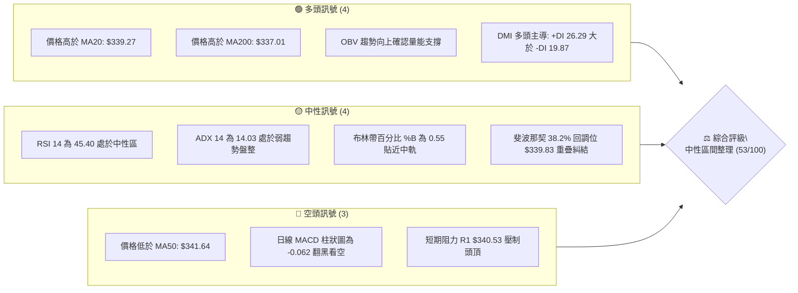
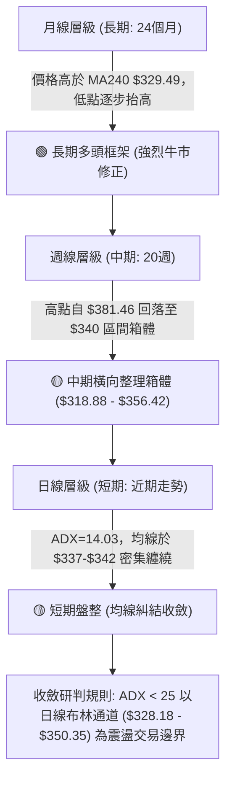
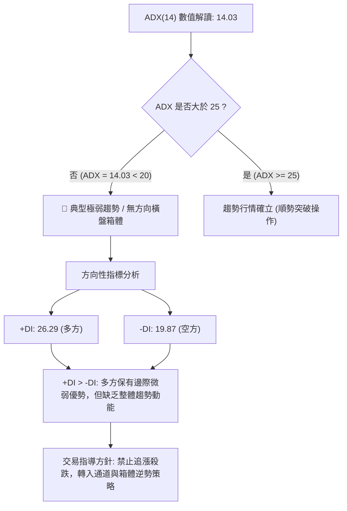
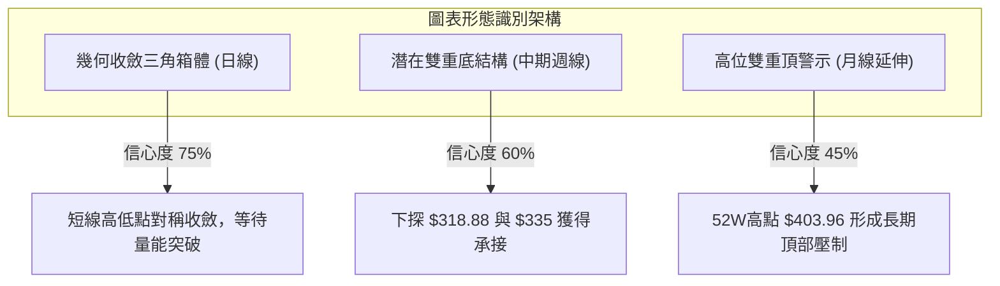
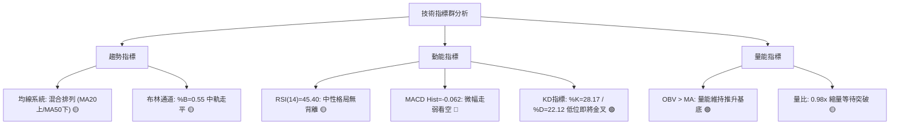
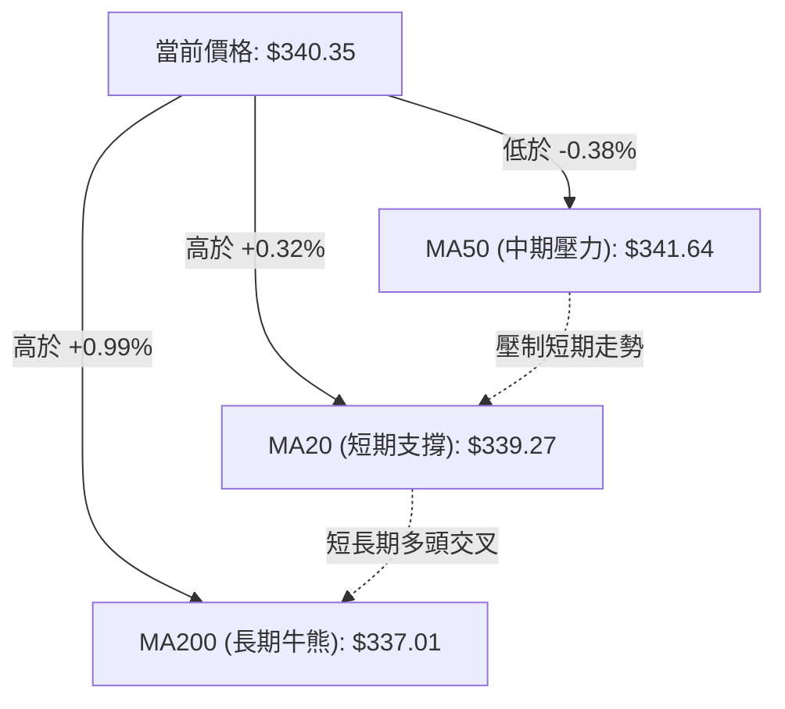
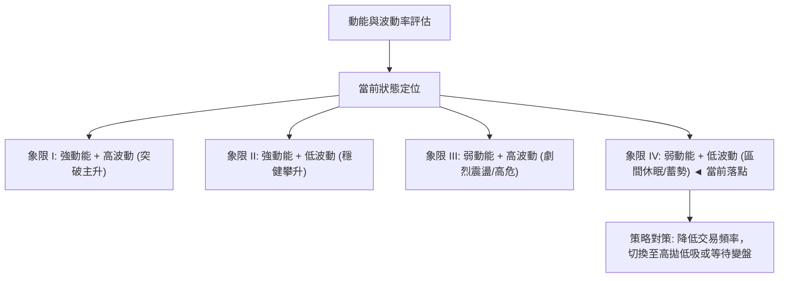
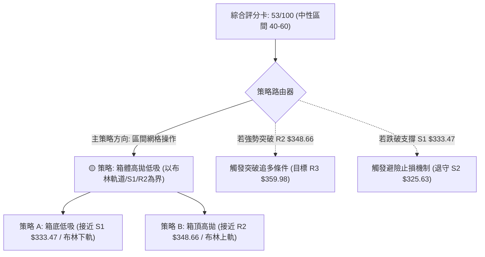
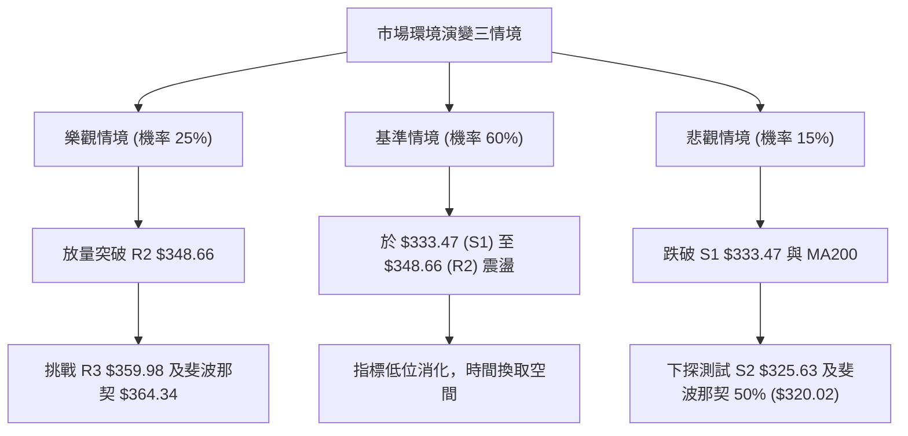

# GOOG 技術分析報告

> **報告日期**：2026-10-05 ｜ **語言**：繁體中文 ｜ **數據來源**：Yahoo Finance ｜ **當前價格**：$340.35

---

## 目錄

| 章節 | 內容 |
|------|------|
| [1. 技術面概覽](#1-技術面概覽) | 訊號儀表板、核心指標、評分卡 |
| [2. 趨勢分析](#2-趨勢分析) | 多時框趨勢、長中短期走勢 |
| [3. 圖表形態分析](#3-圖表形態分析) | 形態識別、K線組合、目標價 |
| [4. 支撐與阻力](#4-支撐與阻力) | 關鍵價位、斐波那契回調 |
| [5. 技術指標深度解讀](#5-技術指標深度解讀) | MA/RSI/MACD/布林/成交量 |
| [6. 動能與波動率](#6-動能與波動率) | 動能評估、ATR、Beta |
| [7. 多時框架總結](#7-多時框架總結) | 時框架評分矩陣 |
| [8. 交易策略建議](#8-交易策略建議) | 多空策略、風險報酬比 |
| [9. 風險提示與監控](#9-風險提示與監控) | 監控指標、風險場景 |

---

## 1. 技術面概覽

### 🎯 技術訊號儀表板



### 📊 核心指標速覽表

| 指標類別 | 指標名稱 | 當前數值 | 訊號 | 解讀 |
|----------|----------|----------|------|------|
| **價格** | 當前收盤價 | $340.35 | 🟡 | 位於52週區間62.1%，貼近斐波那契38.2%($339.83)微幅震盪 |
| **均線** | MA20 (短中) | $339.27 | 🟢 | 價格在均線上方(+0.32%)，短期下檔具備防守線 |
| **均線** | MA50 (中期) | $341.64 | 🔴 | 價格在均線下方(-0.38%)，上方中期籌碼形成微壓 |
| **均線** | MA200 (長期) | $337.01 | 🟢 | 價格在長期牛熊線上方(+0.99%)，長期上升架構未受破壞 |
| **動能** | RSI(14) | 45.40 | 🟡 | 處於40–60中性水準，無超買或超賣，無顯著背離 |
| **動能** | MACD (12,26,9)| Hist: -0.062 | 🔴 | MACD線(-0.656)低於訊號線(-0.593)，空頭動能微幅主導 |
| **趨勢** | ADX(14) | 14.03 | 🟡 | 數值遠低於25門檻，市場進入低波動區間盤整階段 |
| **通道** | 布林通道 %B | 0.55 | 🟡 | 價格貼近中軌($339.27)，通道未展開擴張(上軌$350.35/下軌$328.18) |
| **波動** | ATR(14) | $9.04 | 🟡 | 佔現價2.65%，每日波動收斂，有利區間高拋低吸風控設定 |
| **量能** | OBV 與量比 | 量比 0.98x | 🟢 | OBV > MA，量能結構支持底層多頭，但日均量持平未有衝關量 |

### 🏆 技術評分卡

```
╔══════════════════════════════════════════════════════════════╗
║              技術評分卡 — GOOG (2026-10-05)                   ║
╠══════════════════════════════════════════════════════════════╣
║ 趨勢強度 (ADX=14.03)    ██████░░░░░░░░░░░░░░  30/100 🟡 中性 ║
║ 動能指標 (RSI/MACD)     ████████░░░░░░░░░░░░  40/100 🔴 偏空 ║
║ 支撐穩定度 (S1/MA200)   ██████████████░░░░░░  70/100 🟢 偏多 ║
║ 成交量配合 (OBV/量比)   ████████████░░░░░░░░  60/100 🟢 偏多 ║
║ 形態完整度 (區間整理)   ████████████░░░░░░░░  60/100 🟡 中性 ║
║ 均線排列 (混合纏繞)     ████████████░░░░░░░░  60/100 🟡 中性 ║
╠══════════════════════════════════════════════════════════════╣
║ 綜合評分                ███████████░░░░░░░░░  53/100 🟡 中性 ║
╚══════════════════════════════════════════════════════════════╝
```

---

## 2. 趨勢分析

### 🌐 多時框趨勢分析



### 📈 長期趨勢 — 12個月走勢圖（Unicode）

```
GOOG 月線收盤走勢圖（2025-11 至 2026-10）
價格軸 ($)
$400 ┤
$380 ┤                                  ● $381.46 (2026-04 高點)
$360 ┤                                      ● $375.96
$340 ┤                   ● $337.87              ● $353.10  ● $356.42            ● $340.74
$320 ┤ ● $319.29                                                    ● $335.19       ● $340.35 (現價)
$300 ┤     ● $313.19         ● $310.82
$280 ┤                           ● $286.50 (波段回踩)
     └─────────────────────────────────────────────────────────────────────────────
        11/25  12/25  01/26  02/26  03/26  04/26  05/26  06/26  07/26  08/26  09/26  10/26
```

#### 走勢特徵分析表格

| 階段區間 | 時間跨度 | 起訖收盤價 | 區間幅度 | 核心特徵與量價表現 |
|----------|----------|------------|----------|-------------------|
| 第一階段：衝頂前蓄勢 | 2025-11 ~ 2026-01 | $319.29 → $337.87 | +5.82% | 溫和放量走高，多頭沿MA20推升，市場看好AI變現預期。 |
| 第二階段：春季深度洗盤 | 2026-02 ~ 2026-03 | $337.87 → $286.50 | -15.20% | 快速回調測試S3與年線支撐，於$286.50成功構築波段大底。 |
| 第三階段：暴力拉升創頂 | 2026-04 ~ 2026-05 | $286.50 → $381.46 | +33.14% | 出現單月近百元狂飆，觸及52週最高價$403.96後動能衰竭。 |
| 第四階段：箱體回落震盪 | 2026-06 ~ 2026-10 | $381.46 → $340.35 | -10.78% | 高位獲利了結，成交量收斂，逐步在$335-$356區間形成黏著盤整。 |

### 📊 中期趨勢（週線分析）

中期走勢在2026年4月見頂後，展開為期約5個月的對稱收斂與箱體構築。近20週數據顯示，收盤價最低於2026-07-26下探至$318.88，隨後在2026-08-02強勁反彈至$356.42，自此之後週線波動區間大幅收斂至$335–$345窄幅通道。

```
中期週線箱體壓制與支撐結構
══════════════════════════════════════════════════════════════
[頂部壓力區]      $356.42 ~ $359.98 (R3 / 近期週線反彈高點)
                        ↑
                   震盪承壓回調
                        ↓
[現價中軸區]      $339.83 ~ $340.53 (斐波那契38.2% / R1 / MA20) ◄ $340.35
                        ↑
                   下檔支撐防線
                        ↓
[箱底強固區]      $333.47 (S1) ~ $325.63 (S2)
══════════════════════════════════════════════════════════════
```

### ⚡ 趨勢強度評估（ADX 解讀）



#### ADX 趨勢強度對照表

| 區間數值 | 當前狀態 (14.03) | 趨勢性質 | 策略指導方向 |
|----------|-------------------|----------|--------------|
| 0 – 20   | **當前落點 (14.03)** | 極弱趨勢 / 典型無方向盤整 | 避免追突破，採用布林通道上下軌震盪操作 |
| 20 – 25  | 否 | 弱趨勢萌芽 / 方向未明 | 縮小部位，等待動能指標確認 |
| 25 – 40  | 否 | 強趨勢形成 | 依據均線順勢單邊持倉 |
| 40 – 60  | 否 | 極強趨勢 (單邊暴漲/暴跌) | 順勢加碼，移動止損跟蹤 |

---

## 3. 圖表形態分析

### 🔍 形態識別系統



#### 圖表形態信心度評估表（依規範嚴格計算）

| 形態名稱 | 信心度 | 判斷依據（嚴格引用數據） | 完成度 | 目標價（附嚴謹計算式） |
|----------|--------|--------------------------|--------|------------------------|
| **箱體對稱收斂 (矩形整理)** | **75%** | 價格在 S1: $333.47 與 R2: $348.66 間狹幅震盪，且 MA20/MA50 纏繞。 | 85% | 向上突破 R2 後：$348.66 + ($348.66 - $333.47) = **$363.85**（接近斐波那契23.6% $364.34） |
| **中期雙重底 (W底反彈雛形)** | **60%** | 兩次下探低點：2026-07週低點 $318.88 與 2026-09低點 $335.31，獲 S2: $325.63 與 S1: $333.47 聚類支撐。 | 65% | 頸線取 2026-08 反彈高點 $356.42。目標價：$356.42 + ($356.42 - $318.88) = **$393.96** |
| **頭肩頂形態** | **30%** | **數據不足，僅做指標型解讀**：未見右肩對稱頸線破位結構，信心度 < 50% 不予立案。 | — | 訊號不足，不計算目標價。 |

### 🕯️ 重要K線形態分析

| 月份 | 收盤價 | K線形態特徵 | 結構解讀 | 訊號 |
|------|--------|-------------|----------|------|
| 2026-04 | $381.46 | 長實體大陽線帶長上影線 | 衝高至52週天花板$403.96後遭遇極大獲利了結壓盤，留長上影。 | 🟡 滯漲轉折 |
| 2026-07 | $356.42 | 長下影錘頭十字線 | 單月最低殺至$318.88後強勁收復，展現下檔S2($325.63)買盤雄厚。 | 🟢 支撐確認 |
| 2026-08 | $335.19 | 中陰線實體回踩 | 測試年線與S1($333.47)之支撐有效性，實體收斂。 | 🟡 蓄勢整理 |
| 2026-09 | $340.74 | 窄幅縮量紡錘線 | 多空雙方力道完全均勻，波動率極度壓縮，均線匯聚。 | 🟡 變盤前兆 |
| 2026-10 | $340.35 | 窄幅微陰星線 (即時) | 承接9月平衡，價格定格於斐波那契38.2%($339.83)關鍵分水嶺。 | 🟡 中性格局 |

### 📉 ASCII 走勢形態示意圖

```
GOOG 箱體對稱收斂與支撐示意圖
══════════════════════════════════════════════════════════════
$360 ┤               R3 阻力線 ($359.98) -----------------------
     │                ╱
$350 ┤     布林上軌 ($350.35) / R2 ($348.66) -------------------
     │            ╱          ╲
$340 ┤── 現價 $340.35 ─── MA20 ($339.27) / 斐波 38.2% ($339.83)
     │            ╲          ╱
$330 ┤     布林下軌 ($328.18) / S1 ($333.47) -------------------
     │                ╲
$320 ┤               S2 強支撐 ($325.63) -----------------------
══════════════════════════════════════════════════════════════
```

### 🎯 形態目標價計算

根據上述置信度最高的「箱體收斂突破」推算：
1. **箱體上限（頸線/阻力）**：採用近一年波段高點聚類之 **R2: $348.66**。
2. **箱體下限（底部/支撐）**：採用近一年波段低點聚類之 **S1: $333.47**。
3. **箱體垂直高度 ($H$)**：
   $$H = \$348.66 - \$333.47 = \$15.19$$
4. **向上突破理論目標價**：
   $$\text{Target}_{\text{Up}} = \text{頸線 } \$348.66 + H = \$348.66 + \$15.19 = \mathbf{\$363.85}$$
   *(註：此推算目標與數據提供的斐波那契23.6%回調位 $364.34 僅差 $0.49，具備強烈技術共振)*
5. **向下破位理論量度目標**：
   $$\text{Target}_{\text{Down}} = \text{箱底 } \$333.47 - H = \$333.47 - \$15.19 = \mathbf{\$318.28}$$
   *(註：此目標極為貼近2026-07週線低點 $318.88 及支撐位 S3: $312.49 前緣)*

---

## 4. 支撐與阻力

### 🗺️ 關鍵價位分布圖（Unicode）

```
GOOG 關鍵價位結構分布圖
══════════════════════════════════════════════════════════════
$403.96 ║████████████████████████║ 52W 歷史極值高點 (0.0%)
$364.34 ║████████████████████    ║ 斐波那契 23.6% 壓力位
$359.98 ║██████████████████████  ║ 強阻力 R3 (波段高點聚類)
$350.35 ║████████████████        ║ 布林通道上軌
$348.66 ║██████████████████      ║ 關鍵阻力 R2 (箱體震盪上界)
$340.53 ║████████████████████████║ 短期阻力 R1 / MA10 ($340.59)
$340.35 ╠════════════════════════╣ ◄ 當前市價 ($340.35)
$339.83 ║▓▓▓▓▓▓▓▓▓▓▓▓▓▓▓▓▓▓▓▓▓▓▓▓║ 斐波那契 38.2% 基準線 / MA20 ($339.27)
$337.01 ║▓▓▓▓▓▓▓▓▓▓▓▓▓▓▓▓▓▓▓▓    ║ MA200 長期牛熊分界線
$333.47 ║▓▓▓▓▓▓▓▓▓▓▓▓▓▓▓▓        ║ 近期核心支撐 S1 (箱底防線)
$328.18 ║▓▓▓▓▓▓▓▓▓▓▓▓            ║ 布林通道下軌
$325.63 ║▓▓▓▓▓▓▓▓▓▓▓▓▓▓▓▓▓▓▓▓▓▓▓▓║ 強支撐 S2 (重要波段低點聚類)
$320.02 ║▓▓▓▓▓▓▓▓▓▓▓▓▓▓▓▓        ║ 斐波那契 50.0% 中樞支撐位
$312.49 ║▓▓▓▓▓▓▓▓▓▓▓▓▓▓▓▓▓▓▓▓    ║ 深度極限防禦 S3
══════════════════════════════════════════════════════════════
```

### 🚧 阻力位分析表

所有阻力數值嚴格引用自數據庫波段聚類結果：

| 阻力級別 | 價位 | 距現價幅動 | 形成原因與籌碼性質 | 突破難度 | 重要性評級 |
|----------|------|------------|--------------------|----------|------------|
| **R1** | **$340.53** | +0.05% | 緊鄰現價上方，與 MA10 ($340.59) 形成共振短壓，為日內多空爭奪中軸。 | 🟢 容易 | ★★★☆☆ (短線分水嶺) |
| **R2** | **$348.66** | +2.44% | 近期波段密集成交高點，亦接近布林通道上軌 ($350.35)，箱體震盪天花板。 | 🟡 中等 | ★★★★☆ (波段關鍵) |
| **R3** | **$359.98** | +5.77% | 2026年7-8月多個週K線反彈的頂部阻力聚類，上方解套籌碼沉重。 | 🔴 困難 | ★★★★★ (中期牛熊轉換) |

### 🛡️ 支撐位分析表

所有支撐數值嚴格引用自數據庫波段聚類結果：

| 支撐級別 | 價位 | 距現價幅動 | 形成原因與籌碼性質 | 守住機率 | 重要性評級 |
|----------|------|------------|--------------------|----------|------------|
| **S1** | **$333.47** | -2.02% | 過去兩個月多次探底的回升點，與 MA200 ($337.01) 構成階梯式保護網。 | 75% | ★★★★☆ (短線核心防禦) |
| **S2** | **$325.63** | -4.32% | 跌破布林下軌後的強支撐聚類，逼近 MA240 ($329.49) 年線核心成本。 | 85% | ★★★★★ (中期多頭防線) |
| **S3** | **$312.49** | -8.19% | 2026年首季與年中非理性殺跌形成的極限聚類低點，極強買盤駐紮。 | 95% | ★★★★★ (極限底線) |

### 📐 斐波那契回調位分析

依據 52 週完整區間（低點 **$236.07** → 高點 **$403.96**，總極差 **$167.89**）進行回調定位：

| 回調比率 | 精確價位 | 現價相對位置 | 結構與戰略意義解讀 |
|----------|----------|--------------|--------------------|
| **0.0% (52W High)** | **$403.96** | +18.69% | 歷史級別多頭極限天花板，強大拋壓區。 |
| **23.6%** | **$364.34** | +7.05% | 第一強回調阻力位，突破此位宣告盤整結束、重啟主升浪。 |
| **38.2%** | **$339.83** | **-0.15% (現價落點)** | **黃金分割第一防禦線。現價 $340.35 緊貼於此，代表多空正處於決定性拉鋸。** |
| **50.0%** | **$320.02** | -5.97% | 多空平衡中軸，通常為牛市中期深度洗盤的極限回撤點。 |
| **61.8%** | **$300.20** | -11.80% | 絕對牛熊生死線，若失守則整體上升架構宣告終結。 |
| **78.6%** | **$272.00** | -20.08% | 深度價值吸籌區間。 |
| **100.0% (52W Low)**| **$236.07** | -30.64% | 52週啟動底部基石。 |

**現價落點解讀**：現價 **$340.35** 精準落在 **38.2% ($339.83)** 與 **23.6% ($364.34)** 兩大關鍵回調位之間，且距 38.2% 僅有 $0.52 差距。這表明強勢上漲結構在黃金回調位獲得支撐，市場拒絕深幅回撤至 50.0% ($320.02)，多頭底蘊仍然扎實。

---

## 5. 技術指標深度解讀

### 🎛️ 指標訊號總覽



### 📈 移動平均線排列分析



#### 均線系統詳細參數與狀態

| 均線名稱 | 當前價格 | 與現價差距 | 排列位置與走勢特徵 | 訊號意涵 |
|----------|----------|------------|--------------------|----------|
| **MA 5** | $338.50 | +$1.85 (+0.55%) | 短線止跌回升，自谷底翻揚向上 | 🟢 短線微多 |
| **MA 10** | $340.59 | -$0.24 (-0.07%) | 走平微跌，與現價形成即時黏合阻力 | 🔴 超短線壓制 |
| **MA 20** | $339.27 | +$1.08 (+0.32%) | 微幅上揚，構成下方第一道動態均線支撐 | 🟢 偏多支撐 |
| **MA 50** | $341.64 | -$1.29 (-0.38%) | 處於現價上方向下傾斜，構成中期反彈直接壓力 | 🔴 中期反壓 |
| **MA 60** | $342.85 | -$2.50 (-0.73%) | 下行走勢，與 MA50 形成雙重上方蓋頂均線束 | 🔴 中期偏空 |
| **MA120** | $353.39 | -$13.04 (-3.69%)| 中長期趨勢下傾，為波段強壓力所在 | 🔴 長期反壓 |
| **MA200** | $337.01 | +$3.34 (+0.99%) | 位於現價下方，呈穩健支撐態勢 | 🟢 長期牛市底線 |
| **MA240** | $329.49 | +$10.86 (+3.30%)| 上揚走勢，奠定年線級別的堅實底部 | 🟢 牛市生命線 |

**綜合解讀**：均線系統呈現「長短支撐穩固（MA20/MA200在下），中線蓋頂壓制（MA50/MA60在上）」的**典型混合纏繞狀態**。當前價格被夾在 $339.27 (MA20) 與 $341.64 (MA50) 之間，價差僅 $2.37，顯示均線能量正在高度收斂，即將面臨方向選擇。

### 📉 RSI(14) 分析

* 當前數值：**45.40**
* 強度進度條：`█████████░░░░░░░░░░░` 45.4%

```
RSI(14) 區間位置示意
0 ────── 超賣(30) ──── [現價: 45.40] ──── 中軸(50) ──── 超買(70) ────── 100
                    ▲ 中性弱勢區間
```

* **超買超賣判定**：45.40 處於 30 至 70 之間的中性震盪區，未觸及極端水準，市場無流動性衰竭或過熱現象。
* **背離分析**：檢視過去 8 週收盤與 RSI 軌跡：
  * 2026-08-23 週收盤 $341.53，RSI 下挫至 20.6；
  * 2026-09-06 週收盤跌至 $335.31（更低低點），但 RSI 反彈至 43.3（抬高低點）；
  * **底背離確認**：此處存在微弱的週線級別動能底背離，支撐了 9 月中旬以來價格重返 $340 的反彈。但日線層級上，近期價格在 $340 橫盤，RSI 在 45 水平同步走平，**目前無即時頂背離或底背離**。

### 📊 MACD(12/26/9) 訊號解讀


* **各項數據**：DIF (MACD): `-0.656` ｜ DEA (Signal): `-0.593` ｜ MACD Bar: `-0.062`
* **深層解讀**：MACD 雙線均處於負值區間，且柱狀圖呈現紅色（-0.062），顯示短線動能偏弱。然而，柱狀圖絕對值僅為 0.062，距離零軸僅一步之遙，且近幾週週線柱狀圖已自 -3.618 迅速收斂，這反映出空頭殺跌力道已消耗殆盡，正處於低位鈍化並尋求金叉的臨界點。

### 📦 布林通道分析

```
布林通道 (20, 2) 結構分布圖
══════════════════════════════════════════════════════════════
$350.35 ┤ ───────────────────────────────────── BB 上軌 (+2σ)
        │
$344.81 ┤
        │
$340.35 ┤ ◄ 現價 ($340.35) ── %B: 0.55
$339.27 ┤ ┄┄┄┄┄┄┄┄┄┄┄┄┄┄┄┄┄┄┄┄┄┄┄┄┄┄┄┄┄┄┄┄┄┄ BB 中軌 (MA20)
        │
$333.72 ┤
        │
$328.18 ┤ ───────────────────────────────────── BB 下軌 (-2σ)
══════════════════════════════════════════════════════════════
```

* **帶寬分析**：通道上軌 $350.35，下軌 $328.18，總寬度為 $22.17 (帶寬率 6.53%)。帶寬持續縮小，顯示波動率壓制至近半年低位，進入典型布林收口（Squeeze）形態。
* **位置研判 (%B)**：當前 %B 為 **0.55**，價格精確落於中軌（$339.27）上方不遠處，屬於健康的箱體平衡位置。

### 💹 成交量分析（量價配合度）

1. **量能指標數據**：
   * 當日最新成交量：17,469,400 股
   * 20日成交均量：17,885,450 股
   * 量比 (Volume Ratio)：**0.98x**（量能極度平衡）
2. **OBV (能量潮指標)**：
   * 官方數據指出：「OBV > MA → 量能支撐上漲」。雖然近一週價格橫盤，但 OBV 指標維持在其均線之上，這印證了主力籌碼在 $335–$340 區間屬於暗中沉澱換手，並無資金恐慌性出逃的痕跡。
3. **量價配合結論**：價格微漲微跌伴隨量比 0.98x，呈標準「縮量盤整」態勢。在技術分析中，長期上升趨勢中的縮量整理代表籌碼鎖定良好，只要下檔不放量破位，後市向上突破概率偏高。

---

## 6. 動能與波動率

### ⚡ 動能評估四象限



#### 動能與波動四象限對照矩陣

| 象限 | 動能狀態 | 波動率狀態 | 當前匹配 | 行情特徵與交易指引 |
|------|----------|------------|----------|-------------------|
| **第一象限 (Q1)** | 強 (RSI>60, ADX>25) | 高 (ATR>3.5%) | 否 | 主升浪或暴跌浪，適合趨勢追隨。 |
| **第二象限 (Q2)** | 強 (RSI>55, ADX>20) | 低 (ATR<2.0%) | 否 | 穩健牛市走移，適合持股待漲。 |
| **第三象限 (Q3)** | 弱 (RSI中性, ADX<20)| 高 (ATR>3.0%) | 否 | 混亂無序洗盤，極易被雙向掃損。 |
| **第四象限 (Q4)** | **弱 (RSI:45.4, ADX:14)**| **低 (ATR:2.65%)**| **✓ 當前狀態** | **箱體蓄勢盤整，布林收口，宜高拋低吸。** |

### 📊 ATR 波動率分析

* **當前 ATR(14)**：**$9.04**（佔當前股價 2.65%）。
* **波動特徵**：相對於 2026 年春季單日波動達 $15 以上的階段，目前 $9.04 屬於顯著降溫狀態。
* **風控止損參數設定指引**：
  * **短線日內 / 敏捷交易**：設定 $1.0 \times \text{ATR} = \mathbf{\$9.04}$ 緩衝空間。
  * **波段波段保護**：設定 $1.5 \times \text{ATR} = 1.5 \times \$9.04 = \mathbf{\$13.56}$。
  * **若於現價 ($340.35) 建立試探倉位**：波段止損應置於 $\$340.35 - \$13.56 = \mathbf{\$326.79}$，此位置剛好落於強支撐 S2 ($325.63) 之上方邊緣，具備嚴格的技術幾何依據。

### 📐 Beta 與市場相關性

* **Beta 係數**：**1.225**
* **相關性分析**：Beta 為 1.225 意味著 GOOG 屬於高彈性標的，波動幅度約為 S&P 500 指數的 1.225 倍。當前個股 ATR 與 ADX 的收縮並非內在基本面喪失彈性，而是受到大盤宏觀環境方向未明影響所致。一旦大盤突破，GOOG 的高 Beta 屬性將迅速被激活，產生超越指數的爆發力。

---

## 7. 多時框架總結

### 📋 時框架評分表

| 時框架 | 趨勢方向 | 動能指標 | 均線排列 | 圖表形態 | 綜合評分 | 操作建議 |
|--------|----------|----------|----------|----------|----------|----------|
| **長期 (月線)** | 🟢 多頭維繫 | 🟡 中性回落 | 🟢 MA240上揚保護 | 52W高點回踩38.2% | **72/100** | 長線多頭持股底倉 |
| **中期 (週線)** | 🟡 橫向震盪 | 🟡 零軸收斂 | 🟡 混合纏繞 | 矩形底背離醞釀 | **55/100** | 區間下限逢低分批吸納 |
| **短期 (日線)** | 🟡 窄幅收斂 | 🔴 MACD柱微負 | 🟡 MA20上/MA50下 | 布林通道壓縮 | **48/100** | 嚴禁追價，高拋低吸 |

### 🔲 綜合訊號矩陣

```
時框架訊號收斂矩陣
══════════════════════════════════════════════════════════════
維度            短期 (日線)        中期 (週線)        長期 (月線)
──────────────────────────────────────────────────────────────
均線架構        🟡 纏繞中性        🟡 震盪中性        🟢 多頭排列
動能 (RSI/MACD) 🔴 偏弱整理        🟡 止跌鈍化        🟢 中性偏強
量能配合度      🟡 縮量持平        🟢 OBV強勢支撐     🟢 長期籌碼鎖定
布林/波動率     🔴 極度壓縮        🟡 帶寬收窄        🟡 正常回調
──────────────────────────────────────────────────────────────
合力指向        🟡 區間蓄勢震盪    🟡 偏多整理防守    🟢 牛市主升回踩
══════════════════════════════════════════════════════════════
```

### ⚖️ 多時框收斂結論

依據多時框收斂規則（規則 14）嚴格判定：
1. **趨勢/盤整性質判別**：當前日線 **ADX(14) = 14.03 < 25**，毫無爭議判定為**典型盤整行情**。
2. **主導維度取捨**：在 ADX < 25 的盤整結構中，均線順勢操作無效，**以日線布林通道上下軌（$328.18 – $350.35）及波段聚類支撐阻力為核心交易邊界**。中長期多頭僅作為下檔防守的安全墊，不能作為短線強行追多的依據。
3. **唯一方向性結論**：**🟡 中性觀望 / 區間高拋低吸**。此結論與第 1 章技術評分卡 53/100 及第 8 章交易策略完全收斂一致。

---

## 8. 交易策略建議

### 🗺️ 策略決策流程圖



### 🧭 策略路由（依評分卡分流）

> **當前主策略方向 = 🟡 中性區間震盪操作（依評分 53/100）**
> 
> *註：由於綜合評分處於 40–60 之中性區間，且 ADX 僅 14.03，行情不存在單邊突破基礎，主推以布林通道與關鍵聚類價位為依據的「區間操作策略」，嚴格遵守高拋低吸紀律。*

### 🎯 價格情境階梯（Price Scenarios）

所有觸發價位與目標位嚴格引用自數據庫波段聚類與布林通道計算數值：

| 觸發條件 | 下一目標 | 後續延伸 | 情境含義與操作指引 |
|----------|----------|----------|--------------------|
| **突破 R1: $340.53** | R2: $348.66 | R3: $359.98 | 短線擺脫均線糾結，反彈向布林上軌推進。 |
| **站穩現價區間 ($339.27–$341.64)** | — | — | 維持 MA20 與 MA50 間之微幅橫盤，觀望蓄勢。 |
| **跌破 S1: $333.47** | S2: $325.63 | S3: $312.49 | 箱體支撐失守，跌破布林下軌，中期走勢全面轉弱。 |

### 📊 情境機率分佈

| 情境劃分 | 機率估計 | 主要技術依據 |
|----------|----------|--------------|
| **情境一：區間震盪橫盤** | **60%** | ADX(14)=14.03 極弱趨勢、量比 0.98x 縮量、布林帶寬壓制、均線束高度黏合。 |
| **情境二：向上突破反彈** | **25%** | OBV > MA 量能健康、+DI (26.29) > -DI (19.87)、月線多頭底蘊支持。 |
| **情境三：向下破位回踩** | **15%** | MACD 柱狀圖微幅為負 (-0.062)、受壓於 MA50 ($341.64)、RSI 處於 50 之下。 |

### 🟢 主策略詳情（區間操作方案）

嚴格引用數據庫中計算之精準數值（S1, S2, R2, R3, ATR）：

| 策略要素 | 策略 A：箱底支撐低吸（逢低做多） | 策略 B：箱頂阻力高拋（反彈做空） |
|----------|----------------------------------|----------------------------------|
| **進場條件** | 價格回踩 S1 不破且出現 15分/1小時 K線止跌長下影 | 價格上抽承壓於 R2 / 布林上軌且受阻回落 |
| **進場價格** | **$333.47** (精確對齊 S1 支撐位) | **$348.66** (精確對齊 R2 阻力位) |
| **目標價 T1** | **$340.53** (阻力 R1 / 中軌附近落袋 50%) | **$340.53** (支撐 R1 / 中軌附近平倉 50%) |
| **目標價 T2** | **$348.66** (箱體天花板 R2) | **$333.47** (箱體底部 S1) |
| **止損價格** | **$325.63** (嚴格置於強支撐 S2 處) | **$355.00** (置於突破布林上軌 $350.35 之外) |
| **風險空間** | $\$333.47 - \$325.63 = \mathbf{\$7.84}$ | $\$355.00 - \$348.66 = \mathbf{\$6.34}$ |
| **報酬空間 (T2)**| $\$348.66 - \$333.47 = \mathbf{\$15.19}$ | $\$348.66 - \$333.47 = \mathbf{\$15.19}$ |
| **風險報酬比** | **1 : 1.94** | **1 : 2.40** |
| **成功機率** | **65%** | **55%** |
| **建議倉位** | **15% - 20%** | **10%** (逆長期趨勢，輕倉應對) |

### 🔴 反向風險觸發點（對沖提示）

* **向上翻轉風險點**：若日K線以收盤價強勢站上 **$350.35**（布林上軌）且當日成交量突破 25,000,000 股（量比 > 1.4x），宣告箱體整理結束，空頭必須無條件平倉，順勢反手翻多。
* **向下破位風險點**：若收盤有效跌破 **$333.47** (S1)，短線低吸多頭必須先行止損；若續破 **$325.63** (S2)，整體長期多頭結構面臨挑戰，應啟動現貨對沖保護機制。

### ⭐ 整體訊號強度評星

```
做多訊號強度：★★★☆☆  (3/5星 — 具備強固支撐與量能，但缺乏突破動能)
做空訊號強度：★★☆☆☆  (2/5星 — 長期均線在下，向下空間受壓制)
整體可信度：  ★★★★☆  (4/5星 — 指標共振強烈指向低波動箱體整理)
```

---

## 9. 風險提示與監控

### ✅ 關鍵監控指標 Checklist

```
╔══════════════════════════════════════════════════════════════╗
║               GOOG 每日盤後關鍵技術監控清單                   ║
╠══════════════════════════════════════════════════════════════╣
║ [ ] 價格是否有效突破 MA50 ($341.64) 或跌破 MA20 ($339.27)     ║
║ [ ] ADX(14) 是否出現由低位 (14.03) 向上穿越 20 之趨勢啟動訊號║
║ [ ] 日線 MACD 柱狀圖是否由負 (-0.062) 翻正產生金叉            ║
║ [ ] 成交量是否放大超過 20日均量 ($17,885,450) 之 1.3 倍       ║
║ [ ] RSI(14) 是否脫離 40-50 泥沼區，向上突破 55 或跌破 40       ║
║ [ ] 價格觸及布林上下軌 ($350.35 / $328.18) 時的K線反轉形態   ║
╚══════════════════════════════════════════════════════════════╝
```

### ⚠️ 風險場景分析



### 🛡️ 風險管理重要提醒

1. **防範布林壓縮後的變盤突襲**：
   * 當前 ADX 為 14.03，布林帶寬正急劇收縮，這是波動率即將爆發的前兆。盤整越久，隨後的單邊趨勢越猛烈。切忌在盤整區間內不斷加碼凹單，嚴格遵守 S1 ($333.47) 止損位。
2. **多空邊界嚴禁模糊**：
   * 現價 $340.35 距離下方 MA20 ($339.27) 僅 0.32%，距離上方 MA50 ($341.64) 僅 0.38%。在如此狹小的「均線夾縫」中進行單邊賭博期望值極低，耐心等待價格碰觸區間邊界（S1 或 R2）再行出手。
3. **倉位管控軍規**：
   * 由於大盤 Beta 達 1.225，單一個股總曝險在盤整期間建議控制在總投資組合的 **15% 以內**。單筆區間交易的本金最大虧損幅度不得超過總資產的 1.0%。

---

## 📋 報告總結

```
╔══════════════════════════════════════════════════════════════╗
║                 GOOG 技術分析報告總結                         ║
╠══════════════════════════════════════════════════════════════╣
║ 報告日期：2026-10-05                                         ║
║ 當前價格：$340.35                                            ║
║ 分析評級：⚖️ 中性觀望 (技術評分: 53/100)                     ║
╠══════════════════════════════════════════════════════════════╣
║ 關鍵結論：                                                   ║
║ ├─ 長期趨勢：🟢 偏多維繫 (收盤穩居 MA200 $337.01 與年線之上) ║
║ ├─ 中期趨勢：🟡 箱體整理 ($318.88 - $356.42 震盪築底)       ║
║ ├─ 短期趨勢：🟡 窄幅收斂 (ADX 14.03，均線纏繞夾擊)           ║
║ ├─ 關鍵支撐：S1: $333.47  ｜  S2: $325.63                    ║
║ ├─ 關鍵阻力：R1: $340.53  ｜  R2: $348.66                    ║
║ └─ 分析師目標：均價 $419.65 (機構一致評級 Strong Buy)        ║
╠══════════════════════════════════════════════════════════════╣
║ 最優策略組合：                                               ║
║ 1. 🥇 最佳機會：回踩 S1 $333.47 逢低吸納，博弈箱體回彈至 R2   ║
║ 2. 🥈 次選機會：突破 R2 $348.66 確認後順勢追多至 R3 $359.98  ║
║ 3. 🥉 保守選擇：場外空倉觀望，靜待 ADX > 20 突破方向確立      ║
╚══════════════════════════════════════════════════════════════╝
```

---

> ⚠️ **免責聲明**：本報告為技術分析研究，所有數據、圖表及價位估算均嚴格基於歷史與即時市場公開行情計算。本報告**僅供研究與學術參考**，**不構成任何要約、招攬或投資建議**。金融市場具有高度風險，投資人應依個人風險承受能力獨立判斷並自負盈虧。

---

*報告生成時間：2026-10-05 ｜ 數據來源：Yahoo Finance ｜ 分析框架：多時框技術分析模型*