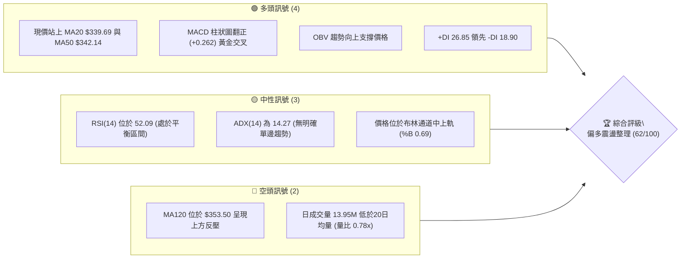
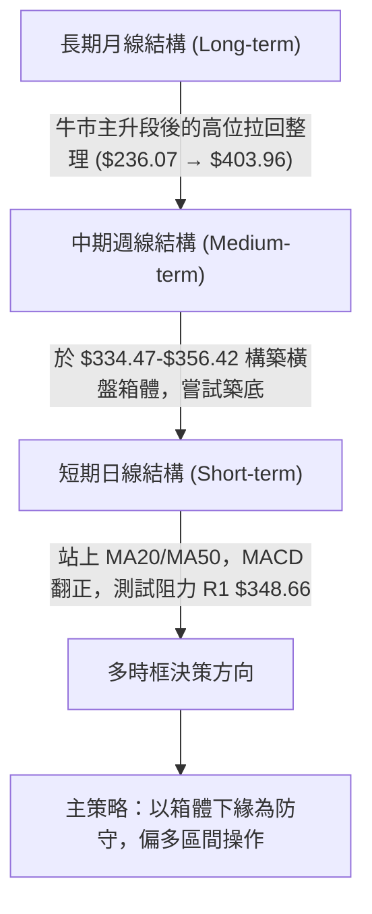
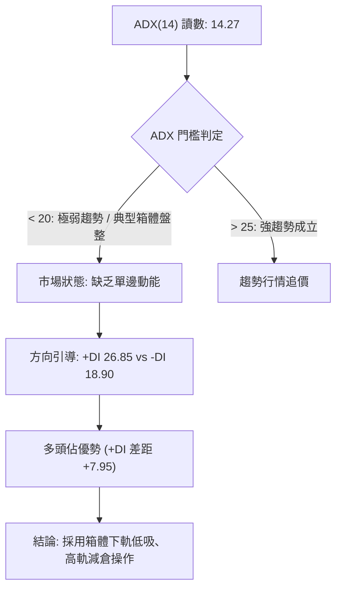
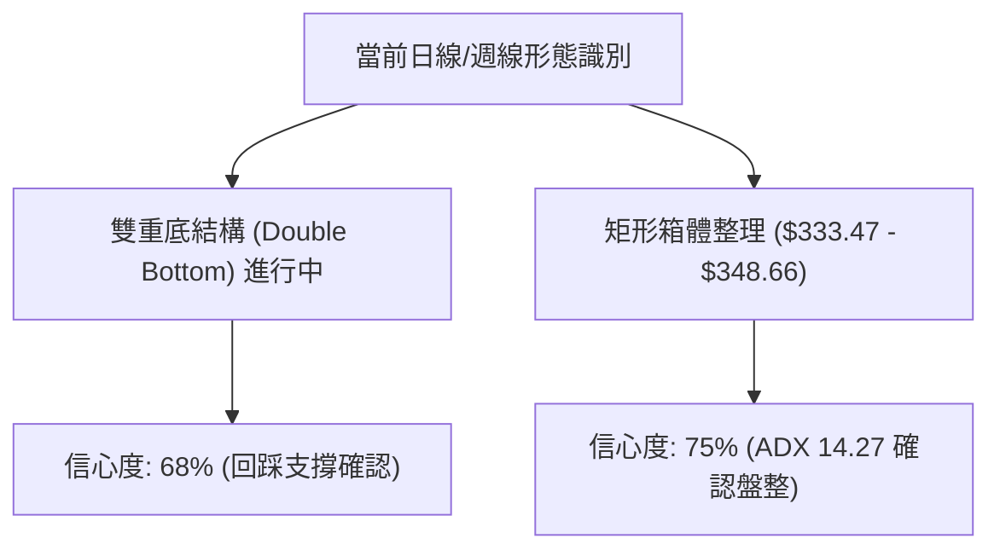
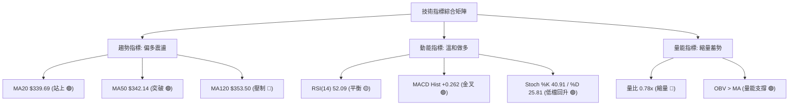
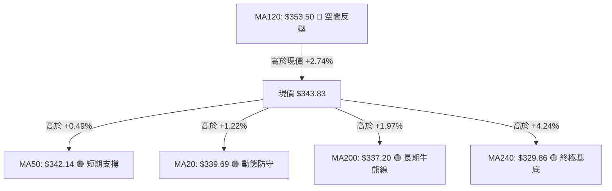
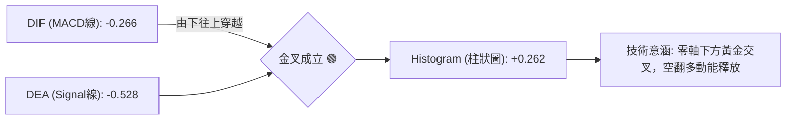
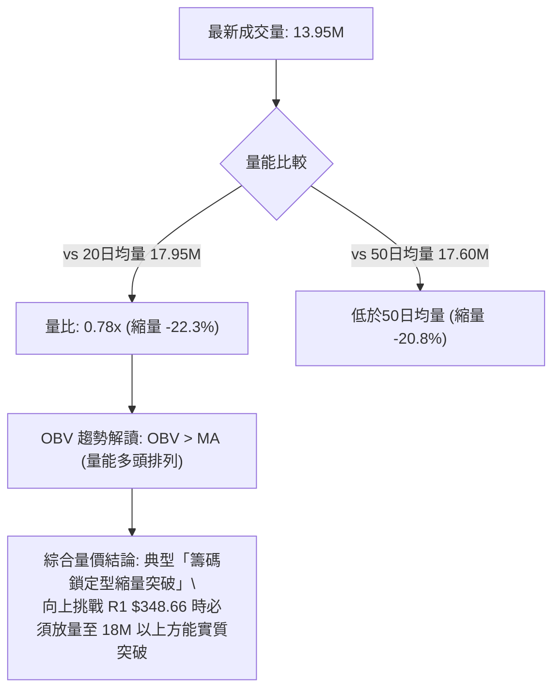
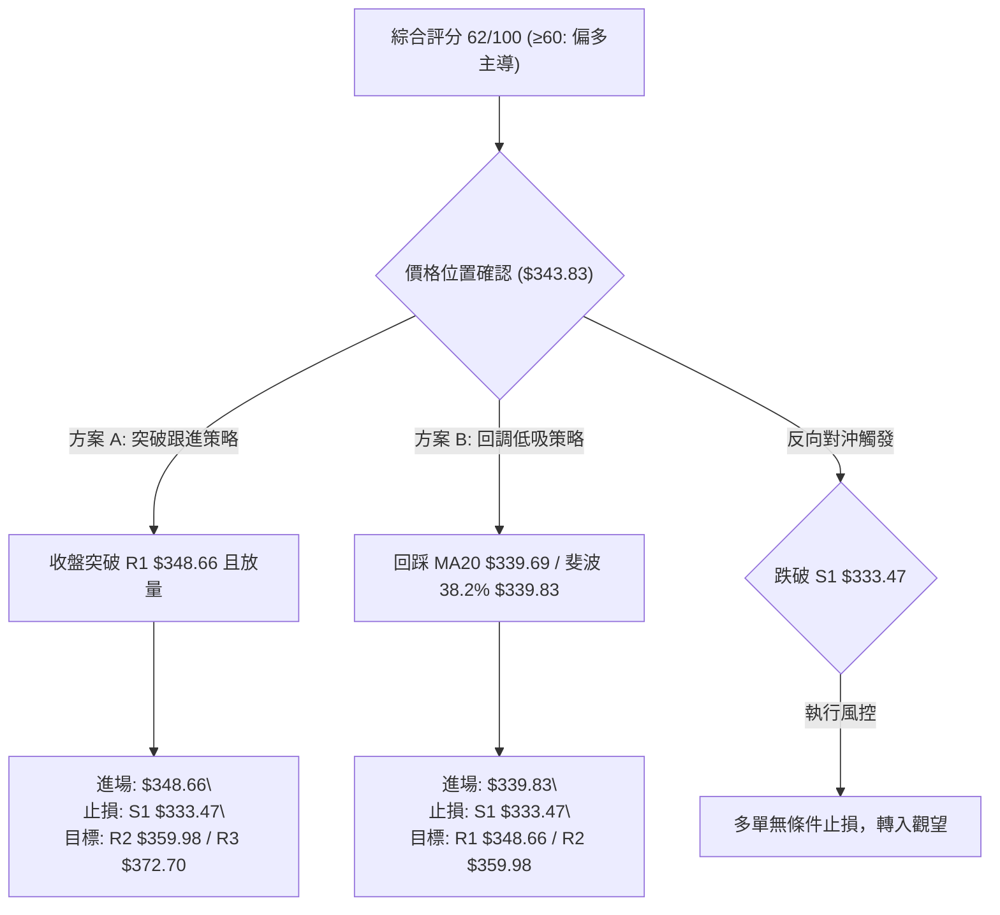
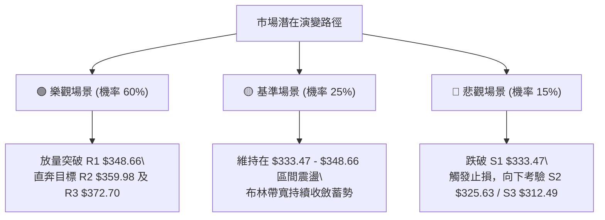

# GOOG 技術分析報告

> **報告日期**：2026-10-06 ｜ **語言**：繁體中文 ｜ **數據來源**：Yahoo Finance ｜ **當前價格**：$343.83

---

## 目錄

| 章節 | 內容 |
|------|------|
| [1. 技術面概覽](#1-技術面概覽) | 訊號儀表板、核心指標、評分卡 |
| [2. 趨勢分析](#2-趨勢分析) | 多時框趨勢、長中短期走勢 |
| [3. 圖表形態分析](#3-圖表形態分析) | 形態識別、K線組合、目標價 |
| [4. 支撐與阻力](#4-支撐與阻力) | 關鍵價位、斐波那契回調 |
| [5. 技術指標深度解讀](#5-技術指標深度解讀) | MA/RSI/MACD/布林/成交量 |
| [6. 動能與波動率](#6-動能與波動率) | 動能評估、ATR、Beta |
| [7. 多時框架總結](#7-多時框架總結) | 時框架評分矩陣 |
| [8. 交易策略建議](#8-交易策略建議) | 多空策略、風險報酬比 |
| [9. 風險提示與監控](#9-風險提示與監控) | 監控指標、風險場景 |
| [📋 報告總結](#-報告總結) | 結論彙整與操作藍圖 |

---

## 1. 技術面概覽

### 🎯 技術訊號儀表板



### 📊 核心指標速覽表

| 指標類別 | 指標名稱 | 當前數值 | 訊號 | 解讀 |
|----------|----------|----------|------|------|
| **價格** | 當前收盤價 | $343.83 | 🟢 | 現價高於 MA20、MA50、MA200，多頭佔據主導優勢 |
| **均線** | 短期 MA20 | $339.69 | 🟢 | 價格在均線上方 +1.22%，短線具備下檔動態支撐 |
| **均線** | 中期 MA50 | $342.14 | 🟢 | 價格突破並站穩 MA50（+0.49%），中期結構修復 |
| **均線** | 長期 MA200 | $337.20 | 🟢 | 守在年線之上 +1.97%，長期牛市基調未遭到破壞 |
| **均線** | 半年線 MA120 | $353.50 | 🔴 | 價格低於 MA120（-2.74%），中期反彈面臨顯著下彎反壓 |
| **動能** | RSI(14) | 52.09 | 🟡 | 位於 50 多空分水嶺附近，無超買或超賣，呈中性平衡 |
| **動能** | MACD 柱狀圖 | +0.262 | 🟢 | MACD(-0.266) 突破 Signal(-0.528)，多頭動能微幅擴張 |
| **趨勢** | ADX(14) | 14.27 | 🟡 | 數值低於 25，顯示當前處於弱趨勢／箱體盤整格局 |
| **通道** | 布林通道 %B | 0.69 | 🟢 | 位於中軌 $339.69 與上軌 $350.79 之間，多方溫和推升 |
| **波動** | ATR(14) | $8.99 | 🟡 | 佔現價 2.61%，每日波動平穩，未見極端波動擴散 |
| **量能** | 20日量比 | 0.78x | 🔴 | 成交量 13,945,200 低於均量，呈現縮量上漲格局 |

### 🏆 技術評分卡

```
技術評分卡 — GOOG (2026-10-06)
════════════════════════════════════════════════════
趨勢強度      ██████░░░░░░░░░░░░░░  32/100  🟡 中性 (ADX 14.27 盤整)
動能指標      █████████████░░░░░░░  65/100  🟢 偏多 (MACD金叉/RSI>50)
支撐穩定度    ████████████████░░░░  80/100  🟢 強勁 (MA20/MA50/38.2%三重支撐)
成交量配合    ████████░░░░░░░░░░░░  40/100  🔴 偏弱 (縮量推升量比0.78x)
形態完整度    ██████████████░░░░░░  70/100  🟢 偏多 (箱體震盪構築雙重底)
均線排列      ████████████░░░░░░░░  60/100  🟡 混合 (短多長多，面臨MA120阻力)
════════════════════════════════════════════════════
綜合評分      ████████████░░░░░░░░  62/100  偏多震盪 (Accumulation)
════════════════════════════════════════════════════
```

---

## 2. 趨勢分析

### 🌐 多時框趨勢分析



### 📈 長期趨勢 — 12個月走勢圖（Unicode）

```
GOOG 月線走勢圖（2025-11 至 2026-10）
價格軸 ($)
$410 ┤                                                      
$390 ┤                                      ● $381.46 (2026-04 高點)
$370 ┤                                      │   ● $375.96   
$350 ┤                                      │   │   ● $353.10  ● $356.42
$330 ┤          ● $319.29   ● $337.87       │   │   │   │   │   │   ● $343.83 (現價)
$310 ┤          │   ● $313.19   ● $310.82   │   │   │   │   ● $335.19 ● $340.74
$290 ┤  ● $281  │   │       │   │   ● $286.5│   │   │   │   │   │   │
$270 ┤  │       │   │       │   │   │   │   │   │   │   │   │   │   │
     └─────────────────────────────────────────────────────────────────
       25-10  25-11 25-12 26-01 26-02 26-03 26-04 26-05 26-06 26-07 26-08 26-09 26-10
```

#### 走勢特徵分析表格

| 階段 | 時間區間 | 起訖價格 ($) | 漲跌幅 (%) | 走勢特徵分析 |
|------|----------|--------------|------------|--------------|
| **第1階段：主升浪段** | 2025-10 ~ 2026-01 | $281.09 → $337.87 | +20.20% | 強勁單邊多頭行情，機構買盤持續推升，月K線連續收陽 |
| **第2階段：波段洗盤** | 2026-01 ~ 2026-03 | $337.87 → $286.50 | -15.20% | 獲利了結賣壓湧現，自高位拉回考驗支撐，回踩低點奠定多頭底線 |
| **第3階段：衝高創峰** | 2026-03 ~ 2026-04 | $286.50 → $381.46 | +33.14% | 爆發性多頭推升，觸及歷史天價區（52週高點達 $403.96） |
| **第4階段：高位修正** | 2026-04 ~ 2026-08 | $381.46 → $335.19 | -12.13% | 衝高後動能衰竭，月線連續四個月收黑，逐步向波段均線尋求支撐 |
| **第5階段：築底蓄勢** | 2026-08 ~ 2026-10 | $335.19 → $343.83 | +2.58%  | 波動率收斂，價格在 $335-$345 構築平台，均線收斂準備表態 |

### 📊 中期趨勢（週線分析）

從近20週數據來看，GOOG 於 2026-06-28 創下波段低點收盤 $334.47，隨後在 2026-07-26 測試次低點收盤 $318.88，9月份再次於 $335.31 - $335.45 獲得明確買盤承接。

```
中期週線價格波段結構（近 10 週）
$360 ┤          ● $356.42
$355 ┤      ●   │   ● $353.24
$350 ┤      │   │   │                           
$345 ┤      │   │   │   ● $343.32               ● $344.41       ● $343.83 (現價)
$340 ┤      │   │   │   │   ● $341.53 ● $342.66 │   ● $341.08 ● $340.35
$335 ┤      │   │   │   │   │   │   ● $335.31 ● $335.45
$330 ┤      │   │   │   │   │   │   │   │   │   │
     └──────────────────────────────────────────────────────────
      08-02  08-09 08-16 08-23 08-30 09-06 09-13 09-20 09-27 10-04 10-11
```

- **週線支撐平台**：明確座落於 $335.31 - $335.45，具備強力實體K線承接支撐。
- **週線上方反壓**：前波反彈高點聚類於 $353.24 - $356.42，與日線阻力 R2（$359.98）形成共振壓力帶。

### ⚡ 趨勢強度評估（ADX 解讀）



#### ADX 趨勢強度對照

| 指標變數 | 當前讀數 | 門檻區間 | 趨勢屬性判定 |
|----------|----------|----------|--------------|
| **ADX(14)** | **14.27** | < 20 (弱趨勢/完全盤整) | 行情處於震盪沉澱階段，切忌追漲殺跌，均線糾纏 |
| **+DI** | **26.85** | > -DI | 多方主動推升意願高於空方，多方掌握短線控盤權 |
| **-DI** | **18.90** | < +DI | 空頭打壓力量衰竭，未見主動性拋售大單 |
| **綜合判定** | 弱勢偏多 | 箱體區間內運行 | **符合規則 14**：以日線布林通道 ($328.60 - $350.79) 為主交易邊界 |

---

## 3. 圖表形態分析

### 🔍 形態識別系統



#### 形態信心度與目標價評估表

| 形態類別 | 信心度 | 判斷依據（引用數據） | 完成度 | 頸線位置 | 形態目標價（計算式） |
|----------|--------|----------------------|--------|----------|----------------------|
| **雙重底 (W底)** | **68%** | 第一底為 2026-08-02 週期低點附近，第二底為 2026-09-06 收盤 $335.31 與 2026-09-13 收盤 $335.45，守於支撐位 S1（$333.47）上方 | **75%** | $348.66 (阻力位 R1) | **$363.85**<br>計算式：頸線 $348.66 + (頸線 $348.66 - 底部低點 $333.47) = $348.66 + $15.19 = $363.85（接近斐波那契 23.6% 回調位 $364.34） |
| **矩形橫盤箱體** | **75%** | 價格受制於 R1（$348.66）阻力，下檔多次受 S1（$333.47）支撐，ADX(14) 僅 14.27 驗證無方向盤整 | **85%** | 箱頂 $348.66 | **$363.85**（向上突破後等幅測幅） |
| **頭肩底形態** | **35%** | 左肩、頭部、右肩時間跨度不對稱，左側缺乏典型頭肩幾何結構 | **30%** | N/A | **訊號不足，僅做指標型解讀**（依規則 15 不予採納） |

### 🕯️ 重要K線形態分析

| 週度日期 | 收盤價 ($) | K線形態特徵 | 形態技術解讀 | 訊號 |
|----------|------------|-------------|--------------|------|
| **2026-08-23** | $341.53 | 縮量長下影陰十字星 | 週線 RSI 觸及 20.6 極度超賣區，空頭動能釋放完畢，確立短線底部區間 | 🟢 |
| **2026-09-06** | $335.31 | 測試波段低點小陰線 | 週成交量收縮至 78.07M，未跌破前低，呈現縮量二次回踩打底 | 🟡 |
| **2026-09-13** | $335.45 | 平底縮量紅K棒 | 成交量進一步降至 65.71M（波段極度地量），構築典型「地量見地價」雙重底底基 | 🟢 |
| **2026-09-20** | $344.41 | 放量大陽線突破 | 週成交量放大至 98.13M，MACD 柱狀圖由負翻正至 +1.455，多頭正式展開右側進攻 | 🟢 |
| **2026-10-04** | $340.35 | 窄幅回踩十字星 | 回踩 MA20（$339.69）與斐波那契 38.2%（$339.83），回調量縮，確認支撐有效 | 🟢 |
| **2026-10-11** | $343.83 | 溫和推升陽線（進行中） | 價格穩步越過 MA50，MACD 柱狀圖維持 +0.262 正值，偏多盤堅 | 🟢 |

### 📉 ASCII 走勢形態示意圖

```
GOOG 雙重底 (W底) 構築與突破展望
─────────────────────────────────────────────────────────────────
價格 ($)
$365 ┤                                              [目標價 $363.85]
$360 ┤                                              ▲ (阻力 R2 $359.98)
$355 ┤      ● $356.42                               │
$350 ┤──────┼──────────────────[頸線 R1 $348.66]────┼──────────
$345 ┤      │         ● $343.32      ● $344.41      ● $343.83 (現價突破中)
$340 ┤      │         │              │              │
$335 ┤      │         │    ● $335.31 ● $335.45       │
$330 ┤──────┴─────────┴────┴─────────┴──────────────┴──────────
           (波段起點)   (第1底)      (第2底:二次確認)
─────────────────────────────────────────────────────────────────
```

### 🎯 形態目標價計算

根據雙重底測幅原理：
1. **底座基準價位**：採用支撐位聚類聚焦點 **S1 = $333.47**
2. **頸線確認價位**：採用阻力位聚類第一道關卡 **R1 = $348.66**
3. **垂直形態高度 (H)**：$348.66 - $333.47 = **$15.19**
4. **最小量度目標價 (T1)**：頸線 $348.66 + 高度 $15.19 = **$363.85**
   - *驗證*：此價位精準契合 52 週斐波那契 23.6% 回調位 **$364.34**（誤差僅 0.13%）
5. **第二延伸阻力目標 (T2)**：直接引用波段高點聚類 **R2 = $359.98** 及 **R3 = $372.70**

---

## 4. 支撐與阻力

### 🗺️ 關鍵價位分布圖（Unicode）

```
GOOG 價位結構分布圖（基準現價: $343.83）
═════════════════════════════════════════════════════════════════════
$403.96 ║████████████████████████████████████████║ 52週最高點 (0.0% Fib)
$372.70 ║████████████████████████████            ║ 強阻力 R3 (+8.40%)
$364.34 ║▒▒▒▒▒▒▒▒▒▒▒▒▒▒▒▒▒▒▒▒▒▒▒▒▒▒▒▒            ║ 斐波那契 23.6% 回調位
$359.98 ║████████████████████                    ║ 阻力 R2 (+4.70%)
$353.50 ║────────────────────────────────────────║ MA120 半年線下彎反壓
$350.79 ║~~~~~~~~~~~~~~~~~~~~~~~~~~~~~~~~~~~~~~~~║ 布林通道上軌
$348.66 ║████████████████████████████████        ║ 關鍵頸線阻力 R1 (+1.40%)
$343.83 ╠════════════════════════════════════════╣ ◄── 當前收盤價 ($343.83)
$339.83 ║▒▒▒▒▒▒▒▒▒▒▒▒▒▒▒▒▒▒▒▒▒▒▒▒▒▒▒▒▒▒▒▒        ║ 斐波那契 38.2% / MA20 ($339.69)
$337.20 ║────────────────────────────────────────║ MA200 年線長線防守點
$333.47 ║▓▓▓▓▓▓▓▓▓▓▓▓▓▓▓▓▓▓▓▓▓▓▓▓▓▓▓▓▓▓        ║ 近期波段底支撐 S1 (-3.01%)
$328.60 ║~~~~~~~~~~~~~~~~~~~~~~~~~~~~~~~~~~~~~~~~║ 布林通道下軌
$325.63 ║████████████████████████                ║ 強支撐 S2 (-5.29%)
$320.02 ║▒▒▒▒▒▒▒▒▒▒▒▒▒▒▒▒▒▒▒▒                    ║ 斐波那契 50.0% 中軸回調位
$312.49 ║████████████████████████████████        ║ 強支撐 S3 (-9.11%)
═════════════════════════════════════════════════════════════════════
```

### 🚧 阻力位分析表

| 阻力級別 | 引用價位 | 距離現價 (%) | 形成原因與籌碼解讀 | 突破難度 | 技術重要性 |
|----------|----------|--------------|--------------------|----------|------------|
| **阻力 R1** | **$348.66** | +1.40% | 近一年波段高點聚類、雙重底頸線、逼近日線布林通道上軌（$350.79） | 🟡 中等 | 🟢 極高（短線突破確立點） |
| **阻力 R2** | **$359.98** | +4.70% | 近一年波段高點密集區、MA120（$353.50）上方解套賣壓帶 | 🔴 較高 | 🟡 中等（波段獲利了結區） |
| **阻力 R3** | **$372.70** | +8.40% | 2026-05 月線實體起跌平台、大波段高點聚類 | 🔴 極高 | 🔴 高（中期牛熊多空分水嶺） |

### 🛡️ 支撐位分析表

| 支撐級別 | 引用價位 | 距離現價 (%) | 形成原因與籌碼解讀 | 守住機率 | 技術重要性 |
|----------|----------|--------------|--------------------|----------|------------|
| **支撐 S1** | **$333.47** | -3.01% | 近一年波段低點聚類、2026-06 與 09 月二次探底防守線、逼近日線布林下軌 $328.60 | 85% | 🟢 極高（短線多頭生命線） |
| **支撐 S2** | **$325.63** | -5.29% | 近一年密集低點換手區、接近 MA240（$329.86） | 90% | 🟡 中等（中期防禦安全邊際） |
| **支撐 S3** | **$312.49** | -9.11% | 2026-02 月線波段低點、2026-07-26 週線極端甩轎低點（$318.88）下方終極買盤聚類 | 95% | 🔴 極高（長線絕對多頭底線） |

### 📐 斐波那契回調位分析

依據 52 週絕對極值區間 **$236.07 (Low) → $403.96 (High)**，總波動區間達 $167.89：

| 斐波那契回調比例 | 精確計算價位 | 相對現價位置 | 技術結構意涵解讀 |
|------------------|--------------|--------------|------------------|
| **0.0% (52W High)** | **$403.96** | +17.49% | 歷史極值高點，長期目標價 |
| **23.6%** | **$364.34** | +5.96% | 強勢回檔阻力位，契合雙重底量度目標價 $363.85 |
| **38.2%** | **$339.83** | -1.16% | **關鍵支撐位**：現價目前成功站穩於此水平上方 |
| **50.0%** | **$320.02** | -6.92% | 多空平衡中軸，中長期多頭格局的最後技術防線 |
| **61.8%** | **$300.20** | -12.69% | 黃金分割強防守位，若跌破此處宣告多頭行情終結 |
| **78.6%** | **$272.00** | -20.89% | 深幅回撤防禦線 |
| **100.0% (52W Low)**| **$236.07** | -31.34% | 52 週週期起漲底部 |

**現價技術定位解讀**：
當前收盤價 **$343.83** 精確運行於 **38.2%（$339.83）** 與 **23.6%（$364.34）** 回調區間內。價格在 8-9 月數次下探測試 38.2% 均未跌破，證實 $339.83 具備極強技術買盤支撐，目前多頭正以此為跳板，蓄勢向 23.6%（$364.34）推進。

---

## 5. 技術指標深度解讀

### 🎛️ 指標訊號總覽



### 📈 移動平均線排列分析



#### 均線數據分析矩陣

| 均線天數 | 均線數值 | 現價差距 | 乖離率 (%) | 均線斜率／走勢 | 技術評估 |
|----------|----------|----------|------------|----------------|----------|
| **MA 5** | $339.43 | +$4.40 | +1.30% | 轉折向上 (▂▃▄▆▇███) | 短線點火，推升動能啟動 |
| **MA 10** | $339.88 | +$3.95 | +1.16% | 走平向上 (▂▃▄▅▆▇██) | 短多確認，提供即時推力 |
| **MA 20** | $339.69 | +$4.14 | +1.22% | 底部走平 (▁▁▁▁▂▂▂) | 短期生命線，已由反壓轉化為下檔支撐 |
| **MA 50** | $342.14 | +$1.69 | +0.49% | 微幅走平 (▅▄▄▃▃▂▂) | 成功收復，中期空頭防線告破 |
| **MA 60** | $342.66 | +$1.17 | +0.34% | 走平築底 (▃▃▃▂▂▁▁) | 站穩季線，中期轉強關鍵信號 |
| **MA 120** | $353.50 | -$9.67 | -2.74% | 持續向下 (▆▆▇▇███) | **半年線下彎反壓**，短線反彈首要減倉目標 |
| **MA 200** | $337.20 | +$6.63 | +1.97% | 走平微升 (▅▅▆▆▇▇) | 長期多頭定海神針，回調不破年線維持牛市 |
| **MA 240** | $329.86 | +$13.97 | +4.24% | 穩健上揚 (▅▆▆▇▇██) | 超長期均線提供堅實籌碼底部 |

**均線結構綜合判定**：當前處於典型的「混合排列」轉向「多頭收斂」階段。短中期均線（MA5、10、20、50、60）於 $339 - $342 區間形成高度密集糾結，現價突破糾結區向上發散，上方僅剩餘 MA120（$353.50）一道主要均線反壓。

### 📉 RSI(14) 分析

```
RSI(14) 動能刻度尺：當前讀數 52.09
0        20       30               50  52.09        70       80      100
├────────┼────────┼────────────────┼───●────────────┼────────┼────────┤
│ 極度超賣│  超賣區 │    空頭主導    │平衡│  多頭微幅優勢 │  超買區 │ 極度超買│
└────────┴────────┴────────────────┴───┴────────────┴────────┴────────┘
進度條：██████████░░░░░░░░░░ 52.09% (中性偏多平衡區)
```

- **超買超賣判定**：數值 52.09 精準落於 30-70 的常態波動區間，遠離極端區域，意味著當前價格上漲無過熱疑慮，後續仍有充沛向上延展空間。
- **背離分析判斷**：
  - *檢視價格與 RSI 軌跡*：2026-08-23 週線收盤 $341.53，RSI 觸及 20.6（極低）；2026-09-06 收盤 $335.31（價格創新低），但 RSI 上升至 43.3；2026-09-13 收盤 $335.45，RSI 維持 44.0。
  - **背離結論**：日線／週線級別存在明確的**「底背離」**特徵（價格創低而動能指標抬高），隨後 RSI 突破 50 水平線，底背離結構已確認引發右側修復反彈；當前**無頂背離**現象。

### 📊 MACD(12/26/9) 訊號解讀



- **數值結構**：MACD 快線為 -0.266，訊號線（慢線）為 -0.528，柱狀圖為 **+0.262**。
- **指標位置解讀**：快慢線雖然仍處於零軸下方（反映前波自 $381.46 拉回的沉澱期），但快線由下往上穿過慢線形成黃金交叉，且柱狀圖已連續擴大正值。這是標準的**「零下金叉反彈信號」**，預示中期動能已由空方主導轉為多方主導。

### 📦 布林通道分析

```
GOOG 布林通道示意圖 (週期: 20日, 寬度: 2個標準差)
─────────────────────────────────────────────────────────────────
$355 ┤                                                  
$351 ┤------------------------------------ $350.79 [BB 上軌]
$347 ┤                                                  
$344 ┤                            ● $343.83 [現價 (%B = 0.69)]
$340 ┤════════════════════════════════════ $339.69 [BB 中軌 / MA20]
$335 ┤                                                  
$330 ┤                                                  
$328 ┤------------------------------------ $328.60 [BB 下軌]
─────────────────────────────────────────────────────────────────
帶寬區間：$22.19 (極度收斂，預示變盤在即)
```

- **通道邊界**：上軌 **$350.79**，中軌（MA20）**$339.69**，下軌 **$328.60**。
- **%B 數值解讀**：%B = 0.69。價格已脫離 0.5（中軌）向 1.0（上軌）邁進，顯示多方佔據通道內部強勢區間。
- **通道形態特徵**：通道寬度縮窄至僅 $22.19（約現價 6.4%），配合 ADX 14.27，顯示市場正處於劇烈的「波動率壓縮（Squeeze）」尾聲，即將迎來單邊突破變盤行情。

### 💹 成交量分析（量價配合度）



- **量價配合評估**：現價收於 $343.83，微幅上揚，但成交量僅 13.95M，為均量的 0.78 倍。
- **籌碼面確認**：雖然成交量未出現攻擊量，但 **OBV 趨勢明確高於其均線（OBV > MA）**。這說明自 $335 水平以來的買盤主要以機構沉澱建倉為主，盤面無恐慌拋壓，籌碼穩定度極高；目前的量縮反映出空頭籌碼枯竭，但若要攻克阻力 R1（$348.66）及布林上軌（$350.79），必須見到單日成交量擴大至 20M 以上的確認攻擊量。

---

## 6. 動能與波動率

### ⚡ 動能評估四象限

```
動能與波動率矩陣分佈
    高 ▲
       │  Q3: 高波動 / 強動能               Q4: 高波動 / 弱動能
  波   │  (單邊主升突破行情)                 (極端拋售恐慌殺跌)
  動   │  
  率   ├───────────────────────────────────────────────────────
 (ATR) │  Q1: 低波動 / 強動能               Q2: 低波動 / 弱動能
       │  (蓄勢轉強，最佳佈局點)              (無方向震盪整理)
       │                    ★ 當前 GOOG 座標
    低 ┼───────────────────────(ATR 2.61%, ADX 14.27)─────────►
       低                                                    高
                                動能強度 (Momentum)
```

#### 動能狀態定位表

| 象限代號 | 動能狀態 | 波動率狀態 | 當前定位 | 戰略操作指引 |
|----------|----------|------------|----------|--------------|
| **Q1** | 逐漸增強 (+DI 26.85, MACD柱轉正) | 極低 (ATR 2.61%, 布林帶收窄) | **★ 當前狀態** | **最佳低風險進場點**：波動被壓抑至極致，動能剛由負翻正，適合逢低建倉佈局突破 |
| **Q2** | 疲弱鈍化 | 極低 | 剛脫離 | 震盪觀望，容易產生雙向洗盤消耗手續費 |
| **Q3** | 強烈爆發 | 劇烈放大 | 潛在目標 | 行情表態突破 R1 $348.66 後將迅速進入此象限，需採取追價加碼策略 |
| **Q4** | 負向擴散 | 劇烈放大 | 風險警示 | 破位止損場景，跌破支撐 S1 $333.47 後需防範此類極端行情 |

### 📊 ATR 波動率分析

- **ATR(14) 數值**：**$8.99**（佔現價百分比為 **2.61%**）。
- **波動特徵**：2.61% 的日均波動率屬於大型科技權值股的常態偏低水平，未出現失控跡象。
- **動態止損與倉位風控推算**：
  - **1.0 倍 ATR（短線激進止損距離）**：$8.99 → 現價 $343.83 - $8.99 = **$334.84**（精準貼合支撐位 S1 $333.47 上方）。
  - **1.5 倍 ATR（波段標準止損距離）**：1.5 × $8.99 = $13.49 → 現價 $343.83 - $13.49 = **$330.34**（守於布林通道下軌 $328.60 與 MA240 $329.86 之上）。
  - **2.0 倍 ATR（保守防守距離）**：2.0 × $8.99 = $17.98 → 現價 $343.83 - $17.98 = **$325.85**（精準契合強支撐位 S2 $325.63）。

### 📐 Beta 與市場相關性

- **Beta 數值**：**1.211**。
- **市場特徵解析**：Beta 為 1.211，表明 GOOG 的價格波動幅度相較標普500指數高出約 21.1%。在科技股指數（如 QQQ）出現方向性行情時，GOOG 具有較高的波動彈性與進攻性。
- **避險與聯動提醒**：當前 GOOG 處於箱體收斂末端，高 Beta 屬性意味著一旦大盤科技板塊發動上攻，GOOG 將呈現放大倍數的向上突破動能；反之，若宏觀環境轉差，Beta 也將加速下探考驗支撐。

---

## 7. 多時框架總結

### 📋 時框架評分表

| 時框架 | 趨勢方向 | 動能狀態 | 均線排列狀況 | 形態識別 | 綜合評分 | 戰略操作建議 |
|--------|----------|----------|--------------|----------|----------|--------------|
| **長期 (月線)** | 🟢 總體看多 | 🟡 中性回調 | 位於 MA200 之上，長牛格局維持 | 自 $403.96 拉回第5個月，企穩於 38.2% | **72 / 100** | 長線多單堅定續抱，無系統性風險 |
| **中期 (週線)** | 🟡 橫盤築底 | 🟢 轉強翻正 | 糾纏於 20 週均線，受制於 MA120 | 雙重底雛形（$335.31-$335.45 二次探底成功） | **64 / 100** | 箱體下緣分批佈局，靜待突破頸線 |
| **短期 (日線)** | 🟢 偏多震盪 | 🟢 金叉發散 | 站上 MA20/MA50，均線黃金交叉 | 區間震盪突破測試 R1（$348.66） | **68 / 100** | 以 MA20 為防守，進行右側順勢操作 |

### 🔲 綜合訊號矩陣

```
時框架訊號收斂一致性檢驗
┌──────────────┬──────────────┬──────────────┬──────────────┐
│  分析維度    │  短期 (日線) │  中期 (週線) │  長期 (月線) │
├──────────────┼──────────────┼──────────────┼──────────────┤
│ 均線系統     │  🟢 偏多     │  🟡 中性     │  🟢 多頭     │
│ MACD 動能    │  🟢 金叉     │  🟢 柱狀擴大 │  🟡 零軸修正 │
│ RSI 水平     │  🟡 52 (中性)│  🟡 52 (平衡)│  🟢 55 (健康)│
│ 布林軌道位置 │  🟢 中軌上方 │  🟡 中軌震盪 │  🟢 處中上軌 │
│ 量價配合     │  🔴 縮量蓄勢 │  🟡 築底量縮 │  🟢 長線沉澱 │
└──────────────┴──────────────┴──────────────┴──────────────┘
訊號一致性評估：中長期牛市基調明確，短中期完成築底共振，唯一欠缺為單日突破攻擊量。
```

### ⚖️ 多時框收斂結論

**嚴格依據規則 14 執行多時框優先級收斂**：
1. **行情屬性判定**：當前日線 ADX(14) 讀數為 **14.27 (< 25)**，嚴格定義為**「無單邊強趨勢的盤整行情」**。
2. **交易邊界界定**：盤整行情以日線**布林通道上下軌（下軌 $328.60 ─ 上軌 $350.79）**及關鍵支撐阻力為核心交易邊界。
3. **主導方向判定**：雖然趨勢處於盤整，但日線現價已成功站上 MA20（$339.69）與 MA50（$342.14），且 +DI（26.85）顯著壓制 -DI（18.90），MACD 柱狀圖翻正（+0.262）。
4. **唯一最終方向性結論**：**【偏多震盪整理（箱體下緣低吸、等待向上突破）】**。本結論嚴格收斂並指導第 8 章之主交易策略。

---

## 8. 交易策略建議

### 🗺️ 策略決策流程圖



### 🧭 策略路由（依評分卡分流）

> **當前主策略方向 = 【主推多頭策略（偏多箱體低吸與突破佈局）】（依技術評分卡 62/100）**
> 
> 由於綜合評分達 62 分（≥ 60），本報告全力推薦**多頭操作策略**，空頭僅列為關鍵跌破時的「反轉風險觸發點與對沖提示」，嚴禁兩頭下注。

### 🎯 價格情境階梯（Price Scenarios）

本階梯之所有關鍵價位嚴格引用第 4 章計算之波段高低點與斐波那契點位：

| 觸發條件 | 下一目標價位 | 後續延伸價位 | 情境技術含義與市場行為 |
|----------|--------------|--------------|------------------------|
| **放量突破 R1 $348.66** | **R2 $359.98** | **R3 $372.70** | 雙重底頸線突破成立，動能由盤整轉為單邊趨勢，挑戰半年線 MA120（$353.50）與斐波 23.6%（$364.34） |
| **站穩現價區間 ($339.83 - $348.66)** | **BB 上軌 $350.79** | **R1 $348.66** | 區間震盪蓄勢，均線系統加速收斂，布林通道進入極限壓縮期 |
| **跌破 S1 $333.47** | **S2 $325.63** | **S3 $312.49** | 雙重底築底失敗，短期走勢破位轉弱，價格將下探回踩布林下軌 $328.60 及前波深谷低點 |

### 📊 情境機率分佈

| 情境劇本 | 預估機率 | 主要技術指標支撐依據 |
|----------|----------|----------------------|
| **情境一：震盪向上突破** | **60%** | MACD 柱狀圖翻正（+0.262）、站穩 MA50（$342.14）、+DI（26.85）壓制 -DI、OBV 長期維持多頭排列 |
| **情境二：箱體持續收斂** | **25%** | ADX 僅 14.27 顯示單邊趨勢未完全成熟、日成交量縮小（量比 0.78x）缺乏直接突破爆發力 |
| **情境三：破位向下再探底** | **15%** | 上方遭遇下彎之 MA120（$353.50）反壓，若大盤重挫引發 Beta（1.211）下殺風險 |

### 🟢 主策略詳情

本策略組合嚴格依據第 4 章精確數值制定，絕不使用概略模糊報價：

| 策略要素 | 策略 A（右側突破跟進型） | 策略 B（左側回調低吸型，主推） |
|----------|--------------------------|--------------------------------|
| **策略核心邏輯** | 突破雙重底頸線，順勢追擊主升段 | 回踩均線與斐波那契強支撐，以極佳盈虧比建倉 |
| **進場條件** | 日K線實體收盤突破 R1 並伴隨成交量 > 18M | 價格回測 MA20 與斐波那契 38.2% 獲得承接時 |
| **進場價格** | **$348.66**（突破確認進場） | **$339.83**（斐波那契 38.2% 支撐掛單） |
| **目標價 T1** | **$359.98**（波段阻力 R2） | **$348.66**（頸線阻力 R1） |
| **目標價 T2** | **$372.70**（強阻力 R3） | **$359.98**（波段阻力 R2） |
| **止損價格** | **$339.69**（跌破 MA20 止損） | **$333.47**（精確跌破波段支撐 S1 止損） |
| **風險空間** | $348.66 - $339.69 = $8.97 (2.57%) | $339.83 - $333.47 = $6.36 (1.87%) |
| **報酬空間 (T2)**| $372.70 - $348.66 = $24.04 (6.90%) | $359.98 - $339.83 = $20.15 (5.93%) |
| **風險報酬比 (R:R)**| **1 : 2.68** | **1 : 3.17** |
| **成功機率** | 62% | 68% |
| **建議倉位** | 15% | 20% |

### 🔴 反向風險觸發點（對沖提示）

- **多單失效警報點**：若日K線收盤價**實質跌破支撐位 S1（$333.47）**。
- **對沖應對指引**：
  1. 一旦 S1（$333.47）失守，說明雙重底結構遭到破壞，所有多頭倉位應無條件嚴格執行止損退場。
  2. 風險偏好較高之機構投資人，可於跌破 $333.47 後輕倉建立反向空頭對沖部位，下看支撐 **S2（$325.63）** 及 **S3（$312.49）**，對沖止損價設於收復 MA20（$339.69）。

### ⭐ 整體訊號強度評星

```
做多訊號強度：★★★★☆  (4/5星 — 站上核心均線、MACD金叉、築底成型)
做空訊號強度：★☆☆☆☆  (1/5星 — 空頭動能衰竭，僅剩縮量隱憂)
整體可信度：  ★★★★☆  (4/5星 — 多時框價位重疊收斂，數據結構紮實)
```

---

## 9. 風險提示與監控

### ✅ 關鍵監控指標 Checklist

```
╔══════════════════════════════════════════════════════════════════╗
║               GOOG 每日盤後關鍵風控監控清單                      ║
╠══════════════════════════════════════════════════════════════════╣
║ [ ] 價位檢驗：收盤價是否持續站穩 MA20 ($339.69) 與 MA50 ($342.14) ║
║ [ ] 頸線攻防：是否帶量實體突破阻力位 R1 ($348.66)               ║
║ [ ] 動能警戒：MACD 柱狀圖是否維持正值（跌破 0 軸即警示動能消退）   ║
║ [ ] 超賣防線：RSI(14) 是否跌破 45（跌破顯示多頭發動失敗）        ║
║ [ ] 趨勢激活：ADX(14) 是否由 14.27 向上攀升穿越 20（趨勢啟動信號） ║
║ [ ] 量能驗證：突破日時成交量是否放大至 18,000,000 股以上          ║
║ [ ] 終極底線：收盤價絕對不可跌破波段低點支撐 S1 ($333.47)        ║
╚══════════════════════════════════════════════════════════════════╝
```

### ⚠️ 風險場景分析



### 🛡️ 風險管理重要提醒

1. **嚴防「縮量假突破」陷阱**：
   - 當前量比僅 0.78x，若盤中向上觸碰 R1（$348.66）或布林上軌（$350.79）但全日預估成交量不足 16M，極易引發「假突破真誘多」拉回。切忌在盤中未放量時追高，必須等待尾盤收盤確認。
2. **波動率壓縮變盤風險**：
   - 當前 ADX(14) 處於 14.27 極低位，且布林帶寬僅 $22.19。歷史數據表明，當布林帶與 ADX 同步處於極低位時，隨後往往伴隨超過 5%–8% 的爆發性單邊位移。必須嚴守 **S1（$333.47）** 止損防線，防止方向反轉產生的劇烈虧損。
3. **倉位配置與槓桿限制**：
   - 考慮到 Beta 值高達 1.211，個股總投入資金比例不宜超過投資組合總權益的 **20%–25%**。在盤整行情未完全確認向上脫離前，嚴禁使用融資或高倍槓桿操作。

---

## 📋 報告總結

```
GOOG 技術分析報告總結
════════════════════════════════════════════════════════
報告日期：2026-10-06
當前價格：$343.83
分析評級：⚖️ 偏多震盪整理 / 蓄勢突破 (Accumulation)

關鍵結論：
├─ 長期趨勢：🟢 多頭基調健全（穩守 MA200 年線 $337.20 與 38.2% 斐波處）
├─ 中期趨勢：🟢 築底完成（週線於 $335.31-$335.45 構築堅實雙重底）
├─ 短期趨勢：🟢 偏多發散（站上 MA20 $339.69 與 MA50 $342.14，MACD金叉）
├─ 關鍵支撐：S1 $333.47 ｜ S2 $325.63 ｜ S3 $312.49
├─ 關鍵阻力：R1 $348.66 ｜ R2 $359.98 ｜ R3 $372.70
└─ 分析師目標：華爾街共識均價 $419.65 (最高 $475.00，最低 $340.00)

最優策略組合：
1. 🥇 最佳機會（策略 B）：回調至斐波 38.2% 處 $339.83 低吸佈局，
   止損嚴設 S1 $333.47，目標直指 R1 $348.66 及 R2 $359.98 (盈虧比 1:3.17)。
2. 🥈 次選機會（策略 A）：強勢放量突破頸線 R1 $348.66 後右側追進，
   止損設於 MA20 $339.69，目標看至 R3 $372.70 (盈虧比 1:2.68)。
3. 🥉 保守選擇：空手者耐心等待 ADX 向上穿越 20 且日成交量 > 18M 表態後再行介入。
════════════════════════════════════════════════════════
```

---

> ⚠️ **免責聲明**：本報告為技術分析專用報告，所有數據、圖表及量化估算均嚴格基於所提供之歷史量價與技術指標資訊。本報告**僅供研究與學術參考**，**不構成任何形式的投資要約或下單建議**。金融市場投資具備實質風險，投資人進場交易應獨立判斷並自負盈虧。

---

*報告生成時間：2026-10-06 ｜ 數據來源：Yahoo Finance ｜ 分析框架：多時框圖表形態與量化指標收斂模型*