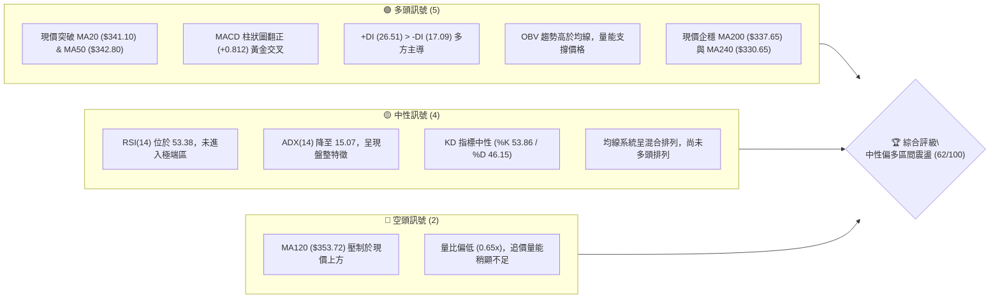
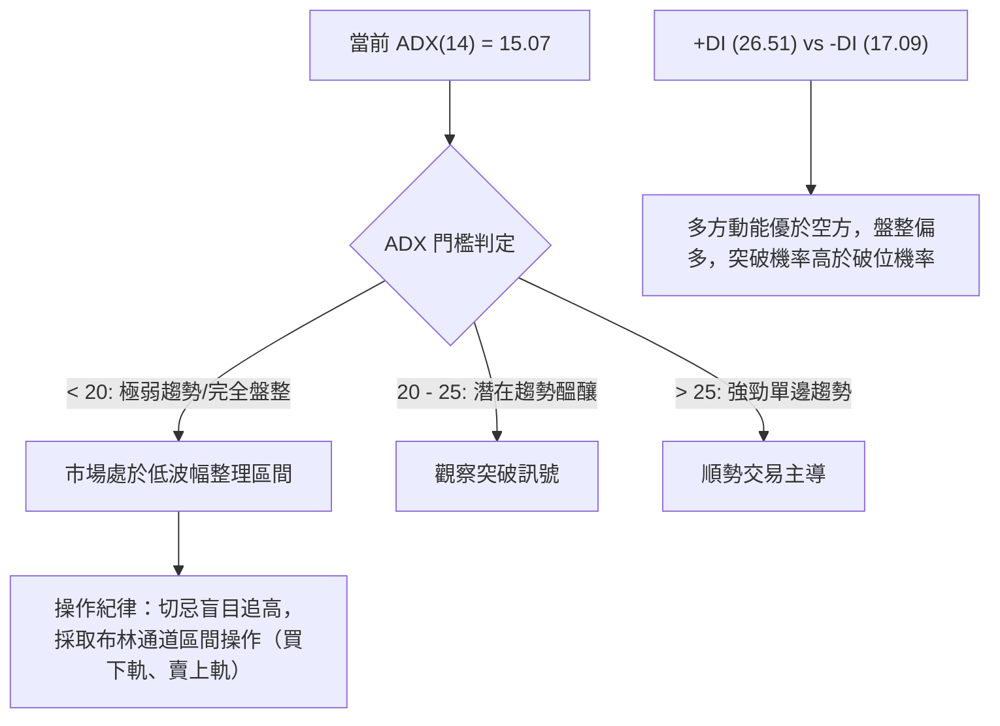
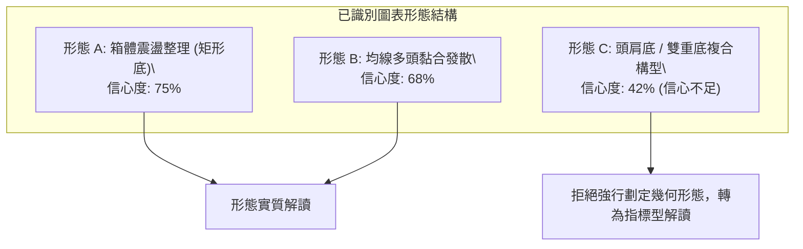
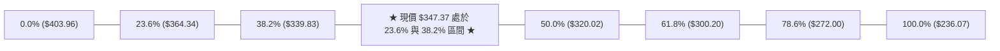
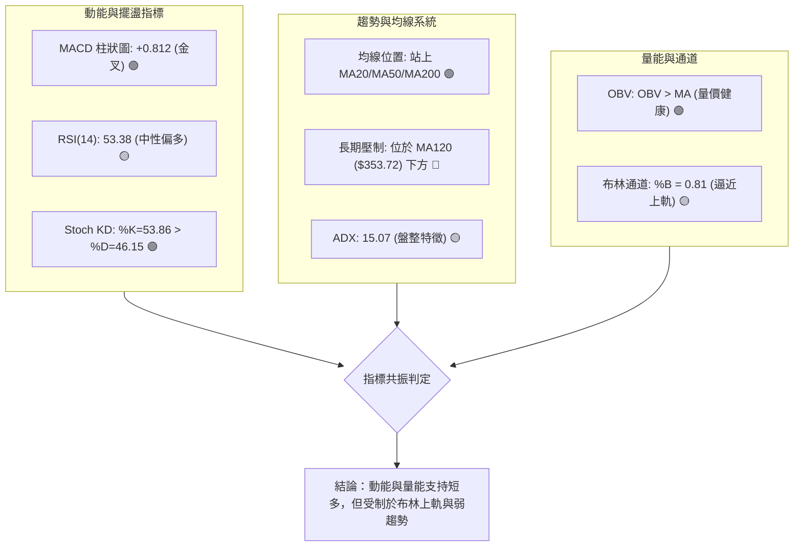
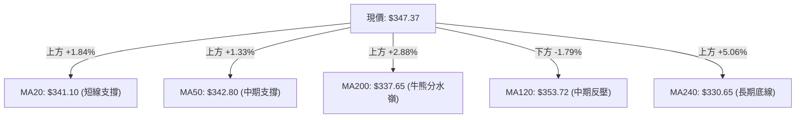
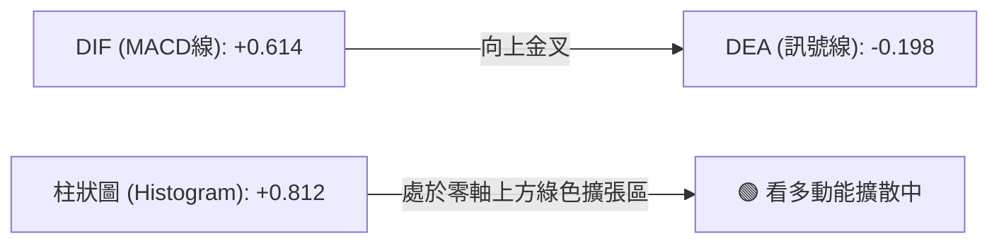
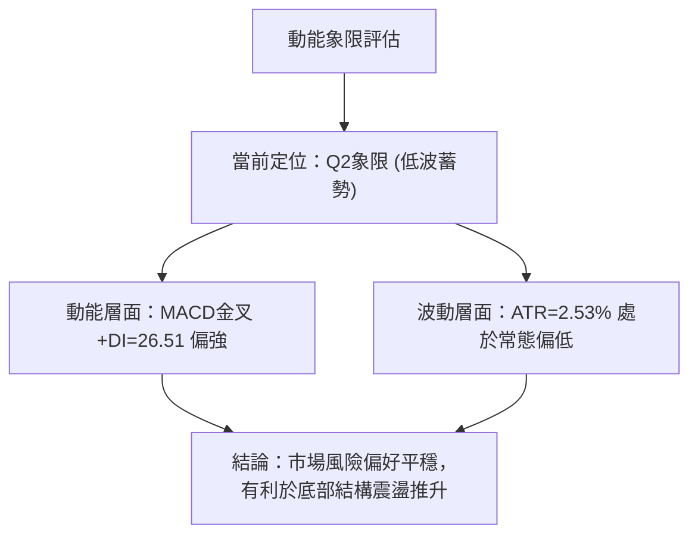
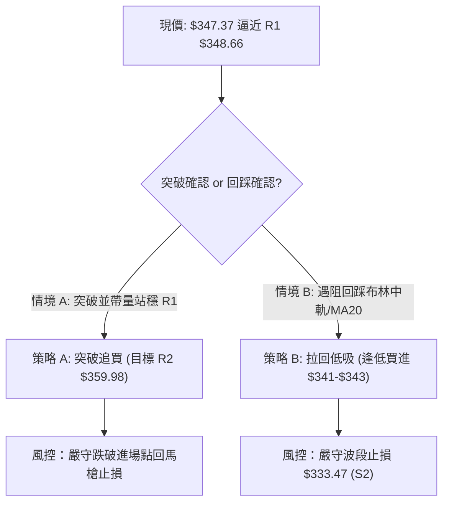
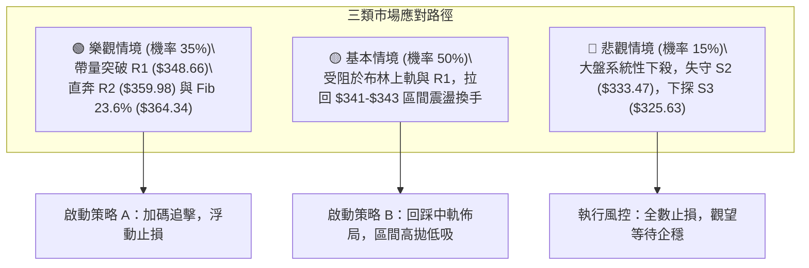

# GOOG 技術分析報告

> **報告日期**：2026-10-08 ｜ **語言**：繁體中文 ｜ **數據來源**：Yahoo Finance ｜ **當前價格**：$347.37

---

## 目錄

| 章節 | 內容 |
|------|------|
| [1. 技術面概覽](#1-技術面概覽) | 訊號儀表板、核心指標、評分卡 |
| [2. 趨勢分析](#2-趨勢分析) | 多時框趨勢、長中短期走勢 |
| [3. 圖表形態分析](#3-圖表形態分析) | 形態識別、K線組合、目標價 |
| [4. 支撐與阻力](#4-支撐與阻力) | 關鍵價位、斐波那契回調 |
| [5. 技術指標深度解讀](#5-技術指標深度解讀) | MA/RSI/MACD/布林/成交量 |
| [6. 動能與波動率](#6-動能與波動率) | 動能評估、ATR、Beta |
| [7. 多時框架總結](#7-多時框架總結) | 時框架評分矩陣 |
| [8. 交易策略建議](#8-交易策略建議) | 多空策略、風險報酬比 |
| [9. 風險提示與監控](#9-風險提示與監控) | 監控指標、風險場景 |

---

## 1. 技術面概覽

### 🎯 技術訊號儀表板



### 📊 核心指標速覽表

| 指標類別 | 指標名稱 | 當前數值 | 訊號 | 解讀 |
|----------|----------|----------|------|------|
| **價格** | 當前價格 | $347.37 | 🟢 | 位於52週區間66.3%，自底部反彈結構確立 |
| **均線** | MA20 | $341.10 | 🟢 | 現價高於 MA20（+1.84%），短線支撐轉強 |
| **均線** | MA50 | $342.80 | 🟢 | 現價站上中期生命線（+1.33%） |
| **均線** | MA200 | $337.65 | 🟢 | 現價站上長期牛熊分界線（+2.88%） |
| **動能** | RSI(14) | 53.38 | 🟡 | 位於50中軸上方，多空力量處於平衡微偏強 |
| **動能** | MACD(12,26,9) | 0.614 / -0.198 | 🟢 | MACD值由負翻正，柱狀圖達+0.812，呈現金叉擴散 |
| **波動** | ATR(14) | $8.80 | 🟡 | 佔股價2.53%，波動幅度處於溫和收斂狀態 |

### 🏆 技術評分卡

```
╔══════════════════════════════════════════════════════════════════╗
║               技術評分卡 — GOOG (2026-10-08)                     ║
╠══════════════════════════════════════════════════════════════════╣
║ 趨勢強度 (ADX=15.07)   ██████░░░░░░░░░░░░░░  32/100  🟡 盤整主導   ║
║ 動能指標 (MACD/RSI)    █████████████░░░░░░░  68/100  🟢 動能轉強   ║
║ 支撐穩定度 (S1/S2/MA)  ████████████████░░░░  78/100  🟢 底部紮實   ║
║ 成交量配合 (OBV/Vol)   ███████████░░░░░░░░░  56/100  🟡 縮量整理   ║
║ 形態完整度 (區間築底)  ██████████████░░░░░░  70/100  🟢 箱體成形   ║
║ 均線排列 (短強長混)    ██████████████░░░░░░  68/100  🟢 站上MA200  ║
╠══════════════════════════════════════════════════════════════════╣
║ 綜合評分               ████████████░░░░░░░░  62/100  🟢 中性偏多   ║
╚══════════════════════════════════════════════════════════════════╝
```

---

## 2. 趨勢分析

### 🌐 多時框趨勢分析

```mermaid
graph TD
    A["月線框架 (長線)"] -->|"24個月走勢: 2025底拉升至高點後高檔修正，長多基底穩固"| B["中長期結構：多頭回檔守穩"]
    C["週線框架 (中線)"] -->|"近20週走勢: 圍繞 $335-$365 箱體震盪，MACD柱自負轉正"| D["中期結構：區間震盪築底"]
    E["日線框架 (短線)"] -->|"站上 MA20/MA50/MA200，但面臨 R1 $348.66 阻力"| F["短期結構：偏多反彈，測試箱頂"]
    B --> G{"多時框收斂定調"}
    D --> G
    F --> G
    G -->|"ADX("14")=15.07 < 25"| H["判定為【盤整行情】：以日線布林區間 $331-$351 為交易邊界"]
```

### 📈 長期趨勢 — 12個月走勢圖（Unicode）

```
GOOG 月線走勢圖（過去12個月：2025-11 至 2026-10）
價格軸 ($)
$390 ┤                                      
$380 ┤                            ●(381.46)  
$370 ┤                               ●(375.96)
$360 ┤                                  ●(356.42)
$350 ┤                               ●(353.10)   ●(347.37)←現價
$340 ┤             ●(337.87)                 ●(340.74)
$330 ┤                ●(310.82)           ●(335.19)
$320 ┤ ●(319.29)  ●(313.19)
$300 ┤
$280 ┤                   ●(286.50) (波段低點)
     └────────────────────────────────────────────────────────
       11   12   01   02   03   04   05   06   07   08   09   10 (月)
      (2025)             (2026)
```

#### 走勢特徵分析表格

| 階段 | 時間區間 | 起訖價格 | 區間漲跌幅 | 走勢特徵與結構解讀 |
|------|----------|----------|------------|-------------------|
| **第一階段：高檔震盪** | 2025-11 ～ 2026-01 | $319.29 → $337.87 | +5.82% | 延續2025年主升段，於2026年1月創波段收盤高點 $337.87 |
| **第二階段：快速回踩** | 2026-01 ～ 2026-03 | $337.87 → $286.50 | -15.20% | 獲利了結賣壓湧現，測試 61.8% 斐波那契回調位（$300.20）下方支撐 |
| **第三階段：強勁噴出** | 2026-03 ～ 2026-04 | $286.50 → $381.46 | +33.14% | 暴力反彈並直逼52週歷史高點 $403.96，確立大週期多頭未死 |
| **第四階段：箱體回調** | 2026-04 ～ 2026-08 | $381.46 → $335.19 | -12.13% | 衝高未破歷史極值後回落，在 $335 附近獲得 38.2% 斐波那契強支撐 |
| **第五階段：築底蓄勢** | 2026-08 ～ 2026-10 | $335.19 → $347.37 | +3.63% | 連續兩個月小幅收紅，價格重回多條關鍵均線之上，動能緩步回溫 |

### 📊 中期趨勢（週線分析）

```
GOOG 週線近期價格通道與壓力支撐示意
$375.96 ┤ ┬ (2026-05 波段高點)
$365.00 ┤ ┼─ 阻力帶 R2 ($359.98) ─ 斐波那契 23.6% ($364.34)
$351.17 ┤ ┼─ 布林通道上軌 ($351.17) ─ R1 ($348.66)
$347.37 ┤ ┼◄────── 當前價格 ($347.37)
$341.10 ┤ ┼─ 布林中軌 / MA20 ($341.10) ─ S1 ($345.92)
$335.00 ┤ ┼─ 箱體下界支撐 S2 ($333.47) ─ 斐波那契 38.2% ($339.83)
$318.88 ┤ ┴ (2026-07 探底低點)
```

中期走勢自2026年6月跌破 $340 後，於7月26日當週下探 $318.88，隨後以單週大漲重返 $356.42（2026-08-02 當週）。近8週收盤價窄幅聚攏於 $335.31 ～ $347.37 之間，週線 MACD 柱狀圖由 -0.818 逐步收斂並翻正至 +0.812，確認中期拋壓已消耗完畢，進入防守反擊結構。

### ⚡ 趨勢強度評估（ADX 解讀）



#### ADX 趨勢強度對照表

| 指標名稱 | 數值 | 參考標準 | 狀態評估 | 交易涵義 |
|----------|------|----------|----------|----------|
| **ADX(14)** | 15.07 | < 20 極弱 / < 25 弱趨勢 | 🟡 典型無趨勢/盤整 | 不宜採用單邊追突破策略，以區間回踩低吸為主 |
| **+DI** | 26.51 | > 20 多方轉強 | 🟢 多頭佔據微弱優勢 | 買盤力量主導近期推升 |
| **-DI** | 17.09 | < 20 空方疲軟 | 🟢 賣方動能持續衰退 | 下行阻力重重，空頭難以發動深跌 |
| **綜合解讀** | +DI > -DI 且 ADX 處於低位 | 盤整蓄勢待變 | 🟢 潛在中期底部醞釀 | 當 ADX 向上穿越 20/25 時，將觸發單邊主升段 |

---

## 3. 圖表形態分析

### 🔍 形態識別系統



#### 形態識別與信心度評估表

| 形態名稱 | 信心度 | 判斷依據（引用數據） | 完成度 | 目標價（附計算式） |
|----------|--------|----------------------|--------|--------------------|
| **箱體震盪 (Rectangle Base)** | 75% | 箱體下界支撐聚類 S2 ($333.47)，箱體上界壓制 R1 ($348.66) 與布林上軌 ($351.17)，過去2個月反覆測試未破 | 85% | 突破箱頂 R1 ($348.66) 後：<br>目標價 = 頸線 $348.66 + 箱高 ($348.66 - $333.47 = $15.19) = **$363.85**（高度貼合斐波那契 23.6% 位 $364.34） |
| **均線黏合多頭發散** | 68% | MA5 ($342.21)、MA10 ($340.84)、MA20 ($341.10)、MA50 ($342.80) 高度黏合於 $340-$343 區間，現價 $347.37 突破均線束向上發散 | 70% | 均線發散推進目標以突破阻力 R2 **$359.98** 為第一測幅點 |
| **複合型頭肩底** | 42% | 數據中左肩（6月低點 $334.47）、頭部（7月低點 $318.88）、右肩（9月低點 $335.31）對稱性差，且成交量萎縮 | 35% | *訊號不足（<50%），依規則不畫複雜幾何形態，僅作指標型區間解讀* |

### 🕯️ 重要K線形態分析

| 月份 | 收盤價 | K線形態 | 解讀 | 訊號 |
|------|--------|---------|------|------|
| **2026-04** | $381.46 | 長陽大突破長紅棒 | 突破前期高位，確立52W強勢多頭格局，量價齊揚 | 🟢 強烈看多 |
| **2026-05** | $375.96 | 高檔十字星/孕線 | 上攻乏力，買盤動能開始鈍化，預示進入次級修正波 | 🟡 警惕回調 |
| **2026-06** | $353.10 | 連續中黑下挫棒 | 跌破短期均線，確認進入週線級別回調通道 | 🔴 空方釋放 |
| **2026-07** | $356.42 | 長下影長針探底陽線 | 盤中下探 $318.88 後強烈拉回，低檔買盤承接極為堅決 | 🟢 築底反轉 |
| **2026-08** | $335.19 | 縮量小實體陰線 | 二次探底測試支撐 S2 ($333.47)，未創7月新低，構築箱底 | 🟡 縮量蓄勢 |
| **2026-09** | $340.74 | 低檔小紅棒（孕線企穩） | 實體收於 MA20 ($341.10) 附近，空方拋盤耗竭 | 🟢 震盪回溫 |
| **2026-10** | $347.37 | 突破性中陽棒（進行中） | 一舉站上 MA20/MA50/MA200 三道關卡，短多全面奪回主導權 | 🟢 短多轉強 |

### 📉 ASCII 走勢形態示意圖

```
GOOG 關鍵箱體形態與均線糾纏示意圖
$364.34 ┬────────────────────────────────────────── 斐波那契 23.6% 壓力線
        │                                         ▲
$359.98 ┼─────────────────────────────────────────┼─ 阻力 R2
        │                                ╭─ 頸線  │ 箱高測幅
$348.66 ┼───────╭───────────╭────────────●───────┼─ 阻力 R1 ($348.66)
        │      ╱ ╲         ╱ ╲          ▲現價($347.37)
$341.10 ┼─ MA20/50均線束 ─┴───────┴───────┼─ 中軌支撐
        │    ╱             ╱            │ 
$333.47 ┼──●─────────────●─────────────┴─ 支撐 S2 (箱底)
        │ 2026-08底    2026-09中
$318.88 ┴────────────────────────────────────────── 7月極限低點
```

### 🎯 形態目標價計算

根據高信心度（75%）之「箱體整理突破形態」，量化推算測幅目標：
1. **箱體下界（底邊）**：引用數據波段低點聚類 S2 = **$333.47**
2. **箱體上界（頸線）**：引用數據波段高點聚類 R1 = **$348.66**
3. **箱體高度 (H)**：$348.66 - $333.47 = **$15.19**
4. **突破第一測幅目標價 (T1)**：
   $$\text{頸線} + 1.0 \times H = \$348.66 + \$15.19 = \mathbf{\$363.85}$$
   *驗證：此數值精確對應斐波那契 23.6% 回調位 $364.34（誤差僅 0.13%）*
5. **突破第二測幅目標價 (T2)**：引用近一年波段高點聚類 R3 = **$372.70**

---

## 4. 支撐與阻力

### 🗺️ 關鍵價位分布圖（Unicode）

```
GOOG 價位結構分布圖（OHLCV 聚類與斐波那契對照）
═══════════════════════════════════════════════════════════════════
$403.96 ║████████████████████████████████║ 52W 歷史極值 (Fib 0.0%)
$372.70 ║████████████████████████        ║ 強阻力 R3 (+7.29%)
$364.34 ║████████████████                ║ Fib 23.6% 回調位
$359.98 ║████████████████████            ║ 阻力 R2 (+3.63%) / MA120 ($353.72)
$351.17 ║████████████                    ║ 布林通道上軌
$348.66 ║████████████████████████        ║ 關鍵即時阻力 R1 (+0.37%)
$347.37 ╠════════════════════════════════╣ ◄ 現價 ($347.37)
$345.92 ║▓▓▓▓▓▓▓▓▓▓▓▓▓▓▓▓                ║ 近期波段支撐 S1 (-0.42%)
$341.10 ║▓▓▓▓▓▓▓▓▓▓▓▓▓▓▓▓▓▓▓▓            ║ 布林中軌 / MA20
$339.83 ║▓▓▓▓▓▓▓▓▓▓▓▓                    ║ Fib 38.2% 回調位
$337.65 ║▓▓▓▓▓▓▓▓▓▓▓▓▓▓▓▓▓▓▓▓▓▓          ║ MA200 牛熊分界線
$333.47 ║████████████████████████        ║ 強支撐 S2 (-4.00%) / 箱底
$325.63 ║████████████████████████████    ║ 關鍵防守支撐 S3 (-6.26%)
$320.02 ║████████████████████████████████║ Fib 50.0% 強固平衡位
═══════════════════════════════════════════════════════════════════
```

### 🚧 阻力位分析表

| 阻力級別 | 價位 | 形成原因 | 突破難度 | 重要性 |
|----------|------|----------|----------|--------|
| **R1 (即時阻力)** | **$348.66** | 近一年波段高點密集聚類，距現價僅 +0.37%，為短線箱體上蓋 | 🟡 中等（受壓於布林上軌 $351.17 附近） | ★★★★☆ |
| **R2 (中期阻力)** | **$359.98** | 近一年次級高點聚類，且上方臨近 MA120 ($353.72) 壓制 | 🔴 較高（需日成交量放大至 20M 以上） | ★★★★☆ |
| **R3 (強阻力)** | **$372.70** | 2026年5月波段起跌點聚類，大量套牢籌碼沉澱區 | 🔴 極高（需強勁基本面催化劑） | ★★★★★ |

### 🛡️ 支撐位分析表

| 支撐級別 | 價位 | 形成原因 | 守住機率 | 重要性 |
|----------|------|----------|----------|--------|
| **S1 (即時支撐)** | **$345.92** | 近期波段回踩低點聚類，距現價僅 -0.42%，短線多頭第一防線 | 🟢 85%（短期均線提供密集托底） | ★★★☆☆ |
| **S2 (強支撐)** | **$333.47** | 近一年波段低點聚類，與 Fib 38.2% ($339.83) 及 MA240 ($330.65) 共振 | 🟢 92%（8-9月雙重探底有效支撐） | ★★★★★ |
| **S3 (底線支撐)** | **$325.63** | 深度回調防守點聚類，跌破將下探 Fib 50.0% ($320.02) | 🟢 98%（長期多頭結構絕對底線） | ★★★★★ |

### 📐 斐波那契回調位分析

*以 52 週極值區間（低點 $236.07 → 高點 $403.96，波幅 $167.89）計算*：



#### 回調位深度解讀：
1. **現價位置定位**：現價 **$347.37** 精準運行於 **38.2% ($339.83)** 與 **23.6% ($364.34)** 之間。
2. **黃金律多頭防守特徵**：股價自歷史高點 $403.96 回調以來，始終在 38.2% 回調位（$339.83）上方震盪換手，僅7月短暫刺穿但快速收回。這在道氏理論與斐波那契體系中屬於**「強勢淺度回撤」**，暗示長期多頭趨勢結構完好無損。
3. **上行空間通道**：一旦短線確認突破 R1 ($348.66)，向上的理論磁吸位即為 23.6% 回調位 **$364.34**。

---

## 5. 技術指標深度解讀

### 🎛️ 指標訊號總覽



### 📈 移動平均線排列分析



#### 均線數據全景表

| 均線名稱 | 數值 | 與現價乖離率 | 方向趨勢 | 歷史走勢微型圖 | 權重評估 |
|----------|------|--------------|----------|----------------|----------|
| **MA5** | $342.21 | +1.51% | ▲ 上行 | ▆▆▆▅▃▃▃▂▂▁▁▁▂▃▄▆▇███▇▇▅▄▅▄▄▅▆▇ | 短線多頭發動 |
| **MA10** | $340.84 | +1.92% | ▲ 上行 | ▇▇▇▆▅▄▅▄▃▂▁▁▁▁▂▃▄▅▆▇███▇█▇▆▆▅▇ | 短線均線共振 |
| **MA20** | $341.10 | +1.84% | ▲ 走平翻揚 | ███▇▅▄▃▃▂▁▁▁▁▁▁▁▁▁▁▁▁▁▁▁▁▂▂▂▂▃ | 箱體中軸支撐 |
| **MA60** | $342.40 | +1.45% | ▲ 趨平 | ███▇▇▆▆▆▅▅▄▄▄▃▃▃▃▃▃▃▃▃▂▂▂▁▁▁▁▁ | 中期扣抵平衡 |
| **MA120** | $353.72 | -1.79% | ▼ 下行 | ▁▁▁▁▁▂▂▂▂▃▃▃▃▄▄▅▅▆▆▇▇▇████████ | 上方最關鍵阻力帶 |
| **MA200** | $337.65 | +2.88% | ▲ 緩升 | 長期牛市基石 | 多頭防線完好 |
| **MA240** | $330.65 | +5.06% | ▲ 穩健上升 | ▁▁▁▁▂▂▂▂▃▃▃▃▄▄▄▅▅▅▅▆▆▆▇▇▇▇████ | 長期多頭價值中樞 |

均線排列特徵定調：**「短多凝聚，中長混處」**。MA5、MA10、MA20 呈現多頭排列，且均位於 $341 附近黏合後向上發散；現價站穩 MA200，徹底粉碎了轉入長期熊市的疑慮。主要上方障礙在於扣抵高位成本的 MA120 ($353.72)。

### 📉 RSI(14) 分析

```
RSI(14) 動能強度指針：53.38
[0] ─────────── [30] ─────────────── [50] ──────── [70] ─────────── [100]
超賣區          弱勢區                │   ▲現價    強勢區          超買區
                                         53.38
進度條：█████████████████████░░░░░░░░░░░░░░░░░░░░ (53.38%)
```

- **超買超賣判定**：數值 53.38 處於 30-70 常態中性偏強區間，既無過熱超買風險（距離 70 仍有空間），亦無流動性衰退隱憂。
- **背離分析**：
  - 比對近期低點：2026-08-23 收盤 $341.53，RSI 為 20.6（超賣低點）；2026-09-06 收盤 $335.31（價格創新低），而 RSI 為 43.3（未破前低），形成**週線級別隱形底背離（Bullish Divergence）**，該底背離直接推動了9月下旬至今的反彈。
  - 當前日線與週線層面：**無頂背離現象**，指標伴隨價格同步回升，動能運行健康。

### 📊 MACD(12/26/9) 訊號解讀



- **量化特徵**：DIF 已經翻正為 +0.614，DEA 處於 -0.198，柱狀圖達到 +0.812。柱狀圖連續數日呈現正向擴張，確認空頭主跌循環結束，短中期買盤力量正在加速聚集。
- **背離結論**：無頂背離，MACD 線自零軸下方回升至零軸上方，屬於標準的「水下金叉後衝過零軸」強勢技術反轉買訊。

### 📦 布林通道分析

```
GOOG 布林通道 (20, 2) 當前價位示意
$351.17 ┬────────────────────────────────────────── 布林上軌 (Upper Band)
        │                                         ▲
$347.37 ┼─────────────────────────────────────────● 現價 (%B = 0.81)
        │
$341.10 ┼────────────────────────────────────────── 布林中軌 (MA20)
        │
$331.04 ┴────────────────────────────────────────── 布林下軌 (Lower Band)
```

- **帶寬與位置**：通道上軌 $351.17，中軌 $341.10，下軌 $331.04，通道帶寬約 $20.13（帶寬率約 5.9%），呈現布林帶收口後的橫向延伸。
- **%B 指標解讀**：%B 達到 **0.81**，表明股價已緊貼布林上軌運行。在 ADX 僅 15.07 的盤整背景下，根據均值回歸定律，**現價已觸及短線風險溢價上限**，隨時可能在 $348.66 - $351.17 面臨拉回測試中軌 $341.10 的需求，不宜直接重倉追價。

### 💹 成交量分析（量價配合度）

```
成交量對比柱狀圖
當日成交量:   11.32M  ███████████░░░░░░░░░ (0.65x)
20日均量:     17.50M  █████████████████
50日均量:     17.24M  █████████████████
```

- **量能評估**：最新成交量 11,317,300 股，顯著低於 20 日均量 17,501,835 股（量比僅 0.65x）。
- **OBV 趨勢驗證**：數據明確標示「OBV 趨勢 > MA → 量能支撐上漲」。這代表儘管單日縮量，但在累積能量維度上，資金並未流出，而是呈現主力控盤惜售。縮量反彈至壓力區代表追價動能稍顯審慎，向上突破 R1 ($348.66) 必須有補量至 17.5M 以上的動作方能確認為有效突破。

---

## 6. 動能與波動率

### ⚡ 動能評估四象限

| 象限 | 動能強度 | 波動率水準 | GOOG 當前狀態 | 策略應對與評估 |
|------|----------|------------|---------------|----------------|
| **Q1：主升爆發區** | 強 (+DI遠大於-DI) | 高 (ATR > 3.5%) | ❌ 尚未達成 | 單邊趨勢狂飆，順勢加碼 |
| **Q2：低波蓄勢區** | **溫和/偏強** | **低 (ATR 2.53%)** | **✓ 當前定位 (Q2)** | **最佳低吸潛伏區，盤整蓄勢待變** |
| **Q3：劇烈震盪區** | 弱 | 高 (ATR > 3.5%) | ❌ 不符 | 高風險低勝率，觀望為主 |
| **Q4：流動性枯竭** | 極弱 | 極低 | ❌ 不符 | 缺乏交易價值 |



### 📊 ATR 波動率分析

```
ATR(14) 波動率指標：$8.80 (2.53% of price)
低波動 (<2%)        溫和正常 (2% - 3.5%)          高波動 (>3.5%)
────────────────────┼───────────────────────────┼────────────────────
                    ▲ 當前數值: 2.53%
```

- **每日波動幅度**：ATR(14) 為 **$8.80**，表明 GOOG 目前平均每日合理的上下振幅空間在 $8.80 左右。
- **量化風控止損依據**：
  - 短線交易保護止損：採用 1.0 倍 ATR = 現價 $347.37 - $8.80 = **$338.57**。
  - 波段策略保護止損：採用 1.5 倍 ATR = 現價 $347.37 - ($8.80 × 1.5) = $347.37 - $13.20 = **$334.17**（此位置精準契合強支撐 S2 $333.47 之緩衝區）。

### 📐 Beta 與市場相關性

- **Beta 數值**：**1.211**
- **市場屬性解讀**：Beta 高於 1.00，代表 GOOG 具備高於標普500指數約 21.1% 的彈性與波動敏感度。在美股大盤處於牛市或反彈階段時，GOOG 具備顯著的超額收益（Alpha）潛力；但在大盤系統性回調時，亦需提防其略高於指數的下殺振幅。目前 Institutional Ownership 高達 62.1%，籌碼主要鎖定於機構法人手中，有利於波動收斂後的穩定上行。

---

## 7. 多時框架總結

### 📋 時框架評分表

| 時框架 | 趨勢方向 | 動能 | 均線排列 | 形態 | 綜合評分 | 建議操作節奏 |
|--------|----------|------|----------|------|----------|--------------|
| **月線 (長期)** | 🟢 偏多回調 | 🟡 中性平衡 | 🟢 位於MA200/240上方 | 🟢 52W高位強勢回檔整理 | 72/100 | 長期投資者持股續抱，無系統性風險 |
| **週線 (中期)** | 🟡 橫向築底 | 🟢 翻多擴張 | 🟡 混合排列 (MA60平坦) | 🟢 箱體下界獲利回升 | 65/100 | 中波段逢低吸納，以箱體底為依託 |
| **日線 (短期)** | 🟢 短線衝高 | 🟢 金叉多頭 | 🟢 突破短均與MA200 | 🟡 逼近箱體上軌與布林頂 | 62/100 | 短線面臨 R1 阻力，切忌追高，待拉回買 |

### 🔲 綜合訊號矩陣

```
時框維度與技術因子矩陣分析
─────────────────────────────────────────────────────────────
指標因子        短期 (日線)      中期 (週線)      長期 (月線)
─────────────────────────────────────────────────────────────
均線系統        🟢 突破短均      🟡 糾纏平坦      🟢 均線發散向上
動能指標        🟢 MACD金叉      🟢 柱狀圖翻正    🟡 RSI中性偏多
形態位置        🟡 逼近R1阻力    🟢 箱體反彈中    🟢 淺度回調(38.2%)
成交量能        🟡 縮量上漲      🟡 均量持平      🟢 長線資金鎖定
─────────────────────────────────────────────────────────────
時框收斂權重    30%              40%              30%
綜合方向評判    🟢 短多反彈      🟢 震盪築底      🟢 多頭格局
─────────────────────────────────────────────────────────────
```

### ⚖️ 多時框收斂結論

> **依據「嚴格要求 14」之多時框收斂規則嚴格定調**：
> 1. **趨勢性驗證**：當前 ADX(14) 僅為 **15.07（遠小於 25）**，系統確認當前行情屬於標準的**【盤整行情】**，非單邊單向主升趨勢。
> 2. **主導維度收斂**：在盤整行情中，日線級別布林通道上下軌（**$331.04 ～ $351.17**）與波段高低點聚類（**S2 $333.47 ～ R1 $348.66**）為絕對核心主導交易區間。
> 3. **唯一方向性結論**：**【中性偏多，區間震盪（以拉回低吸為主，嚴禁追高）】**。雖然日線動能偏多，但價格已運行至布林上軌及 R1 即時阻力邊界，多頭必須在突破或回踩確認後方能展開新一輪波段。

---

## 8. 交易策略建議

### 🗺️ 策略決策流程圖



### 🧭 策略路由（依評分卡分流）

**當前主策略方向 = 【偏多操作／回踩低吸】（依第 1 章技術評分卡 62/100 定調）**
- 評分達 62 分（≥ 60），整體結構偏多，**主推多頭策略**（策略 A 突破順勢 / 策略 B 回踩低吸）。
- 空頭僅列為下破 S1/S2 時的反轉風險對沖觸發提示，不建立主動做空頭寸。

### 🎯 價格情境階梯（Price Scenarios）

| 觸發條件 | 下一目標 | 後續延伸 | 情境含義 |
|----------|----------|----------|----------|
| **強勢突破 R1 ($348.66)** | **R2 ($359.98)** | **R3 ($372.70)** | 短線轉強，箱體上軌爆破，挑戰 Fibonacci 23.6% ($364.34) |
| **受阻回踩中軌 ($341.10)** | **S1 ($345.92)** | **MA200 ($337.65)** | 常態區間震盪，消化布林上軌與短線獲利盤，均線回踩蓄勢 |
| **跌破關鍵支撐 S2 ($333.47)** | **S3 ($325.63)** | **Fib 50.0% ($320.02)** | 中期築底失敗，重演7月下探走勢，長期防守警報響起 |

### 📊 情境機率分佈

| 情境 | 機率 | 主要依據 |
|------|------|----------|
| **情境一：回踩企穩後突破上行** | **55%** | MACD 柱狀圖由負翻正 (+0.812)、站穩 MA200、OBV 量能呈支撐上漲結構 |
| **情境二：維持布林區間橫向震盪** | **35%** | ADX 僅 15.07 顯示趨勢動能匱乏，日成交量僅 0.65x 均量，不足以直接大舉連攻 |
| **情境三：跌破箱底大幅下挫** | **10%** | S2 ($333.47) 及 Fib 38.2% ($339.83) 具備強力買盤托底，大跌機率極低 |

### 🟢 主策略詳情

本報告依據技術評分卡之偏多定調，設計兩套多頭應對策略：

| 策略要素 | 策略 A（右側：突破順勢追擊） | 策略 B（左側：回踩支撐低吸 - 首選推薦） |
|----------|------------------------------|-----------------------------------------|
| **進場條件** | 日K收盤明確突破 R1 且量能 > 17.5M | 遇 R1 受阻拉回，於 MA20/MA50 支撐區企穩 |
| **進場價格** | **$349.50** (突破確認點) | **$341.50** (回踩 MA20 $341.10 附近) |
| **目標價 T1** | **$359.98** (阻力 R2) | **$348.66** (阻力 R1) |
| **目標價 T2** | **$372.70** (強阻力 R3) | **$359.98** (阻力 R2) |
| **止損價格** | **$345.92** (支撐 S1，跌回頸線下方) | **$333.47** (支撐 S2，破箱底止損) |
| **風險報酬比 (至T1)** | **2.93 : 1** [風險 $3.58 / 收益 $10.48] | **1.12 : 1** [風險 $8.03 / 收益 $7.16] |
| **風險報酬比 (至T2)** | **6.48 : 1** [風險 $3.58 / 收益 $23.20] | **2.30 : 1** [風險 $8.03 / 收益 $18.48] |
| **成功機率** | **58%** | **68%** |
| **建議倉位** | **15% - 20%** (突破倉位) | **25% - 30%** (波段主底倉) |

### 🔴 反向風險觸發點（對沖提示）

- **警訊一**：若價格無法突破 R1，並在跌破 S1 ($345.92) 後收盤失守 MA20 ($341.10)，多頭短線動能即告中斷。
- **風控對沖關鍵位**：若收盤價跌破 **S2 ($333.47)**，確認箱體破位。此時所有多頭倉位必須無條件**止損離場**，激進投資者可考慮建立輕度空頭避險部位，向下看空至 S3 ($325.63) 及斐波那契 50.0% 位 ($320.02)。

### ⭐ 整體訊號強度評星

```
╔═══════════════════════════════════════════════════════╗
║ 做多訊號強度：  ★★★★☆  (3.8/5星) — 偏多震盪蓄勢        ║
║ 做空訊號強度：  ★☆☆☆☆  (1.2/5星) — 動能缺乏空頭依託    ║
║ 整體可信度：    ★★★★☆  (4.0/5星) — 指標共振度良好      ║
╚═══════════════════════════════════════════════════════╝
```

---

## 9. 風險提示與監控

### ✅ 關鍵監控指標 Checklist

```
╔══════════════════════════════════════════════════════════════════╗
║                   GOOG 日常交易關鍵監控清單                      ║
╠══════════════════════════════════════════════════════════════════╣
║ [ ] 價格突破監控：日線是否帶量有效站上 R1: $348.66               ║
║ [ ] 成交量能監控：上攻時日成交量是否大於 20日均量 (17.50M)        ║
║ [ ] 布林通道監控：%B 是否在 0.80-1.00 鈍化，或是受阻於上軌 $351.17║
║ [ ] 均線防守監控：MA20 ($341.10) 及 MA200 ($337.65) 是否持續守穩║
║ [ ] 趨勢指標監控：ADX(14) 是否穿越 20/25，由盤整正式切換為趨勢  ║
║ [ ] 動能反轉監控：MACD 柱狀圖是否維持在正值區 (>0)              ║
║ [ ] 絕對止損防線：日K收盤價絕不可跌破 S2: $333.47                ║
╚══════════════════════════════════════════════════════════════════╝
```

### ⚠️ 風險場景分析



### 🛡️ 風險管理重要提醒

1. **嚴禁追高紀律**：當前布林 %B 高達 0.81，ADX 僅 15.07，這意味著「盤整區間內價格已達頂部邊界」。直接追漲極易遭遇均值回歸的拉回洗盤，策略應維持「低吸為主，突破加碼」。
2. **倉位配置原則**：在 ADX < 25 的盤整環境中，總持倉部位建議控制在總資金的 **30% - 40%** 以內。待未來 ADX 突破 25、且站穩 R1 後，再將倉位提升至趨勢行情配置（50% - 70%）。
3. **波動性防禦**：GOOG 的 Beta 為 1.211，受科技巨頭大盤與那斯達克指數連動極大。若市場出現系統性利空，ATR $8.80 意味著單日可能出現 $10 以上的振幅，所有掛單交易均須嚴格預設止損，拒絕抗單。

---

## 📋 報告總結

```
╔══════════════════════════════════════════════════════════════════╗
║                   GOOG 技術分析報告總結                          ║
╠══════════════════════════════════════════════════════════════════╣
║ 報告日期：2026-10-08                                             ║
║ 當前價格：$347.37                                                ║
║ 分析評級：🟢 中性偏多（技術評分 62/100，盤整蓄勢待變）           ║
║                                                                  ║
║ 關鍵結論：                                                       ║
║ ├─ 長期趨勢：🟢 偏多回調（守穩 52W 極值回調 38.2% $339.83 上方）  ║
║ ├─ 中期趨勢：🟡 箱體築底（近8週於 $333-$359 區間平穩收斂）       ║
║ ├─ 短期趨勢：🟢 短多反彈（站上 MA20/50/200，MACD 金叉翻正）     ║
║ ├─ 關鍵支撐：S1: $345.92  /  S2: $333.47 (強支撐箱底)           ║
║ ├─ 關鍵阻力：R1: $348.66  /  R2: $359.98 (中期強阻力)           ║
║ └─ 分析師目標：共識均價 $419.65 (高檔目標 $475.00 / 低檔 $340.00)║
║                                                                  ║
║ 最優策略組合：                                                   ║
║ 1. 🥇 最佳機會：策略 B（回踩 MA20 $341.50 附近低吸，防守 S2）    ║
║ 2. 🥈 次選機會：策略 A（突破 R1 $348.66 且補量後右側順勢追進）   ║
║ 3. 🥉 保守選擇：空倉觀望，等待日線布林通道開口發散（ADX > 20）  ║
╚══════════════════════════════════════════════════════════════════╝
```

---

> ⚠️ **免責聲明**：本報告為技術分析研究，所有數據、圖表及價位推演均基於量化指標與歷史走勢數據。本報告**僅供研究與學術參考**，**不構成任何要約、招攬或投資建議**。金融市場存在高度波動與本金虧損風險，投資人應獨立評估自身風險承受能力並審慎決策。

---

*報告生成時間：2026-10-08 ｜ 數據來源：Yahoo Finance ｜ 分析框架：多時框技術分析體系*