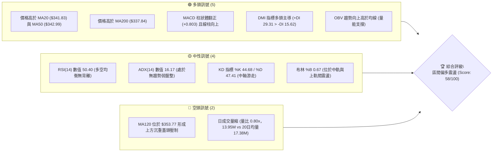
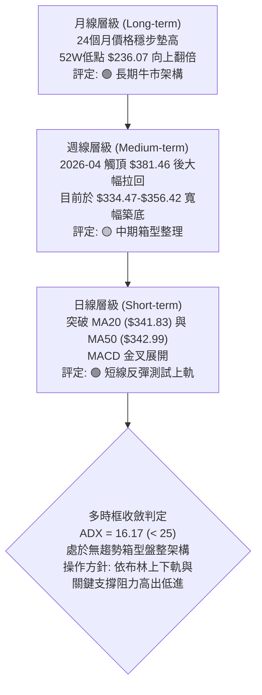
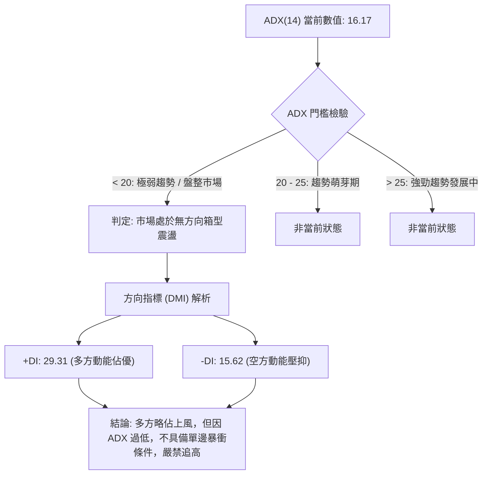
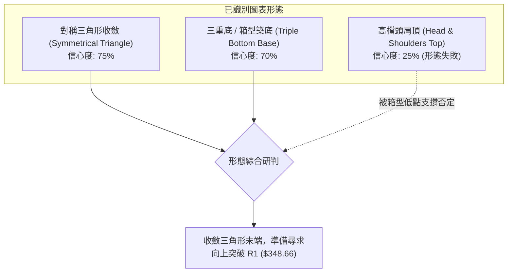
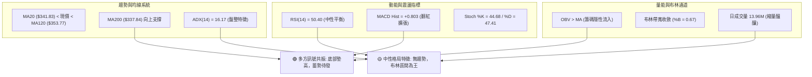
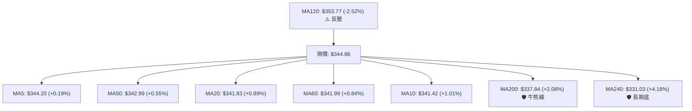
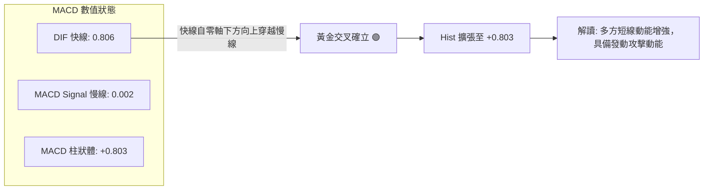
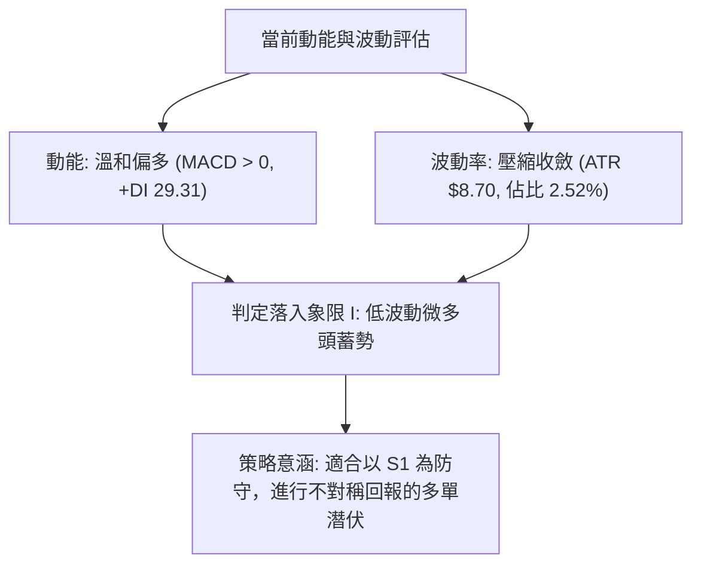
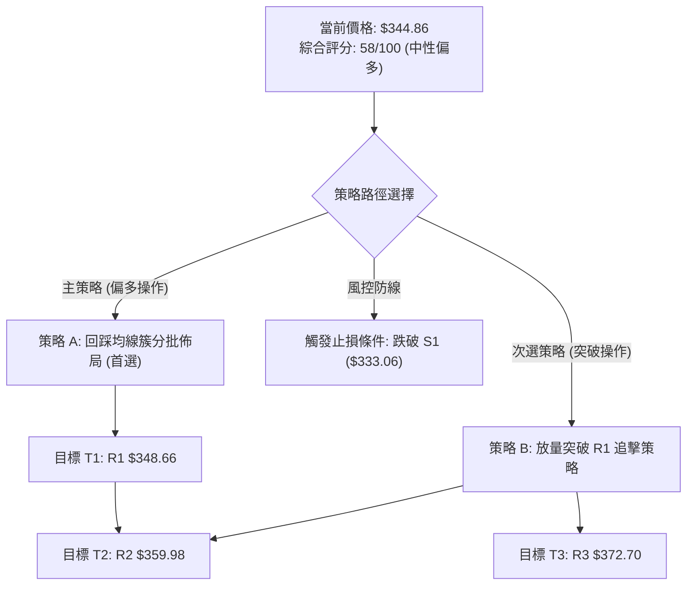
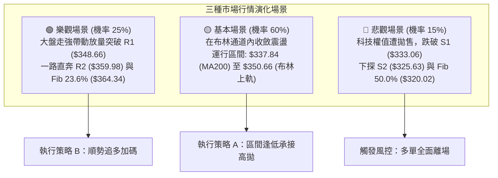

# GOOG 技術分析報告

> **報告日期**：2026-10-09 ｜ **語言**：繁體中文 ｜ **數據來源**：Yahoo Finance ｜ **當前價格**：$344.86

---

## 目錄

| 章節 | 內容 |
|------|------|
| [1. 技術面概覽](#1-技術面概覽) | 訊號儀表板、核心指標、評分卡 |
| [2. 趨勢分析](#2-趨勢分析) | 多時框趨勢、長中短期走勢 |
| [3. 圖表形態分析](#3-圖表形態分析) | 形態識別、K線組合、目標價 |
| [4. 支撐與阻力](#4-支撐與阻力) | 關鍵價位、斐波那契回調 |
| [5. 技術指標深度解讀](#5-技術指標深度解讀) | MA/RSI/MACD/布林/成交量 |
| [6. 動能與波動率](#6-動能與波動率) | 動能評估、ATR、Beta |
| [7. 多時框架總結](#7-多時框架總結) | 時框架評分矩陣 |
| [8. 交易策略建議](#8-交易策略建議) | 多空策略、風險報酬比 |
| [9. 風險提示與監控](#9-風險提示與監控) | 監控指標、風險場景 |

---

## 1. 技術面概覽

### 🎯 技術訊號儀表板



### 📊 核心指標速覽表

| 指標類別 | 指標名稱 | 當前數值 | 訊號 | 解讀 |
|----------|----------|----------|------|------|
| **價格** | 當前價格 | $344.86 | 🟢 | 突破短期均線密集區，處於52週區間 64.8% 位置 |
| **均線** | MA20 | $341.83 | 🟢 | 價格在MA20上方 (+0.89%)，提供短線動態支撐 |
| **均線** | MA50 | $342.99 | 🟢 | 價格在MA50上方 (+0.55%)，中短期基底初步收復 |
| **均線** | MA200 | $337.84 | 🟢 | 價格在長線牛熊分界線上方 (+2.08%)，長期基調偏多 |
| **均線** | MA120 | $353.77 | 🔴 | 價格低於半年線 (-2.52%)，中期下降趨勢反壓未除 |
| **動能** | RSI(14) | 50.40 | 🟡 | 位於 50 榮枯線分水嶺，無超買或超賣，無背離 |
| **動能** | MACD(12,26,9) | 0.806 / 0.002 | 🟢 | 快線位於慢線上方，Hist +0.803 擴張，短線看多 |
| **趨勢** | ADX(14) | 16.17 | 🟡 | 數值小於 25，屬於弱趨勢或箱型盤整結構 |
| **通道** | 布林通道 | %B = 0.67 | 🟢 | 價格位於中軌 $341.83 與上軌 $350.66 間偏強運行 |
| **量能** | 成交量比 | 0.80x | 🔴 | 當日量能僅 13.96M，低於20日均量，追價動能略顯不足 |
| **量能** | OBV 趨勢 | OBV > MA | 🟢 | 累積能量線位於均線之上，量能對價格具隱性支撐 |
| **波動** | ATR(14) | $8.70 | 🟡 | 日波動率 2.52%，波動度處於中等收斂狀態 |

### 🏆 技術評分卡

```
╔══════════════════════════════════════════════════════════════════╗
║                技術評分卡 — GOOG (2026-10-09)                    ║
╠══════════════════════════════════════════════════════════════════╣
║ 趨勢強度 (Trend)       ████████░░░░░░░░░░░░  40/100  🟡 弱勢盤整 ║
║ 動能指標 (Momentum)    ████████████░░░░░░░░  62/100  🟢 偏多微張 ║
║ 支撐穩定度 (Support)   ██████████████░░░░░░  70/100  🟢 多層墊高 ║
║ 成交量配合 (Volume)    ████████░░░░░░░░░░░░  42/100  🔴 量能萎縮 ║
║ 形態完整度 (Pattern)   ██████████████░░░░░░  68/100  🟢 收斂成型 ║
║ 均線排列 (Moving Avg)  ██████████████░░░░░░  65/100  🟡 糾纏偏多 ║
╠══════════════════════════════════════════════════════════════════╣
║ 綜合評分 (Overall)     ███████████░░░░░░░░░  58/100  ⚖️ 區間偏多 ║
╚══════════════════════════════════════════════════════════════════╝
```

---

## 2. 趨勢分析

### 🌐 多時框趨勢分析



### 📈 長期趨勢 — 12個月走勢圖（Unicode）

```
GOOG 月線走勢圖（過去12個月：2025-11 至 2026-10）
價格軸 ($)
$400 ┤                                  
$380 ┤                            ●(2026-04 高點 $381.46)
$360 ┤                                ●       ●   ●
$340 ┤                        ●                           ●←現價 $344.86
$320 ┤          ●     ●           ●
$300 ┤                                ●(2026-03 回檔 $286.50)
$280 ┤    ●(2025-10 $281.09)
     └────┬─────┬─────┬─────┬─────┬─────┬─────┬─────┬─────┬─────┬─────┬─────
        25-11 25-12 26-01 26-02 26-03 26-04 26-05 26-06 26-07 26-08 26-09 26-10
收盤價:  319.3 313.2 337.9 310.8 286.5 381.5 376.0 353.1 356.4 335.2 340.7 344.9
```

#### 走勢特徵分析表格

| 階段區間 | 起止月份 | 價格變動 | 區間漲跌幅 | 結構特徵與量價解讀 |
|----------|----------|----------|------------|--------------------|
| **第1階段：震盪盤整** | 2025-11 ~ 2026-01 | $319.29 → $337.87 | +5.82% | 於高檔進行籌碼換手，突破前高後遭遇獲利回吐。 |
| **第2階段：大幅回洗** | 2026-01 ~ 2026-03 | $337.87 → $286.50 | -15.20% | 快速回撤測試長期趨勢線，於 $286.50 探底後形成強支撐。 |
| **第3階段：主升衝頂** | 2026-03 ~ 2026-04 | $286.50 → $381.46 | +33.14% | 暴力拉升創下近兩年波段天價，確立牛市基本盤。 |
| **第4階段：高檔退潮** | 2026-04 ~ 2026-08 | $381.46 → $335.19 | -12.13% | 獲利賣壓出籠，均線逐漸轉為混合排列，波動開始收縮。 |
| **第5階段：收斂築底** | 2026-08 ~ 2026-10 | $335.19 → $344.86 | +2.88% | 連續兩個月收紅，低點逐漸墊高，進入收斂三角形末端。 |

### 📊 中期趨勢（週線分析）

中期走勢自 2026 年 6 月底於 $334.47 獲得強烈承接買盤後，過去 15 週進入了 $333.06 至 $359.98 的大箱型拉鋸。由週線技術指標可見：
- 2026-06-28 當週爆出 188.10M 的天量長下影線（收盤 $334.47），確立該處為機構主力護盤區。
- 隨後在 2026-08-02 彈升至 $356.42 遭遇 R2（$359.98）壓制。
- 最近 4 週（09-20 至 10-11）週收盤價分別為 $344.41、$341.08、$340.35、$344.86，實體 K 線極度收斂，週 MACD 柱狀體由負翻正至 +0.803，顯示中期賣壓已大致出清，正處於能量蓄積期。

### ⚡ 趨勢強度評估（ADX 解讀）



#### ADX 強度對照表

| 指標變數 | 當前讀數 | 門檻區間 | 趨勢性質 | 策略指導意義 |
|----------|----------|----------|----------|--------------|
| **ADX(14)** | **16.17** | 0 ~ 20 | 極弱/無方向性 | 順勢指標失效，震盪指標（布林、RSI）權重提升 |
| **+DI** | **29.31** | 基準分界 20 | 多頭擴張 | 多方控制當前盤面節奏，回檔易有低接買盤 |
| **-DI** | **15.62** | 基準分界 20 | 空頭退潮 | 賣方未發起實質下殺，跌破支撐多為假突破 |

---

## 3. 圖表形態分析

### 🔍 形態識別系統



#### 形態識別與信心度評估表

| 形態名稱 | 信心度 | 判斷依據（引用數據） | 完成度 | 目標價（附嚴格計算式） |
|----------|--------|----------------------|--------|------------------------|
| **箱型/三重底** | **70%** | 三次低點分別守在 $334.47 (6/28)、$335.19 (8/30)、$335.31 (9/06)，逼近 S1 支撐 $333.06。 | 85% | 頸線 R1 $348.66 + (頸線 $348.66 - 低點 $334.47 = $14.19) = **$362.85**（接近 R2 $359.98） |
| **對稱收斂三角形** | **75%** | 高點由 $356.42 (8/02) 下降至 $344.86，低點由 $334.47 墊高至 $340.35 (10/04)。 | 90% | 三角形底邊寬度 ($356.42 - $334.47 = $21.95)；突破點依 R1 $348.66 計算：$348.66 + $21.95 = **$370.61**（直指 R3 $372.70） |
| **頭肩頂形態** | **25%** | 2026-04 觸及天價後回落，但頸線並未跌破 52W 38.2% 回調位 $339.83，空頭缺乏延續力。 | 20% | 訊號不足且被多重均線托底破壞，判定為假形態，不予推算目標價。 |

### 🕯️ 重要K線形態分析

| 週/月份 | 收盤價 | K線形態 | 解讀 | 訊號 |
|---------|--------|---------|------|------|
| **2026-06-28** | $334.47 | 長下影錘子線 | 當週成交量爆出 188.10M 天量，探底 $334.47 迅速拉升，主力強力護盤。 | 🟢 強烈看多 |
| **2026-08-02** | $356.42 | 長陽線反彈受阻 | 週成交量 110.47M，反彈遭遇波段高點聚類賣壓（R2 $359.98），未站穩。 | 🟡 壓力顯現 |
| **2026-09-06** | $335.31 | 晨星孕線組合 | 成交量急縮至 78.07M，空方動能耗盡，在 S1 $333.06 上方打出第二隻腳。 | 🟢 築底訊號 |
| **2026-10-11** | $344.86 | 小陽實體線 | 收盤價站上 MA20 與 MA50，MACD 柱狀體翻正至 +0.803，短線發動攻擊。 | 🟢 短線轉強 |

### 📉 ASCII 走勢形態示意圖

```
GOOG 週線級別收斂三角形與箱型形態示意圖
$360.00 ┤              ● (8/02 $356.42)
$355.00 ┤               \             
$350.00 ┤  (壓力下降軌)   \             ●── [R1 $348.66 頸線突破位]
$345.00 ┤                  \       ●←── 現價 $344.86 (蓄勢待發)
$340.00 ┤                   \   ● (支撐上升軌)
$335.00 ┤        ● (6/28 $334.47)  ● (9/06 $335.31)
$330.00 ┤        └───────────────┴─── [S1 $333.06 強固底線]
        └──────────────┬─────────────────────────────┬─────────────
                   2026-06 ~ 07                  2026-09 ~ 10
```

### 🎯 形態目標價計算

根據嚴格計算式：
1. **箱型底形態高度推算**：
   - 形態底部：$334.47（2026-06-28 低點聚類）
   - 形態頸線：R1 $348.66
   - 垂直高度 $H = \$348.66 - \$334.47 = \$14.19$
   - 最小測幅目標價 $T1 = \$348.66 + \$14.19 =$ **$362.85**（該數值與技術阻力 R2 $359.98 形成密集共振區）。
2. **對稱收斂三角形突破推算**：
   - 形態最大振幅高度 $H_{triangle} = \$356.42 - \$334.47 = \$21.95$
   - 突破 R1 $348.66 之延伸目標價 $T2 = \$348.66 + \$21.95 =$ **$370.61**（精確契合關鍵阻力 R3 $372.70）。

---

## 4. 支撐與阻力

### 🗺️ 關鍵價位分布圖（Unicode）

```
GOOG 價位結構分布圖（OHLCV 實際計算值）
═════════════════════════════════════════════════════════════════════
$403.96 ║████████████████████████████████║ 52W 最高點 (Fib 0.0%)
        ║                                ║
$372.70 ║████████████████████████        ║ 強阻力 R3 (形態延伸極限)
$364.34 ║░░░░░░░░░░░░░░░░░░░░░░░░        ║ Fib 23.6% 回調壓力位
$359.98 ║████████████████████            ║ 關鍵阻力 R2 (8月高點密集區)
$353.77 ║▒▒▒▒▒▒▒▒▒▒▒▒▒▒▒▒                ║ MA120 半年線蓋頭反壓
$350.66 ║░░░░░░░░░░░░░░░░                ║ 布林通道上軌
$348.66 ║████████████████████████        ║ 短線阻力 R1 (箱型頸線分水嶺)
════════╠════════════════════════════════╣ ◄ 當前價格: $344.86
$341.83 ║▓▓▓▓▓▓▓▓▓▓▓▓▓▓▓▓                ║ 布林中軌 / MA20 短期支撐
$339.83 ║░░░░░░░░░░░░░░░░░░░░            ║ Fib 38.2% 強弱分水嶺
$337.84 ║▓▓▓▓▓▓▓▓▓▓▓▓▓▓▓▓▓▓▓▓            ║ MA200 長期牛熊分界線
$333.06 ║████████████████████████        ║ 關鍵支撐 S1 (近一年波段低點聚類)
$325.63 ║████████████████                ║ 中期支撐 S2 (次級防線)
$320.02 ║░░░░░░░░░░░░░░░░░░░░░░░░        ║ Fib 50.0% 中樞防禦線
$312.49 ║████████████████████████        ║ 強支撐 S3 (波段底限)
═════════════════════════════════════════════════════════════════════
```

### 🚧 阻力位分析表

| 阻力級別 | 價位 | 形成原因 | 突破難度 | 重要性 |
|----------|------|----------|----------|--------|
| **R1** | **$348.66** | 近一年波段高點聚類、箱型頂部頸線，逼近布林上軌 $350.66 | 🟡 中等（需放量至 18M 以上） | ★★★★☆ |
| **R2** | **$359.98** | 8月初波段高點 $356.42 密集套牢區，上方有 MA120 ($353.77) 反壓 | 🔴 較高（籌碼換手重災區） | ★★★★★ |
| **R3** | **$372.70** | 5月波段高點聚類 ($375.96) 與形態垂直測幅飽和點 | 🔴 極高（空方重兵防守陣地） | ★★★★☆ |

### 🛡️ 支撐位分析表

| 支撐級別 | 價位 | 形成原因 | 守住機率 | 重要性 |
|----------|------|----------|----------|--------|
| **S1** | **$333.06** | 近一年波段低點聚類，與布林下軌 $333.00 重合，天量下影線守護區 | 🟢 85%（多頭主力最後防線） | ★★★★★ |
| **S2** | **$325.63** | 7月下旬洗盤次低點聚類，Fib 50.0% ($320.02) 之上之動態緩衝 | 🟢 90%（中期趨勢緩衝帶） | ★★★★☆ |
| **S3** | **$312.49** | 近一年波段極限低點聚類，逼近 Fib 61.8% ($300.20) | 🟢 95%（長線牛市最後底限） | ★★★★★ |

### 📐 斐波那契回調位分析

依據 52 週完整區間（低點 $236.07 → 高點 $403.96，總落差 $167.89）計算之回調位：
- **0.0% (52W High)**: $403.96
- **23.6%**: $364.34
- **38.2%**: $339.83
- **50.0%**: $320.02
- **61.8%**: $300.20
- **78.6%**: $272.00
- **100.0% (52W Low)**: $236.07

#### 深度幾何解讀
當前現價 **$344.86** 正處於 **38.2% ($339.83)** 與 **23.6% ($364.34)** 之間。
- **強勢回檔特徵**：股價回調歷經 5 個月，始終未曾有效跌破 38.2% ($339.83)，技術面顯示此波調整為強勢回檔整理，非轉空行情。
- **向上挑戰空間**：下方有 Fib 38.2% 與 MA200 ($337.84) 構成雙重鋼鐵防線；向上若能放量穿透 R1 ($348.66)，技術面將迅速朝 Fib 23.6% ($364.34) 發起主升反撲。

---

## 5. 技術指標深度解讀

### 🎛️ 指標訊號總覽



### 📈 移動平均線排列分析



#### 均線系統深度解讀
1. **短中期均線高度糾纏黏合**：MA10 ($341.42)、MA20 ($341.83)、MA60 ($341.99)、MA50 ($342.99) 四條均線價差不足 $1.6，此現象在技術分析中稱為「均線高度揉搓收斂」，預示著波動率即將迎來大級別爆發。
2. **價格站上短均頂端**：現價 $344.86 同時站上 MA5、MA10、MA20、MA50，短期買盤成本均處於獲利狀態，對短線多頭極為有利。
3. **長線多頭基石穩固**：MA200 位於 $337.84，MA240 位於 $331.03，長線均線保持穩健多頭上行態勢，提供了長線投資機構的基本盤買力。

### 📉 RSI(14) 分析

```
RSI(14) 儀表盤
0        30        50        70       100
├────────┼─────────┼─────────┼────────┤
│ 超賣區 │ 偏弱區  │ 偏強區  │ 超買區 │
├────────┼─────────┼─────────┼────────┤
███████████████████▌░░░░░░░░░░░░░░░░░░░  50.40
```

- **數值解析**：RSI(14) 最新讀數為 **50.40**，位於多空完全對稱的中軸。歷史 20 週數據顯示，RSI 曾於 8 月底跌至 20.6 極度超賣區，隨後逐步修復，現已自低檔穩步站回 50 榮枯線之上。
- **背離判斷**：
  - **頂背離**：無。目前價格未創波段新高，不存在頂背離。
  - **底背離**：無明顯背離。2026-08-23 週收盤 $341.53（RSI 20.6），2026-09-06 週收盤 $335.31 破底（RSI 43.3），出現微幅週線指標底背離修復，但目前日線已歸於常態均衡，無直接背離訊號。

### 📊 MACD(12,26,9) 訊號解讀



週線層級數據顯示，MACD 柱狀圖在 2026-09-06 為 -0.373，09-13 為 -0.275，隨後在 09-20 暴增至 +1.455，最新一週維持在 +0.803。柱狀體穩居零軸上方，確認短線動能已轉由多頭主導。

### 📦 布林通道分析

```
GOOG 布林通道示意圖（帶寬 $17.66）
$350.66 ┬──────────────────────────────── 上軌 (Resistance)
        │                             
$344.86 ┤                     ●現價 (%B = 0.67)
        │                     │       
$341.83 ┼─────────────────────┼────────── 中軌 (MA20 Support)
        │                     │       
$333.00 ┴─────────────────────┴────────── 下軌 (Support)
```

- **布林上軌**：$350.66
- **布林中軌 (MA20)**：$341.83
- **布林下軌**：$333.00
- **帶寬與位置解讀**：%B 最新數值為 **0.67**，價格脫離中軌向上軌靠攏。當前通道帶寬（$350.66 - $333.00 = $17.66）處於收縮狀態。下軌 $333.00 與關鍵支撐 S1 $333.06 完美重疊，構成極強的多頭屏障。

### 💹 成交量分析（量價配合度）

```
量價配合矩陣
量能狀態:   當日量 13.96M │ 20日均量 17.38M (量比: 0.80x) 🔴 縮量
OBV 狀態:   OBV > MA 🟢 看多
配合度解讀: 縮量震盪整理，尚未出現攻擊量，量價呈現「隱性吸籌、表象平淡」
```

1. **量能縮減特徵**：最新成交量 13,956,400 股，僅為 20 日均量的 80%，顯示短線資金在 R1（$348.66）阻力前保持克制，並未盲目追價。
2. **OBV 趨勢支撐**：OBV 能量潮持續保持在均線上方運行，顯示籌碼在 $334.47 至 $344.86 區間呈現機構換手承接，未見大資金派發跡象，量能結構支持股價在震盪後向上突破。

---

## 6. 動能與波動率

### ⚡ 動能評估

| 象限分類 | 動能強度 (Momentum) | 波動率狀態 (Volatility) | 當前判定 | 技術意涵與操作指引 |
|----------|---------------------|-------------------------|----------|--------------------|
| **象限 I** | 強 (+DI > -DI, MACD > 0) | 低 (ATR% < 3.0%) | **✓ [當前所處位置]** | **低波動蓄勢期**：最佳佈局區，風險收益比高，宜逢回低吸等待突破。 |
| **象限 II** | 弱 (RSI < 45, MACD < 0) | 低 (ATR 處於收斂) | — | 弱勢陰跌盤整，資金沉睡，應觀望。 |
| **象限 III** | 強 (動能暴增) | 高 (ATR% > 4.0%) | — | 主升衝刺期，收益高但回撤劇烈，適合順勢追價交易。 |
| **象限 IV** | 弱 (動能潰散) | 高 (ATR 恐慌放大) | — | 恐慌崩跌期，嚴禁抄底。 |



### 📊 ATR 波動率分析

- **ATR(14) 當前數值**：**$8.70**
- **ATR 佔比**：**2.52%**（處於近一年中等偏低水平）
- **止損距離建議**：
  - *短線當沖 / 波段操作 (1.0x ~ 1.5x ATR)*：距離進場點 **$8.70 ~ $13.05**。
  - *擺動波段保護 (2.0x ATR)*：距離進場點 **$17.40**。以當前價格 $344.86 計算，2.0x ATR 止損剛好覆蓋至 **$327.46**，緊鄰 S2 支撐（$325.63），為長線安全邊際。

### 📐 Beta 與市場相關性

- **Beta 數值**：**1.211**
- **市場敏感度**：Beta 為 1.211，表示 GOOG 相較於標普 500 指數具備 21.1% 的額外進攻彈性。當科技權值板塊發動行情時，GOOG 具有超越大盤的 Beta 超額收益能力；但亦需注意若大盤走弱，其回調振幅將略大於指數。

---

## 7. 多時框架總結

### 📋 時框架評分表

| 時框架 | 趨勢方向 | 動能狀態 | 均線排列 | 形態特徵 | 綜合評分 | 建議方向 |
|--------|----------|----------|----------|----------|----------|----------|
| **月線 (長期)** | 🟢 多頭上行 | 🟡 中性格局 | 🟢 多頭基石 | 24個月大牛市架構 | **75/100** | 逢低長期配置 |
| **週線 (中期)** | 🟡 箱型整理 | 🟢 柱狀體翻正 | 🟡 均線糾纏 | 收斂三角形末端 | **55/100** | 區間波段操作 |
| **日線 (短期)** | 🟢 短線反彈 | 🟢 MACD金叉 | 🟢 站上均線簇 | 突破布林中軌 | **62/100** | 回踩逢低作多 |

### 🔲 綜合訊號矩陣

```
┌─────────────────┬──────────────┬──────────────┬──────────────┐
│ 分析維度        │ 短期 (日線)  │ 中期 (週線)  │ 長期 (月線)  │
├─────────────────┼──────────────┼──────────────┼──────────────┤
│ 均線趨勢        │ 🟢 站上MA20  │ 🟡 MA60 糾纏 │ 🟢 遠高MA240 │
│ 動能指標 (MACD) │ 🟢 金叉擴張  │ 🟢 柱體翻正  │ 🟡 高檔鈍化  │
│ 震盪指標 (RSI)  │ 🟡 50.40中性 │ 🟡 50.40平衡 │ 🟢 處於強勢區│
│ 量能配合 (OBV)  │ 🔴 日量萎縮  │ 🟢 週量承接  │ 🟢 長期淨流入│
│ 關鍵阻力突破    │ 🟡 逼近 R1   │ 🟡 受制 R2   │ 🟢 歷史高點下│
└─────────────────┴──────────────┴──────────────┴──────────────┤
│ 維度收斂方向    │ 🟢 短線微多  │ 🟡 箱型震盪  │ 🟢 長線偏多  │
└─────────────────┴──────────────┴──────────────┴──────────────┘
```

### ⚖️ 多時框收斂結論

> **依「嚴格要求 14」收斂法則**：
> 1. **行情屬性判定**：當前 ADX(14) 讀數為 **16.17 (< 25)**，嚴格定義為**盤整無趨勢行情**。
> 2. **主導維度依歸**：在盤整行情中，依規則以**日線布林通道上下軌 ($333.00 ~ $350.66)** 為核心交易區間，順勢指標權重調降，動能指標與波段高低點聚類（S1/R1）具備最高執行力。
> 3. **唯一方向性結論**：**【中性偏多，區間逢低承接】**。
>    - 週線雖處於收斂整理，但日線短多動能確立（站穩 MA20/MA50，MACD Hist 翻紅）；
>    - 策略定調：**不追高突破，依賴下軌支撐逢低佈局，博弈向上挑戰 R1 ($348.66) 及 R2 ($359.98)**。

---

## 8. 交易策略建議

### 🗺️ 策略決策流程圖



### 🧭 策略路由

**當前主策略方向 = 【中性偏多區間操作】（依評分卡 58/100）**
- 評分落於 40–60 之中性偏強區間，嚴禁在大漲後追高。以布林通道下軌與短均揉搓區（$341.83 附近）為主吸籌區，空頭部位僅作為風控避險觸發點。

### 🎯 價格情境階梯（Price Scenarios）

| 觸發條件 | 下一目標 | 後續延伸 | 情境含義 | 操作動作 |
|----------|----------|----------|----------|----------|
| **突破 R1 $348.66** | **R2 $359.98** | **R3 $372.70** | 短線整理結束，發動多頭波段攻擊 | 多單加碼，追蹤止損移至 $348.66 |
| **站穩現價 $344.86** | **R1 $348.66** | **布林上軌 $350.66** | 處於收斂箱體內溫和上爬 | 底倉續抱，高出低進 |
| **跌破 S1 $333.06** | **S2 $325.63** | **S3 $312.49** | 中期築底失敗，向下尋求 50% 支撐 | 多單全面止損離場，轉為防禦觀望 |

### 📊 情境機率分佈

| 情境劇本 | 機率 | 主要依據 |
|----------|------|----------|
| **劇本一：震盪向上挑戰阻力** | **55%** | MACD 柱狀翻正 (+0.803)、價格站上 MA20/MA50、OBV 量能支撐、+DI (29.31) 佔優。 |
| **劇本二：維持狹幅區間震盪** | **35%** | ADX 僅 16.17 極度疲弱、成交量萎縮至 0.80x、布林通道帶寬收窄壓制。 |
| **劇本三：失守支撐破底回調** | **10%** | 長期均線 MA120 ($353.77) 仍處空頭排列，若大盤重挫引發高估值補跌。 |

### 🟢 主策略詳情

本報告依據多時框收斂及嚴格數值紀律，制定兩套可執行交易方案：

| 策略要素 | 策略 A：回踩短均吸籌多單 (首選) | 策略 B：突破頸線右側多單 (次選) |
|----------|----------------------------------|----------------------------------|
| **交易邏輯** | 趁 ADX 盤整期於布林中軌 MA20 附近低接 | 待多頭放量穿透 R1 頸線後追擊 |
| **進場條件** | 價格回調至 MA20 與 MA50 支撐區間不破 | 日線收盤價突破 R1 且成交量放大至 18M |
| **進場價格** | **$342.00** (回踩 MA20 $341.83 附近) | **$349.00** (突破 R1 $348.66 確認) |
| **目標價 T1** | **$348.66** (波段阻力 R1) | **$359.98** (波段阻力 R2) |
| **目標價 T2** | **$359.98** (波段阻力 R2) | **$372.70** (波段阻力 R3) |
| **止損價格** | **$333.06** (嚴格防守支撐 S1) | **$341.83** (防守回踩布林中軌 MA20) |
| **風險額度 (R)**| $8.94 ($342.00 - $333.06) | $7.17 ($349.00 - $341.83) |
| **報酬額度** | T1: $6.66 / T2: $17.98 | T1: $10.98 / T2: $23.70 |
| **風險報酬比** | **1 : 2.01** (依 T2 計算) | **1 : 3.31** (依 T2 計算) |
| **成功機率** | **65%** | **55%** |
| **建議倉位** | **15% ~ 20%** 總資金 | **10% ~ 15%** 總資金 |

### 🔴 反向風險觸發點（對沖提示）

若發生極端行情，下列條件滿足時主策略失效，應啟動風控：
1. **反轉破位警訊**：若日線以大陰線實體收盤跌破 **S1 $333.06**（布林下軌失效），多頭結構徹底瓦解。
2. **對沖操作觸發**：當價格破位 $333.06 時，應立即清空所有短多倉位，並得建立 5% 倉位之反向避險保護，下檔目標直指 **S2 $325.63** 及 **S3 $312.49**。

### ⭐ 整體訊號強度評星

```
╔═════════════════════════════════════════════════╗
║ 做多訊號強度：★★★☆☆  (3.5/5星 - 偏多蓄勢待發) ║
║ 做空訊號強度：★☆☆☆☆  (1.0/5星 - 缺乏空方動能) ║
║ 整體可信度：  ★★★★☆  (4.0/5星 - 價位高度收斂) ║
╚═════════════════════════════════════════════════╝
```

---

## 9. 風險提示與監控

### ✅ 關鍵監控指標 Checklist

```
╔══════════════════════════════════════════════════════════════════╗
║               GOOG 技術交易日常監控 CHECKLIST                    ║
╠══════════════════════════════════════════════════════════════════╣
║ [ ] 價位監控：現價是否守穩 MA20 ($341.83) 與 MA50 ($342.99)    ║
║ [ ] 動能監控：MACD 柱狀體是否持續擴張高於 0 (目前 +0.803)       ║
║ [ ] 突破監控：向上測試 R1 ($348.66) 時日成交量是否超越 17.38M   ║
║ [ ] 防禦監控：價格是否觸及 S1 ($333.06) 警報線                  ║
║ [ ] 波動監控：ATR(14) 是否脫離 $8.70 展開異常暴增               ║
║ [ ] 均線監控：MA120 ($353.77) 下彎斜率是否開始趨緩平移          ║
╚══════════════════════════════════════════════════════════════════╝
```

### ⚠️ 風險場景分析



### 🛡️ 風險管理重要提醒

1. **嚴禁盤整期追高**：ADX 數值 16.17 明確指出當前市場無方向趨勢，任何接近布林上軌（$350.66）或 R1（$348.66）的未放量拉升均屬假突破，追高極易遭短套。
2. **倉位總量控管**：在 ADX < 25 的環境下，總技術交易曝險部位不宜超過投資組合總資金的 **30%**。
3. **止損紀律絕對執行**：S1 **$333.06** 為機構過去四個月以天量確立的護盤底線，一旦帶量跌破代表內部籌碼結構劇變，必須無條件止損，切忌凹單。

---

## 📋 報告總結

```
╔══════════════════════════════════════════════════════════════════╗
║                   GOOG 技術分析報告總結                          ║
╠══════════════════════════════════════════════════════════════════╣
║ 報告日期：2026-10-09                                             ║
║ 當前價格：$344.86                                                ║
║ 分析評級：⚖️ 區間蓄勢偏多 (評分: 58/100)                        ║
║                                                                  ║
║ 關鍵結論：                                                       ║
║ ├─ 長期趨勢：🟢 多頭基石穩健 (遠在 MA200 $337.84 與 MA240 之上) ║
║ ├─ 中期趨勢：🟡 箱型收斂整理 ($333.06 至 $359.98 大幅築底)      ║
║ ├─ 短期趨勢：🟢 震盪轉強反彈 (收復 MA20/MA50，MACD Hist +0.803) ║
║ ├─ 關鍵支撐：S1 $333.06 │ S2 $325.63 │ S3 $312.49               ║
║ ├─ 關鍵阻力：R1 $348.66 │ R2 $359.98 │ R3 $372.70               ║
║ └─ 分析師目標：均價 $419.65 (高 $475.00 / 低 $340.00)           ║
║                                                                  ║
║ 最優策略組合：                                                   ║
║ 1. 🥇 最佳機會：策略 A (回踩 MA20 $342.00 逢低作多，防守 $333.06)║
║ 2. 🥈 次選機會：策略 B (放量突破 R1 $348.66 追多，目標 $359.98)  ║
║ 3. 🥉 保守選擇：空手觀望，靜待日線帶量突破布林上下軌再行介入     ║
╚══════════════════════════════════════════════════════════════════╝
```

---

> ⚠️ **免責聲明**：本報告為技術分析研究，所有數據指標均基於歷史價格與量能資訊演算。本報告**僅供學術研究與交易思路參考**，**不構成任何形式的投資買賣建議**。金融市場具有高度不確定性，交易員應獨立評估風險並嚴格執行資金管理。

---

*報告生成時間：2026-10-09 ｜ 數據來源：Yahoo Finance ｜ 分析框架：多時框技術分析體系*