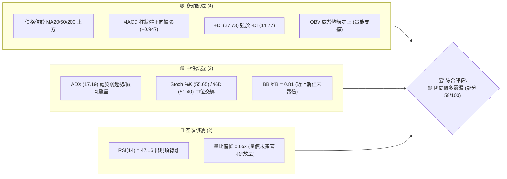
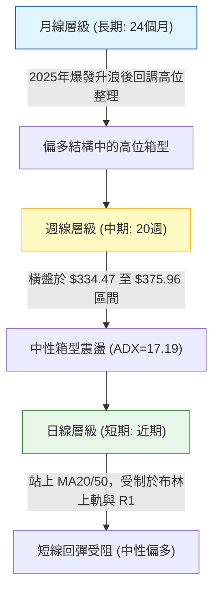
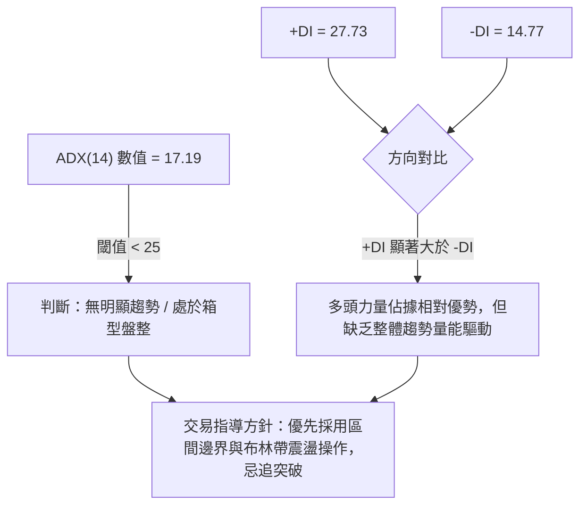
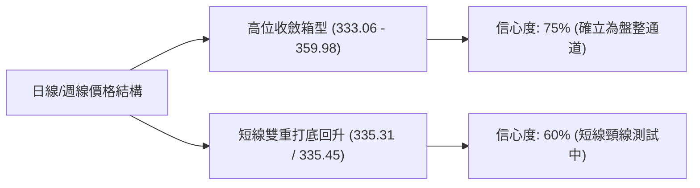
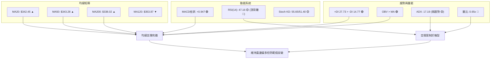
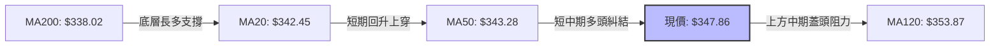
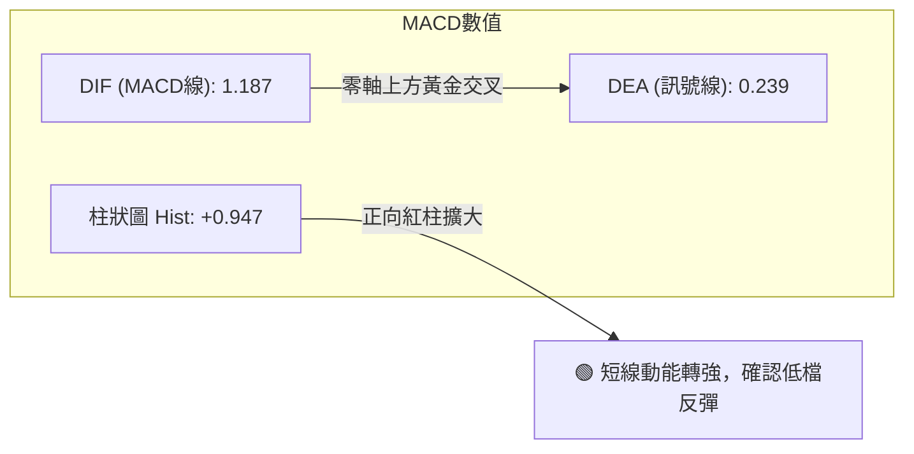
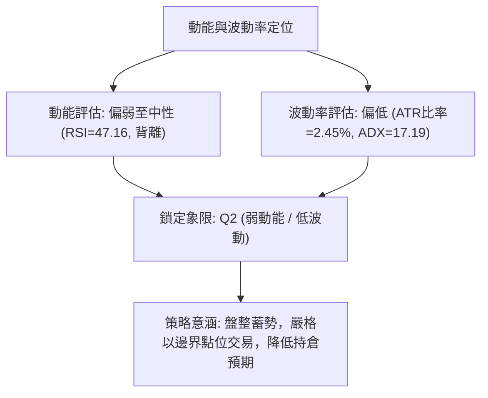
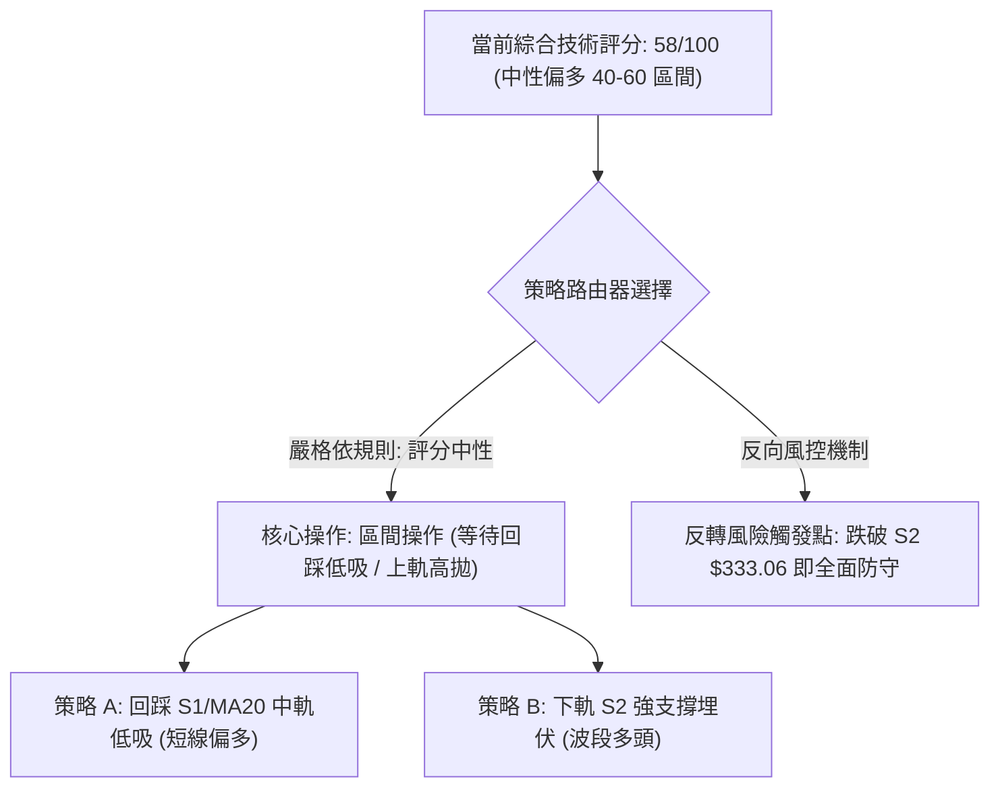
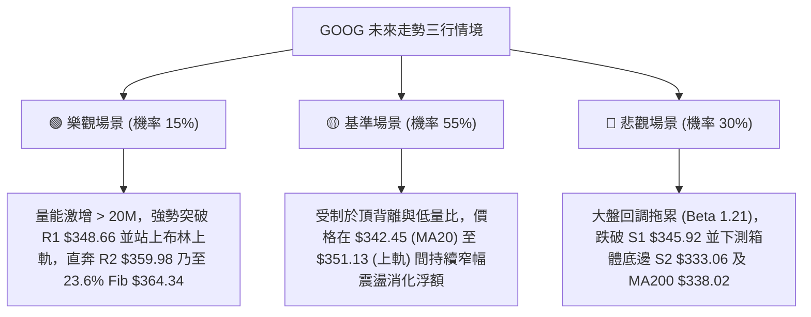

# GOOG 技術分析報告

> **報告日期**：2026-10-10 ｜ **語言**：繁體中文 ｜ **數據來源**：Yahoo Finance ｜ **當前價格**：$347.86

---

## 目錄

| 章節 | 內容 |
|------|------|
| [1. 技術面概覽](#1-技術面概覽) | 訊號儀表板、核心指標、評分卡 |
| [2. 趨勢分析](#2-趨勢分析) | 多時框趨勢、長中短期走勢 |
| [3. 圖表形態分析](#3-圖表形態分析) | 形態識別、K線組合、目標價 |
| [4. 支撐與阻力](#4-支撐與阻力) | 關鍵價位、斐波那契回調 |
| [5. 技術指標深度解讀](#5-技術指標深度解讀) | MA/RSI/MACD/布林/成交量 |
| [6. 動能與波動率](#6-動能與波動率) | 動能評估、ATR、Beta |
| [7. 多時框架總結](#7-多時框架總結) | 時框架評分矩陣 |
| [8. 交易策略建議](#8-交易策略建議) | 多空策略、風險報酬比 |
| [9. 風險提示與監控](#9-風險提示與監控) | 監控指標、風險場景 |
| [📋 報告總結](#-報告總結) | 核心總結與全景評級 |

---

## 1. 技術面概覽

### 🎯 技術訊號儀表板



### 📊 核心指標速覽表

| 指標類別 | 指標名稱 | 當前數值 | 訊號 | 解讀 |
|----------|----------|----------|------|------|
| **價格** | 當前價格 | $347.86 | 🟢 | 位於52週區間66.6%分位，穩居主要均線之上 |
| **均線** | MA20 | $342.45 | 🟢 | 價格高於 MA20 達 +1.58%，短線下檔具備支撐 |
| **均線** | MA50 | $343.28 | 🟢 | 價格高於 MA50 達 +1.33%，中期走勢持穩偏多 |
| **均線** | MA200 | $338.02 | 🟢 | 價格高於長期牛熊分界線 +2.91%，長多結構未破 |
| **動能** | RSI(14) | 47.16 | 🔴 | 數值處於中性區間但標注頂背離，短線追高動能不足 |
| **動能** | MACD | 1.187 / 0.239 | 🟢 | 柱狀圖為 +0.947 且位於零軸上方，偏多發散 |
| **動能** | Stoch %K/%D | 55.65 / 51.40 | 🟡 | KD 指標於中軸交纏，無超買超賣極端讀數 |
| **趨勢** | ADX(14) | 17.19 | 🟡 | 數值低於 25，明確定義當前處於無趨勢或盤整市 |
| **通道** | 布林通道 | 351.13 / 333.76 | 🟡 | %B 為 0.81，運行於中軌與上軌間，受制於上軌阻力 |
| **量能** | 當日量比 | 0.65x (11.13M) | 🟡 | 成交量萎縮至均量以下，上攻動能缺乏大資金確認 |
| **波動** | ATR(14) | $8.51 (2.45%) | 🟡 | 波動率適中，單日震盪幅度控制在常態區間 |

### 🏆 技術評分卡

```
╔══════════════════════════════════════════════════════════════╗
║              技術評分卡 — GOOG (2026-10-10)                 ║
╠══════════════════════════════════════════════════════════════╣
║ 趨勢強度 (ADX/方向)   ███████░░░░░░░░░░░░░  35/100  🔴 弱趨勢 ║
║ 動能指標 (MACD/RSI)   ███████████░░░░░░░░░  55/100  🟡 背離制約║
║ 支撐穩定度 (S1-S3)    ███████████████░░░░░  75/100  🟢 底層扎實║
║ 成交量配合 (OBV/Vol)  ████████████░░░░░░░░  60/100  🟡 量縮支撐║
║ 形態完整度 (區間整理) ████████████░░░░░░░░  60/100  🟡 箱型收斂║
║ 均線排列 (MA混合)     █████████████░░░░░░░  65/100  🟢 價格居上║
╠══════════════════════════════════════════════════════════════╣
║ 綜合技術評分          ███████████░░░░░░░░░  58/100  🟡 區間偏多║
╚══════════════════════════════════════════════════════════════╝
```

---

## 2. 趨勢分析

### 🌐 多時框趨勢分析



### 📈 長期趨勢 — 12個月走勢圖（Unicode）

```
GOOG 月線收盤走勢圖（2025-11 至 2026-10）
價格軸 ($)
$390 ┤                                      
$380 ┤                                  ● $381.46 (2026-04 高點)
$370 ┤                                      ● $375.96
$350 ┤                                          ● $353.10  ● $356.42
$340 ┤                          ● $337.87                       ● $340.74  ● $347.86 (現在)
$330 ┤                                                              ● $335.19
$320 ┤      ● $319.29
$310 ┤          ● $313.19           ● $310.82
$290 ┤                                  ● $286.50
$280 ┤  ● $281.09
     └──────────────────────────────────────────────────────────────────────────
       25-10  25-11  25-12  26-01  26-02  26-03  26-04  26-05  26-06  26-07  26-08  26-09  26-10
```

#### 走勢特徵分析表格

| 階段區間 | 時間跨度 | 起訖收盤價 | 漲跌幅 | 結構特徵與成因 |
|----------|----------|------------|--------|----------------|
| 主升推進期 | 2025-10 ~ 2026-01 | $281.09 → $337.87 | +20.20% | 業績成長與 AI 題材驅動，均線維持強勢多頭發散排列 |
| 中繼洗盤期 | 2026-01 ~ 2026-03 | $337.87 → $286.50 | -15.20% | 短線獲利了結與宏觀估值壓縮，回踩至波段重要支撐區 |
| 脈衝破高期 | 2026-03 ~ 2026-04 | $286.50 → $381.46 | +33.14% | 財報強勁與獲利成長激增，創下 52 週高點 $403.96 影線區間 |
| 高位箱型期 | 2026-05 ~ 2026-10 | $375.96 → $347.86 | -7.47%  | 動能衰竭轉入大箱型整理，價格在 $335 - $375 間築底震盪 |

### 📊 中期趨勢（週線分析）

從近 20 週收盤走勢可見，價格在 2026-07-26 探底收在 $318.88 後迅速強彈，隨後在 8 月至 10 月期間收盤價維持在 $335.31 至 $356.42 之間。
- **中期支撐帶**：週線級別雙重支撐座落於 $334.47 - $335.31（亦即日線 S2 區域 $333.06）。
- **中期壓力帶**：8 月初回彈高點收盤價 $356.42 及日線波段高點阻力 R2 $359.98。

```
週線區間震盪示意圖：
$360.00 ───────────────────────────── 週線阻力帶 (~$356.42 - $359.98)
           ▲                 ▲
          ╱ ╲               ╱ ╲
         ╱   ╲             ╱   ╲      現在: $347.86
        ╱     ╲     ▲     ╱     ╲    ╱
───────╱───────╲───╱─╲───╱───────╲──╱────── 中軸線 (~$345.90)
      ╱         ╲ ╱   ╲ ╱         ╲╱
     ▼           ▼     ▼
$330.00 ───────────────────────────── 週線支撐帶 (~$334.47 - $335.31)
```

### ⚡ 趨勢強度評估（ADX 解讀）



| 指標名稱 | 讀數 | 門檻區間 | 趨勢狀態 | 操作指導 |
|----------|------|----------|----------|----------|
| **ADX(14)** | 17.19 | < 20 (極弱趨勢) | 橫盤箱型震盪 | 禁用順勢突破追單，以支撐阻力高出低進為主 |
| **+DI** | 27.73 | > 25 (偏強) | 多方力量佔優 | 震盪區間內拉回支撐可視為做多窗口 |
| **-DI** | 14.77 | < 20 (偏弱) | 空方打壓動能不足 | 回檔幅度受限，不易出現崩跌破位走勢 |

---

## 3. 圖表形態分析

### 🔍 形態識別系統



#### 圖表形態信心度分析表（依嚴格要求 15 規範）

| 形態名稱 | 信心度 | 判斷依據（引用數據） | 完成度 | 目標價（附計算式） |
|----------|--------|----------------------|--------|--------------------|
| **高位整理箱型** | 75% | 8-10月價格受制於 R2 $359.98，下檔於 S2 $333.06 多次獲支撐 | 85% | 依箱型高度推算向上突破目標：頸線 R2 $359.98 + (R2 $359.98 - S2 $333.06 = $26.92) = **$386.90**（數據無直接聚類，僅為幾何推算） |
| **微型雙重底 (W底)** | 60% | 9月兩次回調低點分別收在 $335.31 (09-06) 與 $335.45 (09-13)，形成雙底底點 | 70% | 頸線為 09-20 高點收盤 $344.41，已站上。目標價 = $344.41 + ($344.41 - $335.31 = $9.10) = **$353.51**（接近當前布林上軌 $351.13） |
| **頭肩頂形態** | 25% | 雖 4 月見高後回落，但右側未出現跌破頸線 $318.88 之趨勢，結構不完整 | 15% | 數據不足以支撐幾何頭肩頂，訊號不足，僅做指標型解讀 |

### 🕯️ 重要K線形態分析

| 週期/月份 | 收盤價 | K線形態 | 解讀 | 訊號 |
|-----------|--------|---------|------|------|
| **2026-04** | $381.46 | 長陽衝高影線 | 創 52W 高點 $403.96 後引發大量獲利了結，留下長上影線 | 🟡 警惕高位拋壓 |
| **2026-07-26 (週)** | $318.88 | 長下影錘子線 | 測試 $320.02 (50%回調位) 獲強勁低接買盤收復，確認底部區域 | 🟢 強支撐探底回升 |
| **2026-09-13 (週)** | $335.45 | 縮量十字星 | 量能降至 65.71M，在 $335.31 附近形成雙底次低點，拋壓耗竭 | 🟢 築底確認 |
| **2026-10-11 (週)** | $347.86 | 溫和中陽線 | 向上收復 MA20 與 MA50，MACD 柱狀體翻正，多方奪回主動權 | 🟢 短線多頭發動 |

### 📉 ASCII 走勢形態示意圖

```
GOOG 近三個月日/週線整理結構示意圖：

$360.00 ┤                     [R2: $359.98] ─── 箱型頂部阻力
         │           ╭─╮
$355.00 ┤   ╭─╮     │ │
         │   │ │     │ │             ╭─現價 $347.86
$348.00 ┤───┼─┼─────┼─┼─────────────●─────── [R1: $348.66]
         │   │ │ ╭─╮ │ │     ╭─╮   ╭─╯
$342.00 ┤   │ │ │ │ │ │     │ │ ╭─╯          [MA20: $342.45 / MA50: $343.28]
         │   │ ╰─╯ │ │ ╰─╮   │ ╰─╯
$335.00 ┤───╯     ╰─╯   ╰───╯──────────────── [S2: $333.06 / 雙底點 ~$335.31]
         │       底點1       底點2
$325.00 ┤                                      [S3: $325.63]
```

### 🎯 形態目標價計算

1. **短線微型雙底目標價**：
   - 形態底部低點：$335.31 (2026-09-06 週收盤)
   - 形態頸線位置：$344.41 (2026-09-20 週收盤)
   - 形態垂直高度：$344.41 - $335.31 = $9.10
   - 理論量度目標：$344.41 + $9.10 = **$353.51**（已高度契合布林通道上軌 $351.13 與波段阻力 R2 $359.98 間的過渡區）。

2. **中繼高位箱型突破推算**：
   - 箱體下邊界 (S2)：$333.06
   - 箱體上邊界 (R2)：$359.98
   - 箱體震盪幅度：$359.98 - $333.06 = $26.92
   - 理論量度突破目標：$359.98 + $26.92 = **$386.90**。

---

## 4. 支撐與阻力

### 🗺️ 關鍵價位分布圖（Unicode）

```
GOOG 價位結構分布圖（引用 OHLCV 計算聚類價位）
═══════════════════════════════════════════════════════════════════
$403.96 ║████████████████████████████████████████║ 52週歷史高點 / 0.0% Fib
$372.70 ║████████████████████████                ║ 強阻力 R3
$364.34 ║▓▓▓▓▓▓▓▓▓▓▓▓▓▓▓▓▓▓▓▓                    ║ 斐波那契 23.6% 回調位
$359.98 ║████████████████████                    ║ 阻力 R2 (箱型頂部)
$351.13 ║░░░░░░░░░░░░░░░░░░                      ║ 布林通道上軌
$348.66 ║████████████████████████████            ║ 關鍵即時阻力 R1 (+0.23%)
$347.86 ╠════════════════════════════════════════╣ ◄ 當前市價 ($347.86)
$345.92 ║▓▓▓▓▓▓▓▓▓▓▓▓▓▓▓▓▓▓▓▓                    ║ 即時支撐 S1 (-0.56%)
$342.45 ║░░░░░░░░░░░░░░                          ║ 布林中軌 / MA20
$339.83 ║▓▓▓▓▓▓▓▓▓▓▓▓▓▓▓▓                        ║ 斐波那契 38.2% 回調位
$333.06 ║████████████████████████████            ║ 關鍵強支撐 S2 (-4.25%)
$325.63 ║████████████████                        ║ 防守強支撐 S3 (-6.39%)
$320.02 ║▓▓▓▓▓▓▓▓▓▓▓▓▓▓▓▓▓▓▓▓▓▓▓▓                ║ 斐波那契 50.0% 回調位
═══════════════════════════════════════════════════════════════════
```

### 🚧 阻力位分析表

所有阻力數據嚴格取自數據庫中波段高點聚類：

| 阻力級別 | 價位 | 與現價距離 | 形成原因與技術意涵 | 突破難度 | 重要性 |
|----------|------|------------|--------------------|----------|--------|
| **R1** | **$348.66** | +0.23% | 近期日線密集高點聚類，與布林上軌 $351.13 構成緊密阻力帶 | 🟡 中等 | ★★★★☆ |
| **R2** | **$359.98** | +3.48% | 近期波段衝高頂點聚類，高位箱型整理頂部，多次承壓回落 | 🔴 較高 | ★★★★★ |
| **R3** | **$372.70** | +7.14% | 5-6月反彈高點聚類區，中長期空頭強防守區間 | 🔴 極高 | ★★★★☆ |

### 🛡️ 支撐位分析表

所有支撐數據嚴格取自數據庫中波段低點聚類：

| 支撐級別 | 價位 | 與現價距離 | 形成原因與技術意涵 | 守住機率 | 重要性 |
|----------|------|------------|--------------------|----------|--------|
| **S1** | **$345.92** | -0.56% | 日線波段低點聚類，緊鄰 MA5 (345.70)，短線多空分水嶺 | 70% | ★★★☆☆ |
| **S2** | **$333.06** | -4.25% | 近期主要波段底部支撐聚類，布林下軌 $333.76 共振區 | 85% | ★★★★★ |
| **S3** | **$325.63** | -6.39% | 7月下旬洗盤防守區間聚類，中期牛市底線位置 | 92% | ★★★★☆ |

### 📐 斐波那契回調位分析

依據 52 週波動極值（低點 $236.07 至 高點 $403.96，波幅 $167.89）計算之精確回調位：

| 斐波那契層級 | 精確價位 | 相對現價位置 | 技術意義解讀 |
|--------------|----------|--------------|--------------|
| **0.0% (52W High)** | $403.96 | +16.13% | 歷史極值壓力位 |
| **23.6%** | $364.34 | +4.74% | 強勢回調分水嶺，位於 R2 與 R3 之間 |
| **當前價格** | **$347.86** | 0.00% | **落在 23.6% ($364.34) 與 38.2% ($339.83) 區間** |
| **38.2%** | $339.83 | -2.31% | 黃金分割強回調支撐位，與 MA200 ($338.02) 構成強大防護網 |
| **50.0%** | $320.02 | -8.00% | 多空平衡中樞，7月低點 $318.88 即在此處獲得支撐 |
| **61.8%** | $300.20 | -13.70% | 絕對多頭防守底線 (黃金分割) |
| **78.6%** | $272.00 | -21.81% | 深度回調超跌區 |
| **100.0% (52W Low)**| $236.07 | -32.14% | 52 週起漲基準點 |

**解讀**：現價 $347.86 穩居 38.2% 回調位 ($339.83) 之上，顯示在經歷自 4 月高點回調以來，回撤幅度被完全限制在強勢回調區間內，未曾跌破 50% ($320.02) 關鍵分水嶺，長期多頭格局依舊穩固。

---

## 5. 技術指標深度解讀

### 🎛️ 指標訊號總覽



### 📈 移動平均線排列分析



- **均線排列狀態**：當前呈現「混合排列」。現價 $347.86 處於 MA5 ($345.70)、MA10 ($342.10)、MA20 ($342.45)、MA50 ($343.28) 及 MA200 ($338.02) 之上，顯示短期成本已全數收復。
- **上方阻力線**：MA120 目前位於 $353.87 (呈下降走勢 -1.70%)，在價格上探阻力 R2 $359.98 之前，MA120 將構成首道均線壓制。

### 📉 RSI(14) 分析

進度條：`█████████░░░░░░░░░░░` 47.16% (中性偏弱)

- **超買超賣判斷**：RSI(14) 讀數為 47.16，既無超買（>70）亦無超賣（<30），處於中性平衡態。
- **背離分析**：系統標注 **⚠️ 頂背離 (Bearish Divergence)**。
  - **背離成因詳解**：價格由 9 月低點 $335.31 反彈至 $347.86，但 RSI 僅回升至 47.16，未能同步創出突破 60 以上的相對強勢讀數（8 月中旬價格在 $343.32 時 RSI 曾達 59.2）。這表明此波價格推升主要由空頭回補而非主動型買盤追價推動，動能呈現衰減態勢。

### 📊 MACD(12/26/9) 訊號解讀



- **數值關係**：DIF (1.187) 處於零軸上方且高於 Signal (0.239)，MACD 柱狀體為 +0.947。
- **指標確認與背離收斂**：週線級別 MACD 柱狀體在連兩週負值後，本週強勁回升至 +0.947。儘管 RSI 出現頂背離警訊，但 MACD 未見死叉，短線動能尚未崩壞，此矛盾反映市場處於「指數緩步墊高但內部拉升力度有限」的震盪整理。

### 📦 布林通道分析

```
GOOG 布林通道位置示意圖 (BB 20, 2)：
$355.00 ┤
$351.13 ┼────────────────────────────── 上軌 (BB Upper)
$347.86 ┼──────────● (現價, %B = 0.81)
$345.00 ┤
$342.45 ┼────────────────────────────── 中軌 (MA20)
$338.00 ┤
$333.76 ┼────────────────────────────── 下軌 (BB Lower)
$330.00 ┤
```

- **通道參數與現狀**：上軌 $351.13、中軌 $342.45、下軌 $333.76，通道寬度約 $17.37 (寬度比 5.0%)。
- **位置解讀 (%B)**：%B 值為 **0.81**，表明價格已進入上軌警戒區（0.8 以上）。在 ADX 僅 17.19 的弱趨勢環境下，價格觸碰上軌往往引發回踩中軌的均值回歸走勢，現價距離上軌僅 $3.27 (+0.94%)，不宜盲目追多。

### 💹 成交量分析（量價配合度）

```
量能指標比對：
最新成交量:   ██████░░░░░░░░░░░░░░  11,129,700 股
20日均量:     ██████████░░░░░░░░░░  17,147,060 股  (量比: 0.65x)
OBV 趨勢:     OBV > MA (量能結構未遭破壞)
```

- **量價背離現象**：價格近一週小幅上漲，但日成交量僅 11.13M，量比大幅縮至 0.65x；週成交量亦從前週的 89.65M 萎縮至 63.62M。
- **OBV 支撐**：OBV 維持在其移動平均線上，表明長線機構籌碼鎖定良好，並無恐慌性拋售，縮量上漲主因是賣壓減輕所致的「被動推升」，而非充沛資金進場搶籌。

---

## 6. 動能與波動率

### ⚡ 動能評估四象限



| 象限 | 動能強度 | 波動率水準 | 當前狀態 | 技術環境與操作指引 |
|------|----------|------------|----------|--------------------|
| **Q1** | 強動能 | 低波動 | — | 穩定多頭趨勢，順勢加碼 |
| **Q2** | **弱動能** | **低波動** | **✓ (GOOG 當前)** | **箱型橫盤沉澱期，波動收斂，適合區間高拋低吸** |
| **Q3** | 強動能 | 高波動 | — | 主升/主跌脈衝行情，風險與收益俱高 |
| **Q4** | 弱動能 | 高波動 | — | 無方向混亂震盪，極易洗盤停損，觀望為上 |

### 📊 ATR 波動率分析

- **當前數值**：ATR(14) = **$8.51**，佔當前股價比率約 **2.45%**。
- **波動特徵**：單日波動區間約在 $8.50 上下，處於全年波動率的常態偏低水平。
- **風控止損建議**：
  - 日內/短線交易：止損幅度建議設置為 1.0 × ATR = **$8.51**。
  - 波段交易：止損幅度建議設置為 1.5 × ATR = **$12.77** 至 2.0 × ATR = **$17.02**。

### 📐 Beta 與市場相關性

- **Beta 係數**：**1.211**。
- **市場特徵**：GOOG 的系統性風險高於標普 500 指數約 21.1%。當大盤波動加劇時，其放大效應明顯。配合當前 0.65x 的低量比，一旦大盤出現單邊波動，GOOG 容易出現被動式補漲或補跌。

---

## 7. 多時框架總結

### 📋 時框架評分表

| 時框架 | 趨勢方向 | 動能狀態 | 均線排列 | 圖表形態 | 綜合評分 | 操作建議 |
|--------|----------|----------|----------|----------|----------|----------|
| **日線 (短期)** | 偏多震盪 🟢 | MACD翻正 / RSI背離 🟡 | 站上短期MA，受阻MA120 🟡 | 逼近 R1 阻力位 🟡 | **56/100** | 逼近上軌，忌追多 |
| **週線 (中期)** | 橫向整理 🟡 | KD中位交纏 🟡 | 站穩 MA20/MA50 🟢 | $333-$360 大箱型 🟡 | **58/100** | 箱型下緣買，上緣賣 |
| **月線 (長期)** | 多頭回檔 🟢 | 仍處高位區間 🟢 | MA200 遠在下方 ($338.02) 🟢 | 52W高點下方旗形 🟢 | **68/100** | 逢長線支撐分批佈局 |

### 🔲 綜合訊號矩陣

```
╔══════════════════════════════════════════════════════════════╗
║               多時框架訊號收斂矩陣                           ║
╠══════════════════════════════════════════════════════════════╣
║ 維度         短期 (日線)       中期 (週線)       長期 (月線) ║
║ 趨勢方向     🟢 震盪反彈       🟡 區間打底       🟢 結構性多頭║
║ 動能強度     🟡 背離制約       🟡 中性平衡       🟢 歷史高檔區║
║ 量價配合     🔴 縮量反彈       🟡 常態縮量       🟢 總體籌碼穩║
║ 關鍵位置     逼近 R1 $348.66   逼近 R2 $359.98   遠高於 S3    ║
╚══════════════════════════════════════════════════════════════╝
```

### ⚖️ 多時框收斂結論（依嚴格要求 14）

1. **行情性質判定**：ADX(14) 當前數值為 **17.19**（明確低於 25 臨界線），定義當前市場為典型的**盤整行情（Range-bound Market）**。
2. **多時框優先級收斂**：
   - 依收斂規則，盤整行情中不得採用順勢突破邏輯，應**以日線布林通道上下軌（$333.76 - $351.13）及關鍵支撐阻力 S2 ($333.06) / R2 ($359.98) 為主導交易區間**。
   - 週線與月線之長期偏多結構僅作為「逢回撤做多」的保護傘，日線之 RSI 頂背離與低量比則直接警告「當前價位接近區間上緣，上行空間有限」。
3. **最終單一方向性結論**：**中性偏多震盪觀望（Neutral Bullish Consolidation）**。現價 $347.86 處於布林通道上軌邊緣 (%B=0.81) 與阻力 R1 ($348.66) 夾擊處，多頭盈虧比不佳，最佳策略為等待回踩 S1/MA20 或布林下軌再行進場。

---

## 8. 交易策略建議

### 🗺️ 策略決策流程圖



### 🧭 策略路由（依評分卡分流）

- **當前主策略方向 = 區間偏多震盪操作（依評分 58/100）**
- **路由說明**：綜合評分為 58/100（介於 40–60 之間），市場由弱趨勢（ADX=17.19）主導。本報告**主推以回踩支撐為核心的區間多頭策略**，絕不追高；空頭僅列為防守觸發與對沖指引。

### 🎯 價格情境階梯（Price Scenarios）

價位嚴格引用數據庫之真實高低點聚類與指標計算值：

| 觸發條件 | 下一目標 | 後續延伸 | 情境含義與操作指引 |
|----------|----------|----------|--------------------|
| **突破 R1 $348.66 且帶量** | **R2 $359.98** | **R3 $372.70** | 短線向上拓展箱型空間，挑戰 23.6% Fib ($364.34) |
| **維持在 $342.45 - $351.13** | **BB中軌 $342.45**| **S1 $345.92** | 區間縮量震盪，布林中上軌間來回拉鋸 |
| **跌破 S1 $345.92** | **S2 $333.06** | **S3 $325.63** | 短線轉弱，回測 38.2% Fib ($339.83) 與箱體底邊 |

### 📊 情境機率分佈

| 情境 | 機率 | 主要依據 |
|------|------|----------|
| **區間震盪整理** | **55%** | ADX = 17.19 (弱趨勢)、成交量持續萎縮 (量比 0.65x)、布林帶寬窄化 |
| **回踩支撐後反彈** | **30%** | RSI 頂背離壓制現價、價格逼近布林上軌 ($351.13) 引發均值回歸回踩 MA20 |
| **強勢放量向上突破** | **15%** | 均線系統呈偏多混合排列、MACD 柱狀體翻正，但受阻於量能不足 |

### 🟢 主策略詳情（區間偏多精確策略）

所有價位均精確對標前文計算數值，嚴禁任何模糊區間：

| 策略要素 | 策略 A：短線中軌回踩低吸策略 | 策略 B：波段箱體下軌埋伏策略 |
|----------|------------------------------|------------------------------|
| **適用情境** | 股價受制於 R1，拉回測試 S1 / MA20 | 股價深度洗盤，回測箱體底部強支撐 S2 |
| **進場條件** | 回踩 S1 獲得確認且未破 MA20 | 觸及 S2 且布林下軌出現止跌長下影線 |
| **進場價格** | **$344.00** (介於 S1 $345.92 與 MA20 $342.45) | **$334.00** (介於 S2 $333.06 與下軌 $333.76) |
| **目標價 T1** | **$348.66** (精確對標 R1) | **$345.92** (精確對標 S1) |
| **目標價 T2** | **$351.13** (精確對標 布林上軌) | **$359.98** (精確對標 R2 箱型頂部) |
| **止損價格** | **$341.00** (跌破 MA20 及波段緩衝) | **$329.50** (實質跌破 S2 及 1.5×ATR 容錯) |
| **風險空間** | $3.00 ($344.00 - $341.00) | $4.50 ($334.00 - $329.50) |
| **報酬空間 (T2)**| $7.13 ($351.13 - $344.00) | $25.98 ($359.98 - $334.00) |
| **風險報酬比** | **1 : 2.38** | **1 : 5.77** |
| **成功機率** | 60% | 75% |
| **建議倉位** | 10% - 15% | 20% - 25% |

### 🔴 反向風險觸發點（對沖與止損提示）

若出現以下訊號，證明區間偏多結構瓦解，應立即凍結買盤並執行防守：
1. **破位確認**：日線收盤價實質跌破 **S2 $333.06**，且成交量顯著放大突破 20 日均量 (17.15M)。
2. **指標惡化**：-DI 向上穿過 +DI（空方重新掌權），且 MACD 於零軸附近死叉翻綠。
3. **對沖建議**：一旦跌破 $333.06，下方將迅速滑向 **S3 $325.63** 及 50% 斐波那契回調位 **$320.02**，多頭部位應減倉 50% 以上或建立反向空頭對沖。

### ⭐ 整體訊號強度評星

```
做多訊號強度：★★★☆☆  (3.0/5星 — 均線與MACD支撐，但受阻於R1與背離)
做空訊號強度：★★☆☆☆  (2.0/5星 — 長期結構偏多，空頭缺乏量能驅動)
整體可信度：  ★★★★☆  (4.0/5星 — 箱型邊界明確，量價背離指標高度收斂)
```

---

## 9. 風險提示與監控

### ✅ 關鍵監控指標 Checklist

```
╔══════════════════════════════════════════════════════════════╗
║               交易員每日盤面監控清單 (Checklist)             ║
╠══════════════════════════════════════════════════════════════╣
║ [ ] 價位突破：日線收盤是否實質越過 R1 $348.66？               ║
║ [ ] 通道極值：布林 %B 是否超過 0.85 產生嚴重超買回調風險？   ║
║ [ ] 量能驗證：上攻量能是否放大至 20日均量 (17.15M) 以上？     ║
║ [ ] 動能背離：RSI(14) 能否突破 50 中軸以化解頂背離警訊？      ║
║ [ ] 下檔防線：S1 $345.92 及 MA20 $342.45 是否提供有效支撐？   ║
║ [ ] 波動異動：單日振幅是否超過 ATR $8.51，預示趨勢破局？     ║
╚══════════════════════════════════════════════════════════════╝
```

### ⚠️ 風險場景分析



### 🛡️ 風險管理重要提醒

1. **嚴禁追高原則**：現價 $347.86 距 R1 ($348.66) 僅 +0.23%，距布林上軌 ($351.13) 僅 +0.94%，向上獲利空間極度狹窄，絕非順勢追多之合理進場點。
2. **量價紀律**：當前量比僅 0.65x，量能不濟是當前多頭最大隱患。若向上突破 R1 卻未見成交量放大至 17M 以上，極易演變為「假突破誘多」後迅速回殺。
3. **資金管理**：鑑於 ADX 僅 17.19，處於震盪磨性格局，總持倉部位建議控制在 **30%–40% 以內**，保留充沛現金儲備以待回調至 S2 ($333.06) 進行高盈虧比之加碼。

---

## 📋 報告總結

```
╔══════════════════════════════════════════════════════════════════╗
║                   GOOG 技術分析報告總結                          ║
╠══════════════════════════════════════════════════════════════════╣
║ 報告日期：2026-10-10                                             ║
║ 當前價格：$347.86                                                ║
║ 分析評級：⚖️ 區間震盪偏多 (評分 58/100，弱趨勢盤整)             ║
╠══════════════════════════════════════════════════════════════════╣
║ 關鍵結論：                                                       ║
║ ├─ 長期趨勢：🟢 偏多（穩居 MA200 $338.02 及 38.2% Fib 之上）     ║
║ ├─ 中期趨勢：🟡 箱型震盪（界於 S2 $333.06 與 R2 $359.98 之間）   ║
║ ├─ 短期趨勢：🟡 偏多但受阻（站上短期MA，但受制於 R1 與 RSI 背離）║
║ ├─ 關鍵支撐：S1 $345.92 / S2 $333.06 / MA20 $342.45              ║
║ ├─ 關鍵阻力：R1 $348.66 / R2 $359.98 / BB上軌 $351.13            ║
║ └─ 分析師共識目標：均價 $420.36（目前市價具備 +20.84% 向上空間） ║
╠══════════════════════════════════════════════════════════════════╣
║ 最優策略組合：                                                   ║
║ 1. 🥇 最佳機會：耐心等待回踩 S1/MA20 區間 ($344.00) 進場做多，   ║
║                止損設於 $341.00，風報比達 1 : 2.38。             ║
║ 2. 🥈 次選機會：箱體底部 S2 附近 ($334.00) 埋伏波段多單，        ║
║                止損設於 $329.50，目標看至 R2 $359.98 (1 : 5.77)。 ║
║ 3. 🥉 保守選擇：空倉觀望，直至日線實質放量收復 R1 $348.66，      ║
║                或拉回確認支撐不破後再行介入。                    ║
╚══════════════════════════════════════════════════════════════════╝
```

---

> ⚠️ **免責聲明**：本報告為 AI 自動生成之技術分析，所有數據及估算均基於提供的歷史價格資訊。本報告**僅供研究與學術參考**，**不構成任何投資建議**。投資有風險，入市需謹慎。

---

*報告生成時間：2026-10-10 ｜ 數據來源：Yahoo Finance ｜ 分析框架：多時框技術分析*