<details>
<summary>📊 靜態圖表 (點擊展開)</summary>
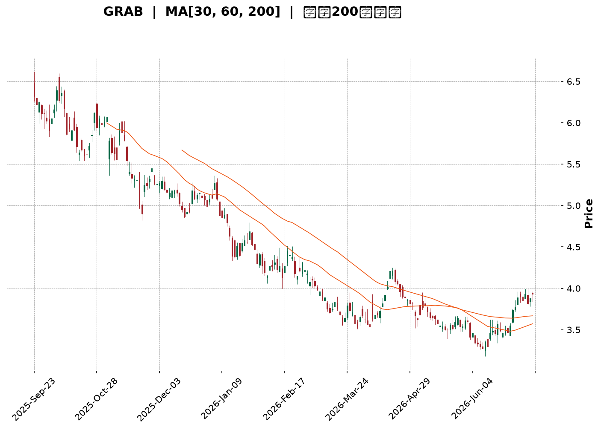
</details>

<html>
<head><meta charset="utf-8" /></head>
<body>
    <div style="height:500px; width:100%;">                        <script>window.PlotlyConfig = {MathJaxConfig: 'local'};</script>
        <script charset="utf-8" src="https://cdn.plot.ly/plotly-3.7.0.min.js" integrity="sha256-jvTGqxNp8AGWEcvNLVuKr+8j5dGe9Yw51LQkmDH+IYA=" crossorigin="anonymous"></script>                <div id="candlestick-chart" class="plotly-graph-div" style="height:100%; width:100%;"></div>            <script>                window.PLOTLYENV=window.PLOTLYENV || {};                                if (document.getElementById("candlestick-chart")) {                    Plotly.newPlot(                        "candlestick-chart",                        [{"close":{"dtype":"f8","bdata":"AAAAIK5HGUAAAACgR+EYQAAAAAAAABlAAAAA4KNwGEAAAADgo3AYQAAAAOB6FBhAAAAAoJmZF0AAAABAMzMYQAAAAADXoxhAAAAAIFyPGUAAAADgehQZQAAAAOCjcBlAAAAAgBSuGEAAAADgo3AXQAAAAOBRuBdAAAAAANejF0AAAACAFK4XQAAAAEAK1xZAAAAAIFyPFkAAAACAFK4WQAAAAGBmZhZAAAAAQOF6FkAAAACgR+EWQAAAAGBmZhdAAAAAQOF6GEAAAABgj8IXQAAAAEAzMxhAAAAAIIXrF0AAAACAPQoYQAAAACCuRxhAAAAAANcjF0AAAAAgXI8WQAAAAMAehRZAAAAAoHA9FkAAAACgmZkXQAAAAMAehRdAAAAAwPUoF0AAAADA9SgWQAAAAADXoxVAAAAAgOtRFUAAAAAgrkcVQAAAAKBwPRVAAAAAIIXrE0AAAACgmZkTQAAAAAAAABVAAAAAgML1FEAAAAAgrkcVQAAAAMDMzBVAAAAA4HoUFUAAAACAPQoVQAAAAOB6FBVAAAAAQDMzFUAAAABgj8IUQAAAAADXoxRAAAAAoJmZFEAAAADgUbgUQAAAAOBRuBRAAAAAoJmZFEAAAADgehQUQAAAAMDMzBNAAAAAQOF6E0AAAACAFK4TQAAAAOBRuBNAAAAA4FG4FEAAAACA61EUQAAAAMAehRRAAAAAoJmZFEAAAABgZmYUQAAAACCuRxRAAAAAgML1E0AAAACA61EUQAAAAAApXBRAAAAA4HoUFUAAAACA61EUQAAAAMAehRNAAAAAYGZmE0AAAAAgXI8TQAAAAMD1KBNAAAAAwB6FEkAAAAAgXI8RQAAAAMAehRFAAAAAgD0KEkAAAACgmZkRQAAAAEAzMxJAAAAAgOtREkAAAACgcD0SQAAAAGCPwhJAAAAAYLgeEkAAAACgR+ERQAAAAEAzMxFAAAAAANejEUAAAADgehQRQAAAAGCPwhBAAAAAoJmZEEAAAADgehQRQAAAAIA9ChFAAAAAoHA9EUAAAAAghesQQAAAAOB6FBFAAAAAwB6FEEAAAADgehQRQAAAAMDMzBFAAAAAoJmZEUAAAADAHoURQAAAAOBRuBBAAAAAoJmZEEAAAABACtcQQAAAAKBwPRFAAAAAoEfhEEAAAADgUbgQQAAAAIDrURBAAAAAYGZmEEAAAABguB4QQAAAAEAK1w9AAAAAgBSuD0AAAACAwvUOQAAAAGC4Hg9AAAAAAAAADkAAAACAFK4NQAAAAAAAAA5AAAAA4FG4DkAAAAAAAAAOQAAAAOCjcA1AAAAAQOF6DEAAAABguB4NQAAAAIDrUQ5AAAAAQArXDUAAAACAFK4NQAAAACBcjwxAAAAAoHA9DEAAAAAgrkcNQAAAAAApXA1AAAAAgML1DEAAAABA4XoMQAAAAIDrUQxAAAAAgD0KDUAAAADgo3ANQAAAAOCjcA1AAAAAQArXDUAAAAAgXI8OQAAAAAApXA9AAAAA4HoUEEAAAABACtcQQAAAAEAK1xBAAAAAgOtREEAAAACgcD0QQAAAAIAUrg9AAAAAQDMzD0AAAABguB4PQAAAAKBH4Q5AAAAAIFyPDkAAAAAgXI8OQAAAAAApXA1AAAAAgML1DEAAAADgo3ANQAAAAMD1KA5AAAAAgOtRDkAAAABgj8INQAAAAEAzMw1AAAAAYLgeDUAAAACAPQoNQAAAACBcjwxAAAAAYGZmDEAAAACA61EMQAAAAAAAAAxAAAAA4HoUDEAAAABA4XoMQAAAAOB6FAxAAAAA4FG4DEAAAABguB4NQAAAAIDrUQxAAAAAgOtRDEAAAACgR+EMQAAAAMDMzAxAAAAAIK5HC0AAAACAFK4LQAAAAOBRuApAAAAAANejCkAAAABgZmYKQAAAAMD1KApAAAAAwMzMCkAAAABgZmYKQAAAAIAUrgtAAAAAIIXrC0AAAACgmZkLQAAAACBcjwxAAAAAIIXrC0AAAACAFK4LQAAAACCF6wtAAAAAgBSuC0AAAABgZmYMQAAAACCF6w1AAAAAwPUoDkAAAABguB4PQAAAAEAzMw9AAAAAwMzMDkAAAADgo3APQAAAAEDheg5AAAAAgD0KD0AAAADgo3APQA=="},"high":{"dtype":"f8","bdata":"AAAAQOF6GkAAAADgUbgZQAAAAOB6FBlAAAAAoEfhGEAAAACAFK4YQAAAAKCZmRhAAAAAoEfhGEAAAAAgrkcYQAAAAKBH4RhAAAAAIK7HGUAAAABgZmYaQAAAAECJwRlAAAAAoJmZGUAAAAAgXI8YQAAAACCuRxhAAAAA4HoUGEAAAAAgXI8YQAAAAIDC9RdAAAAAQDOzFkAAAACAajwXQAAAAOBRuBZAAAAAQOF6FkAAAACAPQoXQAAAAMD1qBdAAAAAwB6FGEAAAACAwvUYQAAAAAApXBhAAAAAgOtRGEAAAACA61EYQAAAAIDCdRhAAAAAIK5HF0AAAADgo3AXQAAAAEAKVxdAAAAAwPUoF0AAAAAAAAAYQAAAAOCj8BhAAAAA4HoUGEAAAACgR+EWQAAAAGC4HhZAAAAA4HoUFkAAAACAwnUVQAAAAMAehRVAAAAAANejFUAAAACgcD0UQAAAAEDhehVAAAAAAClcFUAAAADgo3AVQAAAAAAAABZAAAAAQOF6FUAAAACgcD0VQAAAAEAzMxVAAAAAYGZmFUAAAABgZmYVQAAAACBcDxVAAAAAACncFEAAAACAwvUUQAAAAGCPwhRAAAAA4HoUFUAAAAAA16MUQAAAAEAzMxRAAAAAoEfhE0AAAACgR+ETQAAAAGC4HhRAAAAAYLgeFUAAAACAwvUUQAAAAKCZmRRAAAAAANejFEAAAAAghesUQAAAACBcjxRAAAAAAClcFEAAAADAHoUUQAAAAMDMzBRAAAAA4KNwFUAAAACA61EVQAAAAEAzMxRAAAAAoEfhE0AAAACgR+ETQAAAAKCZmRNAAAAAgD0KE0AAAADAHoUSQAAAAGBmZhJAAAAA4FE4EkAAAABAMzMSQAAAAGBmZhJAAAAAIFyPEkAAAACAFK4SQAAAAIAULhNAAAAA4FG4EkAAAADgUTgSQAAAAKBH4RFAAAAA4FG4EUAAAABgj8IRQAAAAEDhehFAAAAAANejEEAAAADAzEwRQAAAAAApXBFAAAAAYLieEUAAAAAgXI8RQAAAAIDC9RFAAAAA4FE4EUAAAABAMzMRQAAAAIA9ChJAAAAAQArXEUAAAADAHgUSQAAAAIA9ihFAAAAAoJmZEEAAAADAHoURQAAAACCuRxFAAAAAYLgeEUAAAACgR+EQQAAAAIA9ihBAAAAA4HqUEEAAAADAHoUQQAAAAMD1KBBAAAAAgBSuD0AAAAAAAAAQQAAAAMAehQ9AAAAAwMzMDkAAAABA4XoOQAAAAADXow5AAAAAgML1DkAAAABAMzMPQAAAAEAK1w1AAAAA4KNwDUAAAACAFK4NQAAAAADXow5AAAAAoJmZD0AAAADgUbgOQAAAAMAehQ1AAAAAgML1DEAAAADgo3ANQAAAAIDrUQ5AAAAAYI\u002fCDUAAAAAAAAAOQAAAAGCPwgxAAAAA4KNwD0AAAABACtcNQAAAAMDMzA1AAAAAoHA9DkAAAADgehQPQAAAAOBRuA9AAAAAAClcEEAAAABguB4RQAAAAAAAABFAAAAAgML1EEAAAADgo3AQQAAAAEAzMxBAAAAAwPUoEEAAAAAghesPQAAAAAAAAA9AAAAAIIXrDkAAAADgUbgOQAAAAKBH4Q1AAAAAQDMzDUAAAADgo3AOQAAAAKCZmQ9AAAAAQDMzD0AAAACgcD0OQAAAAOB6FA5AAAAA4KNwDUAAAADgo3ANQAAAAIDC9QxAAAAAIFyPDEAAAADAzMwMQAAAACBcjwxAAAAAgOkmDEAAAAAA16MMQAAAAIDC9QxAAAAAgOtRDUAAAAAAKVwNQAAAAIDC9QxAAAAAIFyPDEAAAAAgrkcNQAAAACCuRw1AAAAA4FG4DEAAAABgZmYMQAAAAMAehQtAAAAAQDMzC0AAAACAwvUKQAAAAMDMzApAAAAAgML1CkAAAABguB4LQAAAAIDC9QxAAAAAgML1DEAAAAAAKVwMQAAAAKBH4QxAAAAA4FG4DEAAAAAAAAAMQAAAAGBmZgxAAAAAIFyPDEAAAAAA16MMQAAAAAAAAA5AAAAAoEfhDkAAAACAFK4PQAAAAIAUrg9AAAAAIIXrD0AAAACAwvUPQAAAAAAAABBAAAAAgD0KD0AAAACAFK4PQA=="},"hovertemplate":"\u003cb\u003e%{x|%Y-%m-%d}\u003c\u002fb\u003e\u003cbr\u003e\u958b: $%{open:.2f}\u003cbr\u003e\u9ad8: $%{high:.2f}\u003cbr\u003e\u4f4e: $%{low:.2f}\u003cbr\u003e\u6536: $%{close:.2f}\u003cextra\u003e\u003c\u002fextra\u003e","low":{"dtype":"f8","bdata":"AAAAgD0KGUAAAAAA16MYQAAAAIDC9RdAAAAAwPUoGEAAAADgUbgXQAAAAIDC9RdAAAAAgOtRF0AAAACgmZkXQAAAAKBwPRhAAAAAIFyPGEAAAACAwvUYQAAAACCF6xhAAAAAIK5HGEAAAAAAKVwXQAAAACBcjxdAAAAAwMzMFkAAAACgmZkXQAAAACBcjxZAAAAAwPUoFkAAAACgmZkWQAAAAMD1KBZAAAAAgBSuFUAAAACA61EWQAAAAOB6FBdAAAAAANejF0AAAACgmZkXQAAAAGBmZhdAAAAAgBSuF0AAAADAzMwXQAAAAKCZmRdAAAAA4KNwFUAAAABA4XoWQAAAAIAULhZAAAAAwMzMFUAAAAAghesWQAAAAEAzMxdAAAAAYLgeF0AAAAAghesVQAAAAOCjcBVAAAAA4HoUFUAAAACgR+EUQAAAAAAAABVAAAAAQArXE0AAAAAgrkcTQAAAACCFaxRAAAAAYI\u002fCFEAAAABACtcUQAAAAOCjcBVAAAAAAAAAFUAAAACgR+EUQAAAAKCZmRRAAAAAIK7HFEAAAADgUbgUQAAAAOCjcBRAAAAAgOtRFEAAAABAMzMUQAAAAKBHYRRAAAAA4KNwFEAAAACAwvUTQAAAAIAUrhNAAAAAYGZmE0AAAAAgXI8TQAAAAADXoxNAAAAAgD0KFEAAAAAgrkcUQAAAAGC4HhRAAAAAwMxMFEAAAACgR2EUQAAAAAAAABRAAAAAIIXrE0AAAACAPQoUQAAAAIDrURRAAAAAYI\u002fCFEAAAABgj0IUQAAAAOCjcBNAAAAAgOtRE0AAAAAAKVwTQAAAAAAAABNAAAAAgOtREkAAAACA61ERQAAAAOCjcBFAAAAAYGZmEUAAAAAgXI8RQAAAAOBRuBFAAAAA4HoUEkAAAADA9SgSQAAAAAApXBJAAAAAgD0KEkAAAADAHoURQAAAAMD1KBFAAAAAAAAAEUAAAADgUbgQQAAAAKCZmRBAAAAAoHA9EEAAAACAwnUQQAAAAEAK1xBAAAAAIIXrEEAAAABgj8IQQAAAAMDMzBBAAAAAAAAAEEAAAABgZmYQQAAAAOB6FBFAAAAAYI9CEUAAAACA61ERQAAAAMAehRBAAAAAQDMzEEAAAADgp8YQQAAAACBcjxBAAAAA4FG4EEAAAACgcD0QQAAAAAApXA9AAAAAgD0KEEAAAAAAAAAQQAAAAGCPwg9AAAAAwB6FDkAAAADAzMwOQAAAAEDheg5AAAAAYI\u002fCDUAAAACgmZkNQAAAAGCPwg1AAAAAwPUoDkAAAABACtcNQAAAACCuRw1AAAAAYGZmDEAAAADgUbgMQAAAAIDC9QxAAAAAoJmZDUAAAACA61ENQAAAAKBwPQxAAAAA4HoUDEAAAABgZmYMQAAAAGC4Hg1AAAAAANejDEAAAABA4XoMQAAAAEAK1wtAAAAAwMzMDEAAAACAwvUMQAAAAEAzMw1AAAAAANejDEAAAABgZDsOQAAAAIAUrg5AAAAAQArXD0AAAADgo3AQQAAAAOCjcBBAAAAAQDMzEEAAAADA9SgQQAAAAEAzMw9AAAAAgD0KD0AAAACgR+EOQAAAAIDrUQ5AAAAA4HoUDkAAAAAghesNQAAAAMD1KAxAAAAAgOtRDEAAAADgUbgMQAAAACCF6w1AAAAA4HoUDkAAAAAgrkcNQAAAAIDC9QxAAAAAoEfhDEAAAABA4XoMQAAAAGBmZgxAAAAAgBSuC0AAAABACtcLQAAAACCF6wtAAAAAYLgeC0AAAACgmZkLQAAAACCF6wtAAAAA4HoUDEAAAADgo3AMQAAAAEAK1wtAAAAAQArXC0AAAAAAAAAMQAAAACBcjwxAAAAAgD0KC0AAAACAPQoLQAAAAKCZmQpAAAAAYGZmCkAAAADgehQKQAAAAMD1KApAAAAA4KNwCUAAAADgehQKQAAAAIDC9QpAAAAAQOF6C0AAAADgo3ALQAAAAOBRuApAAAAAYI\u002fCC0AAAABguB4LQAAAAOCjcAtAAAAAwB6FC0AAAABgZmYLQAAAAADXowxAAAAAYI\u002fCDUAAAABgZmYOQAAAAADXow5AAAAAIK5HDUAAAACAPQoPQAAAAGBmZg5AAAAAoHA9DkAAAADgUbgOQA=="},"name":"\u50f9\u683c","open":{"dtype":"f8","bdata":"AAAAIIXrGUAAAABAMzMZQAAAAMAehRhAAAAAQArXGEAAAACAwnUYQAAAAKBwPRhAAAAAwPUoGEAAAACAwvUXQAAAAEDhehhAAAAAoJkZGUAAAABAMzMaQAAAAIDrURlAAAAAgD2KGUAAAABA4XoYQAAAAIDC9RdAAAAAwPUoF0AAAACgcD0YQAAAAMDMzBdAAAAAQOF6FkAAAADA9SgXQAAAAOBRuBZAAAAAQOF6FkAAAACAFK4WQAAAAKBHYRdAAAAAAAAAGEAAAAAghesYQAAAAGCPwhdAAAAAAAAAGEAAAACgR+EXQAAAAIA9ChhAAAAAYI9CFkAAAABgj0IXQAAAAMDMzBZAAAAAwMzMFkAAAACgmRkXQAAAACBcDxhAAAAAYGZmF0AAAABACtcWQAAAAMAehRVAAAAAgD2KFUAAAADgUTgVQAAAAEAzMxVAAAAAANejFUAAAACAPQoUQAAAAIAUrhRAAAAA4HoUFUAAAADA9SgVQAAAAADXoxVAAAAAIIVrFUAAAADAHgUVQAAAAIDC9RRAAAAAQArXFEAAAADA9SgVQAAAAGCPwhRAAAAAIIVrFEAAAABgZmYUQAAAAOB6lBRAAAAAYI\u002fCFEAAAACgmZkUQAAAAEDh+hNAAAAAoEfhE0AAAACgmZkTQAAAAKBH4RNAAAAA4HoUFEAAAACAFK4UQAAAAIDrURRAAAAAIFyPFEAAAABA4XoUQAAAAIDCdRRAAAAAIK5HFEAAAACAFC4UQAAAAMAehRRAAAAAYI\u002fCFEAAAABguB4VQAAAAEAzMxRAAAAAYI\u002fCE0AAAABgZmYTQAAAAKCZmRNAAAAAIIXrEkAAAADgo3ASQAAAAIDrURJAAAAAgD2KEUAAAABAMzMSQAAAAMDMzBFAAAAA4HoUEkAAAACgcD0SQAAAAAApXBJAAAAAgBSuEkAAAADA9SgSQAAAAIAUrhFAAAAAYLgeEUAAAADA9agRQAAAAIDrURFAAAAAwB6FEEAAAACgR+EQQAAAAGC4HhFAAAAAwPUoEUAAAADgo3ARQAAAAMDMzBBAAAAAgML1EEAAAABgj8IQQAAAAKBwPRFAAAAA4HqUEUAAAADgo3ARQAAAAMDMTBFAAAAA4KNwEEAAAAAAAAARQAAAAOBRuBBAAAAAwMzMEEAAAAAA16MQQAAAAGC4HhBAAAAA4KNwEEAAAAAAKVwQQAAAACBcDxBAAAAAIK5HD0AAAACAFK4PQAAAAMDMzA5AAAAAANejDkAAAABguB4OQAAAACCF6w1AAAAAoHA9DkAAAACgmZkOQAAAAGCPwg1AAAAAQDMzDUAAAADAzMwMQAAAAEAzMw1AAAAAANejDkAAAABgZmYNQAAAAOCjcA1AAAAA4FG4DEAAAADAzMwMQAAAAAAAAA5AAAAAgML1DEAAAACgR+EMQAAAAMAehQxAAAAAQArXDkAAAACAPQoNQAAAAKCZmQ1AAAAAQDMzDUAAAACgcD0OQAAAAMDMzA5AAAAAAAAAEEAAAABA4XoQQAAAAGC4nhBAAAAAoEfhEEAAAAAAKVwQQAAAAEAzMxBAAAAA4HoUEEAAAABAMzMPQAAAAMDMzA5AAAAAoEfhDkAAAAAgXI8OQAAAAOBRuA1AAAAA4HoUDUAAAAAAKVwOQAAAAMDMzA5AAAAAIFyPDkAAAADA9SgOQAAAAIAUrg1AAAAAAClcDUAAAAAAKVwNQAAAAIDC9QxAAAAAgOtRDEAAAABguB4MQAAAAIDrUQxAAAAA4HoUDEAAAAAAAAAMQAAAAEDhegxAAAAAIK5HDEAAAABA4XoMQAAAAIDC9QxAAAAAoHA9DEAAAADA9SgMQAAAAKBH4QxAAAAAANejDEAAAAAgrkcLQAAAAOCjcAtAAAAAYI\u002fCCkAAAAAA16MKQAAAAGBmZgpAAAAAAAAACkAAAABguB4LQAAAAGC4HgtAAAAAYI\u002fCC0AAAAAAAAAMQAAAAMAehQtAAAAAoBgEDEAAAAAgrkcLQAAAAADXowtAAAAAQDMzDEAAAABgZmYLQAAAAOBRuAxAAAAAIIXrDUAAAABgZmYOQAAAAOCjcA9AAAAAQDMzD0AAAACAPQoPQAAAAAApXA9AAAAA4FG4DkAAAADAHoUPQA=="},"x":["2025-09-23T00:00:00-04:00","2025-09-24T00:00:00-04:00","2025-09-25T00:00:00-04:00","2025-09-26T00:00:00-04:00","2025-09-29T00:00:00-04:00","2025-09-30T00:00:00-04:00","2025-10-01T00:00:00-04:00","2025-10-02T00:00:00-04:00","2025-10-03T00:00:00-04:00","2025-10-06T00:00:00-04:00","2025-10-07T00:00:00-04:00","2025-10-08T00:00:00-04:00","2025-10-09T00:00:00-04:00","2025-10-10T00:00:00-04:00","2025-10-13T00:00:00-04:00","2025-10-14T00:00:00-04:00","2025-10-15T00:00:00-04:00","2025-10-16T00:00:00-04:00","2025-10-17T00:00:00-04:00","2025-10-20T00:00:00-04:00","2025-10-21T00:00:00-04:00","2025-10-22T00:00:00-04:00","2025-10-23T00:00:00-04:00","2025-10-24T00:00:00-04:00","2025-10-27T00:00:00-04:00","2025-10-28T00:00:00-04:00","2025-10-29T00:00:00-04:00","2025-10-30T00:00:00-04:00","2025-10-31T00:00:00-04:00","2025-11-03T00:00:00-05:00","2025-11-04T00:00:00-05:00","2025-11-05T00:00:00-05:00","2025-11-06T00:00:00-05:00","2025-11-07T00:00:00-05:00","2025-11-10T00:00:00-05:00","2025-11-11T00:00:00-05:00","2025-11-12T00:00:00-05:00","2025-11-13T00:00:00-05:00","2025-11-14T00:00:00-05:00","2025-11-17T00:00:00-05:00","2025-11-18T00:00:00-05:00","2025-11-19T00:00:00-05:00","2025-11-20T00:00:00-05:00","2025-11-21T00:00:00-05:00","2025-11-24T00:00:00-05:00","2025-11-25T00:00:00-05:00","2025-11-26T00:00:00-05:00","2025-11-28T00:00:00-05:00","2025-12-01T00:00:00-05:00","2025-12-02T00:00:00-05:00","2025-12-03T00:00:00-05:00","2025-12-04T00:00:00-05:00","2025-12-05T00:00:00-05:00","2025-12-08T00:00:00-05:00","2025-12-09T00:00:00-05:00","2025-12-10T00:00:00-05:00","2025-12-11T00:00:00-05:00","2025-12-12T00:00:00-05:00","2025-12-15T00:00:00-05:00","2025-12-16T00:00:00-05:00","2025-12-17T00:00:00-05:00","2025-12-18T00:00:00-05:00","2025-12-19T00:00:00-05:00","2025-12-22T00:00:00-05:00","2025-12-23T00:00:00-05:00","2025-12-24T00:00:00-05:00","2025-12-26T00:00:00-05:00","2025-12-29T00:00:00-05:00","2025-12-30T00:00:00-05:00","2025-12-31T00:00:00-05:00","2026-01-02T00:00:00-05:00","2026-01-05T00:00:00-05:00","2026-01-06T00:00:00-05:00","2026-01-07T00:00:00-05:00","2026-01-08T00:00:00-05:00","2026-01-09T00:00:00-05:00","2026-01-12T00:00:00-05:00","2026-01-13T00:00:00-05:00","2026-01-14T00:00:00-05:00","2026-01-15T00:00:00-05:00","2026-01-16T00:00:00-05:00","2026-01-20T00:00:00-05:00","2026-01-21T00:00:00-05:00","2026-01-22T00:00:00-05:00","2026-01-23T00:00:00-05:00","2026-01-26T00:00:00-05:00","2026-01-27T00:00:00-05:00","2026-01-28T00:00:00-05:00","2026-01-29T00:00:00-05:00","2026-01-30T00:00:00-05:00","2026-02-02T00:00:00-05:00","2026-02-03T00:00:00-05:00","2026-02-04T00:00:00-05:00","2026-02-05T00:00:00-05:00","2026-02-06T00:00:00-05:00","2026-02-09T00:00:00-05:00","2026-02-10T00:00:00-05:00","2026-02-11T00:00:00-05:00","2026-02-12T00:00:00-05:00","2026-02-13T00:00:00-05:00","2026-02-17T00:00:00-05:00","2026-02-18T00:00:00-05:00","2026-02-19T00:00:00-05:00","2026-02-20T00:00:00-05:00","2026-02-23T00:00:00-05:00","2026-02-24T00:00:00-05:00","2026-02-25T00:00:00-05:00","2026-02-26T00:00:00-05:00","2026-02-27T00:00:00-05:00","2026-03-02T00:00:00-05:00","2026-03-03T00:00:00-05:00","2026-03-04T00:00:00-05:00","2026-03-05T00:00:00-05:00","2026-03-06T00:00:00-05:00","2026-03-09T00:00:00-04:00","2026-03-10T00:00:00-04:00","2026-03-11T00:00:00-04:00","2026-03-12T00:00:00-04:00","2026-03-13T00:00:00-04:00","2026-03-16T00:00:00-04:00","2026-03-17T00:00:00-04:00","2026-03-18T00:00:00-04:00","2026-03-19T00:00:00-04:00","2026-03-20T00:00:00-04:00","2026-03-23T00:00:00-04:00","2026-03-24T00:00:00-04:00","2026-03-25T00:00:00-04:00","2026-03-26T00:00:00-04:00","2026-03-27T00:00:00-04:00","2026-03-30T00:00:00-04:00","2026-03-31T00:00:00-04:00","2026-04-01T00:00:00-04:00","2026-04-02T00:00:00-04:00","2026-04-06T00:00:00-04:00","2026-04-07T00:00:00-04:00","2026-04-08T00:00:00-04:00","2026-04-09T00:00:00-04:00","2026-04-10T00:00:00-04:00","2026-04-13T00:00:00-04:00","2026-04-14T00:00:00-04:00","2026-04-15T00:00:00-04:00","2026-04-16T00:00:00-04:00","2026-04-17T00:00:00-04:00","2026-04-20T00:00:00-04:00","2026-04-21T00:00:00-04:00","2026-04-22T00:00:00-04:00","2026-04-23T00:00:00-04:00","2026-04-24T00:00:00-04:00","2026-04-27T00:00:00-04:00","2026-04-28T00:00:00-04:00","2026-04-29T00:00:00-04:00","2026-04-30T00:00:00-04:00","2026-05-01T00:00:00-04:00","2026-05-04T00:00:00-04:00","2026-05-05T00:00:00-04:00","2026-05-06T00:00:00-04:00","2026-05-07T00:00:00-04:00","2026-05-08T00:00:00-04:00","2026-05-11T00:00:00-04:00","2026-05-12T00:00:00-04:00","2026-05-13T00:00:00-04:00","2026-05-14T00:00:00-04:00","2026-05-15T00:00:00-04:00","2026-05-18T00:00:00-04:00","2026-05-19T00:00:00-04:00","2026-05-20T00:00:00-04:00","2026-05-21T00:00:00-04:00","2026-05-22T00:00:00-04:00","2026-05-26T00:00:00-04:00","2026-05-27T00:00:00-04:00","2026-05-28T00:00:00-04:00","2026-05-29T00:00:00-04:00","2026-06-01T00:00:00-04:00","2026-06-02T00:00:00-04:00","2026-06-03T00:00:00-04:00","2026-06-04T00:00:00-04:00","2026-06-05T00:00:00-04:00","2026-06-08T00:00:00-04:00","2026-06-09T00:00:00-04:00","2026-06-10T00:00:00-04:00","2026-06-11T00:00:00-04:00","2026-06-12T00:00:00-04:00","2026-06-15T00:00:00-04:00","2026-06-16T00:00:00-04:00","2026-06-17T00:00:00-04:00","2026-06-18T00:00:00-04:00","2026-06-22T00:00:00-04:00","2026-06-23T00:00:00-04:00","2026-06-24T00:00:00-04:00","2026-06-25T00:00:00-04:00","2026-06-26T00:00:00-04:00","2026-06-29T00:00:00-04:00","2026-06-30T00:00:00-04:00","2026-07-01T00:00:00-04:00","2026-07-02T00:00:00-04:00","2026-07-06T00:00:00-04:00","2026-07-07T00:00:00-04:00","2026-07-08T00:00:00-04:00","2026-07-09T00:00:00-04:00","2026-07-10T00:00:00-04:00"],"type":"candlestick"},{"hovertemplate":"MA30: $%{y:.2f}\u003cextra\u003e\u003c\u002fextra\u003e","line":{"color":"#2196F3","dash":"dash","width":2},"mode":"lines","name":"MA30","x":["2025-09-23T00:00:00-04:00","2025-09-24T00:00:00-04:00","2025-09-25T00:00:00-04:00","2025-09-26T00:00:00-04:00","2025-09-29T00:00:00-04:00","2025-09-30T00:00:00-04:00","2025-10-01T00:00:00-04:00","2025-10-02T00:00:00-04:00","2025-10-03T00:00:00-04:00","2025-10-06T00:00:00-04:00","2025-10-07T00:00:00-04:00","2025-10-08T00:00:00-04:00","2025-10-09T00:00:00-04:00","2025-10-10T00:00:00-04:00","2025-10-13T00:00:00-04:00","2025-10-14T00:00:00-04:00","2025-10-15T00:00:00-04:00","2025-10-16T00:00:00-04:00","2025-10-17T00:00:00-04:00","2025-10-20T00:00:00-04:00","2025-10-21T00:00:00-04:00","2025-10-22T00:00:00-04:00","2025-10-23T00:00:00-04:00","2025-10-24T00:00:00-04:00","2025-10-27T00:00:00-04:00","2025-10-28T00:00:00-04:00","2025-10-29T00:00:00-04:00","2025-10-30T00:00:00-04:00","2025-10-31T00:00:00-04:00","2025-11-03T00:00:00-05:00","2025-11-04T00:00:00-05:00","2025-11-05T00:00:00-05:00","2025-11-06T00:00:00-05:00","2025-11-07T00:00:00-05:00","2025-11-10T00:00:00-05:00","2025-11-11T00:00:00-05:00","2025-11-12T00:00:00-05:00","2025-11-13T00:00:00-05:00","2025-11-14T00:00:00-05:00","2025-11-17T00:00:00-05:00","2025-11-18T00:00:00-05:00","2025-11-19T00:00:00-05:00","2025-11-20T00:00:00-05:00","2025-11-21T00:00:00-05:00","2025-11-24T00:00:00-05:00","2025-11-25T00:00:00-05:00","2025-11-26T00:00:00-05:00","2025-11-28T00:00:00-05:00","2025-12-01T00:00:00-05:00","2025-12-02T00:00:00-05:00","2025-12-03T00:00:00-05:00","2025-12-04T00:00:00-05:00","2025-12-05T00:00:00-05:00","2025-12-08T00:00:00-05:00","2025-12-09T00:00:00-05:00","2025-12-10T00:00:00-05:00","2025-12-11T00:00:00-05:00","2025-12-12T00:00:00-05:00","2025-12-15T00:00:00-05:00","2025-12-16T00:00:00-05:00","2025-12-17T00:00:00-05:00","2025-12-18T00:00:00-05:00","2025-12-19T00:00:00-05:00","2025-12-22T00:00:00-05:00","2025-12-23T00:00:00-05:00","2025-12-24T00:00:00-05:00","2025-12-26T00:00:00-05:00","2025-12-29T00:00:00-05:00","2025-12-30T00:00:00-05:00","2025-12-31T00:00:00-05:00","2026-01-02T00:00:00-05:00","2026-01-05T00:00:00-05:00","2026-01-06T00:00:00-05:00","2026-01-07T00:00:00-05:00","2026-01-08T00:00:00-05:00","2026-01-09T00:00:00-05:00","2026-01-12T00:00:00-05:00","2026-01-13T00:00:00-05:00","2026-01-14T00:00:00-05:00","2026-01-15T00:00:00-05:00","2026-01-16T00:00:00-05:00","2026-01-20T00:00:00-05:00","2026-01-21T00:00:00-05:00","2026-01-22T00:00:00-05:00","2026-01-23T00:00:00-05:00","2026-01-26T00:00:00-05:00","2026-01-27T00:00:00-05:00","2026-01-28T00:00:00-05:00","2026-01-29T00:00:00-05:00","2026-01-30T00:00:00-05:00","2026-02-02T00:00:00-05:00","2026-02-03T00:00:00-05:00","2026-02-04T00:00:00-05:00","2026-02-05T00:00:00-05:00","2026-02-06T00:00:00-05:00","2026-02-09T00:00:00-05:00","2026-02-10T00:00:00-05:00","2026-02-11T00:00:00-05:00","2026-02-12T00:00:00-05:00","2026-02-13T00:00:00-05:00","2026-02-17T00:00:00-05:00","2026-02-18T00:00:00-05:00","2026-02-19T00:00:00-05:00","2026-02-20T00:00:00-05:00","2026-02-23T00:00:00-05:00","2026-02-24T00:00:00-05:00","2026-02-25T00:00:00-05:00","2026-02-26T00:00:00-05:00","2026-02-27T00:00:00-05:00","2026-03-02T00:00:00-05:00","2026-03-03T00:00:00-05:00","2026-03-04T00:00:00-05:00","2026-03-05T00:00:00-05:00","2026-03-06T00:00:00-05:00","2026-03-09T00:00:00-04:00","2026-03-10T00:00:00-04:00","2026-03-11T00:00:00-04:00","2026-03-12T00:00:00-04:00","2026-03-13T00:00:00-04:00","2026-03-16T00:00:00-04:00","2026-03-17T00:00:00-04:00","2026-03-18T00:00:00-04:00","2026-03-19T00:00:00-04:00","2026-03-20T00:00:00-04:00","2026-03-23T00:00:00-04:00","2026-03-24T00:00:00-04:00","2026-03-25T00:00:00-04:00","2026-03-26T00:00:00-04:00","2026-03-27T00:00:00-04:00","2026-03-30T00:00:00-04:00","2026-03-31T00:00:00-04:00","2026-04-01T00:00:00-04:00","2026-04-02T00:00:00-04:00","2026-04-06T00:00:00-04:00","2026-04-07T00:00:00-04:00","2026-04-08T00:00:00-04:00","2026-04-09T00:00:00-04:00","2026-04-10T00:00:00-04:00","2026-04-13T00:00:00-04:00","2026-04-14T00:00:00-04:00","2026-04-15T00:00:00-04:00","2026-04-16T00:00:00-04:00","2026-04-17T00:00:00-04:00","2026-04-20T00:00:00-04:00","2026-04-21T00:00:00-04:00","2026-04-22T00:00:00-04:00","2026-04-23T00:00:00-04:00","2026-04-24T00:00:00-04:00","2026-04-27T00:00:00-04:00","2026-04-28T00:00:00-04:00","2026-04-29T00:00:00-04:00","2026-04-30T00:00:00-04:00","2026-05-01T00:00:00-04:00","2026-05-04T00:00:00-04:00","2026-05-05T00:00:00-04:00","2026-05-06T00:00:00-04:00","2026-05-07T00:00:00-04:00","2026-05-08T00:00:00-04:00","2026-05-11T00:00:00-04:00","2026-05-12T00:00:00-04:00","2026-05-13T00:00:00-04:00","2026-05-14T00:00:00-04:00","2026-05-15T00:00:00-04:00","2026-05-18T00:00:00-04:00","2026-05-19T00:00:00-04:00","2026-05-20T00:00:00-04:00","2026-05-21T00:00:00-04:00","2026-05-22T00:00:00-04:00","2026-05-26T00:00:00-04:00","2026-05-27T00:00:00-04:00","2026-05-28T00:00:00-04:00","2026-05-29T00:00:00-04:00","2026-06-01T00:00:00-04:00","2026-06-02T00:00:00-04:00","2026-06-03T00:00:00-04:00","2026-06-04T00:00:00-04:00","2026-06-05T00:00:00-04:00","2026-06-08T00:00:00-04:00","2026-06-09T00:00:00-04:00","2026-06-10T00:00:00-04:00","2026-06-11T00:00:00-04:00","2026-06-12T00:00:00-04:00","2026-06-15T00:00:00-04:00","2026-06-16T00:00:00-04:00","2026-06-17T00:00:00-04:00","2026-06-18T00:00:00-04:00","2026-06-22T00:00:00-04:00","2026-06-23T00:00:00-04:00","2026-06-24T00:00:00-04:00","2026-06-25T00:00:00-04:00","2026-06-26T00:00:00-04:00","2026-06-29T00:00:00-04:00","2026-06-30T00:00:00-04:00","2026-07-01T00:00:00-04:00","2026-07-02T00:00:00-04:00","2026-07-06T00:00:00-04:00","2026-07-07T00:00:00-04:00","2026-07-08T00:00:00-04:00","2026-07-09T00:00:00-04:00","2026-07-10T00:00:00-04:00"],"y":{"dtype":"f8","bdata":"AAAAAAAA+H8AAAAAAAD4fwAAAAAAAPh\u002fAAAAAAAA+H8AAAAAAAD4fwAAAAAAAPh\u002fAAAAAAAA+H8AAAAAAAD4fwAAAAAAAPh\u002fAAAAAAAA+H8AAAAAAAD4fwAAAAAAAPh\u002fAAAAAAAA+H8AAAAAAAD4fwAAAAAAAPh\u002fAAAAAAAA+H8AAAAAAAD4fwAAAAAAAPh\u002fAAAAAAAA+H8AAAAAAAD4fwAAAAAAAPh\u002fAAAAAAAA+H8AAAAAAAD4fwAAAAAAAPh\u002fAAAAAAAA+H8AAAAAAAD4fwAAAAAAAPh\u002fAAAAAAAA+H8AAAAAAAD4f1VVVVWc\u002fRdA3t3dbVnrF0AAAABQjdcXQLy7u6tjwhdAIiIisp2vF0AAAACwcqgXQJqZmVmroxdAd3d3J+qfF0BERES0gY4XQKuqqhrodBdA7+7urrlQF0BVVVV1TDAXQKuqqmp1DBdAmpmZCdfjFkDe3d1tEsMWQAAAAIDcqxZAMzMz8\u002f2UFkAiIiISg4AWQHd3dyejdxZAvLu7CwJrFkCamZlpA10WQERERNS\u002fURZAERERodNGFkC8u7trvDQWQLy7uxsvHRZA7+7uHhP8FUAzMzMjIuIVQFVVVfVvxBVA7+7uThuoFUDe3d2NUIYVQHd3d9cVYBVAMzMzc9pAFUDv7u7+RigVQM3MzExiEBVA7+7uzmkDFUCamZmJbOcUQAAAAPDSzRRAiYiIiPq3FEARERHB9agUQKuqqspanRRAMzMz07+RFEC8u7urjokUQImIiEgMghRAd3d3V\u002fKLFEBEREQ0F5IUQImIiBh2hRRAmpmZOSZ4FEAzMzPTeGkUQImIiKjxUhRAERERQRk9FEAzMzMTZx8UQDMzMyMGARRAMzMzAw\u002fmE0AzMzPjF8sTQBEREaFFthNARERE5NCiE0AAAABAp40TQBEREZHtfBNAzczM7MNnE0AzMzPz\u002fVQTQKuqqirOPhNAAAAAoBovE0BmZmbW6hgTQO\u002fu7p6o\u002fxJAiYiIWIDcEkBVVVV12sASQImIiEgooxJAAAAAQHyGEkAzMzMTymgSQBEREZF7TRJAZmZmxiAwEkAzMzPjehQSQKuqqnqi\u002fhFA3t3dTfDgEUDNzMycC8kRQKuqquomsRFAmpmZOUKZEUC8u7tLDIIRQN7d3f2pcRFAq6qqWqtjEUCJiIhYgFwRQHd3d+dCUhFAREREREREEUCJiIgoozcRQLy7u2suJBFAd3d3xwQPEUB3d3d3d\u002fcQQN7d3fUo3BBA7+7uNonBEEBEREQ8mKcQQKuqqkLSlBBAZmZmhl2BEEAiIiKynW8QQHd3dz81XhBAd3d3vxFKEECamZm5kDQQQM3MzMyFJBBA7+7urrkQEEBVVVW18\u002f0PQCIiIlIqzg9A7+7ujjSlD0CamZkJkHsPQN7d3Y1QRg9AAAAAEBERD0BVVVWFFtkOQGZmZrZlrQ5A3t3dDeaJDkAiIiKit2UOQGZmZpa1Og5AiYiIOEIZDkBERETErgAOQBEREZHC9Q1Ad3d3d0zwDUARERExlvwNQLy7u7tJDA5AIiIi4noUDkAAAABgcyEOQGZmZrY6Jg5Ad3d3J3gwDkAiIiLiwTwOQFVVVUVERA5A7+7uvuZCDkBVVVUVrkcOQCIiIlL\u002fRg5AVVVV5RdLDkAiIiLy0k0OQLy7u2t1TA5A7+7u\u002fo1QDkAiIiLCPFEOQM3MzNyyVg5AERERQTVeDkB3d3f3KFwOQGZmZlZVVQ5AAAAAAI5QDkCamZl5ME8OQM3MzGx1TA5AVVVVRUREDkDe3d0dEzwOQGZmZiZ4MA5AiYiIeOkmDkDv7u6+nxoOQDMzM8OuAA5Ad3d3J+rfDUBERERk9LYNQN7d3d1PjQ1AVVVVxZJfDUAzMzMDnTYNQJqZmblJDA1AAAAAQGDlDEAAAABAGb0MQBEREUHSlAxAiYiIaLx0DEAAAADAPFEMQLy7u7vmQgxAIiIi0gY6DEB3d3dHUyoMQGZmZgasHAxAVVVVJTEIDEARERFRcfYLQM3MzByF6wtAIiIiYjvfC0B3d3dHxdkLQO\u002fu7j5g5QtAZmZmBmX0C0CJiIi4SQwMQKuqqjqYJwxAiYiIKM4+DEARERFhEFgMQCIiIkKLbAxAERERYVeADEDv7u5+I5QMQA=="},"type":"scatter"},{"hovertemplate":"MA60: $%{y:.2f}\u003cextra\u003e\u003c\u002fextra\u003e","line":{"color":"#9C27B0","dash":"dash","width":2},"mode":"lines","name":"MA60","x":["2025-09-23T00:00:00-04:00","2025-09-24T00:00:00-04:00","2025-09-25T00:00:00-04:00","2025-09-26T00:00:00-04:00","2025-09-29T00:00:00-04:00","2025-09-30T00:00:00-04:00","2025-10-01T00:00:00-04:00","2025-10-02T00:00:00-04:00","2025-10-03T00:00:00-04:00","2025-10-06T00:00:00-04:00","2025-10-07T00:00:00-04:00","2025-10-08T00:00:00-04:00","2025-10-09T00:00:00-04:00","2025-10-10T00:00:00-04:00","2025-10-13T00:00:00-04:00","2025-10-14T00:00:00-04:00","2025-10-15T00:00:00-04:00","2025-10-16T00:00:00-04:00","2025-10-17T00:00:00-04:00","2025-10-20T00:00:00-04:00","2025-10-21T00:00:00-04:00","2025-10-22T00:00:00-04:00","2025-10-23T00:00:00-04:00","2025-10-24T00:00:00-04:00","2025-10-27T00:00:00-04:00","2025-10-28T00:00:00-04:00","2025-10-29T00:00:00-04:00","2025-10-30T00:00:00-04:00","2025-10-31T00:00:00-04:00","2025-11-03T00:00:00-05:00","2025-11-04T00:00:00-05:00","2025-11-05T00:00:00-05:00","2025-11-06T00:00:00-05:00","2025-11-07T00:00:00-05:00","2025-11-10T00:00:00-05:00","2025-11-11T00:00:00-05:00","2025-11-12T00:00:00-05:00","2025-11-13T00:00:00-05:00","2025-11-14T00:00:00-05:00","2025-11-17T00:00:00-05:00","2025-11-18T00:00:00-05:00","2025-11-19T00:00:00-05:00","2025-11-20T00:00:00-05:00","2025-11-21T00:00:00-05:00","2025-11-24T00:00:00-05:00","2025-11-25T00:00:00-05:00","2025-11-26T00:00:00-05:00","2025-11-28T00:00:00-05:00","2025-12-01T00:00:00-05:00","2025-12-02T00:00:00-05:00","2025-12-03T00:00:00-05:00","2025-12-04T00:00:00-05:00","2025-12-05T00:00:00-05:00","2025-12-08T00:00:00-05:00","2025-12-09T00:00:00-05:00","2025-12-10T00:00:00-05:00","2025-12-11T00:00:00-05:00","2025-12-12T00:00:00-05:00","2025-12-15T00:00:00-05:00","2025-12-16T00:00:00-05:00","2025-12-17T00:00:00-05:00","2025-12-18T00:00:00-05:00","2025-12-19T00:00:00-05:00","2025-12-22T00:00:00-05:00","2025-12-23T00:00:00-05:00","2025-12-24T00:00:00-05:00","2025-12-26T00:00:00-05:00","2025-12-29T00:00:00-05:00","2025-12-30T00:00:00-05:00","2025-12-31T00:00:00-05:00","2026-01-02T00:00:00-05:00","2026-01-05T00:00:00-05:00","2026-01-06T00:00:00-05:00","2026-01-07T00:00:00-05:00","2026-01-08T00:00:00-05:00","2026-01-09T00:00:00-05:00","2026-01-12T00:00:00-05:00","2026-01-13T00:00:00-05:00","2026-01-14T00:00:00-05:00","2026-01-15T00:00:00-05:00","2026-01-16T00:00:00-05:00","2026-01-20T00:00:00-05:00","2026-01-21T00:00:00-05:00","2026-01-22T00:00:00-05:00","2026-01-23T00:00:00-05:00","2026-01-26T00:00:00-05:00","2026-01-27T00:00:00-05:00","2026-01-28T00:00:00-05:00","2026-01-29T00:00:00-05:00","2026-01-30T00:00:00-05:00","2026-02-02T00:00:00-05:00","2026-02-03T00:00:00-05:00","2026-02-04T00:00:00-05:00","2026-02-05T00:00:00-05:00","2026-02-06T00:00:00-05:00","2026-02-09T00:00:00-05:00","2026-02-10T00:00:00-05:00","2026-02-11T00:00:00-05:00","2026-02-12T00:00:00-05:00","2026-02-13T00:00:00-05:00","2026-02-17T00:00:00-05:00","2026-02-18T00:00:00-05:00","2026-02-19T00:00:00-05:00","2026-02-20T00:00:00-05:00","2026-02-23T00:00:00-05:00","2026-02-24T00:00:00-05:00","2026-02-25T00:00:00-05:00","2026-02-26T00:00:00-05:00","2026-02-27T00:00:00-05:00","2026-03-02T00:00:00-05:00","2026-03-03T00:00:00-05:00","2026-03-04T00:00:00-05:00","2026-03-05T00:00:00-05:00","2026-03-06T00:00:00-05:00","2026-03-09T00:00:00-04:00","2026-03-10T00:00:00-04:00","2026-03-11T00:00:00-04:00","2026-03-12T00:00:00-04:00","2026-03-13T00:00:00-04:00","2026-03-16T00:00:00-04:00","2026-03-17T00:00:00-04:00","2026-03-18T00:00:00-04:00","2026-03-19T00:00:00-04:00","2026-03-20T00:00:00-04:00","2026-03-23T00:00:00-04:00","2026-03-24T00:00:00-04:00","2026-03-25T00:00:00-04:00","2026-03-26T00:00:00-04:00","2026-03-27T00:00:00-04:00","2026-03-30T00:00:00-04:00","2026-03-31T00:00:00-04:00","2026-04-01T00:00:00-04:00","2026-04-02T00:00:00-04:00","2026-04-06T00:00:00-04:00","2026-04-07T00:00:00-04:00","2026-04-08T00:00:00-04:00","2026-04-09T00:00:00-04:00","2026-04-10T00:00:00-04:00","2026-04-13T00:00:00-04:00","2026-04-14T00:00:00-04:00","2026-04-15T00:00:00-04:00","2026-04-16T00:00:00-04:00","2026-04-17T00:00:00-04:00","2026-04-20T00:00:00-04:00","2026-04-21T00:00:00-04:00","2026-04-22T00:00:00-04:00","2026-04-23T00:00:00-04:00","2026-04-24T00:00:00-04:00","2026-04-27T00:00:00-04:00","2026-04-28T00:00:00-04:00","2026-04-29T00:00:00-04:00","2026-04-30T00:00:00-04:00","2026-05-01T00:00:00-04:00","2026-05-04T00:00:00-04:00","2026-05-05T00:00:00-04:00","2026-05-06T00:00:00-04:00","2026-05-07T00:00:00-04:00","2026-05-08T00:00:00-04:00","2026-05-11T00:00:00-04:00","2026-05-12T00:00:00-04:00","2026-05-13T00:00:00-04:00","2026-05-14T00:00:00-04:00","2026-05-15T00:00:00-04:00","2026-05-18T00:00:00-04:00","2026-05-19T00:00:00-04:00","2026-05-20T00:00:00-04:00","2026-05-21T00:00:00-04:00","2026-05-22T00:00:00-04:00","2026-05-26T00:00:00-04:00","2026-05-27T00:00:00-04:00","2026-05-28T00:00:00-04:00","2026-05-29T00:00:00-04:00","2026-06-01T00:00:00-04:00","2026-06-02T00:00:00-04:00","2026-06-03T00:00:00-04:00","2026-06-04T00:00:00-04:00","2026-06-05T00:00:00-04:00","2026-06-08T00:00:00-04:00","2026-06-09T00:00:00-04:00","2026-06-10T00:00:00-04:00","2026-06-11T00:00:00-04:00","2026-06-12T00:00:00-04:00","2026-06-15T00:00:00-04:00","2026-06-16T00:00:00-04:00","2026-06-17T00:00:00-04:00","2026-06-18T00:00:00-04:00","2026-06-22T00:00:00-04:00","2026-06-23T00:00:00-04:00","2026-06-24T00:00:00-04:00","2026-06-25T00:00:00-04:00","2026-06-26T00:00:00-04:00","2026-06-29T00:00:00-04:00","2026-06-30T00:00:00-04:00","2026-07-01T00:00:00-04:00","2026-07-02T00:00:00-04:00","2026-07-06T00:00:00-04:00","2026-07-07T00:00:00-04:00","2026-07-08T00:00:00-04:00","2026-07-09T00:00:00-04:00","2026-07-10T00:00:00-04:00"],"y":{"dtype":"f8","bdata":"AAAAAAAA+H8AAAAAAAD4fwAAAAAAAPh\u002fAAAAAAAA+H8AAAAAAAD4fwAAAAAAAPh\u002fAAAAAAAA+H8AAAAAAAD4fwAAAAAAAPh\u002fAAAAAAAA+H8AAAAAAAD4fwAAAAAAAPh\u002fAAAAAAAA+H8AAAAAAAD4fwAAAAAAAPh\u002fAAAAAAAA+H8AAAAAAAD4fwAAAAAAAPh\u002fAAAAAAAA+H8AAAAAAAD4fwAAAAAAAPh\u002fAAAAAAAA+H8AAAAAAAD4fwAAAAAAAPh\u002fAAAAAAAA+H8AAAAAAAD4fwAAAAAAAPh\u002fAAAAAAAA+H8AAAAAAAD4fwAAAAAAAPh\u002fAAAAAAAA+H8AAAAAAAD4fwAAAAAAAPh\u002fAAAAAAAA+H8AAAAAAAD4fwAAAAAAAPh\u002fAAAAAAAA+H8AAAAAAAD4fwAAAAAAAPh\u002fAAAAAAAA+H8AAAAAAAD4fwAAAAAAAPh\u002fAAAAAAAA+H8AAAAAAAD4fwAAAAAAAPh\u002fAAAAAAAA+H8AAAAAAAD4fwAAAAAAAPh\u002fAAAAAAAA+H8AAAAAAAD4fwAAAAAAAPh\u002fAAAAAAAA+H8AAAAAAAD4fwAAAAAAAPh\u002fAAAAAAAA+H8AAAAAAAD4fwAAAAAAAPh\u002fAAAAAAAA+H8AAAAAAAD4f2ZmZhbZrhZAiYiI8BmWFkB3d3cn6n8WQERERPxiaRZAiYiIwINZFkDNzMyc70cWQM3MzCS\u002fOBZAAAAAWPIrFkCrqqq6uxsWQKuqqnIhCRZAERERwTzxFUCJiIiQ7dwVQJqZmdlAxxVAiYiIsOS3FUARERHRlKoVQEREREypmBVAZmZmFpKGFUCrqqry\u002fXQVQAAAAGhKZRVAZmZmpg1UFUBmZmY+NT4VQLy7u\u002ftiKRVAIiIiUnEWFUB3d3cn6v8UQGZmZl666RRAmpmZAXLPFECamZmx5LcUQDMzM8OuoBRA3t3dne+HFECJiIhAp20UQBEREQFyTxRAmpmZifo3FECrqqrqmCAUQN7d3XUFCBRAvLu7E\u002fXvE0B3d3d\u002fI9QTQERERJx9uBNAREREZDufE0AiIiLq34gTQN7d3S1rdRNAzczMTPBgE0B3d3fHBE8TQJqZmWFXQBNAq6qqUnE2E0CJiIhokS0TQJqZmYFOGxNAmpmZObQIE0B3d3ePwvUSQDMzM9NN4hJA3t3dTWLQEkDe3d21870SQFVVVYWkqRJAvLu7oymVEkDe3d2FXYESQGZmZgY6bRJA3t3d1epYEkC8u7tbj0ISQHd3d0OLLBJA3t3dkaYUEkC8u7sXS\u002f4RQKuqqjbQ6RFAMzMzEzzYEUBERERERMQRQDMzM+\u002furhFAAAAADEmTEUB3d3eXtXoRQKuqqgrXYxFAd3d395pLEUDv7u724TMRQBEREV1IGhFA7+7uhl0BEUAAAAB0IekQQM3MzGDl0BBA7+7uary0EEC8u7tvy5oQQO\u002fu7uLsgxBAREREoBpvEEBmZmYOdFoQQImIiGSCRxBAd3d3OyY4EEBVVVXday4QQAAAABiSJhBAAAAAQDUeEECJiIgg9xoQQM3MzKQpFRBAREREHKEMEEC8u7uTGAQQQBEREVFG7w9Aq6qqSsXZD0BVVVUt+cUPQFVVVWX0tg9A3t3d5dCiD0DNzMy8dJMPQImIiOi0gQ9AIiIisp1vD0CrqqoyelsPQKuqqoLASg9AZmZmrgA5D0C8u7s7mCcPQHd3d5duEg9AAAAA6LQBD0CJiIiA3OsOQCIiIvLSzQ5AAAAAiM+wDkB3d3d\u002fI5QOQJqZmZHtfA5AmpmZKRVnDkAAAABg5VAOQGZmZt6WNQ5AiYiI2BUgDkCamZlBpw0OQCIiIqo4+w1Ad3d3TxvoDUCrqqpKxdkNQM3MzMzMzA1AvLu70wa6DUCamZkxCKwNQAAAADhCmQ1AvLu7M+yKDUARERGR7XwNQDMzM0OLbA1AvLu7k9FbDUCrqqpqdUwNQO\u002fu7gbzRA1AvLu7W49CDUDNzMwcEzwNQBEREbmQNA1AIiIikl8sDUCamZkJ1yMNQM3MzPwbIQ1AmpmZUbgeDUB3d3cf9xoNQKuqqspaHQ1AMzMzg3kiDUAREREZvS0NQLy7u9MGOg1A7+7uNolBDUB3d3e\u002fEUoNQERERLSBTg1AzczMbKBTDUDv7u6eYVcNQA=="},"type":"scatter"},{"hovertemplate":"MA200: $%{y:.2f}\u003cextra\u003e\u003c\u002fextra\u003e","line":{"color":"#FF6F00","dash":"solid","width":2},"mode":"lines","name":"MA200","x":["2025-09-23T00:00:00-04:00","2025-09-24T00:00:00-04:00","2025-09-25T00:00:00-04:00","2025-09-26T00:00:00-04:00","2025-09-29T00:00:00-04:00","2025-09-30T00:00:00-04:00","2025-10-01T00:00:00-04:00","2025-10-02T00:00:00-04:00","2025-10-03T00:00:00-04:00","2025-10-06T00:00:00-04:00","2025-10-07T00:00:00-04:00","2025-10-08T00:00:00-04:00","2025-10-09T00:00:00-04:00","2025-10-10T00:00:00-04:00","2025-10-13T00:00:00-04:00","2025-10-14T00:00:00-04:00","2025-10-15T00:00:00-04:00","2025-10-16T00:00:00-04:00","2025-10-17T00:00:00-04:00","2025-10-20T00:00:00-04:00","2025-10-21T00:00:00-04:00","2025-10-22T00:00:00-04:00","2025-10-23T00:00:00-04:00","2025-10-24T00:00:00-04:00","2025-10-27T00:00:00-04:00","2025-10-28T00:00:00-04:00","2025-10-29T00:00:00-04:00","2025-10-30T00:00:00-04:00","2025-10-31T00:00:00-04:00","2025-11-03T00:00:00-05:00","2025-11-04T00:00:00-05:00","2025-11-05T00:00:00-05:00","2025-11-06T00:00:00-05:00","2025-11-07T00:00:00-05:00","2025-11-10T00:00:00-05:00","2025-11-11T00:00:00-05:00","2025-11-12T00:00:00-05:00","2025-11-13T00:00:00-05:00","2025-11-14T00:00:00-05:00","2025-11-17T00:00:00-05:00","2025-11-18T00:00:00-05:00","2025-11-19T00:00:00-05:00","2025-11-20T00:00:00-05:00","2025-11-21T00:00:00-05:00","2025-11-24T00:00:00-05:00","2025-11-25T00:00:00-05:00","2025-11-26T00:00:00-05:00","2025-11-28T00:00:00-05:00","2025-12-01T00:00:00-05:00","2025-12-02T00:00:00-05:00","2025-12-03T00:00:00-05:00","2025-12-04T00:00:00-05:00","2025-12-05T00:00:00-05:00","2025-12-08T00:00:00-05:00","2025-12-09T00:00:00-05:00","2025-12-10T00:00:00-05:00","2025-12-11T00:00:00-05:00","2025-12-12T00:00:00-05:00","2025-12-15T00:00:00-05:00","2025-12-16T00:00:00-05:00","2025-12-17T00:00:00-05:00","2025-12-18T00:00:00-05:00","2025-12-19T00:00:00-05:00","2025-12-22T00:00:00-05:00","2025-12-23T00:00:00-05:00","2025-12-24T00:00:00-05:00","2025-12-26T00:00:00-05:00","2025-12-29T00:00:00-05:00","2025-12-30T00:00:00-05:00","2025-12-31T00:00:00-05:00","2026-01-02T00:00:00-05:00","2026-01-05T00:00:00-05:00","2026-01-06T00:00:00-05:00","2026-01-07T00:00:00-05:00","2026-01-08T00:00:00-05:00","2026-01-09T00:00:00-05:00","2026-01-12T00:00:00-05:00","2026-01-13T00:00:00-05:00","2026-01-14T00:00:00-05:00","2026-01-15T00:00:00-05:00","2026-01-16T00:00:00-05:00","2026-01-20T00:00:00-05:00","2026-01-21T00:00:00-05:00","2026-01-22T00:00:00-05:00","2026-01-23T00:00:00-05:00","2026-01-26T00:00:00-05:00","2026-01-27T00:00:00-05:00","2026-01-28T00:00:00-05:00","2026-01-29T00:00:00-05:00","2026-01-30T00:00:00-05:00","2026-02-02T00:00:00-05:00","2026-02-03T00:00:00-05:00","2026-02-04T00:00:00-05:00","2026-02-05T00:00:00-05:00","2026-02-06T00:00:00-05:00","2026-02-09T00:00:00-05:00","2026-02-10T00:00:00-05:00","2026-02-11T00:00:00-05:00","2026-02-12T00:00:00-05:00","2026-02-13T00:00:00-05:00","2026-02-17T00:00:00-05:00","2026-02-18T00:00:00-05:00","2026-02-19T00:00:00-05:00","2026-02-20T00:00:00-05:00","2026-02-23T00:00:00-05:00","2026-02-24T00:00:00-05:00","2026-02-25T00:00:00-05:00","2026-02-26T00:00:00-05:00","2026-02-27T00:00:00-05:00","2026-03-02T00:00:00-05:00","2026-03-03T00:00:00-05:00","2026-03-04T00:00:00-05:00","2026-03-05T00:00:00-05:00","2026-03-06T00:00:00-05:00","2026-03-09T00:00:00-04:00","2026-03-10T00:00:00-04:00","2026-03-11T00:00:00-04:00","2026-03-12T00:00:00-04:00","2026-03-13T00:00:00-04:00","2026-03-16T00:00:00-04:00","2026-03-17T00:00:00-04:00","2026-03-18T00:00:00-04:00","2026-03-19T00:00:00-04:00","2026-03-20T00:00:00-04:00","2026-03-23T00:00:00-04:00","2026-03-24T00:00:00-04:00","2026-03-25T00:00:00-04:00","2026-03-26T00:00:00-04:00","2026-03-27T00:00:00-04:00","2026-03-30T00:00:00-04:00","2026-03-31T00:00:00-04:00","2026-04-01T00:00:00-04:00","2026-04-02T00:00:00-04:00","2026-04-06T00:00:00-04:00","2026-04-07T00:00:00-04:00","2026-04-08T00:00:00-04:00","2026-04-09T00:00:00-04:00","2026-04-10T00:00:00-04:00","2026-04-13T00:00:00-04:00","2026-04-14T00:00:00-04:00","2026-04-15T00:00:00-04:00","2026-04-16T00:00:00-04:00","2026-04-17T00:00:00-04:00","2026-04-20T00:00:00-04:00","2026-04-21T00:00:00-04:00","2026-04-22T00:00:00-04:00","2026-04-23T00:00:00-04:00","2026-04-24T00:00:00-04:00","2026-04-27T00:00:00-04:00","2026-04-28T00:00:00-04:00","2026-04-29T00:00:00-04:00","2026-04-30T00:00:00-04:00","2026-05-01T00:00:00-04:00","2026-05-04T00:00:00-04:00","2026-05-05T00:00:00-04:00","2026-05-06T00:00:00-04:00","2026-05-07T00:00:00-04:00","2026-05-08T00:00:00-04:00","2026-05-11T00:00:00-04:00","2026-05-12T00:00:00-04:00","2026-05-13T00:00:00-04:00","2026-05-14T00:00:00-04:00","2026-05-15T00:00:00-04:00","2026-05-18T00:00:00-04:00","2026-05-19T00:00:00-04:00","2026-05-20T00:00:00-04:00","2026-05-21T00:00:00-04:00","2026-05-22T00:00:00-04:00","2026-05-26T00:00:00-04:00","2026-05-27T00:00:00-04:00","2026-05-28T00:00:00-04:00","2026-05-29T00:00:00-04:00","2026-06-01T00:00:00-04:00","2026-06-02T00:00:00-04:00","2026-06-03T00:00:00-04:00","2026-06-04T00:00:00-04:00","2026-06-05T00:00:00-04:00","2026-06-08T00:00:00-04:00","2026-06-09T00:00:00-04:00","2026-06-10T00:00:00-04:00","2026-06-11T00:00:00-04:00","2026-06-12T00:00:00-04:00","2026-06-15T00:00:00-04:00","2026-06-16T00:00:00-04:00","2026-06-17T00:00:00-04:00","2026-06-18T00:00:00-04:00","2026-06-22T00:00:00-04:00","2026-06-23T00:00:00-04:00","2026-06-24T00:00:00-04:00","2026-06-25T00:00:00-04:00","2026-06-26T00:00:00-04:00","2026-06-29T00:00:00-04:00","2026-06-30T00:00:00-04:00","2026-07-01T00:00:00-04:00","2026-07-02T00:00:00-04:00","2026-07-06T00:00:00-04:00","2026-07-07T00:00:00-04:00","2026-07-08T00:00:00-04:00","2026-07-09T00:00:00-04:00","2026-07-10T00:00:00-04:00"],"y":{"dtype":"f8","bdata":"AAAAAAAA+H8AAAAAAAD4fwAAAAAAAPh\u002fAAAAAAAA+H8AAAAAAAD4fwAAAAAAAPh\u002fAAAAAAAA+H8AAAAAAAD4fwAAAAAAAPh\u002fAAAAAAAA+H8AAAAAAAD4fwAAAAAAAPh\u002fAAAAAAAA+H8AAAAAAAD4fwAAAAAAAPh\u002fAAAAAAAA+H8AAAAAAAD4fwAAAAAAAPh\u002fAAAAAAAA+H8AAAAAAAD4fwAAAAAAAPh\u002fAAAAAAAA+H8AAAAAAAD4fwAAAAAAAPh\u002fAAAAAAAA+H8AAAAAAAD4fwAAAAAAAPh\u002fAAAAAAAA+H8AAAAAAAD4fwAAAAAAAPh\u002fAAAAAAAA+H8AAAAAAAD4fwAAAAAAAPh\u002fAAAAAAAA+H8AAAAAAAD4fwAAAAAAAPh\u002fAAAAAAAA+H8AAAAAAAD4fwAAAAAAAPh\u002fAAAAAAAA+H8AAAAAAAD4fwAAAAAAAPh\u002fAAAAAAAA+H8AAAAAAAD4fwAAAAAAAPh\u002fAAAAAAAA+H8AAAAAAAD4fwAAAAAAAPh\u002fAAAAAAAA+H8AAAAAAAD4fwAAAAAAAPh\u002fAAAAAAAA+H8AAAAAAAD4fwAAAAAAAPh\u002fAAAAAAAA+H8AAAAAAAD4fwAAAAAAAPh\u002fAAAAAAAA+H8AAAAAAAD4fwAAAAAAAPh\u002fAAAAAAAA+H8AAAAAAAD4fwAAAAAAAPh\u002fAAAAAAAA+H8AAAAAAAD4fwAAAAAAAPh\u002fAAAAAAAA+H8AAAAAAAD4fwAAAAAAAPh\u002fAAAAAAAA+H8AAAAAAAD4fwAAAAAAAPh\u002fAAAAAAAA+H8AAAAAAAD4fwAAAAAAAPh\u002fAAAAAAAA+H8AAAAAAAD4fwAAAAAAAPh\u002fAAAAAAAA+H8AAAAAAAD4fwAAAAAAAPh\u002fAAAAAAAA+H8AAAAAAAD4fwAAAAAAAPh\u002fAAAAAAAA+H8AAAAAAAD4fwAAAAAAAPh\u002fAAAAAAAA+H8AAAAAAAD4fwAAAAAAAPh\u002fAAAAAAAA+H8AAAAAAAD4fwAAAAAAAPh\u002fAAAAAAAA+H8AAAAAAAD4fwAAAAAAAPh\u002fAAAAAAAA+H8AAAAAAAD4fwAAAAAAAPh\u002fAAAAAAAA+H8AAAAAAAD4fwAAAAAAAPh\u002fAAAAAAAA+H8AAAAAAAD4fwAAAAAAAPh\u002fAAAAAAAA+H8AAAAAAAD4fwAAAAAAAPh\u002fAAAAAAAA+H8AAAAAAAD4fwAAAAAAAPh\u002fAAAAAAAA+H8AAAAAAAD4fwAAAAAAAPh\u002fAAAAAAAA+H8AAAAAAAD4fwAAAAAAAPh\u002fAAAAAAAA+H8AAAAAAAD4fwAAAAAAAPh\u002fAAAAAAAA+H8AAAAAAAD4fwAAAAAAAPh\u002fAAAAAAAA+H8AAAAAAAD4fwAAAAAAAPh\u002fAAAAAAAA+H8AAAAAAAD4fwAAAAAAAPh\u002fAAAAAAAA+H8AAAAAAAD4fwAAAAAAAPh\u002fAAAAAAAA+H8AAAAAAAD4fwAAAAAAAPh\u002fAAAAAAAA+H8AAAAAAAD4fwAAAAAAAPh\u002fAAAAAAAA+H8AAAAAAAD4fwAAAAAAAPh\u002fAAAAAAAA+H8AAAAAAAD4fwAAAAAAAPh\u002fAAAAAAAA+H8AAAAAAAD4fwAAAAAAAPh\u002fAAAAAAAA+H8AAAAAAAD4fwAAAAAAAPh\u002fAAAAAAAA+H8AAAAAAAD4fwAAAAAAAPh\u002fAAAAAAAA+H8AAAAAAAD4fwAAAAAAAPh\u002fAAAAAAAA+H8AAAAAAAD4fwAAAAAAAPh\u002fAAAAAAAA+H8AAAAAAAD4fwAAAAAAAPh\u002fAAAAAAAA+H8AAAAAAAD4fwAAAAAAAPh\u002fAAAAAAAA+H8AAAAAAAD4fwAAAAAAAPh\u002fAAAAAAAA+H8AAAAAAAD4fwAAAAAAAPh\u002fAAAAAAAA+H8AAAAAAAD4fwAAAAAAAPh\u002fAAAAAAAA+H8AAAAAAAD4fwAAAAAAAPh\u002fAAAAAAAA+H8AAAAAAAD4fwAAAAAAAPh\u002fAAAAAAAA+H8AAAAAAAD4fwAAAAAAAPh\u002fAAAAAAAA+H8AAAAAAAD4fwAAAAAAAPh\u002fAAAAAAAA+H8AAAAAAAD4fwAAAAAAAPh\u002fAAAAAAAA+H8AAAAAAAD4fwAAAAAAAPh\u002fAAAAAAAA+H8AAAAAAAD4fwAAAAAAAPh\u002fAAAAAAAA+H8AAAAAAAD4fwAAAAAAAPh\u002fAAAAAAAA+H8K16MsQwwSQA=="},"type":"scatter"}],                        {"template":{"data":{"barpolar":[{"marker":{"line":{"color":"rgb(17,17,17)","width":0.5},"pattern":{"fillmode":"overlay","size":10,"solidity":0.2}},"type":"barpolar"}],"bar":[{"error_x":{"color":"#f2f5fa"},"error_y":{"color":"#f2f5fa"},"marker":{"line":{"color":"rgb(17,17,17)","width":0.5},"pattern":{"fillmode":"overlay","size":10,"solidity":0.2}},"type":"bar"}],"carpet":[{"aaxis":{"endlinecolor":"#A2B1C6","gridcolor":"#506784","linecolor":"#506784","minorgridcolor":"#506784","startlinecolor":"#A2B1C6"},"baxis":{"endlinecolor":"#A2B1C6","gridcolor":"#506784","linecolor":"#506784","minorgridcolor":"#506784","startlinecolor":"#A2B1C6"},"type":"carpet"}],"choropleth":[{"colorbar":{"outlinewidth":0,"ticks":""},"type":"choropleth"}],"contourcarpet":[{"colorbar":{"outlinewidth":0,"ticks":""},"type":"contourcarpet"}],"contour":[{"colorbar":{"outlinewidth":0,"ticks":""},"colorscale":[[0.0,"#0d0887"],[0.1111111111111111,"#46039f"],[0.2222222222222222,"#7201a8"],[0.3333333333333333,"#9c179e"],[0.4444444444444444,"#bd3786"],[0.5555555555555556,"#d8576b"],[0.6666666666666666,"#ed7953"],[0.7777777777777778,"#fb9f3a"],[0.8888888888888888,"#fdca26"],[1.0,"#f0f921"]],"type":"contour"}],"heatmap":[{"colorbar":{"outlinewidth":0,"ticks":""},"colorscale":[[0.0,"#0d0887"],[0.1111111111111111,"#46039f"],[0.2222222222222222,"#7201a8"],[0.3333333333333333,"#9c179e"],[0.4444444444444444,"#bd3786"],[0.5555555555555556,"#d8576b"],[0.6666666666666666,"#ed7953"],[0.7777777777777778,"#fb9f3a"],[0.8888888888888888,"#fdca26"],[1.0,"#f0f921"]],"type":"heatmap"}],"histogram2dcontour":[{"colorbar":{"outlinewidth":0,"ticks":""},"colorscale":[[0.0,"#0d0887"],[0.1111111111111111,"#46039f"],[0.2222222222222222,"#7201a8"],[0.3333333333333333,"#9c179e"],[0.4444444444444444,"#bd3786"],[0.5555555555555556,"#d8576b"],[0.6666666666666666,"#ed7953"],[0.7777777777777778,"#fb9f3a"],[0.8888888888888888,"#fdca26"],[1.0,"#f0f921"]],"type":"histogram2dcontour"}],"histogram2d":[{"colorbar":{"outlinewidth":0,"ticks":""},"colorscale":[[0.0,"#0d0887"],[0.1111111111111111,"#46039f"],[0.2222222222222222,"#7201a8"],[0.3333333333333333,"#9c179e"],[0.4444444444444444,"#bd3786"],[0.5555555555555556,"#d8576b"],[0.6666666666666666,"#ed7953"],[0.7777777777777778,"#fb9f3a"],[0.8888888888888888,"#fdca26"],[1.0,"#f0f921"]],"type":"histogram2d"}],"histogram":[{"marker":{"pattern":{"fillmode":"overlay","size":10,"solidity":0.2}},"type":"histogram"}],"mesh3d":[{"colorbar":{"outlinewidth":0,"ticks":""},"type":"mesh3d"}],"parcoords":[{"line":{"colorbar":{"outlinewidth":0,"ticks":""}},"type":"parcoords"}],"pie":[{"automargin":true,"type":"pie"}],"scatter3d":[{"line":{"colorbar":{"outlinewidth":0,"ticks":""}},"marker":{"colorbar":{"outlinewidth":0,"ticks":""}},"type":"scatter3d"}],"scattercarpet":[{"marker":{"colorbar":{"outlinewidth":0,"ticks":""}},"type":"scattercarpet"}],"scattergeo":[{"marker":{"colorbar":{"outlinewidth":0,"ticks":""}},"type":"scattergeo"}],"scattergl":[{"marker":{"line":{"color":"#283442"}},"type":"scattergl"}],"scattermapbox":[{"marker":{"colorbar":{"outlinewidth":0,"ticks":""}},"type":"scattermapbox"}],"scattermap":[{"marker":{"colorbar":{"outlinewidth":0,"ticks":""}},"type":"scattermap"}],"scatterpolargl":[{"marker":{"colorbar":{"outlinewidth":0,"ticks":""}},"type":"scatterpolargl"}],"scatterpolar":[{"marker":{"colorbar":{"outlinewidth":0,"ticks":""}},"type":"scatterpolar"}],"scatter":[{"marker":{"line":{"color":"#283442"}},"type":"scatter"}],"scatterternary":[{"marker":{"colorbar":{"outlinewidth":0,"ticks":""}},"type":"scatterternary"}],"surface":[{"colorbar":{"outlinewidth":0,"ticks":""},"colorscale":[[0.0,"#0d0887"],[0.1111111111111111,"#46039f"],[0.2222222222222222,"#7201a8"],[0.3333333333333333,"#9c179e"],[0.4444444444444444,"#bd3786"],[0.5555555555555556,"#d8576b"],[0.6666666666666666,"#ed7953"],[0.7777777777777778,"#fb9f3a"],[0.8888888888888888,"#fdca26"],[1.0,"#f0f921"]],"type":"surface"}],"table":[{"cells":{"fill":{"color":"#506784"},"line":{"color":"rgb(17,17,17)"}},"header":{"fill":{"color":"#2a3f5f"},"line":{"color":"rgb(17,17,17)"}},"type":"table"}]},"layout":{"annotationdefaults":{"arrowcolor":"#f2f5fa","arrowhead":0,"arrowwidth":1},"autotypenumbers":"strict","coloraxis":{"colorbar":{"outlinewidth":0,"ticks":""}},"colorscale":{"diverging":[[0,"#8e0152"],[0.1,"#c51b7d"],[0.2,"#de77ae"],[0.3,"#f1b6da"],[0.4,"#fde0ef"],[0.5,"#f7f7f7"],[0.6,"#e6f5d0"],[0.7,"#b8e186"],[0.8,"#7fbc41"],[0.9,"#4d9221"],[1,"#276419"]],"sequential":[[0.0,"#0d0887"],[0.1111111111111111,"#46039f"],[0.2222222222222222,"#7201a8"],[0.3333333333333333,"#9c179e"],[0.4444444444444444,"#bd3786"],[0.5555555555555556,"#d8576b"],[0.6666666666666666,"#ed7953"],[0.7777777777777778,"#fb9f3a"],[0.8888888888888888,"#fdca26"],[1.0,"#f0f921"]],"sequentialminus":[[0.0,"#0d0887"],[0.1111111111111111,"#46039f"],[0.2222222222222222,"#7201a8"],[0.3333333333333333,"#9c179e"],[0.4444444444444444,"#bd3786"],[0.5555555555555556,"#d8576b"],[0.6666666666666666,"#ed7953"],[0.7777777777777778,"#fb9f3a"],[0.8888888888888888,"#fdca26"],[1.0,"#f0f921"]]},"colorway":["#636efa","#EF553B","#00cc96","#ab63fa","#FFA15A","#19d3f3","#FF6692","#B6E880","#FF97FF","#FECB52"],"font":{"color":"#f2f5fa"},"geo":{"bgcolor":"rgb(17,17,17)","lakecolor":"rgb(17,17,17)","landcolor":"rgb(17,17,17)","showlakes":true,"showland":true,"subunitcolor":"#506784"},"hoverlabel":{"align":"left"},"hovermode":"closest","mapbox":{"style":"dark"},"paper_bgcolor":"rgb(17,17,17)","plot_bgcolor":"rgb(17,17,17)","polar":{"angularaxis":{"gridcolor":"#506784","linecolor":"#506784","ticks":""},"bgcolor":"rgb(17,17,17)","radialaxis":{"gridcolor":"#506784","linecolor":"#506784","ticks":""}},"scene":{"xaxis":{"backgroundcolor":"rgb(17,17,17)","gridcolor":"#506784","gridwidth":2,"linecolor":"#506784","showbackground":true,"ticks":"","zerolinecolor":"#C8D4E3"},"yaxis":{"backgroundcolor":"rgb(17,17,17)","gridcolor":"#506784","gridwidth":2,"linecolor":"#506784","showbackground":true,"ticks":"","zerolinecolor":"#C8D4E3"},"zaxis":{"backgroundcolor":"rgb(17,17,17)","gridcolor":"#506784","gridwidth":2,"linecolor":"#506784","showbackground":true,"ticks":"","zerolinecolor":"#C8D4E3"}},"shapedefaults":{"line":{"color":"#f2f5fa"}},"sliderdefaults":{"bgcolor":"#C8D4E3","bordercolor":"rgb(17,17,17)","borderwidth":1,"tickwidth":0},"ternary":{"aaxis":{"gridcolor":"#506784","linecolor":"#506784","ticks":""},"baxis":{"gridcolor":"#506784","linecolor":"#506784","ticks":""},"bgcolor":"rgb(17,17,17)","caxis":{"gridcolor":"#506784","linecolor":"#506784","ticks":""}},"title":{"x":0.05},"updatemenudefaults":{"bgcolor":"#506784","borderwidth":0},"xaxis":{"automargin":true,"gridcolor":"#283442","linecolor":"#506784","ticks":"","title":{"standoff":15},"zerolinecolor":"#283442","zerolinewidth":2},"yaxis":{"automargin":true,"gridcolor":"#283442","linecolor":"#506784","ticks":"","title":{"standoff":15},"zerolinecolor":"#283442","zerolinewidth":2}}},"xaxis":{"rangeslider":{"visible":false},"title":{"text":"\u65e5\u671f"}},"font":{"size":11},"title":{"text":"GRAB  |  MA(30\u002f60\u002f200)  |  \u6700\u8fd1200\u4ea4\u6613\u65e5"},"yaxis":{"title":{"text":"\u80a1\u50f9 (USD)"}},"hovermode":"x unified","height":500},                        {"responsive": true}                    )                };            </script>        </div>
</body>
</html>

# GRAB 技術分析報告

> **報告日期**：2026-07-11 ｜ **語言**：繁體中文 ｜ **數據來源**：Yahoo Finance ｜ **當前價格**：$3.93

---

## 目錄

| 章節 | 內容 |
|------|------|
| [1. 技術面概覽](#1-技術面概覽) | 訊號儀表板、核心指標、評分卡 |
| [2. 趨勢分析](#2-趨勢分析) | 多時框趨勢、長中短期走勢 |
| [3. 圖表形態分析](#3-圖表形態分析) | 形態識別、K線組合、目標價 |
| [4. 支撐與阻力](#4-支撐與阻力) | 關鍵價位、斐波那契回調 |
| [5. 技術指標深度解讀](#5-技術指標深度解讀) | MA/RSI/MACD/布林/成交量 |
| [6. 動能與波動率](#6-動能與波動率) | 動能評估、ATR、Beta |
| [7. 多時框架總結](#7-多時框架總結) | 時框架評分矩陣 |
| [8. 交易策略建議](#8-交易策略建議) | 多空策略、風險報酬比 |
| [9. 風險提示與監控](#9-風險提示與監控) | 監控指標、風險場景 |

---

## 1. 技術面概覽

GRAB (Grab Holdings Limited) 目前股價為 $3.93，近期表現出從低點反彈的動能，但仍受到較長期均線的壓制，且趨勢強度不足。本章將通過儀表板、核心指標速覽及技術評分卡，對其當前技術面狀態進行初步評估。

### 🎯 技術訊號儀表板

當前GRAB的技術訊號呈現短期偏多但缺乏強勁趨勢支撐的複雜局面。多頭訊號主要來自於短期均線排列、MACD柱狀圖轉正以及OBV的量能配合；中性訊號則來自RSI處於中性區間但接近超買，以及ADX顯示趨勢強度不足；空頭訊號則體現在價格仍位於MA200下方，以及Stoch指標已進入超買區。

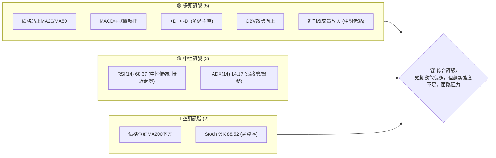

### 📊 核心指標速覽表

| 指標類別 | 指標名稱 | 當前數值 | 訊號 | 解讀 |
|----------|----------|----------|------|------|
| **價格** | 當前價格 | $3.93 | 🟡 | 位於52W區間 21.8%，處於相對低位反彈 |
| **均線** | MA20 | $3.64 | 🟢 | 價格 ($3.93) 在 MA20 上方，短期看多 |
| **均線** | MA50 | $3.60 | 🟢 | 價格 ($3.93) 在 MA50 上方，中期偏多 |
| **均線** | MA200 | $4.51 | 🔴 | 價格 ($3.93) 在 MA200 下方，長期看空 |
| **動能** | RSI(14) | 68.37 | 🟡 | 接近超買區 (70)，動能強勁但需警惕回調 |
| **動能** | MACD | +0.039 | 🟢 | MACD柱狀圖為正，多頭動能佔優 |
| **波動** | ATR | $0.16 | 🟡 | 每日波動約 3.98%，屬中等波動 |
| **趨勢** | ADX(14) | 14.17 | 🟡 | 趨勢強度弱，可能處於盤整或弱勢反彈 |
| **布林帶** | BB %B | 0.84 | 🟡 | 價格接近布林通道上軌，短期動能強勁 |
| **成交量** | 量比(20日) | 0.46x | 🔴 | 最新成交量低於20日均量，反彈量能不足 |
| **量能** | OBV趨勢 | OBV > MA | 🟢 | 量能確認價格上漲，但近期量比偏低 |

### 🏆 技術評分卡

根據當前GRAB的各項技術指標分析，其綜合技術評分為 58/100，屬於中性偏多但需謹慎的評級。短期動能較強，但長期趨勢仍偏弱，且趨勢強度不足，暗示目前可能處於一個震盪反彈或盤整階段，而非強勢趨勢的開始。

```
技術評分卡 — GRAB (2026-07-11)
════════════════════════════════════════════════════
趨勢強度      ███████░░░░░░░░░░░░░░  35/100  🟡 (ADX < 25, 趨勢弱)
動能指標      ██████████████░░░░░░░  70/100  🟢 (MACD正值, RSI高位, Stoch超買)
支撐穩定度    ██████████████░░░░░░░  70/100  🟢 (近期從S1/S2反彈，支撐有效)
成交量配合    ██████░░░░░░░░░░░░░░░  30/100  🔴 (最新量比均量低，量能配合度不足)
形態完整度    ███████░░░░░░░░░░░░░░  35/100  🟡 (無明顯大型形態，局部反彈)
均線排列      ██████████░░░░░░░░░░░  55/100  🟡 (短中期均線多頭排列，但受MA200壓制)
════════════════════════════════════════════════════
綜合評分      ███████████░░░░░░░░░░  58/100  中性偏多
════════════════════════════════════════════════════
```

---

## 2. 趨勢分析

對GRAB的多時框架趨勢進行深入分析，有助於我們理解當前價格行為所處的宏觀背景。

### 🌐 多時框趨勢分析

GRAB的趨勢分析顯示，雖然短期內呈現反彈，但中長期趨勢仍偏弱，受到MA200的顯著壓制。目前價格正試圖挑戰短期阻力，但能否轉化為更強勁的上漲趨勢，仍需觀察。

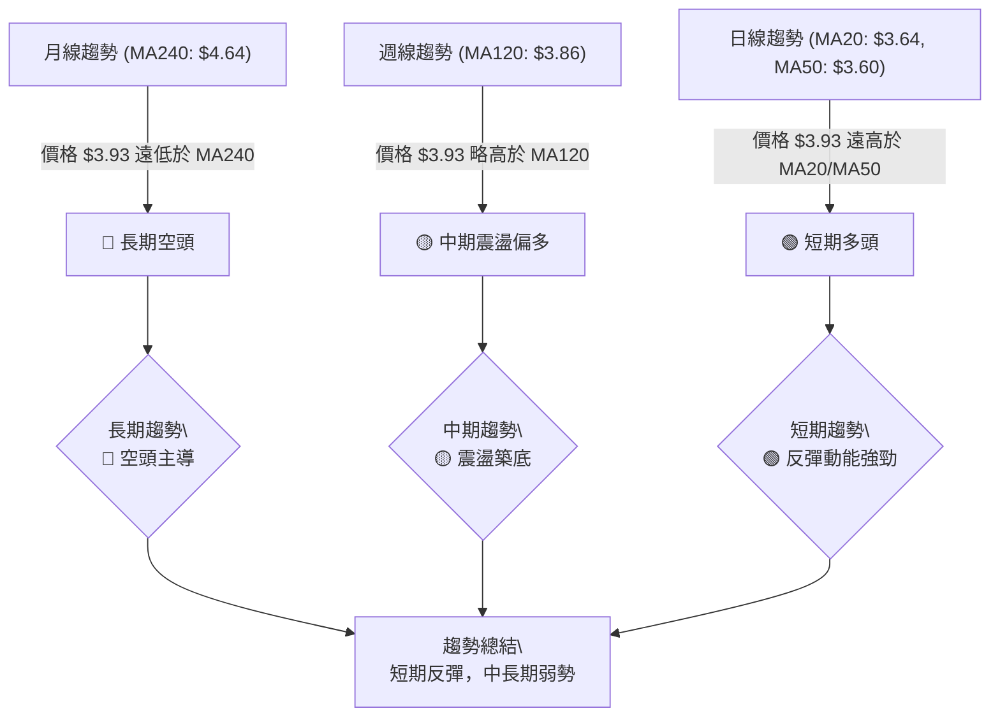

### 📈 長期趨勢 — 12個月走勢圖（Unicode）

GRAB在過去12個月的走勢呈現出一個明顯的下跌趨勢。從2025年9月的階段高點$6.02開始，經歷了持續的回調，直至2026年5-6月觸及低點，隨後有所反彈。當前價格 $3.93 仍遠低於過去一年的高點，並處於長期下降通道中。

```
GRAB 月線走勢圖（過去12個月）
價格軸 ($)
$6.62 ┤                                        (52W High $6.62)
      │                                       
$6.02 ┤                  ●(2025-09高點)       
      │                  ●(2025-10)
$5.45 ┤            ●(2025-11)
      │          ●
$4.99 ┤        ●      ●
      │      ●          ●(2025-12)
$4.89 ┤    ●(2025-07)
      │  ●
$4.53 ┤●(2025-03)
      │
$4.30 ┤            ●(2026-01)
$4.22 ┤              ●(2026-02)
$3.93 ┤─────────────────────────────────●←現在 (2026-07)
$3.82 ┤                    ●(2026-04)
$3.77 ┤                      ●(2026-06)
$3.66 ┤                  ●(2026-03)
$3.54 ┤                      ●(2026-05)
$3.18 ┤                                       (52W Low $3.18)
     └───────────────────────────────────────────────────────────
      2025-07 08 09 10 11 12 2026-01 02 03 04 05 06 07
```

**走勢特徵分析表格**：
| 期間 | 起始價 | 結束價 | 漲跌幅 | 主要特徵 | 訊號 |
|------|--------|--------|--------|----------|------|
| 2025-07 至 2025-10 | $4.89 | $6.01 | +22.9% | 中期上漲趨勢，形成高點 | 🟢 |
| 2025-10 至 2026-03 | $6.01 | $3.66 | -39.1% | 顯著下跌趨勢，回吐大部分漲幅 | 🔴 |
| 2026-03 至 2026-05 | $3.66 | $3.54 | -3.3% | 築底盤整，多次測試低點 | 🟡 |
| 2026-05 至 2026-07 | $3.54 | $3.93 | +11.0% | 短期反彈，從低點回升 | 🟢 |

### 📊 中期趨勢（週線分析）

從週線級別來看，GRAB在2026年3月至5月期間，價格在 $3.50 至 $3.70 區間進行了多次測試，形成了潛在的底部支撐。隨後在6月底至7月初，價格從 $3.30 區域快速反彈至 $3.93，顯示出較強的短期買盤動能。然而，上方 $4.00 附近的心理關口和 $4.28 的阻力位將是中期反彈的關鍵考驗。

**近期壓力與支撐示意圖（週線）**
```
GRAB 週線關鍵價位示意圖
價格 ($)
$4.51 ┤                               (MA200, 強阻力)
$4.28 ┤             R2                (中期阻力)
$3.95 ┤───●───────── R1              (近期阻力/現價附近)
$3.93 ┤───────────────────◄ 現價
$3.64 ┤             MA20              (短期支撐)
$3.60 ┤             MA50              (中期支撐)
$3.50 ┤             S1                (近期支撐)
$3.39 ┤             S2                (關鍵支撐)
$3.18 ┤             S3                (52W Low, 強支撐)
     └──────────────────────────────────
      時間軸
```

### ⚡ 趨勢強度評估（ADX 解讀）

ADX指標用於衡量趨勢的強度，而非方向。GRAB當前的ADX(14)值為14.17，遠低於25的閾值，這明確指示當前市場處於**弱趨勢或盤整行情**。在此類行情中，價格往往在特定區間內震盪，缺乏明確的方向性突破。

- **+DI (20.82)** 略高於 **-DI (18.74)**，表明在當前弱勢趨勢中，多頭力量略佔主導地位，這與近期價格的反彈相符。
- 然而，由於ADX值低，即使+DI略高，也**不應將其解讀為強勁的多頭趨勢**。市場更有可能在支撐與阻力之間來回震盪。

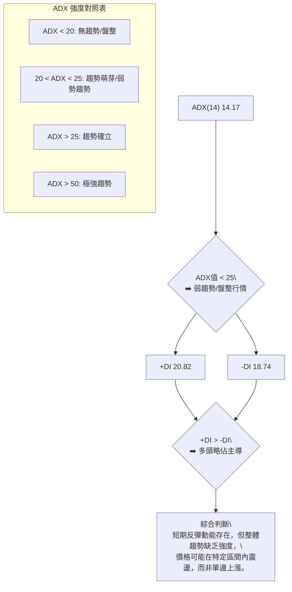

---

## 3. 圖表形態分析

基於提供的月度收盤價和近期週度收盤數據，GRAB尚未形成清晰的、具有高信心度的經典圖表形態（如頭肩、雙底等）。然而，從近期價格行為來看，可以觀察到一些局部特徵，暗示了當前的市場情緒和潛在的未來走勢。

### 🔍 形態識別系統

在當前數據中，未能識別出具備高信心度的經典反轉或持續形態。目前的走勢更傾向於**築底後的局部反彈**，並在歷史阻力位附近遭遇壓力。若要形成明確的形態，需要更多的價格數據和成交量配合。

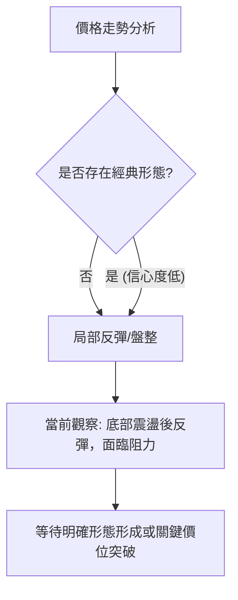

**形態信心度表格**：

| 形態 | 信心度 | 判斷依據（引用數據） | 完成度 | 目標價（附計算式） |
|------|--------|----------------------|--------|--------------------|
| 潛在底部形態 | 40% | 2026-03 ($3.66) 至 2026-05 ($3.54) 區間多次測試低點，形成潛在支撐 $3.50-$3.18 區域。 | 60% | 需確認頸線突破，目前尚無明確頸線。 |
| 上升旗形/通道 | 30% | 2026-05 ($3.54) 至 2026-07 ($3.93) 的反彈走勢，但量能配合度不足，且上方阻力密集。 | 50% | 訊號不足，僅做指標型解讀。 |

由於信心度均低於50%，我們將重點放在指標型解讀和關鍵價位的分析，而非強行推斷複雜形態。

### 🕯️ 重要K線形態分析

根據近20週的收盤數據，我們可以觀察到一些K線的變化，儘管缺乏詳細的每日K線信息，但週K線仍能提供一些線索。

| 日期 | 收盤價 | K線形態 | 解讀 | 訊號 |
|------|--------|---------|------|------|
| 2026-03-15 | $3.71 | 長陰線 | 跌破 $3.98 支撐，開啟一波下跌。 | 🔴 |
| 2026-03-29 | $3.57 | 止跌十字星/小陽線 | 在低位 $3.56 附近止跌，嘗試反彈。 | 🟡 |
| 2026-04-19 | $4.21 | 大陽線 | 突破 $3.90 附近阻力，強勢反彈，但RSI超買。 | 🟢 |
| 2026-05-17 | $3.55 | 長陰線 | 跌破 $3.70 支撐，再次探底。 | 🔴 |
| 2026-06-21 | $3.57 | 陽包陰/反轉陽線 | 從 $3.30 低點強勢反彈，吞噬前一週跌幅。 | 🟢 |
| 2026-07-05 | $3.90 | 大陽線 | 延續反彈動能，突破 $3.55 阻力，量能放大。 | 🟢 |
| 2026-07-12 | $3.93 | 小陽線/高位震盪 | 反彈動能放緩，在 $3.90 附近遇到阻力。 | 🟡 |

### 📉 ASCII 走勢形態示意圖

目前的走勢顯示，GRAB在底部區域經過震盪後，形成了一個短期上升趨勢線，但正面臨水平阻力位的考驗。

```
GRAB 近期走勢形態示意圖
價格 ($)
$4.28 ┤                 ┌─── R2
$3.95 ┤───●─────────── R1 (當前阻力)
$3.93 ┤───────────────────◄ 現價
      │                   ╱
      │                 ╱
      │               ╱
$3.50 ┤─────────S1─────╱
$3.39 ┤───────S2────╱
      │            ╱
$3.18 ┤────────S3──╱ (潛在上升趨勢線)
     └──────────────────────────────────
      時間軸 (局部震盪反彈)
```

### 🎯 形態目標價計算

由於缺乏高信心度的經典圖表形態，我們無法提供基於形態高度的明確目標價。當前的目標價判斷將主要依賴於關鍵阻力位和斐波那契回調位。

*   **局部反彈目標**：若能有效突破近期阻力 R1 ($3.95)，則有望測試 R2 ($4.28)。
*   **潛在底部形態目標**：若未來能形成明確的雙底或頭肩底，其目標價將是頸線位加上形態高度。目前尚未形成明確頸線，故無法計算。

**結論**：由於形態完整度不高，我們將更側重於關鍵支撐與阻力位的分析，以及技術指標的動能判斷，來制定交易策略。

---

## 4. 支撐與阻力

精確識別支撐與阻力位是技術分析的基石。GRAB目前正處於一個關鍵的價位區域，上方阻力重重，但下方也有一定的支撐。

### 🗺️ 關鍵價位分布圖（Unicode）

GRAB的價格目前正處於多重阻力位之下，同時也得到下方支撐位的保護。$3.93 的現價非常接近第一個阻力位 R1 ($3.95)，同時也位於斐波那契 78.6% 回調位 $3.92 附近，顯示此區域為多空爭奪的關鍵。

```
GRAB 價位結構分布圖
═══════════════════════════════════════════════════
$6.62 ║████████████████████████║ 52W High (強阻力)
$5.81 ║████████████████████████║ 斐波那契 23.6%
$5.31 ║████████████████████████║ 斐波那契 38.2%
$4.90 ║████████████████████████║ 斐波那契 50.0%
$4.51 ║████████████████████████║ 強阻力 R3 / MA200
$4.49 ║████████████████████████║ 斐波那契 61.8%
$4.28 ║████████████████████    ║ 阻力 R2
$3.95 ║████████████████████████║ 關鍵阻力 R1
$3.93 ╠════════════════════════╣ ◄ 現價
$3.92 ║▓▓▓▓▓▓▓▓▓▓▓▓▓▓▓▓        ║ 斐波那契 78.6%
$3.50 ║▓▓▓▓▓▓▓▓▓▓▓▓▓▓▓▓        ║ 近期支撐 S1
$3.39 ║████████████████████████║ 強支撐 S2
$3.18 ║████████████████████████║ 強支撐 S3 / 52W Low
═══════════════════════════════════════════════════
```

### 🚧 阻力位分析表

GRAB的上方阻力密集，這將是其反彈路徑上的主要挑戰。尤其是 R1 ($3.95) 和 R2 ($4.28) 構成的區域，若能突破，則有望挑戰更上方的 R3 ($4.51) 和 MA200。

| 阻力級別 | 價位 | 形成原因 | 突破難度 | 重要性 |
|----------|------|----------|----------|--------|
| R1 (近期) | $3.95 | 近期波段高點聚類，與現價接近，且接近斐波那契 78.6% 回調位。 | 中等 | 短期反彈能否延續的關鍵。 |
| R2 (中期) | $4.28 | 過去幾個月多次反彈的高點，也是一個重要的心理關口。 | 較高 | 中期反彈能否轉強的考驗。 |
| R3 (長期) | $4.51 | 過去一年波段高點聚類，同時也是 MA200 所在位置，具有強大的壓制作用。 | 很高 | 決定長期趨勢是否反轉的關鍵。 |

### 🛡️ 支撐位分析表

GRAB的下方支撐相對穩固，特別是 $3.50 和 $3.39 區域，在過去幾個月中多次成功抵禦了下跌壓力。

| 支撐級別 | 價位 | 形成原因 | 守住機率 | 重要性 |
|----------|------|----------|----------|--------|
| S1 (近期) | $3.50 | 近期多次探底反彈點，也是一個重要的心理關口。 | 較高 | 短期回調的買盤介入點。 |
| S2 (中期) | $3.39 | 過去一年波段低點聚類，為強勁技術支撐。 | 很高 | 若跌破則可能觸及52W低點。 |
| S3 (關鍵) | $3.18 | 52週最低價，也是絕對的底部支撐。 | 極高 | 跌破則意味著趨勢嚴重惡化。 |

### 📐 斐波那契回調位分析

斐波那契回調位是基於52週高點 $6.62 和低點 $3.18 計算得出。

*   **0.0% (52W High)**: $6.62
*   **23.6%**: $5.81
*   **38.2%**: $5.31
*   **50.0%**: $4.90
*   **61.8%**: $4.49
*   **78.6%**: $3.92  ◄ 現價 $3.93 位於此回調位附近
*   **100.0% (52W Low)**: $3.18

當前價格 $3.93 位於 **78.6% 回調位 $3.92** 附近。這是一個非常關鍵的價位。
**解讀**：
1.  **多頭角度**：價格從底部反彈，成功突破了多個斐波那契回調位，並在78.6%回調位附近遭遇阻力。如果能站穩 $3.92-$3.95 區域並繼續向上，則可能挑戰 61.8% 回調位 $4.49。
2.  **空頭角度**：78.6% 回調位通常被視為反彈的極限，如果在此處受阻並回落，則可能重新測試下方支撐。
3.  **綜合判斷**：現價處於斐波那契回調的關鍵點，表明市場在此處存在較大的多空分歧。能否有效站穩或突破 $3.92-$3.95 區域，將是判斷短期走勢的關鍵。

---

## 5. 技術指標深度解讀

本章將對GRAB的關鍵技術指標進行詳細分析，包括移動平均線、RSI、MACD、布林通道和成交量，並探討它們之間的相互關係。

### 🎛️ 指標訊號總覽

當前GRAB的技術指標呈現出一個短期偏多、中期震盪、長期偏空的複雜局面。短期動能指標（MACD、RSI）顯示買方力量佔優，但長期趨勢指標（MA200、ADX）則提示謹慎。

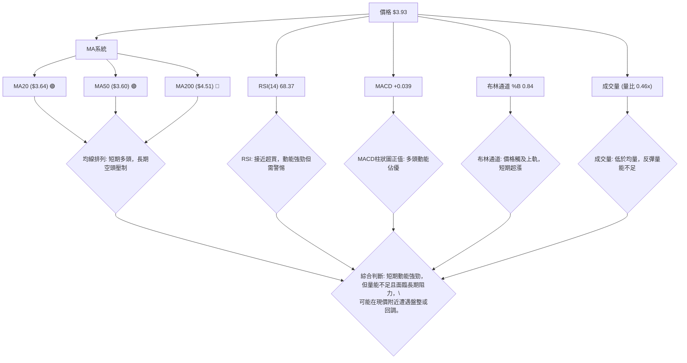

### 📈 移動平均線排列分析

GRAB的移動平均線排列呈現出一個「短期多頭，中長期空頭壓制」的混合訊號。
*   **短期趨勢**：當前價格 $3.93 顯著位於 MA20 ($3.64) 和 MA50 ($3.60) 之上。MA20 位於 MA50 之上，形成短中期均線的多頭排列 (MA20 > MA50)，這是短期走勢偏強的訊號。
*   **長期趨勢**：然而，價格 $3.93 仍遠低於 MA200 ($4.51)。這表明儘管短期有所反彈，但長期下降趨勢的壓力依然存在。MA200 作為一個重要的長期趨勢指標，其壓制作用不容忽視。

**移動平均線狀態**：
*   MA5: $3.88 (價格在其上方) 🟢
*   MA10: $3.83 (價格在其上方) 🟢
*   MA20: $3.64 (價格在其上方) 🟢
*   MA60: $3.67 (價格在其上方) 🟢
*   MA120: $3.86 (價格在其上方) 🟢
*   MA240 (MA200近似值): $4.64 (價格在其下方) 🔴

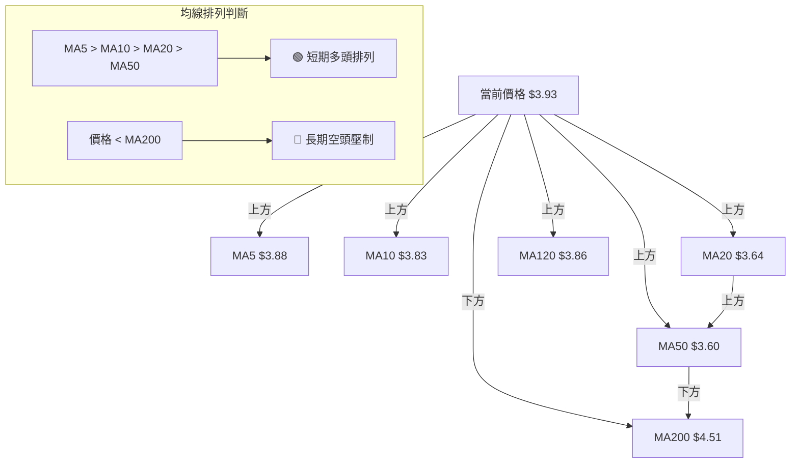

### 📉 RSI(14) 分析

*   **RSI 數值**：當前 RSI(14) 為 **68.37**。
*   **RSI 進度條**：▓▓▓▓▓▓▓▓▓▓▓▓▓▓▓▓▓▓▓▓▓▓▓▓▓▓▓▓▓▓▓▓▓▓▓▓▓▓▓▓▓▓▓▓▓▓▓▓▓▓▓▓▓▓▓▓▓▓▓▓▓▓▓▓▓▓▓▓░░░░░░░░░░░░░░░░░░░░ 68.37%
*   **超買超賣區間分析**：RSI 值位於 30-70 的中性區間內，但已經非常接近 70 的超買區。這表明短期內買盤力量非常強勁，價格上漲動能充足。然而，一旦RSI進入超買區（>70），則預示短期可能面臨回調壓力或漲勢放緩。
*   **背離判斷**：根據提供的數據，**無明顯背離**訊號。價格上漲與RSI的走勢保持一致，沒有出現頂背離（價格創新高但RSI未能創新高），因此當前反彈的動能是健康的，但其持續性仍需觀察。

### 📊 MACD(12/26/9) 訊號解讀

MACD指標顯示GRAB的短期動能偏強，但需注意其持續性。
*   **MACD 線 (0.102)** 位於 **Signal 線 (0.064)** 之上，形成黃金交叉，這是明確的**多頭訊號**。
*   **MACD 柱狀圖 (+0.039)** 為正值並持續放大（從上週的+0.062降至本週的+0.039，略有縮小，但仍為正），表明多頭動能依然佔據主導地位，但可能面臨動能減弱的風險。

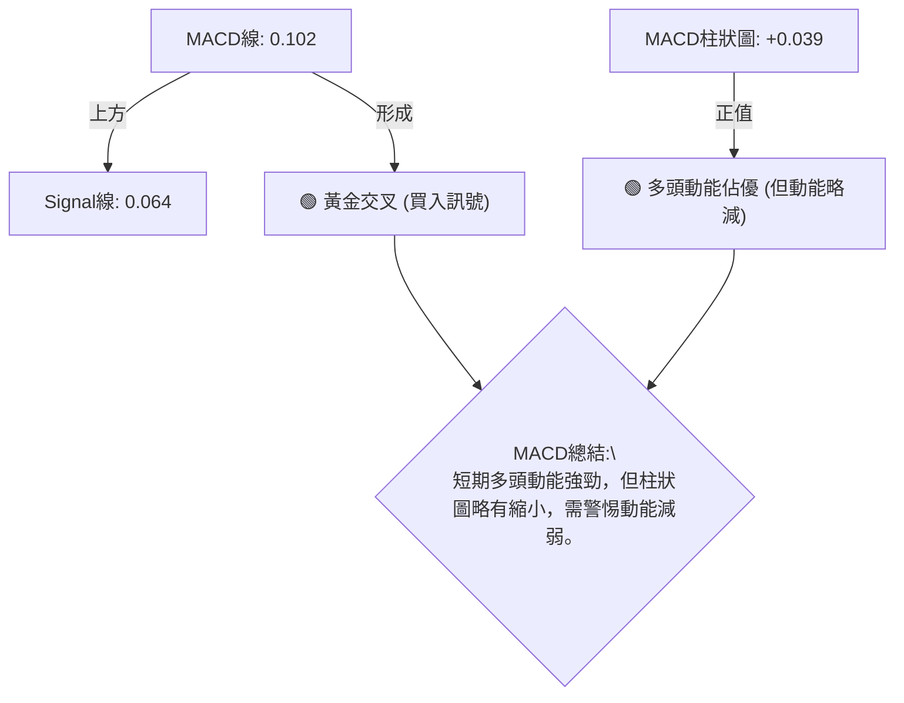

### 📦 布林通道分析

布林通道能有效衡量價格的波動區間和相對位置。

*   **BB上軌**: $4.07
*   **BB中軌 (MA20)**: $3.64
*   **BB下軌**: $3.21
*   **當前價格**: $3.93
*   **BB %B**: 0.84

**ASCII 布林通道示意圖**：
```
GRAB 布林通道示意圖
價格 ($)
$4.07 ┤─────────────────────── BB上軌 (上限)
      │                     ●
$3.93 ┤───────────────────◄ 現價
      │                     ●
      │                     ●
$3.64 ┤─────────────────────── BB中軌 (MA20)
      │                     ●
      │                     ●
$3.21 ┤─────────────────────── BB下軌 (下限)
     └───────────────────────────────────
      時間軸
```

**解讀**：
1.  **價格位置**：當前價格 $3.93 位於布林通道上軌附近 (BB %B = 0.84)。這表明價格在短期內已經經歷了較大的上漲，並觸及了通道的上限。
2.  **通道寬度**：數據中未直接給出布林帶寬度，但從上軌 $4.07、中軌 $3.64、下軌 $3.21 的距離來看，通道寬度約為 $0.86 (上軌-下軌)。這表明波動性適中。
3.  **潛在回調**：價格觸及上軌往往預示著短期超買，可能面臨回調或橫盤整理的壓力，以消化前期漲幅。除非有強大的利好消息或成交量配合突破上軌，否則應警惕上漲動能的衰竭。

### 💹 成交量分析（量價配合度）

成交量是衡量市場參與度和趨勢可信度的重要指標。

*   **最新成交量**: 24,886,100 股
*   **20日均量**: 53,955,130 股
*   **50日均量**: 52,239,826 股
*   **量比**: 0.46x (最新成交量 / 20日均量)

**解讀**：
1.  **量能不足**：當前成交量 (24.8M) 顯著低於 20日均量 (53.9M) 和 50日均量 (52.2M)，量比僅為 0.46x。這是一個**紅色警訊** 🔴。價格在反彈過程中，成交量未能有效放大，說明買盤追高意願不足，或主力資金介入不深。
2.  **OBV趨勢**：OBV趨勢顯示「OBV > MA」，這是一個**多頭訊號** 🟢，表明累積的買盤力量大於賣盤，量能支撐了過去一段時間的上漲。然而，最新的低量比與OBV的趨勢形成一定矛盾，暗示近期反彈的持續性可能受到考驗。
3.  **量價背離**：雖然OBV趨勢正面，但當前價格在挑戰阻力位時，成交量卻顯著萎縮。這構成了潛在的**量價背離**，即價格上漲但量能未能跟上。這種背離增加了短期回調的風險，或至少預示著上漲動能的減弱。

**總結**：儘管許多動能指標顯示短期偏多，但成交量未能有效配合，這是一個重要的警示訊號。在缺乏量能支撐的情況下，價格突破阻力位的難度將增加，回調的風險也隨之上升。

---

## 6. 動能與波動率

本章將從動能和波動率兩個維度對GRAB進行評估，以更全面地理解其市場行為和風險特性。

### ⚡ 動能評估四象限

我們根據RSI和MACD來評估動能強度，根據ATR和Beta來評估波動率。

| 象限 | 動能 (RSI/MACD) | 波動 (ATR/Beta) | 當前狀態 | 評估 |
|------|-----------------|-----------------|----------|------|
| Q1 | 強 (RSI 68.37, MACD正值) | 低 (ATR $0.16, Beta 0.875) | - | 最佳機會 (動能強勁，波動可控) |
| Q2 | 弱 (RSI 68.37, MACD正值) | 低 (ATR $0.16, Beta 0.875) | - | 謹慎觀望 (動能不足，但風險較低) |
| Q3 | 強 (RSI 68.37, MACD正值) | 高 (ATR $0.16, Beta 0.875) | - | 高風險高收益 (動能強但波動大，需嚴格風控) |
| Q4 | 弱 (RSI 68.37, MACD正值) | 高 (ATR $0.16, Beta 0.875) | - | 避免進場 (動能弱且波動大，風險高) |

**GRAB 當前狀態分析**：
*   **動能評估**：RSI 68.37 接近超買，MACD柱狀圖為正，表明短期動能強勁。評為「強動能」。
*   **波動率評估**：ATR 為 $0.16 (佔價格 3.98%)，Beta 為 0.875。ATR 顯示每日波動幅度適中，Beta 小於1，顯示其波動性略低於大盤。因此，波動率評為「低波動」。

**綜合判斷**：GRAB 目前處於 **Q1: 最佳機會** 象限的邊緣，即動能強勁但波動率相對較低。這通常是趨勢交易者尋找的入場點。然而，需要注意的是，RSI已接近超買，且成交量配合度不足，這可能導致其從「最佳機會」象限滑向「高風險高收益」象限，或者在阻力位前遭遇回調。

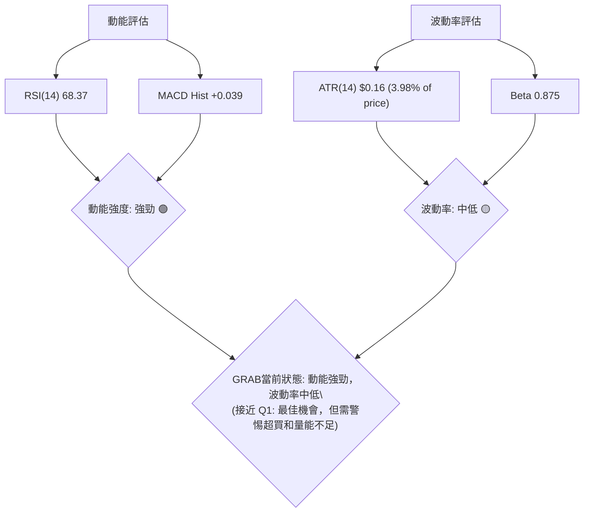

### 📊 ATR 波動率分析

*   **ATR(14)**：$0.16
*   **佔價格比重**：3.98%

**解讀**：
1.  **波動性**：GRAB的ATR為 $0.16，佔當前價格 $3.93 的 3.98%。這表明GRAB在過去14天內的平均每日價格波動幅度約為 $0.16。相對於其股價而言，這個波動幅度屬於**中等水平**。它既不像低波動股票那樣沉悶，也不像高波動股票那樣劇烈。
2.  **止損距離建議**：ATR 是設定止損點的實用工具。通常，交易者會將止損設在當前價格下方 1.5 倍至 3 倍 ATR 的位置，以避免被正常市場噪音震出。
    *   1.5x ATR = 1.5 * $0.16 = $0.24
    *   2x ATR = 2 * $0.16 = $0.32
    *   3x ATR = 3 * $0.16 = $0.48
    因此，若考慮進場，止損點可參考當前價格 $3.93 減去 $0.24 至 $0.48，即在 $3.69 至 $3.45 之間尋找合適的支撐位作為止損依據。這與 S1 ($3.50) 和 S2 ($3.39) 的位置相符，提供了合理的止損緩衝區。

### 📐 Beta 與市場相關性

*   **Beta**: 0.875

**解讀**：
1.  **市場敏感度**：GRAB的Beta值為 0.875，小於 1。這意味著GRAB的股價波動性略低於整體市場（通常以S&P 500指數為基準）。當市場上漲1%時，GRAB預計上漲0.875%；當市場下跌1%時，GRAB預計下跌0.875%。
2.  **投資組合影響**：對於追求穩定性的投資者而言，Beta值小於1的股票可以在一定程度上降低投資組合的整體波動風險。然而，這也意味著在牛市中，GRAB的漲幅可能不及大盤；在熊市中，其跌幅也可能相對較小。
3.  **相關性**：Beta值雖然反映了與市場的相關性，但並非完全獨立於市場。在極端市場情緒下，所有股票仍可能受到大盤的影響。因此，在進行交易決策時，仍需關注整體市場走勢。

---

## 7. 多時框架總結

本章將整合前述所有分析，從多時框架的角度對GRAB的技術面進行全面總結，並給出最終的趨勢收斂結論。

### 📋 時框架評分表

| 時框架 | 趨勢方向 | 動能 | 均線排列 | 形態 | 綜合評分 (1-10) | 建議 |
|--------|----------|------|----------|------|-----------------|------|
| **日線 (短期)** | 🟢 上行 | 🟢 強勁 | 🟢 多頭排列 (MA5>MA10>MA20>MA50) | 🟡 局部反彈 | 7/10 | 考慮短線追漲，但需注意阻力 |
| **週線 (中期)** | 🟡 震盪 | 🟢 增強 | 🟡 價格站上MA120，但MA200壓制 | 🟡 築底反彈 | 6/10 | 觀望突破，或逢低布局 |
| **月線 (長期)** | 🔴 下行 | 🟡 減弱 | 🔴 價格遠低於MA200/MA240 | 🔴 長期下降 | 3/10 | 避免長期持有，或等待趨勢反轉 |

### 🔲 綜合訊號矩陣

| 指標/時框 | 短期 (日線) | 中期 (週線) | 長期 (月線) | 一致性 |
|-----------|-------------|-------------|-------------|--------|
| **價格趨勢** | 🟢 上行 | 🟡 震盪反彈 | 🔴 下行 | 低 |
| **動能指標** | 🟢 強勁 (RSI, MACD) | 🟢 增強 (MACD柱) | 🟡 中性偏弱 | 中 |
| **均線排列** | 🟢 多頭 (MA20>MA50) | 🟡 震盪 (價格>MA120, <MA200) | 🔴 空頭 (價格<MA200) | 低 |
| **支撐阻力** | 🟢 支撐有效 | 🟡 面臨阻力 | 🔴 強阻力 (MA200) | 低 |
| **成交量** | 🔴 萎縮 | 🟡 波動 | 🟡 波動 | 中 |
| **ADX趨勢強度** | 🟡 弱趨勢/盤整 | 🟡 弱趨勢/盤整 | 🟡 弱趨勢/盤整 | 高 |

**綜合訊號分析**：
短期內，GRAB呈現出較為強勁的反彈動能，多數日線級別指標發出買入訊號。然而，中期和長期趨勢依然偏弱，特別是價格仍受MA200的長期壓制。ADX指標在所有時框架下均顯示為弱趨勢或盤整，這是一個重要的收斂點，表明當前的反彈缺乏強勁的趨勢支持。量能的不足也進一步削弱了短期反彈的可靠性。

### ⚖️ 多時框收斂結論

根據嚴格要求14：
1.  **判斷趨勢行情或盤整行情**：ADX(14)值為14.17，遠低於25，明確指示GRAB目前處於**弱趨勢/盤整行情**。
2.  **主導時框**：在盤整行情中，日線布林通道上下軌為主要交易區間，但考慮到短期動能強勁且接近關鍵阻力，我們需綜合日線和週線的表現。
3.  **結論收斂**：
    *   **短期動能**：日線級別指標（RSI、MACD、短期均線）顯示強勁的短期反彈動能。價格已站上MA20和MA50，且MACD柱狀圖為正，RSI接近超買。
    *   **中期阻力**：價格正接近斐波那契78.6%回調位 $3.92 和 R1 $3.95，以及布林通道上軌 $4.07，這是一個重要的阻力區。
    *   **長期壓制與趨勢強度不足**：價格仍位於MA200 ($4.51) 之下，長期趨勢依然偏空。ADX的低值進一步確認了當前市場缺乏強勁的趨勢，反彈更可能演變為區間震盪。成交量在反彈過程中萎縮，也對反彈的持續性構成挑戰。

**最終結論**：GRAB股票目前處於**短期反彈動能強勁但缺乏長期趨勢支撐的盤整格局**。價格正在測試關鍵阻力位 $3.92-$3.95 區域，同時面臨布林通道上軌和MA200的長期壓制。由於ADX顯示為弱趨勢/盤整，且成交量配合度不足，預計短期內價格在此阻力區間遭遇震盪或小幅回調的機率較大。**綜合判斷為中性偏多，但需警惕阻力位壓力，等待明確突破。**

---

## 8. 交易策略建議

基於多時框架分析及綜合評分卡的結果（綜合評分 58/100，中性偏多），GRAB當前處於短期反彈但面臨長期阻力的盤整格局。因此，主策略將側重於觀察突破，並在關鍵阻力位附近採取謹慎態度。

### 🗺️ 策略決策流程圖

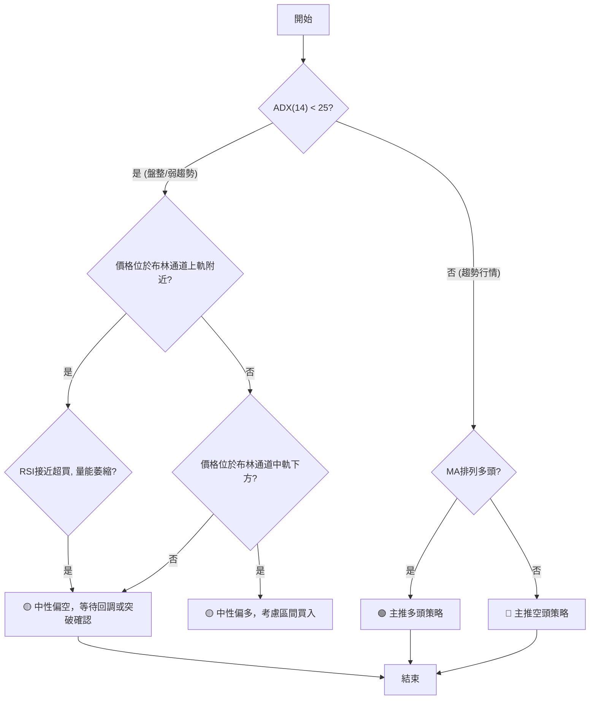

### 🧭 策略路由（依評分卡分流）

**當前主策略方向 = 🟡 中性偏多，等待突破確認 (依評分 58/100)**

由於綜合評分介於40-60之間，且ADX指示為盤整行情，主策略將以**觀察區間操作與等待突破確認**為主。不建議盲目追漲，而應在關鍵阻力位附近保持謹慎。

### 🎯 價格情境階梯（Price Scenarios）

| 觸發條件 | 下一目標 | 後續延伸 | 情境含義 |
|----------|----------|----------|----------|
| **突破 R1 $3.95 並站穩** | R2 $4.28 | R3 $4.51 (MA200) | 短線轉強，有望挑戰MA200。 |
| **站穩現價區間 ($3.90-$3.95)** | — | — | 區間震盪，消化前期漲幅。 |
| **跌破 S1 $3.50** | S2 $3.39 | S3 $3.18 (52W Low) | 中期轉弱，可能重新測試底部。 |

### 📊 情境機率分佈

| 情境 | 機率 | 主要依據 |
|------|------|----------|
| 繼續上行 / 反彈 (突破 $3.95) | 35% | MACD黃金交叉、RSI高位、OBV趨勢向上、短期均線多頭排列。 |
| 區間震盪 ($3.50-$3.95) | 45% | ADX弱趨勢、價格接近布林上軌、RSI接近超買、成交量萎縮、R1阻力強勁。 |
| 回落 / 再探底 (跌破 $3.50) | 20% | 量價背離、RSI從超買區回落、未能突破R1而形成雙頂、整體長期趨勢仍偏空。 |

### 🟢 主策略詳情 (中性偏多，等待突破確認)

**策略 A：突破追漲策略 (較為激進，需量能配合)**

| 策略要素 | 策略 A (突破追漲) |
|----------|-------------------|
| 進場條件 | 價格有效突破 R1 ($3.95) 並伴隨顯著放量 (量比 > 1.0x)。 |
| 進場價格 | $3.98 (確認突破 R1) |
| 目標價 T1 | $4.28 (R2) |
| 目標價 T2 | $4.51 (R3 / MA200) |
| 止損價格 | $3.85 (跌破 R1 失敗) |
| 風險報酬比 | T1: (4.28-3.98)/(3.98-3.85) = 0.3 / 0.13 ≈ 2.3:1 <br> T2: (4.51-3.98)/(3.98-3.85) = 0.53 / 0.13 ≈ 4.1:1 |
| 成功機率 | 35% (需強力量能配合) |
| 建議倉位 | 輕倉 (不超過總資金 5%) |

**策略 B：逢低買入策略 (較為保守，等待回調)**

| 策略要素 | 策略 B (逢低買入) |
|----------|-------------------|
| 進場條件 | 價格回調至 S1 ($3.50) 附近並出現止跌訊號 (如長下影線、陽線吞噬)。 |
| 進場價格 | $3.55 (確認止跌) |
| 目標價 T1 | $3.95 (R1) |
| 目標價 T2 | $4.28 (R2) |
| 止損價格 | $3.35 (跌破 S2 $3.39) |
| 風險報酬比 | T1: (3.95-3.55)/(3.55-3.35) = 0.4 / 0.2 = 2:1 <br> T2: (4.28-3.55)/(3.55-3.35) = 0.73 / 0.2 ≈ 3.65:1 |
| 成功機率 | 45% (若進入區間震盪) |
| 建議倉位 | 中等倉位 (不超過總資金 10%) |

### 🔴 反向風險觸發點（對沖提示）

以下情況可能推翻主策略，應考慮止損或對沖：
1.  **跌破 S1 ($3.50)**：若價格未能守住 $3.50，可能預示短期反彈結束，並可能測試更低的 S2 ($3.39)。
2.  **MACD死叉或柱狀圖轉負**：MACD多頭動能減弱甚至轉空，需警惕。
3.  **RSI跌破50**：RSI從高位回落並跌破50，表明多頭力量減弱。
4.  **成交量持續萎縮且價格無法突破 R1 ($3.95)**：量價背離持續，突破失敗，可能導致價格回落。

### ⭐ 整體訊號強度評星

```
做多訊號強度：★★★☆☆  (3/5星) (短期動能強，但面臨阻力且量能不足)
做空訊號強度：★★☆☆☆  (2/5星) (長期趨勢偏空，但短期有反彈動能)
整體可信度：  ★★★☆☆  (3/5星) (中性偏多，需等待突破確認或回調介入)
```

---

## 9. 風險提示與監控

投資GRAB存在多重風險，包括市場波動、公司特定風險以及技術面反轉風險。本章將提供關鍵監控指標和風險管理建議。

### ✅ 關鍵監控指標 Checklist

以下是交易GRAB時需要密切關注的關鍵技術指標清單，以確保及時調整策略。

```
╔══════════════════════════════════════════════════════════════╗
║ GRAB 關鍵監控指標 Checklist                                  ║
╠══════════════════════════════════════════════════════════════╣
║ [ ] 價格是否有效站穩 $3.95 (R1)？                            ║
║ [ ] 成交量是否伴隨突破放大 (量比 > 1.0x)？                   ║
║ [ ] MACD柱狀圖是否持續為正，或出現死叉？                     ║
║ [ ] RSI是否從超買區回落，或跌破50？                          ║
║ [ ] ADX是否開始上升 (>25)，確認趨勢形成？                    ║
║ [ ] 價格是否跌破 $3.50 (S1)？                                ║
║ [ ] 布林通道是否收窄或擴張，價格是否突破上下軌？             ║
║ [ ] 52W Low $3.18 是否被再次測試或跌破？                     ║
╚══════════════════════════════════════════════════════════════╝
```

### ⚠️ 風險場景分析

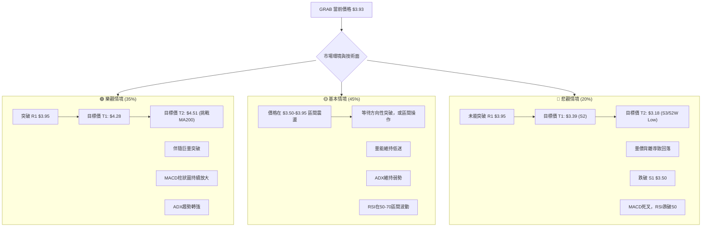

### 🛡️ 風險管理重要提醒

1.  **嚴格止損**：無論採取何種策略，都必須設定並嚴格執行止損點。在盤整或弱趨勢行情中，價格波動可能突然加劇，止損是保護資金的最後防線。
2.  **倉位管理**：避免重倉單一股票，尤其是在趨勢不明朗或面臨重大阻力時。建議採用分批建倉或減倉的方式，根據市場訊號逐步調整倉位。對於激進的突破策略，倉位應更輕。
3.  **關注成交量**：成交量是判斷反彈或突破有效性的關鍵。在沒有量能配合的情況下，任何突破都應被視為假突破的風險。
4.  **多指標確認**：不要依賴單一指標的訊號。在作出交易決策前，應尋求多個指標（如價格行為、均線、動能指標、成交量）的相互確認。
5.  **市場消息面**：雖然本報告專注於技術分析，但突發的財報、行業新聞或宏觀經濟數據仍可能對股價產生重大影響。保持對基本面和新聞的關注，以應對潛在的非技術性風險。
6.  **時間框架匹配**：確保你的交易策略與所選擇的時間框架一致。短期交易者應更關注日線和小時線圖，而中長期投資者則應以週線和月線圖為主。

---

## 📋 報告總結

```
GRAB 技術分析報告總結
════════════════════════════════════════════════════════
報告日期：2026-07-11
當前價格：$3.93
分析評級：⚖️ 中性偏多 (短期動能強勁，但面臨阻力且趨勢強度不足)

關鍵結論：
├─ 長期趨勢：🔴 下行 (價格遠低於MA200)
├─ 中期趨勢：🟡 震盪反彈 (價格位於MA120上方，但受MA200壓制)
├─ 短期趨勢：🟢 上行 (價格站上MA20/MA50，MACD柱狀圖為正)
├─ 關鍵支撐：$3.50 (S1) / $3.39 (S2)
├─ 關鍵阻力：$3.95 (R1) / $4.28 (R2) / $4.51 (R3/MA200)
└─ 分析師目標：無明確形態目標，短期目標關注 R1-R3 區間。

最優策略組合：
1. 🥇 最佳機會：等待價格回調至 S1 ($3.50) 附近，並出現止跌訊號時逢低買入，目標 R1 ($3.95) 或 R2 ($4.28)。此策略風險報酬比更優，成功機率較高。
2. 🥈 次選機會：若價格能有效突破 R1 ($3.95) 並伴隨顯著放量，可考慮輕倉追漲，目標 R2 ($4.28) 或 R3 ($4.51)。此策略較激進，需嚴格止損。
3. 🥉 保守選擇：在 $3.50-$3.95 區間內進行高拋低吸的短線操作，但需注意量能變化和布林通道上下軌。
════════════════════════════════════════════════════════
```

---

> ⚠️ **免責聲明**：本報告為 AI 自動生成之技術分析，所有數據及估算均基於提供的歷史價格資訊。本報告**僅供研究與學術參考**，**不構成任何投資建議**。投資有風險，入市需謹慎。

---

*報告生成時間：2026-07-11 ｜ 數據來源：Yahoo Finance ｜ 分析框架：多時框技術分析*