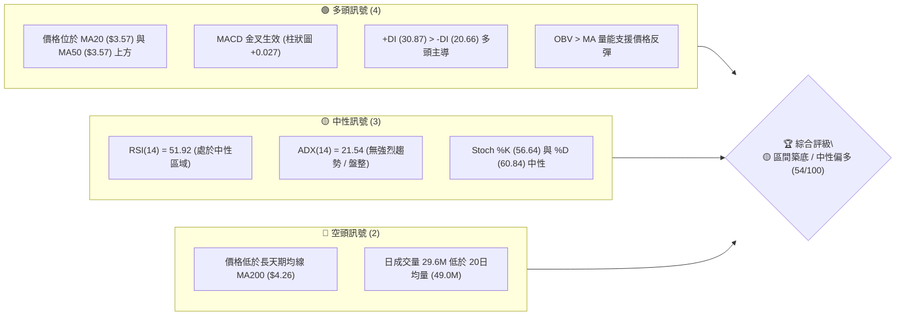
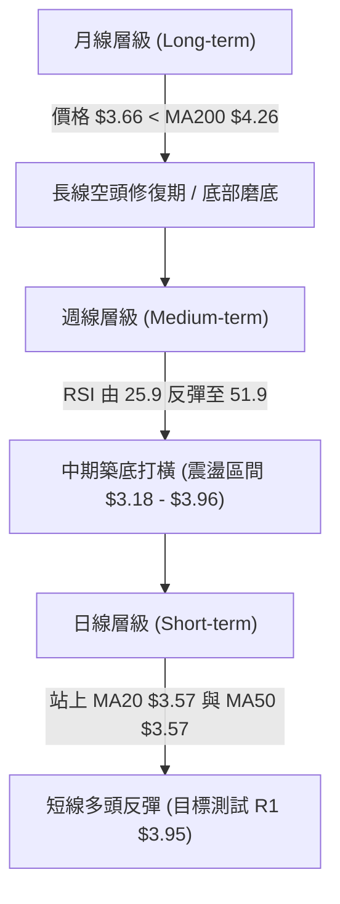
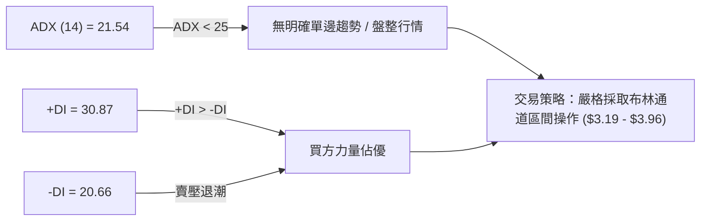
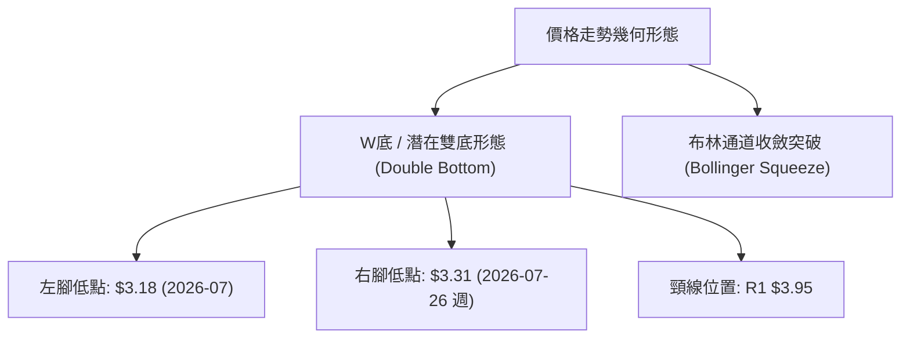
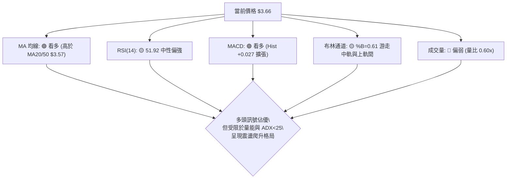
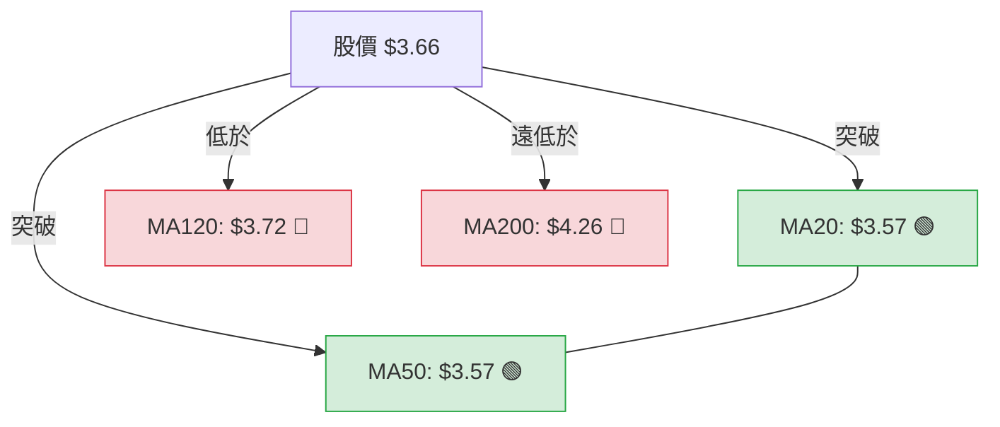
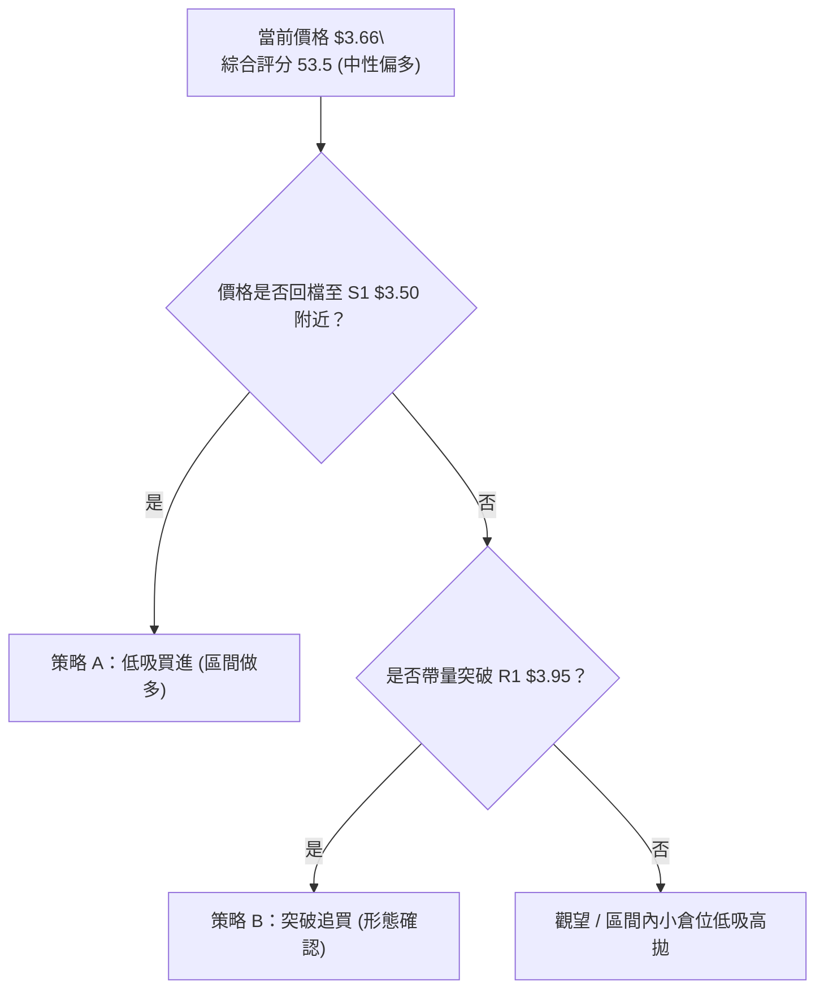
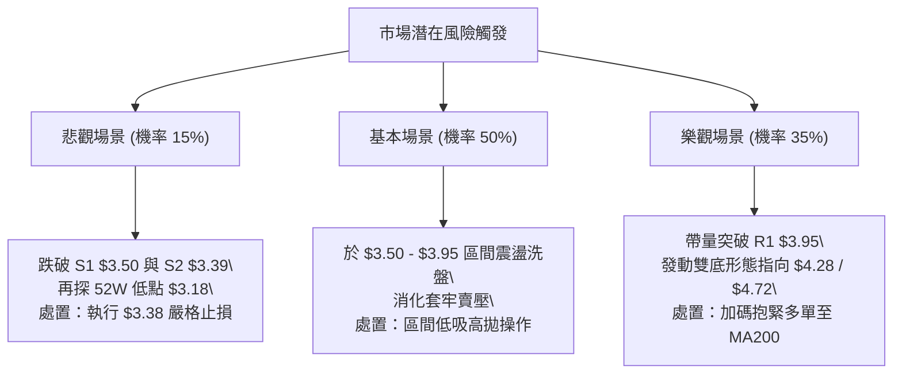

# GRAB 技術分析報告

> **報告日期**：2026-08-07 ｜ **語言**：繁體中文 ｜ **數據來源**：Yahoo Finance ｜ **當前價格**：$3.66

---

## 目錄

| 章節 | 內容 |
|------|------|
| [1. 技術面概覽](#1-技術面概覽) | 訊號儀表板、核心指標、評分卡 |
| [2. 趨勢分析](#2-趨勢分析) | 多時框趨勢、長中短期走勢 |
| [3. 圖表形態分析](#3-圖表形態分析) | 形態識別、K線組合、目標價 |
| [4. 支撐與阻力](#4-支撐與阻力) | 關鍵價位、斐波那契回調 |
| [5. 技術指標深度解讀](#5-技術指標深度解讀) | MA/RSI/MACD/布林/成交量 |
| [6. 動能與波動率](#6-動能與波動率) | 動能評估、ATR、Beta |
| [7. 多時框架總結](#7-多時框架總結) | 時框架評分矩陣 |
| [8. 交易策略建議](#8-交易策略建議) | 多空策略、風險報酬比 |
| [9. 風險提示與監控](#9-風險提示與監控) | 監控指標、風險場景 |

---

## 1. 技術面概覽

### 🎯 技術訊號儀表板



### 📊 核心指標速覽表

| 指標類別 | 指標名稱 | 當前數值 | 訊號 | 解讀 |
|----------|----------|----------|------|------|
| **價格** | 當前價格 | $3.66 | 🟡 中性 | 處於 52 週區間 ($3.18 - $6.62) 之 14.0% 低位 |
| **均線** | MA20 | $3.57 | 🟢 看多 | 價格突破並站上短期月線 ($3.57) |
| **均線** | MA50 | $3.57 | 🟢 看多 | 價格位於季線上方，MA20 與 MA50 形成黃金交叉預備 |
| **均線** | MA200 | $4.26 | 🔴 看空 | 價格仍遠低於長期年線 ($4.26)，長線空頭架構未變 |
| **動能** | RSI(14) | 51.92 | 🟡 中性 | 由超賣區強勢反彈至 50 中軸之上，多頭動能修復 |
| **動能** | MACD | +0.027 | 🟢 看多 | DIF(0.004) 上穿 DEA(-0.023)，柱狀圖維持正向擴張 |
| **動能** | ADX(14) | 21.54 | 🟡 中性 | ADX < 25 表示處於無明確單邊趨勢的震盪築底階段 |
| **波動** | ATR(14) | $0.14 | 🟢 適中 | 占股價 3.91%，波動率收斂，適合區間擺盪操作 |

### 🏆 技術評分卡

```
╔══════════════════════════════════════════════════════════════╗
║             技術評分卡 — GRAB (2026-08-07)                  ║
╠══════════════════════════════════════════════════════════════╣
║ 趨勢強度      ▓▓▓▓▓▓▓▓░░░░░░░░░░░░  42/100  🟡 中性 (ADX=21.5)║
║ 動能指標      ▓▓▓▓▓▓▓▓▓▓▓▓░░░░░░░░  60/100  🟢 看多 (MACD金叉)║
║ 支撐穩定度    ▓▓▓▓▓▓▓▓▓▓▓▓▓▓░░░░░░  70/100  🟢 強固 ($3.18/3.50)║
║ 成交量配合    ▓▓▓▓▓▓▓▓░░░░░░░░░░░░  40/100  🔴 偏弱 (量比0.60x)║
║ 形態完整度    ▓▓▓▓▓▓▓▓▓▓▓░░░░░░░░░  55/100  🟡 潛在雙底打底中 ║
║ 均線排列      ▓▓▓▓▓▓▓▓▓▓░░░░░░░░░░  50/100  🟡 混合排列 (糾結) ║
╠══════════════════════════════════════════════════════════════╣
║ 綜合評分      ▓▓▓▓▓▓▓▓▓▓▓░░░░░░░░░  53.5/100 🟡 區間偏多築底 ║
╚══════════════════════════════════════════════════════════════╝
```

---

## 2. 趨勢分析

### 🌐 多時框趨勢分析



### 📈 長期趨勢 — 12個月走勢圖（Unicode）

```
GRAB 月線走勢圖（2025-09 至 2026-08）
價格軸 ($)
$6.62 ┤
$6.00 ┤     ●  ●
$5.50 ┤        │  ●
$5.00 ┤        │  │  ●
$4.50 ┤        │  │  │  ●  ●
$4.00 ┤        │  │  │  │  │  │  │  ●
$3.50 ┤        │  │  │  │  │  │  │  │  ●  ●  ●  ●  ●←現價 $3.66
$3.18 ┤────────┴──┴──┴──┴──┴──┴──┴──┴──┴──┴──┴──┴──● (52W Low $3.18)
      └───────────────────────────────────────────────
       09 10 11 12 01 02 03 04 05 06 07 08 (月份)
      │── 2025 年 ───│─────── 2026 年 ─────────│
```

**走勢特徵分析表格**：

| 時間階段 | 價格區間 | 漲跌幅 | 走勢特徵與市場行為解讀 |
|----------|----------|--------|------------------------|
| **2025/09 - 2025/10** | $6.02 → $6.01 | -0.16% | 觸及 52 週高點 $6.62 附近後在高檔進行高位震盪出貨 |
| **2025/11 - 2026/03** | $5.45 → $3.66 | -32.84% | 流暢的主跌段，連續跌破 MA50 與 MA200，賣壓劇烈釋放 |
| **2026/04 - 2026/05** | $3.82 → $3.54 | -7.33% | 進入底部打橫初階段，多次測試 $3.50 支撐線 |
| **2026/06 - 2026/08** | $3.77 → $3.66 | -2.92% | 下探 52 週低點 $3.18 / $3.31 後展開強勁止跌回升，MA20/50 走平 |

### 📊 中期趨勢（週線分析）

近 20 週數據顯示，GRAB 在 2026 年 7 月下旬探底至 $3.31 後，週線 RSI 由 25.9（超賣）急銳反彈至 51.9，且週線 MACD 柱狀圖由 -0.069 轉正擴張至 +0.027。這表明中期下跌動能已被消耗殆盡，市場已由「單邊下行」轉入「$3.18 - $3.96 布林區間震盪築底」架構。

### ⚡ 趨勢強度評估（ADX 解讀）



**ADX 強度對照表**：

| 指標項 | 當前數值 | 門檻分類 | 趨勢判定 | 策略指導 |
|--------|----------|----------|----------|----------|
| **ADX** | 21.54 | < 25 | 弱趨勢 / 震盪 | 避免追漲殺跌，採取低買高賣高拋低吸策略 |
| **+DI** | 30.87 | > 20 | 多頭佔優 | 短線回檔買盤承接意願高 |
| **-DI** | 20.66 | < 25 | 空頭受壓 | 空頭主導力道衰退，無下行加速風險 |

---

## 3. 圖表形態分析

### 🔍 形態識別系統



**形態信心度與目標價計算表**：

| 形態名稱 | 信心度 | 判斷依據（引用數據） | 完成度 | 目標價計算式與精確數值 |
|----------|--------|----------------------|--------|------------------------|
| **潛在雙底 (Double Bottom)** | 58% | 1. 2026-07 低點 $3.18 與 07-26 低點 $3.31 形成二次打底<br>2. MACD 柱狀圖強烈轉正 (+0.027) | 65% | 頸線 R1 ($3.95) + 形態高度 ($3.95 - $3.18 = $0.77)<br>= **$4.72**（註：若成功突破，延伸目標指向斐波那契 61.8% $4.49 與 MA240 $4.52 區域） |
| **布林中軌支撐反彈** | 80% | 價格 $3.66 成功站上布林中軌 MA20 ($3.57)，%B 達 0.61 | 90% | 通道上軌阻力 = **$3.96** |

### 🕯️ 重要K線形態分析

| 週期/日期 | 收盤價 | K線形態 | 解讀 | 訊號 |
|-----------|--------|---------|------|------|
| **2026-07-26 (週)** | $3.31 | 長下影錘子線 | 探底 52W 低點區 $3.18 附近後獲強勁買盤支撐拉回 | 🟢 轉向訊號 |
| **2026-08-02 (週)** | $3.50 | 低檔長陽實體 | 吞噬前一週陰線實體，確認短線底部成立 | 🟢 看多確認 |
| **2026-08-09 (週)** | $3.66 | 中陽線連續推進 | 站上 MA20 與 MA50 重疊處 ($3.57)，多頭奪回控制權 | 🟢 強勢續揚 |

### 📉 ASCII 走勢形態示意圖

```
GRAB 潛在雙底 (W-Bottom) 打底架構示意圖

$3.95 ┤─────────────────────── Neckline (頸線 / R1) ───────────
      │                       /\
$3.66 ┤                      /  \◄─── 當前價格 ($3.66)
      │         /\          /
$3.50 ┤────────/──\────────/──────── S1 支撐位 ────────────────
      │       /    \      /
$3.31 ┤      /      \    / ◄─── 右腳 ($3.31)
$3.18 ┤  ──● ────────\──/ ───── 52W 低點 / 左腳 ($3.18)
      └────────────────────────────────────────────────────────
```

### 🎯 形態目標價計算

根據雙底形態（W-Bottom）量測目標價原理：
1. **形態底部低點**：取 52 週最低點 $3.18
2. **形態頸線阻力**：取近一年波段高點聚類 R1 = $3.95
3. **形態垂直高度**：$3.95 - $3.18 = $0.77
4. **最小測量目標價**：頸線 $3.95 + 形態高度 $0.77 = **$4.72**
   *(此目標價位落於 MA200 $4.26 與 MA240 $4.52 上方，且接近斐波那契 61.8% $4.49)*

---

## 4. 支撐與阻力

### 🗺️ 關鍵價位分布圖（Unicode）

```
GRAB 價位結構分布圖 (當前價格: $3.66)
═════════════════════════════════════════════════════════════
$6.62 ║████████████████████████████████║ 52週歷史高點 (0.0% Fib)
$4.49 ║██████████████████████          ║ 斐波那契 61.8% 回調位
$4.28 ║██████████████████              ║ 強阻力 R3 (MA200 $4.26 疊加)
$4.06 ║██████████████                  ║ 阻力 R2
$3.96 ║██████████                      ║ 布林通道上軌
$3.95 ║██████████                      ║ 關鍵阻力 R1 (頸線 / 78.6% Fib $3.92)
$3.66 ╠════════════════════════════════╣ ◄◄◄ 當前價格 ($3.66)
$3.57 ║▓▓▓▓▓▓▓▓                        ║ MA20 / MA50 均線重疊支撐區
$3.50 ║▓▓▓▓▓▓▓▓▓▓▓▓                    ║ 近期支撐 S1
$3.39 ║▓▓▓▓▓▓▓▓▓▓▓▓▓▓▓▓                ║ 支撐 S2
$3.26 ║▓▓▓▓▓▓▓▓▓▓▓▓▓▓▓▓▓▓▓▓            ║ 強支撐 S3
$3.18 ║▓▓▓▓▓▓▓▓▓▓▓▓▓▓▓▓▓▓▓▓▓▓▓▓        ║ 52週歷史低點 (100.0% Fib)
═════════════════════════════════════════════════════════════
```

### 🚧 阻力位分析表

| 阻力級別 | 精確價位 | 形成原因 | 突破難度 | 重要性 |
|----------|----------|----------|----------|--------|
| **阻力 R1** | **$3.95** | 近一年波段高點聚類、斐波那契 78.6% ($3.92) 與布林上軌 ($3.96) 共振區 | 🔴 極高 | ★★★★★ (形態頸線與區間頂部) |
| **阻力 R2** | **$4.06** | 前期密集交割區解套賣壓聚類點 | 🟡 中等 | ★★★☆☆ (中繼阻力) |
| **阻力 R3** | **$4.28** | 波段高點聚類、貼近 200 日均線 MA200 ($4.26) 壓制 | 🔴 極高 | ★★★★☆ (長線牛熊分界線) |

### 🛡️ 支撐位分析表

| 支撐級別 | 精確價位 | 形成原因 | 守住機率 | 重要性 |
|----------|----------|----------|----------|--------|
| **支撐 S1** | **$3.50** | 近一年波段低點聚類、微幅低於 MA20/MA50 ($3.57) 防線 | 🟢 高 (75%) | ★★★★☆ (短線多空保衛戰) |
| **支撐 S2** | **$3.39** | 近一年密集成交低點聚類 | 🟢 高 (85%) | ★★★☆☆ (中期回檔次要防線) |
| **支撐 S3** | **$3.26** | 波段低點聚類，緊鄰 52 週最低點 $3.18 | 🟢 極高 (95%)| ★★★★★ (長線強固鐵底) |

### 📐 斐波那契回調位分析

依據 52 週高低點區間 ($3.18 → $6.62) 計算之標準斐波那契層級如下：

| 斐波那契層級 | 精確價位 | 與當前價 ($3.66) 距離 | 解讀與交易意義 |
|--------------|----------|-----------------------|----------------|
| **0.0%** (52W High) | **$6.62** | +80.87% | 長線終極目標壓制位 |
| **23.6%** | **$5.81** | +58.74% | 貼近分析師平均目標價 $5.89 |
| **38.2%** | **$5.31** | +45.08% | 中期強阻力位 |
| **50.0%** | **$4.90** | +33.88% | 多空長期平衡中軸 |
| **61.8%** | **$4.49** | +22.68% | 黃金分割重要壓制，貼近 MA240 ($4.52) |
| **78.6%** | **$3.92** | +7.10% | **關鍵臨界位**，與 R1 ($3.95) 形成重疊阻力 |
| **100.0%** (52W Low) | **$3.18** | -13.11% | 長線絕對底部支撐 |

**位階解讀**：現價 **$3.66** 正好落於 **100.0% ($3.18)** 至 **78.6% ($3.92)** 之間的底部築底區間（處於 52 週全幅區間的 14.0% 位置）。若能向上有效突破 $3.92 - $3.95 重疊區，將開啟挑戰 61.8% ($4.49) 的中級反彈空間。

---

## 5. 技術指標深度解讀

### 🎛️ 指標訊號總覽



### 📈 移動平均線排列分析



**均線系統詳細評估**：
*   **短期天期 (MA5/10/20)**：MA5 ($3.69) 微微扣高，但 MA10 ($3.55) 與 MA20 ($3.57) 均呈現向上拐頭。價格回升至 MA20 之上 (+2.45%)，展現短線止跌跡象。
*   **中期天期 (MA50/60/120)**：MA50 ($3.57) 與 MA20 極度靠近走平，形成「雙線交會重疊支撐」。上方 MA120 ($3.72) 形成首道微型反壓 (-1.69%)。
*   **長天期 (MA200/240)**：MA200 位於 $4.26 (-14.08%)，MA240 位於 $4.52 (-18.96%)，均線仍維持向下傾斜，說明長線空頭架構尚未完全逆轉，中期反彈逢 R3/MA200 將面臨強烈壓制。

### 📉 RSI(14) 分析

*   **當前數值**：**51.92**
*   **強度進度條**：`█████████████░░░░░░░░` 51.92% (中性區域)
*   **區間判讀**：RSI 從 2026 年 7 月下旬的 25.9（極度超賣）大幅回升至 51.92，成功穿越 50 多空分界線，顯示空頭主導權已遞減，多頭重新奪回主導權。
*   **背離分析**：
    *   *價格*：2026-07-26 週收盤價 $3.31，高於 52W 低點 $3.18。
    *   *RSI*：週線 RSI 由 20.5 (05-10) 上升至 25.9 (07-26) 再升至 51.9，呈現明顯的**底背離 (Bullish Divergence)** 雛形，確認底部買盤增強。

### 📊 MACD(12/26/9) 訊號解讀

*   **DIF (MACD 線)**：`0.004`
*   **DEA (Signal 線)**：`-0.023`
*   **柱狀圖 (Histogram)**：`+0.027` 🟢 **看多**
*   **訊號整合**：MACD 線已由負轉正穿越訊號線，形成標準的**低點黃金交叉**。柱狀圖持續擴張 (+0.027)，確認短期動能已轉向多方。

### 📦 布林通道分析

```
GRAB 布林通道與當前價位示意圖

$3.96 ┤──────────────────────────── BB 上軌 ($3.96)
      │                       .  
$3.66 ┤───────────────────●────── Current Price ($3.66) [%B = 0.61]
$3.57 ┤──────────────────────────── BB 中軌 / MA20 ($3.57)
      │
$3.19 ┤──────────────────────────── BB 下軌 ($3.19)
```

*   **通道寬度**：上軌 $3.96，下軌 $3.19，頻寬收斂，屬於典型的「震盪醞釀期」。
*   **位置分析**：%B 為 `0.61`，價格運行於中軌 ($3.57) 與上軌 ($3.96) 之間的偏多通道中。中軌 MA20 ($3.57) 已轉化為有效支撐。

### 💹 成交量分析（量價配合度）

*   **最新成交量**：29,600,477 股
*   **20日均量**：48,960,274 股 (量比 `0.60x`)
*   **50日均量**：50,821,326 股
*   **量價配合評估**：當前價格隨 MACD 金叉上升，但成交量僅為 20 日均量的 60%，呈現「**價漲量縮**」的無量反彈特徵。這表明當前上漲主因為賣壓枯竭，而非強烈追價買盤。
*   **OBV 趨勢**：數據顯示 OBV > MA，累積能量指標維持向上，顯示中期資金並無顯著淨流出，量能對底部的支撐依然有效。

---

## 6. 動能與波動率

### ⚡ 動能評估

根據當前技術指標的動能強度與波動率交叉比對，GRAB 處於「低波動、中等偏多動能」的築底階段：

| 象限分類 | 動能特徵 | 波動率特徵 | 當前狀態 | 策略應對 |
|----------|----------|------------|----------|----------|
| **Q1 (高動能/低波動)** | MACD金叉/RSI>50 | ATR收斂 (3.91%) | **✓ GRAB 當前位置** | 適合區間佈局，低吸高拋 |
| **Q2 (高動能/高波動)** | 強烈主升段 | ATR擴張 (>6%) | - | 追價趨勢策略 |
| **Q3 (低動能/高波動)** | 主跌段恐慌殺盤 | ATR劇烈震盪 | - | 嚴格空倉避險 |
| **Q4 (低動能/低波動)** | 沉悶橫盤沉積 | ATR極度收縮 | - | 觀望等待方向突破 |

### 📊 ATR 波動率分析

*   **ATR (14)**：**$0.14**
*   **百分比 ATR**：`3.91%`
*   **風控應用建議**：
    *   **每日期望波動區間**：$3.66 ± $0.14 ($3.52 - $3.80)
    *   **波段止損距離 (1.5x ATR)**：$0.14 × 1.5 = **$0.21**
    *   **追蹤止損距離 (2.0x ATR)**：$0.14 × 2.0 = **$0.28**

### 📐 Beta 與市場相關性

*   **Beta 係數**：**0.89**
*   **屬性判定**：Beta < 1.0，代表 GRAB 系統性波動風險低於美股大盤（S&P 500）。在市場大幅震盪時，該股表現相對防禦，且公司具備 **$4.50B 淨現金**（總現金 $6.53B 對比總負債 $2.03B），下行風險受到基本面資產強烈護航。

---

## 7. 多時框架總結

### 📋 時框架評分表

| 時框架 | 趨勢方向 | 動能狀態 | 均線排列 | 形態結構 | 綜合評分 | 交易建議 |
|--------|----------|----------|----------|----------|----------|----------|
| **日線 (Short-term)** | 🟢 短線偏多 | 🟢 MACD金叉擴張 | 🟡 突破 MA20/50 | 🟢 站上中軌反彈 | **62/100** | 偏多操作，尋求回檔進場 |
| **週線 (Medium-term)** | 🟡 區間築底 | 🟢 RSI反彈至51.9 | 🟡 走平交會 | 🟡 潛在雙底打底 | **55/100** | 區間震盪，接近 $3.50 買進 |
| **月線 (Long-term)** | 🔴 長線空頭 | 🟡 低檔回升 | 🔴 低於 MA200 | 🔴 高檔回檔修正 | **42/100** | 受限於 R3 ($4.28)，長線觀望 |

### 🔲 綜合訊號矩陣

```
時框架訊號收斂分析矩陣
┌──────────────┬──────────────┬──────────────┬──────────────┐
│  時框架      │  日線 (日級) │  週線 (週級) │  月線 (月級) │
├──────────────┼──────────────┼──────────────┼──────────────┤
│ 趨勢方向     │  🟢 多頭     │  🟡 震盪     │  🔴 空頭     │
│ MACD 訊號    │  🟢 金叉     │  🟢 柱狀轉正 │  🟡 偏弱     │
│ RSI 位階     │  🟢 51.92    │  🟡 51.9     │  🔴 40.0     │
│ 關鍵價位     │  MA20 ($3.57)│  S1 ($3.50)  │ R3 ($4.28)   │
└──────────────┴──────────────┴──────────────┴──────────────┘
```

### ⚖️ 多時框收斂結論

**根據多時框收斂規則 14**：當前 ADX(14) 為 **21.54 (< 25)**，明確指示市場處於 **「盤整/區間震盪行情」**，而非單邊趨勢行情。

因此，交易策略必須以**日線與週線的布林通道區間 ($3.19 - $3.96) 與關鍵支撐阻力 ($3.50 - $3.95)** 作為核心決策架構：
1. **主導趨勢判定**：中長期為下降後的築底階段，短期多頭反彈動能受到 $3.95 (R1) 密集壓力區抑制。
2. **多空優先級收斂**：不宜進行盲目追高；策略上以「**靠近 S1 $3.50 / MA20 逢低布局多單，靠近 R1 $3.95 / 布林上軌分批止盈**」為唯一核心指導方針。

---

## 8. 交易策略建議

### 🗺️ 策略決策流程圖



### 🧭 策略路由

**當前主策略方向 = 🟡 區間低吸做多 (基於技術評分 53.5/100，ADX<25 震盪築底)**

由於綜合評分介於 40–60 且 ADX 指示盤整，主推**「低吸做多（Range Trading Buy）」**策略，不建議於 $3.66 現價過度追高，精確進場點設於支撐位 S1 ($3.50) 附近。

### 🎯 價格情境階梯 (Price Scenarios)

| 觸發條件 | 下一目標價 | 後續延伸目標 | 情境含義與技術解讀 |
|----------|------------|--------------|--------------------|
| **帶量突破 R1 $3.95** | **R2 $4.06** | **R3 $4.28** / **$4.72** | 雙底形態成立，展開中級反彈挑戰 MA200 |
| **維持於 $3.50 - $3.95** | **$3.66 (現價)** | **$3.96 (BB上軌)** | 區間震盪消化賣壓，底部位階整理 |
| **有效跌破 S1 $3.50** | **S2 $3.39** | **S3 $3.26** / **$3.18** | 反彈失敗，再次下探 52 週歷史低點防線 |

### 📊 情境機率分佈

| 情境劇本 | 估計機率 | 主要技術依據 |
|----------|----------|--------------|
| **區間震盪向上 (試探 R1 $3.95)** | **50%** | MACD 金叉、+DI(30.87) > -DI(20.66)、RSI>50 站上 MA20 |
| **橫盤震盪 (於 $3.50 - $3.80 築底)** | **35%** | ADX=21.54 (<25) 顯示缺乏單邊強趨勢、成交量比僅 0.60x |
| **回落破位 (跌破 S1 $3.50 探底)** | **15%** | 日線量能不足，受制於 MA120 ($3.72) 與長天期 MA200 壓制 |

### 🟢 主策略詳情

| 策略要素 | 策略 A：區間低吸多單 (主推薦) | 策略 B：突破追強多單 (順勢) |
|----------|----------------───────────────|----------------─────────────|
| **策略邏輯** | 貼近 MA20 / S1 支撐拉回買進 | 帶量突破雙底頸線與 R1 追買 |
| **進場條件** | 價格回檔至 $3.50 - $3.55 且出現企穩K線 | 收盤價強勢突破 R1 ($3.95) 且成交量 >50M |
| **進場價格** | **$3.52** (S1 $3.50 點位上方) | **$3.98** (突破 $3.95 確認後) |
| **目標價 T1** | **$3.95** (阻力 R1 / 78.6% Fib) | **$4.28** (阻力 R3 / MA200 壓制位) |
| **目標價 T2** | **$4.28** (阻力 R3 / MA200) | **$4.72** (雙底形態完整測量目標) |
| **止損價格** | **$3.38** (嚴格設於 S2 $3.39 下方) | **$3.85** (跌回 R1 頸線下方) |
| **風險報酬比**| **1 : 3.07** (風險 $0.14 / 期望收益 $0.43) | **1 : 2.31** (風險 $0.13 / 期望收益 $0.30) |
| **成功機率** | **65%** | **55%** |
| **建議倉位** | **15% - 20%** 總資金 | **10% - 15%** 總資金 |

### 🔴 反向風險觸發點（對沖提示）

*   **空頭風險觸發條件**：若價格無量衝高至 **$3.92 - $3.96** (R1 / 布林上軌) 出現長上影線流星線，或收盤跌破 **S1 $3.50**。
*   **對沖 / 止損動作**：多單全面離場，多頭反彈格局宣告失效，切勿死守。

### ⭐ 整體訊號強度評星

```
做多訊號強度：★★★☆☆  (3.0/5星 — 均線/MACD偏多，但受制於量能)
做空訊號強度：★★☆☆☆  (2.0/5星 — 空頭力量衰退，下有強固淨現金與 $3.18 支撐)
整體可信度：  ★★★☆☆  (3.5/5星 — 區間震盪邊界清晰，風控點明確)
```

---

## 9. 風險提示與監控

### ✅ 關鍵監控指標 Checklist

```
╔══════════════════════════════════════════════════════════════╗
║              GRAB 技術面每日監控 Checklist                   ║
╠══════════════════════════════════════════════════════════════╣
║ [ ] 價格是否守穩 MA20 / MA50 重疊線 ($3.57)                   ║
║ [ ] RSI(14) 能否維持在 50 多空分界線上方                    ║
║ [ ] MACD 柱狀圖是否保持正值擴張 (> +0.027)                   ║
║ [ ] 日成交量是否放大突破 20 日均量 (48.96M 股)              ║
║ [ ] 價格接近阻力位 R1 ($3.95) 時是否有長上影線壓制            ║
╚══════════════════════════════════════════════════════════════╝
```

### ⚠️ 風險場景分析



### 🛡️ 風險管理重要提醒

1.  **成交量不配合風險**：當前價位反彈但日成交量（29.6M）顯著低於 20 日均量（48.9M），呈現無量反彈。若無後續資金補量，突破 R1 ($3.95) 的成功率將降低，需慎防假突破。
2.  **均線壓制風險**：MA200 ($4.26) 仍呈現陡峭向下傾斜，即使發生強烈反彈，在 $4.26 - $4.52 區間將面臨巨大的長期解套賣壓。
3.  **資金與止損紀律**：單筆交易虧損務必控制在總資金的 1% - 2% 以內。策略 A 之止損點 $3.38 離進場點 $3.52 僅約 3.98% 距離，觸及必須果斷執行止損。

---

## 📋 報告總結

```
╔══════════════════════════════════════════════════════════════╗
║              GRAB 技術分析報告總結                           ║
════════════════════════════════════════════════════════════════
報告日期：2026-08-07
當前價格：$3.66
分析評級：🟡 區間偏多築底 (技術評分 53.5 / 100)

關鍵結論：
├─ 長期趨勢：🔴 空頭修正 (價格低於 MA200 $4.26，長線向下)
├─ 中期趨勢：🟡 區間築底 (處於 $3.18 - $3.96 布林帶寬震盪)
├─ 短期趨勢：🟢 強勢反彈 (站上 MA20/MA50 $3.57，MACD金叉)
├─ 關鍵支撐：S1 $3.50 ｜ S2 $3.39 ｜ S3 $3.26
├─ 關鍵阻力：R1 $3.95 ｜ R2 $4.06 ｜ R3 $4.28
└─ 分析師目標價：均價 $5.89 (最低 $4.60，最高 $8.00)

最優策略組合：
1. 🥇 最佳機會：等待回檔至 S1 附近 ($3.52) 逢低買進，止損 $3.38，目標 R1 $3.95 (風報比 1:3.07)
2. 🥈 次選機會：帶量強勢突破 R1 ($3.95) 後追買，目標 R3 $4.28 / 形態目標 $4.72
3. 🥉 保守選擇：當前價格 $3.66 觀望，待價格接近區間邊緣再行動作
════════════════════════════════════════════════════════════════
```

---

> ⚠️ **免責聲明**：本報告為 AI 自動生成之技術分析，所有數據及估算均基於提供的歷史價格與市場資訊。本報告**僅供研究與學術參考**，**不構成任何投資建議或買賣操作指引**。投資涉及風險，入市請獨立思考並嚴格執行風險管理。

---

*報告生成時間：2026-08-07 ｜ 數據來源：Yahoo Finance ｜ 分析框架：多時框技術分析*