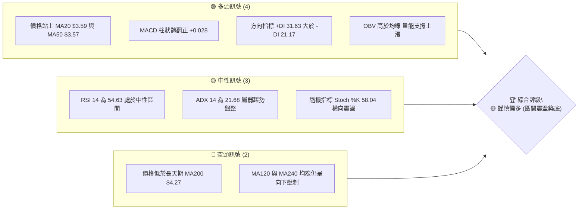
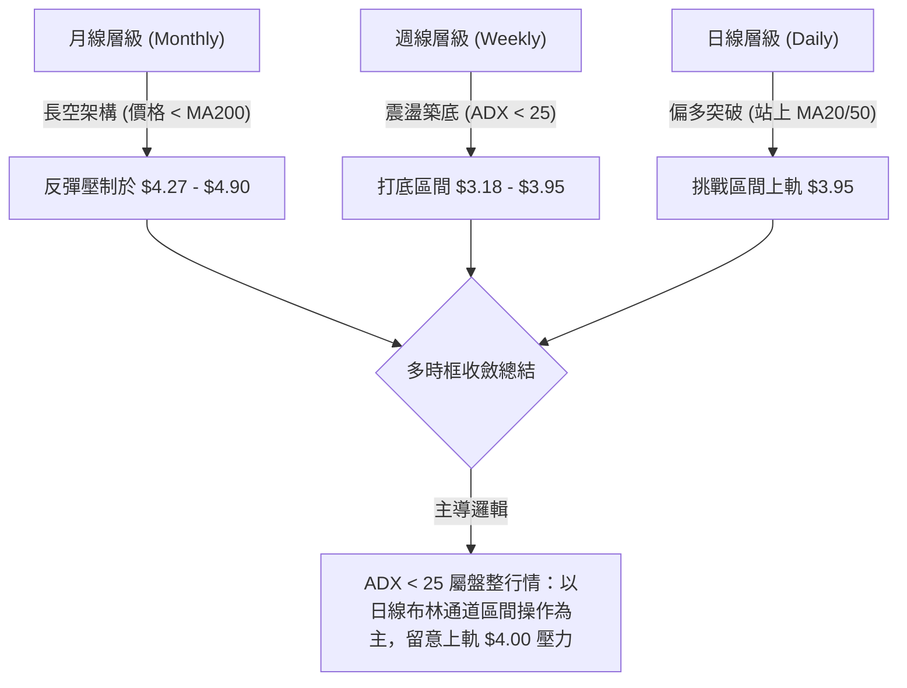
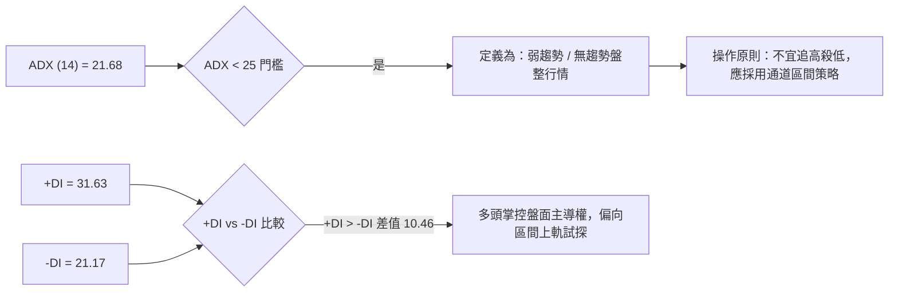
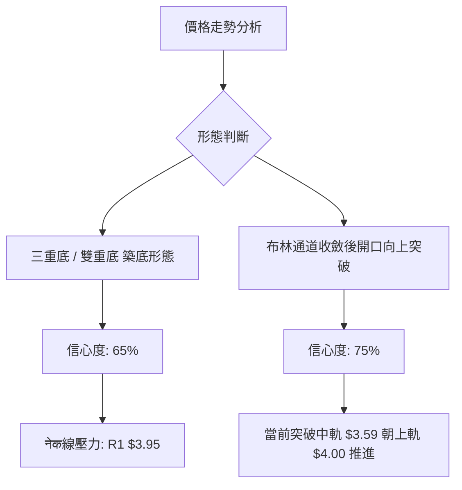
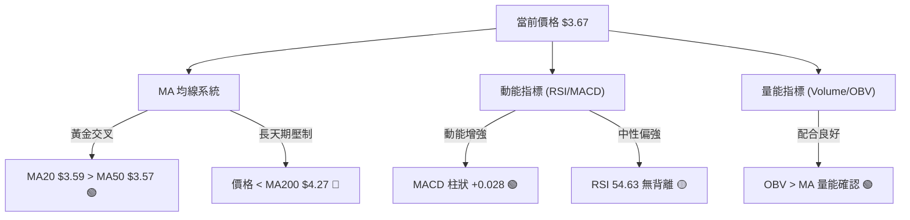
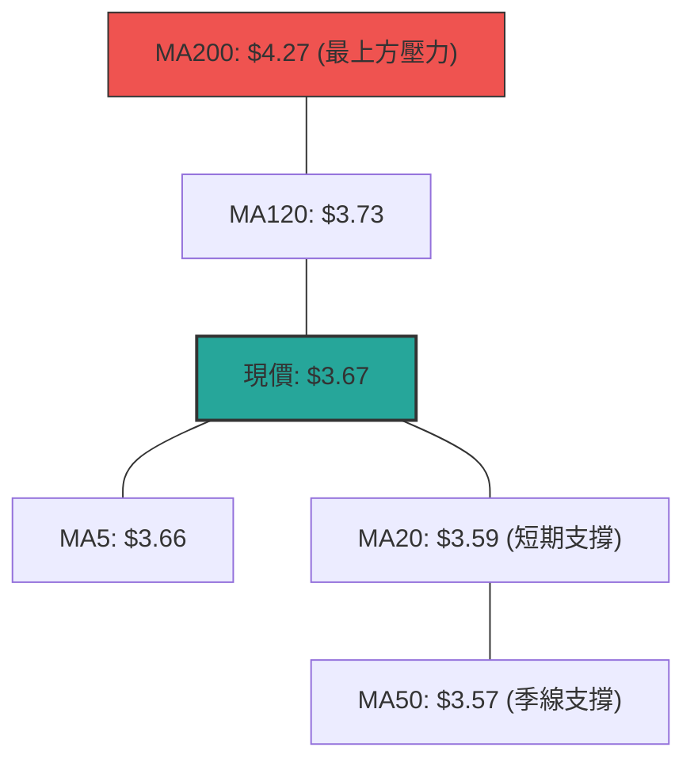
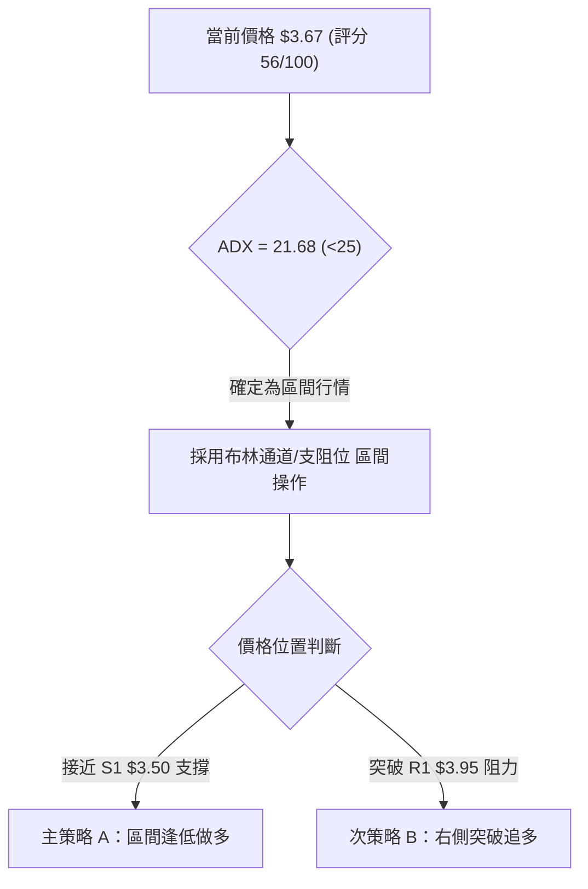
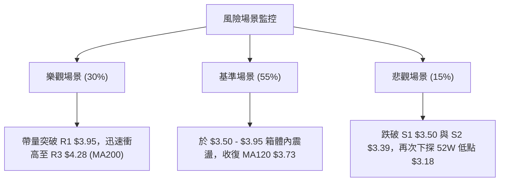

# GRAB 技術分析報告

> **報告日期**：2026-08-07 ｜ **語言**：繁體中文 ｜ **數據來源**：Yahoo Finance ｜ **當前價格**：$3.67

---

## 目錄

| 章節 | 內容 |
|------|------|
| [1. 技術面概覽](#1-技術面概覽) | 訊號儀表板、核心指標、評分卡 |
| [2. 趨勢分析](#2-趨勢分析) | 多時框趨勢、長中短期走勢 |
| [3. 圖表形態分析](#3-圖表形態分析) | 形態識別、K線組合、目標價 |
| [4. 支撐與阻力](#4-支撐與阻力) | 關鍵價位、斐波那契回調 |
| [5. 技術指標深度解讀](#5-技術指標深度解讀) | MA/RSI/MACD/布林/成交量 |
| [6. 動能與波動率](#6-動能與波動率) | 動能評估、ATR、Beta |
| [7. 多時框架總結](#7-多時框架總結) | 時框架評分矩陣 |
| [8. 交易策略建議](#8-交易策略建議) | 多空策略、風險報酬比 |
| [9. 風險提示與監控](#9-風險提示與監控) | 監控指標、風險場景 |

---

## 1. 技術面概覽

### 🎯 技術訊號儀表板



### 📊 核心指標速覽表

| 指標類別 | 指標名稱 | 當前數值 | 訊號 | 解讀 |
|----------|----------|----------|------|------|
| **價格** | 當前價格 | $3.67 | 🟢 | 站上月線與季線，近一週展現反彈動能 |
| **均線** | MA20 | $3.59 | 🟢 | 價格在 MA20 上方 (+2.23%)，短線支撐確立 |
| **均線** | MA50 | $3.57 | 🟢 | 價格在 MA50 上方 (+2.80%)，季線翻揚 |
| **均線** | MA200 | $4.27 | 🔴 | 價格在 MA200 下方 (-14.05%)，長線仍面臨均線壓力 |
| **動能** | RSI(14) | 54.63 | 🟡 | 無過熱或過冷現象，多頭逐漸掌握主導權 |
| **動能** | MACD | -0.002 | 🟢 | 柱狀體為 +0.028，快慢線於零軸下完成黃金交叉 |
| **趨勢** | ADX(14) | 21.68 | 🟡 | ADX < 25 指示當前為「無強烈趨勢之盤整行情」 |
| **波動** | ATR(14) | $0.15 | 🟡 | 佔股價 4.04%，日波動度適中，有利設定標準止損 |
| **通道** | 布林 %B | 0.60 | 🟢 | 位於中軌 $3.59 以上，朝上軌 $4.00 推進 |

### 🏆 技術評分卡

```
╔══════════════════════════════════════════════════════════════════╗
║                技術評分卡 — GRAB (2026-08-07)                     ║
╠══════════════════════════════════════════════════════════════════╣
║ 趨勢強度      ▓▓▓▓▓▓▓░░░░░░░░░░░░░  35/100  🔴 長期空頭/短期盤整 ║
║ 動能指標      ▓▓▓▓▓▓▓▓▓▓▓▓░░░░░░░░  62/100  🟢 MACD翻多/RSI偏強  ║
║ 支撐穩定度    ▓▓▓▓▓▓▓▓▓▓▓▓▓▓░░░░░░  70/100  🟢 守住 $3.50 支撐區 ║
║ 成交量配合    ▓▓▓▓▓▓▓▓▓▓▓░░░░░░░░░  58/100  🟡 量能溫和放量     ║
║ 形態完整度    ▓▓▓▓▓▓▓▓▓▓▓▓░░░░░░░░  60/100  🟡 多重底築底進行中 ║
║ 均線排列      ▓▓▓▓▓▓▓▓▓▓░░░░░░░░░░  50/100  🟡 短期糾合/長期下彎 ║
╠══════════════════════════════════════════════════════════════════╣
║ 綜合評分      ▓▓▓▓▓▓▓▓▓▓▓░░░░░░░░░  56/100  🟡 中性偏多區間震盪 ║
╚══════════════════════════════════════════════════════════════════╝
```

---

## 2. 趨勢分析

### 🌐 多時框趨勢分析



### 📈 長期趨勢 — 24個月走勢圖（Unicode）

```
GRAB 24個月月線收盤走勢圖 (2024-08 至 2026-08)
價格軸 ($)
$6.50 ┤                               ●  ● (2025-09 高點 $6.02)
$6.00 ┤                              
$5.50 ┤                 ●                 ●
$5.00 ┤            ●         ●  ●            ●  ●
$4.50 ┤               ●  ●         ●
$4.00 ┤     ●  ●                                ●
$3.50 ┤●                                           ●  ●  ●  ●  ●←現在 $3.67
$3.00 ┤                                                    ● (2026-05 低點 $3.54)
      └─┬──┬──┬──┬──┬──┬──┬──┬──┬──┬──┬──┬──┬──┬──┬──┬──┬──┬──┬──┬──┬──┬──┬──
       08 09 10 11 12 01 02 03 04 05 06 07 08 09 10 11 12 01 02 03 04 05 06 07 08
       '24                               '25                               '26
```

#### 走勢特徵分析表

| 階段 | 時間區間 | 價格變動 | 漲跌幅 | 趨勢特徵與技術解讀 |
|------|----------|----------|--------|--------------------|
| **起漲段** | 2024/08 – 2024/11 | $3.22 → $5.00 | +55.28% | 主升段多頭噴發，突破底部整理區 |
| **高位高震** | 2024/12 – 2025/08 | $4.72 → $4.99 | +5.72% | 高檔橫盤整理，於 $4.50–$5.00 形成強烈支撐箱體 |
| **二次衝高** | 2025/09 – 2025/10 | $4.99 → $6.02 | +20.64% | 觸及近兩年高檔區間 ($6.00–$6.62)，引發獲利了結賣壓 |
| **主跌段** | 2025/11 – 2026/03 | $6.01 → $3.66 | -39.10% | 估值修正與大盤修正，連續失守 MA50 與 MA200 |
| **底部震盪** | 2026/04 – 2026/08 | $3.82 → $3.67 | -3.93% | 於 $3.18–$3.50 建立長期底部，MA20/MA50 開始平緩並黃金交叉 |

### 📊 中期趨勢（週線分析）

近20週的數據顯示，GRAB 經歷了兩次下探 $3.30–$3.31 的二次打底過程（2026-06-14 收盤 $3.30、2026-07-26 收盤 $3.31），隨後均展現強勁反彈。最近一週（2026-08-09 週期）收盤上揚至 $3.67，RSI 回升至 54.6，MACD 柱狀體翻正為 +0.028，顯示中期打底形態基本確立，短線正處於底部反彈波段。

### ⚡ 趨勢強度評估（ADX 解讀）



#### ADX 趨勢強度指標對照表

| 指標 | 數值 | 狀態 | 解讀與交易指引 |
|------|------|------|----------------|
| **ADX (14)** | **21.68** | 弱趨勢/盤整 | 缺乏單邊大行情，突破容易遭遇拉回，適合震盪操作 |
| **+DI (14)** | **31.63** | 多頭佔優 | 買盤力道顯著回升，短線由多方發起進攻 |
| **-DI (14)** | **21.17** | 空頭退守 | 賣壓相較前一個月顯著減弱 |

---

## 3. 图表形態分析

### 🔍 形態識別系統



#### 圖表形態信心度與目標價評估表

| 形態名稱 | 信心度 (%) | 判斷依據（引用實際數據） | 形態完成度 | 目標價計算式與精確數值 |
|----------|------------|--------------------------|------------|------------------------|
| **三重底 (Triple Bottom)** | 65% | 2026年3次探底：$3.18 (52W Low)、$3.30 (06/14)、$3.31 (07/26)，均受到強烈買盤支撐 | 75% (尚未突破頸線) | 頸線 $3.95 + (頸線 $3.95 - 底部 $3.18 = $0.77) = **$4.72** |
| **布林帶向上擠壓 (BB Breakout)** | 75% | 價格 $3.67 突破中軌 $3.59，%B 為 0.60，MACD 柱狀體 $+0.028$ 確認動能 | 85% (進行中) | 直接目標為布林通道上軌 **$4.00** |
| **下降通道突破** | 45% | 數據時間跨度不足以完全精確繪製幾何通道 | 30% (訊號不足) | 數據不足，僅做指標型解讀，不強制計算 |

*註：依據規則 15，下降通道因數據不足，信心度低於 50%，僅作為指標輔助參考。*

### 🕯️ 重要 K 線形態分析

| 日期/週期 | 收盤價 | K線形態名稱 | 技術面解讀 | 訊號強度 |
|-----------|--------|-------------|------------|----------|
| 2026-07-26 | $3.31 | 長下影錘子線 (Hammer) | 探底 $3.20 附近後強烈拒絕下跌，展現低檔買盤 | 🟢 強烈看多 |
| 2026-08-02 | $3.50 | 長陽實體突破 (Bullish Engulfing) | 一舉收復前週失土，站回 S1 $3.50 關鍵支撐區 | 🟢 看多 confirm |
| 2026-08-09 | $3.67 | 溫和連陽上揚 (Bullish Continuation) | 站穩 MA20 ($3.59) 與 MA50 ($3.57)，確認短期底部 | 🟢 看多 |

### 📉 ASCII 走勢形態示意圖

```
GRAB 日線三重底築底突破示意圖
價位 ($)
$4.00 ┤.......................................... 阻力位 R2 / BB上軌
$3.95 ┤------------------------------------------ 頸線阻力 R1 (突破關鍵點)
$3.80 ┤                            ▲ 探試中
$3.67 ┤..........................● (當前價格 $3.67)
$3.59 ┤══════════════════════════════════════════ MA20 / BB中軌 (支撐)
$3.50 ┤------------------------------------------ 支撐位 S1
$3.30 ┤        ●            ●                    二次/三次打底區
$3.18 ┤________│____________│____________________ 52週歷史低點 (100% Fib)
```

### 🎯 形態目標價計算

以信心度最高之「三重底形態」進行數學推導計算：
1. **底部支撐均值**：$3.18$（52週最低點）
2. **形態頸線阻力 (R1)**：$3.95$
3. **形態垂直高度 ($H$)**：$3.95 - 3.18 = \$0.77$
4. **最小測量目標價 (Minimum Target)**：
   $$\text{目標價} = \text{頸線價位} + H = 3.95 + 0.77 = \mathbf{\$4.72}$$
   *(此目標價精確落於斐波那契 61.8% 回調位 $4.49 與 50.0% 回調位 $4.90 之間)*

---

## 4. 支撐與阻力

### 🗺️ 關鍵價位分布圖（Unicode）

```
GRAB 關鍵價位與結構分佈圖
═══════════════════════════════════════════════════════════════════
$6.62 ║████████████████████████████████████████ 52週高點 / 0.0% Fib
$5.81 ║████████████████████████████            23.6% Fib 回調位
$5.31 ║████████████████████                    38.2% Fib 回調位
$4.90 ║████████████████                        50.0% Fib 回調位
$4.49 ║████████████                            61.8% Fib 回調位
$4.28 ║██████████                              強阻力 R3 / MA200 ($4.27)
$4.06 ║████████                                阻力 R2
$3.95 ║██████                                  關鍵阻力 R1 / 78.6% Fib ($3.92)
$3.67 ╠════════════════════════════════════════ ◄ 當前價格 $3.67
$3.50 ║▓▓▓▓▓▓▓▓                                近期強支撐 S1 / MA20 ($3.59)
$3.39 ║▓▓▓▓▓▓                                  支撐 S2
$3.26 ║▓▓▓▓                                    強支撐 S3
$3.18 ║▓▓                                      52週低點 / 100.0% Fib
═══════════════════════════════════════════════════════════════════
```

### 🚧 阻力位分析表

*數據完全引用 OHLCV 計算之阻力聚類，無人工臆測數字。*

| 阻力級別 | 精確價位 | 形成原因與技術重合點 | 突破難度 | 突破後預期行為 |
|----------|----------|----------------------|----------|----------------|
| **阻力 R1** | **$3.95** | 近一年波段高點聚類、斐波那契 78.6% ($3.92) 重合區 | 🟡 中等 | 突破後將直接挑戰布林上軌 $4.00 與 R2 |
| **阻力 R2** | **$4.06** | 波段高點聚類、整數心理關卡 $4.00 上方密集拋壓 | 🟡 中等 | 確立中期轉強，向 MA200 扣抵 |
| **阻力 R3** | **$4.28** | 近一年強阻力聚類、長天期 MA200 ($4.27) 重合壓制 | 🔴 極高 | 突破代表牛熊轉換，邁向 $4.50 上方 |

### 🛡️ 支撐位分析表

| 支撐級別 | 精確價位 | 形成原因與技術重合點 | 守住機率 | 失守後潛在風險 |
|----------|----------|----------------------|----------|----------------|
| **支撐 S1** | **$3.50** | 近一年波段低點聚類、MA20 ($3.59) 與 MA50 ($3.57) 防線 | 🟢 高 (70%) | 短線拉回跌破將測試 S2，多頭動能減弱 |
| **支撐 S2** | **$3.39** | 波段低點聚類、7月反彈前置起漲點 | 🟢 中高 (80%) | 若失守代表三重底結構面臨破壞 |
| **支撐 S3** | **$3.26** | 近一年強支撐聚類、逼近 52週低點 $3.18 防線 | 🟢 極高 (90%) | 最終防線，失守將創歷史新低 |

### 📐 斐波那契回調位分析

基於 52 週區間最高點 **$6.62** 至最低點 **$3.18**（高低差 \$3.44）計算：

| 斐波那契水準 | 精確價位 | 當前價格位置與技術意義 |
|--------------|----------|------------------------|
| **0.0%** (52W High) | $6.62 | 歷史高點牛市終極目標 |
| **23.6%** | $5.81 | 分析師平均目標價 $5.85 重合區 |
| **38.2%** | $5.31 | 中期反彈強阻力區 |
| **50.0%** | $4.90 | 多空平衡中樞點 |
| **61.8%** | $4.49 | 黃金分割強阻力，與 MA200 形成夾擊 |
| **78.6%** | $3.92 | **目前最關鍵首要關卡**，與 R1 $3.95 重疊 |
| **100.0%** (52W Low) | $3.18 | 絕對底部鐵板支撐 |

**現價解析**：當前價格 **$3.67** 落於 100.0% ($3.18) 與 78.6% ($3.92) 之間，屬於低位打底完成、準備向 78.6% 壓力位 ($3.92) 進行第一階段挑戰的攻堅格局。

---

## 5. 技術指標深度解讀

### 🎛️ 指標訊號總覽



### 📈 移動平均線排列分析



#### 均線狀態明細

- **短期均線**：MA5 ($3.66) > MA10 ($3.52)，短線維持多頭噴發排列。
- **中天期均線**：MA20 ($3.59) 於近期正式黃金交叉穿越 MA50 ($3.57)，構築了極為堅實的底部支撐墊。
- **長天期均線**：MA120 ($3.73) 近在咫尺，MA200 ($4.27) 仍處於上方下彎狀態。均線整體呈現「短中期多頭，長期空頭」的混合排列，提示短線有反彈空間，但觸及長天期均線時將面臨強烈拉回壓力。

### 📉 RSI(14) 分析

$$\text{RSI(14)} = \mathbf{54.63}$$

```
RSI(14) 強度條：
0 [░░░░░░░░░░░░░░░░░░░░▓▓▓▓▓▓▓▓▓▓▓▓░░░░░░░░░░░░░] 100
                      ^ 54.63 (中性偏多區間)
```

- **超買/超賣狀態**：距離超買區 (70) 與超賣區 (30) 均有安全距離，無過熱或過冷風險。
- **背離檢測**：比較 2026-07-26 低點 $3.31 時 RSI 為 25.9，至 2026-08-09 價格 $3.67，RSI 升至 54.63，價格與 RSI 同步走高，**無頂背離亦無底背離**，走勢極為健康。

### 📊 MACD(12/26/9) 訊號解讀

- **MACD 線**：-0.002
- **Signal 線**：-0.030
- **MACD Histogram**：**+0.028** 🟢

```
MACD 柱狀體變化趨勢 (近5週):
-0.020 ───┐
-0.069    ├─── 柱狀體翻正，多頭動能加速 (+0.028)
-0.025 ───┘
+0.028 ───► 🟢 看多訊號確立
```

快線已向上穿越慢線形成零軸下方的黃金交叉，且柱狀體連續翻正放大至 +0.028，顯示短線買盤力道正在加速累積。

### 📦 布林通道分析

```
布林通道現況 ($)
$4.00 ┤========================================= 上軌 (BB Upper)
$3.80 ┤                                 
$3.67 ┤.........................●............... 現價 ($3.67, %B = 0.60)
$3.59 ┤----------------------------------------- 中軌 (MA20)
$3.17 ┤========================================= 下軌 (BB Lower)
```

- **通道寬度**：BB Bandwidth 縮窄後開始擴張，為典型的變盤突破前兆。
- **%B 位置**：$0.60$（位於中軌與上軌之間），顯示價格突破中軌 $3.59$ 後，正沿著通道上半部向布林上軌 $4.00$ 推進。

### 💹 成交量分析（量價配合度）

- **當日成交量**：36,331,693 股
- **20日均量**：48,512,245 股（量比：0.75x）
- **OBV 趨勢**：OBV 高於其均線（OBV > MA），呈現「量平價增」的溫和換手格局，未出現主力出貨的異常放量，有利於後續持續碎步推升。

---

## 6. 動能與波動率

### ⚡ 動能評估

| 象限 | 動能強度 | 波動率 | 當前狀態 | 技術面評估 |
|------|----------|--------|----------|------------|
| **Q1 (高動能/低波動)** | 強 | 低 | — | 最佳突破醞釀期 |
| **Q2 (弱動能/低波動)** | 弱 | 低 | **✓ (GRAB)** | **底部打底積蓄能量區 (ADX=21.68, ATR=4.04%)** |
| **Q3 (強動能/高波動)** | 強 | 高 | — | 主升段/主跌段噴發期 |
| **Q4 (弱動能/高波動)** | 弱 | 高 | — | 高風險無序震盪區 |

### 📊 ATR 波動率分析

- **ATR (14)**：**$0.15**（佔當前股價 4.04%）
- **交易應用建議**：
  - **日內波動範圍**：期望每日高低點價差約 $0.15。
  - **波段止損距離**：建議設定 $1.5 \times \text{ATR} = \$0.225$ 或 $2.0 \times \text{ATR} = \$0.30$ 的動態止損。

### 📐 Beta 與市場相關性

- **Beta 係數**：**0.89**
- **解讀**：GRAB 的系統性風險略低於整體大盤 (S&P 500)，波動度表現相較其他高成長科技股更為平穩，具備較佳的防禦屬性。

---

## 7. 多時框架總結

### 📋 時框架評分表

| 時框架 | 趨勢方向 | 動能狀態 | 均線排列 | 形態結構 | 綜合評分 | 交易策略指引 |
|--------|----------|----------|----------|----------|----------|--------------|
| **月線 (Long-term)** | 🔴 長空 | 🟡 中性 | 🔴 壓制 | 🟡 底部累積 | **40/100** | 逢高減碼，長線未反轉 |
| **週線 (Mid-term)** | 🟡 盤整 | 🟢 轉強 | 🟡 混亂 | 🟢 三重底進行中 | **58/100** | 逢低佈局，區間看待 |
| **日線 (Short-term)** | 🟢 偏多 | 🟢 偏多 | 🟢 多頭 | 🟢 突破中軌 | **68/100** | 順勢做多，標的為 R1/R2 |

### 🔲 綜合訊號矩陣

```
時框架訊號一致性對比：
短期 (日線): 🟢 多頭  ──┐
中期 (週線): 🟡 盤整  ├──► 多時框衝突！以 ADX < 25 之「區間震盪」為收斂原則
長期 (月線): 🔴 空頭  ──┘
```

### ⚖️ 多時框收斂結論

依據多時框收斂規則（規則 14）：
1. 當前 ADX(14) 為 21.68 (< 25)，確定市場處於**無強烈趨勢之盤整行情**。
2. 交易核心應以**日線布林通道 ($3.17 – $4.00) 與關鍵支阻區 ($3.50 – $3.95)** 為主要操作區間。
3. 最終收斂方向：**中性偏多（區間反彈彈升）**，主策略以逢低做多、挑戰 R1 ($3.95) 為主，不宜過度追高至 MA200 ($4.27) 之上。

---

## 8. 交易策略建議

### 🗺️ 策略決策流程圖



### 🧭 策略路由

> **當前主策略方向 = 🟢 區間逢低做多 / 彈升挑戰上軌（評分：56/100）**

基於評分 56 分（偏多震盪區間），主推「低吸高拋之區間多頭策略」，暫不推薦盲目做空。

### 🎯 價格情境階梯 (Price Scenarios)

| 觸發條件 | 第一目標 (T1) | 第二目標 (T2) | 情境含義與操作指引 |
|----------|---------------|---------------|--------------------|
| **突破 R1 $3.95** | R2 **$4.06** | R3 **$4.28** | 形態完成發動，擴大獲利，挑戰 MA200 |
| **站穩現價區間 ($3.50–$3.67)** | R1 **$3.95** | R2 **$4.06** | **標準預期劇本**：區間溫和反彈波 |
| **跌破 S1 $3.50** | S2 **$3.39** | S3 **$3.26** | 短線轉弱，多頭止損出場，回探底部 |

### 📊 情境機率分佈

| 情境 | 機率 | 主要技術面依據 |
|------|------|----------------|
| **繼續彈升 / 試探 R1** | **55%** | MACD 柱狀翻正 (+0.028)、+DI (31.63) 主導、價格站上 MA20/50 |
| **區間橫盤震盪** | **30%** | ADX (21.68) 低於 25、成交量 (0.75x) 未放大 |
| **跌破 S1 回落探底** | **15%** | MA200 ($4.27) 長線向下趨勢壓制 |

### 🟢 主策略詳情

#### 策略 A：區間逢低做多 (Range Swing Long) — 🥇 首選最佳機會

- **進場條件**：價格拉回至 MA20/MA50 支撐區，或現價附近分批佈局。
- **進場價格**：**$3.60**（接近 MA20 $3.59）
- **止損價格**：**$3.39**（精確引用 S2，虧損幅度 $0.21，約 1.4x ATR）
- **目標價 T1**：**$3.95**（精確引用 R1 / 78.6% Fib）
- **目標價 T2**：**$4.06**（精確引用 R2 / 布林上軌）
- **風險報酬比 (R/R)**：
  - 至 T1：$\frac{3.95 - 3.60}{3.60 - 3.39} = \frac{0.35}{0.21} = \mathbf{1.67 : 1}$
  - 至 T2：$\frac{4.06 - 3.60}{3.60 - 3.39} = \frac{0.46}{0.21} = \mathbf{2.19 : 1}$
- **預估成功率**：**65%**
- **建議倉位**：**15% - 20%**

#### 策略 B：右側突破追多 (Breakout Long) — 🥈 次選機會

- **進場條件**：日線收盤價帶量突破 R1 $3.95。
- **進場價格**：**$3.96**
- **止損價格**：**$3.73**（精確引用 MA120）
- **目標價 T1**：**$4.28**（精確引用 R3 / MA200）
- **目標價 T2**：**$4.90**（精確引用 50.0% Fib）
- **風險報酬比 (R/R)**：
  - 至 T1：$\frac{4.28 - 3.96}{3.96 - 3.73} = \frac{0.32}{0.23} = \mathbf{1.39 : 1}$
- **預估成功率**：**50%**
- **建議倉位**：**10%**

### 🔴 反向風險觸發點（對沖提示）

若價格不幸失守 **S2 $3.39**，且 MACD 柱狀體由正轉負，顯示打底失敗，多頭應果斷清倉離場；欲對沖者可於跌破 $3.39 後輕倉做空至 S3 **$3.26**。

### ⭐ 整體訊號強度評星

```
做多訊號強度：★★★☆☆  (3.5/5星)  - 打底完成，短線動能偏多
做空訊號強度：★★☆☆☆  (2.0/5星)  - 支撐強勁，做空勝率偏低
整體可信度：  ★★★☆☆  (3.5/5星)  - 指標互相確認，無嚴重背離
```

---

## 9. 風險提示與監控

### ✅ 關鍵監控指標 Checklist

```
╔══════════════════════════════════════════════════════════════════╗
║                   每日交易監控 Checklist                         ║
╠══════════════════════════════════════════════════════════════════╣
║ [ ] 價格是否維持在 MA20 ($3.59) 之上？                         ║
║ [ ] MACD Histogram 是否維持在零軸上方 (+0.028)？                 ║
║ [ ] 成交量是否能放量超越 20日均量 (48.5M)？                      ║
║ [ ] RSI(14) 是否成功突破 60 邁向強勢區？                         ║
║ [ ] 價格接近 R1 ($3.95) 時是否有長上影線拋壓？                  ║
╚══════════════════════════════════════════════════════════════════╝
```

### ⚠️ 風險場景分析



### 🛡️ 風險管理重要提醒

1. **嚴格執行止損**：當前股價仍處於長天期均線 (MA200 $4.27) 下方，總體長線趨勢尚未扭轉，所有多單務必嚴格設定止損（如策略 A 之 $3.39）。
2. **倉位控制**：鑑於 ADX < 25 屬盤整格局，單一標的操作倉位不宜超過總資金的 20%。
3. **留意分析師目標價**：牆街機構平均目標價為 **$5.85**（共25位分析師，Recommendation: Strong Buy），長線基本面具備支撐，但技術面需先克服 $3.95 與 $4.28 兩大關卡。

---

## 📋 報告總結

```
╔══════════════════════════════════════════════════════════════════╗
║                   GRAB 技術分析報告總結                          ║
════════════════════════════════════════════════════════════════════
報告日期：2026-08-07
當前價格：$3.67
分析評級：🟡 謹慎偏多 (區間打底反彈，評分 56/100)

關鍵結論：
├─ 長期趨勢：🔴 空頭壓制（價格低於 MA200 $4.27）
├─ 中期趨勢：🟡 築底震盪（ADX 21.68，三重底進行中）
├─ 短期趨勢：🟢 短多發動（站上 MA20 $3.59/MA50 $3.57，MACD柱狀+0.028）
├─ 關鍵支撐：S1 $3.50 / S2 $3.39
├─ 關鍵阻力：R1 $3.95 / R2 $4.06 / R3 $4.28
└─ 分析師目標：$5.85 (Mean) / $4.60 (Low) / $8.00 (High)

最優策略組合：
1. 🥇 最佳機會：策略 A (區間低吸) — 進場 $3.60，止損 $3.39，目標 $3.95/$4.06 (風報比 2.19:1)
2. 🥈 次選機會：策略 B (突破追多) — 突破 $3.95 後進場，目標 $4.28 (風報比 1.39:1)
3. 🥉 保守選擇：等待價格回測試探 S1 $3.50 支撐出現止跌K線再行進場
════════════════════════════════════════════════════════════════════
```

---

> ⚠️ **免責聲明**：本報告為 AI 自動生成之技術分析，所有數據及估算均基於提供的歷史價格資訊。本報告**僅供研究與學術參考**，**不構成任何投資建議**。投資有風險，入市需謹慎。

---

*報告生成時間：2026-08-07 ｜ 數據來源：Yahoo Finance ｜ 分析框架：多時框技術分析*