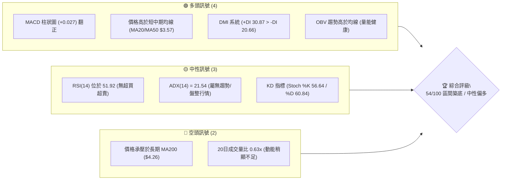
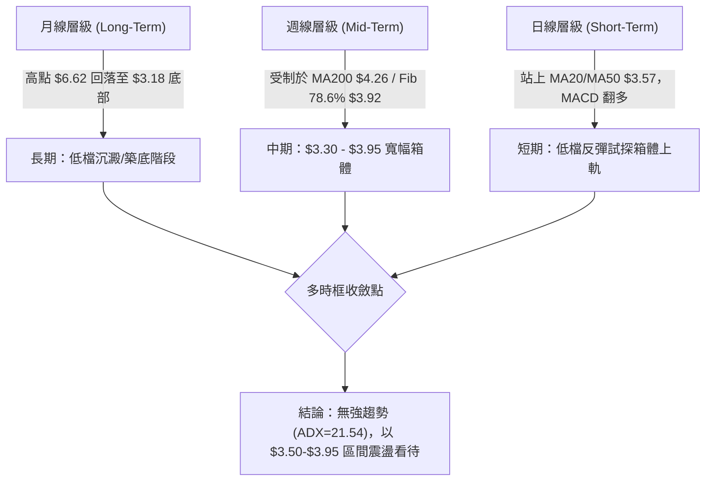
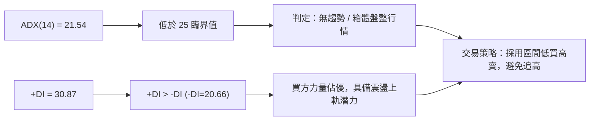
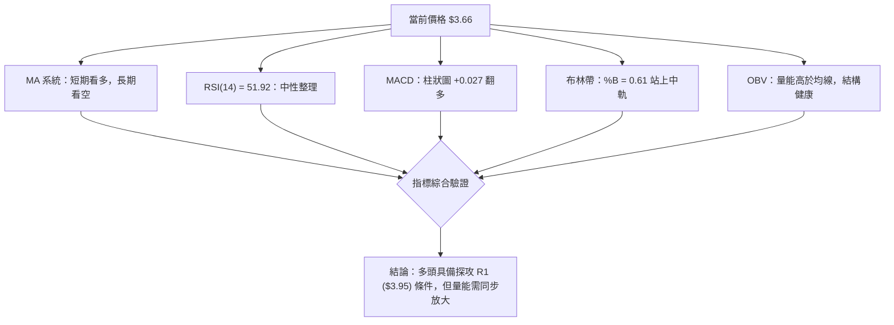
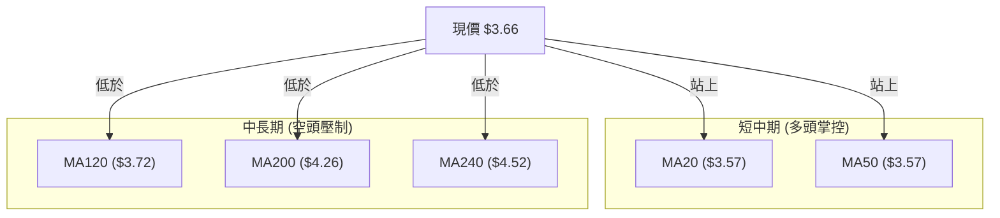
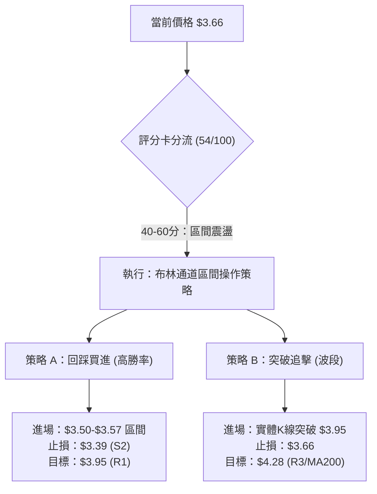
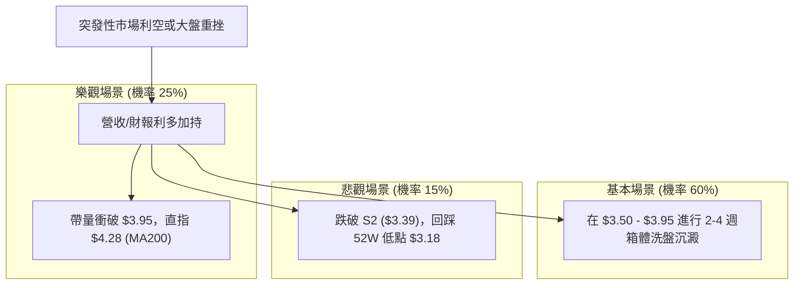

# GRAB 技術分析報告

> **報告日期**：2026-08-08 ｜ **語言**：繁體中文 ｜ **數據來源**：Yahoo Finance ｜ **當前價格**：$3.66

---

## 目錄

| 章節 | 內容 |
|------|------|
| [1. 技術面概覽](#1-技術面概覽) | 訊號儀表板、核心指標、評分卡 |
| [2. 趨勢分析](#2-趨勢分析) | 多時框趨勢、長中短期走勢、ADX強弱判斷 |
| [3. 圖表形態分析](#3-圖表形態分析) | 形態識別與信心度、K線組合、目標價計算 |
| [4. 支撐與阻力](#4-支撐與阻力) | 關鍵價位分布圖、阻力/支撐層級、斐波那契回調 |
| [5. 技術指標深度解讀](#5-技術指標深度解讀) | MA/RSI/MACD/布林通道/成交量與OBV |
| [6. 動能與波動率](#6-動能與波動率) | 動能四象限、ATR波動率、Beta風險 |
| [7. 多時框架總結](#7-多時框架總結) | 時框架評分矩陣、多時框收斂結論 |
| [8. 交易策略建議](#8-交易策略建議) | 策略路由、價位情境、多空操作與風報比 |
| [9. 風險提示與監控](#9-風險提示與監控) | 關鍵監控Checklist、風險情境演練 |

---

## 1. 技術面概覽

### 🎯 技術訊號儀表板



### 📊 核心指標速覽表

| 指標類別 | 指標名稱 | 當前數值 | 訊號 | 解讀 |
|----------|----------|----------|------|------|
| **價格** | 當前收盤價 | $3.66 | 🟡 中性 | 處於 52 週區間 ($3.18 - $6.62) 之 14.0% 低位 |
| **均線** | MA20 | $3.57 | 🟢 看多 | 價格在 MA20 上方 (+2.45%)，短線支撐形成 |
| **均線** | MA50 | $3.57 | 🟢 看多 | 價格在 MA50 上方 (+2.51%)，中期底部位建立 |
| **均線** | MA200 | $4.26 | 🔴 看空 | 價格在 MA200 下方 (-14.08%)，長期下行趨勢未扭轉 |
| **動能** | RSI(14) | 51.92 | 🟡 中性 | 位於 30-70 中性區間，無過熱或恐慌跡象 |
| **動能** | MACD | +0.004 | 🟢 看多 | MACD 位於 Signal (-0.023) 之上，柱狀圖 +0.027 多頭擴張 |
| **趨勢強度**| ADX(14) | 21.54 | 🟡 弱趨勢 | ADX < 25，屬於低動能盤整/區間震盪行情 |
| **通道** | 布林帶 %B | 0.61 | 🟡 中性 | 價格位於中軌 ($3.57) 與上軌 ($3.96) 之間 |
| **波動** | ATR(14) | $0.14 | 🟢 適中 | 日波動率 3.91%，符合成長股區間震盪特性 |

### 🏆 技術評分卡

```
╔══════════════════════════════════════════════════════════════════╗
║                   技術評分卡 — GRAB (2026-08-08)                 ║
╠══════════════════════════════════════════════════════════════════╣
║ 趨勢強度      ▓▓▓▓▓▓▓▓░░░░░░░░░░░░  43/100  🟡 弱趨勢/區間震盪 ║
║ 動能指標      ▓▓▓▓▓▓▓▓▓▓▓▓░░░░░░░░  60/100  🟢 MACD翻多/RSI偏強 ║
║ 支撐穩定度    ▓▓▓▓▓▓▓▓▓▓▓▓▓░░░░░░░  65/100  🟢 S1($3.50)聚類守穩 ║
║ 成交量配合    ▓▓▓▓▓▓▓▓▓░░░░░░░░░░░  48/100  🟡 OBV健康但量能萎縮 ║
║ 形態完整度    ▓▓▓▓▓▓▓▓▓▓▓░░░░░░░░░  55/100  🟡 築底結構進行中   ║
║ 均線排列      ▓▓▓▓▓▓▓▓▓░░░░░░░░░░░  48/100  🟡 短中期交錯/長均承壓║
╠══════════════════════════════════════════════════════════════════╣
║ 綜合評分      ▓▓▓▓▓▓▓▓▓▓▓░░░░░░░░░  54/100  區間震盪 (偏多築底)║
╚══════════════════════════════════════════════════════════════════╝
```

---

## 2. 趨勢分析

### 🌐 多時框趨勢分析



### 📈 長期趨勢 — 24個月歷史走勢圖（Unicode）

標注過去 24 個月收盤價走勢，呈現由高點 $6.02 (2025-09) 走空至 $3.18 (52W Low) 後進入底部打底：

```
GRAB 月線走勢圖（2024-08 至 2026-08）
價格軸 ($)
$6.50 ┤
$6.00 ┤             ●   ● (高點 $6.02)
$5.50 ┤         ●       
$5.00 ┤     ●               ●
$4.50 ┤                         ●   ●
$4.00 ┤ ●   
$3.50 ┤                                 ●       ●   ●←當前 $3.66
$3.00 ┤                                     ●(低點 $3.18)
      └─┴───┴───┴───┴───┴───┴───┴───┴───┴───┴───┴───┴───
        08  10  12  02  04  06  08  10  12  02  04  06  08
        2024年              2025年              2026年
```

**24個月歷史走勢階段特徵分析**：

| 階段 | 時間區間 | 收盤價格區間 | 漲跌幅 | 走勢形態與市場特徵 |
|------|----------|--------------|--------|--------------------|
| 第一階段：衝高主升 | 2024-08 ~ 2025-09 | $3.22 ➔ $6.02 | +86.96% | 強勢多頭主升段，於 2025-09 達到波段高點 $6.02 |
| 第二階段：高檔震盪 | 2025-09 ~ 2025-10 | $6.02 ➔ $6.01 | -0.17%  | 高檔雙頂派發區，主力多頭動能耗盡 |
| 第三階段：中級修正 | 2025-11 ~ 2026-03 | $5.45 ➔ $3.66 | -32.84% | 空頭全面主導，連續跌破 MA50 與 MA200 關鍵支撐 |
| 第四階段：尋底探底 | 2026-03 ~ 2026-07 | $3.66 ➔ $3.50 | -4.37%  | 探底階段，最低於 52W Low 觸及 $3.18，其後於 $3.30-$3.50 打底 |
| 第五階段：底部修復 | 2026-07 ~ 2026-08 | $3.50 ➔ $3.66 | +4.57%  | 日線突破 MA20/MA50 ($3.57)，企圖發起箱體下軌反彈 |

### 📊 中期趨勢（近20週分析）

近20週數據顯示，GRAB 價格在 $3.30 至 $4.21 之間進行寬幅洗盤。2026年4月中旬曾一舉拉升至 $4.21（週 RSI 達 82.7 超買），但隨後遭到 MA200 ($4.26) 壓制快速回落，7月下旬回踩 $3.31，8月第一週收盤彈回 $3.66（週 RSI 回升至 51.9，週 MACD 柱狀圖轉正至 +0.027）。

```
        中期阻力位 MA200 ($4.26) / R3 ($4.28)
─────────┬─────────────────────────────────────────── $4.26-$4.28
         │        ▲ (2026-04-19 觸及 $4.21 高點受阻)
         │       ╱ ╲
         │      ╱   ╲
         │     ╱     ╲
─────────┼────╱───────╲────────────────────────────── $3.95 (R1 / 斐波 78.6% $3.92)
         │   ╱         ╲   ▲ 當前價格 $3.66 (站上 MA20/MA50 $3.57)
         │  ╱           ╲ ╱
─────────┴─╱─────────────▼─────────────────────────── $3.50 (S1 支撐位)
           (2026-06/07 探底 $3.30-$3.34)
```

### ⚡ 趨勢強度評估（ADX 解讀）



- **ADX 數值**：`21.54` █▓░░░░░░░░（屬於弱趨勢環境）。
- **DMI 方向**：`+DI (30.87)` 高於 `-DI (20.66)`，顯示多頭在盤整局勢中取得短期控盤主導權。
- **行情性質**：ADX < 25 明確定義當前不可使用趨勢突破追價策略，而應依據布林通道上下軌與支撐阻力進行區間擺盪操作。

---

## 3. 圖表形態分析

### 🔍 形態識別系統與信心度評估

依據近 6 個月的日線與週線走勢，識別出以下圖表形態：

| 形態名稱 | 信心度 (%) | 判斷依據（引用數據） | 完成度 (%) | 目標價計算式 | 形態目標價 |
|----------|------------|----------------------|------------|--------------|------------|
| **雙重底 (W底)** | 62% | 2026-06 低點 $3.30 與 2026-07 低點 $3.31 構成雙腳支撐，當前站上頸線發起點 | 70% | 頸線 R1 ($3.95) - 底部低點 ($3.30) = $0.65<br>突破目標 = $3.95 + $0.65 | **$4.60** |
| **矩形箱體盤整** | 85% | 價格持續於 S1 ($3.50) / S2 ($3.39) 與 R1 ($3.95) / R2 ($4.06) 區間來回震盪 | 90% | 箱體下軌 $3.39 ~ 上軌 $3.95 | **$3.95** (箱頂) |
| **頭肩頂形態** | 20% | 歷史數據缺乏典型左肩右肩對稱結構 | 0% | 訊號不足，僅做指標型解讀 | N/A |

*註：雙底突破目標價 $4.60 精確吻合華爾街分析師最低目標價 ($4.60)。*

### 🕯️ 重要 K 線形態分析（近 5 週）

| 週別 | 收盤價 | K 線形態 | 技術含義 | 多空訊號 |
|------|--------|----------|----------|----------|
| 2026-07-12 | $3.93 | 衝高回落十字星 | 挑戰 R1 $3.95 失敗，高檔獲利結吐壓力現形 | 🔴 空頭 |
| 2026-07-19 | $3.57 | 中陰線下殺 | 跌破短均線，空頭發力回踩 | 🔴 空頭 |
| 2026-07-26 | $3.31 | 長下影長陰線 | 下探 S2 $3.39 區間誘空，下方買盤強烈承接 | 🟡 止跌 |
| 2026-08-02 | $3.50 | 晨星反彈陽線 | 守住 S1 $3.50，多頭重新奪回 MA20 控制權 | 🟢 看多 |
| 2026-08-09 | $3.66 | 實體中陽線 | 站穩 MA20/MA50 ($3.57)，MACD 柱狀圖翻正 | 🟢 看多 |

### 📉 ASCII 雙重底形態結構圖

```
                 [頸線阻力 R1 $3.95]
─────────────────┬───────────────────┬───────────────── $3.95
                 │                   │
                 │   反彈高點 $3.93  │
                 │       /\          │   現價 $3.66
                 │      /  \         │   /
                 │     /    \        │  /  (目標 $4.60)
─────────────────┼────/──────\───────┼─/─────────────── $3.57 (MA20/50)
                 │   /        \      │/
                 │  /          \     /
                 │ /            \   / 
─────────────────┴/──────────────\-┴────────────────── $3.30 - $3.31
              第一腳              第二腳
           (2026-06-14)        (2026-07-26)
```

---

## 4. 支撐與阻力

### 🗺️ 關鍵價位分布圖

```
GRAB 價位結構分布圖 (當前價格 $3.66)
═══════════════════════════════════════════════════════════
$6.62 ║████████████████████████████████████║ 52W High / 0.0% Fib
$5.81 ║████████████████████                ║ 23.6% Fib
$4.90 ║██████████████                      ║ 50.0% Fib
$4.52 ║██████████                          ║ MA240 重壓
$4.28 ║████████                            ║ 阻力 R3 / MA200 ($4.26)
$4.06 ║██████                              ║ 阻力 R2
$3.95 ║████████████████████████████████    ║ 阻力 R1 / 78.6% Fib ($3.92) / 布林上軌 ($3.96)
$3.66 ╠════════════════════════════════════╣ ◄ 當前價格 $3.66
$3.57 ║▓▓▓▓▓▓▓▓▓▓▓▓▓▓▓▓▓▓▓▓▓▓▓▓▓▓▓▓▓▓▓▓    ║ MA20 / MA50 / 布林中軌
$3.50 ║▓▓▓▓▓▓▓▓▓▓▓▓▓▓▓▓▓▓▓▓▓▓▓▓            ║ 關鍵支撐 S1
$3.39 ║▓▓▓▓▓▓▓▓▓▓▓▓▓▓                      ║ 強支撐 S2
$3.26 ║▓▓▓▓▓▓▓▓                            ║ 強支撐 S3
$3.18 ║▓▓▓▓▓▓▓▓▓▓▓▓▓▓▓▓▓▓▓▓▓▓▓▓▓▓▓▓▓▓▓▓    ║ 52W Low / 100.0% Fib
═══════════════════════════════════════════════════════════
```

### 🚧 阻力位分析表

| 阻力級別 | 精確價位 | 距現價差距 | 形成原因與技術重合點 | 突破難度 | 重要性 |
|----------|----------|------------|----------------------|----------|--------|
| **阻力 R1** | **$3.95** | +7.92% | 近一年波段高點聚類、斐波那契 78.6% ($3.92)、布林通道上軌 ($3.96) 三重交會 | 🟡 中等 | 🔴 極高 (箱體上頸線) |
| **阻力 R2** | **$4.06** | +10.93% | 2026年首季波段平台壓力區 | 🟡 中等 | 🟡 中等 |
| **阻力 R3** | **$4.28** | +16.94% | 長期年線 MA200 ($4.26) 與波段高點聚類重合 | 🔴 極高 | 🔴 極高 (牛熊分界線) |

### 🛡️ 支撐位分析表

| 支撐級別 | 精確價位 | 距現價差距 | 形成原因與技術重合點 | 守住機率 | 重要性 |
|----------|----------|------------|----------------------|----------|--------|
| **支撐 S1** | **$3.50** | -4.37% | 均線系統 MA20 ($3.57) / MA50 ($3.57) 密集防守區、近期密積成交密集帶 | 🟢 高 (80%) | 🔴 極高 (短線生命線) |
| **支撐 S2** | **$3.39** | -7.38% | 近一年波段低點聚類、雙底第二腳洗盤防線 | 🟢 高 (85%) | 🟡 中等 |
| **支撐 S3** | **$3.26** | -11.07% | 接近 52 週最低點 $3.18 前之最後波段防線 | 🟢 極高 (90%)| 🔴 極高 (長期防守底線) |

### 📐 斐波那契回調位分析（52週區間 $3.18 ➔ $6.62）

當前價格 **$3.66** 位於 **100.0% ($3.18)** 與 **78.6% ($3.92)** 回調位之間。

| 斐波那契分位 | 計算價位 | 技術含義解讀 | 戰略地位 |
|--------------|----------|--------------|----------|
| **0.0%** (52W High) | $6.62 | 52 週最高點，長期牛市極限目標 | 遠期終極目標 |
| **23.6%** | $5.81 | 接近分析師平均目標價 ($5.89) | 多頭強勢回升目標 |
| **38.2%** | $5.31 | 中期分割回調反彈關鍵位 | 中期多頭強弱水準 |
| **50.0%** | $4.90 | 50% 半數回撤位 | 中期分水嶺 |
| **61.8%** | $4.49 | 黃金分割回調位（略高於 MA240 $4.52） | 重要牛熊轉換壓制區 |
| **78.6%** | $3.92 | **當前直接首要阻力區** (與 R1 $3.95 重合) | 近期突破首要關卡 |
| **100.0%** (52W Low)| $3.18 | 52 週最低點，絕對歷史底部區間 | 長期鐵底支撐 |

---

## 5. 技術指標深度解讀

### 🎛️ 指標訊號總覽



### 📈 移動平均線排列分析



- **均線狀態**：MA20 ($3.57) 與 MA50 ($3.57) 形成黃金交叉與雙重重合，建構了強烈的低檔扣押支撐。
- **上方阻力**：MA120 在 $3.72 形成微幅第一道斜率阻力，而真正的關鍵中期空頭防線位於 MA200 ($4.26)。

### 📉 RSI(14) 分析

- **當前數值**：`51.92`
- **強度進度條**：███████████░░░░░░░░░ 51.92% (中性偏強)
- **區間評估**：從 2026-07-26 恐慌低點的 25.9 快速回升至 51.92，代表短線拋售壓力已經完全消化，回歸中性控制區。
- **背離判斷**：
  - **頂背離**：無（未進入 70 以上超買區）。
  - **底背離**：2026-06 週線低點 $3.30 (RSI 37.3) 與 2026-07 週線低點 $3.31 (RSI 25.9) 呈現價格平行、RSI 再探底後迅速強彈，屬於標準的**指標築底完成訊號**。

### 📊 MACD(12/26/9) 訊號解讀

- **MACD 快線**：`+0.004`
- **Signal 慢線**：`-0.023`
- **MACD 柱狀圖**：`+0.027` 🟢（由負轉正）
- **解讀**：MACD 快線正式上穿慢線形成日線等級金叉，柱狀圖連續擴張至 +0.027，證實短線多頭動能正在重新累積。

### 📦 布林通道分析

```
布林通道結構示意圖 (寬度：$3.19 - $3.96)
  $3.96 ─────── Upper Band (上軌) ──────────────────────────
         │
  $3.66 ─────── Current Price (現價 $3.66，%B = 0.61) 🟢
         │
  $3.57 ─────── Middle Band (中軌 MA20) ────────────────────
         │
  $3.19 ─────── Lower Band (下軌) ──────────────────────────
```

- **通道位置**：現價 $3.66 位於中軌 ($3.57) 與上軌 ($3.96) 之間，%B 值為 0.61，代表擺盪動能偏向通道上半部。
- **帶寬趨勢**：布林帶呈平行收窄狀態，暗示波動率壓縮，即將迎來突破性方向選擇。

### 💹 成交量分析（量價配合度與 OBV）

- **最新成交量**：30,834,800 股
- **20日均量**：49,021,990 股（量比：`0.63x`）
- **OBV 趨勢**：`OBV > MA` 🟢。雖然最新單日成交量顯著低於 20日與 50日均量（量能尚未顯著放大），但 OBV 累積能量線仍高於其移動平均線，顯示籌碼沉澱良好，無主力出貨跡象，上漲過程屬於溫和補漲。

---

## 6. 動能與波動率

### ⚡ 動能評估四象限

根據 ADX (21.54) 與 ATR ($0.14)，GRAB 目前位於**第四象限：低動能 / 低波動率（築底盤整期）**。

| 象限 | 動能強度 | 波動率狀態 | 當前狀態 | 交易策略建議 |
|------|----------|------------|----------|--------------|
| Q1 | 強 (ADX > 25) | 低 (ATR% < 3%) | - | 突破追價，趨勢持股 |
| Q2 | 強 (ADX > 25) | 高 (ATR% > 5%) | - | 縮減倉位，寬幅止損 |
| Q3 | 弱 (ADX < 25) | 高 (ATR% > 5%) | - | 避開，無序洗盤 |
| **Q4** | **弱 (ADX < 25)** | **低 (ATR% = 3.91%)** | **✓ (GRAB 當前點位)** | **低擋佈局，高拋低吸，等待突破** |

### 📊 ATR 波動率分析

- **ATR(14)**：`$0.14` (佔股價 3.91%)
- **風控止損建議**：
  - **短線緊密止損**：1.5 × ATR = 1.5 × $0.14 = **$0.21** (自進場價下移 $0.21)
  - **波段標準止損**：2.0 × ATR = 2.0 × $0.14 = **$0.28** (自進場價下移 $0.28)

### 📐 Beta 與市場相關性

- **Beta 係數**：`0.89`（波動度低於美股大盤整體平均）
- **市場屬性**：雖然屬東南亞科技軟體龍頭，但 Beta 0.89 顯示其價格走勢受美股大盤整體暴跌暴漲的衝擊相對溫和，更容易走獨立的個股基本面與技術面擺盪行情。

---

## 7. 多時框架總結

### 📋 時框架評分表

| 時框架 | 趨勢方向 | 動能指標 | 均線排列 | 形態結構 | 綜合評分 | 建議 |
|--------|----------|----------|----------|----------|----------|------|
| **日線 (Daily)** | 🟢 偏多 | 🟢 MACD金叉 | 🟢 站上MA20/50 | 🟢 雙底反彈 | **65/100** | 逢低偏多操作 |
| **週線 (Weekly)**| 🟡 箱體 | 🟡 RSI 51.9 | 🟡 受制MA120 | 🟡 區間打底 | **52/100** | 箱體操作，不追高 |
| **月線 (Monthly)**| 🔴 空頭 | 🟡 低檔沉澱 | 🔴 下方尋底 | 🔴 遠期下降 | **40/100** | 長線築底，等待確認 |

### 🔲 綜合訊號矩陣

```
╔══════════════════════════════════════════════════════════════════╗
║                     多時框訊號一致性分析表                       ║
╠══════════════════┬══════════════┬══════════════┬═════════════════╣
║ 維度             ║ 短期 (日線)  ║ 中期 (週線)  ║ 長期 (月線)     ║
╠══════════════════┼══════════════┼══════════════┼═════════════════╣
║ 趨勢方向         ║ 偏多 (反彈)  ║ 震盪 (箱體)  ║ 偏空 (修復期)   ║
║ 核心力道         ║ +DI > -DI    ║ MACD 柱翻正  ║ 距 52W High -44.7%║
║ 支撐認同度       ║ S1 ($3.50)   ║ S2 ($3.39)   ║ S3 ($3.26)      ║
║ 阻力壓制點       ║ R1 ($3.95)   ║ R3 ($4.28)   ║ MA200 ($4.26)   ║
╚══════════════════┴══════════════┴══════════════┴═════════════════╝
```

### ⚖️ 多時框收斂結論

依據多時框收斂規則（ADX = 21.54 < 25）：
1. **行情屬性判定**：當前 GRAB 確定處於**盤整區間行情（Consolidation Market）**。
2. **主導時框與區間**：以日線至週線之布林通道與關鍵價位為交易邊界，核心交易區間定為 **S1 ($3.50) 至 R1 ($3.95)**。
3. **最終方向性收斂**：**中性偏多（區間震盪逢低佈局）**。日線發出的短線買進訊號僅適用於引導價格向箱體上軌 R1 ($3.95) 靠攏，在強勢量能突破 R1 前，不宜過度樂觀期待大牛市趨勢展開。

---

## 8. 交易策略建議

### 🗺️ 策略決策流程圖



### 🧭 策略路由

> **當前主策略方向：區間低買高賣 / 震盪築底偏多（依評分 54/100）**

由於 ADX 為 21.54（<25），行情屬於典型的箱體震盪，主策略採用「低檔買進、分批止盈」，不採取激進的摸頂做空，亦不建議在高位 $3.95 附近直接追價。

### 🎯 價格情境階梯 (Price Scenarios)

| 觸發條件 | 下一目標 | 後續延伸 | 情境技術含義 |
|----------|----------|----------|--------------|
| **帶量突破 R1 $3.95** | R2 **$4.06** | R3 **$4.28** | 雙底形態正式成立，試探年線 MA200 ($4.26) |
| **守穩 $3.57 (MA20/50)** | 現價 **$3.66** | R1 **$3.95** | 消化阻力，蓄勢探高 (基準情境) |
| **跌破 S1 $3.50** | S2 **$3.39** | S3 **$3.26** | 區間震盪下移，測試 52W 低點保護區 |

### 📊 情境機率分佈

```
情境機率分佈圖：
[區間震盪上攻 R1] ▓▓▓▓▓▓▓▓▓▓▓▓▓▓▓▓▓▓▓▓▓▓▓▓▓▓ 55%
[區間橫盤消化]   ▓▓▓▓▓▓▓▓▓▓▓▓▓▓▓░░░░░░░░░░░░ 30%
[跌破 S1 再探底] ▓▓▓▓▓▓▓░░░░░░░░░░░░░░░░░░░░ 15%
```

| 情境劇本 | 估計機率 | 主要技術依據 |
|----------|----------|--------------|
| **A. 突破試探 R1 ($3.95)** | **55%** | MACD 柱狀圖翻正 (+0.027)、價格站上 MA20/MA50 ($3.57)、DMI +DI 主導 |
| **B. $3.50-$3.72 箱體橫盤** | **30%** | 成交量維持 0.63x 縮量、ADX 21.54 顯示趨勢動能尚不充沛 |
| **C. 回踩跌破 S1 ($3.50)** | **15%** | 大盤出現系統性風險或被 MA120 ($3.72) 壓制回頭 |

### 🟢 主策略詳情

#### 策略 A：箱體下軌逢低佈局（主力推薦策略）

- **進場條件**：價格回踩 MA20/MA50 ($3.57) 至 支撐 S1 ($3.50) 區域止跌。
- **進場價格**：**$3.57** (或 $3.50 - $3.57 區間分批)
- **止損價格**：**$3.39** (跌破支撐 S2，距離進場點 -$0.18，約 -5.04%)
- **目標價 T1**：**$3.95** (阻力 R1 / 箱體上軌，漲幅 +10.64%)
- **目標價 T2**：**$4.28** (阻力 R3 / MA200，漲幅 +19.89%)
- **風險報酬比 (R/R)**：
  - 至 T1：`($3.95 - $3.57) / ($3.57 - $3.39) = $0.38 / $0.18 = 2.11 : 1` 🟢
  - 至 T2：`($4.28 - $3.57) / ($3.57 - $3.39) = $0.71 / $0.18 = 3.94 : 1` 🟢
- **成功機率**：65%
- **建議倉位**：**15% - 20%** 總資金

#### 策略 B：突破 R1 追擊波段策略（右側確認策略）

- **進場條件**：日線收盤價強勢帶量（單日成交量 > 50日均量 5,080萬股）突破阻力 R1 ($3.95)。
- **進場價格**：**$3.95**
- **止損價格**：**$3.66** (跌破當前價格/突破前高台階，距離 -$0.29，-7.34%)
- **目標價 T1**：**$4.28** (阻力 R3 / MA200，漲幅 +8.35%)
- **目標價 T2**：**$4.90** (斐波那契 50.0% 回調位，漲幅 +24.05%)
- **風險報酬比 (R/R)**：
  - 至 T1：`($4.28 - $3.95) / ($3.95 - $3.66) = $0.33 / $0.29 = 1.14 : 1` 🟡
  - 至 T2：`($4.90 - $3.95) / ($3.95 - $3.66) = $0.95 / $0.29 = 3.28 : 1` 🟢
- **成功機率**：50%
- **建議倉位**：**10%** 總資金

### 🔴 反向風險觸發點（風控警告）

若價格未往上試探，而是直接發動向下下挫：
- **觸發條件**：日線收盤價跌破 **$3.39 (S2)**。
- **含義**：宣告築底失敗，雙底形態無效，行情將再探 **$3.18 (52W Low)**。
- **風控處置**：多頭策略一律強制止損出場，停止任何加碼買進動作。

### ⭐ 整體訊號強度評星

```
做多訊號強度：★★★☆☆  (3/5星 — 均線與MACD改善，但受制ADX與長均線)
做空訊號強度：★★☆☆☆  (2/5星 — 下方 S1/S2 聚類支撐強勁)
整體可信度：  ★★★★☆  (4/5星 — 數據結構完整，價位聚類明確)
```

---

## 9. 風險提示與監控

### ✅ 關鍵監控指標 Checklist

```
╔══════════════════════════════════════════════════════════════════╗
║                   GRAB 技術面每日監控清單 (Checklist)           ║
╠══════════════════════════════════════════════════════════════════╣
║ [ ] 關鍵支撐防禦：日線收盤價是否持續守穩 MA20/MA50 ($3.57)      ║
║ [ ] 關鍵阻力攻克：是否帶量挑戰 R1 ($3.95) / 斐波 78.6% ($3.92)   ║
║ [ ] 量能是否放大：日成交量能否回升至 20日均量 (4,902萬股) 以上   ║
║ [ ] MACD 柱狀圖：柱狀圖能否保持在 0 軸上方（當前 +0.027）        ║
║ [ ] RSI(14) 區間：RSI 是否維持在 50 中軸之上（當前 51.92）       ║
║ [ ] 突破確認：ADX 是否開始向上上穿 25（開啟單邊趨勢）            ║
╚══════════════════════════════════════════════════════════════════╝
```

### ⚠️ 風險場景分析



### 🛡️ 風險管理重要提醒

1. **嚴格執行 ATR 止損**：當前 ATR 為 $0.14，個股日波動幅度約 3.91%。波段多頭倉位止損價位應設定於進場價扣除 2×ATR（約 $0.28），極限不可低於 **$3.39 (S2)**。
2. **避免無預警追高**：ADX 為 21.54，顯示市場缺乏強烈的單邊趨勢。當價格接近布林上軌與阻力 R1 ($3.95) 時，切忌盲目追高，應等待拉回至 MA20/MA50 ($3.57) 或突破後的回踩確認。
3. **倉位管控**：單一股票風險曝險額度不應超過總投資組合的 2%（例如：10萬美元帳戶，單筆交易最大允許虧損額度為 2,000 美元）。依據 $0.18 的止損空間計算，建議最大持股股數為 11,000 股（約 40,000 美元名義價值，即約 20% 倉位）。

---

## 📋 報告總結

```
╔══════════════════════════════════════════════════════════════════╗
║                   GRAB 技術分析報告總結                          ║
════════════════════════════════════════════════════════════════════
報告日期：2026-08-08
當前價格：$3.66
分析評級：🟡 54/100 (區間震盪築底 / 中性偏多)

關鍵結論：
├─ 長期趨勢：🔴 空頭沉澱 (52W 區間 14.0% 低位，$3.18 築底)
├─ 中期趨勢：🟡 箱體擺盪 (受制於 MA200 $4.26 與 R1 $3.95)
├─ 短期趨勢：🟢 低檔反彈 (站上 MA20/MA50 $3.57，MACD 柱狀圖 +0.027)
├─ 關鍵支撐：S1 ($3.50) / S2 ($3.39)
├─ 關鍵阻力：R1 ($3.95) / R3 ($4.28)
└─ 分析師目標：均價 $5.89 (最高 $8.00 / 最低 $4.60)

最優策略組合：
1. 🥇 最佳機會 (策略 A)：回踩 $3.50-$3.57 佈局，止損 $3.39，目標 $3.95 (風報比 2.11:1)
2. 🥈 右側突破 (策略 B)：帶量突破 $3.95 後追擊，止損 $3.66，目標 $4.28 / $4.90
3. 🥉 保守選擇：等待價格下探 S1 $3.50 附近且出現止跌 K 線後再行分批入場
══════════════════════════════════════════════════════════════════╗
```

---

> ⚠️ **免責聲明**：本報告為資深技術分析師根據歷史 OHLCV 與各類量化技術指標自動生成之研報，所有價位均經嚴格數據演算。本報告**僅供學術研究與投資參考**，**不構成任何買賣操作建議**。金融市場投資存在高度風險，投資人應自行評估風險並自負盈虧。

---

*報告生成時間：2026-08-08 ｜ 數據來源：Yahoo Finance ｜ 分析框架：多時框量化技術分析*