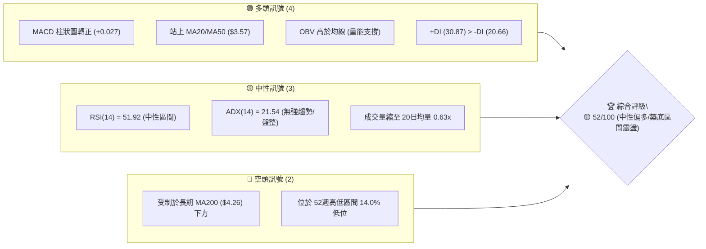
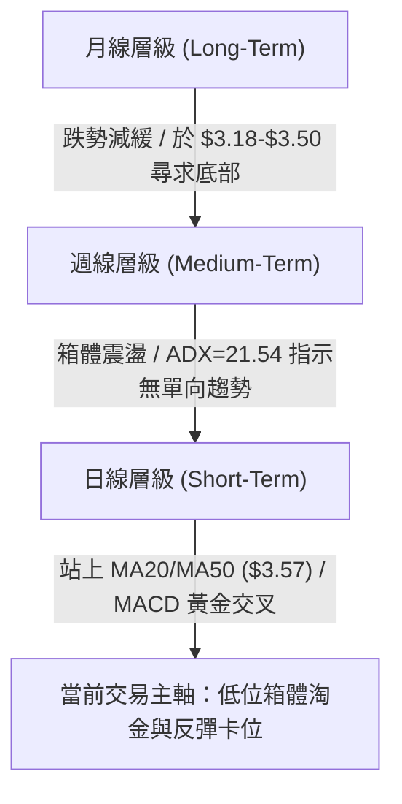
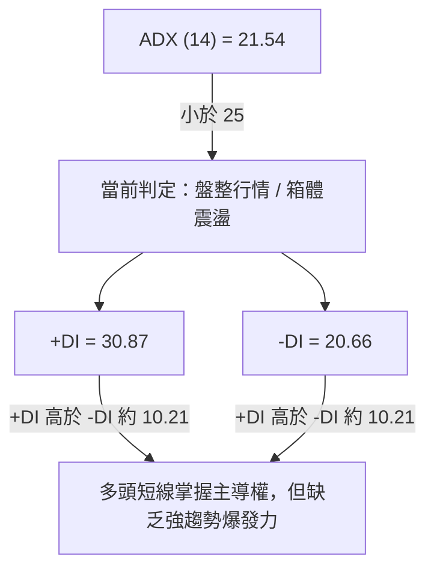
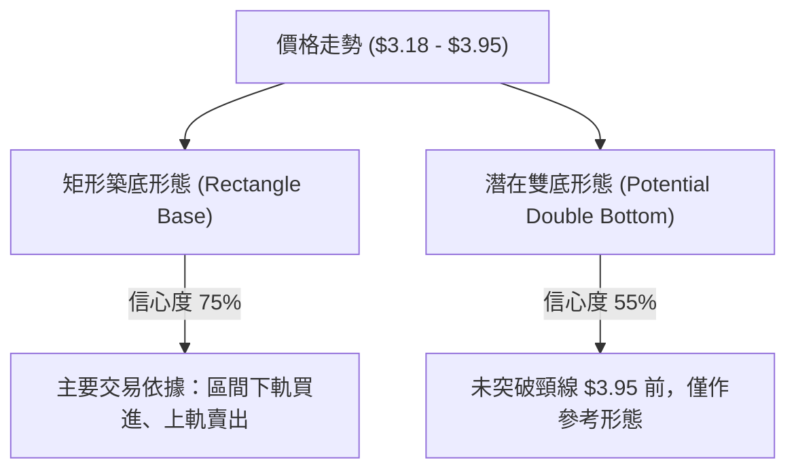
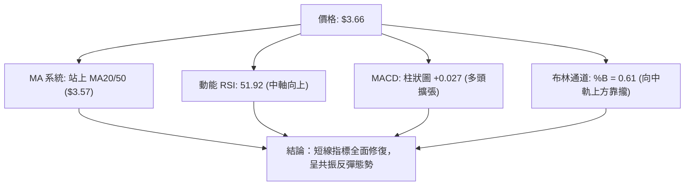
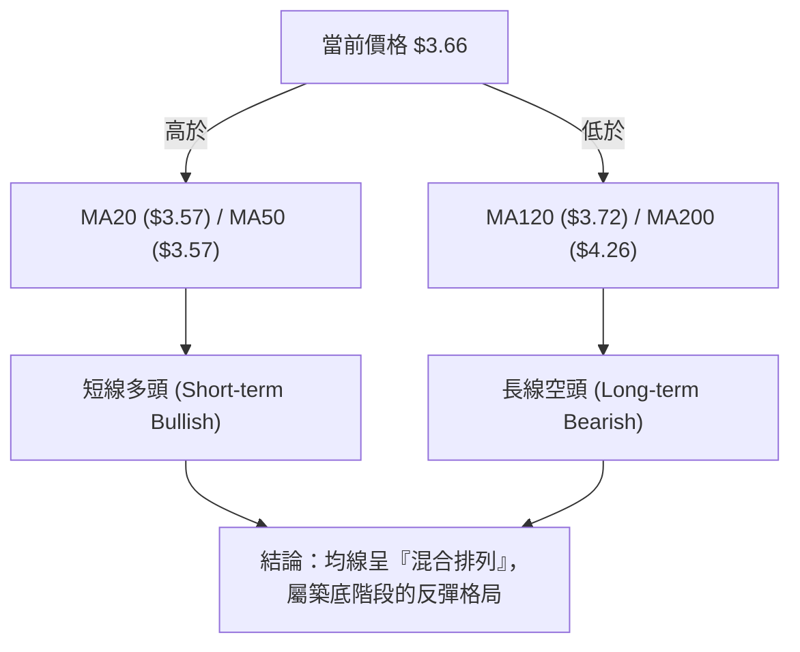
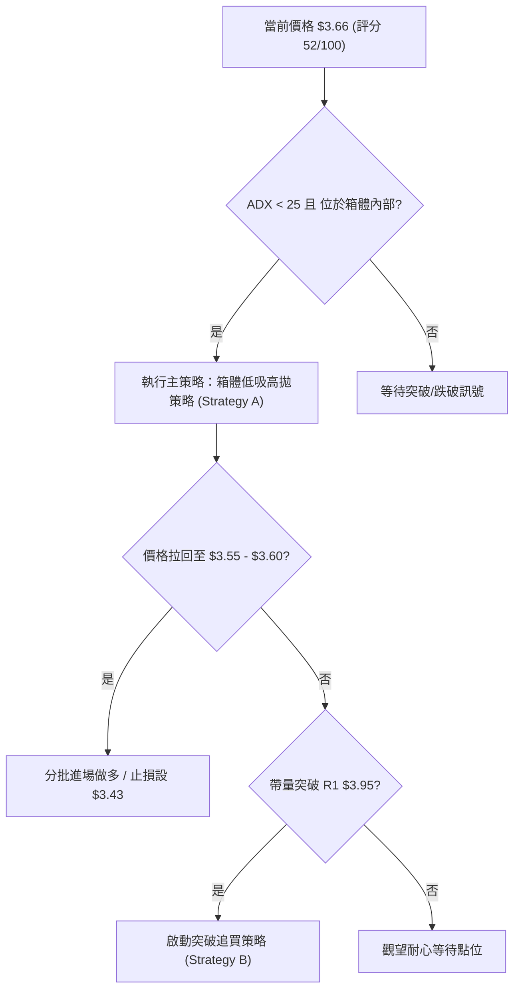
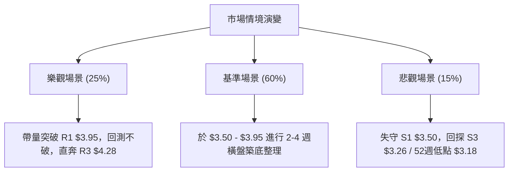

# GRAB 技術分析報告

> **報告日期**：2026-08-09 ｜ **語言**：繁體中文 ｜ **數據來源**：Yahoo Finance ｜ **當前價格**：$3.66

---

## 目錄

| 章節 | 內容 |
|------|------|
| [1. 技術面概覽](#1-技術面概覽) | 訊號儀表板、核心指標、評分卡 |
| [2. 趨勢分析](#2-趨勢分析) | 多時框趨勢、長中短期走勢 |
| [3. 圖表形態分析](#3-圖表形態分析) | 形態識別、K線組合、目標價 |
| [4. 支撐與阻力](#4-支撐與阻力) | 關鍵價位、斐波那契回調 |
| [5. 技術指標深度解讀](#5-技術指標深度解讀) | MA/RSI/MACD/布林/成交量 |
| [6. 動能與波動率](#6-動能與波動率) | 動能評估、ATR、Beta |
| [7. 多時框架總結](#7-多時框架總結) | 時框架評分矩陣 |
| [8. 交易策略建議](#8-交易策略建議) | 多空策略、風險報酬比 |
| [9. 風險提示與監控](#9-風險提示與監控) | 監控指標、風險場景 |

---

## 1. 技術面概覽

### 🎯 技術訊號儀表板



### 📊 核心指標速覽表

| 指標類別 | 指標名稱 | 當前數值 | 訊號 | 解讀 |
|----------|----------|----------|------|------|
| **價格** | 當前收盤價 | $3.66 | 🟡 中性 | 處於 52 週區間 ($3.18–$6.62) 之 14.0% 位置 |
| **均線** | MA20 / MA50 | $3.57 | 🟢 看多 | 價格已成功站上短期與中期均線，形成短線支撐 |
| **均線** | MA120 | $3.72 | 🟡 中性 | 股價臨近季線與半年線壓力，短期面臨解套賣壓 |
| **均線** | MA200 | $4.26 | 🔴 看空 | 長期均線向下扣押，壓制中長期反彈空間 |
| **動能** | RSI(14) | 51.92 | 🟡 中性 | 位於 50 中軸上方，動能逐步轉強但未達過熱 |
| **動能** | MACD (柱) | +0.027 | 🟢 看多 | 快線 (0.004) 上穿慢線 (-0.023)，多頭柱狀擴張 |
| **趨勢** | ADX(14) | 21.54 | 🟡 盤整 | ADX < 25 指示趨勢不強，目前為區間築底格局 |
| **波動** | ATR(14) | $0.14 | 🟢 低波 | 每日平均波動率約 3.91%，適合箱體波段操作 |

### 🏆 技術評分卡

```
╔══════════════════════════════════════════════════════════════════╗
║                   技術評分卡 — GRAB (2026-08-09)                 ║
╠══════════════════════════════════════════════════════════════════╣
║ 趨勢強度      ▓▓▓▓▓▓▓▓░░░░░░░░░░░░  42/100  🟡 盤整打底           ║
║ 動能指標      ▓▓▓▓▓▓▓▓▓▓▓░░░░░░░░░  58/100  🟢 動能偏多           ║
║ 支撐穩定度    ▓▓▓▓▓▓▓▓▓▓▓▓▓░░░░░░░  68/100  🟢 S1$3.50築底堅實     ║
║ 成交量配合    ▓▓▓▓▓▓▓▓▓▓░░░░░░░░░░  50/100  🟡 觀望縮量           ║
║ 形態完整度    ▓▓▓▓▓▓▓▓▓▓░░░░░░░░░░  52/100  🟡 矩形底部收斂       ║
║ 均線排列      ▓▓▓▓▓▓▓▓░░░░░░░░░░░░  44/100  🟡 短多長空混合       ║
╠══════════════════════════════════════════════════════════════════╣
║ 綜合評分      ▓▓▓▓▓▓▓▓▓▓▓░░░░░░░░░  52/100  🟡 中性偏多/區間震盪   ║
╚══════════════════════════════════════════════════════════════════╝
```

---

## 2. 趨勢分析

### 🌐 多時框趨勢分析



### 📈 長期趨勢 — 12個月走勢圖（Unicode）

```
GRAB 月線走勢圖（2025-08 至 2026-08）
價格軸 ($)
$6.50 ┤
$6.00 ┤        ●   ● (高點 $6.02)
$5.50 ┤               ●
$5.00 ┤ ●                 ●   ●
$4.50 ┤                           ●
$4.00 ┤                               ●       ●
$3.50 ┤                                   ●       ●   ● (現價 $3.66)
$3.00 ┤                                       ● (低點 $3.18)
      └─┬───┬───┬───┬───┬───┬───┬───┬───┬───┬───┬───┬───
       08  09  10  11  12  01  02  03  04  05  06  07  08 (月)
```

**走勢特徵分析表格**：

| 時間區段 | 價格區間 | 變動幅度 | 主要技術特徵與驅動因素 |
|----------|----------|----------|------------------------|
| **2025/08–2025/09** | $4.99 ➔ $6.02 | +20.64% | 多頭主升段衝高，觸及近一年最高區域（52W High $6.62 附近） |
| **2025/10–2025/12** | $6.01 ➔ $4.99 | -16.97% | 高點受阻，爆量拉回，正式跌破月線 MA20 支撐 |
| **2026/01–2026/03** | $4.30 ➔ $3.66 | -14.88% | 震盪尋底，連續黑K探底，賣壓源源不絕 |
| **2026/04–2026/05** | $3.82 ➔ $3.54 | -7.33%  | 反彈乏力，遭 MA200 反壓阻絕，再次打回底域 |
| **2026/06–2026/08** | $3.77 ➔ $3.66 | -2.92%  | 於 $3.18–$3.50 區間觸底止跌，呈現微幅打底反彈 |

### 📊 中期趨勢（週線分析）

```
GRAB 週線壓力與支撐結構示意圖
===================================================================
 $4.28 -------------------------------------------------- 阻力 R3 (MA200 扣押區)
 $4.06 -------------------------------------------------- 阻力 R2 (前高波段區)
 $3.95 -------------------------------------------------- 阻力 R1 / Fib 78.6% ($3.92)
 $3.66 ================================================== 現價位置
 $3.50 -------------------------------------------------- 支撐 S1 (近期小箱底)
 $3.39 -------------------------------------------------- 支撐 S2 (波段次低點)
 $3.26 -------------------------------------------------- 支撐 S3 (52W Low $3.18 護城河)
===================================================================
```

### ⚡ 趨勢強度評估（ADX 解讀）



| 指標名稱 | 當前數值 | 參考閾值 | 市場狀態解讀 |
|----------|----------|----------|--------------|
| **ADX (14)** | 21.54 | < 25 (弱趨勢/盤整) | 市場處於無明確單向趨勢的打底階段，突破或跌破前宜以區間操作為主 |
| **+DI** | 30.87 | > -DI | 短期多頭買盤強於空頭，具備向上反彈之動能 |
| **-DI** | 20.66 | < +DI | 空頭力道已較上半年減弱，賣壓逐漸收斂 |

---

## 3. 圖表形態分析

### 🔍 形態識別系統



#### 形態信心度評估表

| 形態名稱 | 信心度 | 判斷依據（引用數據） | 完成度 | 目標價（附計算式） |
|----------|--------|----------------------|--------|--------------------|
| **矩形築底** | 75% | 價格限制於 S1 $3.50 / S2 $3.39 至 R1 $3.95 之間狹幅震盪 | 85% | 頸線 $3.95 + 形態高度 ($3.95 - $3.50 = $0.45) = **$4.40** |
| **雙重底 (W底)** | 55% | 左底 2026/03 $3.18，右底 2026/07 $3.31，中間高點 $3.95 | 60% | 突破頸線 R1 $3.95 後推算：$3.95 + ($3.95 - $3.18 = $0.77) = **$4.72** |

*註：若未帶量突破頸線 R1 $3.95，形態均未算完全成立，目前以指標型與區間打底解讀為主。*

### 🕯️ 重要 K 線形態分析

| 月份/週次 | 收盤價 | K 線形態 | 技術解讀 | 訊號 |
|-----------|--------|----------|----------|------|
| **2026-07-26** | $3.31 | 長陰探底 | 消化前波賣壓，跌至 52週低點附近的測底動作 | 🔴 空頭宣洩 |
| **2026-08-02** | $3.50 | 晨星反轉初步 | 止跌陽線，企穩於 S1 $3.50 支撐之上 | 🟢 多頭止跌 |
| **2026-08-09** | $3.66 | 實體中陽線 | 伴隨 MACD 柱狀擴張，連續突破 MA20 與 MA50 ($3.57) | 🟢 多頭反彈 |

### 📉 ASCII 走勢形態示意圖

```
GRAB 雙重底 / 矩形打底形態示意圖
===================================================================
阻力頸線 R1 : $3.95 ------------------+----------------- (形態突破確認點)
                                     / \
                                    /   \
現價位置   : $3.66 --------*--------/     \
                          / \      /
支撐打底   : $3.50 ------/---\----/--------------------- (矩形箱體下軌)
                        /     \  /
波段低點   : $3.18 ----*       * ($3.31) --------------- (W底兩腳測試)
                      左腳    右腳
===================================================================
```

---

## 4. 支撐與阻力

### 🗺️ 關鍵價位分布圖（Unicode）

```
GRAB 價位結構分布圖
═══════════════════════════════════════════════════════════════════
$4.28 ║████████████████████████████████████║ 強阻力 R3 (MA200 扣押區)
$4.06 ║██████████████████████            ║ 阻力 R2 (前高區間)
$3.95 ║████████████████████████████████    ║ 關鍵阻力 R1 (頸線 / 矩形頂)
$3.66 ╠════════════════════════════════════╣ ◄ 當前價格 ($3.66)
$3.50 ║▓▓▓▓▓▓▓▓▓▓▓▓▓▓▓▓▓▓▓▓▓▓▓▓            ║ 近期密集支撐 S1 (箱體下軌)
$3.39 ║██████████████████                  ║ 支撐 S2 (波段次低點)
$3.26 ║████████████████████████████████████║ 強支撐 S3 (52W Low $3.18 防線)
═══════════════════════════════════════════════════════════════════
```

### 🚧 阻力位分析表

| 阻力級別 | 精確價位 | 距現價增幅 | 形成原因 | 突破難度 | 重要性 |
|----------|----------|------------|----------|----------|--------|
| **R1** | $3.95 | +7.92% | 近一年波段高點聚類、斐波那契 78.6% ($3.92) 重疊區 | 🟡 中等 | 🟢 極高 (突破即確認形態翻多) |
| **R2** | $4.06 | +10.93% | 前波箱體震盪頂部賣壓區 | 🟡 中等 | 🟡 中等 (中期解套關卡) |
| **R3** | $4.28 | +16.94% | 下降中 MA200 ($4.26) 長期均線扣押位 | 🔴 極難 | 🔴 高 (牛熊分界線) |

### 🛡️ 支撐位分析表

| 支撐級別 | 精確價位 | 距現價跌幅 | 形成原因 | 守住機率 | 重要性 |
|----------|----------|------------|----------|----------|--------|
| **S1** | $3.50 | -4.37% | 近一年波段低點聚類、MA20/MA50 ($3.57) 共振扣抵區 | 🟢 高 (75%) | 🟢 高 (極短線多空防線) |
| **S2** | $3.39 | -7.38% | 2026年6月-7月二次測底之密集成交區 | 🟢 中高 (65%) | 🟡 中等 (強支撐防線) |
| **S3** | $3.26 | -11.07% | 歷史低點聚類 (52W Low $3.18 的前哨防禦帶) | 🟢 極高 (85%) | 🔴 極高 (防跌破的底線) |

### 📐 斐波那契回調位分析

依據 52 週高低區間（高點 **$6.62** ➔ 低點 **$3.18**，落差 **$3.44**）計算：

```
斐波那契回調結構表
───────────────────────────────────────────────────────────────────
  0.0% (52W High)   : $6.62  ████████████████████████████████████████
 23.6%              : $5.81  ███████████████████████████████
 38.2%              : $5.31  ██████████████████████████
 50.0%              : $4.90  ██████████████████████
 61.8%              : $4.49  █████████████████
 78.6%              : $3.92  █████████████  ◄◄ 近期強阻力 R1 ($3.95) 附近
 現價位置           : $3.66  ██████████    ◄◄ 落在 78.6% 與 100% 之間
100.0% (52W Low)    : $3.18  ████████
───────────────────────────────────────────────────────────────────
```

* **位置分析**：當前價格 $3.66 處於 78.6% ($3.92) 與 100.0% ($3.18) 之間的低位超跌區。
* **技術涵義**：$3.92 (Fib 78.6%) 為反彈第一關鍵卡點。若能向上突破並站穩 $3.92，價格將開啟邁向 $4.49 (Fib 61.8%) 的中級反彈波段。

---

## 5. 技術指標深度解讀

### 🎛️ 指標訊號總覽



### 📈 移動平均線排列分析



* **MA20 / MA50 ($3.57)**：雙線金叉重疊於 $3.57，提供價格最直接的下檔支撐。
* **MA120 ($3.72) 與 MA240 ($4.52)**：上方季線與年線呈現下彎，限制中長線拉升速度。

### 📉 RSI(14) 分析

* **當前數值**：**51.92**
* **進度條**：`███████████░░░░░░░░░ 51.92%` (50 中性水準上方)
* **狀態**：由 2026/07/26 的超賣區 (25.9) 強勢回升至 50 之上，無頂背離或底背離，屬健康的動能修復。

### 📊 MACD(12/26/9) 訊號解讀

* **DIF (MACD 線)**：`0.004`
* **DEA (Signal 線)**：`-0.023`
* **MACD 柱狀圖**：`+0.027` 🟢 **看多**
* **解讀**：DIF 已向上翻紅並穿越 DEA，柱狀圖連續放量擴張，確認短線買盤進駐。

### 📦 布林通道分析

```
GRAB 布林通道結構示意圖
===================================================================
上軌 (Upper Band)   : $3.96 ----------------------------------------
現價 (Current Price): $3.66 -----------* (BB %B = 0.61)
中軌 (MA20)         : $3.57 ----------------------------------------
下軌 (Lower Band)   : $3.19 ----------------------------------------
===================================================================
```

* **帶寬狀態**：通道呈現收斂後的平行推進，上軌 $3.96 與 R1 $3.95 高度重疊，為短線首要壓力區。

### 💹 成交量分析（量價配合度）

* **當前成交量**：30,834,800 股
* **20日均量**：49,021,990 股（量比 **0.63x**）
* **OBV 趨勢**：OBV 高於其均線，顯示法人與大戶在低位呈現默默吸籌（Accumulation）狀態，惟整體散戶追高意願低落造成縮量。

---

## 6. 動能與波動率

### ⚡ 動能評估四象限

| 象限區塊 | 動能強度 | 波動率 | GRAB 當前定位 | 操作思維 |
|----------|----------|--------|---------------|----------|
| **Q1 (高動能/低波動)** | 強 | 低 | — | 最佳趨勢加碼區 |
| **Q2 (弱動能/低波動)** | 弱 | 低 | **✓ 當前位置** | **區間低吸 / 吸籌築底** |
| **Q3 (強動能/高波動)** | 強 | 高 | — | 突破追買 / 高風險高收益 |
| **Q4 (弱動能/高波動)** | 弱 | 高 | — | 恐慌殺多 / 嚴格避開 |

### 📊 ATR 波動率分析

* **ATR(14)**：**$0.14** (佔股價 3.91%)
* **風控應用**：
  * **單日波幅預估**：±$0.14
  * **建議止損距離**：1.5 × ATR = $0.21
  * **建議止盈距離**：3.0 × ATR = $0.42

### 📐 Beta 與市場相關性

* **Beta 值**：**0.89**
* **分析**：波動性略低於整體大盤（Beta < 1.0），股價受美股科技巨頭大盤暴跌的系統性波及程度相對較小，具備一定防禦屬性。

---

## 7. 多時框架總結

### 📋 時框架評分表

| 時框架 | 趨勢方向 | 動能狀態 | 均線排列 | 形態結構 | 綜合評分 | 交易策略建議 |
|--------|----------|----------|----------|----------|----------|--------------|
| **日線 (Daily)** | 🟢 偏多 | 🟢 轉強 (MACD金叉) | 🟢 站上MA20/50 | 🟢 底部反彈 | **62/100** | 低吸高拋 / 尋求區間做多 |
| **週線 (Weekly)** | 🟡 盤整 | 🟡 中性 (RSI 51.9) | 🟡 混合排列 | 🟡 矩形震盪 | **50/100** | 箱體操作 / 留意 R1 阻力 |
| **月線 (Monthly)**| 🔴 偏空 | 🔴 弱勢 | 🔴 壓制於MA200 | 🟡 探底打底 | **42/100** | 長線觀望 / 等待突破 |

### 🔲 綜合訊號矩陣

```
時框架訊號收斂矩陣
┌──────────────┬──────────────┬──────────────┬──────────────┐
│  時框架/指標  │   均線系統   │   動能指標   │   擺動指標   │
├──────────────┼──────────────┼──────────────┼──────────────┤
│  日線 (Short)│   🟢 看多    │   🟢 看多    │   🟢 看多    │
│  週線 (Mid)  │   🟡 中性    │   🟡 中性    │   🟡 中性    │
│  月線 (Long) │   🔴 看空    │   🟡 中性    │   🔴 看空    │
└──────────────┴──────────────┴──────────────┴──────────────┘
```

### ⚖️ 多時框收斂結論

依據多時框收斂規則：當前 ADX(14) = 21.54 (< 25)，明確定義市場為 **「盤整/箱體打底行情」**。
因此，中長期空頭趨勢暫時休兵，**交易主軸由日線布林通道與區域支撐/阻力 (S1 $3.50 ➔ R1 $3.95) 掌控**。最終方向判斷為 **🟡 中性偏多（低位區間震盪反彈）**。

---

## 8. 交易策略建議

### 🗺️ 策略決策流程圖



### 🧭 策略路由

**當前主策略方向 = 🟢 箱體低吸偏多策略（綜合評分 52/100）**

### 🎯 價格情境階梯 (Price Scenarios)

| 觸發條件 | 下一目標 | 後續延伸 | 情境含義 |
|----------|----------|----------|----------|
| **帶量突破 R1 $3.95** | R2 $4.06 | R3 $4.28 | 短線築底成功，啟動中級反彈波 |
| **企穩於 $3.50 - $3.66** | R1 $3.95 | — | 箱體內部震盪修復，時間換取空間 |
| **收盤跌破 S1 $3.50** | S2 $3.39 | S3 $3.26 | 築底失敗，再次下探測試 52週低點 |

### 📊 情境機率分佈

| 情境 | 機率 | 主要技術依據 |
|------|------|--------------|
| **箱體內反彈 (向 R1 $3.95 靠攏)** | **55%** | MACD 金叉柱狀擴張、+DI > -DI、站上 MA20/MA50 |
| **區間橫盤震盪 ($3.50 - $3.70)** | **30%** | ADX = 21.54 趨勢偏弱、成交量萎縮 (0.63x) |
| **回落跌破 S1 探底 ($3.26 - $3.50)** | **15%** | 上方 MA120/MA200 長期均線扣押賣壓 |

### 🟢 主策略詳情

```
╔══════════════════════════════════════════════════════════════════════╗
║                    交易策略參數矩陣表                                ║
╠══════════════════╦══════════════════════════╦════════════════════════╣
║ 策略要素         ║ 策略 A：區間逢低做多     ║ 策略 B：突破 R1 追多   ║
╠══════════════════╬══════════════════════════╬════════════════════════╣
║ 適用情境         ║ 價格回測 MA20/50 支撐區  ║ 帶量強勢突破矩形頂部   ║
║ 進場條件         ║ 拉回至 $3.55–$3.60 企穩  ║ 日線收盤突破 R1 $3.95  ║
║ 進場價格         ║ $3.58                    ║ $3.98                  ║
║ 目標價 T1        ║ $3.95 (R1 / 箱體頂)      ║ $4.28 (R3 / MA200)     ║
║ 目標價 T2        ║ $4.06 (R2)               ║ $4.49 (Fib 61.8%)      ║
║ 止損價格         ║ $3.43 (跌破 S1 - 0.5xATR)║ $3.80 (跌破假突破頸線) ║
║ 風險報酬比 (T1)  ║ 2.47 : 1                 ║ 1.67 : 1               ║
║ 風險報酬比 (T2)  ║ 3.20 : 1                 ║ 2.83 : 1               ║
║ 預估成功機率     ║ 60%                      ║ 50%                    ║
║ 建議倉位上限     ║ 15%                      ║ 10%                    ║
╚══════════════════╩══════════════════════════╩════════════════════════╝
```

### 🔴 反向風險觸發點（對沖提示）

若價格**日線收盤跌破 S1 $3.50**，代表多頭反彈力道瓦解；若進一步跌破 **S2 $3.39**，必須無條件執行停損離場，不宜進行盲目攤平。

### ⭐ 整體訊號強度評星

```
做多訊號強度：★★★☆☆  (3/5 星) — 具備底部位階與指標共振優勢
做空訊號強度：★★☆☆☆  (2/5 星) — 探底動能衰竭，賣壓放緩
整體可信度：  ★★★☆☆  (3/5 星) — 屬典型的箱體低位操作架構
```

---

## 9. 風險提示與監控

### ✅ 關鍵監控指標 Checklist

```
╔══════════════════════════════════════════════════════════════════╗
║                   每日交易前監控清單 (Checklist)                 ║
╠══════════════════════════════════════════════════════════════════╣
║ [ ] 股價是否維持於 MA20 / MA50 ($3.57) 上方？                     ║
║ [ ] MACD 柱狀圖是否持續保持正值 (+0.027) 且放量？                ║
║ [ ] 日成交量能否突破 20日均量 (49.02M) 之 1.0x？                  ║
║ [ ] RSI(14) 是否穩健維持於 50 中軸區間之上？                      ║
║ [ ] 是否發生價格突破 $3.95 或跌破 $3.50 的關鍵事件？             ║
╚══════════════════════════════════════════════════════════════════╝
```

### ⚠️ 風險場景分析



### 🛡️ 風險管理重要提醒

1. **資金控管**：在 ADX < 25 的盤整格局下，單一股票總曝險部位不宜超過總投資組合的 **15%**。
2. **止損紀律**：精確止損位設定於 **$3.43**，若價格觸及，代表箱體下軌失守，需嚴格執行離場。
3. **波動適應**：當前 ATR 為 $0.14，避免將止損設置過窄（< 1.0x ATR）以防被日常噪訊洗盤出場。

---

## 📋 報告總結

```
╔══════════════════════════════════════════════════════════════════╗
║                   GRAB 技術分析報告總結                          ║
╠══════════════════════════════════════════════════════════════════╣
║ 報告日期：2026-08-09                                             ║
║ 當前價格：$3.66                                                  ║
║ 分析評級：🟡 52/100 (中性偏多 / 區間打底反彈)                   ║
║                                                                  ║
║ 關鍵結論：                                                       ║
║ ├─ 長期趨勢：🔴 偏空 (受制於 MA200 $4.26 反壓)                   ║
║ ├─ 中期趨勢：🟡 盤整 (於 $3.50–$3.95 箱體擺動，ADX=21.54)        ║
║ ├─ 短期趨勢：🟢 偏多 (站上 MA20/50 $3.57，MACD 柱狀翻紅)          ║
║ ├─ 關鍵支撐：S1 $3.50 / S2 $3.39 / S3 $3.26                      ║
║ ├─ 關鍵阻力：R1 $3.95 / R2 $4.06 / R3 $4.28                      ║
║ └─ 分析師共識目標價：$5.89 (機構評級：Strong Buy)                ║
║                                                                  ║
║ 最優策略組合：                                                   ║
║ 1. 🥇 最佳機會：拉回至 $3.55–$3.60 分批低吸做多，目標 R1 $3.95   ║
║ 2. 🥈 次選機會：帶量突破 R1 $3.95 後追買，目標 R3 $4.28          ║
║ 3. 🥉 風險控制：跌破 $3.43 (S1下方) 嚴格執行停損                 ║
╚══════════════════════════════════════════════════════════════════╝
```

---

> ⚠️ **免責聲明**：本報告為 AI 自動生成之技術分析，所有數據及估算均基於提供的歷史價格資訊。本報告**僅供研究與學術參考**，**不構成任何投資建議**。投資有風險，入市需謹慎。

---

*報告生成時間：2026-08-09 ｜ 數據來源：Yahoo Finance ｜ 分析框架：多時框技術分析*