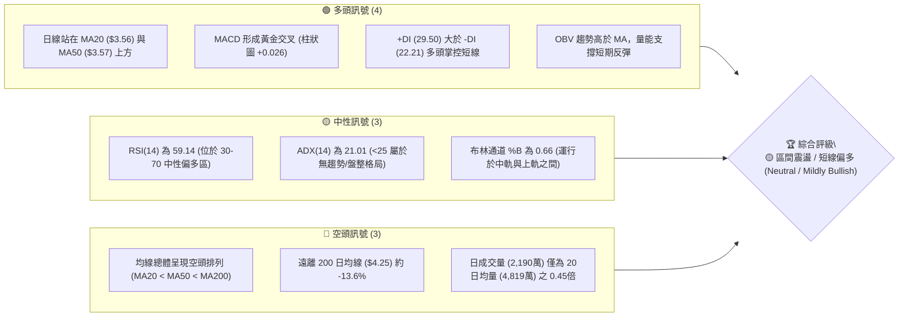
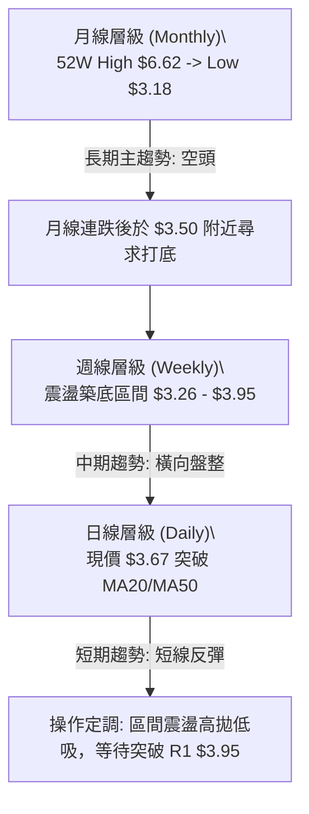
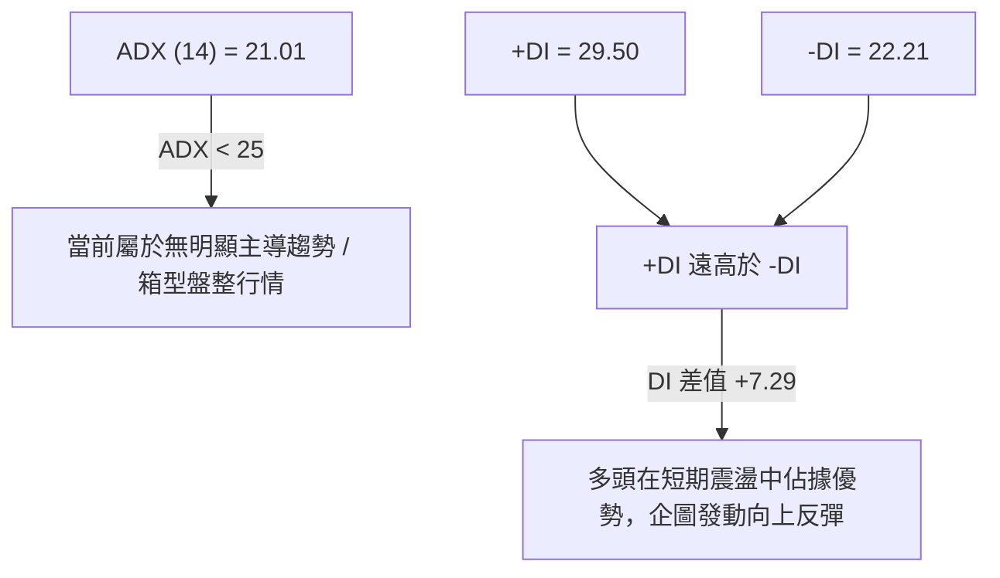
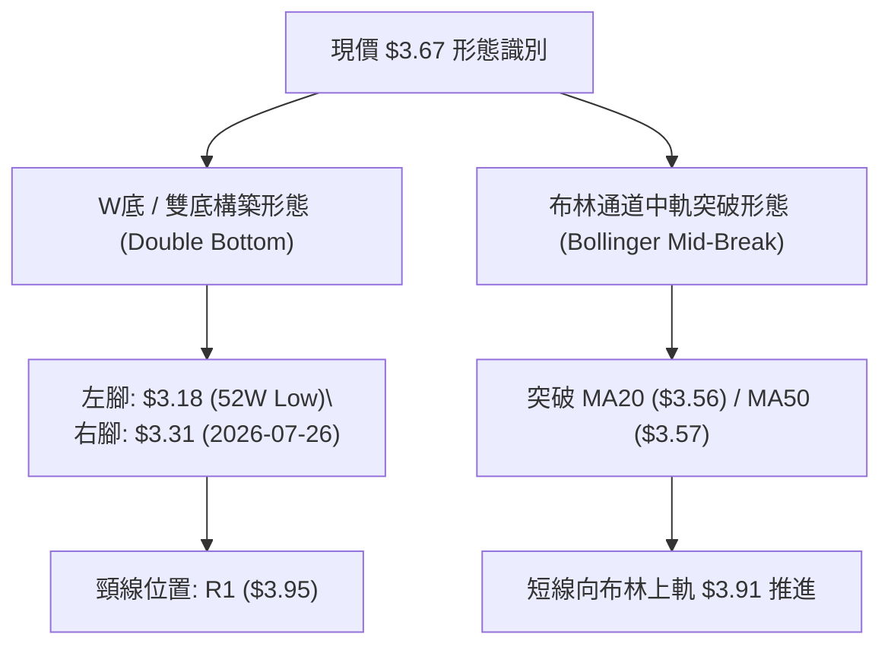
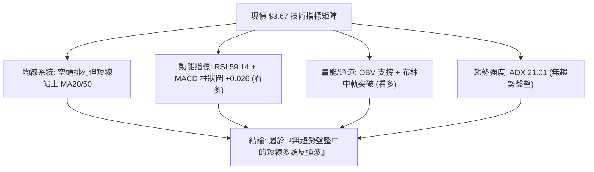
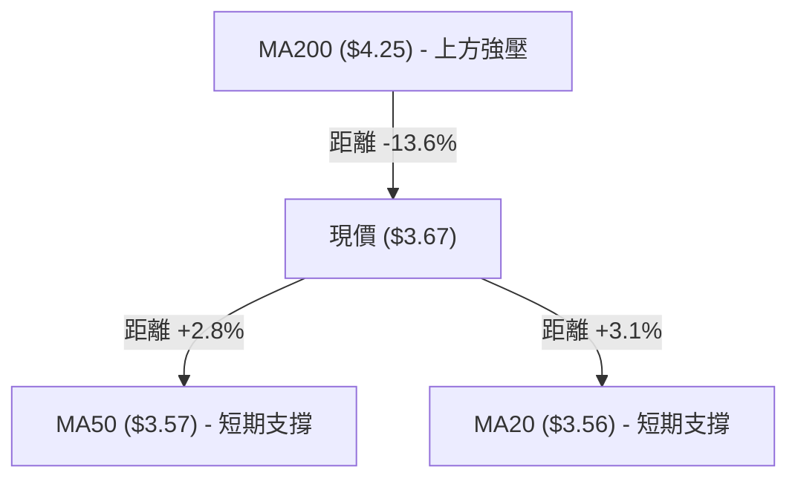
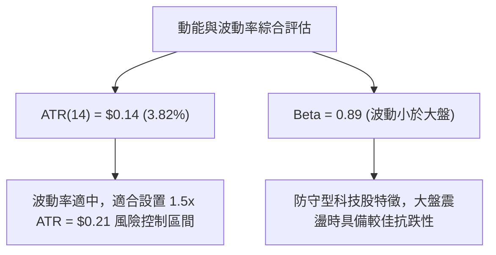
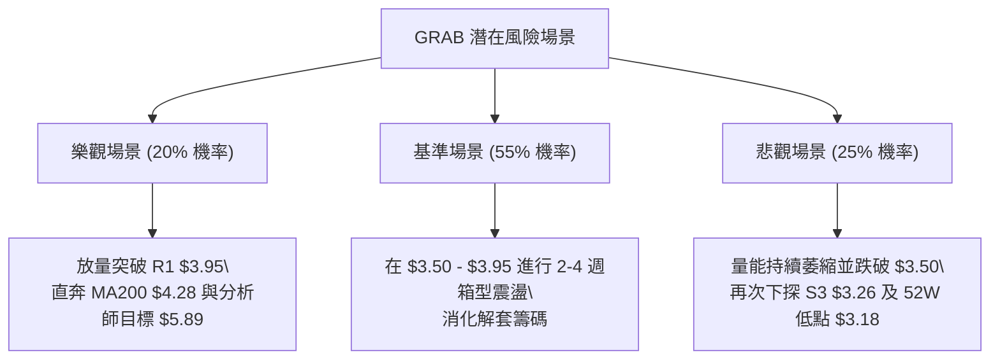

# GRAB 技術分析報告

> **報告日期**：2026-08-10 ｜ **語言**：繁體中文 ｜ **數據來源**：Yahoo Finance ｜ **當前價格**：$3.67

---

## 目錄

| 章節 | 內容 |
|------|------|
| [1. 技術面概覽](#1-技術面概覽) | 訊號儀表板、核心指標、評分卡 |
| [2. 趨勢分析](#2-趨勢分析) | 多時框趨勢、長中短期走勢 |
| [3. 圖表形態分析](#3-圖表形態分析) | 形態識別、K線組合、目標價 |
| [4. 支撐與阻力](#4-支撐與阻力) | 關鍵價位、斐波那契回調 |
| [5. 技術指標深度解讀](#5-技術指標深度解讀) | MA/RSI/MACD/布林/成交量 |
| [6. 動能與波動率](#6-動能與波動率) | 動能評估、ATR、Beta |
| [7. 多時框架總結](#7-多時框架總結) | 時框架評分矩陣 |
| [8. 交易策略建議](#8-交易策略建議) | 多空策略、風險報酬比 |
| [9. 風險提示與監控](#9-風險提示與監控) | 監控指標、風險場景 |

---

## 1. 技術面概覽

### 🎯 技術訊號儀表板



### 📊 核心指標速覽表

| 指標類別 | 指標名稱 | 當前數值 | 訊號 | 解讀 |
|----------|----------|----------|------|------|
| **價格** | 當前價格 | $3.67 | 🟡 | 位於 52 週區間 ($3.18–$6.62) 之 14.2% 低檔水準 |
| **均線** | MA20 | $3.56 | 🟢 | 價格在 MA20 上方 (+3.09%)，短線扭轉極弱勢 |
| **均線** | MA50 | $3.57 | 🟢 | 價格在 MA50 上方 (+2.80%)，形成短中期初步支撐 |
| **均線** | MA200 | $4.25 | 🔴 | 價格在 MA200 下方 (-13.65%)，長期空頭趨勢未改 |
| **動能** | RSI(14) | 59.14 | 🟢 | 位於中性偏多區間，無超買超賣，具備繼續反彈空間 |
| **動能** | MACD | +0.026 (柱狀) | 🟢 | 快線(0.009)穿越慢線(-0.017)向上，多頭動能修復 |
| **動能** | ADX(14) | 21.01 | 🟡 | ADX < 25 指示當前為「盤整/弱趨勢」行情，以區間看待 |
| **波動** | ATR(14) | $0.14 | 🟡 | 占股價 3.82%，每日波動率溫和，適合區間擺盪交易 |
| **通道** | 布林通道 | $3.21 – $3.91 | 🟢 | %B = 0.66，價格回升至中軌 ($3.56) 上方，向上軌挑戰 |
| **成交量**| 量比 (Volume) | 0.45x | 🔴 | 最新成交量大幅萎縮，反彈缺乏機構大資金追價量能 |

### 🏆 技術評分卡

```
╔══════════════════════════════════════════════════════════════════╗
║                   技術評分卡 — GRAB (2026-08-10)                 ║
╠══════════════════════════════════════════════════════════════════╣
║ 趨勢強度 (ADX)     ████████░░░░░░░░░░░░  42/100  🟡 弱趨勢盤整   ║
║ 動能指標 (RSI/MACD)██████████████░░░░░░  68/100  🟢 動能轉強     ║
║ 支撐穩定度 (S1-S3) ████████████████░░░░  78/100  🟢 底部支撐紮實 ║
║ 成交量配合度       ████████░░░░░░░░░░░░  40/100  🔴 量能顯著不足 ║
║ 形態完整度 (底型)  ████████████░░░░░░░░  60/100  🟡 構築雙底中   ║
║ 均線排列狀況       ███████░░░░░░░░░░░░░  35/100  🔴 長期空頭排列 ║
╠══════════════════════════════════════════════════════════════════╣
║ 綜合技術評分       ██████████░░░░░░░░░░  53.8/100 🟡 區間築底    ║
╚══════════════════════════════════════════════════════════════════╝
```

---

## 2. 趨勢分析

### 🌐 多時框趨勢分析



### 📈 長期趨勢 — 24個月歷史走勢圖

```
GRAB 24個月月線歷史走勢圖 (2024-08 至 2026-08)
價格軸 ($)
$6.50 ┤                                      ● (2025-09: $6.02)
$6.00 ┤                                    ●   ●
$5.50 ┤                          ●               ●
$5.00 ┤              ●   ●   ●       ●               ● (2025-12: $4.99)
$4.50 ┤          ●     ●   ●   ●
$4.00 ┤      ●                                     ●   ●
$3.50 ┤  ●                                                 ●   ●   ● (現價 $3.67)
$3.00 ┤                                                      ● (52W Low: $3.18)
      └─┬───┬───┬───┬───┬───┬───┬───┬───┬───┬───┬───┬───┬───┬───┬───┬───► 時間
       24/08 10  12 25/02 04  06  08  10  12 26/02 04  06  08
```

#### 24個月歷史走勢特徵分析

| 階段歷史 | 價格區間 | 漲跌幅/特徵 | 技術面解讀 |
|----------|----------|-------------|------------|
| **2024-08 ~ 2024-11** | $3.22 → $5.00 | +55.28%（主升段） | 強勢突破下降通道，多頭量能爆發 |
| **2024-12 ~ 2025-08** | $4.53 → $5.03 | 橫盤箱型震盪 | 於 $4.50–$5.00 高位區間換手進行籌碼沉澱 |
| **2025-09 ~ 2025-10** | $6.02 → $6.01 | 創 52 週新高 ($6.62) | 衝高見頂，多頭動能耗盡，形成雙頂疑慮 |
| **2025-11 ~ 2026-03** | $5.45 → $3.66 | -32.84%（主跌段） | 跌破 MA200 關鍵支撐，觸發停損賣壓 |
| **2026-04 ~ 2026-08** | $3.50 → $3.67 | 探底築底階段 | 於 $3.18-$3.50 區間獲得強烈買盤支撐，開始築底 |

### 📊 中期趨勢（週線分析）

從近 20 週數據觀察，GRAB 呈現標準的**多空交替築底**形態：
1. **第一次下探底（2026-05 至 06）**：股價自 $4.21 回落至 $3.30–$3.34，RSI 降至 20.5 進入極度超賣區，隨後觸發技術性反彈至 $3.93（2026-07-12）。
2. **第二次二次測底（2026-07 至 08）**：股價再次拉回至 $3.31（2026-07-26），RSI(25.9) 再次超賣，但低點未穿前低 $3.18，且隨後兩週迅速收復至 $3.67，形成潛在的**雙底（W底）**結構。

### ⚡ 趨勢強度評估（ADX 解讀）



| ADX 數值區間 | 當前位置 | 行情性質 | 交易策略導向 |
|--------------|----------|----------|--------------|
| **0 - 20**   |          | 極弱趨勢 / 隨機游走 | 觀望或極短線 |
| **20 - 25**  | **21.01**| **弱趨勢 / 區間震盪** | **箱型操作（逢低買/逢高賣）、布林通道策略** |
| **25 - 50**  |          | 中強趨勢 / 順勢行情 | 突破跟進、移動止損 |
| **50 - 100** |          | 極強單邊行情 | 強烈順勢持有 |

---

## 3. 圖表形態分析

### 🔍 形態識別系統



#### 形態信心度與目標價評估

| 形態名稱 | 信心度 | 判斷依據（引用數據） | 完成度 | 目標價（附計算式） |
|----------|--------|----------------------|--------|--------------------|
| **W底 (雙重底)** | **65%** | 兩次下探 $3.18 與 $3.31 均獲得支撐（見 S3/S2），低點墊高 | 70% | **頸線 $3.95 + 形態高度 ($3.95 - $3.26) = $4.64** *(備註：介於 61.8% 斐波位 $4.49 與 R3 $4.28 之間)* |
| **箱型整理突破** | **60%** | 近 10 週於 $3.30–$3.95 進行區間箱型擺盪 | 50% | **箱頂突破點 $3.95 + 箱高 $0.65 = $4.60** |
| **均線黃金交叉** | **50%** | MA20 ($3.56) 向上穿越 MA50 ($3.57) | 90% | **第一目標價 $3.95 (R1) / 第二目標價 $4.06 (R2)** |

### 🕯️ 重要 K 線形態分析

| 日期/週期 | 收盤價 | K 線形態 | 解讀 | 訊號 |
|-----------|--------|----------|------|------|
| **2026-07-26** (週線) | $3.31 | 長下影錘子線 | 探底至 $3.31 附近獲得強烈低檔買盤支撐，止跌訊號明確 | 🟢 多頭止跌 |
| **2026-08-02** (週線) | $3.50 | 陽包陰吞噬線 | 收盤突破前一週高點，企圖收復 S1 支撐區，買盤回溫 | 🟢 多頭反攻 |
| **2026-08-09** (週線) | $3.66 | 連續兩紅陽線 | RSI 回升至 51.9，站上 MA20，確認短期反彈波展開 | 🟢 多頭續強 |
| **2026-08-16** (日線) | $3.67 | 窄幅十字小陽線 | 接近 $3.70 關卡出現觀望，量能萎縮（0.45x），待量突破 | 🟡 高位盤整 |

### 📉 ASCII 走勢形態示意圖

```
GRAB 日線雙底 (W底) 與箱型整理形態示意圖
===================================================================
$4.28 ┤                                                  [R3 阻力]
      │
$3.95 ┤--------------------- 頸線 (Neckline) ----------- [R1 阻力]
      │                    /\
$3.67 ┤───────────────────/──\───● (現價 $3.67)
      │        /\        /    \ /
$3.50 ┤───────/──\──────/──────v──────────────────────── [S1 支撐]
      │      /    \    /
$3.31 ┤     /      \  /  ◄ 右腳 (2026-07-26)
$3.18 ┤====v========v=================================== [52W Low / S3]
      │  左腳 (52W Low)
===================================================================
```

---

## 4. 支撐與阻力

### 🗺️ 關鍵價位分布圖

```
GRAB 價位結構分布圖 (由 OHLCV 與斐波那契計算)
═══════════════════════════════════════════════════════════════════
$6.62 ║██████████████████████████████████████████║ 52W High / 0.0% Fib
$5.81 ║██████████████████████████              ║ 23.6% Fib
$5.31 ║████████████████████                    ║ 38.2% Fib
$4.90 ║████████████████                        ║ 50.0% Fib
$4.49 ║██████████████                          ║ 61.8% Fib
$4.28 ║████████████                            ║ 阻力 R3 / MA200($4.25)
$4.06 ║██████████                              ║ 阻力 R2
$3.95 ║████████                                ║ 強阻力 R1 / 78.6% Fib ($3.92) / BB上軌($3.91)
$3.67 ╠════════════════════════════════════════╣ ◄ 當前價格 ($3.67)
$3.56 ║▓▓▓▓▓▓▓▓▓▓▓▓▓▓▓▓▓▓                      ║ MA20 ($3.56) / MA50 ($3.57)
$3.50 ║▓▓▓▓▓▓▓▓▓▓▓▓▓▓▓▓                        ║ 關鍵支撐 S1
$3.39 ║▓▓▓▓▓▓▓▓▓▓                              ║ 支撐 S2
$3.26 ║▓▓▓▓▓▓                                  ║ 強支撐 S3 / BB下軌($3.21)
$3.18 ║▓▓▓▓                                    ║ 52W Low / 100% Fib
═══════════════════════════════════════════════════════════════════
```

### 🚧 阻力位分析表

| 阻力級別 | 精確價位 | 形成原因（依據 OHLCV 數據） | 突破難度 | 技術重要性 |
|----------|----------|----------------------------------|----------|------------|
| **R1** | **$3.95** | 近一年波段高點聚類、布林上軌 ($3.91)、78.6% 斐波那契 ($3.92) 重疊 | 🔴 極高 | **短線多空分水嶺**，突破此位完成 W 底頸線衝高 |
| **R2** | **$4.06** | 波段高點聚類、密集籌碼解套壓力區 | 🟡 中等 | 衝向 $4.25 (MA200) 前的中繼阻力 |
| **R3** | **$4.28** | 近一年波段高點聚類、接近 MA200 下降均線 ($4.25) | 🔴 極高 | **中期牛熊轉換線**，站穩方能扭轉長期空頭排列 |

### 🛡️ 支撐位分析表

| 支撐級別 | 精確價位 | 形成原因（依據 OHLCV 數據） | 守住機率 | 技術重要性 |
|----------|----------|----------------------------------|----------|------------|
| **S1** | **$3.50** | 近一年波段低點聚類、緊鄰 MA20 ($3.56) 與 MA50 ($3.57) | 🟢 高 (75%) | **短線防守核心**，跌破則反彈態勢瓦解 |
| **S2** | **$3.39** | 近一年波段低點聚類 | 🟢 高 (80%) | 中期回檔強支撐區 |
| **S3** | **$3.26** | 波段低點聚類、布林下軌 ($3.21)、逼近 52週最低點 ($3.18) | 🟢 極高 (90%) | **絕對防禦底線**，跌破將創 52 週新低 |

### 📐 斐波那契回調位分析

依據 52 週高低點區間（$3.18 → $6.62，價差 $3.44）計算：

| 斐波那契比例 | 計算價位 | 當前價位相對關係 | 技術解讀 |
|--------------|----------|------------------|----------|
| **0.0%** | $6.62 | 上方 +80.38% | 52 週最高點（歷史強阻力） |
| **23.6%** | $5.81 | 上方 +58.31% | 分析師平均目標價 ($5.89) 附近 |
| **38.2%** | $5.31 | 上方 +44.69% | 中期多頭反彈強阻力區 |
| **50.0%** | $4.90 | 上方 +33.51% | 長期多空中軸平衡位 |
| **61.8%** | $4.49 | 上方 +22.34% | 黃金分割黃金反彈目標 |
| **78.6%** | $3.92 | 上方 +6.81% | **目前最重要的向上解套關卡，與 R1 ($3.95) 重疊** |
| **100.0%** | $3.18 | 下方 -13.35% | 52 週最低點（極致打底區域） |

> **位置分析**：現價 $3.67 正處於 78.6% ($3.92) 與 100% ($3.18) 之間的極度低檔築底區。若能有效突破 78.6% ($3.92)，將打開向上挑戰 61.8% ($4.49) 的空間。

---

## 5. 技術指標深度解讀

### 🎛️ 指標訊號總覽



### 📈 移動平均線排列分析



- **均線排列狀態**：MA20 ($3.56) < MA50 ($3.57) < MA200 ($4.25)，整體架構仍屬空頭排列。
- **交叉訊號**：MA5 日線 ($3.69) 略低於現價，MA10 ($3.58)、MA20 ($3.56) 均呈現向上彎頭跡象，且 MA20 即將向上穿越 MA50 形成「短線黃金交叉」，有利於短線多頭續攻。

### 📉 RSI(14) 分析

- **當前數值**：`59.14`
- **強度進度條**：`█████████████░░░░░░░░ 59.14/100` （🟢 中性偏多區）
- **超買超賣判斷**：遠離超賣區（<30）與超買區（>70），顯示價格從 2026-07 底的超賣狀態（RSI 25.9）順利修復，目前多頭具備繼續拉升至 70 超買區的動能空間。
- **背離分析**：
  - 價格於 2026-06-14 創低 $3.30（RSI 37.9），於 2026-07-26 再探底 $3.31（RSI 25.9），隨後快速拉升，RSI 目前未出現頂背離，亦無二次底背離，走勢健康。

### 📊 MACD(12/26/9) 訊號解讀

- **MACD 線**：+0.009
- **Signal 線**：-0.017
- **MACD 柱狀圖**：`+0.026` 🟢（正值擴張中）
- **解讀**：MACD 快線已翻紅躍居慢線之上，柱狀圖連續數日維持正值（週數據顯示由 -0.025 翻揚至 +0.026），確認短線買盤動能正在重新聚集，為短線多頭反彈提供實質支撐。

### 📦 布林通道分析

```
布林通道結構示意圖 (Bollinger Bands 20, 2)
===================================================================
$3.91 ┤---------------------------------- Upper Band (上軌)
      │                                   ▲
$3.67 ┤───────────────────● (現價 $3.67) ───┤ %B = 0.66
      │                                   ▼
$3.56 ┤---------------------------------- Middle Band (MA20 中軌)
      │
$3.21 ┤---------------------------------- Lower Band (下軌)
===================================================================
```

- **帶寬與位置**：%B 為 `0.66`，代表股價已成功由布林下軌 ($3.21) 彈回至中軌 ($3.56) 上方，目前朝上軌 ($3.91) 推進。
- **通道形態**：布林通道上下軌呈現收斂後略微擴張狀態，配合 ADX=21.01，價格大概率在上軌 $3.91 與中軌 $3.56 之間進行震盪巡航。

### 💹 成交量分析（量價配合度）

- **最新成交量**：21,895,635 股
- **20日均量**：48,190,017 股（**量比 0.45x**）
- **量價關係解讀**：目前股價雖然反彈站上 $3.67，但成交量僅為 20 日均量的四成五，呈現典型的**「縮量反彈」**。這意味著當前的上漲主要是由於賣壓竭盡（籌碼鎖定），而非強烈的主力主動追買。若欲有效突破 R1 ($3.95) 頸線，成交量必須放大至 5,000 萬股以上方為有效突破。
- **OBV 趨勢**：OBV > MA，能量潮指標保持向上，顯示中長期籌碼並未出現大規模流出。

---

## 6. 動能與波動率

### ⚡ 動能評估四象限

| 象限 | 動能強度 | 波動率水準 | 當前狀態區分 | 技術面診斷 |
|------|----------|------------|--------------|------------|
| **Q1 (高動能/低波動)** | 強 | 低 | — | 最佳機構吸籌突破點 |
| **Q2 (弱動能/低波動)** | 弱 | 低 | **✓ GRAB 當前位置** | **籌碼沉澱打底期，適合低吸** |
| **Q3 (強動能/高波動)** | 強 | 高 | — | 主升段衝刺，風險遞增 |
| **Q4 (弱動能/高波動)** | 弱 | 高 | — | 主跌段恐慌殺盤區 |



### 📊 ATR 波動率分析

- **ATR(14)**：`$0.14`（佔現價 $3.67 之 3.82%）
- **止損距離建議**：
  - **緊密止損 (1.0x ATR)**：$0.14 ➔ 進場價 - $0.14
  - **標準止損 (1.5x ATR)**：$0.21 ➔ 進場價 - $0.21
  - **寬鬆止損 (2.0x ATR)**：$0.28 ➔ 進場價 - $0.28

### 📐 Beta 與市場相關性

- **Beta 係數**：`0.89`
- **市場解讀**：Beta < 1.0，表明 GRAB 的波動性略低於美股整體大盤（S&P 500）。在大盤劇烈波動時，該股表現相對平穩，適合採取箱型低買高賣的防守型交易策略。

---

## 7. 多時框架總結

### 📋 時框架評分表

| 時框架 | 趨勢方向 | 動能 (RSI/MACD) | 均線排列 | 圖表形態 | 綜合評分 | 建議 |
|--------|----------|-----------------|----------|----------|----------|------|
| **日線 (Daily)** | 🟢 短線反彈 | 🟢 RSI 59 / MACD柱+ | 🟡 站上 MA20/50 | 🟢 雙底向上 | **65/100** | 偏多操作 / 低吸 |
| **週線 (Weekly)**| 🟡 區間打底 | 🟡 RSI 51.9 / MACD柱+ | 🔴 MA200 壓制 | 🟡 W底構築中 | **50/100** | 觀望 / 箱型低吸 |
| **月線 (Monthly)**| 🔴 長期空頭 | 🔴 遠離高點 $6.62 | 🔴 空頭排列 | 🔴 下降通道 | **40/100** | 長線等待突破 |

### 🔲 綜合訊號矩陣

| 技術維度 | 短期 (日線) | 中期 (週線) | 長期 (月線) | 多空收斂導向 |
|----------|-------------|-------------|-------------|--------------|
| **均線架構** | 偏多 (上跨MA20/50) | 偏空 (受制MA200) | 偏空 (空頭排列) | 中期受壓，短線反彈 |
| **動能指標** | 強勢 (MACD 金叉) | 中性 (RSI 51.9) | 偏弱 (高位回落) | 短線動能占優 |
| **價位結構** | 偏多 (底部位) | 中性 (箱型中段) | 偏空 (52W低檔) | 低檔箱型打底 |

### ⚖️ 多時框收斂結論

> **收斂規則執行（依嚴格要求 14）**：
> 當前 ADX(14) 為 **21.01 (<25)**，明確指示市場處於 **「盤整/箱型行情」**。
> 根據多時框收斂規則，當前主導交易邏輯為 **「日線布林通道與箱型邊界（S1 $3.50 ～ R1 $3.95）的區間擺盪操作」**。中長期空頭趨勢限制了大幅暴漲的可能，因此操作上**嚴禁追高**，應在 S1 ($3.50) 附近逢低佈局，並於 R1 ($3.95) 或上軌 ($3.91) 附近執行停利。

---

## 8. 交易策略建議

### 🗺️ 策略決策流程圖

```mermaid
graph TD
    Start["當前價格 $3.67 (評分: 53.8/100 區間築底)"] --> Condition{"市場環境判斷 (ADX=21.01)"}
    
    Condition -->|"ADX < 25 盤整行情"| MainStrategy["主策略: 區間低吸 / 突破跟進"]
    
    MainStrategy --> PlanA["策略 A: 箱型低吸策略 (拉回 S1 $3.50 附近入場)"]
    MainStrategy --> PlanB["策略 B: 頸線突破策略 (突破 R1 $3.95 確認後追價)"]
    
    PlanA --> TriggerA{"回檔至 $3.52 - $3.56 且量縮"}
    TriggerA -->|"成立"| ExecA["進場: $3.55 |" 止損: $3.39 "| 目標: $3.95"]
    
    PlanB --> TriggerB{"放量突破 $3.95 (量能>50M)"}
    TriggerB -->|"成立"| ExecB["進場: $3.96 |" 止損: $3.78 "| 目標: $4.28"]
```

### 🧭 策略路由

**當前主策略方向 = 🟡 區間震盪低吸 / 逢高停利（綜合評分 53.8/100）**

### 🎯 價格情境階梯 (Price Scenarios)

| 觸發條件 | 下一目標 | 後續延伸 | 情境技術含義 |
|----------|----------|----------|--------------|
| **放量突破 R1 $3.95** | **R2 $4.06** | **R3 $4.28** | 完成 W 底突破，迎來中期趨勢反轉，挑戰 200 日均線 |
| **維持現價 $3.50 - $3.95** | **$3.67 (現價)** | — | 布林通道內部箱型震盪，籌碼持續沉澱 |
| **跌破 S1 $3.50** | **S2 $3.39** | **S3 $3.26** | 短線反彈失敗，重新測試二次探底之低點 |

### 📊 情境機率分佈

| 情境劇本 | 機率 | 主要依據 |
|----------|------|----------|
| **情境一：區間震盪後向上試探 R1** | **55%** | MACD 柱狀圖翻正 (+0.026)、價格站上 MA20/MA50，RSI 59 具上攻空間 |
| **情境二：於 $3.50–$3.75 箱型打底** | **30%** | ADX=21.01 趨勢疲弱，成交量僅 0.45x 大幅萎縮，追價動能不足 |
| **情境三：跌破 S1 跌回 $3.26 探底** | **15%** | 全球科技股回檔或整體市場系統性風險拖累 |

### 🟢 主策略詳情

#### 策略 A：箱型低吸策略（主推 - 適合當前 ADX<25 盤整格局）

| 策略要素 | 詳細設定數值（引用關鍵價位） | 備註與說明 |
|----------|──────────────────────────────|------------|
| **進場條件** | 價格拉回至 S1 ($3.50) 附近，且日線未跌破 MA20 ($3.56) | 避免追高，等待支撐確認 |
| **建議進場價**| **$3.55** | 位於 MA20 ($3.56) 與 S1 ($3.50) 之間 |
| **第一目標價 (T1)** | **$3.95** (R1 阻力位 / 78.6% Fib) | 預期獲利 +11.27% |
| **第二目標價 (T2)** | **$4.06** (R2 阻力位) | 預期獲利 +14.37% |
| **止損價格** | **$3.39** (跌破 S2 支撐位) | 風險空間 -4.51% (約 1.1x ATR) |
| **風險報酬比** | **2.5 : 1** | ($0.40 獲利空間 / $0.16 風險空間) |
| **預估成功率** | **65%** | 配合 MACD 黃金交叉與 S1 強支撐 |
| **建議倉位** | **10% - 15%** 總資金 | 中等倉位參與 |

#### 策略 B：頸線突破追價策略（次選 - 順勢突破）

| 策略要素 | 詳細設定數值（引用關鍵價位） | 備註與說明 |
|----------|──────────────────────────────|------------|
| **進場條件** | 日收盤價明確突破 R1 ($3.95)，且單日成交量超過 5,000萬股 | 確認 W 底完成突破 |
| **建議進場價**| **$3.96** | 突破 $3.95 阻力後買進 |
| **第一目標價 (T1)** | **$4.28** (R3 阻力位 / MA200 附近) | 預期獲利 +8.08% |
| **第二目標價 (T2)** | **$4.64** (W底形態高度推算目標) | 預期獲利 +17.17% |
| **止損價格** | **$3.78** (假突破防守位，落於布林中軌之上) | 風險空間 -4.55% |
| **風險報酬比** | **1.78 : 1** (以 T1 計算) / **3.78 : 1** (以 T2 計算) | 突破型策略 |
| **預估成功率** | **55%** | 需視突破時的量能配合狀況 |
| **建議倉位** | **5% - 10%** 總資金 | 突破後加碼 |

### 🔴 反向風險觸發點（對沖與避險提示）

- **多頭失效觸發價**：若日收盤價收低於 **$3.39 (S2)**，代表短期底型失效，應立即全面平倉多頭部位觀望。
- **空頭對沖觸發價**：若股價跌破 **$3.26 (S3)**，極可能向下測試 52 週最低點 **$3.18**，可考慮建立適度空頭對沖部位。

### ⭐ 整體訊號強度評星

```
做多訊號強度：★★★☆☆  (3/5星 — 短線動能修復，惟受制於量能與 MA200)
做空訊號強度：★★☆☆☆  (2/5星 — 底部位獲買盤支撐，MACD 翻紅)
整體可信度：  ★★★☆☆  (3/5星 — ADX 21.01 指示盤整，區間策略可信度高)
```

---

## 9. 風險提示與監控

### ✅ 關鍵監控指標 Checklist

```
╔══════════════════════════════════════════════════════════════════╗
║                   GRAB 技術面每日監控 Checklist                  ║
╠══════════════════════════════════════════════════════════════════╣
║ [ ] 1. 價格是否維持在 MA20 ($3.56) 與 MA50 ($3.57) 之上？        ║
║ [ ] 2. 日成交量是否能放大超越 20日均量 (4,819萬股)？              ║
║ [ ] 3. MACD 柱狀圖是否維持在正值區間 (+0.026) 繼續擴張？         ║
║ [ ] 4. RSI(14) 能否突破 60 並向 70 超買區挺進？                  ║
║ [ ] 5. 向上試探 R1 ($3.95) 時是否出現帶量長上影線之假突破？      ║
║ [ ] 6. 跌破 S1 ($3.50) 時是否觸發止損機制？                       ║
╚══════════════════════════════════════════════════════════════════╝
```

### ⚠️ 風險場景分析



### 🛡️ 風險管理重要提醒

1. **成交量陷阱**：當前量比僅 0.45x，缺乏大機構資金追價，警惕拉高出貨的「無量反彈」陷阱，切勿在接近 R1 ($3.95) 附近追高。
2. **均線壓制風險**：200 日均線 ($4.25) 呈現負斜率下行 (-18.64% YoY)，代表長線趨勢仍屬於空頭掌控，任何接近 MA200 的反彈均應視為潛在的獲利調節點。
3. **嚴格執行紀律止損**：以 ATR=$0.14 為基準，多頭頭寸應將硬性止損設定於 **$3.39**，若跌破代表築底失敗，應無條件執行風控。

---

## 📋 報告總結

```
╔══════════════════════════════════════════════════════════════════╗
║                   GRAB 技術分析報告總結                          ║
════════════════════════════════════════════════════════════════════
報告日期：2026-08-10
當前價格：$3.67
分析評級：🟡 區間震盪築底 / 短線偏多 (Neutral / Swing Buy)

關鍵技術指標結論：
├─ 長期趨勢：🔴 長期空頭壓制 (MA200 $4.25 下行中)
├─ 中期趨勢：🟡 箱型築底 (W底構築中，區間 $3.26 – $3.95)
├─ 短期趨勢：🟢 短線反彈 (站上 MA20 $3.56 / MACD 金叉)
├─ 關鍵支撐：S1 $3.50 ｜ S2 $3.39 ｜ S3 $3.26
├─ 關鍵阻力：R1 $3.95 ｜ R2 $4.06 ｜ R3 $4.28
└─ 分析師共識目標價：$5.89 (現價具備 +60.49% 潛在空間)

最優交易策略組合：
1. 🥇 首選策略 (箱型低吸)：拉回 $3.55 建立多頭，止損 $3.39，目標 $3.95 (風報比 2.5:1)
2. 🥈 次選策略 (順勢突破)：突破 $3.95 後追價，止損 $3.78，目標 $4.28 (風報比 1.78:1)
3. 🥉 保守選擇：等待 ADX > 25 且明確突破 $3.95 後再行入場
════════════════════════════════════════════════════════════════════
```

---

> ⚠️ **免責聲明**：本報告為 AI 自動生成之技術分析，所有數據及價位計算均基於歷史價格與指標模型。本報告**僅供研究與學術參考**，**不構成任何投資建議或買賣指示**。投資有風險，入市需謹慎，請務必獨立評估並做好風險管理。

---

*報告生成時間：2026-08-10 ｜ 數據來源：Yahoo Finance ｜ 分析框架：多時框技術分析*