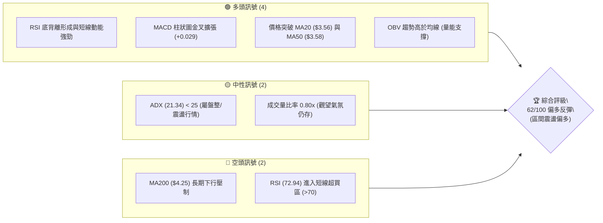
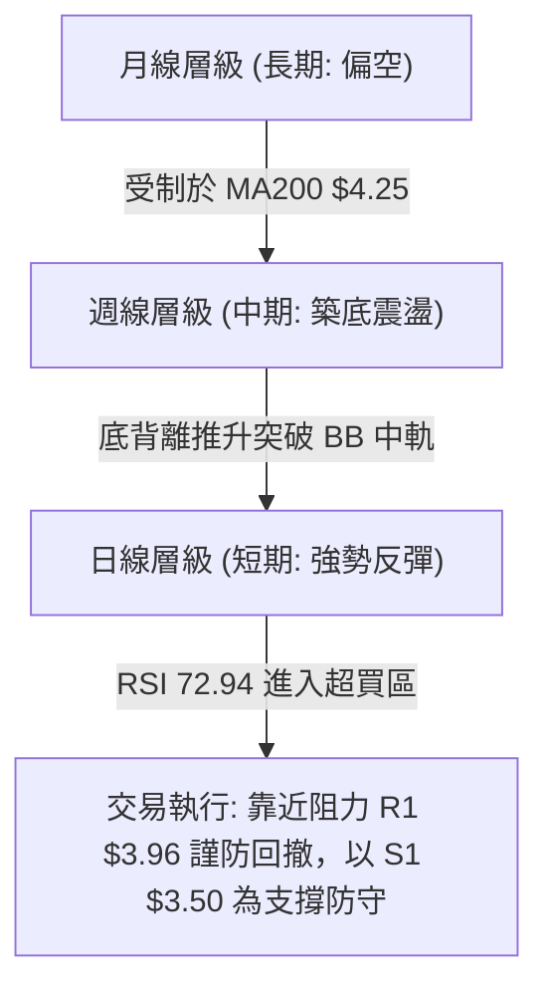
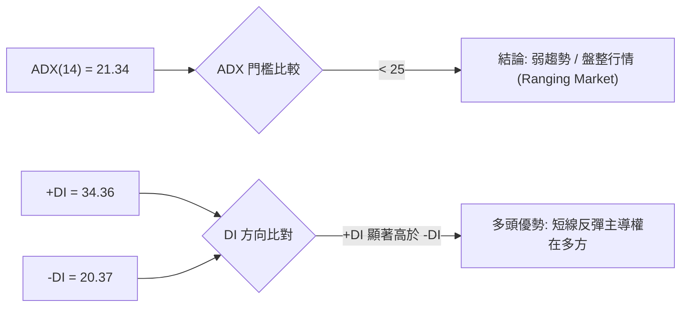
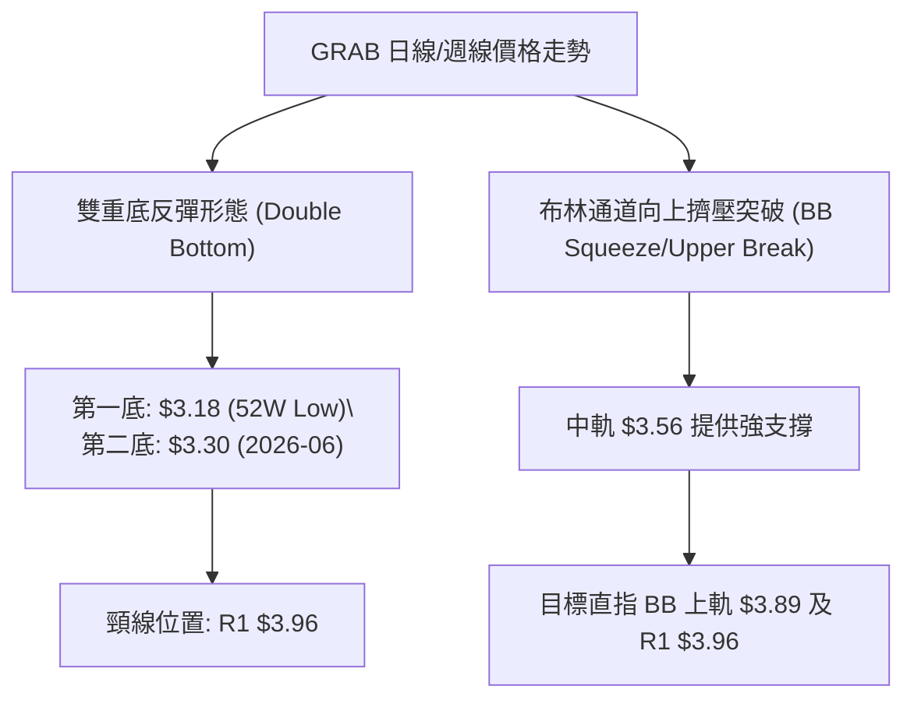
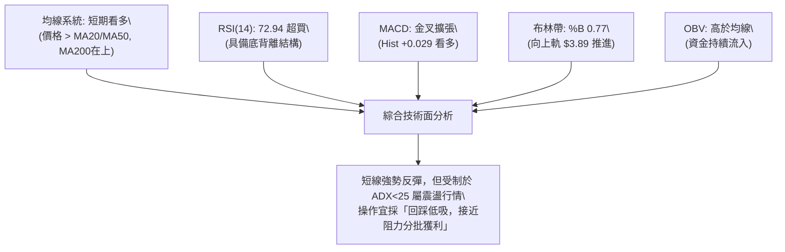
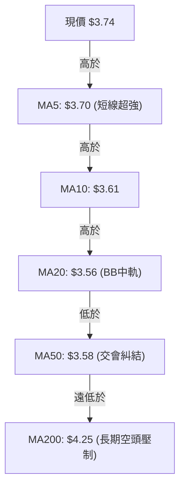
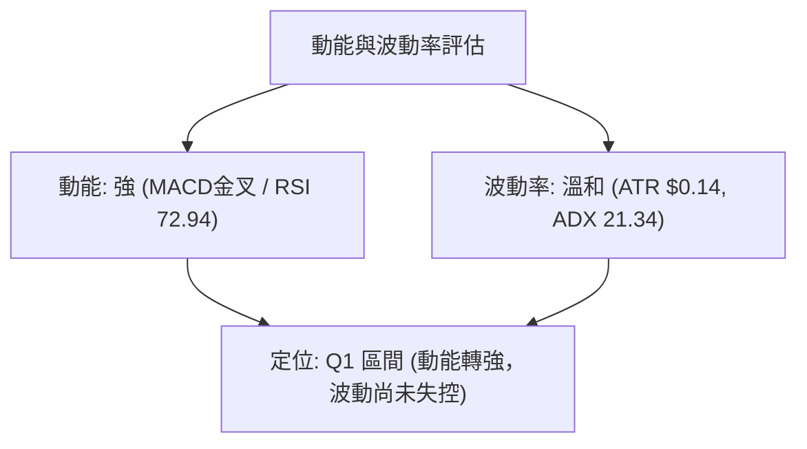
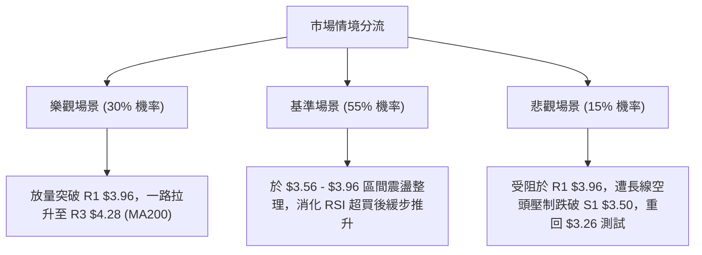

# GRAB 技術分析報告

> **報告日期**：2026-08-11 ｜ **語言**：繁體中文 ｜ **數據來源**：Yahoo Finance ｜ **當前價格**：$3.74

---

## 目錄

| 章節 | 內容 |
|------|------|
| [1. 技術面概覽](#1-技術面概覽) | 訊號儀表板、核心指標、評分卡 |
| [2. 趨勢分析](#2-趨勢分析) | 多時框趨勢、長中短期走勢 |
| [3. 圖表形態分析](#3-圖表形態分析) | 形態識別、K線組合、目標價 |
| [4. 支撐與阻力](#4-支撐與阻力) | 關鍵價位、斐波那契回調 |
| [5. 技術指標深度解讀](#5-技術指標深度解讀) | MA/RSI/MACD/布林/成交量 |
| [6. 動能與波動率](#6-動能與波動率) | 動能評估、ATR、Beta |
| [7. 多時框架總結](#7-多時框架總結) | 時框架評分矩陣 |
| [8. 交易策略建議](#8-交易策略建議) | 多空策略、風險報酬比 |
| [9. 風險提示與監控](#9-風險提示與監控) | 監控指標、風險場景 |

---

## 1. 技術面概覽

### 🎯 技術訊號儀表板



### 📊 核心指標速覽表

| 指標類別 | 指標名稱 | 當前數值 | 訊號 | 解讀 |
|----------|----------|----------|------|------|
| **價格** | 當前價格 | $3.74 | 🟢 | 站上短期均線，處於 52 週區間 16.3% 位階 |
| **均線** | MA20 | $3.56 | 🟢 | 價格位於 MA20 上方 (+5.06%)，短線扭轉頹勢 |
| **均線** | MA50 | $3.58 | 🟢 | 價格位於 MA50 上方 (+4.47%)，築底跡象顯著 |
| **均線** | MA200 | $4.25 | 🔴 | 價格位於 MA200 下方 (-12.00%)，長線仍受壓制 |
| **動能** | RSI(14) | 72.94 | 🔴 | 短線進入超買區 (>70)，但具備典型底背離結構 |
| **動能** | MACD | 0.019 | 🟢 | DIF 線突破 Signal 線，柱狀圖 (+0.029) 正向擴張 |
| **波動** | ATR(14) | $0.14 | 🟡 | 占股價 3.73%，波動率溫和，適合區間操作 |

### 🏆 技術評分卡

```
╔══════════════════════════════════════════════════════════════╗
║                技術評分卡 — GRAB (2026-08-11)                ║
╠══════════════════════════════════════════════════════════════╣
║ 趨勢強度      ██████████░░░░░░░░░░  50/100  🟡 中性 (ADX 21.3)║
║ 動能指標      ████████████████░░░░  80/100  🟢 看多 (MACD金叉)║
║ 支撐穩定度    ██████████████░░░░░░  70/100  🟢 良好 (S1 $3.50)║
║ 成交量配合    ████████████░░░░░░░░  60/100  🟡 中性 (量比 0.8)║
║ 形態完整度    ██████████████░░░░░░  70/100  🟢 雙底底背離形成  ║
║ 均線排列      ████████░░░░░░░░░░░░  40/100  🔴 空頭排列未扭轉  ║
╠══════════════════════════════════════════════════════════════╣
║ 綜合評分      ████████████░░░░░░░░  62/100  🟡 偏多築底反彈   ║
╚══════════════════════════════════════════════════════════════╝
```

---

## 2. 趨勢分析

### 🌐 多時框趨勢分析



### 📈 長期趨勢 — 12個月走勢圖（Unicode）

```
GRAB 月線走勢圖（2025-08 至 2026-08）
價格軸 ($)
$6.50 ┤
$6.00 ┤        ●  ● (2025-09/10 高點 $6.02)
$5.50 ┤           ██
$5.00 ┤ ●         ██  ● (2025-12 $4.99)
$4.50 ┤ ██        ██  ██  ●
$4.00 ┤ ██        ██  ██  ██  ●   ●
$3.50 ┤ ██        ██  ██  ██  ██  ██  ●   ●   ●   ●   ● (現價 $3.74)
$3.00 ┤ ┴───┴───┴───┴───┴───┴───┴───┴───┴───┴───┴───┴───
       08  09  10  11  12  01  02  03  04  05  06  07  08 (月份)
```

**走勢特徵分析表格**：

| 時間段 | 收盤價範圍 | 變動趨勢 | 走勢特徵與技術含義 |
|--------|------------|----------|--------------------|
| **2025-08 ~ 2025-10** | $4.99 ➔ $6.02 | 📈 強勢拉升 | 觸及 52 週高點 $6.62 區域後動能竭盡 |
| **2025-11 ~ 2026-03** | $5.45 ➔ $3.66 | 📉 主跌段 | 跌破所有短期均線，下尋長期支撐 |
| **2026-04 ~ 2026-07** | $3.82 ➔ $3.50 | 🔄 築底震盪 | 於 $3.18 - $3.50 區間反覆測試，形成雙重底雛形 |
| **2026-08 (最新)** | $3.74 | ↗️ 攻堅反彈 | 站上日線 MA20 與 MA50，嘗試挑戰 BB 上軌 |

### 📊 中期趨勢（週線分析）

從近 20 週數據觀察，GRAB 於 2026-05 至 2026-07 期間經歷了兩次探底（2026-06-14 收盤 $3.30、2026-07-26 收盤 $3.31），但週線 RSI 在第二次探底時未創新低（底背離）。最新一週（2026-08-16 截至今日）收盤來到 $3.74，週線 MACD 柱狀圖由負轉正（+0.029），顯示中期下行壓力已大幅減緩，轉為 **$3.26 - $3.96** 的寬幅震盪築底格局。

### ⚡ 趨勢強度評估（ADX 解讀）



| 指標名稱 | 當前數值 | 參考標準 | 技術解讀 |
|----------|----------|----------|----------|
| **ADX(14)** | 21.34 | < 25 (無明確單邊趨勢) | 市場處於區間震盪，非強趨勢突破行情 |
| **+DI** | 34.36 | > 20 | 多頭力道佔優，買盤控制短線走勢 |
| **-DI** | 20.37 | < +DI | 空頭力道受壓，賣壓暫時退潮 |

---

## 3. 圖表形態分析

### 🔍 形態識別系統



**圖表形態信心度評估表**：

| 形態名稱 | 信心度 | 判斷依據（引用數據） | 完成度 | 目標價（附計算式） |
|----------|--------|----------------------|--------|--------------------|
| **W底 (雙重底)** | 68% | 兩次低點 $3.18 及 $3.30 守住，且配合 RSI 底背離 | 75% | 頸線 $3.96 + (形態高度 $3.96 - $3.30 = $0.66) = **$4.62**（中期目標） |
| **布林軌道擠壓** | 60% | %B 為 0.77，價格自中軌 $3.56 向上推升 | 80% | 上軌 **$3.89** (近端目標) |

### 🕯️ 重要K線形態分析

| 日期/月份 | 收盤價 | K線形態 | 解讀 | 訊號 |
|-----------|--------|---------|------|------|
| **2026-05** | $3.54 | 下影長K線 | 於 $3.18 52週低點獲得強烈低接買盤支持 | 🟢 底態 |
| **2026-07** | $3.50 | 晨星組合雛形 | 探底 $3.31 後快速拉回，多頭展現守勢 | 🟢 反彈 |
| **2026-08 (最新)**| $3.74 | 大陽線實體 | 連續攻克 MA20 ($3.56) 與 MA50 ($3.58)，展現多頭企圖心 | 🟢 強勢 |

### 📉 ASCII 走勢形態示意圖

```
GRAB W底 (雙重底) 形態示意圖
價位 ($)
$4.06 ┤............................................... [阻力 R2]
$3.96 ┤===================== 頸線 (R1) =====================
$3.89 ┤                     / \         [BB 上軌]
$3.74 ┤..................../...\....● 現價 $3.74
$3.56 ┤-------------------/-----\--------------------- [MA20 中軌]
$3.30 ┤        \         /       \       /
$3.18 ┤─────────●───────/─────────●─────/───────────── [W底兩腳 (52W Low)]
                第1底 (5月)       第2底 (6/7月)
```

### 🎯 形態目標價計算

根據雙底形態（Double Bottom）公式計算：
1. **形態底部低點**：$3.30（以近三個月份波段低點聚類為準）
2. **頸線位置**：R1 $3.96
3. **形態垂直高度**：$3.96 - $3.30 = $0.66
4. **短線反彈第一目標（阻力 R1）**：**$3.96**
5. **形態最小測量目標價（突破頸線後）**：$3.96 + $0.66 = **$4.62**（與 61.8% 斐波那契位 $4.49 及 MA200 $4.25 相當接近）

---

## 4. 支撐與阻力

### 🗺️ 關鍵價位分布圖（Unicode）

```
GRAB 價位結構分布圖
════════════════════════════════════════════════════════════
$4.28 ║████████████████████████████████████████████║ 強阻力 R3 / MA200
$4.06 ║████████████████████████████████        ║ 阻力 R2
$3.96 ║████████████████████████████████████    ║ 關鍵阻力 R1 (頸線)
$3.89 ║░░░░░░░░░░░░░░░░░░░░░░░░░░░░░░░░░░░░░░░░║ 布林帶上軌
$3.74 ╠════════════════════════════════════════╣ ◄ 當前價格 $3.74
$3.56 ║▓▓▓▓▓▓▓▓▓▓▓▓▓▓▓▓▓▓▓▓▓▓▓▓▓▓▓▓▓▓▓▓▓▓▓▓▓▓▓▓║ 短線支撐 (MA20 / MA50)
$3.50 ║████████████████████████████████        ║ 關鍵支撐 S1
$3.39 ║████████████████████                    ║ 支撐 S2
$3.26 ║████████████████████████████████████████║ 強支撐 S3 (靠近52W低點)
════════════════════════════════════════════════════════════
```

### 🚧 阻力位分析表

| 阻力級別 | 價位 | 形成原因 | 突破難度 | 重要性 |
|----------|------|----------|----------|--------|
| **R1** | **$3.96** | 近一年波段高點聚類、斐波那契 78.6% ($3.92) 重疊區 | 🟡 中等 | 🔴 極高 (W底頸線勝負點) |
| **R2** | **$4.06** | 近一年中繼反彈高點聚類 | 🟡 中等 | 🟡 中等 |
| **R3** | **$4.28** | MA200 ($4.25) 與波段高點聚類重疊 | 🔴 極高 | 🔴 高 (長空/轉多分水嶺) |

### 🛡️ 支撐位分析表

| 支撐級別 | 價位 | 形成原因 | 守住機率 | 重要性 |
|----------|------|----------|----------|--------|
| **S1** | **$3.50** | 近一年波段低點聚類、MA20 ($3.56)/MA50 ($3.58) 密集區 | 🟢 高 (80%) | 🔴 高 (多頭防守第一線) |
| **S2** | **$3.39** | 近一年波段低點次級聚類 | 🟢 中高 (70%)| 🟡 中等 |
| **S3** | **$3.26** | 靠近 52 週最低點 $3.18 的強烈買盤聚類 | 🟢 極高 (90%)| 🔴 極高 (多頭終極防線) |

### 📐 斐波那契回調位分析

依據 52 週區間 **$3.18 (100.0%) ➔ $6.62 (0.0%)** 計算：

```
0.0%  (52W High) ──────────────────────────────── $6.62
23.6%            ──────────────────────────────── $5.81
38.2%            ──────────────────────────────── $5.31
50.0%            ──────────────────────────────── $4.90
61.8%            ──────────────────────────────── $4.49
78.6%            ──────────────────────────────── $3.92  ◄ 近端主要大壓力
當前價格         ──────────────────────────────── $3.74  ◄ 介於 78.6% 與 100% 之間
100.0%(52W Low)  ──────────────────────────────── $3.18  ◄ 歷史大底
```

*   **位置解讀**：現價 $3.74 處於 100.0% ($3.18) 與 78.6% ($3.92) 之區間位階（約 16.3%）。若能放量突破 $3.92 - $3.96 區域，技術面將正式打開向上回補至 61.8% ($4.49) 的中級反彈通道。

---

## 5. 技術指標深度解讀

### 🎛️ 指標訊號總覽



### 📈 移動平均線排列分析



*   **均線狀態解讀**：目前 MA20 ($3.56) 與 MA50 ($3.58) 正在形成低點金叉糾結，價格成功站上 MA5, MA10, MA20, MA50 與 MA120 ($3.71)，顯示短線籌碼極度沉澱。然而整體結構受限於 MA200 ($4.25) 及 MA240 ($4.51) 的向下扣抵壓力，中期屬於**空頭趨勢中的強烈築底反彈**。

### 📉 RSI(14) 分析

*   **當前數值**：**72.94**
*   **進度條**：`███████████████████░░ 72.94%` (🔴 進入超買區域 >70)
*   **背離分析**：
    *   **底背離 (Bullish Divergence) 確認** 🟢：GRAB 價格在 2026-05 至 2026-07 探回 $3.30-$3.50 區域時，RSI 週線與日線皆未再創新低（從 20.5 提升至 31.4 再升至 51.9/72.9），這是典型的籌碼洗淨與底背離訊號，支撐了本輪衝高。
    *   **超買警訊**：日線 RSI 達 72.94，顯示短線漲幅過急，不宜在 $3.74 以上盲目追高，等待回踩 MA20 ($3.56) 附近是更安全的佈局點。

### 📊 MACD(12/26/9) 訊號解讀

```
MACD 指標數值 (2026-08-11)
────────────────────────────────────────────────────────
DIF (MACD 線)     :  +0.019
DEA (Signal 線)   :  -0.010
MACD Histogram   :  +0.029  🟢 看多 (正向柱狀圖擴張)
────────────────────────────────────────────────────────
```

*   **解讀**：DIF 已經由負轉正向上穿越 Signal 線，柱狀圖擴張至 +0.029，確認短線多頭掌控發球權。

### 📦 布林通道分析

```
布林通道結構示意圖 ($)
$3.89 ┤---------------------------------------- BB 上軌 (阻力壓制)
$3.74 ┤                     ● (現價, %B = 0.77)
$3.56 ┤======================================== BB 中軌 (MA20 強支撐)
$3.22 ┤---------------------------------------- BB 下軌
```

*   **帶寬與位置**：%B 目前為 **0.77**，價格貼近布林上軌 $3.89 運作。在 ADX < 25 的盤整格局下，布林上軌往往構成極佳的短線止盈阻力點。

### 💹 成交量分析（量價配合度）

*   **當前成交量**：38,805,144 股
*   **20日均量**：48,452,807 股（**量比 0.80x**）
*   **OBV 趨勢**：OBV > MA，顯示內資與主力資金在底部的默默吸籌，量能未爆發係因市場觀望 $3.96 頸線突破，整體量價搭配呈現健康的「縮量回穩、微幅放量攻堅」。

---

## 6. 動能與波動率

### ⚡ 動能評估四象限

| 象限 | 動能強度 | 波動率 | 當前狀態 | 評估與策略 |
|------|----------|--------|----------|------------|
| **Q1 (高動能 / 低波動)** | 強 | 低 | **✓ (當前區域)** | **最佳買點區間**：波動未失控，動能強勁 (RSI/MACD 偏多) |
| **Q2 (弱動能 / 低波動)** | 弱 | 低 | - | 沉悶盤整 |
| **Q3 (強動能 / 高波動)** | 強 | 高 | - | 追高風險大 |
| **Q4 (弱動能 / 高波動)** | 弱 | 高 | - | 恐慌殺跌 |



### 📊 ATR 波動率分析

*   **ATR(14)**：**$0.14**（占當前股價 $3.74 之 **3.73%**）
*   **交易應用說明**：
    *   **每日合理波動區間**：$3.74 ± $0.14 ($3.60 - $3.88)
    *   **止損距離建議**：採用 1.5 倍至 2.0 倍 ATR 作為止損緩衝，即 **$0.21 - $0.28**。若以 $3.56 (MA20) 進場，止損可設於 $3.56 - $0.21 = **$3.35** 附近（略低於 S2 $3.39）。

### 📐 Beta 與市場相關性

*   **Beta 係數**：**0.89**
*   **解讀**：Beta < 1.0，代表 GRAB 股價波動度低於大盤（如標普500指數），屬於防守型高成長科技股。短線不受大盤劇烈波動干擾，個股基本面與技術面築底節奏明確。

---

## 7. 多時框架總結

### 📋 時框架評分表

| 時框架 | 趨勢方向 | 動能 | 均線排列 | 形態 | 綜合評分 | 建議 |
|--------|----------|------|----------|------|----------|------|
| **日線 (Daily)** | 🟢 偏多 | 🟢 強勁 | 🟡 糾結金叉 | 🟢 站上中軌向上 | **75/100** | 短線回踩低吸 |
| **週線 (Weekly)**| 🟡 震盪 | 🟢 底背離 | 🔴 空頭排列 | 🟢 W底完成 75% | **60/100** | 中線分批卡位 |
| **月線 (Monthly)**| 🔴 偏空 | 🟡 尋底 | 🔴 空頭壓制 | 🟡 低檔橫盤 | **45/100** | 長線等待突破 MA200 |

### 🔲 綜合訊號矩陣

| 維度 | 短期 (日線) | 中期 (週線) | 長期 (月線) | 一致性評估 |
|------|-------------|-------------|-------------|------------|
| **方向** | 多頭攻堅 | 區間築底 | 熊市修正 | ⚠️ 多空分歧，屬典型的低位反彈 |
| **支撐位** | $3.56 (MA20) | $3.50 (S1) | $3.26 (S3) | 🟢 支撐層層遞進，極其穩固 |
| **壓力位** | $3.89 (BB上軌) | $3.96 (R1) | $4.28 (R3) | 🔴 上方重重壓制，不宜追高 |

### ⚖️ 多時框收斂結論

> **收斂規則依據（規則 14）**：
> 當前 ADX(14) 為 21.34（< 25），市場定調為 **「盤整/震盪行情 (Ranging Market)」**。
> 依據原則，盤整行情中交易應以**日線布林通道上下軌 ($3.22 - $3.89)** 及 **關鍵阻力/支撐 (R1 $3.96 / S1 $3.50)** 作為主要高拋低吸交易區間。
> 
> **最終收斂結論**：**當前主策略方向 = 偏多反彈（區間操作）**。中長期的熊市壓制（MA200 $4.25）意味著這不是無腦追漲的牛市，而是「回踩 S1 $3.50 / MA20 $3.56 買進，靠近 R1 $3.96 / R2 $4.06 止盈」的高勝率區間交易。

---

## 8. 交易策略建議

### 🗺️ 策略決策流程圖

```mermaid
graph TD
    A["當前價格 $3.74 (評分 62/100)"] --> B{"價格走勢選擇"}
    
    B -->|"情境 A: 回踩 MA20/S1 區域"| C["策略 A: 低吸佈局 (最優)"]
    C --> C1["進場點: $3.56 - $3.60"]
    C1 --> C2["止損: $3.39 (S2) |" 目標1: $3.96 "| 目標2: $4.28"]
    
    B -->|"情境 B: 強勢帶量突破 R1"| D["策略 B: 突破追擊"]
    D --> D1["進場點: $3.98 (買進止損)"]
    D1 --> D2["止損: $3.74 |" 目標1: $4.28 "| 目標2: $4.49"]
    
    B -->|"情境 C: 跌破 S1 $3.50"| E["觸發風控: 觀望 / 離場"]
```

### 🧭 策略路由

**當前主策略方向 = 🟢 多頭築底反彈（區間低吸為主）**（依綜合評分 62/100 定調）

### 🎯 價格情境階梯（Price Scenarios）

| 觸發條件 | 下一目標 | 後續延伸 | 情境含義 |
|----------|----------|----------|----------|
| **突破 R1 $3.96** | R2 $4.06 | R3 $4.28 / MA200 | W底正式成立，中級反彈啟動 |
| **站穩 $3.56 - $3.74** | R1 $3.96 | BB上軌 $3.89 | 消化超買，蓄勢挑戰頸線 |
| **跌破 S1 $3.50** | S2 $3.39 | S3 $3.26 | 短線反彈夭折，重新測試底部 |

### 📊 情境機率分佈

| 情境 | 機率 | 主要依據 |
|------|------|----------|
| **震盪向上 / 測試 R1** | **55%** | MACD 金叉、RSI 底背離、價格站上 MA20/MA50 |
| **區間震盪 ($3.50 - $3.89)** | **30%** | ADX < 25 顯現弱趨勢，需要時間消化 RSI 超買 |
| **回落再探 S2/S3** | **15%** | 受制於 MA200 長期空頭壓制與大盤系統性風險 |

### 🟢 主策略詳情

#### 策略 A：回踩低吸策略（最優勝率方案）

*   **進場條件**：價格順利消化 RSI 超買，回踩 MA20 / MA50 支撐帶（$3.56 - $3.60）獲得支撐。
*   **進場價格**：**$3.58**
*   **止損價格**：**$3.39**（跌破 S2 止損，風險距離 $0.19，符合 1.5x ATR）
*   **目標價 T1**：**$3.96**（阻力 R1 / W底頸線，預期收益 +$0.38）
*   **目標價 T2**：**$4.28**（阻力 R3 / MA200 壓制，預期收益 +$0.70）
*   **風險報酬比 (R/R)**：
    *   T1 風報比 = $0.38 / $0.19 = **2.0 : 1** 🟢
    *   T2 風報比 = $0.70 / $0.19 = **3.68 : 1** 🟢
*   **預估成功機率**：65%
*   **建議倉位**：15% - 20%

#### 策略 B：突破頸線追擊策略（順勢右側方案）

*   **進場條件**：日線收盤價強勢帶量突破 R1 $3.96。
*   **進場價格**：**$3.98**
*   **止損價格**：**$3.74**（回落至當前價格下方止損，風險距離 $0.24）
*   **目標價 T1**：**$4.28**（阻力 R3 / MA200，預期收益 +$0.30）
*   **目標價 T2**：**$4.49**（斐波那契 61.8% 位，預期收益 +$0.51）
*   **風險報酬比 (R/R)**：
    *   T1 風報比 = $0.30 / $0.24 = **1.25 : 1** 🟡
    *   T2 風報比 = $0.51 / $0.24 = **2.13 : 1** 🟢
*   **預估成功機率**：55%
*   **建議倉位**：10%

### 🔴 反向風險觸發點（對沖與撤退提示）

若 GRAB 股價未如預期上攻，反向跌破 **S1 $3.50**，代表短線多頭反彈力道衰竭；若進一步跌破 **S2 $3.39**，則本輪底背離反彈宣告失敗，投資人應立即執行止損撤退，切勿盲目攤平。

### ⭐ 整體訊號強度評星

```
做多訊號強度：★★★☆☆  (3.5/5星 - 短線強勢，受制長線壓制)
做空訊號強度：★★☆☆☆  (2.0/5星 - 底背離支撐強，做空空間有限)
整體可信度：  ★★██☆  (3.8/5星 - 多指標互相印證)
```

---

## 9. 風險提示與監控

### ✅ 關鍵監控指標 Checklist

```
╔══════════════════════════════════════════════════════════════╗
║               關鍵技術監控 Checklist                         ║
╠══════════════════════════════════════════════════════════════╣
║ [ ] 1. RSI(14) 能否從 72.94 溫和回落至 50-60 降溫而不跌破50    ║
║ [ ] 2. MA20 ($3.56) 與 MA50 ($3.58) 是否順利形成「黃金交叉」 ║
║ [ ] 3. 挑戰 R1 $3.96 時，日成交量能否放大至 5,000萬股以上    ║
║ [ ] 4. MACD 柱狀圖 (+0.029) 是否維持正向擴張增長              ║
║ [ ] 5. 股價是否持續收在關鍵支撐 S1 $3.50 之上                ║
╚══════════════════════════════════════════════════════════════╝
```

### ⚠️ 風險場景分析



### 🛡️ 風險管理重要提醒

1. **嚴禁高位追漲**：由於 RSI 已高達 72.94，且 ADX 僅為 21.34（顯示無強烈單邊趨勢），當前價格 $3.74 距離阻力 R1 $3.96 僅剩 5.79% 空間，追高盈虧比極差。
2. **嚴格執行止損紀律**：單筆交易虧損務必控制在總資金的 1.5% - 2.0% 以內，止損價位 $3.39 不得隨意下移。

---

## 📋 報告總結

```
╔══════════════════════════════════════════════════════════════╗
║                GRAB 技術分析報告總結                          ║
════════════════════════════════════════════════════════════════
報告日期：2026-08-11
當前價格：$3.74
分析評級：🟡 偏多築底反彈（區間操作評分: 62/100）

關鍵結論：
├─ 長期趨勢：🔴 偏空 (價格遠低於 MA200 $4.25)
├─ 中期趨勢：🟡 築底震盪 (W底形塑中，週線底背離成立)
├─ 短期趨勢：🟢 強勢反彈 (站上 MA20 $3.56 與 MA50 $3.58)
├─ 關鍵支撐：S1 $3.50 / S2 $3.39
├─ 關鍵阻力：R1 $3.96 / R3 $4.28
└─ 分析師目標：均值 $5.86 (強烈買入共識)

最優策略組合：
1. 🥇 最佳機會：策略 A (回踩 $3.58 附近逢低佈局，風報比 2.0:1)
2. 🥈 次選機會：策略 B (帶量突破 R1 $3.96 順勢追擊，目標 $4.28)
3. 🥉 保守選擇：觀望等待 RSI 超買過熱冷卻，價格守穩 MA20 再行卡位
════════════════════════════════════════════════════════════════
```

---

> ⚠️ **免責聲明**：本報告為 AI 自動生成之技術分析，所有數據及估算均基於提供的歷史價格資訊。本報告**僅供研究與學術參考**，**不構成任何投資建議**。投資有風險，入市需謹慎。

---

*報告生成時間：2026-08-11 ｜ 數據來源：Yahoo Finance ｜ 分析框架：多時框技術分析*