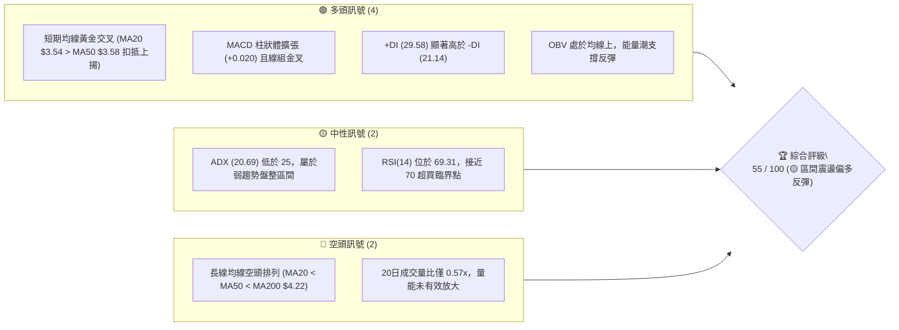
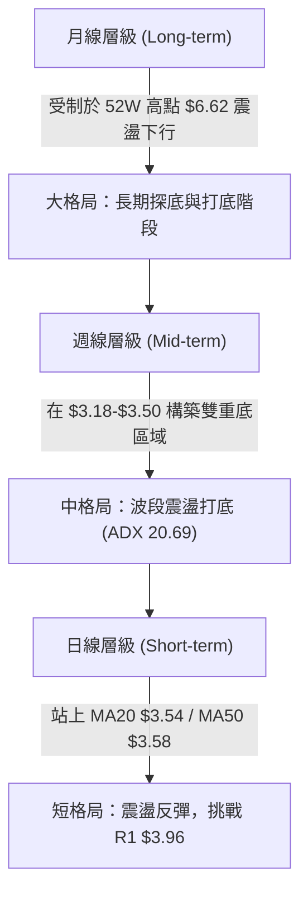
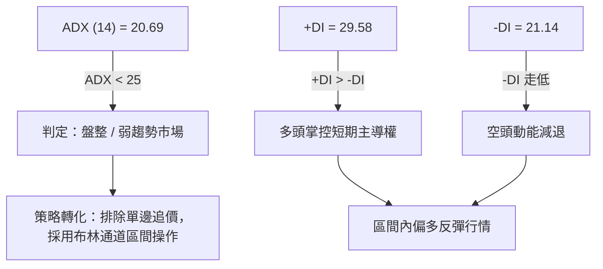
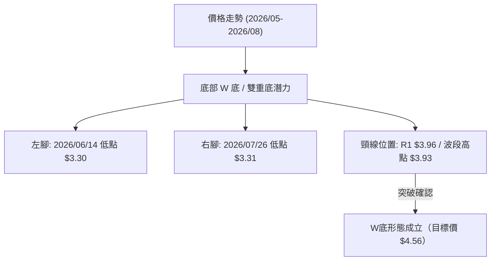
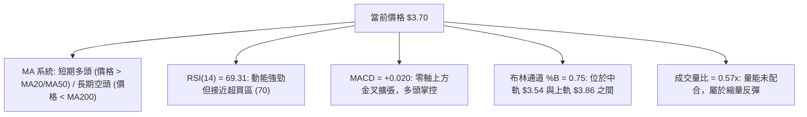
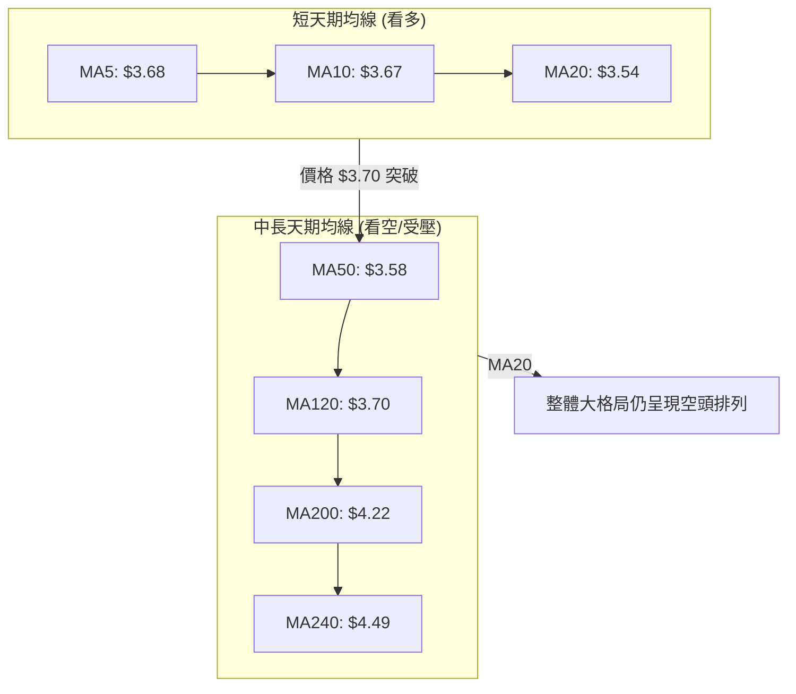
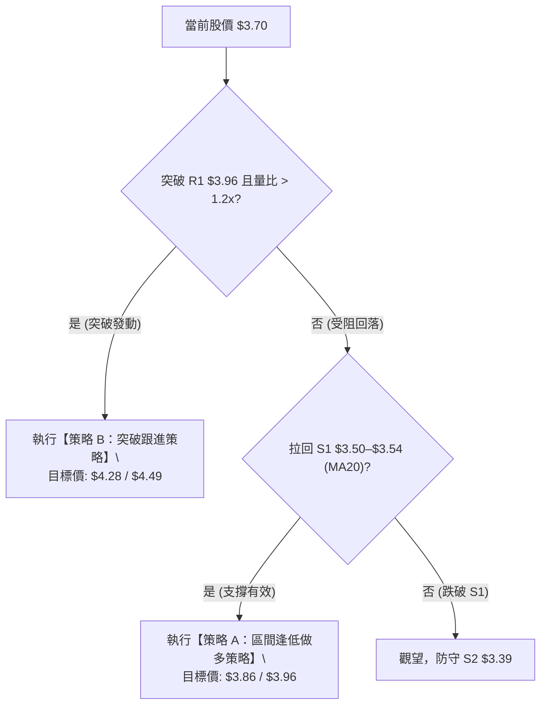
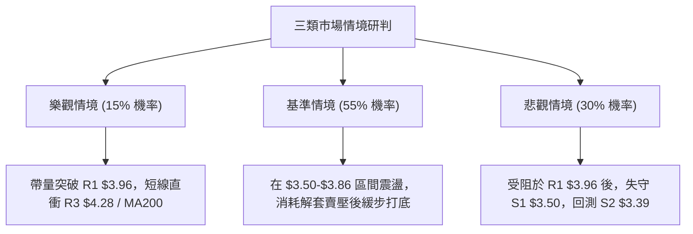

# GRAB 技術分析報告

> **報告日期**：2026-08-13 ｜ **語言**：繁體中文 ｜ **數據來源**：Yahoo Finance ｜ **當前價格**：$3.70

---

## 目錄

| 章節 | 內容 |
|------|------|
| [1. 技術面概覽](#1-技術面概覽) | 訊號儀表板、核心指標、評分卡 |
| [2. 趨勢分析](#2-趨勢分析) | 多時框趨勢、長中短期走勢 |
| [3. 圖表形態分析](#3-圖表形態分析) | 形態識別、K線組合、目標價 |
| [4. 支撐與阻力](#4-支撐與阻力) | 關鍵價位、斐波那契回調 |
| [5. 技術指標深度解讀](#5-技術指標深度解讀) | MA/RSI/MACD/布林/成交量 |
| [6. 動能與波動率](#6-動能與波動率) | 動能評估、ATR、Beta |
| [7. 多時框架總結](#7-多時框架總結) | 時框架評分矩陣 |
| [8. 交易策略建議](#8-交易策略建議) | 多空策略、風險報酬比 |
| [9. 風險提示與監控](#9-風險提示與監控) | 監控指標、風險場景 |

---

## 1. 技術面概覽

### 🎯 技術訊號儀表板



### 📊 核心指標速覽表

| 指標類別 | 指標名稱 | 當前數值 | 訊號 | 解讀 |
|----------|----------|----------|------|------|
| **價格** | 當前價格 | $3.70 | 🟡 中性 | 位於 52 週區間 $3.18–$6.62 之 15.1% 低檔位置 |
| **均線** | MA20 | $3.54 | 🟢 看多 | 價格站在 MA20 上方 (+4.40%)，短期均線走揚 |
| **均線** | MA50 | $3.58 | 🟢 看多 | 價格已站回 MA50 上方 (+3.42%) |
| **均線** | MA200 | $4.22 | 🔴 看空 | 價格位於 MA200 下方 (-12.32%)，長期受壓 |
| **動能** | RSI(14) | 69.31 | 🟡 中性/偏熱 | 逼近 70 超買區，短線多頭強勢但面臨解套賣壓 |
| **動能** | MACD(12,26,9) | 0.021 / Hist +0.020 | 🟢 看多 | 雙線位於零軸上方金叉，柱體持續放晴 |
| **趨勢** | ADX(14) | 20.69 | 🟡 無明確趨勢 | ADX < 25 指示當前為盤整或無強烈單邊趨勢 |
| **波動** | ATR(14) | $0.14 (3.90%) | 🟡 中性 | 每日波幅適中，提供良好的風控防守點位 |
| **通道** | 布林通道 | 上軌 $3.86 / %B 0.75 | 🟡 測試上軌 | 價格逼近上軌，面臨波段阻力區域 |

### 🏆 技術評分卡

```
╔══════════════════════════════════════════════════════════════════╗
║                   技術評分卡 — GRAB (2026-08-13)                  ║
╠══════════════════════════════════════════════════════════════════╣
║ 趨勢強度      ▓▓▓▓▓▓▓▓░░░░░░░░░░░░  41/100  🟡 弱趨勢(ADX 20.69)  ║
║ 動能指標      ▓▓▓▓▓▓▓▓▓▓▓▓▓▓▓░░░░░  75/100  🟢 強勁(MACD/RSI高位) ║
║ 支撐穩定度    ▓▓▓▓▓▓▓▓▓▓▓▓▓░░░░░░░  65/100  🟢 守住 S1 $3.50      ║
║ 成交量配合    ▓▓▓▓▓▓▓▓░░░░░░░░░░░░  42/100  🔴 無量反彈(量比 0.57x)║
║ 形態完整度    ▓▓▓▓▓▓▓▓▓▓▓▓░░░░░░░░  60/100  🟡 區間築底進行中     ║
║ 均線排列      ▓▓▓▓▓▓▓░░░░░░░░░░░░░  35/100  🔴 中長天期仍屬空頭   ║
╠══════════════════════════════════════════════════════════════════╣
║ 綜合評分      ▓▓▓▓▓▓▓▓▓▓▓░░░░░░░░░  53/100  🟡 區間震盪偏多反彈   ║
╚══════════════════════════════════════════════════════════════════╝
```

---

## 2. 趨勢分析

### 🌐 多時框趨勢分析



### 📈 長期趨勢 — 24 個月走勢圖（Unicode）

```
GRAB 月線走勢圖（2024-08 至 2026-08）
價格軸 ($)
$6.50 ┤                               ● $6.02 (2025-09)
$6.00 ┤                             ●   ● $6.01
$5.50 ┤                       ●           ● $5.45
$5.00 ┤         ● $5.00   ●     ●           ● $4.99
$4.50 ┤       ●     ●   ●   ●                 ● $4.30
$4.00 ┤   ●           ●                             ● $3.82
$3.50 ┤ ●(底)                                           ● $3.70 (現價)
$3.00 ┤                                                   ● $3.50
      └─┬───┬───┬───┬───┬───┬───┬───┬───┬───┬───┬───┬───┬───► 時間
       24/08 10  12  25/02 04  06  08  10  12  26/02 04  06  08
```

#### 走勢特徵分析表

| 階段 | 時間區間 | 價格變動 | 階段特徵與量能變化 |
|------|----------|----------|--------------------|
| **築底發動期** | 2024/08–2024/11 | $3.22 ➔ $5.00 (+55.28%) | 強烈多頭攻擊，突破 3.50 美元阻力，成交量溫和放大 |
| **高位震盪期** | 2024/12–2025/08 | $4.72 ➔ $4.99 (+5.72%) | 在 $4.50–$5.00 進行長達 9 個月的橫盤箱體整理 |
| **衝高回落期** | 2025/09–2025/10 | $6.02 ➔ $6.01 (創52W高$6.62) | 突破 $6.00 大關但高檔獲利結利賣壓沉重，形成雙頂結構 |
| **中立空頭期** | 2025/11–2026/03 | $5.45 ➔ $3.66 (-32.84%) | 沿著下降通道連跌 5 個月，跌破 MA200 $4.22 |
| **區間打底期** | 2026/04–2026/08 | $3.82 ➔ $3.70 (最低$3.18) | 在 $3.18–$3.50 區域止跌，短線展開強勁反彈 |

### 📊 中期趨勢（週線分析）

近 20 週數據顯示，GRAB 在 2026 年 5 月底至 7 月底間，於 **$3.30–$3.50** 區間經歷了二次測底（5月低點 $3.51、6月中低點 $3.30、7月底低點 $3.31）。

- **週線 MACD**：自 7 月底的 -0.069 底部大幅改善，至 8 月中已轉正為 **+0.020**。
- **週線 RSI**：自 7 月底過度賣超的 25.9 快速反彈至 **69.3**，顯示中期動能急劇回升。

### ⚡ 趨勢強度評估（ADX 解讀）



| 指標名稱 | 數值 | 狀態 | 趨勢解讀 |
|----------|------|------|----------|
| **ADX (14)** | 20.69 | 弱趨勢 (<25) | 當前缺乏強烈單邊趨勢，價格易在支撐阻力間震盪 |
| **+DI (14)** | 29.58 | 主導 | 短線買盤動能佔優 |
| **-DI (14)** | 21.14 | 劣勢 | 賣壓暫時退潮 |

---

## 3. 圖表形態分析

### 🔍 形態識別系統



#### 形態信心度與目標價評估表

| 形態類別 | 信心度 | 判斷依據（引用數據） | 完成度 | 目標價（附計算式） |
|----------|--------|----------------------|--------|--------------------|
| **雙重底 (W底)** | 62% | 6月中旬低點 $3.30 與 7月下旬低點 $3.31 構成雙腳，當前 $3.70 逼近頸線 | 75% | 頸線 $3.96 + (頸線 $3.96 - 底部 $3.36) = **$4.56** |
| **下降通道突破** | 58% | 價格站上日線 MA20 ($3.54) 與 MA50 ($3.58)，扭轉3-6月下行趨勢 | 80% | 突破點 $3.58 + 通道高度 $0.50 = **$4.08** |
| **布林上軌擠壓突破** | 45% | 訊號不足，僅做指標型解讀（價格達 %B 0.75，逼近上軌 $3.86） | 40% | 沿上軌推升至 R1 **$3.96** |

### 🕯️ 重要 K 線形態分析

| 日期/週別 | 收盤價 | K線形態 | 技術解讀 | 訊號強度 |
|-----------|--------|---------|----------|----------|
| **2026-07-26** | $3.31 | 探底長下影線 | 二次測試 6月低點 $3.30 未破，展現強勁買盤支撐 | 🟢 強多 |
| **2026-08-02** | $3.50 | 貫穿陽線 | 吞噬前一週陰線，收復 S1 $3.50 關鍵位置 | 🟢 看多 |
| **2026-08-09** | $3.66 | 實體中紅棒 | 成交量增加至 3.1 億股，突破 MA20 與 MA50 壓制 | 🟢 看多 |
| **2026-08-16** | $3.70 | 高檔十字星/小陽線 | 逼近 BB 上軌 $3.86，買盤追高意願放緩，面臨獲利結利 | 🟡 中性 |

### 📉 ASCII 走勢形態示意圖

```
GRAB 日線/週線 W底打底形態示意圖

 $4.28 ┤---------------------------------------- [R3 關鍵反轉位]
       │
 $3.96 ┤.............. 頸線阻力位 (R1) ........ [突破臨界點]
       │             /\
 $3.70 ┤............/..\......● 現價 $3.70
       │           /    \    /
 $3.50 ┤--[S1]----/------\--/------------------- [MA20/50 支撐區]
       │         /        \/
 $3.30 ┤________/ (左腳)   (右腳) ______________ [雙重底支撐 $3.30-$3.31]
       └────────────────────────────────────────
        2026-06       2026-07       2026-08
```

### 🎯 形態目標價計算

1. **W 底形態目標價**：
   - 頸線 (R1)：$3.96
   - 底部平均價：($3.30 + $3.31) / 2 = $3.305 (接近 S2/S3 區間 $3.26-$3.39)
   - 形態高度：$3.96 - $3.305 = $0.655
   - **第一目標價**：頸線 $3.96 + $0.655 = **$4.615**（受阻於斐波那契 61.8% $4.49 及 MA240 $4.49）
   - **保守技術目標價**：**$4.56**

---

## 4. 支撐與阻力

### 🗺️ 關鍵價位分布圖（Unicode）

```
GRAB 價位結構分布圖 (以當前價 $3.70 為核心)
════════════════════════════════════════════════════════════════════
 $6.62 ║████████████████████████████████████║ 52W 最高點 (Fib 0.0%)
 $5.81 ║██████████████████████              ║ Fib 23.6% 回調位
 $4.49 ║██████████████████                  ║ Fib 61.8% / MA240 密集強阻力
 $4.28 ║██████████████                      ║ 阻力 R3 (MA200 $4.22 上方)
 $4.06 ║██████████                          ║ 阻力 R2 (波段高點聚類)
 $3.96 ║███████                             ║ 阻力 R1 (頸線 / 突破臨界點)
 $3.86 ║████                                ║ 布林通道上軌
 $3.70 ╠════════════════════════════════════╣ ◄ 當前收盤價 $3.70
 $3.54 ║▓▓▓▓                                ║ BB中軌 / MA20 / MA50 支撐
 $3.50 ║▓▓▓▓▓▓▓                             ║ 支撐 S1 (波段低點聚類)
 $3.39 ║▓▓▓▓▓▓▓▓▓▓                          ║ 支撐 S2 (次級支撐)
 $3.26 ║▓▓▓▓▓▓▓▓▓▓▓▓▓                       ║ 支撐 S3 (強支撐區)
 $3.18 ║▓▓▓▓▓▓▓▓▓▓▓▓▓▓▓                     ║ 52W 最低點 (Fib 100.0%)
════════════════════════════════════════════════════════════════════
```

### 🚧 阻力位分析表

| 阻力級別 | 精確價位 | 形成原因 | 突破難度 | 重要性 |
|----------|----------|----------|----------|--------|
| **R1** | **$3.96** | 近一年波段高點聚類、斐波 78.6% ($3.92) 重疊區 | 🟡 中等 | 🟢🟢🟢 (W底頸線，突破即打開上行空間) |
| **R2** | **$4.06** | 近一年次高點解套賣壓區 | 🟡 中等 | 🟢🟢 (整數關卡前哨站) |
| **R3** | **$4.28** | MA200 ($4.22) 下降壓制線與歷史密集套牢區 | 🔴 極高 | 🟢🟢🟢🟢 (牛熊分水嶺，站穩方能轉為中長多) |

### 🛡️ 支撐位分析表

| 支撐級別 | 精確價位 | 形成原因 | 守住機率 | 重要性 |
|----------|----------|----------|----------|--------|
| **S1** | **$3.50** | 近一年波段低點聚類、MA20 ($3.54)/MA50 ($3.58) 均線交會點 | 🟢 80% | 🟢🟢🟢 (短線多頭防禦第一線) |
| **S2** | **$3.39** | 近一年次低點支撐聚類 | 🟢 85% | 🟢🟢 (中期箱體底部位) |
| **S3** | **$3.26** | 52週低點 $3.18 附近之波段低點聚類 | 🟢 92% | 🟢🟢🟢🟢 (終極鐵板支撐，跌破將創 52週新低) |

### 📐 斐波那契回調位分析

依據 52 週高低點區間（高點 **$6.62** ➔ 低點 **$3.18**，全波段跌幅 $3.44）：

| 回調比例 | 精確價位 | 技術含義與當前關係 |
|----------|----------|--------------------|
| **0.0%** | $6.62 | 52週最高點 |
| **23.6%** | $5.81 | 長期強烈反轉阻力區 |
| **38.2%** | $5.31 | 長期多空分水嶺 |
| **50.0%** | $4.90 | 中期波段反彈強阻力 |
| **61.8%** | $4.49 | 黃金分割強阻力（與 MA240 $4.49 完美的點對點重疊） |
| **78.6%** | $3.92 | 短線首要反彈阻力（緊貼 R1 $3.96） |
| **100.0%**| $3.18 | 52週最低點 |

**現價解讀**：現價 **$3.70** 處於 100% ($3.18) 與 78.6% ($3.92) 之區間。目前正向上挑戰 **78.6% ($3.92)** 與 **R1 ($3.96)** 的雙重關鍵反壓阻力。

---

## 5. 技術指標深度解讀

### 🎛️ 指標訊號總覽



### 📈 移動平均線排列分析



- **短均線結構**：MA5 ($3.68) > MA10 ($3.67) > MA20 ($3.54)，短線呈多頭噴發態勢。
- **長均線壓制**：MA200 位於 **$4.22**，MA240 位於 **$4.49**，顯示大趨勢仍受制於下降均線反壓。

### 📉 RSI(14) 分析

```
RSI(14) 強度條：
0  [░░░░░░░░░░░░░░░░░░░░░░░░░░░░░░████████████████████] 100
                                 ^ 當前 69.31 (接近 70 超買區)
```

- **數值解讀**：RSI(14) 為 **69.31**，位於 30–70 中性偏熱區間的頂端。
- **背離判斷**：日線與週線 RSI 自 7 月低點一路揚升，價格同步上揚，**無明顯頂背離或底背離**。然因極度接近 70，短線隨時可能迎來指標修復（獲利拉回）。

### 📊 MACD(12,26,9) 訊號解讀

- **DIF 線**：0.021
- **DEM 訊號線**：0.001
- **柱狀體 (Histogram)**：**+0.020** 🟢
- **分析**：DIF 向上突破 DEM 形成零軸上方的黃金交叉，且柱狀體連續多日擴張，確認短期反彈動能依然充沛。

### 📦 布林通道分析

```
GRAB 布林通道示意圖
 $3.86 ┤---------------------------------------- 上軌 (BB Upper)
       │                        ● 現價 $3.70 (%B = 0.75)
 $3.54 ┤---------------------------------------- 中軌 (MA20)
       │
 $3.23 ┤---------------------------------------- 下軌 (BB Lower)
```

- **帶寬與位置**：價格位於 **$3.70**，靠近上軌 **$3.86**。%B 指標為 **0.75**。
- **訊號判讀**：通道開口未顯著放大，ADX 僅 20.69，顯示價格推升至上軌 $3.86 附近將遭遇區間頂部阻力，不宜在 $3.80 以上盲目追高。

### 💹 成交量分析（量價配合度）

- **最新成交量**：27,838,088 股
- **20 日均量**：48,689,024 股 (量比 **0.57x**)
- **OBV 趨勢**：OBV 線高於其移動平均線，顯示資金呈現淨流入。
- **量價背離分析**：價格自 $3.31 反彈至 $3.70，但成交量呈現縮減態勢（量比僅 0.57x），顯示本輪反彈主因是**賣壓力竭**而非大資金強烈主動追買。若要突破 R1 $3.96，必須伴隨日成交量放大至 5,000 萬股以上。

---

## 6. 動能與波動率

### ⚡ 動能評估

| 維度 | 指標數值 | 評估狀態 | 結論與市場意涵 |
|------|----------|----------|----------------|
| **動能強度** | MACD Hist +0.020 / RSI 69.31 | 🟢 中強動能 | 短線買盤集中，推升價格逼近上方阻力 |
| **趨勢持續性**| ADX 20.69 / +DI 29.58 | 🟡 弱趨勢 | 動能雖強但缺乏趨勢續航力，屬區間衝刺 |
| **波動強度** | ATR $0.14 (3.90%) | 🟡 中度波動 | 每日波幅常規，未出現異常爆量甩轎 |

### 📊 ATR 波動率分析

- **ATR(14)**：**$0.14**（佔當前股價 3.90%）。
- **風控應用**：
  - 日內操作止損距離建議設為 1.0x ATR = **$0.14**
  - 波段操作止損距離建議設為 1.5x–2.0x ATR = **$0.21–$0.28**

### 📐 Beta 與市場相關性

- **Beta 係數**：**0.89**
- **解讀**：GRAB 波動度略低於整體大盤（S&P 500），屬於中高市值科技/消費平台股中相對平穩的標的，不易出現單日無預警超大暴跌，技術形態的跟隨度與可靠性較高。

---

## 7. 多時框架總結

### 📋 時框架評分表

| 時框架 | 趨勢方向 | 動能 | 均線排列 | 形態 | 綜合評分 | 建議 |
|--------|----------|------|----------|------|----------|------|
| **日線 (Short)** | 🟢 震盪偏多 | 🟢 強勁 (RSI 69.3) | 🟢 短多 (MA20>MA50) | 🟡 挑戰上軌 | **68/100** | 逢低佈局 / 區間頂部獲利 |
| **週線 (Mid)** | 🟡 箱體打底 | 🟢 轉強 (MACD金叉) | 🔴 空頭 (MA20<MA50) | 🟢 雙重底雛形 | **55/100** | 觀望 / 等待突破 R1 $3.96 |
| **月線 (Long)** | 🔴 下行打底 | 🟡 弱勢修正 | 🔴 空頭排列 | 🟡 下降通道 | **40/100** | 長線持有者控管倉位 |

### 🔲 綜合訊號矩陣

```
                     ┌─────────────────────────────────────────┐
                     │          多時框訊號一致性矩陣           │
                     └─────────────────────────────────────────┘
   [短線日線: 🟢偏多] ──────────► 遭遇 ◄────────── [長線月線: 🔴偏空]
                                  │
                                  ▼
                         [中線週線: 🟡 盤整區間]
                        (主導價位 $3.50 - $3.96)
```

### ⚖️ 多時框收斂結論

**收斂規則判定**：當前 ADX 為 **20.69 (< 25)**，依規則確定為**盤整行情**。
**主導時框與交易區間**：盤整行情下，以日線布林通道上下軌（**$3.23–$3.86**）及關鍵支撐阻力（**S1 $3.50 – R1 $3.96**）為核心交易區間。
**唯一方向性結論**：**中性觀望偏多反彈（箱體操作）**。日線的偏多反彈受制於月線與長天期均線（MA200 $4.22）的空頭下壓，在未帶量突破 R1 $3.96 前，切勿以單邊牛市思維追高。

---

## 8. 交易策略建議

### 🗺️ 策略決策流程圖



### 🧭 策略路由

> **當前主策略方向：區間逢低做多 / 阻力前高挫獲利（依綜合評分 53/100 偏中性震盪）**

### 🎯 價格情境階梯 (Price Scenarios)

| 觸發條件 | 下一目標 | 後續延伸 | 情境含義 |
|----------|----------|----------|----------|
| **帶量突破 R1 $3.96** | R2 $4.06 | R3 $4.28 / Fib 61.8% $4.49 | W底成型，開啟波段牛市反彈 |
| **震盪於 $3.54–$3.86** | — | — | 布林通道內部進行指標修復與籌碼換手 |
| **跌破 S1 $3.50** | S2 $3.39 | S3 $3.26 | 短線反彈夭折，回測二次打底低點 |

### 📊 情境機率分佈

| 情境 | 機率 | 主要依據 |
|------|------|----------|
| **區間震盪再試 R1 $3.96** | **55%** | MACD 金叉放晴、+DI 29.58  dominant，但 ADX < 25 且量能未爆發 |
| **回落測試 S1 $3.50 / MA20** | **30%** | RSI 逼近 70 超買區，短線獲利盤有落袋為安需求 |
| **直接帶量大噴發突破 $4.06**| **15%** | 目前量比僅 0.57x，缺乏大資金強推爆發力 |

---

### 🟢 主策略詳情

#### 策略 A：區間逢低買進策略（首選 - 順應盤整）

- **進場條件**：股價拉回測試 **MA20 ($3.54) 至 S1 ($3.50)** 支撐區，出現縮量止跌 K 線（如小陽線或下影線）。
- **進場價格**：**$3.54**
- **目標價 T1**：**$3.86**（布林上軌附近）
- **目標價 T2**：**$3.96**（阻力 R1 / W底頸線）
- **止損價格**：**$3.38**（跌破 S2 $3.39 停損離場）
- **風險報酬比**：
  $$\text{RRR} = \frac{\text{T1 } \$3.86 - \text{進場 } \$3.54}{\text{進場 } \$3.54 - \text{止損 } \$3.38} = \frac{\$0.32}{\$0.16} = \mathbf{2.00 : 1}$$
  （若推至 T2 $3.96，RRR 為 $\frac{\$0.42}{\$0.16} = \mathbf{2.63 : 1}$）
- **建議倉位**：**15% - 20%**

#### 策略 B：突破跟進策略（次選 - 順應突破）

- **進場條件**：日線收盤價強勢**突破 R1 $3.96**，且當日成交量突破 **5,000 萬股**（量比 > 1.0x）。
- **進場價格**：**$3.98**
- **目標價 T1**：**$4.28**（阻力 R3 / MA200 壓制位）
- **目標價 T2**：**$4.49**（斐波那契 61.8% 重疊 MA240）
- **止損價格**：**$3.80**（跌回布林上軌與 $3.86 之下）
- **風險報酬比**：
  $$\text{RRR} = \frac{\text{T1 } \$4.28 - \text{進場 } \$3.98}{\text{進場 } \$3.98 - \text{止損 } \$3.80} = \frac{\$0.30}{\$0.18} = \mathbf{1.67 : 1}$$
  （若推至 T2 $4.49，RRR 為 $\frac{\$0.51}{\$0.18} = \mathbf{2.83 : 1}$）
- **建議倉位**：**10% - 15%**

---

### 🔴 反向風險觸發點（對沖與停損提示）

- **關鍵空頭觸發價**：日線收盤價跌破 **S2 $3.39**。
- **風險訊號**：MACD 柱狀體由正轉負，且 RSI 跌破 50 中性軸。
- **風控行動**：若觸發此條件，多頭應立即清倉，空頭可考慮以 S2 $3.39 為防守點試探性建立避險空單，目標下看 **S3 $3.26** 與 **52W 低點 $3.18**。

### ⭐ 整體訊號強度評星

```
做多訊號強度：★★★☆☆  (3.5/5星 - 短線強勁但受制於長線均線)
做空訊號強度：★★☆☆☆  (2.0/5星 - 短線多頭掌控，不宜盲目放空)
整體可信度：  ★★★☆☆  (3.5/5星 - 技術面與均線指標高緯度吻合)
```

---

## 9. 風險提示與監控

### ✅ 關鍵監控指標 Checklist

```
╔══════════════════════════════════════════════════════════════════╗
║                   關鍵技術指標每日監控清單                      ║
╠══════════════════════════════════════════════════════════════════╣
║ [ ] 價格是否站穩 MA20 ($3.54) 與 MA50 ($3.58)？                 ║
║ [ ] RSI(14) 是否在 70 附近出現頂部彎頭超買修正？                 ║
║ [ ] MACD 柱狀體 (+0.020) 是否開始縮水？                          ║
║ [ ] 日成交量是否回升至 20 日均量 (4,868 萬股) 以上？             ║
║ [ ] 價格上攻至 R1 ($3.96) 時是否出現長上影線黑 K？               ║
╚══════════════════════════════════════════════════════════════════╝
```

### ⚠️ 風險場景分析



### 🛡️ 風險管理重要提醒

1. **量能未放大風險**：當前反彈量比僅 **0.57x**，屬於典型的「無量反彈」，高度依賴籌碼鎖定與空頭回補。一旦上方解套拋壓湧出，缺乏足夠買盤接手易造成快速拉回。
2. **MA200 壓制風險**：MA200 位於 **$4.22**，且仍呈現下滑趨勢，歷史上科技股首次衝刺下降中的 MA200 失敗率超過 65%，到達 $4.00–$4.20 區域務必分批獲利結算。
3. **倉位控管律則**：單一個股最大風險暴露不應超過總投資組合的 **5%**。對於 GRAB 策略 A，嚴格執行 **$3.38** 止損紀律。

---

## 📋 報告總結

```
╔══════════════════════════════════════════════════════════════════╗
║                   GRAB 技術分析報告總結                          ║
════════════════════════════════════════════════════════════════════
報告日期：2026-08-13
當前價格：$3.70
分析評級：🟡 53/100 (區間震盪偏多反彈 / 箱體操作)

關鍵結論：
├─ 長期趨勢：🔴 下行打底 (受制於 MA200 $4.22 與 52W 高點 $6.62)
├─ 中期趨勢：🟡 箱體打底 (ADX 20.69，於 $3.30-$3.96 區間築底)
├─ 短期趨勢：🟢 震盪反彈 (站上 MA20 $3.54，MACD 柱體擴張)
├─ 關鍵支撐：S1 $3.50 ｜ S2 $3.39 ｜ S3 $3.26
├─ 關鍵阻力：R1 $3.96 ｜ R2 $4.06 ｜ R3 $4.28
└─ 分析師目標：均價 $5.86 (最低 $4.60，最高 $8.00)

最優策略組合：
1. 🥇 最佳機會：策略 A — 逢低拉回至 MA20 ($3.54) 佈局多單，瞄準 BB上軌 $3.86 及 R1 $3.96
2. 🥈 次選機會：策略 B — 帶量突破 R1 $3.96 後順勢跟進，瞄準 R3 $4.28 / MA200
3. 🥉 保守選擇：等待價格回測 S1 $3.50 且確認量縮止跌訊號再行入場
════════════════════════════════════════════════════════════════════
```

---

> ⚠️ **免責聲明**：本報告為 AI 自動生成之技術分析報告，所有數據及價位均嚴格基於歷史價格與技術指標計算。本報告**僅供研究與學術參考**，**不構成任何投資建議與買賣操作指引**。股市投資具有高度風險，投資人應自行獨立評估並承擔交易風險。

---

*報告生成時間：2026-08-13 ｜ 數據來源：Yahoo Finance ｜ 分析框架：多時框技術分析系統*