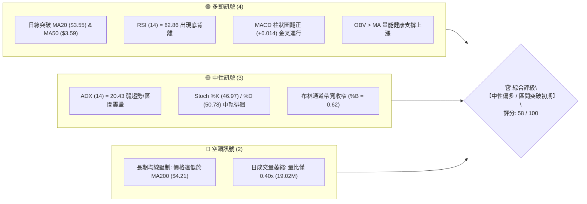
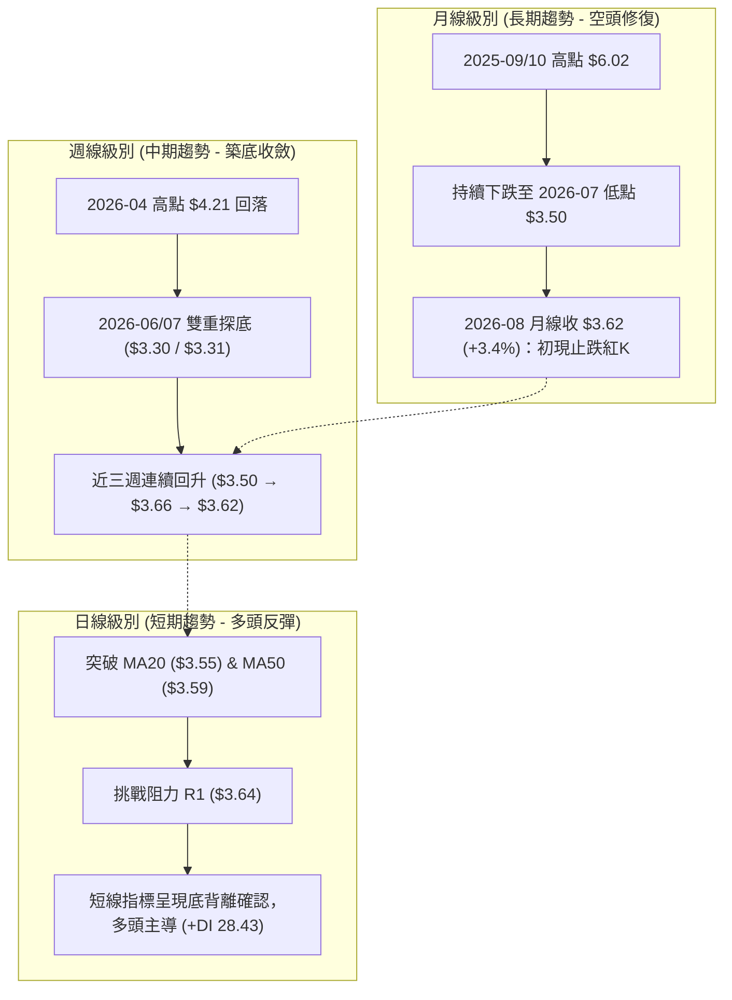
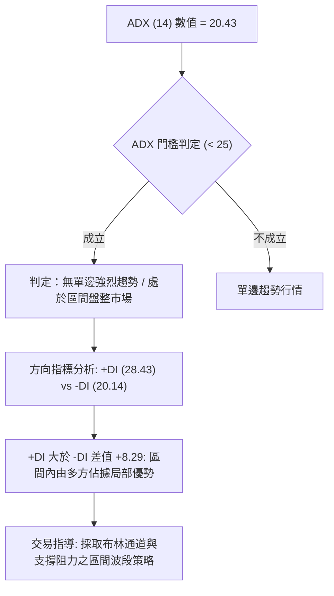
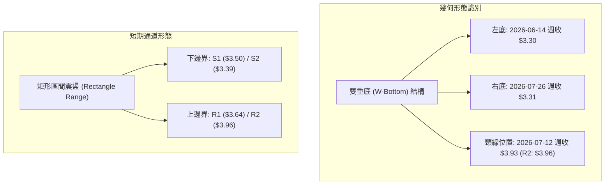
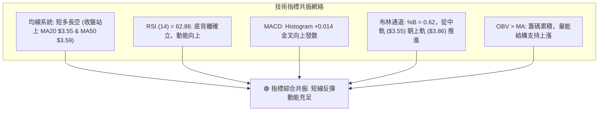
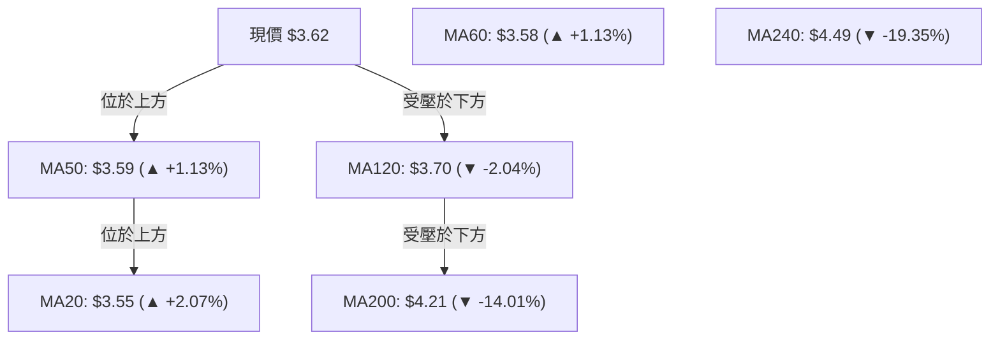
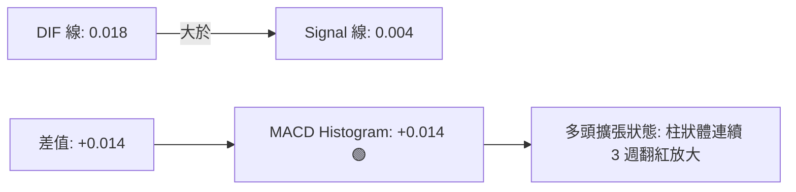
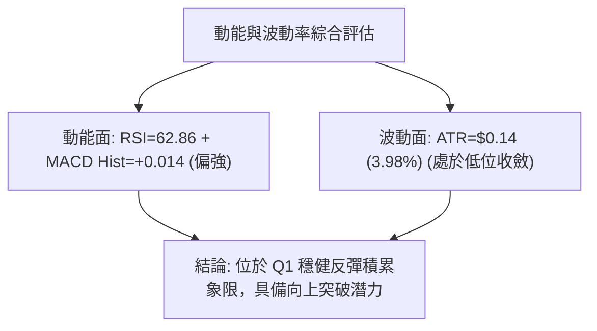
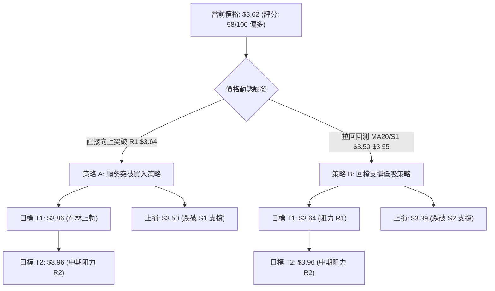
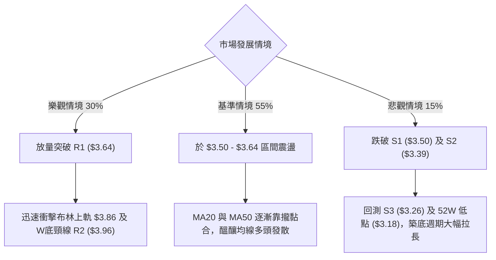

# GRAB 技術分析報告

> **報告日期**：2026-08-16 ｜ **語言**：繁體中文 ｜ **數據來源**：Yahoo Finance ｜ **當前價格**：$3.62

---

## 目錄

| 章節 | 內容 |
|------|------|
| [1. 技術面概覽](#1-技術面概覽) | 訊號儀表板、核心指標、評分卡 |
| [2. 趨勢分析](#2-趨勢分析) | 多時框趨勢、長中短期走勢、ADX 解讀 |
| [3. 圖表形態分析](#3-圖表形態分析) | 形態識別、信心度評估、K線組合與形態目標價 |
| [4. 支撐與阻力](#4-支撐與阻力) | 關鍵價位階梯、斐波那契回調結構 |
| [5. 技術指標深度解讀](#5-技術指標深度解讀) | MA/RSI/MACD/布林通道/OBV量價關係 |
| [6. 動能與波動率](#6-動能與波動率) | 動能四象限、ATR 波動率與風險定位 |
| [7. 多時框架總結](#7-多時框架總結) | 時框架評分矩陣與收斂規則結論 |
| [8. 交易策略建議](#8-交易策略建議) | 策略路由、情境階梯、進出場精確點位 |
| [9. 風險提示與監控](#9-風險提示與監控) | 關鍵監控清單、極端情境與風控指引 |

---

## 1. 技術面概覽

### 🎯 技術訊號儀表板



### 📊 核心指標速覽表

| 指標類別 | 指標名稱 | 當前數值 | 訊號 | 專業解讀 |
|----------|----------|----------|------|----------|
| **價格** | 當前價格 | $3.62 | 🟢 | 站上短期均線群，處於 52 週區間之 12.8% 低位反彈階段 |
| **均線** | MA20 | $3.55 | 🟢 | 現價高於 MA20 (+2.07%)，短期多頭支撐確立 |
| **均線** | MA50 | $3.59 | 🟢 | 現價突破 MA50 (+1.13%)，短中期動能轉強 |
| **均線** | MA200 | $4.21 | 🔴 | 現價低於 MA200 (-14.01%)，長期趨勢仍處空頭架構 |
| **動能** | RSI(14) | 62.86 | 🟢 | 脫離超賣區進入多頭動能區，並形成標準「底背離」結構 |
| **動能** | MACD (12,26,9) | 0.018 / 0.004 | 🟢 | DIF 線位於 Signal 線上方，Histogram (+0.014) 持續發散 |
| **趨勢** | ADX (14) | 20.43 | 🟡 | ADX < 25 處於無顯著單邊趨勢之盤整階段，+DI (28.43) 佔優 |
| **波動** | ATR(14) | $0.14 | 🟡 | ATR 佔股價 3.98%，波動度處於近期收縮低點，有利於築底 |
| **量能** | OBV 趨勢 | OBV > MA | 🟢 | 能量潮指標高於均線，顯示逢低累積籌碼跡象 |

### 🏆 技術評分卡

```
╔══════════════════════════════════════════════════════════════════╗
║              GRAB 技術評分卡 (綜合儀表板)                        ║
╠══════════════════════════════════════════════════════════════════╣
║ 趨勢強度 (ADX/DI)   ███████░░░░░░░░░░░░░  38/100  🟡 弱勢盤整    ║
║ 動能指標 (RSI/MACD) ██████████████░░░░░░  72/100  🟢 底背離轉強  ║
║ 支撐穩定度 (S1/S2)  ████████████░░░░░░░░  65/100  🟢 底部支撐強  ║
║ 成交量配合 (Volume) ████████░░░░░░░░░░░░  42/100  🟡 量縮觀望    ║
║ 形態完整度 (Pattern)███████████░░░░░░░░░  58/100  🟡 區間築底    ║
║ 均線架構 (MA System)████████████░░░░░░░░  60/100  🟡 短多長空    ║
╠══════════════════════════════════════════════════════════════════╣
║ 綜合技術得分        ███████████░░░░░░░░░  58/100  🟢 中性偏多    ║
║ 交易環境定義        區間震盪築底，短線向上測試 R1 ($3.64) 阻力   ║
╚══════════════════════════════════════════════════════════════════╝
```

---

## 2. 趨勢分析

### 🌐 多時框趨勢分析



### 📈 長期趨勢 — 12個月走勢圖（Unicode）

```
GRAB 月線歷史走勢圖（2025-08 至 2026-08）
價格 ($)
$6.10 ┤      ● $6.02  ● $6.01 (波段歷史雙頂)
$5.50 ┤                ╲
$5.00 ┤ ● $4.99         ● $5.45
$4.50 ┤                   ╲    ● $4.99
$4.00 ┤                    ╲    ╲     ● $4.30  ● $4.22
$3.50 ┤                     ╲    ╲     ╲        ╲     ● $3.82       ● $3.77        ● $3.62 (現價)
$3.00 ┤                      ╲    ╲     ╲        ╲     ╲   ● $3.66   ╲   ● $3.54    ╲   ● $3.50(波段底)
      └─┬──────┬──────┬──────┬──────┬──────┬──────┬──────┬──────┬──────┬──────┬──────┬──────┬──────
       08/25  09/25  10/25  11/25  12/25  01/26  02/26  03/26  04/26  05/26  06/26  07/26  08/26
```

**歷史走勢特徵分析表格**：

| 階段 | 期間 | 起訖價位 | 漲跌幅 | 核心特徵與量價解讀 |
|------|------|----------|--------|--------------------|
| **第一階段：高檔反轉** | 2025-09 ~ 2025-10 | $6.02 → $6.01 | -0.16% | 觸及 52 週高點 $6.62 後高檔滯漲，形成頭部籌碼鬆動 |
| **第二階段：主跌加速** | 2025-11 ~ 2026-03 | $5.45 → $3.66 | -32.84% | 均線全數轉為空頭排列，跌破 $5.00 與 $4.00 整數關卡 |
| **第三階段：低檔築底** | 2026-04 ~ 2026-07 | $3.82 → $3.50 | -8.38% | 於 $3.30–$3.50 區間反覆震盪打底，下行斜率顯著減緩 |
| **第四階段：築底反彈** | 2026-08 (迄今) | $3.50 → $3.62 | +3.43% | 收復短期均線，月線 K 棒留長下影線，具止跌企穩意涵 |

### 📊 中期趨勢（週線分析）

從近 20 週的週收盤數據觀察：
- **關鍵支撐帶**：在 2026-06-14（週收 $3.30）與 2026-07-26（週收 $3.31）形成了明確的中期「雙重底（W底）」測試結構。
- **關鍵反彈阻力**：中期強弱分水嶺位於 2026-07-12 週高點及阻力位聚類 $3.93–$3.96 (R2)。
- **動能演變**：週線 RSI 由 2026-05-10 的 20.5 極度超賣，震盪修復至當前 62.9，週線 MACD 柱狀圖由 -0.069 翻正至 +0.014，中期動能顯著修復。

### ⚡ 趨勢強度評估（ADX 解讀）



| 指標名稱 | 當前數值 | 參考閾值 | 市場狀態評估 | 策略意義 |
|----------|----------|----------|--------------|----------|
| **ADX (14)** | 20.43 | < 25 (弱趨勢) | 處於寬幅震盪築底階段，單邊趨勢尚未形成 | 避免盲目追價，適合逢回測支撐佈局 |
| **+DI (14)** | 28.43 | > -DI | 多頭買盤力道大於空頭賣壓 | 多方在震盪結構中處於防守反擊優勢 |
| **-DI (14)** | 20.14 | < +DI | 空頭主導力量明顯消退 | 下跌動能衰竭，做空風險高於做多 |

---

## 3. 圖表形態分析

### 🔍 形態識別系統



**形態信心度與目標價評估表**（嚴格基於數據推算）：

| 形態名稱 | 信心度 | 判斷依據（引用數據） | 形態完成度 | 目標價計算公式與數值 |
|----------|--------|----------------------|------------|----------------------|
| **中期雙重底 (W-Bottom)** | **68%** | 兩次下探低點 $3.30 (2026-06) 與 $3.31 (2026-07)，不破 52W 低點 $3.18，且右底 RSI(25.9) 高於左底 | **65%** (尚未突破頸線) | 頸線阻力 R2 ($3.96) - 底部低點 ($3.30) = 高度 $0.66<br>理論目標價 = $3.96 + $0.66 = **$4.62** (接近 MA240 $4.49) |
| **短期箱型震盪** | **85%** | 價格受限於 S1 ($3.50) 與 R1 ($3.64) 狹幅區間，符合 ADX 20.43 盤整特性 | **90%** (正處突破邊界) | 箱體高點 R1 ($3.64) - 箱體低點 S1 ($3.50) = $0.14<br>短線突破目標價 = $3.64 + $0.14 = **$3.78** (接近 BB 上軌 $3.86) |

### 🕯️ 重要K線形態分析

| 日期 / 週期 | 收盤價 | K線形態 | 量價關係 | 訊號意涵 |
|-------------|--------|---------|----------|----------|
| **2026-07-26 (週)** | $3.31 | 探底長下影小陰線 | 週量 202.9M | 🟢 觸及波段次低點獲強力逢低承接，形成右底支撐 |
| **2026-08-02 (週)** | $3.50 | 晨星反轉大陽線 | 週量 290.5M (放量) | 🟢 確認底部有效性，主力資金進場回補 |
| **2026-08-09 (週)** | $3.66 | 續漲實體陽線 | 週量 310.7M (持續增量) | 🟢 站上 MA20 與 MA50，確立多頭反彈波段 |
| **2026-08-16 (週)** | $3.62 | 高檔量縮十字星 | 週量 147.3M (量縮回測) | 🟡 遇阻力 R1 ($3.64) 進行正常技術性整固，未跌破支撐 |

### 📉 ASCII 走勢形態示意圖

```
GRAB 中期雙重底 (W-Bottom) 與箱型突破示意圖
價格 ($)
$4.00 ┤                          [頸線阻力 R2: $3.96] ───────
      │                           ╭───╮
$3.80 ┤                          ╭╯   ╰╮
      │             ╭──╮        ╭╯     ╰╮         ╭── [現價 $3.62] 突破 R1 $3.64 測試中
$3.60 ┤  ───────╭───╯  ╰────────╯       ╰────╭────╯
      │        ╭╯                            ╭╯   [箱體下沿支撐 S1: $3.50]
$3.40 ┤       ╭╯                            ╭╯
      │      ╭╯ [左底]                      ╰╮ [右底]
$3.20 ┤──────┴── $3.30 ──────────────────────┴── $3.31 ────── [強支撐底線 S3: $3.26 / 52W低 $3.18]
      └─────────────────────────────────────────────────────
```

---

## 4. 支撐與阻力

### 🗺️ 關鍵價位分布圖（Unicode）

```
GRAB 價位結構分佈圖（數據完全源自波段高低點與斐波那契計算）
═══════════════════════════════════════════════════════════════════════
$4.49 ║██████████████████████████████║ 斐波那契 61.8% / MA240 密集強壓
$4.21 ║████████████████████████      ║ 長期趨勢分水嶺 MA200
$4.06 ║██████████████████            ║ 強阻力 R3 (近一年波段高點聚類)
$3.96 ║████████████████████████      ║ 中期強阻力 R2 / W底頸線
$3.86 ║████████████                  ║ 布林通道上軌
$3.64 ║██████████████████████████████║ 短線關鍵阻力 R1 (+0.46% 突破點)
$3.62 ╠══════════════════════════════╣ ◄ 當前市價 ($3.62)
$3.59 ║▓▓▓▓▓▓▓▓▓▓                    ║ 中期均線 MA50 動態支撐
$3.55 ║▓▓▓▓▓▓▓▓▓▓▓▓▓▓▓▓              ║ 布林中軌 / MA20 短線防守
$3.50 ║▓▓▓▓▓▓▓▓▓▓▓▓▓▓▓▓▓▓▓▓▓▓▓▓      ║ 近期核心支撐 S1 (-3.31%)
$3.39 ║▓▓▓▓▓▓▓▓▓▓▓▓▓▓▓▓              ║ 次級支撐 S2 (-6.35%)
$3.26 ║▓▓▓▓▓▓▓▓▓▓▓▓▓▓▓▓▓▓▓▓▓▓▓▓██████║ 強支撐底線 S3 / 52W Low 緩衝區 ($3.18)
═══════════════════════════════════════════════════════════════════════
```

### 🚧 阻力位分析表

| 阻力級別 | 價位 | 與現價距離 | 形成原因（波段高點聚類） | 突破難度 | 戰略重要性 |
|----------|------|------------|--------------------------|----------|------------|
| **R1 (短線)** | **$3.64** | +0.46% | 近期震盪區間上沿，近一週多次觸及回落點 | 🟡 中等 | 短線轉強訊號，收盤站穩將激發動能買盤 |
| **R2 (中期)** | **$3.96** | +9.30% | 2026-07 波段反彈高點聚類，W 底形態頸線位 | 🔴 較高 | 中期多空分水嶺，突破代表波段反轉成立 |
| **R3 (強壓)** | **$4.06** | +12.15% | 2026 年第二季多次上攻失敗套牢區 | 🔴 極高 | 進入 $4.00 整數心理大關與重度套牢籌碼區 |

### 🛡️ 支撐位分析表

| 支撐級別 | 價位 | 與現價距離 | 形成原因（波段低點聚類） | 守住機率 | 戰略重要性 |
|----------|------|------------|--------------------------|----------|------------|
| **S1 (首要)** | **$3.50** | -3.31% | 2026-08-02 週收盤點，近期築底反彈平台下沿 | 🟢 80% | 短線多頭防守底線，不容跌破以維護反彈結構 |
| **S2 (次級)** | **$3.39** | -6.35% | 2026-06 至 2026-07 探底回升之中繼密集成交區 | 🟢 85% | 中期結構保護位，回測此處為低接買點 |
| **S3 (強固)** | **$3.26** | -10.08% | 逼近 52 週最低點 $3.18 之波段極端低點聚類 | 🟢 95% | 空頭波段極限，跌破代表形態徹底破位 |

### 📐 斐波那契回調位分析

依據 52 週最高點 **$6.62** 至 52 週最低點 **$3.18** 之完整下行波段進行黃金分割計算：

```
0.0%  (52W High)  ─── $6.62
23.6%             ─── $5.81
38.2%             ─── $5.31
50.0%             ─── $4.90
61.8%             ─── $4.49  (MA240 壓力處)
78.6%             ─── $3.92  (逼近 R2 阻力 $3.96)
[現價 $3.62]      ─── 處於 78.6% ($3.92) 與 100.0% ($3.18) 之間的極致築底區間
100.0% (52W Low)  ─── $3.18
```

- **位置解讀**：現價 $3.62 位於 78.6% 回調位 ($3.92) 下方，顯示此波回檔已接近極限（跌幅達 87.2% 的 52 週波動範圍）。在技術面上，跌破 78.6% 往往意味著價值被嚴重壓縮，具備強烈的均值回歸反彈潛力，首要反彈目標即為回測 78.6% ($3.92) 至 R2 ($3.96) 區域。

---

## 5. 技術指標深度解讀

### 🎛️ 指標訊號總覽



### 📈 移動平均線排列分析



- **均線排列架構**：目前長週期均線仍處空頭排列（MA20 < MA50 < MA200），但**短中期均線已出現金叉修復**。
- **關鍵交叉訊號**：現價 $3.62 同時站上 20 日均線（$3.55）與 50 日均線（$3.59），且 MA20 開始向上翻揚，構成典型的「短期多頭均線扣抵發力」，上檔短期均線壓制僅剩 MA120（$3.70）。

### 📉 RSI(14) 分析與背離判斷

```
RSI(14) 數值儀表：
0 ────── 超賣(30) ────────────── (50) ────────── 當前 62.86 ── 超買(70) ────── 100
[░░░░░░░░░░░░░░░░░░░░░░░░░░░░░░░░████████████████████░░░░░░░░░░] 62.86%
```

- **背離判斷（Bullish Divergence）**：
  - 價格走勢：2026-06-14 低點 $3.30，隨後 2026-07-26 再次下探低點 $3.31，價格維持在水平低檔。
  - RSI 走勢：RSI(14) 在 2026-05-10 創下低點 20.5，至 2026-07-26 低點時 RSI 為 25.9，當前更大幅攀升至 **62.86**。
  - **結論**：RSI 形成了極為標準的**大級別「底背離」**，顯示雖然價格在低位徘徊，但內部買盤動能已提前大幅增強，是強烈的底部反轉先導訊號。

### 📊 MACD(12,26,9) 訊號解讀



- **訊號解析**：MACD 線（0.018）成功上穿訊號線（0.004）形成零軸上方的黃金交叉，Histogram 柱狀圖讀數為 +0.014，確認短期多頭動能正在加速釋放。

### 📦 布林通道分析

```
布林通道結構圖 (帶寬收窄後向上開口)
$3.86 ┬────────────────────────────────────────── 布林上軌 (BB Upper)
      │
$3.62 ┼─────────────────────────● [現價: %B = 0.62，突破中軌向朝上軌]
      │
$3.55 ┼────────────────────────────────────────── 布林中軌 (MA20 Baseline)
      │
$3.23 ┴────────────────────────────────────────── 布林下軌 (BB Lower)
```

- **通道指標解析**：
  - **布林上軌**：$3.86
  - **布林中軌 (MA20)**：$3.55
  - **布林下軌**：$3.23
  - **%B 指標**：0.62（處於 0.5 中軌與 1.0 上軌之間的多頭掌控區）。
  - **形態解讀**：布林通道經歷了 2026 年 6–7 月的收口蓄勢後，現價站穩中軌 $3.55 並朝向 $3.86 上軌推升，具備順勢上攻的空間。

### 💹 成交量分析（量價配合度）

- **量價特徵**：最新日成交量為 19,021,400 股，相較於 20 日均量（47,566,410 股）呈現顯著量縮（量比 0.40x）。
- **量價背離評估**：
  - 週線級別在低檔反彈時（2026-08-02 至 2026-08-09）呈現放量（290M–310M），本週回測 $3.62 時急劇量縮至 147M，呈現標準的「**漲有量、跌無量**」良性回檔結構。
  - **OBV 能量潮**維持在移動平均線上方（OBV > MA），證實資金並未在回檔中撤出，量能對價格形成健康支撐。

---

## 6. 動能與波動率

### ⚡ 動能評估四象限

| 象限 | 狀態定義 | 技術特徵 | GRAB 當前定位 | 策略應對方針 |
|------|----------|----------|:-------------:|--------------|
| **Q1 (高動能/低波動)** | 趨勢穩健積累 | RSI > 60，ATR 處於收縮低位 | **【✓ 當前狀態】** | **最佳波段佈局期**：風險收益比極佳，適合分批建倉 |
| **Q2 (低動能/低波動)** | 橫盤死寂盤整 | RSI 40-50，ADX < 15 | - | 觀望等待方向選擇 |
| **Q3 (高動能/高波動)** | 主升/主跌爆發 | ATR 放大，價格大幅波動 | - | 追隨趨勢，嚴設移動止盈 |
| **Q4 (低動能/高波動)** | 無序混亂洗盤 | 頻繁破位與假突破 | - | 嚴禁重倉進場 |



### 📊 ATR 波動率分析

- **ATR(14) 絕對值**：**$0.14**
- **波動率佔比**：$0.14 / $3.62 = **3.98%**
- **動態止損與進出場風控計算**：
  - 1.0 × ATR（短線正常波動帶）：$0.14
  - 1.5 × ATR（標準技術止損距離）：$0.21
  - 2.0 × ATR（波段安全止損距離）：$0.28
  - **止損價位設定建議**：若於現價 $3.62 建立多頭部位，扣除 1.0 × ATR 之價位為 $3.48（恰好座落於 S1 支撐 $3.50 稍下方），提供完美的技術共振防守點。

### 📐 Beta 與市場相關性

- **Beta 係數**：**0.89**
- **市場屬性分析**：Beta < 1.0 代表 GRAB 波動度略低於大盤，相較於高波動科技股更具防禦性。在科技股大盤震盪時，GRAB 由於估值已大幅壓縮且處於 52 週低檔區，下行空間受限，具備獨立築底走出補漲行情的條件。

---

## 7. 多時框架總結

### 📋 時框架評分表

| 時框架 | 趨勢方向 | 動能狀態 | 均線排列 | 形態特徵 | 綜合評分 | 操作建議 |
|--------|----------|----------|----------|----------|:--------:|----------|
| **月線 (長期)** | 🔴 偏空 | 🟡 中性築底 (RSI 45) | 空頭排列 (低於 MA240 $4.49) | 52W 低位長下影星線 | 45/100 | 逢低定投，關注長期價值 |
| **週線 (中期)** | 🟢 轉多 | 🟢 多頭轉強 (RSI 62.9, MACD金叉) | 站上 MA20/MA50 | 雙重底 (W底) 構築中 | 68/100 | 波段做多，目標看至頸線 R2 |
| **日線 (短期)** | 🟢 偏多 | 🟢 底背離發酵 (Histogram +0.014) | 站穩 MA20 ($3.55) & MA50 ($3.59) | 區間向上突破測試 R1 ($3.64) | 65/100 | 突破進場或回測 MA20 低吸 |

### 🔲 綜合訊號矩陣

| 維度 | 短期 (日線) | 中期 (週線) | 長期 (月線) | 訊號收斂狀態 |
|------|-------------|-------------|-------------|--------------|
| **趨勢方向** | 🟢 偏多反彈 | 🟢 築底向上 | 🔴 熊市修復 | 🟢 短中期共振向上，修復長期劣勢 |
| **動能強度** | 🟢 MACD 翻紅 | 🟢 RSI 向上 | 🟡 跌勢趨緩 | 🟢 動能全面由多方主導 |
| **關鍵均線** | 🟢 站上 MA20/50 | 🟢 站上 MA20 | 🔴 低於 MA200 | 🟡 遇長期均線（MA120/MA200）有反壓 |
| **量價配合** | 🟡 日量萎縮 | 🟢 週量健康 | 🟡 底部量平 | 🟢 屬於良性洗盤量縮 |

### ⚖️ 多時框收斂結論

依據多時框收斂規則：
1. **行情性質判定**：ADX(14) 數值為 **20.43 (< 25)**，明確定義當前處於**「盤整震盪築底行情」**而非單邊強趨勢。
2. **時框優先級**：在盤整行情中，交易重心以日線布林通道區間（$3.23–$3.86）與關鍵波段支撐阻力為基準，中期週線形態提供多頭反彈動能指引。
3. **最終收斂方向**：**【偏多震盪操作（Mild Bullish Bias）】**。雖然長期均線（MA200 $4.21）壓制仍在，但短期日線與中期週線之 RSI 底背離、MACD 金叉、站上 MA20/MA50 形成高度多頭共振，主策略應採取**逢低做多或突破 R1 做多**。

---

## 8. 交易策略建議

### 🗺️ 策略決策流程圖



### 🧭 策略路由

> **當前主策略方向 = 偏多區間操作 / 突破佈局（依技術綜合評分 58/100）**
> 基於日線站穩 MA20 ($3.55) 與 MA50 ($3.59)、RSI 底背離及 MACD 正向擴張，全面以「多頭策略」為主導，空頭僅列為風控停損與避險參考。

### 🎯 價格情境階梯（Price Scenarios）

| 觸發條件 | 關鍵價位 | 第一延伸目標 | 第二延伸目標 | 市場情境與技術含義 |
|----------|----------|--------------|--------------|--------------------|
| **強勢突破** | 突破 R1 **$3.64** | R2 **$3.96** (+9.30%) | R3 **$4.06** (+12.15%) | 確認完成短線箱體突破，向 W 底頸線發起衝擊 |
| **常態震盪** | 守穩 **$3.55 - $3.64** | 區間頂部 $3.64 | 區間底部 $3.55 | 布林通道中軌上方蓄勢，均線進行糾結發散整理 |
| **弱勢回測** | 跌破 S1 **$3.50** | S2 **$3.39** (-6.35%) | S3 **$3.26** (-10.08%) | 短線多頭失效，回測 2026-06/07 雙底支撐帶 |

### 📊 情境機率分佈

| 運行情境 | 機率預估 | 核心技術依據 |
|----------|:--------:|--------------|
| **情境一：震盪走高 / 突破反彈** | **55%** | RSI 形成標準大級別底背離、MACD 柱狀圖連續發散 (+0.014)、OBV > MA 量能健康 |
| **情境二：區間窄幅震盪** | **30%** | ADX (20.43) 顯示趨勢動能有限，日成交量萎縮至 0.40x 均量，需時間消化籌碼 |
| **情境三：破位向下再探底** | **15%** | 現價距離 52 週低點僅 12.8%，S1 ($3.50) 及 S2 ($3.39) 具備密集買盤保護 |

### 🟢 主策略詳情

| 策略要素 | 策略 A（突破順勢買入） | 策略 B（回測低吸買入） |
|----------|------------------------|------------------------|
| **進場條件** | 日K收盤突破阻力位 R1 或盤中帶量站上 | 價格拉回回測布林中軌 MA20 或支撐 S1 |
| **進場價格** | **$3.65**（確認突破 R1 $3.64） | **$3.52**（於 $3.50–$3.55 區間掛單） |
| **目標價 T1** | **$3.86**（布林上軌 / +5.75%） | **$3.64**（阻力 R1 / +3.41%） |
| **目標價 T2** | **$3.96**（中期阻力 R2 / +8.49%） | **$3.96**（中期阻力 R2 / +12.50%） |
| **止損價格** | **$3.50**（跌破支撐 S1 / -4.11%） | **$3.39**（跌破支撐 S2 / -3.69%） |
| **風險報酬比 (R:R)** | **1 : 2.07**（以 T2 計算） | **1 : 3.39**（以 T2 計算） |
| **成功機率預估** | **55%** | **65%** |
| **建議配置倉位** | **15%** 投資組合資金 | **20%** 投資組合資金 |

### 🔴 反向風險觸發點（對沖與風控提示）

- **全面停損警戒線**：若日K線收盤價跌破 **$3.50 (S1)**，代表短期均線反彈結構破壞，應立即將多頭部位減半。
- **波段破位翻空線**：若價格帶量跌破 **$3.39 (S2)**，代表 W 底形態失敗，可能重新下探 **$3.26 (S3)** 及 52 週新低 **$3.18**，此時應全面離場觀望或建立適度空頭對沖部位。

### ⭐ 整體訊號強度評星

```
╔══════════════════════════════════════════════════════════════════╗
║ 做多訊號強度：  ★★★★☆  (3.8 / 5.0 星) — 底背離共振，性價比極高  ║
║ 做空訊號強度：  ★☆☆☆☆  (1.2 / 5.0 星) — 底部支撐強，盈虧比不佳  ║
║ 整體訊號可信度：★★★☆☆  (3.5 / 5.0 星) — 受制於低成交量與弱 ADX ║
╚══════════════════════════════════════════════════════════════════╝
```

---

## 9. 風險提示與監控

### ✅ 關鍵監控指標 Checklist

```
╔══════════════════════════════════════════════════════════════════╗
║              GRAB 日常交易與技術風險監控清單                     ║
╠══════════════════════════════════════════════════════════════════╣
║ [ ] 價位監控：是否有效突破並站穩 R1 ($3.64)？                   ║
║ [ ] 防守監控：日收盤是否維持在 MA20 ($3.55) 與 S1 ($3.50) 之上？║
║ [ ] 動能監控：MACD Histogram 是否保持正值 (+0.014 以上)？      ║
║ [ ] 背離追蹤：RSI(14) 是否持續維持在 50 中軸上方運行？          ║
║ [ ] 量能監控：突破 $3.64 時日成交量是否放大至 3,500 萬股以上？ ║
║ [ ] 形態監控：週線是否能連續 3 週收於 $3.60 之上完成築底？     ║
╚══════════════════════════════════════════════════════════════════╝
```

### ⚠️ 風險場景分析



### 🛡️ 風險管理重要提醒

1. **成交量不足風險**：當前成交量僅 1,902 萬股（量比 0.40x），低流動性可能導致價格假突破或假跌破。在未出現單日 4,000 萬股以上的確認放量前，**禁止使用高槓桿或單次重倉**。
2. **均線壓制風險**：MA120（$3.70）與 MA200（$4.21）呈現向下延伸走勢，反彈至 $3.86–$3.96 區域時將面臨大量歷史套牢盤解套拋壓，應分批獲利了結以鎖定利潤。
3. **倉位管理守則**：單筆交易虧損上限應控制在總帳戶淨值的 1.0%–1.5% 內，嚴格以 S1 ($3.50) 作為基準停損點。

---

## 📋 報告總結

```
╔══════════════════════════════════════════════════════════════════════════════╗
║                        GRAB 技術分析報告總結                                 ║
╠══════════════════════════════════════════════════════════════════════════════╣
║ 報告日期：2026-08-16              當前價格：$3.62                            ║
║ 技術評級：🟢 中性偏多 (58/100)    行情定義：區間震盪築底 / 短線突破測試      ║
╠══════════════════════════════════════════════════════════════════════════════╣
║ 關鍵技術結論：                                                               ║
║ ├─ 長期趨勢：🔴 弱勢修復 (價格位於 MA200 $4.21 下方，處 52W 低檔 12.8%)     ║
║ ├─ 中期趨勢：🟢 築底反彈 (週線形成 $3.30/$3.31 雙重底，RSI 大級別底背離)    ║
║ ├─ 短期趨勢：🟢 偏多進攻 (站上 MA20 $3.55 & MA50 $3.59，MACD 柱 +0.014)     ║
║ ├─ 核心支撐：首要 S1 $3.50 ｜ 次級 S2 $3.39 ｜ 極限底線 S3 $3.26            ║
║ ├─ 核心阻力：短線 R1 $3.64 ｜ 頸線 R2 $3.96 ｜ 強壓 R3 $4.06                ║
║ └─ 機構共識：Strong Buy ｜ 分析師平均目標價：$5.86 (潛在空間 +61.8%)         ║
╠══════════════════════════════════════════════════════════════════════════════╣
║ 最優操作執行策略：                                                           ║
║ 1. 🥇 最佳機會（策略 B）：拉回 $3.50–$3.55 佈局，止損 $3.39，目標 $3.96     ║
║ 2. 🥈 突破機會（策略 A）：帶量突破 $3.64 追進，止損 $3.50，目標 $3.86/$3.96 ║
║ 3. 🥉 保守選擇：等待股價有效站穩 R1 ($3.64) 且量能放大後再行介入            ║
╚══════════════════════════════════════════════════════════════════════════════╝
```

---

> ⚠️ **免責聲明**：本報告為依據定量技術指標與圖表形態所產出之分析，所有數據及價位均基於歷史市場交易資訊。本報告**僅供學術研究與投資策略參考**，**不構成任何形式的個別投資要約或買賣建議**。金融市場瞬息萬變，投資人應獨立判斷並自負盈虧風險。

---

*報告生成時間：2026-08-16 ｜ 數據來源：Yahoo Finance ｜ 分析框架：多時框架量化技術分析*