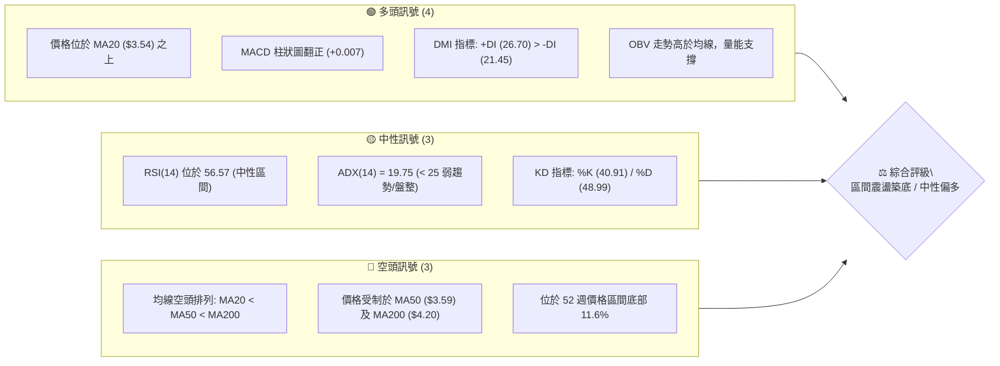
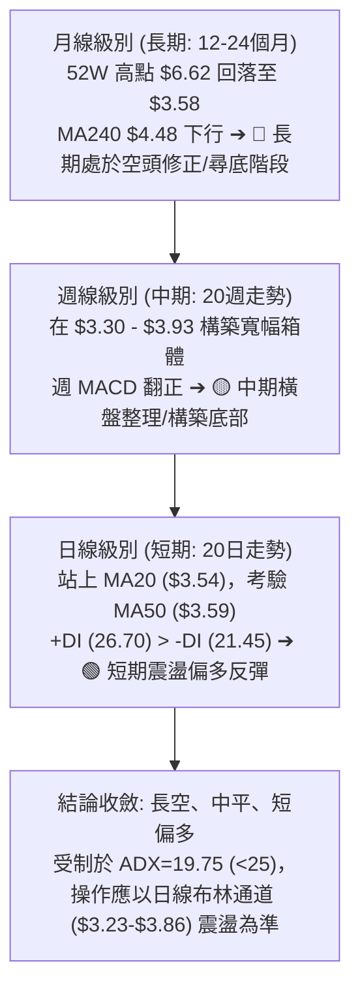
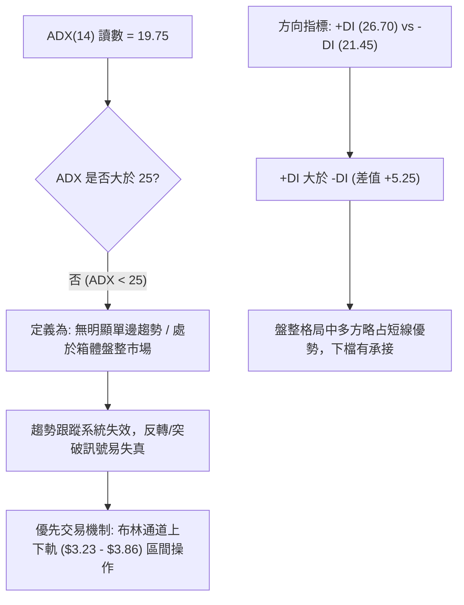
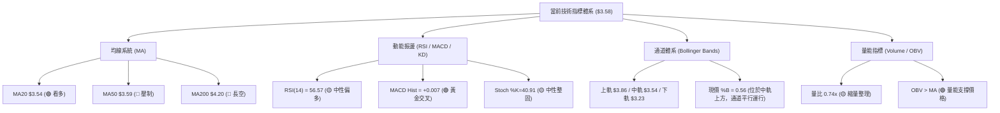
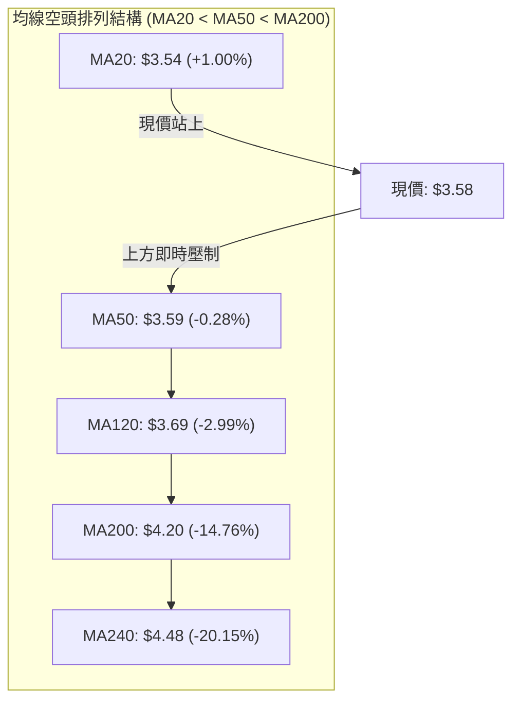
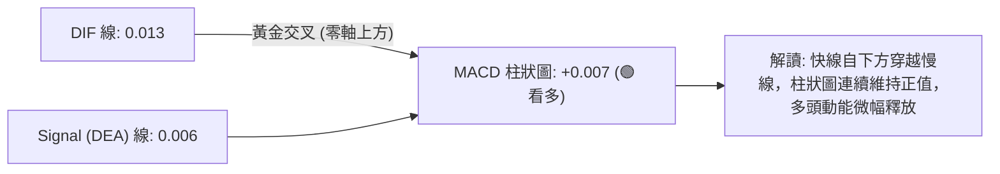
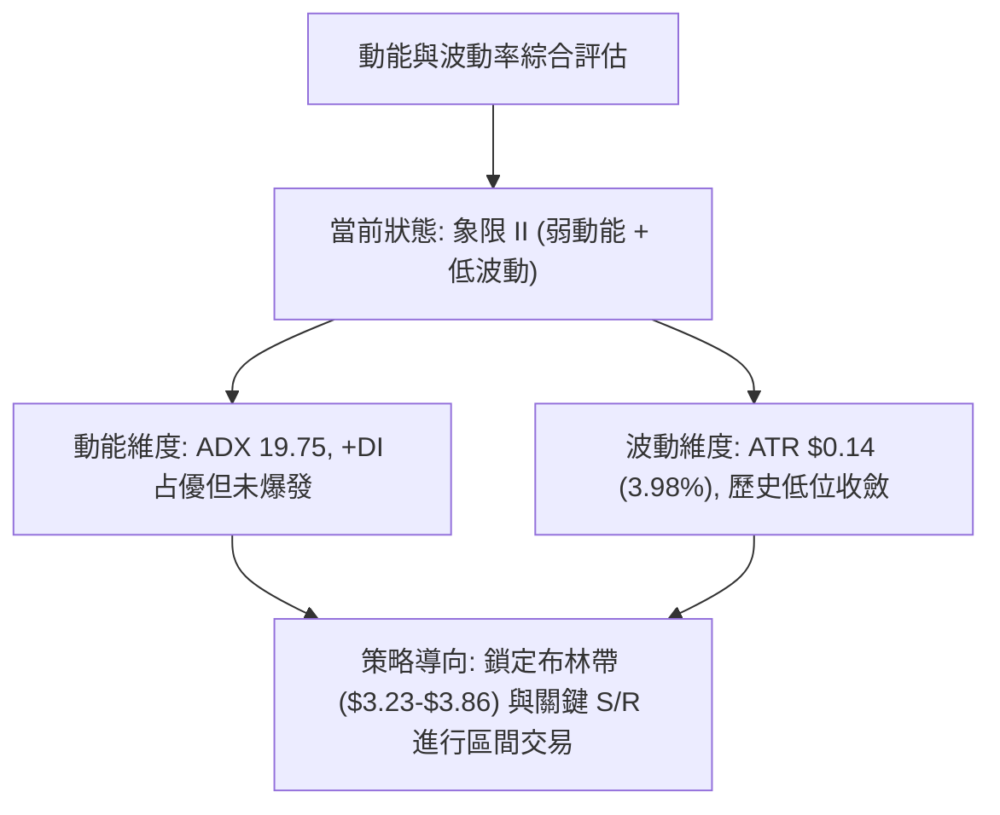
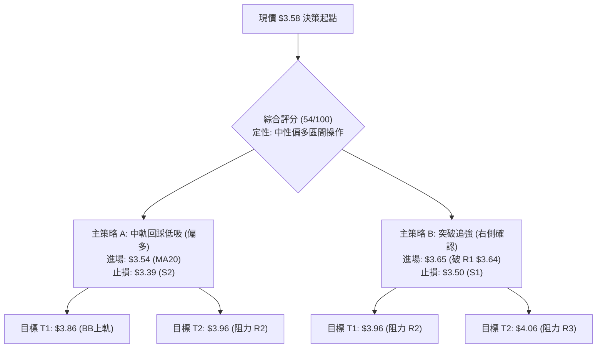
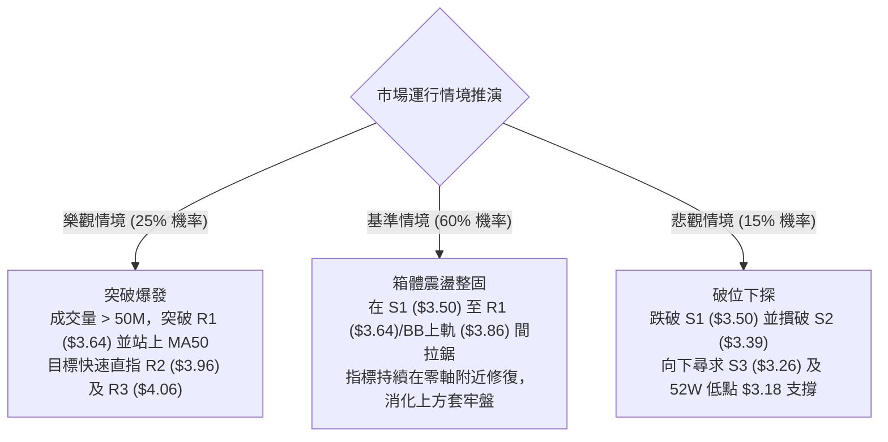

# GRAB 技術分析報告

> **報告日期**：2026-08-17 ｜ **語言**：繁體中文 ｜ **數據來源**：Yahoo Finance ｜ **當前價格**：$3.58

---

## 目錄

| 章節 | 內容 |
|------|------|
| [1. 技術面概覽](#1-技術面概覽) | 訊號儀表板、核心指標、評分卡 |
| [2. 趨勢分析](#2-趨勢分析) | 多時框趨勢、長中短期走勢 |
| [3. 圖表形態分析](#3-圖表形態分析) | 形態識別、K線組合、目標價 |
| [4. 支撐與阻力](#4-支撐與阻力) | 關鍵價位、斐波那契回調 |
| [5. 技術指標深度解讀](#5-技術指標深度解讀) | MA/RSI/MACD/布林/成交量 |
| [6. 動能與波動率](#6-動能與波動率) | 動能評估、ATR、Beta |
| [7. 多時框架總結](#7-多時框架總結) | 時框架評分矩陣 |
| [8. 交易策略建議](#8-交易策略建議) | 多空策略、風險報酬比 |
| [9. 風險提示與監控](#9-風險提示與監控) | 監控指標、風險場景 |

---

## 1. 技術面概覽

### 🎯 技術訊號儀表板



### 📊 核心指標速覽表

| 指標類別 | 指標名稱 | 當前數值 | 訊號 | 解讀 |
|----------|----------|----------|------|------|
| **價格** | 當前價格 | $3.58 | 🟡 中性 | 處於 52 週低點 $3.18 與高點 $6.62 區間的 11.6% 分位 |
| **均線** | MA20 | $3.54 | 🟢 看多 | 現價位於 20 日均線之上（+1.13%），短線具備下檔支撐 |
| **均線** | MA50 | $3.59 | 🔴 看空 | 現價緊貼 50 日均線（-0.28%），上方存在即時均線壓制 |
| **均線** | MA200 | $4.20 | 🔴 看空 | 現價遠低於 200 日牛熊分界線（-14.76%），長期空頭未扭轉 |
| **動能** | RSI(14) | 56.57 | 🟡 中性 | 動能溫和回升，無超買或超賣跡象，無背離訊號 |
| **動能** | MACD (12,26,9) | 0.013 / 0.006 | 🟢 看多 | DIF 線位於 Signal 線上方，MACD 柱狀圖為 +0.007 |
| **動能** | Stoch %K / %D | 40.91 / 48.99 | 🟡 中性 | 隨機指標位於中軸下方整理，未出現極端超賣超買 |
| **趨勢** | ADX / ±DI | 19.75 (+DI 26.70) | 🟡 中性 | ADX < 25 為典型無趨勢盤整；+DI 占優代表短多略勝 |
| **通道** | Bollinger Bands | $3.23 - $3.86 | 🟡 中性 | 現價 $3.58 位於中軌 $3.54 上方，%B 為 0.56，運行於上半通道 |
| **波動** | ATR(14) | $0.14 (3.98%) | 🟢 低波 | 每日平均波動幅度約 $0.14，波動率收斂有利於底部構築 |
| **量能** | 20日均量比 | 0.74x | 🟡 中性 | 當日量能 35.32M 低於 20 日均量 47.48M，突破需要量能放大 |

### 🏆 技術評分卡

```
╔══════════════════════════════════════════════════════════════╗
║                技術評分卡 — GRAB (2026-08-17)                ║
╠══════════════════════════════════════════════════════════════╣
║ 趨勢強度 (ADX/趨勢方向)  ███████░░░░░░░░░░░░░  35/100 🔴 弱勢/無趨勢 ║
║ 動能指標 (RSI/MACD/KD)   █████████████░░░░░░░  65/100 🟢 溫和偏多   ║
║ 支撐穩定度 (S1/S2/通道)  ██████████████░░░░░░  70/100 🟢 下檔穩固   ║
║ 成交量配合 (OBV/均量比)  ████████████░░░░░░░░  60/100 🟡 量能偏低   ║
║ 形態完整度 (區間築底)    ████████████░░░░░░░░  60/100 🟡 底部成形中 ║
║ 均線排列 (MA排列狀態)    ███████░░░░░░░░░░░░░  35/100 🔴 空頭排列   ║
╠══════════════════════════════════════════════════════════════╣
║ 綜合評分                 ███████████░░░░░░░░░  54/100 🟡 中性觀望   ║
╚══════════════════════════════════════════════════════════════╝
```

---

## 2. 趨勢分析

### 🌐 多時框趨勢分析



### 📈 長期趨勢 — 12個月走勢圖（Unicode）

```
GRAB 月線收盤走勢圖（2025-08 至 2026-08）
價格 ($)
$6.02 ┤    ●  ●(雙頂高點)
$5.45 ┤          ●
$4.99 ┤ ●              ●
$4.30 ┤                      ●
$4.22 ┤                         ●
$3.82 ┤                               ●
$3.77 ┤                                     ●
$3.66 ┤                            ●
$3.58 ┤━━━━━━━━━━━━━━━━━━━━━━━━━━━━━━━━━━━━━●←(現價 $3.58)
$3.54 ┤                                  ●
$3.50 ┤                                        ●(低點)
      └────────────────────────────────────────────────
        08 09 10 11 12 01 02 03 04 05 06 07 08 (月份)
        2025 ───►                        2026
```

**走勢特徵分析表格**：

| 階段 | 時間區間 | 起始價 ➔ 結束價 | 漲跌幅 | 核心技術特徵 |
|------|----------|-----------------|--------|--------------|
| **強勢衝頂期** | 2025-08 ➔ 2025-10 | $4.99 ➔ $6.01 (高見 $6.62) | +20.44% | 突破 $6.00 大關，創 52 週新高 $6.62 後形成月線雙頂 |
| **主跌推動期** | 2025-11 ➔ 2026-03 | $5.45 ➔ $3.66 | -32.84% | 連續 5 個月收黑，跌破 MA200 ($4.20) 與多道關鍵均線 |
| **底部震盪期** | 2026-04 ➔ 2026-08 | $3.82 ➔ $3.58 (低見 $3.18) | -6.28% | 價格在 $3.30–$3.93 區間收斂，月線跌勢趨緩，波動率收縮 |

### 📊 中期趨勢（週線分析）

中期走勢顯示，自 2026 年 4 月以來，GRAB 在 $3.18 至 $4.21 區間內進行多波次寬幅震盪。

```
週線區間壓力與支撐結構示意圖：
$4.21 ┬──────────────────────────────────────── 週線波段高點 (2026-04-19)
      │
$3.96 ┼──────────────────────────────────────── 關鍵波段阻力 R2 / 週線阻力
$3.64 ┼──────────────────────────────────────── 即時波段阻力 R1 (週高聚類)
$3.58 ┼ ◄───── [現價位置: 處於箱體中下軸，MACD柱 +0.007 弱勢修復]
$3.50 ┼──────────────────────────────────────── 第一防守支撐 S1 (近三週低點密集區)
$3.30 ┼──────────────────────────────────────── 強支撐區間 S2-S3 ($3.26-$3.39)
$3.18 ┴──────────────────────────────────────── 52 週最低點 (2026 年度極限防線)
```

### ⚡ 趨勢強度評估（ADX 解讀）



| 指標 | 數值 | 強度評估 | 解讀結論 |
|------|------|----------|----------|
| **ADX(14)** | 19.75 | 弱勢 (無趨勢) | 處於 20 以下低位，表明市場處於無趨勢或動能衰竭的盤整期 |
| **+DI (14)** | 26.70 | 溫和多頭 | 買盤力道高於賣盤，多方具備微弱掌控權 |
| **-DI (14)** | 21.45 | 空頭受控 | 賣方力量自 7 月底高點回落，空頭推低力道減弱 |
| **DI 交叉狀態** | +DI 上穿 -DI | 偏多確認 | 短線震盪走高，但在 ADX < 25 下不宜過度樂觀追價 |

---

## 3. 圖表形態分析

### 🔍 形態識別系統

依據形態信心度規則（嚴格要求 15），檢驗當前圖表結構：

| 形態類型 | 信心度 | 判斷依據（引用精確數據） | 完成度 | 目標價（附精確計算式） |
|----------|--------|--------------------------|--------|------------------------|
| **箱體矩形震盪** (Rectangle Range) | **75%** | 底部支撐位於 S1 ($3.50) / S2 ($3.39)，頂部阻力於 R1 ($3.64) / R2 ($3.96) | 70% | 向上破箱底高點 R2 ($3.96): $3.96 + ($3.96 - $3.39) = **$4.53** |
| **潛在雙重底** (Double Bottom) | **58%** | 兩次波段低點：2026-06-14 ($3.30) 與 2026-07-26 ($3.31)，頸線為 2026-07-12 高點 ($3.93) | 45% | 突破頸線 $3.93 成立: 頸線 $3.93 + 高度 ($3.93 - $3.30) = **$4.56** |
| **頭肩底形態** | **< 30%** | 數據不足以確認左肩與右肩對稱結構 | 0% | 訊號不足，不予計算幾何形態目標價 |

### 🕯️ 重要K線形態分析

| 週/月週期 | 收盤價 | K線形態特徵 | 盤面語意解讀 | 技術訊號 |
|-----------|--------|-------------|--------------|----------|
| **2026-07-19** | $3.57 | 中陰線下破 | 自 $3.93 回落，跌破 MA20 支撐，多頭獲利了結 | 🔴 空頭回踩 |
| **2026-07-26** | $3.31 | 長下影錘頭線 (Hammer) | 下探至 $3.31 獲買盤強烈支撐，確認 S2/S3 支撐有效 | 🟢 止跌信號 |
| **2026-08-02** | $3.50 | 實體陽線包覆 | 週線收復 $3.50，形成看漲吞沒組合，確立短線底部 | 🟢 轉強確認 |
| **2026-08-09** | $3.66 | 帶上影中陽線 | 向上挑戰阻力 R1 ($3.64)，短線遇阻收於 $3.66 | 🟡 測試阻力 |
| **2026-08-16** | $3.62 | 窄幅十字星 (Doji) | 量能萎縮（147.28M），多空在 MA50 附近陷入僵局 | 🟡 變盤前夕 |
| **2026-08-23** | $3.58 | 小陰線回踩 | 回踩 MA20 ($3.54)，量能顯著收縮至 35.32M，為良性縮量回踩 | 🟢 縮量整固 |

### 📉 ASCII 走勢形態示意圖

```
GRAB 箱體震盪與潛在雙底結構示意圖
價格 ($)
$3.96 ┤                 R2 阻力線 / 雙底頸線區 ($3.93 - $3.96)
      │                 ╭─────╮
$3.64 ┤   R1 阻力線     │     │             ╭───● 現價 $3.58
      │   ╭─╮           │     │             │
$3.50 ┤───╯ │───────────╯     │       ╭─────╯   S1 支撐線
      │     │                 │       │
$3.30 ┤     ╰───────●         ╰───────●         S2/S3 雙底低點區
      │          第一底 ($3.30)    第二底 ($3.31)
      └────────────────────────────────────────────────────────
        2026-06-14          2026-07-12  2026-07-26  2026-08-17
```

### 🎯 形態目標價計算

1. **箱體破位測幅法（主形態：信心度 75%）**：
   - 箱體頂部阻力（R2）：$3.96
   - 箱體底部支撐（S2）：$3.39
   - 箱體垂直高度：$3.96 - $3.39 = $0.57
   - **理論上破目標價** = $3.96 + $0.57 = **$4.53**（與 MA240 $4.48 及 61.8% 斐波那契位 $4.49 共振）
   - **理論下破目標價** = $3.39 - $0.57 = **$2.82**

2. **雙重底測幅法（次級形態：信心度 58%）**：
   - 形態頸線：2026-07-12 高點 $3.93
   - 形態最低點：2026-06-14 低點 $3.30
   - 形態高度：$3.93 - $3.30 = $0.63
   - **雙底突破目標價** = $3.93 + $0.63 = **$4.56**

---

## 4. 支撐與阻力

### 🗺️ 關鍵價位分布圖（Unicode）

```
GRAB 價位結構分布圖（OHLCV 實際聚類計算）
════════════════════════════════════════════════════════════════
$4.20 ║████████████████████████████████████║ 牛熊分水嶺 / MA200 壓力
$4.06 ║██████████████████████████          ║ 強阻力位 R3 (+13.41%)
$3.96 ║████████████████████████            ║ 重要波段阻力 R2 (+10.52%)
$3.86 ║▓▓▓▓▓▓▓▓▓▓▓▓▓▓▓▓▓▓▓▓▓               ║ 布林通道上軌壓力
$3.64 ║████████████████                    ║ 即時關鍵阻力 R1 (+1.58%)
$3.59 ║▒▒▒▒▒▒▒▒▒▒▒▒▒▒▒▒                    ║ MA50 動態均線壓制
$3.58 ╠════════════════════════════════════╣ ◄─── 當前現價 ($3.58)
$3.54 ║▒▒▒▒▒▒▒▒▒▒▒▒▒▒▒▒                    ║ MA20 / 布林中軌支撐
$3.50 ║▓▓▓▓▓▓▓▓▓▓▓▓▓▓▓▓▓▓▓▓                ║ 近期核心支撐 S1 (-2.23%)
$3.39 ║████████████████████████            ║ 強支撐位 S2 (-5.31%)
$3.26 ║██████████████████████████          ║ 極限波段支撐 S3 (-9.08%)
$3.18 ║████████████████████████████████████║ 52週歷史低點 (年度防線)
════════════════════════════════════════════════════════════════
```

### 🚧 阻力位分析表

所有價位均嚴格引用 OHLCV 計算所得數值：

| 阻力級別 | 精確價位 | 距現價幅幅 | 形成原因與籌碼聚類 | 突破難度 | 重要性 |
|----------|----------|------------|--------------------|----------|--------|
| **R1** | **$3.64** | +1.58% | 近期日線反彈高點聚類、MA5 ($3.65) 與 MA10 ($3.67) 密集區 | 🟡 中等 | 短期突破臨界點，突破則開啟通往布林上軌空間 |
| **R2** | **$3.96** | +10.52% | 7 月波段頂部（$3.93-$3.96）、斐波那契 78.6% 回調位 ($3.92) | 🔴 較高 | 中期箱體天花板，需巨量配合才能有效攻克 |
| **R3** | **$4.06** | +13.41% | 近一年下跌波段次級高點聚類，逼近 MA200 ($4.20) 重壓區 | 🔴 極高 | 趨勢轉多關鍵大關，存在大量被套套牢籌碼 |

### 🛡️ 支撐位分析表

所有價位均嚴格引用 OHLCV 計算所得數值：

| 支撐級別 | 精確價位 | 距現價幅幅 | 形成原因與籌碼聚類 | 守住機率 | 重要性 |
|----------|----------|------------|--------------------|----------|--------|
| **S1** | **$3.50** | -2.23% | 近三週波段低點密集聚類、整數心理關卡、MA20 ($3.54) 下方防線 | 🟢 75% | 多頭短期防線，失守將考驗下軌 |
| **S2** | **$3.39** | -5.31% | 6-7 月盤整平台密集成交區下沿 | 🟢 85% | 中期關鍵防護墊，跌破則箱體架構遭到破壞 |
| **S3** | **$3.26** | -9.08% | 2026 年 6-7 月極限雙底低點（$3.30-$3.31）下方緩衝區 | 🟢 90% | 多方底線防區，緊鄰 52W 低點 $3.18 |

### 📐 斐波那契回調位分析

依據 52 週完整波動區間（高點 **$6.62** ➔ 低點 **$3.18**，落差 **$3.44**）進行精確對照：

```
斐波那契回調層級分布：
0.0%  (52W High) ────────────────────────────── $6.62
23.6%            ────────────────────────────── $5.81
38.2%            ────────────────────────────── $5.31
50.0%            ────────────────────────────── $4.90
61.8%            ────────────────────────────── $4.49 ◄── (多空長線反轉關鍵位)
78.6%            ────────────────────────────── $3.92 ◄── (阻力 R2 $3.96 附近)
──────────────────────────────────────────────────────────
現價位置 ➔ $3.58 (處於 78.6% [$3.92] 與 100.0% [$3.18] 之間)
──────────────────────────────────────────────────────────
100.0% (52W Low) ────────────────────────────── $3.18 ◄── (全年度絕對低點)
```

- **位置解讀**：當前價格 $3.58 深處於斐波那契回調位 78.6%（$3.92）與 100.0%（$3.18）的極度深幅回撤區間內（回撤幅度高達 88.4%）。
- **關鍵意義**：$3.92（78.6%）與波段阻力 R2（$3.96）重疊，為反彈行情的第一主要阻力帶；若能有效收復 $3.92-$3.96，後續理論回調修復目標將直指 61.8% 處的 **$4.49**。

---

## 5. 技術指標深度解讀

### 🎛️ 指標訊號總覽



### 📈 移動平均線排列分析



| 均線名稱 | 當前價格 | 與現價差距 | 狀態 | 趨勢解讀 |
|----------|----------|------------|------|----------|
| **MA5** | $3.65 | -1.92% | 下方運行 | 極短線受阻，出現小幅回踩 |
| **MA10** | $3.67 | -2.48% | 下方運行 | 短線均線走平，構成即時壓制 |
| **MA20** | **$3.54** | **+1.00%** | **上方支撐** | **價格成功站上月均線，短期多方取得守勢基石** |
| **MA50** | **$3.59** | **-0.28%** | **即時阻力** | **多空爭奪焦點，突破將確立短線波段反彈** |
| **MA60** | $3.58 | 0.00% | 糾纏重疊 | 季線位置走平，表徵中期賣壓逐步消化 |
| **MA120**| $3.69 | -2.99% | 下行壓制 | 半年線持續下壓，限制反彈高度 |
| **MA200**| **$4.20** | **-14.76%**| **長線天花板** | **長期牛熊分界線，未收復前總體定性為弱勢市場** |
| **MA240**| $4.48 | -20.15% | 年線重壓 | 長期下行趨勢的極限阻力位 |

### 📉 RSI(14) 分析

```
RSI(14) 指標狀態進度條：
0 ─────── 30 超賣 ────────────── 50 中軸 ────────────── 70 超買 ─────── 100
[░░░░░░░░░░░░░░░░░░░░░░░░░░░░████████████████████░░░░░░░░░░░░░░░░░░░░] 56.57
```

- **區間評估**：RSI(14) 讀數為 **56.57**，處於 50–70 的溫和偏多區間，既無超買風險（<70），亦擺脫了 5 月份的極度超賣區（當時低至 20.5）。
- **背離檢驗**：
  - 價格於 2026-06-14 創低點 $3.30，RSI 為 37.9；
  - 價格於 2026-07-26 再次下探至 $3.31，RSI 讀數為 25.9（略深但迅速拉回）；
  - 當前價格回升至 $3.58，RSI 回升至 56.57，走勢與價格同步，**目前無明顯頂背離或底背離現象**，指標真實反映價格修復動能。

### 📊 MACD(12/26/9) 訊號解讀



- **參數表現**：MACD (0.013) 高於 Signal 線 (0.006)，柱狀圖（Histogram）為 **+0.007**。
- **動能評估**：雖然柱狀圖讀數由前期的 +0.027 縮減至 +0.007，顯示上攻動能有所放緩，但數值仍處於正值區，多頭控盤格局未被破壞。

### 📦 布林通道分析

```
GRAB 布林通道走勢結構示意圖 (Bollinger Bands 20, 2)
$3.86 ┬────────────────────────────────────────── BB 上軌 (Upper Band)
      │
      │                     ╭──────────╮
$3.58 ┼─────────────────────┼──────────● 現價 ($3.58, %B=0.56)
$3.54 ┼─────────────────────┴──────────── BB 中軌 / MA20 ($3.54)
      │
      │
$3.23 ┴────────────────────────────────────────── BB 下軌 (Lower Band)
```

- **帶寬與位置**：上軌 $3.86，中軌 $3.54，下軌 $3.23，通道寬度為 $0.63（帶寬率 17.8%）。
- **%B 指標解讀**：當前 **%B = 0.56**，表明價格平穩運行於中軌（0.50）上方，處於偏強的多頭通道半區。由於布林通道並未顯著開口，價格預計將在 $3.23 至 $3.86 軌道內維持箱體運行。

### 💹 成交量分析（量價配合度）

```
量價配合度評估：
最新成交量  █████████████░░░░░░░░ 35.32M  (量比: 0.74x)
20日均量    ██████████████████░░ 47.48M
50日均量    ███████████████████░ 48.79M
```

- **量能特徵**：最新成交量 35,319,875 股，量比為 0.74，低於 20 日均量（47.48M）與 50 日均量（48.79M）。
- **量價關聯**：
  - 下跌縮量：在近兩週自 $3.66 回調至 $3.58 的過程中，週成交量自 310.67M 縮減至 147.28M，再降至當前的 35.32M，呈現典型的「回踩縮量」特徵。
  - **OBV 走勢**：OBV > MA，能量潮指標領先價格維持在均線之上，確認籌碼在底部並無恐慌拋售，量能結構支持後續震盪走高。

---

## 6. 動能與波動率

### ⚡ 動能評估四象限

| 象限代號 | 動能狀態 | 波動率狀態 | 當前對應特徵 | 評估與交易指引 |
|----------|----------|------------|--------------|----------------|
| **象限 I** | 強動能 (ADX>25) | 低波動 (ATR<3%) | - | 最佳單邊趨勢突破行情（未符合） |
| **象限 II** | **弱動能 (ADX<25)** | **低波動 (ATR<4%)** | **✓ GRAB 當前位置** | **區間震盪築底，適合網格/高拋低吸，嚴禁追價** |
| **象限 III**| 強動能 (ADX>25) | 高波動 (ATR>5%) | - | 高風險高收益的主升/主跌浪（未符合） |
| **象限 IV** | 弱動能 (ADX<25) | 高波動 (ATR>5%) | - | 無序混亂洗盤，應避免進場（未符合） |



### 📊 ATR 波動率分析

- **ATR(14) 數值**：**$0.14**（佔當前股價的 **3.98%**）。
- **波動特性解讀**：每日平均振幅僅 14 美分，顯示市場賣壓已極度鈍化，波動率壓縮至低位，通常預示著中長期底部正在構建，後續隨時可能迎來波動率放大。
- **止損距離建議**：
  - 日內/短線交易保護止損：$1.0 \times \text{ATR} = \$0.14$
  - 波段操作常規止損：$1.5 \times \text{ATR} = \$0.21$
  - 箱體防守寬鬆止損：$2.0 \times \text{ATR} = \$0.28$

### 📐 Beta 與市場相關性

- **Beta 係數**：**0.89**。
- **市場敏感度分析**：Beta < 1.0 表明 GRAB 的波動性略低於美股大盤（S&P 500 / NASDAQ）。該股對大盤系統性風險具有一定防禦性，其走勢更多取決於自身東南亞超級應用業務的基本面修復及板塊內部輪動。

---

## 7. 多時框架總結

### 📋 時框架評分表

| 時框架 | 趨勢方向 | 動能狀態 | 均線排列 | 圖表形態 | 綜合評分 | 建議操作方向 |
|--------|----------|----------|----------|----------|----------|--------------|
| **月線 (長期)** | 🔴 下行修正 | 🟡 弱勢企穩 | 🔴 空頭 (價低於MA240) | 52W 區間低位 | 35/100 | 戰略觀望 / 長線左側建倉 |
| **週線 (中期)** | 🟡 橫向箱體 | 🟢 柱狀翻正 | 🔴 受制於 MA50 | 潛在雙重底 ($3.30-$3.31) | 55/100 | 箱體區間高拋低吸 |
| **日線 (短期)** | 🟢 震盪反彈 | 🟢 MACD金叉 | 🟡 站上 MA20 測 MA50 | 縮量回踩中軌 | 65/100 | 回踩 S1 逢低做多 |

### 🔲 綜合訊號矩陣

```
時框架訊號矩陣一致性檢驗：
╔══════════════╦══════════════╦══════════════╦══════════════╗
║ 指標維度     ║ 短期 (日線)  ║ 中期 (週線)  ║ 長期 (月線)  ║
╠══════════════╬══════════════╬══════════════╬══════════════╣
║ 趨勢方向     ║ 🟢 震盪偏多  ║ 🟡 橫盤整理  ║ 🔴 空頭下行  ║
║ 動能狀態     ║ 🟢 MACD 看多 ║ 🟢 動能改善  ║ 🟡 跌勢趨緩  ║
║ 均線系統     ║ 🟢 站上 MA20 ║ 🔴 受壓中軌  ║ 🔴 遠離年線  ║
║ 量能配合     ║ 🟡 縮量回踩  ║ 🟢 OBV 支撐  ║ 🟡 低位沉澱  ║
╠══════════════╬══════════════╬══════════════╬══════════════╣
║ 矩陣收斂結果 ║ 偏多 (短多)  ║ 中性 (箱體)  ║ 偏空 (基底)  ║
╚══════════════╩══════════════╩══════════════╩══════════════╝
```

### ⚖️ 多時框收斂結論

> **依據「多時框收斂規則（嚴格要求 14）」執行判定**：
> 1. **行情定性**：當前 ADX(14) 為 **19.75 (< 25)**，嚴格判定為 **無趨勢盤整行情**。
> 2. **主導維度**：趨勢優先級由「趨勢跟蹤」降級為「區間震盪」，以 **日線布林通道上下軌 ($3.23 - $3.86)** 及週線箱體為主要交易依據。
> 3. **唯一方向結論**：**中性偏多（區間下沿逢低做多，遇阻高拋）**。
> 
> 日線短期均線（MA20 $3.54）提供有力支撐，而中期週線雙底形態確立了 S1/S2 的防守有效性。因此，交易應當在守住支撐位的前提下，把握向布林上軌及阻力位 R1/R2 修復的反彈機會。

---

## 8. 交易策略建議

### 🗺️ 策略決策流程圖



### 🧭 策略路由

**當前主策略方向 = 區間偏多操作（依綜合評分 54/100，處於 40–60 區間操作中樞，受日線偏多與 ADX<25 導向，以回踩布林中軌支撐做多為主）。**

### 🎯 價格情境階梯（Price Scenarios）

所有價位均精確引用第 4 章關鍵價位：

| 觸發條件 | 下一目標 | 後續延伸 | 情境含義與操作指引 |
|----------|----------|----------|--------------------|
| **強勢突破 R1 ($3.64)** | **R2 ($3.96)** | **R3 ($4.06)** | 短線轉強，突破 MA50 壓制，挑戰布林上軌與箱體頂部 |
| **守穩 MA20 ($3.54) / S1 ($3.50)** | **R1 ($3.64)** | **BB上軌 ($3.86)** | 區間震盪築底，良性整固，維持逢低吸納策略 |
| **跌破 S1 ($3.50)** | **S2 ($3.39)** | **S3 ($3.26)** | 短線轉弱，多頭退守箱體下沿，觸發保護性止損 |

### 📊 情境機率分佈

| 情境類別 | 發生機率 | 主要技術依據 |
|----------|----------|--------------|
| **情境一：震盪走高 / 向上反彈** | **55%** | MACD 柱狀圖翻正 (+0.007)、+DI (26.70) > -DI (21.45)、OBV 走強支撐 |
| **情境二：區間窄幅橫盤** | **30%** | ADX=19.75 (<25) 表明單邊動能不足、成交量萎縮至均量以下 (量比 0.74) |
| **情境三：破位下行 / 再次探底** | **15%** | 均線系統長期仍處空頭排列，但下方 S2 ($3.39)/S3 ($3.26) 具備雙底硬支撐 |

### 🟢 主策略詳情（區間偏多路由）

以下策略之進場、目標及止損數值均嚴格依據技術數據計算：

| 策略要素 | 策略 A（左側：回踩中軌低吸） | 策略 B（右側：突破 R1 追多） |
|----------|------------------------------|------------------------------|
| **交易邏輯** | 依託 MA20 ($3.54) 與 S1 ($3.50) 支撐低吸 | 帶量突破 R1 ($3.64) 與 MA50 確認轉強 |
| **進場價格** | **$3.54**（MA20 / 布林中軌） | **$3.65**（確認突破 R1 $3.64） |
| **止損價格** | **$3.39**（精確設於 S2 強支撐位下方）| **$3.50**（精確設於 S1 核心支撐位） |
| **目標價 T1** | **$3.86**（布林通道上軌） | **$3.96**（關鍵阻力位 R2 / 78.6% 斐波）|
| **目標價 T2** | **$3.96**（關鍵阻力位 R2） | **$4.06**（強阻力位 R3 / 逼近 MA200） |
| **風險空間** | $3.54 - $3.39 = $0.15 | $3.65 - $3.50 = $0.15 |
| **潛在獲利 (T2)**| $3.96 - $3.54 = $0.42 | $4.06 - $3.65 = $0.41 |
| **風險報酬比 (R:R)**| **1 : 2.80** (至 T1 為 1:2.13) | **1 : 2.73** (至 T1 為 1:2.07) |
| **預估勝率** | 60% | 55% |
| **建議倉位** | 10% - 15% 總資金 | 8% - 12% 總資金 |

### 🔴 反向風險觸發點（對沖提示）

若市場出現極端利空導致以下情況，主多策略立即失效，應果斷執行風控：
1. **關鍵價位跌破**：日線收盤價**實體跌破 S1 ($3.50)**，且未在次日收復，應將多頭部位減半；若進一步**跌破 S2 ($3.39)**，多頭全部停損離場。
2. **指標轉空確認**：日線 MACD 柱狀圖由正轉負，且 RSI(14) 跌破 45 關鍵中軸。

### ⭐ 整體訊號強度評星

```
╔══════════════════════════════════════════════════╗
║ 做多訊號強度：  ★★★☆☆  (3.0/5星) ── 底部支撐扎實 ║
║ 做空訊號強度：  ★★☆☆☆  (2.0/5星) ── 空間受限於底 ║
║ 整體訊號可信度：★★★☆☆  (3.5/5星) ── 盤整格局確認 ║
╚══════════════════════════════════════════════════╝
```

---

## 9. 風險提示與監控

### ✅ 關鍵監控指標 Checklist

```
╔══════════════════════════════════════════════════════════════╗
║              每日技術監控 Checklist (風控儀表板)              ║
╠══════════════════════════════════════════════════════════════╣
║ [ ] 價格是否維持在 MA20 ($3.54) 之上？           (多頭生命線) ║
║ [ ] 日成交量是否放大至 47.48M (20日均量) 以上？  (突破動能)   ║
║ [ ] RSI(14) 是否維持在 50 中軸上方？            (動能健康度) ║
║ [ ] MACD 柱狀圖是否維持正值 (> 0)？             (金叉延續性) ║
║ [ ] ADX(14) 是否突破 25？                       (趨勢啟動訊號)║
║ [ ] 向上是否有效突破 R1 ($3.64) 與 MA50 ($3.59)？(第一阻力關卡)║
║ [ ] 向下是否失守 S1 ($3.50) 或 S2 ($3.39)？      (多頭停損點) ║
╚══════════════════════════════════════════════════════════════╝
```

### ⚠️ 風險場景分析



### 🛡️ 風險管理重要提醒

1. **嚴格執行 ATR 止損機制**：
   - 當前 ATR 為 $0.14，單筆交易的最大容忍虧損金額不得超過總帳戶淨值的 1.5%。
   - 進場後止損點位需設定為硬止損（如策略 A 之 $3.39），切忌盤中隨意下移止損。

2. **盤整行情防反覆雙巴**：
   - 在 ADX < 25 的市況下，突破常伴隨假突破。在阻力位 R1 ($3.64) 或 R2 ($3.96) 附近切勿盲目追高，應嚴格採取「回踩支撐進場、遇阻分批停利」的交易紀律。

3. **倉位管理配置**：
   - GRAB 屬於中低波動（Beta 0.89）但長線處於低位整理的科技標的。總持倉上限建議控制在 15%–20% 總資金以內，保留充裕流動性應對市場波動。

---

## 📋 報告總結

```
╔══════════════════════════════════════════════════════════════════╗
║                   GRAB 技術分析報告總結                          ║
╠══════════════════════════════════════════════════════════════════╣
║ 報告日期：2026-08-17                                             ║
║ 當前價格：$3.58                                                  ║
║ 分析評級：⚖️ 中性偏多 / 區間築底 (綜合評分: 54/100)               ║
╠══════════════════════════════════════════════════════════════════╣
║ 關鍵結論：                                                       ║
║ ├─ 長期趨勢：🔴 空頭修正中 (受制於 MA200 $4.20 與 MA240 $4.48)   ║
║ ├─ 中期趨勢：🟡 箱體震盪築底 ($3.30 - $3.96 寬幅區間)            ║
║ ├─ 短期趨勢：🟢 震盪反彈 (站上 MA20 $3.54，MACD 金叉 +0.007)     ║
║ ├─ 關鍵支撐：S1: $3.50 ｜ S2: $3.39 ｜ S3: $3.26 (52W底 $3.18)   ║
║ ├─ 關鍵阻力：R1: $3.64 ｜ R2: $3.96 ｜ R3: $4.06 (MA200 $4.20)   ║
║ └─ 分析師目標價：均價 $5.86 ｜ 區間 $4.60 - $8.00 (評級: 強力買入)║
╠══════════════════════════════════════════════════════════════════╣
║ 最優策略組合：                                                   ║
║ 1. 🥇 最佳機會 (策略 A)：回踩 MA20 $3.54 低吸，止損 $3.39，       ║
║                          目標 $3.86 / $3.96 (風酬比 1:2.80)     ║
║ 2. 🥈 次選機會 (策略 B)：帶量突破 R1 $3.65 追多，止損 $3.50，       ║
║                          目標 $3.96 / $4.06 (風酬比 1:2.73)     ║
║ 3. 🥉 保守選擇：等待股價回落至 S2 ($3.39) 或突破 MA50 確立後進場 ║
╚══════════════════════════════════════════════════════════════════╝
```

---

> ⚠️ **免責聲明**：本報告為 AI 自動生成之技術分析，所有數據及估算均基於提供的歷史價格資訊。本報告**僅供研究與學術參考**，**不構成任何投資建議**。投資有風險，入市需謹慎。

---

*報告生成時間：2026-08-17 ｜ 數據來源：Yahoo Finance ｜ 分析框架：多時框技術分析*