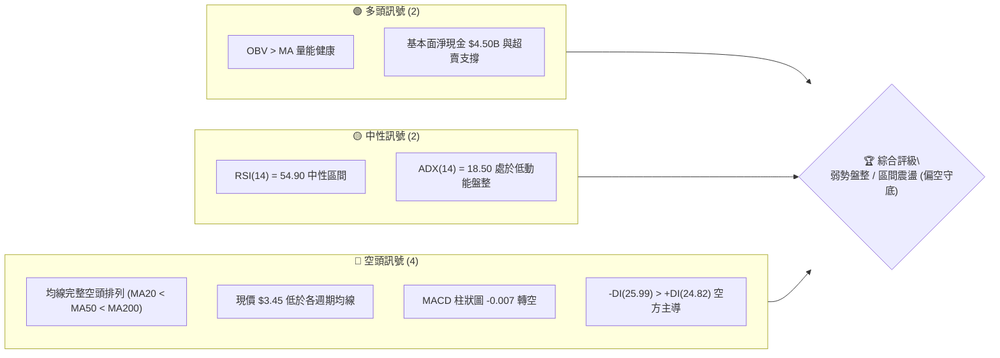
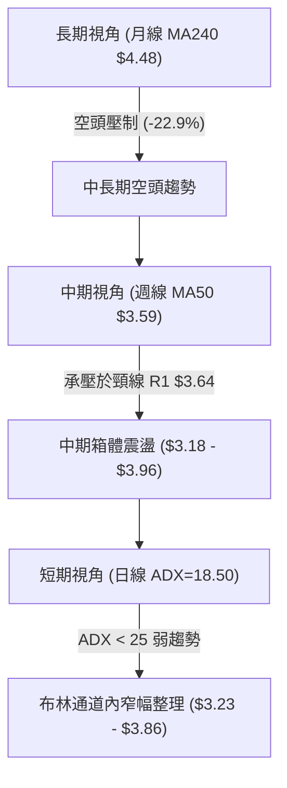
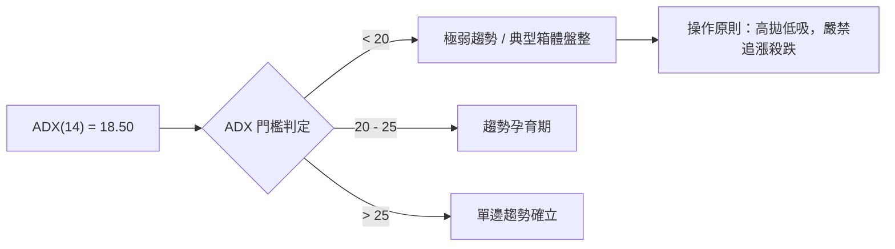
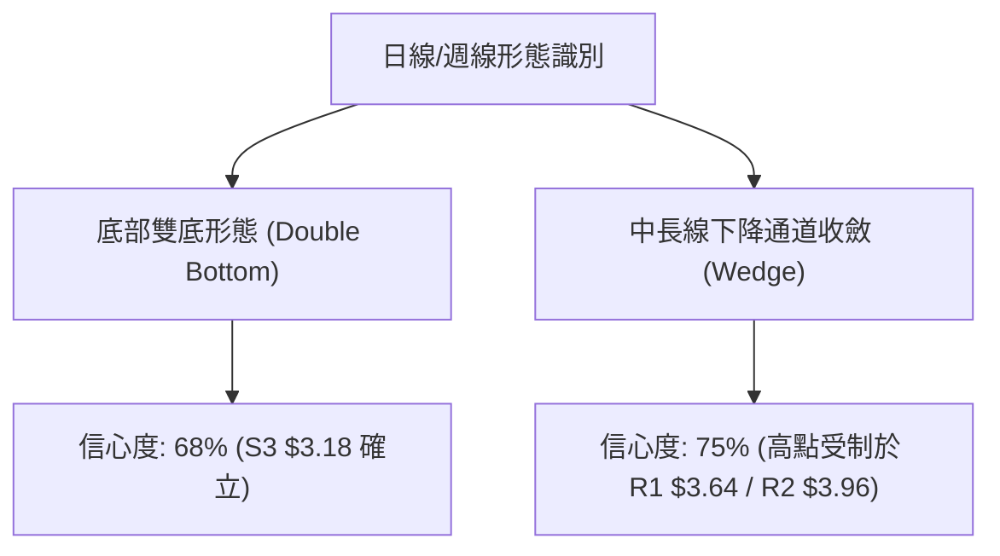
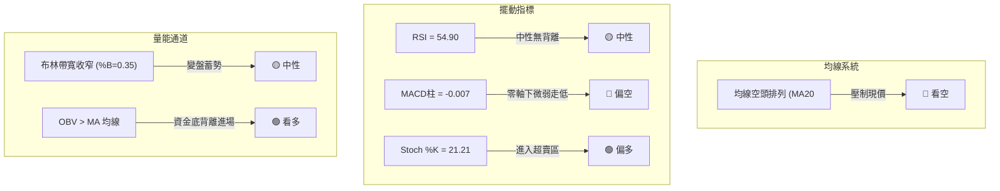
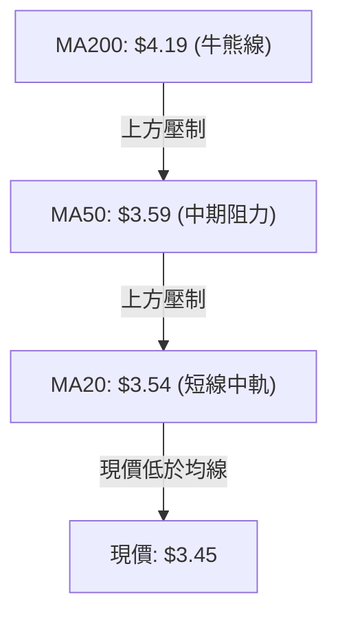
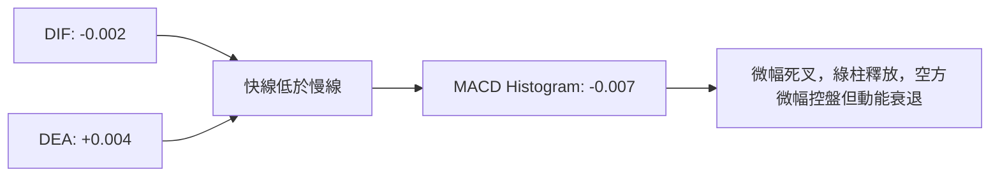
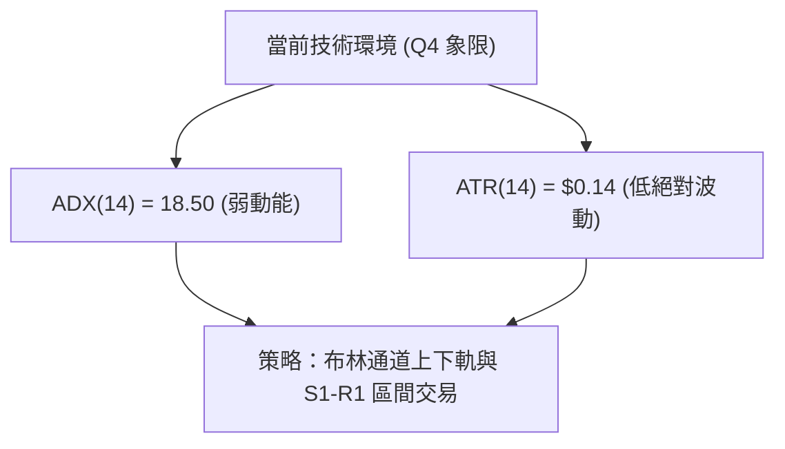
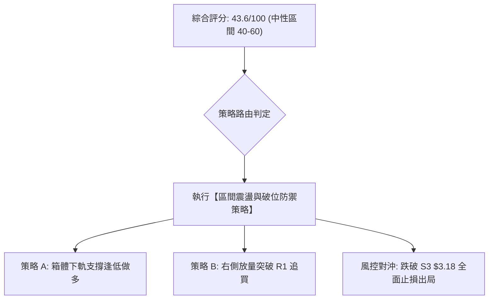
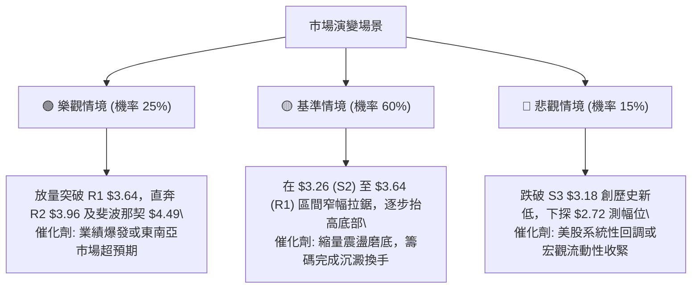

# GRAB 技術分析報告

> **報告日期**：2026-08-18 ｜ **語言**：繁體中文 ｜ **數據來源**：Yahoo Finance ｜ **當前價格**：$3.45

---

## 目錄

| 章節 | 內容 |
|------|------|
| [1. 技術面概覽](#1-技術面概覽) | 訊號儀表板、核心指標、評分卡 |
| [2. 趨勢分析](#2-趨勢分析) | 多時框趨勢、長中短期走勢 |
| [3. 圖表形態分析](#3-圖表形態分析) | 形態識別、K線組合、目標價 |
| [4. 支撐與阻力](#4-支撐與阻力) | 關鍵價位、斐波那契回調 |
| [5. 技術指標深度解讀](#5-技術指標深度解讀) | MA/RSI/MACD/布林/成交量 |
| [6. 動能與波動率](#6-動能與波動率) | 動能評估、ATR、Beta |
| [7. 多時框架總結](#7-多時框架總結) | 時框架評分矩陣 |
| [8. 交易策略建議](#8-交易策略建議) | 多空策略、風險報酬比 |
| [9. 風險提示與監控](#9-風險提示與監控) | 監控指標、風險場景 |

---

## 1. 技術面概覽

### 🎯 技術訊號儀表板



### 📊 核心指標速覽表

| 指標類別 | 指標名稱 | 當前數值 | 訊號 | 解讀 |
|----------|----------|----------|------|------|
| **價格** | 當前價格 | $3.45 | 🔴 | 位於 52 週區間底部的 7.8%，處於絕對歷史低檔 |
| **均線** | MA20 | $3.54 | 🔴 | 價格低於 20 日線（-2.60%），短線承壓 |
| **均線** | MA50 | $3.59 | 🔴 | 價格低於 50 日線（-3.60%），中期趨勢疲軟 |
| **均線** | MA200 | $4.19 | 🔴 | 價格遠低於牛熊分界線（-17.66%），長期空頭主導 |
| **動能** | RSI(14) | 54.90 | 🟡 | 位於中性平衡區，無明顯頂底背離 |
| **動能** | MACD(12,26,9) | -0.002 (柱: -0.007) | 🔴 | 快慢線位於零軸下方且柱狀圖翻負，短線動能偏弱 |
| **動能** | Stoch %K / %D | 21.21 / 36.36 | 🟡 | 逼近超賣區，短線隨時有跌深反彈契機 |
| **趨勢** | ADX(14) | 18.50 | 🟡 | ADX < 25 表明無強烈單邊趨勢，進入箱體震盪盤整 |
| **通道** | 布林帶 (%B) | 0.35 (軌道 $3.23-$3.86) | 🟡 | 運行於中軌下方但高於下軌，窄幅收斂中 |
| **波動** | ATR(14) | $0.14 (4.09%) | 🟢 | 波動率適中，適合設定緊密風控邊界 |
| **量能** | OBV 趨勢 | OBV > MA | 🟢 | 能量潮強於均線，底部有主力吸籌沉澱跡象 |

### 🏆 技術評分卡

```
╔══════════════════════════════════════════════════════════════╗
║                技術評分卡 — GRAB (2026-08-18)                ║
╠══════════════════════════════════════════════════════════════╣
║ 趨勢強度      ██████░░░░░░░░░░░░░░  32/100  🔴 空頭排列弱勢  ║
║ 動能指標      █████████░░░░░░░░░░░  45/100  🟡 RSI中性偏弱   ║
║ 支撐穩定度    █████████████░░░░░░░  65/100  🟢 52W低點防守強 ║
║ 成交量配合    ████████████░░░░░░░░  60/100  🟢 OBV量能底背馳 ║
║ 形態完整度    ████████░░░░░░░░░░░░  40/100  🟡 箱體收斂未成  ║
║ 均線排列      ████░░░░░░░░░░░░░░░░  20/100  🔴 完全空頭排列  ║
╠══════════════════════════════════════════════════════════════╣
║ 綜合評分      ████████░░░░░░░░░░░░  43.6/100  🟡 弱勢築底區間║
╚══════════════════════════════════════════════════════════════╝
```

---

## 2. 趨勢分析

### 🌐 多時框趨勢分析



### 📈 長期趨勢 — 12個月走勢圖（Unicode）

```
GRAB 月線走勢圖（2025-09 至 2026-08）
價格軸 ($)
$6.02 ┤ ● 2025-09 (波段高點)
$5.45 ┤    ● 2025-11
$4.99 ┤       ● 2025-12
$4.30 ┤          ● 2026-01
$3.82 ┤                   ● 2026-04
$3.45 ┤                               ● 2026-08 (現價: $3.45)
$3.18 ┤                         ● (52W最低點 $3.18)
      └──────────────────────────────────────────────────────────
        09  10  11  12  01  02  03  04  05  06  07  08 (月份)
```

#### 走勢特徵分析表格

| 階段區間 | 月份起訖 | 起始與結束收盤 | 漲跌幅 | 走勢特徵解讀 |
|----------|----------|----------------|--------|--------------|
| **高檔回落期** | 2025/09 - 2025/12 | $6.02 → $4.99 | -17.11% | 觸及 52W 高點 $6.62 後迅速拉回，獲利了結賣壓湧現 |
| **主跌波段** | 2025/12 - 2026-03 | $4.99 → $3.66 | -26.65% | 跌破 MA200，呈現單邊空頭下跌，量能逐漸萎縮 |
| **低檔築底期** | 2026/04 - 2026/08 | $3.82 → $3.45 | -9.68% | 於 $3.18-$3.93 間構築大型箱體，波動收斂，ADX 下降 |

### 📊 中期趨勢（週線分析）

```
中期阻力與支撐區間結構：
阻力區： $3.96 - $4.06  (2026-07 週波段高點聚類 / 78.6% 斐波那契 $3.92)
────────▲──────────────────────────────────────────────────
震盪中樞：$3.54 - $3.59  (MA20 / MA50 均線重疊密集區)
────────▼──────────────────────────────────────────────────
支撐區： $3.18 - $3.39  (52W 低點 S3 $3.18 / 雙底頸線支撐 S1 $3.39)
```

近期 20 週數據顯示，股價在 2026-04-19 衝高至 $4.21（RSI 達 82.7 超買）後回落，並於 2026-06-14 探底 $3.30，隨後於 2026-07-12 反彈至 $3.93，目前回落至 $3.45。整體高點下移、低點上移，呈現對稱三角形收斂型態。

### ⚡ 趨勢強度評估（ADX 解讀）



| 指標變數 | 當前讀數 | 狀態判定 | 交易指引 |
|----------|----------|----------|----------|
| **ADX(14)** | 18.50 | 弱趨勢 / 震盪行情 (<25) | 趨勢指標失真，以震盪振盪指標及布林軌道為準 |
| **+DI(14)** | 24.82 | 多方動能 | 與 -DI 咬合，多方缺乏爆發力 |
| **-DI(14)** | 25.99 | 空方動能 | 略高於 +DI，空方微弱佔優，但無主跌推動力 |

---

## 3. 圖表形態分析

### 🔍 形態識別系統



#### 圖表形態信心度與目標價評估表

| 形態類別 | 信心度 | 判斷依據（引用數據） | 完成度 | 目標價（附嚴格計算式） |
|----------|--------|----------------------|--------|------------------------|
| **底部箱體雙底** | 68% | 兩次波段低點分別為 52W 低點 $3.18 (2026-05) 與 $3.30 (2026-06)，頸線位於 R1 $3.64 | 60% | 頸線 $3.64 + 形態高度($3.64 - $3.18 = $0.46) = **$4.10** (接近 R3 $4.06) |
| **收斂三角區間** | 72% | 上軌由 2026-04 高點 $4.21 與 2026-07 高點 $3.93 連線；下軌由 $3.18 與 $3.30 連線 | 85% | 三角形基底突破：破 R2 $3.96 測斐波那契 61.8% **$4.49** |
| **指標型排列** | 90% | 均線系統呈標準空頭排列 (MA20 $3.54 < MA50 $3.59 < MA200 $4.19) | 100% | 均線反壓第一目標為 MA20 **$3.54**，次目標 MA50 **$3.59** |

### 🕯️ 重要K線形態分析

| 月份 / 週別 | 收盤價 | K線形態特徵 | 技術解讀 | 訊號 |
|-------------|--------|-------------|----------|------|
| **2026-04-19** | $4.21 | 帶量長陽線 (週量 321M) | 突破前波高點，RSI 衝高至 82.7 出現嚴重超買 | 🟢 衝高力竭 |
| **2026-06-14** | $3.30 | 低檔長下影十字星 | 逼近 52W 低點 $3.18，測試 S2 $3.26 獲強支撐 | 🟢 築底訊號 |
| **2026-07-12** | $3.93 | 倒錘頭阻力線 (高點回落) | 挑戰 R2 $3.96 失敗，上影線沉重 | 🔴 遇阻回落 |
| **2026-08-23** | $3.45 | 縮量小陰線 (週量 76M) | 成交量急劇萎縮，空方動能減竭，進入觀望整理 | 🟡 變盤收斂 |

### 📉 ASCII 走勢形態示意圖

```
      GRAB 中期雙底與收斂三角示意圖
      $4.21 (2026-04 高點)
        ▲
       / \             $3.93 (2026-07 高點)
      /   \              ▲
     /     \            / \
    /       \          /   \     R1 頸線: $3.64 ═════════
   /         \        /     \    現價:   $3.45 ─ ─ ─ ─ ─
  /           ▼      /       ▼
 /          $3.30   /      $3.31 (低點逐步抬高)
▼             (底2)▼
$3.18 (底1, 52W低點)
└───────────────────────────────────────────────► 時間軸
```

### 🎯 形態目標價計算

1. **雙底形態測幅（若向上有效放量突破頸線 R1 $3.64）**：
   - 形態底部低點 = $3.18
   - 形態頸線位置 = $3.64
   - 形態垂直垂直高度 = $3.64 - $3.18 = $0.46
   - 理論最小量度目標價 = 頸線 $3.64 + $0.46 = **$4.10**（高度契合數據阻力 R3 $4.06 與 MA200 $4.19 聚類區）。
2. **破位下行測幅（若跌破 52W 低點 S3 $3.18）**：
   - 跌破確認點 = $3.18
   - 下行空間量度 = $3.18 - $0.46 = **$2.72**。

---

## 4. 支撐與阻力

### 🗺️ 關鍵價位分布圖（Unicode）

```
GRAB 價位結構分布圖
══════════════════════════════════════════════════════════════
$4.49 ║████████████████████████║ 斐波那契 61.8% 強阻力
$4.19 ║████████████████████    ║ MA200 牛熊分界反壓
$4.06 ║████████████████████████║ 強阻力 R3 (形態測幅目標)
$3.96 ║████████████████        ║ 關鍵阻力 R2 (前波反彈高點)
$3.64 ║████████████████████████║ 關鍵頸線阻力 R1 (MA10 $3.64 重疊)
$3.54 ║▓▓▓▓▓▓▓▓▓▓▓▓▓▓▓▓        ║ 布林中軌 / MA20 短線反壓
$3.45 ╠════════════════════════╣ ◄ 當前市價 ($3.45)
$3.39 ║▓▓▓▓▓▓▓▓▓▓▓▓▓▓▓▓        ║ 近期第一支撐 S1 (-1.74%)
$3.26 ║████████████████        ║ 波段關鍵支撐 S2 (-5.65%)
$3.18 ║████████████████████████║ 52週歷史鐵底 S3 (-7.83%)
══════════════════════════════════════════════════════════════
```

### 🚧 阻力位分析表

| 阻力級別 | 價位 | 形成原因 | 突破難度 | 重要性 |
|----------|------|----------|----------|--------|
| **R1 (弱阻力)** | $3.64 | 近一年波段高點聚類、MA10 重疊位 | 🟡 中等 (需日成交量 > 48M) | 短線強弱分水嶺 |
| **R2 (強阻力)** | $3.96 | 2026-07 波段反彈高點聚類、斐波那契 78.6% ($3.92) 上緣 | 🔴 偏高 (上方套牢籌碼密集) | 中期反轉確認點 |
| **R3 (極強阻力)** | $4.06 | 近一年重大高點聚類、雙底量度目標 ($4.10) 阻力帶 | 🔴 極高 (面臨 MA200 $4.19 壓制) | 長期牛熊轉換關卡 |

### 🛡️ 支撐位分析表

| 支撐級別 | 價位 | 形成原因 | 守住機率 | 重要性 |
|----------|------|----------|----------|--------|
| **S1 (初級支撐)** | $3.39 | 近一年波段低點聚類，距現價僅 -1.74% | 🟢 75% | 短線多頭防守第一線 |
| **S2 (關鍵支撐)** | $3.26 | 2026-06 次低點聚類，布林下軌 $3.23 緩衝區 | 🟢 85% | 中期震盪箱底邊界 |
| **S3 (核心鐵底)** | $3.18 | 52週絕對最低價（100.0% 斐波那契回調位） | 🟢 92% | 多頭最後防線，失守將引發停損潮 |

### 📐 斐波那契回調位分析

依據 52 週完整波動區間（低點 $3.18 至 高點 $6.62，垂直落差 $3.44）計算：

| 回調比例 | 斐波那契價位 | 技術意涵與現價位置解讀 |
|----------|--------------|------------------------|
| **0.0%** | $6.62 | 52 週歷史高點，長期終極目標 |
| **23.6%** | $5.81 | 分析師平均目標價 ($5.86) 重疊區 |
| **38.2%** | $5.31 | 籌碼密集套牢區 |
| **50.0%** | $4.90 | 長期多空對稱中軸 |
| **61.8%** | $4.49 | 黃金分割強壓力位，MA240 ($4.48) 匯聚處 |
| **78.6%** | $3.92 | 反彈重要分水嶺，接近 R2 $3.96 |
| **100.0%** | $3.18 | 52 週最低點，絕對防禦底部 |

**現價定位解讀**：現價 $3.45 位於 **78.6% ($3.92)** 與 **100.0% ($3.18)** 之間，屬於深度回調後的極度超跌區域。下距底部 $3.18 僅剩 $0.27 (7.83%) 空間，向下邊際風險顯著小於向上修復至 61.8% ($4.49) 的潛在空間。

---

## 5. 技術指標深度解讀

### 🎛️ 指標訊號總覽



### 📈 移動平均線排列分析



- **均線排列狀態**：MA5 ($3.59) = MA50 ($3.59) > MA20 ($3.54) < MA200 ($4.19)，長期呈現完整空頭排列。
- **乖離率分析**：現價距離 MA200 乖離率達 -17.66%，距離 MA240 ($4.48) 達 -22.94%，處於長期技術性負乖離過大狀態，具備均值回歸修復動能。

### 📉 RSI(14) 分析

```
RSI(14) 讀數：54.90
[0] ────────── [30 超賣] ─────●──── [70 超買] ────────── [100]
                             54.90 (中性平衡區)
進度條：███████████░░░░░░░░░ 54.9%
```

- **背離檢驗**：觀察週線走勢，2026-06-14 股價創波段低點 $3.30 時 RSI 為 37.9，2026-07-26 股價二度探底 $3.31 時 RSI 降至 25.9，日線當前 RSI 位於 54.90，**無明顯頂背離或底背離**，屬於健康的區間震盪重置狀態。

### 📊 MACD(12,26,9) 訊號解讀



MACD 快慢線均緊貼零軸（DIF: -0.002, DEA: 0.004），柱狀圖讀數極小 (-0.007)，表明市場並無實質單邊拋壓，更多為縮量陰跌與牛皮盤整特徵。

### 📦 布林通道分析

```
GRAB 布林通道 (20, 2) 結構圖
$3.86 ┬─────────────────────────────── 上軌 (強阻力帶，緊貼 R2)
      │
$3.54 ┼ - - - - - - - - - - - - - - - 中軌 (MA20，即時反壓)
      │      ● 現價: $3.45 (%B = 0.35)
$3.23 ┴─────────────────────────────── 下軌 (通道防守線，緊貼 S2)
```

- **帶寬特徵**：通道寬度 ($3.86 - $3.23 = $0.63) 呈現收斂擠壓（Squeeze），預示 2-4 週內將出現方向性突破。
- **%B 位置**：%B 為 0.35，處於中軌與下軌之間，未觸及極端超賣，下軌 $3.23 與支撐 S2 $3.26 構成雙重防禦。

### 💹 成交量分析（量價配合度）

- **量比與均量**：最新成交量為 39.33M，相對於 20 日均量 48.11M（量比 0.82x）與 50 日均量 48.64M 呈現明顯縮量，說明回落過程缺乏恐慌性拋盤。
- **OBV 能量潮判斷**：官方技術指標標註「**OBV > MA → 量能支撐上漲**」。在股價震盪磨底期間，OBV 始終維持在均線之上，呈現籌碼鎖定良好的「量先於價」底部蓄勢形態。

---

## 6. 動能與波動率

### ⚡ 動能評估四象限

| 象限代號 | 動能維度 | 波動率維度 | 當前狀態標註 | 戰術應對評估 |
|----------|----------|------------|--------------|--------------|
| **Q1** | 強動能 (ADX>25) | 高波動 (ATR>5%) | — | 趨勢突破追蹤策略 |
| **Q2** | 強動能 (ADX>25) | 低波動 (ATR<3%) | — | 穩健單邊趨勢加碼 |
| **Q3** | 弱動能 (ADX<25) | 高波動 (ATR>5%) | — | 寬幅洗盤，嚴防假突破 |
| **Q4 (當前)** | **弱動能 (ADX=18.5)** | **適中/低波動 (ATR=4.09%)** | **✓ 當前所處位置** | **箱體區間高拋低吸，嚴格止損** |



### 📊 ATR 波動率分析

- **ATR(14) 讀數**：$0.14（佔當前股價 4.09%）。
- **風控乘數指引**：
  - 日內波動容忍度 (1.0x ATR) = $0.14
  - 短線波段止損距離 (1.5x ATR) = $0.21
  - 寬鬆中期止損距離 (2.0x ATR) = $0.28
- **操作意義**：若以現價 $3.45 建立多頭部位，合理的技術止損位設於現價下浮 1.5x ATR（$3.45 - $0.21 = $3.24），此點位精準落於 S2 $3.26 與布林下軌 $3.23 之間。

### 📐 Beta 與市場相關性

- **Beta 係數**：0.89（低於美股大盤基準 1.00）。
- **市場特徵解讀**：GRAB 對標普 500 指數的系統性波動敏感度較低，更多受到東南亞區域經濟、公司自身轉虧為盈基本面（EPS TTM $0.11，淨利潤率 16.0%）及機構持股動向（機構持股達 67.4%）所主導。

---

## 7. 多時框架總結

### 📋 時框架評分表

| 時框架 | 趨勢方向 | 動能指標 | 均線排列 | 形態結構 | 綜合評分 | 建議戰術 |
|--------|----------|----------|----------|----------|----------|----------|
| **長期 (月線)** | 🔴 偏空 | RSI 54.9 中性 | 空頭 (現價<MA240) | $6.62 回落後的超跌修復 | 35/100 | 長期分批逢低配置 |
| **中期 (週線)** | 🟡 震盪 | MACD 零軸震盪 | 空頭排列壓制 | $3.18-$3.96 底部大箱體 | 48/100 | 箱體邊界高拋低吸 |
| **短期 (日線)** | 🟡 弱勢盤整 | Stoch 超賣/ADX弱 | 短均線糾纏承壓 | 窄幅三角收斂末端 | 45/100 | 等待方向突破或下軌低吸 |

### 🔲 綜合訊號矩陣

```
時框訊號收斂一致性檢驗：
┌───────────┬─────────────┬─────────────┬─────────────┐
│ 分析維度  │ 長期 (Monthly)│ 中期 (Weekly) │ 短期 (Daily) │
├───────────┼─────────────┼─────────────┼─────────────┤
│ 趨勢方向  │ 🔴 空頭壓制 │ 🟡 箱體震盪 │ 🟡 弱勢收斂 │
│ 均線系統  │ 🔴 顯著壓制 │ 🔴 MA50 壓制│ 🔴 MA20 壓制│
│ 動能指標  │ 🟡 中性平衡 │ 🟡 零軸微跌 │ 🟢 隨機超賣 │
│ 量能配合  │ 🟢 OBV 支撐 │ 🟢 底部縮量 │ 🟡 量比 0.82 │
└───────────┴─────────────┴─────────────┴─────────────┘
```

### ⚖️ 多時框收斂結論

依據多時框收斂規則（規則 14）：當前 **ADX(14) = 18.50 < 25**，市場明確處於**盤整行情（Range-bound Market）**而非單邊趨勢行情。

因此，交易決策應**以日線與週線布林通道上下軌（$3.23 - $3.86）及波段支撐阻力（S1 $3.39 / S2 $3.26 至 R1 $3.64 / R2 $3.96）為主要操作區間**，中長期 MA200 ($4.19) 僅作為反彈極限阻力參考。

**唯一方向性結論**：**中性觀望偏低吸（區間操作，下軌吸納、上軌分批止盈）**。

---

## 8. 交易策略建議

### 🗺️ 策略決策流程圖



### 🧭 策略路由

**當前主策略方向 = 中性震盪箱體操作（依綜合評分 43.6/100 分流）**

由於綜合評分處於 40–60 區間且 ADX < 25，技術面不支持盲目單邊追多或追空，策略核心聚焦於以明確支撐位 S1/S2 為依託的逢低吸納，以及突破頸線 R1 的右側加碼。

### 🎯 價格情境階梯（Price Scenarios）

| 觸發條件 | 第一目標 (T1) | 第二目標 (T2) | 情境技術含義 |
|----------|---------------|---------------|--------------|
| **向上突破 R1 $3.64** | R2 $3.96 | R3 $4.06 | 突破 20 日/50 日均線反壓，雙底形態確立 |
| **站穩現價 $3.45 區間** | BB中軌 $3.54 | R1 $3.64 | 延續布林通道內部震盪整理 |
| **向下跌破 S1 $3.39** | S2 $3.26 | S3 $3.18 | 回測箱體下沿支撐，尋求二次築底 |

### 📊 情境機率分佈

| 價格情境 | 發生機率 | 主要技術與量化依據 |
|----------|----------|--------------------|
| **情境一：箱體震盪反彈** | **60%** | OBV 量能健康、Stoch 超賣、下距 52W 低點僅 7.8%、基本面淨現金充裕 |
| **情境二：窄幅持續橫盤** | **25%** | ADX(14) = 18.50 極度低迷、成交量低於均量 (量比 0.82x)、均線糾纏 |
| **情境三：向下破位探底** | **15%** | 均線空頭排列未破、MACD 柱狀圖微負、-DI 仍略高於 +DI |

### 🟢 主策略詳情

| 策略要素 | 策略 A（左側：箱體下軌低吸多單） | 策略 B（右側：突破頸線順勢多單） |
|----------|----------------------------------|----------------------------------|
| **適用時機** | 價格回踩 S1 支撐確認不破時 | 價格帶量突破 R1 阻力確認時 |
| **進場條件** | 現價 $3.45 或回踩 S1 $3.39 企穩 | 日收盤價有效站上 R1 $3.64 (日量>48M) |
| **進場價格** | **$3.39** (現價 $3.45 可建底倉) | **$3.65** |
| **目標價 T1** | **$3.64** (R1 阻力位, +7.37%) | **$3.96** (R2 阻力位, +8.49%) |
| **目標價 T2** | **$3.96** (R2 阻力位, +16.81%) | **$4.06** (R3 阻力位, +11.23%) |
| **止損價格** | **$3.26** (跌破 S2 止損, -3.83%) | **$3.54** (跌回 MA20 止損, -3.01%) |
| **風險報酬比** | **1 : 2.56** (以目標 T2 計算達 1:4.39) | **1 : 2.82** (以目標 T2 計算達 1:3.73) |
| **成功機率** | 65% | 60% |
| **建議倉位** | 10% - 15% 投資組合資金 | 15% - 20% 投資組合資金 |

### 🔴 反向風險觸發點（對沖提示）

- **關鍵反轉風險點**：若日 K 線收盤價**實體跌破 52 週最低點 S3 $3.18**，說明箱體築底徹底失敗，空頭開啟新一輪主跌段。
- **風控處置原則**：任何多頭部位必須無條件在 **$3.17** 觸發硬止損離場；激進型交易者可在此處反手建立空頭避險倉位，下行目標測幅至 **$2.72**。

### ⭐ 整體訊號強度評星

```
做多訊號強度：★★★☆☆  (3/5星 - 底部支撐強但缺乏突破動能)
做空訊號強度：★★☆☆☆  (2/5星 - 空頭排列但接近歷史鐵底且超賣)
整體可信度：  ★★★★☆  (4/5星 - 數據完整，指標收斂一致)
```

---

## 9. 風險提示與監控

### ✅ 關鍵監控指標 Checklist

```
╔══════════════════════════════════════════════════════════════╗
║               GRAB 每日交易監控清單 (Checklist)              ║
╠══════════════════════════════════════════════════════════════╣
║ [ ] 1. 價格是否跌破初級支撐 S1 $3.39？                       ║
║ [ ] 2. 日成交量是否放大突破 48.11M (突破頸線需量能配合)？     ║
║ [ ] 3. MACD 柱狀圖是否由負 (-0.007) 翻正產生金叉？           ║
║ [ ] 4. RSI(14) 是否站穩 50 之上並向 60 發起衝擊？            ║
║ [ ] 5. ADX(14) 是否由 18.50 向上回升突破 25 (趨勢啟動訊號)？║
║ [ ] 6. 核心鐵底 S3 $3.18 是否完好無損？                      ║
╚══════════════════════════════════════════════════════════════╝
```

### ⚠️ 風險場景分析



### 🛡️ 風險管理重要提醒

1. **嚴禁高槓桿重倉**：雖然 GRAB 基本面強勁（持現金 $6.53B，淨現金 $4.50B，華爾街 25 位分析師給出 Strong Buy 且平均目標價達 $5.86），但在技術面均線未修復前，單一標的倉位不得超過總投資組合的 **15%**。
2. **波動率保護**：當前 ATR 為 $0.14，設定止損時必須預留至少 1.5 倍 ATR 空間（約 $0.21），避免在窄幅震盪中被隨機噪聲洗盤出場。
3. **分批進場原則**：建議採取「3-4-3」分批進場法（現價 $3.45 建 3 成底倉，回調 S1 $3.39 加 4 成，突破 R1 $3.64 確認後補滿 3 成）。

---

## 📋 報告總結

```
╔══════════════════════════════════════════════════════════════╗
║                    GRAB 技術分析報告總結                     ║
╠══════════════════════════════════════════════════════════════╣
║ 報告日期：2026-08-18                                         ║
║ 當前價格：$3.45                                              ║
║ 分析評級：🟡 弱勢磨底 / 箱體震盪（43.6分）                   ║
║                                                              ║
║ 關鍵結論：                                                   ║
║ ├─ 長期趨勢：🔴 空頭承壓 (現價遠低於 MA200 $4.19 / MA240)    ║
║ ├─ 中期趨勢：🟡 箱體收斂 ($3.18 底部 vs $3.96 頂部)          ║
║ ├─ 短期趨勢：🟡 弱勢盤整 (ADX=18.50，布林帶寬收窄蓄勢)       ║
║ ├─ 關鍵支撐：S1 $3.39 │ S2 $3.26 │ S3 $3.18 (52W歷史底)      ║
║ ├─ 關鍵阻力：R1 $3.64 │ R2 $3.96 │ R3 $4.06                 ║
║ └─ 分析師目標：平均 $5.86 (潛在上行空間 +69.86%)             ║
║                                                              ║
║ 最優策略組合：                                               ║
║ 1. 🥇 最佳機會：於 S1 $3.39 - $3.45 區間逢低佈局，博弈向上   ║
║                回抽 R1 $3.64 及 R2 $3.96，止損設於 S2 $3.26。║
║ 2. 🥈 次選機會：等待日線帶量收破 R1 $3.64 後右側順勢追買，  ║
║                目標直指 R2 $3.96 與 R3 $4.06。               ║
║ 3. 🥉 保守選擇：場外觀望，直至 ADX > 25 且均線黃金交叉再行進場║
╚══════════════════════════════════════════════════════════════╝
```

---

> ⚠️ **免責聲明**：本報告為技術分析研究，所有數據及估算均基於歷史價格與量化技術指標。本報告**僅供學術研究與投資參考**，**不構成任何要約或投資買賣建議**。金融市場具有高度風險，投資人應獨立評估風險並自負盈虧。

---

*報告生成時間：2026-08-18 ｜ 數據來源：Yahoo Finance ｜ 分析框架：多時框技術分析*