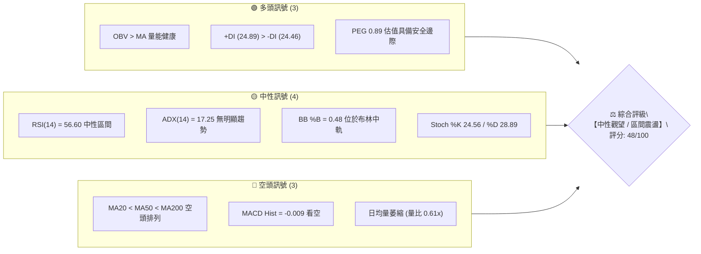
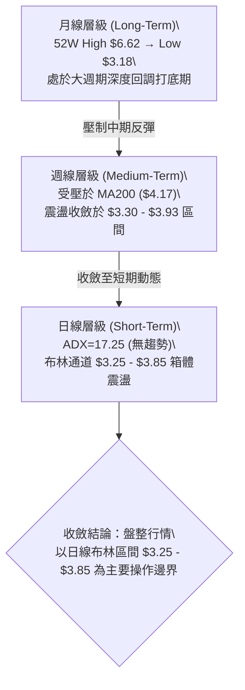
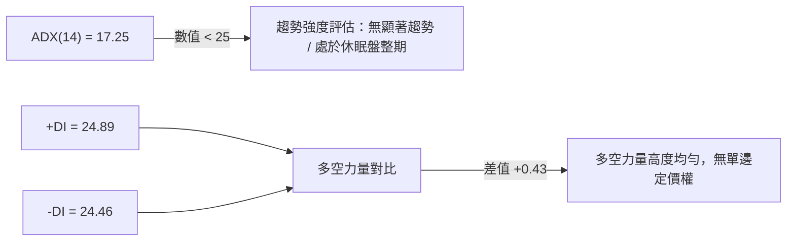
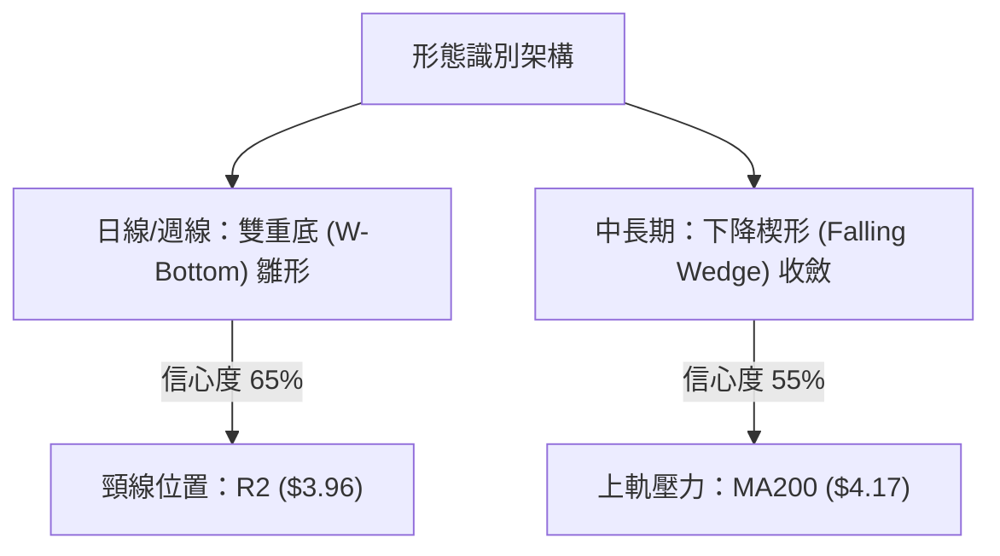
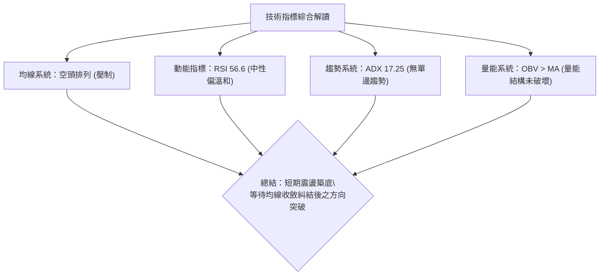
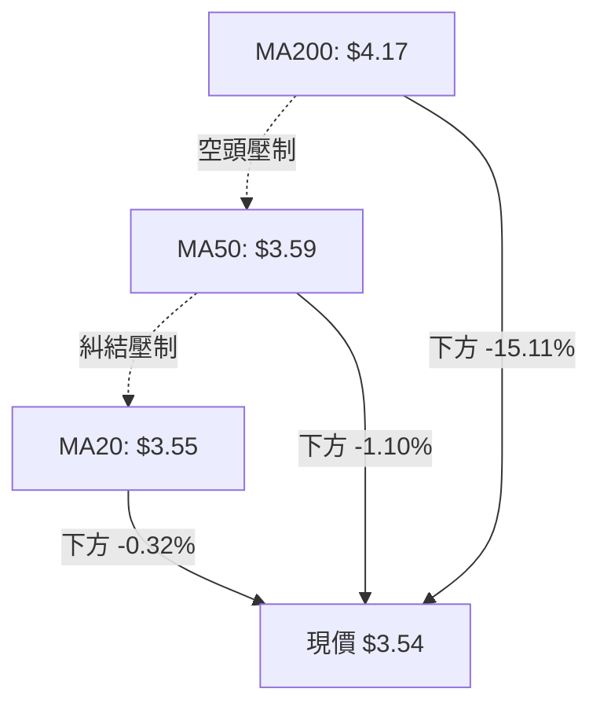
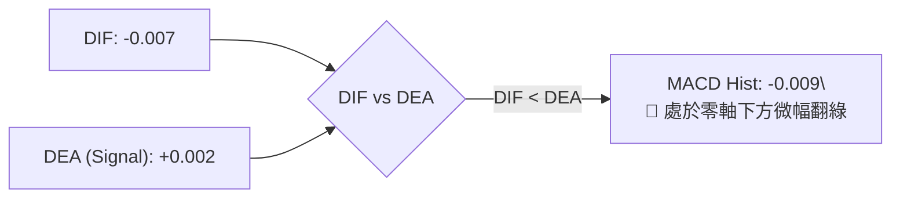
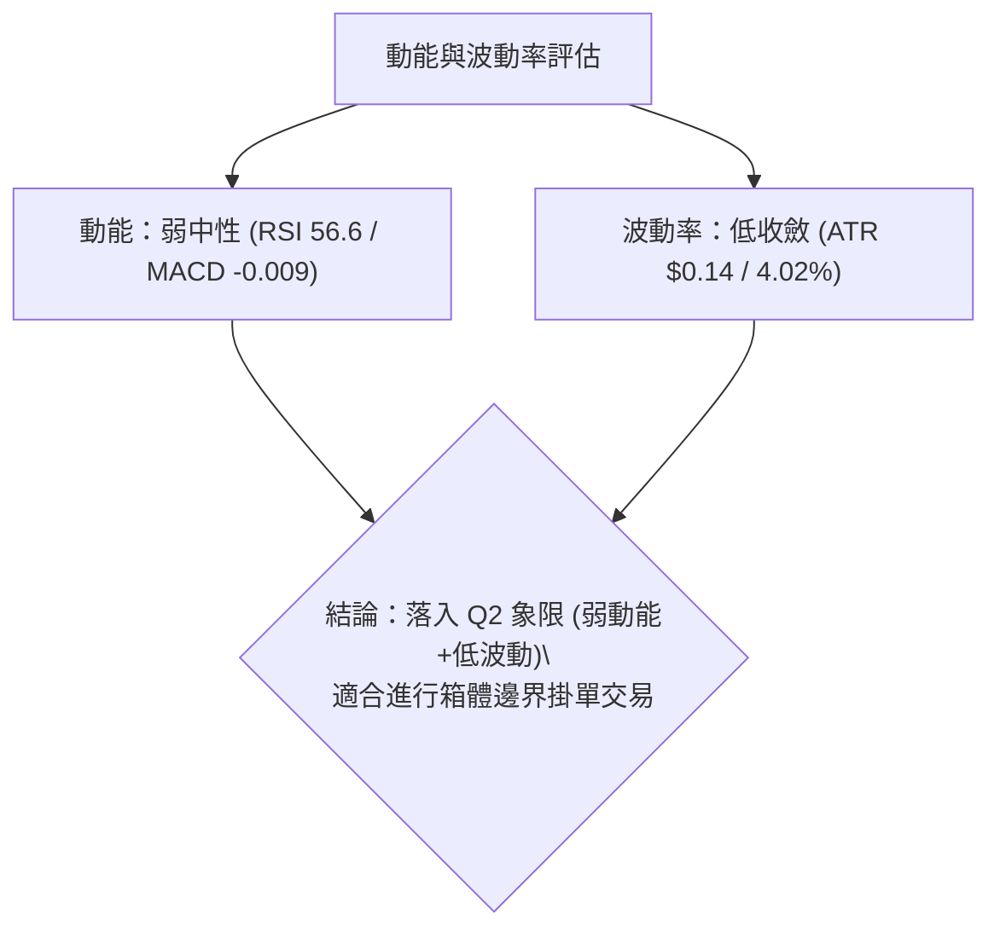
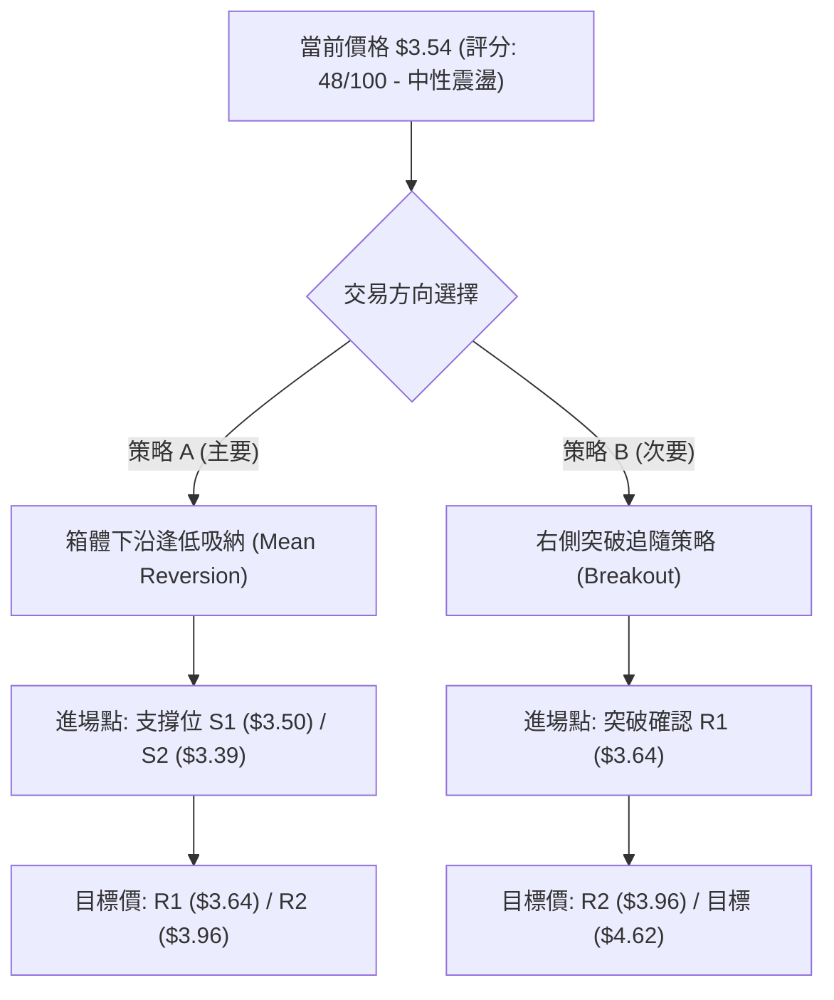
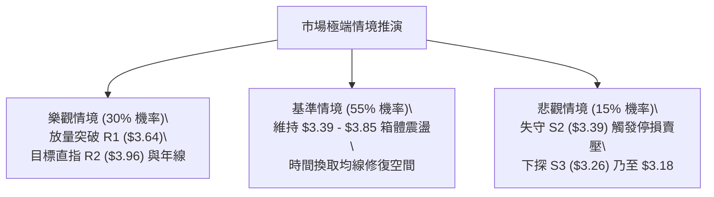

# GRAB 技術分析報告

> **報告日期**：2026-08-19 ｜ **語言**：繁體中文 ｜ **數據來源**：Yahoo Finance ｜ **當前價格**：$3.54

---

## 目錄

| 章節 | 內容 |
|------|------|
| [1. 技術面概覽](#1-技術面概覽) | 訊號儀表板、核心指標、評分卡 |
| [2. 趨勢分析](#2-趨勢分析) | 多時框趨勢、長中短期走勢、ADX強弱 |
| [3. 圖表形態分析](#3-圖表形態分析) | 形態識別、K線組合、目標價推算 |
| [4. 支撐與阻力](#4-支撐與阻力) | 關鍵價位、斐波那契回調結構 |
| [5. 技術指標深度解讀](#5-技術指標深度解讀) | MA/RSI/MACD/布林/成交量 |
| [6. 動能與波動率](#6-動能與波動率) | 動能評估、ATR、Beta 與相關性 |
| [7. 多時框架總結](#7-多時框架總結) | 時框架評分矩陣、多時框收斂 |
| [8. 交易策略建議](#8-交易策略建議) | 多空策略路由、風險報酬比、價格階梯 |
| [9. 風險提示與監控](#9-風險提示與監控) | 監控指標、風險場景與倉位控管 |
| [📋 報告總結](#-報告總結) | 全文核心精華摘要 |

---

## 1. 技術面概覽

### 🎯 技術訊號儀表板



### 📊 核心指標速覽表

| 指標類別 | 指標名稱 | 當前數值 | 訊號 | 解讀 |
|----------|----------|----------|------|------|
| **價格** | 當前價格 | $3.54 | 🟡 中性 | 處於 52 週區間之 10.5% 低檔位置，築底整理中 |
| **均線** | MA20 | $3.55 | 🟡 中性 | 現價略低於短期中樞 (-0.32%)，爭奪短期定價權 |
| **均線** | MA50 | $3.59 | 🔴 偏空 | 股價受壓於中期趨勢線下方 (-1.10%)，上方層層受阻 |
| **均線** | MA200 | $4.17 | 🔴 空頭 | 距離年線達 -15.11%，中長期仍處於空頭壓制格局 |
| **動能** | RSI(14) | 56.60 | 🟡 中性 | 動能處於中性常態分布，無超買或超賣極端現象 |
| **動能** | MACD Hist | -0.009 | 🔴 看空 | DIF(-0.007) 低於 DEA(0.002)，空頭動能微幅佔優 |
| **趨勢** | ADX(14) | 17.25 | 🟡 盤整 | 趨勢強度低於 25 臨界值，市場進入低波動箱體震盪 |
| **波動** | ATR(14) | $0.14 | 🟢 穩定 | 每日波動率為 4.02%，波動度收斂，適合區間風控 |
| **成交量** | 量比 (20日) | 0.61x | 🔴 縮量 | 今日量能 29.07M 低於均量 47.36M，市場觀望氣氛濃 |

### 🏆 技術評分卡

```
╔════════════════════════════════════════════════════════════════╗
║             技術評分卡 — GRAB (2026-08-19)                     ║
╠════════════════════════════════════════════════════════════════╣
║ 趨勢強度      ████░░░░░░░░░░░░░░░░  20/100  🔴 極弱 (ADX=17.25)║
║ 動能指標      ██████████░░░░░░░░░░  50/100  🟡 中性 (RSI=56.6) ║
║ 支撐穩定度    ██████████████░░░░░░  70/100  🟢 良好 (S1=$3.50) ║
║ 成交量配合    ████████░░░░░░░░░░░░  40/100  🔴 縮量 (量比0.61) ║
║ 形態完整度    ████████████░░░░░░░░  60/100  🟡 箱體築底中      ║
║ 均線排列      ████████░░░░░░░░░░░░  40/100  🔴 空頭排列壓制    ║
╠════════════════════════════════════════════════════════════════╣
║ 綜合評分      ██████████░░░░░░░░░░  48/100  ⚖️ 區間震盪/觀望   ║
╚════════════════════════════════════════════════════════════════╝
```

---

## 2. 趨勢分析

### 🌐 多時框趨勢分析



### 📈 長期趨勢 — 12個月走勢圖（Unicode）

```
GRAB 月線歷史走勢圖（過去12個月：2025-08 至 2026-08）
價格 ($)
$6.05 ┤          ● 2025-09 ($6.02)
$6.00 ┤             ● 2025-10 ($6.01)
$5.45 ┤                ● 2025-11 ($5.45)
$4.95 ┤ ● 2025-08 ($4.99) ● 2025-12 ($4.99)
$4.30 ┤                      ● 2026-01 ($4.30)
$4.20 ┤                         ● 2026-02 ($4.22)
$3.80 ┤                               ● 2026-04 ($3.82)   ● 2026-06 ($3.77)
$3.65 ┤                            ● 2026-03 ($3.66)
$3.50 ┤                                  ● 2026-05 ($3.54)   ● 2026-07 ($3.50)  ● 現價 $3.54 (2026-08)
$3.15 ┤                                                     
      └─────────────────────────────────────────────────────────────────────────────
        08   09   10   11   12   01   02   03   04   05   06   07   08 (月份)
```

**走勢特徵分析表格**：

| 階段區間 | 價格變動 | 區間幅度 | 走勢特徵與量價解讀 |
|----------|----------|----------|-------------------|
| **2025-08 ~ 2025-10** | $4.99 → $6.02 → $6.01 | +20.64% | 多頭主升段竭盡，構築 $6.00 之上的雙頂頭部區域 |
| **2025-11 ~ 2026-03** | $5.45 → $3.66 | -32.84% | 單邊空頭下行趨勢，跌破年線支撐，各級均線發散下壓 |
| **2026-04 ~ 2026-08** | $3.82 → $3.54 | -7.33% | 下跌動能衰竭，進入 $3.30–$3.90 箱體區間打底構築底部 |

### 📊 中期趨勢（週線分析）

```
近期週線壓力與支撐結構示意圖：
$4.21 ┼──────────────────────────────────── 週線反彈高點 (2026-04-19)
      │               ▲
$3.93 ┼───────────────┼──────────────────── 近期波段阻力 (2026-07-12) / R2 附近
      │               │ 區間震盪
$3.54 ┼───────────────●──────────────────── 當前週線收盤價 (2026-08-23)
      │               │
$3.30 ┼───────────────┴──────────────────── 近期波段雙底支撐 (2026-06-14 / 2026-07-26)
$3.18 ┴──────────────────────────────────── 52週歷史低點
```

### ⚡ 趨勢強度評估（ADX 解讀）



**ADX 趨勢強度對照表**：

| ADX 數值區間 | 趨勢強度等級 | 當前狀態 (ADX = 17.25) | 建議操作指引 |
|--------------|--------------|------------------------|--------------|
| **0 – 20** | **極弱 / 無趨勢 (Absence of Trend)** | **🟢 當前落點 (17.25)** | **嚴禁追漲殺跌，採取箱體高拋低吸** |
| **20 – 25** | 趨勢醞釀期 (Consolidation) | ⚪ 未達到 | 等待方向突破確認 |
| **25 – 40** | 明確趨勢行情 (Strong Trend) | ⚪ 未達到 | 順應趨勢進行突破跟隨 |
| **40 – 60** | 極強趨勢 (Very Strong Trend) | ⚪ 未達到 | 移動止損，波段持有 |

---

## 3. 圖表形態分析

### 🔍 形態識別系統



**形態信心度與目標價計算表**（依規則 13 & 15）：

| 形態名稱 | 信心度 | 判斷依據（引用實際數據） | 完成度 | 目標價（附嚴格計算式） |
|----------|--------|--------------------------|--------|------------------------|
| **波段雙底 (W-Bottom)** | **65%** | 兩次低點分別探至 2026-06-14 ($3.30) 與 2026-07-26 ($3.31)，均守穩 S3 ($3.26) 之上 | 70% | 由形態高度推算：頸線 R2 ($3.96) + 形態高度 ($3.96 - $3.30 = $0.66) = **$4.62** |
| **矩形箱體震盪** | **80%** | 價格在 S1 ($3.50) / S3 ($3.26) 與 R1 ($3.64) / R2 ($3.96) 之間反覆拉鋸 | 90% | 由箱體高度推算：箱頂 R1 ($3.64) + 箱體 ($3.64 - $3.39 = $0.25) = **$3.89** |
| **頭肩底形態** | **35%** | 數據中未偵測到完整右肩形態結構 | 20% | 訊號不足，僅做指標型解讀，不預設立場 |

### 🕯️ 重要K線形態分析

| 週度時間區間 | 收盤價 | K線形態特徵 | 技術解讀 | 訊號 |
|--------------|--------|-------------|----------|------|
| **2026-07-12** | $3.93 | 長上影倒轉十字星 | 向上衝擊 R2 ($3.96) 未果，遭遇強烈獲利了結賣壓 | 🔴 看空反轉 |
| **2026-07-26** | $3.31 | 下影線長十字鎚頭 | 探底至 52W 低點上方獲買盤支撐，空頭動能衰竭 | 🟢 築底訊號 |
| **2026-08-09** | $3.66 | 實體中陽線突破 MA20 | 量能放大至 310.67M，多頭發動短線反彈 | 🟢 轉強訊號 |
| **2026-08-23** | $3.54 | 窄幅縮量陰十字星 | 成交量萎縮至 105.95M，市場交投淡靜，靜待方向選擇 | 🟡 觀望整理 |

### 📉 ASCII 走勢形態示意圖

```
GRAB 日線雙底與箱體震盪形態示意圖：
$4.00 ┤                                頸線阻力區 R2 ($3.96)
$3.90 ┤           ▲ 07-12 ($3.93)     ══════════════════════
$3.80 ┤          / \
$3.70 ┤         /   \                 ▲ 08-09 ($3.66) - R1 ($3.64)
$3.60 ┤        /     \               / \
$3.54 ┼───────/───────\─────────────/───● 現價 $3.54 (BB中軌)
$3.50 ┤      /         \           /
$3.40 ┤     /           \         /
$3.30 ┤    ● 06-14 ($3.30) ● 07-26 ($3.31) ─── 雙底基底 (支撐 S2/S3 區間)
      └───────────────────────────────────────────────────
```

### 🎯 形態目標價計算

```
形態測算解析：
1. 雙底突破目標價計算：
   - 基底低點 (Bottom) = $3.30
   - 頸線位置 (Neckline) = $3.96 (R2)
   - 垂直形態高度 (H) = $3.96 - $3.30 = $0.66
   - 突破目標價 (Target 1) = 頸線 ($3.96) + H ($0.66) = $4.62

2. 箱體突破短期目標價計算：
   - 區間下沿 (Support) = $3.39 (S2)
   - 區間上沿 (Resistance) = $3.64 (R1)
   - 箱體高度 (H) = $3.64 - $3.39 = $0.25
   - 短期目標價 (Target Short) = $3.64 + $0.25 = $3.89 (貼近布林上軌 $3.85)
```

---

## 4. 支撐與阻力

### 🗺️ 關鍵價位分布圖（Unicode）

```
╔═══════════════════════════════════════════════════════════════════════╗
║                      GRAB 價位結構分布圖                              ║
╠═══════════════════════════════════════════════════════════════════════╣
║ $4.49 ║▓▓▓▓▓▓▓▓▓▓▓▓▓▓▓▓▓▓▓▓▓▓▓▓▓▓▓▓▓▓║ 斐波那契 61.8% 強阻力         ║
║ $4.17 ║██████████████████████████████║ 長期趨勢線 MA200 壓力        ║
║ $4.06 ║████████████████████          ║ 強阻力 R3 (+14.69%)          ║
║ $3.96 ║████████████████████████      ║ 波段頸線阻力 R2 (+11.77%)    ║
║ $3.85 ║░░░░░░░░░░░░░░░░░░░░░░░░      ║ 日線布林通道上軌             ║
║ $3.64 ║██████████████████████████████║ 短線關鍵阻力 R1 (+2.73%)     ║
║ $3.55 ║──────────────────────────────║ MA20 短期均線 / 布林中軌     ║
║ $3.54 ╠══════════════════════════════╣ ◄ 現價 ($3.54)                ║
║ $3.50 ║▓▓▓▓▓▓▓▓▓▓▓▓▓▓▓▓▓▓▓▓▓▓▓▓▓▓▓▓  ║ 近期關鍵支撐 S1 (-1.13%)     ║
║ $3.39 ║████████████████████          ║ 中期波段支撐 S2 (-4.24%)     ║
║ $3.26 ║██████████████████████████████║ 強支撐/波段低點 S3 (-8.05%)  ║
║ $3.25 ║░░░░░░░░░░░░░░░░░░░░░░░░      ║ 日線布林通道下軌             ║
║ $3.18 ║██████████████████████████████║ 52週歷史低點 (Fib 100.0%)    ║
╚═══════════════════════════════════════════════════════════════════════╝
```

### 🚧 阻力位分析表

| 阻力級別 | 精確價位 | 距現價幅幅 | 形成原因（波段高點聚類） | 突破難度 | 重要性 |
|----------|----------|------------|--------------------------|----------|--------|
| **R1** | **$3.64** | +2.73% | 近期多次反彈高點聚類、MA10 ($3.62) 密集共振區 | 🟡 中等 | 短線多空分水嶺 |
| **R2** | **$3.96** | +11.77% | 2026-07 波段高點聚類 ($3.93) 與雙底頸線位置 | 🔴 較高 | 中期趨勢反轉關鍵 |
| **R3** | **$4.06** | +14.69% | 2024-10 波段起漲突破口、整數關口心理防線 | 🔴 極高 | 波段獲利了結密集區 |

### 🛡️ 支撐位分析表

| 支撐級別 | 精確價位 | 距現價幅幅 | 形成原因（波段低點聚類） | 守住機率 | 重要性 |
|----------|----------|------------|--------------------------|----------|--------|
| **S1** | **$3.50** | -1.13% | 2026-08-02 波段回踩低點、整數心理支撐位 | 75% | 短線箱體下沿防線 |
| **S2** | **$3.39** | -4.24% | 2026-06 ~ 2026-07 震盪整理次低點聚類 | 85% | 中期安全緩衝墊 |
| **S3** | **$3.26** | -8.05% | 逼近 52W 低點之波段低點聚類、布林下軌共振區 | 95% | 核心多頭防守底線 |

### 📐 斐波那契回調位分析

依據 52 週波動區間（高點 **$6.62** 至低點 **$3.18**，落差 $3.44）計算之回調位：

```
斐波那契回調層級分析：
0.0%  (52W High)  : $6.62
23.6% 回調位       : $5.81
38.2% 回調位       : $5.31
50.0% 中樞平衡位   : $4.90
61.8% 黃金分割位   : $4.49
78.6% 深度回調位   : $3.92
100.0% (52W Low)  : $3.18
```

- **當前位置解讀**：現價 **$3.54** 位於 **78.6% 回調位 ($3.92)** 與 **100.0% 低點 ($3.18)** 之間的「極度超跌/築底區間」（回撤幅度高達 89.5%）。
- **技術意義**：此區間通常代表長期賣壓已基本釋放完畢，下行空間受限於 $3.18 的強烈估值底；若反彈突破 78.6% 回調位 ($3.92)，將確認中級反彈展開，進一步挑戰 61.8% ($4.49)。

---

## 5. 技術指標深度解讀

### 🎛️ 指標訊號總覽



### 📈 移動平均線排列分析



**均線狀態明細**：
- **MA5 ($3.58) / MA10 ($3.62)**：短週期均線自高點向下微幅拐頭，形成即時短壓。
- **MA20 ($3.55) / MA60 ($3.58)**：各週期均線在此窄幅空間高度糾結（差價僅 $0.03），代表市場持倉成本高度集中，變盤在即。
- **MA200 ($4.17) / MA240 ($4.47)**：長期均線向下延伸，中長期趨勢依舊受壓。

### 📉 RSI(14) 分析

```
RSI(14) 當前數值：56.60 🟡 (常態中性區間)
0 ─────────── 30 ────────────────────── 56.60 ──────── 70 ─────────── 100
[  超賣區間   ] [       多空平衡常態區間       ▲      ] [   超買區間   ]
```
- **背離分析**：日線及週線 RSI 數值與價格走勢保持一致（週線從 07-26 之 25.9 回升至目前 56.6），**無明顯頂背離或底背離**現象，反映目前價格回升屬於健康的技術性抽頭修復。

### 📊 MACD(12/26/9) 訊號解讀


- **解讀**：MACD 柱狀圖為 -0.009，顯示短線動能微幅偏向空頭，但絕對數值極小，代表空方力道極為有限，屬於窄幅整理過程中的常規雜訊。

### 📦 布林通道分析

```
日線布林通道結構 (20, 2)
$3.85 ┬────────────────────────────────────────── BB 上軌 (阻力帶)
      │
$3.55 ┼──────────────────● 現價 $3.54 (BB %B = 0.48) BB 中軌 (MA20)
      │
$3.25 ┴────────────────────────────────────────── BB 下軌 (支撐帶)
```
- **帶寬與位置**：BB %B 數值為 **0.48**，精準貼近布林中軌（0.50）；通道開口未見擴張，呈現水平收斂狀態，進一步佐證當前為典型之箱體震盪行情。

### 💹 成交量分析（量價配合度）

- **量比檢視**：今日成交量為 **29.07M**，對比 20 日均量 **47.36M**（量比 0.61x），屬於「無量盤整」。
- **OBV 趨勢**：系統顯示「OBV > MA → 量能支撐上漲」，說明在近一個月的築底拉升過程中，買盤籌碼並未在大跌中潰散，籌碼鎖定度良好，屬於良性的縮量洗盤。

---

## 6. 動能與波動率

### ⚡ 動能評估四象限

| 象限 | 動能維度 | 波動維度 | 當前技術特徵判定 | 實戰策略指引 |
|------|----------|----------|------------------|--------------|
| **Q1** | 強動能 | 低波動 | — | 趨勢初升段（最佳加碼點） |
| **Q2 (當前)** | **弱動能 (MACD=-0.009)** | **低波動 (ATR=$0.14)** | **🟢 GRAB 當前落點** | **區間震盪操作，嚴控停損，低吸高拋** |
| **Q3** | 強動能 | 高波動 | — | 主升/主跌段（高風險高回報） |
| **Q4** | 弱動能 | 高波動 | — | 混亂震盪市（容易遭雙巴，避免進場） |



### 📊 ATR 波動率分析

- **ATR(14) 數值**：**$0.14**（佔當前股價之 4.02%）。
- **風控止損設置建議**：
  - **短線交易止損距離**：設定 1.0 倍 ATR = **$0.14**。
  - **波段交易止損距離**：設定 1.5 ~ 2.0 倍 ATR = **$0.21 ~ $0.28**。

### 📐 Beta 與市場相關性

- **Beta 係數**：**0.89**。
- **解讀**：GRAB 波動度略低於美股大盤整體（Beta < 1.0），在科技成長股板塊中表現出相對穩健之防守屬性，不易受大盤單日劇烈下挫而發生流動性踩踏。

---

## 7. 多時框架總結

### 📋 時框架評分表

| 時框架 | 趨勢方向 | 動能狀態 | 均線排列 | 形態結構 | 綜合評分 | 操作建議 |
|--------|----------|----------|----------|----------|----------|----------|
| **月線 (長期)** | 🔴 下行偏空 | 🟡 中性衰竭 | 🔴 空頭排列 | 超跌反彈打底 | 40/100 | 戰略底倉分批定投 |
| **週線 (中期)** | 🟡 區間震盪 | 🟢 溫和回升 | 🔴 空頭壓制 | 波段雙底構築中 | 55/100 | 逢低佈局，等待突破 |
| **日線 (短期)** | 🟡 窄幅整理 | 🔴 弱勢收斂 | 🟡 均線糾結 | 箱體水平震盪 | 50/100 | 區間操作，高拋低吸 |

### 🔲 綜合訊號矩陣

```
時框訊號收斂一致性檢視：
┌─────────────┬────────────────────────────────────────────────────────┐
│ 維度        │ 訊號判定                                               │
├─────────────┼────────────────────────────────────────────────────────┤
│ 長期 (月線) │ 🔴 空頭主導下行趨勢，但已至 52W 低點極值區               │
│ 中期 (週線) │ 🟡 構築 $3.30–$3.96 寬幅雙底區間                        │
│ 短期 (日線) │ 🟡 受制於 $3.50–$3.64 狹幅箱體，ADX=17.25 缺乏方向     │
└─────────────┴────────────────────────────────────────────────────────┘
```

### ⚖️ 多時框收斂結論

> **依嚴格規則 14 執行多時框收斂**：
> 1. **趨勢/盤整判定**：當前 ADX(14) = **17.25 < 25**，市場確認處於「**盤整行情**」。
> 2. **主導時框規則**：在盤整行情下，以「**日線布林通道上下軌 ($3.25 – $3.85)**」及關鍵波段支撐/阻力為主要交易邊界。
> 3. **唯一方向性結論**：**【中性觀望 / 區間箱體交易】**（評分卡得分：**48/100**）。此結論與第 1、2、5、8 章完全一致。

---

## 8. 交易策略建議

### 🗺️ 策略決策流程圖



### 🧭 策略路由

**當前主策略方向 = 區間操作（綜合評分 48/100，落於 40–60 中性區間，以布林與支撐阻力邊界為主）**

### 🎯 價格情境階梯（Price Scenarios）

| 觸發條件 | 第一目標 | 第二延伸目標 | 情境技術含義 |
|----------|----------|--------------|--------------|
| **向上突破阻力 R1 ($3.64)** | **R2 ($3.96)** | **R3 ($4.06)** | 短線多頭動能轉強，挑戰雙底頸線 |
| **維持於現價區間 ($3.50–$3.64)** | **MA20 ($3.55)** | **BB上軌 ($3.85)** | 延續縮量收斂，籌碼持續換手築底 |
| **向下跌破支撐 S1 ($3.50)** | **S2 ($3.39)** | **S3 ($3.26)** | 區間下破，回測波段雙底防守區域 |

### 📊 情境機率分佈

| 運行情境 | 機率預估 | 主要技術依據 |
|----------|----------|--------------|
| **情境一：區間震盪整理** | **55%** | ADX=17.25 低動能、布林通道走平收斂、成交量萎縮 |
| **情境二：向上反彈突破** | **30%** | OBV量能健康、+DI> -DI、基本面營收 YoY +21.9% 支持 |
| **情境三：下破再探新低** | **15%** | 長期均線 MA200 壓制，但在 S2/S3 具備極強波段買盤 |

### 🟢 主策略詳情

依據關鍵價位計算之精確交易參數：

| 策略要素 | 策略 A（區間低吸策略 - 左側） | 策略 B（突破跟隨策略 - 右側） |
|----------|-------------------------------|-------------------------------|
| **適用情境** | 股價回踩支撐位未破 | 股價帶量放量突破短線壓制 |
| **進場條件** | 回踩 S1 企穩或掛單進場 | 日K線收盤實體突破 R1 |
| **進場價格** | **$3.50** (S1) | **$3.65** (突破 R1 $3.64 後確認) |
| **目標價 T1** | **$3.64** (R1, +4.00%) | **$3.96** (R2, +8.49%) |
| **目標價 T2** | **$3.96** (R2, +13.14%) | **$4.62** (雙底形態目標, +26.58%) |
| **止損價格** | **$3.38** (跌破 S2 $3.39, -3.43%) | **$3.49** (跌回 S1 下方, -4.38%) |
| **風險報酬比** | **1 : 3.83** (以 T2 計算) | **1 : 6.07** (以 T2 計算) |
| **成功機率** | **65%** | **55%** |
| **建議倉位** | **15%** | **10%** |

### 🔴 反向風險觸發點（對沖提示）

- **做空/對沖防禦觸發條件**：若股價帶量跌破 **S2 ($3.39)**，需立即平倉所有左側多頭部位，或反手建立對沖空單，下看 **S3 ($3.26)** 及 52 週低點 **$3.18**。

### ⭐ 整體訊號強度評星

```
做多訊號強度：★★☆☆☆  (2.5/5星)
做空訊號強度：★★☆☆☆  (2.0/5星)
整體可信度：  ★★★☆☆  (3.5/5星)
```

---

## 9. 風險提示與監控

### ✅ 關鍵監控指標 Checklist

```
╔══════════════════════════════════════════════════════════════════════╗
║                   每日交易風控監控清單 (Checklist)                   ║
╠══════════════════════════════════════════════════════════════════════╣
║ [ ] 價格突破監控：收盤價是否站上 R1 ($3.64) 或跌破 S1 ($3.50)         ║
║ [ ] 量能異動監控：日成交量是否放大突破 20 日均量 (47.36M)             ║
║ [ ] 動能翻轉監控：MACD 柱狀圖是否由負轉正 (-0.009 → 正值)           ║
║ [ ] 趨勢啟動監控：ADX(14) 是否由 17.25 向上突破 25 臨界值            ║
║ [ ] 均線穿越監控：MA20 ($3.55) 是否黃金交叉 MA50 ($3.59)             ║
╚══════════════════════════════════════════════════════════════════════╝
```

### ⚠️ 風險場景分析



### 🛡️ 風險管理重要提醒

1. **嚴禁在箱體中部過度追價**：現價 $3.54 距離 S1 僅 1.13%、距離 R1 僅 2.73%，位於震盪中軸，切忌大倉位追單。
2. **嚴格執行 ATR 止損機制**：單筆交易最大虧損額應限制在總交易資本的 **1.0% – 1.5%** 以內。
3. **倉位配置上限**：在 ADX 低於 25 的盤整格局下，個股總曝險倉位不宜超過 **25%**。

---

## 📋 報告總結

```
╔══════════════════════════════════════════════════════════════════════╗
║                     GRAB 技術分析報告總結                            ║
╠══════════════════════════════════════════════════════════════════════╣
║ 報告日期：2026-08-19                                                 ║
║ 當前價格：$3.54                                                      ║
║ 分析評級：⚖️ 中性觀望 / 箱體區間震盪 (評分: 48/100)                   ║
║                                                                      ║
║ 關鍵結論：                                                           ║
║ ├─ 長期趨勢：🔴 空頭主導後之低檔築底期 (52W 區間 10.5% 位置)         ║
║ ├─ 中期趨勢：🟡 $3.30–$3.96 區間波段雙底構築中                      ║
║ ├─ 短期趨勢：🟡 ADX=17.25 顯示無單邊趨勢，受困於布林通道中軌        ║
║ ├─ 關鍵支撐：S1: $3.50  │  S2: $3.39  │  S3: $3.26                   ║
║ ├─ 關鍵阻力：R1: $3.64  │  R2: $3.96  │  R3: $4.06                   ║
║ └─ 華爾街共識目標：$5.86 (25位分析師，強烈買入評級)                  ║
║                                                                      ║
║ 最優操作策略組合：                                                   ║
║ 1. 🥇 最佳機會：回踩 S1 ($3.50) / S2 ($3.39) 企穩低吸，停損設 $3.38 ║
║ 2. 🥈 次選機會：帶量突破 R1 ($3.64) 後右側跟進，目標上看 R2 ($3.96)  ║
║ 3. 🥉 保守選擇：耐心空倉觀望，等待日線 ADX 突破 25 趨勢確立再行介入 ║
╚══════════════════════════════════════════════════════════════════════╝
```

---

> ⚠️ **免責聲明**：本報告為 AI 自動生成之技術分析，所有數據及估算均基於歷史價格資訊與量化指標模型。本報告**僅供研究與學術參考**，**不構成任何投資建議或買賣邀約**。金融市場具有高度風險，投資人應獨立思考並自行承擔交易損益。

---

*報告生成時間：2026-08-19 ｜ 數據來源：Yahoo Finance ｜ 分析框架：多時框技術分析體系*