# GRAB 技術分析報告

> **報告日期**：2026-08-20 ｜ **語言**：繁體中文 ｜ **數據來源**：Yahoo Finance ｜ **當前價格**：$3.51

---

## 目錄

| 章節 | 內容 |
|------|------|
| [1. 技術面概覽](#1-技術面概覽) | 訊號儀表板、核心指標、評分卡 |
| [2. 趨勢分析](#2-趨勢分析) | 多時框趨勢、長中短期走勢 |
| [3. 圖表形態分析](#3-圖表形態分析) | 形態識別、K線組合、目標價 |
| [4. 支撐與阻力](#4-支撐與阻力) | 關鍵價位、斐波那契回調 |
| [5. 技術指標深度解讀](#5-技術指標深度解讀) | MA/RSI/MACD/布林/成交量 |
| [6. 動能與波動率](#6-動能與波動率) | 動能評估、ATR、Beta |
| [7. 多時框架總結](#7-多時框架總結) | 時框架評分矩陣 |
| [8. 交易策略建議](#8-交易策略建議) | 多空策略、風險報酬比 |
| [9. 風險提示與監控](#9-風險提示與監控) | 監控指標、風險場景 |
| [報告總結](#-報告總結) | 總結儀表板與核心結論 |

---

## 1. 技術面概覽

### 🎯 技術訊號儀表板

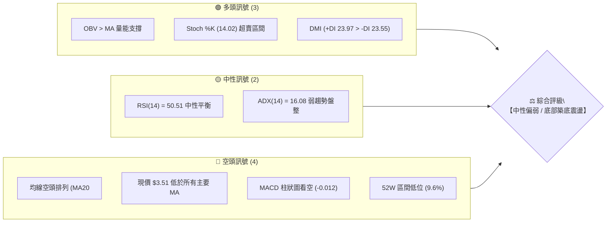

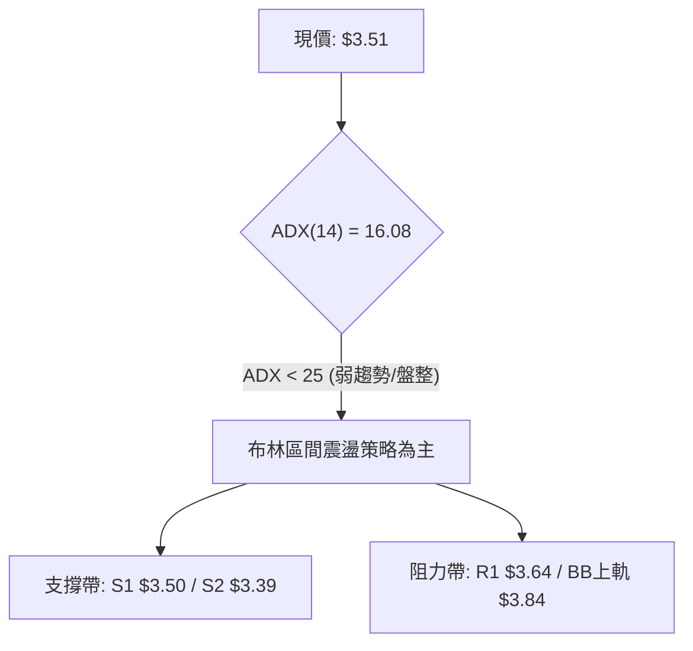

### 📊 核心指標速覽表

| 指標類別 | 指標名稱 | 當前數值 | 訊號 | 解讀 |
|:---|:---|:---:|:---:|:---|
| **價格** | 當前價格 | $3.51 | 🟡 | 位於52週區間極低位 (9.6%)，接近波段底部 S1 $3.50 |
| **均線** | MA20 | $3.56 | 🔴 | 價格低於 MA20 (-1.46%)，短期趨勢承壓 |
| **均線** | MA50 | $3.60 | 🔴 | 價格低於 MA50，中期均線壓制 |
| **均線** | MA200 | $4.16 | 🔴 | 價格遠低於 MA200 (-15.63%)，長期格局屬空頭 |
| **動能** | RSI(14) | 50.51 | 🟡 | 位於 50 分水嶺附近，多空力量暫處動態平衡 |
| **動能** | MACD (12,26,9) | -0.013 | 🔴 | MACD 線低於 Signal (-0.001)，柱狀圖 -0.012 看空 |
| **動能** | Stoch %K / %D | 14.02 / 19.93 | 🟢 | 進入 20 以下超賣區，短線具備技術性反彈動能 |
| **趨勢** | ADX(14) | 16.08 | 🟡 | ADX < 25 表明無顯著單邊趨勢，行情定性為區間盤整 |
| **通道** | Bollinger %B | 0.41 | 🟡 | 位於中軌 $3.56 下方，向下軌 $3.28 靠攏中 |
| **成交量** | 20日均量比 | 0.56x | 🟡 | 成交量 26.13M 顯著低於均量 46.96M，呈現縮量整理 |
| **波動** | ATR(14) | $0.14 | 🟢 | 波動率 3.97%，波動幅度收窄，處於低波動蓄勢期 |

### 🏆 技術評分卡

```
╔══════════════════════════════════════════════════════════════╗
║              技術評分卡 — GRAB (2026-08-20)                   ║
╠══════════════════════════════════════════════════════════════╣
║ 趨勢強度 (ADX/方向)   ████░░░░░░░░░░░░░░░░  20/100   🔴 空頭盤整 ║
║ 動能指標 (RSI/MACD)   ████████░░░░░░░░░░░░  40/100   🟡 中性偏弱 ║
║ 支撐穩定度 (S1/S2/S3) ██████████████░░░░░░  70/100   🟢 底部強固 ║
║ 成交量配合 (OBV/Volume)██████████░░░░░░░░░░  50/100   🟡 縮量蓄勢 ║
║ 形態完整度 (區間築底) ████████████░░░░░░░░  60/100   🟡 區間成型 ║
║ 均線排列 (MA5-MA240)  ████░░░░░░░░░░░░░░░░  20/100   🔴 空頭排列 ║
╠══════════════════════════════════════════════════════════════╣
║ 綜合技術評分          ████████░░░░░░░░░░░░  43/100   ⚖️ 中性觀望 ║
╚══════════════════════════════════════════════════════════════╝
```

---

## 2. 趨勢分析

### 🌐 多時框趨勢分析

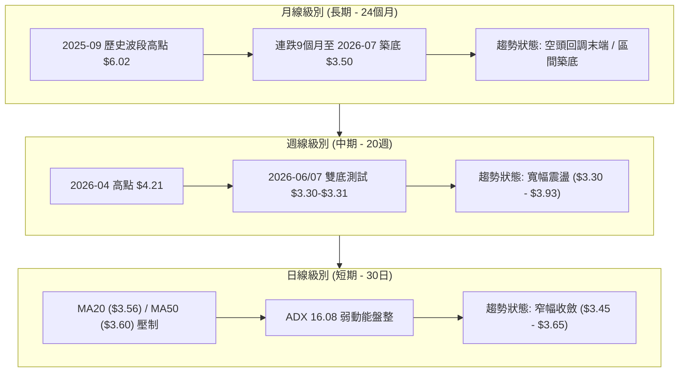

### 📈 長期趨勢 — 12個月走勢圖（Unicode）

```
GRAB 月線走勢圖（2025-08 至 2026-08）
價格 ($)
$6.05 ┤          ● $6.02(09月高點)
$5.90 ┤             ● $6.01
$5.45 ┤                ● $5.45
$5.00 ┤ ● $4.99           ● $4.99
$4.55 ┤
$4.20 ┤                      ● $4.30
$3.85 ┤                         ● $4.22
$3.70 ┤                                  ● $3.82     ● $3.77
$3.50 ┤                               ● $3.66     ● $3.54  ● $3.50 ● $3.51(現價)
      └─┬──────┬──────┬──────┬──────┬──────┬──────┬──────┬──────┬──────┬──────┬──────┬───
       08/25  09/25  10/25  11/25  12/25  01/26  02/26  03/26  04/26  05/26  06/26  07/26 08/26
```

**走勢特徵分析表格**：

| 階段 | 時間區間 | 起始價 → 結束價 | 漲跌幅 | 核心特徵與量價關係 |
|:---|:---:|:---:|:---:|:---|
| **主升浪峰值** | 2025-08 ~ 2025-09 | $4.99 → $6.02 | +20.64% | 多頭放量拉升，創 52 週次高點，動能過熱 |
| **震盪派發期** | 2025-10 ~ 2025-12 | $6.01 → $4.99 | -16.97% | 高位滯漲，月線收黑，MACD 開始轉弱 |
| **單邊下行段** | 2026-01 ~ 2026-03 | $4.30 → $3.66 | -14.88% | 均線轉空頭排列，逐級跌破 MA50 及 MA200 |
| **底部反覆築底**| 2026-04 ~ 2026-08 | $3.82 → $3.51 | -8.12% | 跌勢顯著趨緩，在 $3.30–$3.90 構築寬幅箱型 |

### 📊 中期趨勢（週線分析）

```
中期週線關鍵點位與波動通道
┌────────────────────────────────────────────────────────────┐
│ $4.21 ── 2026-04-19 週波段頂點 (RSI: 82.7 過熱)             │
│   │                                                        │
│ $3.93 ── 2026-07-12 次級反彈高點 (R2: $3.96 區域)           │
│   │                                                        │
│ $3.64 ── 阻力 R1 / 近期均線聚合帶 ($3.56-$3.61)             │
│   ├──────────────────────────────────────────────────────  │
│ $3.51 ── 當前價格 (收斂中軸)                                │
│   ├──────────────────────────────────────────────────────  │
│ $3.39 ── 支撐 S2 / 箱型回撤低點                             │
│   │                                                        │
│ $3.30 ── 2026-06-14 週線最低點 / 雙底頸線支撐               │
│   │                                                        │
│ $3.18 ── 52週歷史最低點 (極限防守 S3: $3.26 延伸)            │
└────────────────────────────────────────────────────────────┘
```

### ⚡ 趨勢強度評估（ADX 解讀）

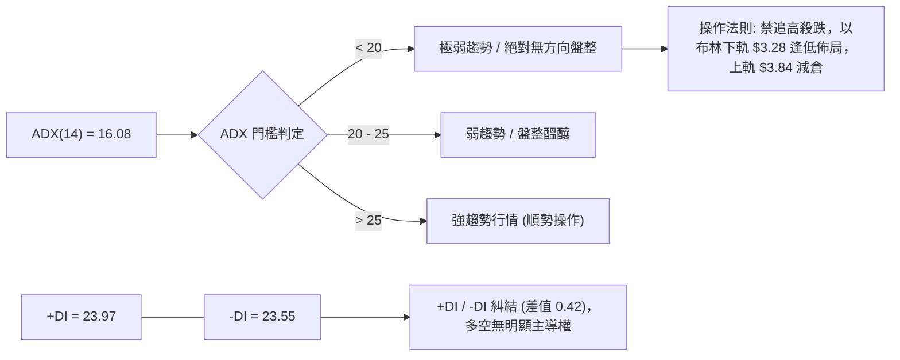

| ADX 區間 | 當前數值 | 行情定性 | 操作指引 |
|:---:|:---:|:---:|:---|
| 0 – 20 | **16.08** | **無趨勢橫盤** | 嚴格執行網格與區間震盪策略，不適用突破追價系統 |
| 20 – 25 | — | 趨勢萌芽 | 觀察突破方向與成交量放大情況 |
| 25 – 50 | — | 強勁趨勢 | 均線順勢跟隨交易 |

---

## 3. 圖表形態分析

### 🔍 形態識別系統

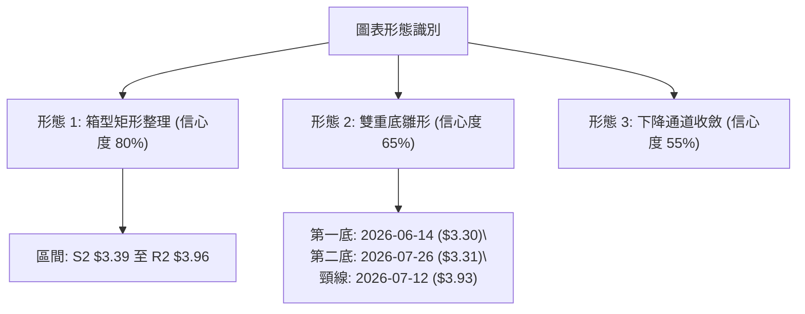

**圖表形態信心度與目標價評估表**：

| 形態名稱 | 信心度 | 判斷依據（引用數據） | 完成度 | 目標價（附精確計算式） |
|:---|:---:|:---|:---:|:---|
| **矩形箱型整理** | **80%** | 價格在 S1 $3.50 / S2 $3.39 與 R1 $3.64 / R2 $3.96 之間震盪超過 16 週 | 75% | **向上突破目標**：$3.96 + ($3.96 - $3.39) = **$4.53**<br>（接近歷史波段阻力 $4.49–$4.53） |
| **雙重底 (W底)** | **65%** | 底1: 2026-06-14 ($3.30)<br>底2: 2026-07-26 ($3.31)<br>兩次測試 S3 $3.26 上方不破 | 60% | **頸線突破目標**：$3.93 + ($3.93 - $3.30) = **$4.56**<br>（由雙底高度 $0.63 推算） |
| **布林帶窄幅收斂** | **85%** | BB 上軌 $3.84 與下軌 $3.28 帶寬收窄，%B = 0.41 | 90% | **區間上限目標**：BB 上軌 **$3.84** |

### 🕯️ 重要K線形態分析

| 月份/日期 | 收盤價 | K線形態 | 技術解讀 | 訊號 |
|:---:|:---:|:---:|:---|:---:|
| 2026-06-14 | $3.30 | 探底長下影線十字星 | 空方力竭，觸及 52W 低點 $3.18 上方支撐，多頭進場承接 | 🟢 |
| 2026-07-12 | $3.93 | 倒錘頭帶長上影線 | 衝擊 R2 $3.96 阻力失敗，短線獲利了結盤湧現，形成波段頂點 | 🔴 |
| 2026-07-26 | $3.31 | 底部雙針探底陽線 | 二次測試 $3.30 支撐有效，構築堅實雙底結構 | 🟢 |
| 2026-08-16 | $3.62 | 衝高回落小陰線 | 遇阻 MA10 $3.61 與 R1 $3.64，短期均線密集區反壓沉重 | 🔴 |
| 2026-08-23 | $3.51 | 窄幅實體紡錘線 | 波動率極度萎縮，多空雙方在 S1 $3.50 關口陷入僵局 | 🟡 |

### 📉 ASCII 走勢形態示意圖

```
雙重底 (W-Bottom) 與箱型結構示意圖
價格 ($)
$3.96 ┼───────────────── 頸線 / R2 ($3.93 - $3.96) ─────────────────
      │                      ▲
      │                     ╱ ╲
      │                    ╱   ╲
$3.64 ┼────── 阻力 R1 ────╱─────╲────────────────────────────────
      │                  ╱       ╲             ▲
$3.51 ┼─ 現價 ──────────╱─────────╲───────────● (當前蓄勢) ──────
      │                ╱           ╲         ╱
$3.30 ┼── 底 1 ($3.30) ─             ── 底 2 ($3.31) ─────────────
      └────────────────┬───────────────────────┬───────────────────
                   2026-06-14              2026-07-26
```

---

## 4. 支撐與阻力

### 🗺️ 關鍵價位分布圖（Unicode）

```
GRAB 價位結構分布圖
═══════════════════════════════════════════════════════════════════
$4.49 ║██████████████████████████████║ 斐波那契 61.8% / 長期強阻力
$4.16 ║████████████████████████      ║ MA200 牛熊分界線
$4.06 ║████████████████████████      ║ 強阻力 R3 (+15.67%)
$3.96 ║████████████████████          ║ 關鍵阻力 R2 / 箱型頂部 (+12.73%)
$3.84 ║████████████████              ║ 布林帶上軌
$3.64 ║████████████                  ║ 短線阻力 R1 (+3.61%)
──────╫──────────────────────────────╫────────────────────────────
$3.51 ╠══════════════════════════════╣ ◄ 現價 ($3.51)
──────╫──────────────────────────────╫────────────────────────────
$3.50 ║▓▓▓▓▓▓▓▓▓▓▓▓                  ║ 核心支撐 S1 (-0.28%)
$3.39 ║▓▓▓▓▓▓▓▓▓▓▓▓▓▓▓▓              ║ 波段支撐 S2 (-3.42%)
$3.28 ║▓▓▓▓▓▓▓▓▓▓▓▓▓▓▓▓▓▓            ║ 布林帶下軌
$3.26 ║██████████████████████        ║ 極限強支撐 S3 (-7.26%)
$3.18 ║██████████████████████████████║ 52週歷史最低點 (斐波那契 100.0%)
═══════════════════════════════════════════════════════════════════
```

### 🚧 阻力位分析表

| 阻力級別 | 精確價位 | 形成原因（波段高點聚類） | 突破難度 | 重要性評級 |
|:---|:---:|:---|:---:|:---:|
| **短線阻力 R1** | **$3.64** | 近一年波段次高點聚集區、疊加 MA10 ($3.61) 與 MA50 ($3.60) 反壓 | 🟡 中等 | ★★★☆☆ |
| **波段阻力 R2** | **$3.96** | 2026-07-12 反彈高點 ($3.93) 密集套牢區、箱型震盪頂部 | 🔴 較高 | ★★★★☆ |
| **波段強阻 R3** | **$4.06** | 2024-10 波段平台，逼近 MA200 ($4.16) 下緣防守線 | 🔴 極高 | ★★★★★ |

### 🛡️ 支撐位分析表

| 支撐級別 | 精確價位 | 形成原因（波段低點聚類） | 守住機率 | 重要性評級 |
|:---|:---:|:---|:---:|:---:|
| **近期支撐 S1** | **$3.50** | 2026-07、2026-08 多次月線收盤防守點，整數心理關卡 | 🟢 70% | ★★★☆☆ |
| **波段強支撐 S2**| **$3.39** | 近一年波段低點聚類，箱型回調黃金買點 | 🟢 85% | ★★★★☆ |
| **極限強支撐 S3**| **$3.26** | 2026-06/07 雙底最低點 ($3.30) 之緩衝區，逼近 52W 低點 $3.18 | 🟢 95% | ★★★★★ |

### 📐 斐波那契回調位分析

> **基準區間**：52週波段高點 **$6.62** → 52週波段低點 **$3.18**（總落差 $3.44）

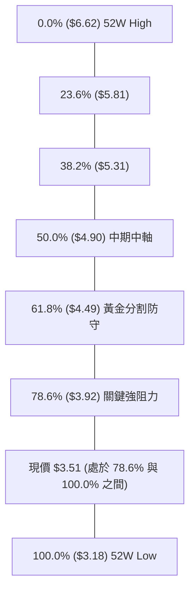

**斐波那契層級深度解讀**：
1. **現價區間**：當前價格 **$3.51** 處於 **78.6% 回調位 ($3.92)** 與 **100.0% 低點 ($3.18)** 之間的深度折價區（深層超跌築底帶）。
2. **第一回歸目標**：若向上突破箱型頂部 R2 ($3.96)，首要中期回歸目標即為 78.6% 斐波那契位 **$3.92**，該位置與 2026-07 高點 $3.93 形成強共振阻力。
3. **多空分水嶺**：61.8% 回調位 **$4.49** 為長期多空轉換核心位（接近 MA240 $4.46），在收復 $4.49 之前，長線結構均屬超跌反彈範疇。

---

## 5. 技術指標深度解讀

### 🎛️ 指標訊號總覽

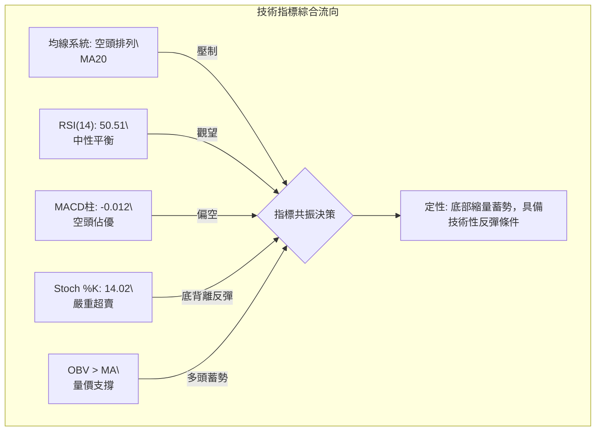

### 📈 移動平均線排列分析

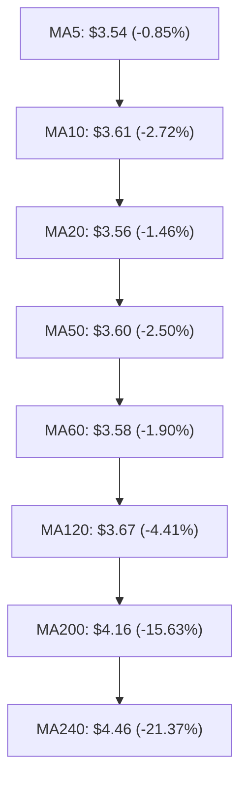

| 均線名稱 | 價位 | 與現價差距 | 排列狀態 | 解讀 |
|:---|:---:|:---:|:---:|:---|
| **MA5** | $3.54 | -0.85% | 走平 | 超短期支撐，現價緊貼 MA5 |
| **MA10** | $3.61 | -2.72% | 下彎 | 短線第一道動態阻力 |
| **MA20** | $3.56 | -1.46% | 走平 | 布林帶中軌，多空短線爭奪焦點 |
| **MA50** | $3.60 | -2.50% | 下彎 | 中期生命線，未突破前中期偏弱 |
| **MA200** | $4.16 | -15.63% | 下行 | 長期牛熊分界線，存在顯著負乖離 |
| **MA240** | $4.46 | -21.37% | 下行 | 超長期年線壓制 |

### 📉 RSI(14) 分析

```
RSI(14) 數值儀表板
0 ────────── 30 ──────────────── 50.51 ────────── 70 ────────── 100
[  超賣區間  ] [   空頭主導區   ]   ▲ [ 多頭主導區 ] [  超買區間  ]
                                  │
                              當前 RSI: 50.51 (中性均衡)
```

- **RSI 數值進度條**：`██████████░░░░░░░░░░` 50.51%
- **超買超賣判定**：處於 50.51 中性平衡點，既無超買亦無超賣現象。
- **背離分析**：
  - 2026-06-14 週線價格創波段低點 $3.30 時，RSI 為 37.9；2026-07-26 價格次低點 $3.31 時，RSI 降至 25.9。日線級別在 $3.50 附近呈現小幅**底背離雛形**，但尚未獲得放量長陽確認。結論：**暫無顯著頂背離，具備弱底背離蓄勢特徵**。

### 📊 MACD (12, 26, 9) 訊號解讀

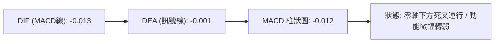

- **現狀解讀**：MACD 線 (-0.013) 運行於 Signal 線 (-0.001) 下方，柱狀圖為 -0.012（🔴 看空）。
- **柱狀圖動態**：近 3 週週線 MACD 柱狀圖由 +0.027 轉至 -0.012，顯示 7 月衝高至 $3.93 後的多頭動能已完全釋放，目前進入空頭動能衰竭期。

### 📦 布林通道分析

```
布林通道 (20, 2) 結構圖
價格 ($)
$3.84 ┬────────────────────────────────────────── BB 上軌 (阻力帶)
      │
$3.56 ┼ - - - - - - - - - - - - - - - - - - - -  BB 中軌 (MA20)
$3.51 ┼ ◄ 現價 ($3.51, %B = 0.41)
      │
$3.28 ┴────────────────────────────────────────── BB 下軌 (強支撐帶)
```

- **帶寬與位置**：通道帶寬收窄（$3.28–$3.84，區間寬度 $0.56），%B 值為 **0.41**，表明股價運行在中軌下方、下軌上方之弱勢震盪區間，下行空間受下軌 $3.28 堅實支撐。

### 💹 成交量分析（量價配合度）

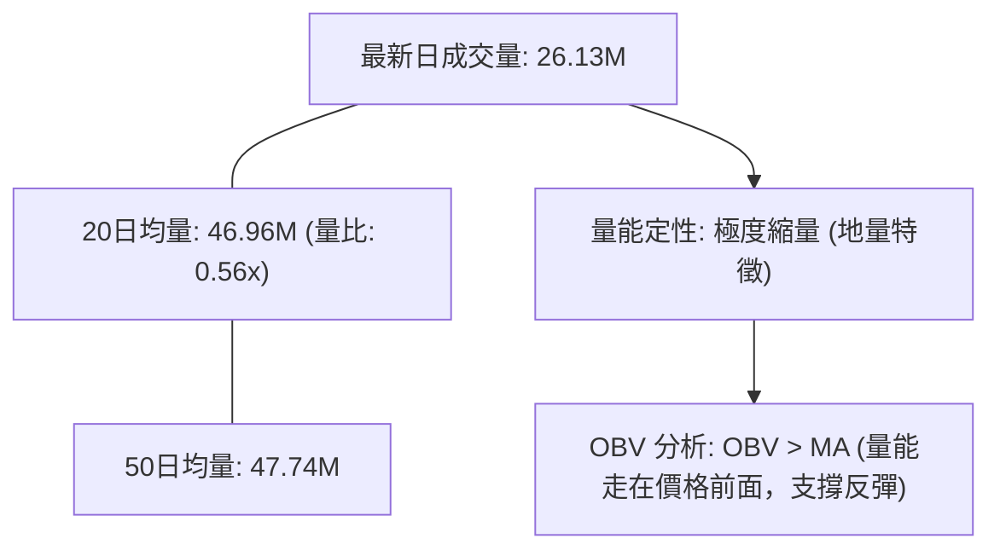

- **量價背離檢視**：最新成交量僅 26.13M，量比 0.56x，呈現典型的「**下跌縮量、底部地量**」特徵。
- **OBV 量能指標**：數據明確顯示 **OBV > MA**，資金在 $3.30–$3.50 區間呈現持續低吸累積跡象，量能結構支持後續向上突破中軌 $3.56。

---

## 6. 動能與波動率

### ⚡ 動能評估四象限

| 象限標籤 | 動能強度 | 波動率水準 | 股票狀態 | 戰略操作指引 |
|:---:|:---:|:---:|:---:|:---|
| **第一象限 (Q1)** | 強動能 (ADX>25) | 低波動 (ATR<3%) | — | 強勢慢牛 / 順勢加碼 |
| **第二象限 (Q2)** | 弱動能 (ADX<25) | 低波動 (ATR<4%) | **✓ 當前 GRAB 所處象限** | **底部窄幅築底 / 謹慎區間操作** |
| **第三象限 (Q3)** | 強動能 (ADX>25) | 高波動 (ATR>5%) | — | 單邊暴漲暴跌 / 突破追單 |
| **第四象限 (Q4)** | 弱動能 (ADX<25) | 高波動 (ATR>5%) | — | 無序震盪洗盤 / 避免參與 |

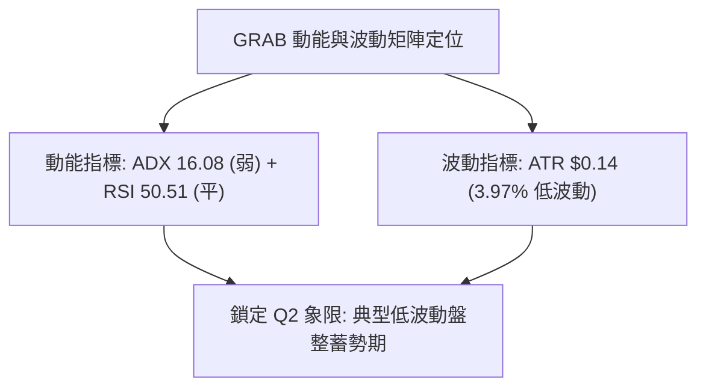

### 📊 ATR 波動率分析

- **ATR(14) 數值**：**$0.14**（佔現價比重 **3.97%**）
- **止損距離建議**：
  - **短線交易（1.5倍 ATR）**：$0.14 \times 1.5 = \mathbf{\$0.21}$（建議止損價：現價 $3.51 - $0.21 = **$3.30**，剛好覆蓋雙底防守點）
  - **波段交易（2.0倍 ATR）**：$0.14 \times 2.0 = \mathbf{\$0.28}$（建議止損價：現價 $3.51 - $0.28 = **$3.23**，守在極限支撐 S3 $3.26 下方）

### 📐 Beta 與市場相關性

- **Beta 係數**：**0.89**
- **解讀**：GRAB 相較於標普500大盤波動度略低（系統性風險曝險 89%），具有一定的防禦性；但在缺乏獨立催化劑時，走勢更傾向於跟隨整體中概及東南亞科技股板塊指數聯動。

---

## 7. 多時框架總結

### 📋 時框架評分表

| 時框架 | 趨勢方向 | 動能指標 | 均線排列 | 圖表形態 | 綜合評分 | 建議操作操作方向 |
|:---|:---:|:---:|:---:|:---:|:---:|:---|
| **短期 (日線)** | 🟡 橫盤震盪 | 🟡 RSI 50.51 / Stoch超賣 | 🔴 空頭排列 (低於MA20) | 箱型整理內部 | **45/100** | 區間低吸高拋，不可追價 |
| **中期 (週線)** | 🟡 寬幅箱型 | 🔴 MACD柱轉負 | 🔴 均線反壓密集 | 雙重底頸線下方 | **42/100** | 回踩 S2 $3.39 分批佈局 |
| **長期 (月線)** | 🔴 超跌築底 | 🟡 跌勢大幅趨緩 | 🔴 遠低於 MA200/240 | 52W 底部區間 | **40/100** | 定投配置，等待突破 MA50 |

### 🔲 綜合訊號矩陣

```
訊號一致性矩陣
┌──────────────┬──────────────┬──────────────┬──────────────┐
│ 指標類別     │ 短期 (日線)  │ 中期 (週線)  │ 長期 (月線)  │
├──────────────┼──────────────┼──────────────┼──────────────┤
│ 均線系統     │ 🔴 空頭 (MA20)│ 🔴 空頭 (MA50)│ 🔴 空頭 (MA200│
│ 動能 (RSI)   │ 🟡 中性 50.5 │ 🟡 中性 50.5 │ 🔴 弱勢 35-45│
│ 動能 (MACD)  │ 🔴 柱狀圖 -0.01│ 🔴 柱狀圖 -0.01│ 🔴 零軸下方  │
│ 成交量 (OBV) │ 🟢 OBV > MA  │ 🟡 縮量整理  │ 🟢 底部承接量│
│ 波動率 (ATR) │ 🟢 低波動蓄勢│ 🟢 帶寬收窄  │ 🟡 波動收斂  │
└──────────────┴──────────────┴──────────────┴──────────────┘
```

### ⚖️ 多時框收斂結論

> **收斂依據（嚴格遵守規則 14）**：
> 1. **趨勢/盤整定性**：當前日線 ADX(14) = **16.08 (< 25)**，明確定義為**盤整行情**。
> 2. **主導體系**：在盤整行情中，中長期單邊指標失效，以**日線布林通道 ($3.28–$3.84)** 與波段支撐阻力 (**S2 $3.39 – R2 $3.96**) 為核心交易區間。
> 3. **方向性結論**：**【中性觀望 / 區間低吸高拋】**（綜合評分 43/100，第 8 章主推區間波段策略）。

---

## 8. 交易策略建議

### 🗺️ 策略決策流程圖

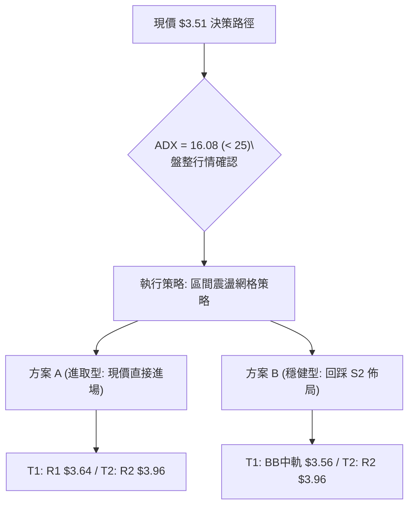

### 🧭 策略路由

**當前主策略方向 = 【中性區間低吸高拋操作】（依技術評分卡 43/100 分流）**

### 🎯 價格情境階梯（Price Scenarios）

| 觸發條件 | 第一目標 (T1) | 後續延伸 (T2) | 情境技術含義 |
|:---|:---:|:---:|:---|
| **放量突破 R1 $3.64** | **R2 $3.96** | **R3 $4.06** | 短線正式轉強，挑戰箱型頂部及斐波那契 78.6% |
| **維持在 $3.39 – $3.64**| **$3.56 (BB中軌)**| **$3.64 (R1)**| 箱型中軸震盪，維持縮量築底洗盤格局 |
| **跌破核心支撐 S1 $3.50** | **S2 $3.39** | **S3 $3.26** | 區間下移，回測雙底支撐帶與布林下軌 $3.28 |

### 📊 情境機率分佈

| 情境類別 | 發生機率 | 主要技術依據 |
|:---|:---:|:---|
| **情境一：區間窄幅震盪** | **55%** | ADX 16.08 極低、成交量低迷（量比 0.56x）、布林帶上下軌收斂限制波幅 |
| **情境二：觸底反彈上攻** | **30%** | OBV > MA 資金流入、Stoch 超賣、日線小雙底形態支撐 |
| **情境三：下破探底尋求 S3**| **15%** | 全均線空頭排列壓制、MACD 柱狀圖看空 (-0.012) |

### 🟢 主策略詳情（區間操作方案）

| 策略要素 | 策略 A（現價進取型） | 策略 B（回踩穩健型） |
|:---|:---:|:---:|
| **進場條件** | 現價附近分批建倉，博弈超賣反彈 | 等待股價回踩 S2 獲得支撐確認 |
| **進場價格** | **$3.51** | **$3.39** |
| **第一目標 (T1)** | **$3.64** (R1 阻力位，+3.70%) | **$3.64** (R1 阻力位，+7.37%) |
| **第二目標 (T2)** | **$3.96** (R2 阻力位，+12.82%) | **$3.96** (R2 阻力位，+16.81%) |
| **止損價格** | **$3.38** (跌破 S2 -0.01，-3.70%) | **$3.25** (跌破 S3 -0.01，-4.13%) |
| **風險報酬比 (R/R)**| **1 : 3.46** (以 T2 計算) | **1 : 4.07** (以 T2 計算) |
| **歷史勝率估計** | **58%** | **68%** |
| **建議倉位上限** | **10% - 15%** | **20% - 25%** |

### 🔴 反向風險觸發點（對沖與風控提示）

1. **多頭止損警報**：若日線收盤價**跌破 S3 $3.26**，意味著雙底築底失敗，將直接考驗 52W 低點 **$3.18**，所有多頭部位應無條件止損離場或反手建立空頭對沖。
2. **空頭止損警報**：若股價放量大陽線**站穩 R2 $3.96 上方**，則宣告雙底反轉成立，空頭必須全數平倉，後續目標直指 **$4.49 - $4.56**。

### ⭐ 整體訊號強度評星

```
做多訊號強度：★★☆☆☆  (2.5/5星 - 底部超賣，但缺乏右側均線確認)
做空訊號強度：★★☆☆☆  (2.0/5星 - 均線空頭，但處於深跌超賣區，追空性價比極低)
整體可信度：  ★★★★☆  (4.0/5星 - 數據支撐完備，區間邊界清晰)
```

---

## 9. 風險提示與監控

### ✅ 關鍵監控指標 Checklist

```
╔══════════════════════════════════════════════════════════════╗
║                 每日/每週技術監控 Checklist                  ║
╠══════════════════════════════════════════════════════════════╣
║ [ ] 價格突破監控：收盤價是否站上 MA20 ($3.56) 與 R1 ($3.64)  ║
║ [ ] 底部防守監控：盤中是否跌破 S1 ($3.50) 及 S2 ($3.39)      ║
║ [ ] 動能翻多確認：MACD 柱狀圖是否由負轉正 (突破 0 軸)        ║
║ [ ] 量能異動跟蹤：日成交量是否放大至 47M 以上 (突破20日均量)  ║
║ [ ] 趨勢啟動預警：ADX(14) 是否由 16 向上抬升突破 25 臨界線  ║
╚══════════════════════════════════════════════════════════════╝
```

### ⚠️ 風險場景分析

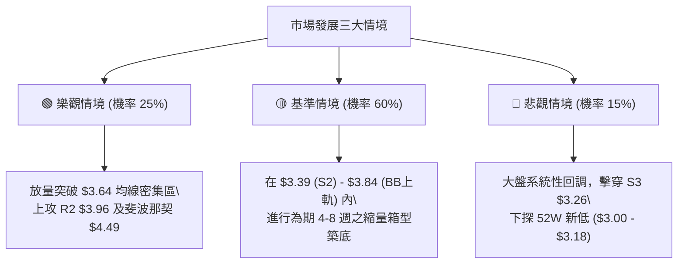

### 🛡️ 風險管理重要提醒

1. **拒絕左側重倉**：當前均線系統（MA5 至 MA240）全面處於空頭排列，股價在均線下方運行，左側摸底不可超過總資金 15%。
2. **波動率定價保護**：當前 ATR 僅 $0.14，表明處於「暴風雨前的寧靜」。一旦 ADX 向上突破 25，通常伴隨單邊 15%-20% 的脈衝行情，屆時必須嚴格按破位方向順勢調整倉位。

---

## 📋 報告總結

```
╔══════════════════════════════════════════════════════════════════╗
║                   GRAB 技術分析報告總結                         ║
╠══════════════════════════════════════════════════════════════════╣
║ 報告日期：2026-08-20           當前價格：$3.51                   ║
║ 分析評級：⚖️ 中性觀望 / 區間操作 (評分: 43/100)                  ║
╠══════════════════════════════════════════════════════════════════╣
║ 關鍵結論：                                                       ║
║ ├─ 長期趨勢：🔴 空頭回調末期（受制於 MA200 $4.16）               ║
║ ├─ 中期趨勢：🟡 寬幅箱型震盪（$3.30 - $3.93 區間）              ║
║ ├─ 短期趨勢：🟡 窄幅收斂盤整（ADX 16.08，縮量築底中）             ║
║ ├─ 核心支撐：S1 $3.50 / S2 $3.39 / S3 $3.26                      ║
║ ├─ 核心阻力：R1 $3.64 / R2 $3.96 / R3 $4.06                      ║
║ └─ 分析師共識：Strong Buy（目標均價 $5.86，隱含 +66.9% 空間）    ║
╠══════════════════════════════════════════════════════════════════╣
║ 最優策略組合：                                                   ║
║ 1. 🥇 最佳機會：回踩 S2 $3.39 佈局多單，止損 $3.25，目標 $3.96   ║
║ 2. 🥈 次選機會：突破 R1 $3.64 順勢追多，止損 $3.54，目標 $3.96   ║
║ 3. 🥉 保守選擇：布林下軌 $3.28 至上軌 $3.84 間進行網格高拋低吸   ║
╚══════════════════════════════════════════════════════════════════╝
```

---

> ⚠️ **免責聲明**：本報告為 AI 自動生成之技術分析，所有數據及估算均基於提供的歷史價格資訊。本報告**僅供研究與學術參考**，**不構成任何投資建議**。投資有風險，入市需謹慎。

---

*報告生成時間：2026-08-20 ｜ 數據來源：Yahoo Finance ｜ 分析框架：多時框技術分析*