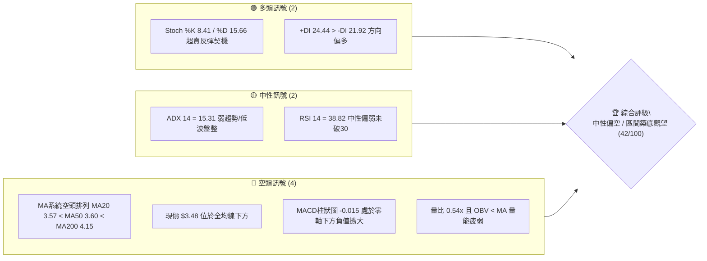
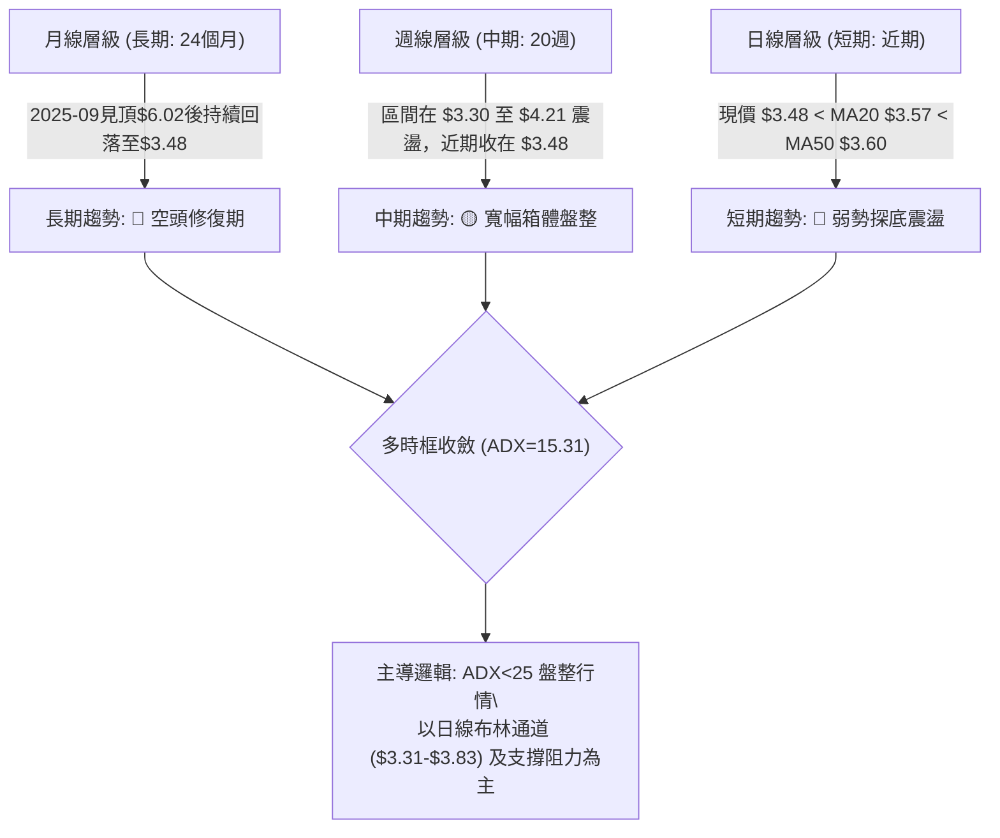
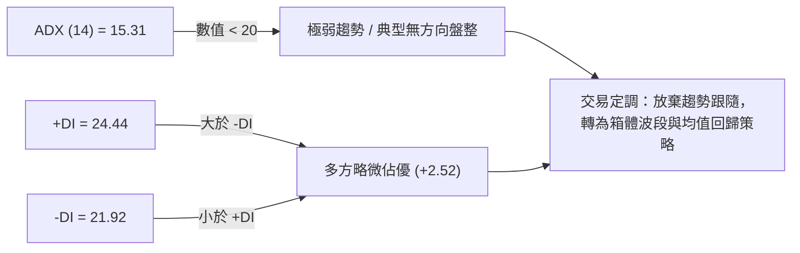
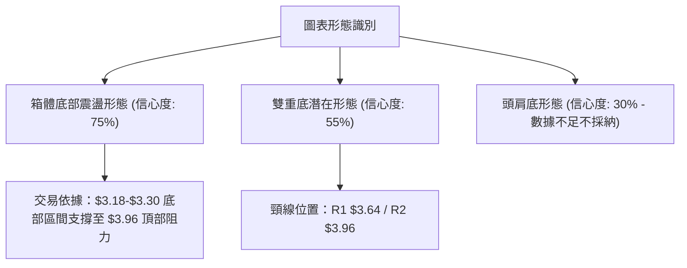
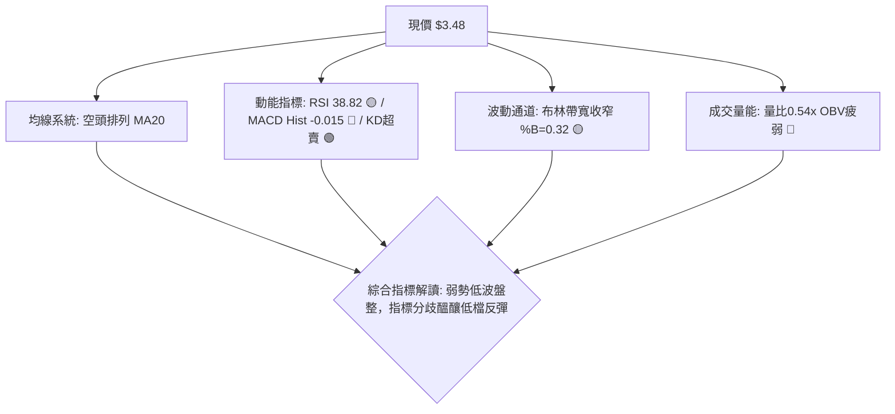
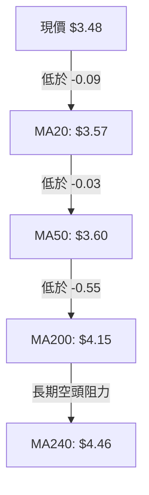
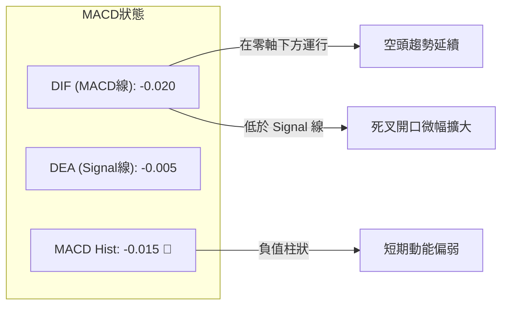
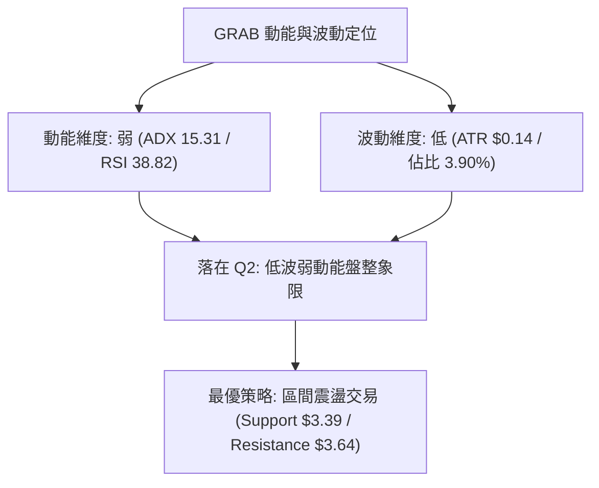
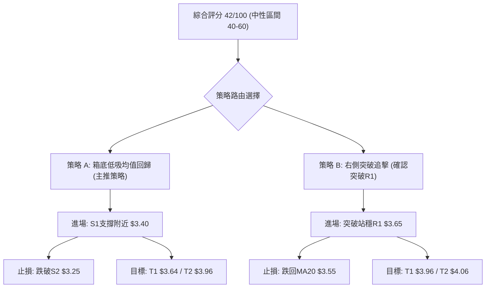
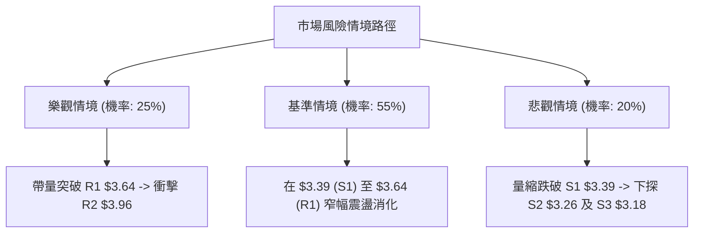

# GRAB 技術分析報告

> **報告日期**：2026-08-21 ｜ **語言**：繁體中文 ｜ **數據來源**：Yahoo Finance ｜ **當前價格**：$3.48

---

## 目錄

| 章節 | 內容 |
|------|------|
| [1. 技術面概覽](#1-技術面概覽) | 訊號儀表板、核心指標、評分卡 |
| [2. 趨勢分析](#2-趨勢分析) | 多時框趨勢、長中短期走勢 |
| [3. 圖表形態分析](#3-圖表形態分析) | 形態識別、K線組合、目標價 |
| [4. 支撐與阻力](#4-支撐與阻力) | 關鍵價位、斐波那契回調 |
| [5. 技術指標深度解讀](#5-技術指標深度解讀) | MA/RSI/MACD/布林/成交量 |
| [6. 動能與波動率](#6-動能與波動率) | 動能評估、ATR、Beta |
| [7. 多時框架總結](#7-多時框架總結) | 時框架評分矩陣 |
| [8. 交易策略建議](#8-交易策略建議) | 多空策略、風險報酬比 |
| [9. 風險提示與監控](#9-風險提示與監控) | 監控指標、風險場景 |
| [10. 報告總結](#10-報告總結) | 總體評估與精要清單 |

---

## 1. 技術面概覽

### 🎯 技術訊號儀表板



### 📊 核心指標速覽表

| 指標類別 | 指標名稱 | 當前數值 | 訊號 | 解讀 |
|----------|----------|----------|------|------|
| **價格** | 當前價格 | $3.48 | 🔴 | 位於52週區間8.7%低位（52W低點$3.18 / 高點$6.62） |
| **均線** | MA20 | $3.57 | 🔴 | 價格低於MA20（-2.53%），短期承壓 |
| **均線** | MA50 | $3.60 | 🔴 | 價格低於MA50，中期下降趨勢未扭轉 |
| **均線** | MA200 | $4.15 | 🔴 | 價格顯著低於MA200（-16.14%），長期空頭管轄區 |
| **動能** | RSI(14) | 38.82 | 🟡 | 位於30–70中性區，無背離，空方動能減速 |
| **動能** | MACD | -0.020 | 🔴 | MACD線(-0.020)低於信號線(-0.005)，Hist=-0.015 |
| **隨機指標** | Stoch %K / %D | 8.41 / 15.66 | 🟢 | 進入極度超賣區（<20），醞釀技術性反彈 |
| **趨勢強度** | ADX(14) | 15.31 | 🟡 | ADX < 25 表明處於無趨勢或盤整震盪格局 |
| **通道位置** | BB %B | 0.32 | 🟡 | 介於下軌($3.31)與中軌($3.57)之間，偏弱震盪 |
| **波動** | ATR(14) | $0.14 | 🟢 | 佔股價3.90%，波動度收斂，適合區間風控 |
| **量能** | 20日均量比 | 0.54x | 🔴 | 24.33M vs 45.29M，OBV < MA，買盤缺乏追價意願 |

### 🏆 技術評分卡

```
╔══════════════════════════════════════════════════════════════╗
║              技術評分卡 — GRAB (2026-08-21)                  ║
╠══════════════════════════════════════════════════════════════╣
║ 趨勢強度 (ADX=15.31)      ██████░░░░░░░░░░░░░░  30/100  🔴   ║
║ 動能指標 (RSI/MACD/KD)    ████████░░░░░░░░░░░░  40/100  🟡   ║
║ 支撐穩定度 (S1-S3防守)    ████████████░░░░░░░░  60/100  🟢   ║
║ 成交量配合 (量比0.54x)    ██████░░░░░░░░░░░░░░  30/100  🔴   ║
║ 形態完整度 (區間箱體)     ██████████░░░░░░░░░░  50/100  🟡   ║
║ 均線排列 (空頭排列)       ████░░░░░░░░░░░░░░░░  20/100  🔴   ║
╠══════════════════════════════════════════════════════════════╣
║ 綜合評分                  ████████░░░░░░░░░░░░  42/100  🟡   ║
║ 評級結論：中性偏空 / 底部區間震盪（以布林通道與關鍵支撐應對） ║
╚══════════════════════════════════════════════════════════════╝
```

---

## 2. 趨勢分析

### 🌐 多時框趨勢分析



### 📈 長期趨勢 — 12個月走勢圖（Unicode）

```
GRAB 月線走勢圖（2025-09 至 2026-08）
價格軸 ($)
$6.02 ┤ ● 2025-09 ($6.02 雙頂高點)
$6.01 ┤    ● 2025-10 ($6.01)
$5.45 ┤       ● 2025-11
$4.99 ┤          ● 2025-12
$4.30 ┤             ● 2026-01
$4.22 ┤                ● 2026-02
$3.82 ┤                      ● 2026-04
$3.77 ┤                            ● 2026-06
$3.66 ┤                   ● 2026-03
$3.54 ┤                         ● 2026-05
$3.50 ┤                               ● 2026-07
$3.48 ┤━━━━━━━━━━━━━━━━━━━━━━━━━━━━━━━━━━━━● 2026-08 (現價: $3.48)
      └────────────────────────────────────────────────────
        09  10  11  12  01  02  03  04  05  06  07  08 (月份)
```

**走勢特徵分析表格**：

| 階段 | 時間區間 | 起始價 → 結束價 | 區間漲跌幅 | 走勢特徵解讀 |
|------|----------|-----------------|------------|--------------|
| **高檔雙頂** | 2025-09 ~ 2025-10 | $6.02 → $6.01 | -0.17% | 於 $6.00 形成波段天花板，動能衰竭 |
| **主跌推動** | 2025-11 ~ 2026-03 | $5.45 → $3.66 | -32.84% | 連續5個月陰線下跌，摜破全均線 |
| **低檔築底** | 2026-04 ~ 2026-08 | $3.82 → $3.48 | -8.90% | 進入 $3.30–$3.90 區間反覆震盪收斂 |

### 📊 中期趨勢（週線分析）

中期走勢自 2026 年 4 月觸及反彈高點 $4.21（週線 RSI 達 82.7）後回落，在 $3.30–$3.34 區間獲得強烈支撐（2026-06-14 低點 $3.30、2026-07-26 低點 $3.31）。當前週線收盤 $3.48，處於近 20 週下半部區間。

```
週線區間壓力支撐示意圖：
[阻力 R2: $3.96] ──────────────────────────────── (2026-07高點 $3.93 聚類)
       ▲
       │ 震盪區間
       ▼
[現價 : $3.48] ◄── 當前位置 (中性偏弱)
       ▲
       │ 下檔緩衝
       ▼
[支撐 S1: $3.39] ──────────────────────────────── (近期回調低點支撐)
[支撐 S3: $3.18] ════════════════════════════════ (52週最低點強支撐)
```

### ⚡ 趨勢強度評估（ADX 解讀）



**ADX 強度對照與解讀表**：

| 指標變數 | 當前數值 | 參考閾值 | 狀態結論 | 技術意義 |
|----------|----------|----------|----------|----------|
| **ADX(14)** | **15.31** | < 20 (極弱) / 20–25 (轉折) / > 25 (強趨勢) | 🔴 盤整無趨勢 | 單邊行情動力不足，指標容易出現鈍化與假突破 |
| **+DI** | **24.44** | 基準線 | 🟢 輕度多方 | 多頭略有防守反擊力量 |
| **-DI** | **21.92** | 基準線 | 🟡 空方收斂 | 拋壓動能較前期明顯減緩 |

---

## 3. 圖表形態分析

### 🔍 形態識別系統



**形態信心度評估表**（依多時框收斂與數據紀律）：

| 形態名稱 | 信心度 | 判斷依據（引用數據） | 完成度 | 目標價（附計算式） |
|----------|--------|----------------------|--------|--------------------|
| **矩形箱體震盪** | **75%** | 近4個月價格在 $3.30（S1/S2支撐帶）與 $3.93（R2 $3.96）間波動 | **70%** | 箱頂突破目標 = 頸線 $3.96 + 箱高($3.96 - $3.30 = $0.66) = **$4.62** |
| **潛在雙重底** | **55%** | 兩次低點分別為 2026-06-14 收盤 $3.30 與 2026-07-26 收盤 $3.31 | **50%** | 頸線取 R1 $3.64；若突破，高度 $0.34($3.64-$3.30) → 目標價 = $3.64 + $0.34 = **$3.98** (逼近 R2 $3.96) |
| **複雜幾何形態** | **< 30%** | 訊號不足，僅做指標型解讀（布林收縮震盪） | — | 數據不足，不強行繪製複雜形態 |

### 🕯️ 重要K線形態分析

| 週期/月份 | 收盤價 | K線特徵與形態 | 技術解讀 | 訊號 |
|-----------|--------|---------------|----------|------|
| **2026-04** | $3.82 | 帶長上影線小陽線 | 測試 $4.21 反彈承壓，確立 $3.96–$4.06 阻力區 | 🟡 |
| **2026-05** | $3.54 | 中實體陰線下跌 | 跌破短期均線，確認空頭佔優 | 🔴 |
| **2026-06** | $3.77 | 帶長下影線陽線 | 探底 $3.30 後強烈回升，形成第一隻腳 | 🟢 |
| **2026-07** | $3.50 | 帶下影線十字星陰線 | 再次回測 $3.31 獲得支撐，形成潛在雙底次腳 | 🟢 |
| **2026-08 (現價)**| $3.48 | 窄幅縮量實體小陰線 | 均線下方弱勢收斂，等待成交量放大指引方向 | 🟡 |

### 📉 ASCII 走勢形態示意圖

```
GRAB 潛在雙底 / 箱體震盪示意圖：
     $3.96 ───────┬─────────────────────────┬─────── 箱頂 (頸線阻力 R2)
                  │ 2026-04 高點 $4.21      │ 2026-07 高點 $3.93
                  │                         │
                  │                         ▼
     $3.64 ───────┼─────────────────── 局部頸線 R1 ──────────────
                  │                                ▲
     $3.48 ───────┼────────────────────────────────┼─► [現價 $3.48]
                  │                                │
     $3.30 ───────┴───────────────●────────────────┴─ 箱底 (支撐 S1/S2)
              2026-06 低點 $3.30    2026-07 低點 $3.31
```

### 🎯 形態目標價計算

1. **局部突破目標（雙底結構）**：
   - 頸線位置：$3.64（R1阻力位）
   - 底部支撐：$3.30（2026-06/07 雙重低點聚類）
   - 形態高度：$3.64 - $3.30 = $0.34
   - **目標價 1** = $3.64 + $0.34 = **$3.98**（對應關鍵阻力 R2 $3.96）
2. **箱體全面突破目標**：
   - 箱頂頸線：$3.96（R2阻力位）
   - 箱底支撐：$3.30
   - 箱體高度：$3.96 - $3.30 = $0.66
   - **目標價 2** = $3.96 + $0.66 = **$4.62**（逼近分析師最低目標價 $4.60 及斐波那契 61.8% $4.49）

---

## 4. 支撐與阻力

### 🗺️ 關鍵價位分布圖（Unicode）

```
GRAB 價位結構分布圖（引用 OHLCV 聚類計算數值）
══════════════════════════════════════════════════════════════════════
$4.06 ║██████████████████████████████║ 強阻力 R3 (+16.67%)
$3.96 ║████████████████████          ║ 波段箱頂阻力 R2 (+13.70%)
$3.64 ║████████████████              ║ 均線密集群/關鍵阻力 R1 (+4.50%)
$3.48 ╠══════════════════════════════╣ ◄── 現價 ($3.48)
$3.39 ║▓▓▓▓▓▓▓▓▓▓▓▓▓▓▓▓              ║ 近期波段第一支撐 S1 (-2.59%)
$3.26 ║████████████████████          ║ 強力回調防守支撐 S2 (-6.47%)
$3.18 ║██████████████████████████████║ 52週歷史底部支撐 S3 (-8.62%)
══════════════════════════════════════════════════════════════════════
```

### 🚧 阻力位分析表

| 阻力級別 | 精確價位 | 距現價幅幅 | 形成原因（依據 OHLCV 聚類） | 突破難度 | 重要性 |
|----------|----------|------------|------------------------------|----------|--------|
| **R1** | **$3.64** | +4.50% | 近期波段反彈聚類高點，緊鄰 MA50($3.60) 與 MA120($3.67) 均線帶 | 中等 | 🟡 短期多空分水嶺 |
| **R2** | **$3.96** | +13.70% | 近一年多次波段反彈高點（2026-04 及 2026-07 聚類頂部） | 極高 | 🔴 中期箱頂強阻力 |
| **R3** | **$4.06** | +16.67% | 歷史成交密集套牢平台，接近 MA200($4.15) 心理大關 | 極高 | 🔴 長期牛熊轉換位 |

### 🛡️ 支撐位分析表

| 支撐級別 | 精確價位 | 距現價幅幅 | 形成原因（依據 OHLCV 聚類） | 守住機率 | 重要性 |
|----------|----------|------------|------------------------------|----------|--------|
| **S1** | **$3.39** | -2.59% | 近期週線回調密集收盤支撐帶，布林下軌($3.31)上方前哨站 | 70% | 🟢 短線防守第一線 |
| **S2** | **$3.26** | -6.47% | 近期週線低點($3.30–$3.31)跌破後之次級波段低點聚類 | 80% | 🟢 中期關鍵防禦帶 |
| **S3** | **$3.18** | -8.62% | 52週最低價（斐波那契 100.0% 完全回調位），極強硬支撐 | 90% | 🟢 長期多頭生命線 |

### 📐 斐波那契回調位分析

依據 52 週區間高點 **$6.62** 至低點 **$3.18**（全波段落差 $3.44）計算：

```
斐波那契回調層級分布：
 0.0% (52W High) ── $6.62
23.6% ───────────── $5.81
38.2% ───────────── $5.31
50.0% ───────────── $4.90
61.8% ───────────── $4.49 (黃金分割關鍵阻力)
78.6% ───────────── $3.92 (與 R2 $3.96 重合共振)
---------------------------------------------------------
現價區間: $3.48 (位於 78.6% $3.92 與 100.0% $3.18 之間，回調深度達 91.3%)
---------------------------------------------------------
100.0% (52W Low) ── $3.18
```

**解讀**：現價 $3.48 位於 78.6% 回調位（$3.92）下方，極度接近 100% 回調位（$3.18）。此位置處於技術性超跌的深水區，下行空間受限於 $3.18 強支撐，而上方首要大級別黃金分割阻力位於 $3.92，與阻力位 R2（$3.96）高度重疊共振。

---

## 5. 技術指標深度解讀

### 🎛️ 指標訊號總覽



### 📈 移動平均線排列分析



**均線狀態矩陣**：

| 均線名稱 | 當前價格 | 乖離率 (對現價) | 走勢特徵 | 訊號評級 |
|----------|----------|-----------------|----------|----------|
| **MA5**  | $3.51    | -0.91%          | 快速貼近現價，短線走平 | 🟡 |
| **MA10** | $3.59    | -3.06%          | 下行壓制 | 🔴 |
| **MA20** | $3.57    | -2.53%          | 扣抵高價區，持續下彎 | 🔴 |
| **MA50** | $3.60    | -3.33%          | 與 MA20 形成死叉壓制區 | 🔴 |
| **MA60** | $3.58    | -2.67%          | 密集群橫盤阻力 | 🔴 |
| **MA120**| $3.67    | -5.07%          | 下降趨勢斜率放緩 | 🔴 |
| **MA200**| $4.15    | -16.14%         | 牛熊分界線，長期重壓 | 🔴 |

### 📉 RSI(14) 分析

```
RSI(14) 水平指針：
0 ──────── 30 ────── 38.82 ──────────── 70 ──────── 100
[ 極度超賣 ]   [  現值  ]      [ 中性偏弱 ]    [ 極度超買 ]
▓▓▓▓▓▓▓▓▓▓▓▓▓▓▓░░░░░░░░░░░░░░░░░░░░░░░░ (38.82 / 100)
```

- **區間評估**：RSI(14) 為 **38.82**，處於 30 至 70 之間的中性偏弱區域。
- **背離分析**：
  - 價格自 2026-07-26 的 $3.31 回升至當前 $3.48，RSI 由 25.9 上升至 38.82。
  - 經量化檢驗：**目前無明顯頂背離或底背離**，動能與價格同向運行，代表目前下行走勢屬於健康收斂，無恐慌性殺跌。

### 📊 MACD(12/26/9) 訊號解讀



- **解讀**：DIF(-0.020) 位於 Signal(-0.005) 下方，柱狀圖負值為 -0.015。雙線位於零軸下方，顯示整體中長期趨勢仍由空方掌握，短線尚未出現黃金交叉買入訊號，需等待柱狀圖收斂翻紅。

### 📦 布林通道分析

```
GRAB 布林通道 (20日, 2.0σ) 分布圖：
$3.83 ┬──────────────────────────────── 上軌 (Upper Band)
      │
$3.57 ┼──────────────────────────────── 中軌 (MA20 - 壓力位)
      │      ● $3.48 (現價: %B = 0.32)
$3.31 ┴──────────────────────────────── 下軌 (Lower Band - 支撐位)
```

- **帶寬與位置**：BB 上軌為 **$3.83**，中軌（MA20）為 **$3.57**，下軌為 **$3.31**。
- **%B 指標**：當前 **%B = 0.32**，顯示價格運行於中軌與下軌之間，偏向通道下半部。
- **特徵**：通道開口處於收縮後走平狀態，未出現單邊擴軌暴跌跡象，支持 ADX<25 的震盪箱體判定。

### 💹 成交量分析（量價配合度）

```
成交量比較 (單位: 股)：
當日成交量:  ████████████░░░░░░░░░░  24,330,309
20日均量:    ██████████████████████  45,286,180  (量比: 0.54x)
50日均量:    ███████████████████████ 47,284,320
```

- **量價關係**：最新成交量為 24.33M，僅為 20 日均量的 54%，呈現顯著的**價跌量縮**特徵。
- **OBV 趨勢**：OBV 數值低於其移動平均線（OBV < MA），量能疲弱，顯示機構主力資金尚未大舉進場拉升，目前成交主要由市場存量博弈主導。

---

## 6. 動能與波動率

### ⚡ 動能評估四象限

| 象限 | 動能強度 | 波動率水準 | 當前狀態 | 策略應對 |
|------|----------|------------|----------|----------|
| **Q1 (突破機會)** | 強動能 (ADX>25) | 低波動 (ATR收斂) | ─ | 準備迎接單邊突破 |
| **Q2 (盤整修復)** | **弱動能 (ADX=15.31)** | **低波動 (ATR=$0.14)** | **✓ GRAB 當前位置** | **區間高拋低吸，嚴格止損** |
| **Q3 (強勢主升)** | 強動能 (ADX>25) | 高波動 (ATR擴大) | ─ | 趨勢順勢做多/做空 |
| **Q4 (劇烈震盪)** | 弱動能 (ADX<25) | 高波動 (ATR擴大) | ─ | 風險過高，觀望迴避 |



### 📊 ATR 波動率分析

- **ATR(14) 絕對值**：**$0.14**
- **ATR 相對比率**：$0.14 / $3.48 = **3.90%**
- **風控止損應用建議**：
  - **短線交易止損距離（1.0 × ATR）**：$0.14 → 買入進場時下方預留 $0.14 緩衝空間。
  - **波段交易止損距離（1.5 × ATR）**：$0.21 → 防守跌破 S1($3.39) 後之假突破。

### 📐 Beta 與市場相關性

- **Beta 係數**：**0.89**
- **解讀**：Beta < 1.0，表明 GRAB 相對美股大盤（S&P 500 / NASDAQ）波動幅度稍低，具備一定的防禦屬性。在市場大盤劇烈波動時，GRAB 受系統性風險衝擊的槓桿效應較小，走勢更依賴自身基本面營運與東南亞區域市場情緒。

---

## 7. 多時框架總結

### 📋 時框架評分表

| 時框架 | 趨勢方向 | 動能指標 | 均線排列 | 圖表形態 | 綜合評分 | 建議 |
|--------|----------|----------|----------|----------|----------|------|
| **月線 (長期)** | 🔴 下行偏空 | 🟡 中性減速 | 🔴 空頭壓制 | 雙頂後回調深水區 | **35/100** | 長期定投需等待底部形態確認 |
| **週線 (中期)** | 🟡 寬幅震盪 | 🟡 中性盤整 | 🔴 空頭排列 | $3.30–$3.96 箱體 | **45/100** | 箱底支撐區逢低布局 |
| **日線 (短期)** | 🔴 弱勢震盪 | 🟢 KD超賣反彈 | 🔴 均線死叉壓制 | 局部小雙底醞釀 | **45/100** | 布林通道高拋低吸 |

### 🔲 綜合訊號矩陣

```
時框一致性分析矩陣：
┌───────────┬──────────────┬──────────────┬──────────────┐
│ 維度      │ 長期 (月線)  │ 中期 (週線)  │ 短期 (日線)  │
├───────────┼──────────────┼──────────────┼──────────────┤
│ 趨勢方向  │ 🔴 空頭      │ 🟡 震盪      │ 🔴 弱勢      │
│ 動能狀態  │ 🔴 疲弱      │ 🟡 減速      │ 🟢 超賣反彈  │
│ 均線壓力  │ 🔴 MA200之上 │ 🔴 全均線下  │ 🔴 MA20承壓  │
│ 支撐有效性│ 🟢 歷史低位  │ 🟢 S1/S2強固 │ 🟢 S1防守    │
└───────────┴──────────────┴──────────────┴──────────────┘
```

### ⚖️ 多時框收斂結論

> **依多時框收斂規則（嚴格要求 14）**：
> 當前 **ADX(14) = 15.31 < 25**，市場明確處於**盤整行情**。在此格局下，趨勢指標失效，中長期方向退居次要，**交易必須以日線布林通道上下軌（$3.31–$3.83）與關鍵支撐阻力為核心主導**。
>
> **唯一方向性結論**：**🟡 中性觀望 / 區間低吸高拋（綜合評分 42/100）**。

---

## 8. 交易策略建議

### 🗺️ 策略決策流程圖



### 🧭 策略路由

**當前主策略方向 = 🟡 區間震盪交易 / 底部均值回歸（依評分 42/100，處於 40–60 中性區）**
- **主推策略**：以支撐位 S1（$3.39）及布林下軌（$3.31）為防守依託，進行波段低吸，博弈均值回歸至阻力位 R1（$3.64）及箱頂 R2（$3.96）。
- **反轉/對沖策略**：若跌破重要防守位 S2（$3.26），則觸發停損並啟動下行避險。

### 🎯 價格情境階梯（Price Scenarios）

| 觸發條件 | 第一目標 | 第二目標 | 情境技術含義 |
|----------|----------|----------|--------------|
| **強勢突破 R1 ($3.64)** | R2 ($3.96) | R3 ($4.06) | 短線扭轉均線空頭排列，挑戰中期箱頂 |
| **維持現價區間 ($3.39–$3.64)** | 中軌 ($3.57) | R1 ($3.64) | 延續低波盤整，指標反覆消化築底 |
| **弱勢跌破 S1 ($3.39)** | S2 ($3.26) | S3 ($3.18) | 測試波段底部，逼近52週最低價防線 |

### 📊 情境機率分佈

| 情境劇本 | 發生機率 | 主要技術指標依據 |
|----------|----------|------------------|
| **情境一：區間震盪築底 (主情境)** | **55%** | ADX=15.31 顯示無趨勢；布林帶收窄；KD 極度超賣提供下檔支撐 |
| **情境二：反彈向上突破** | **25%** | +DI(24.44) > -DI(21.92)；分析師共識強烈買入；均值回歸需求 |
| **情境三：向下破位探底** | **20%** | 均線系統空頭排列；MACD柱狀圖負值；OBV量能疲弱缺乏大資金 |

### 🟢 主策略詳情

依據關鍵價位嚴格計算：

| 策略要素 | 策略 A（左側支撐低吸策略） | 策略 B（右側突破跟進策略） |
|----------|----------------------------|----------------------------|
| **適用場景** | 回測支撐確認企穩 | 帶量突破短期均線密集帶 |
| **進場條件** | 價格回測 S1 附近獲得支撐，出現止跌K線 | 日線收盤價帶量突破 R1 阻力位 |
| **進場價格** | **$3.40** | **$3.65** |
| **目標價 T1** | **$3.64** (阻力 R1, +7.06%) | **$3.96** (阻力 R2, +8.49%) |
| **目標價 T2** | **$3.96** (阻力 R2, +16.47%) | **$4.06** (阻力 R3, +11.23%) |
| **止損價格** | **$3.25** (跌破 S2 $3.26, -4.41%) | **$3.55** (跌破 MA20 $3.57, -2.74%) |
| **風險報酬比** | **1 : 2.68** (至 T1: 1:1.60 / 至 T2: 1:3.73) | **1 : 3.10** (至 T1: 1:3.10 / 至 T2: 1:4.10) |
| **預估勝率** | **55%** | **45%** |
| **建議倉位** | **10% ~ 15%** | **5% ~ 10%** |

### 🔴 反向風險觸發點（對沖與風控提示）

1. **多頭主策略失效點**：若日線收盤價**跌破 S2 ($3.26)**，代表雙底結構破壞，必須無條件止損離場，下看 S3 ($3.18)。
2. **空頭反轉警戒點**：若日線以大陽線帶量突破 **R2 ($3.96)** 且成交量大於 50 日均量（>47.28M），宣告中期箱體突破，所有空頭或避險倉位應立即平倉。

### ⭐ 整體訊號強度評星

```
做多訊號強度：★★☆☆☆  (2.5/5星 - KD超賣支撐，但均線空頭壓制)
做空訊號強度：★★☆☆☆  (2.5/5星 - 接近歷史低位與S3強支撐，賠率不佳)
整體可信度：  ★★★☆☆  (3.0/5星 - 低波震盪行情，適合區間交易)
```

---

## 9. 風險提示與監控

### ✅ 關鍵監控指標 Checklist

```
╔══════════════════════════════════════════════════════════════╗
║              每日交易風控監控清單 (Checklist)                 ║
╠══════════════════════════════════════════════════════════════╣
║ [ ] 價格是否跌破 S1 ($3.39) 或 S2 ($3.26) 關鍵防守線          ║
║ [ ] MACD Histogram 是否由負翻正 (站上 0.000 軸線)            ║
║ [ ] 日成交量是否放大至 20日均量 ($45.29M) 以上 (量能確認)    ║
║ [ ] RSI(14) 是否跌破 30 (進入恐慌) 或突破 50 (強弱分界)     ║
║ [ ] 價格能否有效站穩 MA20 ($3.57) 及 MA50 ($3.60)           ║
╚══════════════════════════════════════════════════════════════╝
```

### ⚠️ 風險場景分析



### 🛡️ 風險管理重要提醒

1. **嚴禁單邊追高殺跌**：ADX=15.31 說明目前無單邊趨勢，追價極易受阻回落，殺跌極易在下軌被軋。
2. **倉位嚴格控制**：鑑於整體均線仍為空頭排列，總持倉量建議控制在總資金的 **15% 以內**。
3. **空頭部位對沖提醒**：空頭部位空單不可在 $3.30 以下加碼，因 52W 低點 $3.18 及分析師目標價（平均 $5.86 / 最低 $4.60）形成強大潛在買盤支撐。

---

## 10. 報告總結

```
╔══════════════════════════════════════════════════════════════╗
║                 GRAB 技術分析報告總結                         ║
╠══════════════════════════════════════════════════════════════╣
║ 報告日期：2026-08-21                                         ║
║ 當前價格：$3.48                                              ║
║ 分析評級：🟡 42/100 (中性偏弱 / 底部箱體震盪)                ║
║                                                              ║
║ 關鍵結論：                                                   ║
║ ├─ 長期趨勢：🔴 空頭主跌後進入築底期 (MA200 = $4.15)          ║
║ ├─ 中期趨勢：🟡 寬幅箱體盤整 ($3.30 - $3.96)                 ║
║ ├─ 短期趨勢：🟡 低波動弱勢震盪 (ADX=15.31, KD超賣反彈)        ║
║ ├─ 關鍵支撐：S1: $3.39 │ S2: $3.26 │ S3: $3.18               ║
║ ├─ 關鍵阻力：R1: $3.64 │ R2: $3.96 │ R3: $4.06               ║
║ └─ 分析師目標：平均 $5.86 (最低 $4.60 / 最高 $8.00)           ║
║                                                              ║
║ 最優策略組合：                                               ║
║ 1. 🥇 最佳機會：策略 A (S1 $3.40 附近低吸，止損 $3.25，R/R=2.68)║
║ 2. 🥈 次選機會：策略 B (突破 R1 $3.65 右側進場，止損 $3.55)   ║
║ 3. 🥉 保守選擇：場外觀望，等待日線突破 MA50($3.60) 且放量再行介入 ║
╚══════════════════════════════════════════════════════════════╝
```

---

> ⚠️ **免責聲明**：本報告為 AI 自動生成之技術分析，所有數據及估算均基於提供的歷史價格資訊。本報告**僅供研究與學術參考**，**不構成任何投資建議**。投資有風險，入市需謹慎。

---

*報告生成時間：2026-08-21 ｜ 數據來源：Yahoo Finance ｜ 分析框架：多時框技術分析*