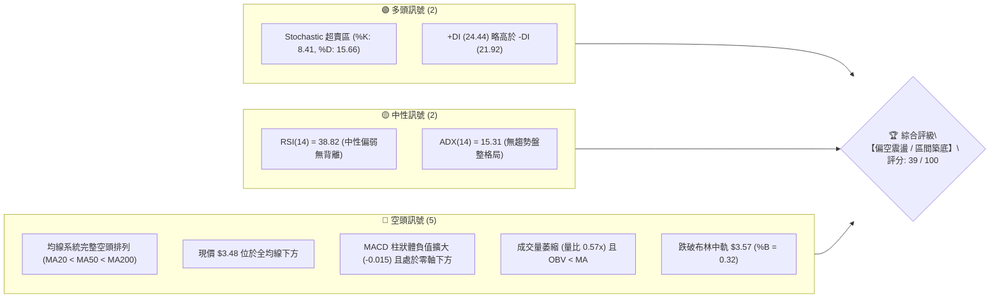
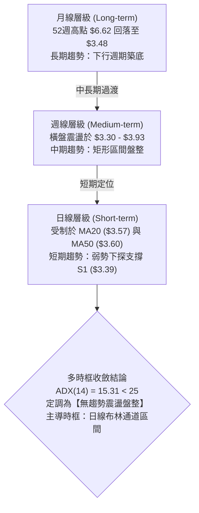
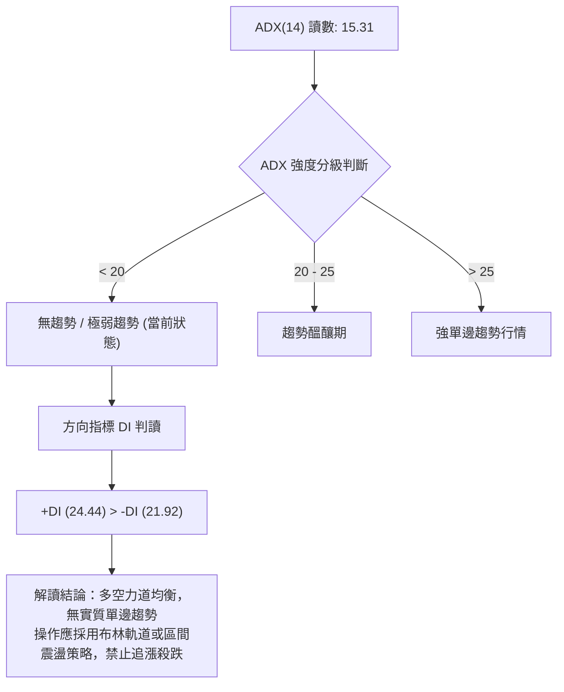
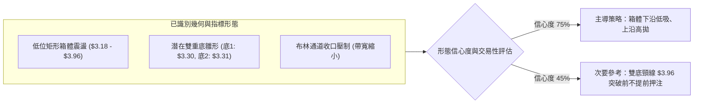
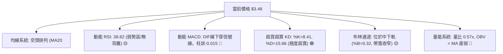
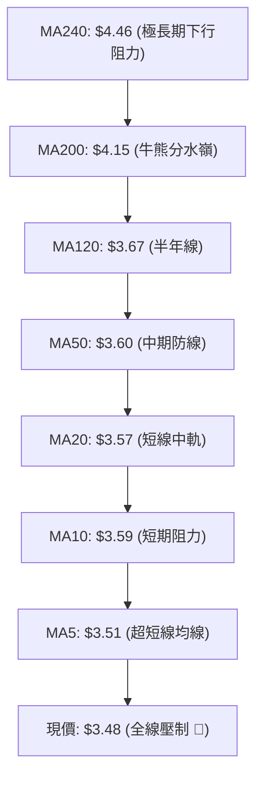
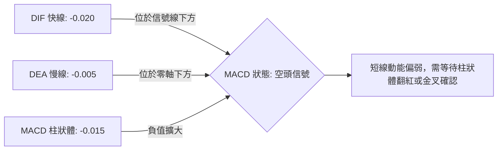
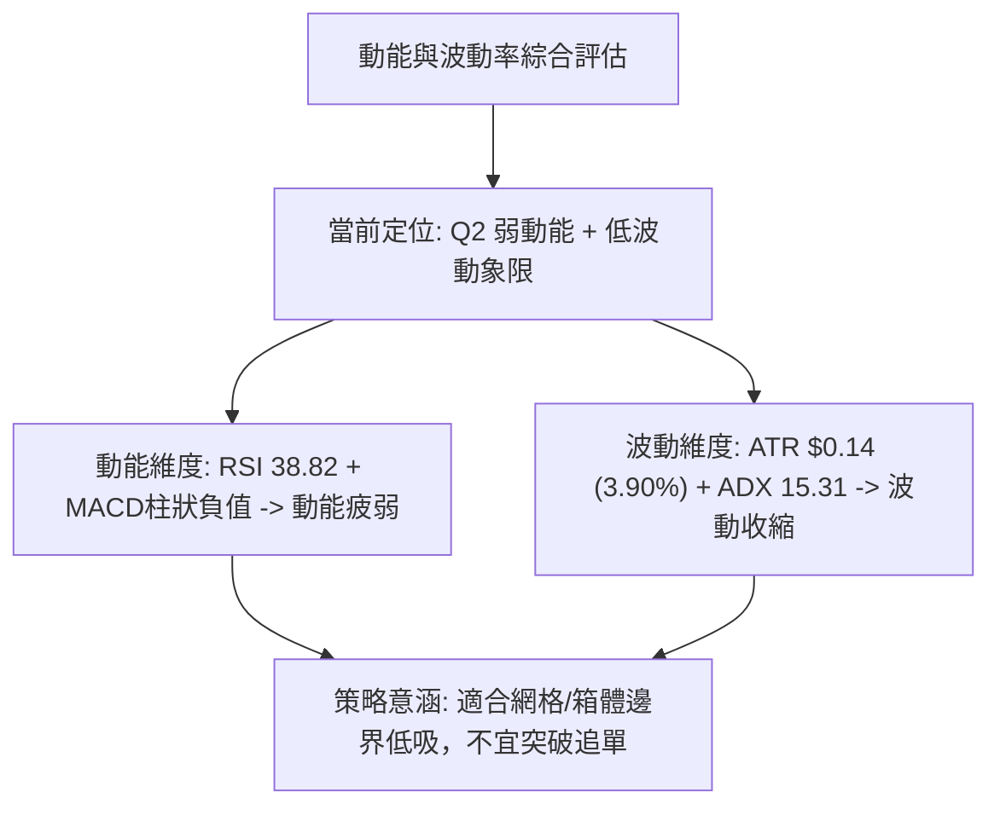
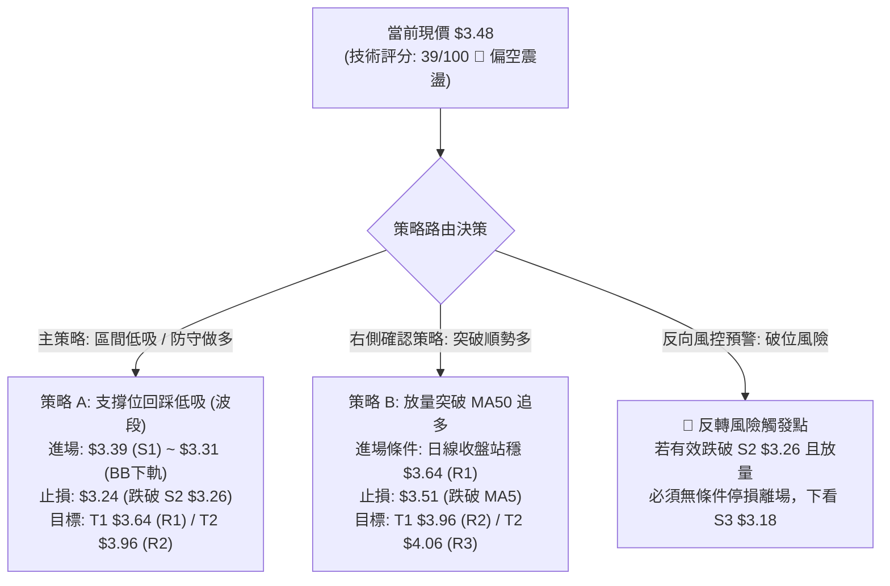
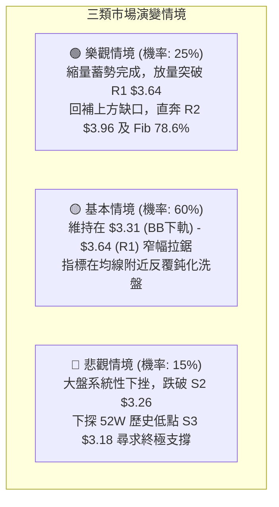

# GRAB 技術分析報告

> **報告日期**：2026-08-22 ｜ **語言**：繁體中文 ｜ **數據來源**：Yahoo Finance ｜ **當前價格**：$3.48

---

## 目錄

| 章節 | 內容 |
|------|------|
| [1. 技術面概覽](#1-技術面概覽) | 訊號儀表板、核心指標、評分卡 |
| [2. 趨勢分析](#2-趨勢分析) | 多時框趨勢、長中短期走勢、ADX 解讀 |
| [3. 圖表形態分析](#3-圖表形態分析) | 形態識別、信心度評估、K線組合、目標價計算 |
| [4. 支撐與阻力](#4-支撐與阻力) | 關鍵價位分布、阻力支撐表、斐波那契回調 |
| [5. 技術指標深度解讀](#5-技術指標深度解讀) | 均線系統、RSI、MACD、布林通道、量價配合度 |
| [6. 動能與波動率](#6-動能與波動率) | 動能評估四象限、ATR 波動率、Beta 市場敏感度 |
| [7. 多時框架總結](#7-多時框架總結) | 時框架評分矩陣、多時框收斂結論 |
| [8. 交易策略建議](#8-交易策略建議) | 策略路由、情境階梯、主策略詳情、風控點位 |
| [9. 風險提示與監控](#9-風險提示與監控) | 關鍵監控清單、情境模擬、風險管理原則 |
| [📋 報告總結](#-報告總結) | 核心結論與最優策略總結 |

---

## 1. 技術面概覽

### 🎯 技術訊號儀表板



### 📊 核心指標速覽表

| 指標類別 | 指標名稱 | 當前數值 | 訊號 | 解讀 |
|:---|:---|:---|:---:|:---|
| **價格** | 當前價格 | $3.48 | 🔴 | 位於 52 週區間底部 8.7% 分位，弱勢整理 |
| **均線** | MA20 | $3.57 | 🔴 | 現價位於 MA20 下方 -2.53%，短期承壓 |
| **均線** | MA50 | $3.60 | 🔴 | 中期均線下彎，壓制短期反彈空間 |
| **均線** | MA200 | $4.15 | 🔴 | 長期多空分水嶺，現價低於年線 -16.14% |
| **動能** | RSI(14) | 38.82 | 🟡 | 位於弱勢區間（30-50），未見底背離但逼近超賣邊界 |
| **動能** | MACD (12,26,9) | -0.020 / -0.005 | 🔴 | DIF 位於信號線下方，柱狀圖 -0.015 偏空 |
| **動能** | Stoch %K / %D | 8.41 / 15.66 | 🟢 | KD 雙線進入極度超賣區（<20），短線具備技術反彈動能 |
| **趨勢** | ADX (14) | 15.31 | 🟡 | ADX < 25 表明處於弱趨勢/低波動盤整市，非單邊行情 |
| **通道** | Bollinger Bands | $3.31 - $3.83 | 🟡 | %B = 0.32，價格在中軌至下軌之間運行，帶寬收斂 |
| **量能** | 20日成交量比 | 0.57x | 🔴 | 最新量 25.90M 低於均量 45.36M，量價配合不足 |
| **波動** | ATR(14) | $0.14 (3.90%) | 🟡 | 每日平均波動約 $0.14，波幅處於歷史中低水平 |

### 🏆 技術評分卡

```
╔══════════════════════════════════════════════════════════════╗
║              技術評分卡 — GRAB (2026-08-22)                  ║
╠══════════════════════════════════════════════════════════════╣
║ 趨勢強度 (Trend Strength)   █████░░░░░░░░░░░░░░░  25/100 🔴  ║
║ 動能指標 (Momentum)         ████████░░░░░░░░░░░░  40/100 🟡  ║
║ 支撐穩定度 (Support Level)  ████████████░░░░░░░░  60/100 🟢  ║
║ 成交量配合 (Volume Profile) ██████░░░░░░░░░░░░░░  30/100 🔴  ║
║ 形態完整度 (Pattern Status) ████████░░░░░░░░░░░░  40/100 🟡  ║
║ 均線排列 (Moving Averages)  ████████░░░░░░░░░░░░  40/100 🔴  ║
╠══════════════════════════════════════════════════════════════╣
║ 綜合技術評分                ████████░░░░░░░░░░░░  39/100 🔴  ║
║ 技術面判定：【空頭主導下的低位區間盤整（ADX < 25）】         ║
╚══════════════════════════════════════════════════════════════╝
```

---

## 2. 趨勢分析

### 🌐 多時框趨勢分析



### 📈 長期趨勢 — 12個月走勢圖（Unicode）

```
GRAB 月線收盤走勢圖（2025-08 至 2026-08）
價格軸 ($)
$6.02 ┤             ●(高點: $6.02)
$6.01 ┤                 ●
$5.45 ┤                     ●
$4.99 ┤●(2025-08)               ●
$4.30 ┤                             ●
$4.22 ┤                                 ●
$3.82 ┤                                         ●
$3.77 ┤                                                 ●
$3.66 ┤                                     ●
$3.54 ┤                                             ●
$3.50 ┤                                                     ●
$3.48 ┤━━━━━━━━━━━━━━━━━━━━━━━━━━━━━━━━━━━━━━━━━━━━━━━━━━━━━●← 當前 ($3.48)
      └─────────────────────────────────────────────────────────────
       08/25 09/25 10/25 11/25 12/25 01/26 02/26 03/26 04/26 05/26 06/26 07/26 08/26
```

#### 走勢特徵分析表格

| 階段週期 | 時間區間 | 起始價 → 結束價 | 區間漲跌幅 | 核心技術特徵與驅動因素 |
|:---|:---|:---:|:---:|:---|
| **第一階段：高位衝刺** | 2025-08 ~ 2025-10 | $4.99 → $6.01 | +20.44% | 創下 52 週高點 $6.62 聚類區，月線動能達到極致後出現量價背離 |
| **第二階段：估值修正** | 2025-10 ~ 2026-03 | $6.01 → $3.66 | -39.10% | 連續跌破 MA20、MA50 與 MA200，形成流暢的空頭單邊下行趨勢 |
| **第三階段：弱勢築底** | 2026-03 ~ 2026-08 | $3.66 → $3.48 | -4.92% | 下跌斜率大幅放緩，價格受限於 $3.18~$3.96 區間，進入籌碼沉澱期 |

### 📊 中期趨勢（週線分析）

```
GRAB 週線壓力與支撐結構示意圖
$4.21 ┤               ▲ (4/19 高點)
$3.96 ┤               │      ▲ (7/12: $3.93 - 聚類阻力 R2)
$3.64 ┤   ▲ (4/12)    │      │        ▲ (8/9: $3.66 - 聚類阻力 R1)
$3.48 ┼───┼───────────┼──────┼────────┼─── 現價 ($3.48) ────────────────
$3.39 ┤   │           │      │        ▼ (聚類支撐 S1)
$3.30 ┤   │           ▼ (6/14: $3.30) ▼ (7/26: $3.31 - 聚類支撐 S2: $3.26)
$3.18 ┴───┴──────────────────────────────── (52W 低點 S3) ─────────────
          W1   W3   W5   W7   W9  W11  W13  W15  W17  W19  W20
```

週線數據顯示，GRAB 自 2026 年 4 月中旬觸及波段高點 $4.21 後，週線級別展開收斂震盪。7 月初曾反彈至 $3.93 遇阻回落（未能觸及 R2 $3.96），隨後在 7 月底探底 $3.31（測試 S2 $3.26 與 S1 $3.39 支撐帶）獲得承接。近期週線 RSI 在 38.8~62.9 區間擺動，MACD 柱狀體在零軸上下交織，呈現標準的區間箱體特徵。

### ⚡ 趨勢強度評估（ADX 解讀）



| 指標參數 | 數值 | 狀態門檻 | 技術意義解讀 |
|:---|:---:|:---:|:---|
| **ADX (14)** | **15.31** | < 25 (弱趨勢/盤整) | 趨勢動能極度渙散，市場處於無方向盤整，任何單邊突破皆需高度警惕假突破 |
| **+DI (14)** | **24.44** | 多頭分量 | 買盤力量微幅領先，但未達優勢門檻（>30） |
| **-DI (14)** | **21.92** | 空頭分量 | 空方拋壓有所收斂，未出現恐慌性宣洩 |
| **差值 (+DI - -DI)** | **+2.52** | 均衡區間 | 多空力量高度僵持，價格易在均線附近反覆纏繞 |

---

## 3. 圖表形態分析

### 🔍 形態識別系統



#### 形態信心度評估表（依規則 15）

| 形態名稱 | 形態信心度 | 判斷依據（嚴格引用數據） | 完成度 | 目標價（附嚴格計算式） |
|:---|:---:|:---|:---:|:---|
| **低位矩形箱體** | **75%** | 箱體下沿由 S3 ($3.18) 及 6/14 低點 $3.30、7/26 低點 $3.31 構成；箱體上沿由 R2 ($3.96) 及 7/12 高點 $3.93 構成 | 80% | 箱體等幅向上突破測算：<br>頸線 $3.96 + (箱頂 $3.96 - 箱底 $3.18) = **$4.74**（理論高度） |
| **潛在雙重底 (W底)** | **45%** | 第一次探底 2026-06-14 低點 $3.30，第二次探底 2026-07-26 低點 $3.31；中間頸線為 2026-07-12 高點 $3.93（接近 R2 $3.96）。但現價跌回 $3.48，未突破頸線 | 35% | 頸線突破測量目標：<br>頸線 $3.96 + 形態高度 ($3.96 - $3.30 = $0.66) = **$4.62**<br>*(註：信心度<50%，僅供觀察，不作為主要入場依據)* |
| **均線死叉收斂壓制** | **85%** | MA20 ($3.57) < MA50 ($3.60) < MA200 ($4.15)，空頭排列完整，壓制短期走勢 | 100% | 下行支撐測試目標：S1 **$3.39**，進一步為 S2 **$3.26** |

### 🕯️ 重要K線形態分析

| 週/月份週期 | 收盤價 | K線組合形態 | 技術解讀與多空意涵 | 訊號強度 |
|:---|:---:|:---|:---|:---:|
| **2026-04-19 (週)** | $4.21 | 衝高長上影陽線 | 觸及波段高位後遭遇獲利了結，RSI 高達 82.7 出現嚴重超買 | 🔴 空頭反轉 |
| **2026-05-10 (週)** | $3.72 | 破位大陰線 | 跌破 MA50，RSI 降至 20.5 極度弱勢區，奠定下行基調 | 🔴 延續看空 |
| **2026-06-14 (週)** | $3.30 | 低檔下影十字星 | 探底 $3.30 後獲得支撐 S2 買盤承接，形成第一底 | 🟢 止跌企穩 |
| **2026-07-12 (週)** | $3.93 | 遇阻長陰回落 | 反彈測試阻力位 R2 $3.96 未果，MACD 柱狀體未能持續擴大 | 🔴 遇阻回落 |
| **2026-07-26 (週)** | $3.31 | 雙底回踩長下影 | 再次測試 $3.31 獲得強支撐，成交量放大至 202M，確認底部支撐帶 | 🟢 支撐確認 |
| **2026-08-23 (週)** | $3.48 | 窄幅縮量陰十字 | 現價回落至 MA20 下方，週成交量萎縮至 158M，多空處於方向選擇前夕 | 🟡 觀望蓄勢 |

### 📉 ASCII 走勢形態示意圖

```
GRAB 箱體震盪與潛在雙底形態結構圖
 價格 ($)
$3.96 ┬────────────────── 頸線 / 阻力 R2 ($3.96) ─────────────────── (7/12: $3.93)
      │                                                     
$3.83 ┼ - - - - - - - - - 布林上軌 ($3.83) - - - - - - - - - - - - - - - - - - - -
$3.64 ┼────────────────── 阻力位 R1 ($3.64) ──────────────────────── (8/9: $3.66)
$3.57 ┼ - - - - - - - - - 布林中軌 / MA20 ($3.57) - - - - - - - - - - - - - - - -
$3.48 ┼───────● 現價 ($3.48) ──────────────────────────────────────────────────
$3.39 ┼────────────────── 支撐位 S1 ($3.39) ─────────────────────────────────────
$3.31 ┼ - - - - 底部 1 - - - - - - - - - - - - - - - 底部 2 - - - - 布林下軌 ($3.31)
$3.26 ┼────── ($3.30) ─────────────────────────── ($3.31) ───── 強支撐 S2 ($3.26)
$3.18 ┴────────────────── 52W 低點 S3 ($3.18) ─────────────────────────────────────
       2026-05          2026-06                  2026-07          2026-08
```

### 🎯 形態目標價計算

1. **矩形箱體震盪目標**：
   - 箱底基準：S3 = **$3.18**（或近期低點均值 $3.30）
   - 箱頂基準：R2 = **$3.96**
   - 箱體高度 $H = \$3.96 - \$3.18 = \$0.78$
   - 向上突破量度目標 $T_{\text{box}} = \$3.96 + \$0.78 = \mathbf{\$4.74}$
   - 向下跌破量度目標 $T_{\text{down}} = \$3.18 - \$0.78 = \mathbf{\$2.40}$（目前機率極低，但作為極端風險參考）

2. **潛在雙底形態目標（需突破 R2 $3.96 才能確立）**：
   - 雙底低點均值：$(\$3.30 + \$3.31)/2 = \$3.305$
   - 頸線位置：R2 = **$3.96**
   - 形態垂直高度 $\Delta = \$3.96 - \$3.305 = \$0.655$
   - 形態破位向上目標價 $T_{\text{double\_bottom}} = \$3.96 + \$0.655 = \mathbf{\$4.615} \approx \mathbf{\$4.62}$

---

## 4. 支撐與阻力

### 🗺️ 關鍵價位分布圖（Unicode）

```
GRAB 價位結構分布圖（OHLCV 聚類計算與斐波那契回調）
══════════════════════════════════════════════════════════════════
$6.62 ║████████████████████████║ 52W 最高點 / Fib 0.0%
$5.81 ║████████████████        ║ Fib 23.6% 回調位
$5.31 ║████████████████        ║ Fib 38.2% 回調位
$4.90 ║████████████████        ║ Fib 50.0% 中樞回調位
$4.49 ║████████████████        ║ Fib 61.8% 黃金分割強阻力
$4.15 ║████████████████████    ║ MA200 年線生死線
$4.06 ║████████████████████████║ 強阻力 R3 (+16.67%)
$3.96 ║████████████████████    ║ 箱頂阻力 R2 (+13.70%) / Fib 78.6% ($3.92)
$3.64 ║████████████████████████║ 短線關鍵阻力 R1 (+4.50%) / MA50 ($3.60)
$3.48 ╠════════════════════════╣ ◄ 現價 $3.48 (處於 S1 與 R1 夾層)
$3.39 ║▓▓▓▓▓▓▓▓▓▓▓▓▓▓▓▓        ║ 近期波段支撐 S1 (-2.59%)
$3.26 ║████████████████████████║ 雙底強支撐 S2 (-6.47%)
$3.18 ║████████████████████████║ 52W 最低點 S3 (-8.62%) / Fib 100.0%
══════════════════════════════════════════════════════════════════
```

### 🚧 阻力位分析表

所有阻力位數值嚴格引用自 OHLCV 聚類計算結果：

| 阻力級別 | 精確價位 | 距現價空間 | 形成原因與籌碼結構 | 突破難度 | 技術重要性 |
|:---|:---:|:---:|:---|:---:|:---:|
| **R1 (第一阻力)** | **$3.64** | +4.50% | 近期反彈波段高點（8/9 週收盤 $3.66 聚類），同時涵蓋 MA50 ($3.60) 與 MA20 ($3.57) 均線密集帶 | 中等 | ⭐⭐⭐☆ |
| **R2 (第二阻力)** | **$3.96** | +13.70% | 近一年箱體頂部強阻力，7/12 波段高點 $3.93 聚類區，疊加 Fib 78.6% ($3.92) | 極高 | ⭐⭐⭐⭐⭐ |
| **R3 (第三阻力)** | **$4.06** | +16.67% | 歷史密集換手區下沿，逼近 MA200 ($4.15) 長期趨勢壓力位 | 極高 | ⭐⭐⭐⭐☆ |

### 🛡️ 支撐位分析表

所有支撐位數值嚴格引用自 OHLCV 聚類計算結果：

| 支撐級別 | 精確價位 | 距現價空間 | 形成原因與籌碼結構 | 守住機率 | 技術重要性 |
|:---|:---:|:---:|:---|:---:|:---:|
| **S1 (第一支撐)** | **$3.39** | -2.59% | 日線近期回踩波段低點聚類，布林通道下軌 ($3.31) 上方緩衝帶 | 65% | ⭐⭐⭐☆ |
| **S2 (第二支撐)** | **$3.26** | -6.47% | 6/14 ($3.30) 與 7/26 ($3.31) 兩次探底築成的雙底支撐帶，多頭核心防線 | 80% | ⭐⭐⭐⭐⭐ |
| **S3 (第三支撐)** | **$3.18** | -8.62% | 52 週絕對歷史低點，Fib 100.0% 回調底線，空頭極限極限目標 | 92% | ⭐⭐⭐⭐⭐ |

### 📐 斐波那契回調位分析（52週區間 $3.18 → $6.62）

| 回調比例 | 精確價位 | 技術角色與市場含義 | 當前價格相對位置與解讀 |
|:---:|:---:|:---|:---|
| **0.0%** | **$6.62** | 52週歷史波段最高點 | 遙遠多頭目標，牛市極限點 |
| **23.6%** | **$5.81** | 強勢回調防守位 / 分析師平均目標價 ($5.86) | 長期多頭修復目標區 |
| **38.2%** | **$5.31** | 中級回調支撐轉阻力位 | 中期行情分水嶺 |
| **50.0%** | **$4.90** | 多空平衡中樞位 | 籌碼中軸線 |
| **61.8%** | **$4.49** | 黃金分割強壓力位 (靠近 MA240: $4.46) | 中期多頭反轉確立點 |
| **78.6%** | **$3.92** | 深度回調防守位 (緊鄰阻力 R2: $3.96) | 箱體震盪頂部阻力帶 |
| **100.0%**| **$3.18** | 52週歷史波段最低點 (等同支撐 S3) | 底部終極防禦線 |

> 📌 **位置解讀**：現價 **$3.48** 正好落於 **Fib 78.6% ($3.92)** 與 **Fib 100.0% ($3.18)** 之間的極深回調區間內（回調幅度達 91.3%）。這意味著空頭已釋放絕大部分動能，下行空間受 $3.18 歷史低點的強烈約束，但在未有效站上 Fib 78.6% ($3.92) 之前，技術結構只能視為弱勢超跌修復與箱體築底。

---

## 5. 技術指標深度解讀

### 🎛️ 指標訊號總覽



### 📈 移動平均線排列分析



#### 均線矩陣詳細分析

| 週期均線 | 當前數值 | 現價偏離度 | 歷史趨勢走向 | 狀態評估 |
|:---|:---:|:---:|:---|:---:|
| **MA 5** | $3.51 | -0.85% | 走平微下彎 | 🔴 短線微幅承壓 |
| **MA 10** | $3.59 | -3.06% | 連續下行 | 🔴 短線動能受阻 |
| **MA 20** | $3.57 | -2.53% | 下行放緩（布林中軌） | 🔴 短期空頭壓制 |
| **MA 50** | $3.60 | -3.33% | 緩步下移 | 🔴 中期下行壓力 |
| **MA 60** | $3.58 | -2.79% | 走平震盪 | 🔴 季線反壓 |
| **MA 120** | $3.67 | -5.18% | 穩定下行 | 🔴 半年線壓制 |
| **MA 200** | $4.15 | -16.14% | 長期下傾 | 🔴 長期熊市結構 |
| **MA 240** | $4.46 | -21.97% | 下傾沉重 | 🔴 遠端套牢峰 |

> **均線結構解讀**：短期均線（MA5、MA10、MA20）與中期均線（MA50、MA60）在 **$3.57 ~ $3.64** 區間高度粘合，形成密集阻力帶。現價 $3.48 位於該均線密集簇下方，顯示空方仍具備短期控盤優勢。唯均線斜率已由急跌轉為走平，下行速率實質鈍化。

### 📉 RSI(14) 分析

```
RSI(14) 讀數：38.82
0 ──────────── 30 ────────────────────── 50 ────────────────────── 70 ──────────── 100
[  超賣區域   ] ▓▓▓▓▓▓▓▓▓▓▓▓▓▓▓░░░░░░░░░░░░░░░░░░░░░░░░░░░░░░░░░░ [   超買區域   ]
              ↑ (38.82 弱勢震盪區)
```

- **當前數值解讀**：RSI(14) 讀數為 **38.82**，位於 30–50 的空頭弱勢區間，表明賣方動能仍佔上風，但未進入 <30 的絕對恐慌拋售區。
- **背離檢驗結論**：
  - *頂背離*：無（當前價格處於波段低位，不具備頂背離條件）。
  - *底背離*：**無明顯底背離**。2026-07-26 價格探底 $3.31 時週線 RSI 為 25.9，當前價格 $3.48 對應 RSI 為 38.8，價格與指標同步回升後再度走平，未形成指標創新高而價格創新低的典型背離。

### 📊 MACD(12/26/9) 訊號解讀



- **數值分析**：DIF (-0.020) 處於 DEA (-0.005) 下方，兩者均在零軸下方運行。MACD 柱狀體為 **-0.015**，自前週的 +0.014 轉負，確認短線反彈動能衰退，空方重新取得微幅優勢。
- **指標交叉展望**：由於 DIF 與 DEA 數值極度接近零軸，微小的價格波動即可引發金叉或死叉，顯示動能處於低振幅蓄勢階段。

### 📦 布林通道分析（Bollinger Bands）

```
GRAB 布林通道結構圖 (參數: 20, 2)
$3.83 ┬──────────────────────────────────────── 上軌 ($3.83)
      │
$3.57 ┼ - - - - - - - - - - - - - - - - - - - - 中軌 / MA20 ($3.57)
$3.48 ┼───────────● 現價 ($3.48, %B = 0.32)
      │
$3.31 ┴──────────────────────────────────────── 下軌 ($3.31)
```

- **通道帶寬與位置**：
  - 上軌：**$3.83**
  - 中軌 (MA20)：**$3.57**
  - 下軌：**$3.31**
  - **%B 指標**：$\%B = \frac{3.48 - 3.31}{3.83 - 3.31} = \frac{0.17}{0.52} = \mathbf{0.32}$
- **解讀**：現價位於中軌與下軌之間（0.32 位置），通道開口呈現收斂走平態勢（帶寬僅 $0.52，約 14.9%）。在 ADX < 25 的環境下，布林通道上下軌提供了極佳的震盪邊界：下軌 $3.31 與支撐 S2 ($3.26) 形成強共振支撐，上軌 $3.83 則為短線反彈極限。

### 💹 成交量分析（量價配合度）

```
成交量對比：
最新日成交量  ███████████░░░░░░░░░  25.90M (量比: 0.57x 🔴)
20日平均成交量 ███████████████████  45.36M
50日平均成交量 ████████████████████ 47.32M
```

- **量價關係**：最新日成交量僅 25.90M，相較於 20 日均量 45.36M 大幅縮量（量比 0.57x）。縮量下跌反映市場拋壓已顯著減輕，並非恐慌性拋售，但同時也凸顯買盤追高意願低迷。
- **能量潮 OBV 分析**：OBV 趨勢低於其均線（OBV < MA），確認資金主力目前維持觀望態勢，未出現規模化吸籌爆量動作。量價結構處於「縮量築底、等待催化劑」狀態。

---

## 6. 動能與波動率

### ⚡ 動能評估四象限

| 象限 | 動能維度 | 波動維度 | 典型市場特徵 | GRAB 當前定位與評估 |
|:---:|:---:|:---:|:---|:---|
| **Q1** | **強動能** | **低波動** | 強勢單邊慢牛/穩定趨勢 | 不符合 |
| **Q2** | **弱動能** | **低波動** | **底部箱體整理 / 籌碼沉澱** | **✓ 當前狀態**（RSI 38.82, ATR 3.90%, ADX 15.31） |
| **Q3** | **強動能** | **高波動** | 暴漲暴跌 / 主升主跌浪 | 不符合 |
| **Q4** | **弱動能** | **高波動** | 恐慌崩盤 / 寬幅洗盤 | 不符合 |



### 📊 ATR 波動率分析

- **ATR(14) 數值**：**$0.14**（佔當前股價之 **3.90%**）。
- **止損距離設計建議**：
  - *日內/極短線交易*：建議止損距離為 $1.0 \times \text{ATR} = \mathbf{\$0.14}$。
  - *波段交易 (Swing Trade)*：建議止損距離為 $1.5 \times \text{ATR} = \mathbf{\$0.21}$ 至 $2.0 \times \text{ATR} = \mathbf{\$0.28}$。
  - 結合支撐位應用：若在現價 $3.48 進場，若採用 $1.5 \times \text{ATR}$ 止損，點位設於 $\$3.48 - \$0.21 = \mathbf{\$3.27}$，恰好受到強支撐 S2 ($3.26) 的保護。

### 📐 Beta 與市場相關性

- **Beta 係數**：**0.89**。
- **特性解讀**：Beta < 1.0 表明 GRAB 對美股大盤（S&P 500 / 納斯達克）的系統性波動敏感度略低於大盤平均水平。在當前弱勢整理期，股價更多受自身行業競爭、東南亞本地市場情緒以及公司轉盈盈利能力等個股基本面主導，較少出現跟隨大盤極端暴漲暴跌的現象。

---

## 7. 多時框架總結

### 📋 時框架評分表

| 時框架 | 趨勢方向 | 動能狀態 | 均線系統排列 | 形態特徵 | 綜合評分 | 戰術建議 |
|:---|:---:|:---:|:---:|:---|:---:|:---|
| **長期 (月線)** | 🔴 偏空下行 | 🔴 弱勢修正 | 均線空頭壓制 (MA200: $4.15) | 自 52W 高點 $6.62 大幅回調後的底部整理 | **30/100** | 長期投資者定投觀望 |
| **中期 (週線)** | 🟡 矩形震盪 | 🟡 中性整理 | 受制於 50週線，在 $3.30~$3.96 間震盪 | 潛在雙底雛形（頸線 $3.96 未破） | **45/100** | 箱體區間高拋低吸 |
| **短期 (日線)** | 🔴 弱勢探底 | 🔴 短線翻空 | 跌破 MA20 ($3.57)，受壓於 MA50 ($3.60) | 逼近布林下軌 $3.31 與支撐 S1 $3.39 | **38/100** | 等待回踩支撐確認企穩 |

### 🔲 綜合訊號矩陣

| 技術維度 | 短期 (日線) | 中期 (週線) | 長期 (月線) | 多時框一致性判定 |
|:---|:---:|:---:|:---:|:---|
| **趨勢方向** | 弱勢下探 🔴 | 箱體震盪 🟡 | 下行築底 🔴 | 中長期趨勢偏空，短期缺乏獨立向上動能 |
| **動能指標** | KD超賣/MACD負 🟡 | RSI中性 (38.8) 🟡 | RSI偏弱 🔴 | 超賣帶來反彈需求，但動能未轉強 |
| **量能配合** | 極度萎縮 (0.57x) 🔴 | 週量平淡 🟡 | 換手低迷 🔴 | 缺乏增量資金推動反轉 |
| **關鍵價位** | 測試 S1 $3.39 | 守護 S2 $3.26 | 依託 S3 $3.18 | 各級支撐位具備強烈空間階梯效應 |

### ⚖️ 多時框收斂結論（依規則 14）

1. **行情定性**：當前 ADX(14) 讀數為 **15.31 (< 25)**，嚴格判定為**【無趨勢 / 弱趨勢盤整行情】**。
2. **主導時框與交易邊界**：依收斂規則，盤整行情不依賴中長期均線的單邊方向，而**以日線布林通道上下軌（$3.31 ~ $3.83）以及計算關鍵價位（支撐 S1: $3.39 / S2: $3.26；阻力 R1: $3.64 / R2: $3.96）作為核心操作依據**。
3. **唯一方向性結論**：**【中性偏空觀望，區間下軌防守型低吸】**。日線級別短線承壓回落，但下方 S1 ($3.39) 至 S2 ($3.26) 支撐力道強勁且 KD 指標已極度超賣，禁止在現價盲目殺跌；操作應採取在區間下沿分批低吸、上軌止盈的震盪策略。

---

## 8. 交易策略建議

### 🗺️ 策略決策流程圖



### 🧭 策略路由

> **當前主策略方向 = 【區間邊界低吸 / 震盪策略（依評分 39/100 判定偏空但處於箱體底部超賣區）】**
> 
> 依評分規則，技術評分低於 40 分通常代表空頭控盤，但鑑於 ADX = 15.31 (< 25) 處於典型無趨勢盤整市，且 Stoch KD 極度超賣、股價逼近 52 週低點支撐帶，不宜在底部區域建立大級別追空倉位。主策略鎖定在支撐帶 S1 ($3.39) / S2 ($3.26) 進行高勝率的「防守型箱體做多」，空頭策略僅作為跌破關鍵支撐時的風控處置。

### 🎯 價格情境階梯（Price Scenarios）

所有價位嚴格引用自計算關鍵價位與斐波那契回調位：

| 觸發條件 | 第一目標 (T1) | 後續延伸 (T2) | 極限目標 (T3) | 情境技術含義 |
|:---|:---:|:---:|:---:|:---|
| **向上突破 R1 ($3.64)** | **R2 ($3.96)** | **R3 ($4.06)** | Fib 61.8% ($4.49) | 短線擺脫均線壓制，展開箱體上沿衝擊 |
| **維持在現價 $3.48 震盪** | 布林中軌 ($3.57) | 阻力 R1 ($3.64) | — | 縮量築底，多空在 MA20 附近反覆爭奪 |
| **向下回踩 S1 ($3.39)** | **布林下軌 ($3.31)** | **支撐 S2 ($3.26)** | 52W 低點 S3 ($3.18) | 測試箱體底部買盤承接力道 |
| **跌破 S3 ($3.18)** | 形態測量 ($2.40) | — | — | 歷史支撐失效，進入無錨恐慌拋售（極端情境） |

### 📊 情境機率分佈

| 運行情境 | 發生機率 | 主要技術與量化依據 |
|:---|:---:|:---|
| **情境一：區間箱體震盪 ($3.31 - $3.64)** | **60%** | ADX(14) = 15.31 明確指示無趨勢；量比僅 0.57x 缺乏突破動能；布林通道帶寬收窄 |
| **情境二：回踩強支撐後反彈 (探 $3.39/$3.26 後抽升)** | **25%** | Stoch %K(8.41) 極度超賣；S2 ($3.26) 歷史雙底支撐堅挺；機構持股 67.2% 具防守底線 |
| **情境三：跌破前低展開單邊暴跌 (破 $3.18)** | **15%** | 均線呈空頭排列，但空頭動能衰竭且無重大利空 news 配合，機率較低 |

### 🟢 主策略詳情

| 策略要素 | 策略 A（左側回踩低吸 — 推薦） | 策略 B（右側突破確認 — 穩健） |
|:---|:---|:---|
| **交易邏輯** | 利用 Stoch 超賣與 S1/S2 支撐帶低吸 | 等待日線帶量收復均線密集簇 |
| **進場條件** | 回踩至 $3.35 ~ $3.39 區間且出現 15分/1小時底背離 | 日線實體收盤價突破 R1 ($3.64) 且成交量比 > 1.2x |
| **進場價格** | **$3.39** (或回踩掛單 $3.35) | **$3.65** (突破站穩掛單) |
| **目標價 T1** | **$3.64** (阻力位 R1 / 空間: +7.37%) | **$3.96** (阻力位 R2 / 空間: +8.49%) |
| **目標價 T2** | **$3.96** (箱頂 R2 / 空間: +16.81%) | **$4.06** (阻力位 R3 / 空間: +11.23%) |
| **止損價格** | **$3.24** (跌破強支撐 S2 $3.26 / 虧損: -4.42%) | **$3.51** (跌破 MA5 與進場防守點 / 虧損: -3.84%) |
| **風險報酬比 (R:R)** | **1 : 2.76** (以 T2 計算達 **1 : 3.80**) | **1 : 2.21** (以 T2 計算達 **1 : 2.92**) |
| **歷史勝率估計** | **65%** (箱體底部勝率) | **55%** (盤整市追突破勝率) |
| **建議倉位** | **總資金之 10% - 15%** | **總資金之 8% - 10%** |

### 🔴 反向風險觸發點（對沖與風控提示）

1. **破位止損線**：若日線收盤價跌破 **$3.26 (S2)**，代表雙底形態宣告失敗，多頭部位必須嚴格停損減倉。
2. **恐慌破底線**：若跌破 **$3.18 (S3)**，將跌破 52 週最低點，空頭單邊將再次被激活，切忌任何抄底行為。
3. **假突破警示**：若價格衝高至 **$3.64 (R1)** 但成交量未達 40M 以上且日線留下長上影線，應立即平倉多單離場。

### ⭐ 整體訊號強度評星

```
做多訊號強度：★★☆☆☆  (2.5/5星 — 超賣有反彈需求，但受均線與量能壓制)
做空訊號強度：★★☆☆☆  (2.0/5星 — 空間受 $3.18 強烈封鎖，底部追空盈虧比差)
震盪操作強度：★★★★☆  (4.0/5星 — ADX < 25 下布林區間高拋低吸最為適用)
整體技術可信度：★★★☆☆ (3.5/5星 — 處於籌碼沉澱期，需耐心等待量能放大)
```

---

## 9. 風險提示與監控

### ✅ 關鍵監控指標 Checklist

```
╔══════════════════════════════════════════════════════════════════╗
║              GRAB 技術面日常監控清單 (Checklist)                 ║
╠══════════════════════════════════════════════════════════════════╣
║ [ ] 價格是否站上 / 跌破短期均線密集區 ($3.57 - $3.60)           ║
║ [ ] 日成交量是否放大至 20日均量 (45.36M) 以上（判斷真假突破）     ║
║ [ ] RSI(14) 是否跌破 30 進入恐慌超賣，或突破 50 進入強勢區       ║
║ [ ] MACD 柱狀體是否由負轉正 (跨越 0 軸線) 形成日線金叉           ║
║ [ ] Stoch KD 是否在 20 以下形成低位金叉（超短線買訊）           ║
║ [ ] ADX(14) 是否升破 25（預示震盪結束，單邊大趨勢來臨）          ║
║ [ ] 下方核心防線 S2 ($3.26) 與 S3 ($3.18) 是否保持完好          ║
╚══════════════════════════════════════════════════════════════════╝
```

### ⚠️ 風險場景分析



### 🛡️ 風險管理重要提醒

1. **嚴禁盤整期追高**：ADX 僅 15.31，突破往往伴隨假突破（False Breakout）。在 $3.64 阻力位未帶量站穩前，任何盤中急拉皆是減倉或高拋時機，絕不可追高。
2. **倉位嚴格控管**：因整體技術評分為 39 分（偏弱），總曝險部位不宜超過投資組合總資金的 15%，單筆交易最大虧損風險應鎖定在總淨值的 1% 以內。
3. **時間停損機制**：若進場建立區間多單後，股價在 10 個交易日內仍無法向上發起對 MA20 ($3.57) 的有效衝擊，顯示多頭動能耗盡，應主動撤出資金觀望。

---

## 📋 報告總結

```
╔══════════════════════════════════════════════════════════════════╗
║                   GRAB 技術分析報告總結                          ║
╠══════════════════════════════════════════════════════════════════╣
║ 報告日期：2026-08-22                                             ║
║ 當前價格：$3.48                                                  ║
║ 分析評級：⚖️ 偏空中性（低位區間盤整，等待底部放量突破）         ║
║                                                                  ║
║ 關鍵結論：                                                       ║
║ ├─ 長期趨勢：🔴 偏空下行（自 $6.62 回落，受制於 MA200 $4.15）   ║
║ ├─ 中期趨勢：🟡 矩形震盪（鎖定在 $3.18~$3.96 箱體內）           ║
║ ├─ 短期趨勢：🔴 弱勢承壓（跌破 MA20 $3.57，均線密集壓制）        ║
║ ├─ 關鍵支撐：S1: $3.39 ｜ S2: $3.26 ｜ S3 (52W低): $3.18         ║
║ ├─ 關鍵阻力：R1: $3.64 ｜ R2: $3.96 ｜ R3: $4.06                 ║
║ └─ 分析師共識目標價：$5.86 (25位分析師，評級 Strong Buy)        ║
║                                                                  ║
║ 最優策略組合：                                                   ║
║ 1. 🥇 最佳機會（區間低吸）：回踩 S1 $3.39 / $3.35 輕倉做多，     ║
║    止損設於 $3.24 (跌破S2)，目標看 R1 $3.64 與 R2 $3.96。        ║
║ 2. 🥈 次選機會（突破跟進）：日線放量突破 R1 $3.64 後順勢追多，    ║
║    止損設於 $3.51，目標看 R2 $3.96。                             ║
║ 3. 🥉 保守選擇（場外觀望）：等待 ADX 升破 25 且日線站穩 MA50     ║
║    ($3.60) 後，再行進場參與中期多頭趨勢。                        ║
╚══════════════════════════════════════════════════════════════════╝
```

---

> ⚠️ **免責聲明**：本報告為 AI 自動生成之技術分析，所有數據及估算均基於歷史價格與量化技術指標資訊。本報告**僅供研究與學術參考**，**不構成任何投資建議**。投資有風險，入市需謹慎。

---

*報告生成時間：2026-08-22 ｜ 數據來源：Yahoo Finance ｜ 分析框架：多時框技術分析*