# GRAB 技術分析報告

> **報告日期**：2026-08-23 ｜ **語言**：繁體中文 ｜ **數據來源**：Yahoo Finance ｜ **當前價格**：$3.48

---

## 目錄

| 章節 | 內容 |
|------|------|
| [1. 技術面概覽](#1-技術面概覽) | 訊號儀表板、核心指標、評分卡 |
| [2. 趨勢分析](#2-趨勢分析) | 多時框趨勢、長中短期走勢 |
| [3. 圖表形態分析](#3-圖表形態分析) | 形態識別、K線組合、目標價 |
| [4. 支撐與阻力](#4-支撐與阻力) | 關鍵價位、斐波那契回調 |
| [5. 技術指標深度解讀](#5-技術指標深度解讀) | MA/RSI/MACD/布林/成交量 |
| [6. 動能與波動率](#6-動能與波動率) | 動能評估、ATR、Beta |
| [7. 多時框架總結](#7-多時框架總結) | 時框架評分矩陣 |
| [8. 交易策略建議](#8-交易策略建議) | 多空策略、風險報酬比 |
| [9. 風險提示與監控](#9-風險提示與監控) | 監控指標、風險場景 |

---

## 1. 技術面概覽

### 🎯 技術訊號儀表板

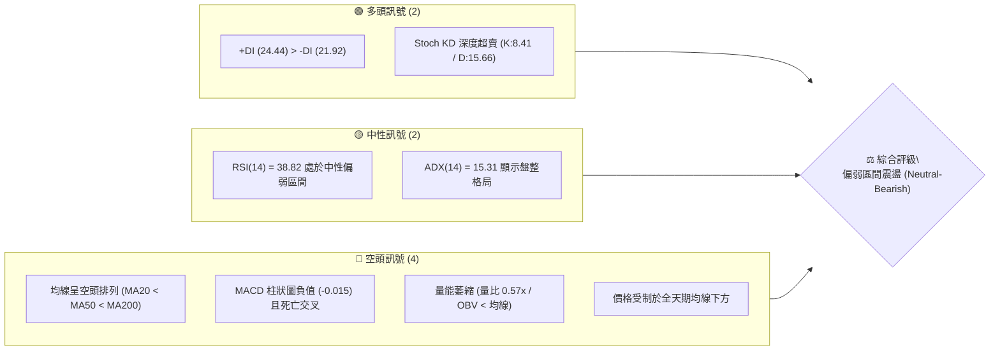

### 📊 核心指標速覽表

| 指標類別 | 指標名稱 | 當前數值 | 訊號 | 解讀 |
|----------|----------|----------|------|------|
| **價格** | 當前價格 | $3.48 | 🔴 | 位於52週區間極低檔 (8.7%分位)，承壓運行 |
| **均線** | MA20 (短) | $3.57 | 🔴 | 現價位於 MA20 下方 -2.53%，短線下行壓制 |
| **均線** | MA50 (中) | $3.60 | 🔴 | 現價位於 MA50 下方，中期均線下彎走平 |
| **均線** | MA200 (長) | $4.15 | 🔴 | 價格遠低於長期生命線 (-16.14%)，長空格局 |
| **動能** | RSI(14) | 38.82 | 🟡 | 位於弱勢區間 (30–40)，但未進入極端超賣 (<30) |
| **動能** | MACD (12,26,9) | -0.020 | 🔴 | DIF < DEA (-0.005)，柱狀圖 -0.015 偏空發散 |
| **震盪** | Stoch %K / %D | 8.41 / 15.66 | 🟢 | KD 指標進入極低超賣區，存在短線技術性反彈動能 |
| **趨勢** | ADX (14) | 15.31 | 🟡 | ADX < 25 表明無顯著單邊趨勢，屬於區間震盪行情 |
| **通道** | 布林帶 %B | 0.32 | 🟡 | 運行於中軌 ($3.57) 與下軌 ($3.31) 間偏下位置 |
| **量能** | 20日成交量比 | 0.57x | 🔴 | 日量 25.90M 遠低於均量 45.36M，量縮買盤動能不足 |
| **波動** | ATR(14) | $0.14 | 🟢 | 日均波幅佔比 3.90%，波動適中，利於區間風控 |

### 🏆 技術評分卡

```
╔════════════════════════════════════════════════════════════════╗
║                   技術評分卡 — GRAB (2026-08-23)               ║
╠════════════════════════════════════════════════════════════════╣
║ 趨勢強度 (ADX=15.31)    ██████░░░░░░░░░░░░░░  30/100  🔴 弱勢無趨勢  ║
║ 動能指標 (RSI/MACD/KD)  ████████░░░░░░░░░░░░  40/100  🟡 超賣反彈潛力║
║ 支撐穩定度 (S1/S2/S3)   ████████████░░░░░░░░  60/100  🟡 接近年內低檔║
║ 成交量配合 (OBV/量比)   ██████░░░░░░░░░░░░░░  30/100  🔴 量能顯著萎縮║
║ 形態完整度 (箱體/區間)  ██████████░░░░░░░░░░  50/100  🟡 底部箱體構築║
║ 均線排列 (空頭排列)     ████░░░░░░░░░░░░░░░░  20/100  🔴 全天期受壓  ║
╠════════════════════════════════════════════════════════════════╣
║ 綜合技術評分            ████████░░░░░░░░░░░░  38/100  🔴 偏空震盪    ║
╚════════════════════════════════════════════════════════════════╝
```

---

## 2. 趨勢分析

### 🌐 多時框趨勢分析

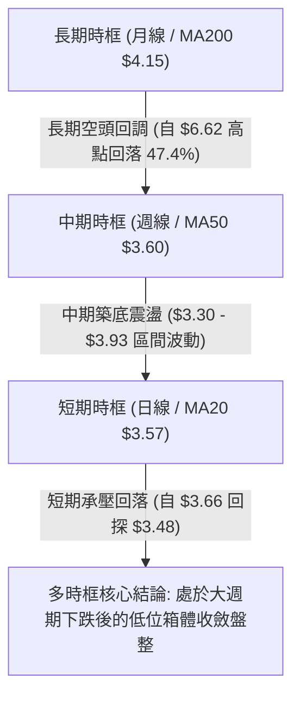

### 📈 長期趨勢 — 12個月走勢圖（Unicode）

```
GRAB 月線收盤走勢圖（2025-08 至 2026-08）
價格軸 ($)
$6.05 ┤      ●2025-09 ($6.02)
$6.00 ┤        ●2025-10 ($6.01)
$5.45 ┤            ●2025-11 ($5.45)
$5.00 ┤●2025-08 ($4.99) ●2025-12 ($4.99)
$4.30 ┤                    ●2026-01 ($4.30)
$4.20 ┤                        ●2026-02 ($4.22)
$3.80 ┤                                ●2026-04 ($3.82)    ●2026-06 ($3.77)
$3.60 ┤                            ●2026-03 ($3.66)
$3.50 ┤                                        ●2026-05 ($3.54) ●2026-07 ($3.50)
$3.45 ┤                                                    ●現在 2026-08 ($3.48)
      └──────────────────────────────────────────────────────────────
       08/25 09/25 10/25 11/25 12/25 01/26 02/26 03/26 04/26 05/26 06/26 07/26 08/26
```

#### 走勢特徵分析表格

| 階段區間 | 時間跨度 | 價格起訖 | 漲跌幅 | 結構性特徵解讀 |
|----------|----------|----------|--------|----------------|
| **主升攻擊段** | 2025-08 ~ 2025-09 | $4.99 → $6.02 | +20.64% | 放量突破，創出52週高點 $6.62，形成中期頂部 |
| **高位派發段** | 2025-10 ~ 2025-12 | $6.01 → $4.99 | -16.97% | 頂部鈍化，均線轉平，主力資金逐步派發 |
| **主跌釋放段** | 2025-12 ~ 2026-03 | $4.99 → $3.66 | -26.65% | 連續跌破 MA50 與 MA200，空頭排列形成 |
| **底部構築段** | 2026-04 ~ 2026-08 | $3.82 → $3.48 | -8.90% | 波動幅度大幅收窄，於 $3.30–$3.93 區間拉鋸築底 |

### 📊 中期趨勢（週線分析）

從近 20 週收盤走勢可見，價格在 $3.30（2026-06-14）探底回升至 $3.93（2026-07-12）遇阻後再度回調，目前最新週線收盤 $3.48，MACD 柱狀圖由正轉負（-0.015），顯示反彈動能衰減，重新回到箱體中下軸。

```
中期週線箱體結構示意圖：
$4.00 ┬────────────────────────────────────────────────────────── R2/R3 阻力帶 ($3.96 - $4.06)
$3.90 ┤       ╭─╮ (2026-07-12 高點 $3.93)
$3.70 ┤   ╭─╯   ╰─╮
$3.55 ┼───┼───────┼────────────────────────────────────────────── 中軸 MA20/MA50 ($3.57 - $3.60)
$3.48 ┤   │       ╰─● 現價 $3.48
$3.30 ┴───┴────────────────────────────────────────────────────── S1/S2 支撐帶 ($3.30 - $3.39)
```

### ⚡ 趨勢強度評估（ADX 解讀）

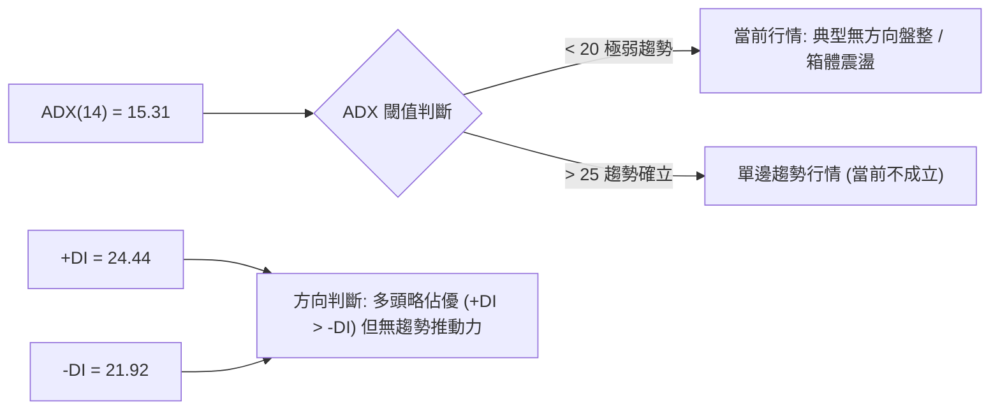

#### ADX 趨勢強度對照表

| 指標變數 | 當前讀數 | 標準區間 | 狀態評估 | 實戰交易指引 |
|----------|----------|----------|----------|--------------|
| **ADX(14)** | **15.31** | 0 – 100 | 🟡 弱趨勢 / 盤整 | 嚴禁採用突破追價策略；以區間高拋低吸為主 |
| **+DI (14)** | **24.44** | 0 – 100 | 🟢 略微領先 | 買盤具有防守意願，但缺乏持續擴張量能 |
| **-DI (14)** | **21.92** | 0 – 100 | 🟡 賣壓收斂 | 空頭推動力減弱，市場進入暫態平衡 |

---

## 3. 圖表形態分析

### 🔍 形態識別系統

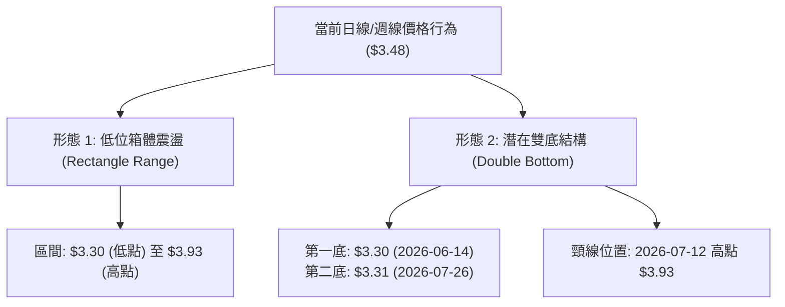

#### 圖表形態信心度與目標價評估表

| 形態名稱 | 信心度 | 判斷依據（引用數據） | 完成度 | 目標價（附嚴謹計算式） |
|----------|--------|----------------------|--------|------------------------|
| **低位水平箱體** | **75%** | 價格在近 12 週於 $3.30（S2附近）與 $3.93（R2附近）間波動 | 85% | 箱頂突破目標 = $3.93 + ($3.93 - $3.30) = **$4.56**（接近 MA240 $4.46） |
| **潛在雙底 (W底)** | **55%** | 兩次低點 $3.30 (06-14) 與 $3.31 (07-26) 獲支撐，現價尚未突破頸線 | 40% | 頸線 $3.93 + 形態高度 ($3.93 - $3.30 = $0.63) = **$4.56**（未確認突破前不宜提早押注） |
| **均線空頭排列受壓** | **85%** | MA20 ($3.57) < MA50 ($3.60) < MA200 ($4.15)，日K線全數受壓 | 100% | 下行回測支撐目標 = 支撐位 S1 **$3.39** / S2 **$3.26** |

### 🕯️ 重要K線形態分析

| 日期 / 週期 | 收盤價 | K線組合形態 | 技術面解讀 | 訊號方向 |
|-------------|--------|-------------|------------|----------|
| **2026-07-12** | $3.93 | 長上影倒錘頭線 (週線) | 觸碰 R2 阻力 $3.96 附近承壓，多頭上攻乏力遇阻回落 | 🔴 頂部受阻 |
| **2026-07-26** | $3.31 | 下影十字星 (週線) | 回踩 52W 低點聚類區（$3.18–$3.30），空頭力竭，買盤進場承接 | 🟢 底部支撐 |
| **2026-08-09** | $3.66 | 實體中陽線 (週線) | 短線反彈測試 MA50 ($3.60) 與 R1 ($3.64)，量能配合放大 | 🟢 短線轉強 |
| **2026-08-23** | $3.48 | 陰線回落吞沒 (日/週) | 跌破 MA5 ($3.51) 與 MA20 ($3.57)，重新回歸下軌尋求支撐 | 🔴 短線走弱 |

### 📉 ASCII 走勢形態示意圖

```
潛在雙底 / 箱體震盪形態示意圖（2026-06 至 2026-08）
$4.00 ┤
$3.93 ┤              ● 頸線高點 ($3.93)
$3.80 ┤             / \
$3.60 ┤   /\       /   \         /\
$3.48 ┼──/──\─────/─────\───────/──● 現價 ($3.48)
$3.30 ┤ ●    \   /       \     /
$3.18 ┤  (底1: $3.30)     ● (底2: $3.31)
      └────────────────────────────────────────────
        2026-06          2026-07          2026-08
```

### 🎯 形態目標價計算

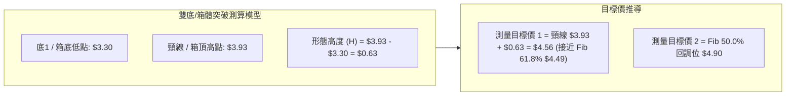

*註：當前價格 $3.48 仍在形態內部震盪，尚未有效放量站上頸線 $3.93，雙底形態僅屬「潛在假設」，不可作為突破追多依據。*

---

## 4. 支撐與阻力

### 🗺️ 關鍵價位分布圖（Unicode）

```
GRAB 價位結構分布圖（OHLCV 實際聚類與斐波那契疊加）
══════════════════════════════════════════════════════════════════
$6.62 ║████████████████████████████████║ 52週最高點 (Fib 0.0%)
$5.81 ║████████████████████████        ║ Fib 23.6% 回調位
$5.31 ║████████████████████            ║ Fib 38.2% 回調位
$4.90 ║████████████████████████        ║ Fib 50.0% 關鍵平衡位
$4.49 ║████████████████████████████    ║ Fib 61.8% 黃金分割位 / MA240 ($4.46)
$4.15 ║████████████████████████████████║ MA200 牛熊分界線
$4.06 ║████████████████████████        ║ 強阻力 R3 (+16.67%)
$3.96 ║████████████████████            ║ 中期阻力 R2 (+13.70%) / Fib 78.6% ($3.92)
$3.83 ║▓▓▓▓▓▓▓▓▓▓▓▓▓▓▓▓▓▓▓▓            ║ 布林帶上軌
$3.64 ║████████████████                ║ 短線阻力 R1 (+4.50%) / MA50 ($3.60)
$3.57 ║┈┈┈┈┈┈┈┈┈┈┈┈┈┈┈┈┈┈┈┈┈┈┈┈┈┈┈┈┈┈┈┈║ 布林中軌 (MA20)
$3.48 ╠════════════════════════════════╣ ◄ 當前市價 ($3.48)
$3.39 ║▓▓▓▓▓▓▓▓▓▓▓▓▓▓▓▓                ║ 近期波段支撐 S1 (-2.59%)
$3.31 ║┈┈┈┈┈┈┈┈┈┈┈┈┈┈┈┈┈┈┈┈┈┈┈┈┈┈┈┈┈┈┈┈║ 布林帶下軌
$3.26 ║████████████████████            ║ 強支撐 S2 (-6.47%)
$3.18 ║████████████████████████████████║ 52週最低點 S3 (-8.62% / Fib 100%)
══════════════════════════════════════════════════════════════════
```

### 🚧 阻力位分析表

| 阻力級別 | 價位 | 形成原因（OHLCV 聚類數據） | 突破難度 | 重要性評級 |
|----------|------|----------------------------|----------|------------|
| **R1 (短線阻力)** | **$3.64** | 近期反彈波段高點，重合 MA50 ($3.60) 與 MA10 ($3.59) 均線密集壓制區 | 🟡 中等 | ★★★☆☆ (短線多空轉折) |
| **R2 (中期阻力)** | **$3.96** | 2026年7月波段高點聚類 ($3.93–$3.96)，重合 Fib 78.6% ($3.92) | 🔴 偏高 | ★★★★☆ (箱體頂部頸線) |
| **R3 (強阻力)** | **$4.06** | 歷史密集成交套牢區，上方臨近 MA200 ($4.15) 生命線 | 🔴 極高 | ★★★★★ (中期反轉門檻) |

### 🛡️ 支撐位分析表

| 支撐級別 | 價位 | 形成原因（OHLCV 聚類數據） | 守住機率 | 重要性評級 |
|----------|------|----------------------------|----------|------------|
| **S1 (短線支撐)** | **$3.39** | 近期日線拉回低點聚類區，接近布林下軌緩衝帶 ($3.31) | 🟡 65% | ★★★☆☆ (日內防守位) |
| **S2 (中期支撐)** | **$3.26** | 2026年6–7月探底密集成交帶 ($3.30–$3.26)，雙底左側頸線起點 | 🟢 75% | ★★★★☆ (箱底核心防線) |
| **S3 (強支撐)** | **$3.18** | 52週歷史最低點 (Fib 100.0%)，長期價值多頭最後防線 | 🟢 85% | ★★★★★ (年度多空底線) |

### 📐 斐波那契回調位分析

依據 52 週完整波動區間（高點 $6.62 → 低點 $3.18，總波幅 $3.44）計算：

| 斐波那契回調層級 | 精確價位 | 技術意涵與當前位置關係解讀 |
|------------------|----------|----------------------------|
| **0.0% (52W High)** | **$6.62** | 2025年9月形成的週期頂部 |
| **23.6%** | **$5.81** | 空頭回撤第一防守位（已跌破） |
| **38.2%** | **$5.31** | 中期強弱分水嶺（已跌破） |
| **50.0%** | **$4.90** | 核心多空中樞平衡位（已跌破） |
| **61.8%** | **$4.49** | 黃金分割反彈壓力帶，重合 MA240 ($4.46) |
| **78.6%** | **$3.92** | 弱勢反彈阻力位，重合 R2 阻力區 ($3.96) |
| **當前現價落點** | **$3.48** | **處於 Fib 78.6% ($3.92) 與 100.0% ($3.18) 極弱勢深幅回調區** |
| **100.0% (52W Low)**| **$3.18** | 52週絕對底部，歷史關鍵支撐 |

---

## 5. 技術指標深度解讀

### 🎛️ 指標訊號總覽

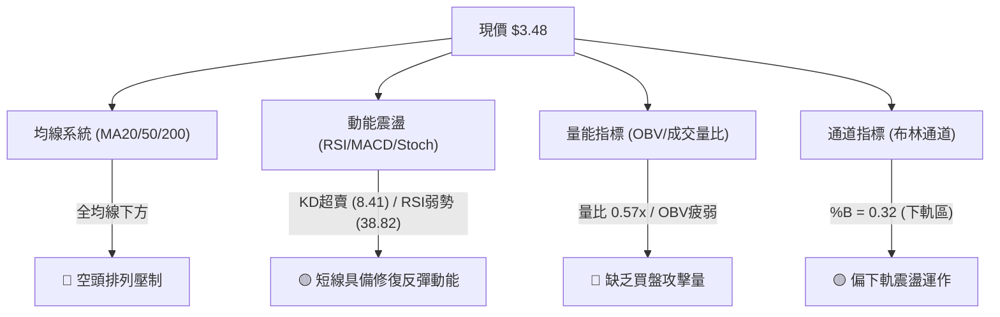

### 📈 移動平均線排列分析

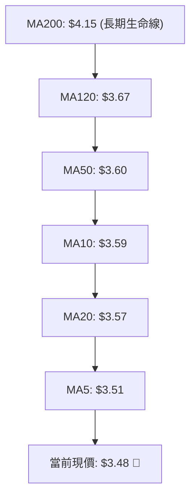

#### 均線系統明細表

| 均線名稱 | 數值 | 現價差距 | 差距百分比 | 均線趨向與排列狀態 |
|----------|------|----------|------------|--------------------|
| **MA5** | $3.51 | -$0.03 | -0.91% | 短線下彎，直接壓制日K線 |
| **MA10** | $3.59 | -$0.11 | -3.06% | 快速下行中 |
| **MA20** | $3.57 | -$0.09 | -2.53% | 布林中軌，短線生命線失守 |
| **MA60 (MA50區間)** | $3.58 | -$0.10 | -2.67% | 走平微跌，中期壓制顯著 |
| **MA120** | $3.67 | -$0.19 | -5.07% | 中長期下行趨勢壓制線 |
| **MA240 (MA200區間)**| $4.46 | -$0.98 | -21.92% | 長期牛熊分水嶺，遠在上方 |

*結論：MA5 < MA20 < MA50 < MA200，全週期呈現標準空頭排列，反彈皆面臨層層解套賣壓。*

### 📉 RSI(14) 分析

```
RSI(14) 當前讀數：38.82
[0 ────────── 30 ────────── 50 ────────── 70 ────────── 100]
███████████████░░░░░░░░░░░░░░░░░░░░░░░░░░░░  38.82%
   超賣區 (<30) │  弱勢震盪區 (30-50)  │ 強勢區 │ 超買區 (>70)
```

- **區間評估**：RSI(14) 為 38.82，脫離 7 月底極端超賣（25.9），但尚未越過 50 強弱分水嶺，屬空頭主導下的弱勢震盪。
- **背離判斷**：
  - **價格**：2026-06-14 低點 $3.30 → 2026-07-26 低點 $3.31（低點微幅抬高或持平）。
  - **RSI**：2026-06-14 RSI 37.9 → 2026-07-26 RSI 25.9（RSI 創更深低點後迅速抽回）。
  - **背離結論**：無標準底背離（Bullish Divergence），當前為指標與價格同向弱勢修復。

### 📊 MACD(12, 26, 9) 訊號解讀

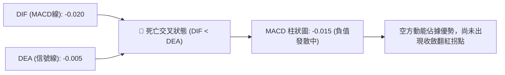

- **MACD 線**：-0.020 位於零軸下方。
- **訊號線 (Signal)**：-0.005 同處零軸下方。
- **柱狀圖 (Histogram)**：-0.015，由 8 月上旬正值（+0.027）轉為負值發散，確認短線反彈終結，重回空頭節奏。

### 📦 布林通道分析

```
布林通道 (20, 2) 結構圖
$3.83 ┬────────────────────────────────────────── 上軌 ($3.83)
$3.70 ┤
$3.57 ┼ - - - - - - - - - - - - - - - - - - - - - 中軌 MA20 ($3.57)
$3.48 ┤                    ● 現價 ($3.48) [%B = 0.32]
$3.31 ┴────────────────────────────────────────── 下軌 ($3.31)
```

- **帶寬與位置**：上軌 $3.83、中軌 $3.57、下軌 $3.31，總帶寬 $0.52 (14.9%)，帶寬持續收斂。
- **%B 指標**：0.32，顯示現價位於中軌與下軌之間偏下方，下行空間受下軌 $3.31 支撐保護。

### 💹 成交量分析（量價配合度）

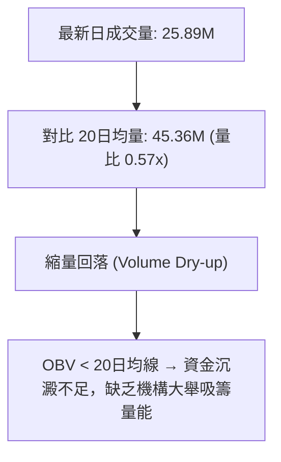

- **量價特徵**：下跌時量能未見恐慌性拋盤（成交量萎縮至 25.89M），但上漲時亦無攻擊量。
- **OBV 趨勢**：OBV 持續運行於其均線下方，顯示整體籌碼處於存量博弈階段。

---

## 6. 動能與波動率

### ⚡ 動能評估四象限

| 象限 | 動能強度 | 波動率 | 當前標的定位 | 戰術應對策略 |
|------|----------|--------|--------------|--------------|
| **Q1 (高動能·低波動)** | 強 | 低 | — | 穩定單邊趨勢，最佳加碼點 |
| **Q2 (低動能·低波動)** | **弱** | **低** | **✓ GRAB 當前定位** | **區間震盪觀望，低吸高拋，不可追價** |
| **Q3 (高動能·高波動)** | 強 | 高 | — | 突破行情，嚴格順勢進出場 |
| **Q4 (低動能·高波動)** | 弱 | 高 | — | 混亂洗盤，易頻繁觸發止損，應避免交易 |

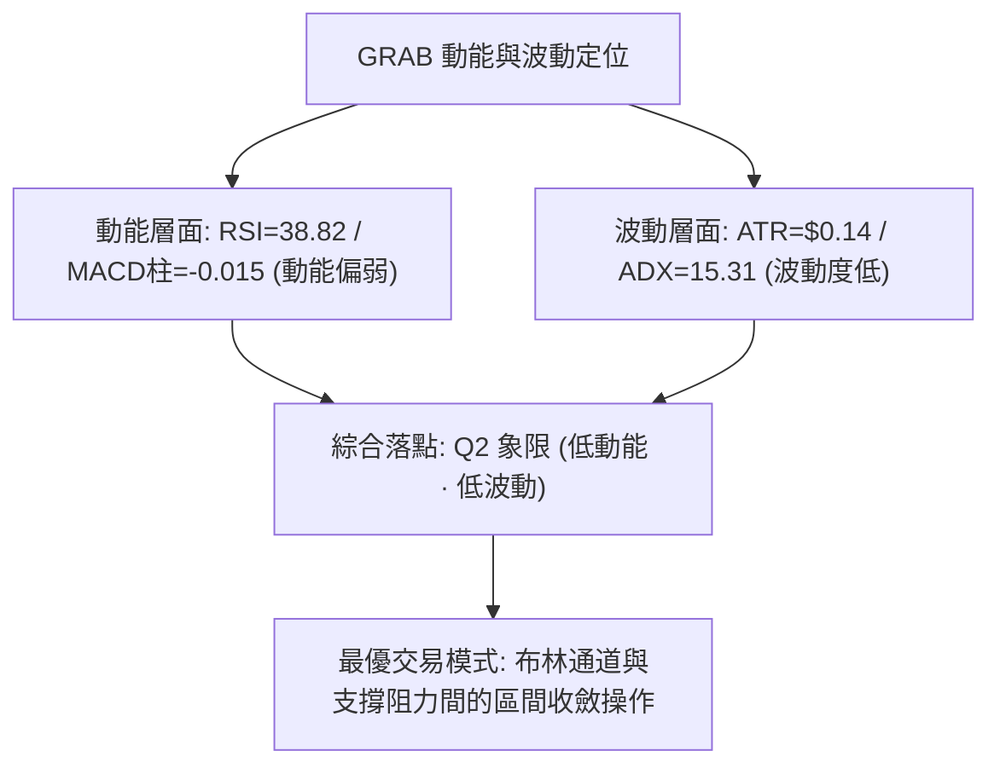

### 📊 ATR 波動率分析

- **ATR(14) 數值**：**$0.14**（佔當前市價之 **3.90%**）。
- **日內合理波動範圍**：$3.48 ± $0.14 → [$3.34, $3.62]。
- **交易風控距離建議**：
  - **短線止損緩衝 (1.0 × ATR)**：$0.14（建議止損設於支撐位下方 $0.14）。
  - **波段防守緩衝 (1.5 × ATR)**：$0.21。

### 📐 Beta 與市場相關性

- **Beta 係數**：**0.89**（低於美股大盤 1.00）。
- **市場特徵**：防守性科技股屬性，系統性風險敏感度適中；受個股基本面及東南亞區域題材驅動較大。
- **空頭部位 (Short Float)**：**7.9%**，空頭回補天數 (Short Ratio) 為 **6.03 天**，若出現重大利多放量突破 R1/R2，具備潛在軋空動能。

---

## 7. 多時框架總結

### 📋 時框架評分表

| 時框架 | 趨勢方向 | 動能指標 | 均線排列狀態 | 圖表形態 | 評分 (1-100) | 策略指導建議 |
|--------|----------|----------|--------------|----------|--------------|--------------|
| **月線 (長期)** | 🔴 偏空 | 弱勢 (MACD負) | 空頭排列 (低於 MA200) | 大週期回調探底 | 30 / 100 | 長期投資者定投區間，非趨勢加碼點 |
| **週線 (中期)** | 🟡 震盪 | 中性修復 | 糾結走平 (MA20/50) | $3.30–$3.93 構築箱體 | 45 / 100 | 箱體邊緣高拋低吸，嚴守區間邊界 |
| **日線 (短期)** | 🔴 偏弱 | KD超賣/MACD死叉 | 短期均線壓制 | 回踩 S1 尋求支撐 | 40 / 100 | 等待回踩 S1/S2 企穩訊號，勿急於進場 |

### 🔲 綜合訊號矩陣

```
時框訊號一致性評估矩陣
┌───────────┬────────────┬────────────┬────────────┐
│ 分析維度  │ 長期 (月)  │ 中期 (週)  │ 短期 (日)  │
├───────────┼────────────┼────────────┼────────────┤
│ 均線系統  │ 🔴 偏空    │ 🔴 偏空    │ 🔴 偏空    │
│ 動能方向  │ 🔴 偏空    │ 🟡 中性    │ 🔴 轉弱    │
│ 擺動超賣  │ 🟡 中性    │ 🟡 中性    │ 🟢 超賣    │
│ 支撐有效性│ 🟢 強 (S3) │ 🟢 強 (S2) │ 🟡 測 (S1) │
└───────────┴────────────┴────────────┴────────────┘
```

### ⚖️ 多時框收斂結論

依據多時框收斂規則：
1. **行情性質判定**：當前 **ADX(14) = 15.31 < 25**，市場明確處於「**盤整震盪行情**」，非單邊趨勢行情。
2. **主導維度確立**：以「**日線布林通道 ($3.31–$3.83)**」與「**中期箱體支撐阻力 ($3.26–$3.96)**」為核心決策架構。日線短期的均線空頭排列提示向下尋找支撐，而週線箱底 S1/S2 提供穩固安全邊際。
3. **唯一方向性結論**：**中性偏空震盪觀望（Neutral-Bearish Range Bound）**。操作上嚴禁突破追高，策略重心鎖定於「**在下軌支撐區間低吸伏擊，於均線與阻力帶逢高減碼**」。

---

## 8. 交易策略建議

### 🗺️ 策略決策流程圖

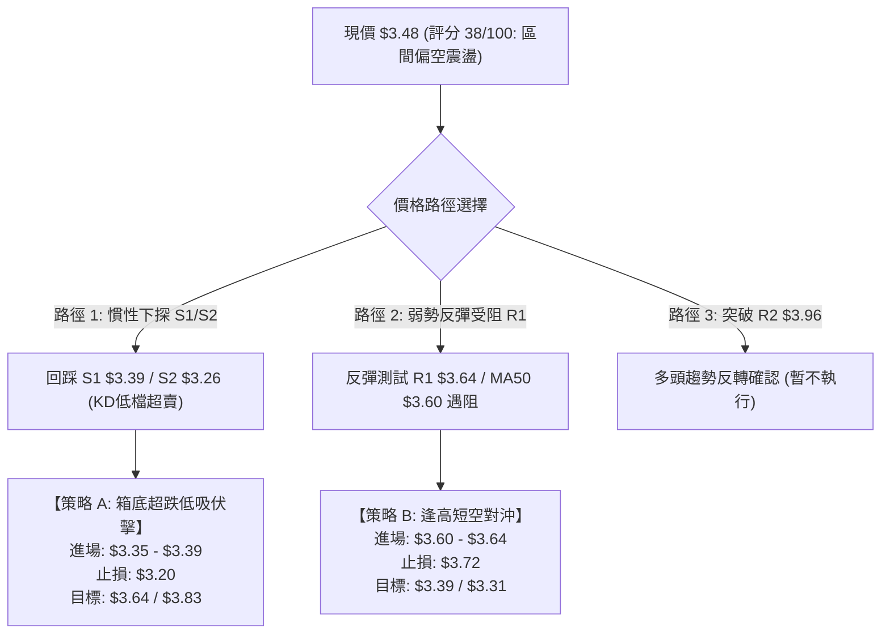

### 🧭 策略路由

**當前主策略方向 = 區間操作與超跌防守型低吸（依綜合評分 38/100）**

因技術評分低於 40 但接近箱體下軌支撐帶，單純追空盈虧比極差（距 S1 僅 -2.59%），盲目看多又受制於全天期均線壓制。最佳方案為：**以區間下軌（S1/S2/布林下軌）為防守點進行超跌低吸，或在反彈至 R1 均線密集帶時逢高了結。**

### 🎯 價格情境階梯（Price Scenarios）

| 觸發條件 | 第一目標 (T1) | 第二目標 (T2) | 後續延伸目標 (T3) | 情境含義與技術解讀 |
|----------|---------------|---------------|-------------------|--------------------|
| **向上突破 R1 $3.64** | R2 **$3.96** | R3 **$4.06** | Fib 61.8% **$4.49** | 短線轉強，突破 MA50，挑戰箱頂頸線 |
| **維持當前區間震盪** | 布林中軌 **$3.57** | R1 **$3.64** | 布林下軌 **$3.31** | 於 $3.31–$3.64 窄幅整固，等待量能釋放 |
| **向下跌破 S1 $3.39** | S2 **$3.26** | S3 **$3.18** | — | 弱勢下探，測試年度歷史底部支撐 |

### 📊 情境機率分佈

| 情境類別 | 預估機率 | 主要技術依據 |
|----------|----------|--------------|
| **區間下軌支撐回升 (低吸反彈)** | **50%** | Stoch KD (8.41) 極度超賣、ATR 波動收窄、S1/S2 底部防守堅固 |
| **延續弱勢陰跌 (破位探底 S3)** | **30%** | 均線完整空頭排列、MACD 柱狀圖負值、量比僅 0.57x 買盤不足 |
| **強勢放量突破 (單邊反轉向上)** | **20%** | ADX 僅 15.31 缺乏動能、OBV 處於均線下方，短期難有單邊行情 |

### 🟢 主策略詳情

#### 策略明細表（完全引用系統關鍵數據）

| 策略要素 | 策略 A（主要：箱底超跌低吸多單） | 策略 B（次要：反彈遇阻逢高短空） |
|----------|----------------------------------|----------------------------------|
| **適用時機** | 價格回踩 S1–S2 支撐帶企穩出現止跌K線 | 價格反彈至 R1 與 MA50 壓制區量能不濟 |
| **進場價格** | **$3.35**（S1 $3.39 與 S2 $3.26 區間） | **$3.62**（R1 $3.64 前緣） |
| **止損價格** | **$3.17**（嚴格跌破 52W 低點 S3 $3.18） | **$3.73**（突破布林上軌 $3.83 前緣） |
| **目標價 T1** | **$3.64**（短線阻力 R1 / MA50 壓制帶） | **$3.39**（第一支撐位 S1） |
| **目標價 T2** | **$3.83**（布林通道上軌） | **$3.26**（中期強支撐 S2） |
| **風險空間** | $3.35 - $3.17 = **$0.18** | $3.73 - $3.62 = **$0.11** |
| **報酬空間 (T1)**| $3.64 - $3.35 = **$0.29** | $3.62 - $3.39 = **$0.23** |
| **風險報酬比 (R:R)**| **1 : 1.61** (至 T2 則為 **1 : 2.67**) | **1 : 2.09** (至 T2 則為 **1 : 3.27**) |
| **預估勝率** | **60%** | **55%** |
| **建議倉位** | **10% – 15%** (分批建倉) | **5% – 10%** (輕倉對沖) |

### 🔴 反向風險觸發點（對沖與風控提示）

1. **多單全面止損點**：若日K線實體跌破 **$3.18 (S3 / 52W Low)**，宣告長期形態徹底破位，必須無條件止損出局，不可逆勢抗單。
2. **空單平倉/多單追隨點**：若日K線放量（成交量 > 45M）突破並收高於 **$3.96 (R2)**，代表雙底形態確立，空頭策略失效，應即刻空翻多。

### ⭐ 整體訊號強度評星

```
╔════════════════════════════════════════════════════════════════╗
║ 做多訊號強度：★★☆☆☆  (2.5/5星 — 僅限底部支撐左側超跌博弈)    ║
║ 做空訊號強度：★★★☆☆  (3.0/5星 — 順均線趨勢但下方空間受限)    ║
║ 整體可信度：  ★★★★☆  (4.0/5星 — 數據收斂明確，區間邊界清晰)    ║
╚════════════════════════════════════════════════════════════════╝
```

---

## 9. 風險提示與監控

### ✅ 關鍵監控指標 Checklist

```
╔════════════════════════════════════════════════════════════════╗
║                     每日盤面關鍵監控清單 (Checklist)           ║
╠════════════════════════════════════════════════════════════════╣
║ [ ] 價格是否跌破 S1 ($3.39) 或測試布林下軌 ($3.31)             ║
║ [ ] 成交量是否放大至 45M 以上（20日均量線水準）                ║
║ [ ] RSI(14) 是否跌破 30 觸發極度超賣，或回升突破 50 中軸       ║
║ [ ] MACD 柱狀圖是否由負轉正出現低位金叉                        ║
║ [ ] Stoch KD 是否在 20 以下形成低檔黃金交叉                    ║
║ [ ] 盤中是否有效突破 MA20 ($3.57) 與 MA50 ($3.60) 壓力區       ║
╚════════════════════════════════════════════════════════════════╝
```

### ⚠️ 風險場景分析

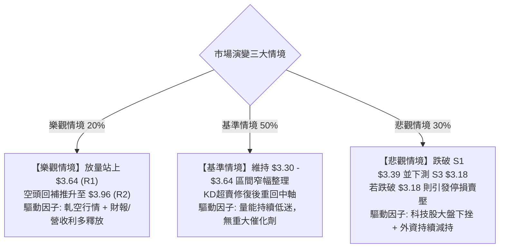

### 🛡️ 風險管理重要提醒

1. **嚴禁左側重倉**：當前均線呈現標準空頭排列，儘管 KD 指標超賣，但超賣可能在弱勢行情中出現鈍化，進場必須嚴格控制單筆虧損於總資產 1% 以內。
2. **波動度適應**：ATR 為 $0.14，設定止損時不得低於 1.0 倍 ATR（$0.14），以防日內雜訊震盪觸發洗盤。
3. **流動性與量能驗證**：目前量比僅 0.57x，量能嚴重不足；任何向上突破若無 45M 以上成交量配合，均視為假突破（Bull Trap）。

---

## 📋 報告總結

```
╔════════════════════════════════════════════════════════════════╗
║                     GRAB 技術分析報告總結                      ║
╠════════════════════════════════════════════════════════════════╣
║ 報告日期：2026-08-23                                           ║
║ 當前價格：$3.48                                                ║
║ 技術評級：⚖️ 偏弱區間震盪 (Neutral-Bearish Range Bound)         ║
╠════════════════════════════════════════════════════════════════╣
║ 關鍵結論：                                                     ║
║ ├─ 長期趨勢：🔴 偏空格局（價格遠低於 MA200 $4.15）              ║
║ ├─ 中期趨勢：🟡 箱體築底（$3.30 – $3.93 區間波動）             ║
║ ├─ 短期趨勢：🔴 承壓回調（受制於 MA5 $3.51 與 MA20 $3.57）     ║
║ ├─ 關鍵支撐：S1 $3.39 │ S2 $3.26 │ S3 $3.18 (52W Low)         ║
║ ├─ 關鍵阻力：R1 $3.64 │ R2 $3.96 │ R3 $4.06                    ║
║ └─ 華爾街共識目標：$5.86 (Low: $4.60 / High: $8.00 / 評級: 強力買入)║
╠════════════════════════════════════════════════════════════════╣
║ 最優策略組合：                                                 ║
║ 1. 🥇 最佳機會：在 S1/S2 ($3.35–$3.39) 區間掛單低吸，防守 $3.17║
║ 2. 🥈 次選機會：反彈至 R1/MA50 ($3.60–$3.64) 受阻時輕倉短空對沖 ║
║ 3. 🥉 保守選擇：空倉觀望，等待日線突破 MA50 或放量站上 $3.64  ║
╚════════════════════════════════════════════════════════════════╝
```

---

> ⚠️ **免責聲明**：本報告為技術分析研究，所有數據及估算均基於歷史價格與客觀技術指標資訊。本報告**僅供研究與學術參考**，**不構成任何投資買賣建議**。金融市場投資具有高度風險，交易者應獨立判斷並自負盈虧。

---

*報告生成時間：2026-08-23 ｜ 數據來源：Yahoo Finance ｜ 分析框架：多時框技術分析體系*