# GRAB 技術分析報告

> **報告日期**：2026-08-25 ｜ **語言**：繁體中文 ｜ **數據來源**：Yahoo Finance ｜ **當前價格**：$3.58

---

## 目錄

| 章節 | 內容 |
|------|------|
| [1. 技術面概覽](#1-技術面概覽) | 訊號儀表板、核心指標、評分卡 |
| [2. 趨勢分析](#2-趨勢分析) | 多時框趨勢、長中短期走勢 |
| [3. 圖表形態分析](#3-圖表形態分析) | 形態識別、K線組合、目標價 |
| [4. 支撐與阻力](#4-支撐與阻力) | 關鍵價位、斐波那契回調 |
| [5. 技術指標深度解讀](#5-技術指標深度解讀) | MA/RSI/MACD/布林/成交量 |
| [6. 動能與波動率](#6-動能與波動率) | 動能評估、ATR、Beta |
| [7. 多時框架總結](#7-多時框架總結) | 時框架評分矩陣 |
| [8. 交易策略建議](#8-交易策略建議) | 多空策略、風險報酬比 |
| [9. 風險提示與監控](#9-風險提示與監控) | 監控指標、風險場景 |

---

## 1. 技術面概覽

### 🎯 技術訊號儀表板

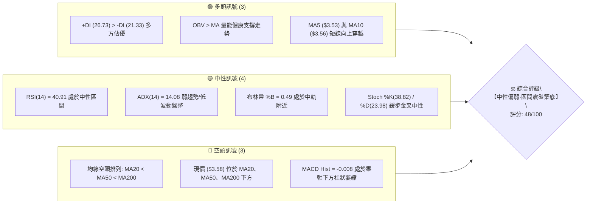

### 📊 核心指標速覽表

| 指標類別 | 指標名稱 | 當前數值 | 訊號 | 解讀 |
|----------|----------|----------|------|------|
| **價格** | 當前價格 | $3.58 | 🟡 | 位於52週區間11.6%低位，處於底部震盪帶 |
| **均線** | MA20 | $3.59 | 🔴 | 現價略低於MA20 (-0.28%)，短線承壓 |
| **均線** | MA50 | $3.61 | 🔴 | 現價低於MA50 (-0.83%)，中期反壓密集 |
| **均線** | MA200 | $4.13 | 🔴 | 現價遠低於MA200 (-13.32%)，長期格局偏空 |
| **動能** | RSI(14) | 40.91 | 🟡 | 位於30-70中性區間，未進入超賣亦無過熱 |
| **動能** | MACD | -0.018 / Hist -0.008 | 🔴 | 雙線在零軸下方運行，但負柱狀圖收斂中 |
| **波動** | ATR(14) | $0.12 (3.26%) | 🟡 | 波動率收窄，進入標準的低波動壓縮期 |

### 🏆 技術評分卡

```
╔══════════════════════════════════════════════════════════════╗
║              技術評分卡 — GRAB (2026-08-25)                 ║
╠══════════════════════════════════════════════════════════════╣
║ 趨勢強度 (ADX=14.08)  ████░░░░░░░░░░░░░░░░  25/100  🔴 弱勢盤整 ║
║ 動能指標 (RSI/MACD)   ████████░░░░░░░░░░░░  42/100  🟡 中性偏弱 ║
║ 支撐穩定度 (S1=$3.50) ██████████████░░░░░░  70/100  🟢 底部具韌性║
║ 成交量配合 (OBV>MA)   ████████████░░░░░░░░  60/100  🟢 量價無背離║
║ 形態完整度 (雙底雛形) ██████████░░░░░░░░░░  50/100  🟡 形態構築中║
║ 均線排列 (空頭排列)   ████████░░░░░░░░░░░░  40/100  🔴 中長天期反壓║
╠══════════════════════════════════════════════════════════════╣
║ 綜合評分              █████████░░░░░░░░░░░  48/100  🟡 中性震盪 ║
╚══════════════════════════════════════════════════════════════╝
```

---

## 2. 趨勢分析

### 🌐 多時框趨勢分析

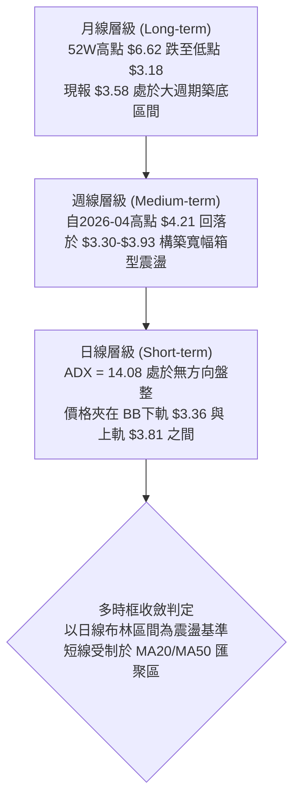

### 📈 長期趨勢 — 12個月走勢圖（Unicode）

```
GRAB 月線歷史走勢圖（過去12個月：2025-08 至 2026-08）
價格軸 ($)
$6.02 ┤            ●(09/25) ●(10/25)
$5.45 ┤                         ●(11/25)
$4.99 ┤●(08/25)                     ●(12/25)
$4.30 ┤                                  ●(01/26) ●(02/26)
$3.82 ┤                                                 ●(04/26)
$3.58 ┤━━━━━━━━━━━━━━━━━━━━━━━━━━━━━━━━━━━━━━━━━━━━━━━━━━━━━●(08/26: $3.58 現價)
$3.50 ┤                                            ●(03/26) ●(05/26) ●(07/26)
      └─────────────────────────────────────────────────────────────
       08/25 09/25 10/25 11/25 12/25 01/26 02/26 03/26 04/26 05/26 06/26 07/26 08/26
```

**走勢特徵分析表格**：

| 階段 | 時間區間 | 起始/結束價 | 漲跌幅 | 核心特徵解讀 |
|------|----------|------------|--------|--------------|
| 1. 衝高衝頂 | 2025-08 ~ 2025-10 | $4.99 → $6.01 (高點$6.62) | +20.44% | 巨量拉升突破，觸及52週歷史高點後出現頂部滯漲 |
| 2. 主跌回調 | 2025-11 ~ 2026-03 | $5.45 → $3.66 | -32.84% | 均線跌破空頭排列，流動性外流，連續5個月收陰 |
| 3. 箱型築底 | 2026-04 ~ 2026-08 | $3.82 → $3.58 (低點$3.18) | -6.28% | 價格在 $3.30-$3.93 區間收斂，量能萎縮，進入籌碼沈澱期 |

### 📊 中期趨勢（週線分析）

從近20週的收盤數據觀察：
- **波段高點**：2026-04-19 錄得 $4.21（週 RSI 達 82.7 過熱），隨後在 2026-07-12 形成次高點 $3.93（週 RSI 68.4），高點呈現下移態勢。
- **波段低點**：2026-06-14 下探至 $3.30 後強彈，2026-07-26 再次回測 $3.31 獲得強烈支撐，低點在 $3.30 形成水平防線。
- **當前週線狀態**：2026-08-30 收盤報 $3.58，週 MACD 柱狀圖由 -0.015 收窄至 -0.008，週 RSI 回升至 40.9，顯示中線拋壓衰竭，處於箱體中下緣整理。

### ⚡ 趨勢強度評估（ADX 解讀）

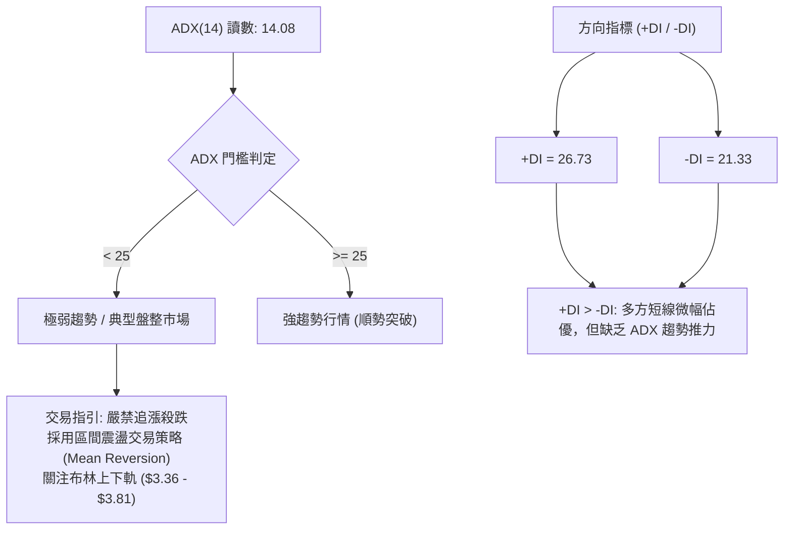

| 指標 | 數值 | 狀態 | 意涵解讀 |
|------|------|------|----------|
| **ADX(14)** | 14.08 | 弱勢盤整 (無趨勢) | 市場缺乏單邊推動力，任何假突破均易引發均值回歸 |
| **+DI** | 26.73 | 多方進攻 | 短期買盤微幅增強，多方佔據主動權 |
| **-DI** | 21.33 | 空方防守 | 空方拋壓減輕，未見主動殺跌盤 |

---

## 3. 圖表形態分析

### 🔍 形態識別系統

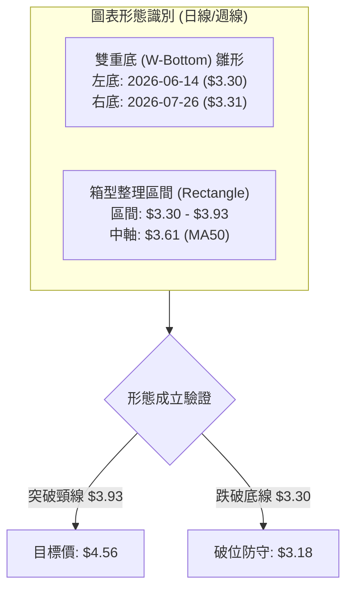

**形態信心度與目標價計算表**：

| 形態 | 信心度 | 判斷依據（引用數據） | 完成度 | 目標價（附計算式） |
|------|--------|----------------------|--------|--------------------|
| **雙重底 (W-Bottom)** | 60% | 兩次週線低點分別於 2026-06-14 的 $3.30 與 2026-07-26 的 $3.31，頸線位於 2026-07-12 高點 $3.93 | 65% | 頸線 $3.93 + 形態高度 ($3.93 - $3.30 = $0.63) = **$4.56** |
| **箱型整理 (Box)** | 75% | 價格在 S2 ($3.39)/S1 ($3.50) 至 R2 ($3.96) 間反覆震盪，ADX=14.08 確認無方向盤整 | 80% | 箱體上軌突破推算：$3.96 + ($3.96 - $3.39 = $0.57) = **$4.53** |
| **頭肩底形態** | 30% | 數據中未偵測到完整的左肩與右肩對稱結構 | 0% | 訊號不足，僅做指標型與箱型解讀，不預設目標價 |

### 🕯️ 重要K線形態分析

| 週期/月份 | 收盤價 | K線形態 | 解讀 | 訊號 |
|-----------|--------|---------|------|------|
| **2026-06-14** | $3.30 | 探底長下影線 | 回測 52W 低點 $3.18 上方，買盤進駐，確認短期底部 | 🟢 |
| **2026-07-12** | $3.93 | 衝高回落十字星 | 逼近 R2 ($3.96) 遭遇強大技術拋壓，RSI(68.4) 呈現短線超買 | 🔴 |
| **2026-07-26** | $3.31 | 二次探底小陽線 | 未跌破前低 $3.30，構築雙底右腳，量能縮小至 2.02 億股 | 🟢 |
| **2026-08-30** | $3.58 | 窄幅整理陽線 | 價格重回 MA5 ($3.53) 與 MA10 ($3.56) 之上，波動率大幅收窄 | 🟡 |

### 📉 ASCII 走勢形態示意圖

```
GRAB 箱型震盪與雙底示意圖
$3.96 ┼─────────────────────────●(07/12: $3.93)─────── R2 箱頂阻力 / 頸線
      │                        ／ ╲
$3.64 ┼───────●(04/26: $3.90)─／───╲─────●(08/09: $3.66)─ R1 關鍵阻力
      │      ／ ╲            ／     ╲   ／ ╲
$3.58 ┼─────┼───┼──────────┼───────┼─●(現價: $3.58)── 中軸震盪帶
      │   ／     ╲        ／         ╲／
$3.30 ┼──●(06/14: $3.30)─●(07/26: $3.31)───────────── S2/箱底強支撐
      └────────────────────────────────────────────────────
          【左底 L1】         【右底 L2】
```

### 🎯 形態目標價計算

1. **雙底突破目標價**：
   - 頸線（Neckline）= 2026-07-12 高點 $3.93（聚類於阻力位 R2 $3.96）
   - 底部支撐（Bottom）= 2026-06-14 低點 $3.30
   - 形態垂直高度（Height）= $3.93 - $3.30 = $0.63
   - **理論上行目標價** = $3.93 + $0.63 = **$4.56**（高度吻合 61.8% 斐波那契位 $4.49）
2. **箱體破位下行風險價**：
   - 箱底支撐 = $3.30
   - 破位下跌等幅目標 = $3.30 - $0.63 = **$2.67**（若失守 52W 低點 $3.18 之後的極端風險值）

---

## 4. 支撐與阻力

### 🗺️ 關鍵價位分布圖（Unicode）

```
GRAB 價位結構與籌碼密集分布圖
═════════════════════════════════════════════════════════════════
$4.49 ║██████████████████████████████║ 斐波那契 61.8% / MA240 ($4.44)
$4.13 ║██████████████████████        ║ 長期均線 MA200 反壓
$4.06 ║████████████████████████████  ║ 強阻力 R3 (+13.41%)
$3.96 ║████████████████████████      ║ 波段阻力 R2 (+10.52%) / 斐波 78.6% ($3.92)
$3.64 ║██████████████████            ║ 近期阻力 R1 (+1.58%) / MA120 ($3.66)
$3.58 ╠══════════════════════════════╣ ◄ 當前價格 $3.58 (BB中軌 $3.59)
$3.50 ║▓▓▓▓▓▓▓▓▓▓▓▓▓▓▓▓▓▓▓▓▓▓▓▓▓▓    ║ 近期關鍵支撐 S1 (-2.23%)
$3.39 ║████████████████████████████  ║ 強支撐 S2 (-5.31%) / BB下軌 ($3.36)
$3.26 ║██████████████████████████████║ 極限防守支撐 S3 (-9.08%)
$3.18 ║██████████████████████████████║ 52週歷史低點 (斐波那契 100%)
═════════════════════════════════════════════════════════════════
```

### 🚧 阻力位分析表

| 阻力級別 | 價位 | 形成原因 | 突破難度 | 重要性 |
|----------|------|----------|----------|--------|
| **R1** | **$3.64** | 近一年波段高點聚類、MA50 ($3.61) 及 MA120 ($3.66) 匯聚壓制 | 🟡 中等 | 短線多空分水嶺，站穩方可打開反彈空間 |
| **R2** | **$3.96** | 近一年重要波段高點聚類、斐波那契 78.6% ($3.92) 重合區 | 🔴 極高 | 中期箱頂強阻力，多次衝高受阻回落 |
| **R3** | **$4.06** | 近一年波段高點聚類、整數關口及 MA200 ($4.13) 下方防線 | 🔴 極高 | 牛熊轉換關鍵門檻，需巨量配合方可攻克 |

### 🛡️ 支撐位分析表

| 支撐級別 | 價位 | 形成原因 | 守住機率 | 重要性 |
|----------|------|----------|----------|--------|
| **S1** | **$3.50** | 近一年波段低點聚類、2026-08-02 探底回升低點 | 🟢 75% | 日線短線多頭防線，失守將考驗下軌 |
| **S2** | **$3.39** | 近一年波段低點聚類、日線布林通道下軌 ($3.36) 密集帶 | 🟢 85% | 箱型下邊界強支撐，歷史多次驗證買盤承接 |
| **S3** | **$3.26** | 近一年波段極限低點聚類、接近 52W 低點 $3.18 之最後防禦 | 🟢 90% | 戰略級長期底部防線，失守代表下行空間重啟 |

### 📐 斐波那契回調位分析

依據 52 週波段區間：高點 **$6.62** → 低點 **$3.18**（計算基準總區間幅度 $3.44）：

| 回調比例 | 價位 | 當前相對位置與技術意義解讀 |
|----------|------|----------------------------|
| **0.0% (52W High)** | **$6.62** | 歷史頂部壓力區，目前距離 +84.92% |
| **23.6%** | **$5.81** | 分析師平均目標價 ($5.86) 所在區域 |
| **38.2%** | **$5.31** | 中長線反轉的第一道強阻力區 |
| **50.0%** | **$4.90** | 多空中樞分水嶺 |
| **61.8%** | **$4.49** | 黃金分割強阻力，貼近 MA240 ($4.44) 與雙底目標價 ($4.56) |
| **78.6%** | **$3.92** | **現價格上方首個斐波阻力**，緊貼阻力位 R2 ($3.96) 與頸線 ($3.93) |
| **100.0% (52W Low)** | **$3.18** | 52 週最低點，終極結構性支撐位 |

**現價定位結論**：現價 **$3.58** 處於斐波那契 **78.6% ($3.92)** 與 **100.0% ($3.18)** 之間的深度回調打底區間（處於全波段的 11.6% 相對低位）。下檔緊鄰 100% 支撐帶，下行空間受限，但上方受制於 78.6% ($3.92) 壓制。

---

## 5. 技術指標深度解讀

### 🎛️ 指標訊號總覽

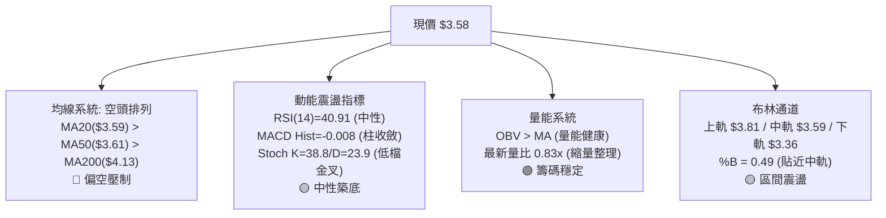

### 📈 移動平均線排列分析

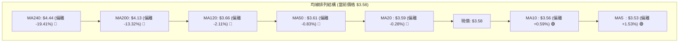

**均線系統深度解讀**：
- **短天期均線金叉**：MA5 ($3.53) 向上穿越 MA10 ($3.56)，現價站上 MA5 與 MA10，短線止跌跡象明確。
- **中長天期均線壓制**：MA20 ($3.59)、MA50 ($3.61)、MA120 ($3.66) 在 $3.59-$3.66 區間形成極度密集的「均線黏合阻力帶」，此區間與阻力位 R1 ($3.64) 重疊。
- **均線排列判定**：中長線呈現標準空頭排列（MA20 < MA50 < MA200），表明大週期趨勢尚未扭轉，現階段僅屬於短線超跌反彈與箱底築底行情。

### 📉 RSI(14) 分析

```
RSI(14) 數值儀表板:
0 ──────────── 30 ──────────────── 50 ──────────────── 70 ──────────── 100
[   超賣區     ] [     弱勢區     │     強勢區         ] [   超買區     ]
                 █████████████████ (40.91)
```

- **當前讀數**：**40.91**（處於 30–70 中性弱勢區間）。
- **背離分析判斷**：
  - **日線/週線底背離檢驗**：觀察週線走勢，2026-06-14 低點 $3.30 時 RSI 為 37.9，2026-07-26 二次探底 $3.31 時 RSI 降至 25.9，隨後在 2026-08-30 價格收 $3.58 時 RSI 迅速修復至 40.9。**無典型底背離，但呈現低檔超賣鈍化後的正常修復態勢**。
  - **結論**：RSI 位於 40.91，遠離 70 超買區，短線向上反彈至 R1 ($3.64) 或 BB上軌 ($3.81) 不存在超買阻力。

### 📊 MACD(12/26/9) 訊號解讀

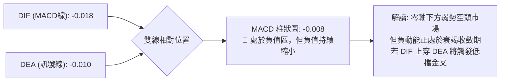

- **MACD 現況**：MACD 線 (-0.018) 低於 Signal 線 (-0.010)，柱狀圖為 **-0.008**。
- **柱狀圖動態**：近三週週線 MACD 柱狀圖由 -0.025 (08-02) 縮小至 -0.015 (08-23)，最新縮至 -0.008，顯示空方動能明顯減退，即將在庫存底部形成零軸下方的低位金叉。

### 📦 布林通道分析

```
GRAB 日線布林通道 (Bollinger Bands 20, 2) 結構圖
$3.81 ┬────────────────────────────────────────── BB 上軌 (阻力區)
      │
$3.59 ┼───────────────────●(現價 $3.58: %B=0.49)── BB 中軌 (MA20)
      │
$3.36 ┴────────────────────────────────────────── BB 下軌 (強支撐)
```

- **通道帶寬**：上軌 **$3.81**，中軌 **$3.59**，下軌 **$3.36**，通道寬度僅 $0.45（約 12.5% 帶寬），通道呈現明顯的水平收口狀態（Squeeze），預示變盤在即。
- **%B 指標**：目前 **%B = 0.49**，價格精確貼近中軌（MA20 $3.59），多空力量在通道中軸達成短期平衡。

### 💹 成交量分析（量價配合度）

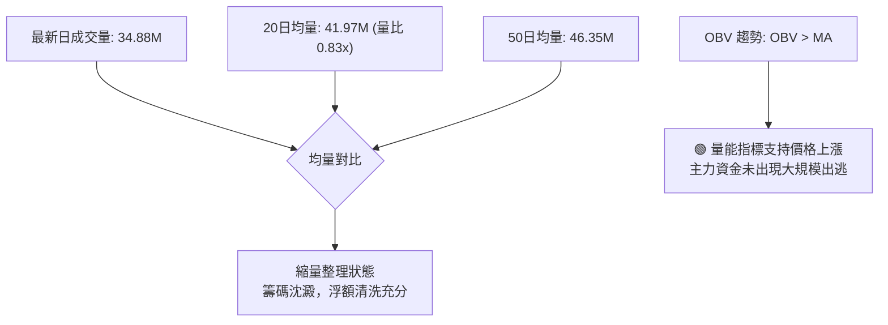

- **量價特徵**：最新成交量為 34,877,619 股，低於 20 日均量（量比 0.83x），呈現「縮量盤整」格局。在底部震盪行情中，縮量代表拋壓衰竭。
- **OBV 指標**：數據確認「OBV > MA」，表明資金面在 $3.30-$3.50 區間呈現溫和淨流入，量價配合健康，無量價背離隱憂。

---

## 6. 動能與波動率

### ⚡ 動能評估四象限

| 象限 | 動能強度 | 波動率 | 當前狀態 | 策略應對指引 |
|------|----------|--------|----------|--------------|
| **Q1 (爆發區)** | 強動能 (ADX>25) | 低波動 (ATR壓縮) | — | 突破進場最佳時機 |
| **Q2 (盤整打底區)** | **弱動能 (ADX=14.08)** | **低波動 (ATR=$0.12)** | **✓ GRAB 當前定位** | **區間低吸高拋，耐心等待箱體邊界** |
| **Q3 (強烈單邊區)** | 強動能 (ADX>25) | 高波動 (ATR擴大) | — | 順勢持有，移動止損 |
| **Q4 (混亂洗盤區)** | 弱動能 (ADX<25) | 高波動 (ATR擴大) | — | 觀望為主，避免頻繁交易 |

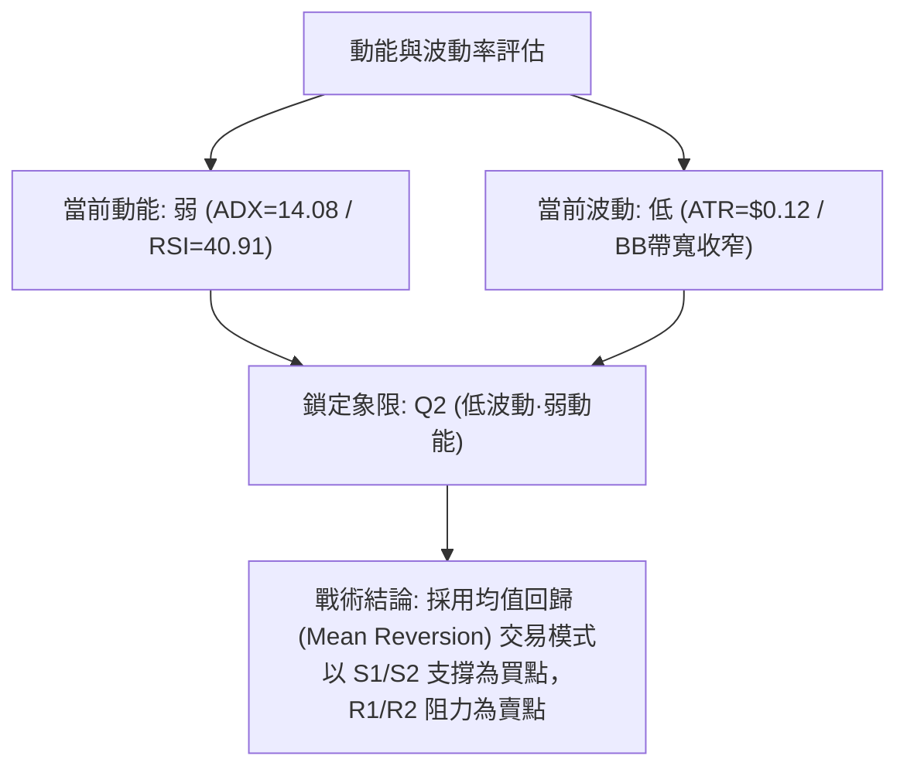

### 📊 ATR 波動率分析

- **ATR(14) 數值**：**$0.12**（佔當前股價之 **3.26%**）。
- **日內/波段波動特徵**：日均震盪幅度僅 12 美分，波動率處於過去一年低谷期。
- **止損與風控設置指引**：
  - 短線交易止損緩衝空間建議設為 **1.5 × ATR = $0.18**。
  - 波段交易止損緩衝空間建議設為 **2.0 × ATR = $0.24**。

### 📐 Beta 與市場相關性

- **Beta 係數**：**0.89**。
- **市場屬性解讀**：Beta < 1.0，表明 GRAB 相對美股大盤（標普500/納斯達克）具備一定的低敏感性與防禦性，系統性風險衝擊相對可控，走勢更依賴自身基本面營運（QoQ 獲利大幅增長）與技術面箱體演化。

---

## 7. 多時框架總結

### 📋 時框架評分表

| 時框架 | 趨勢方向 | 動能狀態 | 均線排列 | 圖表形態 | 綜合評分 | 戰術建議 |
|--------|----------|----------|----------|----------|----------|----------|
| **短期 (日線)** | 🟡 橫盤震盪 | 🟡 RSI 40.91 / Stoch 金叉 | 🔴 MA20/50 壓制 | 🟡 布林中軌整理 | **50/100** | 區間操作，高拋低吸 |
| **中期 (週線)** | 🟡 築底收斂 | 🟢 MACD負柱收窄 | 🔴 均線空頭排列 | 🟢 雙底雛形 ($3.30/$3.31) | **52/100** | 回測支撐分批佈局 |
| **長期 (月線)** | 🔴 深度調整 | 🔴 52W低位震盪 | 🔴 MA200 遠在上方 | 🟡 歷史底部支撐 | **42/100** | 長線資金金字塔建倉 |

### 🔲 綜合訊號矩陣

```
╔══════════════════════════════════════════════════════════════════╗
║                    多時框綜合訊號矩陣                            ║
╠══════════════════════════════════════════════════════════════════╣
║ 維度         短期 (日線)          中期 (週線)          長期 (月線) ║
║ 趨勢方向     🟡 震盪 (ADX 14)     🟡 箱型整理          🔴 空頭回調 ║
║ 核心指標     🟡 布林 %B=0.49      🟢 MACD 負柱收縮     🔴 跌破MA200║
║ 量能支持     🟢 OBV > MA          🟢 週量溫和萎縮      🟡 均量持平 ║
║ 關鍵位置     S1 $3.50 / R1 $3.64  S2 $3.39 / R2 $3.96  52W低 $3.18 ║
╠══════════════════════════════════════════════════════════════════╣
║ 一致性判定   短期與中期在 $3.30-$3.96 區間達成強烈共振平衡       ║
╚══════════════════════════════════════════════════════════════════╝
```

### ⚖️ 多時框收斂結論

依據多時框收斂規則：
1. **行情性質判定**：當前 **ADX(14) = 14.08 (< 25)**，技術面嚴格定義為**「無趨勢之低波動盤整行情」**。
2. **主導時框與交易規則**：在盤整行情下，**日線布林通道（$3.36 - $3.81）與箱型支撐阻力為最高優先級交易基準**，中長期的均線空頭排列僅代表上方反彈空間受限，不代表會立即向下破位。
3. **唯一方向性結論**：**【中性觀望·區間底部偏多操作】**。以回測支撐 S1 ($3.50)/S2 ($3.39) 逢低吸納為主，嚴禁在 R1 ($3.64)/R2 ($3.96) 阻力處追高。

---

## 8. 交易策略建議

### 🗺️ 策略決策流程圖

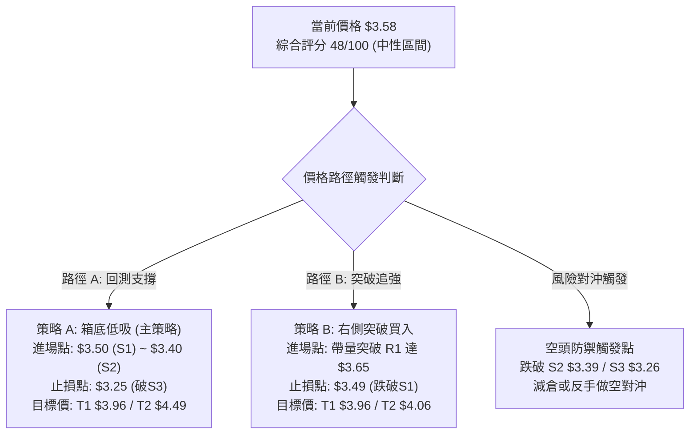

### 🧭 策略路由

> **當前主策略方向 = 【中性區間震盪·箱底逢低做多】（依評分卡 48/100，處於 40–60 區間操作模式）**

### 🎯 價格情境階梯（Price Scenarios）

| 觸發條件 | 下一目標 | 後續延伸 | 情境含義與操作指引 |
|----------|----------|----------|-------------------|
| **向上突破 R1 $3.64** | **R2 $3.96** | **R3 $4.06** | 短線轉強，突破均線黏合區，直奔雙底頸線 |
| **維持現價 $3.58 震盪** | **MA20 $3.59** | **MA50 $3.61** | 區間窄幅整理，籌碼沈澱，以時間換取空間 |
| **向下跌破 S1 $3.50** | **S2 $3.39** | **S3 $3.26** | 回測箱體下軌與布林下軌，為二次回踩做多機會 |
| **跌破 S3 $3.26 / $3.18** | **—** | **—** | 形態破位，多頭止損離場，趨勢轉為加速探底 |

### 📊 情境機率分佈

| 情境劇本 | 估計機率 | 主要技術指標依據 |
|----------|----------|------------------|
| **情境一：箱體內震盪向上反彈** | **55%** | OBV量能支持、+DI(26.73)>-DI(21.33)、MACD柱狀圖收斂、雙底形態支撐 |
| **情境二：窄幅橫盤拉鋸整理** | **30%** | ADX=14.08 極弱趨勢、ATR=$0.12 波動收窄、布林通道水平收口 |
| **情境三：跌破支撐向下探底** | **15%** | 均線空頭排列壓制、現價位於 MA200 下方 |

### 🟢 主策略詳情

依據評分卡 48/100 路由，主推**箱底低吸（策略 A）**與**右側突破（策略 B）**兩大實戰方案：

| 策略要素 | 策略 A：箱底低吸做多 (Mean Reversion) | 策略 B：右側突破追多 (Momentum Breakout) |
|----------|---------------------------------------|------------------------------------------|
| **適用場景** | 價格回測 S1 支撐或在現價附近分批吸納 | 價格放量突破 R1 及 MA50 阻力確認轉強 |
| **進場價格** | **$3.50**（分批區間：$3.48 - $3.52） | **$3.65**（突破 R1 $3.64 後確認進場） |
| **目標價 T1** | **$3.96**（阻力位 R2 / 頸線，獲利 +13.14%） | **$3.96**（阻力位 R2，獲利 +8.49%） |
| **目標價 T2** | **$4.49**（斐波那契 61.8% 位，獲利 +28.29%）| **$4.06**（阻力位 R3 / MA200，獲利 +11.23%）|
| **止損價格** | **$3.25**（跌破支撐 S3 $3.26 止損，虧損 -7.14%）| **$3.49**（跌破支撐 S1 $3.50 止損，虧損 -4.38%）|
| **風險報酬比** | **1.84 : 1** (以T1計) / **3.96 : 1** (以T2計) | **1.94 : 1** (以T1計) / **2.56 : 1** (以T2計) |
| **預估勝率** | **65%** | **55%** |
| **建議倉位** | **15% - 20%** 總資金 | **10% - 15%** 總資金 |

### 🔴 反向風險觸發點（對沖提示）

- **多頭嚴格止損點**：若日線收盤價跌破 **S2 ($3.39)**，應立即將多頭倉位減半；若跌破 **S3 ($3.26)**，必須無條件清倉多頭。
- **空頭對沖啟動點**：若價格失守 **$3.26** 且伴隨放量，表明雙底形態徹底失效，可建立 5% 倉位之空頭對沖頭寸，下看 52W 低點 **$3.18** 及整數關口。

### ⭐ 整體訊號強度評星

```
╔══════════════════════════════════════════════════╗
║ 做多訊號強度：  ★★★☆☆  (3.0 / 5 星) — 具備風險報酬比 ║
║ 做空訊號強度：  ★★☆☆☆  (2.0 / 5 星) — 空間受限於低位 ║
║ 整體可信度：    ★★★★☆  (4.0 / 5 星) — 指標結構吻合 ║
╚══════════════════════════════════════════════════╝
```

---

## 9. 風險提示與監控

### ✅ 關鍵監控指標 Checklist

```
╔══════════════════════════════════════════════════════════════╗
║              GRAB 技術面每日監控清單 (Checklist)              ║
╠══════════════════════════════════════════════════════════════╣
║ [ ] 1. 價格是否站穩 MA20 ($3.59) 與 MA50 ($3.61)             ║
║ [ ] 2. 日線 RSI(14) 是否向上突破 50 中軸分水嶺              ║
║ [ ] 3. MACD 柱狀圖是否由負轉正 (觸發低位金叉)                 ║
║ [ ] 4. 日成交量是否放大突破 20 日均量 (41.97M 股)            ║
║ [ ] 5. ADX(14) 是否自 14.08 拐頭向上升破 20 (趨勢啟動訊號)   ║
║ [ ] 6. 下檔防守價 S1 ($3.50) 與 S2 ($3.39) 是否完好無損      ║
║ [ ] 7. 空頭借券賣出比率 (Short % Float = 7.9%) 是否引發軋空   ║
╚══════════════════════════════════════════════════════════════╝
```

### ⚠️ 風險場景分析

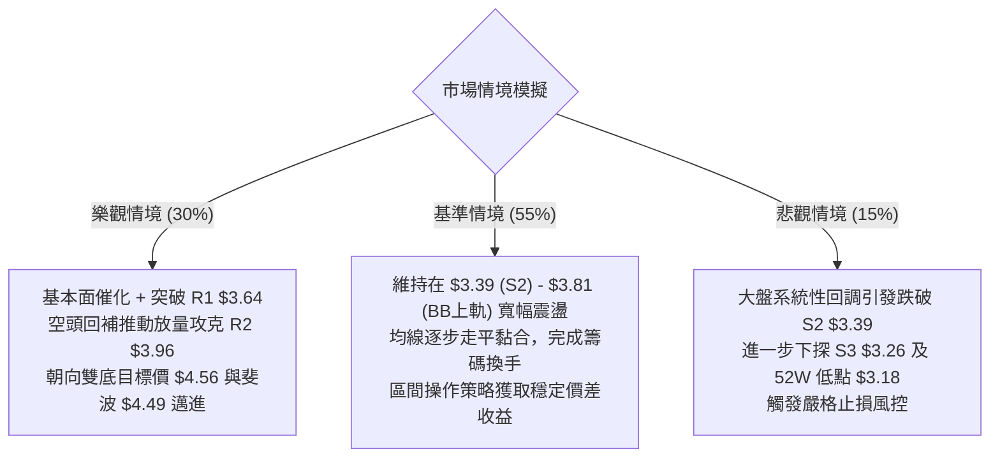

### 🛡️ 風險管理重要提醒

1. **嚴禁在區間中軸追價**：現價 $3.58 距離阻力 R1 ($3.64) 僅 1.58%，不可在阻力位前盲目追多，務必等待回調 S1 ($3.50) 附近或實質突破 R1 後再行介入。
2. **波動率壓縮引發變盤風險**：ATR 降至 $0.12、ADX 降至 14.08，布林通道進入極度壓縮狀態。歷史經驗表明，低波動整理後必然伴隨劇烈的單邊方向選擇，交易者必須預設嚴格止損點。
3. **空頭比例與流動性監控**：空頭借券比為 7.9%（Short Ratio 6.03 天），若價格帶量站穩 R2 ($3.96)，可能引發顯著的軋空（Short Squeeze）行情，屆時可適度上移目標價至斐波那契 61.8% ($4.49)。

---

## 📋 報告總結

```
╔══════════════════════════════════════════════════════════════════╗
║                    GRAB 技術分析報告總結                         ║
╠══════════════════════════════════════════════════════════════════╣
║ 報告日期：2026-08-25                                             ║
║ 當前價格：$3.58                                                  ║
║ 分析評級：⚖️ 中性偏多震盪築底 (評分: 48/100)                     ║
╠══════════════════════════════════════════════════════════════════╣
║ 關鍵結論：                                                       ║
║ ├─ 長期趨勢：🔴 處於 52W 高點 $6.62 回落之大週期底部整理區間    ║
║ ├─ 中期趨勢：🟢 於 $3.30 與 $3.31 構築雙重底雛形，箱型震盪收斂   ║
║ ├─ 短期趨勢：🟡 ADX=14.08 無趨勢盤整，價格貼近布林中軌 $3.59    ║
║ ├─ 關鍵支撐：S1: $3.50  /  S2: $3.39  /  S3: $3.26              ║
║ ├─ 關鍵阻力：R1: $3.64  /  R2: $3.96  /  R3: $4.06              ║
║ └─ 分析師目標：共識評級 Strong Buy，目標價均值 $5.86 (空間+63.7%)║
╠══════════════════════════════════════════════════════════════════╣
║ 最優策略組合：                                                   ║
║ 1. 🥇 最佳機會 (策略 A)：回測支撐 S1 $3.50 低吸，止損 $3.25，     ║
║    目標 T1 $3.96 / T2 $4.49，風險報酬比優異 (1.84:1 ~ 3.96:1)   ║
║ 2. 🥈 次選機會 (策略 B)：放量突破 R1 於 $3.65 右側跟進，止損 $3.49║
║ 3. 🥉 保守選擇：空倉觀望，等待日線帶量突破 $3.64 或確認金叉後進場 ║
╚══════════════════════════════════════════════════════════════════╝
```

---

> ⚠️ **免責聲明**：本報告為 AI 自動生成之技術分析，所有數據及估算均基於提供的歷史價格資訊。本報告**僅供研究與學術參考**，**不構成任何投資建議**。投資有風險，入市需謹慎。

---

*報告生成時間：2026-08-25 ｜ 數據來源：Yahoo Finance ｜ 分析框架：多時框技術分析*