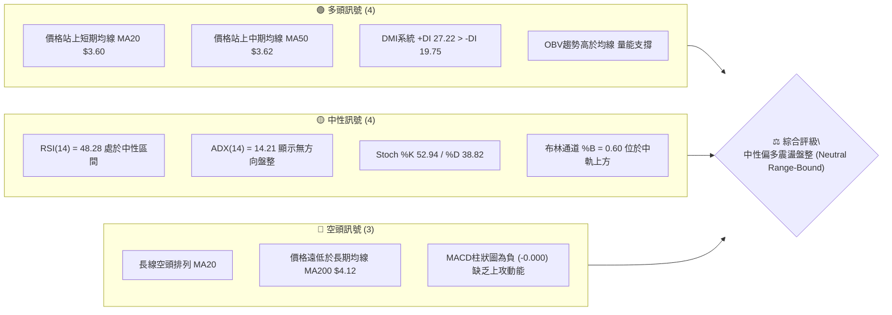
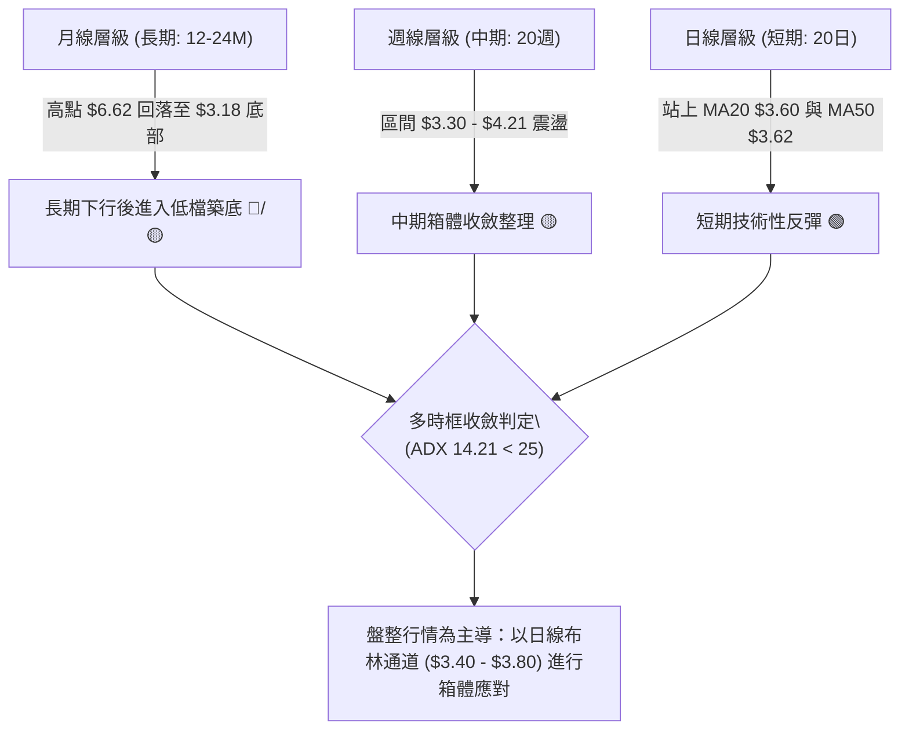
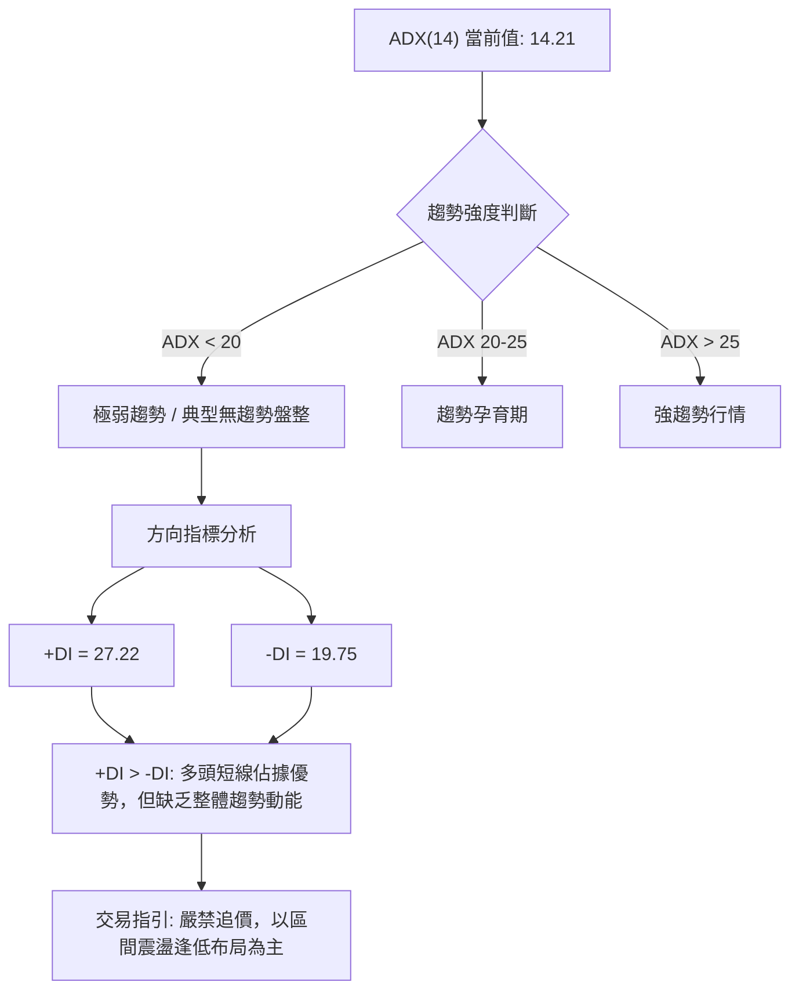
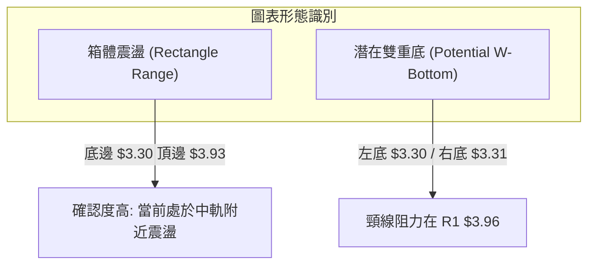
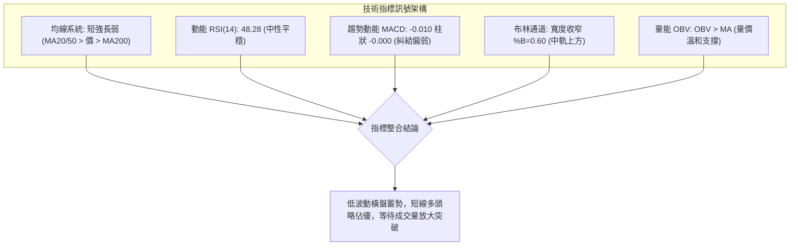
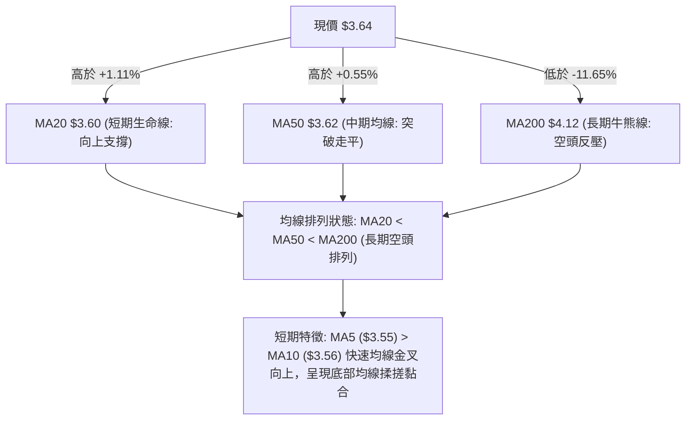
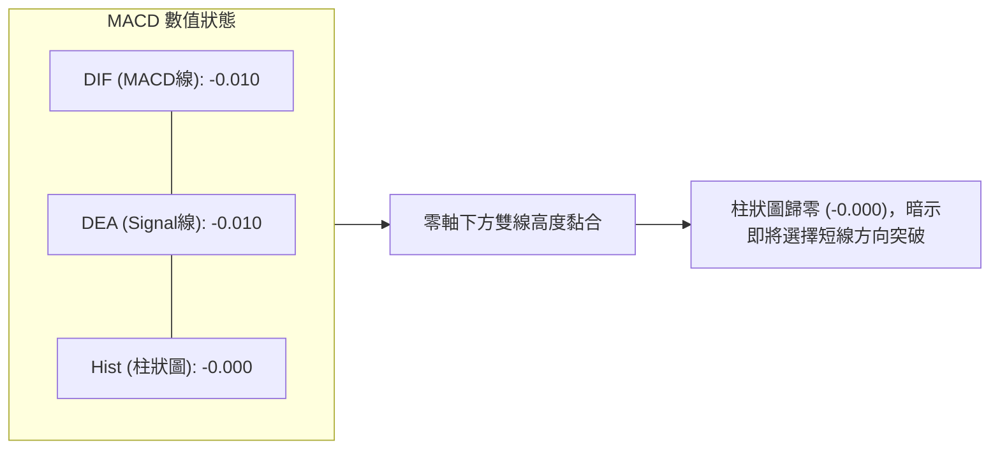
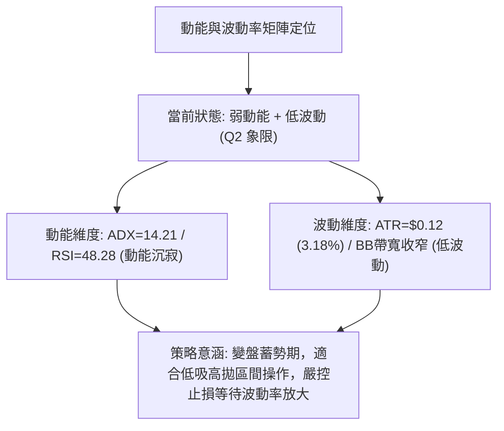
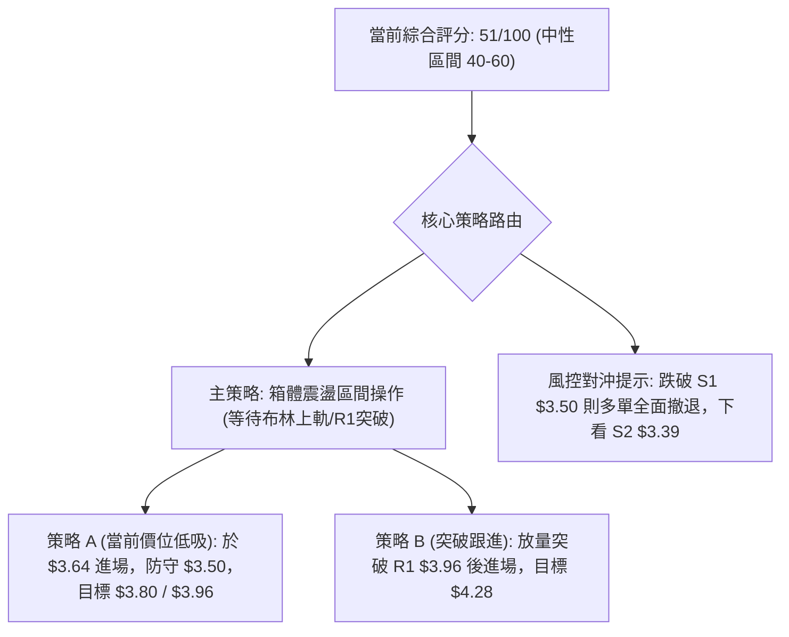
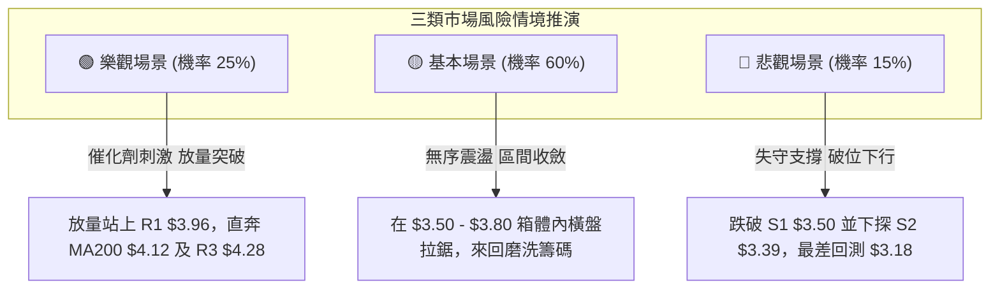

# GRAB 技術分析報告

> **報告日期**：2026-08-27 ｜ **語言**：繁體中文 ｜ **數據來源**：Yahoo Finance ｜ **當前價格**：$3.64

---

## 目錄

| 章節 | 內容 |
|------|------|
| [1. 技術面概覽](#1-技術面概覽) | 訊號儀表板、核心指標、評分卡 |
| [2. 趨勢分析](#2-趨勢分析) | 多時框趨勢、長中短期走勢 |
| [3. 圖表形態分析](#3-圖表形態分析) | 形態識別、K線組合、目標價 |
| [4. 支撐與阻力](#4-支撐與阻力) | 關鍵價位、斐波那契回調 |
| [5. 技術指標深度解讀](#5-技術指標深度解讀) | MA/RSI/MACD/布林/成交量 |
| [6. 動能與波動率](#6-動能與波動率) | 動能評估、ATR、Beta |
| [7. 多時框架總結](#7-多時框架總結) | 時框架評分矩陣 |
| [8. 交易策略建議](#8-交易策略建議) | 多空策略、風險報酬比 |
| [9. 風險提示與監控](#9-風險提示與監控) | 監控指標、風險場景 |

---

## 1. 技術面概覽

### 🎯 技術訊號儀表板



### 📊 核心指標速覽表

| 指標類別 | 指標名稱 | 當前數值 | 訊號 | 解讀 |
|----------|----------|----------|------|------|
| **價格** | 當前價格 | $3.64 | 🟡 中性 | 處於52週區間底部13.4%位置，低檔築底 |
| **均線** | MA20 | $3.60 | 🟢 看多 | 股價位於MA20上方 (+1.11%)，短線反彈站穩 |
| **均線** | MA50 | $3.62 | 🟢 看多 | 股價小幅突破MA50 (+0.55%)，短期動能改善 |
| **均線** | MA200 | $4.12 | 🔴 看空 | 股價受壓於MA200下方 (-11.65%)，長線趨勢仍偏空 |
| **動能** | RSI(14) | 48.28 | 🟡 中性 | 位於30-70平衡區，無超買超賣，短線無背離 |
| **動能** | MACD (12,26,9) | -0.010 / -0.010 | 🔴 看空 | MACD線與訊號線糾結，柱狀圖 -0.000 偏弱 |
| **動能** | Stoch (14,3,3) | %K 52.94 / %D 38.82 | 🟢 看多 | %K 自低檔金叉 %D 向上，短線動能偏多 |
| **趨勢** | ADX(14) | 14.21 (+DI 27.22) | 🟡 盤整 | ADX < 25 處於弱趨勢盤整，但多方佔優 (+DI > -DI) |
| **通道** | 布林通道 (20,2) | $3.40 - $3.80 | 🟡 中性 | %B = 0.60，價格運行於中軌($3.60)與上軌之間 |
| **量能** | 成交量 / OBV | 33.09M (量比 0.82) | 🟢 看多 | OBV大於均線，量縮整理中量能架構維持支撐 |
| **波動** | ATR(14) | $0.12 (3.18%) | 🟡 中性 | 每日波動維持正常水準，無異常放大 |

### 🏆 技術評分卡

```
╔══════════════════════════════════════════════════════════════════╗
║                 技術評分卡 — GRAB (2026-08-27)                  ║
╠══════════════════════════════════════════════════════════════════╣
║ 趨勢強度 (ADX=14.21)    ████░░░░░░░░░░░░░░░░  25/100  🔴 弱勢盤整 ║
║ 短期動能 (RSI/Stoch)    ███████████░░░░░░░░░  55/100  🟡 中性偏多 ║
║ 支撐穩定度 (S1=$3.50)   ██████████████░░░░░░  70/100  🟢 底部支撐 ║
║ 成交量配合 (OBV>MA)     ████████████░░░░░░░░  60/100  🟢 量能回穩 ║
║ 形態完整度 (箱體整理)   ███████████░░░░░░░░░  55/100  🟡 築底結構 ║
║ 均線排列 (空頭但站短期) ████████░░░░░░░░░░░░  40/100  🟡 短強長弱 ║
╠══════════════════════════════════════════════════════════════════╣
║ 綜合評分                ███████████░░░░░░░░░  51/100  🟡 中性觀望 ║
╚══════════════════════════════════════════════════════════════════╝
```

---

## 2. 趨勢分析

### 🌐 多時框趨勢分析



### 📈 長期趨勢 — 12個月走勢圖（Unicode）

```
GRAB 月線走勢圖（過去12個月：2025-09 至 2026-08）
價格軸 ($)
$6.50 ┤ ●(2025-09 $6.02)
$6.00 ┤  ●(2025-10 $6.01)
$5.50 ┤   ●(2025-11 $5.45)
$5.00 ┤    ●(2025-12 $4.99)
$4.50 ┤     ●(2026-01 $4.30)
$4.00 ┤      ●(2026-02 $4.22)   ●(2026-04 $3.82)
$3.50 ┤       ●(2026-03 $3.66)   ●(2026-05 $3.54) ●(2026-06 $3.77) ●(2026-07 $3.50) ●(2026-08 $3.64 現價)
$3.00 ┤                                                                                
      └─┬──────┬──────┬──────┬──────┬──────┬──────┬──────┬──────┬──────┬──────┬──────┬──────
       09月   10月   11月   12月   01月   02月   03月   04月   05月   06月   07月   08月
```

#### 走勢特徵分析表格

| 階段 | 期間 | 價格區間 | 累積漲跌幅 | 走勢特徵與量價解讀 |
|------|------|----------|------------|--------------------|
| **見頂回落期** | 2025-09 ~ 2025-11 | $6.02 → $5.45 | -9.47% | 於52週高點 $6.62 附近受阻，形成雙重頂後放量轉跌 |
| **主跌波段** | 2025-11 ~ 2026-03 | $5.45 → $3.66 | -32.84% | 單邊下行，跌破MA200，空頭排列完全確立 |
| **築底收斂期** | 2026-03 ~ 2026-08 | $3.66 → $3.64 | -0.55% | 於 $3.30 - $3.93 構築寬幅箱體，跌勢趨緩，波動率壓縮 |

### 📊 中期趨勢（週線分析）

從近20週收盤數據觀察：
- **波段高點**：2026-04-19 達到 $4.21（RSI 達 82.7 超買），2026-07-12 反彈高點 $3.93（受阻於阻力位 R1 $3.96 附近）。
- **波段低點**：2026-06-14 探底 $3.30（接近支撐位 S3 $3.26 / 52週低點 $3.18），2026-07-26 探底 $3.31。
- **近期走勢**：2026-08-09 反彈至 $3.66 後回踩 2026-08-23 的 $3.48（守住 S1 $3.50 支撐區），最新週報收 $3.64，中期呈現低點逐步墊高的箱體震盪形態。

```
中期壓力與支撐結構示意圖 (週線層級)
$4.28 ────────────────────────────────────── 強阻力 R3 (4月起跌點)
$4.06 ────────────────────────────────────── 阻力 R2 (反彈高點聚類)
$3.96 ────────────────────────────────────── 關鍵阻力 R1 (7月反彈頂部 $3.93)
                     ▲ 反彈受阻
  ▲ 波段反彈        │
 ╱ ╲               │       ▲ 當前反彈至 $3.64
╱   ╲             ╱ ╲     ╱
     ╲           ╱   ╲   ╱
      ▼ 探底 $3.30    ▼ 回踩 $3.31
$3.50 ────────────────────────────────────── 近期支撐 S1 (8月回踩點 $3.48)
$3.39 ────────────────────────────────────── 支撐 S2 (波段低點聚類)
$3.26 ────────────────────────────────────── 強支撐 S3 (52W Low $3.18 防線)
```

### ⚡ 趨勢強度評估（ADX 解讀）



#### ADX 趨勢強度對照表

| 指標 | 數值 | 門檻區間 | 市場狀態解讀 |
|------|------|----------|--------------|
| **ADX(14)** | **14.21** | < 25 (弱趨勢/盤整) | 市場處於方向不明確的橫向整理階段，順勢突破策略易失效 |
| **+DI(14)** | **27.22** | > -DI (多方佔優) | 買方在短期邊際博弈中略佔優勢 |
| **-DI(14)** | **19.75** | < +DI (空方減弱) | 賣壓在連續築底後已顯著衰退 |
| **結論** | **弱勢盤整中多頭反彈** | 優先採用震盪指標與布林通道進行邊界交易 |

---

## 3. 圖表形態分析

### 🔍 形態識別系統



#### 形態識別與信心度評估

| 形態名稱 | 信心度 | 判斷依據（引用數據） | 完成度 | 目標價（附計算式） |
|----------|--------|----------------------|--------|--------------------|
| **箱體震盪** | **85%** | 價格在近4個月受限於 $3.30 (6/14週收盤) 至 $3.93 (7/12週收盤) 區間 | 90% | 箱體頂部阻力 R1 **$3.96** |
| **雙重底 (W底)** | **60%** | 左底 2026-06-14 收盤 $3.30，右底 2026-07-26 收盤 $3.31，支撐於 S2 $3.39/S3 $3.26 上方 | 50% (未破頸線) | 形態高度 = $3.96 - $3.30 = $0.66<br>突破目標 = 頸線 $3.96 + $0.66 = **$4.62** (接近分析師低標 $4.60) |
| **頭肩頂/旗形** | **<30%** | 訊號不足，僅做指標型解讀 | 0% | 數據不足以支撐幾何形態，不予推算 |

### 🕯️ 重要K線形態分析

| 期間 | 收盤價 | K線組合形態 | 解讀 | 訊號 |
|------|--------|-------------|------|------|
| **2026-06-14** | $3.30 | 探底長下影錘頭線 | 股價觸及波段低點後強烈抵抗，確認 S3 $3.26 與 $3.18 底部買盤強勁 | 🟢 多頭抵抗 |
| **2026-07-12** | $3.93 | 倒轉錘頭 / 衝高回落十字星 | 反彈觸及 R1 $3.96 阻力帶，多頭無力突破，隨後引發獲利回吐 | 🔴 阻力確認 |
| **2026-07-26** | $3.31 | 二次探底小陽線 | 右底獲得確認，未跌破前低 $3.30，形成不破底的支撐結構 | 🟢 築底確認 |
| **2026-08-23** | $3.48 | 縮量十字星回踩 | 回踩 S1 $3.50 支撐區，成交量大幅萎縮至 158M，顯示浮動賣壓出清 | 🟡 止跌回穩 |
| **2026-08-30** | $3.64 | 中陽線收復 MA20/MA50 | 重新站上短中期均線，短線重回震盪上軌進攻結構 | 🟢 短線轉強 |

### 📉 ASCII 走勢形態示意圖

```
GRAB 箱體與雙底結構示意圖 (2026年4月 - 8月)
價格
$4.00 ┤                [頸線/箱頂] ● 2026-07-12 ($3.93 / 阻力 R1 $3.96)
$3.90 ┤               ╭────────────╯  ╲
$3.80 ┤  ● 04-19($4.21)│                ╲           [目前現價]
$3.70 ┤   ╲          │                 ╲         ╭─● 08-30 ($3.64)
$3.60 ┤    ╲         │                  ╲       ╱
$3.50 ┤     ╲       ╭╯                   ╲     ● 08-23 ($3.48)
$3.40 ┤      ╲     ╱                      ╲   ╱
$3.30 ┤       ●───╯                        ●─╯
      │   [左底 06-14 $3.30]           [右底 07-26 $3.31]
      └─────────────────────────────────────────────────────────────
```

### 🎯 形態目標價計算

1. **箱體突破目標價**：
   - 箱體下軌：$3.30（波段收盤低點）
   - 箱體上軌（頸線）：$3.96（阻力位 R1）
   - 箱體高度：$3.96 - $3.30 = $0.66
   - **量度目標價** = 頸線 $3.96 + $0.66 = **$4.62**（此價位精確對應 52週斐波那契 61.8% 回調位 $4.49 與分析師最低目標 $4.60 之緩衝帶）。
2. **震盪目標價（未突破前）**：
   - 區間上限：阻力位 R1 **$3.96**。
   - 布林通道上軌目標：**$3.80**。

---

## 4. 支撐與阻力

### 🗺️ 關鍵價位分布圖（Unicode）

```
╔══════════════════════════════════════════════════════════════════╗
║                   GRAB 價位結構分布圖                            ║
╠══════════════════════════════════════════════════════════════════╣
║ $4.28 ║██████████████████████████████║ 強阻力 R3 (4月高點區間)    ║
║ $4.12 ║▒▒▒▒▒▒▒▒▒▒▒▒▒▒▒▒▒▒▒▒▒▒▒▒▒▒▒▒▒▒║ 長期均線 MA200 壓力        ║
║ $4.06 ║██████████████████████        ║ 阻力 R2 (波段高點聚類)     ║
║ $3.96 ║██████████████████████████████║ 關鍵阻力 R1 (W底頸線/箱頂) ║
║ $3.80 ║░░░░░░░░░░░░░░░░░░░░░░        ║ 布林通道上軌 (短線阻力)    ║
║ $3.64 ╠══════════════════════════════╣ ◄ 現價 ($3.64)             ║
║ $3.60 ║┄┄┄┄┄┄┄┄┄┄┄┄┄┄┄┄┄┄┄┄┄┄┄┄┄┄┄┄║ 短期支撐 MA20 / 布林中軌     ║
║ $3.50 ║▓▓▓▓▓▓▓▓▓▓▓▓▓▓▓▓▓▓▓▓▓▓        ║ 近期支撐 S1 (8月低點聚類)  ║
║ $3.40 ║░░░░░░░░░░░░░░░░░░░░░░        ║ 布林通道下軌 (短線支撐)    ║
║ $3.39 ║██████████████████████        ║ 支撐 S2 (波段次低點聚類)   ║
║ $3.26 ║██████████████████████████████║ 強支撐 S3 (歷史底部防線)   ║
║ $3.18 ║══════════════════════════════║ 52週最低價 (52W Low)       ║
╚══════════════════════════════════════════════════════════════════╝
```

### 🚧 阻力位分析表

| 阻力級別 | 精確價位 | 距現價幅幅 | 形成原因（數據依據） | 突破難度 | 重要性 |
|----------|----------|------------|----------------------|----------|--------|
| **短線阻力** | **$3.80** | +4.40% | 日線布林通道上軌位置 | 🟡 中等 | 短線波段獲利了結點 |
| **關鍵阻力 R1** | **$3.96** | +8.70% | 近一年波段高點聚類、斐波那契 78.6% 回調位 ($3.92) 重疊區、W底頸線 | 🔴 較大 | ★★★★★ 決定中期趨勢反轉的核心關鍵 |
| **阻力 R2** | **$4.06** | +11.54% | 近一年波段次高點聚類、整數心理關卡前置防線 | 🔴 較大 | ★★★★☆ 箱體突破後的首個加碼回調測驗點 |
| **長期均線** | **$4.12** | +13.19% | 200日移動平均線 (MA200)，長線牛熊分水嶺 | 🔴 極大 | ★★★★☆ 中長線空頭趨勢防線 |
| **強阻力 R3** | **$4.28** | +17.58% | 近一年波段最高聚類區、2026年4月中旬週收盤高點 ($4.21-$4.28) | 🔴 極大 | ★★★★★ 確立中期上升通道的牛市確認點 |

### 🛡️ 支撐位分析表

| 支撐級別 | 精確價位 | 距現價幅幅 | 形成原因（數據依據） | 守住機率 | 重要性 |
|----------|----------|------------|----------------------|----------|--------|
| **短期支撐** | **$3.60** | -1.10% | 20日均線 (MA20) 與布林通道中軌重合 | 🟢 75% | 短線多方防禦的第一道防線 |
| **近期支撐 S1** | **$3.50** | -3.85% | 近一年波段低點聚類、2026年8月23日回踩確認點 ($3.48-$3.50) | 🟢 80% | ★★★★★ 跌破則短線多頭反彈結構瓦解 |
| **短線下軌** | **$3.40** | -6.59% | 日線布林通道下軌 | 🟢 85% | 超賣反彈區間下沿 |
| **支撐 S2** | **$3.39** | -6.87% | 近一年波段低點聚類、6月及7月探底回升次級支撐 | 🟢 85% | ★★★★☆ 築底箱體的核心下沿 |
| **強支撐 S3** | **$3.26** | -10.58% | 近一年波段最低聚類區、直逼52週低點防線 ($3.18) | 🟢 90% | ★★★★★ 終極多頭防線，失守將創歷史新低 |

### 📐 斐波那契回調位分析

依據 52週極值區間（低點 $3.18 至 高點 $6.62，總波幅 $3.44）計算：

```
52週極值斐波那契回調階梯
0.0%  (52W High)  $6.62 ────────────────────────────────────────────────
23.6%             $5.81 ────────────────────────────── (分析師平均目標 $5.86)
38.2%             $5.31 ────────────────────────────────────────────────
50.0%             $4.90 ────────────────────────────────────────────────
61.8%             $4.49 ────────────────────────────── (形態量度目標 $4.62)
78.6%             $3.92 ────────────────────────────── (關鍵阻力 R1 $3.96)
[現價 $3.64 區間]
100.0% (52W Low)  $3.18 ────────────────────────────── (強支撐 S3 $3.26)
```

#### 斐波那契區間解讀
- **現價位置**：當前價格 **$3.64** 運行於 **78.6% ($3.92)** 與 **100.0% ($3.18)** 回調位之間。
- **技術含義**：股價自 $6.62 高點回撤已超過 78.6%，屬於深度回調與長期超跌結構。在技術分析中，78.6% 回調位通常是大型回撤波段最後的防守反擊區。若能向上突破 $3.92（與阻力 R1 $3.96 形成重疊共振區），將確認極限回調結束，並打開邁向 61.8% ($4.49) 的中級修復空間。

---

## 5. 技術指標深度解讀

### 🎛️ 指標訊號總覽



### 📈 移動平均線排列分析



#### 移動平均線數據對比

| 均線名稱 | 當前價格 | 偏離度 (%) | 趨勢方向 | 角色與意涵 |
|----------|----------|------------|----------|------------|
| **MA 5** | $3.55 | +2.65% | 🟢 向上拐頭 | 短線進攻線，提供極短期支撐 |
| **MA 10** | $3.56 | +2.19% | 🟢 向上拐頭 | 短線防守線 |
| **MA 20** | $3.60 | +1.11% | 🟢 走平回升 | 20日多空分水嶺，當前站穩中軌 |
| **MA 50** | $3.62 | +0.55% | 🟡 走平 | 季度成本線，近期反覆爭奪點 |
| **MA 60** | $3.58 | +1.78% | 🟢 走平微升 | 中期底部平台基石 |
| **MA 120** | $3.65 | -0.38% | 🔴 緩步下行 | 半年線阻力，現價緊貼於此 |
| **MA 200** | $4.12 | -11.65% | 🔴 下行 | 長期下降趨勢壓制線 |
| **MA 240** | $4.43 | -17.91% | 🔴 下行 | 年線強壓力 |

### 📉 RSI(14) 分析

```
RSI(14) 當前數值: 48.28
0 ────────── 30 ────────────────────── 48.28 ────────────── 70 ────────── 100
[  超賣區   ] │      中性弱勢區         │ ▲ 中性強勢區       │ [  超買區   ]
              └─────────────────────────┴─┼──────────────────┘
                                          現價位置
```
- **數值進度條**：`█████████░░░░░░░░░░░` 48.28%（處於中性水準）。
- **背離分析**：
  - **頂背離判定**：**無頂背離**。7月高點 $3.93 對應 RSI 為 68.4，未出現價格新高而 RSI 走低的現象。
  - **底背離判定**：**弱底背離已消化**。6月低點 $3.30（RSI 37.9）至 7月低點 $3.31（RSI 25.9 觸底反彈），目前 RSI 已回升至 48.28，底背離動能已轉化為短線回升。
  - **結論**：動能處於均衡狀態，無極端超買或超賣警訊。

### 📊 MACD(12,26,9) 訊號解讀


- **解讀**：MACD 線與訊號線在 -0.010 處呈現黏合金叉邊緣，柱狀圖收斂至 -0.000。此形態表明前期的空頭動能已完全耗盡，指標在零軸下方沉澱，一旦成交量配合放大，隨時可能在零軸下形成低位金叉並推動波段反彈。

### 📦 布林通道分析

```
日線布林通道 (20, 2) 結構圖
$3.80 ┬──────────────────────────────────────── 布林上軌 (阻力)
      │
$3.64 ┼  ● 現價 ($3.64, %B = 0.60)
      │
$3.60 ┼──────────────────────────────────────── 布林中軌 (MA20 支撐)
      │
$3.40 ┴──────────────────────────────────────── 布林下軌 (支撐)
```
- **通道特徵**：
  - **帶寬 (Bandwidth)**：$(3.80 - 3.40) / 3.60 = 11.11\%$，通道帶寬處於高度收窄狀態，顯示波動率被極度壓抑。
  - **%B 指標**：**0.60**，價格處於中軌 ($3.60) 與上軌 ($3.80) 之間的中性偏多區間。
  - **交易意涵**：在 ADX = 14.21 的盤整環境下，布林通道上下軌具備極高的邊界約束力。現價位於 0.60，短線目標看向上軌 $3.80，中軌 $3.60 則為即時回踩支撐。

### 💹 成交量分析（量價配合度）

- **量價關係解讀**：
  - **最新成交量**：33,091,827 股，相較於 20日均量 40,150,511 股，量比為 **0.82x**，呈現「價漲量縮」的蓄勢特徵。
  - **週級別量能**：自5月單週 300M 以上的高峰逐步收斂至近期單週 100M-150M 水準，展現「下跌縮量、回踩無量」的典型築底特徵。
  - **OBV (能量潮指標)**：數據明確顯示 **OBV > MA**，量能趨勢線維持在均線之上，說明雖然表面成交量不大，但場內籌碼在 $3.30 - $3.60 區間呈現持續的低吸淨流入狀態，量價配合健康，支撐後市向上反彈。

---

## 6. 動能與波動率

### ⚡ 動能評估四象限



#### 動能評估象限表

| 象限 | 動能強度 | 波動率水準 | 當前狀態 | 技術評估與操作導向 |
|------|----------|------------|----------|--------------------|
| **Q1 (進攻象限)** | 強動能 | 低波動 | — | 趨勢穩健上行，最佳加碼持有期 |
| **Q2 (蓄勢象限)** | **弱動能** | **低波動** | **✓ GRAB 當前** | **橫盤壓縮築底，以支撐阻力進行區間交易** |
| **Q3 (博弈象限)** | 強動能 | 高波動 | — | 單邊突破或加速趕底，高風險高收益 |
| **Q4 (觀望象限)** | 弱動能 | 高波動 | — | 無序劇烈洗盤，避免進場參與 |

### 📊 ATR 波動率分析

- **ATR(14) 數值**：**$0.12**（佔當前股價之 **3.18%**）。
- **止損與風控建議**：
  - **短線交易止損距離**：建議設定為 $1.0 \times \text{ATR} = \$0.12$。以現價 $3.64 進場，緊密止損點為 $3.52（剛好位於 S1 $3.50 上方）。
  - **波段交易止損距離**：建議設定為 $1.5 \sim 2.0 \times \text{ATR} = \$0.18 \sim \$0.24$。對應防守價位為 $\$3.64 - \$0.24 = \$3.40$（精確保護在布林下軌 $3.40 與 S2 $3.39 之下）。

### 📐 Beta 與市場相關性

- **Beta 係數**：**0.89**。
- **市場屬性解讀**：Beta < 1.00，表明 GRAB 相對標普500大盤具備防禦性特徵，系統性風險敏感度較低。在當前弱趨勢低波動環境下，個股走勢受大盤極端波動干擾較小，技術面將高度遵循個股自身箱體（$3.40 - $3.80）之微觀結構運行。

---

## 7. 多時框架總結

### 📋 時框架評分表

| 時框架 | 趨勢方向 | 動能指標 | 均線排列 | 形態結構 | 綜合評分 | 交易導向建議 |
|--------|----------|----------|----------|----------|----------|--------------|
| **日線 (短期)** | 🟢 震盪反彈 | 🟡 RSI 48.3 / Stoch 金叉 | 🟡 站上 MA20/50 | 🟢 站穩中軌向上挑戰 | **62/100** | 逢低做多，以布林上軌為目標 |
| **週線 (中期)** | 🟡 箱體收斂 | 🟡 RSI 51.9 / MACD 柱翻平 | 🔴 均線糾結壓制 | 🟢 潛在雙重底蓄勢 | **52/100** | 區間操作，突破 R1 前不追高 |
| **月線 (長期)** | 🔴 下行築底 | 🔴 處於 78.6% 回調深水區 | 🔴 MA200 遠在上方 | 🟡 探底企穩長下影 | **38/100** | 長線耐心等待築底完成訊號 |

### 🔲 綜合訊號矩陣

```
╔══════════════════════════════════════════════════════════════════╗
║                     多時框綜合訊號矩陣                           ║
╠══════════════════════════════════════════════════════════════════╣
║ 維度         短期 (日線)        中期 (週線)        長期 (月線)   ║
║ 趨勢訊號     🟢 偏多反彈        🟡 橫向箱體        🔴 空頭築底   ║
║ 動能狀態     🟢 買盤增強        🟡 多空平衡        🔴 動能渙散   ║
║ 量能配合     🟢 OBV支撐         🟡 週量收縮        🟡 低檔換手   ║
║ 關鍵障礙     $3.80 (BB上軌)     $3.96 (阻力 R1)    $4.12 (MA200) ║
║ 核心防線     $3.60 (MA20)       $3.50 (支撐 S1)    $3.26 (支撐S3)║
╚══════════════════════════════════════════════════════════════════╝
```

### ⚖️ 多時框收斂結論

- **收斂規則判定**：當前技術指標 **ADX(14) = 14.21 (< 25)**，嚴格判定市場處於**「盤整行情」**。
- **時框優先級**：依據多時框收斂規則，在盤整行情中，長期均線的單邊趨勢效應鈍化，交易決策應以**「日線布林通道上下軌 ($3.40 - $3.80) 與中期箱體 ($3.50 - $3.96)」**為主導依據。
- **唯一方向性結論**：**中性偏多區間震盪（Neutral to Bullish Range-Bound）**。短期日線站穩 MA20/MA50 且量能健康，提供向上測試通道上軌的動力；但中期受阻於 R1 $3.96 與 MA200，故不具備單邊暴漲條件，應採箱體下沿低吸、上沿分批止盈的收斂策略。

---

## 8. 交易策略建議

### 🗺️ 策略決策流程圖



### 🧭 策略路由

> **當前主策略方向 = 中性偏多區間操作（依評分 51/100 分流）**  
> 綜合評分落於 40–60 區間，主推**布林通道與箱體邊界的區間交易策略**，嚴格執行逢低吸納、到達阻力分批止盈，並靜待放量突破確認。

### 🎯 價格情境階梯（Price Scenarios）

| 觸發條件 | 下一目標 | 後續延伸 | 情境技術含義 |
|----------|----------|----------|--------------|
| **突破 R1 $3.96** | **R2 $4.06** | **R3 $4.28** | W底與箱體確立突破，長線挑戰 MA200 $4.12 與反轉 |
| **突破布林上軌 $3.80** | **R1 $3.96** | **R2 $4.06** | 短線多頭擴展，進入中期關鍵阻力測試區 |
| **維持 $3.60 - $3.80 區間** | **$3.80** | **$3.60** | 典型低波動盤整，維持箱體內高拋低吸 |
| **跌破 S1 $3.50** | **S2 $3.39** | **S3 $3.26** | 短線反彈失敗，重新回測雙底支撐帶 |
| **跌破 S3 $3.26** | **52W Low $3.18** | 探底尋底 | 箱體破位，空頭趨勢重啟，必須絕對止損 |

### 📊 情境機率分佈

| 運行情境 | 發生機率 | 主要依據（指標狀態） |
|----------|----------|----------------------|
| **區間震盪並向上測試 ($3.60 → $3.80/$3.96)** | **60%** | ADX=14.21 低波動、站穩 MA20/MA50、+DI(27.22) > -DI(19.75)、OBV量能支撐 |
| **窄幅橫盤死寂 ($3.55 - $3.70)** | **25%** | MACD 柱狀圖為 -0.000 高度收斂、成交量比僅 0.82x 缺乏催化劑 |
| **破位下行回測 ($3.64 → $3.50/$3.39)** | **15%** | MA200 長線空頭壓制、大盤系統性風險擾動 |

### 🟢 主策略詳情

| 策略要素 | 策略 A（現價區間波段低吸） | 策略 B（突破阻力追擊策略） |
|----------|----------------------------|----------------------------|
| **適用時機** | 震盪蓄勢期（即刻或回踩） | 突破關鍵阻力確認期 |
| **進場條件** | 現價 $3.64 直接進場，或回踩 MA20 $3.60 掛單 | 日線收盤放量突破阻力 R1 $3.96 且 OBV 放大 |
| **進場價格** | **$3.64** (現價) | **$3.98** (突破 R1 $3.96 確認點) |
| **第一目標 (T1)** | **$3.80** (日線布林上軌，預期 +4.40%) | **$4.06** (阻力 R2，預期 +2.01%) |
| **第二目標 (T2)** | **$3.96** (阻力 R1 / 頸線，預期 +8.79%) | **$4.28** (強阻力 R3，預期 +7.54%) |
| **止損價格** | **$3.48** (跌破支撐 S1 $3.50 及 1.3×ATR) | **$3.88** (跌回頸線 R1 $3.96 下方 1×ATR) |
| **風險報酬比** | **1 : 2.00** (風險 $0.16 / 潛在回報 $0.32) | **1 : 3.00** (風險 $0.10 / 潛在回報 $0.30) |
| **成功機率** | **65%** | **55%** |
| **建議倉位** | **10% - 15%** (輕倉試單) | **15% - 20%** (右側加碼) |

### 🔴 反向風險觸發點（對沖提示）

- **多頭撤退警戒線**：若日線收盤價跌破支撐位 **S1 $3.50**，表明短線 MA20 支撐失效，應立即將多頭倉位減半。
- **全面止損/翻空臨界點**：若價格帶量跌破 **S2 $3.39**，則雙底形態構建失敗，多頭應全部止損離場，嚴防價格滑落至 S3 $3.26 或 52週低點 $3.18。

### ⭐ 整體訊號強度評星

```
╔══════════════════════════════════════════════════════════════════╗
║ 做多訊號強度：  ★★★☆☆  (3.0 / 5星 — 短線站穩均線，量能支撐)      ║
║ 做空訊號強度：  ★★☆☆☆  (2.0 / 5星 — 空頭動能衰竭，處於低檔)      ║
║ 整體可信度：    ★★★☆☆  (3.5 / 5星 — 盤整收斂，等待放量突破)      ║
╚══════════════════════════════════════════════════════════════════╝
```

---

## 9. 風險提示與監控

### ✅ 關鍵監控指標 Checklist

```
╔══════════════════════════════════════════════════════════════════╗
║                   每日交易監控清單 (Checklist)                   ║
╠══════════════════════════════════════════════════════════════════╣
║ [ ] 價格是否維持在 MA20 ($3.60) 之上？ (跌破為走弱預警)          ║
║ [ ] RSI(14) 是否突破 55.0 進入強勢區？                           ║
║ [ ] MACD 柱狀圖是否由負轉正 (Hist > 0) 形成實質金叉？            ║
║ [ ] 日成交量是否放大至 40M 股 (超過 20日均量 40.15M)？           ║
║ [ ] ADX(14) 是否由 14.21 拐頭向上突破 20 (趨勢啟動訊號)？       ║
║ [ ] 阻力位 R1 ($3.96) 是否出現大單壓制或假突破？                 ║
╚══════════════════════════════════════════════════════════════════╝
```

### ⚠️ 風險場景分析



### 🛡️ 風險管理重要提醒

1. **防範窄幅流動性陷阱**：目前成交量比僅 0.82x，在 ADX 僅 14.21 的無趨勢行情中，嚴禁使用市價單大筆追價，避免滑點損失。
2. **嚴守 ATR 動態止損**：當前 ATR 為 $0.12，任何多單進場的止損幅度不應超過 $0.16（即跌破 S1 $3.50 即行止損），切忌在盤整市中「抱單抗跌」。
3. **空頭排列的反壓風險**：雖然短期形態偏多，但 MA200 ($4.12) 仍呈現明顯下行斜率。在未放量站穩 MA200 之前，任何反彈均應定義為「技術性修復」，不可盲目進行超重倉中長線配置。

---

## 📋 報告總結

```
╔══════════════════════════════════════════════════════════════════╗
║                     GRAB 技術分析報告總結                        ║
╠══════════════════════════════════════════════════════════════════╣
║ 報告日期：2026-08-27                                             ║
║ 當前價格：$3.64                                                  ║
║ 分析評級：⚖️ 中性偏多震盪盤整 (51/100，低吸高拋)                 ║
║                                                                  ║
║ 關鍵結論：                                                       ║
║ ├─ 長期趨勢：🔴 空頭下行築底期 (MA200 $4.12 反壓)                ║
║ ├─ 中期趨勢：🟡 $3.30 - $3.96 寬幅箱體收斂整理 (潛在雙底)         ║
║ ├─ 短期趨勢：🟢 站上 MA20 $3.60 / MA50 $3.62 短線偏多            ║
║ ├─ 關鍵支撐：S1 $3.50  /  S2 $3.39  /  S3 $3.26                  ║
║ ├─ 關鍵阻力：布林上軌 $3.80  /  R1 $3.96  /  R2 $4.06 / R3 $4.28 ║
║ └─ 分析師目標：平均 $5.86 (最低 $4.60，最高 $8.00)               ║
║                                                                  ║
║ 最優策略組合：                                                   ║
║ 1. 🥇 最佳機會：現價 $3.64 輕倉低吸，止損設 S1 下方 $3.48，      ║
║                 目標鎖定布林上軌 $3.80 與阻力 R1 $3.96 (R:R 1:2) ║
║ 2. 🥈 次選機會：耐心等待日線帶量收盤突破 R1 $3.96 後右側順勢追進，║
║                 目標直指 R2 $4.06 與 R3 $4.28 (R:R 1:3)          ║
║ 3. 🥉 保守選擇：完全空倉觀望，等待 ADX 回升至 20 以上且放量突破  ║
║                 箱體邊界後再行參與。                             ║
╚══════════════════════════════════════════════════════════════════╝
```

---

> ⚠️ **免責聲明**：本報告為 AI 自動生成之技術分析，所有數據及估算均基於提供的歷史價格資訊。本報告**僅供研究與學術參考**，**不構成任何投資建議**。投資有風險，入市需謹慎。

---

*報告生成時間：2026-08-27 ｜ 數據來源：Yahoo Finance ｜ 分析框架：多時框技術分析*