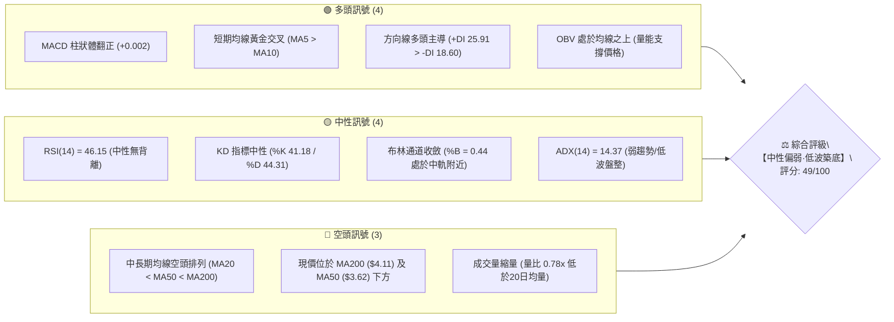
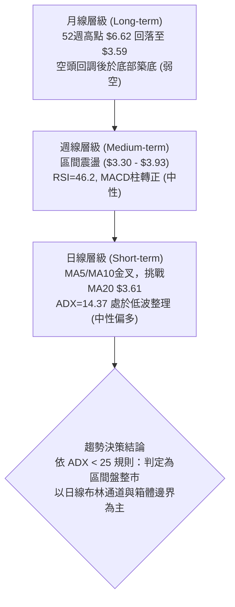
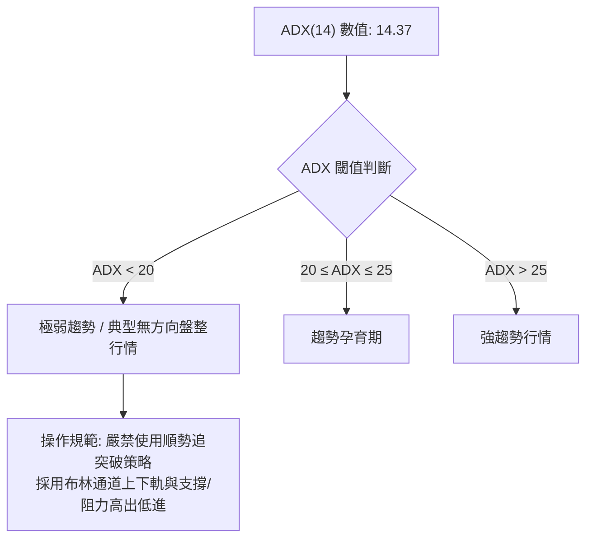
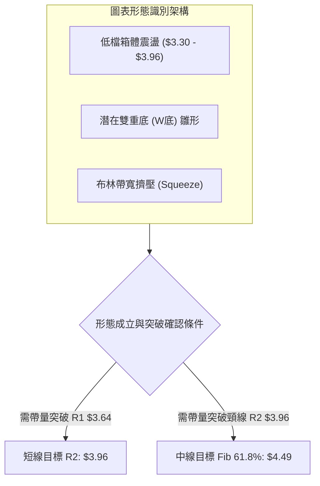
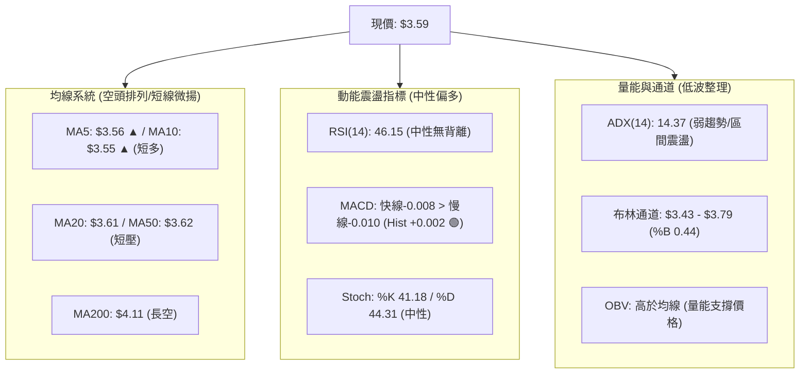
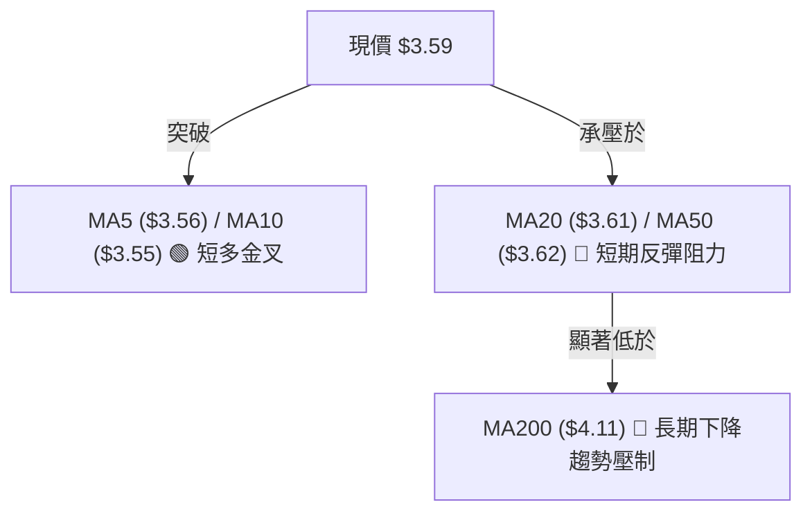
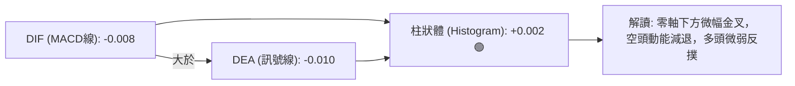
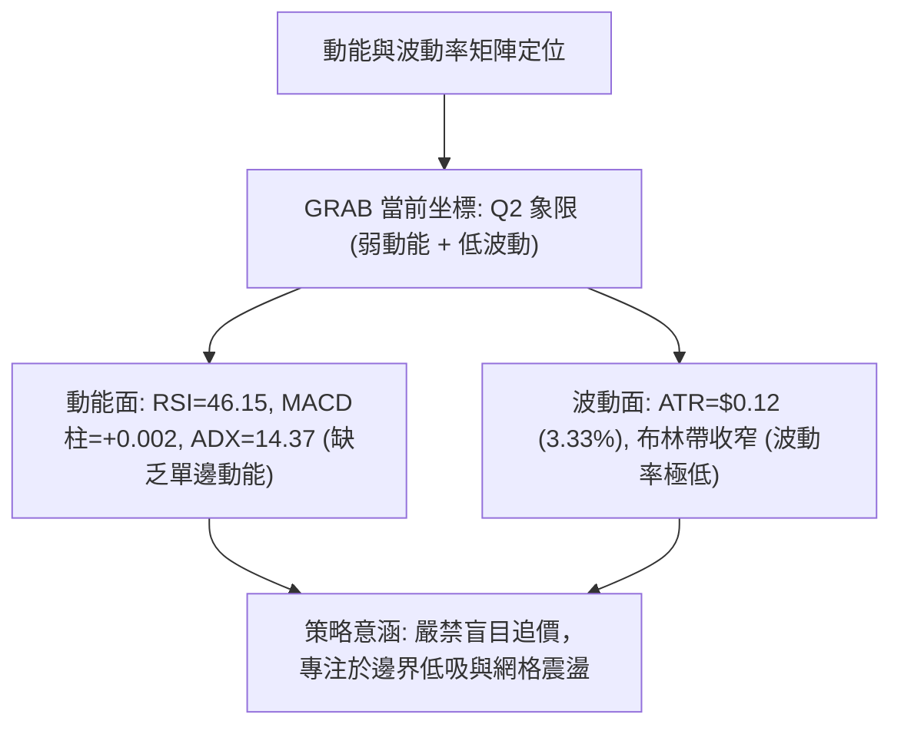
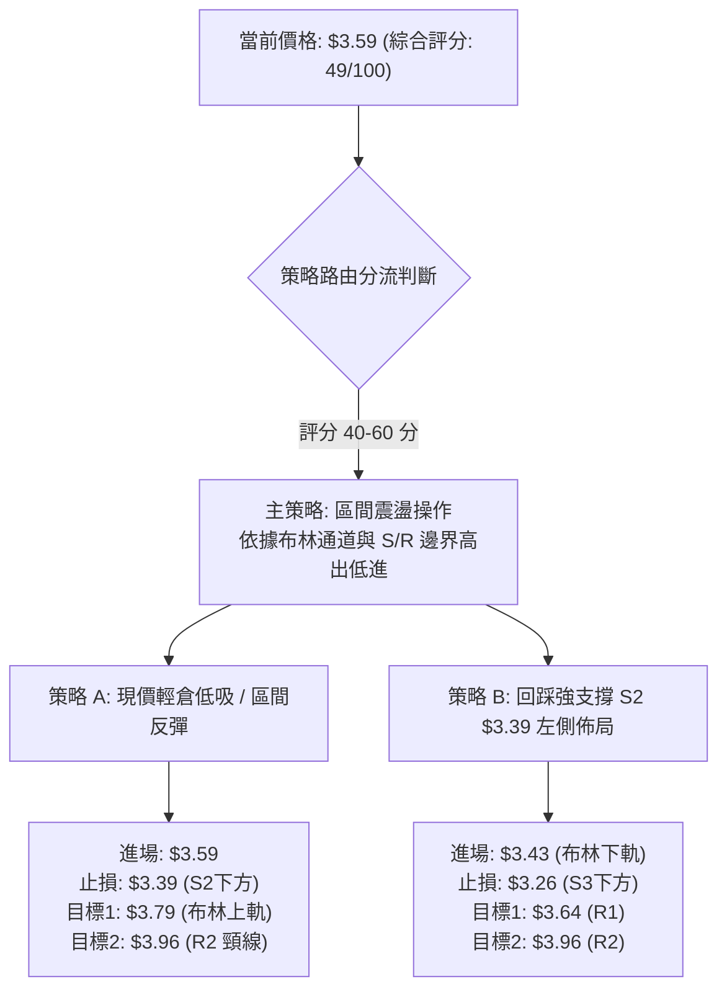
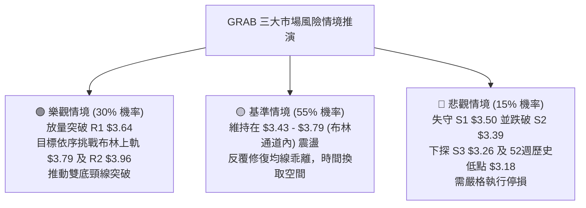

# GRAB 技術分析報告

> **報告日期**：2026-08-28 ｜ **語言**：繁體中文 ｜ **數據來源**：Yahoo Finance ｜ **當前價格**：$3.59

---

## 目錄

| 章節 | 內容 |
|------|------|
| [1. 技術面概覽](#1-技術面概覽) | 訊號儀表板、核心指標、評分卡 |
| [2. 趨勢分析](#2-趨勢分析) | 多時框趨勢、長中短期走勢、ADX解讀 |
| [3. 圖表形態分析](#3-圖表形態分析) | 形態識別、信心度評估、K線組合、目標價 |
| [4. 支撐與阻力](#4-支撐與阻力) | 關鍵價位分佈、斐波那契回調 |
| [5. 技術指標深度解讀](#5-技術指標深度解讀) | MA/RSI/MACD/布林通道/成交量 |
| [6. 動能與波動率](#6-動能與波動率) | 動能四象限、ATR波動度、Beta分析 |
| [7. 多時框架總結](#7-多時框架總結) | 時框架評分矩陣、多時框收斂結論 |
| [8. 交易策略建議](#8-交易策略建議) | 策略路由、情境階梯、主策略詳情、評星 |
| [9. 風險提示與監控](#9-風險提示與監控) | 監控指標Checklist、情境分析、風控建議 |
| [📋 報告總結](#-報告總結) | 總結儀表板與最優策略組合 |

---

## 1. 技術面概覽

### 🎯 技術訊號儀表板



---

### 📊 核心指標速覽表

| 指標類別 | 指標名稱 | 當前數值 | 訊號 | 專業解讀 |
|----------|----------|----------|------|----------|
| **價格** | 當前價格 | $3.59 | 🟡 | 位於52週區間11.9%分位，處於底部低位震盪區間 |
| **均線** | MA5 / MA10 | $3.56 / $3.55 | 🟢 | 極短線黃金交叉向上，短多動能微幅增強 |
| **均線** | MA20 | $3.61 | 🔴 | 現價位於MA20下方 -0.54%，面臨短期中軌壓制 |
| **均線** | MA50 | $3.62 | 🔴 | 價格低於中期生命線，中期結構尚未完全扭轉 |
| **均線** | MA200 | $4.11 | 🔴 | 價格低於年線 -12.65%，長期趨勢仍處空頭架構 |
| **動能** | RSI(14) | 46.15 | 🟡 | 位於 40–60 中性區間，多空力量拉鋸平衡 |
| **動能** | MACD (12/26/9)| -0.008 / -0.010 (Hist: +0.002) | 🟢 | 零軸下方金叉，柱狀體微幅翻紅，低檔動能修復 |
| **趨勢** | ADX (14) | 14.37 (+DI: 25.91 / -DI: 18.60) | 🟡 | ADX < 25 表明處於典型無趨勢/低波動盤整市 |
| **通道** | 布林通道 (20, 2) | 上軌 $3.79 / 中軌 $3.61 / 下軌 $3.43 | 🟡 | %B = 0.44，帶寬收斂，價格在中軌至下軌間運行 |
| **量能** | 成交量 / 20日均量 | 30.81M / 39.48M (0.78x) | 🟡 | 量縮整理，OBV > MA 顯示主力未有恐慌性拋售 |
| **波動** | ATR(14) | $0.12 (佔股價 3.33%) | 🟢 | 日內波動幅度低，適合區間嚴格止損操作 |

---

### 🏆 技術評分卡

```
╔══════════════════════════════════════════════════════════════════╗
║              技術評分卡 — GRAB (2026-08-28)                      ║
╠══════════════════════════════════════════════════════════════════╣
║ 趨勢強度 (Trend)      ██████░░░░░░░░░░░░░░  30/100  🔴 弱勢盤整  ║
║ 動能指標 (Momentum)   ███████████░░░░░░░░░  55/100  🟡 低檔修復  ║
║ 支撐穩定度 (Support)  ████████████░░░░░░░░  60/100  🟢 底部支撐  ║
║ 成交量配合 (Volume)   ██████████░░░░░░░░░░  50/100  🟡 縮量蓄勢  ║
║ 形態完整度 (Pattern)  ██████████░░░░░░░░░░  50/100  🟡 區間箱體  ║
║ 均線排列 (Moving Avg) ██████░░░░░░░░░░░░░░  30/100  🔴 中長空頭  ║
╠══════════════════════════════════════════════════════════════════╣
║ 綜合評分 (Overall)    ██████████░░░░░░░░░░  49/100  ⚖️ 區間震盪  ║
╚══════════════════════════════════════════════════════════════════╝
```

---

## 2. 趨勢分析

### 🌐 多時框趨勢分析



---

### 📈 長期趨勢 — 12個月走勢圖（Unicode）

```
GRAB 月線走勢圖（2025-09 至 2026-08）
價格 ($)
$6.02 ┤ ●  ● ($6.01)
$5.45 ┤       ●
$4.99 ┤          ●
$4.30 ┤             ●
$4.22 ┤                ●
$3.82 ┤                      ●
$3.77 ┤                            ●
$3.66 ┤                   ●
$3.59 ┤                                  ● ← 現價 ($3.59)
$3.54 ┤                         ●     ●
$3.50 ┤                                  ($3.50)
      └─┬──┬──┬──┬──┬──┬──┬──┬──┬──┬──┬──┬─
       09 10 11 12 01 02 03 04 05 06 07 08 (月份: 25/09 - 26/08)
```

#### 走勢特徵分析表格

| 階段區間 | 時間跨度 | 價格起訖 | 漲跌幅 | 走勢特徵與技術解讀 |
|----------|----------|----------|--------|--------------------|
| **高檔回落期** | 2025-09 ~ 2025-11 | $6.02 → $5.45 | -9.47% | 見頂後震盪回調，量能漸縮，跌破多頭防守線 |
| **主跌波段** | 2025-12 ~ 2026-03 | $4.99 → $3.66 | -26.65%| 均線形成空頭發散，連續4個月陰跌，跌破MA200 |
| **低檔打底期** | 2026-04 ~ 2026-08 | $3.82 → $3.59 | -6.02% | 於 $3.30–$3.93 區間反覆震盪打底，形成雙底收斂結構 |

---

### 📊 中期趨勢（週線分析）

中期走勢呈現「底部寬幅震盪」特徵。在近20週數據中，低點由 2026-06-14 的 $3.30 逐步拉升至 2026-07-26 的 $3.31 與 2026-08-23 的 $3.48，顯示下檔買盤逐步墊高（Higher Lows 雛形）。

```
GRAB 近20週核心波動結構示意圖
$4.21 ┤ ● (04/19 高點)
$3.93 ┤             ● (07/12 波段反彈高點 R2: $3.96 附近)
$3.66 ┤                      ● (08/09 反彈)
$3.59 ┤                            ● (現價 $3.59)
$3.30 ┤       ● (06/14 低點)   ● (07/26 低點 $3.31)
      └────────────────────────────────────────
```

---

### ⚡ 趨勢強度評估（ADX 解讀）



#### 🧭 ADX 與方向指標參數對照表

| 指標 | 數值 | 狀態 | 意涵解讀 |
|------|------|------|----------|
| **ADX(14)** | **14.37** | 弱/無趨勢 (極低) | 股價缺乏單邊推動力，處於橫盤蓄勢期 |
| **+DI** | **25.91** | 多方佔優 | 短線多頭推動力量略高於空方 |
| **-DI** | **18.60** | 空方轉弱 | 空頭下壓力道減弱，未有持續殺跌意願 |
| **多空差值** | **+7.31** | 多頭佔先 | 短線有利於多方發動區間反彈 |

---

## 3. 圖表形態分析

### 🔍 形態識別系統



#### 形態識別信心度與目標價計算表

| 形態名稱 | 信心度 | 判斷依據（引用數據） | 完成度 | 目標價（附嚴格計算式） |
|----------|--------|----------------------|--------|--------------------|
| **箱體震盪 (Rectangle)** | **85%** | 價格受困於下軌支撐 $3.39 (S2) 與上軌阻力 $3.96 (R2) 間運行超過4個月 | 80% | 箱頂 $3.96 / 箱底 $3.39，震盪中樞為 MA20 ($3.61) |
| **雙重底 (Double Bottom)** | **55%** | 第一底 $3.30 (2026-06-14)，第二底 $3.31 (2026-07-26)，頸線位於波段高點 $3.93 (2026-07-12) | 45% | **理論量測目標**：頸線 $3.93 + 形態高度 ($3.93 - $3.30 = $0.63) = **$4.56**（接近 Fib 61.8% $4.49） |
| **布林通道擠壓** | **75%** | 帶寬收窄至 $0.36 ($3.43~$3.79)，ATR(14) 降至 $0.12 | 70% | 向上突破上軌 $3.79 後，首要阻力指向 R2 **$3.96** |

---

### 🕯️ 重要K線形態分析

| 週/月份 | 收盤價 | K線形態 | 專業技術解讀 | 多空訊號 |
|---------|--------|---------|--------------|----------|
| **2026-06-14 (週)** | $3.30 | 探底長下影線十字星 | 測試52週低點 $3.18 上方支撐，空頭動能衰竭 | 🟢 看多反轉 |
| **2026-07-12 (週)** | $3.93 | 倒錘頭/高檔停頓線 | 遇近一年波段高點阻力 R2 $3.96 承壓回落 | 🔴 遇阻回調 |
| **2026-07-26 (週)** | $3.31 | 次低點雙重確認線 | 成功守住 $3.30 之支撐，未創破底新低 | 🟢 支撐確立 |
| **2026-08-30 (週)** | $3.59 | 縮量紅K收於均線密集區 | 價格收復 MA5/MA10，正向 MA20 蓄勢靠攏 | 🟡 短線築底 |

---

### 📉 ASCII 走勢形態示意圖

```
GRAB 日/週線級別 箱體與潛在雙底形態示意圖
$3.96 ┼─────────────────────────────── 頸線/箱頂阻力 (R2: $3.96 / 07-12: $3.93)
      │          /\
      │         /  \
$3.64 ┼────────/────\──────────────── 區間短壓 (R1: $3.64 / MA20 $3.61)
      │       /      \        /\  ▲ 現價 $3.59 蓄勢
      │      /        \      /  \/
$3.30 ┼─────/──────────\────/─────── 箱底強支撐 (06-14: $3.30 / 07-26: $3.31)
      │    底1        底2
      └───────────────────────────────
```

---

## 4. 支撐與阻力

### 🗺️ 關鍵價位分布圖（Unicode）

```
╔══════════════════════════════════════════════════════════════════╗
║              GRAB 關鍵價位結構分布圖                             ║
╠══════════════════════════════════════════════════════════════════╣
║ $4.49 ║████████████████████████║ 斐波那契 61.8% 重大反轉壓力     ║
║ $4.06 ║████████████████████    ║ 近一年波段強阻力 R3 (+13.09%)   ║
║ $3.96 ║████████████████████████║ 近一年波段重要阻力 R2 (+10.21%) ║
║ $3.79 ║▓▓▓▓▓▓▓▓▓▓▓▓▓▓▓▓▓▓▓▓    ║ 布林通道上軌阻力 (+5.57%)       ║
║ $3.64 ║████████████████████████║ 近一年波段短壓 R1 (+1.30%)      ║
║ $3.61 ║────────────────────────║ 20日均線 MA20 (布林中軌)        ║
╠═══════╬════════════════════════╬═════════════════════════════════╣
║ $3.59 ╠════════════════════════╣ ◄ 現價 (Current Price)          ║
╠═══════╬════════════════════════╬═════════════════════════════════╣
║ $3.50 ║▓▓▓▓▓▓▓▓▓▓▓▓▓▓▓▓        ║ 近一年波段近期支撐 S1 (-2.51%)  ║
║ $3.43 ║────────────────────────║ 布林通道下軌支撐 (-4.46%)       ║
║ $3.39 ║████████████████████████║ 近一年波段次級強支撐 S2 (-5.57%)║
║ $3.26 ║████████████████████████║ 近一年波段防守支撐 S3 (-9.33%)║
║ $3.18 ║████████████████████████║ 52週歷史低點 / 斐波 100% (-11.4%)║
╚══════════════════════════════════════════════════════════════════╝
```

---

### 🚧 阻力位分析表

| 阻力級別 | 精確價位 | 距現價幅幅 | 形成原因（數據依據） | 突破難度 | 重要性 |
|----------|----------|------------|----------------------|----------|--------|
| **R1** | **$3.64** | +1.30% | 近一年波段高點聚類，且與 MA50 ($3.62) 高度重合 | 🟡 中等 | 短線多空分水嶺 |
| **R2** | **$3.96** | +10.21%| 近一年核心波段高點聚類、07-12週高點 ($3.93) 密集套牢區 | 🔴 極高 | 中期箱頂頸線 |
| **R3** | **$4.06** | +13.09%| 近一年波段密集高點，緊鄰年線 MA200 ($4.11) | 🔴 極高 | 長期多空分界線 |

---

### 🛡️ 支撐位分析表

| 支撐級別 | 精確價位 | 距現價跌幅 | 形成原因（數據依據） | 守住機率 | 重要性 |
|----------|----------|------------|----------------------|----------|--------|
| **S1** | **$3.50** | -2.51% | 近一年波段低點聚類，07-05 / 08-02 週收盤支撐 | 🟢 75% | 短線多頭防守底線 |
| **S2** | **$3.39** | -5.57% | 近一年波段低點聚類，緊鄰布林下軌 ($3.43) | 🟢 85% | 中期震盪箱底邊界 |
| **S3** | **$3.26** | -9.33% | 近一年波段深層低點聚類，直逼 52W 低點 $3.18 | 🟢 90% | 強力結構性防線 |

---

### 📐 斐波那契回調位分析

依據 52 週區間高點 **$6.62** 至低點 **$3.18**（落差幅幅 $3.44）計算斐波那契回調水準：

| 回調比例 | 精確價位 | 相對現價位置 | 技術解讀與意涵 |
|----------|----------|--------------|----------------|
| **0.0% (52W High)** | **$6.62** | +84.40% | 52週歷史頂部，長期極大阻力 |
| **23.6%** | **$5.81** | +61.84% | 分析師平均目標價 ($5.86) 重合區 |
| **38.2%** | **$5.31** | +47.91% | 中長期強反彈壓力位 |
| **50.0%** | **$4.90** | +36.49% | 中期多空平衡樞軸點 |
| **61.8%** | **$4.49** | +25.07% | 黃金分割重要反轉阻力位，亦為雙底推算目標 ($4.56) 附近 |
| **78.6%** | **$3.92** | +9.19% | 緊鄰 R2 阻力 ($3.96)，為當前箱體突破後的首要目標 |
| **100.0% (52W Low)** | **$3.18** | -11.42% | 52週歷史鐵底，強大終極支撐 |

> **位置判斷**：當前價格 **$3.59** 嚴格運行於 **78.6% 回調位 ($3.92)** 與 **100.0% 歷史低點 ($3.18)** 之間。這表明股價在經歷深度回調後，目前正處於回調的最深層打底區域，下行空間受 $3.18-$3.26 限制，向上反彈的第一個斐波關鍵卡點為 $3.92。

---

## 5. 技術指標深度解讀

### 🎛️ 指標訊號總覽



---

### 📈 移動平均線排列分析



#### 均線數據及趨勢狀態

| 週期均線 | 當前價格 | 偏離率 (Bias) | 走勢方向 | 技術訊號 | 意涵評估 |
|----------|----------|---------------|----------|----------|----------|
| **MA5** | $3.56 | +0.84% | ▲ 向上 | 🟢 看多 | 極短線動能改善，短線支撐確立 |
| **MA10** | $3.55 | +1.13% | ▲ 向上 | 🟢 看多 | 5日上穿10日線，形成極短線金叉 |
| **MA20** | $3.61 | -0.55% | ▼ 向下 | 🔴 看空 | 短期生命線，即刻面臨的上方壓制點 |
| **MA50** | $3.62 | -0.83% | ▼ 向下 | 🔴 看空 | 與 R1 ($3.64) 構成密集共振反壓帶 |
| **MA60** | $3.58 | +0.28% | ▲ 向上 | 🟢 支撐 | 現價小幅站上季線，提供下檔緩衝 |
| **MA120** | $3.65 | -1.64% | ▼ 向下 | 🔴 阻力 | 半年線持續向下施壓 |
| **MA200** | $4.11 | -12.65% | ▼ 向下 | 🔴 看空 | 長期牛熊分界線，空頭趨勢顯著 |

---

### 📉 RSI(14) 分析

#### RSI 數值進度條
```
超賣區 (0-30)              中性區 (30-70)             超買區 (70-100)
├───────────────┼───────────────────────────────┼───────────────┤
░░░░░░░░░░░░░░░░████████████████░░░░░░░░░░░░░░░░░░░░░░░░░░░░░░░░░
0              30             46.15            70             100
                              ▲ RSI(14)
```

- **當前數值**：**46.15**，處於 30 至 70 的中性健康區間。
- **背離判斷**：
  - **日線/週線背離檢驗**：觀察 2026-06-14 週收盤 $3.30（RSI 37.9）與 2026-07-26 週收盤 $3.31（RSI 25.9），價格維持平底而 RSI 出現短暫超賣回升，隨後於 2026-08-30 回升至 46.2。目前**無明顯頂背離或強烈底背離**，RSI 指標呈現中性格局，未出現極端超買或超賣超載。

---

### 📊 MACD(12/26/9) 訊號解讀



- **MACD線 (DIF)**：-0.008
- **訊號線 (DEA)**：-0.010
- **柱狀圖 (Histogram)**：**+0.002** 🟢（由負翻正）
- **技術解讀**：MACD 線在零軸下方微幅上穿訊號線，柱狀體翻紅，代表低檔賣壓減輕，具備弱勢反彈動能；然而由於兩線仍在零軸下方深處，屬於「弱勢修復型金叉」，不宜盲目預期爆發性單邊行情。

---

### 📦 布林通道分析

```
GRAB 日線布林通道 (20, 2) 結構分佈
$3.79 ┬────────────────────────────────────────── 布林上軌 (Upper Band)
      │
$3.61 ┼ ─ ─ ─ ─ ─ ─ ─ ─ ─ ─ ─ ─ ─ ─ ─ ─ ─ ─ ─ ─ ─ 布林中軌 / MA20 (Middle Band)
$3.59 │                       ● (現價 %B = 0.44)
      │
$3.43 ┴────────────────────────────────────────── 布林下軌 (Lower Band)
```

- **上軌**：**$3.79**（距現價 +5.57%）
- **中軌 (MA20)**：**$3.61**（距現價 +0.56%）
- **下軌**：**$3.43**（距現價 -4.46%）
- **帶寬與 %B**：帶寬僅 $0.36（極度收斂，壓縮至歷史低檔），%B 指標為 **0.44**，表明價格在下軌獲得支撐後已反彈回中軌附近。布林帶極度收口通常預示著 1–3 週內將迎來較大方向性波動。

---

### 💹 成交量分析（量價配合度）

- **最新成交量**：30,814,900 股
- **20日均量**：39,477,680 股（量比 0.78x）
- **50日均量**：44,531,516 股
- **量價配合評估**：
  - 目前成交量低於 20日 與 50日 均量，呈現標準的「**縮量整理**」特徵。
  - **OBV 趨勢**：數據顯示 OBV > MA，量能指標維持在均線之上，這代表在 $3.30–$3.50 的低檔震盪區間內，主力籌碼並未出現帶量出逃，反而存在溫和的量能沉澱支撐。

---

## 6. 動能與波動率

### ⚡ 動能評估四象限

| 象限代號 | 動能強度 (Momentum) | 波動率水準 (Volatility) | 當前判定 | 特徵與操作指引 |
|----------|-------------------|------------------------|----------|----------------|
| **Q1** | 強 (Strong) | 低 (Low) | ─ | 最佳單邊推進機會（穩健上漲） |
| **Q2** | **弱 (Weak)** | **低 (Low)** | **✓ GRAB 當前** | **謹慎觀望 / 區間高出低進，等待突破** |
| **Q3** | 強 (Strong) | 高 (High) | ─ | 高風險高收益，激進突破交易 |
| **Q4** | 弱 (Weak) | 高 (High) | ─ | 混亂下跌或震盪洗盤，避免進場 |



---

### 📊 ATR 波動率分析

- **ATR(14) 數值**：**$0.12**
- **波動佔比**：約佔當前股價的 **3.33%**
- **風控參數與止損建議**：
  - **1.0 × ATR 波動緩衝**：$0.12（日內超短線波動區間）
  - **1.5 × ATR 防守距離**：$0.18（短線波段操作建議止損間距）
  - **2.0 × ATR 寬鬆防守**：$0.24（中線持倉防洗盤間距）

---

### 📐 Beta 與市場相關性

- **Beta 係數**：**0.89**
- **技術解讀**：GRAB 對於標普500/美股大盤的波動敏感度略低於整體市場（屬於低 Beta 標的）。當大盤出現單日劇烈震盪時，GRAB 通常具備一定的獨立走勢特徵；在低波動的築底階段，其走勢更多受制於東南亞本地板塊表現及個股籌碼面供需。

---

## 7. 多時框架總結

### 📋 時框架評分表

| 時框架 | 趨勢方向 | 動能狀態 | 均線排列 | 形態特徵 | 綜合評分 | 操作建議 |
|--------|----------|----------|----------|----------|----------|----------|
| **月線 (長期)** | 🔴 下行/弱空 | 🟡 中性低檔 | 🔴 空頭 (MA200下方) | 大跌後低位震盪 | **35/100** | 長線資金分批定投，右側未至 |
| **週線 (中期)** | 🟡 橫向盤整 | 🟢 柱狀翻紅 | 🔴 空頭壓制 | 潛在雙底打底 | **52/100** | 區間操作，以 $3.39-$3.96 為界 |
| **日線 (短期)** | 🟢 短多反彈 | 🟢 金叉微升 | 🟡 糾結 (站上MA5/10) | 窄幅布林收斂 | **58/100** | 逢低佈局，目標鎖定 R1/R2 |

---

### 🔲 綜合訊號矩陣

| 分析維度 | 短期 (1-5日) | 中期 (1-4週) | 長期 (1-6個月) | 多空一致性確認 |
|----------|--------------|--------------|----------------|----------------|
| **均線系統** | 🟢 偏多 (站上MA5/10) | 🔴 偏空 (受制MA20/50) | 🔴 偏空 (MA200下方) | 衝突（短線反彈 vs 中長空頭） |
| **動能指標** | 🟢 偏多 (MACD翻紅) | 🟡 中性 (RSI 46.15) | 🟡 中性偏弱 | 部分共振（低檔企穩） |
| **形態/價位** | 🟡 中性 (中軌下方) | 🟢 偏多 (雙底未破) | 🟡 中性 (底部箱體) | 一致（區間築底） |
| **量能支撐** | 🟡 縮量蓄勢 | 🟢 OBV > MA | 🟡 籌碼沉澱 | 一致（未見恐慌拋壓） |

---

### ⚖️ 多時框收斂結論

依據多時框收斂規則第 14 條：
1. **行情性質判定**：當前 **ADX(14) = 14.37 (< 25)**，嚴格判定為「**無趨勢 / 區間盤整行情**」。
2. **主導時框與依據**：在盤整行情中，趨勢指標失效，應以**日線布林通道（$3.43 – $3.79）**與近一年關鍵支撐阻力結構（**S2: $3.39 至 R2: $3.96**）為核心交易區間。
3. **唯一方向性結論**：**【中性觀望·區間操作】**。日線級別微幅反彈提供逢低做多盈虧比機會，但受制於中期均線空頭壓制，整體策略採取「**下軌支撐處低吸、上軌阻力處減倉**」的防守型震盪策略。

---

## 8. 交易策略建議

### 🗺️ 策略決策流程圖



---

### 🧭 策略路由

> **當前主策略方向 = 【中性區間操作 / 震盪低吸策略】（依評分卡 49/100 分流）**

---

### 🎯 價格情境階梯（Price Scenarios）

| 觸發條件 | 第一目標 (T1) | 第二延伸目標 (T2) | 後續延伸 (T3) | 情境技術含義 |
|----------|---------------|-------------------|---------------|--------------|
| **向上突破 R1 ($3.64)** | **$3.79** (布林上軌) | **$3.96** (R2 / 頸線) | **$4.06** (R3 / 年線) | 短線脫離泥沼，展開中級反彈挑戰箱頂 |
| **維持在 $3.50–$3.64 震盪** | **$3.61** (MA20) | **$3.43** (布林下軌) | ─ | 延續低波動箱體整理，指標持續修復 |
| **向下跌破 S1 ($3.50)** | **$3.39** (S2 支撐) | **$3.26** (S3 防守) | **$3.18** (52W低點) | 底部結構鬆動，回測前低雙底防線 |

---

### 📊 情境機率分佈

| 情境劇本 | 預估機率 | 主要技術依據 |
|----------|----------|--------------|
| **情境一：區間震盪整理** | **55%** | ADX=14.37 處於弱趨勢，成交量萎縮 (0.78x)，布林通道極度收口 |
| **情境二：向上反彈測壓** | **30%** | MACD 柱狀體翻正 (+0.002)，+DI (25.91) > -DI (18.60)，OBV 處於均線之上 |
| **情境三：向下破位探底** | **15%** | 均線仍處空頭排列，若跌破 S1 ($3.50) 則可能下探 S2 ($3.39) |

---

### 🟢 主策略詳情

| 策略要素 | 策略 A（現價輕倉波段反彈） | 策略 B（下軌支撐回踩低吸） |
|----------|----------------------------|----------------------------|
| **適用場景** | 短線看好 MACD 翻紅蓄勢，現價直接介入 | 耐心等待回踩下軌，追求極致風險報酬比 |
| **進場條件** | 現價 $3.59 站穩 MA5/MA10 之上時進場 | 股價回踩布林下軌 $3.43 且出現下影線確認 |
| **進場價格** | **$3.59** | **$3.43** |
| **目標價 T1** | **$3.79** (布林通道上軌，+5.57%) | **$3.64** (關鍵阻力 R1，+6.12%) |
| **目標價 T2** | **$3.96** (近一年波段高點 R2，+10.31%)| **$3.96** (近一年波段高點 R2，+15.45%)|
| **止損價格** | **$3.39** (跌破 S2 強支撐，-5.57%) | **$3.26** (跌破 S3 防守支撐，-4.96%) |
| **風險報酬比** | **1.85 : 1**（以 T2 計算） | **3.11 : 1**（以 T2 計算） |
| **預估勝率** | **58%** | **65%** |
| **建議倉位** | **10% – 15%**（輕倉試探） | **15% – 20%**（標準倉位） |

---

### 🔴 反向風險觸發點（對沖與風控提示）

若出現以下訊號，宣告震盪築底結構失敗，應立即停損或建立對沖空頭保護：
1. **價格收盤跌破 $3.39 (S2)**：代表日線箱底失守，行情將進一步向 $3.26 (S3) 及 52週低點 **$3.18** 尋求支撐。
2. **MACD 柱狀體再度由正翻負** 且 **-DI 向上貫穿 +DI**：代表多頭反彈夭折，空頭重新掌握主導權。
3. **帶量跌破 $3.50 (S1)**（單日成交量 > 50M）：主力資金向下摜壓，區間震盪轉為破位下行。

---

### ⭐ 整體訊號強度評星

```
╔══════════════════════════════════════════════════╗
║ 做多訊號強度：  ★★★☆☆  (3.0 / 5 星 — 區間反彈)   ║
║ 做空訊號強度：  ★★☆☆☆  (2.0 / 5 星 — 下跌動能弱) ║
║ 整體訊號可信度：★★★☆☆  (3.5 / 5 星 — 低波震盪市) ║
╚══════════════════════════════════════════════════╝
```

---

## 9. 風險提示與監控

### ✅ 關鍵監控指標 Checklist

```
╔══════════════════════════════════════════════════════════════════╗
║              每日交易關鍵監控 Checklist                          ║
╠══════════════════════════════════════════════════════════════════╣
║ [ ] 價格是否有效站上 MA20 ($3.61) 及阻力 R1 ($3.64)              ║
║ [ ] 日成交量是否放大至 40M 以上（突破確認量能）                  ║
║ [ ] ADX(14) 是否由 14.37 向上抬升突破 20（趨勢啟動訊號）         ║
║ [ ] MACD 柱狀圖是否持續擴大翻紅（多頭動能延續）                  ║
║ [ ] 下檔防守點 $3.50 (S1) 與 $3.39 (S2) 是否收盤守穩             ║
║ [ ] 布林帶寬是否開始向外擴張（進入單邊走勢信號）                ║
╚══════════════════════════════════════════════════════════════════╝
```

---

### ⚠️ 風險場景分析



---

### 🛡️ 風險管理重要提醒

1. **嚴格執行價格止損**：當前股價處於歷史低位區間，任何持倉均應嚴格以 **S2 ($3.39)** 或 **S3 ($3.26)** 作為硬性止損基準，避免陷入無止境的套牢陰跌。
2. **切忌盤整市追高**：ADX 僅為 14.37，表明目前任何單日大陽線突破極易遭遇假突破回踩。在價格逼近布林上軌 **$3.79** 或 R2 **$3.96** 時，應主動分批獲利了結，切勿追高。
3. **倉位管理原則**：在價格未有效帶量突破站穩年線 MA200 ($4.11) 之前，總持倉比例建議嚴格控制在 **20% 以內**，以輕倉波段思維應對震盪。

---

## 📋 報告總結

```
╔══════════════════════════════════════════════════════════════════╗
║                   GRAB 技術分析報告總結                          ║
╠══════════════════════════════════════════════════════════════════╣
║ 報告日期：2026-08-28            當前價格：$3.59                  ║
║ 分析評級：⚖️ 中性觀望 / 區間築底 (技術評分: 49/100)               ║
╠══════════════════════════════════════════════════════════════════╣
║ 關鍵結論：                                                       ║
║ ├─ 長期趨勢：🔴 弱勢偏空 (受制於 MA200 $4.11，處於52W底部區間)  ║
║ ├─ 中期趨勢：🟡 區間震盪 (受困於 $3.39 - $3.96 寬幅箱體內)       ║
║ ├─ 短期趨勢：🟢 築底反彈 (站上 MA5/10，MACD微幅翻紅)             ║
║ ├─ 關鍵阻力：R1: $3.64 │ R2: $3.96 │ R3: $4.06 │ 斐波: $4.49   ║
║ ├─ 關鍵支撐：S1: $3.50 │ S2: $3.39 │ S3: $3.26 │ 52W低: $3.18  ║
║ └─ 外資共識：強力買進 (Strong Buy, 25位分析師均價: $5.86)       ║
╠══════════════════════════════════════════════════════════════════╣
║ 最優策略組合：                                                   ║
║ 1. 🥇 最佳機會（策略 B）：耐性等待回踩 $3.43 (布林下軌) 低吸，    ║
║    止損設於 $3.26，目標看至 $3.64 / $3.96 (風報比 3.11:1)。       ║
║ 2. 🥈 次選機會（策略 A）：現價 $3.59 輕倉佈局反彈，止損 $3.39，   ║
║    目標鎖定 $3.79 (布林上軌) 及 $3.96 (R2 阻力)。               ║
║ 3. 🥉 保守選擇：完全觀望，靜待股價帶量突破 R1 $3.64 及 MA20 後， ║
║    再順勢右側介入。                                              ║
╚══════════════════════════════════════════════════════════════════╝
```

---

> ⚠️ **免責聲明**：本報告為 AI 自動生成之量化技術分析，所有數據及支撐阻力水準均嚴格基於所提供的歷史 OHLCV 行情數據計算。本報告**僅供研究與學術參考**，**不構成任何形式的投資買賣建議**。金融市場存在高度風險，投資人應獨立審慎評估並自負盈虧。

---

*報告生成時間：2026-08-28 ｜ 數據來源：Yahoo Finance ｜ 分析框架：多時框技術分析系統*