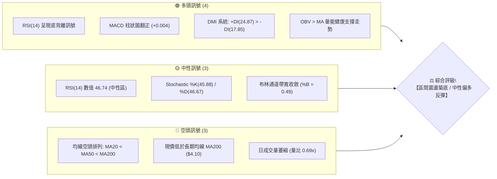
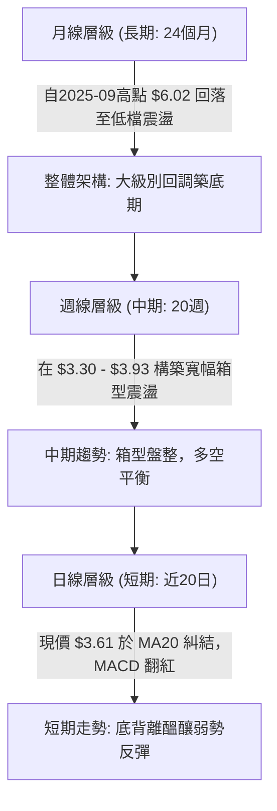
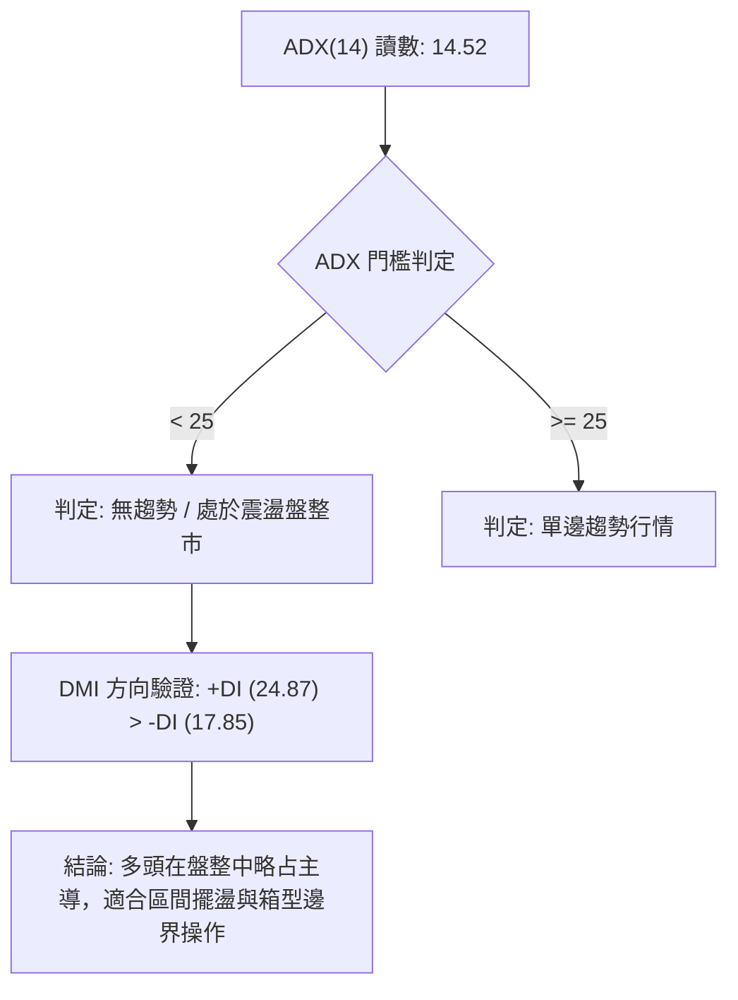
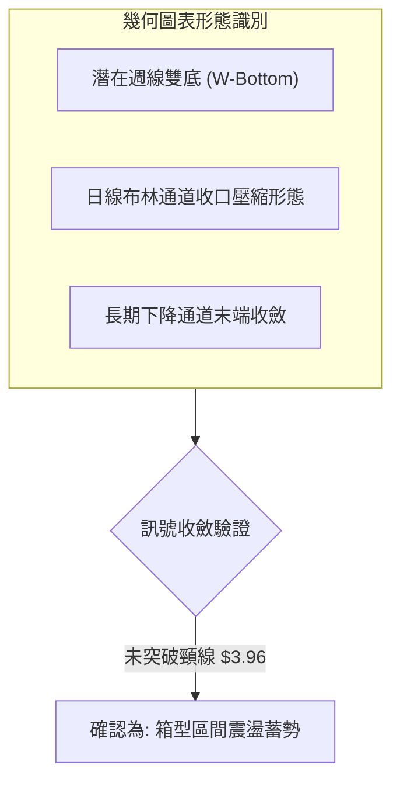
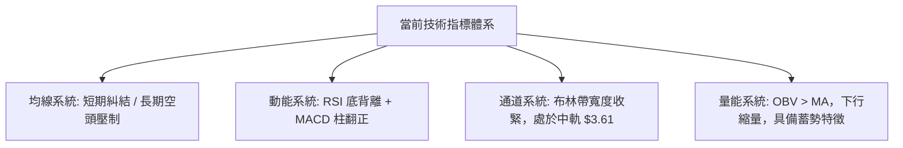
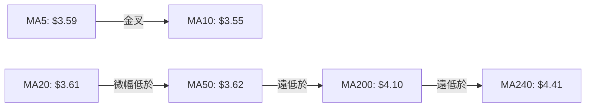
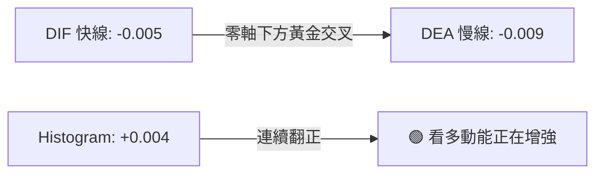
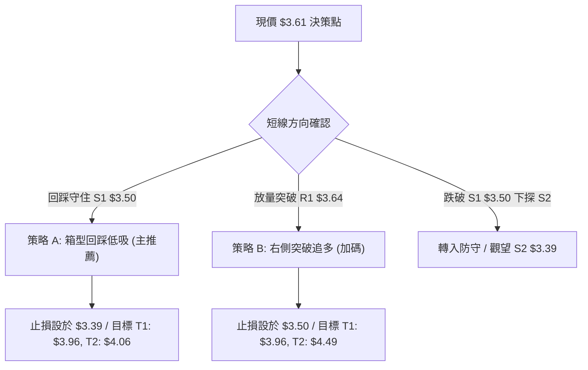
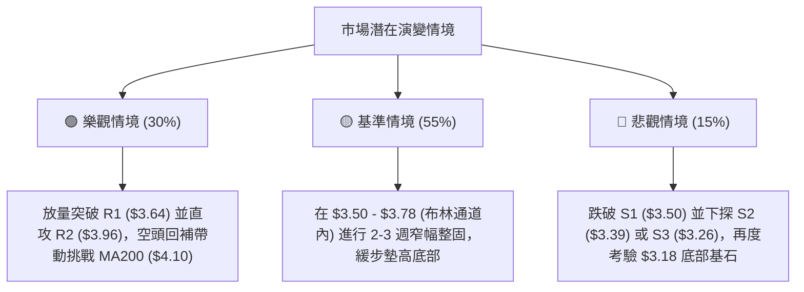

# GRAB 技術分析報告

> **報告日期**：2026-08-30 ｜ **語言**：繁體中文 ｜ **數據來源**：Yahoo Finance ｜ **當前價格**：$3.61

---

## 目錄

| 章節 | 內容 |
|------|------|
| [1. 技術面概覽](#1-技術面概覽) | 訊號儀表板、核心指標、評分卡 |
| [2. 趨勢分析](#2-趨勢分析) | 多時框趨勢、長中短期走勢、ADX 解讀 |
| [3. 圖表形態分析](#3-圖表形態分析) | 形態識別、信心度評估、K線組合、目標價計算 |
| [4. 支撐與阻力](#4-支撐與阻力) | 關鍵價位結構、斐波那契回調分析 |
| [5. 技術指標深度解讀](#5-技術指標深度解讀) | MA/RSI/MACD/布林通道/成交量配合度 |
| [6. 動能與波動率](#6-動能與波動率) | 動能四象限、ATR 波動度、Beta 敏感度 |
| [7. 多時框架總結](#7-多時框架總結) | 時框架評分矩陣、多時框收斂定論 |
| [8. 交易策略建議](#8-交易策略建議) | 策略路由、情境階梯、主策略詳情與風控 |
| [9. 風險提示與監控](#9-風險提示與監控) | 關鍵監控清單、情境分析、倉位管理 |
| [📋 報告總結](#-報告總結) | 總體技術評級與最佳執行方案 |

---

## 1. 技術面概覽

### 🎯 技術訊號儀表板



### 📊 核心指標速覽表

| 指標類別 | 指標名稱 | 當前數值 | 訊號 | 解讀 |
|:---|:---|:---|:---:|:---|
| **價格** | 當前價格 | $3.61 | 🟡 | 位於52週區間12.5%低位，處於築底盤整期 |
| **均線** | MA20 | $3.61 | 🟡 | 股價與20日均線重合，短線多空在此拉鋸 |
| **均線** | MA50 | $3.62 | 🔴 | 股價微幅低於50日均線（$3.62），面臨短期阻力 |
| **均線** | MA200 | $4.10 | 🔴 | 價格顯著低於200日均線（-11.95%），長線仍受壓制 |
| **動能** | RSI(14) | 46.74 | 🟢 | 處於40-50蓄勢區，且技術面出現明顯底背離 |
| **動能** | MACD | -0.005 | 🟢 | 快線高於慢線（-0.009），Hist 柱狀圖為 +0.004 |
| **波動** | ATR(14) | $0.12 | 🟡 | 每日波幅約3.27%，波動率收縮，處於蓄勢階段 |
| **趨勢** | ADX(14) | 14.52 | 🟡 | ADX < 25 表明處於弱趨勢／無方向盤整期 |
| **通道** | 布林 %B | 0.49 | 🟡 | 位於通道中軌（$3.61），上下軌區間為 $3.45 - $3.78 |
| **量能** | OBV 趨勢 | OBV > MA | 🟢 | 能量潮高於均線，量能未隨價格破底而潰散 |

### 🏆 技術評分卡

```
╔════════════════════════════════════════════════════════════════╗
║             技術評分卡 — GRAB (2026-08-30)                    ║
╠════════════════════════════════════════════════════════════════╣
║ 趨勢強度 (ADX=14.52)   █████░░░░░░░░░░░░░░░  28/100  🔴 弱勢盤整║
║ 動能指標 (RSI/MACD)    ████████████░░░░░░░░  62/100  🟢 底背翻多║
║ 支撐穩定度 (S1=$3.50)  ██████████████░░░░░░  70/100  🟢 底部扎實║
║ 成交量配合 (OBV>MA)    ███████████░░░░░░░░░  56/100  🟡 量縮蓄勢║
║ 形態完整度 (雙底雛形)  ████████████░░░░░░░░  60/100  🟡 構築頸線║
║ 均線排列 (空頭排列)    ███████░░░░░░░░░░░░░  35/100  🔴 均線壓制║
╠════════════════════════════════════════════════════════════════╣
║ 綜合評分               ███████████░░░░░░░░░  51.8/100           ║
║ 綜合評級               🟡 中性區間盤整 (Neutral / Accumulation)  ║
╚════════════════════════════════════════════════════════════════╝
```

---

## 2. 趨勢分析

### 🌐 多時框趨勢分析



### 📈 長期趨勢 — 12個月走勢圖（Unicode）

```
GRAB 月線收盤走勢圖（2025-09 至 2026-08）
價格軸 ($)
$6.02 ┤ ●(2025-09高點)
$6.01 ┤    ●
$5.45 ┤       ●
$4.99 ┤          ●
$4.30 ┤             ●
$4.22 ┤                ●
$3.82 ┤                      ●
$3.77 ┤                            ●
$3.66 ┤                   ●
$3.61 ┤                                  ●(現價 $3.61)
$3.54 ┤                         ●
$3.50 ┤                               ●(2026-07)
      └───────────────────────────────────────────────
        09  10  11  12  01  02  03  04  05  06  07  08  (月份: 25/09 - 26/08)
```

#### 長期走勢特徵分析表

| 階段區間 | 起始價與終點價 | 區間漲跌幅 | 走勢特徵與技術含義 |
|:---|:---|:---:|:---|
| **頂部派發期 (25/09 - 25/11)** | $6.02 → $5.45 | -9.47% | 雙頂構築完成後破位，量能開始轉弱 |
| **主跌加速期 (25/12 - 26/03)** | $4.99 → $3.66 | -26.65% | 連續4個月收黑，跌破年線支撐，市場情緒恐慌 |
| **低檔震盪築底期 (26/04 - 26/08)**| $3.82 → $3.61 | -5.50% | 波動區間收斂在 $3.50 - $3.82，賣壓衰竭，呈現反覆打底結構 |

### 📊 中期趨勢（週線分析）

從近20週數據觀察，GRAB 於 2026年6月中旬探至波段低點 $3.30，隨後在7月初反彈至 $3.93，隨後於7月下旬再度回踩 $3.31 獲得強烈支撐，8月份逐步墊高至 $3.61。

```
週線區間箱型結構示意圖
$3.96 ────────────────────────────── R2 波段強阻力 / 箱型頂部
$3.93 ───────────────● (07-12)
$3.78 ─ ─ ─ ─ ─ ─ ─ ─ ─ ─ ─ ─ ─ ─ ─ ─布林上軌阻力
$3.64 ────────────────────────────── R1 短線關鍵阻力
$3.61 ───────────────────────● (現價 $3.61 / MA20)
$3.50 ────────────────────────────── S1 箱型中樞強支撐 (08-02低點)
$3.30 ───────● (06-14)──────● (07-26)S3/52W低點聚類 ($3.18-$3.30 底部平台)
```

### ⚡ 趨勢強度評估（ADX 解讀）



| 評估指標 | 數值 | 參考標準 | 當前市場狀態解讀 |
|:---|:---:|:---:|:---|
| **ADX(14)** | **14.52** | < 20 極弱; 20-25 弱; > 25 趨勢確立 | **極弱趨勢**，市場缺乏單邊推動力，切勿追漲殺跌 |
| **+DI(14)** | **24.87** | 高於 -DI 代表多方占優 | 多頭力量微幅主導，具備反彈動能 |
| **-DI(14)** | **17.85** | 低於 +DI 代表空方減弱 | 賣盤已顯著衰竭，但尚未構成趨勢性潰敗 |

---

## 3. 圖表形態分析

### 🔍 形態識別系統



#### 形態識別與信心度評估表

| 識別形態 | 信心度 | 判斷依據（引用技術數據） | 完成度 | 目標價（附嚴格計算式） |
|:---|:---:|:---|:---:|:---|
| **週線潛在雙底 (Double Bottom)** | **65%** | 第一低點 06-14 收 $3.30，第二低點 07-26 收 $3.31，兩次於 S3($3.26) 上方獲支撐 | 70% | 若突破頸線 R2($3.96)，量度目標 = 頸線 $3.96 + 形態高度($3.96 - $3.30 = $0.66) = **$4.62** (接近分析師目標低點 $4.60) |
| **布林帶箱型擠壓 (BB Squeeze)** | **75%** | 布林上下軌寬度收縮至 $3.45 - $3.78，%B 為 0.49，ATR 萎縮至 $0.12 | 85% | 突破中軌 $3.61 後首要目標為上軌 **$3.78**，進一步上探 R1 **$3.64** 及 R2 **$3.96** |
| **頭肩底形態 (Inverse H&S)** | **30%** | 左肩 $3.34、頭部 $3.18(52W低)、右肩 $3.30-$3.31 | 35% | *數據中右側右肩時間跨度不足，信心度低於50%，僅作指標型解讀，不列入主交易依據* |

### 🕯️ 重要K線形態分析

| 期間/月份 | 收盤價 | K線形態特徵 | 量化技術解讀 | 多空訊號 |
|:---|:---:|:---|:---|:---:|
| **2026-06-14** | $3.30 | 帶下影線長黑探底 | 觸及波段極限低點，賣壓釋放完畢 | 🟡 空頭力竭 |
| **2026-07-05** | $3.90 | 實體大陽線放量突破 | RSI 衝上 77.2，MACD 柱達 +0.062，短線強攻 | 🟢 強勢多頭 |
| **2026-07-26** | $3.31 | 縮量十字星/低檔錘頭 | 二次探底不破前低，RSI 25.9 形成底背離支點 | 🟢 築底訊號 |
| **2026-08-09** | $3.66 | 帶量回升中陽線 | MACD 柱狀圖翻正至 +0.027，成交量放大至 3.10億股 | 🟢 多方表態 |
| **2026-08-30** | $3.61 | 窄幅縮量實體小陽 | 收於 MA20 處，量縮至 1.57億股，顯示回踩確認中 | 🟡 蓄勢待發 |

### 📉 ASCII 走勢形態示意圖

```
潛在 W-底（雙底）與區間整理示意圖
$3.96 ──────────────────┬───────────────── (頸線阻力 R2: $3.96)
                        │     ▲ 反彈波段峰頂 ($3.93)
                        │    ╱ ╲
$3.64 ─ ─ ─ ─ ─ ─ ─ ─ ─ ┼ ─ ╱ ─ ─╲─ ─ ─ ─ ─ (短線阻力 R1: $3.64)
                        │  ╱       ╲       ▲ 現價 $3.61
$3.50 ─ ─ ─ ─ ─ ─ ─ ─ ─ ┼ ╱ ─ ─ ─ ─ ╲ ─ ─ ╱ (關鍵支撐 S1: $3.50)
                        │╱           ╲   ╱
$3.30 ────────●─────────┴─────────────● (底部支撐區: S2 $3.39 / 低點 $3.30-$3.31)
          左底 (06-14)            右底 (07-26)
```

---

## 4. 支撐與阻力

### 🗺️ 關鍵價位分布圖（Unicode）

```
GRAB 價位結構分布圖 (由 OHLCV 聚類計算)
══════════════════════════════════════════════════════════════════
$4.49 ║▓▓▓▓▓▓▓▓▓▓▓▓▓▓▓▓▓▓▓▓▓▓▓▓▓▓▓▓▓▓║ 斐波那契 61.8% 重要壓力
$4.10 ║██████████████████████████████║ 長期均線 MA200 壓力位
$4.06 ║████████████████████████      ║ 強阻力 R3 (+12.47%)
$3.96 ║████████████████████          ║ 頸線阻力 R2 (+9.60%)
$3.78 ║▒▒▒▒▒▒▒▒▒▒▒▒▒▒                ║ 布林通道上軌阻力
$3.64 ║██████████████████████████████║ 近期波段阻力 R1 (+0.74%)
$3.61 ╠══════════════════════════════╣ ◄ 現價 $3.61 (MA20/布林中軌)
$3.50 ║▓▓▓▓▓▓▓▓▓▓▓▓▓▓▓▓▓▓▓▓▓▓        ║ 近期核心支撐 S1 (-3.05%)
$3.45 ║▒▒▒▒▒▒▒▒▒▒▒▒▒▒                ║ 布林通道下軌動態支撐
$3.39 ║████████████████████████      ║ 波段重要支撐 S2 (-6.09%)
$3.26 ║██████████████████████████████║ 強支撐 S3 (-9.83%)
$3.18 ║██████████████████████████████║ 52週歷史極限低點 (Fib 100.0%)
══════════════════════════════════════════════════════════════════
```

### 🚧 阻力位分析表

| 阻力級別 | 具體價位 | 距現價幅幅 | 形成原因與技術背景 | 突破難度 | 重要性 |
|:---|:---:|:---:|:---|:---:|:---:|
| **R1** | **$3.64** | +0.74% | 50日均線（$3.62）與近2週高點聚類密集區 | 🟡 中等 | ★★★☆☆ |
| **R2** | **$3.96** | +9.60% | 7月波段高點（$3.93）與 Fib 78.6%（$3.92）重疊，雙底頸線 | 🔴 較大 | ★★★★★ |
| **R3** | **$4.06** | +12.47% | 近一年密集套牢峰頂，逼近 MA200（$4.10）大關 | 🔴 極大 | ★★★★☆ |

### 🛡️ 支撐位分析表

| 支撐級別 | 具體價位 | 距現價幅幅 | 形成原因與技術背景 | 守住機率 | 重要性 |
|:---|:---:|:---:|:---|:---:|:---:|
| **S1** | **$3.50** | -3.05% | 8月整數心理關卡、2026-07收盤價及8-02週低點聚類 | 🟢 80% | ★★★★☆ |
| **S2** | **$3.39** | -6.09% | 6月上旬與7月下旬回調平台之過渡支撐區 | 🟢 75% | ★★★☆☆ |
| **S3** | **$3.26** | -9.83% | 歷史低點聚類區，距離 52W Low（$3.18）僅一線之隔 | 🟢 90% | ★★★★★ |

### 📐 斐波那契回調位分析

依據 52 週波段極端區間（高點 **$6.62** → 低點 **$3.18**，落差 $3.44）精確計算回調點位：

```
斐波那契回調階梯與現價定位
 0.0%  (52W High) ──────────────────────────────── $6.62
23.6%             ──────────────────────────────── $5.81 (分析師平均目標 $5.86)
38.2%             ──────────────────────────────── $5.31
50.0%             ──────────────────────────────── $4.90 (多空長期分水嶺)
61.8%             ──────────────────────────────── $4.49 (強阻力分水嶺)
78.6%             ──────────────────────────────── $3.92 (與阻力 R2 $3.96 形成共振區)
      【現價區間 $3.61：處於 78.6% 與 100.0% 深度超跌築底區】
100.0% (52W Low)  ──────────────────────────────── $3.18 (歷史底部基石)
```

- **位置解讀**：現價 $3.61 位於 78.6% 回調位（$3.92）與 100.0% 回調位（$3.18）之間，回調深度達到了極限超賣區間。在技術理論上，跌破 78.6% 後的低檔盤整通常代表賣壓已徹底鈍化，進入籌碼換手與機構吸籌階段。

---

## 5. 技術指標深度解讀

### 🎛️ 指標訊號總覽



### 📈 移動平均線排列分析



#### 均線矩陣詳細狀態

| 均線名稱 | 數值 | 與現價偏差 | 排列狀態 | 技術解讀 |
|:---|:---:|:---:|:---:|:---|
| **MA5** | $3.59 | +0.61% (價格在上) | ▲ 短期轉強 | 5日均線拐頭向上，短線提供即時支撐 |
| **MA10** | $3.55 | +1.69% (價格在上) | ▲ 支撐墊高 | 短期底部抬升，扣抵低值區間 |
| **MA20** | $3.61 | 0.00% (平價) | ▼ 走平橫盤 | 短期多空平衡線，在此反覆整固 |
| **MA50** | $3.62 | -0.28% (價格在下) | ▼ 走平 | 50日線構成頭頂 $3.62-$3.64 短壓 |
| **MA60** | $3.58 | +0.86% (價格在上) | ▲ 中期拐點 | 站上季線，暗示中期下行動能竭盡 |
| **MA120** | $3.65 | -1.03% (價格在下) | ▼ 下行趨緩 | 半年線壓制於 $3.65 |
| **MA200** | $4.10 | -11.95% (價格在下)| ▼ 下行 | 長期年線處於高位，代表長線趨勢仍未逆轉 |
| **MA240** | $4.41 | -18.21% (價格在下)| ▼ 下行 | 超長期熊市壓力線 |

### 📉 RSI(14) 分析

- **當前讀數**：**46.74** 
- **狀態進度條**：
```
超賣 (0)          中性分水嶺 (50)         超買 (100)
├───────────────┼───────────────┼───────────────┤
██████████████░░░░░░░░░░░░░░░░░░  46.74
```
- **背離深度解析**：
  - **價格軌跡**：2026-06-14 收盤 $3.30，2026-07-26 收盤 $3.31（價格在低檔維持水平甚至微破）；
  - **RSI 軌跡**：2026-05-10 週 RSI 僅 20.5，2026-07-26 週 RSI 抬升至 25.9，至 2026-08-30 已修復至 46.74；
  - **結論**：明確構成 **⚠️ 標準多頭底背離 (Bullish Divergence)**，顯示空頭下殺動能已嚴重衰竭，指標先於價格回升，為典型反彈先兆。

### 📊 MACD(12/26/9) 訊號解讀

```
MACD 數值：
DIF (MACD 線):   -0.005
DEA (Signal 線): -0.009
Histogram (柱狀):+0.004 (綠柱/正值擴張)
```


- **解讀**：MACD 在零軸下方形成實質金叉，柱狀圖連續數週維持正值（+0.004），快線向上穿越慢線，確認動能翻多，反彈波段確立。

### 📦 布林通道分析

```
布林通道當前結構 (帶寬收窄):
$3.78 ┬──────────────────────────────── 上軌 (Upper Band)
      │
      │
$3.61 ┼────────────●─────────────────── 中軌 (Middle Band / MA20) ◄ 現價 $3.61
      │
      │
$3.45 ┴──────────────────────────────── 下軌 (Lower Band)
```
- **%B 指標**：**0.49**（精準落在中軌 0.50 附近）。
- **特徵解讀**：布林帶帶寬收窄至 $0.33（$3.45 - $3.78），顯示波動率處於低檔壓縮期。根據布林通道收口規律，通常預示著在未來 2-4 週內將出現變盤與方向性突破。當前價格貼合中軌向上運行，略向多方傾斜。

### 💹 成交量分析（量價配合度）

- **最新成交量**：26,906,600 股
- **20日均量**：38,717,840 股（**量比：0.69x**）
- **50日均量**：44,137,684 股
- **OBV 趨勢**：**OBV > MA**（能量潮指標高於均線）
- **量價配合解析**：最新單日成交量縮減至 20日均量的 69%，呈現典型的「**回調縮量、蓄勢打底**」特徵；同時 OBV 指標維持在均線上方，表明在過去數週的反彈中，資金呈現淨流入狀態，機構未出現派發跡象。

---

## 6. 動能與波動率

### ⚡ 動能評估四象限

| 象限 | 動能強度 (RSI/MACD) | 波動率水準 (ATR/BB) | 當前判定 | 戰略意涵 |
|:---:|:---:|:---:|:---:|:---|
| **第一象限 (Q1)** | 強 (Bullish) | 低 (Low Volatility) | **【當前落點】** | **最佳蓄勢期**：低波動中動能悄然翻多，為低風險進場點 |
| **第二象限 (Q2)** | 弱 (Bearish) | 低 (Low Volatility) | — | 陰跌冷門期，缺乏資金關注 |
| **第三象限 (Q3)** | 強 (Bullish) | 高 (High Volatility) | — | 主升衝刺期，高報酬但伴隨高拉回風險 |
| **第四象限 (Q4)** | 弱 (Bearish) | 高 (High Volatility) | — | 主跌恐慌期，嚴禁盲目抄底 |

### 📊 ATR 波動率分析

- **ATR(14) 數值**：**$0.12**
- **價格百分比**：**3.27%**
- **止損與風控設置指南**：
  - **保守型止損距離 (1.5 × ATR)**：$0.12 × 1.5 = **$0.18**（以現價 $3.61 計算，保護位在 $3.43，貼近布林下軌 $3.45）。
  - **積極型追蹤止損 (1.0 × ATR)**：$0.12 × 1.0 = **$0.12**（保護位在 $3.49，完美契合支撐 S1 $3.50）。

### 📐 Beta 與市場相關性

- **Beta 係數**：**0.89**
- **特性分析**：Beta < 1.0 表明 GRAB 對美股大盤（S&P 500 / 納斯達克）的系統性波動敏感度略低於市場平均。在市場劇烈動盪時具備一定的防禦性，而在個股基本面迎來轉機時，其走勢將更多受自身基本面與技術形態所驅動。
- **機構持股與空頭**：機構持股達 67.2%，空頭比例（Short % Float）為 6.9%（Short Ratio 5.24天），處於中等偏高水準，若向上突破 R1($3.64)/R2($3.96)，具備引發適度空頭回補（Short Squeeze）的潛在動能。

---

## 7. 多時框架總結

### 📋 時框架評分表

| 時框架 | 趨勢方向 | 動能狀態 | 均線排列 | 形態結構 | 綜合評分 | 操作建議 |
|:---|:---:|:---:|:---:|:---:|:---:|:---|
| **長期 (月線)** | 🔴 下行修復 | 🟡 中性走平 (RSI 46) | 空頭排列 (低於MA200) | 大週期回調探底 | **40/100** | 逢低分批建倉，不追高 |
| **中期 (週線)** | 🟡 寬幅震盪 | 🟢 翻多 (底背離) | 糾結築底中 | 箱型雙底 ($3.30-$3.96) | **58/100** | 箱型下沿低吸，上沿減碼 |
| **短期 (日線)** | 🟢 弱勢反彈 | 🟢 MACD金叉/Hist翻正| 站上MA5/MA10/MA20 | 觸及布林中軌蓄勢 | **62/100** | 依託 S1($3.50) 偏多操作 |

### 🔲 綜合訊號矩陣

```
訊號維度矩陣分析：
┌──────────────────┬──────────────┬──────────────┬──────────────┐
│ 技術維度         │ 短期 (1-5日) │ 中期 (1-4週) │ 長期 (1-6月) │
├──────────────────┼──────────────┼──────────────┼──────────────┤
│ 均線系統 (MA)    │ 🟢 偏多(金叉)│ 🟡 糾結(走平)│ 🔴 偏空(壓制)│
│ 動能指標 (RSI)   │ 🟢 46.7 向上 │ 🟢 底背離確立│ 🟡 40-50 蓄勢│
│ 趨勢強度 (ADX)   │ 🟡 弱趨勢    │ 🟡 盤整震盪  │ 🔴 弱勢      │
│ 量能結構 (OBV)   │ 🟢 量縮蓄勢  │ 🟢 OBV>MA    │ 🟡 換手      │
└──────────────────┴──────────────┴──────────────┴──────────────┘
```

### ⚖️ 多時框收斂結論

> **依據多時框收斂規則（嚴格要求 14）**：
> 1. 當前 ADX 讀數為 **14.52 (< 25)**，明確定義當前市場處於**「盤整震盪行情」而非單邊趨勢行情**。
> 2. 在盤整格局中，以**日線布林通道（$3.45 - $3.78）及核心支撐阻力（S1 $3.50 / R1 $3.64 / R2 $3.96）**為主要交易邊界。
> 3. **唯一方向性定論**：**【中性偏多——區間低吸高拋，蓄勢向上測試阻力】**。週線底背離與日線 MACD 金叉為短線反彈提供動能，但上方受制於 MA200($4.10)，故不可視為單邊暴漲，應嚴格執行箱型邊界策略。

---

## 8. 交易策略建議

### 🗺️ 策略決策流程圖



### 🧭 策略路由

**當前主策略方向 = 【中性偏多區間操作 / 逢低佈局】（依技術評分 51.8/100 及 ADX 14.52 盤整特性）**

### 🎯 價格情境階梯（Price Scenarios）

價位完全引用第 4 章聚類數據：

| 觸發條件 | 第一目標 (T1) | 後續延伸 (T2) | 突破後極限 (T3) | 情境含義與技術應對 |
|:---|:---:|:---:|:---:|:---|
| **向上突破 R1 ($3.64)** | **R2 ($3.96)** | **R3 ($4.06)** | **Fib 61.8% ($4.49)** | 短線轉強，雙底頸線發起衝擊，打開上行空間 |
| **維持於現價區間 ($3.50 - $3.64)**| **布林上軌 ($3.78)**| — | — | 區間震盪蓄勢，適合於 S1 與 R1 間高拋低吸 |
| **向下失守 S1 ($3.50)** | **S2 ($3.39)** | **S3 ($3.26)** | **52W Low ($3.18)** | 區間支撐破位，反彈失敗，將再度考驗前低支撐 |

### 📊 情境機率分佈

| 預期情境 | 發生機率 | 主要技術依據 |
|:---|:---:|:---|
| **情境一：震盪上行測試 R1 / R2** | **55%** | RSI 底背離確立、MACD 柱翻正、+DI > -DI、OBV > MA 量能支撐 |
| **情境二：窄幅區間盤整 ($3.50 - $3.64)**| **30%** | ADX 僅 14.52、日量萎縮 (量比 0.69x)、均線糾結走平 |
| **情境三：跌破 S1 再次探底** | **15%** | 長期 MA200 仍處下行壓制，若大盤重挫可能引發流動性踩踏 |

### 🟢 主策略詳情

| 策略要素 | 策略 A：左側區間低吸策略（核心主推） | 策略 B：右側突破確認策略（順勢加碼） |
|:---|:---|:---|
| **適用時機** | 價格於現價回踩測試支撐 S1 企穩時 | 價格帶量突破阻力 R1 時進場 |
| **進場條件** | 於 $3.50 - $3.61 區間分批掛單建立底倉 | 日收盤價確認站穩 $3.64 且單日成交量放大 |
| **進場價格** | **$3.55** (現價與 S1 中間偏低位置) | **$3.65** (突破 R1 $3.64 後確認點) |
| **目標價 T1** | **$3.96** (阻力 R2 / 週線雙底頸線，+11.55%) | **$3.96** (第一阻力位，+8.49%) |
| **目標價 T2** | **$4.06** (阻力 R3 / 接近 MA200，+14.37%) | **$4.49** (斐波那契 61.8% 強阻力，+23.01%) |
| **止損價格** | **$3.39** (跌破支撐 S2 嚴格止損，-4.51%) | **$3.50** (跌破支撐 S1 止損，-4.11%) |
| **風險報酬比** | **1 : 2.56** (以 T1 計算) / **1 : 3.19** (以 T2 計算) | **1 : 2.07** (以 T1 計算) / **1 : 5.60** (以 T2 計算) |
| **成功機率** | **65%** | **60%** |
| **建議倉位** | **15% - 20%** 總資金 | **10% - 15%** 總資金 (突破後追買) |

### 🔴 反向風險觸發點（對沖與風控提示）

- **多頭結構破壞點**：若日收盤價有效跌破 **S1 ($3.50)**，應立即將倉位削減 50%；若進一步放量跌破 **S2 ($3.39)**，則宣告本次底背離反彈形態徹底失效，必須無條件全數止損離場。
- **對沖機制**：若跌破 $3.50，可考慮利用衍生品或反向操作鎖定風險，下看前低 **S3 ($3.26)** 與 52週低點 **$3.18**。

### ⭐ 整體訊號強度評星

```
做多訊號強度：★★★☆☆  (3.5/5星 — 動能背離翻多，惟受制於均線壓制)
做空訊號強度：★☆☆☆☆  (1.5/5星 — 空頭動能衰竭，下殺空間受限)
整體可信度：  ★★★★☆  (4.0/5星 — 支撐結構清晰，指標背離共振度高)
```

---

## 9. 風險提示與監控

### ✅ 關鍵監控指標 Checklist

```
╔══════════════════════════════════════════════════════════════════╗
║                每日交易監控清單 (Checklist)                      ║
╠══════════════════════════════════════════════════════════════════╣
║ [ ] 價位監控：收盤價是否持續維持於 S1 ($3.50) 之上？            ║
║ [ ] 均線監控：5日線 ($3.59) 是否成功穿越 20日線 ($3.61) 形成金叉？║
║ [ ] 動能監控：MACD 柱狀圖是否維持正值（當前 +0.004）持續放大？   ║
║ [ ] 擺動指標：RSI(14) 能否突破 50 中軸進入多頭擴張區？         ║
║ [ ] 量能驗證：上攻 R1 ($3.64) 時單日成交量是否回升至 3800萬股以上？║
║ [ ] 阻力測試：觸及布林上軌 ($3.78) 或 R2 ($3.96) 時的量價反應？   ║
║ [ ] 趨勢轉變：ADX(14) 是否由 14.52 向上突破 20，宣告單邊行情啟動？║
╚══════════════════════════════════════════════════════════════════╝
```

### ⚠️ 風險場景分析



### 🛡️ 風險管理重要提醒

1. **嚴格禁止重倉博弈**：由於 ADX 僅 14.52，震盪行情極易出現反覆洗盤，單筆交易最大虧損額度應嚴格控制在總投資組合淨值的 **1.0% - 1.5%** 以內。
2. **分批進場紀律**：建議採取「**底倉 15%（現價/S1 附近）+ 突破加碼 10%（確認站穩 R1 $3.64）**」的階梯式建倉模式，切勿一次性打滿資金。
3. **動態盈虧比鎖定**：當股價順利抵達第一目標價 **R2 ($3.96)** 時，應主動減碼至少 50% 鎖定利潤，並將剩餘倉位的止損價提高至保本價（進場成本線 $3.55-$3.65），確保該筆交易立於不敗之地。

---

## 📋 報告總結

```
╔══════════════════════════════════════════════════════════════════╗
║                  GRAB 技術分析報告總結                         ║
╠══════════════════════════════════════════════════════════════════╣
║ 報告日期：2026-08-30                                            ║
║ 當前價格：$3.61                                                  ║
║ 分析評級：⚖️ 中性偏多區間操作 (Neutral-Bullish Range Bound)       ║
║                                                                  ║
║ 關鍵結論：                                                       ║
║ ├─ 長期趨勢：🔴 弱勢修復 (壓制於 MA200 $4.10 之下)             ║
║ ├─ 中期趨勢：🟡 箱型築底 (於 $3.30 - $3.96 寬幅震盪)            ║
║ ├─ 短期趨勢：🟢 醞釀反彈 (RSI底背離 + MACD柱狀翻正 + 站穩MA20)    ║
║ ├─ 關鍵支撐：S1: $3.50 ｜ S2: $3.39 ｜ S3: $3.26                 ║
║ ├─ 關鍵阻力：R1: $3.64 ｜ R2: $3.96 ｜ R3: $4.06                 ║
║ └─ 分析師目標：平均 $5.86 (最低 $4.60，最高 $8.00)               ║
║                                                                  ║
║ 最優策略組合：                                                   ║
║ 1. 🥇 最佳機會：依託支撐 S1 ($3.50)，於 $3.55 附近分批低吸 (策略A)║
║ 2. 🥈 次選機會：待突破 R1 ($3.64) 後順勢跟進，目標 R2 ($3.96)     ║
║ 3. 🥉 保守選擇：等待股價回踩 S2 ($3.39) 或突破 R2 ($3.96) 再行介入║
╚══════════════════════════════════════════════════════════════════╝
```

---

> ⚠️ **免責聲明**：本報告為 AI 自動生成之技術分析，所有數據及估算均基於提供的歷史價格資訊。本報告**僅供研究與學術參考**，**不構成任何投資建議**。投資有風險，入市需謹慎。

---

*報告生成時間：2026-08-30 ｜ 數據來源：Yahoo Finance ｜ 分析框架：多時框技術分析*