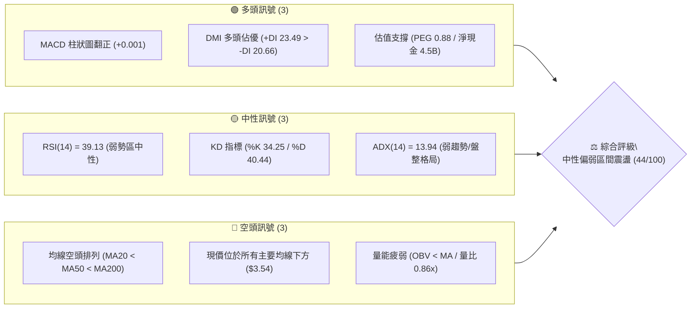
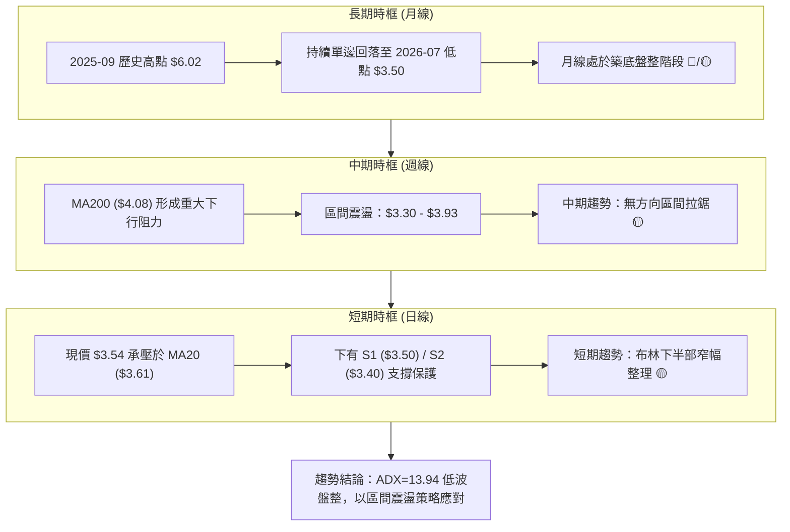
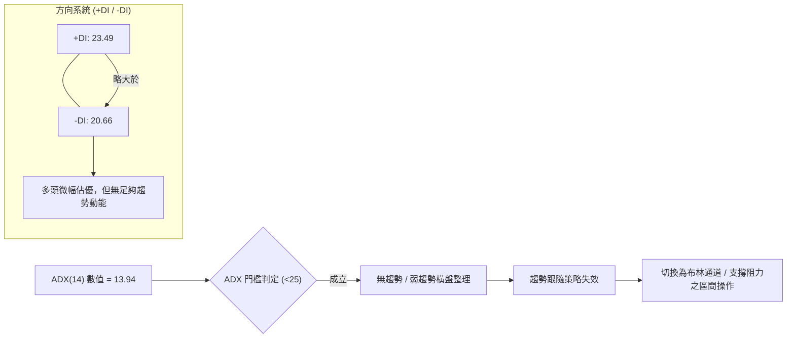
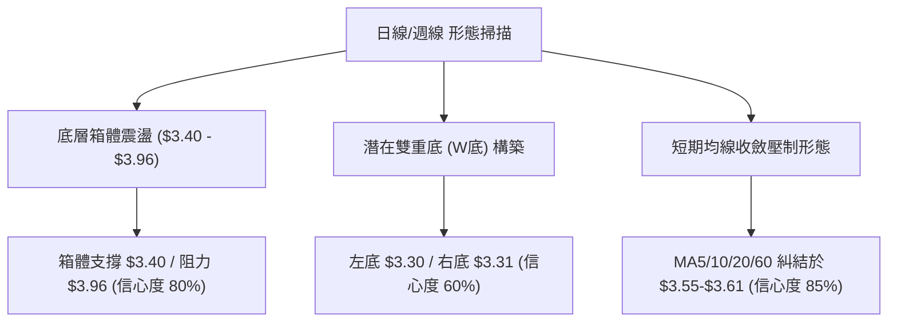
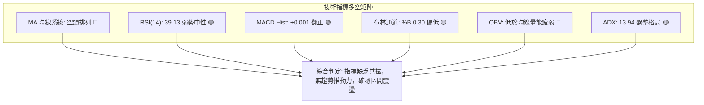
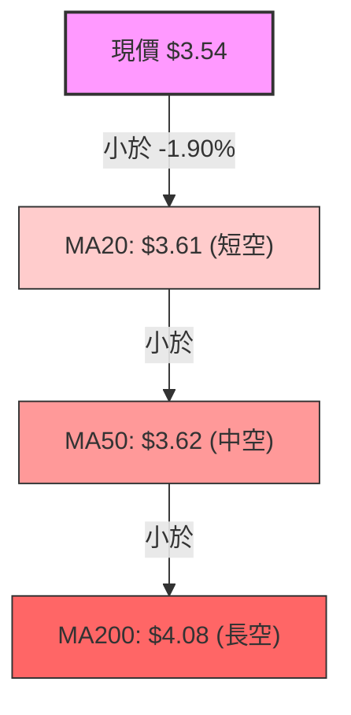
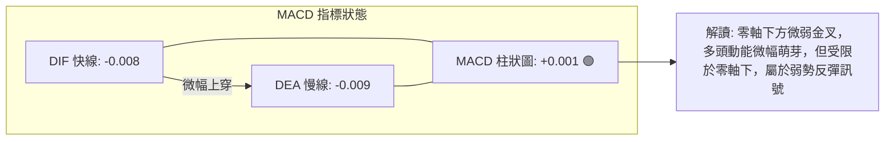
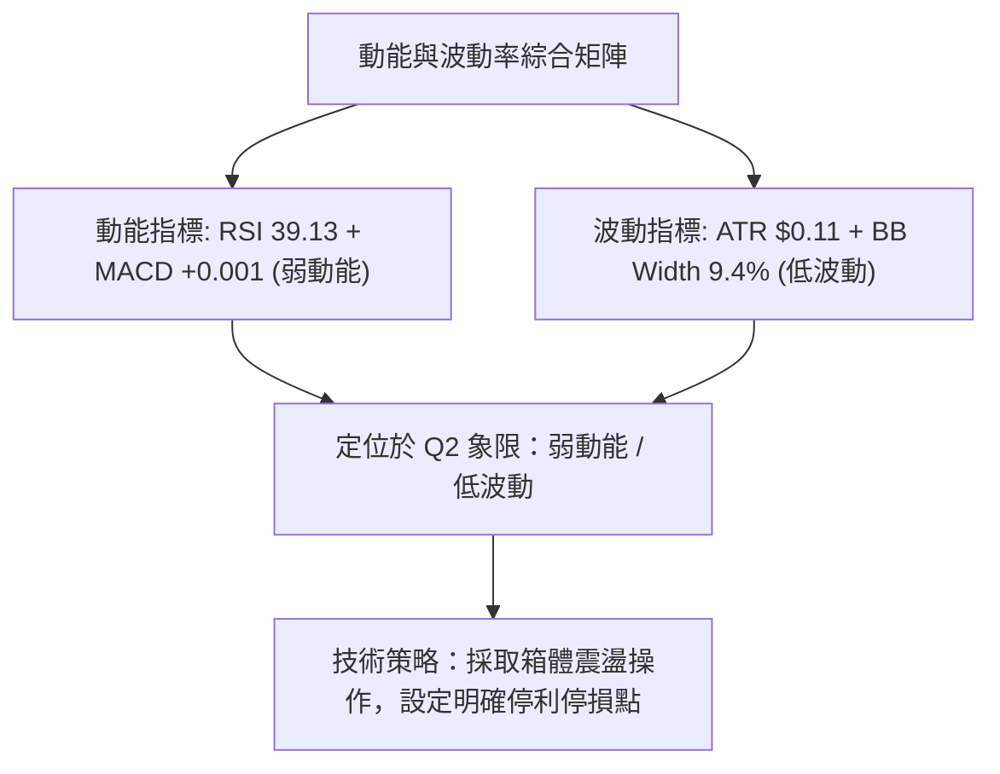
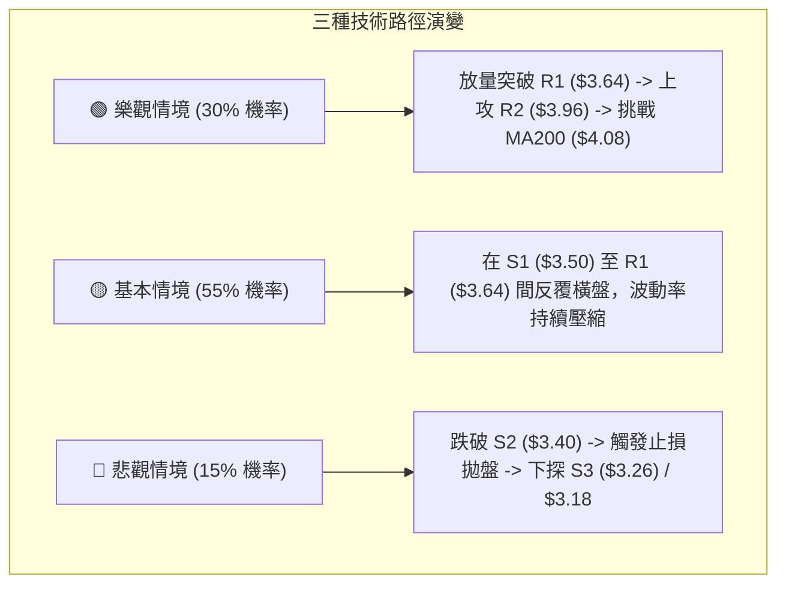

# GRAB 技術分析報告

> **報告日期**：2026-09-01 ｜ **語言**：繁體中文 ｜ **數據來源**：Yahoo Finance ｜ **當前價格**：$3.54

---

## 目錄

| 章節 | 內容 |
|------|------|
| [1. 技術面概覽](#1-技術面概覽) | 訊號儀表板、核心指標、評分卡 |
| [2. 趨勢分析](#2-趨勢分析) | 多時框趨勢、長中短期走勢、ADX 解讀 |
| [3. 圖表形態分析](#3-圖表形態分析) | 形態識別、K線組合、目標價推算 |
| [4. 支撐與阻力](#4-支撐與阻力) | 關鍵價位、斐波那契回調 |
| [5. 技術指標深度解讀](#5-技術指標深度解讀) | MA/RSI/MACD/布林/成交量/OBV |
| [6. 動能與波動率](#6-動能與波動率) | 動能評估、ATR、Beta |
| [7. 多時框架總結](#7-多時框架總結) | 時框架評分矩陣、多時框收斂 |
| [8. 交易策略建議](#8-交易策略建議) | 策略路由、主策略、情境機率 |
| [9. 風險提示與監控](#9-風險提示與監控) | 監控指標、風險場景、風控管理 |
| [📋 報告總結](#-報告總結) | 核心要點與操作摘要 |

---

## 1. 技術面概覽

### 🎯 技術訊號儀表板



### 📊 核心指標速覽表

| 指標類別 | 指標名稱 | 當前數值 | 訊號 | 解讀 |
|----------|----------|----------|:----:|------|
| **價格** | 當前價格 | $3.54 | 🟡 | 位於52週區間 10.5% 低檔位置（52W：$3.18 - $6.62） |
| **均線** | MA20 | $3.61 | 🔴 | 現價低於短期均線 -1.90%，短期上方存在第一道動態阻力 |
| **均線** | MA50 | $3.62 | 🔴 | 中期均線下彎，與 MA20 形成雙重黏合阻力帶 |
| **均線** | MA200 | $4.08 | 🔴 | 長期牛熊分水嶺，現價顯著受壓於其下方 (-13.24%) |
| **動能** | RSI(14) | 39.13 | 🟡 | 位於弱勢區間中性水位，未達超賣 (<30)，動能偏疲 |
| **動能** | MACD (12,26,9) | -0.008 / Hist +0.001 | 🟢 | 快慢線處於零軸下方，但柱狀圖微幅翻正，呈現底層微弱止跌 |
| **趨勢** | ADX(14) | 13.94 | 🟡 | 數值遠低於 25，確認當前為典型「無趨勢盤整」行情 |
| **通道** | 布林通道 %B | 0.30 | 🟡 | 現價落在下軌 ($3.44) 與中軌 ($3.61) 之間偏低位置 |
| **量能** | 20日成交量比 | 0.86x | 🔴 | 今日量能 31.92M 低於 20日均量 37.02M，量能萎縮無突破動能 |
| **波動** | ATR(14) | $0.11 | 🟢 | 波動率佔股價 3.19%，波動收斂進入整理末端 |

### 🏆 技術評分卡

```
╔══════════════════════════════════════════════════════════════╗
║              技術評分卡 — GRAB (2026-09-01)                  ║
╠══════════════════════════════════════════════════════════════╣
║ 趨勢強度 (Trend)     ████░░░░░░░░░░░░░░░░  20/100  🔴 極弱    ║
║ 動能指標 (Momentum)  ████████░░░░░░░░░░░░  40/100  🟡 偏弱    ║
║ 支撐穩定度 (Support) ██████████████░░░░░░  70/100  🟢 良好    ║
║ 成交量配合 (Volume)  ██████░░░░░░░░░░░░░░  30/100  🔴 疲弱    ║
║ 形態完整度 (Pattern) ████████████░░░░░░░░  60/100  🟡 築底中  ║
║ 均線排列 (MA System) ████░░░░░░░░░░░░░░░░  20/100  🔴 空頭    ║
╠══════════════════════════════════════════════════════════════╣
║ 綜合評分 (Overall)   █████████░░░░░░░░░░░  44/100  🟡 弱勢盤整║
╚══════════════════════════════════════════════════════════════╝
```

---

## 2. 趨勢分析

### 🌐 多時框趨勢分析



### 📈 長期趨勢 — 12個月走勢圖（Unicode）

```
GRAB 月線走勢圖（過去12個月：2025-09 至 2026-08）
價格軸 ($)
$6.02 ┤●(2025-09高點)
$6.01 ┤  ●
$5.45 ┤    ●
$4.99 ┤      ●
$4.30 ┤        ●
$4.22 ┤          ●
$3.82 ┤              ●
$3.77 ┤                  ●
$3.66 ┤            ●
$3.54 ┤●━━━━━━━━━━━●━━━━━●━━●←現價 $3.54 (2026-08)
$3.50 ┤                    ●(2026-07低點)
      └─────────────────────────────────────────────────────
       09  10  11  12  01  02  03  04  05  06  07  08 (月份)
```

#### 走勢特徵分析表格

| 階段 | 時間區間 | 起始價 → 結束價 | 漲跌幅 | 核心特徵與量價行為 |
|------|----------|-----------------|:------:|--------------------|
| **波段見頂** | 2025-09 ~ 2025-10 | $6.02 → $6.01 | -0.17% | 形成雙頂滯漲架構，量能無法推升突破，確立波段高點 |
| **主跌推動** | 2025-11 ~ 2026-03 | $5.45 → $3.66 | -32.84% | 單邊空頭下殺，跌破所有中期均線，空方動能強烈釋放 |
| **反彈修正** | 2026-04 | $3.82 | +4.37% | 短線超賣反彈，受制於 MA50 反壓後迅速回落 |
| **底部橫盤** | 2026-05 ~ 2026-08 | $3.54 → $3.54 | 0.00% | 進入 $3.50 - $3.77 窄幅箱體橫盤，波動率驟降，多空進入平衡期 |

### 📊 中期趨勢（週線分析）

```
GRAB 中期週線關鍵壓力與支撐帶示意圖
$4.08 ─── ═════════════════════════════════  MA200 / 強阻力帶 R3 ($4.06)
          │ ↑ 中期反彈極限阻力
$3.93 ─── ─────────────────────────────────  近20週波段高點 (2026-07-12) / R2 ($3.96)
          │
$3.64 ─── ---------------------------------  近期反彈頸線 / R1 ($3.64)
$3.54 ─── ◄──────── 現價 ($3.54) ────────►
$3.50 ─── .................................  近一年密集波段低點聚類 / 關鍵支撐 S1
          │
$3.30 ─── ═════════════════════════════════  近20週波段低點 (2026-06-14) / 強支撐 S2 ($3.40)
```

中期週線在 2026 年 5 月至 8 月期間呈現「雙底雛形」的橫向箱體震盪。低點由 6 月中旬的 $3.30 墊高至 7 月底的 $3.31 及 8 月下旬的 $3.48-$3.50，高點則於 7 月上旬觸及 $3.93。整體結構為大跌後的消化整理行情。

### ⚡ 趨勢強度評估（ADX 解讀）



#### ADX 強度對照與解讀

| ADX 數值區間 | 趨勢強度定義 | GRAB 當前狀態 | 交易策略指示 |
|:------------:|:------------:|:-------------:|:-------------|
| 0 - 20 | 極弱 / 無趨勢 | **13.94 (當前)** 🟢 | **嚴禁追突破；採取高拋低吸之箱體震盪操作** |
| 20 - 25 | 弱趨勢 / 醞釀期 | — | 觀察是否出現量能放大以突破通道 |
| 25 - 40 | 強趨勢形成 | — | 順勢交易，依照均線方向持倉 |
| > 40 | 極強趨勢 / 單邊 | — | 趨勢可能過度延伸，提防反轉 |

---

## 3. 圖表形態分析

### 🔍 形態識別系統



#### 形態識別與信心度評估表

| 形態名稱 | 信心度 | 判斷依據（引用數據） | 完成度 | 目標價（附精確計算式） |
|----------|:------:|----------------------|:------:|------------------------|
| **箱體震盪整理** | 80% | 價格在 S2 ($3.40) 與 R2 ($3.96) 間反覆橫盤達 4 個月 | 90% | 箱體突破目標 = 頸線 $3.96 + (箱高 $3.96 - $3.40 = $0.56) = **$4.52** |
| **中期雙重底 (W底)** | 60% | 第一底 $3.30 (2026-06-14)，第二底 $3.31 (2026-07-26)，頸線為近週高點 $3.93 | 55% (未破頸線) | W底量度目標 = 頸線 $3.93 + (形態高度 $3.93 - $3.30 = $0.63) = **$4.56** |
| **均線黏合壓縮** | 85% | MA5 ($3.59)、MA10 ($3.55)、MA20 ($3.61)、MA60 ($3.58) 價差僅 $0.06 | 95% | 待方向選擇，向上突破 R1 ($3.64) 展開對 R2 ($3.96) 之進攻 |

### 🕯️ 重要K線形態分析

| 週/月份 | 收盤價 | K線形態 | 技術解讀 | 訊號 |
|---------|:------:|---------|----------|:----:|
| **2026-06-14** | $3.30 | 錘頭線 (Hammer) | 探底至波段低點 $3.18 附近後獲買盤承接，留下影線，確立第一重底 | 🟢 |
| **2026-07-12** | $3.93 | 流星線 (Shooting Star) | 衝高觸及 R2 ($3.96) 聚類阻力帶後受阻回落，週 RSI 衝高至 68.4 遇阻 | 🔴 |
| **2026-07-26** | $3.31 | 破底翻長下影十字星 | 二次測試 $3.30 支撐不破，形成雙底架構之右腳，空頭衰竭 | 🟢 |
| **2026-08-30** | $3.61 | 窄幅實體小陽線 | 試圖站上 MA20，但量能僅 157.45M，多頭上攻意願謹慎 | 🟡 |
| **2026-09-06** | $3.54 | 縮量十字星 (進行中) | 均線密集區內爭奪，多空暫處平衡，成交量縮至 31.92M | 🟡 |

### 📉 ASCII 走勢形態示意圖

```
GRAB 築底形態與箱體結構圖 ($3.30 - $3.96)
價格
$3.96 ┼───────────────────────● R2 阻力帶 / W底頸線 ($3.93)
      │                      / \
$3.78 ┼─ BB上軌 ────────────/───\─────────────
      │                    /     \      ● 反彈高點 $3.66 (08-09)
$3.64 ┼─ R1 阻力 ─────────/───────\────/─\───
$3.61 ┼─ BB中軌 (MA20)──/─────────\──/───\── 現價 $3.54 (收斂中)
$3.44 ┼─ BB下軌 ───────/───────────\/─────● S1 支撐 $3.50
$3.30 ┼───────────────●             ● S2 強支撐 ($3.40) / 雙底低點
      │              (左底 06-14)  (右底 07-26)
      └──────────────────────────────────────────────────────────► 時間
```

### 🎯 形態目標價計算

1. **若向上突破箱體與頸線**：
   - 形態底部基準：$3.30（2026-06-14 低點聚類區）
   - 箱體頂部頸線：$3.96（阻力位 R2 / 近期高點聚類）
   - 形態垂直高度：$3.96 - $3.30 = $0.66
   - **量度延伸目標價** = $3.96 + $0.66 = **$4.62**（接近斐波那契 61.8% 回調位 $4.49）
2. **若向下跌破箱體下沿**：
   - 箱體下軌支撐：$3.40（支撐位 S2）
   - 跌破量度目標價 = $3.40 - ($3.96 - $3.40 = $0.56) = **$2.84**（數據中未偵測到該歷史低點，僅供極端下行量度參考，中途第一防線為 52W 低點 $3.18）

---

## 4. 支撐與阻力

### 🗺️ 關鍵價位分布圖（Unicode）

```
GRAB 價位結構分布圖 (現價 $3.54)
═════════════════════════════════════════════════════════════════
$4.08 ║██████████████████████████████║ MA200 牛熊分水嶺
$4.06 ║████████████████████████████  ║ 強阻力 R3 (+14.69%)
$3.96 ║████████████████████          ║ 阻力 R2 / 箱頂頸線 (+11.77%)
$3.78 ║▓▓▓▓▓▓▓▓▓▓▓▓▓▓▓▓▓▓            ║ 布林通道上軌 (+6.78%)
$3.64 ║████████████████████████████  ║ 關鍵阻力 R1 / MA120 (+2.73%)
$3.61 ║░░░░░░░░░░░░░░░░░░░░░░░░░░░░  ║ 布林中軌 (MA20) / MA50
──────╠══════════════════════════════╣ ◄ 現價 $3.54
$3.50 ║▓▓▓▓▓▓▓▓▓▓▓▓▓▓▓▓▓▓▓▓▓▓        ║ 近期支撐 S1 (-1.13%)
$3.44 ║░░░░░░░░░░░░░░░░░░░░          ║ 布林通道下軌 (-2.82%)
$3.40 ║████████████████████████████  ║ 強支撐 S2 / 波段低點聚類 (-3.88%)
$3.26 ║████████████████████████      ║ 深層支撐 S3 (-8.05%)
$3.18 ║██████████████████████████████║ 52週低點 / 斐波那契 100% 支撐
═════════════════════════════════════════════════════════════════
```

### 🚧 阻力位分析表

| 阻力級別 | 精確價位 | 形成原因（依據聚類與均線） | 突破難度 | 技術重要性 |
|:--------:|:--------:|----------------------------|:--------:|:----------:|
| **R1** | **$3.64** | 近一年波段高點聚類、MA120 ($3.64) 共振壓制位 | 中等 🟡 | ★★★☆☆ (短線多空轉折點) |
| **R2** | **$3.96** | 近期 20 週高點聚類帶 ($3.90-$3.93) 延伸壓制、斐波那契 78.6% ($3.92) | 較高 🔴 | ★★★★☆ (箱體突破確認點) |
| **R3** | **$4.06** | 近一年波段高點聚類、MA200 ($4.08) 長期均線壓制位 | 極高 🔴 | ★★★★★ (中期牛熊轉換樞紐) |

### 🛡️ 支撐位分析表

| 支撐級別 | 精確價位 | 形成原因（依據聚類與均線） | 守住機率 | 技術重要性 |
|:--------:|:--------:|----------------------------|:--------:|:----------:|
| **S1** | **$3.50** | 近一年波段低點聚類、2026-07/08 月線收盤防守位 | 70% 🟢 | ★★★☆☆ (短線箱體下沿防線) |
| **S2** | **$3.40** | 近一年波段低點聚類、布林下軌 ($3.44) 下方強承接區 | 85% 🟢 | ★★★★☆ (中期雙底防守樞紐) |
| **S3** | **$3.26** | 近一年波段深層低點聚類、逼近 52W 低點 ($3.18) 前最後防線 | 95% 🟢 | ★★★★★ (年度生命線支撐) |

### 📐 斐波那契回調位分析

依據 52 週波動區間（低點 $3.18 → 高點 $6.62，波幅 $3.44）計算之標準回調位：

```
0.0%  (52W High)  ── $6.62  ─────────────────────────────────
23.6%             ── $5.81  ── [分析師共識平均目標價 $5.86 聚集區]
38.2%             ── $5.31  ─────────────────────────────────
50.0%             ── $4.90  ── [中長期多空均衡樞紐]
61.8%             ── $4.49  ── [黃金分割強阻力位]
78.6%             ── $3.92  ── [近期反彈高點 $3.93 / R2 $3.96 共振區]
─────────────────────────────────────────────────────────────
現價 $3.54 落於 78.6% ($3.92) 與 100.0% ($3.18) 之間，處於深度回調末端
─────────────────────────────────────────────────────────────
100.0% (52W Low)  ── $3.18  ── [波段終極支撐防線]
```

- **位置解讀**：現價 $3.54 處於斐波那契回調 78.6%（$3.92）至 100.0%（$3.18）之間的極深回撤區間（目前位處 52W 區間的 10.5% 分位）。
- **技術意義**：回調超過 78.6% 代表原本的上漲趨勢已完全被破壞，市場進入長期尋底與沉澱期。上方第一道大級別斐波那契壓力在 78.6% 的 **$3.92**，與阻力位 **R2 ($3.96)** 形成高度密集的共振反壓區。

---

## 5. 技術指標深度解讀

### 🎛️ 指標訊號總覽



### 📈 移動平均線排列分析



#### 各週期移動平均線明細

| 週期 | 均線價位 | 與現價價差 | 乖離率 (%) | 排列狀態 | 技術含義 |
|------|:--------:|:----------:|:----------:|:--------:|:---------|
| **MA5** | $3.59 | -$0.05 | -1.45% | 空頭 | 超短期承壓，日線級別微幅受挫 |
| **MA10** | $3.55 | -$0.01 | -0.17% | 空頭 | 極度貼近現價，即將發生短線方向選擇 |
| **MA20** | $3.61 | -$0.07 | -1.90% | 空頭 | 布林中軌所在，為多頭反彈的第一目標 |
| **MA60** | $3.58 | -$0.04 | -1.14% | 空頭 | 季線下壓趨緩，呈現走平黏合特徵 |
| **MA120** | $3.64 | -$0.10 | -2.88% | 空頭 | 與 R1 ($3.64) 精確重合，構成波段強反壓 |
| **MA200** | $4.08 | -$0.54 | -13.24% | 空頭 | 長期下行趨勢壓制線，牛熊分界線 |
| **MA240** | $4.40 | -$0.86 | -19.58% | 空頭 | 年線長期壓制，遠離現價 |

**均線特徵解讀**：MA5 ($3.59)、MA10 ($3.55)、MA20 ($3.61)、MA60 ($3.58) 與 MA120 ($3.64) 全部高度收斂在 **$3.55 - $3.64** 的 $0.09 狹窄區間內。這種極度黏合狀態預示著即將發生均線發散行情，但受限於 MA200 ($4.08) 在上方壓制，向上發散的第一阻力極限在 $3.96 - $4.06。

### 📉 RSI(14) 分析

```
RSI(14) 數值進度條：
0 ────────── 30 ────────── 50 ────────── 70 ────────── 100
[████████████████░░░░░░░░░░░░░░░░░░░░░░░░░░░░░░░░░░░] 39.13 (弱勢中性)
```

- **當前數值**：39.13。
- **區間狀態**：位於 30 - 50 的空頭控盤偏弱區，但未進入 <30 的超賣極值區，顯示市場買盤動能不足，但亦未見恐慌性拋盤。
- **背離分析**：
  - **頂背離**：無。
  - **底背離**：近 20 週數據中，2026-05-10 週收盤 $3.72 時 RSI 為 20.5，至 2026-07-26 週收盤 $3.31 時 RSI 為 25.9，至當前 $3.54 時 RSI 為 39.13。價格在 6-7 月創出波段新低，但 RSI 低點並未再破 20.5，**存在週線級別的微幅隱性底背離**，支撐了 $3.30-$3.40 底部支撐的有效性。

### 📊 MACD(12/26/9) 訊號解讀



- **MACD 線**：-0.008
- **Signal 線**：-0.009
- **柱狀圖 (Histogram)**：+0.001（由負翻正）
- **技術解讀**：MACD 在負值區間黏合並形成微幅黃金交叉，Hist 呈現 +0.001 的看多讀數。然而，由於快慢線均在零軸下方運行，此類金叉通常僅代表「跌勢趨緩」或「箱體內部反彈」，尚未具備推動單邊主升浪的技術條件。

### 📦 布林通道分析

```
GRAB 布林通道 (20, 2) 結構圖
$3.78 ┬────────────────────────────────────────── 布林上軌 (Upper Band)
      │
      │
$3.61 ┼────────────────────────────────────────── 布林中軌 (MA20)
      │      ● 現價 $3.54 (%B = 0.30)
      │
$3.44 ┴────────────────────────────────────────── 布林下軌 (Lower Band)
```

- **布林帶寬度**：($3.78 - $3.44) / $3.61 = **9.42%**（通道帶寬極度收窄，波動率壓縮至極致）。
- **%B 指標**：0.30。表明價格目前處於通道下半區，正緩慢自下軌向中軌尋求修復。
- **操作涵義**：在 ADX < 25 的環境下，布林通道上下軌具備極高參考價值。下軌 **$3.44** 為短線支撐參考，上軌 **$3.78** 為第一反彈目標阻力。

### 💹 成交量分析（量價配合度）

- **最新成交量**：31,923,698 股
- **20日均量**：37,016,690 股（量比：**0.86x**）
- **50日均量**：43,062,810 股
- **OBV 能量潮**：OBV < MA(OBV)，整體走勢處於均線下方，量能呈現持續流出後的低迷狀態。
- **量價關係解讀**：
  1. 近期縮量橫盤：成交量自 5 月的週均 2.5-3.0 億股萎縮至當前的 1.5 億股左右（日均量降至 3,192 萬股），屬於典型的「地量等方向」特徵。
  2. 無量反彈受限：缺乏增量資金進場，難以攻克 MA20 ($3.61) 及 R1 ($3.64) 密集阻力帶。若要形成有效突破，日成交量必須放大至 50日均量（43.06M）的 1.5 倍以上（約 >65M 股）。

---

## 6. 動能與波動率

### ⚡ 動能評估四象限

| 象限 | 動能維度 | 波動維度 | 代表特徵 | GRAB 當前狀態 | 交易應對策略 |
|:----:|:--------:|:--------:|:---------|:-------------:|:-------------|
| **Q1** | 強動能 | 低波動 | 穩定上升趨勢 | — | 順勢加碼持股 |
| **Q2** | **弱動能** | **低波動** | **低位築底 / 箱體窄幅橫盤** | **✓ (落入此象限)** | **區間高拋低吸 / 嚴格止損** |
| **Q3** | 強動能 | 高波動 | 突破爆發 / 單邊行情 | — | 追隨趨勢動量突破 |
| **Q4** | 弱動能 | 高波動 | 恐慌拋售 / 震盪洗盤 | — | 空倉觀望迴避風險 |



### 📊 ATR 波動率分析

- **ATR(14) 數值**：**$0.11**
- **ATR 佔比 (波動率)**：$0.11 / $3.54 = **3.19%**
- **止損距離建議**：
  - 超短線交易（1.0x ATR）：止損緩衝設為 **$0.11**
  - 波段交易（1.5x ATR）：止損緩衝設為 **$0.17**
  - 箱體防守止損（2.0x ATR）：止損緩衝設為 **$0.22**

### 📐 Beta 與市場相關性

- **Beta 係數**：**0.89**
- **市場特徵分析**：
  - Beta < 1.0 表明 GRAB 的系統性市場風險略低於標普500大盤。
  - 當大盤發生劇烈波動時，GRAB 表現出一定防禦性，但也意味著在沒有個股強大催化劑（Catalyst）的情況下，該股難以自發走出超越大盤的獨立單邊行情，走勢更傾向於圍繞基本面估值中樞（PEG 0.88）與現金價值進行區間震盪。

---

## 7. 多時框架總結

### 📋 時框架評分表

| 時框架 | 趨勢方向 | 動能狀態 | 均線排列 | 關鍵圖表形態 | 綜合評分 | 操作建議 |
|:------:|:--------:|:--------:|:--------:|:------------:|:--------:|:---------|
| **長期 (月線)** | 下行偏弱 🔴 | 弱勢中性 🟡 | 空頭排列 🔴 | 高位回落後築底 | 35/100 | 觀望，等待長均走平 |
| **中期 (週線)** | 區間震盪 🟡 | 底部微幅背離 🟢 | 受制 MA200 🔴 | 潛在雙重底 ($3.30-$3.93) | 50/100 | 逢低分批建倉，遇阻止盈 |
| **短期 (日線)** | 窄幅盤整 🟡 | MACD 翻正 🟢 | 均線收斂壓制 🔴 | 布林下半區橫盤 | 45/100 | 嚴守 $3.40-$3.64 區間交易 |

### 🔲 綜合訊號矩陣

```
時框架訊號矩陣一致性檢驗：
╔════════════════╦════════════════╦════════════════╦════════════════╗
║    分析維度    ║   短期 (日線)  ║   中期 (週線)  ║   長期 (月線)  ║
╠════════════════╬════════════════╬════════════════╬════════════════╣
║ 趨勢方向       ║ 🟡 橫向盤整    ║ 🟡 箱體震盪    ║ 🔴 空頭下行    ║
║ 動能強弱       ║ 🟢 翻正萌芽    ║ 🟡 弱勢修復    ║ 🔴 動能疲弱    ║
║ 支撐有效性     ║ 🟢 S1 ($3.50)  ║ 🟢 S2 ($3.40)  ║ 🟢 S3 ($3.26)  ║
║ 阻力壓制力     ║ 🔴 R1 ($3.64)  ║ 🔴 R2 ($3.96)  ║ 🔴 R3 ($4.06)  ║
║ 量能配合度     ║ 🔴 縮量 0.86x  ║ 🔴 縮量整理    ║ 🟡 拋壓衰竭    ║
╚════════════════╩════════════════╩════════════════╩════════════════╝
```

### ⚖️ 多時框收斂結論

依據多時框收斂規則（嚴格要求 14）：
1. **行情性質判定**：當前 ADX(14) 數值為 **13.94**（遠低於 25 臨界值），明確判定當前市場處於**「典型盤整行情」**而非單邊趨勢行情。
2. **時框收斂與主導權**：在 ADX < 25 的盤整環境中，中長期均線的單邊指引力弱化，以**日線布林通道（$3.44 - $3.78）與近一年波段關鍵支撐阻力（S2 $3.40 / R2 $3.96）**為主要交易依據。
3. **唯一方向性結論**：**【中性觀望，偏低吸區間操作】**。目前各時框均不支持追高買入或激進做空，整體技術面處於低波動築底階段。

---

## 8. 交易策略建議

### 🗺️ 策略決策流程圖

```mermaid
graph TD
    Start["當前價格 $3.54 處於震盪區間"] --> CheckADX{"ADX(14) = 13.94 < 25?"}
    CheckADX -->|"是: 盤整格局"| Route{"綜合評分 = 44/100 (中性偏弱)"}
    
    Route --> StratA["主策略：箱體下沿低吸 / 區間高拋 (策略 A)"]
    Route --> StratB["突破策略：突破 R1 追動量 / 破 S2 停損 (策略 B)"]
    
    StratA --> ExecA["進場: $3.45 - $3.50 |" 止損: $3.38 "| 目標: $3.64 / $3.78"]
    StratB --> ExecB["進場: 突破 $3.65 |" 止損: $3.54 "| 目標: $3.96 / $4.06"]
```

### 🧭 策略路由

> **當前主策略方向 = 【中性偏多區間震盪低吸操作】（依技術評分卡綜合評分 44/100）**
> 
> 評分處於 40–60 中性區間，且 ADX < 25，明確定義為「區間操作」。以支撐位 S1 ($3.50) / S2 ($3.40) 及布林下軌 ($3.44) 作為防守基石，向上博弈回歸布林中軌 MA20 ($3.61) 及測試阻力位 R1 ($3.64) 與 R2 ($3.96)。

### 🎯 價格情境階梯（Price Scenarios）

| 觸發條件 | 第一目標 | 後續延伸目標 | 技術情境含義與操作指引 |
|----------|:--------:|:------------:|------------------------|
| **向上放量突破 R1 ($3.64)** | **R2 ($3.96)** | **R3 ($4.06)** | 短線轉強，突破均線糾結區，挑戰週線箱頂 |
| **維持現價區間 ($3.44 - $3.64)** | **MA20 ($3.61)** | **BB上軌 ($3.78)** | 區間窄幅震盪，維持低吸高拋網格操作 |
| **向下跌破 S1 ($3.50)** | **S2 ($3.40)** | **S3 ($3.26)** | 短線弱勢探底，回測中期雙底頸線支撐防線 |

### 📊 情境機率分佈

| 行情情境 | 機率預估 | 主要技術依據 |
|----------|:--------:|--------------|
| **區間窄幅震盪 (主情境)** | **55%** | ADX = 13.94 極低，成交量能萎縮 (0.86x)，布林帶寬僅 9.42% 進入壓縮 |
| **向上反彈測試阻力 (次情境)** | **30%** | MACD 柱狀圖翻正 (+0.001)，+DI > -DI，週線具備底背離特徵 |
| **向下跌破二次探底 (風險情境)** | **15%** | 均線系統呈空頭排列，OBV 低於均線，但受 S2 ($3.40) 及估值強支撐 |

### 🟢 主策略詳情

依據本報告關鍵價位體系，制定兩套可執行交易策略：

| 策略要素 | 策略 A：箱體下軌低吸策略（主推） | 策略 B：突破跟隨策略（右側） |
|----------|---------------------------------|-----------------------------|
| **策略類型** | 逆勢區間低吸（左側交易） | 順勢動量突破（右側交易） |
| **進場條件** | 價格回踩 S1 ($3.50) 或布林下軌 ($3.44) 企穩 | 日K收盤價放量突破 R1 ($3.64) 且量能 > 45M |
| **進場價格** | **$3.48** (介於 $3.44 - $3.50) | **$3.65** (突破 R1 $3.64 確認) |
| **止損價格** | **$3.38** (跌破 S2 $3.40 關鍵防線) | **$3.54** (現價 / MA10 支撐位) |
| **目標價 T1** | **$3.64** (阻力位 R1 / MA120) | **$3.96** (阻力位 R2 / 箱體頂部) |
| **目標價 T2** | **$3.78** (布林通道上軌) | **$4.06** (阻力位 R3 / MA200) |
| **風險報酬比** | **1 : 2.30** (風險 $0.10，報酬 T2 $0.23) | **1 : 2.82** (風險 $0.11，報酬 T1 $0.31) |
| **預估勝率** | **65%** | **50%** |
| **建議倉位** | **10% - 15%** (分批建倉) | **10%** (突破加碼) |

### 🔴 反向風險觸發點（對沖提示）

- **多頭防守底線**：若日K線收盤價跌破 **S2 ($3.40)**，代表箱體震盪下沿失守，雙底結構遭到破壞，原區間低吸策略必須**無條件停損出場**或建立空頭對沖，下看 **S3 ($3.26)** 與 52W 低點 **$3.18**。
- **空頭平倉線**：若價格放量站穩 **R2 ($3.96)**，宣告大級別 W 底構築完成，所有空頭避險部位應全數平倉。

### ⭐ 整體訊號強度評星

```
╔══════════════════════════════════════════════════════════════╗
║ 做多訊號強度：★★☆☆☆  (2.5/5星 — 僅限底部低吸，缺乏單邊動能) ║
║ 做空訊號強度：★★☆☆☆  (2.0/5星 — 下方支撐密集，做空盈虧比差) ║
║ 整體可信度：  ★★★★☆  (4.0/5星 — 震盪區間明確，指標收斂一致) ║
╚══════════════════════════════════════════════════════════════╝
```

---

## 9. 風險提示與監控

### ✅ 關鍵監控指標 Checklist

```
╔══════════════════════════════════════════════════════════════╗
║              GRAB 技術面每日監控清單 (Checklist)             ║
╠══════════════════════════════════════════════════════════════╣
║ [ ] 價格是否跌破 S1 ($3.50) / S2 ($3.40) 關鍵支撐位           ║
║ [ ] 價格是否突破 R1 ($3.64) / R2 ($3.96) 關鍵阻力位           ║
║ [ ] 日成交量是否放大突破 50日均量 (43.06M 股)                ║
║ [ ] ADX(14) 是否由 13.94 向上突破 25（趨勢啟動訊號）         ║
║ [ ] MACD 柱狀圖是否持續擴大並帶動快慢線突破零軸              ║
║ [ ] RSI(14) 是否跌破 30 進入超賣，或突破 50 進入強勢區       ║
╚══════════════════════════════════════════════════════════════╝
```

### ⚠️ 風險場景分析



### 🛡️ 風險管理重要提醒

1. **嚴禁追高與過早重倉**：當前處於 ADX=13.94 的弱趨勢整理市，追高極易被套在布林通道上軌或 R1 ($3.64) 處。總持倉比例建議嚴格控制在 **20% 以內**。
2. **嚴格執行 ATR 止損**：以當前 ATR ($0.11) 評估，單筆交易最大虧損應控制在總資金的 1%–2% 以內，止損位不可隨意向下移動。
3. **量能驗證原則**：任何未伴隨成交量放大（日成交量 < 40M）的價格突破，均視為假突破（Bull Trap），切勿在突破當日立即重倉追入，應等待回踩確認。

---

## 📋 報告總結

```
╔══════════════════════════════════════════════════════════════╗
║                  GRAB 技術分析報告總結                       ║
╠══════════════════════════════════════════════════════════════╣
║ 報告日期：2026-09-01             當前價格：$3.54              ║
║ 技術評級：🟡 中性弱勢盤整 (44/100) — 區間震盪低吸格局        ║
╠══════════════════════════════════════════════════════════════╣
║ 關鍵結論：                                                   ║
║ ├─ 長期趨勢：🔴 空頭排列，但月線在 $3.50 處出現築底跡象       ║
║ ├─ 中期趨勢：🟡 $3.40 - $3.96 箱體震盪，潛在雙重底構築中     ║
║ ├─ 短期趨勢：🟡 均線收斂 ($3.55-$3.64)，ADX=13.94 波動壓縮   ║
║ ├─ 關鍵支撐：S1: $3.50 ｜ S2: $3.40 ｜ S3: $3.26            ║
║ ├─ 關鍵阻力：R1: $3.64 ｜ R2: $3.96 ｜ R3: $4.06 (MA200)     ║
║ └─ 分析師目標：平均 $5.86 ｜ 最高 $8.00 ｜ 最低 $4.60        ║
╠══════════════════════════════════════════════════════════════╣
║ 最優操作策略：                                               ║
║ 1. 🥇 最佳機會：在 $3.44 - $3.50 (S1/布林下軌) 低吸，        ║
║                 止損設 $3.38，目標上看 $3.64 / $3.78。       ║
║ 2. 🥈 次選機會：待日線放量站穩 R1 ($3.64) 後右側跟進，       ║
║                 止損設 $3.54，目標上看 R2 ($3.96)。         ║
║ 3. 🥉 保守選擇：場外觀望，等待 ADX > 25 且方向明確後再介入。 ║
╚══════════════════════════════════════════════════════════════╝
```

---

> ⚠️ **免責聲明**：本報告為技術分析研究，所有數據及價位均基於歷史量價數據計算。本報告**僅供學術與投資研究參考**，**不構成任何要約或投資建議**。金融市場瞬息萬變，投資人應獨立評估風險並自負盈虧。

---

*報告生成時間：2026-09-01 ｜ 數據來源：Yahoo Finance ｜ 分析框架：多時框技術分析體系*