# GRAB 技術分析報告

> **報告日期**：2026-09-02 ｜ **語言**：繁體中文 ｜ **數據來源**：Yahoo Finance ｜ **當前價格**：$3.46

---

## 目錄

| 章節 | 內容 |
|------|------|
| [1. 技術面概覽](#1-技術面概覽) | 訊號儀表板、核心指標、評分卡 |
| [2. 趨勢分析](#2-趨勢分析) | 多時框趨勢、長中短期走勢 |
| [3. 圖表形態分析](#3-圖表形態分析) | 形態識別、K線組合、目標價 |
| [4. 支撐與阻力](#4-支撐與阻力) | 關鍵價位、斐波那契回調 |
| [5. 技術指標深度解讀](#5-技術指標深度解讀) | MA/RSI/MACD/布林/成交量 |
| [6. 動能與波動率](#6-動能與波動率) | 動能評估、ATR、Beta |
| [7. 多時框架總結](#7-多時框架總結) | 時框架評分矩陣 |
| [8. 交易策略建議](#8-交易策略建議) | 多空策略、風險報酬比 |
| [9. 風險提示與監控](#9-風險提示與監控) | 監控指標、風險場景 |

---

## 1. 技術面概覽

### 🎯 技術訊號儀表板

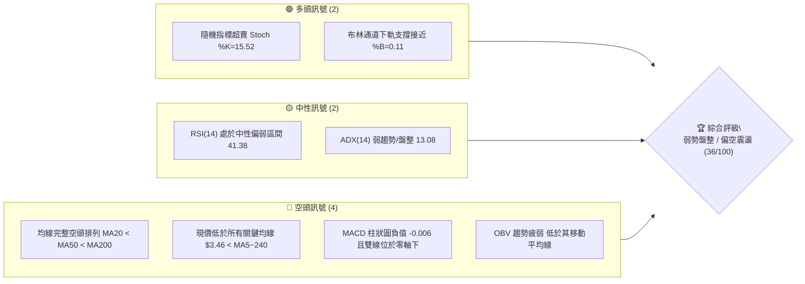

### 📊 核心指標速覽表

| 指標類別 | 指標名稱 | 當前數值 | 訊號 | 解讀 |
|----------|----------|----------|------|------|
| **價格** | 當前價格 | $3.46 | 🔴 | 位於 52 週區間底部 8.1% 位置，承壓嚴重 |
| **均線** | MA20 | $3.60 | 🔴 | 價格低於 MA20 (-3.77%)，短線承壓 |
| **均線** | MA50 | $3.62 | 🔴 | 價格低於 MA50，中期趨勢受壓制 |
| **均線** | MA200 | $4.07 | 🔴 | 價格低於 MA200，長期趨勢全面走空 |
| **動能** | RSI(14) | 41.38 | 🟡 | 位於 30-70 中性偏弱區間，暫無明顯背離 |
| **動能** | MACD | -0.016 | 🔴 | MACD 線低於信號線 (-0.010)，柱狀圖為 -0.006 |
| **動能** | Stoch %K/%D| 15.52 / 31.88 | 🟢 | 進入超賣區 (<20)，具備短線技術性反彈動能 |
| **趨勢強度**| ADX(14) | 13.08 | 🟡 | ADX < 25 表明處於弱趨勢/無方向性盤整市 |
| **趨勢方向**| +DI / -DI| 21.16 / 22.28| 🔴 | -DI > +DI，空頭力量佔據微弱優勢 |
| **通道位置**| BB %B | 0.11 | 🟡 | 逼近布林下軌 $3.42，下行空間受限於通道 |
| **成交量** | 量比 (vs MA20)| 1.15x | 🟡 | 日成交量 38.89M 高於均量，但 OBV 疲弱 |
| **波動** | ATR(14) | $0.11 | 🟢 | 每日波動佔價格 3.23%，波動度適中偏低 |

### 🏆 技術評分卡

```
╔══════════════════════════════════════════════════════════════════╗
║                技術評分卡 — GRAB (2026-09-02)                    ║
╠══════════════════════════════════════════════════════════════════╣
║ 趨勢強度      █████░░░░░░░░░░░░░░░  25/100  🔴 空頭排列且弱勢     ║
║ 動能指標      ████████░░░░░░░░░░░░  40/100  🟡 弱動能但超賣       ║
║ 支撐穩定度    ██████████░░░░░░░░░░  50/100  🟡 逼近52W支撐S1      ║
║ 成交量配合    ██████░░░░░░░░░░░░░░  30/100  🔴 OBV<MA 量能不足    ║
║ 形態完整度    ████████░░░░░░░░░░░░  40/100  🟡 底部區間構築中     ║
║ 均線排列      ████░░░░░░░░░░░░░░░░  20/100  🔴 完美空頭排列       ║
╠══════════════════════════════════════════════════════════════════╣
║ 綜合評分      ███████░░░░░░░░░░░░░  36/100  🔴 偏空震盪/觀望      ║
╚══════════════════════════════════════════════════════════════════╝
```

---

## 2. 趨勢分析

### 🌐 多時框趨勢分析

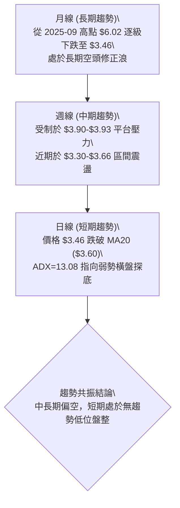

### 📈 長期趨勢 — 12個月走勢圖（Unicode）

```
GRAB 月線走勢圖（2025-09 至 2026-09）
價格 ($)
$6.02 ┤ ● 2025-09 (高點 $6.02)
$6.01 ┤   ● 2025-10 ($6.01)
$5.45 ┤     ● 2025-11 ($5.45)
$4.99 ┤       ● 2025-12 ($4.99)
$4.30 ┤         ● 2026-01 ($4.30)
$4.22 ┤           ● 2026-02 ($4.22)
$3.82 ┤               ● 2026-04 ($3.82)
$3.77 ┤                   ● 2026-06 ($3.77)
$3.66 ┤             ● 2026-03 ($3.66)
$3.54 ┤                 ● 2026-05 ($3.54)   ● 2026-08 ($3.54)
$3.50 ┤                     ● 2026-07 ($3.50)
$3.46 ┤                         ●← 現在 (2026-09: $3.46)
      └─┬───┬───┬───┬───┬───┬───┬───┬───┬───┬───┬───┬───
       09  10  11  12  01  02  03  04  05  06  07  08  09 (月份)
```

#### 走勢特徵分析表格

| 階段 | 時間區間 | 起始/結束價 | 漲跌幅 | 走勢特徵解讀 |
|------|----------|-------------|--------|--------------|
| **主頂構築** | 2025-09 ~ 2025-10 | $6.02 → $6.01 | -0.17% | 雙頂高位滯漲，觸及 52 週高點區域後動能竭盡 |
| **主跌推動** | 2025-11 ~ 2026-03 | $5.45 → $3.66 | -32.84% | 單邊空頭重挫，連續跌破整數關口，均線發散向下 |
| **低位震盪** | 2026-04 ~ 2026-09 | $3.82 → $3.46 | -9.42% | 於 $3.30-$3.93 構築寬幅收斂底部，波動率顯著收縮 |

### 📊 中期趨勢（週線分析）

```
GRAB 週線壓力與支撐走勢示意圖
$4.00 ┤              
$3.93 ┤      ●───────● 2026-07 高點阻力區間 (R2: $3.96 附近)
$3.80 ┤     / \     / \
$3.66 ┤    /   \   /   ● 2026-08-09 反彈波峰
$3.55 ┤   ●     \ /     \   ● 2026-08-30
$3.46 ┤  /       ●       \ / ◄ 當前價格 $3.46 (位於 S1 $3.40 上方)
$3.30 ┤ ● 2026-06-14 低點 (接近 S2: $3.26)
$3.18 ┤────────────────────────── 52週最低點支撐 S3 ($3.18)
      └─────────────────────────────────────────────────────
```

### ⚡ 趨勢強度評估（ADX 解讀）

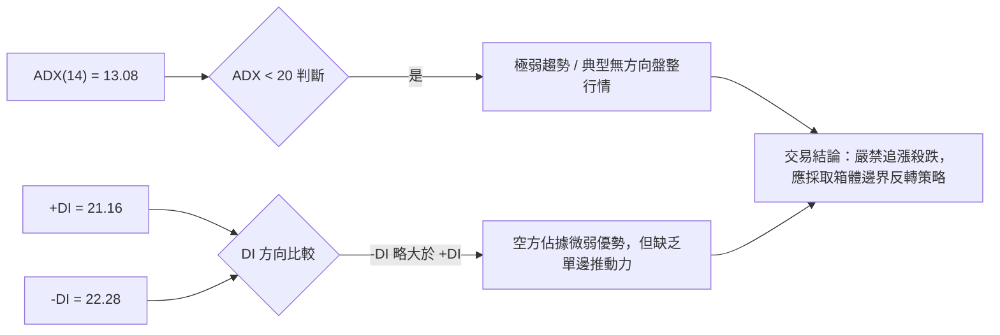

| 指標名稱 | 當前數值 | 參考臨界值 | 狀態評估 | 操作指引 |
|----------|----------|------------|----------|----------|
| **ADX(14)** | 13.08 | < 25 (弱/盤整) | █░░░░░░░░░ (極弱) | 趨勢指標鈍化，趨勢策略失效 |
| **+DI** | 21.16 | — | 多方力量低迷 | 上行動能不足 |
| **-DI** | 22.28 | — | 空方略微主導 | 賣壓雖不猛烈但持續存在 |

---

## 3. 圖表形態分析

### 🔍 形態識別系統

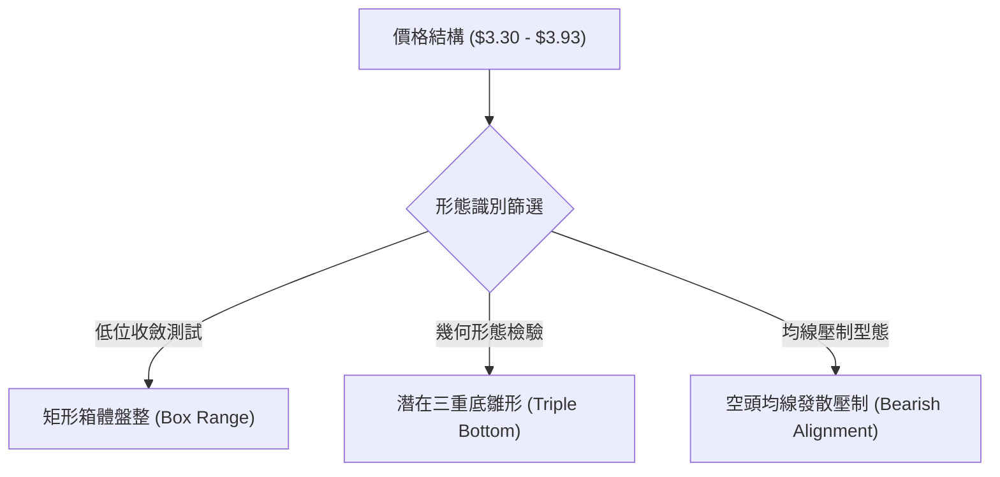

#### 圖表形態信心度評估表

| 形態名稱 | 信心度 | 判斷依據（引用數據） | 完成度 | 目標價（附計算式） |
|----------|--------|----------------------|--------|--------------------|
| **低位矩形箱體** | 80% | 價格在 $3.30~$3.93 區間內多次震盪，支撐 S1/S2 與阻力 R1/R2 明確 | 85% | 向上破位：$3.96 + ($3.96 - $3.30) = $4.62；向下破位：$3.30 - 0.66 = $2.64 |
| **潛在三重底** | 55% | 2026-06 低點 $3.30、2026-07 低點 $3.31，現測試 $3.40 (S1) | 60% | 突破頸線 R2 ($3.96) 後：$3.96 + ($3.96 - $3.30) = $4.62 |
| **頭肩底形態** | 35% | 訊號不足，右肩結構未顯現，僅做指標型解讀 | 20% | 數據不足，不計算目標價 |

### 🕯️ 重要K線形態分析

| 日期/月份 | 收盤價 | K線與量能特徵 | 技術解讀 | 訊號 |
|-----------|--------|---------------|----------|------|
| **2026-07-12** | $3.93 | 週線衝高回落十字星，成交量 224.99M | 在 R2 ($3.96) 前遇阻回落，形成中期頭部阻力 | 🔴 |
| **2026-07-26** | $3.31 | 大陰線探底，RSI 跌至 25.9 極度超賣 | 快速測試 52W 低點上方支撐帶，引發超跌買盤 | 🟡 |
| **2026-08-09** | $3.66 | 帶量反彈中陽線，週成交量 310.67M | 多頭主力嘗試發動反彈，但受制於 MA20/MA50 | 🟢 |
| **2026-08-23** | $3.48 | 縮量陰跌回調，量能萎縮至 158.88M | 回調縮量，顯示主動性殺跌動能已有所減弱 | 🟡 |
| **2026-09-06** | $3.46 | 當前弱勢震盪小陰線，Stoch 跌破 20 | 價格接近布林下軌 $3.42，處於空頭動能衰竭期 | 🟡 |

### 📉 ASCII 走勢形態示意圖

```
GRAB 矩形箱體與阻力支撐結構示意圖
$4.06 ┤══════════════════════════════════ 強阻力 R3 ($4.06 / MA200 $4.07)
$3.96 ┤      ▲ 頂部 1 ($3.93)   ▲ 頂部 2 ($3.90) ─── 箱頂頸線 R2 ($3.96)
      │     / \                / \
$3.64 ┤────/───\──▲ 頂部 3 ───/───\───── 箱體中線 R1 ($3.64 / MA20 $3.60)
$3.46 ┤   /     \/ ($3.66)   /     \  ◄ 現價 $3.46
$3.40 ┤  /       \         /       ▼ 測試支撐 S1 ($3.40)
$3.30 ┤ ▼ 底部 1   ▼ 底部 2 ────────────── 箱底支撐帶 (接近 S2 $3.26)
      │ ($3.30)    ($3.31)
$3.18 ┤══════════════════════════════════ 52週歷史鐵底 S3 ($3.18)
      └─────────────────────────────────────────────────────────────
```

---

## 4. 支撐與阻力

### 🗺️ 關鍵價位分布圖（Unicode）

```
GRAB 價位結構分布圖
═══════════════════════════════════════════════════════════════
$4.06 ║████████████████████████████████║ 強阻力 R3 (+17.34%) / MA200 ($4.07)
$3.96 ║████████████████████████        ║ 中期關鍵阻力 R2 (+14.35%)
$3.64 ║████████████████                ║ 短期動態阻力 R1 (+5.11%) / MA120 ($3.64)
$3.46 ╠════════════════════════════════╣ ◄ 現價 $3.46
$3.40 ║▓▓▓▓▓▓▓▓▓▓▓▓▓▓▓▓                ║ 近期波段支撐 S1 (-1.66%)
$3.26 ║████████████████████            ║ 中期強支撐 S2 (-5.92%)
$3.18 ║████████████████████████████████║ 52週歷史低點強支撐 S3 (-8.09%)
═══════════════════════════════════════════════════════════════
```

### 🚧 阻力位分析表

| 阻力級別 | 價位 | 形成原因 | 突破難度 | 重要性 |
|----------|------|----------|----------|--------|
| **R1** | $3.64 | 近一年波段高點聚類、MA120 ($3.64) 及 MA20/50 密集成交區 | 中等 | 🟡 短期多空分水嶺，站穩方可確認短線轉強 |
| **R2** | $3.96 | 近一年波段次高點聚類、斐波那契 78.6% 回調位 ($3.92) 重疊區 | 高 | 🔴 中期箱頂頸線，突破需 50M 以上大成交量配合 |
| **R3** | $4.06 | 近一年波段極限高點聚類、牛熊分界線 MA200 ($4.07) 匯聚處 | 極高 | 🔴 長期走勢牛熊轉換關鍵位，強大空頭防線 |

### 🛡️ 支撐位分析表

| 支撐級別 | 價位 | 形成原因 | 守住機率 | 重要性 |
|----------|------|----------|----------|--------|
| **S1** | $3.40 | 近一年波段低點聚類、接近布林通道下軌 ($3.42) | 65% | 🟡 日線級別第一道防線，超短線多頭停損點 |
| **S2** | $3.26 | 2026 年 6-7 月二次探底低點區域聚類 ($3.30-$3.26) | 80% | 🟢 中期箱體底部結構支撐，具備強大逢低買盤 |
| **S3** | $3.18 | 52 週最低點 (52W Low)、斐波那契 100.0% 終極支撐位 | 95% | 🟢 全年基本面與估值底，跌破將開啟未知的探底空間 |

### 📐 斐波那契回調位分析

依據 52 週區間 **$3.18 (低點) → $6.62 (高點)** 計算之斐波那契結構：

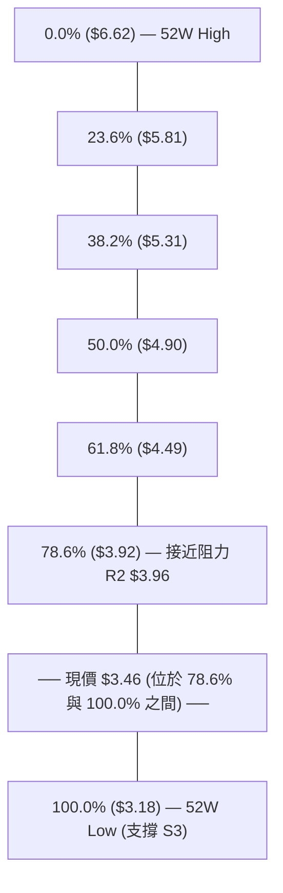

#### 斐波那契價位解讀
- **現價位置**：當前價格 $3.46 處於 **78.6% 回調位 ($3.92)** 與 **100.0% 低點 ($3.18)** 之間的深度折價區間。
- **技術意義**：股價回撤超過 78.6%，代表前一輪上漲趨勢已完全被空頭瓦解。目前行情處於「回撤衰竭與打底階段」。上方首要斐波那契反彈阻力位於 78.6% ($3.92)，與阻力位 R2 ($3.96) 高度重合。

---

## 5. 技術指標深度解讀

### 🎛️ 指標訊號總覽

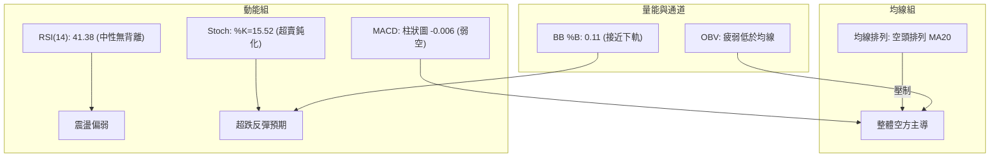

### 📈 移動平均線排列分析

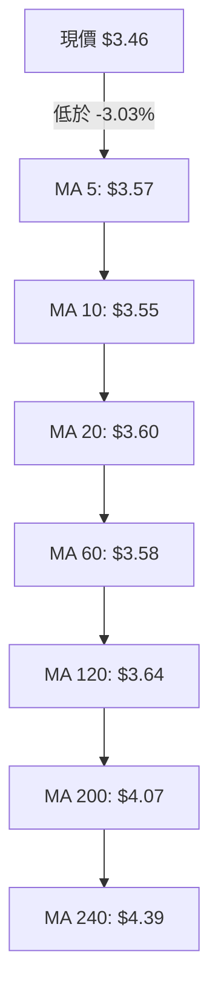

| 均線名稱 | 當前價格 | 與現價差距 | 乖離率 | 排列解讀 |
|----------|----------|------------|--------|----------|
| **MA 5** | $3.57 | -$0.11 | -3.03% | 短線承壓，極短期下行 |
| **MA 10** | $3.55 | -$0.09 | -2.45% | 短期壓制，無轉折信號 |
| **MA 20** | $3.60 | -$0.14 | -3.77% | 布林中軌，短線第一阻力帶 |
| **MA 60** | $3.58 | -$0.12 | -3.42% | 季線下行，中期趨勢偏空 |
| **MA 120**| $3.64 | -$0.18 | -4.98% | 半年線壓制，與 R1 阻力重合 |
| **MA 200**| $4.07 | -$0.93 | -14.99%| 年線長期下行，牛熊分水嶺 |
| **MA 240**| $4.39 | -$0.93 | -21.21%| 兩年均線下壓，長期空頭壓制 |

### 📉 RSI(14) 分析

```
RSI(14) 強度指標：41.38
[ 超賣 0 ] ──────[ 30 ] ▓▓▓▓▓▓▓▓▓▓░░░░░░░░░░ [ 70 ]────── [ 超買 100 ]
                              ▲ (41.38)
```
- **數值解讀**：RSI(14) 當前數值為 **41.38**，處於 30 至 70 之間的中性偏弱區域，未達超賣極值 (<30)，但顯示空方動能佔優。
- **背離分析**：
  - **頂背離**：無。近期並未出現價格創新高而 RSI 走低的現象。
  - **底背離**：無明顯背離。2026-06 價格低點 $3.30 時 RSI 為 37.9，2026-07 價格低點 $3.31 時 RSI 為 25.9，目前價格 $3.46 伴隨 RSI 41.4，屬於指標隨價格同步震盪的常態表現。

### 📊 MACD(12/26/9) 訊號解讀

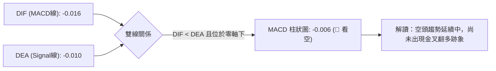

### 📦 布林通道分析

```
GRAB 布林通道 (20, 2) 結構圖
$3.77 ┤ ──────────────────────────────── 上軌 (Upper Band)
$3.70 ┤
$3.60 ┤ ──────────────────────────────── 中軌 (MA20 Band)
$3.50 ┤
$3.46 ┤ ◄ 現價 $3.46 (%B = 0.11)
$3.42 ┤ ──────────────────────────────── 下軌 (Lower Band)
```
- **通道參數**：上軌 **$3.77** ｜ 中軌 **$3.60** ｜ 下軌 **$3.42** ｜ 帶寬 = $0.35 (極度收窄)。
- **%B 指標**：**0.11**。現價已極度逼近下軌 $3.42，代表短期下行空間受到通道下邊界強烈支撐，容易誘發均值回歸的反彈走勢。

### 💹 成交量分析（量價配合度）

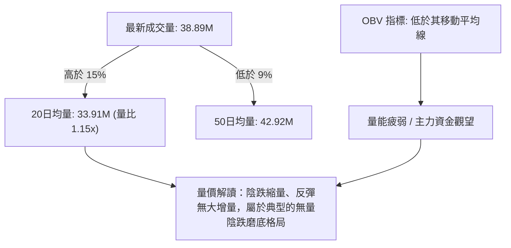

---

## 6. 動能與波動率

### ⚡ 動能評估四象限

| 象限 | 動能維度 | 波動維度 | 狀態特徵 | GRAB 當前定位 | 策略評估 |
|------|----------|----------|----------|:-------------:|----------|
| **Q1** | 強動能 | 低波動 | 穩定單邊趨勢 | — | 趨勢跟隨，加碼順勢單 |
| **Q2** | **弱動能** | **低波動** | **低位縮量盤整** | **✓ (當前所處象限)** | **嚴禁追單，僅宜箱體邊界低吸** |
| **Q3** | 強動能 | 高波動 | 爆發突破行情 | — | 突破進場，擴大停利空間 |
| **Q4** | 弱動能 | 高波動 | 混亂震盪洗盤 | — | 空倉觀望，嚴格風控防洗出場 |

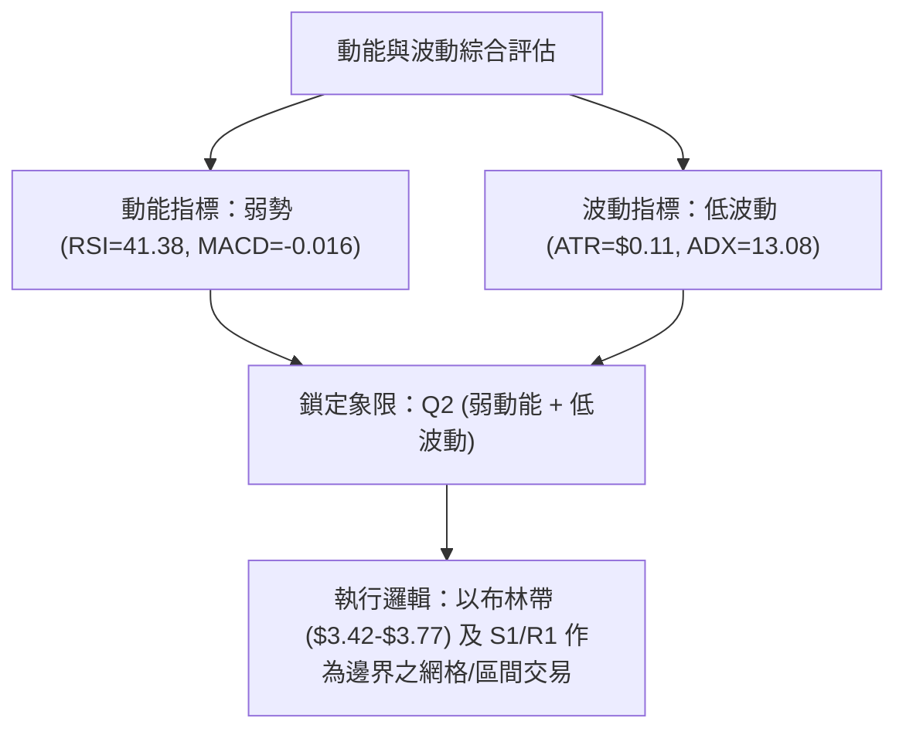

### 📊 ATR 波動率分析

- **ATR(14) 數值**：**$0.11**（佔當前股價 3.23%）。
- **波動特徵**：日均震幅極小，代表市場處於高度冷卻狀態。
- **風控參數換算**：
  - **超短線停損距離 (1.0 × ATR)**：$0.11。
  - **波段交易停損距離 (1.5 × ATR)**：$0.165 ≈ **$0.17**。
  - **寬鬆安全停損距離 (2.0 × ATR)**：$0.22。

### 📐 Beta 與市場相關性

- **Beta 係數**：**0.89**。
- **解讀**：GRAB 股價波動度略低於美股大盤（S&P 500 = 1.0）。在缺乏個股利多催化劑時，GRAB 容易跟隨科技板塊進行被動性震盪，缺乏獨立單邊攻擊行情。

---

## 7. 多時框架總結

### 📋 時框架評分表

| 時框架 | 趨勢方向 | 動能狀態 | 均線排列 | 形態結構 | 綜合評分 | 操作建議 |
|--------|----------|----------|----------|----------|----------|----------|
| **日線 (短期)** | 偏空震盪 | 超賣待反彈 (Stoch=15.52) | 空頭壓制 (MA20=$3.60) | 逼近布林下軌 | **38/100** | 逢低短多，快進快出 |
| **週線 (中期)** | 矩形整理 | 偏弱中性 (RSI=41.4) | 均線下行糾纏 | $3.30-$3.96 箱體 | **42/100** | 箱體邊界高拋低吸 |
| **月線 (長期)** | 空頭主導 | 深度回撤 (跌幅>40%) | 遠離 MA200 ($4.07) | 52W 低位折價區 | **28/100** | 長線建倉需嚴設停損 |

### 🔲 綜合訊號矩陣

```
╔══════════════════════════════════════════════════════════════════╗
║                    多時框多空訊號矩陣表                          ║
╠══════════════════╦══════════════╦════════════════╦═══════════════╣
║ 指標項目         ║ 短期 (日線)  ║ 中期 (週線)    ║ 長期 (月線)   ║
╠══════════════════╬══════════════╬════════════════╬═══════════════╣
║ 趨勢方向         ║ 🔴 空頭/盤整 ║ 🟡 矩形整理    ║ 🔴 空頭下行   ║
║ 均線排列         ║ 🔴 MA20/50下 ║ 🔴 MA20週壓制  ║ 🔴 MA200下方  ║
║ 動能指標 (RSI)   ║ 🟡 41.38偏弱 ║ 🟡 41.4 中性   ║ 🔴 弱勢區間   ║
║ 擺動指標 (Stoch) ║ 🟢 15.52超賣 ║ 🟡 31.88 偏低  ║ 🟡 中性       ║
║ 成交量配合 (OBV) ║ 🔴 疲弱無量  ║ 🔴 縮量整理    ║ 🔴 資金流出   ║
╚══════════════════╩══════════════╩════════════════╩═══════════════╝
```

### ⚖️ 多時框收斂結論

> **依多時框收斂規則（ADX = 13.08 < 25 判定為盤整行情）**：
> 1. 當前市場由「**日線與週線布林通道/矩形箱體**」主導，單邊趨勢指標全面鈍化。
> 2. **唯一方向性結論**：**中性偏空之低位區間震盪（Neutral-to-Bearish Range Bound）**。
> 3. **交易邏輯收斂**：在 ADX 重新放量升破 25 且價格突破 R1 ($3.64) 前，放棄單邊趨勢思維，嚴格採取「**下軌支撐逢低吸納、中軌阻力止盈**」的防守型交易策略。

---

## 8. 交易策略建議

### 🗺️ 策略決策流程圖

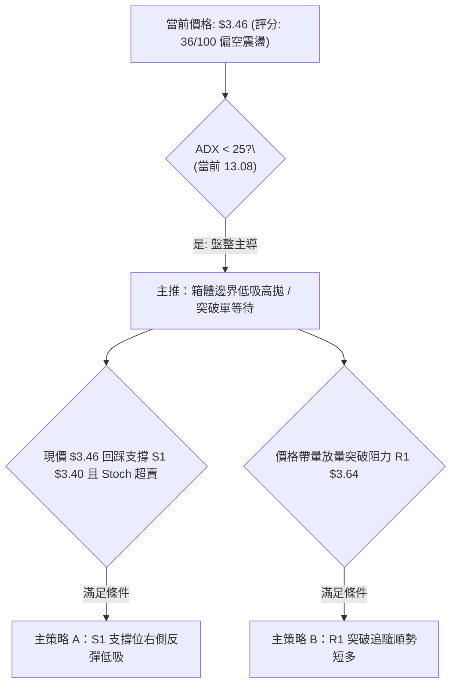

> **當前主策略方向 = 中性偏空之低位區間震盪反彈操作（依評分卡綜合評分 36/100 路由）**

### 🎯 價格情境階梯（Price Scenarios）

| 觸發條件 | 第一目標 | 第二目標 | 情境技術含義 |
|----------|----------|----------|--------------|
| **向上突破 R1 ($3.64)** | R2 ($3.96) | R3 ($4.06) | 短線擺脫均線壓制，開啟中期箱頂修復行情 |
| **維持於 S1 ($3.40) 上方** | R1 ($3.64) | — | 處於日線布林通道下軌至中軌之區間震盪 |
| **向下跌破 S1 ($3.40)** | S2 ($3.26) | S3 ($3.18) | 支撐破位，價格向 52 週歷史底部尋求支撐 |

### 📊 情境機率分佈

| 預測情境 | 機率 | 主要依據 |
|----------|------|----------|
| **情境一：區間震盪（$3.40 ~ $3.64）** | **55%** | ADX=13.08 指向弱趨勢，布林帶寬極度收斂，量能不足以支撐單邊破位 |
| **情境二：技術性超跌反彈（挑戰 R1/R2）** | **30%** | Stoch %K=15.52 進入超賣區，現價位於 52W 區間 8.1% 極低位 |
| **情境三：向下破位探底（回踩 S2/S3）** | **15%** | 均線完整空頭排列，OBV 走勢疲弱，-DI 略高於 +DI |

### 🟢 主策略詳情

依據評分卡結論，主推「**S1 支撐低吸**」與「**R1 突破跟進**」兩套精確策略：

| 策略要素 | 策略 A（低吸反彈策略 - 主推） | 策略 B（動量突破策略 - 備選） |
|----------|--------------------------------|--------------------------------|
| **策略類型** | 支撐位右側短多（Mean Reversion）| 阻力位突破順勢多（Breakout Long） |
| **進場條件** | 現價回踩 $3.40 (S1) 企穩或現價進場 | 帶量突破並收盤站上 $3.64 (R1) |
| **進場價格** | **$3.42** (布林下軌 / S1 上方) | **$3.65** (突破 R1 後確認點) |
| **止損價格** | **$3.25** (跌破 S2 $3.26 之保護停損) | **$3.45** (跌回 MA20/S1 下方) |
| **目標價 T1** | **$3.64** (短期阻力 R1 / MA120) | **$3.96** (中期阻力 R2) |
| **目標價 T2** | **$3.96** (中期阻力 R2) | **$4.06** (強阻力 R3 / MA200) |
| **風險空間** | $3.42 - $3.25 = $0.17 | $3.65 - $3.45 = $0.20 |
| **獲利空間 (T1)** | $3.64 - $3.42 = $0.22 | $3.96 - $3.65 = $0.31 |
| **風險報酬比 (T1)** | **1 : 1.29** | **1 : 1.55** |
| **獲利空間 (T2)** | $3.96 - $3.42 = $0.54 | $4.06 - $3.65 = $0.41 |
| **風險報酬比 (T2)** | **1 : 3.18** | **1 : 2.05** |
| **成功機率** | 60% | 45% |
| **建議倉位** | **10% ~ 15%** (防守型輕倉) | **10%** (動量確認後追加) |

### 🔴 反向風險觸發點（對沖與風控提示）

- **多頭止損與對沖觸發**：若日線收盤價跌破 **$3.40 (S1)** 且未能在次日收復，表明下軌支撐失效，應立即將多頭部位減半；若進一步跌破 **$3.26 (S2)**，必須全數停損離場，並可考慮買入價外 Put 選擇權對沖 52W 低點 **$3.18 (S3)** 被跌破之極端風險。
- **空頭平倉與認賠觸發**：空方部位若見股價帶量突破 **$3.64 (R1)** 且 MACD 柱狀圖翻正，必須全數回補空單。

### ⭐ 整體訊號強度評星

```
╔══════════════════════════════════════════════════════════════════╗
║ 做多訊號強度：  ★★☆☆☆  (2/5星 - 僅限超賣反彈，缺乏趨勢支撐)   ║
║ 做空訊號強度：  ★★★☆☆  (3/5星 - 均線空頭，但受制於下軌支撐)   ║
║ 整體可信度：    ★★★☆☆  (3/5星 - ADX 偏低，以區間震盪解讀為主) ║
╚══════════════════════════════════════════════════════════════════╝
```

---

## 9. 風險提示與監控

### ✅ 關鍵監控指標 Checklist

```
╔══════════════════════════════════════════════════════════════════╗
║                     關鍵技術指標日常監控清單                     ║
╠══════════════════════════════════════════════════════════════════╣
║ [ ] 價格是否跌破支撐 S1 ($3.40) ──── 破位則開啟向 S2 ($3.26) 尋底 ║
║ [ ] RSI(14) 是否跌破 30 ────────── 跌破則進入極端非理性超賣區   ║
║ [ ] MACD 柱狀圖是否由負翻正 (>-0.006) ── 翻正為短線多頭轉折訊號 ║
║ [ ] 日成交量是否放大至 42.92M (50日均量) ── 放量方能突破 R1 ($3.64)║
║ [ ] ADX(14) 是否升破 25 ────────── 升破代表新單邊趨勢正式成型   ║
╚══════════════════════════════════════════════════════════════════╝
```

### ⚠️ 風險場景分析

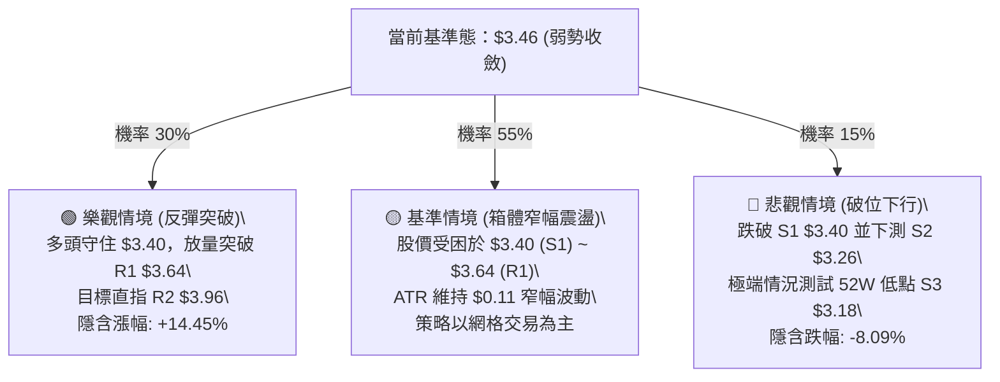

### 🛡️ 風險管理重要提醒

1. **嚴禁在 ADX 低位時進行單邊重倉**：當前 ADX 為 13.08，市場無單邊趨勢，追漲或殺跌容易遭遇假突破並被雙向打損。
2. **波動率定價與倉位管理**：單筆交易風險暴露金額嚴格控制在總資金的 **1.0% ~ 1.5%** 以內。以每股止損空間 $0.17 計算，10 萬美元帳戶之最大持倉量不應超過 6,000 股。
3. **空頭排列下的防守紀律**：由於 MA20、MA50、MA200 呈完美空頭排列，所有做多交易均屬「逆勢搶反彈」性質，一旦達到目標價 T1 ($3.64) 必須獲利了結 50% 以上倉位並將停損點上移至進場保本點。

---

## 📋 報告總結

```
╔══════════════════════════════════════════════════════════════════╗
║                     GRAB 技術分析報告總結                        ║
╠══════════════════════════════════════════════════════════════════╣
║ 報告日期：2026-09-02                                             ║
║ 當前價格：$3.46 (位於 52 週區間底部 8.1% 位置)                   ║
║ 分析評級：🔴 偏空震盪 / 中性觀望 (技術評分: 36/100)              ║
╠══════════════════════════════════════════════════════════════════╣
║ 關鍵結論：                                                       ║
║ ├─ 長期趨勢：🔴 空頭主導，價格深處 MA200 ($4.07) 下方           ║
║ ├─ 中期趨勢：🟡 $3.30 至 $3.96 矩形大箱體整理                   ║
║ ├─ 短期趨勢：🟡 弱勢盤整，逼近布林下軌 $3.42 與支撐 S1 ($3.40)  ║
║ ├─ 關鍵支撐：S1: $3.40 ｜ S2: $3.26 ｜ S3: $3.18 (52W Low)       ║
║ ├─ 關鍵阻力：R1: $3.64 ｜ R2: $3.96 ｜ R3: $4.06 (MA200)         ║
║ └─ 分析師目標：均價 $5.86 (最低 $4.60 ｜ 最高 $8.00)              ║
╠══════════════════════════════════════════════════════════════════╣
║ 最優策略組合：                                                   ║
║ 1. 🥇 最佳機會：策略 A (低吸反彈) — 於 $3.42 進場，停損 $3.25，  ║
║                 目標 T1 $3.64 / T2 $3.96 (風報比 1:3.18)         ║
║ 2. 🥈 次選機會：策略 B (突破順勢) — 帶量站上 $3.65 進場，        ║
║                 目標 $3.96，停損 $3.45 (風報比 1:1.55)           ║
║ 3. 🥉 保守選擇：維持 80% 現金觀望，等待 ADX>25 或價格回踩 S3     ║
║                 $3.18 測試歷史鐵底完成後再行進場                 ║
╚══════════════════════════════════════════════════════════════════╝
```

---

> ⚠️ **免責聲明**：本報告為技術分析研究，所有數據及估算均基於歷史價格與客觀技術指標計算。本報告**僅供研究與學術參考**，**不構成任何投資建議**。投資有風險，入市需謹慎，交易前請務必獨立評估風險並做好資金管理。

---

*報告生成時間：2026-09-02 ｜ 數據來源：Yahoo Finance ｜ 分析框架：多時框技術分析體系*