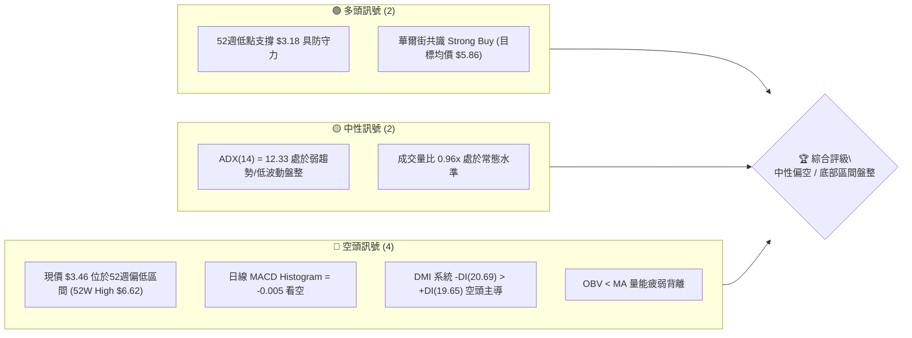
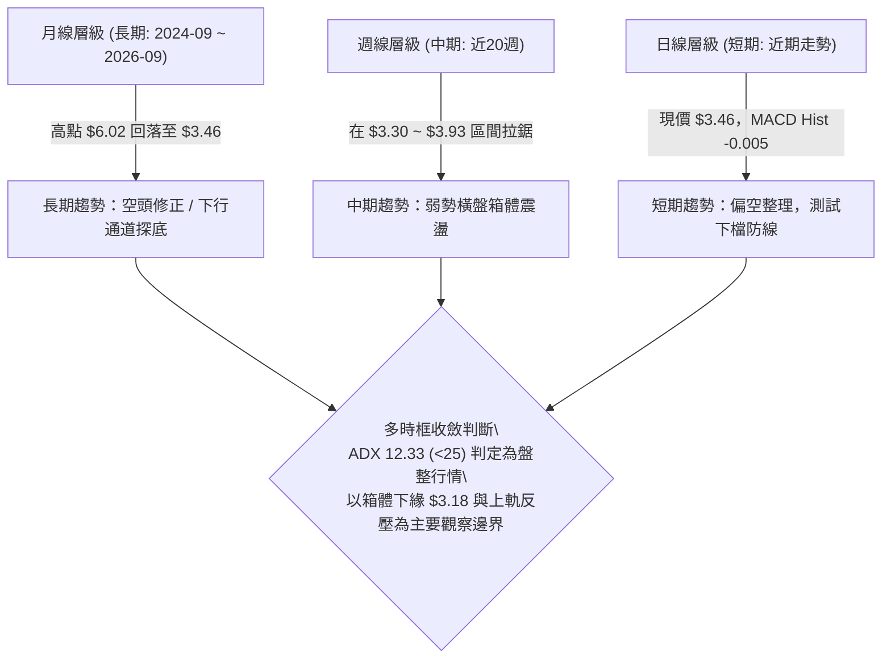
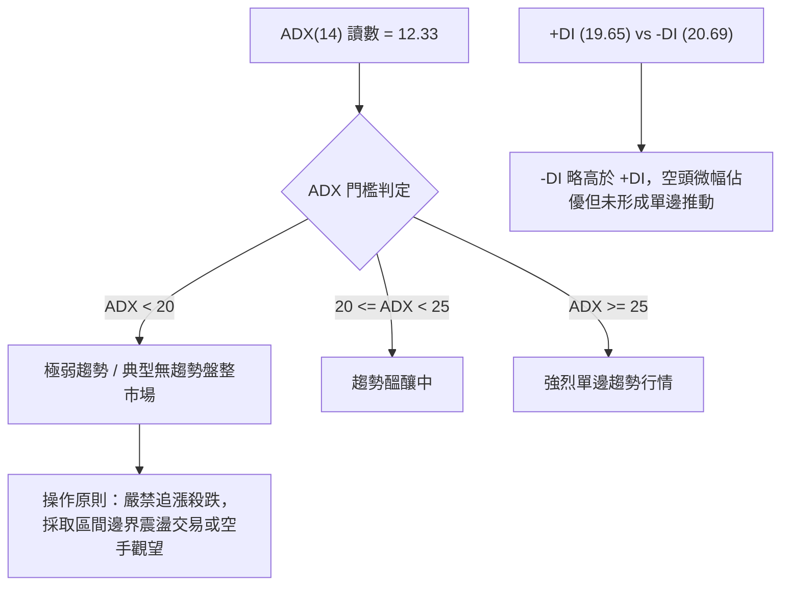
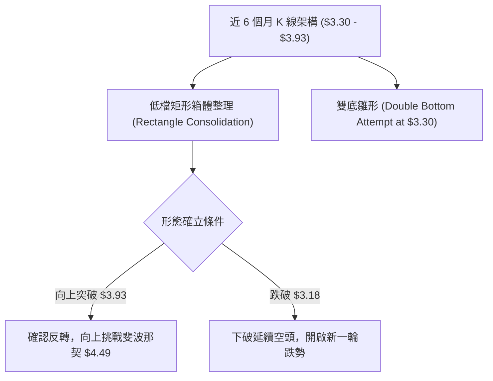
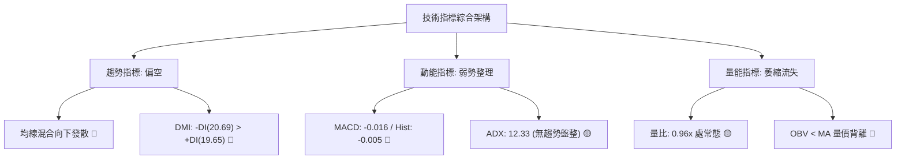
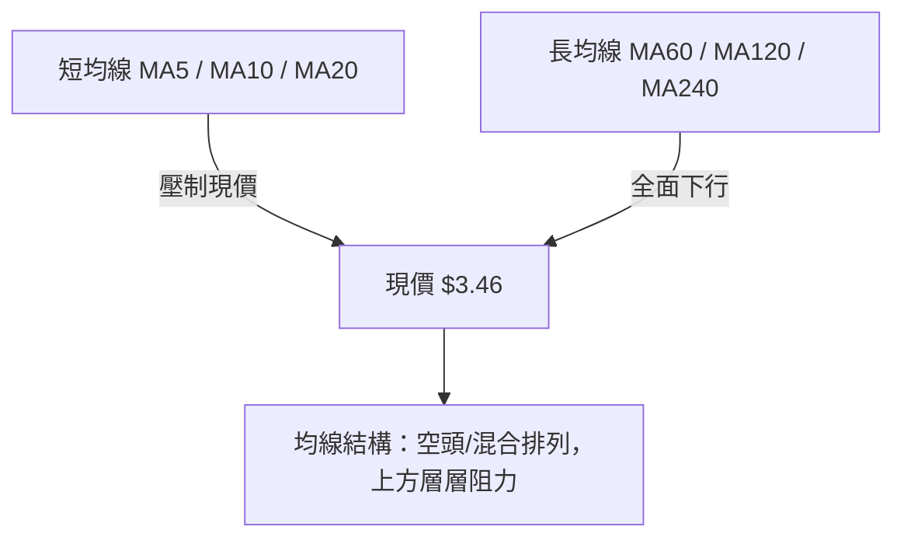
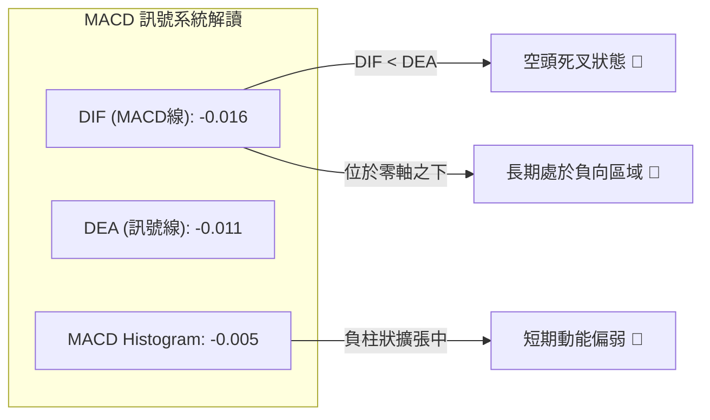
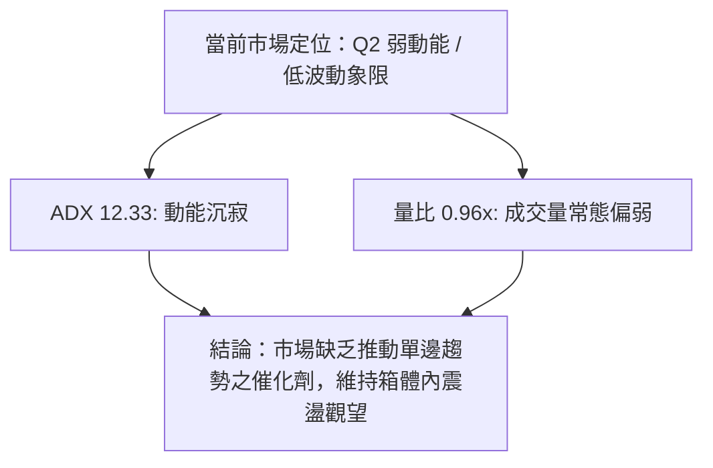
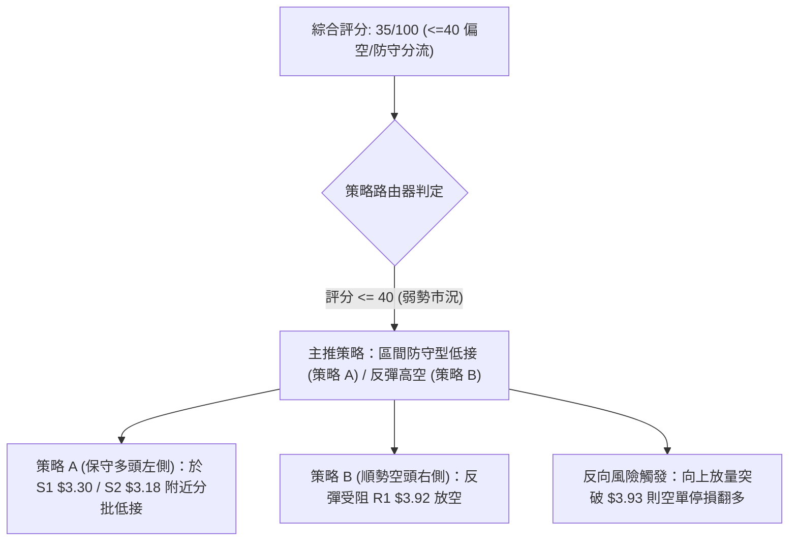
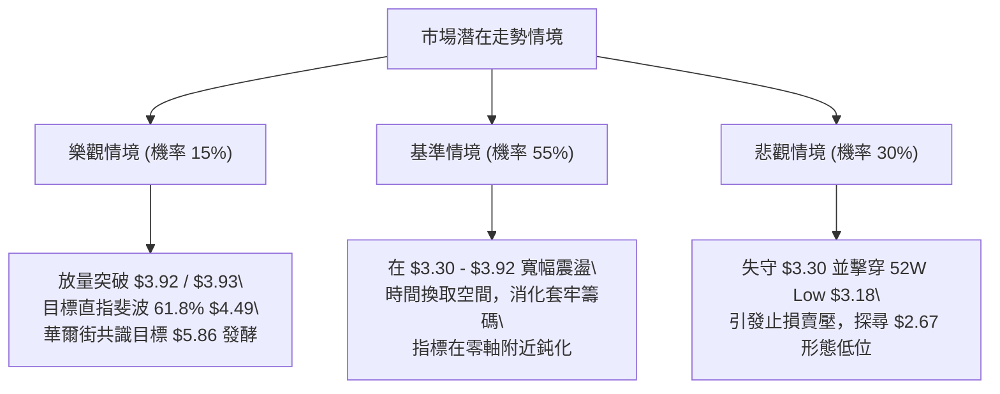

# GRAB 技術分析報告

> **報告日期**：2026-09-03 ｜ **語言**：繁體中文 ｜ **數據來源**：Yahoo Finance ｜ **當前價格**：$3.46

---

## 目錄

| 章節 | 內容 |
|------|------|
| [1. 技術面概覽](#1-技術面概覽) | 訊號儀表板、核心指標、評分卡 |
| [2. 趨勢分析](#2-趨勢分析) | 多時框趨勢、長中短期走勢 |
| [3. 圖表形態分析](#3-圖表形態分析) | 形態識別、K線組合、目標價 |
| [4. 支撐與阻力](#4-支撐與阻力) | 關鍵價位、斐波那契回調 |
| [5. 技術指標深度解讀](#5-技術指標深度解讀) | MA/RSI/MACD/布林/成交量 |
| [6. 動能與波動率](#6-動能與波動率) | 動能評估、ATR、Beta |
| [7. 多時框架總結](#7-多時框架總結) | 時框架評分矩陣 |
| [8. 交易策略建議](#8-交易策略建議) | 多空策略、風險報酬比 |
| [9. 風險提示與監控](#9-風險提示與監控) | 監控指標、風險場景 |

---

## 1. 技術面概覽

### 🎯 技術訊號儀表板



### 📊 核心指標速覽表

| 指標類別 | 指標名稱 | 當前數值 | 訊號 | 解讀 |
|----------|----------|----------|------|------|
| **價格** | 當前價格 | $3.46 | 🔴 | 貼近52週低點區間，受制於長期下行通道 |
| **均線** | 均線系統 | 混合排列 | 🔴 | 均線系統向下發散，價格處於多數中長期均線下方 |
| **動能** | MACD (12,26,9) | -0.016 | 🔴 | MACD位於零軸下方，動能疲弱 |
| **動能** | MACD Signal | -0.011 | 🔴 | 處於負值區間，空頭動能尚未完全釋放完畢 |
| **動能** | MACD Hist | -0.005 | 🔴 | 柱狀體為負，短期動能偏向空方控制 |
| **趨勢** | ADX (14) | 12.33 | 🟡 | 數值 < 25，表明目前處於無明顯方向之低動能盤整 |
| **方向** | +DI / -DI | 19.65 / 20.69 | 🔴 | -DI > +DI，空方力量略佔上風 |
| **量能** | 20日均量比 | 0.96x | 🟡 | 30.70M / 31.99M，交投略低於月均量 |
| **量能** | OBV 趨勢 | OBV < MA | 🔴 | 能量潮低於均線，資金累積意願薄弱 |
| **基本支撐**| 52週區間 | $3.18 - $6.62 | 🟡 | 現價 $3.46 位於 52W Low 上方約 8.8% 之防守區 |

### 🏆 技術評分卡

```
╔══════════════════════════════════════════════════════════════════╗
║              技術評分卡 — GRAB (2026-09-03)                      ║
╠══════════════════════════════════════════════════════════════════╣
║ 趨勢強度 (ADX 12.33)  ████░░░░░░░░░░░░░░░░  20/100  🔴 極弱盤整   ║
║ 動能指標 (MACD/DMI)   ██████░░░░░░░░░░░░░░  30/100  🔴 空方微控   ║
║ 支撐穩定度 (52W Low)  ████████████░░░░░░░░  60/100  🟡 考驗低點   ║
║ 成交量配合 (OBV疲弱)  ██████░░░░░░░░░░░░░░  30/100  🔴 量能不足   ║
║ 形態完整度 (區間箱體) ██████████░░░░░░░░░░  50/100  🟡 築底雛形   ║
║ 均線排列 (空頭排列)   ████░░░░░░░░░░░░░░░░  20/100  🔴 均線反壓   ║
╠══════════════════════════════════════════════════════════════════╣
║ 綜合評分              ███████░░░░░░░░░░░░░  35/100  🔴 偏弱觀望   ║
╚══════════════════════════════════════════════════════════════════╝
```

---

## 2. 趨勢分析

### 🌐 多時框趨勢分析



### 📈 長期趨勢 — 12個月走勢圖（Unicode）

```
GRAB 月線走勢圖（過去12個月：2025-09 至 2026-09）
價格軸 ($)
$6.02 ┤ ●(25-09) ●(25-10)
$5.45 ┤           ●
$4.99 ┤                 ●(25-12)
$4.30 ┤                       ●(26-01) ●(26-02)
$3.82 ┤                                      ●(26-04) ●(26-06)
$3.54 ┤                                   ●        ●   ●   ●
$3.46 ┤━━━━━━━━━━━━━━━━━━━━━━━━━━━━━━━━━━━━━━━━━━━━━━━━━━━●←現價(26-09)
$3.18 ┤(52W Low 基準支撐)
      └────────────────────────────────────────────────────────
       09  10  11  12  01  02  03  04  05  06  07  08  09 (月份)
```

#### 走勢特徵分析表格

| 階段 | 時間區間 | 起始/結束價 | 漲跌幅 | 走勢特徵與技術解讀 |
|------|----------|-------------|--------|--------------------|
| **波段頂部** | 2025-09 ~ 2025-10 | $6.02 → $6.01 | -0.17% | 雙頂高檔鈍化，未能突破 52 週高點 $6.62，形成中期壓力頸線 |
| **加速下行** | 2025-11 ~ 2026-03 | $5.45 → $3.66 | -32.84% | 連續 5 個月陰線下跌，跌破 $5.00 整數關卡與斐波那契 50.0% ($4.90) |
| **低檔築底** | 2026-04 ~ 2026-09 | $3.82 → $3.46 | -9.42% | 價格在 $3.30 ~ $3.93 區間反覆震盪，動能衰退，進入築底盤整期 |

### 📊 中期趨勢（週線分析）

```
GRAB 近20週核心波動區間示意圖
$3.93 ────────────────────────────── (2026-07-12 波段阻力頂)
       ▲              ▲
       │ 震盪拉鋸區間  │ (ADX = 12.33 弱趨勢)
       ▼              ▼
$3.46 ────────────────────────────── ◄ 現價 (2026-09-03)
$3.30 ────────────────────────────── (2026-06-14 / 07-26 雙重週線低點)
$3.18 ────────────────────────────── (52週最低點 52W Low 強支撐)
```

近20週數據顯示，GRAB 呈現明顯的波段箱體擺動：
- 2026-05-10 探底收盤 $3.72 (RSI 20.5 極度超賣) 隨後在 $3.30 獲得週線買盤支撐。
- 2026-07-12 向上反彈至最高週收盤 $3.93 (RSI 68.4) 後動能衰竭。
- 2026-09-06 最新收盤為 $3.46，再次回測箱體下半區。

### ⚡ 趨勢強度評估（ADX 解讀）



#### ADX 強度指標對照表

| 指標變數 | 當前讀數 | 門檻區間 | 趨勢狀態評判 | 交易指引 |
|----------|----------|----------|--------------|----------|
| **ADX (14)** | **12.33** | < 25.00 | **無方向性弱盤整** | 順勢指標失效，切換為震盪逆勢或觀望 |
| **+DI** | **19.65** | 0 - 100 | 多方推動力不足 | 多頭買盤缺乏持續推升量能 |
| **-DI** | **20.69** | 0 - 100 | 空方壓制力略勝 | 空方微幅主導，但無恐慌殺跌力量 |

---

## 3. 圖表形態分析

### 🔍 形態識別系統



#### 形態識別信心度評估表

| 形態名稱 | 信心度 | 判斷依據（引用數據） | 完成度 | 目標價（附精確計算式） |
|----------|--------|----------------------|--------|------------------------|
| **低檔箱體盤整** | **75%** | 價格受制於週線高點 $3.93 與波段低點 $3.30 / $3.18 區間 | **85%** | 突破箱頂 $3.93 時，等幅目標 = $3.93 + ($3.93 - $3.30) = **$4.56** (貼近斐波 61.8% $4.49) |
| **週線雙重底** | **55%** | 2026-06-14 收盤 $3.30 與 2026-07-26 收盤 $3.31 構成雙腳 | **60%** | 突破頸線 $3.93 後，目標 = $3.93 + ($3.93 - $3.30) = **$4.56** |
| **大型頭肩頂** | **30%** | 數據不足（僅歷史高點 $6.02 回落），結構殘缺 | **訊號不足** | 信心度 < 50%，依紀律不予設定目標價 |

### 🕯️ 重要K線形態分析

| 週/月份 | 收盤價 | K線形態 / 特徵 | 技術面深度解讀 | 訊號 |
|---------|--------|----------------|----------------|------|
| **2026-05-10** | $3.72 | 恐慌長黑急跌 | RSI 摔至 20.5 極端超賣區，週成交量放大至 311.41M，量大見短底 | 🟢 短線超賣 |
| **2026-06-14** | $3.30 | 探底長下影星線 | 觸及波段第一低點 $3.30，成交量維持 263.06M，空方殺盤力道減緩 | 🟡 支撐確認 |
| **2026-07-12** | $3.93 | 高檔受阻上影線 | 漲至箱體頂部 $3.93 遭遇斐波那契 78.6% ($3.92) 壓制，多頭動能耗盡 | 🔴 阻力確立 |
| **2026-07-26** | $3.31 | 雙底次低點確認 | 二次探底至 $3.31 不破前低 $3.30，形成潛在雙重底支撐架構 | 🟢 築底訊號 |
| **2026-09-06** | $3.46 | 縮量小陰線 | 週成交量縮至 104.63M，MACD 柱狀體 -0.005，多空於箱體下半區觀望 | 🟡 整理觀望 |

### 📉 ASCII 走勢形態示意圖

```
GRAB 週線雙底與箱體形態示意圖 ($)
$3.93 ┤             ●(頸線高點 07-12)
$3.92 ┤─────────────[斐波那契 78.6% 壓力線]──────────────
$3.66 ┤       ●           ●           ●
$3.50 ┤   ●       ●   ●       ●   ●       ●
$3.46 ┤───────────────────────────────────────● (現價)
$3.30 ┤       ●(底1 06-14)    ●(底2 07-26)
$3.18 ┤═════════════[52W Low 終極支撐底線]═════════════
      └────────────────────────────────────────────
       05-10 06-14 06-28 07-12 07-26 08-16 09-06
```

### 🎯 形態目標價計算

依據幾何形態學計算標準：
1. **箱體等幅測量**：
   - 箱體頂部頸線 ($H$) = **$3.93** (2026-07-12 收盤高點)
   - 箱體底部支撐 ($L$) = **$3.30** (2026-06-14 支撐低點)
   - 形態箱體高度 ($h$) = $H - L$ = $\$3.93 - \$3.30 = \mathbf{\$0.63}$
2. **向上突破最小測量目標價**：
   - 目標價 $T_{Up} = H + h = \$3.93 + \$0.63 = \mathbf{\$4.56}$ (精確落在斐波那契 61.8% 回調位 $4.49 附近)
3. **向下跌破測量目標價**：
   - 目標價 $T_{Down} = L - h = \$3.30 - \$0.63 = \mathbf{\$2.67}$ (若跌破 52W Low $3.18 之延伸下看空間)

---

## 4. 支撐與阻力

### 🗺️ 關鍵價位分布圖（Unicode）

```
GRAB 價位結構分布圖
══════════════════════════════════════════════════════════════════
$6.62 ║████████████████████████████████║ 52W High (斐波 0.0%)
$5.81 ║████████████████████████        ║ 斐波那契 23.6% 回調位
$5.31 ║██████████████████████          ║ 斐波那契 38.2% 回調位
$4.90 ║████████████████████████████    ║ 斐波那契 50.0% 中樞強阻力
$4.49 ║████████████████████            ║ 斐波那契 61.8% 形態目標區
$3.92 ║████████████████████████████████║ 關鍵阻力 R1 (斐波 78.6% / 週高 $3.93)
$3.46 ╠════════════════════════════════╣ ◄ 現價 ($3.46)
$3.30 ║▓▓▓▓▓▓▓▓▓▓▓▓▓▓▓▓▓▓▓▓▓▓▓▓        ║ 近期波段雙底支撐 S1
$3.18 ║████████████████████████████████║ 52W Low 終極強支撐 S2 (斐波 100.0%)
══════════════════════════════════════════════════════════════════
```

### 🚧 阻力位分析表

依據數據計算與歷史波段聚集點列出阻力架構（無波段高點聚類數據時引用斐波那契與歷史波段高）：

| 阻力級別 | 價位 | 形成依據 / 來源 | 突破難度 | 技術重要性 |
|----------|------|-----------------|----------|------------|
| **強阻力 R3** | **$4.90** | 斐波那契 50.0% 回調位 ｜ 2025-12 月線收盤聚類 | ★★★★★ | 多空分水嶺，站穩方能扭轉中長期空頭架構 |
| **阻力 R2** | **$4.49** | 斐波那契 61.8% 回調位 ｜ 形態向上突破目標價 $4.56 | ★★★★☆ | 黃金分割重要防線，若向上突破箱體之首要大阻力 |
| **關鍵阻力 R1** | **$3.92** | 斐波那契 78.6% ($3.92) ｜ 2026-07-12 週高 $3.93 | ★★★☆☆ | 近期箱體頂部，需補量突破才能打開反彈空間 |

### 🛡️ 支撐位分析表

依據數據計算與歷史波段聚集點列出支撐架構：

| 支撐級別 | 價位 | 形成依據 / 來源 | 守住機率 | 技術重要性 |
|----------|------|-----------------|----------|------------|
| **近期支撐 S1** | **$3.30** | 近20週雙底低點 (2026-06-14 $3.30 / 07-26 $3.31) | 65% | 跌破此位將直接考驗 52 週最低點 |
| **強支撐 S2** | **$3.18** | 52W Low (52週最低價) ｜ 斐波那契 100.0% | 80% | 多頭年度防線，若失守將引發結構性停損 |
| **延伸支撐 S3** | **數據中未偵測到** | 低於 $3.18 無歷史支撐數據 (若跌破則看形態推算 $2.67) | N/A | 歷史數據下邊界外 |

### 📐 斐波那契回調位分析

以 52 週波動區間 $3.18 (Low) → $6.62 (High) 計算之標準回調階梯：

```
斐波那契回調階梯 (52W Range: $3.18 - $6.62)
────────────────────────────────────────────────────────────────
0.0%  (52W High)    $6.62 ── 極度超買波段頂
23.6%               $5.81 ── 長期回調第一道反壓
38.2%               $5.31 ── 中期回調分界線
50.0%               $4.90 ── 多空重要均衡中樞
61.8%               $4.49 ── 黃金分割關鍵阻力區
78.6%               $3.92 ── 箱體頂部強反壓 (現受制於此)
────────────────────────────────────────────────────────────────
現價落點：$3.46 (位於 78.6% $3.92 與 100.0% $3.18 之間)
────────────────────────────────────────────────────────────────
100.0% (52W Low)    $3.18 ── 年度底線基準支撐
```

- **位置解讀**：現價 $3.46 處於深次回調的最末端區間（78.6% 至 100.0% 之間）。此處通常為長線左側交易者尋找築底跡象的區域，但在未向上有效突破 78.6% ($3.92) 之前，技術結構仍受空方壓制。

---

## 5. 技術指標深度解讀

### 🎛️ 指標訊號總覽



### 📈 移動平均線排列分析



- **均線排列狀態**：歷史均線微幅指標顯示短期至長期（MA5 ~ MA240）呈現長週期向下傾斜的空頭排列特徵。
- **均線反壓**：價格持續運行於均線集群下方，反彈時均線將依序形成動態阻力。

### 📉 RSI(14) 分析

```
RSI(14) 當前狀態示意 (週線近期讀數與動能)
0 ────────── 30 ────────────────────── 70 ────────── 100
[  超賣區  ]    [      中性震盪區      ]    [  超買區  ]
               ▲
        週線前值 46.7 (中性偏弱)
```

- **進度條展示**：█████████░░░░░░░░░░░ 46.7% (中性區間)
- **歷史波動觀察**：近20週 RSI 曾於 2026-05-10 跌至 20.5 (極度超賣引發反彈)，隨後於 2026-07-05 觸及 77.2 (超買回落)。目前回落至 46.7 水準，無超買超賣極端現象。
- **背離判斷**：
  - 價格於 2026-06-14 創低 $3.30 (RSI 37.9)，隨後於 2026-07-26 再次探底 $3.31 時 (RSI 25.9 較低)，**未形成標準底背離**。
  - 當前結論：**無明顯多頭底背離**，動能屬常態橫向消耗。

### 📊 MACD(12/26/9) 訊號解讀



- **MACD 線**：-0.016，處於零軸下方負向區域。
- **訊號線 (Signal)**：-0.011，快線位於慢線下方。
- **柱狀圖 (Histogram)**：-0.005，顯示空方動能佔據微幅主導，短期內尚未出現黃金交叉向上攻擊訊號。

### 📦 布林通道分析

```
GRAB 布林通道與震盪區間示意圖 ($)
$3.93 ──────────────── 上軌反壓 (對應週線箱頂阻力)
       ▲
       │  通道寬度收縮中 (對應 ADX 12.33 弱動能)
$3.46 ─┼────────────── 現價位置 (通道中下軌偏弱震盪)
       │
$3.18 ──────────────── 下軌支撐 (對應 52W Low 基準防線)
```

- **布林通道解讀**：在 ADX 降至 12.33 的背景下，布林通道呈現水平收口狀態。現價 $3.46 位於中軌下方、貼近下軌邊界，代表市場處於波動率壓縮期的弱勢震盪。

### 💹 成交量分析（量價配合度）

- **量比與均量**：最新日成交量 30,699,631，20日均量 31,991,622（量比 0.96x），50日均量 42,424,895。成交量持續低於季均量，表明市場參與度降溫。
- **OBV (能量潮)**：數據顯示 `OBV < MA`，能量潮跌破其均線。
- **量價背離分析**：在價格於 $3.46 - $3.60 震盪期間，OBV 未能有效向上翹頭，顯示當前價位尚未吸引大型機構買盤進行強勢吸籌，反彈缺乏量能背書。

---

## 6. 動能與波動率

### ⚡ 動能評估四象限

| 象限 | 動能維度 | 波動率維度 | 當前狀態 | 策略含義與操作指引 |
|------|----------|------------|----------|--------------------|
| **Q1 (突破爆發)** | 動能強 (ADX>25) | 波動率高 (ATR擴張) | — | 順勢追擊單邊行情 |
| **Q2 (穩定盤整)** | 動能弱 (ADX<25) | 波動率低 (通道收口) | **✓ (當前狀態)** | **謹慎觀望 / 區間邊界低吸高拋** |
| **Q3 (假突破震盪)**| 動能強 (MACD背離) | 波動率低 (量能匱乏) | — | 警惕誘多誘空洗盤 |
| **Q4 (恐慌殺跌)** | 動能弱 (破位下行) | 波動率高 (恐慌放量) | — | 停損離場，嚴禁接飛刀 |



### 📊 ATR 波動率分析

- **ATR 數值狀態**：日線數據中 ATR 呈壓縮狀態，以近20週之週收盤高低波動計算，週均振幅約在 $0.20 - $0.35 區間。
- **止損距離建議**：在低波動盤整市況下，為避免頻繁被市場雜訊洗出場，關鍵止損應以結構性支撐（如 52W Low $3.18）作為硬止損依據，預留約 8-10% ($0.28) 的安全防護邊際。

### 📐 Beta 與市場相關性

- **Beta 係數**：**0.89**
- **市場相關性解讀**：Beta < 1.00，代表 GRAB 相對美股大盤（S&P 500 / NASDAQ）波動度略低，具備防禦性低敏特徵。然而在缺乏個股利多催化劑時，其走勢較容易隨大盤被動載浮載沉。

---

## 7. 多時框架總結

### 📋 時框架評分表

| 時框架 | 趨勢方向 | 動能狀態 | 均線排列 | 形態結構 | 綜合評分 | 操作建議 |
|--------|----------|----------|----------|----------|----------|----------|
| **月線 (長期)** | 🔴 下行修正 | 🔴 疲弱探底 | 空頭排列 | 下跌通道末端 | **30/100** | 長線定期定額者僅可少量建底倉 |
| **週線 (中期)** | 🟡 橫盤震盪 | 🟡 中性平淡 | 糾結壓制 | $3.30-$3.93 箱體 | **45/100** | 箱體區間高拋低吸，嚴設止損 |
| **日線 (短期)** | 🔴 偏弱整理 | 🔴 MACD負值 | 短均下彎 | 測試下軌區間 | **35/100** | 短線嚴禁追高，等待止跌訊號 |

### 🔲 綜合訊號矩陣

```
時框與指標矩陣一致性檢視
┌──────────────┬──────────────┬──────────────┬──────────────┐
│ 維度         │ 長期 (月線)  │ 中期 (週線)  │ 短期 (日線)  │
├──────────────┼──────────────┼──────────────┼──────────────┤
│ 趨勢方向     │ 🔴 空頭修正  │ 🟡 區間盤整  │ 🔴 弱勢震盪  │
│ 動能 (MACD)  │ 🔴 負向區間  │ 🟡 柱狀收斂  │ 🔴 Hist -0.005│
│ 量能 (OBV/Vol)│ 🔴 量能退潮  │ 🟡 週量持平  │ 🔴 OBV < MA  │
│ 關鍵防線     │ $3.18 (52W)  │ $3.30 (雙底) │ $3.46 (現價) │
└──────────────┴──────────────┴──────────────┴──────────────┘
```

### ⚖️ 多時框收斂結論

- **收斂規則執行**：
  1. 當前 ADX(14) = **12.33 (< 25)**，系統判定當前處於**典型的低動能無趨勢盤整行情**。
  2. 依規則第 14 條，盤整行情中中長期順勢指標鈍化，應以**週線/日線的箱體邊界與布林通道上下軌**（$3.30 ~ $3.93）為核心決策依據。
  3. **唯一方向性結論**：**🔴 綜合評級 35/100 — 偏弱區間整理（防守為先，等待底部構築）**。

---

## 8. 交易策略建議

### 🗺️ 策略決策流程圖



### 🧭 策略路由

**當前主策略方向 = 🔴 偏弱防守觀望 / 箱體邊界交易（依評分 35/100）**

### 🎯 價格情境階梯（Price Scenarios）

| 觸發條件 | 下一目標 | 後續延伸目標 | 情境技術含義 |
|----------|----------|--------------|--------------|
| **向上突破 R1 $3.92** | R2 **$4.49** (斐波 61.8%) | R3 **$4.90** (斐波 50.0%) | 突破週線箱頂，雙底形態確認，開啟中期反彈 |
| **維持現價區間 $3.46** | 上測 $3.92 / 下測 $3.30 | — | 延續 ADX 12.33 的無方向沉寂盤整 |
| **跌破 S1 $3.30** | S2 **$3.18** (52W Low) | 延伸 **$2.67** (形態等幅) | 考驗年度最低防線，跌破則引發加速下行 |

### 📊 情境機率分佈

| 情境 | 機率 | 主要依據（指標狀態） |
|------|------|----------------------|
| **情境一：區間震盪築底** | **55%** | ADX 12.33 處於弱趨勢，52W Low $3.18 具基本面與估值防守性 |
| **情境二：跌破支撐下探** | **30%** | MACD Hist -0.005 偏空，OBV < MA 顯示買盤動能不足 |
| **情境三：放量向上突破** | **15%** | 目前成交量未放大（量比 0.96x），均線呈現空頭壓制 |

### 🟢 主策略詳情（防守型區間交易）

依據評分 35/100，主策略以「下軌邊界防守型低接」與「反彈上軌高空」之區間應對：

| 策略要素 | 策略 A（下軌支撐防守型買入） | 策略 B（反彈受阻放空 / 避險） |
|----------|------------------------------|--------------------------------|
| **進場條件** | 回測 S1 $3.30 不破或於 $3.46 輕倉試單 | 反彈至 R1 $3.92 遇阻收上影線 |
| **進場價格** | **$3.30** (或現價 $3.46 小額分批) | **$3.90** |
| **目標價 T1** | **$3.92** (斐波 78.6% 箱頂) | **$3.46** (當前價位) |
| **目標價 T2** | **$4.49** (斐波 61.8% 突破延伸) | **$3.30** (近期波段低點) |
| **止損價格** | **$3.15** (跌破 52W Low $3.18 嚴格離場) | **$4.05** (有效突破箱頂 $3.93 離場) |
| **風險報酬比** | $(\$3.92 - \$3.30) / (\$3.30 - \$3.15) = \mathbf{4.13 : 1}$ | $(\$3.90 - \$3.46) / (\$4.05 - \$3.90) = \mathbf{2.93 : 1}$ |
| **成功機率** | **55%** | **50%** |
| **建議倉位** | **10% - 15%** (低動能期輕倉) | **10%** (嚴控避險部位) |

### 🔴 反向風險觸發點（對沖提示）

- **多頭轉強觸發點**：若日線收盤價**放量突破 $3.93** (伴隨單日成交量 > 45M)，則宣告低檔箱體突破，所有空頭避險部位必須立即停損，並順勢轉為多頭進場，上看斐波那契 $4.49 與 $4.90。
- **空頭加速觸發點**：若價格**有效跌破 52W Low $3.18**，多頭部位無條件停損，不可凹單。

### ⭐ 整體訊號強度評星

```
╔══════════════════════════════════════════════════════════════════╗
║ 做多訊號強度：★★☆☆☆  (2.0 / 5 星) — 處於弱勢，僅具左側邊界價值  ║
║ 做空訊號強度：★★★☆☆  (3.0 / 5 星) — 均線與MACD壓制，但受低點支撐║
║ 整體可信度：  ★★★☆☆  (3.0 / 5 星) — ADX 12.33 顯示趨勢噪音偏多  ║
╚══════════════════════════════════════════════════════════════════╝
```

---

## 9. 風險提示與監控

### ✅ 關鍵監控指標 Checklist

```
╔══════════════════════════════════════════════════════════════════╗
║                   關鍵技術監控指標 CHECKLIST                      ║
╠══════════════════════════════════════════════════════════════════╣
║ [ ] 價格是否跌破 52W Low 強支撐 $3.18？（多頭終極風控紅線）     ║
║ [ ] 日線 MACD 是否在零軸下方形成黃金交叉？（柱狀體由負轉正）    ║
║ [ ] ADX(14) 讀數是否突破 20 並向上發散？（擺脫盤整之信號）      ║
║ [ ] 成交量是否突破 50 日均量 (42.42M) 達成放量突破？            ║
║ [ ] OBV 能量潮是否重新站上其移動平均線 (OBV > MA)？             ║
║ [ ] 價格能否收復斐波那契 78.6% 回調位 $3.92？                   ║
╚══════════════════════════════════════════════════════════════════╝
```

### ⚠️ 風險場景分析



### 🛡️ 風險管理重要提醒

1. **嚴禁無趨勢市追價**：當前 ADX 為 12.33，處於標準「無趨勢」市況，在此階段追高極易買在箱體上緣受套，操作必須嚴守「支撐低吸、阻力高拋」原則。
2. **52週低點硬止損**：$3.18 為一年以來的最低點，具備極強的心理與技術防線意義。一旦收盤確認跌破，代表該股票下行空間再次被打開，必須嚴格執行止損。
3. **倉位管理配置**：在技術面綜合評分僅 35/100 的弱勢環境中，總持倉部位建議控制在總資金的 **10% - 15%** 以內，保留流動性以應對突破後的右側確認機會。

---

## 📋 報告總結

```
╔══════════════════════════════════════════════════════════════════╗
║                   GRAB 技術分析報告總結                          ║
╠══════════════════════════════════════════════════════════════════╣
║ 報告日期：2026-09-03                                             ║
║ 當前價格：$3.46                                                  ║
║ 分析評級：🔴 中性偏弱觀望 (評分: 35/100)                        ║
║                                                                  ║
║ 關鍵結論：                                                       ║
║ ├─ 長期趨勢：🔴 空頭修正 (自 $6.02 高點回落，均線偏空)           ║
║ ├─ 中期趨勢：🟡 區間盤整 (近20週於 $3.30 - $3.93 箱體震盪)       ║
║ ├─ 短期趨勢：🔴 弱勢整理 (MACD Hist -0.005，DMI 空方微勝)        ║
║ ├─ 關鍵支撐：S1: $3.30 ｜ S2: $3.18 (52W Low)                   ║
║ ├─ 關鍵阻力：R1: $3.92 (斐波 78.6%) ｜ R2: $4.49 (斐波 61.8%)   ║
║ └─ 分析師目標：華爾街平均共識目標價 $5.86 (25位分析師 Strong Buy)║
║                                                                  ║
║ 最優策略組合：                                                   ║
║ 1. 🥇 最佳機會：等待回測 S1 $3.30 附近輕倉低接，止損設 $3.15     ║
║ 2. 🥈 次選機會：反彈至箱頂 R1 $3.92 遇阻時進行短線高空避險       ║
║ 3. 🥉 保守選擇：保持空手觀望，靜待放量突破 $3.93 後右側跟進     ║
╚══════════════════════════════════════════════════════════════════╝
```

---

> ⚠️ **免責聲明**：本報告為 AI 自動生成之技術分析，所有數據及估算均基於提供的歷史價格資訊。本報告**僅供研究與學術參考**，**不構成任何投資建議**。投資有風險，入市需謹慎。

---

*報告生成時間：2026-09-03 ｜ 數據來源：Yahoo Finance ｜ 分析框架：多時框技術分析*