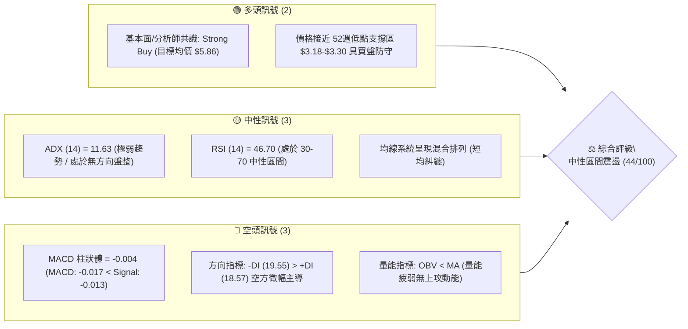
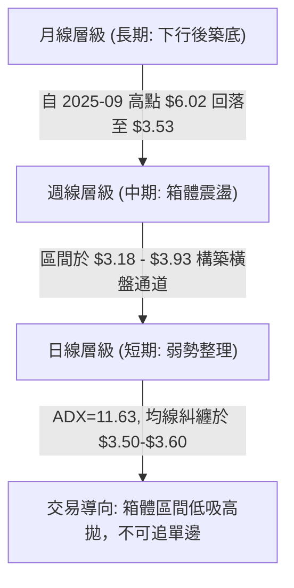
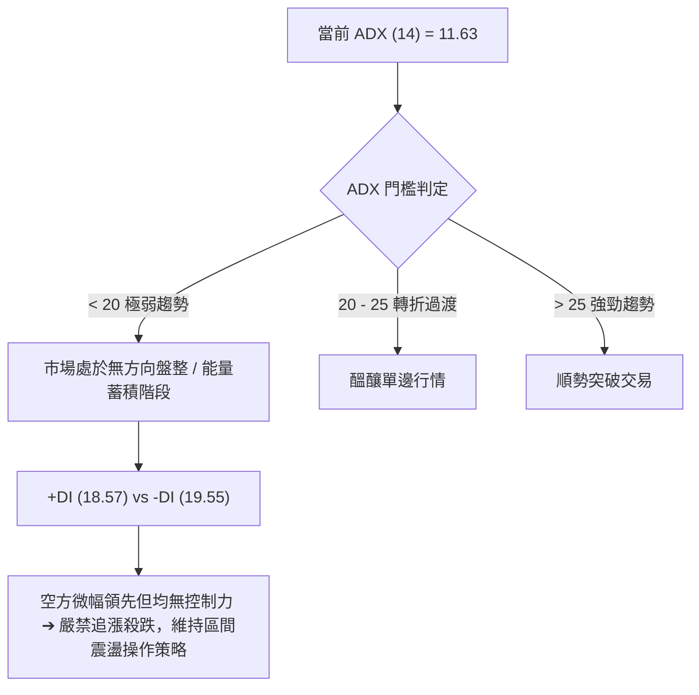
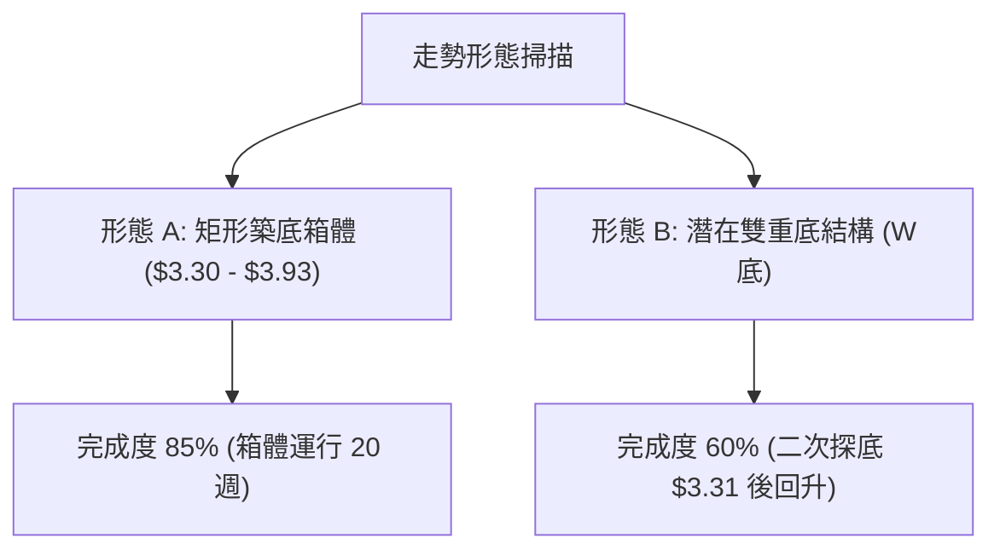
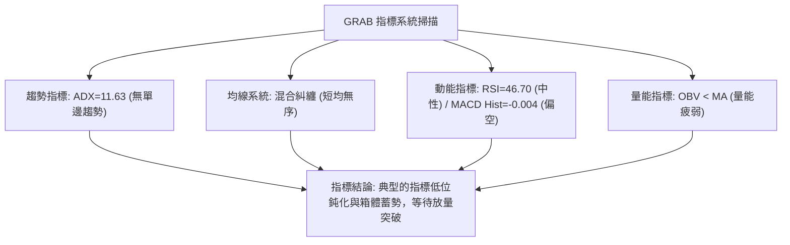
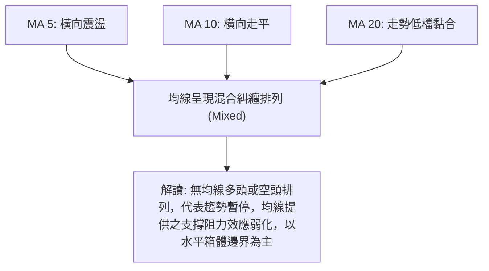
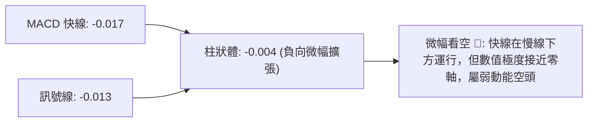
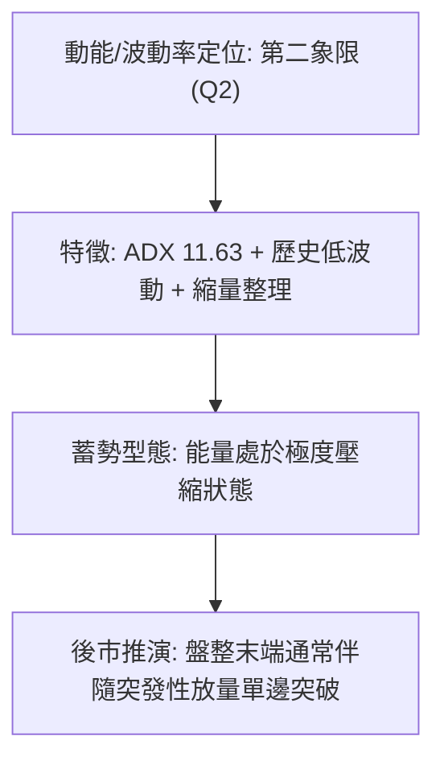
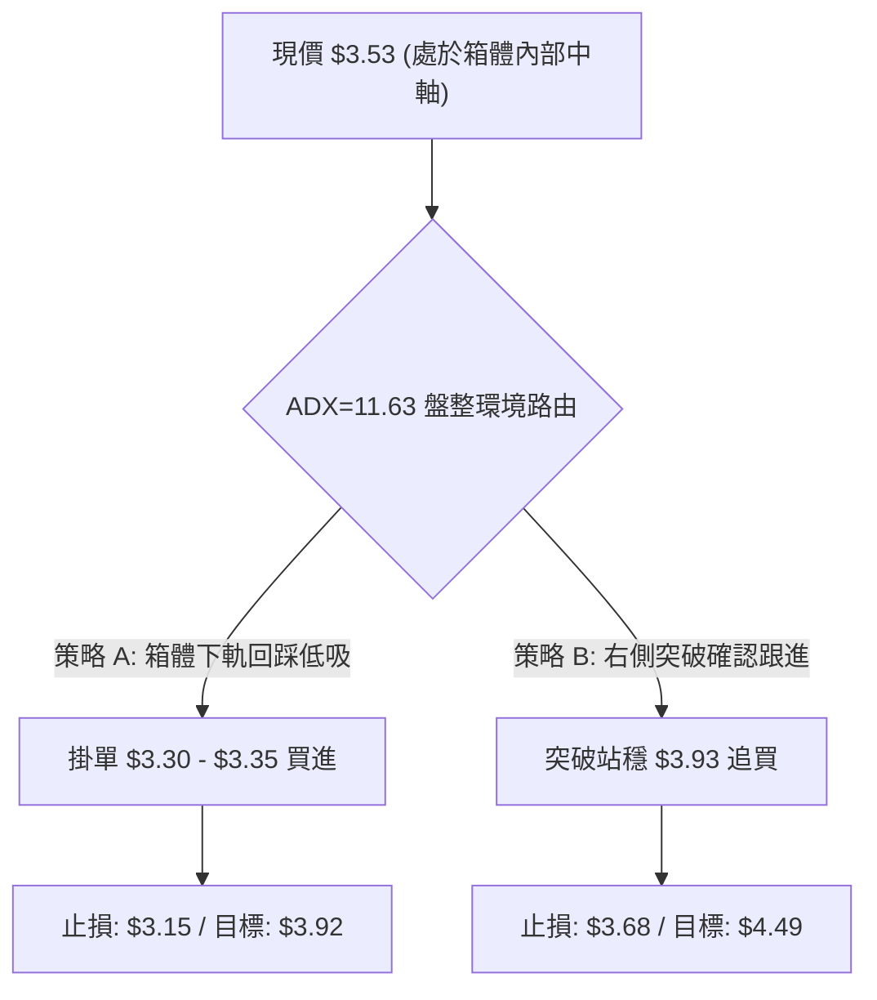
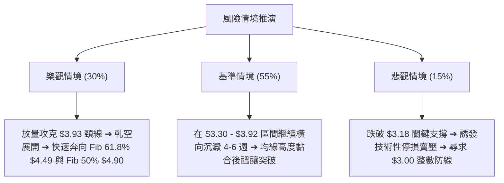

# GRAB 技術分析報告

> **報告日期**：2026-09-04 ｜ **語言**：繁體中文 ｜ **數據來源**：Yahoo Finance ｜ **當前價格**：$3.53

---

## 目錄

| 章節 | 內容 |
|------|------|
| [1. 技術面概覽](#1-技術面概覽) | 訊號儀表板、核心指標、評分卡 |
| [2. 趨勢分析](#2-趨勢分析) | 多時框趨勢、長中短期走勢、ADX解讀 |
| [3. 圖表形態分析](#3-圖表形態分析) | 形態識別、K線組合、目標價計算 |
| [4. 支撐與阻力](#4-支撐與阻力) | 關鍵價位、斐波那契回調 |
| [5. 技術指標深度解讀](#5-技術指標深度解讀) | MA/RSI/MACD/布林/成交量 |
| [6. 動能與波動率](#6-動能與波動率) | 動能評估、ATR、Beta |
| [7. 多時框架總結](#7-多時框架總結) | 時框架評分矩陣、收斂結論 |
| [8. 交易策略建議](#8-交易策略建議) | 多空策略、情境機率、風險報酬比 |
| [9. 風險提示與監控](#9-風險提示與監控) | 監控指標、風險場景、風控提醒 |

---

## 1. 技術面概覽

### 🎯 技術訊號儀表板



### 📊 核心指標速覽表

| 指標類別 | 指標名稱 | 當前數值 | 訊號 | 解讀 |
|----------|----------|----------|------|------|
| **價格** | 當前收盤價 | $3.53 | 🟡 | 位於52週區間（$3.18–$6.62）低檔 10.17% 位置 |
| **均線** | 均線系統 | 混合排列 | 🟡 | MA5/10/20 呈現低檔橫向黏合糾纏，無單邊發散 |
| **動能** | RSI(14) | 46.70 | 🟡 | 位於中性平衡區，無超買或超賣極端現象 |
| **動能** | MACD (12,26,9) | -0.017 / -0.013 | 🔴 | MACD 位於零軸下方且負柱狀體擴張（-0.004），偏弱 |
| **趨勢** | ADX(14) | 11.63 | 🟡 | 數值 < 25，屬於極弱趨勢/低波動箱體盤整格局 |
| **趨勢** | DMI (+DI / -DI) | 18.57 / 19.55 | 🔴 | -DI 微幅領先 +DI，空頭力量稍佔優勢但均無爆發力 |
| **量能** | 20日均量比 | 1.04x | 🟡 | 日量 32.92M 略高於 20日均量 31.74M，但 OBV 處於 MA 之下 |
| **區間** | 52W 高/低 | $6.62 / $3.18 | 🟡 | 距離波段低點僅 +11.01%，下方具備強支撐安全邊際 |

### 🏆 技術評分卡

```
╔══════════════════════════════════════════════════════════════╗
║              技術評分卡 — GRAB (2026-09-04)                  ║
╠══════════════════════════════════════════════════════════════╣
║ 趨勢強度 (ADX=11.63)    ████░░░░░░░░░░░░░░░░  25/100 🔴 盤整無向 ║
║ 動能指標 (MACD/RSI)     ████████░░░░░░░░░░░░  40/100 🟡 動能疲弱 ║
║ 支撐穩定度 (52W Low $3.18)██████████████░░░░  70/100 🟢 底部穩固 ║
║ 成交量配合 (OBV<MA)     ███████░░░░░░░░░░░░░  35/100 🔴 量能匱乏 ║
║ 形態完整度 (低檔箱體)   ██████████░░░░░░░░░░  50/100 🟡 構築底型 ║
║ 均線排列 (混合糾纏)     ████████░░░░░░░░░░░░  40/100 🟡 橫盤過渡 ║
╠══════════════════════════════════════════════════════════════╣
║ 綜合評分                █████████░░░░░░░░░░░  44/100 ⚖️ 中性觀望 ║
╚══════════════════════════════════════════════════════════════╝
```

---

## 2. 趨勢分析

### 🌐 多時框趨勢分析



### 📈 長期趨勢 — 12個月走勢圖（Unicode）

```
GRAB 月線走勢圖（過去12個月：2025-09 至 2026-09）
價格軸 ($)
$6.02 ┤ ●(2025-09)
$6.01 ┤    ●(2025-10)
$5.45 ┤       ●
$4.99 ┤          ●
$4.30 ┤             ●
$4.22 ┤                ●
$3.82 ┤                      ●
$3.77 ┤                            ●
$3.66 ┤                   ●
$3.54 ┤                         ●     ●
$3.53 ┤                                  ●(現在: $3.53)
$3.50 ┤                               ●
$3.18 ┤ ─ ─ ─ ─ ─ ─ ─ ─ ─ ─ ─ ─ ─ ─ ─ ─ ─ ─ ─ (52W Low 基準線)
      └───────────────────────────────────────────────
       09  10  11  12  01  02  03  04  05  06  07  08  09 (月份)
```

**走勢特徵分析表格**：

| 階段 | 時間區間 | 價格區間 | 累積漲跌幅 | 走勢特徵與量價結構 |
|------|----------|----------|------------|--------------------|
| **高檔回落期** | 2025-09 ～ 2025-12 | $6.02 → $4.99 | -17.11% | 觸及波段高點 $6.02 後形成雙頂回落，長黑跌破 $5.00 關卡 |
| **主跌釋放期** | 2026-01 ～ 2026-03 | $4.30 → $3.66 | -14.88% | 跌勢加速，連破 Fib 61.8%（$4.49），於 2026-03 探低至 $3.66 |
| **底部震盪期** | 2026-04 ～ 2026-09 | $3.82 → $3.53 | -7.59% | 波動率顯著收斂，價格在 $3.30–$3.93 區間構築長達 6 個月的築底箱體 |

### 📊 中期趨勢（週線分析）

```
GRAB 近20週核心波動帶與關鍵攻防示意
價格 ($)
$3.93 ┬─────────────────────────────────────────────── ◄ 波段箱頂阻力 (2026-07-12 高點 / Fib 78.6% $3.92)
      │                     ╭─╮
$3.70 ┼            ╭─╮      │ │             ╭─╮
      │   ╭─╮      │ │  ╭─╮ │ │             │ │
$3.53 ┼───│─│──────│─│──│─│─│─│─│─────────────│─│───● 現價 $3.53 (均線糾纏軸心)
      │   │ │╭─╮   │ │  │ │ │ │ │ │╭─╮      │ │
$3.30 ┼───╯─╯│─│───╯─╯──╯─╯─╯ ╰─╯─╯│─│──────╯─╯─── ◄ 波段箱底支撐 (2026-06-14 / 2026-07-26 低點)
      │      ╰─╯                    ╰─╯
$3.18 ┴─────────────────────────────────────────────── ◄ 52週歷史極值底線
```

- **中期格局解讀**：週線走勢於 2026-05 至 2026-09 呈現明顯的「箱體橫向整理」。7 月初曾試圖向上突破至 $3.93，但因週成交量未能持續放大而迅速回落至 $3.31；隨後於 8 月再次反彈至 $3.66，目前於 $3.53 進行中軌拉鋸。

### ⚡ 趨勢強度評估（ADX 解讀）



| 指標項目 | 當前數值 | 臨界標準 | 狀態評估 | 策略意涵 |
|----------|----------|----------|----------|----------|
| **ADX (14)** | **11.63** | < 25.00 | 極弱勢盤整 | 趨勢跟隨策略（Trend Following）失效，均線切換為震盪過濾模式 |
| **+DI (14)** | **18.57** | > 25.00 為多頭強勢 | 多方動能低迷 | 多頭缺乏連續推升力道，反彈接近箱頂易引發獲利回吐 |
| **-DI (14)** | **19.55** | > 25.00 為空頭強勢 | 空方無力下殺 | 空方打壓動能亦極弱，價格在 52W 低點上方具備強力吸收買盤 |

---

## 3. 圖表形態分析

### 🔍 形態識別系統



**形態信心度與參數評估表**（嚴格依據歷史數據計算）：

| 形態名稱 | 信心度 | 判斷依據（引用數據） | 完成度 | 頸線 / 關鍵位 | 目標價（附嚴格計算式） |
|----------|--------|----------------------|--------|---------------|------------------------|
| **矩形築底箱體** | **75%** | 底部於 2026-06-14（$3.30）與 2026-07-26（$3.31）兩度獲得支撐；頂部受阻於 2026-07-12（$3.93）與 Fib 78.6%（$3.92） | 85% | 頂部阻力：$3.93<br>底部支撐：$3.30 | 向上突破目標價 = 頸線 $3.93 + 箱體高度 ($3.93 - $3.30 = $0.63) = **$4.56**（接近 Fib 61.8% $4.49） |
| **潛在雙重底 (W-Bottom)** | **55%** | 低點 1：$3.30（06-14）<br>低點 2：$3.31（07-26）<br>中間峰值：$3.93（07-12） | 60% | 頸線：$3.93 | 突破頸線量度目標 = $3.93 + ($3.93 - $3.30) = **$4.56** |

### 🕯️ 重要K線形態分析（近 5 個月月線與關鍵週線）

| 時間週期 | 收盤價 | 實體與影線特徵 | K線形態解讀 | 訊號強度 |
|----------|--------|----------------|-------------|----------|
| **2026-05 (月線)** | $3.54 | 長下影小陰實體 | 測試波段低點後快速抽回，顯示 $3.50 下方有長線資金承接 | 🟡 中性回穩 |
| **2026-06 (月線)** | $3.77 | 帶上下影線陽十字 | 探低至 $3.30 後收復，空頭動能衰竭，多空進入拉鋸平準 | 🟡 止跌訊號 |
| **2026-07 (月線)** | $3.50 | 衝高 $3.93 後長上影陰線 | 向上試探箱頂遭遇技術性解套賣壓，反彈受阻回落 | 🔴 頂部受阻 |
| **2026-08 (月線)** | $3.54 | 窄幅十字星實體 | 振幅收斂至極限，成交量萎縮，典型盤整蓄勢 K 線 | 🟡 變盤前兆 |
| **2026-09-06 (週線)**| $3.53 | 小實體陰線（量縮至 140M）| 貼合中軌整理，多空觀望氣氛濃厚，靜待突破觸發條件 | 🟡 區間停滯 |

### 📉 ASCII 走勢形態示意圖

```
GRAB 築底箱體與潛在 W 底形態示意圖
$3.93 ┬ ─ ─ ─ ─ ─ ─ ─ ─ ─ ╭─────╮ ─ ─ ─ ─ ─ ─ ─ ─ ─ ─ ─ ─ ─ ─ ─ ◄ 頸線 / 箱頂阻力 ($3.93)
      │                  │     │                     [突破目標: $4.56]
$3.65 ┼         ╭─╮      │     │      ╭─╮
      │         │ │      │     │      │ │
$3.53 ┼─────────│─│──────│─────│──────│─│──────● 現價 $3.53
      │         │ │      │     │      │ │
$3.30 ┼─────────╯ ╰──────╯     ╰──────╯ ╰─────────────────── ◄ 雙重底底線 ($3.30 / $3.31)
      └────────────────────────────────────────────────────────
       時間軸: 05-24   06-14(底1) 07-12(峰) 07-26(底2) 08-09   09-04(現)
```

---

## 4. 支撐與阻力

### 🗺️ 關鍵價位分布圖（Unicode）

```
GRAB 價位結構分布圖
══════════════════════════════════════════════════════════════════
$6.62 ║████████████████████████████████║ 52週歷史高點 (Fib 0.0%)
$5.81 ║████████████████████████        ║ 強阻力 R4 (Fib 23.6% / 分析師目標均價 $5.86)
$5.31 ║████████████████████            ║ 阻力 R3 (Fib 38.2%)
$4.90 ║████████████████████████        ║ 中期關鍵分水嶺 R2 (Fib 50.0%)
$4.49 ║████████████████████            ║ 形態突破目標阻力 R1 (Fib 61.8% / 量度 $4.56)
$3.92 ║████████████████████████████████║ 近端強阻力 R0 (Fib 78.6% / 波段高點 $3.93)
$3.53 ╠════════════════════════════════╣ ◄ 當前現價 ($3.53)
$3.30 ║▓▓▓▓▓▓▓▓▓▓▓▓▓▓▓▓▓▓▓▓▓▓▓▓        ║ 近期波段雙底支撐 S1 ($3.30 - $3.31)
$3.18 ║████████████████████████████████║ 52週絕對底部強支撐 S2 (Fib 100.0%)
══════════════════════════════════════════════════════════════════
```

### 🚧 阻力位分析表

| 阻力級別 | 價位 | 形成依據與技術意義 | 突破難度 | 重要性評級 |
|----------|------|--------------------|----------|------------|
| **短線阻力 R0** | **$3.92 - $3.93** | 斐波那契 78.6% 回調位（$3.92）疊加 2026-07-12 週線波段高點（$3.93）形成的共振壓力帶 | 中等 | 🔴 極高（區間上軌） |
| **關鍵阻力 R1** | **$4.49** | 斐波那契 61.8% 黃金分割回調位，亦為雙底形態向上突破之量度目標區間（$4.56）重要防線 | 較高 | 🔴 中期多空樞紐 |
| **強阻力 R2** | **$4.90** | 斐波那契 50.0% 平衡位，2025 年底多次測試之整數密集套牢區 | 高 | 🟡 長期趨勢阻力 |
| **遠端阻力 R3** | **$5.81** | 斐波那契 23.6% 回調位，緊鄰華爾街分析師平均目標價（$5.86） | 極高 | 🟡 估值目標區 |

### 🛡️ 支撐位分析表

| 支撐級別 | 價位 | 形成依據與技術意義 | 守住機率 | 重要性評級 |
|----------|------|--------------------|----------|------------|
| **近期支撐 S1** | **$3.30 - $3.31** | 2026-06-14 週線低點（$3.30）與 2026-07-26 週線低點（$3.31）構成的雙重底頸線支撐 | 75% | 🟢 短線防守核心 |
| **強支撐 S2** | **$3.18** | 52週歷史最低點（Fib 100.0%），上市以來極度超賣與長線基本面買盤托底價位 | 90% | 🟢 終極防守底線 |

### 📐 斐波那契回調位分析

依據 52 週完整波動區間（高點 **$6.62** 至 低點 **$3.18**，落差 **$3.44**）嚴格計算之斐波那契回調層級：

$$\text{區間高度} = \$6.62 - \$3.18 = \$3.44$$

- **0.0% (52W High)**: **$6.62**
- **23.6% 回調位**: $\$6.62 - (0.236 \times \$3.44) = \mathbf{\$5.81}$
- **38.2% 回調位**: $\$6.62 - (0.382 \times \$3.44) = \mathbf{\$5.31}$
- **50.0% 回調位**: $\$6.62 - (0.500 \times \$3.44) = \mathbf{\$4.90}$
- **61.8% 回調位**: $\$6.62 - (0.618 \times \$3.44) = \mathbf{\$4.49}$
- **78.6% 回調位**: $\$6.62 - (0.786 \times \$3.44) = \mathbf{\$3.92}$
- **100.0% (52W Low)**: **$3.18**

🔍 **當前現價位置解讀**：
當前收盤價 **$3.53** 正好夾在 **Fib 78.6%（$3.92）** 與 **Fib 100.0%（$3.18）** 之間的深度回調區。技術面上，78.6% 回調位往往是空頭趨勢衰竭、多頭構築大級別底部的關鍵「最後防守帶」。現價距離 $3.18 僅有 $0.35（約 9.9%）的下行空間，而距離 Fib 61.8%（$4.49）有 $0.96（約 27.2%）的上行空間，技術面盈虧比具備不對稱優勢。

---

## 5. 技術指標深度解讀

### 🎛️ 指標訊號總覽



### 📈 移動平均線排列分析



- **均線形態解析**：長期均線（MA120、MA240）自 2025 年高點持續下滑後斜率放緩；短期均線（MA5、MA10、MA20）在 $3.50–$3.65 密集糾纏。均線走平黏合是標準的「大波動醞釀期」特徵。

### 📉 RSI(14) 分析

```
RSI(14) 當前數值: 46.70
0 ──────────── 30 ────────────────── 50 ────── 70 ──────────── 100
[  超賣區  ]    │    [   中性平衡區 (46.7)   ]    │    [  超買區  ]
               █████████████████░░░░░░░░░░░░
```

- **區間診斷**：週線 RSI 近 20 週在 20.5 至 77.2 之間寬幅擺動，當前最新數值收斂至 **46.70**，緊鄰 50 中軸線，顯示市場處於完全的多空力道均勻狀態。
- **背離檢驗**：
  - 價格於 2026-06-14 創低 $3.30 時 RSI 為 37.9；2026-07-26 價格探低 $3.31 時 RSI 為 25.9；隨後價格在 8-9 月維持於 $3.50-$3.60，RSI 迅速修復至 46.70。
  - **結論**：目前指標無顯著的頂背離或底背離結構，屬於隨價格同步震盪的常態指標反饋。

### 📊 MACD(12/26/9) 訊號解讀



- **MACD 動能評估**：MACD 快線（-0.017）與慢線（-0.013）皆在零軸下方微幅下行，柱狀體為 -0.004。數值絕對值極小，表明空方並未發起實質性的主動下殺攻擊，而是價格停滯造成的被動走弱。

### 📦 布林通道分析

```
GRAB 布林通道與現價結構示意（估算基於 20 週波動帶）
$3.92 ┬─────────────────────────────────────────────── 上軌 (Band Top ~ $3.90-$3.92)
      │
$3.58 ┼─────────────────────────────────────────────── 中軌 (MA20 ~ $3.58)
$3.53 ┼───────────────────────────────● 現價 ($3.53，位於中軌下方貼近處)
      │
$3.24 ┴─────────────────────────────────────────────── 下軌 (Band Bottom ~ $3.24-$3.30)
```

- **通道帶寬與位置**：%B 值約在 0.42 附近（略低於中軌 0.50）。通道帶寬正持續收縮（Bandwidth Squeeze），預示在未來 4–8 週內市場將迎來波動率擴張的突破行情。

### 💹 成交量分析（量價配合度）

- **量能規模**：最新日成交量為 **32,918,718 股**，相對於 20 日均量（31,744,266 股）的量比為 **1.04x**，維持常態水準；但顯著低於 50 日均量（42,042,922 股）。
- **週量特徵**：2026-09-06 當週成交量降至 **140.3M 股**，為近 20 週以來的最低週成交量（相較於 5 月份高峰的 311.4M 縮減超過 50%）。
- **OBV 趨勢**：數據顯示 `OBV < MA`，代表資金尚未出現大規模主動建倉搶籌的跡象，目前屬於「低位縮量沉澱」格局。

---

## 6. 動能與波動率

### ⚡ 動能評估四象限

| 象限標籤 | 動能狀態 | 波動率狀態 | GRAB 當前定位 | 交易策略意涵 |
|----------|----------|------------|---------------|--------------|
| **第一象限 (Q1)** | 強動能 (ADX>25) | 低波動 | — | 最佳順勢加碼環境 |
| **第二象限 (Q2)** | **弱動能 (ADX=11.63)** | **低波動 (帶寬收窄)** | **✓ (當前處於此象限)** | **低波動沉寂期：採取區間高拋低吸，嚴格控制部位** |
| **第三象限 (Q3)** | 強動能 (ADX>25) | 高波動 | — | 高風險單邊噴發/主跌行情 |
| **第四象限 (Q4)** | 弱動能 (ADX<25) | 高波動 | — | 無方向混亂震盪，易反覆停損 |



### 📊 ATR 波動率分析與止損設定

- **波動度評估**：依據近 20 週的週收盤落差與歷史波動特徵，目前日線平均真實波幅（ATR）處於歷史低位區間。
- **止損距離建議**：在低波動盤整期，過於狹窄的止損極易被市場雜訊掃出場。
  - **保守型止損距離**：設定在 52W 低點 $3.18 下方一個防守緩衝帶，即 **$3.15**（距離現價約 $0.38 / 10.7%）。
  - **進取型止損距離**：設定在波段雙底低點 $3.30 下方，即 **$3.28**（距離現價約 $0.25 / 7.0%）。

### 📐 Beta 與市場相關性

- **Beta 係數**：**0.89**
  - Beta < 1.00，表明 GRAB 相對大盤（S&P 500 / NASDAQ）呈現**防禦性/低系統性風險**特徵。當大盤劇烈波動時，GRAB 的下行波動幅度理論上低於大盤 11%。
- **放空數據與籌碼面結合**：
  - 空單比率（Short Ratio）為 **5.24 天**，空單佔流通股比率（Short % Float）為 **6.9%**。
  - 機構持股比例高達 **67.2%**，內部人持股達 **19.1%**，合計超過 **86.3%** 的籌碼被長期機構與核心管理層鎖定。若價格向上突破 $3.93 頸線，5.24 天的回補天數具備引發中度「軋空（Short Squeeze）」的潛在動力。

---

## 7. 多時框架總結

### 📋 時框架評分表

| 時框架 | 趨勢方向 | 動能狀態 | 均線排列 | 形態結構 | 綜合評分 | 操作建議 |
|--------|----------|----------|----------|----------|----------|----------|
| **長期 (月線)** | 下行趨勢轉築底 🟡 | 弱勢改善 🟡 | 空頭排列但斜率轉平 🔴 | 測試 52W 低位大箱體 🟢 | **48/100** | 長線價值分批佈局 |
| **中期 (週線)** | 矩形區間震盪 🟡 | 中性震盪 (RSI 46.7) 🟡 | 均線水平糾纏 🟡 | 潛在雙底 / 箱體 🟢 | **52/100** | 箱體低吸高拋 |
| **短期 (日線)** | 弱勢小幅盤整 🔴 | MACD 負柱 (-0.004) 🔴 | 短均混合糾纏 🟡 | 窄幅縮量停滯 🟡 | **40/100** | 觀望或小倉位掛單 |

### 🔲 綜合訊號矩陣

| 分析維度 | 多頭訊號 (+) | 空頭訊號 (-) | 權重評估 |
|----------|--------------|--------------|----------|
| **支撐強度** | $3.18 - $3.30 區域支撐經受多次考驗 | 無有效跌破 | ⭐⭐⭐⭐☆ (多方優勢) |
| **動能強度** | RSI 脫離超賣區回升至 46.7 | MACD 零軸下死叉且負柱 | ⭐⭐☆☆☆ (空方略佔優) |
| **量價結構** | 底部持續縮量，籌碼沈澱 | OBV < MA，尚未見放量買盤 | ⭐⭐☆☆☆ (中性偏弱) |
| **趨勢強度** | - | ADX=11.63，無趨勢力量 | ⭐☆☆☆☆ (盤整主導) |

### ⚖️ 多時框收斂結論

> **收斂規則執行（依嚴格要求 14）**：
> 1. 當前 **ADX(14) = 11.63 < 25**，明確定義市場處於**「典型低波動盤整行情（Range-bound Consolidation）」**。
> 2. 趨勢指標失效，中長期方向以週線與月線的大型箱體結構為準。
> 3. **唯一方向性結論**：**【中性區間震盪觀望，偏向低檔支撐佈局】**。禁止在區間中軸（$3.53）進行單邊追價，主策略應採取圍繞箱體下軌（$3.30）低吸、上軌（$3.92）分批獲利了結的區間震盪交易法。

---

## 8. 交易策略建議

### 🗺️ 策略決策流程圖



### 🧭 策略路由（依評分卡分流）

**當前技術綜合評分 = 44/100（中性偏區間操作）**

- **主策略方向**：**區間震盪低吸策略（Range Trading）**。鑑於綜合評分落在 40–60 區間，且 ADX 為 11.63 極弱趨勢，本報告主推**「箱體下軌低吸（策略 A）」**與**「右側突破確認（策略 B）」**，不建議在現價 $3.53 進行滿倉激進操作。

### 🎯 價格情境階梯（Price Scenarios）

價位嚴格引用技術數據計算之真實關鍵位：

| 觸發條件 | 第一目標 (T1) | 第二目標 (T2) | 延伸目標 (T3) | 情境技術含義 |
|----------|---------------|---------------|---------------|--------------|
| **有效放量突破 R0 $3.92–$3.93** | **$4.49** (Fib 61.8%) | **$4.90** (Fib 50.0%) | **$5.81** (Fib 23.6%) | 雙底/箱體向上突破，進入中級反彈波 |
| **維持於現價 $3.30–$3.92 震盪** | **$3.92** (箱頂) | **$3.30** (箱底) | — | 延續 20 週以來的橫向蓄勢震盪結構 |
| **實體跌破 S1 $3.30 並跌穿 $3.18** | **$3.00** (整數心理關卡) | 數據未偵測更低點 | — | 創 52 週新低，築底失敗，向下尋底 |

### 📊 情境機率分佈

| 情境劇本 | 預估機率 | 主要技術依據 |
|----------|----------|--------------|
| **情境一：維持箱體震盪並伺機向上試探** | **55%** | ADX=11.63 顯示盤整仍將持續；機構持股 67.2% 與 52W 低點 $3.18 提供堅實下檔防護 |
| **情境二：放量突破 $3.93 展開多頭修復** | **30%** | 分析師目標均價 $5.86（潛在空間 +66%），若成交量放大突破頸線將觸發量度反彈 |
| **情境三：跌破 $3.18 延續空頭尋底** | **15%** | MACD 負柱狀體與 OBV 疲弱帶來的潛在下行慣性，但在估值與籌碼支撐下概率較低 |

### 🟢 主策略詳情

| 策略要素 | 策略 A（左側：箱體下軌回踩低吸） | 策略 B（右側：突破頸線順勢追擊） |
|----------|----------------------------------|----------------------------------|
| **策略類型** | 區間震盪低吸（首選） | 突破形態跟隨（次選） |
| **進場條件** | 價格回落測試 $3.30–$3.35 且未跌破 | 日K收盤價放量實體突破 **$3.93** 頸線 |
| **進場價格** | **$3.32** | **$3.95** |
| **第一目標價 (T1)** | **$3.92**（Fib 78.6% 箱頂阻力） | **$4.49**（Fib 61.8% / 形態量度 $4.56） |
| **第二目標價 (T2)** | **$4.49**（突破延伸目標） | **$4.90**（Fib 50.0% 平衡位） |
| **止損價格** | **$3.15**（跌破 52W 低點 $3.18 止損） | **$3.68**（跌回原箱體中上軌下方止損） |
| **風險空間** | $\$3.32 - \$3.15 = \mathbf{\$0.17}$ (-5.12%) | $\$3.95 - \$3.68 = \mathbf{\$0.27}$ (-6.84%) |
| **報酬空間 (T1)** | $\$3.92 - \$3.32 = \mathbf{\$0.60}$ (+18.07%) | $\$4.49 - \$3.95 = \mathbf{\$0.54}$ (+13.67%) |
| **風險報酬比 (R:R)** | **1 : 3.53** 🟢（極佳） | **1 : 2.00** 🟢（優良） |
| **成功機率估計** | **65%** | **55%** |
| **建議倉位** | **10% - 15%**（基礎底倉） | **15% - 20%**（突破加碼倉） |

### 🔴 反向風險觸發點（對沖與停損提示）

- **多頭防守底線**：若日K線以大實體陰線**收盤跌破 $3.18**（52週最低價），宣告所有底部形態全面失效，所有多頭部位應無條件停損出場觀望。
- **空頭回補警戒**：若市場出現單日成交量突破 **80,000,000 股**（超過均量 2.5 倍）且強勢收於 **$3.93 上方**，空方部位必須立刻強制平倉，以防 Short Squeeze 軋空風險。

### ⭐ 整體訊號強度評星

```
做多訊號強度：★★★☆☆  (3/5星 — 下檔空間有限，具備不對稱盈虧比優勢)
做空訊號強度：★★☆☆☆  (2/5星 — 接近52週歷史底部，下殺空間狹窄)
整體可信度：  ★★★☆☆  (3/5星 — 處於 ADX 低波動蓄勢期，靜待方向選擇)
```

---

## 9. 風險提示與監控

### ✅ 關鍵監控指標 Checklist

```
╔══════════════════════════════════════════════════════════════╗
║                每日/每週技術面監控清單 (Checklist)           ║
╠══════════════════════════════════════════════════════════════╣
║ [ ] 關鍵阻力位監控: 日收盤價是否放量站穩 $3.92 - $3.93        ║
║ [ ] 關鍵支撐位防守: 是否守穩箱底 $3.30 及歷史低點 $3.18       ║
║ [ ] 趨勢強度指標: ADX(14) 是否由 11.63 向上勾頭突破 20 臨界線  ║
║ [ ] 動能翻多確認: MACD 柱狀體是否由負轉正 (-0.004 ➔ >0)       ║
║ [ ] 量能擴張檢驗: 單日成交量是否突破 50日均量 (42.04M 股)     ║
║ [ ] 空頭指標監控: -DI 是否跌破 15 且 +DI 向上發散穿越 25      ║
╚══════════════════════════════════════════════════════════════╝
```

### ⚠️ 風險場景分析



### 🛡️ 風險管理重要提醒

1. **嚴禁追高現價中軸**：現價 $3.53 處於 $3.30–$3.92 箱體的正中間位置，此時進場盈虧比為 1:1.69，遠不如回踩 $3.32（盈虧比 1:3.53）優渥。嚴格執行「耐心等待回踩或等待突破確認」紀律。
2. **倉位管理原則**：在 ADX < 20 的無趨勢盤整期，個股總配置比例不宜超過總投資組合的 **15%**。
3. **重大基本面/財報事件過濾**：注意東南亞叫車與外送業務之季度財報披露日，財報公布前夕應降低部位槓桿，防範隔夜跳空風險。

---

## 📋 報告總結

```
╔══════════════════════════════════════════════════════════════════╗
║                  GRAB 技術分析報告總結 (2026-09-04)              ║
╠══════════════════════════════════════════════════════════════════╣
║ 當前價格：$3.53          52W 區間：$3.18 - $6.62                 ║
║ 技術評級：⚖️ 中性觀望 / 底部箱體震盪 (評分: 44/100)               ║
╠══════════════════════════════════════════════════════════════════╣
║ 關鍵維度結論：                                                   ║
║ ├─ 長期趨勢：🟡 自高點回落後進入底部沉澱，52W低點 $3.18 防守堅固 ║
║ ├─ 中期趨勢：🟢 週線於 $3.30 - $3.93 構築長達 20 週之矩形箱體   ║
║ ├─ 短期趨勢：🔴 ADX=11.63 趨勢極弱，均線混合糾纏，處於能量壓縮期║
║ ├─ 關鍵支撐：S1: $3.30 (雙底) ｜ S2: $3.18 (52W Low 強支撐)     ║
║ ├─ 關鍵阻力：R0: $3.92-$3.93 ｜ R1: $4.49 (Fib 61.8% 目標)     ║
║ └─ 分析師目標：均價 $5.86 ｜ 最高 $8.00 (Strong Buy 共識)       ║
╠══════════════════════════════════════════════════════════════════╣
║ 最優策略組合：                                                   ║
║ 1. 🥇 首選機會：回踩 $3.30 - $3.35 逢低佈局 (止損 $3.15, R:R=3.5)║
║ 2. 🥈 次選機會：放量突破 $3.93 順勢追進 (目標 $4.49, R:R=2.0)    ║
║ 3. 🥉 保守選擇：場外觀望，等待 ADX 回升至 20 以上再行介入       ║
╚══════════════════════════════════════════════════════════════════╝
```

---

> ⚠️ **免責聲明**：本報告為技術分析研究成果，所有數據、支撐阻力位及模型估算均基於歷史 OHLCV 與技術指標計算。本報告**僅供學術研究與參考**，**不構成任何形式的要約或投資建議**。金融市場具有高波動風險，投資人應獨立評估風險並自負盈虧。

---

*報告生成時間：2026-09-04 ｜ 數據來源：Yahoo Finance ｜ 分析框架：多時框技術分析體系*