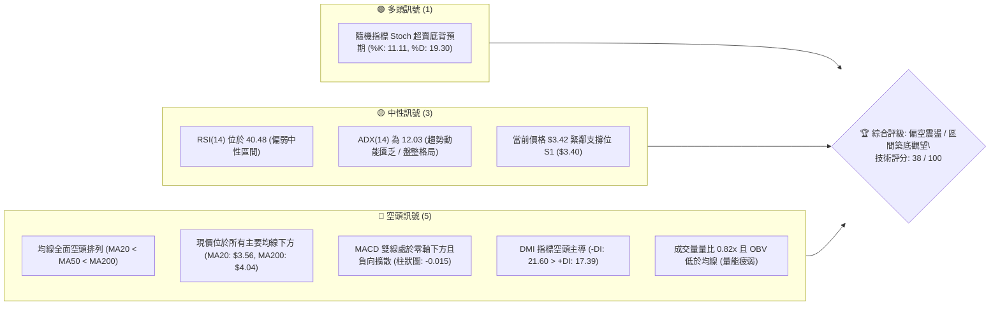
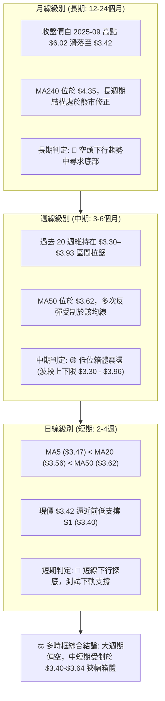
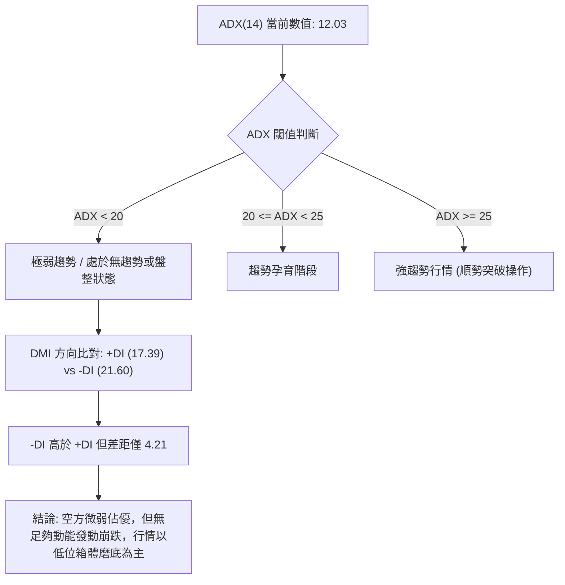
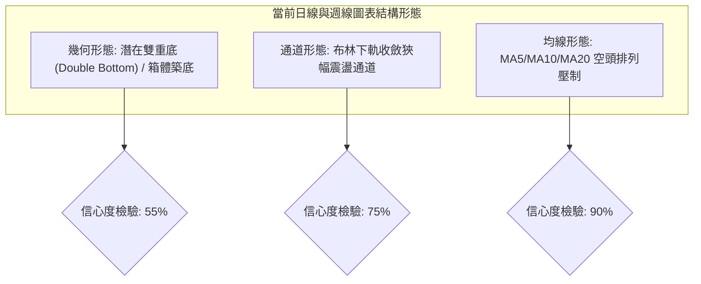
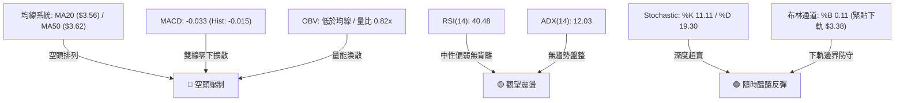
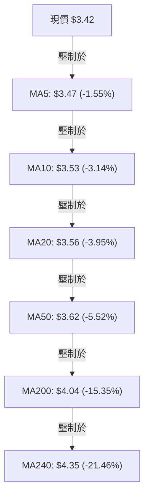
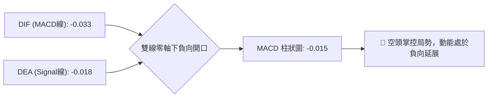
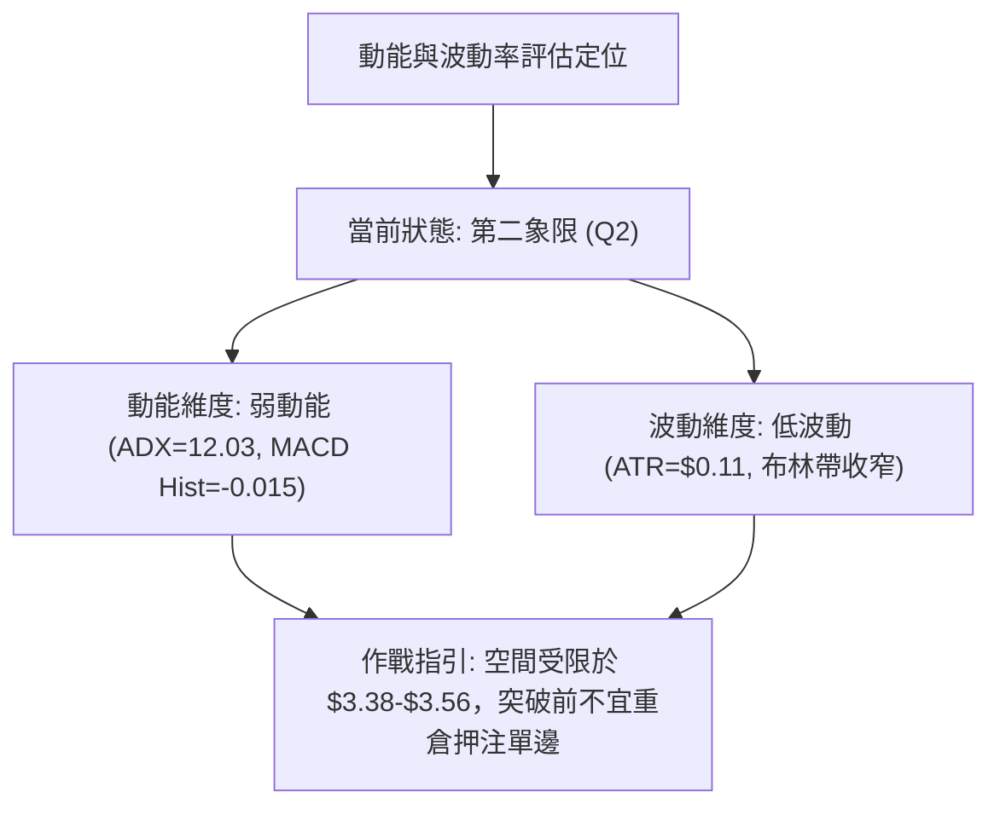
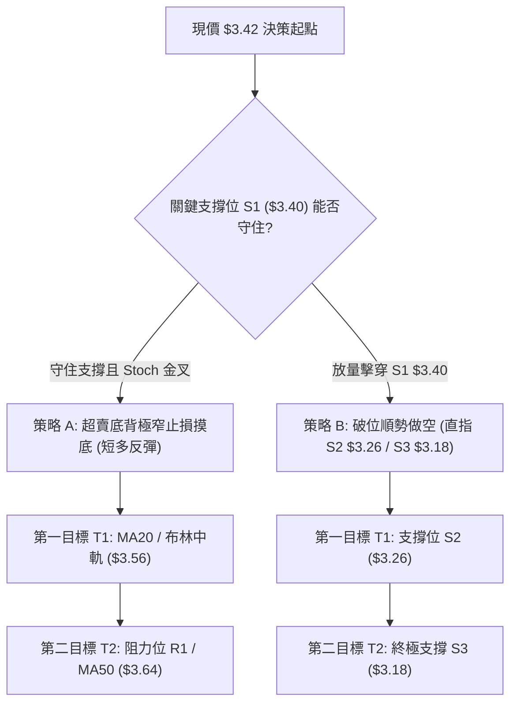
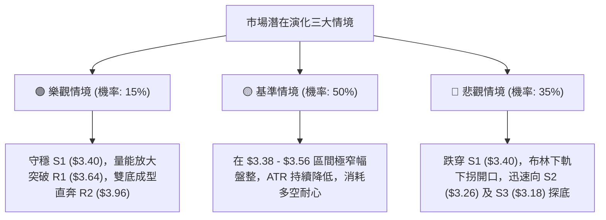

# GRAB 技術分析報告

> **報告日期**：2026-09-05 ｜ **語言**：繁體中文 ｜ **數據來源**：Yahoo Finance ｜ **當前價格**：$3.42

---

## 目錄

| 章節 | 內容 |
|------|------|
| [1. 技術面概覽](#1-技術面概覽) | 訊號儀表板、核心指標、評分卡 |
| [2. 趨勢分析](#2-趨勢分析) | 多時框趨勢、長中短期走勢、ADX解讀 |
| [3. 圖表形態分析](#3-圖表形態分析) | 形態識別、信心度評估、K線特徵、目標價 |
| [4. 支撐與阻力](#4-支撐與阻力) | 關鍵價位分布、波段聚類阻力/支撐、斐波那契回調 |
| [5. 技術指標深度解讀](#5-技術指標深度解讀) | 均線系統、RSI/Stoch、MACD、布林通道、OBV量價 |
| [6. 動能與波動率](#6-動能與波動率) | 動能四象限、ATR波動分析、Beta市場關聯 |
| [7. 多時框架總結](#7-多時框架總結) | 時框架矩陣、訊號一致性、多時框收斂結論 |
| [8. 交易策略建議](#8-交易策略建議) | 策略決策流程、路由判定、情境階梯、主客策略 |
| [9. 風險提示與監控](#9-風險提示與監控) | 關鍵監控清單、情境模擬、風控提醒 |
| [📋 報告總結](#-報告總結) | 全文核心彙總與操作指引 |

---

## 1. 技術面概覽

### 🎯 技術訊號儀表板



### 📊 核心指標速覽表

| 指標類別 | 指標名稱 | 當前數值 | 訊號 | 核心解讀 |
|:---|:---|:---:|:---:|:---|
| **價格結構** | 當前收盤價 | $3.42 | 🔴 | 位於 52 週區間 ($3.18–$6.62) 的 7.0% 極低檔位置 |
| **短期均線** | MA20 (月線) | $3.56 | 🔴 | 現價低於 MA20 達 -3.95%，短期空頭壓制明確 |
| **中期均線** | MA50 (季線) | $3.62 | 🔴 | 現價低於 MA50 達 -5.52%，中期趨勢維持弱勢下行 |
| **長期均線** | MA200 (年線) | $4.04 | 🔴 | 現價低於 MA200 達 -15.35%，長期處於大熊市框架 |
| **超短期均線**| MA5 / MA10 | $3.47 / $3.53 | 🔴 | 超短均線空頭排列，下行慣性持續 |
| **動能指標** | RSI(14) | 40.48 | 🟡 | 徘徊於弱勢臨界點，尚未進入極端超賣（<30） |
| **擺動指標** | Stoch %K / %D | 11.11 / 19.30 | 🟢 | 進入極度超賣區，具備短線技術性抽頭反彈動能 |
| **趨勢動能** | MACD (12,26,9) | -0.033 / -0.018 | 🔴 | 柱狀圖 -0.015，雙線零軸下負向開口，空方掌舵 |
| **趨勢強度** | ADX(14) | 12.03 | 🟡 | 數值遠低於 25，表明單邊趨勢衰竭，進入無序盤整 |
| **方向系統** | +DI / -DI | 17.39 / 21.60 | 🔴 | -DI 高於 +DI，空方相對佔優但絕對優勢不強 |
| **波動通道** | 布林通道 (%B) | %B: 0.11 ($3.38–$3.74) | 🟡 | 現價緊貼布林下軌（$3.38），下軌提供初級邊界支撐 |
| **波動幅度** | ATR(14) | $0.11 (3.28%) | 🟡 | 日內波幅收斂，低波動暗示醞釀方向性變盤 |
| **量能指標** | 成交量 / 量比 | 25.86M / 0.82x | 🔴 | 低於 20 日均量 (31.50M)，OBV < 均線，多頭無量承接 |

### 🏆 技術評分卡

```
╔════════════════════════════════════════════════════════════════╗
║             技術評分卡 — GRAB (2026-09-05)                   ║
╠════════════════════════════════════════════════════════════════╣
║ 趨勢強度 (Trend)     ████░░░░░░░░░░░░░░░░  20/100  🔴 極度疲弱 ║
║ 均線架構 (MA Align)  ███░░░░░░░░░░░░░░░░░  15/100  🔴 空頭排列 ║
║ 動能指標 (Momentum)  ████████░░░░░░░░░░░░  40/100  🟡 弱勢中性 ║
║ 擺動超賣 (Stochastic)████████████████░░░░  80/100  🟢 強烈超賣 ║
║ 支撐穩定度 (Support) ██████████░░░░░░░░░░  50/100  🟡 考驗S1   ║
║ 量能配合度 (Volume)  ██████░░░░░░░░░░░░░░  30/100  🔴 量價背離 ║
║ 形態完整度 (Pattern) ████████░░░░░░░░░░░░  40/100  🟡 區間築底 ║
╠════════════════════════════════════════════════════════════════╣
║ 綜合評分             ███████░░░░░░░░░░░░░  38/100  🔴 偏空震盪 ║
╚════════════════════════════════════════════════════════════════╝
```

---

## 2. 趨勢分析

### 🌐 多時框趨勢分析



### 📈 長期趨勢 — 12個月走勢圖（Unicode）

以下為 GRAB 過去 12 個月（2025-10 至 2026-09）之歷史月線收盤走勢圖，標注歷史高點、低點與現價分佈：

```
GRAB 月線走勢圖（過去12個月：2025-10 至 2026-09）
價格軸 ($)
$6.05 ┤ ● (2025-10: $6.01)
$5.50 ┤      ● (2025-11: $5.45)
$5.00 ┤           ● (2025-12: $4.99)
$4.50 ┤                ● (2026-01: $4.30)
$4.00 ┤                     ● (2026-02: $4.22)   ● (2026-04: $3.82)   ● (2026-06: $3.77)
$3.50 ┤                                    ●           ● (2026-05: $3.54)   ● (2026-08: $3.54)
$3.30 ┤                               (2026-03: $3.66)               ● (2026-07: $3.50)  ● ← 現價 $3.42 (2026-09)
      └─────────────────────────────────────────────────────────────────────────────────
       10月  11月  12月  01月  02月  03月  04月  05月  06月  07月  08月  09月 (年份: 2025-2026)
```

#### 走勢特徵分析表格

| 階段區間 | 起止月份 | 價格變化 | 漲跌幅 | 走勢特徵與技術解讀 |
|:---|:---:|:---:|:---:|:---|
| **主跌推動段** | 2025-10 → 2026-03 | $6.01 → $3.66 | -39.10% | 單邊空頭重挫，跌破各級均線，機構持續派發 |
| **超跌弱反彈** | 2026-03 → 2026-04 | $3.66 → $3.82 | +4.37% | 跌深技術抽頭，受制於日線下行均線群後無功而返 |
| **底部箱體收斂**| 2026-05 → 2026-08 | $3.54 → $3.54 | 0.00% | 於 $3.50–$3.77 構築平台，波幅顯著降低，量能萎縮 |
| **破位再測底** | 2026-08 → 2026-09 | $3.54 → $3.42 | -3.39% | 跌破箱體下緣平台，現價考驗 52 週低點區間支撐 |

### 📊 中期趨勢（週線分析）

從近 20 週收盤走勢可見，GRAB 在 2026 年夏季曾兩度試圖突破阻力：
1. **2026-07-12 高點 $3.93**：當時週線 RSI 達到 77.2，MACD 柱達 +0.062，但迅速遭遇強阻力 R2（$3.96）壓制，呈現長上影線後劇烈回落至 2026-07-26 的 $3.31。
2. **2026-08-09 次高點 $3.66**：反彈至阻力位 R1（$3.64）附近再次受阻，量能由 3.10 億股劇烈縮減至當前的 1.66 億股。

```
近期週線壓力與支撐層級示意圖：
$4.06 ────────────────────────────── R3 強阻力（近一年波段密集高點）
$3.96 ───────────● (07/12週 $3.93)── R2 次級阻力（週線多頭極限）
$3.64 ───────────● (08/09週 $3.66)── R1 短期頸線阻力 / MA50 ($3.62)
$3.42 ─────● 現價 (09/05收盤)
$3.40 ────────────────────────────── S1 近期波段關鍵支撐
$3.26 ────────────────────────────── S2 次級強支撐
$3.18 ────────────────────────────── S3 52週歷史極值支撐（最後防線）
```

### ⚡ 趨勢強度評估（ADX 解讀）



#### ADX 數值強度對照解讀

| 指標變數 | 當前讀數 | 基準界限 | 狀態判定 | 戰術應對指導 |
|:---|:---:|:---:|:---:|:---|
| **ADX(14)** | **12.03** | < 25.00 | **無趨勢 / 盤整震盪** | **嚴禁追漲殺跌，摒棄趨勢突破策略，轉為區間極值高拋低吸** |
| **+DI (14)** | **17.39** | — | 多方動能微弱 | 缺乏向上推升實質買盤 |
| **-DI (14)** | **21.60** | — | 空方略勝一籌 | 具備慣性向下拖拽力量，但未演化為主跌浪 |
| **動能差值** | **-4.21** | 絕對值 < 10 | 勢均力敵拉鋸 | 價格極易在布林通道上下軌之間反覆穿梭 |

---

## 3. 圖表形態分析

### 🔍 形態識別系統



#### 形態識別與信心度評估表（依規則 15）

| 形態類別 | 信心度 | 判斷依據（引用精確數據） | 形態完成度 | 目標價（附嚴謹計算式） |
|:---|:---:|:---|:---:|:---|
| **潛在雙重底** | **55%** | 第一低點為 2026-07-26 的 $3.31，第二低點當前正於 S1（$3.40）附近測試；頸線位於 R1（$3.64）。雙底低點聚類於支撐帶上方。 | 60%（尚未突破頸線） | 若有效突破頸線 $3.64：<br>形態高度 = $3.64 - $3.31 = $0.33<br>理論量度目標 = $3.64 + $0.33 = **$3.97**（與 R2 $3.96 高度重合） |
| **低位收斂箱體** | **70%** | 近 4 個月價格波動鎖定於波段低點 $3.30–$3.31 與波段高點 $3.93 之間，ADX 為 12.03 確認箱體橫盤。 | 85% | 箱體震盪區間：下軌邊界 **$3.38–$3.40**，上軌邊界 **$3.64–$3.74** |
| **均線空頭排列** | **90%** | MA5 ($3.47) < MA20 ($3.56) < MA50 ($3.62) < MA200 ($4.04)，呈典型空頭階梯狀排列。 | 100% | 空頭反壓目標區：**$3.56–$3.64** |

### 🕯️ 重要K線形態分析

| 觀測週期 | 收盤價 | 核心 K 線形態識別 | 技術意涵解讀 | 多空訊號 |
|:---|:---:|:---|:---|:---:|
| **2026-07-12 週** | $3.93 | 長上影流星線 (Shooting Star) | 衝擊 R2 ($3.96) 未果，多頭高檔力竭，主力資金獲利了結 | 🔴 空頭反轉 |
| **2026-07-26 週** | $3.31 | 長下影鎚頭線 (Hammer) | 探底 S2 ($3.26) 前緣後獲得多頭抄底承接，確立初級低點 | 🟢 支撐確立 |
| **2026-08-09 週** | $3.66 | 帶量長陽線 (Bullish Candle) | 成交量放大至 3.10 億股，測試頸線 R1 ($3.64) 阻力 | 🟡 遇阻回落 |
| **2026-09-06 週** | $3.42 | 弱勢黑K實體收低 | 量縮跌破 MA5 ($3.47)，實體逼近 S1 ($3.40)，空方佔據盤面主動 | 🔴 短線偏空 |

### 📉 ASCII 走勢形態示意圖

```
GRAB 潛在雙底與箱體形態結構示意圖：
價格 ($)
$3.96 ┤                       ● (波段頂部 07/12: $3.93)
      │                      / \
$3.64 ┼─────── 頸線 R1 ─────/───\────────● (08/09反彈頸線: $3.66)
      │     \             /     \        / \
$3.56 ┤      \--- MA20 --/------- \-----/---\--- MA20 當前反壓位
      │       \         /          \   /     \
$3.42 ┼────────\───────/────────────\─/───────● 現價 $3.42 (測試右底)
      │         \     /              v (當前探測)
$3.40 ┴──────────\───/──────────────────────── S1 關鍵支撐線
$3.31 ┤           ● (左底 07/26: $3.31)
      └──────────────────────────────────────────────────────────
                 時間序列 (2026年7月 ───> 2026年9月)
```

### 🎯 形態目標價計算

根據經典技術形態量度規則：
1. **雙底破位頸線量度目標**：
   - 頸線位（Neckline）：**$3.64**（波段阻力 R1）
   - 形態底部低點（Bottom）：**$3.31**（2026-07-26 週波段低點）
   - 形態絕對垂直高度 $H = 3.64 - 3.31 = \$0.33$
   - 最小量度上漲目標價 $T_1 = 3.64 + 0.33 =$ **$3.97**（與阻力位 R2 **$3.96** 極致吻合，誤差僅 $0.01）
2. **破位下行延伸目標**：
   - 若有效跌破 S1（$3.40），向下將直指支撐位 S2（**$3.26**）；若進一步下破，則滿足 52 週絕對低點 S3（**$3.18**）。

---

## 4. 支撐與阻力

### 🗺️ 關鍵價位分布圖（Unicode）

```
GRAB 價位結構分布圖（引用精確計算數值）
══════════════════════════════════════════════════════════════════
$4.06 ║████████████████████████████████║ 強阻力 R3 / 接近 MA200 ($4.04)
$3.96 ║████████████████████████        ║ 次級強阻力 R2 / 雙底量度目標 ($3.97)
$3.74 ║▓▓▓▓▓▓▓▓▓▓▓▓▓▓▓▓▓▓              ║ 布林通道上軌
$3.64 ║████████████████████████████████║ 核心波段阻力 R1 / 頸線 / MA50 ($3.62)
$3.56 ║▓▓▓▓▓▓▓▓▓▓▓▓                    ║ 布林中軌 / MA20 短期壓制
──────╫────────────────────────────────╫──────────────────────────
$3.42 ╠════════════════════════════════╣ ◄ 當前市價 ($3.42)
──────╫────────────────────────────────╫──────────────────────────
$3.40 ║████████████████████████████████║ 近期核心支撐 S1 (-0.51%)
$3.38 ║▓▓▓▓▓▓▓▓▓▓▓▓▓▓▓▓                ║ 布林通道下軌
$3.26 ║████████████████████            ║ 波段強支撐 S2 (-4.82%)
$3.18 ║████████████████████████████████║ 52週極值終極支撐 S3 (-7.02%)
══════════════════════════════════════════════════════════════════
```

### 🚧 阻力位分析表

所有價位均嚴格引用系統計算之波段高點聚類數值：

| 阻力級別 | 精確價位 | 距現價幅幅 | 形成原因與籌碼結構 | 突破難度評級 | 技術重要性 |
|:---|:---:|:---:|:---|:---:|:---:|
| **R1** | **$3.64** | +6.43% | 近一年波段次高點聚類、MA50 ($3.62) 與 8 月反彈高點重疊區，頸線關鍵位 | 🟡 中等 (需 2.5億股量能) | ★★★★☆ |
| **R2** | **$3.96** | +15.79% | 2026年7月波段極值高點 ($3.93) 密集解套賣壓區、斐波那契 78.6% 回調位 ($3.92) | 🔴 極高 (需大盤合力配合) | ★★★★★ |
| **R3** | **$4.06** | +18.71% | 近一年核心套牢峰值、與長期下降趨勢線 MA200 ($4.04) 共振，牛熊分水嶺 | 🔴 難以逾越 | ★★★★★ |

### 🛡️ 支撐位分析表

所有價位均嚴格引用系統計算之波段低點聚類數值：

| 支撐級別 | 精確價位 | 距現價幅幅 | 形成原因與籌碼結構 | 守住機率評估 | 技術重要性 |
|:---|:---:|:---:|:---|:---:|:---:|
| **S1** | **$3.40** | -0.58% | 近一年波段低點聚類、布林下軌 ($3.38) 緩衝墊、當前箱體下邊界 | 🟡 60% (短線關鍵攻防) | ★★★★☆ |
| **S2** | **$3.26** | -4.68% | 2026年夏季回撤極端低點聚類、空頭第一波耗竭區間 | 🟢 75% (中期強硬防線) | ★★★★☆ |
| **S3** | **$3.18** | -7.02% | 52 週歷史最低價、斐波那契 100.0% 回調位、長期基本面估值底部 | 🟢 90% (年度多頭底線) | ★★★★★ |

### 📐 斐波那契回調位分析

依據 52 週完整波動區間（高點 **$6.62** 至 低點 **$3.18**，垂直落差 $3.44）計算之斐波那契回調層級：

| 回調比率 | 基準計算價位 | 與當前價格 ($3.42) 相對位置 | 技術架構定位與戰略意涵解讀 |
|:---|:---:|:---:|:---|
| **0.0% (52W High)** | **$6.62** | +93.57% | 年度頂部，牛市週期極端估值高點 |
| **23.6%** | **$5.81** | +69.88% | 機構分析師共識平均目標價（$5.86）聚結區 |
| **38.2%** | **$5.31** | +55.26% | 大週期中期回撤強阻力區間 |
| **50.0%** | **$4.90** | +43.27% | 熊市反彈多空博弈半山腰中軸位 |
| **61.8% (黃金分割)**| **$4.49** | +31.29% | 多空強弱長期分界線，突破方可確認大牛市 |
| **78.6%** | **$3.92** | +14.62% | 中期波段反彈第一阻力壓制區（緊貼 R2 $3.96） |
| **現價區間** | **$3.42** | 基準點 | **當前價格深嵌於 78.6% ($3.92) 與 100.0% ($3.18) 之間** |
| **100.0% (52W Low)**| **$3.18** | -7.02% | 終極支撐位 S3，空頭下行週期的極致極限 |

**斐波那契深度解讀**：
當前價格 $3.42 處於回調空間的 **93.0%** 處（距離 52W 低點僅 7.0% 空間）。從斐波那契結構來看，GRAB 處於典型「深度超賣衰竭區」。若在 $3.18–$3.40 築底成功，向上第一道大斐波那契目標位即為 78.6%（**$3.92**），潛在上行空間達 +14.62%。

---

## 5. 技術指標深度解讀

### 🎛️ 指標訊號總覽



### 📈 移動平均線排列分析



#### 均線矩陣詳細狀態表

| 均線名稱 | 當前價格 | 與現價偏差 | 排列狀態 | 趨勢方向判定 |
|:---|:---:|:---:|:---:|:---|
| **MA 5** | $3.47 | -1.55% | 現價位於下方 | 短線壓制，下行速率未減 |
| **MA 10**| $3.53 | -3.14% | 現價位於下方 | 短期波段空頭阻力 |
| **MA 20**| $3.56 | -3.95% | 現價位於下方 | 月線反壓，布林中軌阻力 |
| **MA 50**| $3.62 | -5.52% | 現價位於下方 | 季線下行，中期空頭防線 |
| **MA 60**| $3.59 | -4.75% | 現價位於下方 | 中期均線糾纏下移 |
| **MA 120**| $3.63 | -5.90% | 現價位於下方 | 半年線持續壓制 |
| **MA 200**| $4.04 | -15.35% | 現價位於下方 | 牛熊生命線，長期空頭市 |
| **MA 240**| $4.35 | -21.46% | 現價位於下方 | 長期重壓，大週期下行 |

**均線總結**：所有週期均線全部呈現嚴格空頭排列（MA5 < MA10 < MA20 < MA50 < MA60 < MA120 < MA200 < MA240），上方存在層層均線套牢賣壓，現價 $3.42 受到 MA5（$3.47）與 MA20（$3.56）直接壓制。

### 📉 RSI(14) 分析

#### RSI 數值強度進度條
```
RSI(14) 數值: 40.48
[████████████████░░░░░░░░░░░░░░░░░░░░░░░░] 40.48%
0 (極度超賣)      30 (超賣區)      50 (中軸)       70 (超買區)     100 (極度超買)
```

- **超買超賣分析**：RSI(14) 目前為 40.48，處於 30–50 之弱勢中性區。既未陷入 <30 的恐慌性極度超賣，也未顯示出多頭轉強跡象。
- **背離判斷**：
  - 比對 2026-07-26 週低點收盤價 $3.31 時，RSI 曾下探至 25.9；
  - 本週收盤 $3.42 時，RSI 讀數為 40.48；
  - 結論：價格高於前低，RSI 亦高於前低，**未形成標準底背離（Bullish Divergence）**，亦無頂背離。指標僅反映動能自超賣區修復後的弱勢盤整。

### 📊 MACD(12/26/9) 訊號解讀



- **數值關係**：MACD 線（-0.033）低於訊號線（-0.018），柱狀圖（Histogram）為 **-0.015**。
- **背離檢驗**：觀察近 8 週，柱狀圖在 2026-07-26 達到 -0.069 低峰後回升至 -0.015，負柱狀體雖有所收斂，但雙線仍在零軸下方死叉運行，尚未出現黃金交叉。表明空頭下行推動力度雖有放緩，但多頭尚未發起反攻。

### 📦 布林通道分析

```
布林通道結構示意圖 (Bandwidth: 0.36)
$3.74 ┬─────────────────────────────────────────── 上軌 (+9.36% from price)
      │
$3.56 ┼- - - - - - - - - - - - - - - - - - - - - - 中軌 (MA20)
      │
$3.42 ┼═════════════════● 現價 ($3.42, %B: 0.11)
$3.38 ┴─────────────────────────────────────────── 下軌 (-1.17% from price)
```

- **當前讀數**：上軌 **$3.74**，中軌 **$3.56**，下軌 **$3.38**。
- **%B 指標解析**：$\%B = (3.42 - 3.38) / (3.74 - 3.38) = 0.04 / 0.36 = \mathbf{0.11}$。
- **通道行為判斷**：
  - %B 為 0.11，意味著價格已極度逼近下軌（0 代表下軌，0.5 代表中軌）。
  - 通道寬度（Bandwidth）持續收窄至 $0.36，顯示歷史波動率大幅壓縮。
  - 當價格在收窄通道的下軌（$3.38）附近獲得支撐，且未放量跌破下軌時，通常會產生向中軌（**$3.56**）回歸的均值回歸效應。

### 💹 成交量分析（量價配合度）

- **量能數據對比**：
  - 最新成交量：**25,857,400** 股
  - 20 日均量：**31,498,905** 股（量比 **0.82x**，萎縮 18%）
  - 50 日均量：**41,665,572** 股（較季均量萎縮 38%）
- **量價背離分析**：
  - 股價自 2026-08-09 的 $3.66 回落至 $3.42 的過程中，成交量持續由 3.10 億股縮減至 1.66 億股。
  - 此種「價跌量縮」並非主跌浪的恐慌放量拋售，而是呈現「多頭買盤匱乏、空頭亦無意深砸」的縮量陰跌態勢。
- **OBV 能量潮解讀**：
  - 當前 OBV 線持續低於其移動平均線（OBV < MA），證實資金流入動能疲弱，場內主力資金處於休眠或觀望狀態，缺乏推動波段反轉的資金底蘊。

---

## 6. 動能與波動率

### ⚡ 動能評估四象限

| 象限 | 動能維度 | 波動維度 | 典型市場特徵 | 當前 GRAB 狀態吻合度 | 戰術定位 |
|:---:|:---:|:---:|:---|:---:|:---|
| **第一象限 (Q1)** | 強動能 (ADX>25) | 低波動 (ATR低) | 穩健單邊上升牛市 | ❌ 完全不符合 | 積極加碼做多 |
| **第二象限 (Q2)** | 弱動能 (ADX<25) | 低波動 (ATR收斂)| 低位死水盤整、箱體築底 | **✅ 極度吻合 (ADX:12, ATR:0.11)** | **區間高拋低吸 / 觀望** |
| **第三象限 (Q3)** | 強動能 (ADX>25) | 高波動 (ATR激增)| 單邊主升浪或主跌恐慌浪 | ❌ 不符合 | 順勢突破狂飆 |
| **第四象限 (Q4)** | 弱動能 (ADX<25) | 高波動 (ATR散亂)| 無序巨震、頻繁洗盤 | ❌ 不符合 | 嚴禁參與震盪 |



### 📊 ATR 波動率分析

- **ATR(14) 數值**：**$0.11**（佔當前股價之 **3.28%**）。
- **日內波動特徵**：每日平均波動僅 11 美分，波動率已收斂至近一年極低水平，說明市場籌碼鎖定度提升，短期變盤在即。
- **動態止損與倉位風險距離建議**：
  - **超短線/日內交易止損距離 (1.0 × ATR)**：$\$0.11$，即自進場點浮動 $0.11。
  - **波段交易標準止損距離 (1.5 × ATR)**：$1.5 \times 0.11 = \mathbf{\$0.165} \approx \mathbf{\$0.17}$。
  - **保守型交易止損距離 (2.0 × ATR)**：$2.0 \times 0.11 = \mathbf{\$0.22}$。

### 📐 Beta 與市場相關性

- **Beta 係數**：**0.89**。
- **市場屬性解讀**：
  - Beta < 1.0 表明 GRAB 對大盤（標普500 / 納斯達克）的系統性風險敏感度相對較低，波動幅度小於市場平均水平。
  - 在大盤強勢反彈時，GRAB 難以產生高 Beta 科技股的進攻彈性；但在市場遭遇系統性修正時，具備一定的防禦抗跌屬性。

---

## 7. 多時框架總結

### 📋 時框架評分表

| 時框架 | 趨勢方向 | 動能狀態 | 均線排列 | 關鍵幾何形態 | 綜合評分 | 操作建議 |
|:---|:---:|:---:|:---:|:---:|:---:|:---|
| **月線 (長期)** | 🔴 下行尋底 | 弱勢偏空 | 空頭排列 (低於MA240 $4.35) | 52週低檔徘徊 | 30 / 100 | 長期投資者定投分批，趨勢未反轉 |
| **週線 (中期)** | 🟡 箱體震盪 | 柱體負向收斂 | 承壓於 MA50 ($3.62) | $3.30–$3.96 大箱體 | 45 / 100 | 箱體邊界低吸高拋，不破不立 |
| **日線 (短期)** | 🔴 弱勢探底 | Stoch 極度超賣 | 全空頭 (壓在MA5 $3.47下) | 貼著布林下軌滑移 | 38 / 100 | 嚴守 S1 ($3.40)，等待反彈信號 |

### 🔲 綜合訊號矩陣

| 技術維度 | 多頭信號權重 | 空頭信號權重 | 交叉驗證結論 |
|:---|:---:|:---:|:---|
| **趨勢 (ADX / DI)** | +DI (17.39) | -DI (21.60) | 空方微幅領先，但 ADX=12.03 宣告缺乏單邊推動力 |
| **均線 (MA System)** | 無 | 全部均線在上 | 上檔壓力重重，MA20 ($3.56) 構成第一道鐵壁 |
| **動能 (RSI / MACD)**| Stoch %K (11.11) 超賣 | MACD 負向擴散 | 短期跌無可跌醞釀微幅抽頭，但大趨勢動能依然向下 |
| **通道與邊界 (BB)** | 觸及下軌 $3.38 支撐 | 中軌 $3.56 形成壓制 | 空間極度壓制在 $3.38 至 $3.56 的狹長走廊 |
| **籌碼量能 (Volume)** | 跌破縮量 (無暴跌量) | OBV 疲軟低於均線 | 缺乏主動買盤，多頭處於防禦挨打姿態 |

### ⚖️ 多時框收斂結論（依規則 14 嚴格執行）

```
╔══════════════════════════════════════════════════════════════════╗
║               多時框架收斂判決書（規則 14 執行）                ║
╠══════════════════════════════════════════════════════════════════╣
║ 1. 行情屬性判斷: 當前 ADX(14) 為 12.03 (< 25)，絕對定性為「盤整  ║
║    行情」。在此體系下，趨勢突破模型失效，日線布林通道上下軌    ║
║    （$3.38 - $3.74）為主要交易邊界。                             ║
║ 2. 時框取捨原則: 中長期趨勢偏空（週線承壓於 MA50 $3.62），日線 ║
║    深陷空頭排列，但短線擺動指標進入超賣（Stoch %K: 11.11）。    ║
║ 3. 唯一方向性結論: 【偏空震盪觀望，以布林下軌防守測試為主】。   ║
║    在未跌破支撐 S1 ($3.40) / 布林下軌 ($3.38) 之前，禁止盲目   ║
║    追空；在未放量站上 MA20 ($3.56) 之前，亦不可盲信反轉。       ║
╚══════════════════════════════════════════════════════════════════╝
```

---

## 8. 交易策略建議

### 🗺️ 策略決策流程圖



### 🧭 策略路由（依評分卡分流）

> **當前主策略方向 = 偏空震盪中的「防守型區間/破位放空」，逢高佈空為主，短線超跌反彈為輔（依技術評分 38/100）**
> 
> 依據第 1 章技術評分卡（綜合評分 38 分，≤ 40 分偏空區間），技術面處於空頭壓制格局。然因 ADX 僅 12.03 且 Stoch 嚴重超賣，現價 $3.42 距離 S1（$3.40）與布林下軌（$3.38）僅一步之遙，此處直接追空風險報酬比極劣。因此，主策略分流為：**「策略 B（主策略）：跌破 S1 破位放空」** 與 **「策略 A（輔助/超賣短多）：S1 不破博取均值回歸反彈」**。

### 🎯 價格情境階梯（Price Scenarios）

以當前價格 **$3.42** 為基準，所有價位嚴格引用系統計算之波段節點：

| 觸發條件 | 第一目標 | 後續延伸目標 | 情境核心技術含義 |
|:---|:---:|:---:|:---|
| **向上突破 R1 ($3.64)** | R2 ($3.96) | R3 ($4.06) | 週線級別雙底成型，短中期全面轉強，多頭反轉開啟 |
| **向上站穩 MA20 ($3.56)** | R1 ($3.64) | R2 ($3.96) | 短期均線修復，觸發向布林上軌（$3.74）回歸之行情 |
| **當前價位橫盤震盪 ($3.40–$3.56)**| MA20 ($3.56) | S1 ($3.40) | 處於布林下軌至中軌之間拉鋸，無序磨底 |
| **向下跌破 S1 ($3.40)** | S2 ($3.26) | S3 ($3.18) | 短線平台失守，引發多頭止損盤，開闢向下探底空間 |
| **向下擊穿 S2 ($3.26)** | S3 ($3.18) | 跌勢延伸 | 中期防線崩潰，全面回試 52 週最低點 $3.18 |

### 📊 情境機率分佈

| 運行情境 | 發生機率 | 主要技術與指標依據 |
|:---|:---:|:---|
| **情境一：區間窄幅震盪磨底 ($3.38–$3.56)** | **50%** | ADX 僅 12.03 表明趨勢動力枯竭，布林帶寬收窄，成交量極度萎縮 |
| **情境二：跌破 S1 延續探底 ($3.26–$3.18)** | **35%** | 均線系統全面空頭排列，MACD 負向開口擴散，OBV 疲軟未見主力承接 |
| **情境三：展開強勢反彈突破 R1 ($3.64)** | **15%** | 目前上方受制於層層密集套牢峰值，量能不足以支撐單邊 V 型反轉 |

### 🟢 交易策略詳情

#### 策略詳情對照表

| 策略要素 | 策略 A（反彈超短多 — 僅限激進交易者） | 策略 B（主策略：破位放空 / 順勢空） |
|:---|:---|:---|
| **策略類型** | 逆勢摸底 / 超賣修復均值回歸 | 順勢破位放空（符合格局 38 分偏空導向） |
| **進場條件** | 盤中下探觸及 S1 ($3.40) 企穩，且 Stoch 5分鐘金叉 | 日線收盤價或放量擊穿 S1 ($3.40)，回抽確認無力 |
| **進場價格** | **$3.41**（S1 上方 1 美分處掛單） | **$3.39**（確認跌破 S1 $3.40 順勢切入） |
| **目標價 T1** | **$3.56**（MA20 / 布林中軌） | **$3.26**（波段強支撐 S2） |
| **目標價 T2** | **$3.64**（波段阻力 R1 / MA50） | **$3.18**（52週最低點 S3） |
| **止損價格** | **$3.36**（低於布林下軌 $3.38 及 S1 $3.40） | **$3.45**（重返 MA5 $3.47 附近即行風控止損） |
| **風險空間** | $\$0.05$ (1.47%) | $\$0.06$ (1.77%) |
| **第一盈利空間**| $\$0.15$ (4.40%) | $\$0.13$ (3.83%) |
| **風險報酬比 (R:R)**| **1 : 3.00**（以 T1 計算） | **1 : 2.17**（以 T1 計算） / **1 : 3.50**（以 T2 計算） |
| **預估勝率** | **45%** | **55%** |
| **建議倉位** | **5%–8%**（輕倉試單） | **10%–15%**（標準波段倉位） |

### 🔴 反向風險觸發點（對沖與風控提示）

若執行上述策略，發生以下行情將推翻相應前提，必須立即執行對沖或離場：
- **空頭策略作廢觸發點**：若價格放量長陽突破阻力位 **R1 ($3.64)** 並收在 MA50 之上，宣告「潛在雙底」正式成型，空頭結構徹底破裂，所有空單必須無條件止損，並反手跟進多頭。
- **多頭反彈作廢觸發點**：若價格無量陰跌擊破 **$3.38**（布林下軌），不可抱持「超賣終會反彈」幻想，說明布林通道開口向下放大，新一輪主跌段開啟。

### ⭐ 整體訊號強度評星

```
做多訊號強度：★★☆☆☆  (2.0/5星 — 僅依賴超賣擺動指標，缺乏形態與量能配合)
做空訊號強度：★★★☆☆  (3.5/5星 — 大中週期均線完全壓制，但被極低ADX牽制)
整體可信度：  ★★★☆☆  (3.0/5星 — 處於低波動收斂末端，靜待方向性放量確認)
```

---

## 9. 風險提示與監控

### ✅ 關鍵監控指標 Checklist

```
╔══════════════════════════════════════════════════════════════════╗
║                每日盤面關鍵技術指標監控清單                      ║
╠══════════════════════════════════════════════════════════════════╣
║ [ ] 支撐防守測試: 密切盯盤 S1 ($3.40) 與布林下軌 ($3.38) 是否破位║
║ [ ] 均線動態反壓: 價格回抽 MA20 ($3.56) 處的 K 線承壓反應         ║
║ [ ] 動能逆轉確認: 觀察 MACD 柱狀圖能否縮腳至 -0.005 以上甚至翻紅  ║
║ [ ] 趨勢甦醒標誌: ADX(14) 能否由 12.03 上行突破 20.00 形成單邊   ║
║ [ ] 量能異動監控: 日成交量是否突破 3,150 萬股（20日均量線）       ║
║ [ ] 空頭回補觸發: 空頭部位佔比（Short % Float）達 6.9%，提防扎空 ║
╚══════════════════════════════════════════════════════════════════╝
```

### ⚠️ 風險場景分析



### 🛡️ 風險管理重要提醒

1. **嚴禁在箱體中央無序開倉**：當前現價 $3.42 位於區間邊界下沿，操作邏輯必須非多即空（依據 S1 是否得失），嚴禁在遠離關鍵價位的地方因情緒化隨機下單。
2. **倉位嚴格限制**：在 ADX 低於 20 的低迷期，市場缺乏流動性激情，總持倉暴露不得超過總資本的 15%，單筆交易虧損額必須鎖定於本金的 1.0% 以內。
3. **留意基本面估值剪刀差**：雖然分析師共識目標價高達 **$5.86**（距現價有 +71.3% 空間），但技術面反映當前籌碼處於熊市出清狀態，切勿以「基本面被低估」為藉口在技術破位時拒不止損。

---

## 📋 報告總結

```
╔════════════════════════════════════════════════════════════════╗
║                  GRAB 技術分析報告總結                         ║
╠════════════════════════════════════════════════════════════════╣
║ 報告日期：2026-09-05              當前價格：$3.42             ║
║ 分析評級：🔴 偏空震盪 / 區間尋底 (技術評分: 38/100)           ║
╠════════════════════════════════════════════════════════════════╣
║ 關鍵結論：                                                    ║
║ ├─ 長期趨勢：🔴 空頭熊市修正，現價位於 MA200 ($4.04) 下方 -15% ║
║ ├─ 中期趨勢：🟡 低位大箱體整理，波動極限受限於 $3.30–$3.96     ║
║ ├─ 短期趨勢：🔴 弱勢探底，受制於 MA5 ($3.47) 與 MA20 ($3.56)   ║
║ ├─ 關鍵支撐：S1: $3.40 ｜ S2: $3.26 ｜ S3: $3.18 (52W最低點)   ║
║ ├─ 關鍵阻力：R1: $3.64 ｜ R2: $3.96 ｜ R3: $4.06 (年線反壓)   ║
║ └─ 華爾街目標價：平均 $5.86 ｜ 最低 $4.60 ｜ 最高 $8.00         ║
╠════════════════════════════════════════════════════════════════╣
║ 最優策略路徑：                                                ║
║ 1. 🥇 最佳機會（順應體系）：若跌破 S1 ($3.40)，於 $3.39 放空， ║
║    止損 $3.45，目標看 $3.26 及 $3.18 (R:R = 1:2.17)。          ║
║ 2. 🥈 次選機會（超賣博弈）：若 S1 ($3.40) 守穩不破，於 $3.41    ║
║    輕倉短多，嚴守止損 $3.36，目標看 $3.56 (R:R = 1:3.00)。     ║
║ 3. 🥉 保守選擇：完全空倉觀望，耐心等待價格向上突破 R1 ($3.64)  ║
║    或下探 S3 ($3.18) 出現極致底部信號後再行佈局。              ║
╚════════════════════════════════════════════════════════════════╝
```

---

> ⚠️ **免責聲明**：本報告為依據定量技術分析指標生成之專業研究報告，所有數據及估算均基於歷史價格資訊。本報告**僅供研究與學術參考**，**不構成任何個人化投資建議與買賣邀約**。投資決策涉及重大財務風險，入市需獨立審慎評估。

---

*報告生成時間：2026-09-05 ｜ 數據來源：Yahoo Finance ｜ 分析框架：多時框技術量化系統*