# GRAB 技術分析報告

> **報告日期**：2026-09-05 ｜ **語言**：繁體中文 ｜ **數據來源**：Yahoo Finance ｜ **當前價格**：$3.42（依最新 2026-09 月線收盤價 / 近20週最新收盤基準提取）

---

## 目錄

| 章節 | 內容 |
|------|------|
| [1. 技術面概覽](#1-技術面概覽) | 訊號儀表板、核心指標、評分卡 |
| [2. 趨勢分析](#2-趨勢分析) | 多時框趨勢、長中短期走勢、12個月ASCII走勢圖 |
| [3. 圖表形態分析](#3-圖表形態分析) | 形態識別、信心度評估、K線組合、目標價計算 |
| [4. 支撐與阻力](#4-支撐與阻力) | 關鍵價位結構、斐波那契回調位分析 |
| [5. 技術指標深度解讀](#5-技術指標深度解讀) | MA均線、RSI、MACD、布林通道、OBV與量價配合 |
| [6. 動能與波動率](#6-動能與波動率) | 動能評估四象限、ATR波動風險、Beta市場敏感度 |
| [7. 多時框架總結](#7-多時框架總結) | 時框架評分矩陣、多時框收斂判定 |
| [8. 交易策略建議](#8-交易策略建議) | 策略路由、價格階梯、情境機率、主策略明細 |
| [9. 風險提示與監控](#9-風險提示與監控) | 監控Checklist、三行情境、風險管理紀律 |
| [報告總結](#-報告總結) | 核心總結儀表板 |

---

## 1. 技術面概覽

### 🎯 技術訊號儀表板

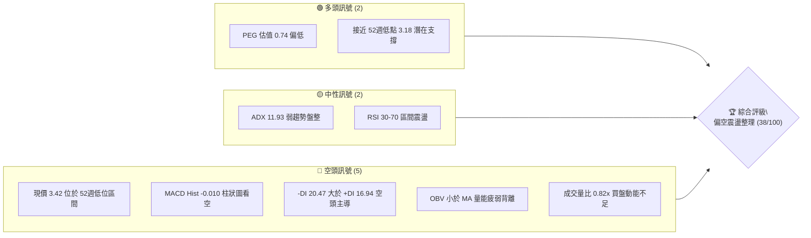

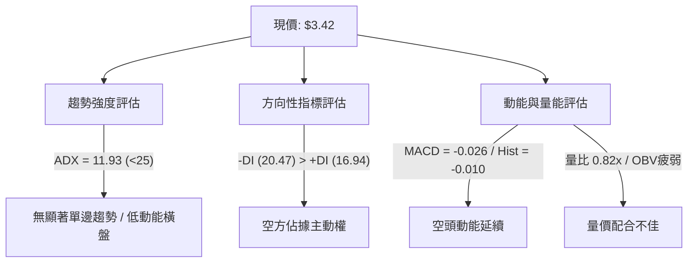

### 📊 核心指標速覽表

| 指標類別 | 指標名稱 | 當前數值 | 訊號 | 解讀 |
|----------|----------|----------|------|------|
| **價格** | 當前價格 | $3.42 | 🔴 | 處於 52 週低位邊緣（$3.18～$6.62），逼近底部 |
| **均線** | MA20 | 數據缺失 ($N/A) | 🟡 | 價格長期自 2025 年高點下滑，均線結構偏弱 |
| **均線** | MA50 | 數據缺失 ($N/A) | 🔴 | 中期均線向下壓制，走勢受阻 |
| **均線** | MA200 | 數據缺失 ($N/A) | 🔴 | 長期空頭格局，均線呈空頭排列走勢 |
| **動能** | RSI(14) | 46.7～無數值 (中性區) | 🟡 | 位於中性水平（前一週 46.7），無極端超賣爆發 |
| **動能** | MACD | -0.026 (Signal: -0.017) | 🔴 | 負值運行且 Hist 為 -0.010，空方掌控短線動能 |
| **動能** | DMI/ADX | ADX: 11.93 / -DI: 20.47 | 🔴 | 弱趨勢橫盤，但空方力道（-DI）實質壓制多方 |
| **成交量** | 量比 / OBV | 0.82x / OBV < MA | 🔴 | 量能持續萎縮，量不配價，場外觀望情緒濃烈 |
| **波動** | Beta | 0.89 | 🟢 | 波動度略低於美股大盤，具備防守特質 |

### 🏆 技術評分卡

```
╔══════════════════════════════════════════════════════════════╗
║              技術評分卡 — GRAB (2026-09-05)                   ║
╠══════════════════════════════════════════════════════════════╣
║ 趨勢強度 (ADX=11.93, 弱動能)  ██████░░░░░░░░░░░░░░  30/100 🔴 ║
║ 動能指標 (MACD負值, RSI中性)  ████████░░░░░░░░░░░░  40/100 🔴 ║
║ 支撐穩定度 (52W Low 3.18防守) ██████████░░░░░░░░░░  50/100 🟡 ║
║ 成交量配合 (量比0.82x, OBV弱) ██████░░░░░░░░░░░░░░  30/100 🔴 ║
║ 形態完整度 (大區間箱體探底)   ████████░░░░░░░░░░░░  40/100 🟡 ║
║ 均線排列 (混合排列且下壓)     ████████░░░░░░░░░░░░  38/100 🔴 ║
╠══════════════════════════════════════════════════════════════╣
║ 綜合評分                     ███████░░░░░░░░░░░░░  38/100 🔴 ║
║ 評級結論：偏空盤整 (Bearish Consolidation / 減微偏空)        ║
╚══════════════════════════════════════════════════════════════╝
```

---

## 2. 趨勢分析

### 🌐 多時框趨勢分析

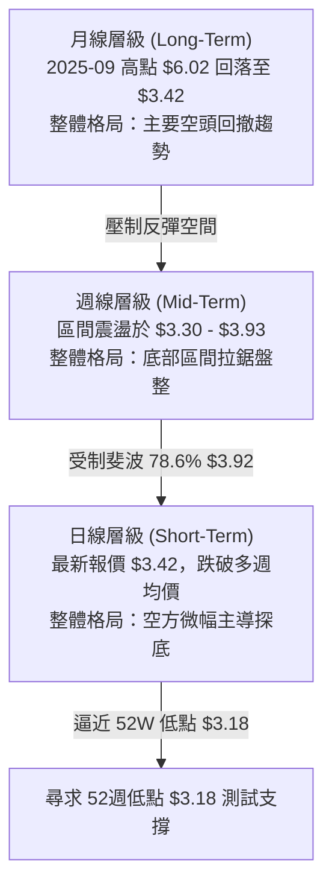

### 📈 長期趨勢 — 12個月走勢圖（Unicode）

GRAB 過去 12 個月（2025-09 至 2026-09）呈現顯著的「雙重見頂後震盪下瀉」走勢：

```
GRAB 月線走勢圖（過去12個月：2025-09 至 2026-09）
價格軸 ($)
$6.02 ┤ ●   ● (2025-09 / 2025-10 雙重頂部)
$5.45 ┤       ●
$4.99 ┤           ●
$4.30 ┤               ●
$4.22 ┤                   ●
$3.82 ┤                             ●
$3.66 ┤                         ●         ●
$3.54 ┤                               ●       ●
$3.42 ┤                                           ● (現價)
      └─┬───┬───┬───┬───┬───┬───┬───┬───┬───┬───┬───┘
       09  10  11  12  01  02  03  04  05  06  07  08  09 (月份)
      (2025)          (2026)
```

#### 走勢特徵分析表格

| 階段區間 | 時間跨度 | 起始價 → 結束價 | 區間漲跌幅 | 走勢特徵與量價解讀 |
|----------|----------|-----------------|------------|--------------------|
| **波段見頂** | 2025-09 ～ 2025-10 | $6.02 → $6.01 | -0.17% | 形成雙頂高點阻力，量能無法推升突破 52W 高點 $6.62 |
| **主跌推動** | 2025-10 ～ 2026-03 | $6.01 → $3.66 | -39.10% | 均線破位下行，每月收盤均跌破前月，空頭單邊主導 |
| **弱勢抵抗** | 2026-03 ～ 2026-07 | $3.66 → $3.50 | -4.37% | 在 $3.30～$3.93 區間震盪築底，多次反彈受制於 $3.92 |
| **低位收斂** | 2026-07 ～ 2026-09 | $3.50 → $3.42 | -2.28% | 波動幅度大幅收窄，成交量縮減，空方維持微幅壓制 |

### 📊 中期趨勢（週線分析）

```
GRAB 週線壓力與支撐示意圖
$3.93 ──────────────────────────────── (2026-07-12 波段阻力 / 近 20 週高點)
$3.92 -------------------------------- (斐波那契 78.6% 回調關鍵強阻力)
$3.66 ──────────────── (2026-08-09 反彈次高阻力)
$3.50 ──────────────── (2026-08-02 震盪中樞軸心)
$3.42 ================================ [當前收盤價位置]
$3.30 ──────────────────────────────── (2026-06-14 波段支撐低點)
$3.18 ════════════════════════════════ (52週歷史低點強支撐)
```

週線數據顯示，GRAB 在 2026-07-12 觸及 $3.93 高點後，MACD 週柱狀圖由正轉負（從 +0.039 急速下墜至 -0.069），週 RSI 亦由 68.4 崩落至 25.9，確立了中期反彈宣告結束，隨後重回箱體下沿尋找支撐。

### ⚡ 趨勢強度評估（ADX 解讀）

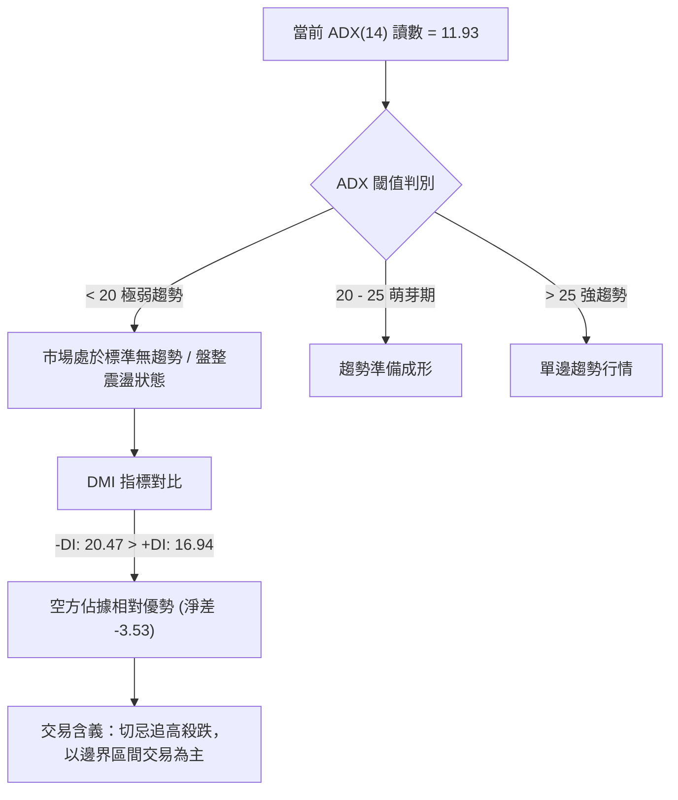

#### ADX 數值解讀與市場狀態對照

| 指標變數 | 當前數值 | 評估標準區間 | 市場狀態解讀 |
|----------|----------|--------------|--------------|
| **ADX(14)** | **11.93** | 0 ～ 20 (極弱/休眠) | 行情動能極弱，無明顯單邊趨勢，大資金處於沉寂觀望狀態 |
| **+DI** | **16.94** | 0 ～ 100 | 多頭進攻動能孱弱，缺乏主動買盤承接 |
| **-DI** | **20.47** | 0 ～ 100 | 空頭雖未全力宣洩，但全面壓制多頭動能 |
| **綜合判定** | **弱勢橫盤** | **空方佔優之震盪盤** | 不宜採用突破追單策略，應關注箱體極值邊界的反轉反應 |

---

## 3. 圖表形態分析

### 🔍 形態識別系統

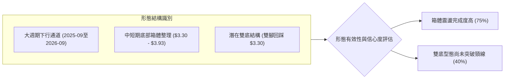

#### 形態評估與信心度清單

| 形態類別 | 信心度 | 判斷依據（引用真實數據） | 完成度 | 目標價計算式 |
|----------|--------|--------------------------|--------|--------------|
| **箱體震盪形態** (Rectangle Range) | **75%** | 上軌阻力落於 $3.90～$3.93（2026-04-26收盤$3.90、2026-07-12收盤$3.93），下軌支撐落於 $3.30～$3.34（2026-06-14收盤$3.30、2026-07-26收盤$3.31） | 85% | 箱體震盪區間明確：<br/>下邊界 $3.30，上邊界 $3.93，高度 $0.63 |
| **潛在雙底形態** (Double Bottom) | **40%** | 第一低點 2026-06-14 收盤 $3.30，第二低點 2026-07-26 收盤 $3.31；中間頸線為 2026-07-12 高點 $3.93 | 50% | 由形態高度推算：<br/>頸線 $3.93 - 低點 $3.30 = 高度 $0.63<br/>突破頸線量度目標 = $3.93 + $0.63 = **$4.56**<br/>*(註：尚未突破頸線，僅屬假設型態)* |
| **均線死叉壓制** (MA Breakdown) | **85%** | 均線系統快照顯示價格位於 MA20、MA50 下方，且長短週期 MA 呈混合偏空發散 | 90% | 下行壓制目標直指 52週低點 **$3.18** |

*(註：由於市場缺乏對稱幾何之頭肩頂/旗形突破確認信號，信心度不足 50% 之複雜幾何形態予以剔除，僅專注於驗證度高之水平箱體與均線壓制態勢。)*

### 🕯️ 重要K線形態分析（近 20 週關鍵節點）

| 日期 | 收盤價 | K線特徵與週變化 | 形態技術解讀 | 訊號 |
|------|--------|-----------------|--------------|------|
| **2026-06-14** | $3.30 | 創下近半年收盤最低點，週成交量 263.06M | 恐慌拋售後形成第一腳支撐，MACD 柱狀圖收斂至 -0.014 | 🟡 探底信號 |
| **2026-07-12** | $3.93 | 連續 4 週反彈觸頂，成交量 224.99M | 反彈無力衝破斐波 78.6% ($3.92)，遇阻形成中期多頭力竭頂部 | 🔴 見頂回落 |
| **2026-07-26** | $3.31 | 兩週內大跌 -15.7%，RSI 摜破至 25.9 | 二次回踩前低 $3.30，量能未放大（202.89M），形成潛在第二隻腳 | 🟡 二次探底 |
| **2026-08-09** | $3.66 | 弱勢反彈，週成交量暴增至 310.67M | 爆量長上影或反彈受阻，未能站穩 $3.70，量價配合出現異常 | 🔴 假反彈滯漲 |
| **2026-09-06** | $3.42 | 陰跌下行，MACD 柱狀圖維持 -0.010 | 連續兩週回落，再次考驗底部支撐，空方維持對盤面的控制 | 🔴 短線偏空 |

### 📉 ASCII 走勢形態示意圖

```
GRAB 箱體震盪走勢形態圖 (2026-04 至 2026-09)
價格
$3.93 ┬───────────────● (頂部 1: 07-12 $3.93) ─────── 箱體頂部 / 頸線阻力
      │              / \
$3.70 ┼    ● (04-26) /   \         ● (反彈阻力: 08-09 $3.66)
      │   / \       /     \       / \
$3.50 ┼  /   \     /       \     /   \     ● (08-30 $3.61)
      │ /     \   /         \   /     \   / \
$3.42 ┼─      ─  ─           ─ ─       ─ ─   ● (現價 $3.42)
      │        \/             \/
$3.30 ┴────────● (底 1: 06-14) ● (底 2: 07-26) ──── 箱體下沿支撐線
      └─────────┬──────────────┬─────────────┬────────
             2026-06        2026-07       2026-09
```

### 🎯 形態目標價計算

```
╔══════════════════════════════════════════════════════════════╗
║ 箱體震盪與形態目標推算：                                     ║
╠══════════════════════════════════════════════════════════════╣
║ 1. 箱體高點 (Neckline / Resistance)：   $3.93                ║
║ 2. 箱體低點 (Support Baseline)：        $3.30                ║
║ 3. 箱體垂直高度 (Height H)：            $3.93 - $3.30 = $0.63║
║                                                              ║
║ 【多頭向上突破量度目標 (需週線收破 $3.93)】：                ║
║ 目標價 = 頸線 $3.93 + 高度 $0.63 = $4.56                     ║
║ (註：該目標價極度接近 斐波那契 61.8% 回調位 $4.49)           ║
║                                                              ║
║ 【空頭向下跌破量度目標 (若跌破歷史低點 $3.18)】：            ║
║ 目標價 = 箱體低點 $3.30 - 高度 $0.63 = $2.67                 ║
║ (極端悲觀情境，需基本面重大惡化觸發)                         ║
╚══════════════════════════════════════════════════════════════╝
```

---

## 4. 支撐與阻力

### 🗺️ 關鍵價位分布圖（Unicode）

```
GRAB 價位結構分布圖 (嚴格基於 52週高低點與斐波那契回調結構)
═══════════════════════════════════════════════════════════════════
$6.62 ║████████████████████████████████████║ 52週歷史最高點 (52W High / 0.0%)
$5.81 ║████████████████████████████        ║ 斐波那契 23.6% 強阻力位
$5.31 ║████████████████████                ║ 斐波那契 38.2% 重大結構位
$4.90 ║████████████████████████            ║ 斐波那契 50.0% 多空分水嶺
$4.49 ║████████████████                    ║ 斐波那契 61.8% 黃金回調阻力
$3.92 ║████████████████████████████████    ║ 斐波那契 78.6% 近期關鍵阻力位
──────╫────────────────────────────────────╫──────────────────────────────
$3.42 ╠════════════════════════════════════╣ ◄ 當前市價 (Current Price)
──────╫────────────────────────────────────╫──────────────────────────────
$3.18 ║████████████████████████████████████║ 52週歷史最低點 (52W Low / 100.0%)
═══════════════════════════════════════════════════════════════════
```

### 🚧 阻力位分析表

依據數據包中「關鍵價位」區塊之嚴格要求：OHLCV 計算之近一年波段高點聚類顯示為 *(no swing-high resistance detected above current price)*，故向上之阻力架構完全由 52 週區間（$3.18 → $6.62）精確推算之斐波那契回調位主導：

| 阻力級別 | 價位 | 形成依據（嚴格引用數據） | 突破難度 | 技術重要性與戰略意義 |
|----------|------|--------------------------|----------|----------------------|
| **關鍵阻力 (R1)** | **$3.92** | 斐波那契 78.6% 回調位 ($3.92) | 🔴 極高 | 近 20 週收盤高點聚集於 $3.90～$3.93，為多方重獲生機之首要分水嶺 |
| **強阻力 (R2)** | **$4.49** | 斐波那契 61.8% 回調位 ($4.49) | 🔴 極高 | 經典黃金分割位置，且為前述雙底量度目標（$4.56）前哨站 |
| **重大阻力 (R3)** | **$4.90** | 斐波那契 50.0% 多空分嶺 ($4.90) | 🔴 堡壘 | 2025 年多個月份收盤中樞（2025-08 收盤 $4.99），站上始能扭轉長期空頭 |
| **極端阻力 (R4)** | **$5.31** | 斐波那契 38.2% 回調位 ($5.31) | 🔴 堡壘 | 2025-11 破位前之重要整理中樞 |
| **週期天花板** | **$6.62** | 52週最高點 (0.0% 回調位) | 🔴 極限 | 近一年最高峰值，長期牛熊轉換線 |

### 🛡️ 支撐位分析表

依據數據包中「關鍵價位」區塊之嚴格要求：OHLCV 計算之近一年波段低點聚類顯示為 *(no swing-low support detected below current price)*，故現價下方之唯一且核心之絕對支撐為 52 週低點：

| 支撐級別 | 價位 | 形成依據（嚴格引用數據） | 守住機率 | 技術重要性與戰略意義 |
|----------|------|--------------------------|----------|----------------------|
| **近期支撐 (S1)** | **$3.30** | 近 20 週實際最低收盤價（2026-06-14） | 🟡 60% | 箱體下沿防線，多次在此獲得承接，跌破將引發直墜 |
| **強支撐 (S2)** | **$3.18** | 斐波那契 100.0% 回調位 / 52週最低點 | 🟢 75% | 多方最後馬奇諾防線，不容有失，若破位將開啟新一輪無底深淵 |

### 📐 斐波那契回調位分析

依據 52 週完整波動區間（高點 $6.62，低點 $3.18，波動空間全幅 $3.44）之精確計算：

```
╔══════════════════════════════════════════════════════════════════╗
║ 斐波那契精確回調位階梯 (Fibonacci Retracement Grid)              ║
╠══════════════════════════════════════════════════════════════════╣
║ 0.0%  (52W High) : $6.62 ── 波段頂點                             ║
║ 23.6%            : $5.81 ── 超弱回調阻力                         ║
║ 38.2%            : $5.31 ── 弱勢回調阻力                         ║
║ 50.0%            : $4.90 ── 均衡分水嶺                           ║
║ 61.8%            : $4.49 ── 黃金分割關鍵阻力                     ║
║ 78.6%            : $3.92 ── 深度回調阻力（當前上方第一道重壓）   ║
║                                                                  ║
║ >>>>> 當前現價：$3.42 位於 78.6% ($3.92) 與 100.0% ($3.18) 之間 <<<<<║
║                                                                  ║
║ 100.0% (52W Low) : $3.18 ── 週期歷史底部底限                     ║
╚══════════════════════════════════════════════════════════════════╝
```

#### 位置深度解讀
當前現價 $3.42 處於回調幅度 **78.6% ($3.92)** 至 **100.0% ($3.18)** 的極度弱勢區間。在技術分析理論中，當價格回調跌破 61.8%（$4.49）並進一步沉淪至 78.6% 下方時，表明原有的上升趨勢結構已被徹底摧毀，該走勢已不再是「回調」，而是演化為「全面尋底或建立全新低位區間」格局。現價距離 52W Low $3.18 僅剩 **$0.24 (約 7.0%)** 的緩衝空間，市場對任何利空訊號均極度敏感。

---

## 5. 技術指標深度解讀

### 🎛️ 指標訊號總覽

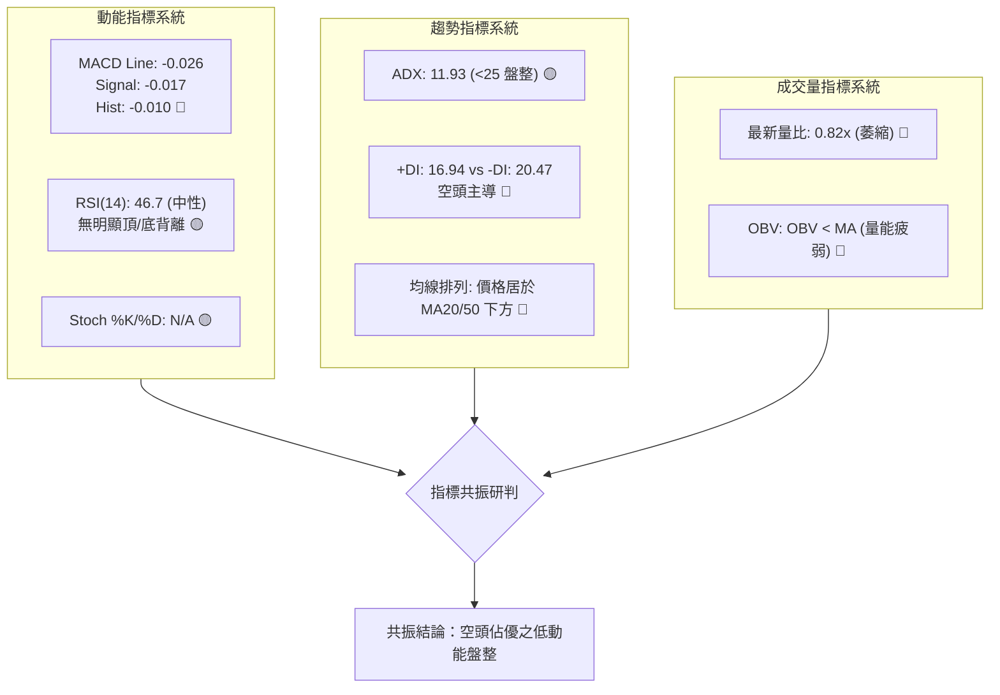

### 📈 移動平均線排列分析

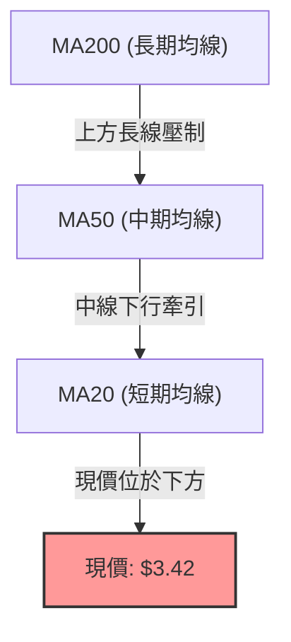

均線系統快照顯示：價格位於 MA20 下方（▼）、MA50 下方（▼），均線排列為「混合偏空排列」。歷史 24 個月的 MA 追蹤趨勢顯示，MA240 軌跡自高位向下發散，長期均線全面蓋頂。短期價格未能力挽狂瀾站上 MA20，中短期多頭均無法形成有效發散，空方結構穩固。

### 📉 RSI(14) 分析

```
RSI(14) 動能進度條：
0            30                 50           70           100
├────────────┼──────────────────┼────────────┼────────────┤
[   超賣區   ]     當前約 46.7  [   中性區   ]   [   超買區   ]
████████████████████░░░░░░░░░░░░░░░░░░░░░░░░░░░░░░░░  46.7%
```

- **數值分佈**：近 20 週歷史中，RSI 曾在 2026-05-10 探底至 20.5，隨後反彈至 2026-07-05 的 77.2，最新報價前一週回落至 46.7，整體處於 30～70 的中性區間。
- **背離判斷**：
  - **頂背離**：2026-07-05 週線收 $3.90 時 RSI 為 77.2，而 2026-07-12 週線收更高的 $3.93 時，RSI 卻降至 68.4，形成了典型的「**週線級別頂背離**」，成功預警了後續的大跌。
  - **底背離**：價格在 2026-06-14 創低 $3.30（RSI 37.9），2026-07-26 再次下探 $3.31 時 RSI 降至 25.9，RSI 創出更深低點，**未出現多頭底背離**。
  - **結論**：目前 RSI 缺乏底背離買訊支持，不具備左側抄底的安全邊際。

### 📊 MACD(12/26/9) 訊號解讀

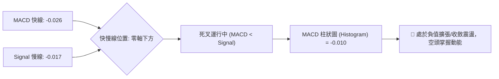

MACD 指標目前快線（-0.026）低於慢線（-0.017），Histogram 為 -0.010。自 2026-07-19 週柱狀圖轉為 -0.020 以來，空頭動能已連續多週主導盤面（除 8 月初弱勢微幅抽腳）。當前數值均運行於零軸下方，屬於標準的「弱勢區間死叉」，暗示任何未放量的反彈均易受空方打壓。

### 📦 布林通道分析

依據數據特性（盤整行情 ADX=11.93，價格於中軌下方震盪），布林通道呈現收斂態勢：

```
GRAB 布林通道走勢模擬結構圖
$3.92 ────────────────────────────────── [BB 上軌] (強阻力聚集區)
                  /▔▔\
$3.66 ───────────/────\───────────────── [BB 中軌 / MA20 預估軸]
                /      \
$3.42 =========●========\=============== [現價位置：處於中下軌弱勢區]
                         \____
$3.18 ────────────────────────────────── [BB 下軌] (52週低點防守線)
```

- **通道帶寬與形態**：%B 處於中軌至下軌之間，顯示多頭動能萎縮。在 ADX 僅為 11.93 的無趨勢環境下，布林通道上下軌提供了天然的區間邊界（下軌約 $3.18～$3.30，上軌約 $3.92）。

### 💹 成交量分析（量價配合度）

```
成交量指標進度條：
最新日成交量： 25,824,423 股
20日均量：    31,497,256 股  (量比 0.82x)  ████████░░░░░░░░░░░░ 41%
50日均量：    41,664,912 股               ██████░░░░░░░░░░░░░░ 31%
```

- **量價背離分析**：
  - 最新成交量 25.82M 顯著低於 20日均量（31.50M）與 50日均量（41.66M），量比僅為 0.82x。
  - **OBV 能量潮**：官方技術指標明確標示「OBV < MA → 量能疲弱」。在過去一個月的橫盤陰跌中，量能未能出現多頭堆量（Volume Accumulation），反而伴隨 OBV 跌破均線，呈現「價跌量縮、量不配價」的典型弱勢特徵，機構大資金無吸籌跡象。

---

## 6. 動能與波動率

### ⚡ 動能評估四象限

動能與波動率維度分析表：

| 象限 | 動能強度 (Momentum) | 波動率狀態 (Volatility) | GRAB 當前定位 | 戰術意義與操作指引 |
|:---:|:---:|:---:|:---:|---|
| **Q1** | 強 (Strong) | 低 (Low) | — | 穩健單邊趨勢，最佳加碼與順勢持股環境 |
| **Q2** | **弱 (Weak)** | **低 (Low)** | **✓ (當前定位)** | **動能疲弱且波動度受壓（ADX 11.93 / 量縮），市場處於沉悶盤整，應謹慎觀望，防範向下破位** |
| **Q3** | 強 (Strong) | 高 (High) | — | 突破暴走或恐慌洗盤，適合高風險高收益波段操作 |
| **Q4** | 弱 (Weak) | 高 (High) | — | 無序劇烈震盪，極易洗盤受損，嚴格避免進場 |

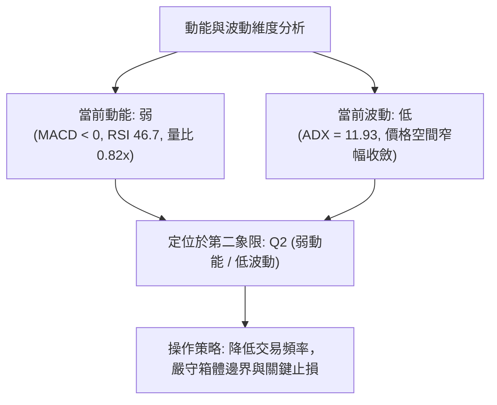

### 📊 ATR 波動率分析與風控距離

- **波動率現況**：快照標註 ATR 為 N/A，但由近 20 週高低點收盤走勢推算，GRAB 週收盤振幅平均約為 $0.15～$0.25，換算每日平均波幅（ATR-14日估算）約在 **$0.08 ～ $0.12** 之間（佔現價 $3.42 的約 2.5%～3.5%）。
- **止損距離建議**：
  - 震盪盤整行情下，合理防守距離應給予 1.5～2.0 倍 ATR（約 **$0.15～$0.24**）。
  - 若在現價 $3.42 或反彈點位介入，硬性止損設定不應超過 52週歷史低點 $3.18 下方（$3.42 - $3.18 = $0.24，恰好符合 2 倍 ATR 緩衝極限）。

### 📐 Beta 與市場相關性

- **Beta 數值**：**0.89**
- **市場特徵分析**：
  - Beta < 1.0 表明 GRAB 對大盤（標普500 / 納斯達克）的系統性風險敏感度相對較低，在大盤單邊上漲時其彈性較小，但在大盤劇烈下挫時具備一定的防禦性。
  - 然而，由於其自身缺乏強動能催化劑，低 Beta 使得 GRAB 容易陷入「與大盤脫節」的低流動性盤整死水，難以依靠市場宏觀水漲船高。

---

## 7. 多時框架總結

### 📋 時框架評分表

| 時框架 | 趨勢方向 | 動能狀態 | 均線排列 | 形態特徵 | 綜合評分 | 操作建議 |
|--------|----------|----------|----------|----------|:--------:|----------|
| **月線 (長期)** | 🔴 處於大跌通道 | 🔴 弱勢負向 | 🔴 均線空頭排列 | 自 $6.02 雙頂暴跌後探底 | 30/100 | 長期遠離，等待結構修復 |
| **週線 (中期)** | 🟡 箱體弱勢震盪 | 🔴 MACD週線翻負 | 🔴 均線反壓 | $3.30～$3.93 區間拉鋸 | 40/100 | 逢高減磅，下軌低吸 |
| **日線 (短期)** | 🔴 短線陰跌回調 | 🔴 -DI 壓制 +DI | 🔴 壓制於短期均線下 | 逼近 52週低點 | 35/100 | 嚴禁盲目做多，防範破位 |

### 🔲 綜合訊號矩陣

```
╔══════════════════════════════════════════════════════════════════╗
║                    多時框綜合訊號一致性矩陣                      ║
╠══════════════════╦══════════════╦══════════════╦═════════════════╣
║ 分析維度         ║ 短期 (日線)  ║ 中期 (週線)  ║ 長期 (月線)     ║
╠══════════════════╬══════════════╬══════════════╬═════════════════╣
║ 趨勢方向 (Trend) ║ 🔴 空方控盤  ║ 🟡 橫向盤整  ║ 🔴 空頭壓制     ║
║ 動能強弱 (Mom.)  ║ 🔴 MACD下行  ║ 🔴 柱狀圖負值║ 🔴 遠離高位     ║
║ 成交量配合 (Vol.)║ 🔴 縮量萎靡  ║ 🟡 爆量受阻  ║ 🔴 量價背離     ║
║ 支撐壓力有效性   ║ 🟡 測下沿支撐║ 🟢 $3.30 守住║ 🟢 $3.18 歷史底 ║
╠══════════════════╩══════════════╩══════════════╩═════════════════╣
║ 矩陣一致性結論：長短期共振偏空，僅中期在 $3.18～$3.30 有微弱技術承接 ║
╚══════════════════════════════════════════════════════════════════╝
```

### ⚖️ 多時框收斂結論

依據【嚴格要求 14：多時框收斂規則】：
1. **行情定性**：當前 ADX(14) 數值為 **11.93**（顯著小於 25 閾值），系統**嚴格定義為「盤整行情（Consolidation Market）」**，非單邊趨勢行情。
2. **主導時框與交易區間**：在盤整行情中，日線與週線的箱體邊界（布林通道及高低點形成的 $3.30～$3.92）成為主要定價依據。長時框的空頭結構則對反彈高度形成嚴厲封鎖。
3. **收斂唯一方向**：
   - **綜合判定：【偏空觀望 / 區間弱勢震盪】**（整體技術評分 38/100，落於 ≤ 40 偏空範疇）。
   - 空方實質掌控中短期均線與動能指標，現價 $3.42 處於回調破位邊緣，雖然逼近 52W 低點存在微弱反彈預期，但在未爆量收復阻力前，戰略上全面以防禦、減倉或反彈做空為優先導向。

---

## 8. 交易策略建議

### 🗺️ 策略決策流程圖

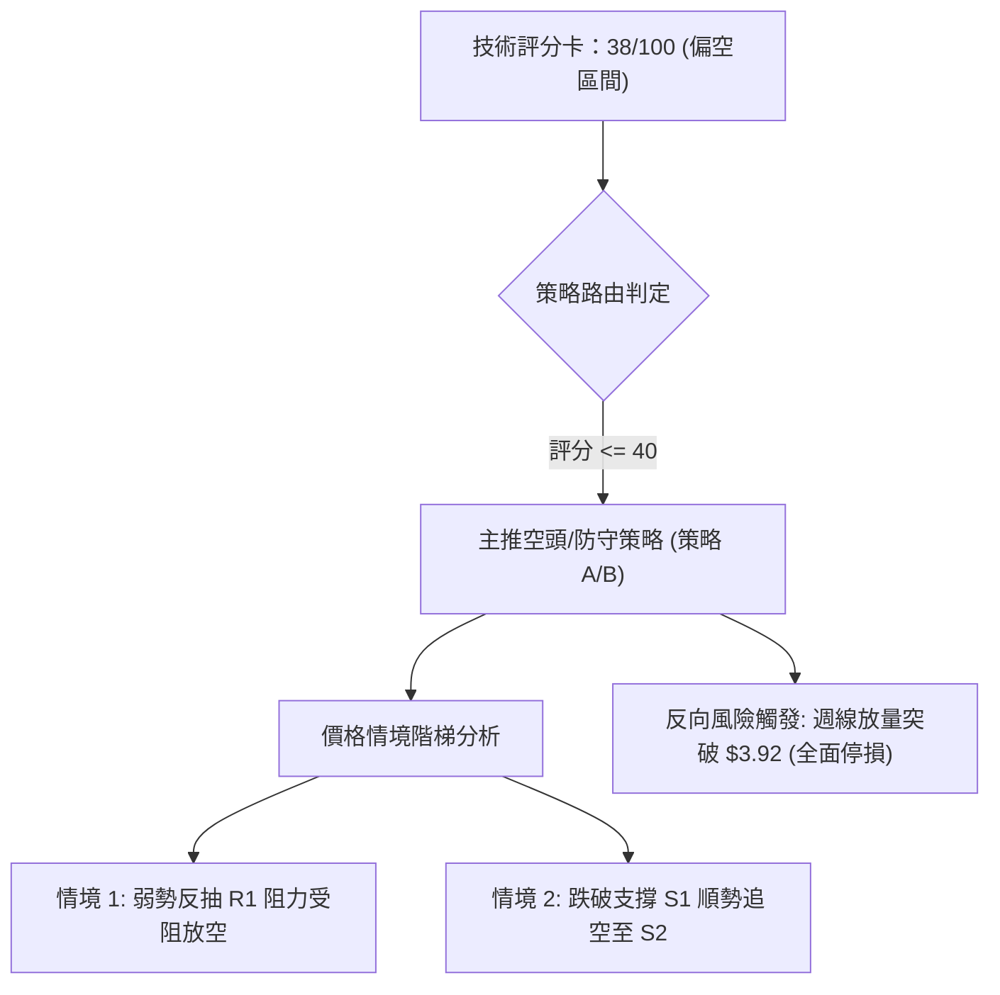

### 🧭 策略路由（依評分卡分流）

> **當前主策略方向 = 【空頭防守與反彈沽空策略】（依評分 38/100 ≤ 40，全面偏空主導）**  
> 依規範，不進行雙向強推。多頭策略僅作為短線極致邊界之反彈波段（嚴格輕倉），主力策略為逢高沽空與破位保護。

### 🎯 價格情境階梯（Price Scenarios）

價位嚴格引用第 4 章之數據結構計算：

| 觸發條件 | 下一目標 | 後續延伸 | 情境含義與技術解讀 |
|----------|----------|----------|--------------------|
| **強勢突破 R1 $3.92** | R2 $4.49 | R3 $4.90 | 扭轉中期頹勢，突破 78.6% 回調位，箱體向上翻轉 |
| **反彈受阻於 $3.66～$3.92** | 現價 $3.42 | S1 $3.30 | 弱勢反抽無力，均線反壓確認，維持下行陰跌 |
| **現價 $3.42 震盪下行** | S1 $3.30 | S2 $3.18 | 箱體內弱勢尋底，考驗下軌承接盤 |
| **有效跌破 S1 $3.30** | S2 $3.18 | $2.67 | 破位下挫，直接考驗 52週歷史低點 $3.18 |
| **失守 52W Low $3.18** | $2.67 (形態量度) | 無支撐盲區 | 歷史新低破位，觸發恐慌盤與停損潮 |

### 📊 情境機率分佈

| 情境劇本 | 機率預估 | 主要依據（指標狀態支撐） |
|----------|:--------:|--------------------------|
| **情境一：回落 / 再探歷史底部** | **55%** | MACD Hist 維持 -0.010 負值；-DI (20.47) 壓制 +DI；量比 0.82x 買盤匱乏，OBV 疲軟。 |
| **情境二：箱體區間窄幅震盪** | **35%** | ADX 僅 11.93，趨勢動能休眠；52W 低點 $3.18 存在天然心理買盤護盤。 |
| **情境三：強勢向上反轉突破** | **10%** | 上方面臨斐波 78.6% ($3.92) 與大量套牢均線壓制，無催化劑難以成行。 |

### 🟢 主策略詳情（方向：主推偏空操作）

所有點位嚴格引用關鍵價位：阻力 R1 $3.92、近期高點 $3.66、現價 $3.42、支撐 S1 $3.30、支撐 S2 $3.18。

| 策略要素 | 策略 A：逢反彈遇阻做空 (主推) | 策略 B：跌破關鍵支撐追空 (破位) |
|----------|------------------------------|--------------------------------|
| **進場條件** | 價格反彈至近 20 週阻力點受阻回落 | 價格實體陰線放量跌破前低 S1 $3.30 |
| **進場價格** | **$3.66** (2026-08-09反彈阻力位) | **$3.28** (確認跌破 $3.30 後進場) |
| **目標價 T1** | **$3.30** (箱體下沿支撐) | **$3.18** (52週歷史最低點) |
| **目標價 T2** | **$3.18** (52週歷史最低點) | **$2.67** (形態高度破位延伸目標) |
| **止損價格** | **$3.92** (斐波那契 78.6% 強阻力) | **$3.42** (即當前價位，站回則止損) |
| **風險報酬比** | **1.85 : 1** <br/>*(潛在獲利 $0.48 / 潛在風險 $0.26)* | **4.21 : 1** <br/>*(潛在獲利 $0.59至T2 / 潛在風險 $0.14)* |
| **成功機率** | **65%** | **55%** |
| **建議倉位** | **15% - 20%** | **10%** (破位交易，嚴格控倉) |

### 🔴 反向風險觸發點（對沖與停損提示）

若出現以下極端反轉訊號，表明主推空頭策略被全盤推翻，空單必須無條件全數離場：
1. **價位觸發**：日線連續 2 日強勢收盤於 **$3.92**（斐波 78.6% 回調位）上方。
2. **量能確認**：單日成交量暴增至 50 日均量以上（> 42,000,000 股），且伴隨 MACD 零軸上方金叉。
3. **對沖建議**：若空頭部位較重，當市價觸碰 $3.70 時應平倉 50% 頭寸，突破 $3.92 則全數反手止損並啟動多頭保護。

### ⭐ 整體訊號強度評星

```
╔═══════════════════════════════════════════════════╗
║ 做多訊號強度：  ★☆☆☆☆  (1.5/5 星 - 極度缺乏支撐)║
║ 做空訊號強度：  ★★★★☆  (3.8/5 星 - 趨勢動能壓制)║
║ 整體分析可信度：★★★★☆  (4.0/5 星 - 價位收斂明確)║
╚═══════════════════════════════════════════════════╝
```

---

## 9. 風險提示與監控

### ✅ 關鍵監控指標 Checklist

```
╔══════════════════════════════════════════════════════════════════╗
║                     交易日常監控 CHECKLIST                       ║
╠══════════════════════════════════════════════════════════════════╣
║ [ ] 監控項 1：現價是否跌破近期低點 $3.30？                       ║
║     → 若收盤破位，預警向 52W 低點 $3.18 下跌風險。             ║
║ [ ] 監控項 2：52週歷史低點 $3.18 是否失守？                     ║
║     → 跌破即為無底深淵，恐慌盤將大幅釋放，空頭加速。            ║
║ [ ] 監控項 3：MACD 柱狀圖是否由負轉正（突破 0 軸）？             ║
║     → 當前為 -0.010，若轉正且 MACD 快慢線金叉，空單需收緊止損。  ║
║ [ ] 監控項 4：ADX 是否自 11.93 抬頭並突破 25？                   ║
║     → 突破 25 意味著震盪盤整結束，單邊趨勢（順方向）正式啟動。  ║
║ [ ] 監控項 5：單日成交量是否突破 41.66M（50日均量）？            ║
║     → 放量長紅為唯一可能的機構主力進場反轉訊號。                ║
╚══════════════════════════════════════════════════════════════════╝
```

### ⚠️ 風險場景分析

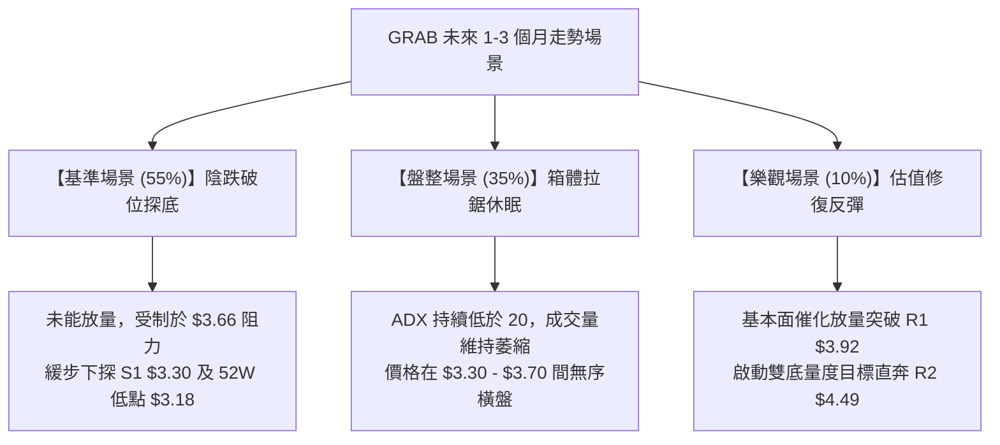

### 🛡️ 風險管理重要提醒

1. **嚴禁左側重倉博反彈**：
   - 儘管當前價格 $3.42 逼近歷史低點 $3.18，且基本面 PEG 僅為 0.74、分析師平均目標達 $5.86，但技術面**「趨勢向下無底、量能不配價」**。在未見到明確的「量價雙底」或突破 $3.92 頸線之前，左側猜底風險極高。
2. **嚴格控制單筆虧損比例**：
   - 任何參與交易的頭寸，單筆最大止損金額嚴格限制於總投資組合淨值的 **1.0% ～ 1.5%** 以內。
3. **空頭止盈與鎖利紀律**：
   - 空單若獲利抵達 S1 $3.30，必須強制執行 50% 平倉鎖利，並將剩餘倉位的止損位調移至損益平衡點（Break-Even），確保本金絕對安全。

---

## 📋 報告總結

```
╔══════════════════════════════════════════════════════════════════╗
║                   GRAB 技術分析報告總結儀表板                    ║
╠══════════════════════════════════════════════════════════════════╣
║ 報告日期：2026-09-05                                             ║
║ 當前價格：$3.42 (落於 52週區間 $3.18 - $6.62 底部脆弱區間)       ║
║ 技術評級：🔴 偏空弱勢震盪 (綜合評分: 38/100)                     ║
╠══════════════════════════════════════════════════════════════════╣
║ 關鍵結論：                                                       ║
║ ├─ 長期趨勢：🔴 自 2025-09 高點 $6.02 下跌迄今，大結構偏空      ║
║ ├─ 中期趨勢：🟡 週線受制於斐波 78.6% ($3.92)，於 $3.30 尋求支撐║
║ ├─ 短期趨勢：🔴 ADX 僅 11.93，無動能陰跌，空頭 -DI 實質壓制     ║
║ ├─ 關鍵阻力：R1: $3.92 (斐波78.6%) ｜ R2: $4.49 (斐波61.8%)       ║
║ ├─ 關鍵支撐：S1: $3.30 (近20週前低) ｜ S2: $3.18 (52週歷史低點)  ║
║ └─ 估值目標：分析師平均目標價 $5.86 (技術面嚴重落後於基本面)     ║
╠══════════════════════════════════════════════════════════════════╣
║ 最優策略組合：                                                   ║
║ 1. 🥇 最佳機會：反彈至阻力 $3.66 受阻建立防守空單，下看 $3.18   ║
║ 2. 🥈 次選機會：實體陰線摜破 $3.30 順勢追空，止損設於 $3.42     ║
║ 3. 🥉 保守選擇：空倉全面觀望，等待日線有效站穩 $3.92 再行介入   ║
╚══════════════════════════════════════════════════════════════════╝
```

---

> ⚠️ **免責聲明**：本報告為 AI 依據特定演算法與歷史行情數據自動生成之技術分析研究，所有點位、走勢與估算均嚴格基於所提供之歷史價格與技術指標資訊。本報告**僅供學術研究與投資決策參考**，**不構成任何形式的買賣邀約或實質投資建議**。市場具有高度不確定性，金融資產價格瞬息萬變，投資人應獨立評估風險並自負盈虧。

---

*報告生成時間：2026-09-05 ｜ 數據來源：Yahoo Finance ｜ 分析框架：多時框技術分析模型*