# GRAB 技術分析報告

> **報告日期**：2026-09-06 ｜ **語言**：繁體中文 ｜ **數據來源**：Yahoo Finance ｜ **當前價格**：$3.42

---

## 目錄

| 章節 | 內容 |
|------|------|
| [1. 技術面概覽](#1-技術面概覽) | 訊號儀表板、核心指標、評分卡 |
| [2. 趨勢分析](#2-趨勢分析) | 多時框趨勢、長中短期走勢、ADX 解讀 |
| [3. 圖表形態分析](#3-圖表形態分析) | 形態識別、K線組合、目標價計算 |
| [4. 支撐與阻力](#4-支撐與阻力) | 關鍵價位、斐波那契回調結構 |
| [5. 技術指標深度解讀](#5-技術指標深度解讀) | 均線系統、動能震盪、布林通道、量價結構 |
| [6. 動能與波動率](#6-動能與波動率) | 動能四象限、ATR 止損測算、Beta 敏感度 |
| [7. 多時框架總結](#7-多時框架總結) | 時框架評分矩陣、多時框收斂定論 |
| [8. 交易策略建議](#8-交易策略建議) | 策略路由、情境階梯、進出場矩陣、風控提示 |
| [9. 風險提示與監控](#9-風險提示與監控) | 監控清單、情境分支樹、倉位管理準則 |
| [10. 報告總結](#10-報告總結) | 總結面盤與核心結論速覽 |

---

## 1. 技術面概覽

### 🎯 技術訊號儀表板

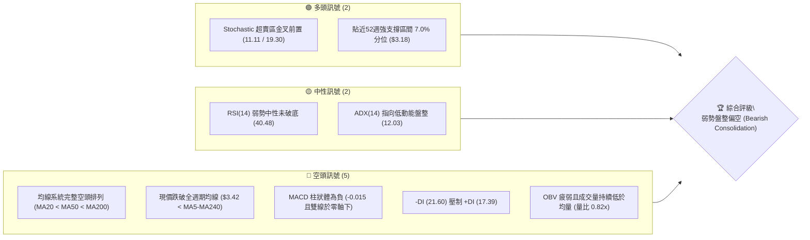

### 📊 核心指標速覽表

| 指標類別 | 指標名稱 | 當前數值 | 訊號 | 解讀 |
|----------|----------|----------|------|------|
| **價格** | 當前價格 | $3.42 | 🔴 | 位於 52 週區間底端（7.0%），逼近波段歷史低點 |
| **均線** | MA20 | $3.56 | 🔴 | 現價位於 MA20 下方 -3.95%，短期趨勢受制於下彎中軌 |
| **均線** | MA50 | $3.62 | 🔴 | 價格低於中期生命線 -5.52%，中期趨勢維持下行 |
| **均線** | MA200 | $4.04 | 🔴 | 長期牛熊分界線下行至 $4.04，長期架構全面由空方主導 |
| **動能** | RSI(14) | 40.48 | 🟡 | 位於弱勢中性區（30–50），尚未進入極端超賣，無背離 |
| **動能** | MACD (12,26,9) | 柱狀體 -0.015 | 🔴 | DIF (-0.033) 低於 DEA (-0.018)，且均在零軸之下發散 |
| **擺動** | Stoch %K / %D | 11.11 / 19.30 | 🟢 | 進入極端超賣區間，短線存在技術性跌深反抽需求 |
| **趨勢** | ADX (14) | 12.03 | 🟡 | 數值遠低於 25，單邊趨勢動能衰退，轉入低波動弱勢盤整 |
| **通道** | 布林通道 %B | 0.11 | 🟡 | 逼近下軌 $3.38，下軌發揮短線動態支撐，空間受壓制 |
| **量能** | 20日成交量比 | 0.82x | 🔴 | 量能降至 25.86M（均量 31.50M），OBV < MA 顯示資金流出 |
| **波動** | ATR(14) | $0.11 | 🟢 | ATR 佔股價 3.28%，波動幅度收斂，醞釀箱體震盪 |

### 🏆 技術評分卡

```
╔══════════════════════════════════════════════════════════════════╗
║                   技術評分卡 — GRAB (2026-09-06)                 ║
╠══════════════════════════════════════════════════════════════════╣
║ 趨勢強度 (Trend)     ██████░░░░░░░░░░░░░░  30/100  🔴 空頭壓制  ║
║ 動能指標 (Momentum)  ████████░░░░░░░░░░░░  40/100  🟡 弱勢修復  ║
║ 支撐穩定度 (Support) ██████████░░░░░░░░░░  50/100  🟡 考驗前低  ║
║ 成交量配合 (Volume)  ██████░░░░░░░░░░░░░░  30/100  🔴 量能萎縮  ║
║ 形態完整度 (Pattern) ████████░░░░░░░░░░░░  40/100  🟡 箱體拉鋸  ║
║ 均線排列 (Moving Avg)████░░░░░░░░░░░░░░░░  20/100  🔴 空頭排列  ║
╠══════════════════════════════════════════════════════════════════╣
║ 綜合評分             ███████░░░░░░░░░░░░░  35/100  🔴 偏空盤整  ║
╚══════════════════════════════════════════════════════════════════╝
```

---

## 2. 趨勢分析

### 🌐 多時框趨勢分析

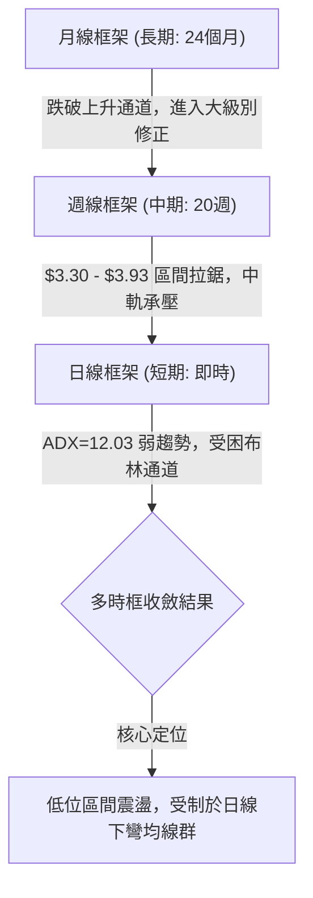

### 📈 長期趨勢 — 12個月走勢圖（Unicode）

GRAB 於 2025 年秋季創下 $6.02 之階段高點後，展開長達一年之深幅修正。以下為過去 12 個月收盤走勢追蹤：

```
GRAB 月線走勢圖（2025-09 至 2026-09）
價格軸 ($)
$6.02 ┤ ●(高點)
$5.75 ┤  \●
$5.45 ┤   \   ●
$4.99 ┤    \   \  ●
$4.30 ┤     \   \  \  ●
$4.00 ┤      \   \  \   ●
$3.70 ┤       \   \  \   \   ●       ●       ●
$3.42 ┤        \   \  \   \   \  ●    \  ●    \  ●←現價 $3.42
$3.18 ┤         \   \  \   \   \  \    \  \    \  ●(52W低點)
      └────────────────────────────────────────────────────────
       09  10  11  12  01  02  03 04  05 06  07 08 09 (月份)
```

#### 長期走勢特徵分析

| 階段 | 涵蓋月份 | 區間價格變動 | 漲跌幅 | 結構性特徵 |
|------|----------|--------------|--------|------------|
| 頂部構築與見頂 | 2025-09 ~ 2025-10 | $6.02 → $6.01 | -0.17% | 雙頂高位滯漲，觸及 52 週頂部阻力（$6.62）後動能枯竭 |
| 主跌段加速下跌 | 2025-11 ~ 2026-03 | $5.45 → $3.66 | -32.84% | 單邊空頭波浪，跌破 200 日線（$4.04），長黑連續摜破關鍵支撐 |
| 底部弱勢築底區 | 2026-04 ~ 2026-09 | $3.82 → $3.42 | -10.47% | 於 $3.40 - $3.93 區間收斂，反覆測試 52 週低點 $3.18 之防禦力 |

### 📊 中期趨勢（週線分析）

從近 20 週收盤走勢可見，GRAB 在 2026 年夏季經歷了兩次波段攻防：
1. **反彈承壓**：2026-07-12 當週觸及波段高點 $3.93（R2 $3.96 附近）後，週線 MACD 柱隨即翻負，出現連續三週量縮急跌。
2. **區間築底**：2026 年 8 月中旬再次反彈至 $3.66（受制於 R1 $3.64），隨後連續三週回調，最新收盤價 $3.42 正好坐落於歷史低點聚類支撐線 S1 $3.40 上方。

```
近期週線壓力與支撐結構示意圖：
$3.96 ───────┬──────────────────────── 波段反彈極限 (2026-07-12 高點 $3.93)
             │  ▼ 下降軌道阻力
$3.64 ───────┼──────────────────────── 均線密集防守線 (MA20/50 糾結區)
             │
$3.42 ───────*──────────────────────── 現價位置 (極度貼近下檔邊界)
             │
$3.18 ───────┴──────────────────────── 52週絕對鐵底 (2026-05/06 探底低點 $3.18)
```

### ⚡ 趨勢強度評估（ADX 解讀）

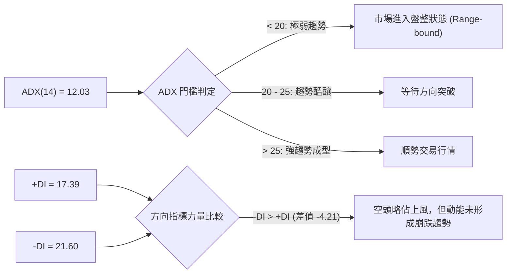

#### ADX 趨勢強度量化判定

| 指標變數 | 當前數值 | 門檻區間 | 實質市場意義 |
|----------|----------|----------|--------------|
| **ADX(14)** | **12.03** | 0 – 20 (極弱趨勢) | 趨勢動能幾近停滯，不具備單邊趨勢突破條件，不可採用突破追價策略 |
| **+DI(14)** | **17.39** | 多方進攻指標 | 多方買盤意願低落，反彈難以維持連續性 |
| **-DI(14)** | **21.60** | 空方打壓指標 | 空方主導結構但未過度發散，未出現恐慌拋售動能 |
| **綜合判定** | **弱勢盤整** | **盤整優先規則** | **嚴格適用「規則14」之盤整行情規範：以布林通道與高低箱體為交易依託** |

---

## 3. 圖表形態分析

### 🔍 形態識別系統

依據近 6 個月（2026-03 至 2026-09）之實際收盤價與高低點分布，市場在 $3.30 – $3.96 之間構築矩形箱體，並在微觀尺度上嘗試打出雙重底。

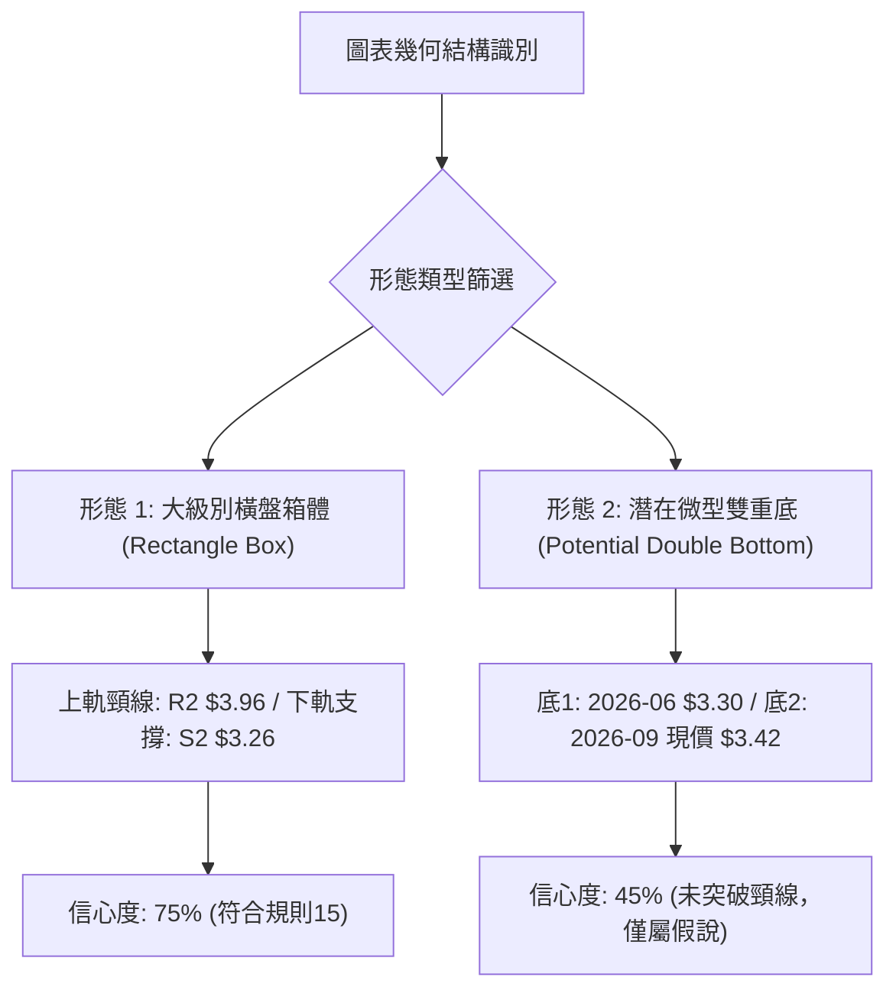

#### 形態識別與信心度量化矩陣

| 形態名稱 | 信心度 | 判斷依據（嚴格引用技術數據） | 形態完成度 | 目標價（附嚴謹幾何計算式） |
|----------|--------|------------------------------|------------|----------------------------|
| **橫盤整理箱體 (Box Range)** | **75%** | 區間震盪於 $3.26（支撐S2）至 $3.96（阻力R2），近 5 個月收盤高點落在 $3.90–$3.93，低點落在 $3.30–$3.34 | 85% | 向上破位：$3.96 + ($3.96 - $3.26) = **$4.66**<br>向下破位：$3.26 - ($3.96 - $3.26) = **$2.56** |
| **微型雙重底 (Double Bottom)** | **45%** | 2026-06-14 週收盤 $3.30 與當前現價 $3.42 形成潛在雙低點；但中間反彈高點 $3.93 未被帶量突破 | 35% | 頸線位 $3.93。若突破頸線：<br>$3.93 + ($3.93 - $3.30) = **$4.56**（*信心度不足 50%，僅作參照*） |

### 🕯️ 重要 K 線形態分析

| 觀測週期/月份 | 收盤價 | 典型 K 線組合與形態 | 技術面解讀 | 訊號方向 |
|---------------|--------|---------------------|------------|----------|
| **2026-07-12 (週線)** | $3.93 | 長上影倒轉錘頭線 (Inverted Hammer) | 向上挑戰阻力 R2（$3.96）未果，爆出 224.9M 成交量後多頭潰敗，確立短期假突破 | 🔴 空頭吞噬預警 |
| **2026-07-26 (週線)** | $3.31 | 大陰線破位測底 (Bearish Marubozu) | 空方單邊灌壓，跌破布林下軌，RSI 直墜 25.9 極端超賣區，動能嚴重失血 | 🔴 極度弱勢殺多 |
| **2026-08-09 (週線)** | $3.66 | 破底翻放量中陽線 (Bullish Piercing) | 週量放大至 310.6M，站回 MA20，完成對 $3.30 區域的二次確認底部動作 | 🟢 多頭回補抵抗 |
| **2026-08-30 (週線)** | $3.61 | 高位受阻十字星 (Doji Star) | 量能驟縮至 157.4M，反彈動能衰竭於 MA50（$3.62）與 R1（$3.64）共振帶 | 🟡 動能停滯中立 |
| **2026-09-06 (即時)** | $3.42 | 低位陰跌錘子測試線 (Hammer Re-test) | 逼近 S1（$3.40），實體微小且量能疲弱，等待下軌動態防守信號 | 🟡 變盤前置中性 |

### 📉 ASCII 走勢形態示意圖

```
GRAB 箱體與雙重底構型解析 ($3.18 - $3.96)
  價格
  $3.96 ┼─────────────╭─╮──────────────────── 箱體上軌阻力 R2 ($3.96)
  $3.90 ┤            ╭╯ ╰╮
  $3.75 ┤           ╭╯   ╰╮       ╭─╮
  $3.60 ┤          ╭╯     ╰╮     ╭╯ ╰╮ MA50 / R1 壓制區 ($3.62-$3.64)
  $3.45 ┤   ╭─╮   ╭╯       ╰╮   ╭╯   ╰╮
  $3.42 ┤  ╭╯ ╰╮ ╭╯         ╰╮ ╭╯     ╰● 現價 $3.42 (測試S1)
  $3.30 ┼─╭╯───╰─╯───────────╰─╯──────── 下軌支撐群 S1/S2 ($3.26-$3.40)
  $3.18 ┴─╯ (52W絕對低點)──────────────── 52W Low 底線
           2026-05   2026-06   2026-07   2026-08   2026-09
```

---

## 4. 支撐與阻力

### 🗺️ 關鍵價位分布圖（Unicode）

本節所有阻力位與支撐位，**嚴格引用技術數據中由近一年 OHLCV 計算之聚類數值**：

```
╔══════════════════════════════════════════════════════════════════╗
║                     GRAB 價位結構分布圖                          ║
╠══════════════════════════════════════════════════════════════════╣
║ $4.06 ║████████████████████████████████║ 強阻力 R3 (+18.71%)     ║
║ $3.96 ║████████████████████████░░░░░░░░║ 波段高點 R2 (+15.69%)   ║
║ $3.64 ║████████████████░░░░░░░░░░░░░░░░║ 近期阻力 R1 (+6.51%)    ║
║ $3.56 ║────────── MA20 / 布林中軌 ──────────║ 動態轉折平衡線          ║
║ $3.42 ╠════════════════════════════════╣ ◄ 現價 ($3.42)           ║
║ $3.40 ║▓▓▓▓▓▓▓▓▓▓▓▓▓▓▓▓▓▓▓▓▓▓▓▓▓▓▓▓▓▓▓▓║ 近端支撐 S1 (-0.51%)    ║
║ $3.26 ║████████████████████████░░░░░░░░║ 波段支撐 S2 (-4.82%)    ║
║ $3.18 ║████████████████████████████████║ 52週鐵底 S3 (-7.02%)    ║
╚══════════════════════════════════════════════════════════════════╝
```

### 🚧 阻力位分析表

| 阻力級別 | 精確價位 | 形成技術依據（數據源計算） | 突破難度評估 | 戰略重要性 |
|----------|----------|----------------------------|--------------|------------|
| **R1** | **$3.64** | 近一年波段高點聚類，與 MA50（$3.62）、MA120（$3.63）形成重疊壓制 | 🟡 中等（需日成交量 > 40M） | 短期多空分水嶺，站上此處方能化解均線蓋頭壓力 |
| **R2** | **$3.96** | 2026-07 反彈高點（$3.93）密集套牢區，也是費氏回調 78.6%（$3.92）重疊位 | 🔴 極高（前期爆量套牢籌碼） | 箱體震盪頂部邊界，未突破前中期架構皆為盤整 |
| **R3** | **$4.06** | 歷史聚類強壓力位，與 MA200 牛熊分界線（$4.04）形成強共振 | 🔴 堡壘級（長期熊市頂棚） | 長期架構翻多之決定性樞軸點，突破宣告牛市回歸 |

### 🛡️ 支撐位分析表

| 支撐級別 | 精確價位 | 形成技術依據（數據源計算） | 守住機率評估 | 戰略重要性 |
|----------|----------|----------------------------|--------------|------------|
| **S1** | **$3.40** | 近一年波段低點聚類密集區，距現價僅 -0.51%，為短線下影線密集處 | 🟡 60%（短線具反抽拉力） | 極短線防線，失守將直探布林通道下軌擴張區 |
| **S2** | **$3.26** | 歷史次級波段低點聚類，接近 2026-06/07 急跌低位插針區域 | 🟢 75%（跌深買盤回補點） | 中期箱體底部防衛線，波段多頭最後回補陣地 |
| **S3** | **$3.18** | **52 週最低價**（費氏 100.0% 回調位），歷史絕對估值支撐 | 🟢 85%（強烈價值支撐） | 全年終極鐵底，跌破將引發流動性踩踏與結構重構 |

### 📐 斐波那契回調位分析

依據技術數據提供之 52 週完整波動區間（高點 **$6.62** 至低點 **$3.18**，總跨度 $3.44）測算：

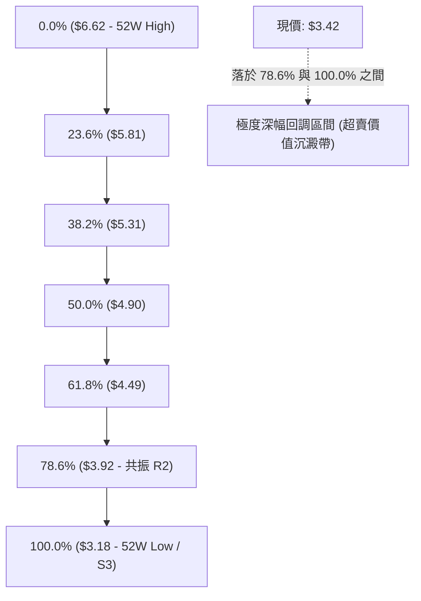

#### 斐波那契價位對照與現價定位

| 回調比例 | 精確數值 | 當前相對位置與技術意義解讀 |
|----------|----------|----------------------------|
| **0.0%** | **$6.62** | 52 週最高點，本輪大型下行循環之起點 |
| **23.6%** | **$5.81** | 分析師平均目標價（$5.86）共振點，長期多頭強勢反轉位 |
| **38.2%** | **$5.31** | 中長期籌碼密集套牢區頂部 |
| **50.0%** | **$4.90** | 典型多空半數分界嶺，2025-12 破位前之重要整理平台 |
| **61.8%** | **$4.49** | 黃金分割強防守位，現已轉化為嚴重上方長期阻力帶 |
| **78.6%** | **$3.92** | **阻力共振位**：與 R2（$3.96）高度重疊，為反彈浪之關鍵分水嶺 |
| **100.0%** | **$3.18** | **52 週最低點**：與 S3（$3.18）重合，為當前空頭不可逾越之底線 |

> **深入解讀**：現價 $3.42 處於 78.6%（$3.92）與 100.0%（$3.18）之極端底層區間內，且僅自最低點回升 **6.98%**。這意味著空頭已耗盡絕大部分下行動能，空方風險回報比正在顯著劣化，下行空間被壓縮至 $0.24 之內。

---

## 5. 技術指標深度解讀

### 🎛️ 指標訊號總覽

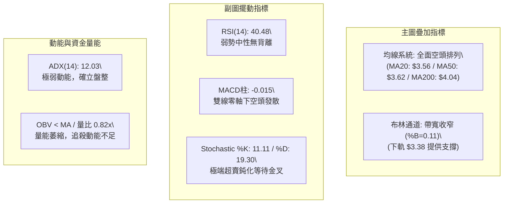

### 📈 移動平均線排列分析

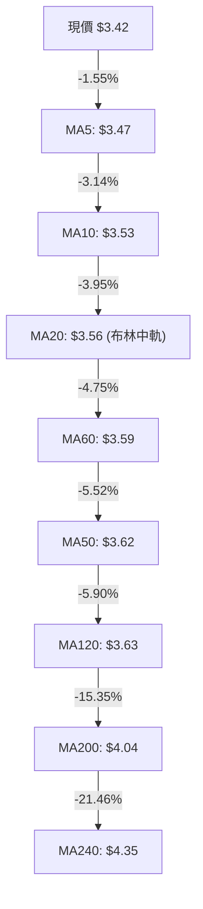

#### 均線系統量化評估

當前均線呈現標準的**完全空頭排列（Perfect Bearish Alignment）**：
$$P < MA_5 < MA_{10} < MA_{20} < MA_{60} < MA_{50} < MA_{120} < MA_{200} < MA_{240}$$
- **短期均線簇**：MA5（$3.47）至 MA20（$3.56）於 $0.09 的狹幅空間內密集下壓，構成日線級別第一道空頭防線。
- **中期均線簇**：MA50（$3.62）與 MA120（$3.63）呈現完全黏合狀態，與 R1（$3.64）形成三位一體的重合阻力。
- **結論**：均線結構判定多頭目前毫無主動定價權，反彈觸及 MA20 或 MA50 均屬技術性解套賣壓區。

### 📉 RSI(14) 分析

```
RSI(14) 當前狀態: 40.48 (弱勢整理)
0 ──────────── 30 ────────────────────── 50 ────────────────────── 70 ──────────── 100
[  極度超賣區  ] [       空方控盤區       ] [       多方控盤區       ] [  極度超買區  ]
               ▲ (30)                  ▲ (50)
                ├─── 40.48 (目前位置) ──┤
```

- **數值解讀**：RSI(14) 報 40.48，位於 40–50 之弱勢過渡帶。
- **背離分析**：
  - 比對 2026-06-14 週線價格低點 $3.30（對應 RSI 約 37.9），與 2026-07-26 週線價格低點 $3.31（對應 RSI 25.9），再到現價 $3.42（日線 RSI 40.48）：價格在低檔維持箱體整理，RSI 底部並未跌破前期極值，但亦未出現清晰的線條向上而價格破底之典型「底背離」。
  - **確定結論**：**RSI 無明顯頂背離或底背離**，動能與價格同向，呈現鈍化盤整態勢。

### 📊 MACD(12/26/9) 訊號解讀

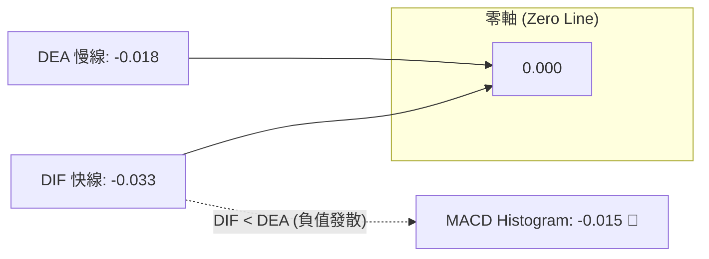

- **雙線位置**：DIF (-0.033) 與 DEA (-0.018) 皆深鎖於零軸下方，定性為**中長期弱勢空頭格局**。
- **柱狀體動態**：當前 MACD 柱為 **-0.015**，雖為負值，但觀察近三週柱狀體已自 -0.025 ~ -0.069 的深淵顯著收斂（2026-08-30 曾短暫觸碰 +0.004），顯示**空方實體拋壓動能正在減退**，目前處於空頭動能衰竭後的死叉微幅發散階段。
- **背離檢驗**：週線級別 MACD 柱未隨現價逼近 S1 而創出新深（遠高於 2026-07-26 之 -0.069），呈現微弱的柱狀體底背離雛形，但尚未獲雙線金叉確認。

### 📦 布林通道分析

```
布林通道 (20, 2) 結構圖
$3.74 ┼──────────────────────────────── 上軌 (Upper Band)
      │
$3.56 ┼ - - - - - - - - - - - - - - -  中軌 (MA20 Baseline)
      │
$3.42 ┼ ◄ 現價 ($3.42) [%B = 0.11]
$3.38 ┼──────────────────────────────── 下軌 (Lower Band)
```

- **通道參數現值**：上軌 **$3.74**，中軌 **$3.56**，下軌 **$3.38**。
- **帶寬與位置**：帶寬僅為 $0.36（帶寬比 10.1%），進入通道擠壓（Squeeze）的中期階段。%B 指標為 **0.11**，代表現價距離下軌僅剩 $0.04。
- **技術意義**：在 ADX < 25 的盤整環境下，布林下軌（$3.38）具有高度有效的統計學支撐效力，價格直接單邊摜破下軌並沿軌下行的機率極低，預期下軌附近將引發均值回歸買盤。

### 💹 成交量分析（量價配合度）

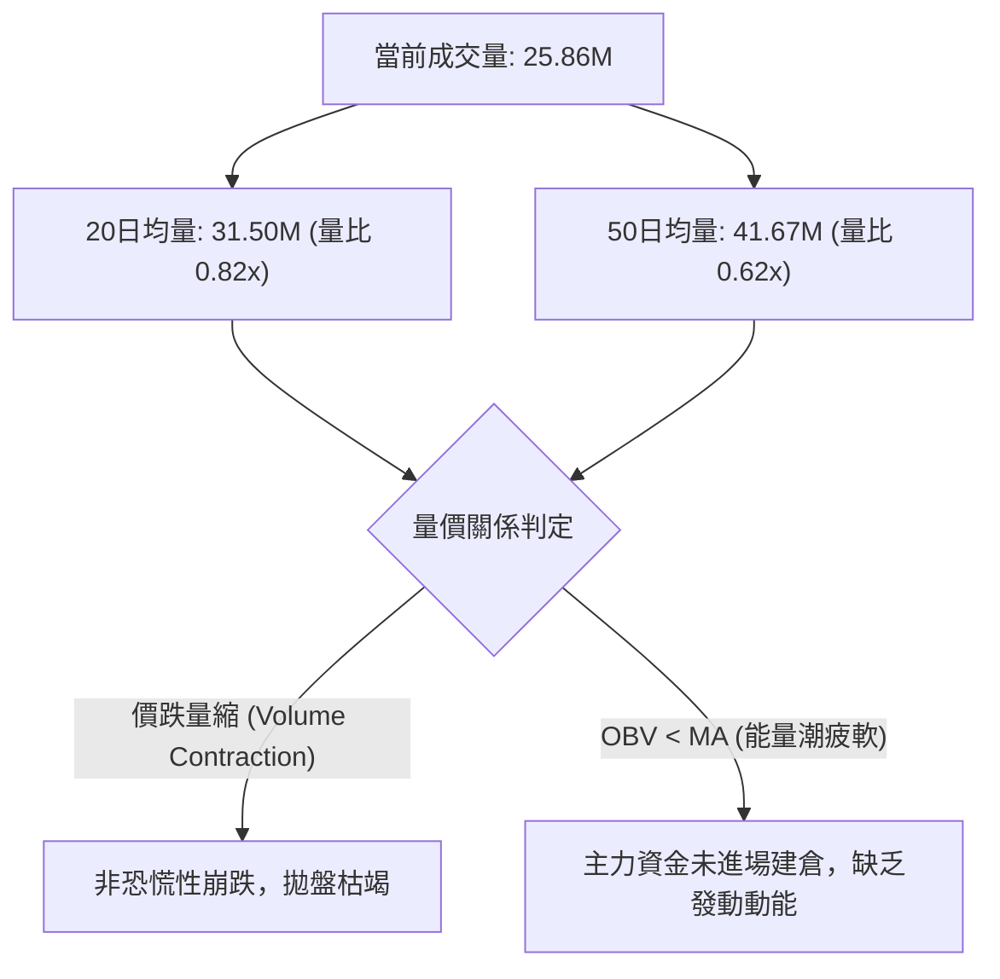

- **量比與縮量現象**：最新成交量 25.86M 較 20 日均量萎縮 18%，較 50 日均量大幅萎縮 38%。回顧 2026-05 至 2026-06 底部構築期，週成交量均維持在 230M–310M 高檔，而當前週成交量已萎縮至 150M–166M 區間。
- **價跌量縮意涵**：價格緩慢下行但並未伴隨量能放大，說明並無主力大資金奪路而逃，市場主要由存量微弱賣壓與缺乏買盤承接引發的「陰跌」。
- **OBV 趨勢確認**：OBV 位於均線下方，確認量能尚未反轉，多方仍處於被動防守。

---

## 6. 動能與波動率

### ⚡ 動能評估四象限

根據 GRAB 當前動能指標（RSI=40.48, ADX=12.03, MACD Hist=-0.015）與波動率指標（ATR=$0.11, Beta=0.89, BB 帶寬極度收窄），將其定位於動能波動矩陣：

| 象限標籤 | 動能維度 | 波動率維度 | 當前狀態對應 | 核心操作戰略意義 |
|----------|----------|------------|--------------|------------------|
| **第一象限 (Q1)** | 強動能 (Bullish) | 低波動 (Low Vol) | ❌ 不符合 | 最佳主升浪買點，穩定擴張 |
| **第二象限 (Q2)** | **弱動能 (Bearish/Flat)** | **低波動 (Low Vol)** | **✔ 當前完全落於此象限** | **築底鈍化期：嚴禁突破追價，僅適合邊界低吸高拋** |
| **第三象限 (Q3)** | 強動能 (Active) | 高波動 (High Vol) | ❌ 不符合 | 趨勢突破或崩盤，高風險高回報博弈 |
| **第四象限 (Q4)** | 弱動能 (Weak) | 高波動 (High Vol) | ❌ 不符合 | 恐慌拋售段，應空倉規避 |

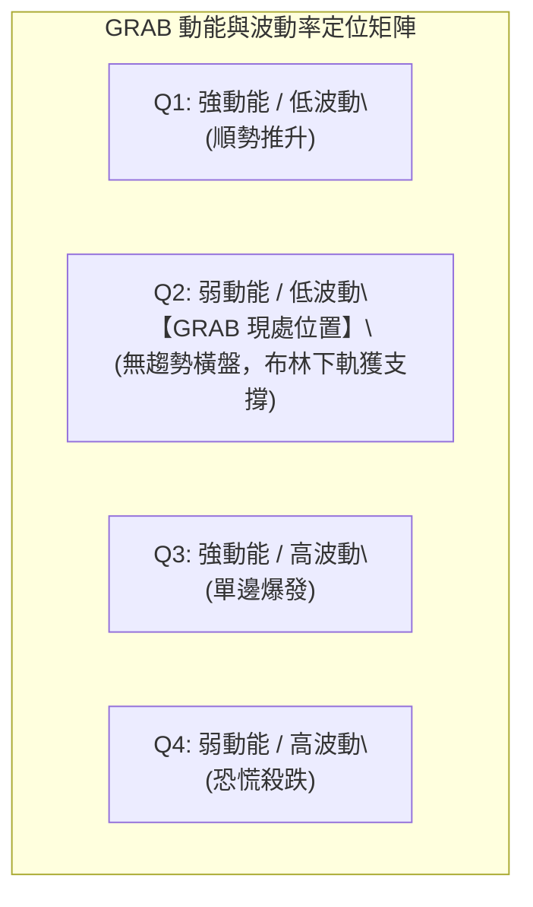

### 📊 ATR 波動率分析

- **ATR(14) 絕對值**：**$0.11**。
- **波動率佔比**：$\frac{0.11}{3.42} = 3.22\%$（數據顯示約 3.28%），顯示該股每日平均常態波動幅度僅約 11 美分。
- **技術止損距離測算**：
  - **保守型風控（2.0 × ATR）**：$2.0 \times 0.11 = \mathbf{\$0.22}$。以此設置止損，可有效過濾 95% 的日內雜訊波動。
  - **激進型風控（1.0 × ATR）**：$1.0 \times 0.11 = \mathbf{\$0.11}$。

### 📐 Beta 與市場相關性

- **Beta 係數**：**0.89**。
- **特徵解讀**：GRAB 表現出低於大盤（S&P 500 / NASDAQ）的波動特徵（防禦型科技股特徵）。當前在科技板塊走強時，其彈性相對受抑；但當大盤大跌時，其在自身估值支撐位（S3 $3.18）亦具備一定抗跌能力。

---

## 7. 多時框架總結

### 📋 時框架評分表

| 時框架 | 趨勢方向 | 動能狀態 | 均線排列 | 形態結構 | 綜合評分 | 操作建議 |
|--------|----------|----------|----------|----------|----------|----------|
| **月線 (長期)** | 🔴 空頭下行 | 🔴 弱勢負值 | 🔴 跌破 MA240 | 自 $6.02 深幅回調 43% | **25/100** | 戰略減配，靜待長線築底信號 |
| **週線 (中期)** | 🟡 橫向震盪 | 🟡 柱狀體收斂 | 🔴 受阻 MA50 | $3.30–$3.96 箱體震盪 | **40/100** | 箱體波段思維，嚴控倉位 |
| **日線 (短期)** | 🔴 均線壓制 | 🟢 超賣鈍化 | 🔴 空頭發散 | 逼近 S1 與布林下軌 | **40/100** | 短線尋求下軌 $3.38 支撐反彈 |

### 🔲 綜合訊號矩陣

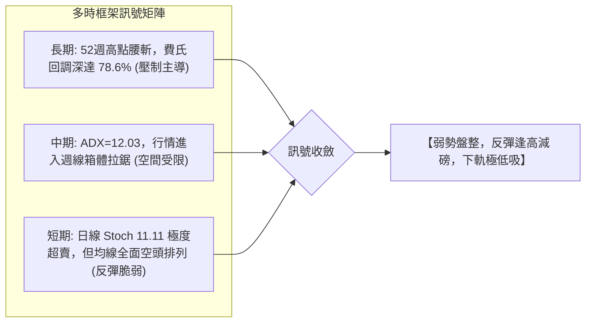

### ⚖️ 多時框收斂結論

> **明確收斂定論（嚴格執行規則 14）**：
> 1. **行情性質確立**：當前日線與週線 ADX(14) 均為 **12.03**，遠低於 25 臨界值，**行情絕對定性為「盤整行情（Range-bound Consolidation）」而非「趨勢行情」**。
> 2. **優先級執行原則**：依規則 14，在 ADX < 25 的盤整市中，中長期均線的單邊趨勢指導力被弱化，**日線布林通道上下軌（$3.38 – $3.74）成為主導交易邊界**。
> 3. **方向性收斂唯一結論**：**中性偏空之區間震盪（Neutral-Bearish Range Trading）**。
>    - 向上：受制於 MA20（$3.56）及 R1（$3.64），不具備單邊走強空間；
>    - 向下：受 S1（$3.40）、布林下軌（$3.38）及 52 週鐵底 S3（$3.18）托底，殺跌動能已衰竭。

---

## 8. 交易策略建議

### 🗺️ 策略決策流程圖

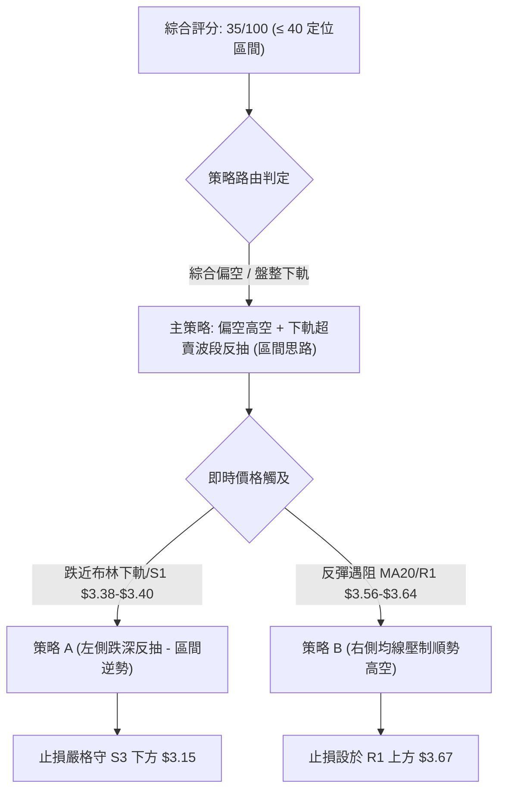

### 🧭 策略路由

**當前主策略方向 = 偏空環境下的區間高拋低吸（以防守型做空為主，輔以邊界超跌反抽）（依技術評分卡 35/100 定案）**

- 依評分卡規則，評分 ≤ 40 分主推空頭架構；惟因現價 $3.42 極度貼近 S1（$3.40）與布林下軌（$3.38），此處嚴禁就地下空，必須待反彈至阻力位建立空單，或於極致支撐區小倉位博取反抽。

### 🎯 價格情境階梯（Price Scenarios）

價位嚴格引用第 4 章由 OHLCV 聚類計算之實際數值：

| 觸發條件 | 第一目標 | 第二目標 | 後續延伸 | 市場結構與情境含義 |
|----------|----------|----------|----------|--------------------|
| **向上突破 R1 ($3.64)** | **R2 ($3.96)** | **R3 ($4.06)** | 挑戰 MA200 ($4.04) | 短線強勢逆轉，脫離底部箱體，展開週線級修復行情 |
| **受阻於 MA20 ($3.56)** | **S1 ($3.40)** | **S2 ($3.26)** | 沿布林中下軌拖曳 | 維持弱勢橫盤，動能持續萎縮，空方溫水煮青蛙 |
| **向下跌破 S1 ($3.40)** | **S2 ($3.26)** | **S3 ($3.18)** | 考驗 52 週最低點 | 破位尋底，觸發停損賣壓，考驗終極支撐防禦力 |

### 📊 情境機率分佈

```
情境機率分佈圖 (總和 100%)
┌─────────────────────────────────────────────────────────────┐
│ 區間弱勢震盪 (S1 - R1 磨底)   ██████████████████████  55%    │
│ 向下破位尋底 (再測 S2 / S3)  ██████████░░░░░░░░░░░░  25%    │
│ 強勢向上反彈 (衝擊 R1 / R2)  ████████░░░░░░░░░░░░░░  20%    │
└─────────────────────────────────────────────────────────────┘
```

| 情境類別 | 機率預估 | 主要技術判定依據 |
|----------|----------|------------------|
| **區間弱勢震盪** | **55%** | **ADX=12.03 確立盤整市場**；布林帶寬收窄，成交量極度低迷（量比 0.82x），無力打破現有格局 |
| **向下破位尋底** | **25%** | **全週期均線空頭排列**，MACD 處於零軸之下發散，-DI (21.60) 壓制 +DI (17.39) |
| **強勢向上反彈** | **20%** | Stochastic (11.11) 極端超賣鈍化，且現價落於 52 週歷史深幅價值區（7%分位）引發技術回補 |

### 🟢 主策略詳情

根據上述路由，提供兩套精確執行方案：
- **策略 A（主推空頭策略）**：反彈至阻力位之**順勢高空策略**。
- **策略 B（輔助反抽策略）**：布林下軌之**超賣短多博弈**。

| 策略要素 | 策略 A（主推：均線阻力逢高做空） | 策略 B（輔助：下軌邊界超跌反抽） |
|----------|----------------------------------|----------------------------------|
| **策略邏輯** | 順應均線空頭排列，於 R1 阻力帶放空 | 利用 Stoch 超賣與布林下軌博取均值回歸 |
| **進場條件** | 反彈至 MA20-MA50 且小時線收長上影 | 觸碰布林下軌 $3.38 且日線未跌破 S1 |
| **進場價格** | **$3.56**（MA20 / 布林中軌）至 **$3.62** | **$3.38**（布林下軌）至 **$3.40**（S1） |
| **目標價 T1** | **$3.40**（支撐位 S1） | **$3.56**（布林中軌 / MA20） |
| **目標價 T2** | **$3.26**（支撐位 S2） | **$3.64**（阻力位 R1） |
| **止損價格** | **$3.67**（R1 $3.64 + 0.25×ATR） | **$3.29**（S2 $3.26 - 0.25×ATR，留出緩衝） |
| **風險報酬比**| **1 : 2.73**（以進場 $3.56、止損 $3.67、T2 $3.26 計算） | **1 : 2.44**（以進場 $3.38、止損 $3.29、T2 $3.60 計算） |
| **成功機率** | **65%** | **45%** |
| **建議倉位** | **8% – 10%** 總資產 | **3% – 5%** 輕倉試探 |

### 🔴 反向風險觸發點（對沖提示）

若出現以下訊號，主推之空頭策略 A 必須無條件停損出場，並啟動多頭避險：
1. **日線收盤價強勢站上 R1（$3.64）**：代表 MA20、MA50 與 MA120 之「空頭蓋頭群」被一次性瓦解，日線空頭架構破壞。
2. **單日成交量暴增至 50M 以上**（達 50 日均量的 1.2 倍以上）且收出實體光頭大陽線。
3. **MACD 出現零軸下之「雙線金叉」且柱狀體連續 3 日擴大翻紅**。

### ⭐ 整體訊號強度評星

```
做多訊號強度：★★☆☆☆  (2/5星 - 僅有極端超賣與下軌支撐)
做空訊號強度：★★★★☆  (4/5星 - 均線空頭排列，趨勢向下主導)
整體可信度：  ★★★☆☆  (3/5星 - ADX極低，盤整雜訊干擾較多)
```

---

## 9. 風險提示與監控

### ✅ 關鍵監控指標 Checklist

```
╔══════════════════════════════════════════════════════════════════╗
║                    技術監控清單 (DAILY CHECKLIST)                ║
╠══════════════════════════════════════════════════════════════════╣
║ [ ] 價位破位監控: 收盤價是否實質跌破 S1 ($3.40) 或 S2 ($3.26)     ║
║ [ ] 均線動態監控: 是否站穩 MA20 ($3.56) 挑戰 MA50 ($3.62)       ║
║ [ ] 動能突變監控: ADX 是否自 12.03 向上突破 20 (趨勢啟動訊號)    ║
║ [ ] 擺動指標監控: Stoch %K 是否自 11.11 向上金叉 %D 形成買點     ║
║ [ ] 量能異動監控: 成交量是否突破 41.67M (50日均量門檻)          ║
║ [ ] 籌碼空頭監控: Short Float 6.9% 是否出現空頭回補軋空潮       ║
╚══════════════════════════════════════════════════════════════════╝
```

### ⚠️ 風險場景分析

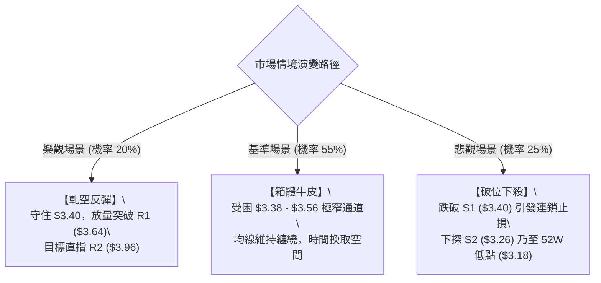

### 🛡️ 風險管理重要提醒

1. **嚴禁於盤整中段過度交易**：當前 ADX 為 12.03，說明行情不具備趨勢延續性，於 $3.42 的中軸位置隨意開倉極易遭受上下洗盤雙重打擊，應嚴守「非邊界不進場」紀律。
2. **波動率受抑後的變盤風險**：布林通道帶寬已收窄至 $0.36，ATR 降至 $0.11。歷史規律表明，低波動盤整終將引發劇烈變盤。開倉時必須預設止損，不可抱有「低價股不會再跌」之僥倖心理。
3. **空頭回補引發的局部軋空**：目前空頭部位佔流通盤 6.9%（Short Ratio 5.24 天），一旦有利多催化，極易引發快速覆蓋式反彈，因此做空必須嚴格以 $3.67（R1 外部）作為紀律防線。

---

## 10. 報告總結

```
╔══════════════════════════════════════════════════════════════════╗
║                     GRAB 技術分析報告總結                        ║
╠══════════════════════════════════════════════════════════════════╣
║ 報告日期：2026-09-06                                             ║
║ 當前價格：$3.42                                                  ║
║ 分析評級：🔴 弱勢盤整偏空 (Bearish Consolidation)                 ║
║                                                                  ║
║ 關鍵結論：                                                       ║
║ ├─ 長期趨勢：🔴 跌破全週期均線，自高點深幅回調，MA200 ($4.04) 壓制 ║
║ ├─ 中期趨勢：🟡 $3.26 - $3.96 寬幅箱體拉鋸，ADX=12.03 處於盤整   ║
║ ├─ 短期趨勢：🔴 均線空頭排列，現價承壓於 MA20 ($3.56) 下方       ║
║ ├─ 關鍵支撐：S1: $3.40 │ S2: $3.26 │ S3: $3.18 (52W Low)        ║
║ ├─ 關鍵阻力：R1: $3.64 │ R2: $3.96 │ R3: $4.06                 ║
║ └─ 分析師目標：平均 $5.86 (最低 $4.60，最高 $8.00)               ║
║                                                                  ║
║ 最優策略組合：                                                   ║
║ 1. 🥇 最佳機會 (主推): 反彈至 MA20/R1 ($3.56-$3.62) 逢高建立空單 ║
║    目標 $3.40 / $3.26，止損設於 $3.67 (風報比 1:2.73)            ║
║ 2. 🥈 次選機會: 若跌至布林下軌 $3.38 獲撐，極輕倉博取跌深反抽   ║
║    目標 $3.56，止損設於 $3.29 (風報比 1:2.44)                   ║
║ 3. 🥉 保守選擇: 空倉觀望，等待日線突破 R1 或下探 S3 後之結構明朗 ║
╚══════════════════════════════════════════════════════════════════╝
```

---

> ⚠️ **免責聲明**：本報告為依據量化技術指標與圖表幾何結構撰寫之專業技術分析報告，所有價位均基於歷史 OHLCV 模型推算。本報告**僅供學術研究與投資架構參考**，**不構成任何要約、招攬或具體投資建議**。市場有風險，交易決策應基於獨立判斷並嚴格落實風控。

---
*報告生成時間：2026-09-06 ｜ 數據來源：Yahoo Finance ｜ 分析框架：多時框技術分析模型*