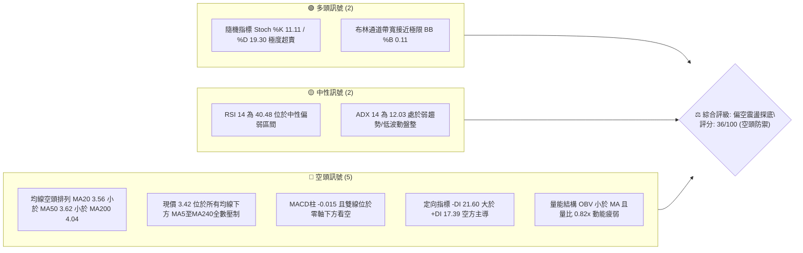
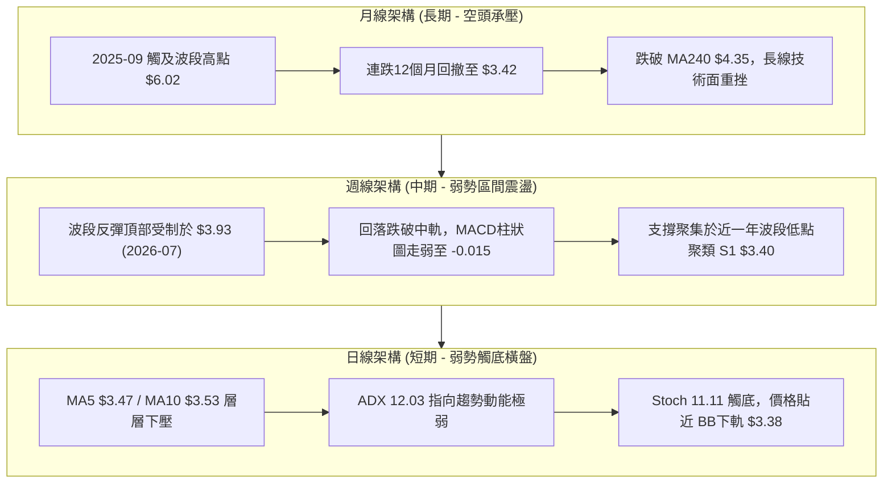
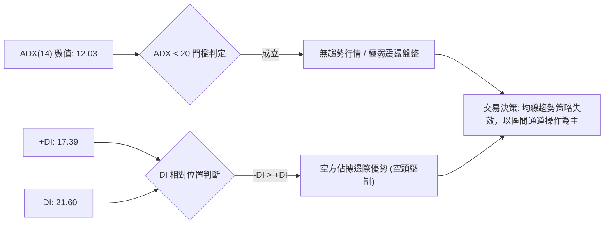
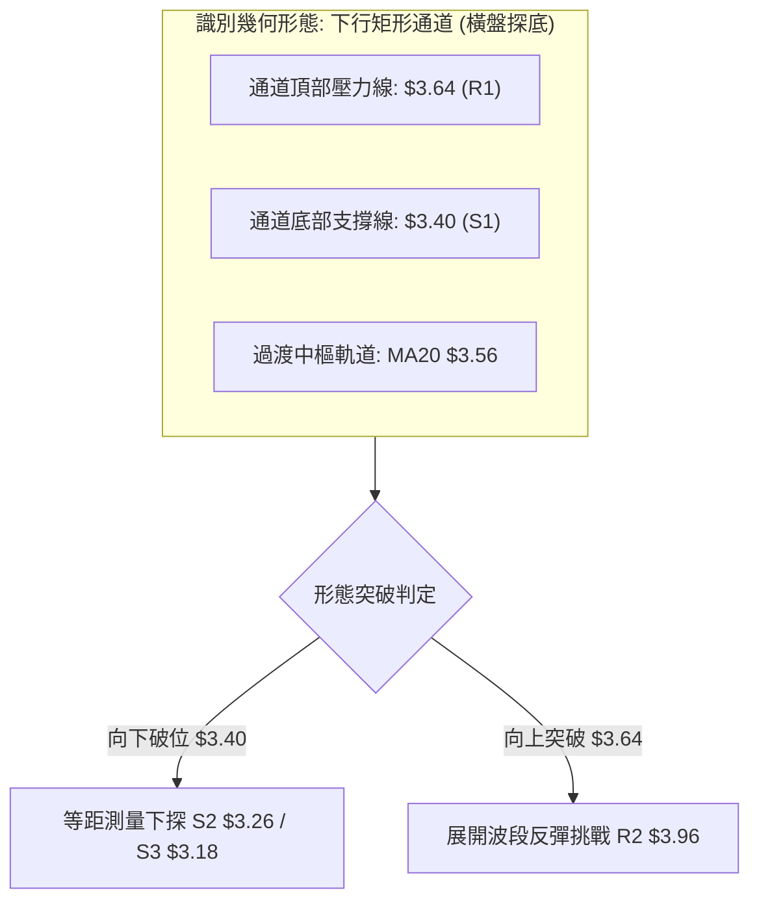
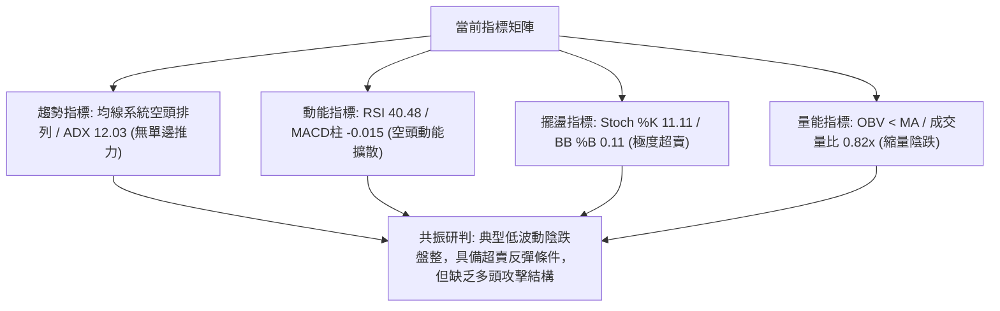
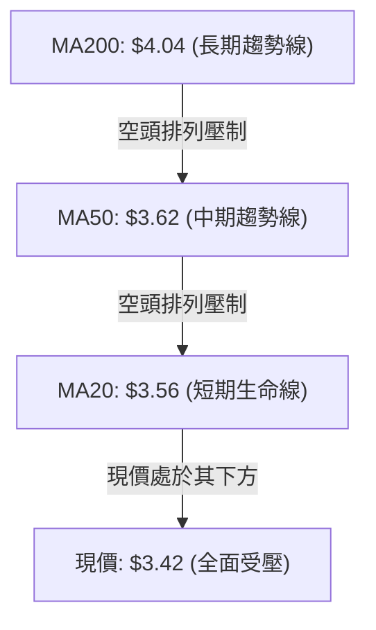
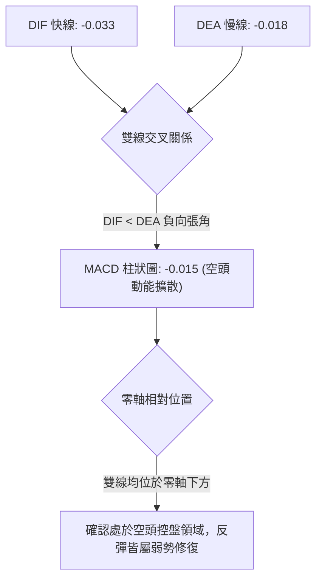
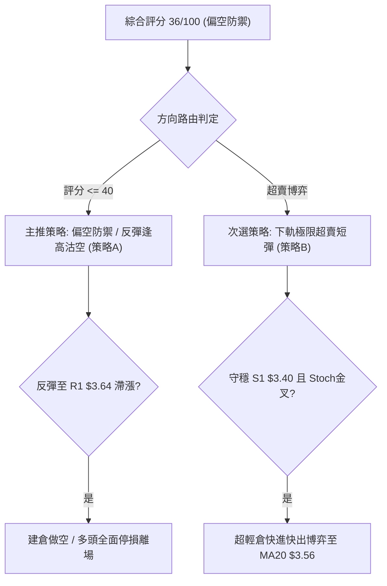
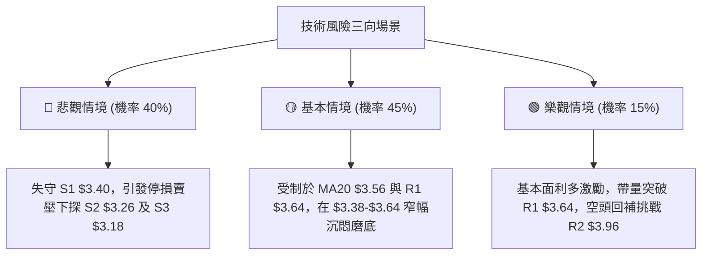

# GRAB 技術分析報告

> **報告日期**：2026-09-08 ｜ **語言**：繁體中文 ｜ **數據來源**：Yahoo Finance ｜ **當前價格**：$3.42

---

## 目錄

| 章節 | 內容 |
|------|------|
| [1. 技術面概覽](#1-技術面概覽) | 訊號儀表板、核心指標、評分卡 |
| [2. 趨勢分析](#2-趨勢分析) | 多時框趨勢、長中短期走勢 |
| [3. 圖表形態分析](#3-圖表形態分析) | 形態識別、K線組合、目標價 |
| [4. 支撐與阻力](#4-支撐與阻力) | 關鍵價位、斐波那契回調 |
| [5. 技術指標深度解讀](#5-技術指標深度解讀) | MA/RSI/MACD/布林/成交量 |
| [6. 動能與波動率](#6-動能與波動率) | 動能評估、ATR、Beta |
| [7. 多時框架總結](#7-多時框架總結) | 時框架評分矩陣 |
| [8. 交易策略建議](#8-交易策略建議) | 多空策略、風險報酬比 |
| [9. 風險提示與監控](#9-風險提示與監控) | 監控指標、風險場景 |

---

## 1. 技術面概覽

### 🎯 技術訊號儀表板



### 📊 核心指標速覽表

| 指標類別 | 指標名稱 | 當前數值 | 訊號 | 解讀 |
|:---|:---|:---|:---:|:---|
| **價格** | 當前價格 | $3.42 | 🔴 | 位於 52 週區間 7.0% 極低檔，距 52W 低點 $3.18 僅差 7.5% |
| **均線** | MA20 | $3.56 | 🔴 | 價格在 MA20 下方 (-3.95%)，短期下行壓力顯著 |
| **均線** | MA50 | $3.62 | 🔴 | 價格在 MA50 下方 (-5.52%)，中期趨勢受壓 |
| **均線** | MA200 | $4.04 | 🔴 | 價格在 MA200 下方 (-15.35%)，長期空頭結構壓制 |
| **動能** | RSI(14) | 40.48 | 🟡 | 位於中性偏空區間 (30–50)，無底背離確認 |
| **動能** | MACD (12,26,9) | -0.033 / -0.018 | 🔴 | 柱狀圖 -0.015，負值擴散，空方動能佔優 |
| **超買超賣** | Stoch %K / %D | 11.11 / 19.30 | 🟢 | 雙線進入 20 以下超賣區，短線具備技術性反抽動能 |
| **趨勢強度** | ADX(14) | 12.03 | 🟡 | 數值小於 25，趨勢動能衰竭，處於低波動窄幅盤整型態 |
| **通道位置** | Bollinger %B | 0.11 | 🟡 | 逼近下軌 $3.38，跌勢受限於下軌支撐 |
| **成交量** | 量比 / OBV | 0.82x / OBV<MA | 🔴 | 20日均量下行，OBV 低於均線，買盤承接意願薄弱 |
| **波動** | ATR(14) | $0.11 (3.28%) | 🟢 | 波動率收窄至低檔，預示即將迎來突破方向抉擇 |

### 🏆 技術評分卡

```
╔══════════════════════════════════════════════════════════════╗
║                技術評分卡 — GRAB (2026-09-08)                 ║
╠══════════════════════════════════════════════════════════════╣
║ 趨勢強度 (ADX=12.03)    ██████░░░░░░░░░░░░░░  30/100  🔴 空頭主導 ║
║ 動能指標 (RSI/MACD)     ████████░░░░░░░░░░░░  38/100  🔴 負向擴散 ║
║ 支撐穩定度 (S1=$3.40)   ██████████░░░░░░░░░░  50/100  🟡 考驗邊緣 ║
║ 成交量配合 (OBV<MA)     ██████░░░░░░░░░░░░░░  28/100  🔴 量價背離 ║
║ 形態完整度 (區間箱體)   ████████░░░░░░░░░░░░  40/100  🟡 探底盤整 ║
║ 均線排列 (MA20<50<200)  ██████░░░░░░░░░░░░░░  28/100  🔴 完美空頭 ║
╠══════════════════════════════════════════════════════════════╣
║ 綜合評分                ███████░░░░░░░░░░░░░  36/100  🔴 偏空防禦 ║
╚══════════════════════════════════════════════════════════════╝
```

---

## 2. 趨勢分析

### 🌐 多時框趨勢分析



### 📈 長期趨勢 — 12個月走勢圖（Unicode）

```
GRAB 月線收盤走勢圖（過去12個月：2025-10 至 2026-09）
價格軸 ($)
$6.01 ┤ ●(2025-10 頂部聚類)
$5.45 ┤       ●(11月)
$4.99 ┤             ●(12月)
$4.30 ┤                   ●(2026-01)
$4.22 ┤                         ●(02月)
$3.82 ┤                                     ●(04月)
$3.77 ┤                                                 ●(06月)
$3.66 ┤                               ●(03月)
$3.54 ┤                                           ●(05月)     ●(08月)
$3.50 ┤                                                       ●(07月)
$3.42 ┤━━━━━━━━━━━━━━━━━━━━━━━━━━━━━━━━━━━━━━━━━━━━━━━━━━━━━━━━━━━━━●← 現價 $3.42
      └─────────────────────────────────────────────────────────────────
        10月  11月  12月  01月  02月  03月  04月  05月  06月  07月  08月  09月
```

**走勢特徵分析表格**：

| 階段區間 | 時間跨度 | 起訖價位 | 漲跌幅 | 主要形態與走勢特徵 |
|:---|:---|:---|:---:|:---|
| **主跌推動浪** | 2025-10 至 2026-03 | $6.01 → $3.66 | -39.10% | 高檔帶量崩跌，連續破線，基本面情緒逆轉 |
| **低檔箱體震盪** | 2026-03 至 2026-06 | $3.66 → $3.77 | +3.01% | 於 $3.54 至 $3.82 構築第 1 底部盤整區間 |
| **波段脈衝衝高** | 2026-06 至 2026-07 | $3.50 → $3.93 | +12.29% | 快速假突破，7月中旬見波段頂部 $3.93 即回落 |
| **二次探底回調** | 2026-07 至 2026-09 | $3.93 → $3.42 | -12.98% | 陰跌走勢，量能持續萎縮，現正測試支撐聚類 S1 $3.40 |

### 📊 中期趨勢（週線分析）

中期走勢呈現「反彈高點遞減、低點反覆測試」的下行旗形或弱勢橫盤特徵。近 20 週收盤走勢顯示，2026-07-12 觸及 $3.93 後，成交量由 2.25 億股逐週萎縮至 1.66 億股，RSI 從 77.2 超買高點急速滑落至 40.5。

```
中期週線阻力與支撐分佈
────────────────────────────────────────────────────────────
[R2: $3.96]  ─┬─ 2026-07 波段高點群 $3.90 ~ $3.93 聚類壓力
              │   ▲ 阻力沉重 (波段反彈極限)
[R1: $3.64]  ─┼─ MA50 ($3.62) 與 8月反彈高點 ($3.66) 重合區
              │   ▲ 短線分水嶺
[現價: $3.42] ─┼─ 貼近近期波動下限
              │   ▼ 測試下檔
[S1: $3.40]  ─┴─ 近一年波段低點聚類 (週收盤密集支撐)
[S2: $3.26]  ─── 次級波段防守點位
[S3: $3.18]  ─── 52週歷史絕對低點 (多頭最後防線)
────────────────────────────────────────────────────────────
```

### ⚡ 趨勢強度評估（ADX 解讀）



**ADX 指標參數解讀對照表**：

| 指標變數 | 當前讀數 | 標準門檻 | 趨勢狀態判定 |
|:---|:---:|:---:|:---|
| **ADX (14)** | **12.03** | < 20 (極弱) / < 25 (無趨勢) | 處於典型「低能量休眠盤整」狀態，無單邊推動力 |
| **+DI (14)** | **17.39** | 基準線 20 | 多頭進攻意願極為低迷，買盤缺乏延續性 |
| **-DI (14)** | **21.60** | 基準線 20 | 空方壓制力略高於多方，形成「陰跌」而非「暴跌」格局 |
| **結論收斂** | **盤整偏空** | ADX < 25 滿足盤整規則 | **採用布林通道下軌與支撐聚類作為邊界依據** |

---

## 3. 圖表形態分析

### 🔍 形態識別系統



**圖表形態信心度評估表**：

| 形態類別 | 信心度 | 判斷依據（引用技術數據） | 完成度 | 目標價（附嚴格計算式） |
|:---|:---:|:---|:---:|:---|
| **低檔矩形整理 (箱體)** | **70%** | 價格受困於 S1 $3.40 與 R1 $3.64 之間，週線成交量持續縮減 | 85% | 跌破 S1 測量目標：$3.40 - ($3.64 - $3.40) = **$3.16** (貼近 S3 $3.18)<br>突破 R1 測量目標：$3.64 + ($3.64 - $3.40) = **$3.88** (貼近 R2 $3.96) |
| **潛在雙底 (Double Bottom)** | **40%** | 2026-06 低點 $3.30 與當前測試 S1 $3.40，但數據未出現右底放量突破頸線確認 | 35% | 訊號不足，信心度 < 50%，依規則不強行採納，僅做指標型解讀 |
| **空頭旗形 (Bear Flag)** | **65%** | 2025年底崩跌為旗桿，2026年3月至今的弱勢震盪為微幅上傾旗面 | 80% | 旗桿下沉幅度 $6.02 - $3.66 = $2.36；若失守 S3 $3.18，下檔空間將全面打開 |

### 🕯️ 重要K線形態分析

| 期間/月份 | 收盤價 | 核心K線形態特徵 | 市場心理與技術意涵解讀 | 多空訊號 |
|:---|:---:|:---|:---|:---:|
| **2026-07** | $3.50 | **長上影流星線 (倒轉鎚頭)** | 月內一度暴衝至 $3.93，隨後遭遇機構拋壓大幅回落，確認 R2 $3.96 之強壓 | 🔴 強烈看空 |
| **2026-08** | $3.54 | **低檔十字星 (Doji)** | 價格在 $3.48 至 $3.66 窄幅拉鋸，多空呈現暫時均衡，觀望氣氛極為濃厚 | 🟡 中性猶豫 |
| **2026-09** | $3.42 | **收盤光腳中黑K (即時)** | 跌破 8 月整固平台，收盤價逼近全月最低點，空方再度下壓測試 S1 | 🔴 空方控盤 |
| **2026-09-06 (週線)** | $3.42 | **反轉陰包陽** | 週線收跌，完全吞噬前一週反彈陽線，週 MACD 柱翻負 (-0.015) | 🔴 弱勢確認 |

### 📉 ASCII 走勢形態示意圖

```
GRAB 箱體整理與壓力位幾何結構圖
價格 ($)
$3.96 ┼───────────────────────────────● 2026-07-12 波段頂部 (R2 強壓)
      │                             ╱ ╲
$3.64 ┼───────[阻力 R1]────────────●───╲──────● 2026-08-09 次高點
      │        ┌──────────────────╱───────╲────╱─────┐
$3.56 ┼────────┼─ MA20 中軌 ─────╱─────────╲──╱──────┼──── (中樞多空線)
      │        │                ╱           ╲        │
$3.42 ┼────────┼───────────────● 現價 ($3.42)───────┼──── (貼近箱底)
      │        └─────────────────────────────────────┘
$3.40 ┼───────[支撐 S1]──●──────────────────────────── 波段低點聚類防線
      │                2026-06-14 低點 $3.30
$3.18 ┴───────[強支撐 S3]──────────────────────────── 52週歷史低點
```

---

## 4. 支撐與阻力

### 🗺️ 關鍵價位分布圖（Unicode）

```
GRAB 價位結構分布圖
═════════════════════════════════════════════════════════════════════
$4.06 ║████████████████████████████████████║ 強阻力 R3 (年線 MA200 壓制帶)
$3.96 ║██████████████████████████          ║ 阻力 R2 (7月波段反彈高點聚類)
$3.64 ║████████████████                    ║ 關鍵阻力 R1 (MA50與前高聚類)
$3.56 ║┈┈┈┈┈┈┈┈┈┈┈┈┈┈┈┈┈┈┈┈┈┈┈┈┈┈┈┈┈┈┈┈┈┈┈┈║ 布林中軌 (MA20 多空分水嶺)
$3.42 ╠════════════════════════════════════╣ ◄ 現價 $3.42 (位處低檔臨界)
$3.40 ║▓▓▓▓▓▓▓▓▓▓▓▓▓▓▓▓▓▓▓▓▓▓▓▓            ║ 近期關鍵支撐 S1 (-0.51%)
$3.26 ║██████████████                      ║ 波段緩衝支撐 S2 (-4.82%)
$3.18 ║████████████████████████████████████║ 52週歷史底線 S3 (-7.02%)
═════════════════════════════════════════════════════════════════════
```

### 🚧 阻力位分析表

| 阻力級別 | 精確價位 | 距現價幅幅 | 形成原因與技術重合度 | 突破難度 | 重要性 |
|:---|:---:|:---:|:---|:---:|:---:|
| **R1** | **$3.64** | +6.51% | 近一年波段高點聚類、MA50 ($3.62) 及 MA60 ($3.59) 密集覆蓋區 | 🟡 中等 | ★★★★☆ |
| **R2** | **$3.96** | +15.69% | 2026-07 波段反彈頂部 ($3.93) 聚類、接近斐波那契 78.6% 回調位 ($3.92) | 🔴 極高 | ★★★★★ |
| **R3** | **$4.06** | +18.71% | 近一年密集套牢峰位、MA200 ($4.04) 長期牛熊分水嶺 | 🔴 堅不可摧 | ★★★★★ |

### 🛡️ 支撐位分析表

| 支撐級別 | 精確價位 | 距現價幅幅 | 形成原因與技術重合度 | 守住機率 | 重要性 |
|:---|:---:|:---:|:---|:---:|:---:|
| **S1** | **$3.40** | -0.51% | 近一年波段低點密集聚類、緊鄰布林通道下軌 ($3.38) | 55% | ★★★★☆ |
| **S2** | **$3.26** | -4.82% | 2026年6月刺穿波段低點 ($3.30) 衍生之次級結構支撐區間 | 45% | ★★★☆☆ |
| **S3** | **$3.18** | -7.02% | 52週歷史絕對低點、斐波那契 100.0% 終極支撐位 | 70% | ★★★★★ |

### 📐 斐波那契回調位分析

依據 52 週區間波段高點 **$6.62** 至波段低點 **$3.18** 進行回調測量（全區間落差 $3.44）：

| 回調比例 | 精確價位 | 幾何意義與當前相對位置 | 技術判斷 |
|:---|:---:|:---|:---|
| **0.0%** | **$6.62** | 52週最高價 (牛市終點) | 長期遠景壓力 |
| **23.6%** | **$5.81** | 第 1 級回撤支撐轉強阻 | 遙不可及 |
| **38.2%** | **$5.31** | 黃金分割阻力位 | 中期重壓 |
| **50.0%** | **$4.90** | 均衡分水嶺 (50% 基準線) | 多空總分界 |
| **61.8%** | **$4.49** | 黃金分割重要回調位 | 長期空頭反轉點 |
| **78.6%** | **$3.92** | 深度回調壓制位 (重合 R2 $3.96) | 7月波段衝高受阻於此 |
| **100.0%** | **$3.18** | 52週歷史最低點 (終極防線) | 多頭基石 |

**斐波那契位置深度解讀**：
當前現價 **$3.42** 處於 **78.6% ($3.92)** 與 **100.0% ($3.18)** 之間的極度弱勢區間。現價距離 100.0% 底部 $3.18 僅剩 $0.24 空間（+7.5% 回撤即可觸及），顯示過去一年的反彈完全無法突破 78.6% ($3.92)，整體大格局屬於標準的「熊市弱勢修復受挫，重新尋求築底」。

---

## 5. 技術指標深度解讀

### 🎛️ 指標訊號總覽



### 📈 移動平均線排列分析



**移動平均線序列診斷表**：

| 均線名稱 | 當前價格 | 與現價乖離率 | 走勢微積分特徵 | 訊號評估 |
|:---|:---:|:---:|:---|:---:|
| **MA 5** | $3.47 | -1.44% | 走勢急促下彎，短線形成第一道壓制點 | 🔴 看空 |
| **MA 10** | $3.53 | -3.12% | 連續 6 個交易日走平微跌，壓制多頭抬頭 | 🔴 看空 |
| **MA 20** | $3.56 | -3.93% | 扣高走低，斜率為負，中期生命線轉為實質阻力 | 🔴 看空 |
| **MA 60** | $3.59 | -4.74% | 位於 R1 $3.64 下方，均線密集聚類壓制 | 🔴 看空 |
| **MA 120** | $3.63 | -5.79% | 半年線持續下行，下行斜率未見收斂 | 🔴 看空 |
| **MA 200** | $4.04 | -15.35% | 年線長空壓制，牛熊界線高高在上 | 🔴 重度看空 |
| **MA 240** | $4.35 | -21.38% | 超長期均線呈巨額負乖離，長線多頭架構已被瓦解 | 🔴 重度看空 |

### 📉 RSI(14) 分析

```
RSI(14) 當前讀數：40.48
[0] ─────────────── [30] ──────●─────── [50] ─────────────── [70] ─────────────── [100]
                    超賣區     40.48    中軸                 超買區
進度條展示：████████░░░░░░░░░░░░  40.48/100 (弱勢偏空區間)
```

- **超買超賣與動能研判**：RSI(14) 報 40.48，處於 30 至 50 的弱勢盤整區間。自 2026-07-05 高點 77.2 回落以來，RSI 未能跌破 30 進入深度超賣，顯示市場下跌並非恐慌殺跌，而是以「量縮陰跌」的方式消耗多頭耐心。
- **背離分析**：
  - **頂背離**：2026-07-12 股價收 $3.93 高於 07-05 的 $3.90，但 RSI 由 77.2 降至 68.4，形成微幅頂背離，隨後引發本波自 $3.93 至 $3.42 的大幅修正。
  - **底背離**：比對 2026-07-26 低點 $3.31（RSI 25.9）與當前現價 $3.42（RSI 40.48），目前價格高於 7 月低點，RSI 亦同步墊高，**未出現指標創高而價格破低的底背離形態**，底背離條件不成立。

### 📊 MACD(12/26/9) 訊號解讀



- **柱狀圖動態**：MACD Histogram 為 -0.015。近 4 週數值分別為：+0.014 → -0.015 → +0.004 → -0.015。柱狀圖在零軸附近反覆翻紅翻綠，顯示多空雙方在低檔陷入拉鋸，但最新一週柱狀圖再度轉負，空頭再度佔據主導權。

### 📦 布林通道分析

```
GRAB 布林通道走勢結構示意圖 (20日，2倍標準差)
價格軸
$3.74 ┼────────────────────────────── BB 上軌 (波動壓制線)
      │
$3.56 ┼────────────────────────────── BB 中軌 (MA20 生命線)
      │
$3.42 ┼──────────────● 現價 ($3.42，BB %B = 0.11)
$3.38 ┼────────────────────────────── BB 下軌 (動態支撐帶)
```

- **通道帶寬與形態**：上軌 $3.74 與下軌 $3.38 之帶寬僅為 $0.36（帶寬比僅 10.1%），呈現典型「通道緊縮（Bollinger Squeeze）」格局，代表波動率已被壓縮至極致。
- **%B 震盪指標**：當前 %B 為 **0.11**，顯示現價極度貼近下軌（0 代表下軌，1 代表上軌）。歷史經驗顯示，當 %B < 0.15 且 ADX < 20 時，價格往往在下軌獲得弱勢支撐並誘發均值回歸反抽，惟受制於下彎的中軌 $3.56。

### 💹 成交量分析（量價配合度）

```
成交量多維度對比
最新單日成交量：  25,857,400  ████████░░░░░░░░░░░░ (量比: 0.82x)
20日基準均量：    31,498,905  ██████████░░░░░░░░░░
50日基準均量：    41,665,572  █████████████░░░░░░░
```

- **量價背離分析**：2026-08-09 股價反彈至 $3.66 時，週成交量放大至 3.10 億股；然而隨後價格回落至 $3.42，週成交量大幅萎縮至 1.66 億股。量縮陰跌代表空方並未引發恐慌拋售，但也明確證實**市場資金缺乏抄底買盤進駐**。
- **OBV 趨勢**：OBV < MA 指標明確給出警訊，能量潮指標持續位於信號線下方，顯示籌碼處於「持續緩慢失血」狀態，量能結構不支援大規模 V 型反轉。

---

## 6. 動能與波動率

### ⚡ 動能評估四象限

```
動能與波動率象限分析 (當前座標定位)
┌───────────────────────────────┬───────────────────────────────┐
│ Q2: 弱動能 / 高波動           │ Q3: 強動能 / 高波動           │
│ (高風險殺跌區)                │ (強勢突破推動區)              │
│                               │                               │
├───────────────────────────────┼───────────────────────────────┤
│ Q4: 弱動能 / 低波動           │ Q1: 強動能 / 低波動           │
│ ★ 當前 GRAB 定位點           │ (低吸潛伏黃金區)              │
│ (ADX=12.03, ATR=$0.11)        │                               │
│ 處於築底磨底、窄幅震盪狀態    │                               │
└───────────────────────────────┴───────────────────────────────┘
```

| 象限標籤 | 動能狀態 | 波動狀態 | 當前適配性 | 技術評估與操作導引 |
|:---:|:---:|:---:|:---:|:---|
| **Q1** | 強 (+DI > 25) | 低 (ATR縮小) | ─ | 最佳趨勢發動起點（條件不符） |
| **Q2** | 弱 (-DI > 25) | 高 (ATR擴大) | ─ | 恐慌主跌浪階段（條件不符） |
| **Q3** | 強 (+DI主導) | 高 (巨震突破) | ─ | 主升浪或狂熱投機階段（條件不符） |
| **Q4** | **弱 (ADX 12.03)** | **低 (ATR 3.28%)** | **✓ 正確落點** | **震盪築底與蓄勢階段：禁止追漲殺跌，僅限區間網格操作** |

### 📊 ATR 波動率分析

- **ATR(14) 數值**：**$0.11**，佔當前股價比例為 **3.28%**。
- **動態止損距離設定**：
  - 日內雜訊安全閾值 = $0.11 \times 1.0 = \$0.11$。
  - 波段操作風控閾值 = $0.11 \times 1.5 = \$0.165$。
  - 趨勢防守風控閾值 = $0.11 \times 2.0 = \$0.22$。
- **技術意義**：低 ATR 意味著當前價格波動極為沉悶，空方無力打出恐慌長黑，多方亦無力收復短期均線，市場正處於「以時間換取空間」的拉鋸週期。

### 📐 Beta 與市場相關性

- **Beta 數值**：**0.89**。
- **市場特徵解讀**：Beta < 1.0 顯示 GRAB 對美股大盤（S&P 500 / 納斯達克）的系統性波動敏感度相對鈍化。當前走勢完全受制於自身基本面修復節奏與東南亞本地市場情緒，缺乏外部大盤指數的貝塔推升動能。

---

## 7. 多時框架總結

### 📋 時框架評分表

| 時框架 | 趨勢方向 | 動能指標 | 均線排列 | 形態特徵 | 綜合評分 | 操作指導建議 |
|:---|:---:|:---:|:---:|:---:|:---:|:---|
| **短期 (日線)** | 偏空震盪 | RSI 40.48 / Stoch超賣 | 空頭排列 (MA5-20) | 貼近布林下軌 $3.38 | 38/100 | 嚴禁追空，等待超賣反彈驗證 |
| **中期 (週線)** | 區間下行 | MACD柱負向 (-0.015) | 均線下壓 (MA50壓制) | 考驗 S1 $3.40 防線 | 35/100 | 反彈遇 R1 $3.64 宜多單離場 |
| **長期 (月線)** | 長空熊市 | 連跌12個月回撤 | 跌破 MA200/240 | 貼近 52週低點 $3.18 | 32/100 | 長期投資者僅宜定投，不宜重倉 |

### 🔲 綜合訊號矩陣

```
時框訊號一致性交叉檢驗矩陣
────────────────────────────────────────────────────────────────────────
指標項目          短期 (日線)          中期 (週線)          長期 (月線)
────────────────────────────────────────────────────────────────────────
趨勢定性          🟡 窄幅盤整          🔴 弱勢陰跌          🔴 熊市回撤
均線排列          🔴 MA20 下方         🔴 MA50 下方         🔴 MA200 下方
動能強弱          🟢 Stoch 11 超賣     🔴 MACD 柱翻負       🔴 深度修正
成交量能          🔴 縮量 0.82x        🔴 萎縮至1.66億股    🔴 追價意願不足
關鍵位置          S1 $3.40 臨界點      R1 $3.64 強壓        S3 $3.18 歷史底
────────────────────────────────────────────────────────────────────────
收斂一致性判定：中長期趨勢完全看空，短期僅存在超賣反抽之技術性脈衝。
────────────────────────────────────────────────────────────────────────
```

### ⚖️ 多時框收斂結論

> **依嚴格規則 14 進行多時框收斂**：
> 1. **行情模式識別**：當前 ADX(14) 讀數為 **12.03**，嚴格滿足 **ADX < 25 之「盤整行情」** 標準。均線趨勢策略失效，日線布林通道上下軌（$3.38 ～ $3.74）與波段聚類位（S1 $3.40 ～ R1 $3.64）為市場最核心交易邊界。
> 2. **時框優先級取捨**：中長期（週線/月線）均線全面空頭排列，限制了上行空間；日線超賣指標（Stoch %K=11.11, BB %B=0.11）則限制了下行速度。
> 3. **唯一方向性結論**：**【偏空震盪探底（防守觀望）】**。總體技術架構由空方控盤，短期在 S1 $3.40 至布林下軌 $3.38 具備弱勢支撐，但任何反彈只要無法帶量站穩 R1 $3.64，皆屬逃命波與破位前的抵抗。此結論直接導向第 8 章之防守性操作策略。

---

## 8. 交易策略建議

### 🗺️ 策略決策流程圖



### 🧭 策略路由

**當前主策略方向 = 【偏空防禦 / 逢高沽空】（依綜合評分 36/100 判定）**

由於評分卡綜合得分為 **36/100**，技術架構處於空頭壓制區間，多時框收斂確認趨勢受阻於所有均線系統。因此：
- **主推策略（策略 A）**：反彈測試阻力位 R1 之高空策略（亦為現有持股者之減倉解套指南）。
- **次選策略（策略 B）**：依賴布林下軌及 S1 支撐的超賣超短線逆勢博弈策略。

---

### 🎯 價格情境階梯（Price Scenarios）

價位嚴格引用第 4 章波段聚類數值與斐波那契回調位：

| 觸發條件 | 下一目標 | 後續延伸 | 情境技術含義 |
|:---|:---:|:---:|:---|
| **向上突破 R1 $3.64** | **R2 $3.96** | **R3 $4.06** | 站上 MA50 與頸線，短線扭轉頹勢，挑戰斐波那契 78.6% ($3.92) |
| **受阻於 MA20 $3.56** | **現價 $3.42** | **S1 $3.40** | 弱勢震盪延伸，均線下壓，考驗布林下軌動態支撐帶 |
| **向下失守 S1 $3.40** | **S2 $3.26** | **S3 $3.18** | 中期支撐崩解，展開新一輪破位殺跌，直探 52週歷史底部 |

### 📊 情境機率分佈

```
未來 1-3 個月情境機率分佈
情境 1: 區間震盪蓄勢 (45%)    █████████░░░░░░░░░░░
情境 2: 破位回落探底 (40%)    ████████░░░░░░░░░░░░
情境 3: 強力反轉向上 (15%)    ███░░░░░░░░░░░░░░░░░
```

| 預測情境 | 機率 | 主要技術指標與結構依據 |
|:---|:---:|:---|
| **區間弱勢震盪 (S1～R1)** | **45%** | **ADX 12.03 極弱**，布林通道進入極度擠壓期，多空動能均不足以推動單邊大行情 |
| **破位再探底 (S2～S3)** | **40%** | **均線空頭排列**，OBV < MA 量能潰散，MACD 柱狀圖二次翻負，空方趨勢推動力仍存 |
| **強勢反彈向上 (> R1)** | **15%** | 缺乏成交量配合（量比僅 0.82x），上方遭遇 MA50、MA200 重重重壓，突破機率極低 |

---

### 🟢 主策略詳情（空頭主導與超賣短線）

所有關鍵價位**嚴格引用數據區塊之數值**：

| 策略要素 | 【策略 A】反彈阻力位逢高沽空 (主推) | 【策略 B】S1支撐超賣短線博弈 (次選) |
|:---|:---|:---|
| **交易邏輯** | 順應均線空頭排列，於強阻力位建立空單 | 依據 Stoch 11.11 超賣，於下軌支撐博弈均值回歸 |
| **進場條件** | 價格反彈至 MA20～MA50 區間滯漲，日K收上影線 | 守穩 S1 $3.40 不破，且 15分/60分K 出現反轉陽線 |
| **進場價格** | **$3.62** (MA50 阻力帶) | **$3.41** (S1 $3.40 支撐上方 1 格) |
| **止損價格** | **$3.69** (突破 R1 $3.64 後上浮 $0.05，約 1/2 ATR) | **$3.36** (跌破布林下軌 $3.38 與 S1 $3.40 風控點) |
| **目標價 T1** | **$3.40** (波段低點聚類 S1) | **$3.56** (回測布林中軌 / MA20) |
| **目標價 T2** | **$3.26** (波段支撐位 S2) | **$3.64** (波段阻力位 R1) |
| **風險報酬比** | **1 : 3.14** (風險 $0.07 / 目標1報酬 $0.22) | **1 : 3.00** (風險 $0.05 / 目標1報酬 $0.15) |
| **預估勝率** | **65%** (順趨勢高空) | **42%** (逆勢左側摸底) |
| **建議倉位** | **15% - 20%** | **5%** (嚴格試倉限制) |

### 🔴 反向風險觸發點（對沖與止損提示）

1. **多頭平倉/風控警報**：若日線實體收盤價**強勢帶量突破 R1 $3.64**，即宣告空頭旗形或下行矩形失效，必須立即平倉所有空頭部位。
2. **空頭避險/加速殺跌**：若日線收盤價**實質跌破 S1 $3.40** 且成交量放大，將直接滑向 S2 $3.26 與 S3 $3.18，所有多頭抄底部位必須無條件止損出局。

### ⭐ 整體訊號強度評星

```
╔══════════════════════════════════════════════════╗
║ 做多訊號強度：  ★☆☆☆☆  (1.5/5星 - 僅超賣支撐)   ║
║ 做空訊號強度：  ★★★★☆  (4.0/5星 - 均線量能共振) ║
║ 策略整體可信度：★★★☆☆  (3.5/5星 - 區間破位前夕) ║
╚══════════════════════════════════════════════════╝
```

---

## 9. 風險提示與監控

### ✅ 關鍵監控指標 Checklist

```
╔══════════════════════════════════════════════════════════════╗
║              GRAB 技術風控監控清單 (Checklist)               ║
╠══════════════════════════════════════════════════════════════╣
║ [ ] 監控項 1: 收盤價是否跌穿 S1 $3.40 (破位即進入單邊下行)     ║
║ [ ] 監控項 2: 布林帶寬是否擴大 (BB帶寬自 $0.36 放大預示變盤)  ║
║ [ ] 監控項 3: 成交量是否超過 20日均量 3,150萬股 (放量驗證方向)║
║ [ ] 監控項 4: RSI(14) 是否跌破 30 (確認恐慌殺跌主浪來臨)      ║
║ [ ] 監控項 5: ADX(14) 是否突破 25 (確認自盤整轉為單邊趨勢行情)║
╚══════════════════════════════════════════════════════════════╝
```

### ⚠️ 風險場景分析



### 🛡️ 風險管理重要提醒

1. **波動率極端收窄後之破位風險**：布林帶寬僅 $0.36，ATR 僅 $0.11，這種低波動橫盤絕非常態。技術分析法則中「久盤必跌」或「久盤必迎大變盤」，在均線空頭壓制下，向下突破的風險遠高於向上。嚴禁在 S1 $3.40 附近進行重倉槓桿抄底。
2. **流動性與做空比例**：GRAB 當前空頭部位比例（Short % Float）為 6.9%，Short Ratio 高達 5.24 天。若出現突發利多導致股價站上 R1 $3.64，可能引發短線軋空（Short Squeeze），此為空頭交易者必須嚴格設定 $3.69 止損的原因。
3. **倉位管理紀律**：單一波段交易風險承受上限建議嚴格控制在總資金的 **1.0% 至 1.5%** 以內。以策略 A 為例，停損距離為 $0.07，若帳戶總資產為 10 萬美元，單筆最大允許虧損為 1,000 美元，則最大部位規模不應超過 14,000 股。

---

## 📋 報告總結

```
╔══════════════════════════════════════════════════════════════════╗
║                   GRAB 技術分析報告總結                          ║
╠══════════════════════════════════════════════════════════════════╣
║ 報告日期：2026-09-08          當前現價：$3.42                   ║
║ 分析評級：🔴 偏空防禦 (Bearish Consolidation)                    ║
║ 綜合技術得分：36 / 100        行情性質：低波動盤整 (ADX=12.03)   ║
╠══════════════════════════════════════════════════════════════════╣
║ 關鍵結構結論：                                                   ║
║ ├─ 長期趨勢：🔴 熊市回撤格局 (連跌12個月，MA200 $4.04 嚴重下壓)  ║
║ ├─ 中期趨勢：🔴 反彈高點遞減 (受制於 MA50 $3.62 及 R1 $3.64)     ║
║ ├─ 短期趨勢：🟡 超賣弱勢橫盤 (布林下軌 $3.38 支撐拉鋸中)         ║
║ ├─ 關鍵支撐：S1 $3.40 ｜ S2 $3.26 ｜ S3 $3.18 (52W歷史低點)      ║
║ ├─ 關鍵阻力：R1 $3.64 ｜ R2 $3.96 ｜ R3 $4.06 (MA200牛熊線)      ║
║ └─ 華爾街共識：Strong Buy (目標均價 $5.86，技術面嚴重落後基本面)║
╠══════════════════════════════════════════════════════════════════╣
║ 最優策略配置組合：                                               ║
║ 1. 🥇 最佳機會 (高勝率)：等待反彈至 MA50 $3.62 附近分批做空      ║
║    (止損 $3.69，目標 T1 $3.40 / T2 $3.26，風報比 1:3.14)        ║
║ 2. 🥈 次選機會 (逆勢短線)：在 S1 $3.40 企穩時極輕倉博超賣反抽   ║
║    (進場 $3.41，止損 $3.36，目標 T1 $3.56，風報比 1:3.00)       ║
║ 3. 🥉 保守選擇 (防守觀望)：空手觀望，靜待日線帶量收復 R1 $3.64   ║
║    或摜破 S3 $3.18 完成歷史雙底構築後，再行順勢進場。            ║
╚══════════════════════════════════════════════════════════════════╝
```

---

> ⚠️ **免責聲明**：本報告為技術分析專用模型生成，所有數據及支撐阻力測算均基於歷史量價與 OHLCV 計算結果。報告**僅供研究與決策參考**，**不構成任何形式的投資建議或要約**。金融市場瞬息萬變，交易者應獨立評估風險並自負盈虧。

---

*報告生成時間：2026-09-08 ｜ 數據來源：Yahoo Finance ｜ 分析框架：資深多時框量化技術分析*