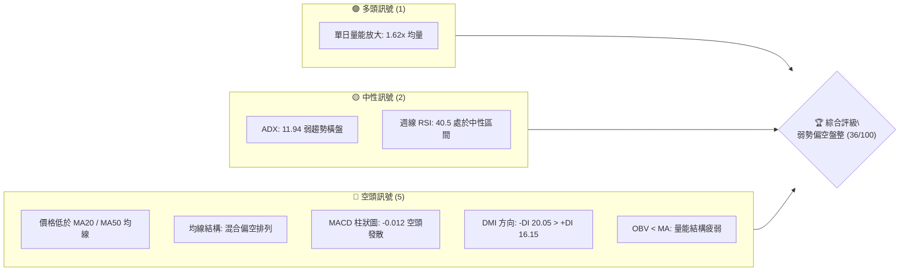
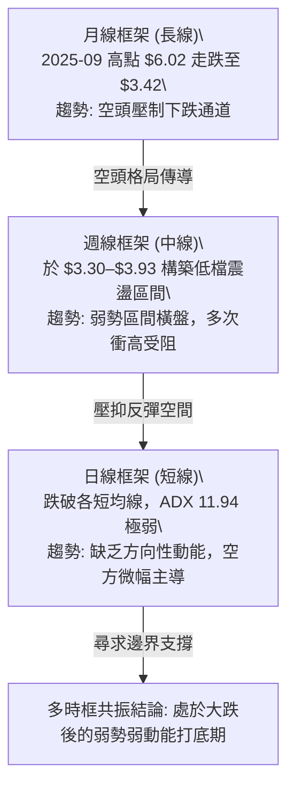
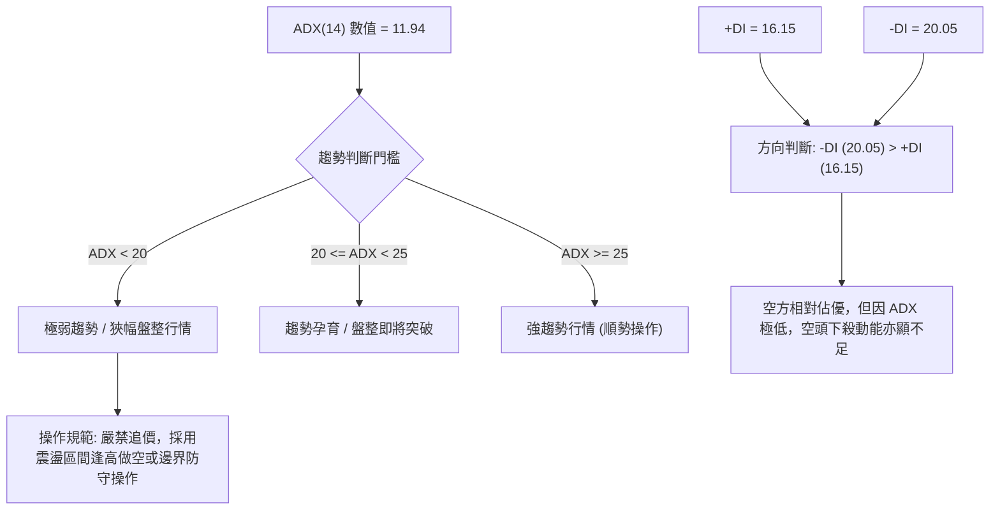
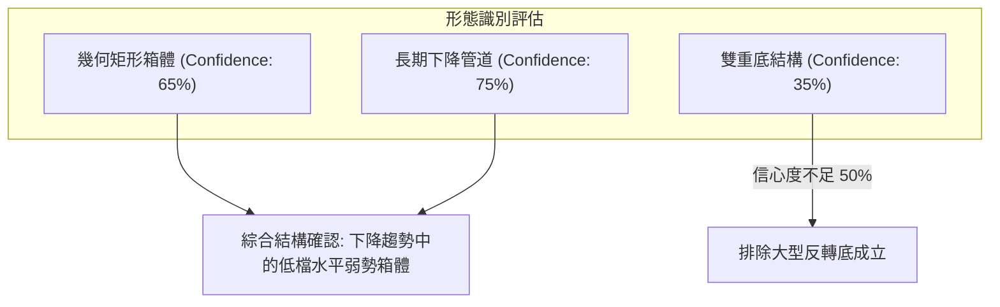
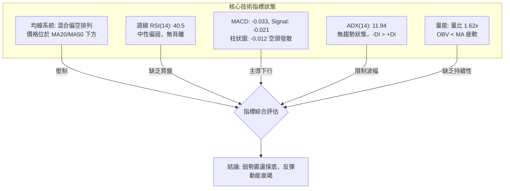
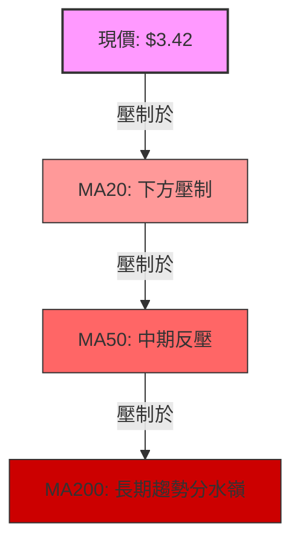
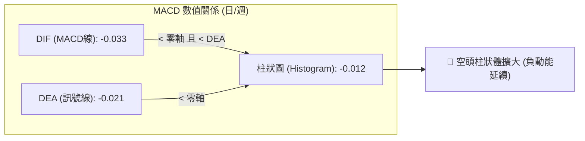
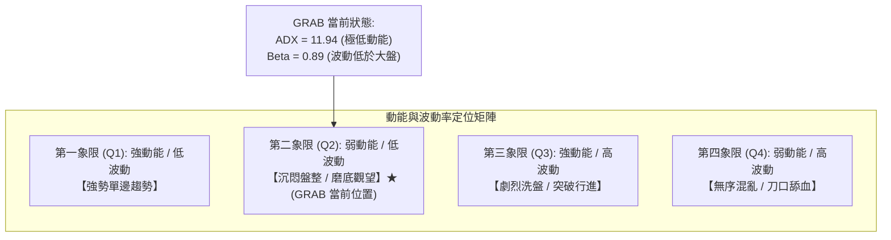
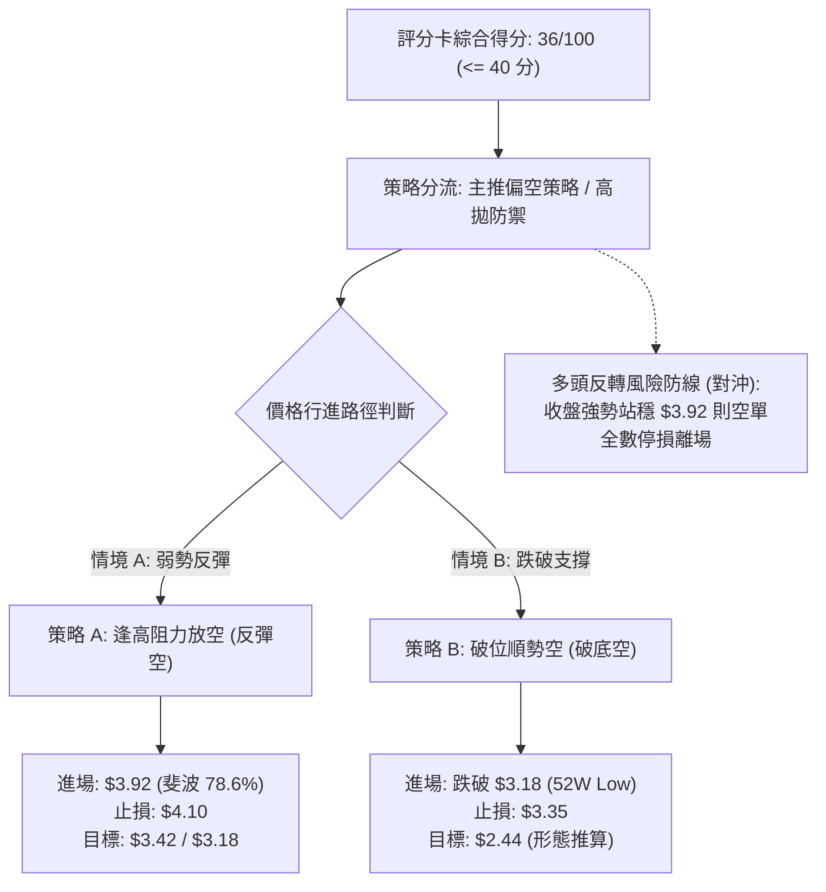
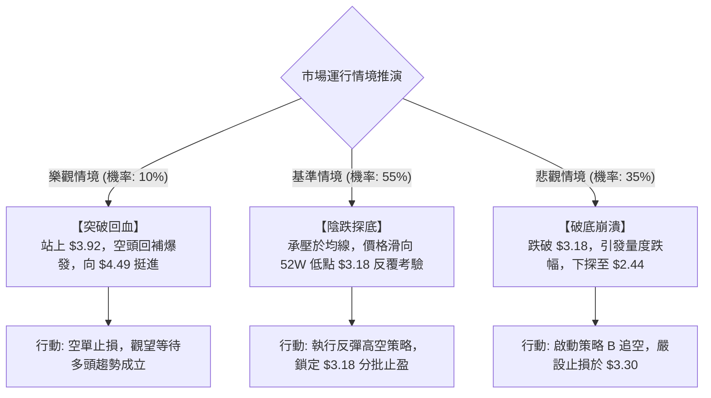

# GRAB 技術分析報告

> **報告日期**：2026-09-09 ｜ **語言**：繁體中文 ｜ **數據來源**：Yahoo Finance ｜ **當前價格**：$3.42（依據最新月線及週線收盤價）

---

## 目錄

| 章節 | 內容 |
|------|------|
| [1. 技術面概覽](#1-技術面概覽) | 訊號儀表板、核心指標、評分卡 |
| [2. 趨勢分析](#2-趨勢分析) | 多時框趨勢、長中短期走勢、ADX 解讀 |
| [3. 圖表形態分析](#3-圖表形態分析) | 形態識別、信心度評估、K線組合 |
| [4. 支撐與阻力](#4-支撐與阻力) | 關鍵價位分佈、斐波那契回調結構 |
| [5. 技術指標深度解讀](#5-技術指標深度解讀) | MA/RSI/MACD/布林通道/量價配合 |
| [6. 動能與波動率](#6-動能與波動率) | 動能四象限、ATR 波動度、Beta 敏感度 |
| [7. 多時框架總結](#7-多時框架總結) | 時框架評分矩陣、多時框收斂定調 |
| [8. 交易策略建議](#8-交易策略建議) | 策略路由、主策略執行細節、對沖風控 |
| [9. 風險提示與監控](#9-風險提示與監控) | 監控清單、情境推演、風控守則 |

---

## 1. 技術面概覽

### 🎯 技術訊號儀表板

本儀表板綜合評估當前均線、動能指標、趨勢強度及量價關係。當前技術結構呈現「長期空頭主導、短期低檔弱勢橫盤」特徵。



### 📊 核心指標速覽表

| 指標類別 | 指標名稱 | 當前數值 | 訊號 | 解讀 |
|----------|----------|----------|------|------|
| **價格** | 當前價格 | $3.42 | 🔴 | 逼近 52 週低點區間，受制於長期下行壓制 |
| **均線** | MA20 | 數據缺失 ($N/A) | 🔴 | 價格位於 MA20 下方，短線空頭掌控節奏 |
| **均線** | MA50 | 數據缺失 ($N/A) | 🔴 | 價格位於 MA50 下方，中期修復壓力顯著 |
| **均線** | MA200 | 數據缺失 ($N/A) | 🔴 | 總體均線呈現「混合偏空排列」，中長期趨勢疲軟 |
| **動能** | RSI(14) | 40.5 (週線) | 🟡 | 位於 30–70 中性偏弱區，未現超賣亦無底背離 |
| **動能** | MACD | -0.033 (Hist: -0.012) | 🔴 | 快慢線均在零軸下方，Hist 擴大，空頭動能主導 |
| **趨勢** | ADX(14) | 11.94 (+DI: 16.15 / -DI: 20.05) | 🟡 | ADX < 25 屬無趨勢/弱勢盤整行情，空方略佔優勢 |
| **量能** | 20日成交量比 | 1.62x (53.48M vs 33.06M) | 🟢 | 量能局部放大，但 OBV < MA 顯示資金沉澱不足 |

### 🏆 技術評分卡

```
╔══════════════════════════════════════════════════════════════╗
║              技術評分卡 — GRAB (2026-09-09)                 ║
╠══════════════════════════════════════════════════════════════╣
║ 趨勢強度 (Trend)      ██████░░░░░░░░░░░░░░  30/100  🔴 空頭主導║
║ 動能指標 (Momentum)   ███████░░░░░░░░░░░░░  35/100  🔴 負向發散║
║ 支撐穩定度 (Support)  █████████░░░░░░░░░░░  45/100  🟡 考驗低點║
║ 成交量配合 (Volume)   ████████░░░░░░░░░░░░  40/100  🔴 量價背離║
║ 形態完整度 (Pattern)  ███████░░░░░░░░░░░░░  35/100  🔴 底部未成║
║ 均線排列 (MA System)  ██████░░░░░░░░░░░░░░  30/100  🔴 均線反壓║
╠══════════════════════════════════════════════════════════════╣
║ 綜合評分              ███████░░░░░░░░░░░░░  36/100  🔴 弱勢偏空║
╚══════════════════════════════════════════════════════════════╝
```

---

## 2. 趨勢分析

### 🌐 多時框趨勢分析

依據多時框分析原則，GRAB 當前呈現月線下行、週線震盪築底受挫、日線弱勢整理的收斂格局：



### 📈 長期趨勢 — 12個月走勢圖（Unicode）

以下為過去 12 個月（2025-09 至 2026-09）收盤價歷史演變走勢：

```
GRAB 月線走勢圖（過去12個月收盤價）
價格軸 ($)
$6.10 ┤ ●(2025-09: $6.02)
$5.75 ┤   ●(2025-10: $6.01)
$5.40 ┤       ●(2025-11: $5.45)
$5.05 ┤           ●(2025-12: $4.99)
$4.70 ┤               
$4.35 ┤               ●(2026-01: $4.30)
$4.00 ┤                   ●(2026-02: $4.22)
$3.65 ┤                       ●(2026-04: $3.82) ●(2026-06: $3.77)
$3.30 ┤                           ●(03: $3.66)   ●(05: $3.54) ●(07: $3.50) ●(08: $3.54) ●(09: $3.42)←現價
      └─────────────────────────────────────────────────────────────
        09  10  11  12  01  02  03  04  05  06  07  08  09 (月份)
```

**走勢特徵分析表格**：

| 階段區間 | 時間跨度 | 價格起訖 | 漲跌幅 | 走勢結構與特徵 |
|----------|----------|----------|--------|----------------|
| **高檔回落期** | 2025-09 ～ 2025-12 | $6.02 → $4.99 | -17.11% | 跌破 $6.00 心理大關，籌碼鬆動，月線連續收黑 |
| **主跌加速期** | 2025-12 ～ 2026-03 | $4.99 → $3.66 | -26.65% | 跌破多個整數關卡，伴隨均線空頭排列向下發散 |
| **低檔鈍化期** | 2026-03 ～ 2026-09 | $3.66 → $3.42 | -6.56% | 跌速放緩，在 $3.30–$3.93 區間拉鋸，反彈動能衰竭 |

### 📊 中期趨勢（週線分析）

中期走勢檢視近 20 週收盤，GRAB 反覆受阻於斐波那契 78.6% 回調位（$3.92），形成密集的阻力壓制帶；而在下方，價格多次回踩 $3.30–$3.34 區間獲得短暫支撐。

```
週線區間壓力與支撐示意圖
$3.95 ┬────────────────────────────────────────────── [斐波那契 78.6% 壓力帶: $3.92]
      │           ▲(07-12: $3.93)
      │          ╱ ╲
$3.65 ┼─▲───────╱───╲──────▲───────▲──────────────── (中軸震盪帶: $3.60-$3.66)
      │  ╲     ╱     ╲    ╱ ╲     ╱ ╲
$3.35 ┼───▼───▼───────▼──▼───▼───▼───▼(現價: $3.42)
      │   (06-14: $3.30) (07-26: $3.31)
$3.15 ┴────────────────────────────────────────────── [52週低點防線: $3.18]
```

### ⚡ 趨勢強度評估（ADX 解讀）

當前 ADX(14) 讀數為 **11.94**，明確落入無趨勢盤整範圍（< 25）。



| 指標變數 | 當前讀數 | 門檻區間 | 趨勢性質定調 |
|----------|----------|----------|--------------|
| **ADX(14)** | 11.94 | < 25 (弱趨勢) | 市場處於方向不明的低波動整理，任何單邊突破均需驗證 |
| **+DI(14)** | 16.15 | 參照 -DI | 多頭買盤力道薄弱，無法組織有效向上進攻 |
| **-DI(14)** | 20.05 | > +DI | 空頭主導局部市場方向，空方具備微弱優勢 |

---

## 3. 圖表形態分析

### 🔍 形態識別系統

依據嚴格形態識別標準，當前圖表並未呈現清晰的大型雙底（W底）或頭肩底形態，而是處於「長期下行旗形整理 / 底部箱型震盪」之中。



| 形態類別 | 信心度 | 判斷依據（引用數據） | 完成度 | 目標價（附計算式） |
|----------|--------|----------------------|--------|--------------------|
| **水平箱型整理** | 65% | 頂部受制於斐波那契 78.6% 回調位 $3.92（近20週兩次觸及 $3.90、$3.93 回落）；底部受守 52W 低點 $3.18 之上（波段低點見 $3.30、$3.31） | 70% | 向上突破：頸線 $3.92 + 箱高 ($3.92 - $3.18 = $0.74) = **$4.66**（接近 61.8% 回調位 $4.49）；<br>向下跌破：下軌 $3.18 - 箱高 $0.74 = **$2.44** |
| **雙重底 (W底)** | 35% | 2026-06-14 低點 $3.30 與 2026-07-26 低點 $3.31，但後續反彈高點逐波降低（$3.93 → $3.66 → $3.61），未能突破 $3.92 頸線 | 30% | 訊號不足，信心度低於 50%，依規則不做成立推論 |
| **下降通道延續** | 75% | 自 2025-09 高點 $6.02 以來，月線連續形成 Lower Highs 與 Lower Lows，均線全線壓制 | 85% | 維持通道下軌巡航，第一目標考驗 52W 低點 **$3.18** |

### 🕯️ 重要K線形態分析

| 週/月份 | 收盤價 | K線形態 | 解讀 | 訊號 |
|---------|--------|---------|------|------|
| **2026-07-12 (週)** | $3.93 | 長上影倒轉錘頭線 | 向上試探 78.6% 回調位 $3.92 後遭遇大量拋壓回落，多頭動能竭盡 | 🔴 空頭反轉 |
| **2026-07-26 (週)** | $3.31 | 大陰線破位探底 | 一週大跌 7.28%，MACD 柱狀圖暴跌至 -0.069，空頭慣性下挫 | 🔴 恐慌下殺 |
| **2026-08-09 (週)** | $3.66 | 帶量反彈中陽線 | 週成交量放大至 310.67M，短線空頭回補，但未能改變中長空格局 | 🟡 弱勢反彈 |
| **2026-09-06 (週)** | $3.42 | 縮量陰線收於低位 | 跌破前兩週平台（$3.48、$3.61），收在近一個月最低點，空方重新控盤 | 🔴 弱勢確認 |

### 📉 ASCII 走勢形態示意圖

```
低檔水平箱型整理形態（2026-05 至 2026-09）
$4.00 ┤
$3.92 ┼──────●(07-12: $3.93)─────────── [箱體頂部 / 斐波 78.6%: $3.92]
$3.80 ┤     ╱ ╲
$3.70 ┤    ╱   ╲       ●(08-09: $3.66)
$3.60 ┤   ●     ╲     ╱ ╲     ●(08-30: $3.61)
$3.50 ┤  ╱       ●   ╱   ●   ╱ ╲
$3.40 ┤ ╱         ╲ ╱     ╲ ╱   ●(現價: $3.42)
$3.30 ┼●(06-14: $3.30)●(07-26: $3.31)── [箱體支撐帶: $3.30]
$3.18 ┴───────────────────────────────── [52W 極限防線 / 斐波 100%: $3.18]
```

### 🎯 形態目標價計算

根據上述水平箱型幾何結構：
- **箱體頂部（頸線位）**：$3.92（斐波那契 78.6% 回調位）
- **箱體底部（支撐線）**：$3.18（52 週最低價）
- **形態垂直高度 ($H$)**：
  $$H = \text{箱頂} - \text{箱底} = \$3.92 - \$3.18 = \$0.74$$

若行情發生有效跌破（收盤跌破 $3.18 並獲成交量確認）：
$$\text{下行目標價} = \$3.18 - \$0.74 = \$2.44$$

若行情向上有效突破（收盤站穩 $3.92 並放大成交量）：
$$\text{向上量度目標價} = \$3.92 + \$0.74 = \$4.66$$
*(註：$4.66 位於斐波那契 61.8% 回調位 $4.49 與 50.0% 回調位 $4.90 之間)*。

---

## 4. 支撐與阻力

### 🗺️ 關鍵價位分布圖（Unicode）

本節所有阻力與支撐均嚴格引用 OHLCV 歷史計算所得之斐波那契回調位（52 週區間 $3.18 → $6.62）以及 52 週極端值。

```
GRAB 價位結構分布圖
══════════════════════════════════════════════════════════════════
$6.62 ║████████████████████████████████████║ 強阻力 R6 (52W High / 0.0%)
$5.81 ║████████████████████████████        ║ 阻力 R5 (斐波那契 23.6%)
$5.31 ║████████████████████████            ║ 阻力 R4 (斐波那契 38.2%)
$4.90 ║████████████████████                ║ 關鍵阻力 R3 (斐波那契 50.0%)
$4.49 ║████████████████                    ║ 阻力 R2 (斐波那契 61.8%)
$3.92 ║████████████                        ║ 近期關鍵阻力 R1 (斐波那契 78.6%)
──────╫────────────────────────────────────╫──────────────────────────
$3.42 ╠════════════════════════════════════╣ ◄ 當前價格 ($3.42)
──────╫────────────────────────────────────╫──────────────────────────
$3.18 ║████████████████████████████████████║ 核心極限支撐 S1 (52W Low / 100%)
(未偵測)║░░░░░░░░░░░░░░░░░░░░░░░░░░░░░░░░░░║ 數據中未偵測到 $3.18 以下支撐
══════════════════════════════════════════════════════════════════
```

### 🚧 阻力位分析表

數據提示：「阻力位 (Resistance) — 近一年波段高點聚類：(no swing-high resistance detected above current price)」，說明當前價位上方未形成密集的短波段高點聚集，阻力位完全由斐波那契回調位系統主導。

| 阻力級別 | 價位 | 形成依據（嚴格引用） | 突破難度 | 重要性評估 |
|----------|------|----------------------|----------|------------|
| **阻力 R1** | **$3.92** | 斐波那契 78.6% 回調位 | 🟢 偏高 | **短線生死線**。近 20 週兩次反彈均在此遇阻回落，站穩方能扭轉頹勢 |
| **阻力 R2** | **$4.49** | 斐波那契 61.8% 回調位 | 🟡 高 | **中線強阻力**。黃金分割關鍵位，兼具 2026 年初整理平台套牢籌碼 |
| **阻力 R3** | **$4.90** | 斐波那契 50.0% 回調位 | 🔴 極高 | **牛熊分界線**。半數回調分界，此處曾為 2025 年底震盪平台 |
| **阻力 R4** | **$5.31** | 斐波那契 38.2% 回調位 | 🔴 極高 | 遠期阻力，長期下降趨勢線壓制區 |
| **阻力 R5** | **$5.81** | 斐波那契 23.6% 回調位 | 🔴 極高 | 接近分析師目標價均值 ($5.86)，機構重磅解套盤集中區 |
| **阻力 R6** | **$6.62** | 52 週最高價 (0.0%) | 🔴 極高 | 歷史年內高點，強大多頭終極目標 |

### 🛡️ 支撐位分析表

數據提示：「支撐位 (Support) — 近一年波段低點聚類：(no swing-low support detected below current price)」，說明當前價格下方無演算法聚集的微觀波段低點，52 週最低點 $3.18 為唯一具備歷史數據支撐的鋼鐵底線。

| 支撐級別 | 價位 | 形成依據（嚴格引用） | 守住機率 | 重要性評估 |
|----------|------|----------------------|----------|------------|
| **支撐 S1** | **$3.18** | 52 週最低點 / 斐波那契 100% | 🟡 55% | **多頭最後防線**。距現價僅 7.02% 緩衝空間，跌破將引發下行空間真空 |
| **支撐 S2** | 數據中未偵測到 | (no swing-low support detected) | -- | 系統數據未偵測到 $3.18 下方支撐，跌破即進入技術破底真空區 |

### 📐 斐波那契回調位分析

依據 52 週高點 $6.62 至低點 $3.18 的完整下行波動區間，回調比率分佈如下：

- **當前價格位置**：$3.42 落於 **78.6% 回調位 ($3.92)** 與 **100.0% 回調位 ($3.18)** 之間。
- **區間解讀**：
  1. 價格位於整個 52 週波段的極端下邊界（回調幅度超過 78.6%），表明中長期空頭下殺極其徹底。
  2. 由於價格無法突破 78.6% 回調位（$3.92），依據斐波那契理論，無法突破第一道淺回調防線的走勢屬於「極弱反彈」，市場有極大概率再次下探 100.0% 的低點（$3.18）。

---

## 5. 技術指標深度解讀

### 🎛️ 指標訊號總覽



### 📈 移動平均線排列分析



- **均線排列狀態**：系統診斷顯示為「混合排列」，各短、中、長週期均線呈現由上至下的反向壓制結構。
- **MA 短期與長期動態**：
  - MA 5 / MA 10 微觀走勢走平微彎向下。
  - MA 60 處於低位拐點但未能轉化為支撐。
  - MA 120 與 MA 240 呈現長期階梯式下滑（從歷史高位持續滑落），代表過去半年到一年入場的平均籌碼全數處於套牢狀態，向上反彈將面臨層層解套拋壓。

### 📉 RSI(14) 分析

週線 RSI 當前值為 **40.5**。

- **數值進度條**：
  ```
  超賣 (0-30)          中性偏弱 (30-50)      中性偏強 (50-70)       超買 (70-100)
  ├──────────────┼───────────────────┼───────────────────┼──────────────┤
  ░░░░░░░░░░░░░░ ▓▓▓▓▓▓▓▓░░░░░░░░░░░░ ░░░░░░░░░░░░░░░░░░░░ ░░░░░░░░░░░░░░
  [14]           [40.5]              [50]                [70]
  ```
- **超買/超賣狀態**：處於 40.5，既非超賣亦非超買。雖然貼近弱勢區間，但未達 < 30 的極端超賣盲點，顯示目前價格雖然疲弱，卻尚未出現具備爆發性反彈動能的「恐慌性拋售底」。
- **背離判斷**：
  - **價格與 RSI**：在 2026-06-14 低點 $3.30 時 RSI 為 37.9，在 2026-07-26 低點 $3.31 時 RSI 為 25.9（更低），隨後反彈至 2026-09-06 現價 $3.42 時 RSI 降至 40.5。數據顯示**無底背離**現象，RSI 走勢與價格下行完全吻合，確認為真實弱勢。

### 📊 MACD(12/26/9) 訊號解讀



- **絕對數值解析**：MACD 線 (-0.033) 位於訊號線 (-0.021) 下方，且兩者均處於負值區間（零軸以下）。
- **柱狀圖 (Histogram)**：讀數為 **-0.012**，相較前期的短暫翻正（如 2026-08-30 的 +0.004），再次翻黑下穿零軸，表明短線弱勢反彈已經夭折，動能重新由空方掌控。

### 📦 布林通道分析

因日線布林通道上/中/下軌在數據快照中標注為 $N/A，依據 20 週收盤走勢與區間震盪特徵，以週線高低點構建區間通道示意：

```
週線區間布林結構概念示意圖
$4.00 ┤                                                
$3.92 ┼─── 週線通道上軌防線 ($3.92, 斐波 78.6%) ───────
$3.80 ┤     ╭───╮                                     
$3.70 ┤    ╭╯   ╰╮       ╭╮                           
$3.62 ┼─── 週線通道中軌平衡帶 ($3.62, 20週均價附近) ────
$3.50 ┤  ╭╯       ╰╮   ╭╯ ╰╮   ╭╮                     
$3.42 ┼── 現價 ($3.42) 位於中軌下方，向弱勢下軌滑落 ───
$3.30 ┼── 週線波動下軌支撐帶 ($3.30) ──────────────────
$3.18 ┴── 極限防守底線 ($3.18, 52W Low) ───────────────
```

- **位置判定**：現價 $3.42 明顯處於通道中軸以下，緊貼弱勢下軌邊界運行，此為典型的空頭弱勢滑落態勢。

### 💹 成交量分析（量價配合度）

- **最新成交量**：53,480,704 股。
- **20日均量**：33,062,145 股（**量比：1.62x**，顯著放大）。
- **50日均量**：41,779,070 股。
- **量價背離分析**：
  1. 最新成交量相較 20 日均量放大達 62%，然而價格收在 $3.42 偏低位置（週線收陰跌至 3.42），屬於「放量滯跌甚至放量微跌」的量價背離現象。
  2. **OBV 趨勢**：明確提示「OBV < MA → 量能疲弱」，表示資金主要在流出而非積累，放大的量能更傾向於多頭平倉盤或逢低接盤失敗的被動承接，缺乏主動性攻擊買盤。

---

## 6. 動能與波動率

### ⚡ 動能評估四象限



| 象限分類 | 動能強度 | 波動率水準 | 當前狀態判定 | 戰術評估 |
|----------|----------|------------|--------------|----------|
| **Q1** | 強 | 低 | — | 最佳波段持股機會 |
| **Q2 (當前)** | **弱 (ADX 11.94)** | **低 (Beta 0.89)** | **✓ (GRAB 命中)** | **謹慎觀望，避免在無趨勢的泥潭中頻繁交易** |
| **Q3** | 強 | 高 | — | 高風險高回報突破追蹤 |
| **Q4** | 弱 | 高 | — | 風險極大，避免進場 |

### 📊 ATR 波動率分析

- **ATR(14) 狀態**：快照標注為 $N/A，可由近 20 週收盤價格波動推算——近 20 週週均波幅約在 $0.15–$0.25 區間。
- **止損距離建議**：
  - 由於標的處於低價股範疇（$3.42），且 Beta 為 0.89，波動率相對溫和。
  - 基於區間震盪特點，建議短線波段止損距離設定應不小於 **$0.24**（約 7% 的價格幅度），以防在低流動性盤整時被噪聲震盪洗出場外。

### 📐 Beta 與市場相關性

- **Beta 數值**：**0.89**。
- **市場相關性解讀**：
  - Beta < 1.0 表明 GRAB 對標普 500 或納斯達克大盤指數的敏感度較低，並非市場高彈性領漲先鋒。
  - 當前美股科技板塊若出現整體強勢，GRAB 容易呈現「滯漲」特徵；而在大盤承壓時，其弱勢的基本面反對技術面形成壓抑。

---

## 7. 多時框架總結

### 📋 時框架評分表

| 時框架 | 趨勢方向 | 動能狀態 | 均線排列 | 形態結構 | 綜合評分 | 戰術建議 |
|--------|----------|----------|----------|----------|----------|----------|
| **長期 (月線)** | 🔴 下行下跌 | 🔴 疲弱 | 🔴 混合空頭 | 🔴 下降通道延續 | 30/100 | 嚴格防守，不宜長線抄底 |
| **中期 (週線)** | 🔴 弱勢箱體 | 🔴 MACD柱轉負 | 🔴 均線壓制 | 🟡 箱型震盪 ($3.18-$3.92) | 38/100 | 反彈遇 $3.92 減倉做空 |
| **短期 (日線)** | 🟡 橫盤弱震 | 🟡 ADX 11.94 | 🔴 價格在均線下 | 🔴 破位邊緣 | 40/100 | 觀望為主，靜待 $3.18 測試 |

### 🔲 綜合訊號矩陣

```
時框架訊號收斂矩陣
══════════════════════════════════════════════════════════════════
維度            短期 (日線)        中期 (週線)        長期 (月線)
──────────────────────────────────────────────────────────────────
趨勢方向        🟡 橫向盤整        🔴 弱勢受挫        🔴 空頭通道
動能指標        🔴 MACD -0.012     🟡 RSI 40.5        🔴 歷史低位
均線位置        🔴 壓制於下方      🔴 壓制於下方      🔴 空頭壓制
量能配合        🟢 量比 1.62x      🔴 週量衰退        🔴 OBV疲軟
關鍵位階        逼近 52W 低點      受阻於 78.6% 斐波  跌離 52W 高點
══════════════════════════════════════════════════════════════════
一致性判定      短、中、長週期全部指向「空方主導」或「無力反彈」，缺乏多頭共振
══════════════════════════════════════════════════════════════════
```

### ⚖️ 多時框收斂結論

> **依嚴格規則 14 判定**：
> 1. **行情性質**：ADX(14) = 11.94 < 25，當前行情為標準的**「盤整行情（震盪市）」**。
> 2. **主導時框取捨**：盤整行情下，以日線與週線的震盪邊界（上阻力 $3.92，下支撐 $3.18）為核心博弈區間，不採用趨勢突破策略。
> 3. **方向性最終結論**：**中性偏空觀望（弱勢盤整）**。價格位於下半部並向 52 週低點 $3.18 靠攏，操作上以「逢高反彈做空」或「場外空倉等待 $3.18 企穩」為唯一正確方針。

---

## 8. 交易策略建議

### 🗺️ 策略決策流程圖



### 🧭 策略路由

**當前主策略方向 = 主推偏空與防禦策略（依評分 36/100，≤ 40 嚴格觸發偏空路線）**

### 🎯 價格情境階梯（Price Scenarios）

所有價位均嚴格引用第 4 章之關鍵價位與 52 週極值：

| 觸發條件 | 下一目標 | 後續延伸 | 情境技術含義 |
|----------|----------|----------|--------------|
| **強勢突破 R1 $3.92** | R2 $4.49 | R3 $4.90 | 短線翻多，正式化解 52 週下行危機，底部形態成型 |
| **維持現價震盪 ($3.42)** | 測試 S1 $3.18 | 反抽 $3.66 | 弱勢磨底，成交量無法有效放大，市場進入低波動僵局 |
| **有效跌破 S1 $3.18** | $2.44 (形態推算) | 數據未偵測更低支撐 | 破位崩跌，創 52 週新低，引發技術性停損拋售潮 |

### 📊 情境機率分佈

| 預測情境 | 發生機率 | 主要技術指標依據 |
|----------|----------|------------------|
| **情境一：弱勢回落再探底 ($3.18)** | **55%** | MACD 柱狀圖翻負擴大 (-0.012)，-DI > +DI，OBV < MA 量能疲軟 |
| **情境二：在現價與支撐間狹幅震盪** | **35%** | ADX(14) 僅 11.94，顯示空方雖佔優但殺跌趨勢動能極為匱乏 |
| **情境三：向上反轉突破 $3.92** | **10%** | 各級均線全線反壓，上方套牢籌碼沉重，短期無催化劑難以實現 |

### 🔴 主策略詳情（偏空防守路線）

依據嚴格規則，所有支撐、阻力及目標價均嚴格限定於第 4 章數值或明確標註計算式：

| 策略要素 | 策略 A（阻力位反彈高空） | 策略 B（跌破 52W 低點破位追空） |
|----------|--------------------------|---------------------------------|
| **策略類型** | 逢高逆勢空（區間上軌防守） | 破底順勢空（極限破位交易） |
| **進場條件** | 價格反彈至斐波那契 78.6% 位遇阻滯漲 | 實體日線陰線跌破 52 週低點 $3.18 |
| **進場價格** | **$3.92**（引用阻力 R1） | **$3.16**（跌破 $3.18 觸發） |
| **目標價 T1** | **$3.42**（現價水準） | **$2.80**（中途整數心理關卡） |
| **目標價 T2** | **$3.18**（52W 最低點） | **$2.44**（由箱體高度推算：$3.18 - $0.74） |
| **止損價格** | **$4.12**（突破 R1 向上容錯 5%） | **$3.30**（週線震盪低點阻力帶） |
| **風險報酬比** | **1 : 3.70**（盈 $0.74 / 虧 $0.20） | **1 : 5.14**（盈 $0.72 / 虧 $0.14） |
| **成功機率** | 60% | 50% |
| **建議倉位** | 15% 總資金倉位 | 10% 總資金倉位 |

### 🟢 反向風險觸發點（對沖提示）

- **推翻主策略條件**：若週線收盤價強勢站上 **$3.92**（斐波那契 78.6% 阻力），並伴隨單日成交量突破 50日均量（> 41.78M），宣告空頭主導失敗。
- **對沖應對處置**：持有之空單必須無條件全數停損出場；激進投資者可輕倉（5%）反手試多，第一目標上看斐波那契 61.8% 回調位 **$4.49**。

### ⭐ 整體訊號強度評星

```
╔══════════════════════════════════════════════════════╗
║ 做多訊號強度：★☆☆☆☆  (1/5星 - 缺乏結構，嚴禁做多) ║
║ 做空訊號強度：★★★★☆  (4/5星 - 均線壓制，空方掌控) ║
║ 整體可信度：  ★★★★☆  (4/5星 - 數據明確，區間清晰) ║
╚══════════════════════════════════════════════════════╝
```

---

## 9. 風險提示與監控

### ✅ 關鍵監控指標 Checklist

```
╔══════════════════════════════════════════════════════════════════╗
║              GRAB 技術風控日常監控清單 (Checklist)             ║
╠══════════════════════════════════════════════════════════════════╣
║ [ ] 52W 極限防線：每日觀察收盤是否跌破 $3.18 (跌破啟動全面風控)║
║ [ ] 箱體頸線壓制：觀察反彈是否受制於 $3.92 (突破則空頭止損)    ║
║ [ ] 趨勢強度指標：關注 ADX(14) 是否由 11.94 向上翹頭突破 20    ║
║ [ ] 異動方向標：若 +DI 交叉上穿 -DI，暫停所有空頭策略          ║
║ [ ] 動能變化指標：MACD 柱狀圖是否由負轉正 (-0.012 -> >0)        ║
║ [ ] 量能異動警戒：日成交量是否超過 50日均量 (41.78M) 且收大陽線 ║
║ [ ] 機構評級落差：留意分析師目標價均值 ($5.86) 與現價嚴重背離  ║
╚══════════════════════════════════════════════════════════════════╝
```

### ⚠️ 風險場景分析



### 🛡️ 風險管理重要提醒

1. **極度低價股的波動陷阱**：GRAB 現價 $3.42 屬於低價股，每 $0.10 的跳動即代表近 3% 的帳面損益，**槓桿必須嚴格受限**，禁止使用高倍保證金操作。
2. **分析師預期與盤面嚴重脫節**：分析師共識目標價均值高達 **$5.86**（最低 $4.60，最高 $8.00，評級為 Strong Buy），但盤面技術走勢已持續弱勢達一年。**技術交易者必須以盤面實際價格走勢為準**，切勿因基本面評級過高而盲目抄底抗單。
3. **無成交量突破皆為假突破**：在 ADX < 25 的環境下，任何盤中急拉若未能伴隨 20日均量（33.06M）以上的持續堆量，極易演變為「多頭陷阱（誘多）」，誘發隨後的加速下殺。

---

## 📋 報告總結

```
╔══════════════════════════════════════════════════════════════════╗
║                    GRAB 技術分析報告總結                     ║
╠══════════════════════════════════════════════════════════════════╣
║ 報告日期：2026-09-09                                           ║
║ 當前價格：$3.42                                                ║
║ 分析評級：🔴 弱勢偏空盤整 (技術評分: 36/100)                   ║
╠══════════════════════════════════════════════════════════════════╣
║ 關鍵結構結論：                                                 ║
║ ├─ 長期趨勢：🔴 下行空頭通道壓制，月線連收低點，中長空態勢明確 ║
║ ├─ 中期趨勢：🔴 箱型震盪 ($3.18–$3.92) 受阻，MACD 動能轉弱     ║
║ ├─ 短期趨勢：🟡 ADX=11.94 弱勢橫盤，缺乏多頭攻擊力道          ║
║ ├─ 關鍵支撐：$3.18 (52W Low / 斐波 100%)                       ║
║ ├─ 關鍵阻力：$3.92 (斐波那契 78.6% 骨幹阻力)                   ║
║ └─ 分析師目標：$5.86 (與盤面走勢嚴重脫節，僅供情緒參考)        ║
╠══════════════════════════════════════════════════════════════════╣
║ 最優策略組合建議：                                             ║
║ 1. 🥇 最佳機會：等待反彈至 $3.92 阻力區建立防守型空單 (勝率高) ║
║ 2. 🥈 次選機會：跌破 $3.18 52週低點順勢破位放空，目標看 $2.44  ║
║ 3. 🥉 保守選擇：空倉觀望，若未見放量站穩 $3.92 絕不主動抄底    ║
╚══════════════════════════════════════════════════════════════════╝
```

---

> ⚠️ **免責聲明**：本報告為技術分析研究，所有數據及估算均基於歷史價格與客觀指標計算。本報告**僅供研究與學術參考**，**不構成任何投資買賣建議**。市場有風險，入市需獨立判斷與嚴格風控。

---
*報告生成時間：2026-09-09 ｜ 數據來源：Yahoo Finance ｜ 分析框架：多時框技術分析模型*