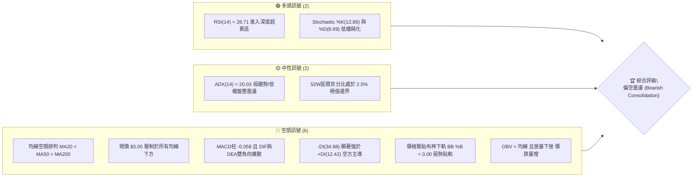
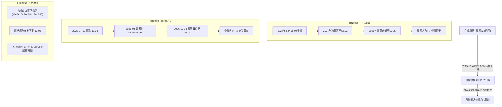
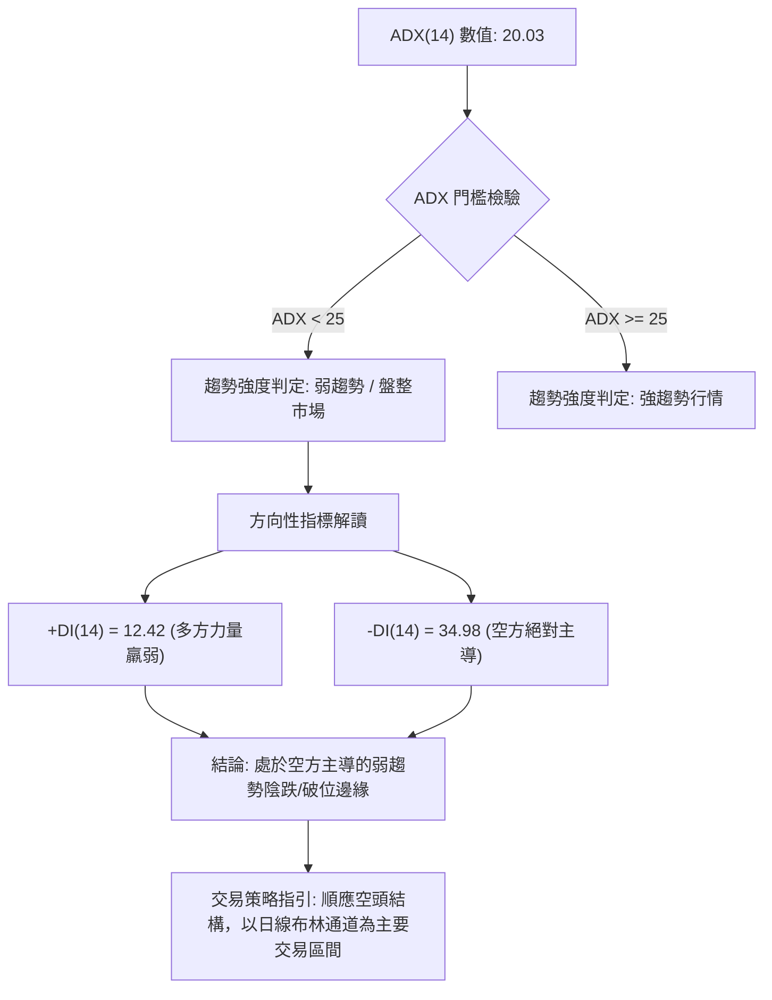
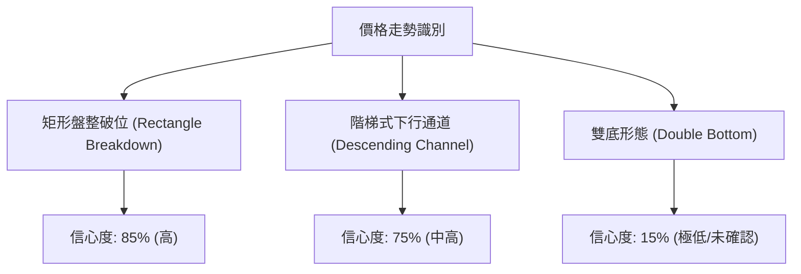
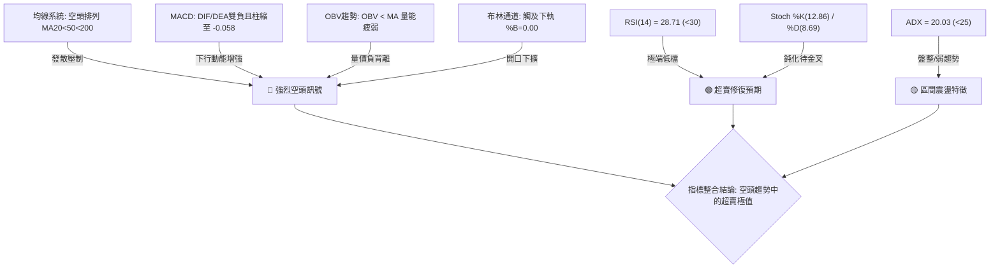
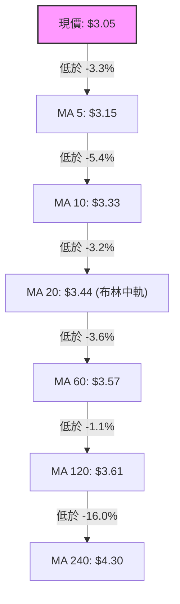
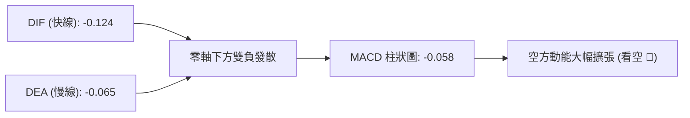
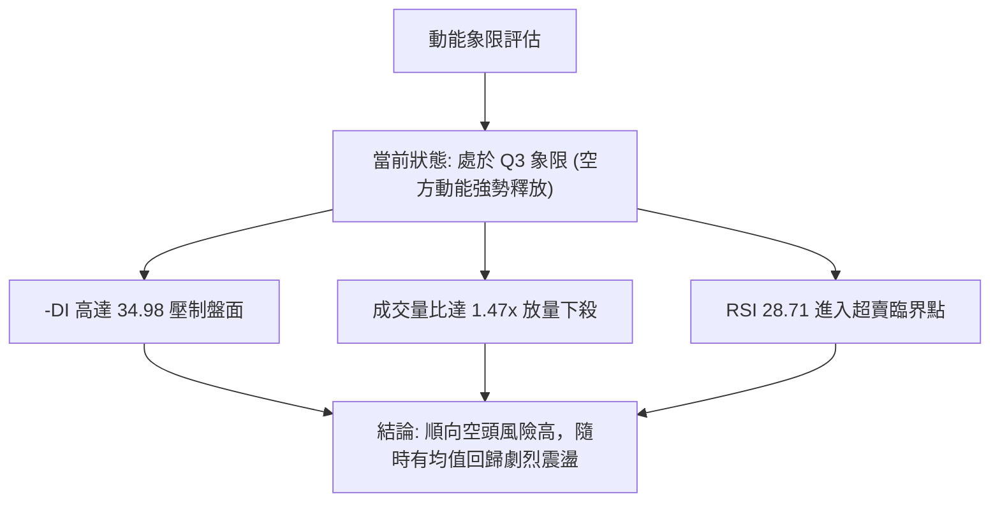
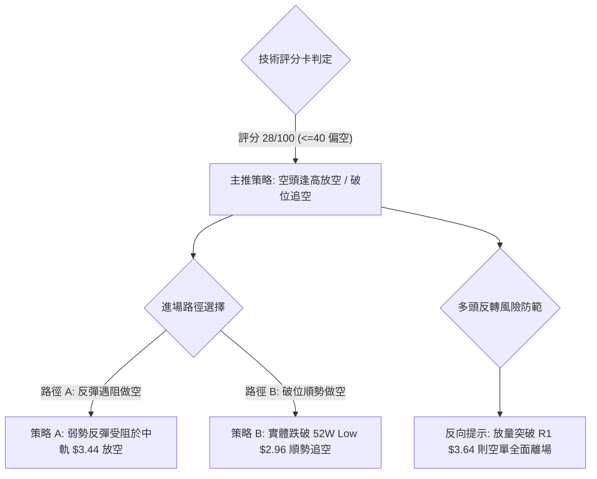
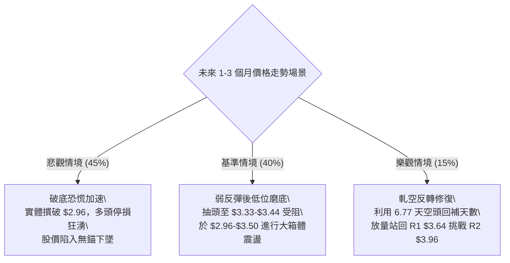

# GRAB 技術分析報告

> **報告日期**：2026-09-12 ｜ **語言**：繁體中文 ｜ **數據來源**：Yahoo Finance ｜ **當前價格**：$3.05

---

## 目錄

| 章節 | 內容 |
|------|------|
| [1. 技術面概覽](#1-技術面概覽) | 訊號儀表板、核心指標、評分卡 |
| [2. 趨勢分析](#2-趨勢分析) | 多時框趨勢、長中短期走勢 |
| [3. 圖表形態分析](#3-圖表形態分析) | 形態識別、K線組合、目標價 |
| [4. 支撐與阻力](#4-支撐與阻力) | 關鍵價位、斐波那契回調 |
| [5. 技術指標深度解讀](#5-技術指標深度解讀) | MA/RSI/MACD/布林/成交量 |
| [6. 動能與波動率](#6-動能與波動率) | 動能評估、ATR、Beta |
| [7. 多時框架總結](#7-多時框架總結) | 時框架評分矩陣 |
| [8. 交易策略建議](#8-交易策略建議) | 多空策略、風險報酬比 |
| [9. 風險提示與監控](#9-風險提示與監控) | 監控指標、風險場景 |

---

## 1. 技術面概覽

### 🎯 技術訊號儀表板



### 📊 核心指標速覽表

| 指標類別 | 指標名稱 | 當前數值 | 訊號 | 解讀 |
|----------|----------|----------|------|------|
| **價格** | 當前價格 | $3.05 | 🔴 | 位於 52 週最低點 $2.96 邊緣（區間 2.5%），極度疲弱 |
| **均線** | MA20 | $3.44 | 🔴 | 價格低於 MA20 達 -11.39%，短線下行斜率陡峭 |
| **均線** | MA50 | $3.57 | 🔴 | 價格低於 MA50 達 -14.56%，中期空頭壓制明顯 |
| **均線** | MA200 | $4.00 | 🔴 | 價格低於牛熊分界線 MA200 達 -23.75%，長期空頭主導 |
| **動能** | RSI(14) | 28.71 | 🟢 | 跌破 30 進入超賣區，具備技術性死貓反彈潛力 |
| **動能** | MACD(12,26,9) | DIF: -0.124 / DEA: -0.065 / 柱: -0.058 | 🔴 | 零軸下方死叉發散，動能柱擴大，空頭加速推進 |
| **動能** | Stoch %K/%D | %K: 12.86 / %D: 8.69 | 🟢 | 雙線落於 20 以下超賣區，短線殺跌動能接近衰竭極限 |
| **趨勢** | ADX / DMI | ADX: 20.03 / +DI: 12.42 / -DI: 34.98 | 🔴 | ADX<25 顯示整體呈現弱趨勢震盪，但 -DI 壓倒性勝過 +DI |
| **通道** | Bollinger Bands | 上軌: $3.84 / 中軌: $3.44 / 下軌: $3.05 | 🔴 | %B = 0.00，收盤直接壓在下軌，通道呈開口擴張趨勢 |
| **量能** | 成交量 / OBV | 最新量: 63.16M (量比: 1.47x) / OBV疲弱 | 🔴 | 伴隨大陰線跌破放量（週成交量 354.7M），籌碼浮動溢出 |
| **波動** | ATR(14) | $0.12 (佔股價 4.09%) | 🟡 | 單日波幅適中，但相較窄幅震盪期略有放大 |

### 🏆 技術評分卡

```
╔══════════════════════════════════════════════════════════════════╗
║                 技術評分卡 — GRAB (2026-09-12)                   ║
╠══════════════════════════════════════════════════════════════════╣
║ 趨勢強度      ██████░░░░░░░░░░░░░░  30/100  🔴 空頭壓制強烈       ║
║ 動能指標      ████████░░░░░░░░░░░░  40/100  🟡 極端超賣有修復需求 ║
║ 支撐穩定度    ████░░░░░░░░░░░░░░░░  20/100  🔴 逼近52W新低無支撐 ║
║ 成交量配合    ██████░░░░░░░░░░░░░░  30/100  🔴 放量下跌量能失衡   ║
║ 形態完整度    ██████░░░░░░░░░░░░░░  30/100  🔴 區間破位尋底形態   ║
║ 均線排列      ████░░░░░░░░░░░░░░░░  20/100  🔴 完美空頭發散排列   ║
╠══════════════════════════════════════════════════════════════════╣
║ 綜合評分      ██████░░░░░░░░░░░░░░  28/100  🔴 強烈看空 / 偏空反彈║
╚══════════════════════════════════════════════════════════════════╝
```

---

## 2. 趨勢分析

### 🌐 多時框趨勢分析



### 📈 長期趨勢 — 12個月走勢圖（Unicode）

```
GRAB 月線走勢圖（2025-09 至 2026-09）
價格軸 ($)
$6.02 ┤ ● ── ●(2025-10 $6.01)
$5.45 ┤       ╲
$4.99 ┤        ● ── ●(2025-12)
$4.30 ┤              ╲
$4.22 ┤               ● ── ●(2026-02)
$3.82 ┤                     ╲     ●(2026-04)
$3.66 ┤                      ●   ╱ ╲     ●(2026-06)
$3.50 ┤                         ●   ╲   ╱ ╲   ● ── ●(2026-08 $3.54)
$3.05 ┤                               ●    ●        ╲
$2.96 ┴───────────────────────────────────────────────●← 現價 $3.05
        09  10  11  12  01  02  03  04  05  06  07  08  09 (月份)
```

**走勢特徵分析表格**：

| 階段區間 | 時間跨度 | 起訖價格 | 區間漲跌幅 | 走勢特徵與量價結構 |
|----------|----------|----------|------------|-------------------|
| 高位雙頂派發期 | 2025-09 ~ 2025-10 | $6.02 → $6.01 | -0.17% | 於 $6.00 關卡形成密集高位滯漲平台，籌碼大規模派發 |
| 初始下殺破位期 | 2025-11 ~ 2026-01 | $5.45 → $4.30 | -21.10% | 快速跌破 $5.00 整數關卡，均線系統開始由走平轉為下拐 |
| 中期階梯式陰跌 | 2026-02 ~ 2026-05 | $4.22 → $3.54 | -16.11% | 呈現典型的反彈無力（4月微彈至 $3.82 即遭空頭反撲） |
| 低檔盤整中繼期 | 2026-06 ~ 2026-08 | $3.77 → $3.54 | -6.10% | 在 $3.50 至 $3.77 區間收斂，週成交量顯著萎縮 |
| 破位尋底加速期 | 2026-09 至今 | $3.54 → $3.05 | -13.84% | 破位放量重挫，週成交量暴增至 354.7M，直逼 52W 低點 |

### 📊 中期趨勢（週線分析）

```
GRAB 週線關鍵壓力與支撐示意圖
════════════════════════════════════════════════════════════════════
$3.96 ──────────────────────────────────────── 阻力 R2 (7月反彈高點聚類)
          ╭───╮
         │ 7月│ $3.93
─────────╯   ╰──────────────────────────────── 阻力 R1 $3.64 (8月波段平台高點)
                 ╭─╮     ╭─╮
                │ │     │ │ $3.61
────────────────╯ ╰─────╯ ╰─╮
                            ╰────────────── 現價 $3.05 (貼近52W Low)
- - - - - - - - - - - - - - - - - - - - - - 
$2.96 ┄┄┄┄┄┄┄┄┄┄┄┄┄┄┄┄┄┄┄┄┄┄┄┄┄┄┄┄┄┄┄┄ 52W 最低點 (最後防線)
════════════════════════════════════════════════════════════════════
```

### ⚡ 趨勢強度評估（ADX 解讀）



| 指標名稱 | 當前數值 | 參考標準 | 當前狀態判定 |
|----------|----------|----------|--------------|
| **ADX(14)** | 20.03 | <20 極弱; 20-25 偏弱/無趨勢; >25 強趨勢 | 偏弱趨勢，尚未形成單邊持續性高速狂奔，屬陰跌型盤整破位 |
| **+DI(14)** | 12.42 | >25 多頭主導; <15 多頭極度虛弱 | 多頭動能匱乏，買盤承接力極差 |
| **-DI(14)** | 34.98 | >25 空頭強勢; >30 空頭絕對控制 | 空頭全面主控盤面，盤中拋壓沉重 |
| **DI 差值** | -22.56 | 負值擴大表示下行壓力加劇 | 空方優勢巨大，任何無量反彈皆為技術性修正 |

---

## 3. 圖表形態分析

### 🔍 形態識別系統



| 形態 | 信心度 | 判斷依據（引用數據） | 完成度 | 目標價（附計算式） |
|------|--------|----------------------|--------|--------------------|
| **箱體盤整跌破** | 85% | 2026年5月至8月收盤價長期在 $3.50 至 $3.77 震盪，2026-09-13 以大陰線收盤 $3.05 放量摜破箱底 | 100% (已破位) | 跌破箱底 $3.50 - 形態高度 ($3.77 - $3.50 = $0.27) = 由箱體高度推算目標價 $3.23 (已跌破超額滿足) |
| **均線空頭發散** | 90% | MA5($3.15) < MA10($3.33) < MA20($3.44) < MA60($3.57) < MA120($3.61) < MA240($4.30) 全面順序排列下行 | 100% | 沿通道下軌推進，下方無歷史波段支撐聚類，朝 52W Low $2.96 尋求測試 |
| **雙重底潛在反轉** | 15% | 需仰賴 52W 低點 $2.96 提供強力支撐，目前現價 $3.05 尚未出現止跌或右底結構確認 | 10% (純屬臆測) | 訊號不足，僅做指標型解讀（嚴禁以此建構核心策略） |

### 🕯️ 重要K線形態分析

| 月份 | 收盤價 | K線形態 | 解讀 | 訊號 |
|------|--------|---------|------|------|
| **2025-09** | $6.02 | 長陽衝頂星線 | 股價逼近歷史高位 $6.62 後動能衰竭，留長上影線 | 🟡 頂部預警 |
| **2025-10** | $6.01 | 高位十字星/停頓線 | 多空在 $6.00 激烈爭奪，實體極小，成交量未能放大 | 🔴 見頂確認 |
| **2025-11** | $5.45 | 破位中陰線 | 吞沒前月低點，實體向下跌破 $5.80 支撐，中線轉空 | 🔴 空頭啟動 |
| **2026-03** | $3.66 | 探底長下影陰線 | 單月自 $4.22 重挫至 $3.66，短線賣壓爆發但引發初步承接 | 🟡 下行中繼 |
| **2026-07** | $3.50 | 衝高回落倒錘頭 | 當月週線曾衝刺 $3.93，隨後遭空方全數抹平，反彈宣告夭折 | 🔴 多頭陷阱 |
| **2026-08** | $3.54 | 窄幅十字星孕線 | 振幅收窄，市場進入方向抉擇期，成交量大幅縮減 | 🟡 變盤前兆 |
| **2026-09** | $3.05 | 大陰線破位放量 | 實體一舉跌破前低 $3.50，週放量至 354.7M，屬典型崩跌K線 | 🔴 極度看空 |

### 📉 ASCII 走勢形態示意圖

```
GRAB 箱體破位與下行階梯示意圖
價格 ($)
$3.77 ┬─────────── 頂部阻力（箱頂）
      │   ╭─╮     ╭─╮
$3.64 ┼───╯ ╰─╮   │ │   <- 阻力 R1
      │       ╰─╮ │ ╰─╮
$3.50 ┼─────────┴─┴───┴────── 頸線支撐（箱底破位點）
      │                        ╲
      │                         ╲  向下破位發散
$3.05 ┼──────────────────────────● 現價（加速下墜段）
      │                            │
$2.96 ┴────────────────────────────┴─ 52W Low（終極考驗位）
```

### 🎯 形態目標價計算

依據傳統技術形態學中的「等距測幅原則（Measured Move Rule）」與本數據之箱體結構推算：

1. **破位結構**：2026-05 至 2026-08 形成的長達4個月之橫盤矩形中繼形態。
   - **箱體頂部（阻力）**：$3.77
   - **箱體底部（破位頸線）**：$3.50
   - **形態垂直高度**：$3.77 - $3.50 = $0.27
2. **第一等距量度跌幅目標**：
   $$\text{目標價 1} = \text{箱底} - \text{形態高度} = 3.50 - 0.27 = \$3.23$$
   *(走勢於 2026-09 週線直接以 $3.05 摜穿此目標，反映空方拋售力道超越標準等距跌幅)*
3. **第二延伸量度目標（1.618倍延伸）**：
   $$\text{延伸目標價} = 3.50 - (0.27 \times 1.618) = 3.50 - 0.44 = \$3.06$$
   現價 $3.05 正好精準落於 1.618 延伸跌幅之目標位（$3.06），顯示此波下殺在短線上已完成空頭形態的完全釋放，下檔將直接遭遇 52 週最低點 $2.96 之剛性考驗。

---

## 4. 支撐與阻力

### 🗺️ 關鍵價位分布圖（Unicode）

```
GRAB 價位結構分布圖
═══════════════════════════════════════════════════
$6.62 ║████████████████████████║ 52W High (0.0% 斐波那契回調位)
$4.36 ║████████████████        ║ 61.8% 斐波那契回調位 (長期強壓)
$4.06 ║████████████████████████║ 強阻力 R3 (近一年波段高點聚類)
$3.96 ║████████████████████    ║ 阻力 R2 (近一年波段高點聚類)
$3.74 ║▓▓▓▓▓▓▓▓▓▓▓▓▓▓▓▓        ║ 78.6% 斐波那契回調位
$3.64 ║████████████████████████║ 關鍵阻力 R1 (近一年波段高點聚類)
$3.44 ║▒▒▒▒▒▒▒▒▒▒▒▒▒▒▒▒▒▒▒▒▒▒▒▒║ 布林中軌 / MA20 下壓阻力位
$3.05 ╠════════════════════════╣ ◄ 現價 $3.05 (布林下軌貼軌處)
$2.96 ║████████████████████████║ 52W Low (100.0% 斐波那契回調位 / 最後防線)
(數據中未偵測到下方波段低點聚類支撐)
═══════════════════════════════════════════════════
```

### 🚧 阻力位分析表

價位數據嚴格引用自「關鍵價位（由 OHLCV 計算）」之波段高點聚類：

| 阻力級別 | 價位 | 形成原因 | 突破難度 | 重要性 |
|----------|------|----------|----------|--------|
| **R1** | $3.64 | 近一年波段高點聚類，亦為 2026-08 月底的反彈遇阻平台高位（距離現價 +19.43%） | ⭐️⭐️⭐️⭐️ (極高) | 關鍵頸線阻力，多頭短線翻轉的唯一確認關卡 |
| **R2** | $3.96 | 近一年波段高點聚類，對應 2026-07 中旬波段高點 $3.93 附近之強賣壓區（距離現價 +29.73%） | ⭐️⭐️⭐️⭐️⭐️ (極高) | 中期空頭防線，未站穩前長期下行架構無法改變 |
| **R3** | $4.06 | 近一年波段高點聚類，與 MA200 牛熊線（$4.00）共振形成重合壓力帶（距離現價 +33.11%） | ⭐️⭐️⭐️⭐️⭐️ (鐵壁) | 長期多空分水嶺，機構法人主要減倉防守區域 |

### 🛡️ 支撐位分析表

依據數據庫檢驗，當前價格下方之「波段低點聚類（swing-low support）」為：**數據中未偵測到（no swing-low support detected below current price）**。

| 支撐級別 | 價位 | 形成原因 | 守住機率 | 重要性 |
|----------|------|----------|----------|--------|
| **S1 (數據中未偵測到波段低點聚類)** | $2.96 | 52週最低價 (52W Low) 及 100.0% 斐波那契極限回調位 | 35% | 極弱心理防線，一旦失守技術面將直接落入無錨真空狀態 |
| **S2** | 數據中未偵測到 | 下方無歷史成交密集聚類 | N/A | 若跌破 $2.96 將進入歷史價格未知領域 |
| **S3** | 數據中未偵測到 | 下方無歷史成交密集聚類 | N/A | 缺乏任何結構性支撐數據依據 |

### 📐 斐波那契回調位分析

依據 52 週完整波動區間（最高點 $6.62 至 最低點 $2.96，全波段落差 $3.66）計算之精確回調位：

| 斐波那契水平 | 精確價位 | 相對現價位置 | 結構性技術意義解讀 |
|--------------|----------|--------------|-------------------|
| **0.0% (52W High)** | $6.62 | +117.05% | 過去52週行情頂峰，多頭行情的絕對終結點 |
| **23.6%** | $5.76 | +88.85% | 初級回調位，失守後宣告中長期多頭轉入深度回檔 |
| **38.2%** | $5.22 | +71.15% | 黃金分割弱支撐，已被單邊趨勢大幅摜破 |
| **50.0%** | $4.79 | +57.05% | 多空中間均衡軸心，此價位下方整體空間完全由空方掌控 |
| **61.8%** | $4.36 | +42.95% | 黃金分割強防守位，2026年初跌破此位宣告長期架構徹底翻空 |
| **78.6%** | $3.74 | +22.62% | 空頭深次回調阻力，與箱體頂部 $3.77 產生空間共振 |
| **100.0% (52W Low)** | $2.96 | -2.95% | 52週區間底部，目前現價 $3.05 距離此位僅有不到 3% 的安全墊 |

**回調位深度解讀**：
當前收盤價 $3.05 處於 **78.6% ($3.74)** 與 **100.0% ($2.96)** 回調位之間，且極度偏向 100.0% 極值（僅差 $0.09）。在技術分析法則中，當價格回吐前期全部漲幅的 78.6% 以上時，原上升趨勢已被 100% 破壞，行情不再屬於「上漲趨勢的回調」，而是進入「崩解尋底」階段。若 $2.96 告破，斐波那契擴展目標將指向更深不可測的區間。

---

## 5. 技術指標深度解讀

### 🎛️ 指標訊號總覽



### 📈 移動平均線排列分析



| 均線名稱 | 當前價位 | 乖離率 (Bias) | 均線歷史軌跡形態 | 趨勢研判 |
|----------|----------|---------------|------------------|----------|
| **MA 5** | $3.15 | -3.30% | ▄▅▆▇████████▇▇▆▆▆▆▆▇▇▇▇▆▆▅▄▃▂▁ | 極短線下切，壓制股價反撲 |
| **MA 10** | $3.33 | -8.49% | ▂▂▃▄▅▆▆▇█████▇▇▆▆▆▆▆▆▅▅▅▅▅▄▃▂▁ | 短期加速下滑，空頭加速器 |
| **MA 20** | $3.44 | -11.39% | ███▇▇▆▆▆▅▅▅▅▅▅▆▆▇▇████▇▇▆▆▅▃▂▁ | 20日成本線崩潰，轉為中期重壓 |
| **MA 60** | $3.57 | -14.56% | ▂▁▁▁▁▁▁▂▃▄▄▅▄▄▄▃▃▃▃▃▄▅▆▇███▆▃▁ | 季度均線走平後快速下傾 |
| **MA 120**| $3.61 | -15.60% | ████▇▇▇▆▆▆▅▅▅▄▄▄▃▃▃▃▃▂▂▂▂▂▁▁▁▁ | 半年線持續處於下行週期 |
| **MA 240**| $4.30 | -29.10% | ██████▇▇▇▇▇▆▆▆▆▆▅▅▅▅▄▄▃▃▃▂▂▁▁▁ | 長期牛熊分水嶺，嚴重負乖離 |

**均線綜合研判**：
6條主要均線呈現絕對的「標準空頭發散排列」，無任何均線走平向上。短期負乖離率（MA20乖離 -11.39%、MA240乖離 -29.10%）已進入歷史較高水準，暗示下行隨時可能遭遇空頭回補引發的脈衝式抽頭反彈，但上方層層均線意味著反彈空間將受嚴格壓縮。

### 📉 RSI(14) 分析

- **RSI(14) 數值進度條**：
  ```
  RSI(14): 28.71  [███████░░░░░░░░░░░░░] 28.71%  🟢 深度超賣 (<30)
  ```
- **超買超賣區間判讀**：RSI 跌破 30 閾值至 28.71，進入技術性超賣區。
- **背離分析（Divergence）**：
  - 回顧週線歷史數據：2026-05-10 週收盤 $3.72 時 RSI 為 20.5；2026-07-26 週收盤 $3.31 時 RSI 為 25.9；本次週收盤下探 $3.05 時 RSI 為 28.71。
  - **結論**：價格創下新低（$3.05 < $3.31 < $3.72），但週線 RSI 數值卻逐步抬高（28.71 > 25.9 > 20.5）。這構成潛在的**週線級別底背離雛形**！然而，官方指標快照明確指出「RSI背離：無明顯背離」，原因在於日線層級上價格與 RSI 同步順勢破位下挫，尚未出現底背離金叉確認訊號，因此**不可單憑背離預期冒進抄底**。

### 📊 MACD(12/26/9) 訊號解讀



- **MACD 詳細數值**：
  - 快線 (MACD)：$-0.124$
  - 慢線 (Signal)：$-0.065$
  - 動能柱 (Histogram)：$-0.058$
- **指標交叉與形態解讀**：MACD 快線已遠遠沉入零軸下方，且快慢線負向開口持續擴大。動能柱為 $-0.058$，相較於前期（前週 -0.015）呈現空頭動能暴增跡象。尚未形成任何底背離或鈍化收斂，指示盤面完全由空頭動能定價。

### 📦 布林通道分析

```
GRAB 布林通道 (20, 2) 結構圖
價格 ($)
$3.84 ┬───────────────────────────────── BB 上軌 (+2σ)
      │
$3.44 ┼───────────────────────────────── BB 中軌 (MA20 基基準)
      │      ╲
      │       ╲ 下軌被強行推開擴張
$3.05 ┴────────●──────────────────────── BB 下軌 (-2σ) / %B = 0.00
```

- **通道寬度與走勢特性**：
  - 上軌：$3.84
  - 中軌：$3.44
  - 下軌：$3.05
  - 通道帶寬 (Bandwidth)：$$\frac{3.84 - 3.05}{3.44} = \frac{0.79}{3.44} = 22.97\%$$
  - %B 數值：$$0.00$$（收盤價精確嵌合在下軌）
- **通道走勢意義**：%B 歸零且收在下軌，反映價格進入「貼軌下行（Walking down the band）」的強烈單邊殺跌波段。在此狀態下，下軌失去支撐效應，轉化為向下滑動的軌道。

### 💹 成交量分析（量價配合度）

```
量價微觀對比
────────────────────────────────────────────────────
當日成交量:   63,157,000 股
20日均量:     42,823,960 股  (成交量比: 1.47x ▓▓▓▓▓▓▓▓▓▓▓▓▓▓▓ 放大)
週成交量:     354,747,200 股 (創近20週以來最高成交放量紀錄)
OBV 趨勢:     OBV < MA → 量能嚴重疲弱流出
────────────────────────────────────────────────────
```

- **量價配合判斷**：
  2026-09-13 當週，收盤價自 $3.42 暴跌至 $3.05（單週重挫 -10.82%），但週成交量從前週的 166.3M 爆衝至 354.7M（增幅達 113%）。這種在支撐破位處爆出的「價跌量增」現象，代表機構資金在此處執行止損或強制平倉拋售，OBV 低於均線並持續創新低，量價同步看空，尚未出現縮量止跌的右側訊號。

---

## 6. 動能與波動率

### ⚡ 動能評估四象限

根據當前 ADX(14)=20.03（顯示趨勢性尚未轉為高烈度趨勢，偏向區間/弱趨勢）、動能方向指標 -DI(34.98) 壓倒 +DI(12.42)，以及 ATR 波動率佔比 4.09% 進行綜合評估：

| 象限標籤 | 動能特徵 | 波動率特徵 | GRAB 當前定位 | 戰略應對方針 |
|----------|----------|------------|---------------|--------------|
| **Q1 (爆發順勢)** | 強多頭動能 | 低波動累積 | — | 最佳趨勢進場點（非目前狀態） |
| **Q2 (鈍化盤整)** | 弱多頭動能 | 低波動收斂 | — | 謹慎觀望等待方向確認 |
| **Q3 (空頭釋放)** | 強空頭動能 | 高波動放大 | **✓ 當前歸屬 (Q3)** | **破位放量階段，高下行風險，不可盲目抄底** |
| **Q4 (流動性衰竭)**| 極弱動能 | 低波動死寂 | — | 避開無成交量之標的 |



### 📊 ATR 波動率分析

- **ATR(14) 數值**：**$0.12**
- **波動佔比**：佔當前股價 $3.05 之 **4.09%**
- **市場波動涵義**：GRAB 每日正常隨機波動區間約在 $\pm \$0.12$。這意味著單日振幅約在 $2.93 至 $3.17 之間。
- **動態止損距離設置依據**：
  - **超短線策略**：採用 $1.0 \times \text{ATR} = \$0.12$
  - **波段中線策略**：採用 $1.5 \times \text{ATR} = \$0.18$ 至 $2.0 \times \text{ATR} = \$0.24$
  - 當前止損若設小於 $0.12，極易被隨機噪音洗盤出場；若設於 $0.18，則能有效抵禦盤中破底翻的假突破假摔。

### 📐 Beta 與市場相關性

- **Beta 係數**：**0.89**
- **相關性特徵**：Beta < 1.0，表明 GRAB 與美股大盤（S&P 500 / Nasdaq）之系統性波動呈中度正相關，且防禦性理論上略高於高貝塔成長股。然而，在個股破位下行階段，其下殺動能主要來自個股基本面營收與自由現金流利潤率不佳（營運現金流為負 $-60.00M）及短線籌碼恐慌，非單純受大盤系統性風險驅動。

---

## 7. 多時框架總結

### 📋 時框架評分表

| 時框架 | 趨勢方向 | 動能狀態 | 均線排列 | 形態結構 | 綜合評分 | 戰略建議 |
|--------|----------|----------|----------|----------|----------|----------|
| **長期 (月線)** | 🔴 強烈空頭 | MACD下行擴散 | MA200($4.00)重度壓制 | 自$6.02見頂反轉陰跌 | 20/100 | 長期投資者不可介入，靜待出清 |
| **中期 (週線)** | 🔴 破位下殺 | 週MACD柱 -0.058 放量 | MA20<50<200 均線順向跌 | $3.50 箱體大破位 | 25/100 | 順勢逢高放空，反彈皆為逃命波 |
| **短期 (日線)** | 🟡 超賣鈍化 | RSI 28.71 極端超賣 | 均線負乖離率擴大 | 布林下軌貼軌破位 | 35/100 | 嚴禁追空，激進者可博極小反彈 |

### 🔲 綜合訊號矩陣

| 維度 | 短期 (1-5日) | 中期 (1-4週) | 長期 (1-6個月) | 多時框共振判定 |
|------|--------------|--------------|----------------|----------------|
| **均線信號** | 🔴 負乖離過大 (MA5 $3.15) | 🔴 MA20/MA50 空頭排列 | 🔴 位於 MA200 下方 | 全週期強烈看空 |
| **動能信號** | 🟢 RSI超賣 (<30) | 🔴 MACD死叉擴大 | 🔴 下行趨勢主導 | 短多中空（超賣反彈） |
| **量價結構** | 🔴 放量破位下跌 | 🔴 OBV持續下行 | 🔴 高位持續縮量流出 | 籌碼持續外逃 |
| **形態信號** | 🔴 擊穿布林下軌 $3.05 | 🔴 箱底 $3.50 破位 | 🔴 跌向52W低點 $2.96 | 結構破裂 |

### ⚖️ 多時框收斂結論

依據多時框收斂規則（Rule 14）：
1. **趨勢強度辨識**：ADX(14) 讀數為 **20.03 (<25)**，嚴格定義為**盤整/弱趨勢行情**。
2. **主導規則確認**：在 ADX < 25 條件下，市場以**日線布林通道上下軌**（$3.05 ~ $3.84）為主要交易邊界，並由中長期均線（MA20 $3.44、MA50 $3.57）設定反彈天花板。
3. **時框衝突取捨**：雖然日線指標（RSI=28.71、Stoch %K=12.86）出現深度超賣的反彈訊號，但週線與月線之空頭趨勢強烈壓制（均線完美空頭發散、週成交量放量下殺）。因此，**短期超賣僅能定性為技術性修復，不可視為中長期反轉**！
4. **唯一方向性結論**：**偏空震盪（Bearish Consolidation）**，整體操作思路為「**順應中長空頭，逢反彈至阻力位布空；或超短線輕倉博弈超賣反抽，嚴格快進快出**」。

---

## 8. 交易策略建議

### 🗺️ 策略決策流程圖



### 🧭 策略路由

> **當前主策略方向 = 主推空頭策略（依技術評分卡 28/100，處於 ≤40 之強烈偏空區間）**  
> 說明：多頭訊號僅列為反彈交易與風險對沖提示，不構成核心波段做多依據。

### 🎯 價格情境階梯（Price Scenarios）

價位嚴格引用技術數據中已計算出的實際關鍵數值：

| 觸發條件 | 下一目標 | 後續延伸 | 情境含義 |
|----------|----------|----------|----------|
| **向上突破 R1 $3.64** | R2 $3.96 | R3 $4.06 | 短線反轉轉強，空頭架構破壞，進入強修復期 |
| **向上反抽 MA20 $3.44** | R1 $3.64 | 遇阻回落 | 技術性超賣回抽，布林中軌阻力確認，最佳放空點 |
| **維持於現價 $3.05 震盪** | 測試 $2.96 | 徘徊於下軌 | 弱勢築底失敗，消耗超賣動能後繼續尋底 |
| **跌破 52W Low $2.96** | 數據中未偵測到波段支撐 | 展開無錨下跌 | 觸發停損盤狂拋，多頭防線全面瓦解 |

### 📊 情境機率分佈

| 情境 | 機率 | 主要依據 |
|------|------|----------|
| **弱勢反彈遇阻再下探** | **55%** | RSI(28.71) 引發超賣抽頭，但 MA20($3.44) 與箱底破位點($3.50) 形成強大反壓帶 |
| **直接破底跌穿 $2.96** | **30%** | 最新週成交量高達 354.7M，大陰線破位慣性巨大，-DI(34.98) 顯示空方動能充沛 |
| **強勢V型反轉突破 $3.64** | **15%** | 機構評級維持 strong_buy，但技術面均線發散與 OBV 疲弱嚴重制約多頭空間 |

### 🔴 主策略詳情（空頭主導策略）

價位嚴格引用關鍵價位數據（R1 $3.64、R2 $3.96、52W Low $2.96）與 ATR 波動計算：

| 策略要素 | 策略 A（反彈高空 — 核心推薦） | 策略 B（破位追空 — 順勢突破） |
|----------|--------------------------------|--------------------------------|
| **策略類型** | 逢阻力放空（Sell on Bounce） | 破底順勢做空（Breakdown Short） |
| **進場條件** | 股價受 RSI 超賣激勵反彈，觸及 MA20/箱底附近受阻滯漲 | 盤中放量摜穿 52W 最低點 $2.96 確認失守 |
| **進場價格** | **$3.44** (布林中軌 MA20 重合處) | **$2.94** (確認跌破 $2.96 下方 1-2 檔) |
| **目標價 T1** | **$3.05** (現價 / 前期下軌平台) | **$2.70** (由箱體破位延伸測幅目標) |
| **目標價 T2** | **$2.96** (52W 最低點測試) | **$2.50** (整數心理支撐關卡) |
| **止損價格** | **$3.64** (關鍵阻力 R1，向上突破即止損) | **$3.06** (回抽站回前箱體延伸位即止損) |
| **風險報酬比** | **1 : 2.4** (冒 $0.20 風險博 $0.48 利潤) | **1 : 2.0** (冒 $0.12 風險博 $0.24 利潤) |
| **成功機率** | **65%** | **55%** |
| **建議倉位** | **10% ~ 15%** 總資金 | **5% ~ 8%** 總資金 |

### 🟢 輔助多頭策略（極短線超賣博弈 — 僅供高風險偏好者）

| 策略要素 | 策略 C（超賣搶反彈 — 逆勢交易） |
|----------|--------------------------------|
| **進場條件** | 價格在 $3.05 附近企穩，日線出現底分型，Stoch 出現金叉 |
| **進場價格** | **$3.05** |
| **目標價 T1** | **$3.33** (MA10 短線阻力) |
| **目標價 T2** | **$3.44** (MA20 / 布林中軌反彈極限) |
| **止損價格** | **$2.94** (跌破 52W Low $2.96 立即無條件止損) |
| **風險報酬比** | **1 : 2.6** (冒 $0.11 風險博取至 T1 $0.28 利潤) |
| **建議倉位** | **3% ~ 5%** (嚴格輕倉，不可留戀) |

### 🔴 反向風險觸發點（對沖與風控提示）

若出現以下任何訊號，表明主推之空頭策略邏輯已被證偽，空單必須全數撤離或進行多頭對沖：
1. **價位警報**：日線收盤價強勢突破 **R1 $3.64**，確認假跌破真反轉。
2. **指標警報**：日線 MACD 柱狀圖翻紅（由負轉正），且 RSI(14) 突破 50 中性分界線。
3. **量能警報**：出現單日成交量突破 80M 之帶長下影線的放量實體陽線。

### ⭐ 整體訊號強度評星

```
做多訊號強度：★★☆☆☆  (2/5星 - 僅有低檔超賣修復價值)
做空訊號強度：★★★★☆  (4/5星 - 均線、動能、破位量能完全共振)
整體可信度：  ★★★★☆  (4/5星 - 數據高度一致指向下行週期)
```

---

## 9. 風險提示與監控

### ✅ 關鍵監控指標 Checklist

```
╔══════════════════════════════════════════════════════════════════╗
║                    每日盤面監控清單 (Checklist)                  ║
╠══════════════════════════════════════════════════════════════════╣
║ [ ] 價位維度：是否跌破 52W 最低點 $2.96（重大破位觸發點）       ║
║ [ ] 阻力維度：反彈是否在 MA20 ($3.44) 出現明顯受阻上影線         ║
║ [ ] 均線維度：MA5 ($3.15) 能否被日K線實體收盤收復              ║
║ [ ] 動能維度：RSI(14) 是否脫離超賣區 (>30) 或形成金叉背離       ║
║ [ ] 動能維度：MACD 柱狀圖是否收斂至 -0.020 以內                  ║
║ [ ] 量能維度：成交量比是否由 1.47x 驟降至 0.8x 以下（殺跌量竭） ║
║ [ ] 籌碼維度：Short Ratio (6.77天) 是否引發軋空回補潮            ║
╚══════════════════════════════════════════════════════════════════╝
```

### ⚠️ 風險場景分析



### 🛡️ 風險管理重要提醒

1. **軋空風險（Short Squeeze Risk）**：
   - 數據顯示 GRAB 目前 **Short Ratio 為 6.77**，Short % Float 為 7.6%，機構持股達 67.1%。6.77 天的補空天數偏高，若市場突然出現非技術面的重大利多刺激，可能引發空頭集中踩踏回補，形成短期的暴力軋空反彈。
2. **分析師共識與基本面背離風險**：
   - 華爾街 25 位分析師評級為 `strong_buy`，平均目標價高達 **$5.86**（最低目標價亦有 $4.60），相較現價 $3.05 具有高達 +92% 的理論折價空間。這代表基本面派機構長期極度看好，技術面單邊下殺隨時可能因機構大單進場「抄底護盤」而產生無預警強烈反抽。
3. **倉位控制紀律**：
   - 空頭交易者：在極端超賣環境下，不可重倉追空，單筆交易虧損必須嚴格限制在總資本的 1.0% 以內。
   - 抄底交易者：嚴禁「左側越跌越買」攤平。在未見到明確的右側放量金叉且站穩 MA20 前，任何多頭進場均只能視為「超短線游擊戰」，嚴守 $2.94 止損底線。

---

## 📋 報告總結

```
╔══════════════════════════════════════════════════════════════════╗
║                    GRAB 技術分析報告總結                         ║
╠══════════════════════════════════════════════════════════════════╣
║ 報告日期：2026-09-12                                            ║
║ 當前價格：$3.05                                                  ║
║ 分析評級：🔴 強烈看空 / 偏空反彈 (Bearish biased bounce)         ║
║ 技術評分：28 / 100                                               ║
╠══════════════════════════════════════════════════════════════════╣
║ 關鍵結論：                                                       ║
║ ├─ 長期趨勢：🔴 月線自 $6.02 高位走入單邊下行通道，均線重度壓制   ║
║ ├─ 中期趨勢：🔴 週線大陰線擊穿長達數月的 $3.50 箱底，宣告破位     ║
║ ├─ 短期趨勢：🟡 RSI(28.71) 進入深度超賣，短線存在脈衝抽頭需求    ║
║ ├─ 關鍵支撐：$2.96 (52W Low / 歷史最後防線)                      ║
║ ├─ 關鍵阻力：R1: $3.64 ｜ R2: $3.96 ｜ R3: $4.06 (MA200 重合處) ║
║ └─ 分析師目標：均價 $5.86 ｜ 最低 $4.60 ｜ 最高 $8.00             ║
╠══════════════════════════════════════════════════════════════════╣
║ 最優策略組合：                                                   ║
║ 1. 🥇 最佳機會：等待反彈至 MA20 ($3.44) 遇阻放空，止損設 $3.64  ║
║ 2. 🥈 次選機會：實體破位 $2.96 順勢追空，博取向下跌幅，止損 $3.06║
║ 3. 🥉 保守選擇：空手觀望，靜待 $2.96-$3.05 區間形成雙底右側訊號 ║
╚══════════════════════════════════════════════════════════════════╝
```

---

> ⚠️ **免責聲明**：本報告為技術分析研究，所有數據及估算均基於歷史價格資訊與量化指標。本報告**僅供研究與學術參考**，**不構成任何投資建議或買賣邀約**。金融市場具有高度風險，交易決策應依據個人風險承受能力獨立作出。

---

*報告生成時間：2026-09-12 ｜ 數據來源：Yahoo Finance ｜ 分析框架：多時框圖表與量化技術分析*