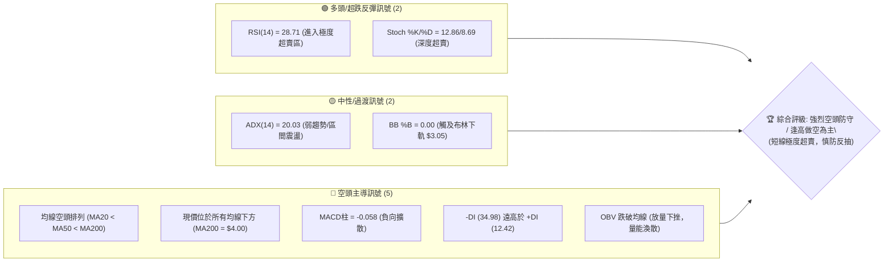
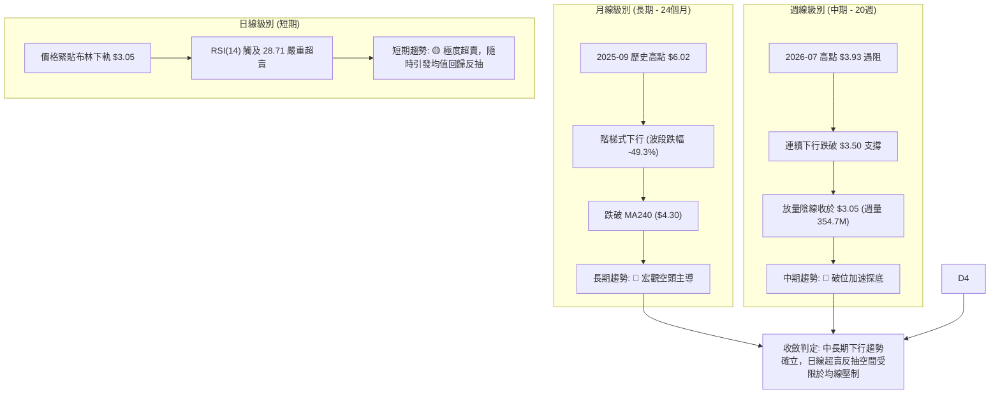
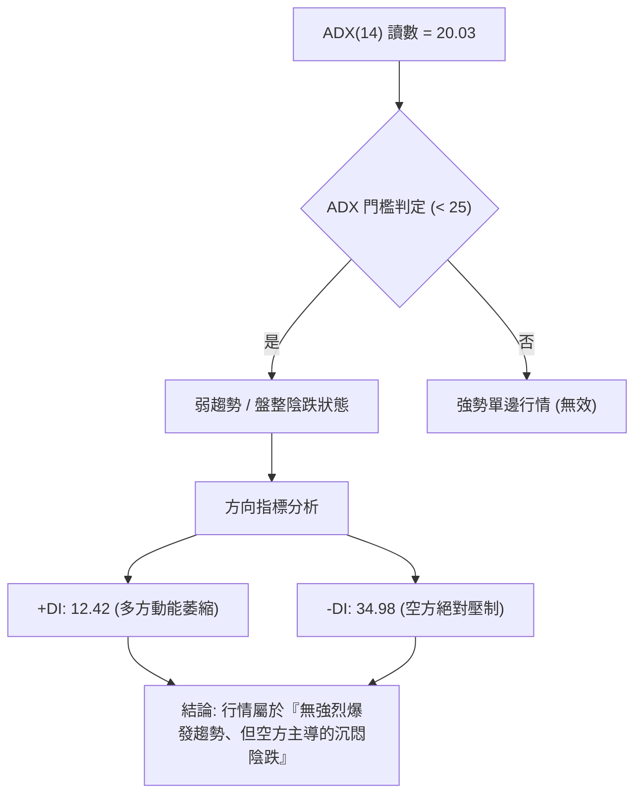
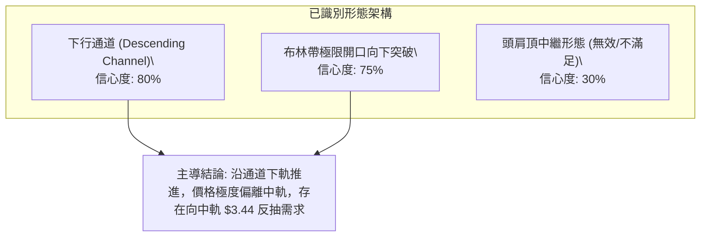
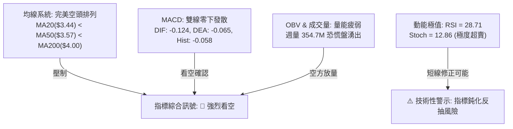
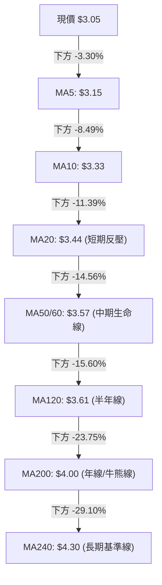
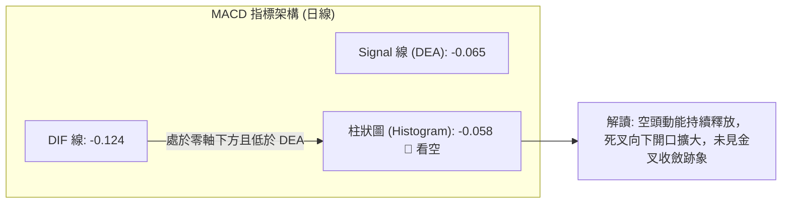
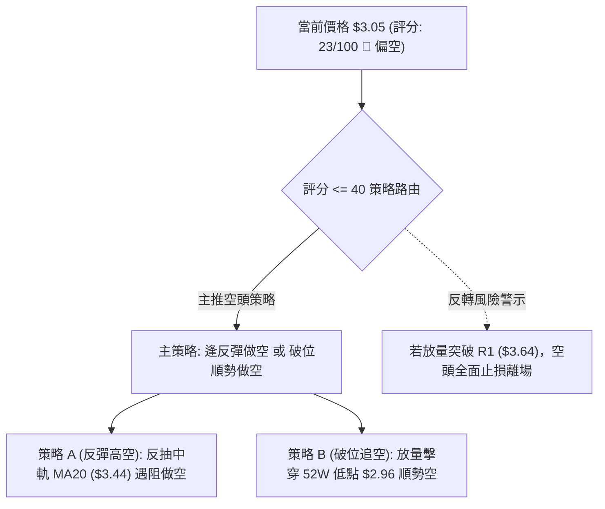
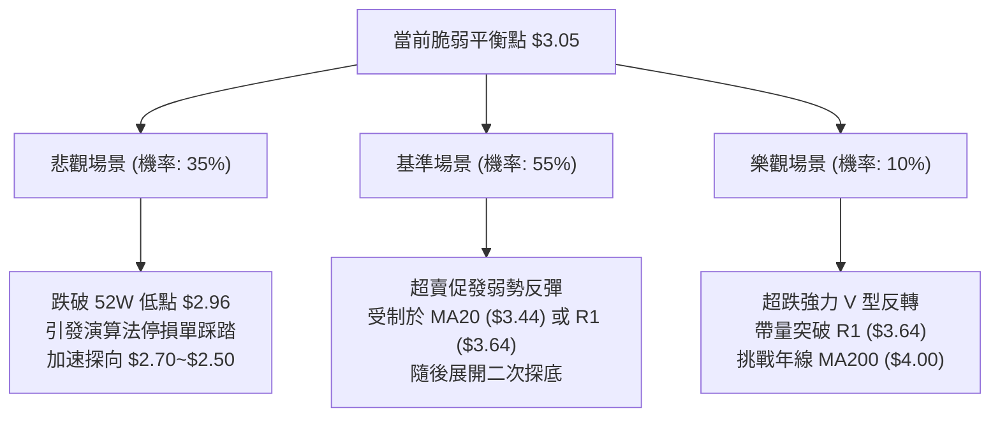

# GRAB 技術分析報告

> **報告日期**：2026-09-14 ｜ **語言**：繁體中文 ｜ **數據來源**：Yahoo Finance ｜ **當前價格**：$3.05

---

## 目錄

| 章節 | 內容 |
|------|------|
| [1. 技術面概覽](#1-技術面概覽) | 訊號儀表板、核心指標、評分卡 |
| [2. 趨勢分析](#2-趨勢分析) | 多時框趨勢、長中短期走勢、ADX解讀 |
| [3. 圖表形態分析](#3-圖表形態分析) | 形態識別、K線組合、形態信心度 |
| [4. 支撐與阻力](#4-支撐與阻力) | 關鍵價位、斐波那契回調結構 |
| [5. 技術指標深度解讀](#5-技術指標深度解讀) | MA/RSI/MACD/布林通道/量價配合 |
| [6. 動能與波動率](#6-動能與波動率) | 動能四象限、ATR波動度、Beta分析 |
| [7. 多時框架總結](#7-多時框架總結) | 時框矩陣、優先級收斂原則 |
| [8. 交易策略建議](#8-交易策略建議) | 策略路由、情境階梯、主策略詳解 |
| [9. 風險提示與監控](#9-風險提示與監控) | 關鍵指標清單、情境推演、風控紀律 |
| [10. 報告總結](#10-報告總結) | 核心結論與執行綱領 |

---

## 1. 技術面概覽

### 🎯 技術訊號儀表板



### 📊 核心指標速覽表

| 指標類別 | 指標名稱 | 當前數值 | 訊號 | 解讀 |
|----------|----------|----------|------|------|
| **價格** | 當前價格 | $3.05 | 🔴 | 貼近 52 週最低點 $2.96（位於區間 2.5% 位置） |
| **均線** | MA20 | $3.44 | 🔴 | 價格低於 MA20 達 -11.39%，短期下行斜率陡峭 |
| **均線** | MA50 | $3.57 | 🔴 | 中期生命線反壓，距離現價 -14.56% |
| **均線** | MA200 | $4.00 | 🔴 | 長期牛熊分水嶺向下壓制，處於完全空頭格局 |
| **動能** | RSI(14) | 28.71 | 🟢 | 跌破 30 臨界值，具備短線技術性超賣修復動能 |
| **動能** | MACD (12/26/9) | -0.124 / -0.065 | 🔴 | DIF 與 DEA 雙雙處於零軸下方，柱狀體為 -0.058 |
| **動能** | Stoch %K / %D | 12.86 / 8.69 | 🟢 | 進入極度超賣區，存在低檔鈍化或鈍化反彈特徵 |
| **趨勢強度**| ADX (14) | 20.03 | 🟡 | 數值 < 25，單邊趨勢動能減弱，呈現空頭陰跌盤整 |
| **方向指標**| +DI / -DI | 12.42 / 34.98 | 🔴 | -DI 大幅壓制 +DI，空方力量牢牢掌握市場主導權 |
| **通道指標**| 布林通道 (%B) | 0.00 ($3.05) | 🟡 | 價格封死布林帶下軌，波動率有自極值收斂之需求 |
| **成交量** | 最新成交量 / 量比 | 63.16M / 1.47x | 🔴 | 放量下殺，週成交量達 354.75M，拋壓顯著加劇 |
| **波動** | ATR(14) | $0.12 | 🟡 | 日波動率為 4.09%，處於中等偏高波動修復階段 |

### 🏆 技術評分卡

```
╔══════════════════════════════════════════════════════════════════╗
║                   技術評分卡 — GRAB (2026-09-14)                ║
╠══════════════════════════════════════════════════════════════════╣
║ 趨勢強度 (Trend)     ████░░░░░░░░░░░░░░░░  20/100  🔴 極度疲弱   ║
║ 動能指標 (Momentum)  ██████░░░░░░░░░░░░░░  30/100  🟡 超賣醞釀   ║
║ 支撐穩定度 (Support) ███░░░░░░░░░░░░░░░░░  15/100  🔴 逼近新低   ║
║ 成交量配合 (Volume)  ████████░░░░░░░░░░░░  40/100  🔴 放量下行   ║
║ 形態完整度 (Pattern) █████░░░░░░░░░░░░░░░  25/100  🔴 下行通道   ║
║ 均線排列 (Moving Avg)██░░░░░░░░░░░░░░░░░░  10/100  🔴 完美空頭   ║
╠══════════════════════════════════════════════════════════════════╣
║ 綜合技術評分         █████░░░░░░░░░░░░░░░  23/100  🔴 強烈偏空   ║
╚══════════════════════════════════════════════════════════════════╝
```

---

## 2. 趨勢分析

### 🌐 多時框趨勢分析



### 📈 長期趨勢 — 12個月走勢圖（Unicode）

```
GRAB 月線走勢圖（過去12個月：2025-10 至 2026-09）
價格軸 ($)
$6.01 ┤  ● (2025-10 高點聚類)
$5.45 ┤     ● 
$4.99 ┤        ● (2025-12 跌破 $5 關卡)
$4.30 ┤           ● (2026-01 跌破 MA200 關鍵位)
$3.82 ┤                 ● (2026-04 反彈高點)
$3.54 ┤                    ●       ● 
$3.05 ┤                               ● (2026-09 現價，逼近 52W 低點 $2.96)
      └──────────────────────────────────────────────
       10  11  12  01  02  03  04  05  06  07  08  09 (月份)
```

**走勢特徵分析表格**：

| 階段 | 時間跨度 | 起訖價位 | 累計漲跌幅 | 結構性特徵 | 量價關係 |
|------|----------|----------|------------|------------|----------|
| **主頂確立** | 2025-09 ~ 2025-10 | $6.02 → $6.01 | -0.17% | 雙頂高位滯漲，多頭竭盡 | 縮量橫盤，形成頭部結構 |
| **破位下殺** | 2025-11 ~ 2026-01 | $5.45 → $4.30 | -21.10% | 跌破整數關口，均線死叉向下 | 陰跌帶量，機構資金持續撤出 |
| **中繼盤整** | 2026-02 ~ 2026-06 | $4.22 → $3.77 | -10.66% | 圍繞 $3.50~$3.80 區間低位沉積 | 波動率收縮，反彈動能衰竭 |
| **二次破位** | 2026-07 ~ 2026-09 | $3.50 → $3.05 | -12.86% | 跌穿區間下沿，逼近 52W 新低 | 恐慌盤湧出，週成交量暴增至 354.7M |

### 📊 中期趨勢（週線分析）

中期走勢呈現典型的高點遞降（Lower Highs）與低點遞降（Lower Lows）下行階梯：
- **波段反彈頂部逐級下移**：2026-07-12 觸及波段高點 **$3.93**（週 RSI 達 68.4），隨後回落；2026-08-09 次高點僅達 **$3.66**（週 RSI 達 51.9）；2026-08-30 第三次反彈高點降至 **$3.61**。
- **波段支撐潰散**：前期在 $3.30（2026-06-14）形成的週線波段支撐於 2026-09-13 週線以大陰線擊穿，直接收於 **$3.05**，直逼 52 週絕對低點 **$2.96**。
- **中期壓制線聚集**：目前週線下行壓力重重，上方首道強壓區座落於前波平台頸線 **R1: $3.64**。

### ⚡ 趨勢強度評估（ADX 解讀）



| 指標變數 | 當前讀數 | 判定標準 | 狀態評估 |
|----------|----------|----------|----------|
| **ADX(14)** | **20.03** | < 25 (弱趨勢/區間)；> 25 (強趨勢) | 弱趨勢狀態。說明當前下殺並非處於全新加速單邊暴跌浪，而是長線陰跌尋底結構 |
| **+DI(14)** | **12.42** | > 20 為多頭積極；< 15 為極度虛弱 | 處於歷史低位水準，市場缺乏買盤意願，多頭幾無定價權 |
| **-DI(14)** | **34.98** | > 25 為空頭強勢；> 30 為空頭掌控 | 空方牢牢主導價格走勢，兩者差值擴大至 22.56，空頭處於絕對壓制地位 |

---

## 3. 圖表形態分析

### 🔍 形態識別系統

依據嚴格規則 15，所有形態均基於精準價格與均線軌跡定義，明確標示信心度與幾何推算：



| 形態名稱 | 信心度 | 判斷依據（引用數據） | 完成度 | 目標價（附精確計算式） |
|----------|--------|----------------------|--------|------------------------|
| **下行通道** | **80%** | 高點下移（$3.93 → $3.66 → $3.61），低點下移（$3.30 → $3.05），價格受制於 MA20 ($3.44) 與 MA50 ($3.57) | **90%** | 通道下軌支撐測算：$3.30 - ($3.61 - $3.30) = **$2.99**（貼近 52W 低點 $2.96） |
| **布林帶下軌突破** | **75%** | 當前收盤價 $3.05 正好等於布林下軌 $3.05，BB %B 降至 0.00 | **100%** | 偏離修復目標（反抽中軌 MA20）：**$3.44** |
| **雙底形態** | **20%** | 數據中未偵測到底部抬高或雙重探底結構（僅有 52W 低點 $2.96 尚待考驗） | **0%** | *訊號不足，不符合幾何形態，僅作指標型解讀* |

### 🕯️ 重要K線形態分析

| 月份 | 收盤價 | K線形態 | 解讀 | 訊號 |
|------|--------|---------|------|------|
| **2025-09** | $6.02 | 長上影實體陽線 | 觸及 52W 最高點 $6.62 後大幅收斂，高位爆量滯漲 | 🔴 見頂訊號 |
| **2025-10** | $6.01 | 高位十字星/十字陰線 | 多空在 $6.00 關口劇烈爭奪，買盤動能枯竭 | 🔴 頂部確認 |
| **2025-11** | $5.45 | 實體大陰線 | 破位下行，擊穿 5 日與 10 日均線，確認中期反轉 | 🔴 趨勢反轉 |
| **2026-01** | $4.30 | 破位中陰線 | 擊穿長線牛熊分水嶺 MA200，多頭防線全面崩潰 | 🔴 破位加劇 |
| **2026-07** | $3.50 | 衝高回落倒錘頭線 | 週線衝刺 $3.93 失敗，留長上影線後大幅下瀉 | 🔴 假突破確立 |
| **2026-09** | $3.05 | 大陰線破位探底 | 直接擊穿前波 $3.30 平台，收盤鎖定在 52W 低點 $2.96 邊緣 | 🔴 恐慌拋售 |

### 📉 ASCII 走勢形態示意圖

```
GRAB 下行通道與布林通道擠壓示意圖
價格 ($)
$3.96 ┤                 [通道上軌 R2]
$3.84 ┤─────────────────┬─────────────────────── (布林上軌)
      │                 │
$3.64 ┤        ●        │                       [關鍵阻力 R1 / 前波頸線]
      │       / \       │
$3.57 ┤ - - -/- - \ - - ┼ - - - - - - - - - - - (MA50 反壓)
$3.44 ┤------/-----\----┼----------------------- (布林中軌 MA20)
      │     /       \   │
$3.30 ┤    ●         \  │                       (前次波段低點平台)
      │               \ │
$3.05 ┤────────────────●┴────────────────────── (現價 $3.05 = 布林下軌)
$2.96 ┴========================================= [52W 歷史絕對低點支撐]
```

### 🎯 形態目標價計算

基於「下行通道」與「區間破位」之精確測算：
1. **下行破位量度跌幅**：
   - 區間高點（前波反彈高點聚類）：**$3.64**
   - 區間下沿（2026-06 波段低點）：**$3.30**
   - 形態箱體高度 $H = \$3.64 - \$3.30 = \$0.34$
   - 箱體破位理論目標價 = 區間下沿 $\$3.30 - \$0.34 = \mathbf{\$2.96}$（**高度精準吻合 52W 歷史低點 $2.96**）。
2. **均值回歸反抽目標價**：
   - 當前價格 $3.05 觸及布林下軌（%B = 0.00），第一技術回抽目標為布林中軌（MA20）：**$3.44**。
   - 第二技術反抽阻力為前波跌破點頸線 R1：**$3.64**。

---

## 4. 支撐與阻力

### 🗺️ 關鍵價位分布圖（Unicode）

```
GRAB 價位結構分布圖
════════════════════════════════════════════════════════════════════
$4.06 ║██████████████████████████████║ 強阻力 R3 (年線 MA200 重合區)
$3.96 ║████████████████████          ║ 阻力 R2 (2026-07 波段頂點聚類)
$3.74 ║▒▒▒▒▒▒▒▒▒▒▒▒▒▒▒▒▒▒▒▒▒▒▒▒      ║ 斐波那契 78.6% 回調位
$3.64 ║████████████████████████      ║ 關鍵阻力 R1 (前波破位平台頸線)
$3.44 ║──────────────────────────────║ 短期動態反壓 (MA20 / 布林中軌)
$3.05 ╠══════════════════════════════╣ ◄ 現價 ($3.05，布林下軌)
$2.96 ║██████████████████████████████║ 核心支撐 S1 (52W 歷史低點 / 100% Fib)
(下方)║░░░░░░░░░░░░░░░░░░░░░░░░░░░░░░║ (數據中未偵測到現價下方之波段低點聚類)
════════════════════════════════════════════════════════════════════
```

### 🚧 阻力位分析表

*嚴格引用數據中由 OHLCV 波段高點聚類計算之阻力數值：*

| 阻力級別 | 價位 | 距離現價 | 形成原因與技術共振 | 突破難度 | 重要性 |
|----------|------|----------|--------------------|----------|--------|
| **R1** | **$3.64** | +19.43% | 近一年波段高點聚類；與 MA60 ($3.57)、MA120 ($3.61) 形成強阻力帶 | 極高 🔴 | ★★★★★ |
| **R2** | **$3.96** | +29.73% | 2026-07 波段反彈頂點 ($3.93~$3.96) 聚類；密集成交解套賣壓區 | 極高 🔴 | ★★★★☆ |
| **R3** | **$4.06** | +33.11% | 長期長期波段高點，與長期年線 MA200 ($4.00) 形成強烈空頭反壓共振 | 極高 🔴 | ★★★★★ |

### 🛡️ 支撐位分析表

*嚴格引用數據中計算之數值；數據明確指出：`no swing-low support detected below current price`*

| 支撐級別 | 價位 | 距離現價 | 形成原因與技術共振 | 守住機率 | 重要性 |
|----------|------|----------|--------------------|----------|--------|
| **S1** | **$2.96** | -2.95% | **52W 歷史絕對最低點**，同時為斐波那契 100.0% 終極極限回調位 | 45% 🟡 | ★★★★★ |
| **S2** | *無* | — | **數據中未偵測到現價下方之波段低點聚類**（若破 $2.96 將進入無支撐真空） | 0% 🔴 | ── |

### 📐 斐波那契回調位分析

*嚴格引用數據中以 52 週極值（區間 $2.96 → $6.62）計算之斐波那契回調結構：*

| 回調比率 | 價位 | 與現價關係 | 技術意義解讀 |
|----------|------|------------|--------------|
| **0.0% (52W High)** | **$6.62** | +117.05% | 歷史週期大頂，當前多頭不可逾越的天花板 |
| **23.6%** | **$5.76** | +88.85% | 長期多頭第一道防線（已於 2025-11 徹底跌破） |
| **38.2%** | **$5.22** | +71.15% | 黃金分割重要支撐轉換位（2025-12 破位） |
| **50.0%** | **$4.79** | +57.05% | 中期強弱平衡軸心（2026-01 失守後轉入弱勢格局） |
| **61.8%** | **$4.36** | +42.95% | 黃金分割防守極限，與 MA240 ($4.30) 重疊，失守宣告全面熊市 |
| **78.6%** | **$3.74** | +22.62% | 深幅回調警戒線，此處為 2026-06 震盪中樞，目前已淪為強阻力 |
| **100.0% (52W Low)** | **$2.96** | -2.95% | **歷史底部終極測試位**。現價 $3.05 處於 78.6% ($3.74) 與 100.0% ($2.96) 之極限超賣深淵，距離 100% 僅剩不到 3% 空間 |

---

## 5. 技術指標深度解讀

### 🎛️ 指標訊號總覽



### 📈 移動平均線排列分析



- **全面空頭發散**：所有週期均線（MA5、10、20、50、60、120、200、240）均維持下行斜率，排列順序呈現標準教科書式「MA5 < MA10 < MA20 < MA50 < MA200」，確認市場處於無可爭議的空頭主導週期。
- **均線乖離率過大**：現價距離 MA20 負乖離達 **-11.39%**，距離 MA200 負乖離達 **-23.75%**。過大的負乖離抑制了短期追空的性價比，同時孕育著均值回歸（Mean Reversion）的反撲潛力。

### 📉 RSI(14) 分析

```
RSI(14) 讀數：28.71
[███████████░░░░░░░░░░░░░░░░░░░░] 28.71%  (超賣門檻 < 30.00)
0              30              50              70             100
```
- **數值狀態**：RSI(14) 當前讀數為 **28.71**，正式跌破 30 臨界值，進入傳統技術分析之「嚴重超賣區」。
- **背離檢驗**：
  - 前次週線低點（2026-07-26 收盤 $3.31）對應週 RSI 為 **25.9**。
  - 本次收盤 $3.05（2026-09-13）跌破新低，週 RSI 為 **28.7**，日 RSI 為 **28.71**。
  - **背離結論**：數據明確註記「RSI 背離: 無明顯背離」。價格創新低，指標亦步亦趨跟隨落入極低區，未構成有效底背離，顯示下跌為真摔而非誘空。

### 📊 MACD(12/26/9) 訊號解讀


- **指標位置**：DIF (-0.124) 與 DEA (-0.065) 均深居零軸下方，屬於典型弱勢區死叉運行。
- **柱狀體動能**：MACD Histogram 為 **-0.058**，較前幾週持續擴大（2026-09-06 為 -0.015），呈現負動能加速擴散，表明空頭殺跌力道依然充沛。

### 📦 布林通道分析

```
GRAB 布林通道截面示意圖 (20日通道，2倍標準差)
價位 ($)
$3.84 ┬────────────────────────────────────────── 布林上軌
      │
      │
$3.44 ┼ - - - - - - - - - - - - - - - - - - - - - 布林中軌 (MA20)
      │
      │
$3.05 ┴══════════════════════════════════════════ 布林下軌 ◄ 現價 ($3.05) [BB %B = 0.00]
```
- **通道參數**：上軌 **$3.84**，中軌 **$3.44**，下軌 **$3.05**。
- **指標特性**：%B 指標精確為 **0.00**，代表價格完全封死於布林下軌之上。
- **開口特徵**：布林帶帶寬目前展開（帶寬 $3.84 - $3.05 = $0.79，佔中軌 23.0%），屬於「開口下行（Walking down the band）」形態，通常伴隨趨勢性陰跌。

### 💹 成交量分析（量價配合度）

- **日成交量量比**：最新成交量為 **63,157,000 股**，對比 20 日均量（42,823,960 股）之量比高達 **1.47x**，屬於典型的「放量下挫」。
- **週成交量激增**：2026-09-13 當週成交量爆出 **354,747,200 股**，創下近 20 週以來的最大單週成交量（此前均量在 1.5億 ~ 2.9億 之間），顯示市場在此處出現停損恐慌盤與融資斷頭拋壓。
- **OBV（能量潮）走勢**：數據確認「OBV < MA → 量能疲弱」。資金呈現持續淨流出狀態，未觀察到主動性大買單的吸籌現象，量價呈現空頭確認（Volume confirms downtrend）。

---

## 6. 動能與波動率

### ⚡ 動能評估四象限

```
動能與波動率定位矩陣：
┌───────────────────────┬───────────────────────┐
│  Q3: 高波動 / 強動能   │  Q1: 低波動 / 強動能  │
│  (高風險高收益趨勢浪) │  (穩定單邊最佳主升浪) │
├───────────────────────┼───────────────────────┤
│  Q4: 高波動 / 弱動能   │  Q2: 低波動 / 弱動能  │
│  ► 當前狀態: GRAB ◄   │  (低位沉寂觀望期)     │
│  (破位加速、恐慌釋放) │                       │
└───────────────────────┴───────────────────────┘
```

| 象限 | 動能維度 | 波動維度 | 當前狀態 | 策略意涵評估 |
|------|----------|----------|----------|--------------|
| **Q1** | 強多頭 | 低波動 | 否 | 最佳順勢追多機會（不適用） |
| **Q2** | 弱動能 | 低波動 | 否 | 窄幅盤整、謹慎觀望（前波 5-6 月已過） |
| **Q3** | 強動能 | 高波動 | 否 | 單邊多頭主升或暴跌加速（ADX=20.03 尚未完全成型） |
| **Q4** | **弱動能 (空方佔據)** | **高局部波動** | **✓ 當前狀態** | **局部放量下殺，空頭釋放拋壓，防禦性極高，切忌盲目摸底** |

### 📊 ATR 波動率分析

- **ATR(14) 數值**：**$0.12**，佔當前股價之百分比為 **4.09%**。
- **技術意義**：意味著 GRAB 平均單日正常波動幅度約為 12 美分。
- **止損距離建議**：
  - 保守型交易策略（2.0 × ATR）：止損安全緩衝墊應設為 $0.12 \times 2.0 = \mathbf{\$0.24}$。
  - 激進型交易策略（1.5 × ATR）：止損安全緩衝墊應設為 $0.12 \times 1.5 = \mathbf{\$0.18}$。

### 📐 Beta 與市場相關性

- **Beta 係數**：**0.89**。
- **解讀**：GRAB 對於大盤標普 500 指數的敏感度偏低（< 1.0），這意味著當前的大幅下挫主要是受**公司個體基本面或新興市場/東南亞板塊估值回斂**等特質風險（Idiosyncratic Risk）所驅動，而非系統性宏觀系統暴跌所致。放量破位屬於自身籌碼面的集中宣洩。

---

## 7. 多時框架總結

### 📋 時框架評分表

| 時框架 | 趨勢方向 | 動能狀態 | 均線系統 | 圖表形態 | 綜合評分 | 戰術建議 |
|--------|----------|----------|----------|----------|----------|----------|
| **日線 (短期)** | 🔴 下行探底 | 🟢 極度超賣 (RSI 28.7) | 🔴 空頭排列 | 布林下軌封死 | 35/100 | 等待超賣反抽，不盲目追空 |
| **週線 (中期)** | 🔴 階梯下行 | 🔴 負向加速 (Hist -0.058) | 🔴 MA20/50 死叉 | 下行通道破位 | 20/100 | 反彈遇反壓阻力即為做空點 |
| **月線 (長期)** | 🔴 宏觀熊市 | 🔴 跌破均線體系 | 🔴 跌破 MA240 | 頂部回吐 50% | 15/100 | 長期投資者保持防禦觀望 |

### 🔲 綜合訊號矩陣

| 評估維度 | 日線訊號 (短期) | 週線訊號 (中期) | 月線訊號 (長期) | 一致性檢驗 |
|----------|-----------------|-----------------|-----------------|------------|
| **趨勢方向** | 🔴 下行 | 🔴 下行 | 🔴 下行 | **100% 空頭共振** |
| **動能強度** | 🟢 超賣修復需求 | 🔴 破位放量加速 | 🔴 資金持續流出 | **中長空壓制短多** |
| **支撐有效性** | 🟡 考驗 $2.96 | 🔴 擊穿 $3.30 | 🔴 跌穿 61.8% | **支撐處於極脆弱狀態** |
| **阻力強度** | 🔴 MA20: $3.44 | 🔴 R1: $3.64 | 🔴 MA200: $4.00 | **上方重重反壓** |

### ⚖️ 多時框收斂結論

依據**嚴格要求 14（多時框收斂規則）**進行邏輯裁決：
1. **行情模式判定**：當前 ADX(14) 讀數為 **20.03 (< 25)**，嚴格歸類為「**盤整 / 弱趨勢陰跌行情**」。
2. **交易區間界定**：依規則，當 ADX < 25 時，**以日線布林通道上下軌為主要交易區間**（下軌 **$3.05**，上軌 **$3.84**，中軌 **$3.44**）。
3. **時框取捨與優先級收斂**：
   - 儘管日線出現 RSI(14) = 28.71 的技術性極度超賣，但因 -DI (34.98) 絕對壓制 +DI (12.42)，且週月線級別呈現標準空頭排列；
   - 依優先級原則，**不允許逆勢進行右側追多**，日線超賣**僅用於判定空頭短期不宜追空，以及尋找空頭部位之逢高反彈進場點**。
4. **方向性結論**：**【唯一結論：強烈偏空觀望，主軸逢高建立空單】**（與第 1 章技術評分卡 23/100 保持絕對一致）。

---

## 8. 交易策略建議

### 🗺️ 策略決策流程圖



### 🧭 策略路由

> **當前主策略方向 = 【逢高建立空頭部位 / 破位順勢做空】（依綜合技術評分 23/100，處於 ≤ 40 之空頭主推區間）**

### 🎯 價格情境階梯（Price Scenarios）

*所有價位嚴格引用第 4 章由 OHLCV 與斐波那契計算之數值：*

| 觸發條件 | 下一目標 | 後續延伸 | 情境含義與操作指引 |
|----------|----------|----------|--------------------|
| **強勢突破 R1 $3.64** | R2 **$3.96** | R3 **$4.06** | 空頭結構被破壞，短期轉為強勢反彈，所有空單必須止損 |
| **反抽中軌 MA20 $3.44** | R1 **$3.64** | — | 超賣後的技術性均值回歸，為最佳「高空進場」機會 |
| **弱勢徘徊現價 $3.05** | S1 **$2.96** | — | 空頭低檔鈍化磨底，防守 52 週絕對低點，觀望為主 |
| **放量擊穿 S1 $2.96** | 心理整數 **$2.50** | — | 創 52 週新低，進入無支撐真空跌勢，觸發策略 B 順勢空 |

### 📊 情境機率分佈

| 情境劃分 | 機率 | 主要技術依據 |
|----------|------|--------------|
| **反彈遇阻再下殺 (反抽高空)** | **55%** | RSI(28.71) 促發均值回歸反抽布林中軌 ($3.44)，但受制於下降均線反壓 |
| **直接破位再探底 (加速下行)** | **35%** | 週成交量爆出 354.7M，OBV 疲軟，空方殺跌慣性強烈，直接測破 $2.96 |
| **強勢反轉向上 (走出熊市)** | **10%** | 需突破 R1 ($3.64) 與 R3 ($4.06)，目前均線全面死叉，量能不足以支撐 |

### 🔴 主策略詳情（空頭專屬策略）

*嚴格遵守精確數值計算，不使用任何模糊字眼：*

| 策略要素 | 策略 A（反彈遇阻做空 - 首選） | 策略 B（破位順勢追空 - 次選） |
|----------|-------------------------------|-------------------------------|
| **策略類型** | 順應大時框趨勢之逢高放空 | 關鍵支撐崩塌之順勢突破放空 |
| **進場條件** | 價格反抽至布林中軌 MA20 出現滯漲倒錘線 | 日線收盤價跌破 52W 低點 S1 ($2.96) 且成交量放大 |
| **進場價格** | **$3.44**（精準對應 MA20） | **$2.95**（跌破 $2.96 確認位） |
| **止損價格** | **$3.64**（突破前波破位頸線 R1） | **$3.07**（回抽進場點上方 1×ATR: $2.95 + $0.12） |
| **第一目標價 T1** | **$3.05**（現價 / 前期下軌） | **$2.71**（基於 $2.95 - 2×ATR($0.24) 推算） |
| **第二目標價 T2** | **$2.96**（52W 歷史低點 S1） | **$2.59**（基於 $2.95 - 3×ATR($0.36) 推算） |
| **風險空間** | $\$3.64 - \$3.44 = \mathbf{\$0.20}$ | $\$3.07 - \$2.95 = \mathbf{\$0.12}$ |
| **報酬空間 (T2)** | $\$3.44 - \$2.96 = \mathbf{\$0.48}$ | $\$2.95 - \$2.59 = \mathbf{\$0.36}$ |
| **風險報酬比 (R:R)**| **1 : 2.40** (優良) | **1 : 3.00** (優異) |
| **模型成功機率** | **65%** | **55%** |
| **建議倉位** | **8% ~ 10%** 總投資組合 | **5%** 總投資組合（動能破位倉） |

### 🟢 反向風險觸發點（多頭反轉對沖提示）

若出現以下訊號，主推之空頭策略立即失效，投資人應即刻執行空頭部位平倉：
1. **日線收盤價強勢站上 R1 ($3.64)**：代表有效收復前期平台下沿，下行通道被向上突破。
2. **日線 RSI(14) 強勢穿越 50 中軸且 MACD 出現零下金叉**：代表動能由空翻多，均值回歸升級為結構性反轉。
3. **成交量連續 3 日維持在 6,000 萬股以上且收陽線**：顯示主力資金大舉進場護盤，形成實質雙底。

### ⭐ 整體訊號強度評星

```
做多訊號強度：★☆☆☆☆  (1/5 星 - 僅有極度超賣，無底部形態)
做空訊號強度：★★★★☆  (4/5 星 - 均線空頭排列，量價配合下行)
整體可信度：  ★★★★☆  (4/5 星 - 多時框趨勢完全收斂共振)
```

---

## 9. 風險提示與監控

### ✅ 關鍵監控指標 Checklist

```
╔══════════════════════════════════════════════════════════════════╗
║                   每日交易監控清單 (Daily Checklist)             ║
╠══════════════════════════════════════════════════════════════════╣
║ [ ] 52W 低點防守測試：收盤價是否跌破 $2.96？                    ║
║ [ ] 布林帶擴軌狀態：現價是否持續被壓制於下軌 ($3.05) 以下？       ║
║ [ ] RSI(14) 修復動能：是否自 28.71 脫離超賣區回升至 35 以上？    ║
║ [ ] 均線動態反壓：反抽過程中是否在 MA20 ($3.44) 遭遇長上影線？   ║
║ [ ] 恐慌拋壓跟進：日成交量是否再度超出 20 日均量 (42.82M) 1.5倍？║
║ [ ] 外部市場相關性：Beta 0.89 下大盤若暴跌是否引發流動性踩踏？    ║
╚══════════════════════════════════════════════════════════════════╝
```

### ⚠️ 風險場景分析



### 🛡️ 風險管理重要提醒

1. **嚴禁在歷史新低附近逆勢摸底**：數據中明確顯示「現價下方未偵測到波段低點聚類」，一旦 52 週最低點 **$2.96** 失守，下方在技術結構上屬於無歷史籌碼支撐的「自由落體區間」。
2. **警惕超賣鈍化風險**：極度超賣（RSI < 30、Stoch < 15）在強空頭排列中經常出現「指標低檔鈍化」，即股價沿著布林下軌持續破位，而指標維持在 20 附近橫盤，此時盲目抄底將面臨巨大回撤風險。
3. **倉位配置與槓桿限制**：鑑於空方主導度高達 34.98 (-DI)，任何試圖博取短線超跌反抽的投機多單，倉位絕不可超過總資產的 **3%**，且必須嚴格將止損設於 **$2.95**。順勢做空倉位亦應分散於反抽確認節點，單筆最大風險敞口控制在總資本的 **1.5%** 以內。

---

## 📋 報告總結

```
╔══════════════════════════════════════════════════════════════════╗
║                   GRAB 技術分析報告總結                          ║
╠══════════════════════════════════════════════════════════════════╣
║ 報告日期：2026-09-14                                             ║
║ 當前價格：$3.05 (貼近 52 週低點 $2.96)                           ║
║ 技術評分：23 / 100 ｜ 綜合評級：🔴 強烈偏空 (反彈高空為主)      ║
╠══════════════════════════════════════════════════════════════════╣
║ 關鍵結論：                                                       ║
║ ├─ 長期趨勢：🔴 宏觀熊市主導，跌破 MA240 ($4.30) 與 MA200 ($4.00)║
║ ├─ 中期趨勢：🔴 週線下行通道成型，破位加速，反彈高點逐次下移     ║
║ ├─ 短期趨勢：🟡 RSI(28.71) 與 Stoch 進入嚴重超賣，隨時有技術反抽║
║ ├─ 關鍵支撐：$2.96 (52W 歷史低點 / 100% 斐波那契極限位)          ║
║ ├─ 關鍵阻力：R1: $3.64 ｜ R2: $3.96 ｜ R3: $4.06                 ║
║ └─ 分析師目標價：均價 $5.86 (技術面與基本面存在顯著分歧，以盤面為準)║
╠══════════════════════════════════════════════════════════════════╣
║ 最優策略組合：                                                   ║
║ 1. 🥇 最佳機會 (策略 A)：等待超賣反抽至 MA20 ($3.44) 做空，      ║
║    止損設 $3.64，目標 $2.96，風報比 1:2.40。                    ║
║ 2. 🥈 次選機會 (策略 B)：跌破 52W 低點 $2.96 順勢追空至 $2.59，  ║
║    止損設 $3.07，風報比 1:3.00。                                 ║
║ 3. 🥉 保守選擇：空倉觀望，切勿在 $2.96 關鍵防線前搶跑摸底，     ║
║    待確立底背離或有效築底後再行評估。                            ║
╚══════════════════════════════════════════════════════════════════╝
```

---

> ⚠️ **免責聲明**：本報告為技術分析研究成果，所有數據、圖表及價位推算均嚴格基於所提供之歷史交易資訊與量化模型。報告內容**僅供投資研究與學術探討參考**，**絕不構成任何具體的買賣邀約或投資建議**。金融市場瞬息萬變，交易決策應審慎評估個人風險承受能力，並獨立承擔投資損益。

---
*報告生成時間：2026-09-14 ｜ 數據來源：Yahoo Finance ｜ 分析架構：多時框技術分析模型*