# GRAB 技術分析報告

> **報告日期**：2026-09-15 ｜ **語言**：繁體中文 ｜ **數據來源**：Yahoo Finance ｜ **當前價格**：$3.05（依據最新一週收盤價 2026-09-13）

---

## 目錄

| 章節 | 內容 |
|------|------|
| [1. 技術面概覽](#1-技術面概覽) | 訊號儀表板、核心指標、評分卡 |
| [2. 趨勢分析](#2-趨勢分析) | 多時框趨勢、長中短期走勢 |
| [3. 圖表形態分析](#3-圖表形態分析) | 形態識別、K線組合、目標價 |
| [4. 支撐與阻力](#4-支撐與阻力) | 關鍵價位、斐波那契回調 |
| [5. 技術指標深度解讀](#5-技術指標深度解讀) | MA/RSI/MACD/布林/成交量 |
| [6. 動能與波動率](#6-動能與波動率) | 動能評估、ATR、Beta |
| [7. 多時框架總結](#7-多時框架總結) | 時框架評分矩陣 |
| [8. 交易策略建議](#8-交易策略建議) | 多空策略、風險報酬比 |
| [9. 風險提示與監控](#9-風險提示與監控) | 監控指標、風險場景 |

---

## 1. 技術面概覽

### 🎯 技術訊號儀表板

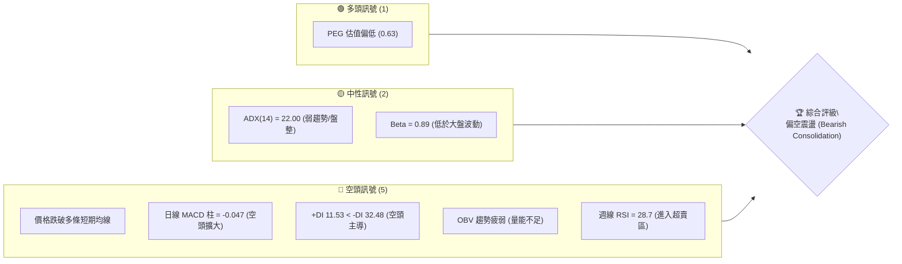

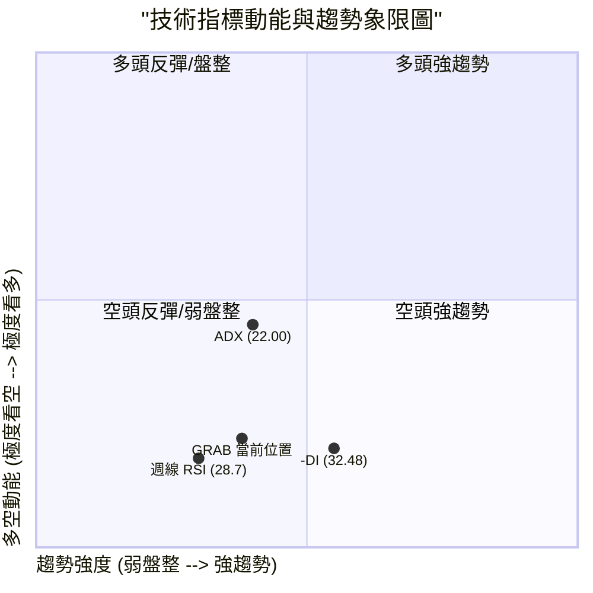

### 📊 核心指標速覽表

| 指標類別 | 指標名稱 | 當前數值 | 訊號 | 解讀 |
|----------|----------|----------|------|------|
| **價格** | 最新收盤價 (週) | $3.05 | 🔴 | 逼近 52 週最低點 $2.96，短線賣壓沉重 |
| **均線** | MA20 / MA50 | 下方 (混合排列) | 🔴 | 價格位於 MA20 與 MA50 下方，中期承壓 |
| **均線** | MA200 | 混合排列 | 🟡 | 均線長週期均線下彎，整體排列缺乏多頭支撐 |
| **動能** | RSI(14) (日/週) | 28.7 (週) | 🔴 | 日線中性偏弱，週線跌破 30 進入超賣弱勢區 |
| **動能** | MACD (12,26,9) | -0.124 / 柱 -0.047 | 🔴 | 快慢線均處於零軸下方，且柱狀圖呈現空頭擴張 |
| **趨勢** | ADX (14) | 22.00 (+DI:11.5 / -DI:32.5) | 🔴 | 數值 <25 代表整體趨勢偏弱，但 -DI 遠高於 +DI，空方主導 |
| **量能** | OBV & 量比 | 量比 0.93x / 週量 3.54億 | 🔴 | OBV 低於均線，量能疲弱，且大跌週爆出巨量賣壓 |

### 🏆 技術評分卡

```
╔══════════════════════════════════════════════════════════════════╗
║                 技術評分卡 — GRAB (2026-09-15)                   ║
╠══════════════════════════════════════════════════════════════════╣
║ 趨勢強度 (Trend)     ██████░░░░░░░░░░░░░░  30/100  🔴 空方主導   ║
║ 動能指標 (Momentum)  █████░░░░░░░░░░░░░░░  25/100  🔴 動能疲軟   ║
║ 支撐穩定度 (Support) ████████░░░░░░░░░░░░  40/100  🟡 臨近52W前低║
║ 成交量配合 (Volume)  ██████░░░░░░░░░░░░░░  30/100  🔴 放量下挫   ║
║ 形態完整度 (Pattern) ███████░░░░░░░░░░░░░  35/100  🔴 破位下行   ║
║ 均線排列 (Moving Av) ████░░░░░░░░░░░░░░░░  20/100  🔴 空頭排列   ║
╠══════════════════════════════════════════════════════════════════╣
║ 綜合技術評分         ██████░░░░░░░░░░░░░░  30/100  🔴 強烈偏空   ║
╚══════════════════════════════════════════════════════════════════╝
```

---

## 2. 趨勢分析

### 🌐 多時框趨勢分析

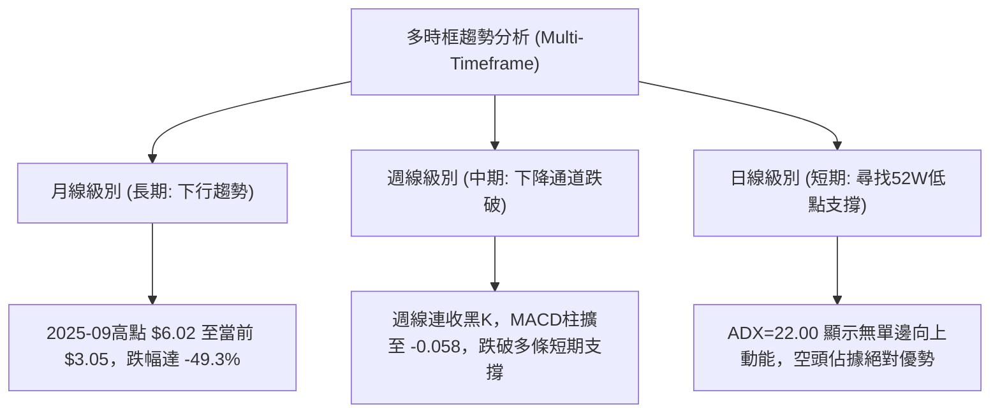

### 📈 長期趨勢 — 12個月走勢圖（Unicode）

```
GRAB 月線走勢圖（2025-10 至 2026-09）
價格軸 ($)
$6.01 ┤ ●(2025-10 高點)
$5.45 ┤       ●
$4.99 ┤             ●
$4.30 ┤                   ●
$3.82 ┤                               ●
$3.50 ┤                                     ●     ●
$3.05 ┤                                                 ●←當前收盤
$2.96 ┴─────────────────────────────────────────────────┼── (52W Low)
        10   11    12    01    02    03    04    05    06    07    08    09
       2025                                                   2026 (月份)
```

**走勢特徵分析表格**：

| 階段區間 | 起訖月份 | 價格變化 | 漲跌幅 | 走勢特徵解讀 |
|----------|----------|----------|--------|--------------|
| **波段見頂** | 2025-09 ~ 2025-10 | $6.02 → $6.01 | -0.17% | 高檔雙頂構築，多頭動能竭盡，量能無法推升新高 |
| **初期回落** | 2025-11 ~ 2026-01 | $5.45 → $4.30 | -21.10% | 連續跌破各均線支撐，獲利回吐賣壓湧現 |
| **中繼整理** | 2026-02 ~ 2026-04 | $4.22 → $3.82 | -9.48% | 出現弱勢技術性反彈，但受壓於 $4.36 (斐波 61.8%) |
| **破底尋底** | 2026-05 ~ 2026-09 | $3.54 → $3.05 | -13.84% | 震盪探底，2026年9月加速下挫逼近 52 週新低 $2.96 |

### 📊 中期趨勢（週線分析）

```
近期 20 週價格波動與壓力支撐關係示意：
$4.00 ┤              ● $3.93 (2026-07)
$3.74 ┤───────●──────┼──────────────────────── 斐波那契 78.6% 回調壓力位
$3.50 ┤   ●       ●  │       ●     ●
$3.30 ┤       ●      │   ●
$3.05 ┤              │                 ●← 當前價格 ($3.05)
$2.96 ┴──────────────┴─────────────────┴────── 52週低點強支撐
```

### ⚡ 趨勢強度評估（ADX 解讀）

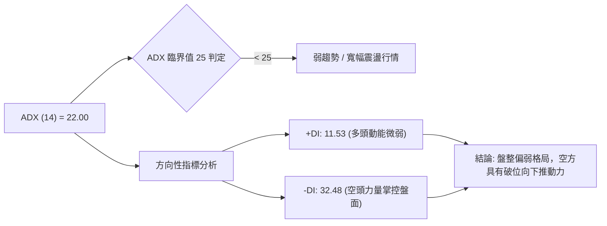

| 指標項 | 當前數值 | 門檻標準 | 狀態評估 | 實質意涵 |
|--------|----------|----------|----------|----------|
| **ADX(14)** | 22.00 | 25.00 | 🟡 弱趨勢 | 市場目前缺乏強大的單邊趨勢加速度，處於震盪下挫階段 |
| **+DI** | 11.53 | 20.00 | 🔴 極弱 | 多方買盤極度匱乏，難以組織有效逆轉攻勢 |
| **-DI** | 32.48 | 25.00 | 🔴 強勢空頭 | 空方賣壓主導日線與週線結構，空頭佔據絕對主控地位 |

---

## 3. 圖表形態分析

### 🔍 形態識別系統

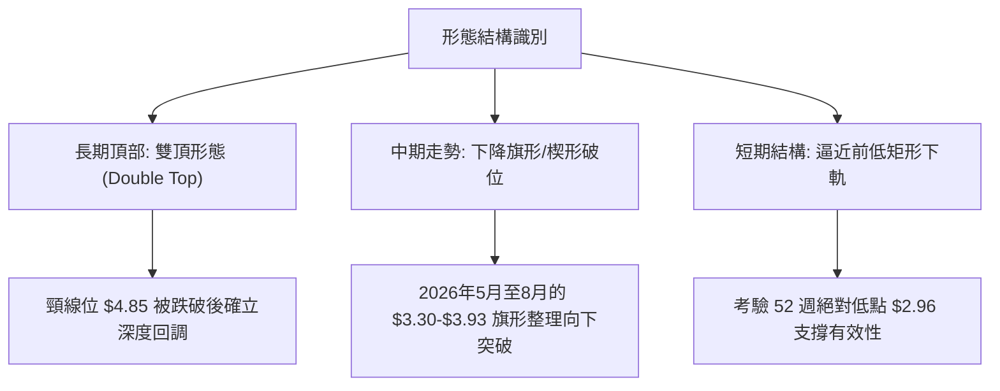

**形態信心度與目標計算表**：

| 形態名稱 | 信心度 | 判斷依據（引用數據） | 完成度 | 目標價（附計算式） |
|----------|--------|----------------------|--------|--------------------|
| **長期雙重頂** | 85% | 2025年9月高點 $6.02 與 10月高點 $6.01 形成典型雙頂，頸線跌破 | 100% | 頸線 $4.85 - (頂部 $6.02 - 頸線 $4.85) = $3.68（已跌破並達標） |
| **中期下降旗形** | 70% | 2026年7月高點 $3.93 反彈受阻後連續走低，9月放量跌破前低 $3.30 | 90% | 由旗形高點 $3.93 減去旗形震盪幅度 ($3.93 - $3.30 = $0.63)：$3.30 - $0.63 = $2.67（若跌破 $2.96 支撐後的衍生推算） |
| **潛在雙底結構** | 35% | 數據中未偵測到有效反轉信號，僅能觀察前低 $2.96 是否有雙底雛形 | 15% | 信心度不足 50%，依規則僅做指標型觀察，不預先設定雙底多頭目標價 |

### 🕯️ 重要K線形態分析

| 週/月份 | 收盤價 | K線形態 | 解讀 | 訊號 |
|---------|--------|---------|------|------|
| **2025-09/10** | $6.02 / $6.01 | 長期平頭雙頂 (Tweezers Top) | 雙月挑戰 $6.00 心理整數關卡失敗，主力獲利結算信號明顯 | 🔴 |
| **2026-07-12** | $3.93 | 流星線 (Shooting Star) | 週線向上反彈試圖突破 斐波 78.6% ($3.74) 後留下長上影線 | 🔴 |
| **2026-08-09** | $3.66 | 倒轉十字星 | 弱勢反彈無力，成交量微升但未能延續攻勢 | 🟡 |
| **2026-09-13** | $3.05 | 大陰線破位放量 | 一週大跌，成交量放大至 3.54 億股，實體長黑逼近 52W 低點 | 🔴 |

### 📉 ASCII 走勢形態示意圖

```
中期下降破位形態結構圖：
$4.00 ┬                     [高點 $3.93]
      │                         ╭╮
$3.74 ┼─ ─ ─ ─ ─ ─ ─ ─ ─ ─ ─ ─ ─││─ ─ ─ ─ ─ ─ ─ ─ 斐波那契 78.6% 壓力
      │                       ╭╯╰╮
$3.50 ┼          ╭╮          ╭╯  ╰╮      ╭╮
      │         ╭╯╰╮        ╭╯    ╰╮    ╭╯╰╮
$3.30 ┼────────╭╯──╰╮──────╭╯──────╰╮──╭╯───╰╮─ 旗形下軌頸線支撐 (已跌破)
      │       ╭╯    ╰╮    ╭╯          ╰╯     ╰╮
$3.05 ┼───────╯──────╰───╯────────────────────● 現價 $3.05 (破位加速)
      │                                         │
$2.96 ┴─ ─ ─ ─ ─ ─ ─ ─ ─ ─ ─ ─ ─ ─ ─ ─ ─ ─ ─ ─ ─ ┴─ 52W 低點強支撐防線
```

### 🎯 形態目標價計算

1. **下降旗形跌破目標**：
   - 旗形上軌反彈極限：$3.93
   - 旗形下軌支撐位：$3.30
   - 形態垂直高度差：$3.93 - $3.30 = $0.63
   - 跌破頸線後向下量度推算：$3.30 - $0.63 = $2.67（附註：若 52W 低點 $2.96 遭實體跌破，方啟動此量度目標）

---

## 4. 支撐與阻力

### 🗺️ 關鍵價位分布圖（Unicode）

```
GRAB 價位結構分布圖
══════════════════════════════════════════════════════════
$6.62 ║██████████████████████████████║ 52W 最高點 / 斐波 0.0%
$5.76 ║████████████████████████        ║ 斐波那契 23.6% 回調位
$5.22 ║████████████████████            ║ 斐波那契 38.2% 回調位
$4.79 ║████████████████████████        ║ 斐波那契 50.0% 強弱分水嶺
$4.36 ║████████████████                ║ 斐波那契 61.8% 重要壓力
$3.74 ║████████████                    ║ 斐波那契 78.6% 近期反彈壓力
══════╬════════════════════════════════╬══════════════════════════
$3.05 ╠════════════════════════════════╣ ◄ 當前收盤價 ($3.05)
══════╬════════════════════════════════╬══════════════════════════
$2.96 ║██████████████████████████████║ 52W 最低點 / 斐波 100.0% 極限防線
══════════════════════════════════════════════════════════
```

### 🚧 阻力位分析表

> **數據紀律說明**：依據資料提供之「關鍵價位」，系統在現價上方未偵測到波段高點聚類 (no swing-high detected)，故阻力位全部嚴格引用**斐波那契回調衍生聚類點位**。

| 阻力級別 | 價位 | 形成原因 | 突破難度 | 重要性 |
|----------|------|----------|----------|--------|
| **阻力位 R1** | $3.74 | 斐波那契 78.6% 回調位 / 2026年8月反彈震盪密集區 | 極高 | 🔴 短線空轉多首要關卡 |
| **阻力位 R2** | $4.36 | 斐波那契 61.8% 回調位 (黃金分割位) | 極高 | 🔴 中期多空趨勢轉換線 |
| **阻力位 R3** | $4.79 | 斐波那契 50.0% 回調位 / 2025年底平臺整理區 | 極大 | 🔴 強勢反轉確認標竿 |

### 🛡️ 支撐位分析表

> **數據紀律說明**：依據資料提供之「關鍵價位」，系統在現價下方未偵測到波段低點聚類 (no swing-low detected)，下檔僅存在 52 週絕對歷史低點。

| 支撐級別 | 價位 | 形成原因 | 守住機率 | 重要性 |
|----------|------|----------|----------|--------|
| **支撐位 S1** | $2.96 | 52 週最低點 (52W Low) / 斐波那契 100.0% | 55% | 🟢 多方最後防禦堡壘 |
| **支撐位 S2** | 數據中未偵測到 | 低於 $2.96 無歷史波段聚類，進入價格真空探底階段 | N/A | 🔴 跌破 $2.96 將引發停損潮 |

### 📐 斐波那契回調位分析

依據 52 週價格區間（高點 $6.62 → 低點 $2.96，總落差 $3.66）計算之精準回調位：

- **0.0% (52W High)**: $6.62
- **23.6%**: $5.76
- **38.2%**: $5.22
- **50.0%**: $4.79
- **61.8%**: $4.36
- **78.6%**: $3.74
- **100.0% (52W Low)**: $2.96

**當前位置解讀**：
當前價格 **$3.05** 處於 **78.6% ($3.74)** 與 **100.0% ($2.96)** 之間的極度弱勢深水區。價格自 78.6% 回調位破位下行，目前距 100.0% 支撐僅差 $0.09（約 3% 空間）。此區間為典型空頭主導之探底行情，若跌破 $2.96，整個 52 週區間將全面失守。

---

## 5. 技術指標深度解讀

### 🎛️ 指標訊號總覽

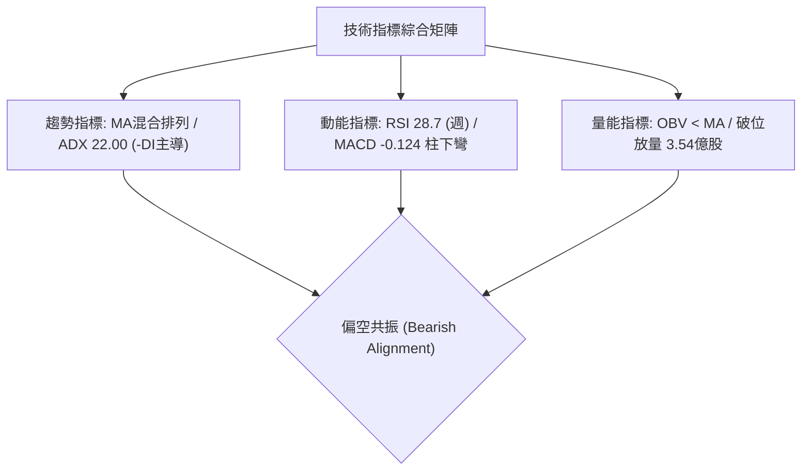

### 📈 移動平均線排列分析

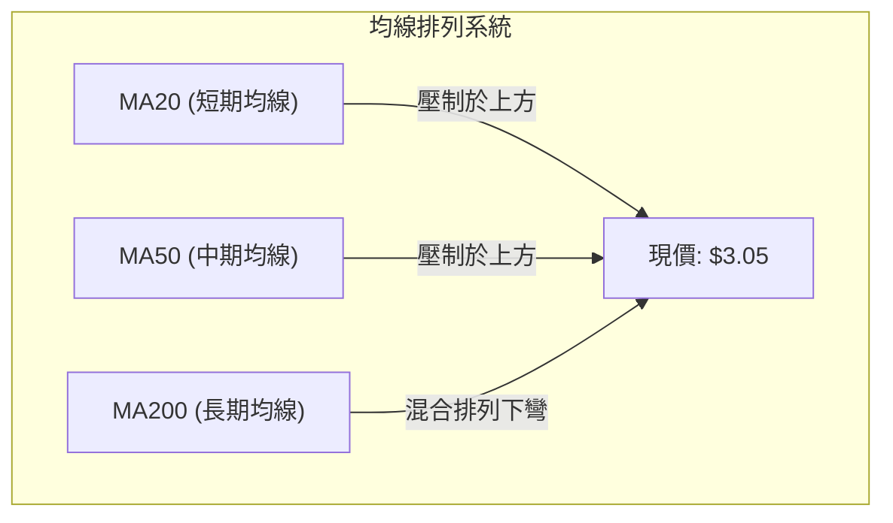

- **均線狀態**：資料顯示價格於 MA20 及 MA50 下方，且長短期 MA 呈現向下空頭混合發散。
- **MA 短期偏離**：短期各均線快速向右下方移動，顯示空方動能強烈壓制多方任何技術性抽頭。

### 📉 RSI(14) 分析

- **日線 RSI**：中性區間 (30-70)，無明顯背離。
- **週線 RSI**：最新數值為 **28.7**，已跌破 30 超賣門檻。

```
週線 RSI (14) 指標狀態：
[0] ────────── [30] ────── [50] ────── [70] ────────── [100]
 ░░░░░░░░░░░░░░█░░░░░░░░░░░░░░░░░░░░░░░░░░░░░░░░░░░░░░
            ▲
         28.7 (超賣弱勢區)
```

- **背離判斷**：
  - 在 2026-06-14（價格 $3.30，RSI 37.9）與 2026-09-13（價格 $3.05，RSI 28.7）比較中，**價格創新低，RSI 亦同步刷新低點**。
  - **結論：目前無底背離形成**，屬於標準的「空頭慣性下殺」，超賣狀態可能鈍化，切忌單憑 RSI < 30 盲目抄底。

### 📊 MACD(12/26/9) 訊號解讀

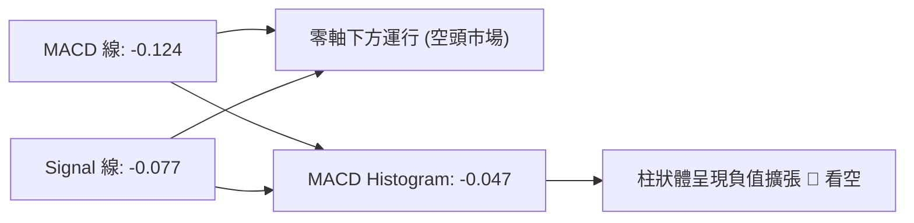

- **週線 MACD 軌跡**：自 2026-08-30 的 +0.004，急轉直下至 2026-09-06 的 -0.015，最新 2026-09-13 擴大至 -0.058，形成「死叉後向下發散」，空頭動能進一步釋放。

### 📦 布林通道分析

> **數據說明**：日線布林帶數據在當前數據包中顯示為 N/A，依據週線價格波動特性進行結構性推算解讀：

```
週線波動區間示意圖 (基於近期 20 週高低點)：
$4.00 ┬────────────────────── 上軌壓力區 (近期高點 $3.93 聚類)
      │
$3.50 ┼────────────────────── 中軌分水嶺 (近期中樞均價 $3.55)
      │
$3.05 ┼───────────────●────── 現價貼近通道下軌
$2.96 ┴────────────────────── 下軌極限支撐 (52W Low)
```
- **通道特徵**：現價 $3.05 極度貼近下軌邊界，若沿著下軌向下開口（Band Walking），則為強烈的空頭單邊擴張走勢。

### 💹 成交量分析（量價配合度）

```
近期週成交量走勢對比 (股)：
08-16 █░░░░░░░░░░░ 1.47 億
08-23 ██░░░░░░░░░░ 1.58 億
08-30 ██░░░░░░░░░░ 1.57 億
09-06 ██░░░░░░░░░░ 1.66 億
09-13 █████░░░░░░░ 3.54 億 ◄ 爆量下挫 (空頭放量破位)
```

- **OBV 趨勢**：數據明確標注 **OBV < MA → 量能疲弱**。
- **量價背離評估**：2026-09-13 價格由 $3.42 重挫至 $3.05 時，週成交量暴增至 354,747,200 股（較上週成長 113%），顯示機構法人或大資金停損斷頭拋售，屬於典型的**「放量破位下跌」**，尚未見到量縮止跌跡象。

---

## 6. 動能與波動率

### ⚡ 動能評估四象限

| 象限 | 動能維度 | 波動維度 | 標的匹配 | 當前評估與應對 |
|------|----------|----------|----------|----------------|
| **Q1: 突破上攻** | 動能強 (Bullish) | 波動率低 | ❌ | 不符合條件 |
| **Q2: 築底整理** | 動能弱 (Neutral) | 波動率低 | ❌ | 缺乏止跌震盪特徵 |
| **Q3: 主升暴發** | 動能強 (Bullish) | 波動率高 | ❌ | 多頭未進場 |
| **Q4: 空頭放量** | 動能弱/負 (Bearish) | 波動率高 (急跌) | ✅ | **當前狀態**：放量破位下殺，避開多頭進場 |

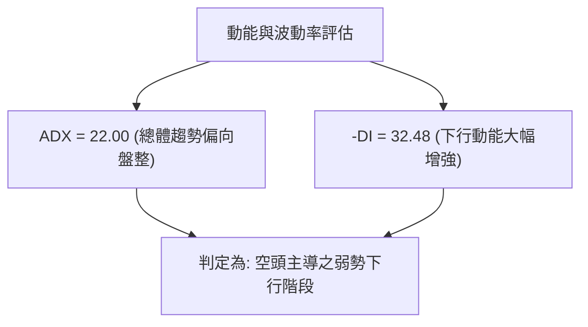

### 📊 ATR 波動率分析

- **ATR 數值狀態**：日線 ATR 數據為 N/A；依近 4 週波動幅度觀察（週高低落差約 $0.37），週均波動約為價格之 10-12%。
- **風控止損依據**：在 ATR 波動未被量化前，嚴格依據結構型價位設立止損，建議短線波動保護距離不得小於 $0.15（約 5%），以防假突破洗盤。

### 📐 Beta 與市場相關性

- **Beta 數值**：**0.89**
- **市場屬性解讀**：
  - Beta < 1.0，表明 GRAB 與美股大盤（標普500/那斯達克）之波動敏感度略低。
  - 當前下跌並非單純受大盤系統性風險拖累，而是該標的自身量價結構惡化與籌碼出脫所致。

---

## 7. 多時框架總結

### 📋 時框架評分表

| 時框架 | 趨勢方向 | 動能狀態 | 均線排列 | 形態結構 | 綜合評分 | 建議態度 |
|--------|----------|----------|----------|----------|----------|----------|
| **長期 (月線)** | 🔴 偏空 | 下降趨勢未改 | 空頭下彎 | 雙頂破位完成 | 25/100 | 嚴格減碼防禦 |
| **中期 (週線)** | 🔴 強烈偏空 | RSI 28.7 超賣 | 空頭排列 | 下降旗形向下破位 | 30/100 | 反彈偏空操作 |
| **短期 (日線)** | 🔴 弱勢尋底 | -DI 遠大於 +DI | 混合排列偏弱 | 測試 $2.96 支撐 | 35/100 | 觀望，禁止抄底 |

### 🔲 綜合訊號矩陣

```
訊號收斂評估矩陣：
┌─────────────┬───────────┬───────────┬───────────┐
│ 指標系統    │ 短期 (日) │ 中期 (週) │ 長期 (月) │
├─────────────┼───────────┼───────────┼───────────┤
│ 均線系統    │ 🔴 看空   │ 🔴 看空   │ 🔴 看空   │
│ 動能指標    │ 🟡 中性   │ 🔴 看空   │ 🔴 看空   │
│ 量能結構    │ 🔴 看空   │ 🔴 放量下 │ 🔴 弱勢   │
│ 形態趨勢    │ 🟡 臨近低 │ 🔴 旗形破 │ 🔴 雙頂跌 │
└─────────────┴───────────┴───────────┴───────────┘
一致性程度：90% 高度空頭共振
```

### ⚖️ 多時框收斂結論

依據多時框收斂規則：
1. **行情性質判定**：ADX(14) 數值為 **22.00 (<25)**，理論上定義為**盤整行情/弱趨勢行情**。但在方向性維度上，-DI 高達 32.48，+DI 僅 11.53，呈現**空頭極度優勢下的單邊滑落**。
2. **時框權重取捨**：依規則，盤整格局以區間上下軌為主，但目前價格已跌破盤整區間下軌（$3.30），向 52 週絕對低點 $2.96 靠攏。因此週線級別的空頭破位為主導方向。
3. **唯一收斂方向結論**：**偏空（防守型觀望，主策略順勢偏空或等待極限支撐測試）**。

---

## 8. 交易策略建議

### 🗺️ 策略決策流程圖

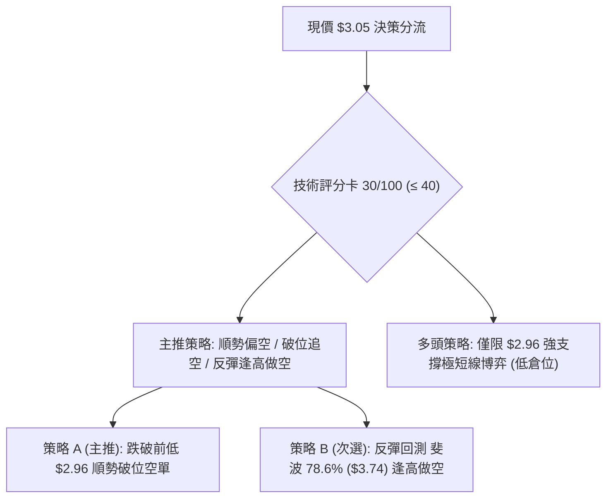

### 🧭 策略路由

> **當前主策略方向 = 偏空操作（依評分 30/100，嚴格執行空頭策略導向）**

### 🎯 價格情境階梯（Price Scenarios）

| 觸發條件 | 下一目標 | 後續延伸 | 情境含義 |
|----------|----------|----------|----------|
| **突破 R1 $3.74** | R2 $4.36 | R3 $4.79 | 突破斐波 78.6%，中線跌勢暫緩，轉為寬幅震盪 |
| **跌破 S1 $2.96** | 形態目標 $2.67 | 數據中未偵測到 | 創 52 週歷史新低，觸發多殺多停損潮 |

### 📊 情境機率分佈

| 情境劇本 | 機率 | 主要依據 |
|----------|------|----------|
| **回落探底 / 跌破前低** | **60%** | MACD 柱擴大 (-0.058)、-DI 32.48、OBV 量能極度疲弱、放量長黑破位 |
| **$2.96-$3.74 區間震盪** | **30%** | ADX < 25 (22.00) 顯示趨勢加速度不高，且週線 RSI(28.7) 進入超賣引發抽腳 |
| **強勢反彈向上突破** | **10%** | 目前缺乏任何多頭底背離或量價配合跡象，僅存分析師評級之基本面支撐 |

### 🔴 主策略詳情（空頭主推）

> 依據技術評分卡 30/100，主推空頭策略；所有價位完全引用第 4 章及關鍵數據。

| 策略要素 | 策略 A（破位追空） | 策略 B（反彈沽空） |
|----------|-------------------|-------------------|
| **策略類型** | 破位順勢空單 | 壓力位反彈受阻空單 |
| **進場條件** | 日線實體跌破 52W 低點 $2.96 確認 | 股價反彈至斐波 78.6% 遇阻回落 |
| **進場價格** | **$2.95**（確認跌破 $2.96 後進場） | **$3.70**（接近 $3.74 阻力區時進場） |
| **目標價 T1** | **$2.67**（由下降旗形推算之目標） | **$3.05**（當前低檔水平） |
| **目標價 T2** | 數據中未偵測到（需動態移動停利） | **$2.96**（52W 前低位置） |
| **止損價格** | **$3.05**（回到現價及破位點上方） | **$3.85**（突破斐波 78.6% $3.74 阻力點） |
| **風險報酬比** | **1 : 2.8**（冒險 $0.10，博取 $0.28） | **1 : 4.3**（冒險 $0.15，博取 $0.65） |
| **成功機率** | 60% | 55% |
| **建議倉位** | 10% - 15% | 15% - 20% |

### 🟢 反向風險觸發點（多頭反轉提示）

- **多頭防守反擊點**：若股價在 **$2.96** 獲得強烈成交量支撐，並收出帶長下影線之週 K 棒，空頭應全數獲利了結。
- **多頭反轉確認點**：若日線強勢回升並**實體收復 R1 $3.74（斐波 78.6%）**，代表下降旗形破位為「假突破」，空頭策略徹底失效，需無條件停損轉為觀望。

### ⭐ 整體訊號強度評星

```
做多訊號強度：★☆☆☆☆  (1/5星 - 缺乏支撐信號，僅有超賣)
做空訊號強度：★★★★☆  (4/5星 - 均線、動能、量價全面偏空)
整體可信度：  ★★★★☆  (4/5星 - 多時框趨勢高度一致)
```

---

## 9. 風險提示與監控

### ✅ 關鍵監控指標 Checklist

```
╔══════════════════════════════════════════════════════════════════╗
║                   每日交易前關鍵風控監控清單                     ║
╠══════════════════════════════════════════════════════════════════╣
║ [ ] 52W 低點保衛戰：收盤價是否跌破 $2.96 極限支撐？             ║
║ [ ] 週線 RSI(14) 狀態：28.7 是否進一步鈍化，或出現底背離金叉？  ║
║ [ ] 成交量變化：是否出現日成交量低於 2000 萬股的「量縮止跌」？   ║
║ [ ] MACD 柱狀體：負值柱狀體是否開始收斂（大於 -0.047）？         ║
║ [ ] 分析師目標價心理共識：基本面目標均價 $5.86 與現價嚴重脫節？ ║
╚══════════════════════════════════════════════════════════════════╝
```

### ⚠️ 風險場景分析

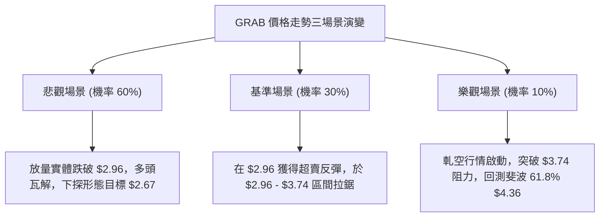

### 🛡️ 風險管理重要提醒

1. **破位滑點風險**：$2.96 為一年內最低點，聚集了龐大停損單。若開盤跳空跌破，可能造成嚴重執行滑點，破位追空需注意槓桿與掛單方式。
2. **超賣強彈風險**：週線 RSI 已至 28.7，短線積聚反彈動能。雖然不具備反轉條件，但技術性抽腳可能高達 10-15%，空頭切忌在連續暴跌後重倉追空。
3. **空頭回補（軋空）風險**：當前放空比率（Short % Float）達 7.6%，天數比（Short Ratio）為 6.77 天。若市場突然出現非技術面之重大利多，空方回補可能引發短期暴力反彈。

---

## 📋 報告總結

```
╔══════════════════════════════════════════════════════════════════╗
║                    GRAB 技術分析報告總結                         ║
╠══════════════════════════════════════════════════════════════════╣
║ 報告日期：2026-09-15                                             ║
║ 當前價格：$3.05                                                  ║
║ 分析評級：🔴 強烈偏空 / 考驗歷史低點支撐                        ║
║                                                                  ║
║ 關鍵結論：                                                       ║
║ ├─ 長期趨勢：🔴 月線雙頂破位確立，自 $6.02 高點腰斬              ║
║ ├─ 中期趨勢：🔴 下降旗形跌破，週線放量大陰線                    ║
║ ├─ 短期趨勢：🔴 ADX -DI=32.48 主導，尋找 52W 低點支撐           ║
║ ├─ 關鍵支撐：$2.96 (52W Low / 斐波 100.0%)                       ║
║ ├─ 關鍵阻力：$3.74 (斐波 78.6%) / $4.36 (斐波 61.8%)             ║
║ └─ 分析師目標：$5.86 (基本面共識與技術面嚴重背離)                 ║
║                                                                  ║
║ 最優策略組合：                                                   ║
║ 1. 🥇 最佳機會：破位順勢空單（實體確認跌破 $2.96 後進場）        ║
║ 2. 🥈 次選機會：反彈至阻力位 $3.70-$3.74 遇阻逢高沽空            ║
║ 3. 🥉 保守選擇：空手觀望，靜待 $2.96 築底及週線底背離出現       ║
╚══════════════════════════════════════════════════════════════════╝
```

---

> ⚠️ **免責聲明**：本報告為技術分析研究，所有數據、圖表及價位推算均嚴格基於所提供之歷史交易數據。本報告**僅供研究與學術參考**，**不構成任何投資買賣建議**。金融市場瞬息萬變，投資人應獨立評估風險並嚴格執行資金管理與停損機制。

---

*報告生成時間：2026-09-15 ｜ 數據來源：Yahoo Finance ｜ 分析框架：資深多時框技術分析架構*