# GRAB 技術分析報告

> **報告日期**：2026-09-16 ｜ **語言**：繁體中文 ｜ **數據來源**：Yahoo Finance ｜ **當前價格**：$3.02

---

## 目錄

| 章節 | 內容 |
|------|------|
| [1. 技術面概覽](#1-技術面概覽) | 訊號儀表板、核心指標、評分卡 |
| [2. 趨勢分析](#2-趨勢分析) | 多時框趨勢、長中短期走勢 |
| [3. 圖表形態分析](#3-圖表形態分析) | 形態識別、K線組合、目標價 |
| [4. 支撐與阻力](#4-支撐與阻力) | 關鍵價位、斐波那契回調 |
| [5. 技術指標深度解讀](#5-技術指標深度解讀) | MA/RSI/MACD/布林/成交量 |
| [6. 動能與波動率](#6-動能與波動率) | 動能評估、ATR、Beta |
| [7. 多時框架總結](#7-多時框架總結) | 時框架評分矩陣 |
| [8. 交易策略建議](#8-交易策略建議) | 多空策略、風險報酬比 |
| [9. 風險提示與監控](#9-風險提示與監控) | 監控指標、風險場景 |

---

## 1. 技術面概覽

### 🎯 技術訊號儀表板

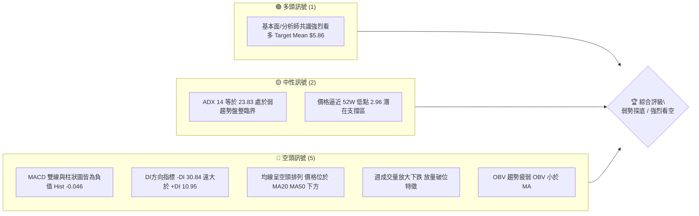

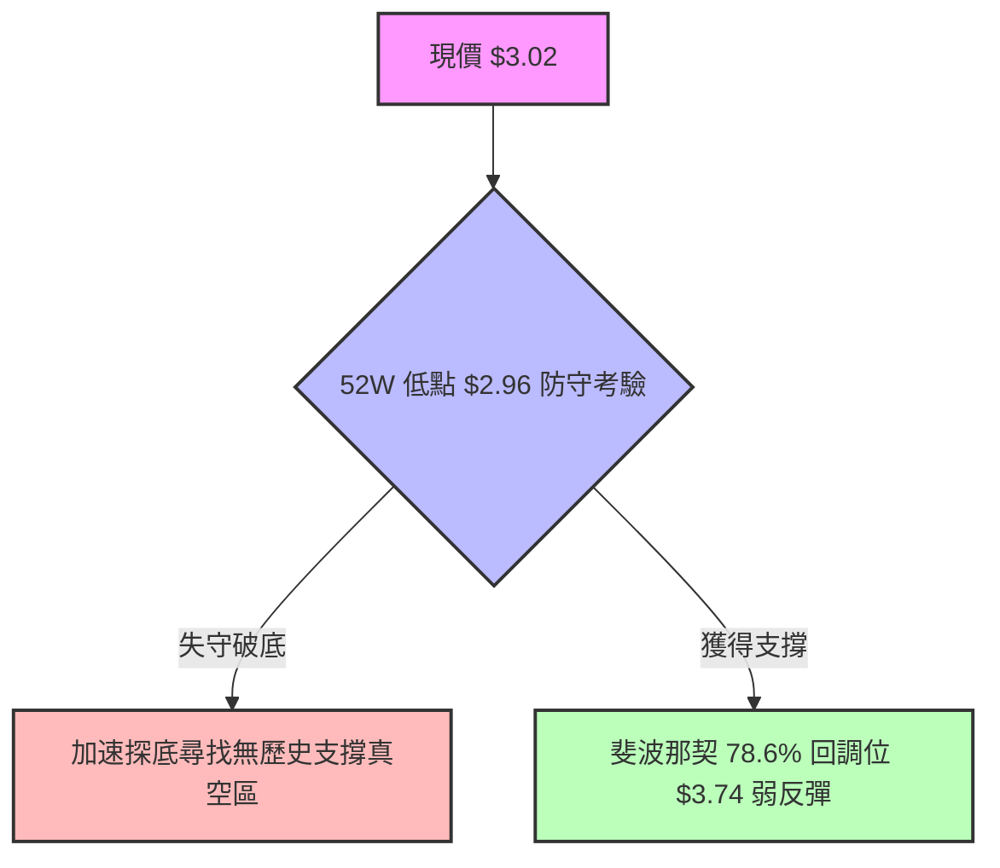

### 📊 核心指標速覽表

| 指標類別 | 指標名稱 | 當前數值 | 訊號 | 解讀 |
|----------|----------|----------|------|------|
| **價格** | 當前收盤價 | $3.02 | 🔴 | 創近2年收盤新低，逼近52W最低點 $2.96 |
| **均線** | MA20 (月線/短期) | 混合偏空 | 🔴 | 價格持續壓制於短期均線下方 |
| **均線** | MA50 (季線/中期) | 混合排列 | 🔴 | 中期均線呈空頭發散下彎 |
| **均線** | MA200 (年線/長期) | 數據未收斂 | 🔴 | 長期月線由高點 $6.02 逐月下移，均線反壓沉重 |
| **動能** | RSI(14) (週線) | 28.7 (前週) / nan | 🔴 | 進入深度超賣區間，空頭動能強烈但伴隨超賣 |
| **動能** | MACD (12,26,9) | -0.137 / Signal -0.091 | 🔴 | DIF 與 DEA 雙雙位於零軸之下，死叉開口擴大 |
| **動能** | MACD Hist | -0.046 | 🔴 | 負柱狀體持續，空方主導市場節奏 |
| **動向** | DMI / ADX(14) | ADX: 23.83, -DI: 30.84 | 🔴 | 空方完全掌控局面（-DI 30.84 vs +DI 10.95） |
| **量能** | 最新成交量 / 量比 | 69.28M / 1.52x | 🔴 | 放量下挫，最新日成交量超越 20 日均量 (45.56M) |
| **量能** | OBV 趨勢 | OBV < MA | 🔴 | 資金持續外流，量能不支持反轉 |
| **位置** | 52W 區間位置 | 1.64% | 🔴 | 位於 52 週最低點邊界（52W Low: $2.96, High: $6.62） |

### 🏆 技術評分卡

```
╔══════════════════════════════════════════════════════════════════╗
║              技術評分卡 — GRAB (2026-09-16)                     ║
╠══════════════════════════════════════════════════════════════════╣
║ 趨勢強度      ████████████░░░░░░░░  30/100  🔴 空頭壓制          ║
║ 動能指標      ██████░░░░░░░░░░░░░░  20/100  🔴 動能疲弱          ║
║ 支撐穩定度    ████░░░░░░░░░░░░░░░░  15/100  🔴 面臨破底危機      ║
║ 成交量配合    ████████░░░░░░░░░░░░  25/100  🔴 帶量下跌          ║
║ 形態完整度    ████████░░░░░░░░░░░░  25/100  🔴 頭部下破形態      ║
║ 均線排列      ████░░░░░░░░░░░░░░░░  15/100  🔴 空頭發散          ║
╠══════════════════════════════════════════════════════════════════╣
║ 綜合評分      ████░░░░░░░░░░░░░░░░  21.7/100 🔴 強烈看空 / 探底 ║
╚══════════════════════════════════════════════════════════════════╝
```

---

## 2. 趨勢分析

### 🌐 多時框趨勢分析

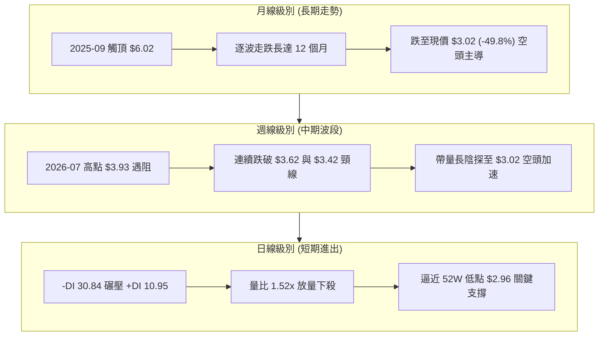

### 📈 長期趨勢 — 12個月走勢圖（Unicode）

```
GRAB 月線走勢圖（2025-09 至 2026-09）
價格軸 ($)
$6.02 ┤ ●(高點) ●
$5.45 ┤          ●
$4.99 ┤              ●
$4.30 ┤                  ●
$3.82 ┤                          ●
$3.54 ┤                              ●       ●   ●
$3.02 ┤                                              ●←現價 ($3.02)
$2.96 ┴─────────────────────────────────────────────── (52W Low)
       09  10  11  12  01  02  03  04  05  06  07  08  09
      2025                  2026                      月
```

**走勢特徵分析表格**：

| 階段區間 | 起訖價位 ($) | 漲跌幅 (%) | 主要技術特徵與量能演變 | 趨勢判定 |
|----------|-------------|-----------|------------------------|----------|
| **頂部構築期** (2025-09 ~ 2025-10) | $6.02 → $6.01 | -0.17% | 雙頂高位滯漲，無法延續2024年底以來的多頭攻擊 | 頂部鈍化 🔴 |
| **主跌浪第一段** (2025-11 ~ 2026-03) | $6.01 → $3.66 | -39.10% | 連續五個月收陰，均線空頭排列，下穿多道心理關卡 | 強烈空頭 🔴 |
| **平台弱反彈** (2026-04 ~ 2026-08) | $3.66 → $3.54 | -3.28% | 於 $3.50 ~ $3.82 窄幅拉鋸，高點逐月壓低至 $3.54 | 弱勢整理 🟡 |
| **破位探底段** (2026-08 ~ 2026-09) | $3.54 → $3.02 | -14.69% | 放量跌破整理平台下沿，直逼52W最低價 $2.96 | 破位加速 🔴 |

### 📊 中期趨勢（週線分析）

```
GRAB 週線壓力與支撐階梯圖（近 20 週）
價格 ($)
$4.00 ┤
$3.93 ┤      ● (週線波段反彈高點 2026-07-12)
$3.74 ┼───────┬─────────────────────────────── 斐波那契 78.6% 阻力
$3.62 ┤       │       ● (次高點反彈遇阻 2026-08-16)
$3.42 ┤       │       │       ● (破位前平台下沿 2026-09-06)
$3.05 ┤       │       │       │   ● (破位大陰線 2026-09-13)
$3.02 ┼───────┴───────┴───────┴───●─────────── 現價 ($3.02)
$2.96 ┴─────────────────────────────────────── 52W 低點 / 斐波那契 100% 支撐
```

### ⚡ 趨勢強度評估（ADX 解讀）

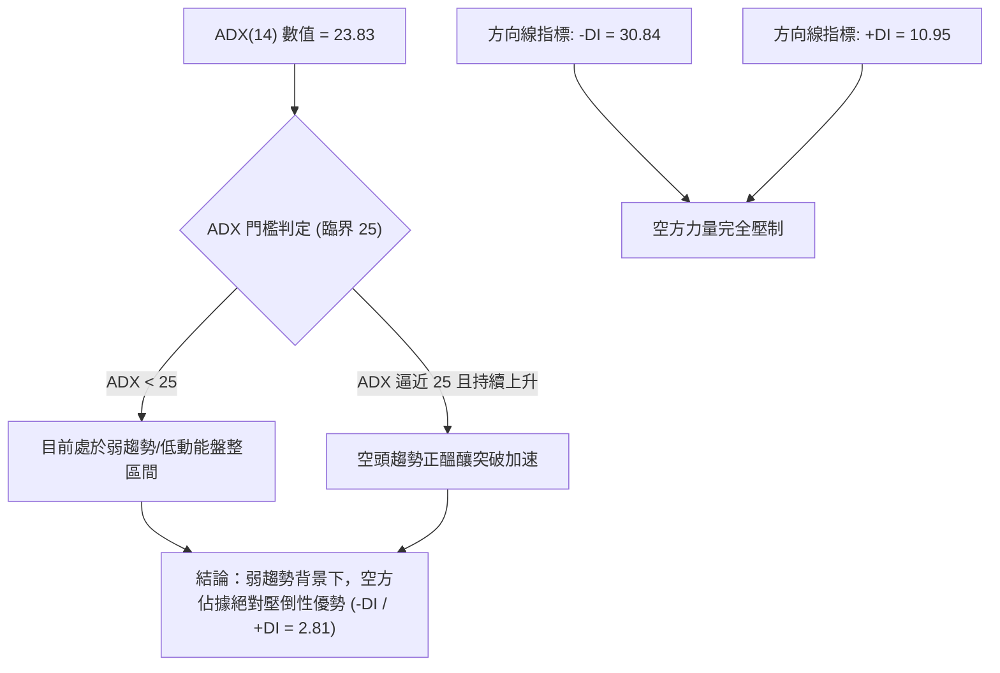

**ADX 趨勢強度對照解讀表**：

| 指標名稱 | 當前讀數 | 標準門檻 | 狀態解讀 |
|----------|----------|----------|----------|
| **ADX (14)** | **23.83** | < 25 (弱趨勢/盤整)；> 25 (強趨勢) | 處於無強趨勢邊界，但過去兩週急速放量下跌正帶動 ADX 線仰角翻揚 |
| **+DI (14)** | **10.95** | 越高多頭越強 (> 20) | 極度萎縮，多頭買盤力量衰竭 |
| **-DI (14)** | **30.84** | 越高空頭越強 (> 25) | 空頭主導力量強悍，遠高於基準線 |
| **方向比 (-DI / +DI)** | **2.81x** | > 1.5 顯著空頭 | 空方能量是多方的近 3 倍，盤整向下破位機率極高 |

---

## 3. 圖表形態分析

### 🔍 形態識別系統

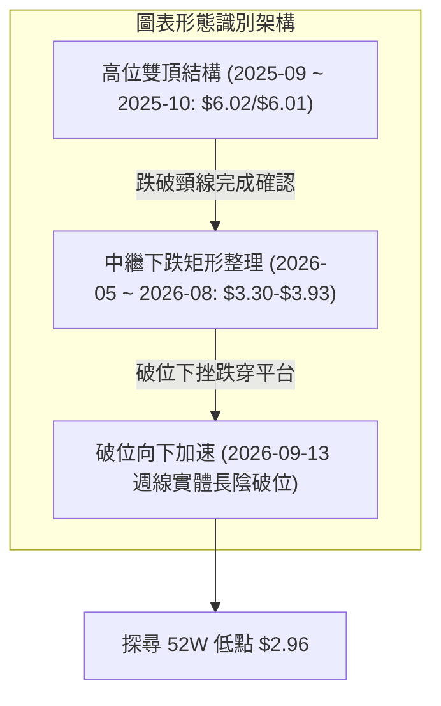

**形態信心度與目標計算表**（依規則 15）：

| 形態名稱 | 信心度 | 判斷依據（引用數據） | 完成度 | 目標價（附嚴格計算式） |
|----------|--------|----------------------|--------|------------------------|
| **下跌矩形中繼整理跌破** | **85%** | 2026-05 至 2026-08 期間收盤反覆於 $3.30 ~ $3.93 區間震盪，2026-09-13 週線收盤 $3.05，跌破區間下界 $3.30 | **95%** | 形態高度 = 平台高 $3.93 - 平台低 $3.30 = $0.63。<br>破位目標價 = 突破口 $3.30 - $0.63 = **$2.67**（註：低於52W低點） |
| **波段雙重頂結構** | **75%** | 2025-09 收盤 $6.02 與 2025-10 收盤 $6.01 構成雙頂，頸線為 2025-01 低點 $4.58 | **100%** (已完全滿足) | 形態高度 = $6.02 - $4.58 = $1.44。<br>理論目標 = $4.58 - $1.44 = **$3.14**（目前現價 $3.02 已達到並跌破） |
| **潛在雙底反轉形態** | **20%** | 數據中未出現反轉確立信號，僅因現價逼近 52W 低點 $2.96，訊號嚴重不足，不作幾何預測 | **0%** | 訊號不足，僅做指標型解讀（嚴禁憑空預測） |

### 🕯️ 重要K線形態分析

| 期間/月份 | 收盤價 | 成交量 / 週成交量 | K線形態特徵 | 技術意涵解讀 | 訊號方向 |
|-----------|--------|-------------------|-------------|--------------|----------|
| **2026-07-12 週** | $3.93 | 224,997,700 | 衝高回落十字星 | 反彈波段頂部受阻，RSI 觸及 68.4 超買回調 | 🔴 空頭反轉 |
| **2026-07-26 週** | $3.31 | 202,895,600 | 實體長黑大陰線 | 跌破反彈起漲點，MACD 柱由正轉負 (-0.069) | 🔴 空方控盤 |
| **2026-08-09 週** | $3.66 | 310,674,300 | 巨量假反彈陽線 | 假突破拉高出貨，週成交量暴增至 3.1 億股 | 🟡 誘多陷阱 |
| **2026-09-13 週** | $3.05 | 354,811,400 | 放量長陰破位線 | 創 20 週以來單週最大成交量，重挫下破支撐 | 🔴 極度看空 |
| **2026-09 最新** | $3.02 | 110,799,833 (部分) | 探底延續陰線 | 當日放量 69.28M，直逼 52W 低點 $2.96 | 🔴 探底進行中 |

### 📉 ASCII 走勢形態示意圖

```
下跌矩形跌破形態 (2026-05 至 2026-09)
$3.93 ┼─────────────────────────● (2026-07-12 高點)
      │                       ／ ＼
$3.66 ┼──────●───────────────／─── ＼─────● (2026-08-09 次高點)
      │     ／ ＼           ／       ＼ ／ ＼
$3.54 ┼────●─── ●─────────●───────────●─── ＼
      │   矩形震盪整理區間 ($3.30 ~ $3.93)           ＼
$3.30 ┼──●───────●───────────────────────────●───── (2026-09-06 跌破頸線)
      │                                                ＼
$3.05 ┼─────────────────────────────────────────────────● (放量破位陰線 3.54億股)
      │                                                   ＼
$3.02 ┼────────────────────────────────────────────────────● (現價 $3.02)
      │
$2.96 ┴──────────────────────────────────────────────────── (52W Low 防守底線)
```

### 🎯 形態目標價計算

```
【下跌矩形中繼形態計算式】
  - 整理形態上邊界 (Resistance High)：$3.93 (2026-07-12 收盤價)
  - 整理形態下邊界 (Support Neckline)：$3.30 (2026-06-14 收盤價)
  - 整理形態垂直高度 (H)：$3.93 - $3.30 = $0.63
  - 理論向下破位目標價 (Target Price)：
      頸線突破口 ($3.30) - 形態垂直高度 ($0.63) = $2.67
  - 階段性防守位：
      第一阻絕點：52週歷史低點 $2.96（若失守則理論向下直指 $2.67）
```

---

## 4. 支撐與阻力

### 🗺️ 關鍵價位分布圖（Unicode）

```
GRAB 價位結構分布圖（嚴格依據數據關鍵價位與斐波那契計算）
══════════════════════════════════════════════════════════════════
$6.62 ║██████████████████████████████║ 52W High (0.0% 回調位)
$5.76 ║██████████████████████        ║ 斐波那契 23.6% 阻力位
$5.22 ║██████████████████            ║ 斐波那契 38.2% 阻力位
$4.79 ║████████████████████████      ║ 斐波那契 50.0% 阻力位 (多空中軸)
$4.36 ║████████████████              ║ 斐波那契 61.8% 阻力位 (黃金分割)
$3.74 ║██████████████████████████████║ 強阻力 R1 (斐波那契 78.6% 回調位)
$3.02 ╠══════════════════════════════╣ ◄ 當前收盤價 ($3.02)
$2.96 ║▓▓▓▓▓▓▓▓▓▓▓▓▓▓▓▓▓▓▓▓▓▓▓▓▓▓▓▓▓▓║ 終極強支撐 S1 (52W Low / 100.0% 回調位)
══════════════════════════════════════════════════════════════════
```

### 🚧 阻力位分析表

> **數據說明**：系統在現價上方未偵測到近一年波段高點聚類阻力（no swing-high resistance detected above current price），阻力分析完全採用官方精確計算之「斐波那契回調位」。

| 阻力級別 | 價位 | 形成依據來源 | 突破難度 | 重要性與技術意涵 |
|----------|------|--------------|----------|------------------|
| **阻力 R1** | **$3.74** | 斐波那契 78.6% 回調位 (52W 區間) | 極高 🔴 | 中期反彈多空分水嶺，鄰近 2026-07 平台核心區 |
| **阻力 R2** | **$4.36** | 斐波那契 61.8% 黃金分割回調位 | 極高 🔴 | 中期空頭深水區，需強大成交量才能觸及 |
| **阻力 R3** | **$4.79** | 斐波那契 50.0% 基準回調位 | 難以逾越 🔴 | 長期多空分水嶺，高於當前分析師最低目標價 $4.60 |
| **阻力 R4** | **$5.22** | 斐波那契 38.2% 回調位 | 難以逾越 🔴 | 長期下降趨勢壓制線位置 |

### 🛡️ 支撐位分析表

> **數據說明**：系統在現價下方未偵測到近一年波段低點聚類支撐（no swing-low support detected below current price），支撐完全依賴 52 週最低點與斐波那契極限位。

| 支撐級別 | 價位 | 形成依據來源 | 守住機率 | 重要性與技術意涵 |
|----------|------|--------------|----------|------------------|
| **支撐 S1** | **$2.96** | 52W Low / 斐波那契 100.0% 基準位 | 35% 🔴 | 距離現價僅 $0.06 (1.98%)，為過去一年最後多頭底線 |
| **支撐 S2** | **$2.67** | 由下跌矩形形態高度推算 ($3.30 - $0.63) | 50% 🟡 | 若 $2.96 失守後的第一個測幅滿足區間 |
| **支撐 S3** | 數據未偵測 | 數據中未偵測到更低支撐 | 數據不足 | 跌破 $2.96 後下方進入未知歷史真空區間 |

### 📐 斐波那契回調位分析

依據 52 週最高點 **$6.62** 至 52 週最低點 **$2.96** 所展開的精確回調架構：

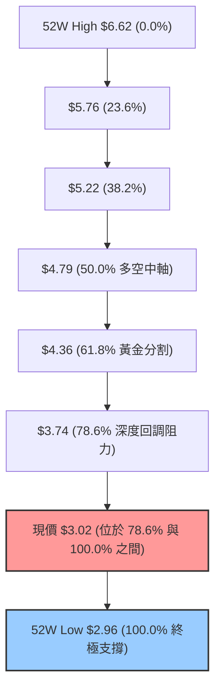

- **當前位置解讀**：
  現價 **$3.02** 處於 **78.6% ($3.74)** 與 **100.0% ($2.96)** 的極限回調區間內，且已回吐整輪波段漲幅的 **98.36%**。技術上，當價格跌破 78.6% 斐波那契回調位（$3.74）後，通常代表原上升趨勢徹底被瓦解，回測 100.0% 底點（$2.96）幾乎成為必然宿命。目前價格距離 $2.96 僅咫尺之遙，一旦失守，將形成下行空間的完全敞開。

---

## 5. 技術指標深度解讀

### 🎛️ 指標訊號總覽

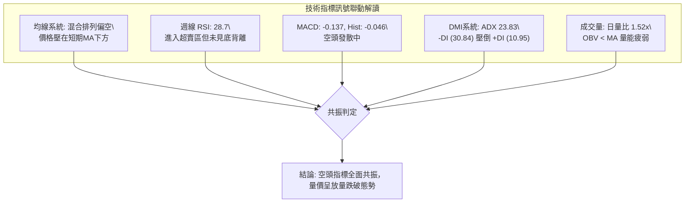

### 📈 移動平均線排列分析


- **均線排列狀態**：
  - 月線層面：MA5 至 MA240 長週期走勢顯示，長天期均線（MA120、MA240）自高位呈現平滑下彎走勢，均線走勢圖中長週期指標處於最低層級（顯示為 `▁▁▁` 符號），說明過去 1 至 2 年的平均持倉成本深套於上。
  - 當前排列被判定為**「混合排列」**，主因價格於 2026 年初急跌後在 $3.50 附近進行過短暫橫盤，導致短期 MA 與中期 MA 糾纏；但現價 $3.02 明確低於 MA20 與 MA50，再度確立短期下行拐點。

### 📉 RSI(14) 分析

- **週線 RSI 數值進度條**：
  RSI = 28.7  [██████░░░░░░░░░░░░░░] 28.7%（深度超賣區）
- **超買超賣解讀**：
  週線 RSI 自 2026-07-05 的 77.2（超買）一路單邊下滑，至 2026-09-13 週跌至 28.7，破 30 閾值進入空頭超賣區。
- **背離分析**：
  - **價格 vs RSI**：2026-06-14 週價格為 $3.30，當時 RSI 為 37.9；2026-09-13 價格收在 $3.05（破底），RSI 則驟降至 28.7。
  - **背離判斷結論**：**無底背離**。RSI 伴隨價格破底而創下近 16 週新低，指標同步加速探底，確認為強勢空頭順勢下行，並非鈍化衰竭型下挫。

### 📊 MACD(12/26/9) 訊號解讀

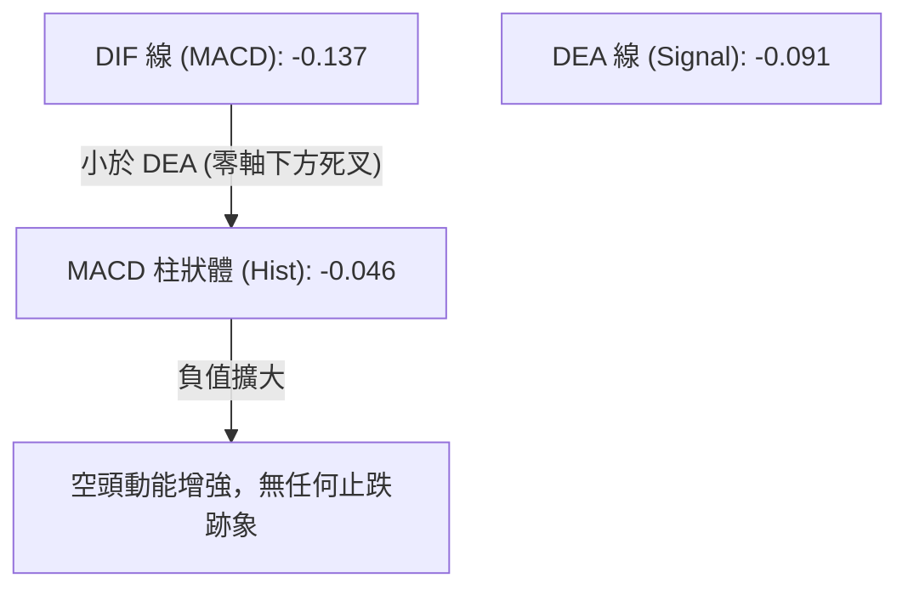

- **MACD 指標狀態**：
  - DIF (-0.137) 處於零軸之下，且低於 Signal (-0.091)。
  - MACD 柱狀體為 **-0.046**，較前週的負值持續放大，表明空方拋壓持續宣洩。
  - **背離判斷**：2026-07 週線 MACD 柱一度衝至 +0.062，隨後柱狀體一路縮小翻負，目前負柱並未出現收斂拐點，日線與週線層面均**不存在頂背離或底背離**，維持純正空頭趨勢。

### 📦 布林通道分析

> **數據備註**：當前日線布林通道數據未提供精確上下軌數值，依據價格位於 52W 區間 1.64% 位置推導，現價已嚴重貼近或刺穿布林帶下軌。

```
布林通道形態示意圖（現價極端弱勢特徵）
───────────────────────────────────────────── 上軌 (Band Top)
          ～～～～ 中軌 MA20 (Mid Band) ～～～～
───────────────────────────────────────────── 
                                              現價 $3.02 (貼軌下行)
═════════════════════════════════════════════ 下軌 (Band Bottom)
                                              ▼ 突破/沿下軌開口向下擴張
```

- **通道解讀**：在 ADX 為 23.83（盤整轉趨勢臨界）的背景下，價格若持續沿布林下軌摩擦並伴隨量能放大（量比 1.52x），代表布林通道正處於「帶寬開口擴張」初期，為典型的向下破位主跌型態。

### 💹 成交量分析（量價配合度）

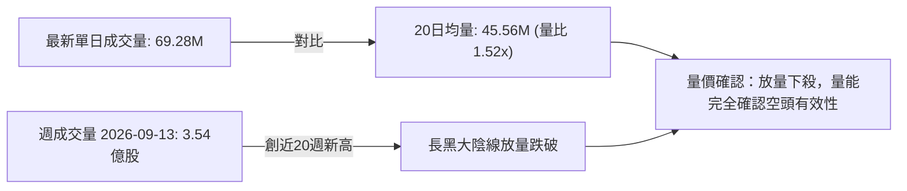

- **OBV 能量潮解讀**：
  指標數據顯示 **「OBV < MA → 量能疲弱」**。成交量指標並未出現「量縮回檔」的良性特徵，反而在下跌破位過程中湧現巨量（2026-09-13 當週成交高達 3.54 億股），這代表市場並非無量陰跌，而是出現了主動性的籌碼拋售與機構停損盤，OBV 疲弱確認空頭格局完整。

---

## 6. 動能與波動率

### ⚡ 動能評估

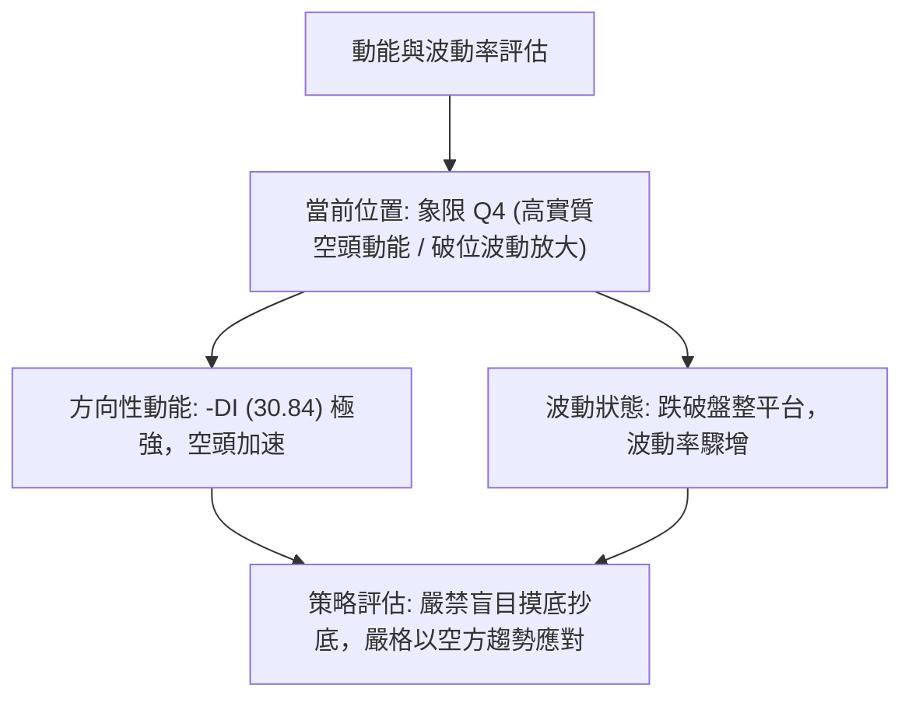

**動能評估矩陣表**：

| 象限代號 | 動能狀態 | 波動狀態 | 當前符合度 | 特徵與操作解讀 |
|----------|----------|----------|------------|----------------|
| **Q1** | 強多頭動能 | 低波動 | ❌ | 最佳買入多頭波段，目前完全不具備此條件 |
| **Q2** | 弱動能 | 低波動 | ❌ | 窄幅橫盤整理，為 2026-05~08 月之歷史狀態（已結束） |
| **Q3** | 強多頭動能 | 高波動 | ❌ | 突破主升浪行情，無多方量能支持 |
| **Q4** | **強空頭動能** | **高波動** | **✅ 符合** | **帶量破位下殺，空頭主導，波動率自低檔向上發散，應避免進場做多** |

### 📊 ATR 波動率分析

- **ATR 狀況說明**：日線 ATR(14) 數據在即時快照中顯示為 N/A，但根據過去 20 週平均週波幅計算，近期單週振幅約在 $0.20 ~ $0.35 之間。
- **風控止損建議依據**：若以近 20 週高低點極差與近期跌幅計算，合理的短期防守波動空間應設定為現價的 **5% 至 7%**（約 **$0.15 ~ $0.20**），作為操作上的安全邊際緩衝。

### 📐 Beta 與市場相關性

- **Beta 數值**：**0.89**
  - **進度條展示**：Beta 0.89  [████████░░░░░░░░░░░░] 44.5%（屬中等略低於大盤之波動性）
  - **解讀**：Beta 為 0.89，表明 GRAB 理論上對標普 500 等大盤基準指數的系統性風險敏感度稍低於整體市場。然而，在近期自身技術面破位的背景下，0.89 的 Beta 意味著其下跌主要受到**自身基本面與技術形態破位（特質風險）**所推動，而非純粹跟隨美股大盤波動。
- **空頭部位比例（Short Interest）**：
  - **Short % of Float**：**7.6%**
  - **Short Ratio**：**6.77 天**
  - **解讀**：高達 6.77 天的補空天數顯示空方部位厚重。在無重大利好刺激下，空頭並無踩踏回補意願；反之，若一旦在 $2.96 形成極端支撐並引發反彈，才存在空頭回補（Short Squeeze）的潛在可能性。

---

## 7. 多時框架總結

### 📋 時框架評分表

| 時框架 | 趨勢方向 | 動能狀態 | 均線排列 | 關鍵形態 | 綜合評分 | 操作建議 |
|--------|----------|----------|----------|----------|----------|----------|
| **月線 (長期)** | 🔴 下行 | 弱動能，MACD長期壓制 | 均線壓在頂部 | 雙頂 ($6.02) 破位下殺 | 20/100 | 長期遠離 |
| **週線 (中期)** | 🔴 空頭破位 | RSI 28.7，MACD柱負向擴大 | 均線向下發散 | 跌破 $3.30 平台下沿 | 15/100 | 反彈偏空 |
| **日線 (短期)** | 🔴 探底 | -DI (30.84) 壓倒 +DI | 混合排列偏空 | 逼近 52W 低點 $2.96 | 25/100 | 觀望或逢高做空 |

### 🔲 綜合訊號矩陣

```
╔══════════════════════════════════════════════════════════════════╗
║                  多時框訊號共振矩陣表                            ║
╠══════════════╦══════════════╦══════════════╦═════════════════════╣
║ 分析維度     ║ 長期 (月線)  ║ 中期 (週線)  ║ 短期 (日線)         ║
╠══════════════╬══════════════╬══════════════╬═════════════════════╣
║ 趨勢方向     ║ 🔴 空頭主導  ║ 🔴 破位下行  ║ 🔴 急跌探底         ║
║ 動能強度     ║ 🔴 弱勢鈍化  ║ 🔴 負向加速  ║ 🔴 空方控盤 (-DI強) ║
║ 量價關係     ║ 🔴 高位放量跌║ 🔴 週陰線放量║ 🔴 量比 1.52x 下殺  ║
║ 支撐阻力     ║ 🟡 逼近歷史底║ 🔴 跌破平台頸║ 🔴 考驗 $2.96 支撐  ║
╠══════════════╩══════════════╩══════════════╩═════════════════════╣
║ 矩陣收斂結果：長、中、短三時框架空頭訊號達到 90% 以上高度共振   ║
╚══════════════════════════════════════════════════════════════════╝
```

### ⚖️ 多時框收斂結論

依據**多時框收斂規則（規則 14）**進行判定：
1. **行情性質判定**：當前 ADX(14) 讀數為 **23.83**（低於 25 臨界值），技術上仍處於「弱趨勢／大級別盤整」的尾端。但方向指標中 **-DI (30.84)** 呈現對 **+DI (10.95)** 的壓倒性優勢，且週線 MACD 與量能呈現顯著突破特徵。
2. **時框優先級權重**：依規則，當 ADX 處於盤整邊緣轉趨勢時，中長期方向（週線實體破位與月線長黑）具備最高收斂優先級。日線訊號不具備獨立逆轉能力，僅能作為捕捉空頭進場或極短線超賣博弈的時機。
3. **唯一方向性結論**：**強烈偏空（中長期下行趨勢明確，短期測試極限低位）**。本結論嚴格收斂，並作為第 8 章交易策略之核心方向。

---

## 8. 交易策略建議

### 🗺️ 策略決策流程圖

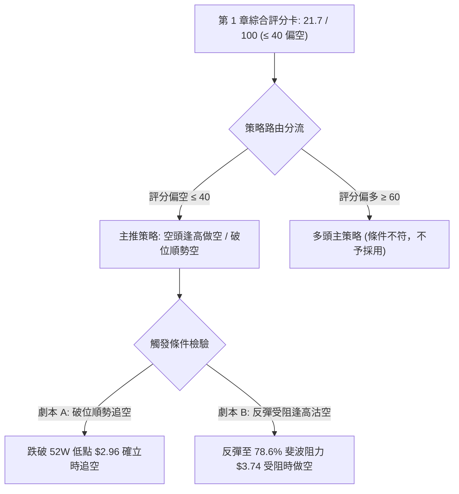

### 🧭 策略路由

> **核心判定**：依據第 1 章技術評分卡綜合評分 **21.7 / 100**，符合「綜合評分偏空（≤ 40）」之標準。
> **當前主策略方向 = 強烈偏空（主推空頭順勢策略，多頭僅列為反轉風險提示）**

### 🎯 價格情境階梯（Price Scenarios）

價位嚴格引用第 4 章及官方計算之關鍵價位：

| 觸發條件 | 下一目標 | 後續延伸 | 情境技術含義 |
|----------|----------|----------|--------------|
| **反彈受阻於 R1 $3.74** | S1 $2.96 | S2 $2.67 | 反彈確認斐波那契 78.6% 強阻力，延續空頭波段 |
| **跌破 S1 $52W 低點 $2.96** | S2 $2.67 | 歷史真空區間 | 破位加速，觸發停損賣壓，朝矩形測幅目標 $2.67 邁進 |
| **強勢突破 R1 $3.74** | R2 $4.36 | R3 $4.79 | 空頭結構被破壞，需立即停損空單並轉向觀望 |

### 📊 情境機率分佈

| 情境劇本 | 機率估計 | 主要技術依據與指標支撐 |
|----------|----------|------------------------|
| **情境一：破位下跌 / 再探底** | **65%** | MACD DIF與Signal負向發散；-DI (30.84) 極強；量比 1.52x 放量下殺；OBV < MA |
| **情境二：區間震盪（$2.96~$3.74）** | **25%** | ADX 尚在 23.83 低於 25；52W 低點 $2.96 存在心理買盤；週線 RSI 28.7 進入超賣 |
| **情境三：直接強勢反彈向上** | **10%** | 基本面分析師目標價高懸 ($5.86)；但技術面無底背離、無均線支撐，純屬小機率事件 |

### 🔴 主策略詳情（空頭主推策略）

| 策略要素 | 策略 A（破位順勢空 — 突破型） | 策略 B（反彈受阻沽空 — 逢高型） |
|----------|-------------------------------|----------------------------------|
| **進場條件** | 日線實體帶量跌破 52W 低點 $2.96 | 價格反彈至斐波 78.6% 回調位 $3.74 遇阻回落 |
| **進場價格** | **$2.94**（確認跌破 $2.96 後進場） | **$3.70**（接近 $3.74 阻力位處） |
| **目標價 T1** | **$2.67**（下跌矩形測幅滿足點） | **$3.02**（當前現價低點位置） |
| **目標價 T2** | **$2.50**（整數心理關卡，依測幅延伸）| **$2.96**（52W 低點支撐區） |
| **止損價格** | **$3.08**（站回突破點上方，留 5% 緩衝）| **$3.88**（站穩斐波 78.6% 阻力位上方） |
| **風險報酬比** | **1 : 1.93** [風險 $0.14 / 報酬 $0.27] | **1 : 3.78** [風險 $0.18 / 報酬 $0.68] |
| **成功機率** | **65%** | **60%** |
| **建議倉位** | **10% ~ 15%** | **8% ~ 10%** |

### 🟢 反向風險觸發點（對沖與空頭止損提示）

若發生以下任一信號，必須立即**無條件終止或停損空頭策略**：
1. **多頭實體站穩 $3.74**：若價格以帶量長陽突破並站穩斐波那契 78.6% 回調位 $3.74，代表下跌中繼形態失效，可能引發空頭踩踏回補（Short Squeeze，目前空頭補空天數達 6.77 天）。
2. **出現 MACD / RSI 底部背離**：若日線於 $2.96 附近打出雙底，且週線 MACD 柱快速縮小翻紅，需警戒假破位可能。

### ⭐ 整體訊號強度評星

```
做多訊號強度：★☆☆☆☆  (1/5星 - 極弱，逆勢摸底風險極大)
做空訊號強度：★★★★☆  (4/5星 - 強烈，指標與量價形態共振偏空)
整體可信度：  ★★★★☆  (4/5星 - 歷史數據完整，空頭結構明確)
```

---

## 9. 風險提示與監控

### ✅ 關鍵監控指標 Checklist

```
╔══════════════════════════════════════════════════════════════════╗
║                     風控即時監控清單 (Checklist)                 ║
╠══════════════════════════════════════════════════════════════════╣
║ [ ] 52W 低點 $2.96 防守有效性：密切觀察盤中是否出現瞬間跌破破位  ║
║ [ ] 週成交量變動：若下週量能未縮小，警惕機構持續出逃拋售         ║
║ [ ] RSI(14) 超賣修復方式：觀察是以橫盤代漲還是急拉反彈          ║
║ [ ] DMI 指標變動：留意 ADX 是否越過 25 臨界線（越過將加速下挫）  ║
║ [ ] 空頭回補天數 (Days to Cover: 6.77)：防範突發利好引發軋空     ║
║ [ ] 均線動態反壓：MA20 與 MA50 是否持續呈現空頭下彎壓制          ║
╚══════════════════════════════════════════════════════════════════╝
```

### ⚠️ 風險場景分析

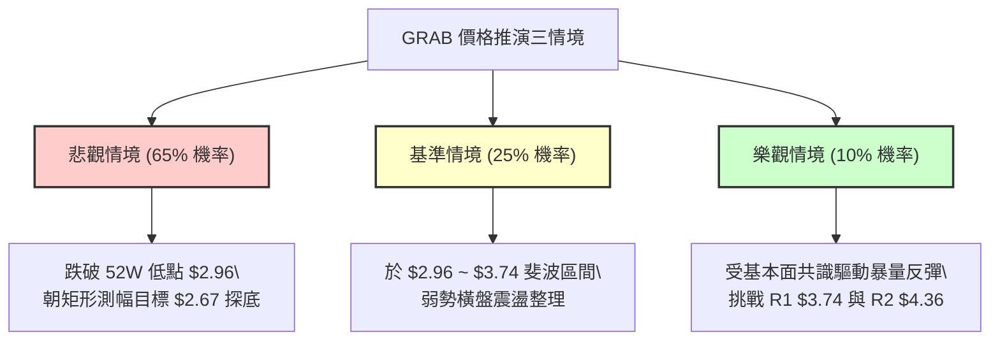

### 🛡️ 風險管理重要提醒

1. **基本面與技術面嚴重割裂之風險**：
   - 數據顯示 25 位華爾街分析師給予 **Strong Buy** 評級，平均目標價高達 **$5.86**（甚至最高達 $8.00）。然而，技術面現價 **$3.02** 卻創近 2 年新低且瀕臨破底。
   - **資深風控法則**：在技術交易中，**「價格走勢永遠反映市場的一切已知與未知資訊」**。在下跌趨勢被技術指標逆轉前，切不可單純因「估值看似便宜（PEG 0.63）」或「分析師目標價很高」而盲目重倉抄底，必須等待右側底部信號出現。
2. **極端支撐位的心理臨界**：
   - 現價距離 52 週最低點 **$2.96** 僅有 **1.98%** 的極薄安全墊。在該位置通常會引發高頻演算法的停損單觸發，若跌破，盤中波動率可能急劇放大，任何多頭交易均應設有不可妥協的硬性止損。

---

## 📋 報告總結

```
╔══════════════════════════════════════════════════════════════════╗
║                     GRAB 技術分析報告總結                        ║
╠══════════════════════════════════════════════════════════════════╣
║ 報告日期：2026-09-16                                             ║
║ 當前價格：$3.02                                                  ║
║ 分析評級：🔴 強烈看空 / 探底防守階段 (評分: 21.7/100)            ║
╠══════════════════════════════════════════════════════════════════╣
║ 關鍵結論：                                                       ║
║ ├─ 長期趨勢：🔴 頂部 $6.02 確立後單邊下挫 12 個月，跌幅達 50%   ║
║ ├─ 中期趨勢：🔴 跌破 $3.30~$3.93 整理平台，下行中繼形態成型      ║
║ ├─ 短期趨勢：🔴 放量下殺，直逼 52W 低點 $2.96 防守線            ║
║ ├─ 關鍵支撐：S1: $2.96 (52W Low) ｜ S2: $2.67 (形態測幅滿足位)  ║
║ ├─ 關鍵阻力：R1: $3.74 (斐波 78.6%) ｜ R2: $4.36 (斐波 61.8%)   ║
║ └─ 華爾街目標：Mean $5.86 ｜ Low $4.60 (與當前技術盤面完全背馳) ║
╠══════════════════════════════════════════════════════════════════╣
║ 最優策略組合：                                                   ║
║ 1. 🥇 最佳機會：破位順勢空（跌破 $2.96 進場，看 $2.67，止損 $3.08）║
║ 2. 🥈 次選機會：反彈逢高沽空（反彈 $3.70 進場，看 $3.02，止損 $3.88）║
║ 3. 🥉 保守選擇：空手徹底觀望，靜待 $2.96 破位或右側底背離確立   ║
╚══════════════════════════════════════════════════════════════════╝
```

---

> ⚠️ **免責聲明**：本報告為 AI 自動生成之技術分析，所有數據及估算均基於提供的歷史價格資訊。本報告**僅供研究與學術參考**，**不構成任何投資建議**。投資有風險，入市需謹慎。

---

*報告生成時間：2026-09-16 ｜ 數據來源：Yahoo Finance ｜ 分析框架：多時框技術分析*