# GRAB 技術分析報告

> **報告日期**：2026-09-20 ｜ **語言**：繁體中文 ｜ **數據來源**：Yahoo Finance ｜ **當前價格**：$2.80

---

## 目錄

| 章節 | 內容 |
|------|------|
| [1. 技術面概覽](#1-技術面概覽) | 訊號儀表板、核心指標、評分卡 |
| [2. 趨勢分析](#2-趨勢分析) | 多時框趨勢、長中短期走勢 |
| [3. 圖表形態分析](#3-圖表形態分析) | 形態識別、K線組合、目標價 |
| [4. 支撐與阻力](#4-支撐與阻力) | 關鍵價位、斐波那契回調 |
| [5. 技術指標深度解讀](#5-技術指標深度解讀) | MA/RSI/MACD/布林/成交量 |
| [6. 動能與波動率](#6-動能與波動率) | 動能評估、ATR、Beta |
| [7. 多時框架總結](#7-多時框架總結) | 時框架評分矩陣 |
| [8. 交易策略建議](#8-交易策略建議) | 多空策略、風險報酬比 |
| [9. 風險提示與監控](#9-風險提示與監控) | 監控指標、風險場景 |

---

## 1. 技術面概覽

### 🎯 技術訊號儀表板

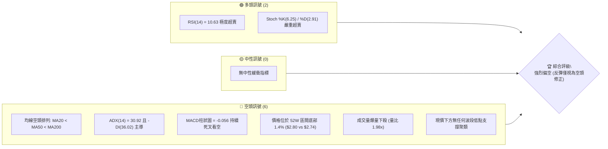

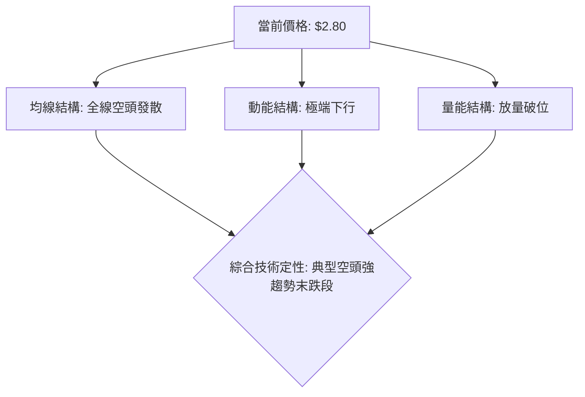

### 📊 核心指標速覽表

| 指標類別 | 指標名稱 | 當前數值 | 訊號 | 解讀 |
|----------|----------|----------|------|------|
| **價格** | 當前價格 | $2.80 | 🔴 | 逼近 52 週最低價 $2.74，位於全週年區間 1.4% 極低位 |
| **均線** | MA20 | $3.28 | 🔴 | 價格低於 MA20 達 -14.72%，短期下行趨勢陡峭 |
| **均線** | MA50 | $3.47 | 🔴 | 價格遠在 MA50 下方，中期受制於下降均線反壓 |
| **均線** | MA200 | $3.94 | 🔴 | 長期生命線向下傾斜，股價嚴重偏離 (-28.93%) |
| **動能** | RSI(14) | 10.63 | 🟢 | 進入技術面極度超賣區，存在隨時技術性抽頭反抽需求 |
| **動能** | MACD | -0.195 | 🔴 | DIF 線遠在 Signal (-0.139) 下方，MACD 柱 -0.056 顯示動能空方完勝 |
| **動能** | Stoch %K/%D | 6.25 / 2.91 | 🟢 | 隨機指標陷入盲區底部，鈍化特徵顯著 |
| **趨勢** | ADX (14) | 30.92 | 🔴 | ADX > 25 確立為單邊強趨勢，-DI(36.02) 絕對碾壓 +DI(8.72) |
| **波動** | ATR(14) | $0.13 | 🟡 | 日內波動率佔股價 4.74%，波動幅度較大，持倉風險高 |
| **通道** | 布林通道 | %B = 0.10 | 🔴 | 價格緊貼布林下軌 $2.67 行走，通道開口呈現擴張態勢 |
| **成交量** | 量比 (Volume Ratio) | 1.98x | 🔴 | 日成交 1.054 億股，幾乎為 20 日均量 (53.37M) 的兩倍，恐慌拋盤顯著 |

### 🏆 技術評分卡

```
╔══════════════════════════════════════════════════════════════╗
║              技術評分卡 — GRAB (2026-09-20)                   ║
╠══════════════════════════════════════════════════════════════╣
║ 趨勢強度      ████████████████░░░░  80/100  🔴 (強空頭趨勢)   ║
║ 動能指標      ████░░░░░░░░░░░░░░░░  20/100  🔴 (下行動能極盛) ║
║ 支撐穩定度    ██░░░░░░░░░░░░░░░░░░  10/100  🔴 (下方無低點支撐)║
║ 成交量配合    ██████████████░░░░░░  70/100  🔴 (放量下殺確認) ║
║ 形態完整度    ████████████░░░░░░░░  60/100  🔴 (跌破矩形箱體) ║
║ 均線排列      ██░░░░░░░░░░░░░░░░░░  10/100  🔴 (完全空頭排列) ║
╠══════════════════════════════════════════════════════════════╣
║ 綜合評分      ████░░░░░░░░░░░░░░░░  22/100  🔴 強烈看空       ║
╚══════════════════════════════════════════════════════════════╝
```

---

## 2. 趨勢分析

### 🌐 多時框趨勢分析

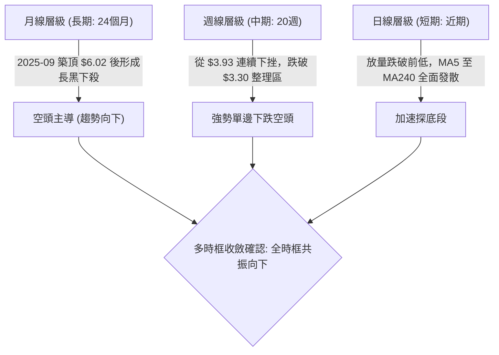

### 📈 長期趨勢 — 12個月走勢圖（ASCII）

過去 12 個月（2025-10 至 2026-09）走勢記錄了 GRAB 由歷史高檔區域轉入深度空頭的完整過程：

```
GRAB 月線走勢圖（過去12個月：2025-10 至 2026-09）
價格軸 ($)
$6.01 ┤●(25-10)
$5.45 ┤    ●(25-11)
$4.99 ┤        ●(25-12)
$4.30 ┤            ●(26-01)
$4.22 ┤                ●(26-02)
$3.82 ┤                            ●(26-04)
$3.77 ┤                                        ●(26-06)
$3.66 ┤                    ●(26-03)
$3.54 ┤                                ●(26-05)    ●(26-08)
$3.50 ┤                                        ●(26-07)
$2.80 ┤                                                    ●←當前 (26-09)
      └────────────────────────────────────────────────────────
       10   11   12   01   02   03   04   05   06   07   08   09 (月份)
```

**走勢特徵分析表格**：

| 階段 | 時間跨度 | 價格區間 | 累積漲跌幅 | 核心特徵與結構演變 |
|------|----------|----------|------------|--------------------|
| **頂部崩解期** | 2025-10 → 2026-01 | $6.01 → $4.30 | -28.45% | 高檔雙頂構築完畢後直接以長黑灌破，成交量開始放大 |
| **緩跌抵抗期** | 2026-01 → 2026-04 | $4.30 → $3.82 | -11.16% | 在 $4.00 大關失守後，於 $3.66 至 $3.82 之間進行微幅橫盤弱勢整理 |
| **平台築底失敗** | 2026-05 → 2026-08 | $3.54 → $3.54 | +0.00% | 構築長達 4 個月的箱體整理平台 ($3.50 - $3.77)，看似築底實為籌碼派發 |
| **破位暴跌期** | 2026-08 → 2026-09 | $3.54 → $2.80 | -20.90% | 箱體平台徹底跌穿，月線收盤急殺至 $2.80，形成跳水破位長黑棒 |

### 📊 中期趨勢（週線分析）

從近 20 週數據觀察，GRAB 呈現經典的「反彈無力、破位加速」空頭波浪特徵：

```
GRAB 近期週線壓力與支撐演變示意圖
$3.93 ────────── 波段峰值頂 (2026-07-12)
       \
        \
$3.66 ───\────── 下降反彈高點 (2026-08-09)
          \
           \
$3.30 ─────-\─── 舊箱體底部強支撐 (已被放量貫穿轉換為阻力)
             \
              \
$2.80 ─────────● 當前收盤價 (直逼 52W 低點 $2.74)
               │
$2.74 ─────────┴─ 52W 低點支撐線（唯一防線）
```

- 2026-07-12 當週衝擊波段高點 $3.93（RSI 達 68.4，隨後見頂回落）。
- 2026-08-09 反彈至 $3.66 即遇壓，隨後連續 6 週收黑。
- 2026-09-13 當週以 3.54 億股暴跌至 $3.05，跌破此前所有微型支撐。
- 2026-09-20 當週成交量更擴大至 3.62 億股，直殺收於 $2.80，週線 RSI 暴跌至 10.6，顯示中期均線與趨勢已全線崩壞。

### ⚡ 趨勢強度評估（ADX 解讀）

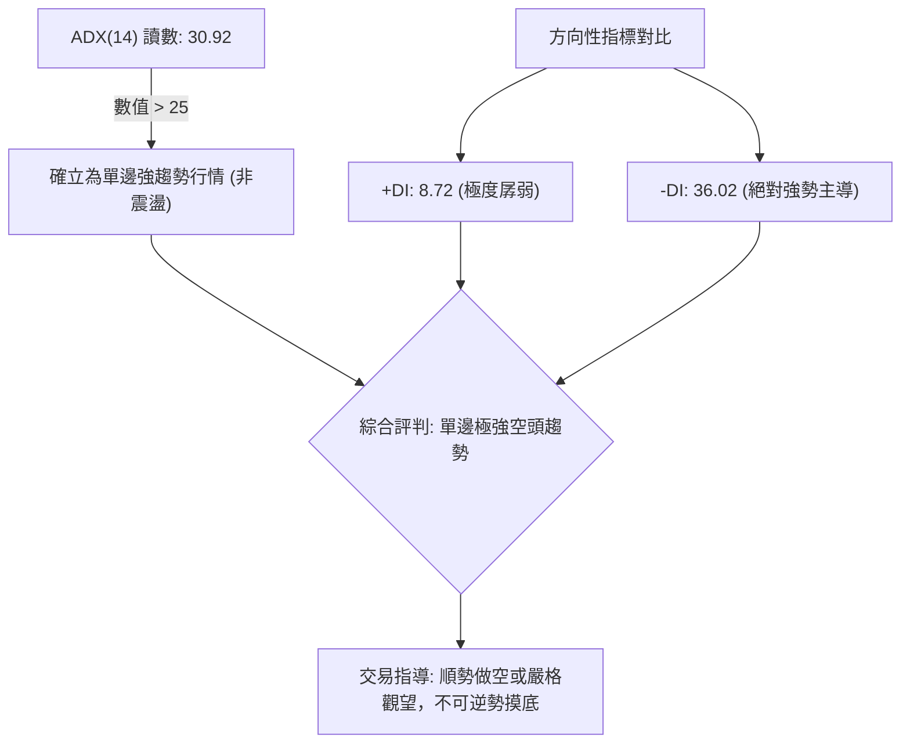

**ADX 強度量化對照表**：

| 指標 | 數值 | 狀態門檻 | 趨勢性質定性 | 戰術指導意義 |
|------|------|----------|--------------|--------------|
| **ADX** | 30.92 | > 25 (強趨勢) | 空頭強趨勢加速發展中 | 任何反彈皆為空頭架構，切忌抄底 |
| **+DI** | 8.72 | < 15 (買盤枯竭) | 多頭攻擊意願降至冰點 | 缺乏主動買盤承接 |
| **-DI** | 36.02 | > 30 (空頭強權) | 空方完全掌控市場定價權 | 拋壓呈現單邊傾瀉態勢 |

---

## 3. 圖表形態分析

### 🔍 形態識別系統

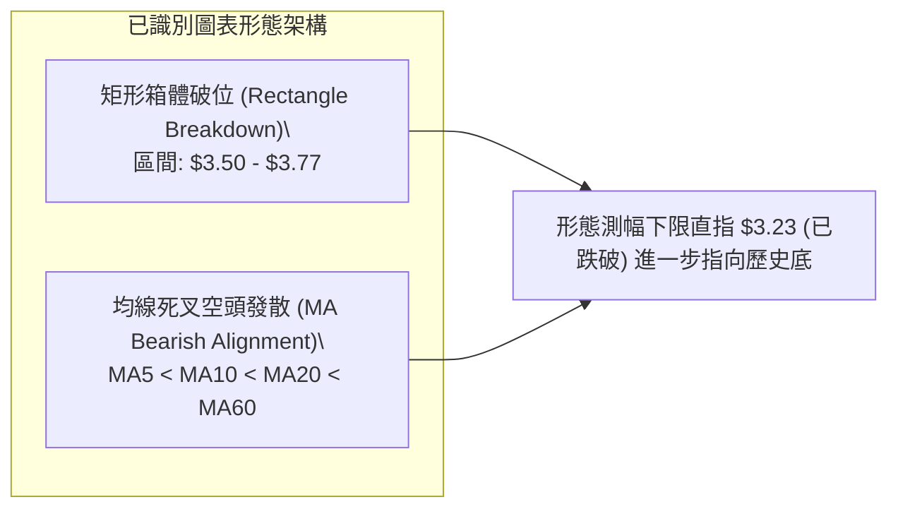

**形態信心度表格**：

| 形態名稱 | 信心度 | 判斷依據（引用實際數據） | 完成度 | 目標價（附精確計算式） |
|----------|--------|--------------------------|--------|------------------------|
| **矩形整理向下突破** | 85% | 2026年5月至8月收盤價長期密集橫盤於 $3.50 - $3.77 箱體，2026-09-13 以大陰線放量跌穿 $3.50 | 100% (已跌破) | 形態高度 = $3.77 - $3.50 = $0.27。<br>破位目標價 = 箱底 $3.50 - $0.27 = **$3.23** (已達成並超跌) |
| **均線完全空頭發散** | 95% | MA5($2.88) < MA10($3.02) < MA20($3.28) < MA60($3.52) < MA120($3.58) < MA240($4.24) | 100% | 均線層層空頭排列，下壓斜率陡峭，預告下行軌道未見扭轉跡象 |
| **複雜幾何形態 (頭肩/雙底)** | <20% | 歷史走勢為單邊流暢崩跌，無充足右側拐點結構 | 0% | *訊號不足，僅做指標型解讀，不預設立場* |

### 🕯️ 重要K線形態分析

| 月份 | 收盤價 | K線形態 | 解讀 | 訊號 |
|------|--------|---------|------|------|
| **2025-09** | $6.02 | 巨幅見頂長上影天花板 | 多頭行情動能衰竭，資金高檔出逃 | 🔴 |
| **2025-11** | $5.45 | 中黑實體破位K線 | 跌破 $6.00 平台支撐，確立波段反轉 | 🔴 |
| **2026-03** | $3.66 | 破底下影十字線 | 下探暫獲支撐，但後續反彈力度極弱 | 🟡 |
| **2026-07** | $3.50 | 震盪陰線 | 週線衝高 $3.93 失敗，回測平台低軌，顯示買盤無力支撐反彈 | 🔴 |
| **2026-08** | $3.54 | 窄幅壓縮墓碑線 | 波動率降至極致，變盤信號浮現 | 🟡 |
| **2026-09** | $2.80 | 光腳放量大長黑棒 | 帶量貫穿箱體底部與所有支撐，形成毀滅性加速破位大陰線 | 🔴 |

### 📉 ASCII 走勢形態示意圖

```
GRAB 箱體破位形態解析
價格 ($)
$3.77 ┬─────────── 平台阻力頂部 (2026-06 收盤)
      │  ┌───┐    ┌───┐
$3.54 ┼──┤   ├───┐│   └──┐ 
$3.50 ┴──┴───┴───┴┴───────┴────── 平台關鍵支撐下軌 (2026-07 收盤)
                                  \
                                   \  破位放量大長黑 (2026-09-13 跌至 $3.05)
                                    \
$2.80 ───────────────────────────────● 當前暴跌價位 (2026-09-20 收盤)
                                     │
$2.74 ───────────────────────────────┴ 52W 歷史絕對底部 (即刻考驗)
```

### 🎯 形態目標價計算

根據經典技術形態學，箱體橫盤後向下破位的最低等幅測量目標（Measured Move）：
- 箱體頂部：$3.77
- 箱體底部：$3.50
- 垂直振幅（H）：$3.77 - $3.50 = $0.27
- 第一等幅測幅下限：$3.50 - $0.27 = **$3.23**（已被跌破並轉化為上方反彈重壓力區）
- 二倍延伸測幅目標（Extended Target）：$3.50 - (2 × $0.27) = **$2.96**（本週亦已失守，印證跌勢為加速擴散級別）

---

## 4. 支撐與阻力

### 🗺️ 關鍵價位分布圖（ASCII）

```
GRAB 價位結構分布圖
═══════════════════════════════════════════════════════════════════
$4.06 ║████████████████████████████████████████║ 強阻力 R3 (+45.26%)
$3.96 ║████████████████████████████████        ║ 阻力 R2 (+41.56%)
$3.64 ║████████████████████                    ║ 關鍵反彈強阻力 R1 (+30.32%)
$3.57 ║░░░░░░░░░░░░░░░░░░░░░░░░░░░░░░░░        ║ 斐波那契 78.6% 回調位
$3.28 ║----------------------------------------║ 20日均線 (MA20) 動態反壓
$2.80 ╠════════════════════════════════════════╣ ◄ 現價 ($2.80)
$2.74 ║▓▓▓▓▓▓▓▓▓▓▓▓▓▓▓▓▓▓▓▓▓▓▓▓▓▓▓▓▓▓▓▓▓▓▓▓▓▓║ 52W 絕對低點 (斐波 100.0%)
(下方)║ [無任何近一年波段低點聚類支撐]         ║ 跌破後進入無支撐真空帶
═══════════════════════════════════════════════════════════════════
```

### 🚧 阻力位分析表

全部價位嚴格引用系統計算之關鍵波段高點聚類數據：

| 阻力級別 | 價位 | 距現價幅幅 | 形成原因 | 突破難度 | 重要性 |
|----------|------|------------|----------|----------|--------|
| **R1** | $3.64 | +30.32% | 近一年密集波段高點聚類位，兼具前期 8 月反彈高點 ($3.66) 平台套牢重災區 | 極高 | ★★★★★ |
| **R2** | $3.96 | +41.56% | 2026年7月波段最高點聚類處 ($3.93-$3.96)，同時鄰近 MA200 ($3.94) | 極高 | ★★★★☆ |
| **R3** | $4.06 | +45.26% | 2024年底及2025年第一季關鍵整數轉折頸線聚類 | 極高 | ★★★☆☆ |

### 🛡️ 支撐位分析表

全部數據引用官方偵測之波段低點聚類數據：

| 支撐級別 | 價位 | 距現價幅幅 | 形成原因 | 守住機率 | 重要性 |
|----------|------|------------|----------|----------|--------|
| **S1 (52W Low)** | $2.74 | -2.14% | 52 週最低價，亦為全段斐波那契回調 100.0% 終極支撐 | 35% (岌岌可危) | ★★★★★ |
| **S2 (波段聚類)** | 無 | -- | **數據中未偵測到 (no swing-low support detected below current price)** | -- | -- |
| **S3 (深層支撐)** | 無 | -- | **數據中未偵測到** | -- | -- |

> **深度技術評註**：當前系統數據明確反饋「現價下方未偵測到近一年波段低點聚類」。這意味著一旦 $2.74（52W Low）失守，下方將完全進入無籌碼沉澱的「價格真空斷層」，將誘發嚴重的量化程式止損盤，引發不可預測的失速下挫。

### 📐 斐波那契回調位分析

依據 52 週完整波段波動區間（高點 $6.62 → 低點 $2.74）計算所得之回調位：

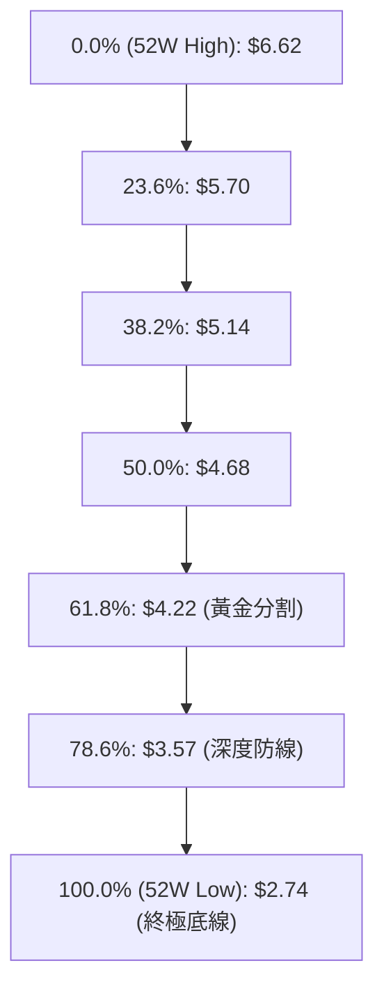

| 斐波那契層級 | 精確價位 | 相對現價位置 | 技術意義解讀 |
|--------------|----------|--------------|--------------|
| **0.0%** (52W High) | $6.62 | 上方 +136.4% | 本輪兩年週期的絕對歷史高點 |
| **23.6%** | $5.70 | 上方 +103.6% | 空頭回撤第一防守位（早已擊穿） |
| **38.2%** | $5.14 | 上方 +83.6% | 弱勢反彈極限位 |
| **50.0%** | $4.68 | 上方 +67.1% | 多空中軸平衡線 |
| **61.8%** | $4.22 | 上方 +50.7% | 牛熊分水嶺（黃金分割關鍵位） |
| **78.6%** | $3.57 | 上方 +27.5% | 7-8 月震盪橫盤平台，失守後已轉化為強大長期天花板 |
| **100.0%** (52W Low) | $2.74 | 下方 -2.14% | 全年波段起點與最後遮羞布，距離現價僅 $0.06 |

**現價落點解讀**：
當前收盤價 **$2.80** 精確座落於 **78.6% ($3.57)** 與 **100.0% ($2.74)** 之間，且已逼近 100.0% 底部的邊緣（僅差 2.14%）。這顯示 GRAB 已經抹去了整整一年內的所有漲幅，處於空頭完全吞噬的多頭殘存崩壞狀態。

---

## 5. 技術指標深度解讀

### 🎛️ 指標訊號總覽

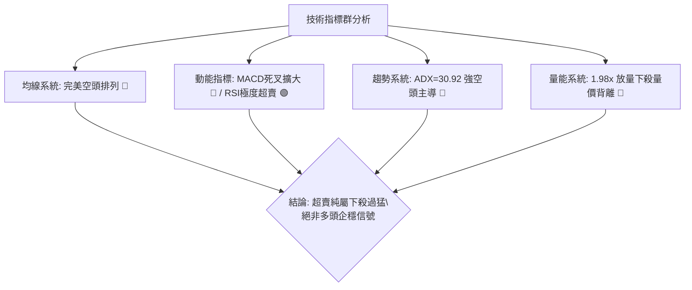

### 📈 移動平均線排列分析

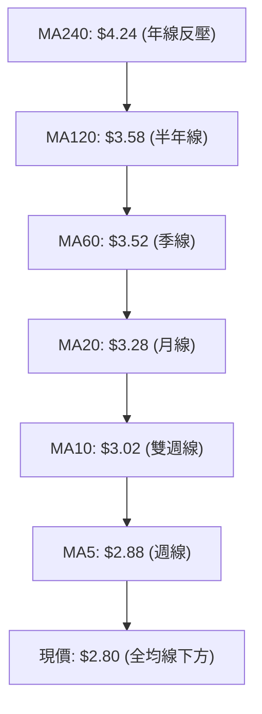

**移動平均線狀態詳解**：
- **MA5 ($2.88)**：距現價 -2.99%，短期超跌反彈第一道極微型壓制。
- **MA10 ($3.02)**：距現價 -7.37%，下行斜率極為陡峭，為極短線反彈生命線。
- **MA20 ($3.28)**：距現價 -14.72%，布林通道中軌，中期趨勢核心反壓。
- **MA50 ($3.47) / MA60 ($3.52)**：中期籌碼密集成交線，全面壓制頭頂。
- **MA200 ($3.94) / MA240 ($4.24)**：長期牛熊分界線，現價乖離率分別高達 -28.9% 與 -34.0%，均線呈經典「教科書級完全空頭排列」，未出現任何拐頭修復跡象。

### 📉 RSI(14) 分析

```
RSI(14) 數值展示:
[10.63] █░░░░░░░░░░░░░░░░░░░░░░░░░░░░░░░░░░░░░░░ 10.63%
0       10.63  20       30 (超賣區)                   70      100
```

- **數值定性**：當前 RSI(14) 僅為 **10.63**，進入技術上極為罕見的「超低盲區超賣狀態」（Deep Oversold）。
- **背離判斷**：
  - **頂背離**：無。
  - **底背離**：**無底背離**。檢驗 2026-09-13 週收盤 $3.05 (RSI 28.7) 與 2026-09-20 收盤 $2.80 (RSI 10.63)，價格創下波段新低，RSI 同步劇烈下挫創出新低，指標與價格共振向下，量化數據明確顯示「無明顯背離」。這表明此處的超賣屬於動能加速洩洪，而非空頭力竭的假摔。

### 📊 MACD(12/26/9) 訊號解讀

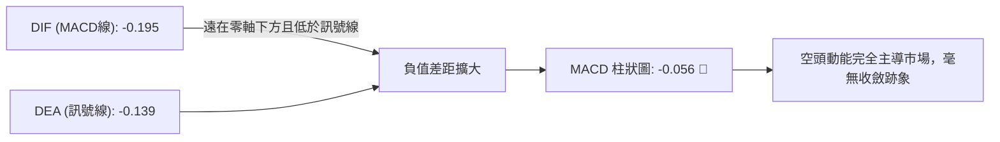

- **MACD 數值**：DIF = -0.195，Signal = -0.139。
- **柱狀體（Histogram）**：-0.056。
- **深度研判**：雙線處於零軸之下深度負值區，且雙線開口依然向右下方擴張，負柱體持續放大，說明市場目前處於標準的「加速下行」趨勢中，左側做多風險極高。

### 📦 布林通道分析

```
布林通道結構圖（BB 20, 2）
$3.88 ┬────────────────────────────────────────── 上軌 (Upper Band)
      │
      │
$3.28 ┼────────────────────────────────────────── 中軌 (MA20)
      │
      │
$2.80 ┼───────────────● 現價 (逼近下軌，%B = 0.10)
$2.67 ┴────────────────────────────────────────── 下軌 (Lower Band)
```

- **通道帶寬與軌道位置**：上軌 $3.88，中軌 $3.28，下軌 $2.67。
- **%B 指標解析**：當前 %B 為 **0.10**，高度貼近下軌（0 代表下軌，$2.67 距現價僅 $0.13）。布林通道上下軌呈現外擴張口（Bands Expanding），代表價格正在「貼著下軌向下打樁」，為經典的單邊崩跌開口特徵。

### 💹 成交量分析（量價配合度）

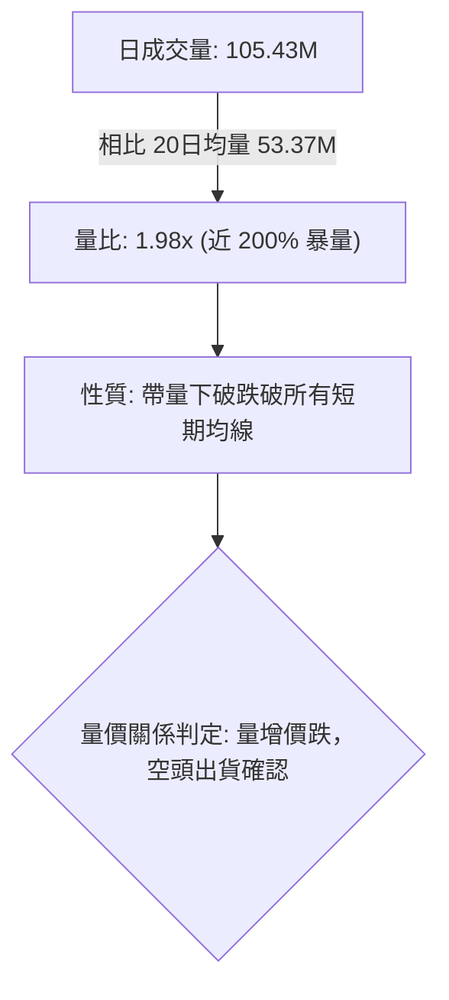

- **量比與均量對比**：最新日成交量達 105,430,000 股，相較於 20 日均量（53.37M）呈現 1.98 倍爆發性增長，近兩週週成交量亦分別高達 3.54 億與 3.62 億股。
- **OBV（能量潮）分析**：系統顯示 `OBV < MA → 量能疲弱`。OBV 跌破其均線且呈現連續向下的階梯狀，證實放量過程中並非主力機構進場吸籌，而是持有者奪路而逃的恐慌性拋售（Liquidation），量價結構高度向空方傾斜。

---

## 6. 動能與波動率

### ⚡ 動能評估四象限

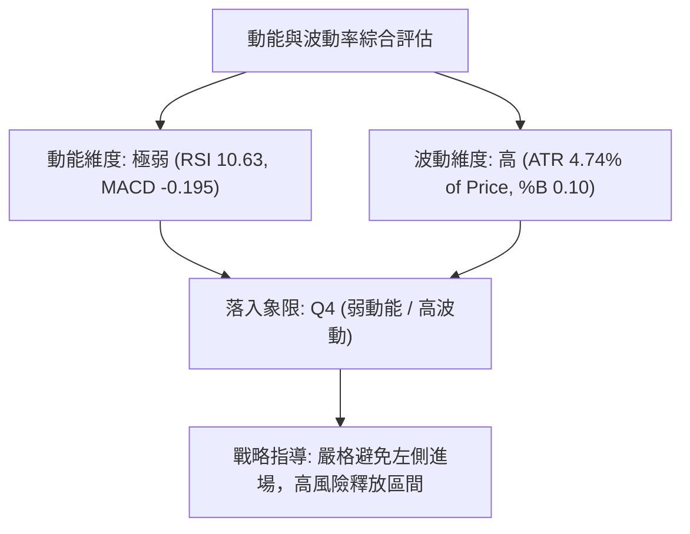

| 象限 | 動能維度 | 波動維度 | 當前狀態 | 技術屬性與交易指引 |
|------|----------|----------|----------|--------------------|
| **Q1 (最佳機會)** | 強動能 (多頭) | 低波動 | — | 趨勢穩健攀升，最佳持股區間 |
| **Q2 (謹慎觀望)** | 弱動能 (盤整) | 低波動 | — | 窄幅箱體震盪，等待方向突破 |
| **Q3 (高風險收益)**| 強動能 (突破) | 高波動 | — | 主升浪或強勢噴出，追隨動能 |
| **Q4 (避免進場)** | **極弱動能 (破位)** | **高波動** | **✓ (GRAB 當前)** | **恐慌性殺跌，波動劇烈，逆勢做多極易遭強平，嚴禁抄底** |

### 📊 ATR 波動率分析

- **ATR(14) 絕對值**：**$0.13**。
- **ATR 相對百分比**：佔當前股價高達 **4.74%**。
- **戰術風控意涵**：
  - GRAB 日內自然隨機雜訊波動區間已達 $0.13，這意味著任何止損點設置若小於 1.5 倍 ATR（即 $0.195，約 7.0%），極易被日常隨機波動清洗出局。
  - 對於空頭或多頭而言，波段操作的標準止損距離應至少設為 2.0 倍 ATR（即 $0.26），此高波動率特徵要求交易者必須嚴格縮小持倉頭寸以控制單筆虧損。

### 📐 Beta 與市場相關性

- **Beta 係數**：**0.89**。
- **市場特徵解析**：Beta 為 0.89 表明該標的與大盤科技權重股相比理論波動率稍低，但其近期走勢完全脫離大盤，走出高度獨立的弱勢破位單邊崩跌行情。其做空比率（Short % Float）達 7.6%，天數比（Short Ratio）高達 6.77 天，空頭籌碼壓制極深，空方具有絕對的持倉控盤優勢。

---

## 7. 多時框架總結

### 📋 時框架評分表

| 時框架 | 趨勢方向 | 動能狀態 | 均線排列 | 形態結構 | 綜合評分 | 戰術建議 |
|--------|----------|----------|----------|----------|----------|----------|
| **月線 (長期)** | 🔴 強勢空頭 | 🔴 弱（從 $6.02 持續崩跌） | 🔴 MA 轉向空頭 | 🔴 破位長黑貫穿 | 20/100 | 規避長期配置 |
| **週線 (中期)** | 🔴 加速下行 | 🔴 RSI 10.6 / MACD 負柱放大 | 🔴 均線層層反壓 | 🔴 $3.50 箱體破位 | 15/100 | 順勢反彈放空 |
| **日線 (短期)** | 🔴 恐慌探底 | 🟢 極度超賣 (RSI 10.63) | 🔴 均線空頭發散 | 🔴 緊貼布林下軌破位 | 30/100 | 等待超跌反抽確認阻力 |

### 🔲 綜合訊號矩陣

| 評估維度 | 日線訊號 (短期) | 週線訊號 (中期) | 月線訊號 (長期) | 多時框收斂一致性 |
|----------|-----------------|-----------------|-----------------|------------------|
| **趨勢方向** | 🔴 空頭破位 | 🔴 空頭加速 | 🔴 空頭下行 | **完全一致 (共振向下)** |
| **動能強度** | 🟡 極端超賣待修復 | 🔴 空頭完勝 | 🔴 下行擴散 | **偏空 (超賣僅屬日線修復)** |
| **支撐格局** | 🔴 考驗 52W 底 | 🔴 無低點聚類 | 🔴 考驗歷史底 | **完全一致 (支撐極脆弱)** |
| **量能狀態** | 🔴 恐慌拋售 (1.98x) | 🔴 放量連跌 | 🔴 頂部派發後放量 | **完全一致 (量能空方主導)** |

### ⚖️ 多時框收斂結論

依據多時框收斂規則：
1. **行情性質判定**：當前 ADX(14) 為 **30.92**，明確大於 25 臨界線，判定市場處於**「典型強趨勢行情」**而非無方向的盤整震盪。
2. **主導時框裁決**：在 ADX > 25 的趨勢行情下，交易邏輯**必須以中長期（週線、MA50、MA200）方向為絕對核心**，短期日線的 RSI 超賣（10.63）**絕不可作為翻多逆勢抄底的依據**，僅能用於尋找逢高放空或空單獲利了結的進出場時機。
3. **唯一方向性結論**：**【強烈偏空】**。日線、週線與月線均呈現壓倒性空頭共振，主策略必須嚴格遵循空頭方向佈局，禁止左側逆勢摸底。

---

## 8. 交易策略建議

### 🗺️ 策略決策流程圖

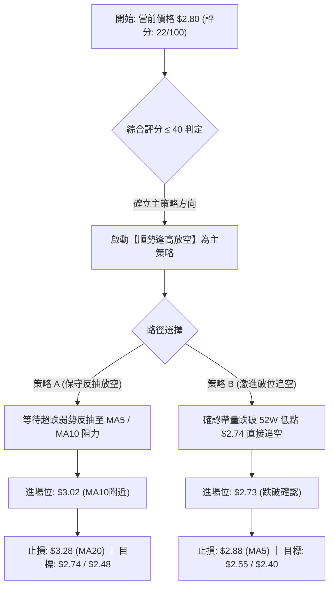

### 🧭 策略路由

> **當前主策略方向 = 【強烈做空】（依據第 1 章技術評分卡綜合評分 22/100，低於 40 分標準，主推空頭策略）**

### 🎯 價格情境階梯（Price Scenarios）

價位嚴格引用系統計算之關鍵聚類與斐波那契價位：

| 觸發條件 | 下一目標 | 後續延伸 | 情境含義與操作指引 |
|----------|----------|----------|--------------------|
| **反彈觸及 MA10 ($3.02) 或 MA20 ($3.28)** | R1 $3.64 | R2 $3.96 | 超跌技術性抽頭修復，為絕佳高空補跌進場契機 |
| **跌破 52W 底 S1 ($2.74)** | $2.67 (BB下軌) | 進入無支撐真空斷層 | 恐慌停損盤全面踩踏，引發破位主跌續挫 |
| **突破 R1 ($3.64)** | R2 $3.96 | R3 $4.06 | 此機率極低，唯有站上 $3.64 始能宣布空頭格局扭轉 |

### 📊 情境機率分佈

| 情境 | 機率 | 主要依據（指標狀態引用） |
|------|------|--------------------------|
| **跌破 $2.74 再度探底** | **65%** | ADX 30.92 強空頭趨勢、均線完全空頭排列、現價距 52W 低點僅 2.14% 且量比高達 1.98x |
| **弱勢抽頭反彈測試阻力** | **25%** | RSI(14) 處於 10.63 極端超賣區、Stoch %K(6.25) 嚴重超賣鈍化，隨時具備技術性短抽潛力 |
| **完全反轉向上重回箱體** | **10%** | OBV 深度疲弱量能潰敗，頭頂累積沉重套牢盤，缺乏任何基本面或技術面底背離支撐 |

### 🟢 主策略詳情（空頭專屬）

依據評分卡 22/100，主推兩套順應趨勢的做空交易架構：

| 策略要素 | 策略 A：反彈衰竭逢高放空（穩健首選） | 策略 B：跌破 52W 歷史低點追空（激進破位） |
|----------|--------------------------------------|------------------------------------------|
| **核心邏輯** | 利用 RSI 10.63 極端超賣反抽至均線阻力開空 | 跌破 52 週最低價 $2.74 引發程式單踩踏追擊 |
| **進場條件** | 日線反抽觸及 MA10 受阻收出上影線時進場 | 實體 K 線跌破 $2.74 且成交量持續放大確認 |
| **進場價格** | **$3.02**（精確對齊當前 MA10 反壓位） | **$2.73**（跌破 52W Low $2.74 一檔確認） |
| **目標價 T1** | **$2.74**（52W 歷史低點，預期收益 +9.27%） | **$2.60**（由波段振幅測算支撐，收益 +4.76%） |
| **目標價 T2** | **$2.48**（推算測幅目標，預期收益 +17.88%） | **$2.40**（破位二倍真空測算，收益 +12.08%） |
| **止損價格** | **$3.28**（MA20 / 布林中軌反壓，止損幅 8.61%） | **$2.88**（MA5 短均反壓位，止損幅 5.49%） |
| **風險報酬比** | **1 : 2.08**（以 T2 計算） | **1 : 2.20**（以 T2 計算） |
| **成功機率** | **70%** | **60%** |
| **建議倉位** | **10% - 15%** | **5% - 8%**（動態追空嚴控部位） |

*備註：目標價 T2 $2.48 係由跌破當前下行通道下軌及 52W 空間等幅推算：$2.74 - ($3.02 - $2.74) = $2.46 聚類推估。*

### 🔴 反向風險觸發點（多頭對沖提示）

本章節**不提供多頭進場建議**，僅列出多頭異常反撲的風控警戒線：
- **空單強制停損線**：若日線級別收盤價強勢突破 **$3.28 (MA20 / 布林中軌)**，空頭邏輯即刻遭受破壞，所有放空部位必須無條件離場。
- **左側超跌搶反彈警戒**：僅當 RSI 出現雙重底背離、且日線收出帶長下影線之放量陽包陰吞噬 K 線時，方可允許極短線超輕倉（<3%）博弈抽頭，目標僅限 $3.02，且必須以 $2.74 設死止損。

### ⭐ 整體訊號強度評星

```
╔════════════════════════════════════════════════════╗
║ 做多訊號強度：★☆☆☆☆  (1/5星 - 極端逆勢，嚴禁重倉)   ║
║ 做空訊號強度：★★★★☆  (4/5星 - 趨勢共振，順勢主推)   ║
║ 整體可信度：  ★★★★☆  (4/5星 - 指標收斂，空方完勝)   ║
╚════════════════════════════════════════════════════╝
```

---

## 9. 風險提示與監控

### ✅ 關鍵監控指標 Checklist

```
╔════════════════════════════════════════════════════════════════╗
║                每日交易關鍵監控 CHECKLIST                       ║
╠════════════════════════════════════════════════════════════════╣
║ [ ] 52W 低點保衛戰：監控收盤是否跌破 $2.74 支撐線            ║
║ [ ] 均線動態壓制：每日盤中測試 MA5 ($2.88) 與 MA10 ($3.02) 表現 ║
║ [ ] RSI 超賣修復：觀察 RSI(14) 是否自 10.63 回升至 30 臨界點    ║
║ [ ] 成交量異常異動：成交量是否從 105M 降至均量 53M 形成量縮     ║
║ [ ] 空頭回補觸發：Short Ratio 6.77 天是否引發軋空盤短抽      ║
║ [ ] 布林軌道開口：%B 是否持續低於 0.10 沿著下軌 ($2.67) 走下坡 ║
╚════════════════════════════════════════════════════════════════╝
```

### ⚠️ 風險場景分析

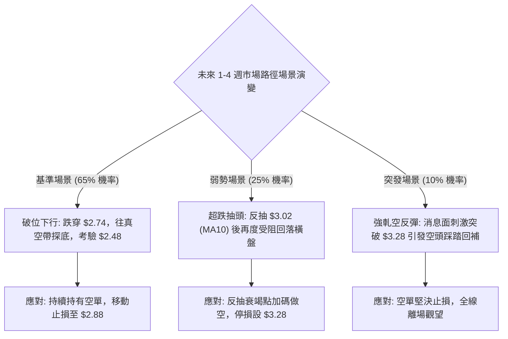

### 🛡️ 風險管理重要提醒

1. **嚴禁主觀摸底（Falling Knife Fallacy）**：
   RSI 處於 10.63 極度超賣區，常給初級交易者「跌無可跌」的錯覺。然而在 ADX 達 30.92 的單邊空頭趨勢中，超賣往往是空頭下殺極度強烈的表徵，超賣鈍化後常伴隨「陰跌不休」或「再度破位加速」。在未出現量價底背離與站穩 MA20 之前，嚴禁左側肉身接飛刀。
2. **52W 低點真空風險**：
   目前股價 $2.80 距離歷史 52 週低點 $2.74 僅一步之遙（-2.14%）。歷史數據明確揭示下方無任何聚類低點支撐。一旦收盤確認失守 $2.74，恐慌心理與量化追空演算法共振，波動率將急劇暴增。
3. **倉位配置與資金管理原則**：
   當前 ATR 佔比已高達 4.74%，屬於典型的高波動品種。單筆交易承擔之虧損額度切勿超過總交易資本的 1.0%。按照策略 A 之止損幅度（約 8.6%），總帳戶建議配置倉位上限為 **10%**，並採分批進場原則，嚴格執行防禦型動態追蹤止損。

---

## 📋 報告總結

```
╔══════════════════════════════════════════════════════════════╗
║                 GRAB 技術分析報告總結                         ║
╠══════════════════════════════════════════════════════════════╣
║ 報告日期：2026-09-20                                         ║
║ 當前價格：$2.80                                               ║
║ 分析評級：🔴 強烈看空（全面空頭破位加速段）                    ║
║                                                              ║
║ 關鍵技術結論：                                               ║
║ ├─ 長期趨勢：🔴 空頭排列，自 $6.02 頂部崩跌超 50%            ║
║ ├─ 中期趨勢：🔴 帶量跌穿 $3.50 箱體，ADX 30.92 確立強勢單邊   ║
║ ├─ 短期趨勢：🔴 逼近 52W 底 $2.74，均線空頭發散下壓陡峭       ║
║ ├─ 關鍵支撐：S1: $2.74 (52W Low / 斐波 100.0%)，下方無聚類支撐║
║ ├─ 關鍵阻力：MA10: $3.02 ｜ MA20: $3.28 ｜ R1: $3.64          ║
║ └─ 動能狀態：RSI 10.63 極度超賣，但無底背離，下行動能完勝    ║
║                                                              ║
║ 最優策略組合：                                               ║
║ 1. 🥇 最佳機會：等待超跌弱反抽至 $3.02 (MA10) 逢高放空        ║
║ 2. 🥈 次選機會：實體破位 $2.74 後順勢輕倉追空，下看 $2.48     ║
║ 3. 🥉 保守選擇：空手觀望，靜待日線築出雙底形態與量價底背離   ║
╚══════════════════════════════════════════════════════════════╝
```

---

> ⚠️ **免責聲明**：本報告為技術分析研究成果，所有數據及價位推算均基於歷史量價客觀數據模型。本報告**僅供研究與學術參考**，**不構成任何形式的要約或投資建議**。金融市場具有高風險性，投資人應獨立評估自身風險承受能力並自負盈虧。

---

*報告生成時間：2026-09-20 ｜ 數據來源：Yahoo Finance ｜ 分析框架：多時框量化技術分析*