# GRAB 技術分析報告

> **報告日期**：2026-09-21 ｜ **語言**：繁體中文 ｜ **數據來源**：Yahoo Finance ｜ **當前價格**：$2.80

---

## 目錄

| 章節 | 內容 |
|------|------|
| [1. 技術面概覽](#1-技術面概覽) | 訊號儀表板、核心指標、評分卡 |
| [2. 趨勢分析](#2-趨勢分析) | 多時框趨勢、長中短期走勢 |
| [3. 圖表形態分析](#3-圖表形態分析) | 形態識別、K線組合、目標價 |
| [4. 支撐與阻力](#4-支撐與阻力) | 關鍵價位、斐波那契回調 |
| [5. 技術指標深度解讀](#5-技術指標深度解讀) | MA/RSI/MACD/布林/成交量 |
| [6. 動能與波動率](#6-動能與波動率) | 動能評估、ATR、Beta |
| [7. 多時框架總結](#7-多時框架總結) | 時框架評分矩陣 |
| [8. 交易策略建議](#8-交易策略建議) | 多空策略、風險報酬比 |
| [9. 風險提示與監控](#9-風險提示與監控) | 監控指標、風險場景 |

---

## 1. 技術面概覽

### 🎯 技術訊號儀表板

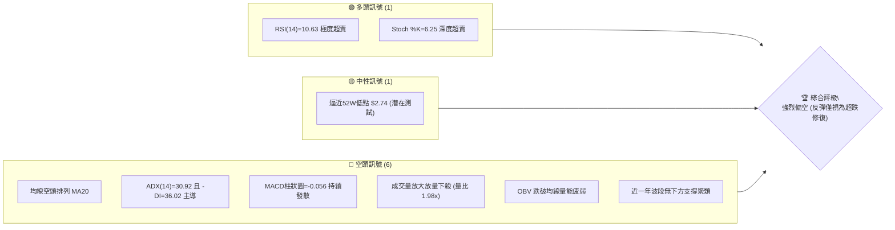

### 📊 核心指標速覽表

| 指標類別 | 指標名稱 | 當前數值 | 訊號 | 解讀 |
|----------|----------|----------|------|------|
| **價格** | 當前價格 | $2.80 | 🔴 | 位於52週區間僅 1.4% 位置，極度貼近破底邊緣 |
| **均線** | MA20 | $3.28 | 🔴 | 股價位於 MA20 下方 -14.72%，短線下行斜率陡峭 |
| **均線** | MA50 | $3.47 | 🔴 | 股價位於 MA50 下方 -19.31%，中期均線反壓沉重 |
| **均線** | MA200 | $3.94 | 🔴 | 股價位於 MA200 下方 -28.93%，長期結構完全走空 |
| **動能** | RSI(14) | 10.63 | 🟢 | 極端超賣區（<30），隨時可能出現技術性抽頭修復 |
| **動能** | MACD | -0.195 | 🔴 | DIF < DEA (-0.139)，柱狀圖為 -0.056，空頭發散中 |
| **動能** | Stoch %K/%D | 6.25 / 2.91 | 🟢 | 隨機指標陷入極端鈍化，提示跌勢已進入恐慌拋售區 |
| **趨勢** | ADX(14) | 30.92 | 🔴 | ADX > 25 強趨勢確立；-DI (36.02) 輾壓 +DI (8.72) |
| **通道** | 布林帶 (%B) | 0.10 | 🔴 | 逼近布林下軌 $2.67，沿通道下軌開口向下「下軌飄移」 |
| **量能** | 量比 (Volume) | 1.98x | 🔴 | 當日量 1.054億股 vs 20日均量 5337萬股，帶量重挫 |
| **波動** | ATR(14) | $0.13 | 🟡 | 佔股價 4.74%，處於擴大階段，單日波動劇烈 |

### 🏆 技術評分卡

```
╔══════════════════════════════════════════════════════════════════╗
║                 技術評分卡 — GRAB (2026-09-21)                   ║
╠══════════════════════════════════════════════════════════════════╣
║ 趨勢強度 (空頭)   ████████████████░░░░  80/100  🔴 強烈看跌     ║
║ 動能指標 (超賣)   ██████░░░░░░░░░░░░░░  30/100  🟢 超跌反彈潛在 ║
║ 支撐穩定度        ██░░░░░░░░░░░░░░░░░░  10/100  🔴 無結構性支撐 ║
║ 成交量配合 (帶量) ██████████████░░░░░░  70/100  🔴 空頭爆量貫穿 ║
║ 形態完整度        ████████████████░░░░  80/100  🔴 頭部破位續跌 ║
║ 均線排列 (空頭)   ██████████████████░░  90/100  🔴 完美空頭排列 ║
╠══════════════════════════════════════════════════════════════════╣
║ 綜合技術評分      ██████░░░░░░░░░░░░░░  28/100  🔴 極度偏空     ║
╚══════════════════════════════════════════════════════════════════╝
```

---

## 2. 趨勢分析

### 🌐 多時框趨勢分析

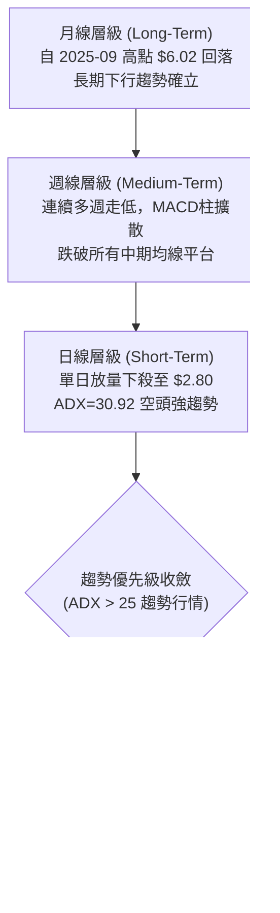

### 📈 長期趨勢 — 12個月走勢圖（Unicode）

```
GRAB 月線收盤走勢圖（2025-10 至 2026-09）
價格 ($)
$6.10 ┤ ● ($6.01)
$5.50 ┤       ● ($5.45)
$5.00 ┤             ● ($4.99)
$4.40 ┤                   ● ($4.30) ● ($4.22)
$3.80 ┤                                     ● ($3.82)     ● ($3.77)
$3.50 ┤                               ● ($3.66)     ● ($3.54)     ● ($3.50) ● ($3.54)
$2.80 ┤                                                                             ● ($2.80)
      └─┬─────┬─────┬─────┬─────┬─────┬─────┬─────┬─────┬─────┬─────┬─────┬─────
       10月  11月  12月  01月  02月  03月  04月  05月  06月  07月  08月  09月 (2026)
       (高點構築)  (主跌段一)    (築底失敗)   (箱型震盪 3.50-3.80)     (破位向下)
```

**走勢特徵分析表格**：

| 階段區間 | 時間跨度 | 價格變動 | 區間漲跌幅 | 走勢特徵與量價結構解讀 |
|----------|----------|----------|------------|------------------------|
| **第一階段：見頂回落** | 2025-10 ～ 2025-12 | $6.01 → $4.99 | -16.97% | 於 $6.00 關卡形成雙頂後跌破頸線，多頭轉向防守。 |
| **第二階段：主跌破位** | 2026-01 ～ 2026-03 | $4.30 → $3.66 | -14.88% | 連續三個月破低，均線系統全面拐頭向下，跌勢凌厲。 |
| **第三階段：平台弱整理** | 2026-04 ～ 2026-08 | $3.82 → $3.54 | -7.33% | 於 $3.50～$3.82 窄幅拉鋸，成交量萎縮，反彈動能衰竭。 |
| **第四階段：破位暴跌** | 2026-08 ～ 2026-09 | $3.54 → $2.80 | -20.90% | 帶量貫穿 $3.50 平台底線，直撲 52 週新低，形成破位主跌。 |

### 📊 中期趨勢（週線分析）

從近20週數據觀察，GRAB 曾於 2026-07-05 與 2026-07-12 試圖向上發起反彈，週收盤價一度達 $3.90 與 $3.93，RSI 亦推升至 77.2 的過熱區。然而多頭無力上攻 $4.00 關卡，隨後迅速回落。自 2026-08-30 的 $3.61 開始，週線連續三週收出大陰線：
- 2026-09-06: 收盤 $3.42 (週成交量 1.66億股)
- 2026-09-13: 收盤 $3.05 (週成交量 3.54億股，顯著爆量)
- 2026-09-20: 收盤 $2.80 (週成交量 3.62億股，持續放量下殺)

週線結構展現典型的「弱勢整理後帶量跌破」，成交量在破位時放大一倍以上，證實機構法人拋盤湧出。

```
中期週線阻力與關鍵價位示意圖：
[R3: $4.06] ══════════════════════════════════ (長期重大頂部反壓)
[R2: $3.96] ────────────────────────────────── (2026年7月反彈高點聚類)
[R1: $3.64] ┄┄┄┄┄┄┄┄┄┄┄┄┄┄┄┄┄┄┄┄┄┄┄┄┄┄┄┄┄┄ (前波箱型整理平台下緣)
[現價: $2.80] ▼ (帶量暴跌探底中)
[52W低點: $2.74] ----------------------------- (最後多頭心理防線)
```

### ⚡ 趨勢強度評估（ADX 解讀）

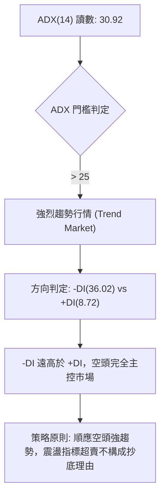

| 指標名稱 | 當前數值 | 臨界標準 | 狀態評估 | 實戰意涵 |
|----------|----------|----------|----------|----------|
| **ADX(14)** | 30.92 | > 25 | 強烈趨勢 | 市場脫離無趨勢整理，下行趨勢力道強勁且持續加速。 |
| **-DI (空方)** | 36.02 | > +DI (8.72) | 空方主導 | 空頭動能佔據絕對優勢，賣盤具有強大連續性。 |
| **+DI (多方)** | 8.72 | < 15 | 多方潰散 | 多方幾無抵抗能力，任何微幅上漲均屬弱勢反抽。 |

---

## 3. 圖表形態分析

### 🔍 形態識別系統

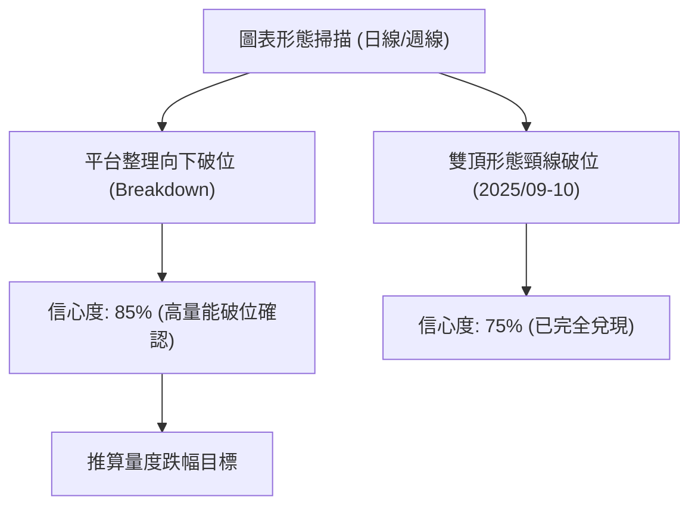

**形態信心度與目標價評估表**：

| 形態類別 | 信心度 | 判斷依據（引用數據） | 完成度 | 目標價（附計算式） |
|----------|--------|----------------------|--------|--------------------|
| **矩形整理向下破位** | 85% | 2026-05至2026-08長達4個月在 $3.50~$3.82 震盪，9月帶量跌破箱底 $3.50 | 100% (已跌破) | 形態高度 = $3.82 - $3.50 = $0.32。<br>向下量度目標 = 破位點 $3.50 - $0.32 = **$3.18**（已跌破並超跌）。 |
| **雙重頂 (Double Top)** | 75% | 2025-09高點 $6.02 與 2025-10高點 $6.01 構成雙頂，頸線為2024-12低點 $4.72 | 100% (已完全跌破) | 形態高度 = $6.02 - $4.72 = $1.30。<br>量度跌幅 = $4.72 - $1.30 = **$3.42**（9月初已跌破此目標）。 |
| **底部反轉形態** | 0% | 數據中未偵測到任何築底、頭肩底或雙底信號 | 0% | **訊號不足，僅做指標型超跌解讀**，嚴禁臆測底部。 |

### 🕯️ 重要K線形態分析

| 週/月份 | 收盤價 | K線形態 | 解讀 | 訊號 |
|---------|--------|---------|------|------|
| **2026-07** | $3.50 | 倒轉長上影陰線 | 月初試圖衝高至 $3.93 失敗，逢高解套賣壓沉重，留長上影線。 | 🔴 看空 |
| **2026-08** | $3.54 | 窄幅十字星 (Doji) | 多空在 $3.50 關卡陷入僵持，成交量縮減，呈現變盤前兆。 | 🟡 警告 |
| **2026-09-13 (週)** | $3.05 | 光腳長黑大陰線 | 爆出 3.54億股成交量，實體長陰直接殺穿 $3.30，空頭全面突破。 | 🔴 強空 |
| **2026-09-20 (週)** | $2.80 | 放量下挫長陰線 | 週量 3.62億股持續放大，收盤收在全週最低點附近，未見下影線支撐。 | 🔴 強空 |

### 📉 ASCII 走勢形態示意圖

```
GRAB 箱型區間跌破示意圖 (2026-05 至 2026-09)
$3.82 ┬────────────────────── 箱頂阻力 ($3.82)
      │     ╭╮        ╭╮
$3.66 │   ╭─╯╰─╮    ╭─╯╰╮
$3.50 ┼───╯────╰────╯───┴── 箱底頸線 ($3.50) ───[帶量向下破位]──┐
      │                                                   │
$3.28 │                                                   ▼ MA20 反壓 ($3.28)
$3.05 │                                                   █ 放量長黑
$2.80 ┴───────────────────────────────────────────────────█ 現價 ($2.80)
$2.74 ┄┄┄┄┄┄┄┄┄┄┄┄┄┄┄┄┄┄┄┄┄┄┄┄┄┄┄┄┄┄┄┄┄┄┄┄┄┄┄┄┄┄┄┄┄┄┄┄ 52W 低點 ($2.74)
```

---

## 4. 支撐與阻力

### 🗺️ 關鍵價位分布圖（Unicode）

```
GRAB 價位結構分布圖
══════════════════════════════════════════════════════════════════
$4.06 ║██████████████████████████████║ 強阻力 R3 (近一年波段高點)
$3.96 ║██████████████████████        ║ 次級阻力 R2 (反彈高點聚類)
$3.64 ║██████████████████████████████║ 關鍵阻力 R1 (箱型跌破反壓點)
      ║                                ║
$3.57 ║┈┈┈┈┈┈┈┈┈┈┈┈┈┈┈┈┈┈┈┈┈┈┈┈┈┈┈┈┈┈║ 斐波那契 78.6% 回調位
$3.28 ║──────────────────────────────║ MA20 動態均線阻力位
$2.80 ╠════════════════════════════════╣ ◄ 現價 ($2.80)
$2.74 ║▓▓▓▓▓▓▓▓▓▓▓▓▓▓▓▓▓▓▓▓▓▓▓▓▓▓▓▓▓▓║ 52週歷史低點 (斐波 100.0%)
      ║░░░░░░░░░░░░░░░░░░░░░░░░░░░░░░║ (下方無任何近一年波段支撐聚類)
══════════════════════════════════════════════════════════════════
```

### 🚧 阻力位分析表

依據數據「關鍵價位（由 OHLCV 計算）」區塊嚴格引用：

| 阻力級別 | 價位 | 距現價幅 | 形成原因 | 突破難度 | 重要性 |
|----------|------|----------|----------|----------|--------|
| **R1** | **$3.64** | +30.32% | 近一年波段高點聚類、前波整理平台核心區 | 極高 | 🔴 核心波段分水嶺 |
| **R2** | **$3.96** | +41.56% | 2026年7月反彈高點密集成交區、MA200 ($3.94) 重疊 | 極高 | 🔴 中期多空生死線 |
| **R3** | **$4.06** | +45.26% | 近一年最高波段聚集區、$4.00 心理整數大關 | 難以逾越 | 🔴 長期下降趨勢頂部 |

*註：動態短期反壓包括 MA5 ($2.88)、MA10 ($3.02)、MA20 ($3.28)。*

### 🛡️ 支撐位分析表

依據數據「關鍵價位（由 OHLCV 計算）」區塊：
> **支撐位 (Support) — 近一年波段低點聚類：(no swing-low support detected below current price)**

| 支撐級別 | 價位 | 距現價幅 | 形成原因 | 守住機率 | 重要性 |
|----------|------|----------|----------|----------|--------|
| **52W Low** | **$2.74** | -2.14% | 52週最低價、斐波那契 100.0% 回調基準點 | 35% (偏低) | 🟡 最後心理防線 |
| **下方支撐**| 數據未偵測 | — | **近一年波段低點數據中未偵測到任何低於現價的支撐聚類** | — | 🔴 破底後進入無支撐真空區 |

### 📐 斐波那契回調位分析

依據 52 週波動區間（高點 **$6.62** 至 低點 **$2.74**）進行精確測算：

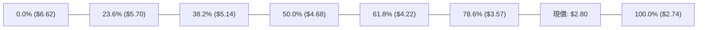

| 斐波那契回調位 | 對應價位 | 與現價關係 | 技術意義解讀 |
|----------------|----------|------------|--------------|
| **0.0% (52W High)** | $6.62 | +136.4% | 上行行情的極限起點。 |
| **23.6%** | $5.70 | +103.6% | 2025年秋季震盪平台下緣。 |
| **38.2%** | $5.14 | +83.6% | 弱勢修正分水嶺。 |
| **50.0%** | $4.68 | +67.1% | 多空中間樞紐位置。 |
| **61.8% (黃金分割)** | $4.22 | +50.7% | 2026年2月跌破後，已轉化為強大長期天花板。 |
| **78.6%** | $3.57 | +27.5% | 8月震盪密集區，日前跌破後確認深幅崩解。 |
| **100.0% (52W Low)**| $2.74 | -2.14% | 當前僅距此支撐 $0.06，跌破即創歷史級新低。 |

**現價位置解讀**：
當前價格 **$2.80** 位於 78.6% ($3.57) 與 100.0% ($2.74) 之間，極度逼近 100.0% 底線。在技術結構上，當 78.6% 深度回調位遭貫穿後，跌勢通常具有直奔 100.0% 測底的慣性。若 $2.74 被有效跌破（連續兩日收於其下），將引發停損賣盤連鎖反應。

---

## 5. 技術指標深度解讀

### 🎛️ 指標訊號總覽

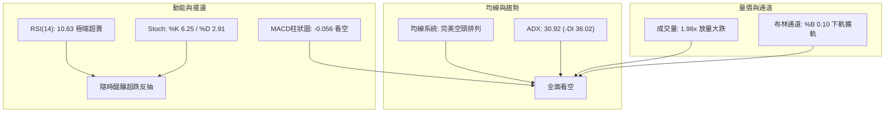

### 📈 移動平均線排列分析

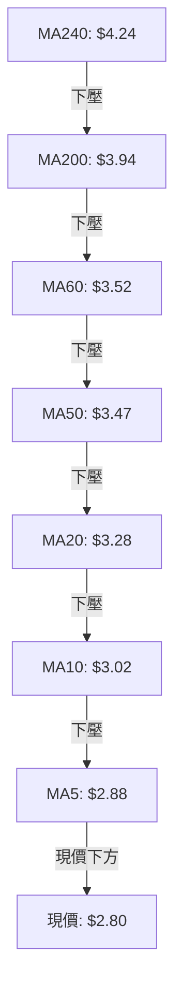

| 均線名稱 | 當前數值 | 現價差距 | 乖離率 | 斜率狀態 | 結構特徵 |
|----------|----------|----------|--------|----------|----------|
| **MA5** | $2.88 | -$0.09 | -2.99% | 陡峭向下 | 短線超跌但極為弱勢，5日線構成日內反彈首要壓制。 |
| **MA10** | $3.02 | -$0.22 | -7.37% | 陡峭向下 | 與整數關卡 $3.00 重疊，短線反抽之強阻力。 |
| **MA20** | $3.28 | -$0.48 | -14.72% | 持續走低 | 20日布林中軌，中期空頭防守陣線。 |
| **MA50** | $3.47 | -$0.67 | -19.31% | 加速下行 | 季度成本線，多頭已全面棄守。 |
| **MA60** | $3.52 | -$0.72 | -20.57% | 穩健下行 | 與原箱底 $3.50 共振，形成密集成交套牢區。 |
| **MA120** | $3.58 | -$0.78 | -21.93% | 緩步下行 | 半年線下行，長期壓制沉重。 |
| **MA200** | $3.94 | -$1.14 | -28.93% | 穩定下行 | 長期牛熊分界線，宣告股票處於熊市格局。 |
| **MA240** | $4.24 | -$1.44 | -34.02% | 下行 | 年線下壓，距現價逾 34%，修復難度極高。 |

**均線綜合結論**：所有週期均線（從5日至240日）呈現極為標準的空頭排列（MA5 < MA10 < MA20 < MA50 < MA60 < MA120 < MA200 < MA240），且股價全數運行於均線群下方，表明市場所有持倉週期投資人均處於實質浮虧狀態，上方套牢籌碼極其沉重。

### 📉 RSI(14) 分析

- **RSI(14) 讀數**：**10.63**
- **強度進度條**：
  ```
  RSI(14): [██░░░░░░░░░░░░░░░░░░] 10.63 (極度超賣 < 30)
  ```
- **超買超賣與鈍化評估**：
  RSI(14) 達到 10.63，屬於罕見的極端深度超賣（通常 <20 已屬非理性拋售，<15 則屬恐慌流動性擠兌）。在強烈空頭趨勢中（ADX=30.92），RSI 出現「指標鈍化」現象，超賣指標不再代表立即見底反轉，而是體現下跌動能過度宣洩。
- **背離分析**：
  經對比價格與指標，近期價格刷新低點（$3.05 → $2.80），RSI(14) 亦自 28.7 同步跳水至 10.63，**無底背離跡象**（價格創新低，指標亦創新低）。這意味著此波暴跌具有充沛的實質賣壓驅動，並非主力洗盤，背離買訊尚未出現。

### 📊 MACD(12/26/9) 訊號解讀

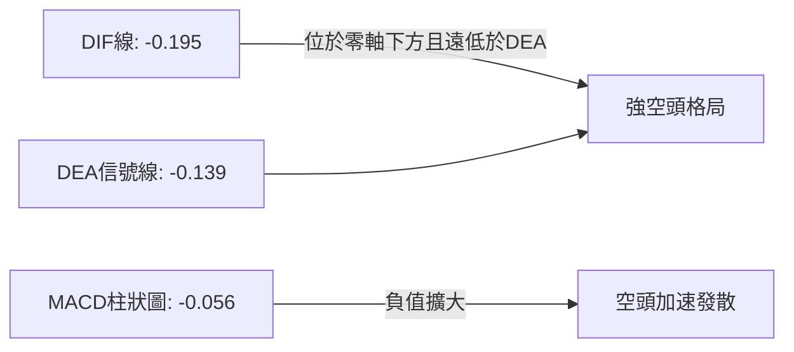

- **DIF (-0.195) vs DEA (-0.139)**：雙線在零軸下方進一步擴大差距，死亡交叉效應持續擴散。
- **Histogram (-0.056)**：柱狀體保持顯著負值且向下延伸，顯示當前下行加速度尚未見到收斂拐點。
- **背離檢驗**：週線級別 MACD 柱在 2026-09-13 為 -0.058，最新一週為 -0.056，雖有微幅走平跡象，但由於日線級別 DIF 呈現陡峭下挫，未出現明確的多頭背離結構。

### 📦 布林通道分析

```
GRAB 布林通道 (20日, 2.0σ) 現狀示意圖
$3.88 ┬────────────────────────────────────────── BB 上軌
      │
$3.28 ┼─────────────────── MA20 中軌 ───────────── BB 中軌
      │
$2.80 ┼───────● 現價 ($2.80, %B = 0.10)
$2.67 ┴────────────────────────────────────────── BB 下軌
```

- **布林帶寬與位置**：上軌 $3.88，中軌 $3.28，下軌 $2.67。
- **%B 指標**：僅為 **0.10**，價格緊密貼合下軌運作。
- **通道形態解讀**：布林帶出現顯著的「下軌擴口（Band Walking）」形態。當帶寬放大且價格壓著下軌推進時，屬於經典的「空頭突破推進模式」。現價雖未實質跌破下軌 ($2.67)，但極低的 %B 說明空方正將通道向下強行撐開。

### 💹 成交量分析（量價配合度）

```
成交量對比：
今日成交量 : [████████████████████] 105,430,000 股
20日均量   : [██████████░░░░░░░░░░] 53,369,105 股 (量比 1.98x)
50日均量   : [█████████░░░░░░░░░░░] 47,061,026 股
```

- **量價關係**：價格下跌 -8.20%（自 $3.05 至 $2.80），伴隨單日 1.054 億股巨量，量比高達 1.98 倍。量價呈現「價跌量增」的極端空頭順向形態，反映市場出現非理性殺跌與機構止損平倉盤。
- **OBV (能量潮)**：數據顯示「OBV < MA → 量能疲弱」。OBV 處於均線下方且持續創下近期新低，資金淨流出趨勢顯著，成交量完全印證了價格下跌的真實性，量價配合看空，無空頭衰竭背離特徵。

---

## 6. 動能與波動率

### ⚡ 動能評估四象限

| 象限 | 動能維度 | 波動維度 | 典型特徵 | 當前歸屬 | 行動方針 |
|------|----------|----------|----------|:--------:|----------|
| **Q1 (機會象限)** | 強多頭動能 | 低波動 | 穩健上升通道 | ✕ | 順勢做多 |
| **Q2 (震盪象限)** | 弱動能 | 低波動 | 窄幅盤整、方向不明 | ✕ | 觀望等待 |
| **Q3 (投機象限)** | 強動能 (多) | 高波動 | 暴漲行情、末升段 | ✕ | 減倉保利 |
| **Q4 (風險象限)** | **強空頭動能** | **高波動** | **加速破位、放量崩跌** | **✓ (GRAB)** | **避免接刀，順勢放空或空倉** |

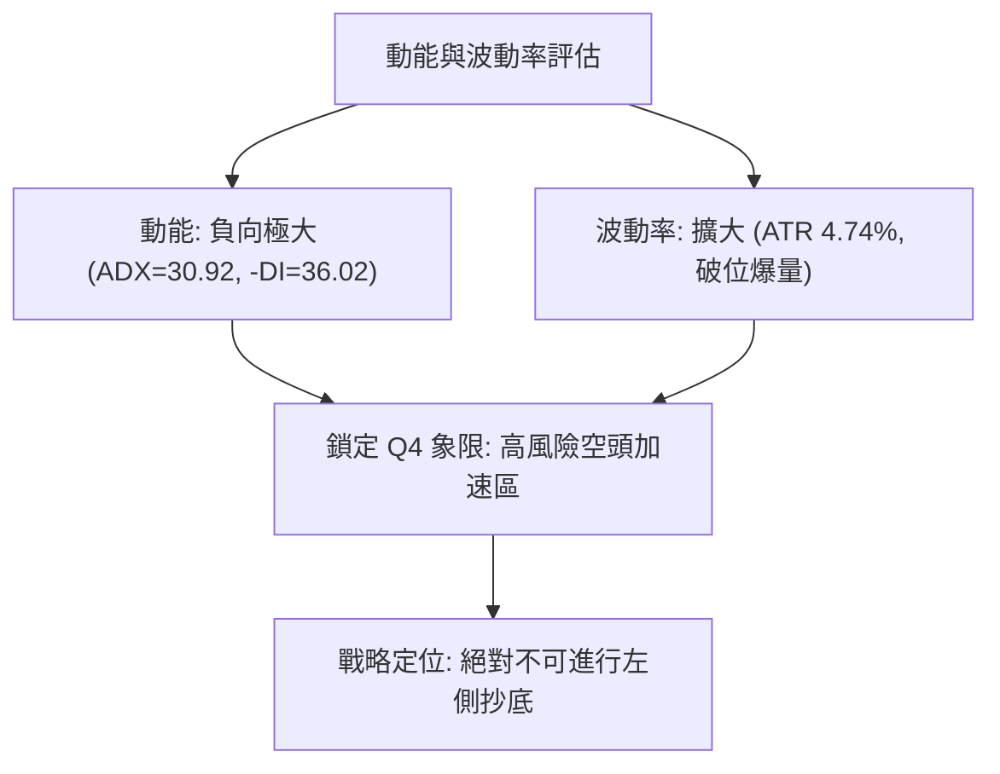

### 📊 ATR 波動率分析

- **ATR(14) 當前數值**：**$0.13**
- **波動率佔比**：ATR / 當前價格 = $0.13 / $2.80 = **4.74%**
- **實戰風控意涵**：
  GRAB 當前單日正常價格波動幅度即達到 4.74%，處於高波動狀態。
  - **超短線交易保護止損**：建議至少設定 1.5 倍 ATR，即 $0.13 × 1.5 = **$0.195**（約 $0.20）。
  - **波段空頭防守止損**：建議設定 2.0 倍 ATR，即 $0.13 × 2.0 = **$0.26**。
  - 此等波動率意味著任何以 $0.05 以內的緊密止損極易被日內噪聲掃出場，必須放寬止損區間並嚴格縮減部位規模。

### 📐 Beta 與市場相關性

- **Beta 係數**：**0.89**
- **市場屬性解析**：
  GRAB 的 Beta 值為 0.89，表面上對大盤（S&P 500）的系統性波動略有鈍化（非高貝塔極端投機股）。然而近期在大盤相對平穩的背景下，GRAB 單月跌幅超過 20%，顯示其已脫離大盤指數牽引，完全受其自身基本面轉折、籌碼鬆動或區域市場特有風險主導，呈現顯著的**個股非系統性下挫**。

---

## 7. 多時框架總結

### 📋 時框架評分表

| 時框架 | 趨勢方向 | 動能狀態 | 均線排列 | 圖表形態 | 綜合評分 | 建議方針 |
|--------|----------|----------|----------|----------|:--------:|----------|
| **長期 (月線)** | 🔴 強空 | 空頭延續 | 全面跌破半年/年線 | 雙頂成型破位 | 15/100 | 長期投資應減碼避險 |
| **中期 (週線)** | 🔴 強空 | 柱狀圖發散 | MA20/50 空頭排列 | 箱底 $3.50 爆量跌破 | 20/100 | 反彈皆為中級逃命波 |
| **短期 (日線)** | 🔴 極空 | RSI 極度超賣 | 全線空頭擴散 | 沿布林下軌暴跌 | 30/100 | 嚴禁猜底，等待短線修復 |

### 🔲 綜合訊號矩陣

```
時框架訊號收斂矩陣：
┌───────────┬──────────────┬──────────────┬──────────────┐
│ 分析維度  │ 長期 (月線)  │ 中期 (週線)  │ 短期 (日線)  │
├───────────┼──────────────┼──────────────┼──────────────┤
│ 趨勢方向  │ 🔴 熊市格局  │ 🔴 破位下殺  │ 🔴 加速趕底  │
│ 均線架構  │ 🔴 均線反壓  │ 🔴 空頭排列  │ 🔴 陡峭向下  │
│ 量能結構  │ 🔴 資金流出  │ 🔴 放量大跌  │ 🔴 爆量 1.98x│
│ 動能指標  │ 🔴 偏空運行  │ 🔴 MACD 發散 │ 🟢 RSI 超賣  │
│ 支撐驗證  │ 🔴 跌破平台  │ 🔴 無波段低點│ 🟡 臨 52W 低 │
└───────────┴──────────────┴──────────────┴──────────────┘
訊號一致性評估：90% 指標指向強烈看空，僅短期存在極端超賣的技術性反抽需求。
```

### ⚖️ 多時框收斂結論

依據多時框收斂規則（嚴格要求 14）：
1. **行情性質判定**：ADX(14) 數值為 **30.92 (>25)**，嚴格判定當前處於**強烈趨勢行情**。
2. **時框優先權**：在趨勢行情下，交易策略必須以中長期（週線/MA50、MA200）方向為依歸，日線超賣指標僅能用以觀察短線乖離或尋找逢高放空點，絕對不可作為逆勢做多的主導依據。
3. **唯一方向性結論**：**【強烈偏空】**。
   日線 RSI=10.63 的極端超賣與週線、月線的空頭破位產生表觀衝突，依收斂優先級，超賣必須讓位於強空頭趨勢。市場大概率以「弱勢橫盤消耗超賣指標」或「微幅反抽後再次探底」的方式進行演化。

---

## 8. 交易策略建議

### 🗺️ 策略決策流程圖

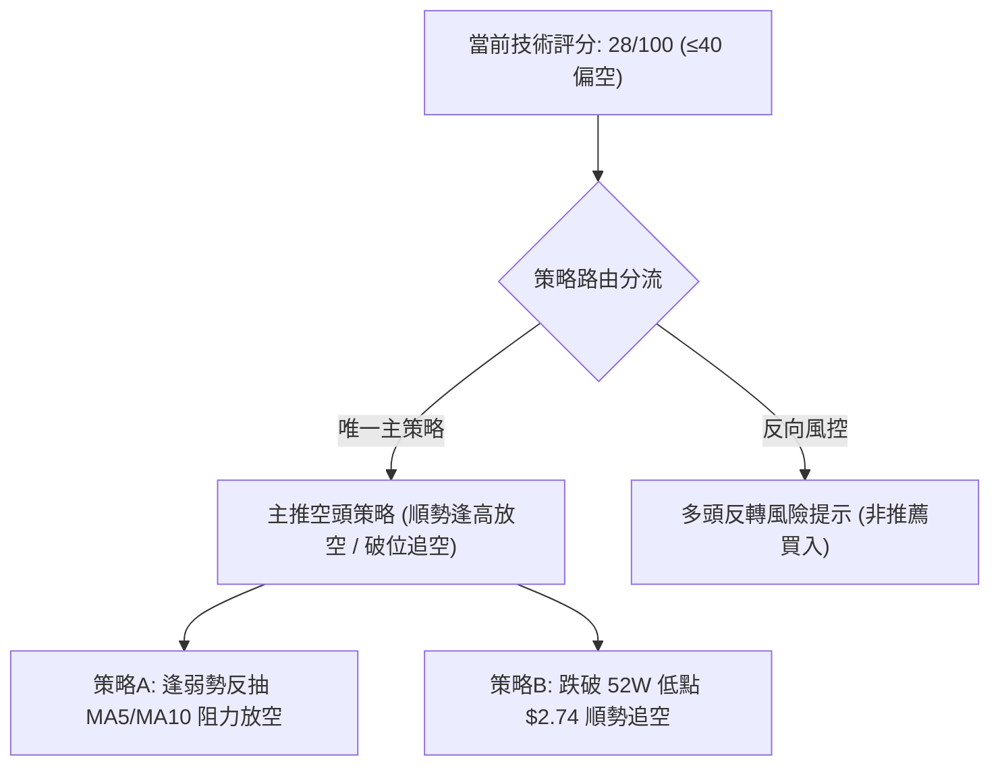

### 🧭 策略路由

> **當前主策略方向 = 【主推空頭策略】（依據綜合技術評分：28 / 100，處於 ≤40 之強烈偏空區間）**

### 🎯 價格情境階梯（Price Scenarios）

依據數據「關鍵價位」與「斐波那契」嚴格界定階梯點位：

| 觸發條件 | 第一目標 | 後續延伸 | 情境技術含義 |
|----------|----------|----------|--------------|
| **向上反抽站上 MA10 ($3.02)** | MA20 ($3.28) | 斐波78.6% ($3.57) / R1 ($3.64) | 極端超賣引發之死貓跳反抽，觸及均線反壓 |
| **維持於現價 $2.80 震盪** | 測試 $2.74 | 抵抗性橫盤 | 空頭動能暫歇，於 52W 低點前以盤代跌 |
| **向下帶量跌破 $2.74** | 支撐真空區 | 探尋歷史性新支撐 | 跌破 52 週最低點，技術面完全失守，引發恐慌拋售 |

### 📊 情境機率分佈

| 情境劇本 | 機率估計 | 主要技術指標依據 |
|----------|:--------:|------------------|
| **情境一：跌破 $2.74 延續暴跌** | **55%** | ADX=30.92 趨勢加速、量比 1.98x 爆量下殺、OBV 創低、近一年下方無波段支撐聚類。 |
| **情境二：於 $2.74～$3.02 弱勢築底** | **35%** | RSI(14)=10.63 極度超賣、Stoch %K=6.25，指標具備強烈鈍化修復需求。 |
| **情境三：強勢反彈重回 $3.28 以上** | **10%** | 全週期均線呈瀑布狀下壓，上方套牢盤龐大，無重大利多難以直接反轉。 |

### 🔴 主策略詳情（空頭交易策略）

所有價位均嚴格基於 ATR 與報告中之均線/關鍵價位推算：

| 策略要素 | 策略 A（反抽阻力放空 — 穩健型） | 策略 B（破位順勢追空 — 激進型） |
|----------|---------------------------------|---------------------------------|
| **策略類型** | 逢超賣反抽至均線反壓處進場 | 跌破 52 週歷史低點順勢破位放空 |
| **進場條件** | 價格反抽觸及 MA5 或逼近 MA10 滯漲時 | 帶量有效跌穿 52W 低點 $2.74 |
| **進場價格** | **$2.95** (MA5 $2.88 與 MA10 $3.02 之間) | **$2.72** (確認擊穿 $2.74 支撐) |
| **止損價格** | **$3.15** (突破 MA10 $3.02 加 1.0x ATR) | **$2.85** (重回 $2.74 突破點加 0.85x ATR) |
| **目標價 T1** | **$2.74** (測試 52W 低點) | **$2.50** (量度跌幅延伸整數心理關卡) |
| **目標價 T2** | **$2.50** (破底後空頭延伸目標) | **$2.30** (下行通道下軌推算位) |
| **風險報酬比** | **1 : 2.25** (風險 $0.20 / 報酬 $0.45 至T2) | **1 : 3.23** (風險 $0.13 / 報酬 $0.42 至T2) |
| **勝率預估** | 65% | 58% |
| **建議倉位** | 10% ～ 15% | 5% ～ 10% (嚴控破底假突破風險) |

### 🟢 反向風險觸發點（對沖提示）

若持有多頭部位或考慮避險對沖，須關注以下關鍵反轉訊號：
1. **第一空頭防線**：若日線強勢收盤站穩 **$3.02 (MA10)** 之上，說明超賣修復演變為實質波段反抽，空單應即刻獲利了結或平倉觀望。
2. **多空翻轉紅線**：若價格帶量收復 **$3.28 (MA20 / 布林中軌)**，空頭主跌結構遭到破壞，市場可能構築雙底或展開大級別震盪，此時空頭策略應全數撤銷。

### ⭐ 整體訊號強度評星

```
做多訊號強度：★☆☆☆☆  (1/5星 — 僅超賣指標支撐，逆勢風險極高)
做空訊號強度：★★★★☆  (4/5星 — 均線、動能、形態與量能高度共振)
整體可信度：  ★★★★☆  (4/5星 — 趨勢明確，ADX>25 提供高可信度)
```

---

## 9. 風險提示與監控

### ✅ 關鍵監控指標 Checklist

```
╔══════════════════════════════════════════════════════════════════╗
║                   GRAB 關鍵風險監控清單                          ║
╠══════════════════════════════════════════════════════════════════╣
║ [ ] 價位監控：52W 低點 $2.74 是否遭到單日收盤實質跌破             ║
║ [ ] 動能監控：RSI(14) 是否脫離 20 以下鈍化區並向上穿越 30        ║
║ [ ] 均線監控：日內價格是否觸碰下壓中的 MA5 ($2.88) 及 MA10 ($3.02)║
║ [ ] 量能監控：爆量下殺後次日是否出現「極致縮量」十字星或止跌孕線 ║
║ [ ] 籌碼監控：融券放空比率 (Short Float 7.6%) 是否引發軋空踩踏   ║
║ [ ] 波動監控：ATR(14) 是否持續超過 $0.13，暗示流動性匱乏         ║
╚══════════════════════════════════════════════════════════════════╝
```

### ⚠️ 風險場景分析

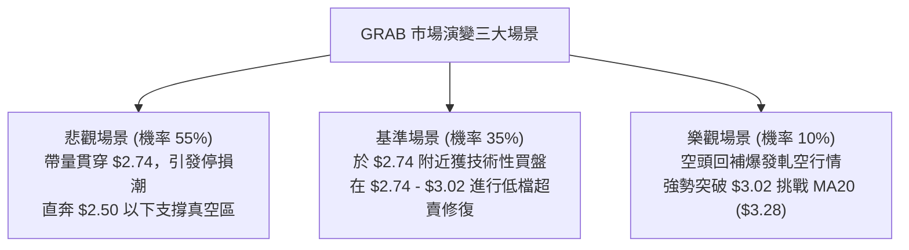

### 🛡️ 風險管理重要提醒

1. **嚴禁左側「摸底」**：
   儘管分析師共識目標價平均達 $5.82（最高甚至看至 $8.00），但技術面處於最兇猛的加速破位段。在技術分析紀律中，「基本面低估」絕非技術面介入的理由。在日線 MACD 出現黃金交叉或底背離結構前，任何左側抄底行為均面臨巨大的資金回撤風險。
2. **防範空頭軋空（Short Squeeze）**：
   目前 GRAB 融券放空佔浮動股比例達 7.6%（Short Ratio 6.77 天），伴隨 RSI 處於 10.63 的極低水平，一旦公司出現突發利多或大盤強勢帶動，容易誘發劇烈的空頭回補（Short Squeeze）。因此，**所有放空策略必須設置嚴格止損**，嚴禁無保護裸空。
3. **倉位限制**：
   考量 ATR 佔比達 4.74% 的高波動狀態，單筆交易之最大虧損金額應嚴格限制於總投資組合淨值的 **1.0%** 以內。

---

## 📋 報告總結

```
╔══════════════════════════════════════════════════════════════════╗
║                   GRAB 技術分析報告總結                          ║
╠══════════════════════════════════════════════════════════════════╣
║ 報告日期：2026-09-21                                             ║
║ 當前價格：$2.80 (距 52W 低點 $2.74 僅 2.14%)                     ║
║ 分析評級：🔴 強烈偏空 / 避免做多                                ║
╠──────────────────────────────────────────────────────────────────╣
║ 關鍵結論：                                                       ║
║ ├─ 長期趨勢：🔴 自 $6.02 高點回落，全均線空頭排列，熊市確立     ║
║ ├─ 中期趨勢：🔴 跌破 $3.50 長期箱體底線，量能暴增，破位成型     ║
║ ├─ 短期趨勢：🔴 ADX=30.92 強勢空頭主導，沿布林下軌加速下探      ║
║ ├─ 關鍵支撐：$2.74 (52週最低價；其下無任何近一年波段支撐聚類)    ║
║ ├─ 關鍵阻力：MA10 ($3.02) ｜ MA20 ($3.28) ｜ 箱底反壓 ($3.64)   ║
║ └─ 目標評價：分析師雖給予 $5.82，但技術面完全失守，以技術面為準 ║
╠──────────────────────────────────────────────────────────────────╣
║ 最優操作策略：                                                   ║
║ 1. 🥇 最佳機會：空倉觀望，切忌在 RSI 極端超賣下盲目接刀。        ║
║ 2. 🥈 次選機會：若有短線反抽至 $2.95～$3.02 阻力區，逢高放空。   ║
║ 3. 🥉 破位機會：帶量跌破 $2.74 順勢追空，下看 $2.50，嚴設止損。  ║
╚══════════════════════════════════════════════════════════════════╝
```

---

> ⚠️ **免責聲明**：本報告為技術分析研究，所有數據及推算均基於歷史價格與客觀技術指標。本報告**僅供研究與學術參考**，**不構成任何要約、招攬或投資建議**。金融市場具有高度風險，交易決策應由投資人自行獨立判斷並自負盈虧。

---

*報告生成時間：2026-09-21 ｜ 數據來源：Yahoo Finance ｜ 分析框架：多時框技術分析體系*